# AI数学：从起步到前沿

> **读者定位**：有高中数学基础、愿意动脑但讨厌装腔作势的小白
>
> **阅读位置**：核心三步的第一步；读完后建议按《基座模型》→《用好AI》继续。《扩散》是可选分支，可在本篇之后深入。
>
> **核心使命**：用人话讲清楚AI实践的数学基础
>
> **本篇视角**：从动力学看训练——训练是一场优化：在参数空间的损失面上，沿梯度方向反复调整，把误差一步步压低。本文的每一章，都在解决这场优化遇到的问题。

 * * *
## 目录

每一章都从一个问题出发，答案会引出下一个问题。下面的问题链就按这条思路的顺序展开；你可以按顺序读，也可以任选一章切入。

- 怎么让AI从错误中学习？ → [梯度下降（第1章）](#第1章优化基础——从下山到梯度下降)
- 训练模型总有约束——权重有上限、更新有幅度，梯度下降能应付吗？ → [拉格朗日乘子法（第2章）](#第2章拉格朗日乘子法——带着镣铐跳舞)
- AI 做分类要输出每个类别的概率，已知条件只有平均分等少数统计量——怎么推出最"诚实"的分布？ → [最大熵 → Softmax（第3章）](#第3章最大熵softmax交叉熵——不确定世界的诚实选择)
- 模型预测不准，百万参数谁该负责？ → [反向传播（第4章）](#第4章mlp前向与反向传播——犯错的追责链)
- 模型怎么学会关注输入里的重点？ → [Attention（第5章）](#第5章attention机制——动态加权平均)
- Attention 这个零件懂了，怎么组装成完整的语言模型？ → [从Attention到语言模型（5.10）](#510-从attention到语言模型组装全景)
- 模型拼好了，但Attention矩阵太大，怎么瘦身？ → [低秩（第6章）](#第6章低秩的世界——从svd到高效ai)
  - 低秩的数学与 LoRA → [Part A](#part-a低秩的数学与-lora)
  - 高效 AI 的工程拼图 → [Part B](#part-b高效-ai-的工程拼图)
- 前六章的数学基础能解释哪些前沿？ → [前沿展望（第7章）](#第7章前沿展望)
- 自检题卡住了？提示与答案在文末 → [附录：自检问题与答案](#附录自检问题与答案)
- 六章工具链的因果关系与跨章连线 → [附录：逻辑链](#附录逻辑链)
- 正文引用的全部论文，按章节汇总 → [附录：参考文献](#附录参考文献)

 * * *
# 第1章：优化基础——从下山到梯度下降

> 梯度下降就是先看脚下哪个方向下坡最陡（**负梯度方向**），然后朝那个方向迈一小步（**受控的线性试探**），一步步逼近这座山的最低点。

> **本章路线**：先建立梯度下降直觉（迷雾下山、动手算一个碗、步长之争），再用 Adam 处理"每个方向步长不同"，接着看局部极小/鞍点与学习率调度，最后收束。时间紧可先读直觉与 Adam，再回来补调度。

> **核心概念**：
> 1. 梯度指向最陡上坡，下山要沿负梯度方向迈小步。
> 2. 学习率决定步子大小：太大震荡，太小蜗牛。
> 3. Adam 用梯度历史给每个方向自适应步幅，解决"一个学习率管所有方向"的难题。
> 4. 高维里梯度为零的点多是鞍点，不是全局最优；动量能帮逃离。

> **动笔前自检**：①你会算 $f(x)=x^2$ 在 $x=3$ 处的导数吗？②"下山"时，为什么不能直接朝最低点的方向走？带着你的猜测往下读，答案就在本章逐步展开。

 * * *
## 1.1 怎么在迷雾中下山

想象你站在一座山的山顶，四周大雾弥漫，能见度不足一米。你看不见山脚下的路，也望不到远处的山谷山峰。你的任务是尽快到达这座山的最低点——该怎么办？

你静下心来，感受脚下的坡度。**梯度** $\nabla f$ 就像一根指向山上方向的箭头，要下山就必须逆着它走，也就是沿着负梯度 $-\nabla f$ 的方向。但你绝不能撒腿狂奔，因为线性近似只在脚下的小范围内成立——近处的坡度近乎不变，可跑远了就不是这样了。你只能小心翼翼地迈出一小步，停下重新感受坡度，再迈一小步，如此反复，逐步逼近山脚的平地。

不过，梯度下降并不能保证你抵达的是全局最低点，它可能只是一个局部洼地。

 * * *
## 1.2 从一个最简单的"碗"开始

在数学里，我们要把"山"翻译成"函数"。先从最简单的函数说起：

$$f(x) = x^2$$

这里的 $f(x)$ 可以看作你的"海拔高度"，$x$ 是你当前的水平位置。这个函数的图像像一个开口向上的碗，最低点在 $x = 0$ 处，那里的海拔是 $f(0) = 0$。你的目标就是找到这个碗底。

### 1.2.1 梯度：指向上坡的箭头

在大雾中，你靠"摸地面"来判断方向。在数学里，这个"坡度"就是导数：

$$\nabla f(x) = f'(x) = 2x$$

**重要**：$\nabla f(x)$ 读作"函数 $f$ 在 $x$ 处的梯度"（符号 $\nabla$ 读作 nabla）。它指向海拔**上升**最快的方向——**上坡**，不是下坡！当 $x > 0$ 时，梯度为正——箭头指向右边，那里是上坡，你要下山就往左走；当 $x < 0$ 时，梯度为负——箭头指向左边，那里同样是上坡（碗的左半边，越往左越高），你要下山就往右走。梯度的本质永远指向上坡，所以下山的方向永远是它的反方向 **$-\nabla f(x)$**。

### 1.2.2 更新规则：负梯度方向的小步试探

梯度下降的核心更新公式是：

$$x_{\text{new}} = x_{\text{old}} - \eta \cdot \nabla f(x)$$

逐项拆解：$x_{\text{old}}$ 是你现在的位置，$\eta$（读作"eta"，希腊字母）是你的**步幅控制因子**——在机器学习中叫"学习率"（learning rate）。$\nabla f(x)$ 是当前位置的梯度（指向上坡）。公式中的"减"号就是关键的**负梯度方向**：你沿着梯度指向的反方向走，这才是下坡。

 * * *
## 1.3 动手算一遍：从 $x_0 = 3$ 走到碗底

取初始位置 $x_0 = 3$（站在碗的右半边，海拔 $f(3) = 9$），学习率 $\eta = 0.3$。

**第 1 步**。$\nabla f(3) = 2 \times 3 = 6$。梯度为 6，指向**上坡**（右边更高）。沿**负梯度方向**更新：

$$x_1 = 3 - 0.3 \times 6 = 1.2$$

海拔从 9 降到 $f(1.2) = 1.44$。

**第 2 步**。$\nabla f(1.2) = 2.4$，仍指向上坡。$x_2 = 1.2 - 0.3 \times 2.4 = 0.48$。海拔 $f(0.48) = 0.2304$。

**第 3 步**。$x_3 = 0.48 - 0.3 \times 0.96 = 0.192$。海拔 $f(0.192) \approx 0.037$。

**第 4 步**。$x_4 = 0.192 - 0.3 \times 0.384 = 0.0768$。海拔 $f(0.0768) \approx 0.006$。

规律：每一步 $x$ 变小，越来越接近 0。梯度大的地方步子大，梯度小的地方步子小，逐步逼近碗底。

下图直观展示了上述过程：左图是 $f(x)=x^2$ 上的梯度下降路径，从 $x_0=3$ 出发沿负梯度方向一步步滑向碗底；右图显示 $x$ 的值随迭代快速收敛到 0。

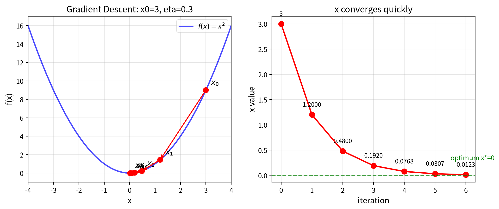

**图1**：左图展示从 $x_0=3$ 出发，以 $\eta=0.3$ 沿负梯度方向（红色箭头）逐步逼近碗底的路径，$x_0 \to x_1 \to x_2 \to \cdots$；右图显示 $x$ 的值随迭代步数呈指数级收敛，4步后海拔已降千分之一以下，6步后逼近最优解 $x^*=0$。

 * * *
## 1.4 学习率：步子到底该迈多大

### 1.4.1 $\eta$ 太大：线性近似失效，疯狂震荡

$\eta = 1.0$，$x_0 = 3$。

第 1 步：$x_1 = 3 - 1.0 \times 6 = -3$。直接从碗右边跳到左边！第 2 步：$x_2 = -3 - 1.0 \times (-6) = 3$。又跳回右边。

$x$ 在 3 和 $-3$ 之间**无限弹跳**，海拔永远降不下来。

**关键理解**：这不是"跳过了山谷"，而是**线性近似失效**。梯度 $2x$ 只在 $x$ 附近有效（线性近似），当 $\eta = 1.0$ 时，更新步长远超线性近似的有效范围，算法看到的"坡度"在新位置完全不同，导致来回震荡。

### 1.4.2 $\eta$ 刚好：稳定收敛

把 $\eta$ 从 1.0 降到 0.3，弹跳消失了——4 步让海拔降到初始的千分之一以下。

### 1.4.3 $\eta$ 太小：慢如蜗牛

$\eta = 0.01$，$x_1 = 3 - 0.01 \times 6 = 2.94$。挪了 0.06，几乎原地踏步。约 500 步才能接近碗底——训练从天变成月，项目等不起。

下图对比三种学习率的效果：太大则在碗两边来回震荡（左），刚好则4步收敛到千分之一（中），太小则需500步才能接近碗底（右）。

### 1.4.4 最优步长是多少

三种情况看完了，自然的问题：**0.3 是怎么选的？** 不是试出来的，背后有一个更深的道理。

$f(x) = x^2$ 的梯度是 $2x$——那个系数 2 就是碗壁的**曲率**：坡度变化有多快。曲率大，碗壁陡然翻转，线性近似有效范围窄，步子必须小；曲率小，坡度变化平缓，可以迈大步。一维二次碗的最优步长恰好是**曲率的倒数** $\eta = 1/2 = 0.5$——一步直达坑底：$x_1 = 3 - 0.5 \times 6 = 0$。那为什么选 0.3 而不是 0.5？因为真实函数不是完美的 $x^2$ 碗，曲率处处不同——损失面各处陡缓不一，得按最陡处留出安全余量，不能卡着理论极限走（推导见折叠的严格版）。

<details>
<summary><b>严格版：怎么量化"最大曲率"？（选读，跳过不影响后续）</b></summary>

用**光滑性**。如果函数的梯度本身不会突变——梯度的变化率有上界 $L$（梯度 Lipschitz 常数，即 $|\nabla f(x) - \nabla f(y)| \leq L\|x - y\|$），那么步长 $\eta \leq 1/L$ 能保证每步都让损失下降。这一结论来自下降引理：$f(x-\eta\nabla f) \le f(x) - \eta\|\nabla f\|^2 + \frac{L\eta^2}{2}\|\nabla f\|^2$，当 $\eta \leq 1/L$ 时右端 $\le f(x)$。$L$ 就是"坡度变化最快有多快"——$f(x) = x^2$ 的 $L = 2$（梯度 $2x$ 的变化率恒为 2），所以 $1/L = 0.5$ 与上面的曲率倒数完全一致。

</details>

直觉总结：**梯度告诉你坡有多陡，曲率（光滑性常数 $L$）告诉你坡弯得有多快，最优步长是 $1/L$**。坡弯得越急（$L$ 大），线性近似失效越快，步子越要小。

但实践中你通常不知道 $L$——真实损失函数有上亿个参数，曲率处处不同，精确计算 $L$ 比解决原问题还贵。这就是为什么 §1.5 的 Adam 不去算曲率，而是用**梯度历史**间接估计：哪个方向梯度一直大（暗示曲率高），就缩小那个方向的步幅；哪个方向梯度一直小（暗示曲率低），就放大。**自适应优化器的本质，是在不知道 $L$ 的情况下，用数据驱动的方式逼近 $1/L$。**

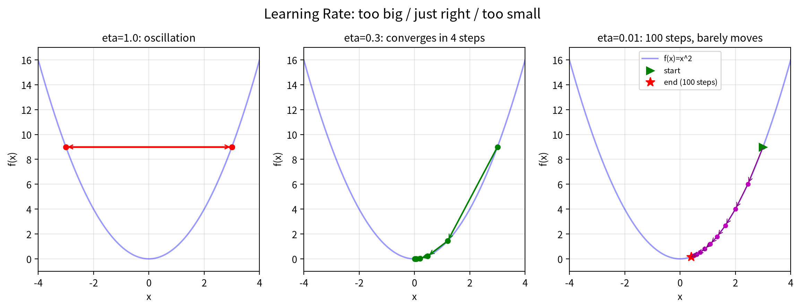

**图2**：左：$\eta=1.0$ 时线性近似失效，参数在 3 和 $-3$ 之间无限震荡；中：$\eta=0.3$ 时稳定收敛，4步降至千分之一以下；右：$\eta=0.01$ 时对数坐标下需约500步才能接近碗底。选择合适的学习率是训练神经网络的第一门手艺。

 * * *
## 1.5 自适应优化器：Adam

### 为什么一个学习率不够

朴素梯度下降的更新公式 $x_{\text{new}} = x_{\text{old}} - \eta \cdot \nabla f(x)$ 用一个 $\eta$ 管所有参数方向。在 $f(x) = x^2$ 这种一维问题上，这没问题。但真实神经网络的参数空间有上亿维，不同参数方向的"地形"弯曲程度可能差几个数量级：某个方向像广场一样平缓（曲率小），另一个方向像峡谷一样陡窄（曲率大）。

固定学习率同时走这两个方向——在陡窄方向，步子稍大就来回撞壁；步子再大，损失值会雪崩式增长，训练直接炸掉。在平缓方向，同样的步长又太小，参数几乎不动。朴素梯度下降取一个折中的 $\eta$，本质上是在"炸掉"和"爬不动"之间妥协。

§1.4 的最优步长分析说 $\eta \leq 1/L$，而曲率 $L$ 在不同方向上不同。能不能让每个方向有自己的步长？

### Adam 的核心思想

Adam 用**指数移动平均**（EMA）为每个方向单独估算"合适的步幅"。

核心只做一件事：为每个方向维护一个"梯度幅度的近期记忆" $v_t$：

$$v_t = \beta_2 v_{t-1} + (1-\beta_2)g_t^2$$

逐符号拆解：

- $g_t$：第 $t$ 步算出的梯度（沿这个方向当前有多陡）
- $g_t^2$：梯度幅度的平方（负数平方后变正，只看"有多陡"不看方向）
- $v_{t-1}$：上一步的记忆值（初始为 0）
- $\beta_2$（读作"beta二"）：衰减系数，$0.999$ 表示"记住 99.9% 的旧信息，混入 0.1% 的新梯度"

步幅 = $\eta / \sqrt{v_t + \epsilon}$。$\epsilon$（读作"epsilon"）是一个极小的数（如 $10^{-8}$），防止分母为零。$v_t$ 大的方向（梯度历史波动大），分母大，步幅自动缩小；$v_t$ 小的方向，分母小，步幅自动放大。

旧梯度权重按 $\beta_2^{t-i}$ 指数衰减（$\beta_2 = 0.999$ 时，1000 步前的梯度权重已降到约 37%），所以 $v_t$ 只反映**近期**的梯度幅度，不会随训练时间无限膨胀。如果直接把所有历史梯度平方累加做分母，训练越久分母越大，有效步幅 $\eta/\sqrt{v_t}$ 趋零——被历史淹没。EMA 让分母"只记最近"，训练后期步幅仍然有意义。

> **先记住这个**：Adam 的核心就一句话——**用梯度幅度的近期记忆 $v_t$ 自动调节每个方向的步幅**。梯度一直大的方向走小步，梯度一直小的方向走大步。下面的数字演示和完整公式都是在验证和补充这一个想法。

理解了机制，下面用数字验证。先看 Adam 的公式怎么一步步变成表格里的数字。

数字演示的场景（下一小节定义）：损失函数 $f(w_1, w_2) = w_1^2 + 100w_2^2$，起点 $w = [10, 1]$。起点处 $w_2$ 方向梯度 $g_2 = 2 \times 100 \times 1 = 200$，$w_1$ 方向只有 20——两个方向梯度量级差10倍。

**手推 $w_2$ 方向第1步**：梯度 $g_1 = 200$，初始 $v_0 = 0$。

- $v_1 = 0.999 \times 0 + 0.001 \times 200^2 = 40$
- 偏置校正：$40 / (1 - 0.999) = 40000$（初始阶段分母接近 0，校正量很大）
- 步幅：$0.1 / \sqrt{40000} = 0.0005$（$\epsilon$ 小到可以忽略）
- 实际变化：$0.0005 \times 200 = 0.1$

所以表格里 $w_2$ 的第一步更新是从 1.00 变成 0.90。梯度 200 的方向，Adam 把有效步幅压到了和梯度 20 的方向一样——这就是"自适应"。

### 数字演示：两个方向，梯度差10倍

考虑损失函数 $f(w_1, w_2) = w_1^2 + 100w_2^2$，起点 $w = [10, 1]$。两个方向的梯度量级差10倍：$w_1$ 方向梯度只有20，$w_2$ 方向梯度有200。

**朴素梯度下降** $\eta = 0.01$：

| 步数 | $w_1$ | $w_2$ | $\nabla_{w_1}$ | $\nabla_{w_2}$ | $\Delta w_1$ | $\Delta w_2$ |
|------|--------|--------|-----------------|-----------------|---------------|---------------|
| 0 | 10.00 | **1.00** | 20 | 200 | -0.20 | -2.00 |
| 1 | 9.80 | **-1.00** | 19.6 | -200 | -0.20 | +2.00 |
| 2 | 9.60 | **1.00** | 19.2 | 200 | -0.19 | -2.00 |
| 3 | 9.41 | **-1.00** | 18.8 | -200 | -0.19 | +2.00 |

$w_2$ 在 +1 和 -1 之间疯狂弹跳，因为 $\eta = 0.01$ 对梯度200的方向来说太大了。同时 $w_1$ 每步只挪0.2——梯度20太小，$\eta = 0.01$ 对它又太保守了。**一个 $\eta$ 无法同时满足两个方向。**

**Adam** $\eta = 0.1, \beta_1 = 0.9, \beta_2 = 0.999$：

| 步数 | $w_1$ | $w_2$ | $\nabla_{w_1}$ | $\nabla_{w_2}$ | 实际步长 $w_1$ | 实际步长 $w_2$ |
|------|--------|--------|-----------------|-----------------|-----------------|-----------------|
| 1 | 10.00 | 1.00 | 20 | 200 | 0.100 | 0.100 |
| 2 | 9.90 | 0.90 | 19.8 | 180 | 0.100 | 0.100 |
| 3 | 9.80 | 0.80 | 19.6 | 160 | 0.100 | 0.099 |
| 4 | 9.70 | 0.70 | 19.4 | 140 | 0.100 | 0.098 |
| 5 | 9.60 | 0.60 | 19.2 | 120 | 0.100 | 0.096 |

关键对比：$w_2$ 方向的梯度从200降到120，但实际步长始终维持在0.1附近。Adam 用 $\eta/\sqrt{v_t}$ 把梯度200的方向自动缩小到0.1步长，梯度20的方向也自动校准到0.1步长。**两个方向步长相当，都不震荡、都不停滞。**

### 完整公式

**完整的 Adam**在上面的自适应步幅之外，还加了两个配件：

1. **动量**。用 EMA 估计梯度的**一阶矩**（平均坡度）$m_t = \beta_1 m_{t-1} + (1-\beta_1)g_t$，让优化器带着惯性走。

   逐符号拆解：

   - $m_t$：第 $t$ 步的"速度"（累积的历史方向）
   - $m_{t-1}$：上一步的速度（初始为 0）
   - $g_t$：当前梯度（新的推力）
   - $\beta_1$（读作"beta一"）：惯性系数，$0.9$ 表示"保留 90% 旧速度，混入 10% 新推力"

   手推一个简单例子。假设连续 3 步梯度都是 $+1$（顺坡而下），第 4 步突然遇到 $-0.5$（小坑）：

   | 步数 | 梯度 $g_t$ | 无动量速度 | 有动量速度 $m_t$ |
   |---------|-----------|-----------|---------------|
   | 1 | $+1$ | $1$ | $0.1$ |
   | 2 | $+1$ | $1$ | $0.19$ |
   | 3 | $+1$ | $1$ | $0.271$ |
   | 4 | $-0.5$ | $-0.5$ | $0.194$ |
   | 5 | $+1$ | $1$ | $0.275$ |

   无动量时第 4 步直接回退（速度变负）；有动量时，前面累积的速度帮参数**冲过小坑**，速度只是从 $0.271$ 降到 $0.194$，仍保持前进。这就是 Adam 里的惯性。

2. **偏置校正**。初始阶段 $v_t$ 和 $m_t$ 被零初始化向量拖累，需要用 $m_t/(1-\beta_1^t)$ 和 $v_t/(1-\beta_2^t)$ 校正。训练前几步校正量较大，随着 $t$ 增大趋近于 1。

结果：梯度大的方向小步走，梯度小的方向大步走，且步幅不会随训练时间衰减到零。每个参数都公平参与更新，不会因为某个参数碰巧在某一步梯度特别大就抢占了所有步幅。

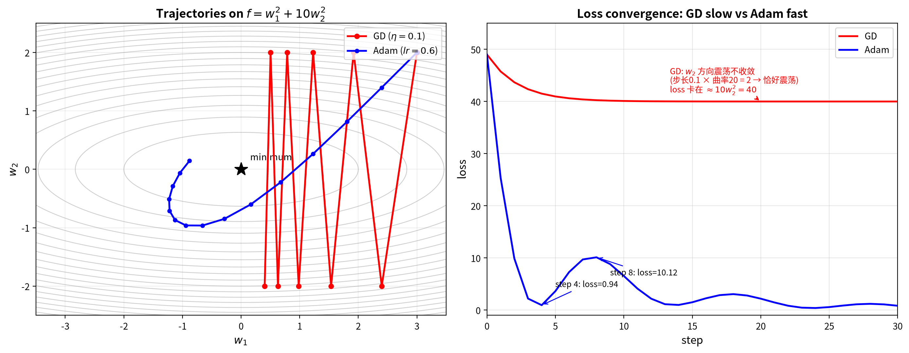

**图3**：损失函数 $f(w_1, w_2) = w_1^2 + 10w_2^2$（图中用系数10以便可视化；正文数字演示用系数100，原理相同）。GD 取 $\eta=0.1$（步长 0.1 $\times$ $w_2$ 方向曲率 20 = 2，恰好让 $w_2$ 在 $\pm 2$ 之间震荡——这是**临界步长**，用来展示固定学习率顾此失彼）；Adam 取 $lr=0.6$（配合动量快速收敛）。两个学习率各自独立调试，没有换算关系——这恰恰说明 Adam 的自适应步幅让它能用大得多的有效学习率。左图：红色轨迹（朴素GD）在 $w_2$ 方向每步精确反转——$w_2$ 永远在 2 ↔ -2 之间来回跳，$w_2$ 方向的损失分量（$10w_2^2 = 40$）永远降不下来（条件适当的 $w_2$ 学习率应为 0.05，但那会让 $w_1$ 方向几乎停滞）；蓝色轨迹（Adam）螺旋收敛至谷底，自适应步幅自动协调两个方向。右图是损失收敛对比：GD 的红线从 49 缓慢下降但趋近 40 后几乎不再降低，Adam 的蓝线虽有动量过冲但仍快速收敛至零。

细看右图 Adam 的 loss 曲线：step 4 降到 0.94 后反弹到 step 8 的 10.12，然后才稳定下降。这不是 bug，而是**动量过冲**——$w_2$ 在 step 4 穿越零点时梯度已经反转，但动量 $m_t$ 是梯度的低通滤波器（$\beta_1=0.9$ 意味着旧梯度权重达90%），方向切换比梯度慢好几拍，把 $w_2$ 推到了 -0.96 才刹住车。在简单二次型上动量是纯负担（过冲），它的价值在复杂损失面：穿越平坦区、冲过小坑、逃离鞍点。如果去掉动量（$\beta_1=0$，即 RMSProp），这条曲线会变成从 49 单调下降到 0 的平滑弧线，零起伏。

**一句话总结**：朴素梯度下降用一个 $\eta$ 管所有方向——梯度大的方向震荡，梯度小的方向停滞。Adam = 自适应步幅（$\eta/\sqrt{v_t}$）+ 动量（$m_t$）+ 偏置校正，三者配合让优化比朴素梯度下降快得多、稳得多。

 * * *
Adam 归一化的是**同一层内不同参数方向**的梯度尺度差异。后面 Ch4 会讲到另一个层面的归一化：**归一化层**（LayerNorm / RMSNorm）归一化的是**层与层之间**的激活值尺度差异——防止数值经过几十层矩阵乘法后滚雪球式爆炸或消失。两者作用面不同，互补而非替代：归一化层稳定层间梯度流，Adam 调节方向间步长。现代深度网络两者都用。

### Muon：从标量自适应到矩阵自适应

Adam 的自适应步幅 $\eta/\sqrt{v_t}$ 为**每个标量参数**单独调节步长。但神经网络的权重是**矩阵**（如 Attention 的 $W_Q, W_K, W_V$——Query/Key/Value 投影矩阵，见 Ch5；FFN 的 $W_1, W_2$），矩阵有比标量更丰富的结构——它有奇异值谱（矩阵"拉伸各个方向"的幅度列表，Ch6 会详细讲）。Adam 把矩阵展平成一堆标量逐个处理，丢掉了这层结构信息。

打个比方：Adam 像逐个工位调转速——哪个工位振动大（梯度大）就给它降速，哪个工位安静就给它加速（标量自适应）。但这条流水线上，不同工位之间的协作关系（矩阵的奇异值谱结构）它看不见——如果整条线只有一个方向在转、其他全停了，Adam 不会发现，因为它只盯着每个工位自己的转速表。

Muon 给出一个新思路：**不逐标量缩放，而是在矩阵层面把动量正交化**。^[1]^具体做法分两步：

**第一步：正交化动量**。拿 Adam 算出的动量矩阵 $M_t$（动量矩阵：Adam 的一阶矩 $m_t$，形状和权重矩阵一样，是梯度历史的指数滑动平均），对它做一次**正交化**——把矩阵的奇异值全部拉成 1，只保留方向信息。

这里需要一点 Ch6 的前置知识。任何矩阵 $A$ 都可以做 SVD 分解：$A = U\Sigma V^T$，其中 $U, V^T$ 是旋转（正交矩阵），$\Sigma$ 是拉伸（对角线上是奇异值 $\sigma_1 \geq \sigma_2 \geq \cdots$）。正交化就是把 $\Sigma$ 替换成 $I$（单位矩阵），只留 $UV^T$——把"旋转+拉伸"变成"纯旋转"，所有方向等强度。

实际工程用 **Newton-Schulz 迭代**近似完成正交化，不需要做真正的 SVD（SVD 太贵）。从 $X_0 = M_t / \|M_t\|_F$（先归一化到 Frobenius 范数为 1；Frobenius 范数 $\|A\|_F$ 是矩阵所有元素平方和的平方根，即"矩阵的整体大小"）出发，迭代：

<details>
<summary><b>为什么 5 次就够了？（证明细节，选读）</b></summary>

$$X_{k+1} = \frac{3}{2}X_k - \frac{1}{2}X_k X_k^T X_k$$

迭代对奇异值做了同一件事。设 $X_k$ 的 SVD 为 $U\Sigma_k V^T$，代入迭代公式，$U$ 和 $V^T$ 不变，只有奇异值在变：

$$\sigma_{k+1} = \frac{3}{2}\sigma_k - \frac{1}{2}\sigma_k^3$$

这是一个标量多项式 $g(\sigma) = \frac{3}{2}\sigma - \frac{1}{2}\sigma^3$。它有两个不动点：$g(0) = 0$（不稳定）和 $g(1) = 1$（稳定）。当 $\sigma \in (0,1)$ 时 $g(\sigma) > \sigma$（往上推），当 $\sigma > 1$ 时 $g(\sigma) < \sigma$（往下压）——无论起始值多少，所有奇异值都被推向 1。例如起始奇异值 0.3，5 次迭代后达到 0.996，6 次后达到 0.99997——足够接近正交矩阵。每步只需几次矩阵乘法，比精确 SVD 快得多。

</details>

**第二步：重缩放**。正交化后的 $\tilde{M}_t$ 的 RMS（均方根）和原始 Adam 更新不同，需要缩放回与 AdamW（Adam 加权重衰减 weight decay，LLM 预训练的长期默认优化器）相当的有效步长，保证训练稳定性。

**为什么正交化有效？** Adam 的一个已知失败模式是：当权重矩阵的奇异值谱严重倾斜（少数 $\sigma_i$ 远大于其他），Adam 的更新会**坍缩到低秩子空间**——梯度能量集中在少数几个奇异值方向上，其他方向的参数几乎不更新。正交化把所有奇异值拉平为 1，强制更新均匀覆盖所有方向，防止这种坍缩。用刚才的比喻：Muon 不只调每个工位的转速，还要求所有方向同时运转——不允许一个方向飞转而其他方向停摆。

实测效果：根据论文的 scaling law 实验，相同验证损失下 Muon 只需约 AdamW 一半的计算量（约 52% 的 FLOPs，约 2 倍计算效率），规模越大收益越明显。

Muon 已被多个万亿参数级模型采用：Kimi K2（1T 总参数）提出 **MuonClip**——在 Muon 基础上加入 QK-Clip 技术（约束注意力 logits 上限，防止训练尖峰；Q/K 见 Ch5）约束注意力 logits，实现 15.5 万亿 token 预训练零损失尖峰；DeepSeek-V4 Pro（1.6T 总参数）在技术报告中明确采用 Muon。但 Muon 只作用于隐藏层的二维权重矩阵（$W_Q, W_K, W_V$、FFN 的 $W_1, W_2$）；嵌入层、输出投影和标量参数仍回退到 AdamW——因为这些参数不是二维矩阵，没有奇异值谱可言。Muon 的优势集中在**大规模预训练**；对 LoRA 微调（低秩适配，Ch6 讲）、小规模训练和 RL 训练（PPO/GRPO，强化学习算法，Ch3 提到），AdamW 仍是更稳妥的默认选择。

> **跨章前瞻**：Muon 正交化的数学基础——SVD 分解和奇异值谱——将在 Ch6 系统讲解。Ch1 这里你只需理解：矩阵有比标量更丰富的结构，正交化是利用这种结构改进优化的手段。

**其他前沿优化器**。Muon 之外还有几条路线在探索"比 Adam 更好"：

- **Lion**：砍掉 Adam 的二阶矩估计 $v_t$，只用动量 $m_t$ 的符号做更新——$x_{t+1} = x_t - \eta \cdot \text{sign}(m_t)$。参数量更小、更快，但在 LLM 预训练上稳定性不如 AdamW，目前主要用于视觉模型。^[2]^
- **Shampoo**：不像 Adam 逐标量缩放，而是为每个参数矩阵维护两个 Kronecker 因子 $L$ 和 $R$（分别近似梯度的左、右协方差），用 $L^{-1/4} G R^{-1/4}$ 做预处理。^[3]^思路和 Muon 类似——利用矩阵结构——但用二阶统计量而非正交化。计算比 Muon 更贵。
- **Schedule-Free**：消除学习率调度这一超参数。不维护动量，而是在当前参数和平均参数之间做插值，理论上不需要 warmup 和 decay。赢得了 MLCommons 2024 AlgoPerf 算法效率挑战赛；NeurIPS 论文进一步证明它在 LLM 预训练中无需 decay 阶段即可沿损失面的"河流"结构有效收敛。^[4]^

这些路线的共同目标：Adam 把矩阵展平成标量逐个处理，丢掉了矩阵结构信息；Lion 用符号简化、Shampoo 用 Kronecker 因子、Schedule-Free 用平均插值、Muon 用正交化——各自从不同角度找回这层信息。

从固定学习率（朴素梯度下降）→ **标量自适应**（Adam）→ **矩阵自适应**（Muon），优化器从"一个 $\eta$ 管所有方向"进化到"每个方向有自己的步幅"，再进化到"矩阵整体保持方向均衡"。但即便方向找对了，还有一个更狡猾的陷阱在等着你——

## 1.6 局部最小值与鞍点

$f(x) = x^2$ 只有一个碗底，但真实世界的函数有起伏。考虑：

$$f(x) = x^4 - 4x^2 + 2$$

它有两个"山谷"——$x = -\sqrt{2}$ 和 $x = \sqrt{2}$，深度一样（对称双井），中间隔着一个"山丘"（$x=0$ 处的局部最大值）。梯度下降的策略依然是"沿负梯度方向小步试探"，但如果你从右边出发，很可能滑进右边的**浅坑**就停住了——坑底梯度为零（地面平坦），算法以为"到山脚了"。可左边的山谷同样深，你却到不了。

这就是**局部最小值**困境。梯度下降只保证：你走到一个坑里出不去了。它不保证这个坑是全局最深的。

**应对策略**：
- **随机初始化**：每次训练从不同的位置起步，避免每次都滑进同一个浅坑
- **Adam 的动量**：前面累积的速度帮参数冲过小坑（§1.5）
- **学习率调度**：先大步接近，后小步精细调整（§1.7）

在极高维空间中，纯平的"坑底"很少见。一个点是局部最小值，需要**所有方向**都向上弯曲（Hessian，二阶导数矩阵；正定即所有方向都向上弯）——维度越高越难满足。大部分情况更像**鞍点**（saddle point）：梯度为零但既不是最小值也不是最大值，某些方向向上弯曲、某些方向向下弯曲。形象地说，你站在马鞍的中央：前后方向下坡，左右方向上坡。所以高维中鞍点远比局部最小值常见，也总有出路。

下图左半展示一维函数 $f(x)=x^4-4x^2+2$ 的局部最小值困境：从右侧出发的梯度下降（绿色虚线）滑进右边的山谷就停住了，无法翻越中间的山丘到达左边的山谷；右半展示二维鞍点 $f(x,y)=x^2-y^2$ 的等高线图，梯度下降沿 $y$ 方向可以逃离。

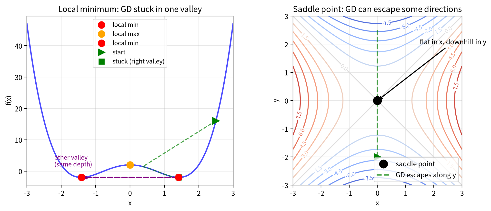

**图4**：左：函数 $x^4-4x^2+2$ 有两个对称的局部最小值（$x=\pm\sqrt{2}$，红色标记）和一个局部最大值（$x=0$，橙色标记），梯度下降从右侧出发困于右边的山谷，无法翻越中间的山丘到达左边；右：鞍点处某些方向向上（$x$ 轴）、某些方向向下（$y$ 轴），梯度下降总可以从下坡方向逃离。高维空间中鞍点比局部最小值更常见。

 * * *
## 1.7 学习率调度

> **前置知识**：本节需要你已经理解"梯度下降是什么"和"学习率是什么"。§1.5 讲 Adam 时用到了固定的基础学习率 $\eta$，本节讲如何让这个 $\eta$ 随时间变化。

训练神经网络就像学车：**初期需要大胆探索**（学习率大，多试试不同方向），**后期需要精细微调**（学习率小，小心别开过目的地）。这就是**学习率衰减**（Learning Rate Decay）。

常见策略有两种：

- **阶梯衰减**：每过几轮把学习率直接砍半，简单暴力
- **余弦衰减**：让学习率像余弦曲线一样平滑下降，从大到小过渡得更丝滑

还有一个实战技巧叫**学习率预热**（Warmup）：训练最开始的几步，学习率从接近 0 的小值慢慢"升温"到目标值。为什么？因为模型参数初始化是随机的，初始梯度往往又大又乱，一上来就用全力容易"炸梯度"。预热相当于先从慢走开始，再加速到奔跑。今天训练 GPT、LLaMA 这类大模型，Warmup 几乎是标准配置。

**一句话总结：学习率调度决定了这场长跑的节奏——该冲刺时冲刺，该刹车时刹车。Adam 的自适应步幅管"方向间的公平"，学习率调度管"时间上的节奏"。**

## 1.8 AI落地

| 场景 | 一句话解释"没有这个工具会怎样" |
|------|------|
| 线性回归训练 | 没有梯度下降，就无法找到使均方误差最小的参数，线性模型不能从数据中学习 |
| 神经网络训练 | 没有梯度下降（配合反向传播），深度学习模型无法训练。2012年AlexNet的突破、ChatGPT的语言能力，底层都是这个算法在驱动参数更新 |
| 深度学习框架 | PyTorch和TensorFlow的核心`optimizer`就是梯度下降的各种变体（SGD（Stochastic Gradient Descent，随机梯度下降，每次只用一小批数据估计梯度）、Adam、AdamW）。没有这个基础组件，整个AI生态会瞬间崩塌 |

 * * *
## 1.9 常见误解

**误解 1："梯度下降能找到全局最优"**

梯度下降只保证找到一个**驻点**（梯度为零的点，可能是局部极小值或鞍点）。你可能卡在某个浅山谷，而真正的最低点远在另一个山谷。随机初始化、动量法、学习率衰减只是缓解，不是根治。

**误解 2："学习率越大越好，收敛越快"**

学习率太大会导致**线性近似失效**，参数在目标函数上疯狂震荡；太小则收敛极慢。好的学习率让损失曲线平滑下降，既不剧烈震荡也不拖泥带水。

**不同优化器的学习率范围差别很大**：
- **SGD+Momentum**：学习率较大，通常0.01~0.1。因为SGD没有自适应归一化，需要较大的步长才能有效前进
- **Adam/AdamW**：在微调预训练模型时（如BERT fine-tuning），学习率通常1e-5~1e-4（即0.00001~0.0001）。Adam的自适应归一化（Ch1中提到的"给每个方向重新分配刻度"）已经等效地放大了小梯度方向的步长，所以基础学习率可以设得很小。BERT和GPT系列模型的微调几乎都使用AdamW，学习率通常在2e-5到5e-5之间。从头预训练时可能用到更大的值（如1e-3）
- **Muon**：用于大规模预训练，在矩阵层面正交化动量（§1.5）。AdamW 仍是微调和RL训练的默认选择，Muon的优势集中在预训练阶段的权重矩阵上

**判断学习率是否合适的实用方法**：看损失曲线。如果损失曲线像心电图一样剧烈上下震荡→学习率太大，砍半再试；如果损失曲线下降得比蜗牛还慢→学习率太小，加倍再试。

**误解 3："梯度下降 = 反向传播"**

梯度下降是"走路策略"——规定参数怎么更新（沿负梯度方向走一小步）。反向传播是"算方向"——高效计算梯度的算法，从输出层倒推回输入层。两者配合：反向传播算梯度，梯度下降用梯度更新参数。但绝不是一回事。第4章深入澄清。

 * * *
## 1.10 本章回顾

这一章的核心思想：面对一个复杂函数（哪怕上百万个变量），你不需要一眼看穿全局地形，只需要每一步都"沿负梯度方向小心翼翼地迈一小步"，逐步迭代就能接近最优解。三个关键点：**方向是负梯度**，**步子是受控的线性试探**，**"最陡"可被重新度量**。

**本章自检**：

**【知识点】**

1. 生成：画一张你自己的图——一个有两个山谷的函数，标出从某点出发的梯度下降路径：它为什么停在第一个山谷就再也不动了？
2. 学习率太大和太小分别会出现什么问题？
3. 朴素梯度下降用一个 $\eta$ 管所有参数方向，为什么这在真实神经网络中会成为问题？
4. Adam相比普通SGD多了哪两个机制？它们各自解决什么问题？
5. Muon相比Adam多了什么操作？为什么这个操作能提升大规模预训练的效率？
6. 边界：学习率太大时的震荡（过冲→反弹）在什么条件下收敛不回来？动量为什么救不了它？自适应学习率（Adam 的二阶矩）做了什么来根治？
7. 边界：高维中梯度为零的点主要是局部最小值还是鞍点？为什么？梯度下降卡在鞍点时会发生什么，动量为什么能帮上忙？这些机制能保证找到全局最优吗？

**【逻辑链】**

1. 沿这条链走一遍，理解每步如何解决前步的问题：

   **损失函数** → **梯度**（只给方向）→ **学习率 $\eta$**（步子多大？）→ **度量**（步长按 $1/L$ 怎么定？）→ **自适应学习率**（每个参数是否公平？）
     - **动量**（一阶矩）→ 累积历史方向
     - **二阶矩** → 按波动缩放步幅
     - **矩阵正交化**（Muon）→ 保留方向、拉平奇异值，防止更新坍缩到低秩子空间

> **未解问题**：下山学会了。但如果必须在指定路线上走呢？——这就是下一章的问题：带有约束的优化怎么做？

 * * *
# 第2章：拉格朗日乘子法——带着镣铐跳舞

Ch1的梯度下降假设你可以自由移动——想往哪走就往哪走。但现实世界从不给你这种自由：预算有限、时间有限、算力有限。梯度下降只管"怎么下山"，不问"山路在哪里"。你需要一套新的数学工具——既能爬坡（优化目标），又不越界（遵守约束）。

> 拉格朗日乘子法教你"在有限预算内把事做到最好"。那个叫 $\lambda$（lambda）的变量，量化了一件事：约束每放松一点点，你能多赚多少。经济学把这个量叫"影子价格"。

> **本章路线**：先建立"相切"直觉并完成拉格朗日推导，再看不等式约束（KKT）与对偶，最后收束。时间紧可先读相切直觉、KKT 与 AI 落地。

> **核心概念**：
> 1. 约束优化把"目标"和"限制"缝进同一个拉格朗日函数。
> 2. 最优点出现在目标等高线与约束相切处。
> 3. KKT 用互补松弛性区分"约束生效"和"约束没生效"。
> 4. 对偶让惩罚系数 $\lambda$ 和约束上限 $c$ 可以互换。

> **动笔前自检**：①你还记得梯度下降的更新公式吗？②"自由优化"和"带约束优化"差在哪？如果说不清，本章会从零建立直觉。

 * * *
## 2.1 生活类比：怎么在只能走山路时登顶？

想象你想登上一座山的最高点，但**必须沿着指定的山路走**——不能自己开路，只能踩着已有的小径一步一步往上。注意方向反过来了：§1.1 里目标是到最低点（下山，无约束），这里目标是登顶（上山），但多了一道"只能沿山路走"的限制。

这就是拉格朗日乘子法的核心场景：**目标是海拔尽可能高**（最大化），**约束是必须沿指定路线走**（g(x,y)=0）。你站在山腰四处张望，发现最优策略出现在一个特殊的位置——**目标函数的等高线和山路恰好相切**。此时你想往上爬的方向（$\nabla f$）恰好垂直于山路，沿着路再多走一步，海拔不再提升。

**$\lambda$就是这个"对齐程度"的度量**：在本文的约定 $L = f + \lambda(g - c)$ 下（§2.3 例子的 $g$ 已把右端常数并入，两种写法实质相同），约束右端项 $c$ 每放松 1 单位，最优值变化 $-\lambda$。$-\lambda > 0$ 表示放松约束让最优值增大，$-\lambda < 0$ 表示放松反而减小——这就是经济学中的"影子价格"。$|-\lambda|$ 的大小取决于目标函数与约束的"竞争"程度——约束越限制目标改善的空间，$|-\lambda|$ 越大；约束几乎不影响目标时 $|-\lambda|$ 趋近于零。

而**拉格朗日函数 $L$** 把"往上爬"和"别偏离路"两个目标合并成一个统一的指引——你只需要跟着 $L$ 的指示走，它自动帮你同时满足两个目标。

## 2.2 几何可视化

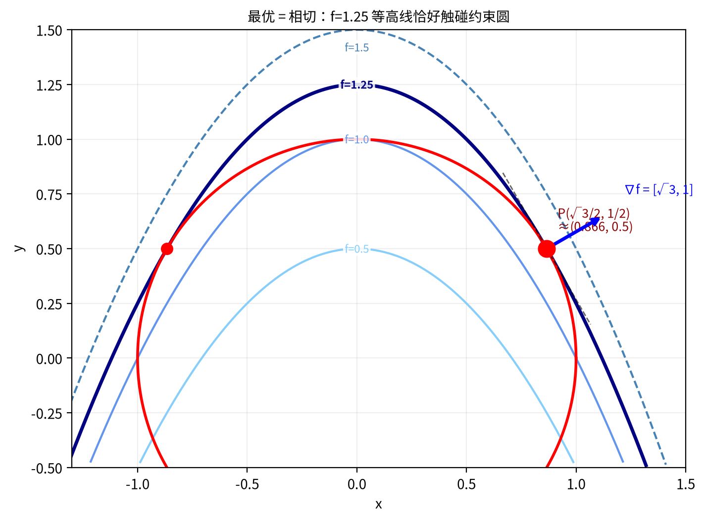

**图5**：目标函数 $f(x,y)=x^2+y$ 的等高线是一族开口向下的抛物线（蓝色系，每条标注了对应的 $f$ 值，其中相切的 $f=1.25$ 加粗显示），与约束圆 $x^2 + y^2 = 1$（红色）在最优点 $P(\sqrt{3}/2, 1/2) \approx (0.866, 0.5)$ 处相切。注意最优点不在 $x=y$ 的对角线上——因为 $x^2$ 比 $y$ "增长更快"，最优策略是多拿 $x$、少拿 $y$。红色箭头为目标梯度 $\nabla f$ 在 P 点的方向，黑色虚线为约束圆在 P 点的切线。

## 2.3 推导详解

好，现在让我们拿起纸笔，用一个具体的例子把拉格朗日乘子法从头到尾算一遍。你要做到的不是"看懂"，而是"跟着算完一遍之后觉得不过如此"。

**问题设定**：

$$\text{最大化 } f(x, y) = x^2 + y$$

$$\text{约束条件 } g(x, y) = x^2 + y^2 - 1 = 0$$

目标函数 $f(x, y) = x^2 + y$ 的等高线是一族开口向下的抛物线 $y = c - x^2$。约束 $g(x, y) = 0$ 是单位圆 $x^2 + y^2 = 1$。你只能在圆周上选择点，目标是从这些点中找到 $f$ 值最大的那个。

注意到 $x$ 以平方形式出现、$y$ 以线性形式出现——两者对目标函数的贡献**不对称**。这会导致最优点不在 $x = y$ 的对角线上。

**第一步：构造拉格朗日函数**

拉格朗日的核心想法是：把约束条件"缝"进目标函数里，变成一个没有约束的新问题。构造如下：

$$L(x, y, \lambda) = f(x, y) + \lambda \cdot g(x, y)$$

$$= x^2 + y + \lambda(x^2 + y^2 - 1)$$

（符号约定：本文统一用加号 $L = f + \lambda g$。有些教材写成减号 $L = f - \lambda g$，两种写法完全等价，只是对应的 $\lambda$ 差一个负号。）

**第二步：求偏导数并令其为零**

对 $x$ 求偏导数（把 $y$ 和 $\lambda$ 当成常数）：

$$\frac{\partial L}{\partial x} = 2x + 2\lambda x = 2x(1 + \lambda) = 0$$

对 $y$ 求偏导数（把 $x$ 和 $\lambda$ 当成常数）：

$$\frac{\partial L}{\partial y} = 1 + 2\lambda y = 0$$

对 $\lambda$ 求偏导数（把 $x$ 和 $y$ 当成常数）：

$$\frac{\partial L}{\partial \lambda} = x^2 + y^2 - 1 = 0$$

**第三步：解方程组——两条路径**

第一个方程 $2x(1 + \lambda) = 0$ 是两个因子的乘积等于零——这意味着**至少有一个因子为零**。这给出了两条不同的路径（记住：乘积为零→至少一个因子为零，这是初中代数）：

**路径A：假设 $\lambda = -1$**

把 $\lambda = -1$ 代入第二个方程：

$$1 + 2(-1) \cdot y = 1 - 2y = 0 \Rightarrow y = \frac{1}{2}$$

把 $y = 1/2$ 代入第三个方程（约束）：

$$x^2 + \left(\frac{1}{2}\right)^2 = 1 \Rightarrow x^2 = \frac{3}{4} \Rightarrow x = \pm\frac{\sqrt{3}}{2} \approx \pm 0.866$$

两个候选点：$\left(\frac{\sqrt{3}}{2}, \frac{1}{2}\right)$ 和 $\left(-\frac{\sqrt{3}}{2}, \frac{1}{2}\right)$

计算 $f$ 值：$f = x^2 + y = \frac{3}{4} + \frac{1}{2} = \frac{5}{4} = 1.25$

**路径B：假设 $x = 0$**

把 $x = 0$ 代入第三个方程：

$$0 + y^2 = 1 \Rightarrow y = \pm 1$$

- 点 $(0, 1)$：代入 $y=1$ 到第二个方程 $1 + 2\lambda \cdot 1 = 0 \Rightarrow \lambda = -\frac{1}{2}$，$f = 0 + 1 = 1$
- 点 $(0, -1)$：代入 $y=-1$ 到第二个方程 $1 + 2\lambda \cdot (-1) = 0 \Rightarrow \lambda = \frac{1}{2}$，$f = 0 - 1 = -1$

**第四步：确定最大值**

比较所有候选点的 $f$ 值：

| 候选点 | $f$ 值 | 来源 |
|--------|--------|------|
| $(\sqrt{3}/2, 1/2) \approx (0.866, 0.5)$ | $5/4 = 1.25$ | 路径A |
| $(-\sqrt{3}/2, 1/2) \approx (-0.866, 0.5)$ | $5/4 = 1.25$ | 路径A |
| $(0, 1)$ | $1$ | 路径B |
| $(0, -1)$ | $-1$ | 路径B |

最大值为 **$f^* = 5/4 = 1.25$**，在 $\left(\frac{\sqrt{3}}{2}, \frac{1}{2}\right)$ 和 $\left(-\frac{\sqrt{3}}{2}, \frac{1}{2}\right)$ 处同时达到。

注意最优点 **不在** $x = y$ 的对角线上——$x \approx 0.866$ 而 $y = 0.5$。这是因为目标函数中 $x$ 的贡献是平方增长（"更值钱"），最优策略是多拿 $x$、少拿 $y$。

**第五步：验证梯度条件**

在最优点 $\left(\frac{\sqrt{3}}{2}, \frac{1}{2}\right)$ 处：

- 目标梯度 $\nabla f = \left[\frac{\partial f}{\partial x}, \frac{\partial f}{\partial y}\right] = [2x, 1] = \left[\sqrt{3}, 1\right] \approx [1.732, 1]$
- 约束梯度 $\nabla g = \left[\frac{\partial g}{\partial x}, \frac{\partial g}{\partial y}\right] = [2x, 2y] = \left[\sqrt{3}, 1\right] \approx [1.732, 1]$

**关键观察**：$\nabla f$ 和 $\nabla g$ 在最优点处**完全同方向**（数值完全相同）！这不是巧合，而是一个必然结论。推理如下：

你被锁在约束圆上，只能沿圆的**切线方向**移动。如果 $\nabla f$ 在切线方向上有分量，意味着沿那个方向走一步，$f$ 还能继续涨——那你就还没到最优点。所以，在最优点处，$\nabla f$ 的切线分量必须为零，只剩下垂直于切线的方向——也就是圆的**法线方向**。而 $\nabla g$ 恰好就是约束边界的法线方向。因此 $\nabla f \parallel \nabla g$ 是最优点的**必要条件**。

下图直观验证了这一点：在非最优点处，$\nabla f = [2x, 1]$ 有明显的切线分量（箭头不垂直于圆），说明 $f$ 还能沿圆周继续涨；只有在 P 点，$\nabla f$ 恰好垂直于圆——切线分量为零，$f$ 涨不动了。

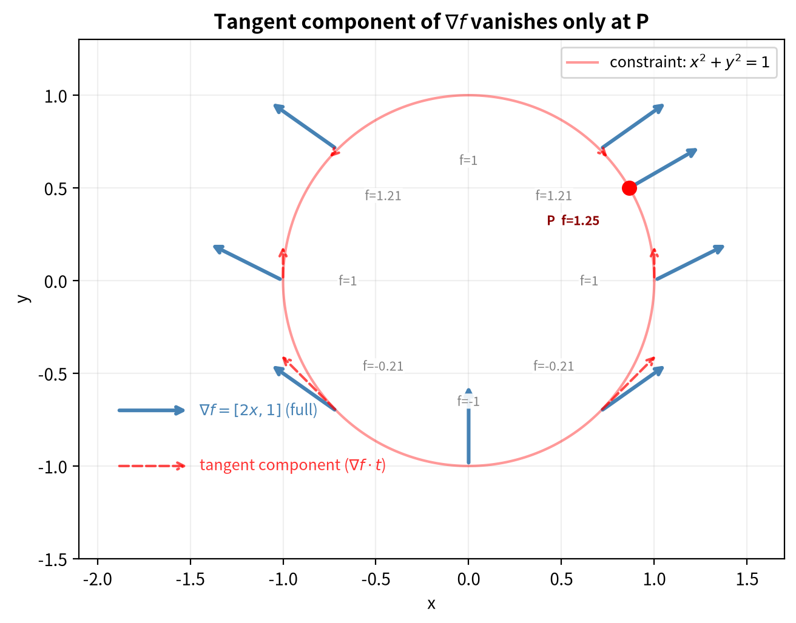

**图6**：蓝色实箭为完整的梯度 $\nabla f = [2x, 1]$（目标函数 $f$ 的"往上爬"方向），红色虚箭为 $\nabla f$ 在切线方向上的分量（"能走的方向"）。A、B 两点的红虚箭明显非零（步一步 $f$ 还能涨），只有 P 点红虚箭消失（切线分量为零，$f$ 涨不动了）。每点标注了对应的 $f$ 值。

验证拉格朗日方程：
$$\nabla f + \lambda \nabla g = [\sqrt{3}, 1] + (-1)[\sqrt{3}, 1] = [0, 0]$$ ✓

**直觉总结**：拉格朗日乘子法把"带约束的优化"变成了"解方程组"。在我们的例子里，$\lambda = -1$——$|\lambda|$ 非零说明约束在最优解处起作用（是"紧"的）。$\lambda$ 的具体数值取决于问题本身，它恰好是整数只是这个例子的偶然。

与Ch1的例子对比：Ch1的目标函数 $f(x) = x^2$ 只有一个变量，梯度 $\nabla f = 2x$ 随位置变化。现在Ch2的 $\nabla f = [2x, 1]$ 同样随位置变化——$x$ 分量随 $x$ 变化，$y$ 分量恒为1。这种**位置依赖性**是真实世界优化问题的常态。

## 2.4 不等式约束：KKT条件与互补松弛性

现实世界里，约束往往不是严格的等式。你不会说"我必须恰好花完50块"，而是说"我最多花50块"——这就是不等式约束。数学家Karush、Kuhn和Tucker（简称KKT）把拉格朗日乘子法推广到了这种情况。

考虑这样一个约束：

$$g(x, y) = x^2 + y^2 - 1 \leq 0$$

这表示你可以选在圆内（$x^2 + y^2 < 1$，此时 $g < 0$），也可以选在圆上（$x^2 + y^2 = 1$，此时 $g = 0$）。圆外是不允许的。

KKT条件里有一条至关重要的规则，叫做**互补松弛性**（Complementary Slackness）：

$$\lambda \cdot g(x, y) = 0$$

这个式子的意思用大白话说就是：**要么规矩绑着你，要么规矩是摆设，两者必居其一。**

具体来说有两种情况：

**情况一**：最优解在圆内，$g(x, y) < 0$。此时互补松弛性要求 $\lambda = 0$。乘子是零，意味着约束没有起到限制作用——你根本没用光预算，规矩对你来说是"摆设"。但等一下，如果 $\lambda = 0$，回到平稳性条件 $\frac{\partial L}{\partial x} = 2x = 0$（得到 $x = 0$），而 $\frac{\partial L}{\partial y} = 1 = 0$——**1不可能等于0！** 所以圆内不可能有最优解。

**情况二**：最优解在圆上，$g(x, y) = 0$。此时 $\lambda$ 非零——约束"绑着你"。最优解被迫停在边界上，因为如果允许你往外走一点点（圆稍微大一点），你就能获得更好的目标值。在我们的例子里（目标函数 $f=x^2+y$，约束圆 $x^2+y^2=1$），最优解对应 $\lambda = -1$。$|\lambda| = 1$ 告诉我们约束很"紧"：由前面的灵敏度公式（约束右端项每放松 1 单位，最优值变化 $-\lambda$），这里 $-\lambda = 1$——约束圆每放大 1 单位，最优值 $f^*$ 增加 1。

下图直观展示了两种情况：圆心 $(0,0)$ 处如果 $\lambda=0$，会导致 $1=0$ 的矛盾；最优解 P 在边界上，对应 $\lambda=-1 \neq 0$。

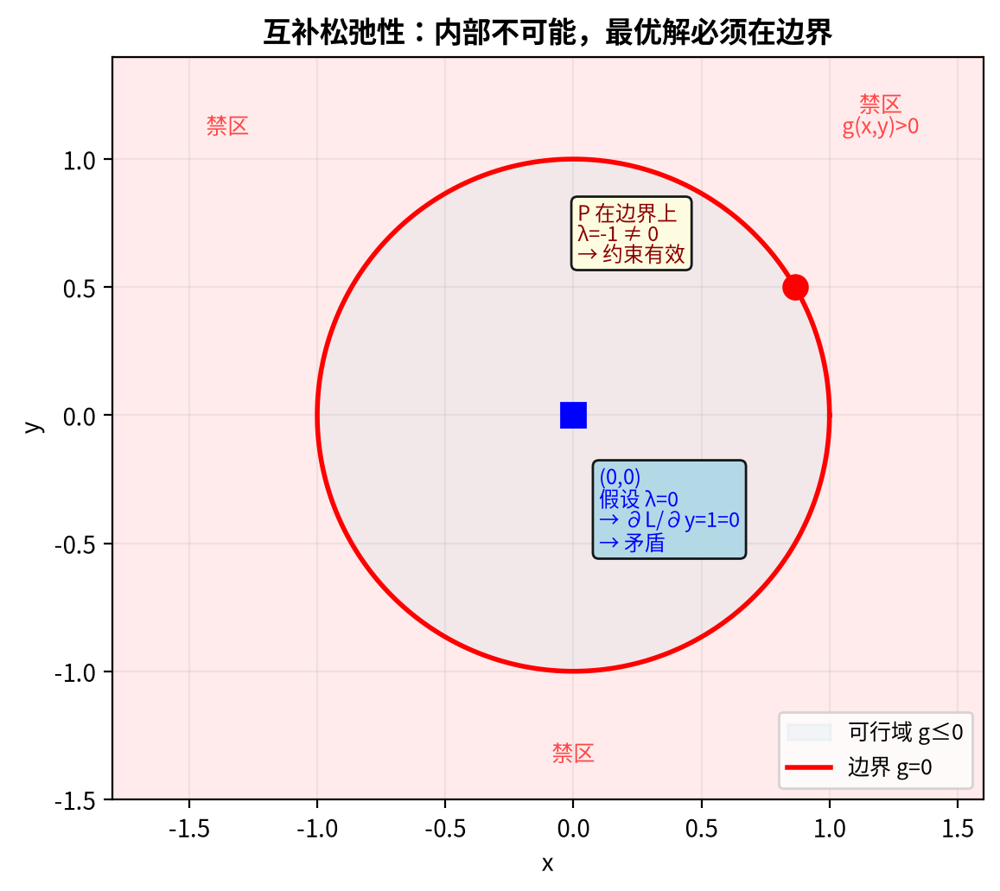

**图7**：左侧蓝色标注处为圆心 $(0,0)$，假设 $\lambda=0$ 导致 $1=0$ 矛盾，因此圆内不可能有最优解。右侧红色标注处为最优解 P，在边界上 $\lambda=-1 \neq 0$，约束"紧"。红色区域为禁区（$g>0$）。

用一句话记住互补松弛性：**没用的约束（你在它内部，没碰边界）对应的乘子是零；真正卡住你的约束（你在边界上）对应的乘子非零。** 这个直觉在支持向量机（Support Vector Machine，SVM）里大放异彩——那些乘子非零的样本点，就是**支持向量**（support vectors，它们"支撑"起了决策边界），它们就是"绑着你"的约束。（注：不同教材对L的构造符号可能不同，但互补松弛性的直觉不变。）

 * * *
## 2.5 拉格朗日对偶：换个角度看问题（进阶选读）

本章的核心是拉格朗日乘子法——直接优化变量 $(x, y)$ 求解带约束的问题，这叫**原问题**。但数学家发现：有时候把问题重写为关于乘子 $\lambda$ 的优化（叫**对偶问题**），会更简单、更有洞察力。

**先说为什么要学对偶**——最实际的动机来自一个你可能已经见过的写法。训练神经网络时，为了防止过拟合，常在损失函数后加一项"惩罚"：

$$\min_w \text{Loss}(w) + \lambda\|w\|^2$$

这就是 **L2 正则化**：$\|w\|^2$ 是所有权重的平方和（衡量模型复杂度），$\lambda$ 是正则化系数——调大 $\lambda$，模型被迫更简单；调小 $\lambda$，模型更自由。这个 $\lambda$ 本质上就是一个拉格朗日乘子，对偶理论揭示了它的几何意义。此外，对偶问题把变量从"原始参数"换成"乘子"，维度可能骤降。先看怎么推导，推导完再回到这些应用。

对偶问题长什么样？用我们手算过的例子（在圆 $x^2+y^2=1$ 上最大化 $x^2+y$），原问题的变量是 $(x, y)$，对偶问题的变量是 $\lambda$。原问题解出 $x^*=\sqrt{3}/2, y^*=1/2, f^*=5/4$。对偶问题怎么解？

**第一步：构造对偶函数 $g(\lambda)$——对每个固定的 $\lambda$，在所有 $(x,y)$ 上最大化 $L$。**

为什么要求最大值？因为对偶函数 $g(\lambda) = \max_{x,y} L(x,y,\lambda)$ 是原问题最优值 $f^*$ 的**上界**。道理很简单：任何满足约束 $x^2+y^2=1$ 的点都有 $L = f + \lambda \cdot 0 = f$，所以"在所有 $(x,y)$ 上取最大的 $L$"必然 $\geq$ "在可行点上取最大的 $L$" $= f^*$。

把拉格朗日函数 $L = x^2 + y + \lambda(x^2 + y^2 - 1)$ 整理成关于 $x, y$ 的函数（把 $\lambda$ 当常数）：

$$L = \underbrace{x^2(1+\lambda)}_{\text{关于 }x} + \underbrace{\lambda y^2 + y}_{\text{关于 }y} - \underbrace{\lambda}_{\text{常数}}$$

对固定的 $\lambda$，$L$ 关于 $x$ 和 $y$ 可以分别求最大值：

- **$x$ 的部分**：$x^2(1+\lambda)$。若 $1+\lambda > 0$，$x \to \infty$ 时 $L \to \infty$——没有有限最大值，$g(\lambda) = +\infty$，这种 $\lambda$ 对找上界没有意义。所以必须有 $\lambda \leq -1$，此时系数非正，最大值在 $x=0$ 处取得，该项贡献 $0$。
- **$y$ 的部分**：$\lambda y^2 + y$ 是关于 $y$ 的开口向下抛物线（$\lambda < 0$），最大值在顶点 $y = -1/(2\lambda)$，代入得 $-1/(4\lambda)$。

合起来：$g(\lambda) = 0 + (-1/(4\lambda)) + (-\lambda) = -1/(4\lambda) - \lambda$，定义域 $\lambda \leq -1$。

**第二步：最小化 $g(\lambda)$——在所有上界中找最紧的那个。**

每个 $\lambda$ 都给出一个上界 $g(\lambda) \geq f^*$。上界越紧（越小）越好，所以**对偶问题**是：在 $\lambda \leq -1$ 上最小化 $g(\lambda) = -1/(4\lambda) - \lambda$。

求导：$g'(\lambda) = 1/(4\lambda^2) - 1$。令 $g'(\lambda) = 0 \Rightarrow \lambda^2 = 1/4 \Rightarrow \lambda = -1/2$。但 $-1/2 > -1$，不在定义域内！所以最小值在**边界** $\lambda = -1$ 处取得：

$$g(-1) = -1/(4 \cdot (-1)) - (-1) = 1/4 + 1 = 5/4$$

**$g(-1) = 5/4 = f^*$——对偶解和原问题解完全一致。** 这不是巧合：强对偶性成立。验证：把 $\lambda = -1$ 代回平稳性条件，$\partial L/\partial x = 2x(1-1) = 0$（$x$ 自由），$\partial L/\partial y = 1 + 2(-1)y = 0 \Rightarrow y = 1/2$，再结合约束 $x^2 + y^2 = 1$ 得 $x = \pm\sqrt{3}/2$——正是原问题最优解。

对偶的价值在哪？回到本节开头的 L2 正则化。正则化有两种等价写法：

- **惩罚形式**：$\min_w \text{Loss}(w) + \lambda\|w\|^2$——你手调 $\lambda$
- **约束形式**：$\min_w \text{Loss}(w)$ 约束 $\|w\|^2 \leq c$——你手调 $c$

对偶理论连接这两种形式。对约束形式构造拉格朗日函数 $L = \text{Loss}(w) + \lambda(\|w\|^2 - c)$，走一遍本节刚做过的先最大、再最小化流程：先对 $w$ 求 $\max$ 得到对偶函数 $g(\lambda)$，再对 $\lambda$ 求 $\min$。关键结果是：最优乘子 $\lambda^*$ 是**从 $c$ 解出来的**，不需要手调。

这意味着什么？实践中你通常知道"我希望模型复杂度不超过 $c$"——比如权重范数不超过 5——但不知道 $\lambda$ 该设多少。直接解约束形式，$\lambda$ 是隐变量；对偶变换把它变成显变量，$c$ 和 $\lambda^*$ 之间有确定的对应关系（凸问题下一一对应）。你指定 $c$，$\lambda^*$ 自动确定；反过来也一样。所以"调 $\lambda$"和"调 $c$"本质是同一件事的两个视角——这正是对偶理论的实际价值。

一句话：**对偶不是数学游戏。它让"惩罚系数 $\lambda$"和"复杂度上限 $c$"之间有了确定的数学桥梁，你不用盲调，可以换到更直觉的那个变量上做决策。**

## 2.6 AI落地

| 场景 | 一句话解释"没有这个数学工具会怎样" |
|------|------|
| **正则化（L1/L2）** | 正则化项可以看作一个约束（"模型的复杂度不能超过某个上限"），$\lambda$ 控制这个上限的松紧。事实上，带惩罚的正则化和显式约束是**对偶关系**——$\min f(w) + \lambda\|w\|^2$ 的解等价于 $\min f(w)$ 约束 $\|w\|^2 \leq c$ 的解，$\lambda$ 与 $c$ 通过 KKT 互补松弛条件存在对应关系（对凸优化问题为一一对应）：$\lambda$ 越大，$c$ 越小（约束越紧）。这就是2.5节拉格朗日对偶的直接应用；没有正则化约束，模型会为了追求训练误差最小而过度拟合噪声，泛化能力崩塌，在新数据上表现糟糕 |
| **TRPO（信任区域策略优化）** | 强化学习中，策略更新不能一次跨太大步（否则可能崩溃），TRPO用约束优化把更新幅度锁死在KL散度（衡量两个概率分布之间差异的量）的"信任区域"内；没有约束优化，策略梯度方法像蒙眼狂奔，训练过程频繁发散，智能体行为剧烈震荡 |

这张表格里的两个场景看似风马牛不相及，但它们共享同一个底层结构：**先承认资源有限（约束），再求最优解。** 上一章（Ch1）的梯度下降处理自由优化；这一章处理约束优化——在资源有限的前提下做最聪明的选择。

**防过拟合的三件工具**。数据量固定时，防过拟合靠三类手段：

1. **Weight Decay（权重衰减）**。在损失函数里加惩罚项 $\lambda\|w\|^2$（L2 正则化）。直觉：权重越大，模型对训练样本的细节越敏感；限制权重幅度，逼模型用平滑的函数拟合数据，而非用尖锐的函数记住每个样本。这正是本节对偶理论的直接应用：惩罚形式等价于约束 $\|w\|^2 \leq c$，$\lambda$ 越大约束越紧。AdamW 是 Adam + Weight Decay 的标准组合——Adam 调步长，Weight Decay 防过拟合，各管各的。

2. **Dropout**。训练时随机把一部分神经元的输出置零（典型比例 10%-50%）。每次前向传播看到的网络结构都不同，模型不能依赖任何单个神经元，必须把信息分散到多个路径上；推理时关闭 dropout，用完整网络输出。效果类似于训练了一个指数级大的集成模型——所有子网络的平均。Dropout 的"置零"发生在神经元层面，与权重范数约束没有直接关系，但和 Weight Decay 的目标一致：限制模型对训练样本细节的依赖。

3. **早停（Early Stopping）**。监控验证集损失，当它开始上升时停止训练。训练损失还在降但验证集损失开始升——模型从"学规律"切换到"背噪声"的转折点就是该停的地方。

## 2.7 常见误解

**误解一：$\lambda$ 是解出来的还是调出来的？**

常见错误想法："拉格朗日乘子 $\lambda$ 和神经网络里的学习率 $\eta$（eta）一样，都是人为调的参数。我调大调小试试看，哪个效果好用哪个。"

真相：这是两个完全不同的 $\lambda$，千万别混淆。在经典优化（比如我们上面手算的那个例子）里，$\lambda$ 是**通过KKT条件解出来的**——它是方程组的一部分，和 $x$、$y$ 一起从偏导数等于零的方程里解出来。你没有任何自由度去"调"它，它是约束的必然产物。但在机器学习的正则化里，你确实会遇到一个也叫 $\lambda$ 的东西（比如L2正则化项 $\lambda \|w\|^2$），那个 $\lambda$ 是**超参数**，是人手调的。正则化 $\lambda$ 调的是"约束的松紧程度"——调得大，模型更简单的约束就更紧；调得小，模型就更自由。简单区分：优化里的 $\lambda$ 是方程解出来的，正则化里的 $\lambda$ 是人手调出来的。

**误解二：对偶问题是数学游戏，多此一举**

常见错误想法："原问题能解就行了，干嘛非要费劲转化成对偶问题？对偶不就是换个写法，做数学体操吗？"

真相：对偶不是游戏。最直接的例子就是正则化——你每次写 $\min \text{Loss}(w) + \lambda\|w\|^2$ 时，那个 $\lambda$ 就是拉格朗日乘子。对偶理论告诉你：惩罚形式 $\lambda\|w\|^2$ 和约束形式 $\|w\|^2 \leq c$ 是等价的两面，$\lambda$ 越大约束越紧。如果不理解对偶，你就只能把正则化当作"加个惩罚项试试看"的经验技巧，而不是"在权重范数约束下最小化损失"这个有明确几何意义优化问题。

## 2.8 本章回顾

这一章把"自由优化"升级为"约束优化"：拉格朗日乘子把约束缝进目标，KKT 条件处理不等式约束，对偶理论让惩罚系数和约束上限可以互换。核心收获：约束把无限选择变成有原则的选择。

**本章自检**：

**【知识点】**

1. 拉格朗日乘子$\lambda$的经济学含义是什么？为什么叫"影子价格"？
2. 互补松弛性说的是什么？用一句话概括。
3. KKT条件相比纯等式约束的拉格朗日法，多了什么？
4. 生成：用一个你自己的约束例子（不是单位圆）：画出目标函数等高线与约束曲线相切的位置，标出最优点，并验证 $\nabla f$ 与 $\nabla g$ 在该点平行。
5. 迁移：一家公司做推广，预算是约束（§2.1 的例子）。影子价格告诉你"再多一块钱预算能多赚多少"（即灵敏度 $-\lambda$）。老板问：预算加 1000 元能多赚多少？什么情况下你的估计会失效？

**【逻辑链】**

1. 沿这条链走一遍，理解拉格朗日法的构建逻辑：

   **自由优化**（不管约束）→ **拉格朗日函数**（约束缝进目标，$L = f + \lambda g$）→ **求导 = 0**（解出最优 x,y）→ **乘子 $\lambda$**（是多少？）→ **互补松弛性**（$\lambda \cdot g = 0$）
   - $\lambda \neq 0$ → 约束绑定 → $-\lambda$ = **灵敏度**（约束松紧，符号由约定 $L=f+\lambda g$ 决定）
   - 灵敏度 = **影子价格**（再给一块钱能多赚多少）

> **想一想**：本章处理的是**等式约束**（$g(x) = 0$，如"路径必须落在圆上"）。现实问题往往不是等式，而是**不等式约束**——"预算不能超过 100 元"、"速度不能低于 60km/h"、"模型复杂度不能超过某个上限"。猜猜看：等式约束的拉格朗日法，直接套用到不等式约束上还成立吗？……严格说**不成立**——不等式约束的边界是"活动"的（约束恰好被激活）还是"非活动"的（约束很宽松），解的行为完全不同。这个区分机制，正是本章§2.4 讲过的 **KKT 条件**：互补松弛性 $\lambda_i g_i(x^*) = 0$ 正是用来区分"约束在边界上（$\lambda > 0$）"和"约束没起作用（$\lambda = 0$）"的。先记住这个直觉锚点：**不等式约束不是"更一般"的等式约束，它多了一个"约束是否活动"的维度**。

> **未解问题**：第2章我们学到的是：在等式约束下怎么优化。如果把这个工具用到概率分布上——在已知约束下，让不确定度最大化——会得到什么？答案就是下一章的 Softmax：一个"诚实的"概率输出。约束优化不只是工具，它还回答了一个更根本的问题：信息不完备时，最诚实的态度是什么。

 * * *
# 第3章：最大熵→Softmax→交叉熵——不确定世界的诚实选择

Ch2你学会了带着镣铐跳舞——在约束条件下求最优解。但约束优化有一个更深刻的用法：当你对某事几乎一无所知时，它告诉你"最不做额外假设"的态度是什么。这就是最大熵原理——信息不完备时，均匀分布是最诚实的选择。当你加入已知约束（如"平均分是70"），用Ch2的拉格朗日乘子法推导，结果必然是Softmax形式。那个神经网络里天天见的Softmax公式，不是工程师拍脑袋想出来的——它是不确定世界中"诚实推断"的数学必然。然后你用交叉熵来衡量预测的好坏，梯度会简洁到只剩"预测值减真实值"。

> 从"一无所知时最诚实的态度是什么"出发，用约束优化推导出Softmax——神经网络输出概率分布的数学根基。交叉熵衡量预测好坏，它的梯度形式简洁到只需"预测值减真实值"。

> **本章路线**：先走完"最大熵→Softmax"的推导链，再看公式速查与前沿延伸，最后收束。时间紧可先读推导链、公式速查与 AI 落地。

> **核心概念**：
> 1. 一无所知时，均匀分布是最诚实的选择。
> 2. 在已知约束下最大化熵，解出来就是 Softmax。
> 3. 交叉熵衡量预测分布与真实分布的编码代价。
> 4. Softmax+交叉熵的梯度是 $p-y$，简洁来自两者"天生一对"。

> **动笔前自检**：①Softmax 公式写得出来吗？②拉格朗日乘子法解决什么问题？③"熵"这个词你听过吗？带着这三个问题读，答案会在本章逐步出现。

 * * *
## 概率论极简速查

Ch2我们学了约束优化求函数极值。现在换一个视角——约束优化还能告诉我们：在信息不完备时，如何诚实地推断概率？在动手推导之前，先确认几个概率论的基本概念你已经掌握。

**随机变量**：想象掷一颗骰子，落地前你不知道会是几点，但知道一定是1到6中的某个整数。骰子的点数就是一个**随机变量**——取值不确定，但遵循某种规律。天气预报说明天"30%概率下雨"，这里的"是否下雨"也是随机变量。

**期望**：你反复掷骰子上千次，把所有结果加起来除以次数，得到的平均值就是**期望**。正常骰子的期望是3.5（(1+2+3+4+5+6)/6 = 3.5）。期望不是"最可能的结果"，而是长期实验的平均归宿。

**概率分布**：随机变量的"可能性分配表"。均匀分布就像没做过手脚的骰子——每个面朝上的概率都是1/6。非均匀分布则是作弊骰子——某几个面概率偏高，其他面偏低。分布的数学本质是一组数，每个数对应一个可能结果的概率，全部加起来等于1。

**为什么需要两个分布**：训练神经网络时，我们始终在和两个分布打交道。**真实分布p**来自训练数据——它是"理想答案"，描述世界实际的样子；**模型分布q**来自Softmax的输出——它是"我们的猜测"，描述神经网络认为的样子。训练的目标就是让q不断逼近p，让猜测越来越接近现实。这两个分布越接近，你的AI就越诚实、越可靠。

 * * *
## 3.1 生活类比：完全不会的选择题该怎么猜？

你拿到一道完全不会的选择题，四个选项A/B/C/D一无所知。此时你只能均匀猜测——每个选项1/4。**这就是熵最大的状态**：你在完全无知时，均匀分布是最诚实、最不做额外假设的选择。

但题目给了一些线索：统计规律告诉你"这类题A正确的概率平均有60%"。这个直觉很好，但严格的数学约束不是直接固定某个选项的概率，而是固定一个**期望值**（比如"平均得分"或"某个特征的期望"）。§3.3 的骰子推导会展示完整数学：约束的形式是 $E[f(X)] = c$，最大熵在满足这个期望约束的前提下，找到最不做额外假设的概率分布——结果天然是**Softmax**的指数形式。这里先用考试直觉理解"约束塑造分布"的方向，细节留给骰子。

**Softmax里的指数函数**就是在"放大线索的差异"——有线索的选项概率显著高于其他。最终每个选项的概率加起来恰好等于1，形成一个诚实的概率分配。

考完对答案时，你"自信地猜错"的懊悔感特别强烈——这就是**交叉熵**：猜得越离谱，惩罚越重。

 * * *
## 3.2 几何可视化

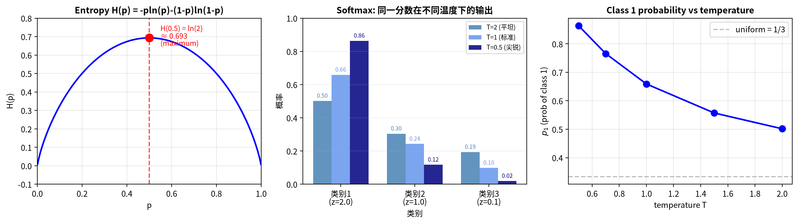

**图8**：左图展示了熵函数 $H(p) = -p\ln(p)-(1-p)\ln(1-p)$ 的曲线——在 p=0.5（均匀分布）处达到最大值 $\ln 2 \approx 0.693$，表示"完全无知时最诚实"；两端熵为0，表示"全知时没有不确定度"。中图展示了同一组分数z=[2.0, 1.0, 0.1]在不同温度T下的Softmax输出：T=2时概率为[0.50, 0.30, 0.19]，三个类别差距不大（分布"平坦"）；T=0.5时概率为[0.86, 0.12, 0.02]，最高分的类别几乎垄断了概率（分布"尖锐"，即概率集中在少数类别上）。右图展示了类别1的概率 $p_1$ 随温度T的变化曲线：T越大 $p_1$ 越接近1/3（均匀分布），T越小 $p_1$ 越接近1（赢者通吃）。

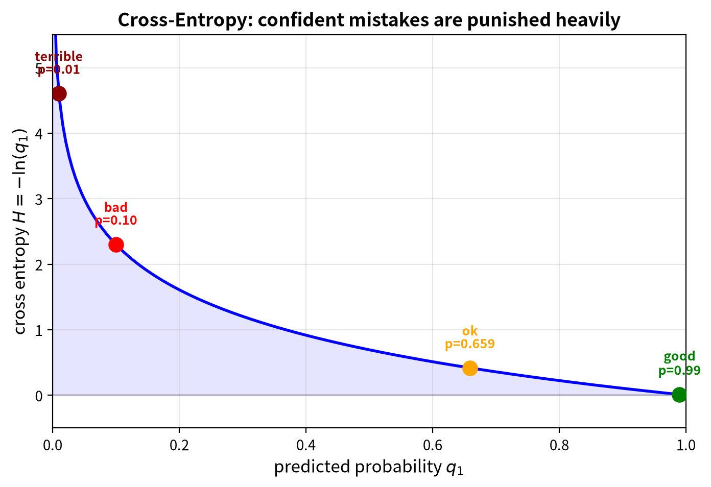

**图9**：交叉熵损失 $H = -\ln(q_1)$ 随预测概率 $q_1$ 的变化曲线。当 $q_1$ 接近1（预测很准）时损失趋近于0；当 $q_1$ 很小时损失急剧增大——交叉熵对"自信地犯错"惩罚极重。

 * * *
## 3.3 推导链：从"一无所知"到Softmax的四步之旅

### 第一步：约束——已知某些统计期望

假设你有一个六面骰子，朋友告诉你一个奇怪的事实：这颗骰子被做过手脚，长期投掷的平均点数是4.5（正常骰子的平均是3.5）。这就是一个**约束条件**——你知道了关于这个随机变量的某个统计期望。

把这个约束写成数学语言。设$p_i$表示骰子投出i点的概率（i = 1, 2, 3, 4, 5, 6，每个$p_i$都是非负实数）。那么：

$$
\sum_{i=1}^{6} i \cdot p_i = 4.5
$$

这个式子的左边是"点数乘以对应概率的总和"，也就是数学期望E[X]。右边4.5就是朋友告诉你的那个偏高的平均值。

别忘了概率的基本规矩——所有概率加起来必须等于1：

$$
\sum_{i=1}^{6} p_i = 1
$$

而且每个 $p_i \geq 0$（概率不能为负数）。

到这一步，你只是把"我知道的信息"翻译成了数学方程。还没有开始求解，但你已经明确了约束条件。

### 第二步：目标——让分布的熵最大

现在问一个关键问题：在满足上面那些约束的前提下，什么样的概率分布$p_1, p_2, \ldots, p_6$是最"诚实"的？

克劳德·香农在1948年给出了**熵**（entropy）的定义——度量一个分布的不确定度：

$$
H(p) = -\sum_{i=1}^{6} p_i \ln(p_i)
$$

这里H(p)就是分布p的熵。**以下推导统一使用自然对数 $\ln$（底为e），单位为纳特**。用其他底（如 $\log_2$）只会引入一个常数因子，不影响推导结构。这个公式的直觉非常清晰：**每个 $-p_i \ln(p_i)$ 项衡量的是第i种结果对平均惊讶度的贡献，把它们全部加起来，就是整个分布的平均惊讶度（即熵 H(p)）。** 你越不确定，惊讶度越高，熵就越大。

举个例子：如果一个骰子永远只出6点（$p_6 = 1$，其他都是0），那熵是0——你完全不惊讶，没有任何不确定度。如果六个面均匀分布（每个 $p_i = 1/6$），那熵达到最大值——你对每次投掷的结果最没把握，每次揭晓答案时惊讶度最大。（注意：这是在没有任何额外约束时的结论。一旦加上"期望=4.5"这样的约束，均匀分布（期望3.5）不再满足约束，熵最大的分布会变成下一节推导的指数形式。这也是Softmax所对应的场景。）

我们的目标是：在满足约束的前提下，让H(p)最大化。用大白话说就是：**我知道骰子平均是4.5，但除此之外我一无所知，所以我要保持最大的开放心态，不瞎猜、不偏不倚。**

### 第三步：工具——拉格朗日乘子处理约束

现在我们要解决一个带约束的优化问题：最大化H(p)，同时要满足两个约束条件（期望等于4.5，概率和等于1）。

这正是上一章拉格朗日乘子法的舞台。我们构造拉格朗日函数：

$$
\mathcal{L} = -\sum_{i=1}^{6} p_i \ln(p_i) + \lambda_0\left(1 - \sum_{i=1}^{6} p_i\right) + \lambda_1\left(4.5 - \sum_{i=1}^{6} i \cdot p_i\right)
$$

（$\mathcal{L}$ 是花体L，和Ch2的 $L$ 是同一个东西——拉格朗日函数。不同字体而已。）

> **符号约定提示**：Ch2 约定 $L = f + \lambda(g - c)$，约束写成"表达式减常数"（如 $x^2+y^2-1$）。这里约束写成"常数减表达式"（如 $1-\sum p_i$、$4.5-\sum i\cdot p_i$），方向相反。两种写法完全等价，只是对应的 $\lambda$ 差一个负号。这里选择"常数减表达式"只是写法选择，不影响推导的一般性。

这里$\lambda_0$（读作"lambda零"）和$\lambda_1$是两个拉格朗日乘子，分别对应两个约束。第一项 $-\sum p_i \ln(p_i)$ 就是熵 $H(p)$ 的定义——负号是熵公式自带的，不是额外加的。我们直接对 $\mathcal{L}$ 求偏导并令其为零——无论你把它理解为"最大化 $H$"还是"最小化 $-H$"，驻点条件都是 $\partial\mathcal{L}/\partial p_i = 0$，结果完全一样。

对每一个$p_i$求偏导数并令其为零：

$$
\frac{\partial \mathcal{L}}{\partial p_i} = -\ln(p_i) - 1 - \lambda_0 - \lambda_1 \cdot i = 0
$$

这个偏导数的推导用到了两个微积分规则：$\ln x$ 的导数是 $1/x$，以及乘积法则。对$p_i$逐项求导：

- $-\sum_j p_j \ln(p_j)$ 对 $p_i$ 的导数：$-\ln(p_i) - 1$
- $\lambda_0(1 - \sum_j p_j)$ 对 $p_i$ 的导数：$-\lambda_0$
- $\lambda_1(4.5 - \sum_j j \cdot p_j)$ 对 $p_i$ 的导数：$-\lambda_1 \cdot i$

合起来：$-\ln(p_i) - 1 - \lambda_0 - \lambda_1 \cdot i = 0$

从 $\partial \mathcal{L}/\partial p_i = 0$ 解出 $p_i$：

$$
\ln(p_i) = -1 - \lambda_0 - \lambda_1 \cdot i
$$

这里 $-\ln(p_i)$ 来自熵 $-p_i \ln p_i$ 对 $p_i$ 求导。解方程得到 $\ln p_i = -1 - \lambda_0 - \lambda_1 \cdot i$，两边取指数消掉 $\ln$，$p_i$ 天然是指数形式。**指数不是设计选择，是熵定义里的 $\ln$ 决定的**——求导留下 $-\ln p_i$，解出来必然带指数。

两边取指数：

$$
p_i = \exp(-1 - \lambda_0 - \lambda_1 \cdot i) = \exp(-\lambda_1 \cdot i) \cdot \exp(-1 - \lambda_0)
$$

注意到$\exp(-1 - \lambda_0)$对所有i都是一个常数，我们可以把它和归一化约束结合起来。设：

$$
Z = \sum_{j=1}^{6} \exp(-\lambda_1 \cdot j)
$$

这里的Z叫做**配分函数**（partition function，名字有点唬人，其实就是"把所有指数项加起来当分母"的归一化常数）。于是：

$$
p_i = \frac{\exp(-\lambda_1 \cdot i)}{Z}
$$

### 第四步：结果——Softmax（多分类）

看到上面的形式了吗？令 $z_i = -\lambda_1 \cdot i$，那么：

$$
p_i = \frac{\exp(z_i)}{\sum_{j=1}^{6} \exp(z_j)}
$$

**这就是Softmax函数！**

关键洞察来了：Softmax不是某个工程师某天喝咖啡时随便拍脑袋想出来的归一化方法。它是"在满足约束的前提下最大化熵"这个问题的数学必然解。指数函数exp(·)出现在这里，不是因为"它好用"，而是因为拉格朗日乘子法求解最大熵问题时，解出来天然就是指数形式。

$z_i = -\lambda_1 \cdot i$ 中的 $\lambda_1$ 符号由具体约束决定。骰子例子中期望4.5 > 3.5，大概率集中在大的点数上，这要求 $\lambda_1 < 0$（使 $z_i = -\lambda_1 \cdot i > 0$，大点数对应大分数）。但如果换成期望2.5（偏低），$\lambda_1$ 就变正，小点数反而对应大分数。无论哪种情况，Softmax 的形式不变——指数里放的是"分数"，分数越高概率越大，这是 Softmax 的核心性质，跟骰子无关。

在实际应用中，我们不把 $i$ 限定为整数索引，而是使用神经网络输出的任意分数 $z_i$。在骰子问题中，"分数"就是点数本身（1, 2, …, 6）；在神经网络中，"分数"变成了网络输出的任意实数 $z_i$——但数学结构完全一样：都是 $\exp(\text{分数}) / \sum \exp(\text{分数})$。骰子只是一个让推导具体的载体，Softmax 的推导不依赖于它。

 * * *
### 温度T从哪里来？

推导到这里， Softmax的公式里还没有出现温度T。T是在应用层面自然出现的。看仔细了：

我们的推导结果是 $p_i = \exp(-\lambda_1 \cdot i) / Z$，其中 $\lambda_1$ 是拉格朗日乘子——$\lambda_1$ 的值由约束条件决定，约束越紧，$|\lambda_1|$ 越大。

如果我们定义 **$T = 1 / |\lambda_1|$**（这是一个类比映射：它正确捕捉了"$|\lambda_1|$ 越大、分布越尖锐"的直觉，但 $|\lambda_1|$ 的具体数值取决于约束的尺度，与物理温度无直接对应），那么Softmax变成：

$$
p_i = \frac{\exp(i / T)}{\sum_j \exp(j / T)}
$$

这里需要说明一个符号细节：$\lambda_1$ 的符号由约束决定。骰子期望4.5 > 3.5（偏高）时 $\lambda_1 < 0$，$-\lambda_1 \cdot i = |\lambda_1| \cdot i = i / T$，指数中自然得到正号。如果期望偏低（如2.5），$\lambda_1 > 0$，指数符号翻转。无论哪种情况，数学结构相同。（物理上 Boltzmann 分布写作 $p \propto \exp(-E/kT)$——"能量越低概率越高"；这里的"分数越高概率越高"相当于把能量取负值，数学结构同形，但这里的 $T$ 是可调参数，与物理温度无直接对应。）

这就是**带温度的Softmax**。T的大小直接反映了约束的"松紧程度"：
- **T 小** → $|\lambda_1|$ 大 → 约束很紧 → 分布尖锐（接近"赢者通吃"）
- **T 大** → $|\lambda_1|$ 小 → 约束很松 → 分布平坦（接近均匀分布）

> **两个T，不要混淆**：推导中的 $T = 1/|\lambda_1|$ 是由约束条件**决定**的——骰子期望=4.5这个约束给出了 $T \approx 2.7$（数值求解方程 $\sum i \cdot \exp(-\lambda_1 \cdot i) / \sum \exp(-\lambda_1 \cdot j) = 4.5$ 得 $\lambda_1 \approx -0.37$，从而 $T = 1/0.37 \approx 2.7$）。但在实际代码中，T是一个**可调超参数**，常见值0.7-1.0。为什么数值差了5倍？因为**推导T和工程T的"参考系"不同**：推导T的"尺度"由约束条件（骰子点数1~6）决定，工程T的"尺度"由神经网络输出的标准差决定（经LayerNorm后$z_i$的标准差$\approx 1$，T=1时Softmax输出最自然）。
>
> **工程T的典型取值**：
> - **T = 0.7**（常用值）：比标准稍"冷"，模型更自信，输出更确定
> - **T = 1.0**（标准温度）：最中性的设置，概率分布忠实反映分数差异
> - **T = 1.5~2.0**（创意模式）：更"热"，分布更均匀，输出更多样、更有惊喜
> - **T → 0**（贪婪模式）：只选概率最高的词，输出最确定但最死板
>
> 推导得到的 $T \approx 2.7$ 与工程常用值 T=1.0 没有直接数值对应——它们只是同一个数学结构在不同"尺度"下的表现。推导告诉我们"Softmax+温度是最大熵的必然解"，工程经验表明 T=0.7~1.0 在多数LLM任务中是较好的起点（不同任务的最优值有差异：事实问答偏低，创意写作偏高）。两者不矛盾，而是理论和实践的完美互补。

同样，这个方法用到连续分布上，得到的是**高斯分布**（正态分布）——这也是为什么高斯分布在自然界如此普遍：给定均值和方差的约束，最大熵的解就是高斯。直觉上为什么呢？离散情形下约束是**期望值**（如E[X]=4.5），解出来是Softmax；连续情形下如果约束是"均值"和"方差"，最大化熵的解恰好就是高斯分布——这意味着，当你只知道一个随机变量的平均值和波动范围时，假设它服从高斯分布是"最不做额外假设"的选择。Softmax和高斯分布虽然形式不同，但它们都是最大熵原理在不同设定下的产物。

 * * *
这里还能看到 Ch2 的一个结论在起作用——**互补松弛性**。骰子最大熵问题的两个约束都是等式约束，等式约束在最优解处天然满足（$\lambda \cdot g = 0$ 自动成立）。互补松弛性真正的力量要等到**不等式约束**才显现（KKT 条件），本文不展开。但在骰子问题里，我们能确认的是："期望=4.5"这个约束确实绑定了——对应的乘子 $\lambda_1 \neq 0$，这就是为什么 Softmax 公式里会出现拉格朗日乘子。**约束越紧（$|\lambda|$ 越大），温度 $T$ 越小，分布越尖锐。**

> **小胜点**：到这里，你已经能从"一无所知"亲手推到 Softmax：约束 → 最大熵 → 拉格朗日乘子 → 指数族。即使不看书，也能说出 Softmax 为什么长这样、温度 T 在调节什么。

## 3.4 公式速查

### 公式1：Softmax函数

$$
p_i = \frac{\exp(z_i)}{\sum_{j} \exp(z_j)}
$$

**逐符号注释**（回顾推导链3.3节的结果）：
- $z_i$：第i个类别的原始分数，来自神经网络最后一层
- exp($z_i$)：$e^{z_i}$，指数放大了分数间的差异
- $\sum_j \exp(z_j)$：归一化常数，确保概率之和为1
- $p_i$：第i类的最终概率，[0, 1]

**数字代入演示**：假设一个3分类问题，神经网络的输出是 z = [2.0, 1.0, 0.1]。

第一步，对每个元素取指数：
- exp(2.0) $\approx$ 7.389
- exp(1.0) $\approx$ 2.718
- exp(0.1) $\approx$ 1.105

第二步，把它们加起来：
- 分母 Z = 7.389 + 2.718 + 1.105 = 11.212

第三步，分别除以分母：
- $p_1$ = 7.389 / 11.212 $\approx$ **0.659**
- $p_2$ = 2.718 / 11.212 $\approx$ **0.242**
- $p_3$ = 1.105 / 11.212 $\approx$ **0.099**

**直觉总结**：分数最高的第一类获得了约66%的概率，但并没有垄断全部。第二类还有24%的可能性，第三类也有近10%。Softmax不像argmax那样"赢者通吃"，而是给每个选项都留了一席之地——这正是"诚实"的体现：你分数高我信你，但我不会因此把其他选项一棍子打死。

 * * *
### 公式2：温度参数T

从推导链我们已经知道，温度 $T = 1/|\lambda_1|$，来源于拉格朗日乘子的倒数。在实际应用中，我们把T作为一个可调参数，插入Softmax公式：

$$
p_i = \frac{\exp(z_i / T)}{\sum_{j} \exp(z_j / T)}
$$

**这句话在说什么**：温度T是一个调节"自信程度"的旋钮。T大的时候，概率分布变得平坦（更犹豫、更均匀）；T小的时候，概率分布变得尖锐（更自信、更接近"赢者通吃"）。

**逐符号注释**：
- $T$：温度参数（temperature），$T > 0$。控制概率分布的"尖锐程度"。
- $z_i / T$：将原始分数除以温度，$T$ 越大，分数之间的差距被压缩得越厉害。其余符号（$z_i$、指数化、归一化分母）同公式1。

**数字代入演示**：用同样的 z = [2.0, 1.0, 0.1]。

**当T = 2时**（"犹豫不决"模式）：
- z/T = [1.0, 0.5, 0.05]
- exp(1.0) $\approx$ 2.718, exp(0.5) $\approx$ 1.649, exp(0.05) $\approx$ 1.051
- 分母 Z = 5.418
- p = [2.718/5.418, 1.649/5.418, 1.051/5.418] = [**0.502**, **0.304**, **0.194**]

对比T=1时的[0.659, 0.242, 0.099]，T=2的分布明显更均匀了。第一类从66%降到了50%，第三类的概率反而翻倍了。

**当T = 0.5时**（"极度自信"模式），同一套计算得到 p = [**0.864**, **0.117**, **0.019**]——第一类几乎垄断了86%的概率，第三类只剩不到2%。

**直觉总结**：温度T控制分布的**尖锐程度**。T=2时分布平缓，各选项都有一定概率；T=0.5时分布尖锐，分数最高的那个几乎独揽大权。语言模型里的"temperature参数"就是这个东西——调高温度，AI说话更随机、更有创意；调低温度，AI更保守、更确定。

 * * *
### 公式3：交叉熵

$$
H(p, q) = -\sum_{i} p_i \ln(q_i)
$$

**这句话在说什么**：交叉熵衡量的是——当你真实的概率分布是p，但你用分布q去猜测时，你平均需要付出多少"信息代价"。在分类问题里，真实答案通常只有一个（比如"这张图是猫"），所以p是一个one-hot向量：正确类别对应的 $p_i = 1$，其他都是0。

**逐符号注释**：
- $p_i$：第i个类别的"真实概率"（来自训练数据的标签）。
- $q_i$：第i个类别的"预测概率"（来自Softmax的输出）。
- log($q_i$)：预测概率的对数。$q_i$越接近1，log($q_i$)越接近0；$q_i$越接近0，log($q_i$)趋向负无穷大。

**数字代入演示**：假设真实标签是第1类，所以 p = [1, 0, 0]。Softmax预测出 q = [0.659, 0.242, 0.099]。

代入交叉熵公式：

$$
H(p, q) = -1 \cdot \ln(0.659) - 0 \cdot \ln(0.242) - 0 \cdot \ln(0.099) = -\ln(0.659)
$$

计算得：H(p, q) $\approx$ **0.417**（以下使用自然对数 $\ln$，单位为纳特。如果用 $\log_2$，数值需乘以 $1/\ln(2) \approx 1.44$，但不改变相对大小）

为什么后两项是0？因为真实标签 $p_2 = 0$、$p_3 = 0$，意味着"这两个类别根本不可能是正确答案"，所以你猜它们猜得多烂都无关紧要——乘以零之后统统作废。交叉熵只关心你在**正确类别**上的预测有多准。

**更多直觉**：
- 如果预测很准，$q_1 = 0.99$：$H = -\ln(0.99)$ $\approx$ **0.010**（损失很小，接近零）
- 如果预测很差，$q_1 = 0.10$：$H = -\ln(0.10)$ $\approx$ **2.303**（损失很大）
- 如果完全猜错，$q_1 = 0.01$：$H = -\ln(0.01)$ $\approx$ **4.605**（损失非常大）

看出规律了吗？预测概率每降低一个数量级，惩罚（损失）就增加一个ln(10) $\approx$ 2.3左右。交叉熵对"自信地犯错"尤其严厉——如果你非常确定地猜了一个错误答案，惩罚会大到离谱。

**直觉总结**：交叉熵就像考试评分。你答对了，分数低（损失小）；你答错了，分数高（损失大）。但如果你不仅答错，还"非常确定地答错"，那扣分就更狠。这逼着AI学会一件事：不确定的时候就说"我不太确定"（概率分散），千万别不懂装懂（把错误答案的概率推得很高）。

 * * *
### 公式4：梯度奇迹 $\partial L/\partial z = p - y$

Softmax 和交叉熵的组合，产生了一个结构极简的梯度公式——$\partial L / \partial \boldsymbol{z} = \boldsymbol{p} - \boldsymbol{y}$。推导它，是理解分类训练的最小路径。

**推导过程**：

损失函数是交叉熵，其中预测概率 $q_i$ 来自Softmax（与公式3一致：$q$ 是预测分布，$y$ 是真实标签）：

$$
L = -\sum_{i} y_i \ln(q_i), \quad q_i = \frac{\exp(z_i)}{\sum_{j} \exp(z_j)}
$$

这里$y_i$是one-hot标签（真实类别处为1，其余为0）。

先化简L。因为只有一个 $y_i = 1$（假设是第k类），所以：

$$
L = -\ln(q_k) = -\ln\left(\frac{\exp(z_k)}{\sum_{j} \exp(z_j)}\right) = -z_k + \ln\left(\sum_{j} \exp(z_j)\right)
$$

现在对$z_i$求导，分两种情况：

**情况A：i $\neq$ k（不是真实类别）**

$$
\frac{\partial L}{\partial z_i} = \frac{\partial}{\partial z_i} \ln\left(\sum_{j} \exp(z_j)\right) = \frac{\exp(z_i)}{\sum_{j} \exp(z_j)} = q_i
$$

**情况B：i = k（是真实类别）**

$$
\frac{\partial L}{\partial z_k} = -1 + \frac{\exp(z_k)}{\sum_{j} \exp(z_j)} = q_k - 1
$$

两种情况合并，用$y_i$（真实标签）统一表达：

$$
\frac{\partial L}{\partial z_i} = q_i - y_i
$$

**数字代入演示**：真实标签 y = [1, 0, 0]，Softmax预测 q = [0.659, 0.242, 0.099]。

梯度 = q - y = [0.659 - 1, 0.242 - 0, 0.099 - 0] = [**-0.341**, **0.242**, **0.099**]

解读这个梯度：
- 对于真实类别（第一类），梯度是**负数**（-0.341）。梯度值为负意味着"你应该增大 $z_1$"——因为目前你对第一类的信心还不够高（只有65.9%，目标是100%）。
- 对于第二类，梯度是**正数**（0.242）。正梯度意味着"你应该减小 $z_2$"——你给了第二类太多概率（24.2%），需要压下去。
- 对于第三类，梯度是**正数**（0.099）。同理，压下去。

**直觉总结**：这个梯度公式的简洁不是巧合，而是Softmax和交叉熵"天生一对"的结果。Softmax来自最大熵原理，交叉熵是衡量概率预测的天然尺子，两者配对后，梯度变成了"预测与真实之间的差距"——你需要增大正确类别的分数，减小错误类别的分数，力度恰好等于当前的预测误差。这种内在的数学和谐，让神经网络训练变得异常高效。

**补充一句深度连接**：在分类任务中（标签是one-hot），交叉熵还有一个等价身份——它是**负对数似然**（negative log-likelihood）。因为 $H(p,q) = -\sum p_i \ln q_i = -\ln q_{\text{label}} = \text{NLL}$。最小化交叉熵 = 最大化模型对训练数据的似然。这也是为什么交叉熵是分类任务的"黄金标准"损失函数：它不仅在数学上简洁，在统计学上也对应着"让模型最可能生成观测到的数据"。

## 3.5 Softmax 与梯度的前沿延伸

> **前置知识**：你需要熟悉 Softmax 的指数归一化结构，以及 Ch1 中梯度 $\nabla f$ 的直觉（"坡度指向最陡上升方向"）。本节是全书数学的"融会贯通"时刻。

> ⚠️ **难度提示**：本节引入两个前沿方向（对比学习、扩散模型），概念密度较高。如果感到吃力，可以先跳过，读完Ch4-Ch6后再回来看。不影响后续章节的阅读。

前面我们花了很多篇幅讲 Softmax 如何把原始分数变成概率，以及交叉熵损失如何驱动模型学习。但这两个数学工具的故事远未结束——它们在深度学习两个重要方向里，扮演着更深层的角色。

### Softmax 的延伸：对比学习

**对比学习**的任务（以 OpenAI 的 CLIP——Contrastive Language-Image Pre-training，对比语言-图像预训练——为例），是把"一张猫的照片"和"一句"一只猫在睡觉""的向量表示拉进同一个语义空间，让语义相近的图文配对在空间里彼此靠近。CLIP 使用的 **InfoNCE 损失**长这样：

$$
\mathcal{L} = -\ln \frac{\exp(\text{sim}(q, p^+))}{\exp(\text{sim}(q, p^+)) + \sum_{i} \exp(\text{sim}(q, p^-_i))}
$$

$q$ 是一个查询（比如某张图片的向量），$p^+$ 是它的"正样本"（对应的文字描述），$p^-_i$ 是所有"负样本"（其他不相关的描述）。盯着分母看几秒——**这分母不就是我们熟悉的 Softmax 归一化吗？** 分子是那个"正确项"的指数，分母是所有项的指数之和。对比学习和分类交叉熵，骨子里是同一个数学结构：都是在做"推高正确项、压低错误项"的指数归一化。

**手算实例**：假设查询 $q$ 是"猫的照片"的向量，正样本 $p^+$ 是"一只猫在睡觉"的向量，两个负样本 $p^-_1$ 是"狗在跑"、$p^-_2$ 是"车在开"。用余弦相似度算出分数（简化为易算的值）：

| 样本 | 相似度 $\text{sim}(q, \cdot)$ | $e^{\text{sim}}$ |
|------|------|------|
| $p^+$（猫在睡觉） | 0.9 | $e^{0.9} \approx 2.46$ |
| $p^-_1$（狗在跑） | 0.5 | $e^{0.5} \approx 1.65$ |
| $p^-_2$（车在开） | 0.1 | $e^{0.1} \approx 1.11$ |

归一化（Softmax）：$Z = 2.46 + 1.65 + 1.11 = 5.22$，概率 $p^+ = 2.46 / 5.22 = 0.47$，$p^-_1 = 0.32$，$p^-_2 = 0.21$。

InfoNCE 损失 $= -\ln(0.47) \approx 0.75$。模型要最小化这个值，等价于推高 $p^+$ 的概率——与分类交叉熵完全一样。CLIP 不过是把 Softmax 从"1000 个类别"搬到了"千万对图文配对"的尺度上，用同一个数学杠杆撬开了多模态理解的大门。

### 梯度的延伸：扩散模型

**扩散模型**（Diffusion Model）的前向过程很直观：从一张真实图片 $x_0$ 出发，每一步加一点高斯噪声，经过 $T$ 步后变成纯白噪声 $x_T$。这个过程有一个简洁的闭式表达：

$$
x_t = \sqrt{\bar{\alpha}_t} \, x_0 + \sqrt{1 - \bar{\alpha}_t} \, \varepsilon
$$

其中 $\varepsilon \sim \mathcal{N}(0, 1)$ 是标准高斯噪声（均值0、方差1），$\bar{\alpha}_t$ 是每步保留信号比例的累积乘积（$\bar{\alpha}_t = \alpha_1 \times \alpha_2 \times \cdots \times \alpha_t$，其中每步 $\alpha_s = 1 - \beta_s$，$\beta_s$ 是第 $s$ 步添加的噪声比例），随时间衰减。

关键在于**反向过程**：模型要从纯噪声 $x_T$ 一步步去噪，倒推回真实图片。去噪的本质是什么？把 $x$ 从低概率区域（纯噪声）推向高概率区域（真实数据）。什么方向能推高概率？回忆 Ch1：梯度指向函数增长最快的方向。这里"函数"换成数据分布的对数概率 $\ln p(x)$，梯度 $\nabla_x \ln p(x)$ 就指向**概率增长最快的方向**——也就是从噪声走向数据的方向。

这个梯度有个专门的名字：**分数函数**（Score Function）$\nabla_x \ln p(x)$。所以"学去噪"等价于"学分数函数"——模型不需要知道 $p(x)$ 本身，只需要知道它的梯度方向就够了。注意与 Ch1 的区别：Ch1 的梯度 $\nabla_\theta L$ 是对**参数** $\theta$ 求导，用于优化模型；此处的 $\nabla_x \ln p(x)$ 是对**数据** $x$ 求导，用于采样生成。

有了分数函数，反向去噪通过 **Langevin 动力学**实现——从纯噪声出发，每步沿分数函数方向走一小步并加噪：

$$x_{t+1} = x_t + \frac{\eta}{2} \nabla_x \ln p(x_t) + \sqrt{\eta} \, z, \quad z \sim \mathcal{N}(0, 1)$$

其中 $\eta$ 是步长（注意：这里的 $\eta$ 是 Langevin 步长，与前向公式中的噪声 $\varepsilon$ 不同），$z$ 是新的标准高斯噪声。这就是对 $-\ln p(x)$ 做带噪梯度下降。Ch1 的梯度下降沿损失函数的坡度走向最小值，Langevin 采样沿数据分布的坡度走向高概率区域——数学形式相同，优化对象不同。

**前向过程手算**：假设真实数据是一个标量 $x_0 = 2.0$（想象一张只有一个像素的图片，灰度值为2.0）。取两步演示，设 $\bar{\alpha}_1 = 0.9$（第1步保留90%信号），$\bar{\alpha}_2 = 0.8$（第2步保留80%信号）：

- **第0步**（原始信号）：$x_0 = 2.0$
- **第1步**：$x_1 = \sqrt{0.9} \times 2.0 + \sqrt{0.1} \times \varepsilon_1$。假设 $\varepsilon_1 = 0.5$，则 $x_1 \approx 0.949 \times 2.0 + 0.316 \times 0.5 = 1.898 + 0.158 = 2.056$。信号几乎没变，噪声只是微扰
- **第2步**：$x_2 = \sqrt{0.8} \times 2.0 + \sqrt{0.2} \times \varepsilon_2$。假设 $\varepsilon_2 = 1.5$，则 $x_2 \approx 0.894 \times 2.0 + 0.447 \times 1.5 = 1.789 + 0.671 = 2.460$。噪声开始有了存在感

继续加噪到第100步（$\bar{\alpha}_{100} = 0.01$），$x_{100} = 0.1 \times 2.0 + 0.995 \times \varepsilon \approx 0.2 + \varepsilon$，信号幅度只剩原来的10%，$x_{100}$ 本质上就是纯噪声。

**反向过程手算**：反向从 $x_{100}$ 出发，逐步去噪。Langevin 公式的每一步做两件事——**去噪**（沿分数函数走，拉向数据分布）和**加噪**（随机扰动，保持采样多样性）：

$$\underbrace{x_{t+1} = x_t + \frac{\eta}{2} \nabla_x \ln p(x_t)}_{\text{去噪：拉向数据}} + \underbrace{\sqrt{\eta} \, z}_{\text{加噪：保持多样性}}$$

假设数据服从高斯分布 $p(x) = \mathcal{N}(2, 1)$（峰值在 $x = 2$，方差为1）。对 $\ln p(x)$ 求导：$\ln p(x) = -\frac{1}{2}(x-2)^2 + \text{const}$，所以分数函数 $\nabla_x \ln p(x) = -(x-2) = 2 - x$。Langevin 步长 $\eta = 0.5$：

> **为什么去噪之后还要加噪？** 如果只去噪不加噪，就像 Ch1 的梯度下降——球滚到谷底就停了，每次都收敛到同一个点，生成出来的图永远一样。加噪让球在谷底附近弹跳，才能从分布中**采样**出不同的样本。注意：Langevin 公式中 $\sqrt{\eta}$ 不随步数变化，噪声幅度是恒定的。随着 $x$ 趋近数据分布的峰值，分数函数的拉力趋近零（$2 - x \to 0$），噪声不再被强力拉回，$x$ 在峰值附近做小幅随机游走——这就是从 $p(x)$ 中采样。实际工程中会进一步在后期减小 $\eta$（称为退火采样），让采样更精确。

- **起点**：$x_{100} \approx 0.2 + \varepsilon$，假设前向最终步采样的噪声 $\varepsilon = 0$（标准高斯的期望值），则 $x_{100} \approx 0.2$
- **第1步反向**：
  - **去噪**：分数函数 $= 2 - 0.2 = 1.8$，走半步 $\frac{0.5}{2} \times 1.8 = 0.45$（拉向 $x = 2$）
  - **加噪**：$z = 0.3$，扰动 $= \sqrt{0.5} \times 0.3 \approx 0.21$
  - 合并：$x_{99} \approx 0.2 + 0.45 + 0.21 = 0.86$
- **第2步反向**：
  - **去噪**：分数函数 $= 2 - 0.86 = 1.14$，走半步 $0.25 \times 1.14 \approx 0.29$（拉力减弱，因为离目标更近了）
  - **加噪**：$z = -0.1$，扰动 $\approx -0.07$（噪声幅度与第1步相同，因为 Langevin 公式中 $\sqrt{\eta}$ 不随步数变化；实际工程中会在后期减小 $\eta$）
  - 合并：$x_{98} \approx 0.86 + 0.29 - 0.07 = 1.08$
- **……多步后**：去噪的拉力（$2 - x$）随 $x$ 接近 2.0 而趋近 0，只剩加噪让 $x$ 在 2.0 附近小幅波动——这就是从数据分布 $p(x)$ 中**采样**

关键对比：前向是"信号 + 越来越多噪声"（噪声由 $\sqrt{1-\bar\alpha_t}$ 控制，随 $t$ 增大），反向是"噪声 + 沿分数函数走 + 每步对应不同噪声水平"（每步 $t$ 的噪声由前向过程的 $\bar\alpha_t$ 决定，不是简单递减，而是遵循预设的噪声调度表）——数学形式相同（都是"当前位置 + 梯度步 + 随机扰动"），但前向的"梯度"是固定加噪方向，反向的"梯度"是模型学出来的分数函数。

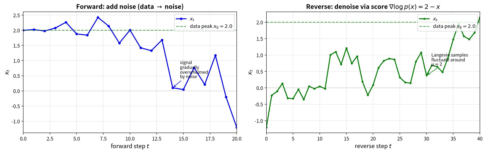

**图10**：左图展示前向过程——从 $x_0 = 2.0$ 出发，逐步加噪，信号被噪声逐渐淹没。右图展示反向过程——从纯噪声出发，沿分数函数 $\nabla_x \ln p(x) \approx 2 - x$ 方向走步并加噪，逐步收敛回 $x = 2$ 附近。随着 $x$ 趋近数据峰值，分数函数的拉力减弱，$x$ 在 2.0 附近波动——这就是从分布 $p(x)$ 中采样。DALL-E、Stable Diffusion 生成图片的过程，本质上就是这样一场"梯度漫步"——从混乱中沿着坡度找回秩序。

**一句话总结：对比学习把 Softmax 的指数归一化从"分类"扩展到"配对匹配"，扩散模型把梯度下降从"优化参数"扩展到"生成数据"——Softmax 与梯度，这两个数学工具在前沿研究中依然是核心。**

> **跨篇引用**：本节只展示了扩散模型的最小数学种子——前向加噪 + 反向去噪 + 分数匹配。扩散模型的完整推导（SDE 框架、概率流 ODE、条件控制、世界模型延伸）见《扩散》。

 * * *
## 3.6 AI落地

| 场景 | 一句话解释"没有这个数学工具会怎样" |
|------|----------------------------------|
| 分类器输出 | 没有Softmax，神经网络输出的只是任意实数，无法解释为"这是猫的概率有多大"，决策无从做起 |
| Attention权重归一化 | 没有Softmax，Transformer里的注意力权重可能为负数或加起来不等于1，导致信息聚合时某些位置被"反方向"处理，模型崩溃 |
| RLHF奖励比较 | 没有Softmax，无法把人类对两个回答的偏好（"A比B好"）转化为可学习的概率，大模型也就学不会"对齐"人类的价值观 |
| 语言模型采样温度 | 没有温度参数，采样要么死板（T=0时永远只选概率最高的词，输出像复读机），要么失控（T→∞时变成随机乱码），创造力与稳定性无法调节 |

 * * *
## 3.7 常见误解

**误解1："Softmax就是随便归一化一下"**

第一次看Softmax的公式，会觉得"哦，不就是把指数值加起来当分母嘛，就是一种归一化技巧"。甚至有人会问："为什么不能直接用线性归一化？比如 $p_i = z_i / \sum_j z_j$？"

这个直觉错得很自然，但错得也很危险。线性归一化至少有两个致命问题：第一，神经网络的输出$z_i$可以是负数，如果某个 $z_i < 0$，线性归一化后对应的 $p_i$ 也是负数——负数概率在数学上毫无意义。第二，即使所有$z_i$都是正数，线性归一化也不具备Softmax的一系列优良数学性质（比如与交叉熵配对后梯度简洁、对输入平移不变、由最大熵原理导出等）。

最关键的一点是：**Softmax的指数形式不是拍脑袋选的，它是最大熵原理的必然结果。** 当你用拉格朗日乘子法求解"在约束下最大化熵"这个问题时，解出来天然就是指数族分布。Softmax是离散情形，高斯分布是连续情形——它们都是同一个数学原理的孩子。所以当你写下一行 `torch.softmax()` 的时候，你实际上是在调用一个有着70多年历史的统计物理学定理。这不是技巧，这是定律。

**误解2："交叉熵和KL散度是一回事"**

坊间流传着一个说法："最小化交叉熵就是在最小化KL散度。"这句话在技术上没错，但概念上偷换了重点，容易让人误解。

严格来说，交叉熵和KL散度的关系是：

$$
\underbrace{H(p, q)}_{\text{交叉熵}} = \underbrace{H(p)}_{\text{熵}} + \underbrace{D_{KL}(p \| q)}_{\text{KL散度}}
$$

也就是说，**交叉熵 = 熵 + KL散度**。当真实分布p固定不变时（比如分类任务里的one-hot标签），H(p)是一个常数。所以最小化交叉熵 H(p,q) 和最小化 KL 散度 $D_{KL}(p\|q)$ 在数学上等价——对q的优化方向是一样的。

但概念上，它们说的是两件不同的事：
- **交叉熵H(p, q)**衡量的是"如果你用分布q去编码来自分布p的信息，你平均需要多少比特"。它是一个"编码代价"的概念。
- **KL 散度 $D_{KL}(p\|q)$** 衡量的是"分布 q 与真实分布 p 之间的差距有多大"。它是一个"距离"的概念（虽然严格来说不是真正的距离，因为它不对称）。

混淆这两个概念的后果是：当你想分析"模型预测q和真实p差多远"时，你应该看KL散度；当你想写损失函数训练模型时，交叉熵更方便（因为它不涉及计算H(p)，而one-hot标签的H(p)就是0）。在本章的语境下，由于分类任务的标签是one-hot（只有一个 $p_i = 1$，其余为0），此时H(p) = 0，交叉熵就等于KL散度。但一旦你的标签不是one-hot（比如知识蒸馏里的"软标签"），两者的区别就凸显出来了。

 * * *
至此图景完整：Softmax 来自**最大熵原理**——教我们诚实地表达"我不确定"；交叉熵来自**信息论**——衡量我们为这份诚实付出的编码代价。两者殊途同归，核心都是"尊重信息"。

## 3.8 本章回顾

我们从"一无所知时最诚实"这个生活直觉出发，走过了完整的一条链：用拉格朗日乘子把约束缝进最大熵目标 → 解出来天然是Softmax的指数形式 → 用交叉熵衡量预测好坏 → 梯度简化为 p - y。这条链不是四个孤立的知识点，而是一个有机的整体——Softmax的指数和交叉熵的对数在结构上互为逆运算，是因为它们都来自同一个数学源头：在不确定的世界里，保持最大程度的诚实。

**本章自检**：

**【知识点】**

1. 为什么"一无所知时最诚实的预测"是均匀分布？用最大熵原理解释。
2. Softmax中的温度T变大时，输出分布会怎样变化？为什么？
3. 交叉熵的梯度为什么恰好等于p-y？这个简洁性的数学根源是什么？
4. 迁移：把 Softmax 的温度用到"检索重排"。搜索引擎给"量子计算"返回 10 条结果，你希望前几条更集中（高相关性）还是更分散（多样性）？温度 T 应该调大还是调小？提示：温度控制分布尖锐度。


5. 边界：类别极不平衡（长尾分布）时，交叉熵梯度 p-y 会出什么问题？为什么模型会过度自信地预测多数类？

6. 生成：不看正文，自己算一遍 Softmax：取 $z = [3, 1, -1]$，分别算 T=1 和 T=0.5 的概率分布，把两个分布画成柱状图对比尖锐度。

**【逻辑链】**

1. 沿这条链走一遍，标注每步用了 Ch2 的什么工具：

   **一无所知** → **均匀分布**（最大熵）→ **约束**（如期望=4.5）→ **拉格朗日乘子**（Ch2工具）→ **指数形式** $\exp(-\lambda_1 \cdot i)$ → **Softmax**（归一化）→ **温度 T**（约束越紧→分布越尖→等效温度越低）→ **交叉熵** → **梯度 p-y**

> **未解问题**：第2章的约束优化工具、第3章的 Softmax，合起来得到了神经网络输出层的标配。但 Softmax 只给了概率分布，模型训练还需要两样东西：一个衡量"预测有多差"的损失函数（交叉熵），和一个把损失信号传回每个参数的方法（反向传播）。下一章先把这两样东西讲清楚：为什么分类用交叉熵、回归用均方误差——它们背后是同一个 MLE 框架；然后沿着前向传播看输入怎么变成输出，再沿着反向传播看每个权重的"责任"怎么算出来。

 * * *
# 第4章：MLP前向与反向传播——犯错的追责链

Ch3推导出交叉熵损失——它告诉你"预测有多差"。但知道"差"只是第一步。一个神经网络可能有百万个参数，你需要知道：每个参数对最终误差负多大责任？反向传播就是这个"追责系统"——从输出层的误差出发，通过链式法则，把责任精确分配到每一个权重头上。配合Ch1的梯度下降，你就有了一整套训练工具。

>前向传播是逐层加工：每一层把输入做线性变换，再通过激活函数添加非线性，最后汇总输出结果。反向传播则是从输出端的误差出发，沿链式法则倒着追查每一层的责任，精确到每一个参数。

> **本章路线**：先选损失函数，再走通前向与反向传播，接着看激活函数梯度与数值稳定性、自动微分如何工程化，最后收束。

> **核心概念**：
> 1. 前向传播是数据逐层加工，反向传播是误差逐层追责。
> 2. 链式法则把总梯度拆成局部梯度乘积。
> 3. ReLU 的梯度为 1，打破深层梯度消失。
> 4. 自动微分让深度学习从"手推公式"变成"定义前向即可训练"。

> **动笔前自检**：①Ch1 梯度下降的更新公式写得出来吗？②Ch3 里 Softmax+交叉熵的梯度是 p−y——这里的 p 和 y 分别是什么？③Softmax 的公式写得出来吗？

 * * *
## 4.0 损失函数选择指南

第3章我们推导出了 Softmax+交叉熵的组合——梯度简洁到出乎意料。但本章后面的前向传播示例（房价预测）用的不是交叉熵，而是均方误差。为什么？

答案藏在**最大似然估计（MLE）**这个统一框架里。MLE的直觉很简单：**调整模型参数，让它"最可能"生成你观测到的真实数据**。数学上，这等价于最小化**负对数似然**：

$$\mathcal{L} = -\ln p(\text{真实数据} \mid \text{模型})$$

不同任务的区别在于你对"数据怎么来的"做了不同假设。

**分类任务**：模型输出每个类别的概率 $p_i$（Softmax），真实标签是 one-hot 向量（只有正确类别 $y_k = 1$，其余 $y_i = 0$）。假设真实标签恰好是类别 $k$，那么模型说"是类别 $k$"的概率就是 $p_k$。用 one-hot 向量统一写成：

$$p(y \mid x) = \prod_i p_i^{y_i}$$

因为 $y_i$ 中只有 $y_k = 1$，其余为 $0$，所以这个乘积只有 $p_k^1 = p_k$ 存活，其余 $p_i^0 = 1$ 被消掉。取负对数：

$$-\ln p(y \mid x) = -\sum_i y_i \ln p_i = -\ln p_k$$

左边的 $-\sum_i y_i \ln p_i$ 正是 Ch3 定义的交叉熵 $H(y, p)$。在 one-hot 标签下它简化为 $-\ln p_k$（负对数似然），两者是同一回事。

**回归任务**：模型输出一个具体数值 $\hat{y}$，真实值 $y$。假设预测误差服从高斯分布 $y = \hat{y} + \epsilon$，$\epsilon \sim \mathcal{N}(0, \sigma^2)$：

$$p(y \mid x) = \frac{1}{\sqrt{2\pi}\sigma} \exp\!\left(-\frac{(y - \hat{y})^2}{2\sigma^2}\right)$$

取负对数：

$$-\ln p(y \mid x) = \frac{(y - \hat{y})^2}{2\sigma^2} + \underbrace{\ln(\sqrt{2\pi}\sigma)}_{\text{与参数无关的常数}}$$

丢掉常数项（不影响最小化的位置），剩下的就是**均方误差**：

$$\mathcal{L}_{\text{MSE}} = \frac{1}{2}(\hat{y} - y)^2$$

所以选损失函数，本质上是选你对**数据噪声的假设**：分类假设离散选择，回归假设高斯噪声。两种假设殊途同归——都是MLE的不同面孔。

> **一句话记住**：分类问题→交叉熵（预测概率）；回归问题→均方误差（预测数值）。选错损失函数，模型学不到正确的东西。

理解了损失函数的选择逻辑，现在让我们看看：当损失函数发出"差评信号"时，这个信号如何一层一层传回每个参数？


## 4.1 生活类比：味道不对时，责任怎么追？

你开了一家小餐馆，客人吃了一口就皱眉说"味道不对"。这个"不对"的程度就是**损失**——偏差越大，损失越大。但光知道"不对"没用，你得倒着查：是最后调味偏了？是酱料放多了？还是食材本身不新鲜？从最终口味往前一道一道追溯，**每个环节该负多少责任，就是梯度**。**反向传播就是这套倒查流程**：从客人的一句"味道不对"，把责任精确分到每个环节——"这道工序背3成，那道背7成"。搞清楚了，明天才能针对性改正。改正的力度就是学习率 $\eta$——梯度大的地方多改，梯度小的地方少改，$\eta$ 控制每次整改的步幅。

## 4.2 几何可视化

先认识一个重要概念——**计算图**（computational graph）。你可以把它看成一张运算网络：每个节点是一种运算（矩阵乘法、加偏置、激活函数），每条有向边连接两个节点，负责传递数据。前向传播时，输入数据从起点进入，经过一个个节点运算，最终从终点输出预测结果。反向传播时，损失函数的梯度从终点倒着流回去，沿路每个节点都会把自己的局部梯度传给前一个节点——梯度流到的地方，就是责任被追查的地方。

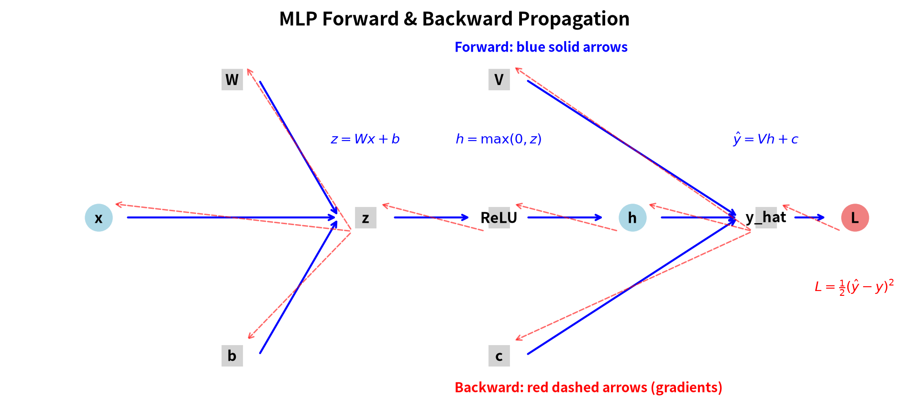

**图11**：上图展示了一个单隐藏层MLP的完整计算图。蓝色实线箭头表示前向传播（数据流）：输入x → 线性变换z=Wx+b → ReLU激活h=max(0,z) → 输出层ŷ=Vh+c → 损失L。红色虚线箭头表示反向传播（梯度流）：从损失节点出发，梯度通过链式法则逐层回传，最终到达每个权重参数。

## 4.3 前向传播详解

我们先来看一个完整的单隐藏层MLP的前向传播流程。这个网络有三层结构：输入层（2个神经元）→ 隐藏层（3个神经元，用ReLU激活）→ 输出层（1个神经元，线性输出）。

### 公式1：前向传播（单隐藏层）

$$z = Wx + b$$

$$h = \sigma(z)$$

$$\hat{y} = Vh + c$$

这三个公式在做一件什么事？**逐层变换：第一层做线性变换（拉伸、旋转、平移），第二层做非线性激活（本例用 ReLU，把负数全部抹成零），第三层再把处理过的信号汇总成一个最终预测值。**

### 逐符号注释

- $\boldsymbol{x}$（输入向量，$2 \times 1$）：这是你的原始数据。在本例中 $\boldsymbol{x} = [2, 3]^T$，可以想象成"房屋的两个特征"：面积=200平米（编码为2，即面积除以100）、房龄=3年（编码为3，即取年数）。
- $W$（第一层权重矩阵，$3 \times 2$）：3个隐藏神经元，每个接收2个输入。$W_{ij}$ 表示第 $i$ 个隐藏神经元对第 $j$ 个输入的重视程度。
- $\boldsymbol{b}$（第一层偏置向量，$3 \times 1$）：每个隐藏神经元自己的"起跑线"，在加权和之后再叠加。
- $\boldsymbol{z}$（线性变换后的预激活值，$3 \times 1$）：还没过激活函数的"生猛"信号。
- $\sigma(\cdot)$（激活函数）：这里是ReLU（Rectified Linear Unit，修正线性单元），规则简单粗暴：正数保留，负数归零。激活函数是神经网络中的非线性"开关"——它决定了一个神经元是否"被激活"。如果没有激活函数，无论堆叠多少层，整个网络只是一个大型线性函数，无法学习复杂模式。
- $\boldsymbol{h}$（隐藏层输出，$3 \times 1$）：经过ReLU"筛选"后的信号，也叫"特征表示"。
- $V$（第二层权重矩阵，$1 \times 3$）：输出层只有1个神经元，接收3个隐藏信号的加权和。
- $c$（输出层偏置，$1 \times 1$）：最终预测值的"基线调整"。
- $\hat{y}$（标量预测值，$1 \times 1$）：网络对房价的最终猜测。

### 具体数字代入演示

现在我们把每一步都算出来。你最好拿张纸跟我一起算。

**第一步**：线性变换 $\boldsymbol{z} = W\boldsymbol{x} + \boldsymbol{b}$

输入 $\boldsymbol{x} = [2, 3]^T$（$2 \times 1$ 向量）

权重矩阵 $W = \begin{bmatrix} 1 & 2 \\ 3 & 4 \\ 5 & 6 \end{bmatrix}$（$3 \times 2$ 矩阵，3行2列）

偏置 $\boldsymbol{b} = [1, 1, 1]^T$（$3 \times 1$ 向量）

矩阵乘法 $W\boldsymbol{x}$ 怎么算？第 $i$ 行与 $\boldsymbol{x}$ 做点积：

$$\boldsymbol{z} = \begin{bmatrix} 1 \times 2 + 2 \times 3 \\ 3 \times 2 + 4 \times 3 \\ 5 \times 2 + 6 \times 3 \end{bmatrix} + \begin{bmatrix} 1 \\ 1 \\ 1 \end{bmatrix} = \begin{bmatrix} 2 + 6 \\ 6 + 12 \\ 10 + 18 \end{bmatrix} + \begin{bmatrix} 1 \\ 1 \\ 1 \end{bmatrix} = \begin{bmatrix} 8 \\ 18 \\ 28 \end{bmatrix} + \begin{bmatrix} 1 \\ 1 \\ 1 \end{bmatrix} = \begin{bmatrix} 9 \\ 19 \\ 29 \end{bmatrix}$$

所以 $\boldsymbol{z} = [9, 19, 29]^T$，维度 $3 \times 1$。三个隐藏神经元分别收到了信号 9、19、29。

**第二步**：ReLU激活 $\boldsymbol{h} = \text{ReLU}(\boldsymbol{z})$

**先猜**：$z = [9, 19, 29]$ 三个值全是正数——过 ReLU 后，它们的梯度各是多少？

ReLU的规矩：正的保留，负的归零。$z_1 = 9 > 0$ 保留，$z_2 = 19 > 0$ 保留，$z_3 = 29 > 0$ 保留。

$$\boldsymbol{h} = [\max(0, 9), \max(0, 19), \max(0, 29)]^T = [9, 19, 29]^T$$

所以 $\boldsymbol{h} = [9, 19, 29]^T$，维度 $3 \times 1$。在本例中三个值都是正数，所以ReLU没有"杀掉"任何信号。

**第三步**：输出层 $\hat{y} = V\boldsymbol{h} + c$

$V = \begin{bmatrix} 1 & 2 & 3 \end{bmatrix}$，$c = [1]$

$$\hat{y} = 1 \times 9 + 2 \times 19 + 3 \times 29 + 1 = 135$$

网络预测135，而真实房价是10——预测严重偏高，这就是反向传播要追查的"顾客投诉"。

### 维度变化总结

| 步骤 | 运算 | 输入维度 | 参数维度 | 输出维度 |
|------|------|----------|----------|----------|
| 1 | $\boldsymbol{z} = W\boldsymbol{x} + \boldsymbol{b}$ | $2 \times 1$ | $W: 3 \times 2$, $\boldsymbol{b}: 3 \times 1$ | $3 \times 1$ |
| 2 | $\boldsymbol{h} = \text{ReLU}(\boldsymbol{z})$ | $3 \times 1$ | 无 | $3 \times 1$ |
| 3 | $\hat{y} = V\boldsymbol{h} + c$ | $3 \times 1$ | $V: 1 \times 3$, $c: 1 \times 1$ | $1 \times 1$ |

### 直觉总结

前向传播的本质就是"层层加工"：数据像面团一样，先被权重矩阵 $W$ 揉捏变形（线性变换），再被ReLU切开去掉一部分（非线性筛选），最后被 $V$ 压缩成一个数（汇总预测）。每一层都在从原始输入中提取不同层次的特征——第一层可能在识别"基本模式"，第二层在"综合判断"。

### 4.3.1 矩阵乘法的几何直觉

刚才我们说 $W$ "揉捏"了数据。现在让我们看清这个"揉捏"的几何本质。

**矩阵乘法本质上是一种线性变换**——$Wx$ 对输入向量 $x$ 做旋转、拉伸和剪切。不过通过SVD分解（Ch6 会系统介绍，这里只需要直觉），任何线性变换都可以拆成"旋转 → 拉伸 → 再旋转"三步，所以"旋转和拉伸"是理解线性变换最直观的切入点。不同的 $W$ 施加不同的变换：有的把向量压扁，有的把它拉长，有的把它投射到另一个方向。

第6章将用一把"解剖刀"——**SVD奇异值分解**（$A = U\Sigma V^T$）深入这套直觉：$U$ 和 $V$ 负责旋转，中间的对角矩阵 $\Sigma$ 负责在各个方向上拉伸多少倍。先记下这个记号，它是理解低秩的钥匙。

而矩阵 $W$ 正是定义了一种从输入空间到输出空间的**映射规则**——它告诉你：在我的这个"变形世界"里，每个方向上的长度和角度是如何被重新定义的。

知道了矩阵乘法在几何上做什么，现在我们来追查：当预测出错了，这个"变形操作"的每个参数该负多大责任？


## 4.4 反向传播详解

在讲反向传播之前，你需要先了解一个微积分工具——**链式法则**。假设你有一个"函数套函数"的场景：$f(u) = u^2$，而 $u(x) = 3x$。你想知道 x 变化时 f 怎么变，但你不能直接量 f 和 x 的关系——你必须通过中间人 u。链式法则告诉你：df/dx = df/du · du/dx = 2u · 3 = 6u = 6(3x) = 18x。换句话说，**总效应 = 每段局部效应的乘积**。反向传播正是这个思想的矩阵版本。

好了，现在顾客（损失函数）说："你的预测135跟真实值10差太远了！"我们怎么追责？

### 公式2：反向传播（链式法则）

$$
\frac{\partial L}{\partial \boldsymbol{z}} = \underbrace{\frac{\partial L}{\partial \hat{y}}}_{\text{step 1}} \cdot \underbrace{\frac{\partial \hat{y}}{\partial \boldsymbol{h}}}_{\text{step 2}} \odot \underbrace{\frac{\partial \boldsymbol{h}}{\partial \boldsymbol{z}}}_{\text{step 3}} \quad \text{（先算到z的梯度）}
$$

其中 $\frac{\partial \boldsymbol{h}}{\partial \boldsymbol{z}}$ 严格来说是 $3\times3$ 对角矩阵，但等价于逐元素乘以 $\sigma'(\boldsymbol{z})$，故用 $\odot$ 简写。运算顺序为：先标量乘向量，再逐元素相乘。

$$
\frac{\partial L}{\partial W} = \frac{\partial L}{\partial \boldsymbol{z}} \cdot \boldsymbol{x}^T \quad \text{（再由z传播到W）}
$$

这个链条在说什么？它把"损失对 $W$ 的敏感度"拆解成了一系列局部计算的串联：

1. **预测偏了多少？**（$\partial L / \partial \hat{y}$）：损失对预测值的敏感度，一个标量
2. **隐藏层对预测有多大影响？**（$\partial \hat{y} / \partial \boldsymbol{h}$）：预测值对隐藏层的敏感度，即 $V^T$
3. **激活前到激活后的变化率？**（$\partial \boldsymbol{h} / \partial \boldsymbol{z}$）：ReLU处的局部梯度，与上游梯度逐元素相乘（$\odot$）
4. **权重对预激活值有多大影响？**（$\partial \boldsymbol{z} / \partial W$）：最终通过**外积**（列向量 $\times$ 行向量 $\rightarrow$ 矩阵）得到对 $W$ 的梯度

> **外积 vs 点积**：点积是行向量 $\times$ 列向量，结果是一个数（标量）。外积是列向量 $\times$ 行向量，结果是一个矩阵。Step 4用外积，因为梯度 $\partial L / \partial \boldsymbol{z}$ 是列向量（$3 \times 1$），$\boldsymbol{x}^T$ 是行向量（$1 \times 2$），外积得到 $3 \times 2$ 的矩阵——恰好匹配 $W$ 的形状。

注意：上面的公式是一个"概念速记"，实际计算时是分步进行的——先把 step 1-3 组合算出 $\partial L / \partial \boldsymbol{z}$，再用外积算出 $\partial L / \partial W$。这样的分步形式避免了直接处理高维张量。

这四个答案乘在一起，就是"损失对 $W$ 中每个元素的总体敏感度"。

### 具体数字逐步计算

假设真实标签 $y = 10$（房价10万元），损失函数用均方误差。注意这里我们换了损失函数。第3章的交叉熵适合分类问题（输出是概率），这里的均方误差适合回归问题（输出是连续数值，如房价）：

$$L = \frac{1}{2}(\hat{y} - y)^2$$

> 为什么有 $\frac{1}{2}$？求导时平方项会冒出系数2（$\frac{d}{dx}[x^2] = 2x$），前面放 $\frac{1}{2}$ 刚好消掉，让梯度公式更简洁。这只是工程上的方便，不影响最优解的位置。

**Step 1：损失对预测的梯度**

$$\frac{\partial L}{\partial \hat{y}} = \hat{y} - y = 135 - 10 = 125$$

这个125的含义是：预测值每增加1，损失就增加125。因为预测（135）远大于真实值（10），损失函数在说"快把预测往下调！"

**Step 2：预测对隐藏层的梯度**

由于 $\hat{y} = V\boldsymbol{h} + c$，$\hat{y}$ 对 $\boldsymbol{h}$ 的偏导就是 $V$ 的转置：

$$\frac{\partial \hat{y}}{\partial \boldsymbol{h}} = V^T = \begin{bmatrix} 1 \\ 2 \\ 3 \end{bmatrix}$$（$3 \times 1$ 向量）

三个元素分别是1、2、3，意思是：$h_1$ 对预测的影响权重是1，$h_2$ 的影响权重是2，$h_3$ 的影响权重是3。第三个隐藏神经元"说话最有分量"。

**Step 3：隐藏层对预激活值的梯度（ReLU的导数）**

ReLU的导数规则：$z > 0$ 时导数为1，$z < 0$ 时导数为0。

$$\frac{\partial \boldsymbol{h}}{\partial \boldsymbol{z}} = \text{diag}\big(\sigma'(\boldsymbol{z})\big) = \text{diag}\big([1, 1, 1]\big) = \begin{bmatrix} 1 & 0 & 0 \\ 0 & 1 & 0 \\ 0 & 0 & 1 \end{bmatrix}$$（$3 \times 3$ 对角矩阵）

> **关键直觉**：对角矩阵乘向量，等价于把对角线元素与向量**逐元素相乘**。所以上面这个 $3 \times 3$ 矩阵乘以梯度向量，结果就是把梯度的每个分量分别乘以 $[1, 1, 1]$——原封不动。这也是下一步用 $\odot$（逐元素相乘）的原因：对角矩阵乘法 $\text{diag}(v) \cdot w$ 和逐元素乘法 $v \odot w$ 数学上等价，后者写起来更简洁。

因为 $\boldsymbol{z} = [9, 19, 29]$ 三个值全为正，ReLU正数区梯度直通，原封不动地传递下去。如果某个 $z_i$ 是负数，对应的梯度就变为零。

把 Step 1、2、3 组合起来——先算损失对 $\boldsymbol{z}$ 的梯度：

$$\frac{\partial L}{\partial \boldsymbol{z}} = \frac{\partial L}{\partial \hat{y}} \cdot V^T \odot \sigma'(\boldsymbol{z})$$

> **符号速查**：$\odot$ 是**逐元素相乘**（Hadamard积），两个同样大小的矩阵/向量对应位置相乘。这里 $125 \times [1,2,3]^T$ 得到 $[125, 250, 375]$，再与 ReLU 导数 $[1,1,1]$ 逐元素相乘，结果还是 $[125, 250, 375]$。代入数字：

$$\frac{\partial L}{\partial \boldsymbol{z}} = 125 \times \begin{bmatrix} 1 \\ 2 \\ 3 \end{bmatrix} \odot \begin{bmatrix} 1 \\ 1 \\ 1 \end{bmatrix} = \begin{bmatrix} 125 \\ 250 \\ 375 \end{bmatrix} \odot \begin{bmatrix} 1 \\ 1 \\ 1 \end{bmatrix} = \begin{bmatrix} 125 \\ 250 \\ 375 \end{bmatrix}$$（$3 \times 1$ 向量）

第三个隐藏神经元承担了最大的责任（375），因为它既有最大的权重连接（3），又收到了最大的信号（29）。

**Step 4：预激活值对权重的梯度（外积）**

最后一步是 $\partial \boldsymbol{z} / \partial W$。由于 $\boldsymbol{z} = W\boldsymbol{x} + \boldsymbol{b}$，$\boldsymbol{z}$ 的第 $i$ 个元素 $z_i = \sum_j W_{ij} x_j + b_i$。所以 $z_i$ 对 $W_{ij}$ 的偏导就是 $x_j$。把所有组合放在一起，$\partial L / \partial W$ 就是一个**外积**：

$$\frac{\partial L}{\partial W} = \frac{\partial L}{\partial \boldsymbol{z}} \cdot \boldsymbol{x}^T$$

也就是把 $(3 \times 1)$ 的梯度向量和 $(1 \times 2)$ 的输入转置相乘，得到一个 $3 \times 2$ 的矩阵：

$$\frac{\partial L}{\partial W} = \begin{bmatrix} 125 \\ 250 \\ 375 \end{bmatrix} \cdot \begin{bmatrix} 2 & 3 \end{bmatrix} = \begin{bmatrix} 125 \times 2 & 125 \times 3 \\ 250 \times 2 & 250 \times 3 \\ 375 \times 2 & 375 \times 3 \end{bmatrix} = \begin{bmatrix} 250 & 375 \\ 500 & 750 \\ 750 & 1125 \end{bmatrix}$$（$3 \times 2$ 矩阵）

### 完整梯度流的数字总结

| 梯度 | 数值 | 维度 | 含义 |
|------|------|------|------|
| $\partial L / \partial \hat{y}$ | $125$ | $1 \times 1$ | 预测偏高125个单位 |
| $\partial \hat{y} / \partial \boldsymbol{h}$ | $[1, 2, 3]^T$ | $3 \times 1$ | $V$ 的转置 |
| $\partial L / \partial \boldsymbol{z}$ | $[125, 250, 375]^T$ | $3 \times 1$ | 经过ReLU后的责任分配 |
| $\partial L / \partial W$ | $\begin{bmatrix} 250 & 375 \\ 500 & 750 \\ 750 & 1125 \end{bmatrix}$ | $3 \times 2$ | 每个权重元素的精确责任 |

### 其他参数的梯度

别忘了，除了 $W$，我们还有其他参数也需要计算梯度：

**输出层权重 $V$ 的梯度**：

$$\frac{\partial L}{\partial V} = \frac{\partial L}{\partial \hat{y}} \cdot \boldsymbol{h}^T = 125 \times [9, 19, 29] = [1125, 2375, 3625]$$

**输出层偏置 $c$ 的梯度**：

$$\frac{\partial L}{\partial c} = \frac{\partial L}{\partial \hat{y}} = 125$$

**隐藏层偏置 $\boldsymbol{b}$ 的梯度**：

$$\frac{\partial L}{\partial \boldsymbol{b}} = \frac{\partial L}{\partial \boldsymbol{z}} = [125, 250, 375]^T$$

注意到 $\partial L / \partial \boldsymbol{b}$ 恰好等于 $\partial L / \partial \boldsymbol{z}$，因为 $\boldsymbol{z} = W\boldsymbol{x} + \boldsymbol{b}$，$\boldsymbol{b}$ 和 $\boldsymbol{z}$ 是直接的逐元素相加关系。

 * * *
### 直觉总结

反向传播的本质就是"用乘法式追责"。链式法则把一个大问题（损失对 $W$ 的敏感度）拆解成一串小问题，每个小问题只关心"我输出的微小变化，会给下游带来多大的连锁反应"。最妙的是，每一层只需要知道自己这一层的局部运算，不需要关心整个网络的复杂结构——就好像流水线上每个工人只需要告诉前一个人"你的产品质量影响了我这边多少产出"，而不需要知道整个工厂的全貌。这种"局部通信、全局协调"的机制，让深度网络的训练成为可能。

这里还要呼应一下第3章的结论。第3章我们推导出交叉熵+Softmax的梯度有极其简洁的形式：$\partial L / \partial \boldsymbol{z} = \boldsymbol{p} - \boldsymbol{y}$——那是分类任务的末端梯度。本章用的是MSE（回归任务），末端梯度是 $\hat{y} - y = 125$。虽然形式不同，但链式法则的传播机制完全一样：无论末端梯度长什么样，它都通过 $V^T$、ReLU导数、外积逐层向前传递。那个 $[125, 250, 375]^T$ 就是从 $\hat{y} - y = 125$ 这个末端信号出发，一步一步通过链式法则传递到 $W$ 的。第3章给了我们"顾客差评"的初始信号，本章展示了这条差评如何被翻译成每一层、每一个参数的"具体整改建议"。

## 4.5 激活函数梯度

激活函数是神经网络的"非线性开关"，没有它，再多的线性层叠在一起也只是一个大线性函数——那就丧失了"深度学习"的意义。但不同的激活函数在反向传播时的行为差异巨大，选错了可能直接导致训练失败。

### 公式3：ReLU（Rectified Linear Unit）

$$\text{ReLU}(z) = \max(0, z)$$

$$\text{ReLU}'(z) = \begin{cases} 0 & z < 0 \\ 1 & z > 0 \end{cases}$$

（在 $z=0$ 处严格来说不可导，左导数为0、右导数为1。实践中框架默认使用次梯度0，对训练无影响。）

ReLU的图像长什么样？你可以想象一条数轴：在0的左边，函数值永远是0（一条水平线贴着地面）；在0的右边，函数值等于输入本身（一条45度斜线往右上走）。在原点处有个"折点"，导数不连续。

ReLU的导数更简单：负数区域导数为0，正数区域导数为1。简单说，它是一个单向阀门：正数放行，负数截止。

**"死区"问题**（Dead ReLU）：如果一个神经元在某个训练批次里收到了负的输入（$z < 0$），它的输出为0，梯度也为0。这意味着这个神经元在这次反向传播中"没有责任"——梯度传到这里就不传播了。如果它永远收不到正信号（比如权重初始化不好，或者学习率太高把它推到了负数区），这个神经元在当前训练阶段"沉默"了——梯度为0意味着它此刻不学习。如果后续训练中输入分布发生变化（比如其他权重的更新让 $z$ 重新变正），沉默的神经元可以恢复学习。真正永久死亡的条件是：**该神经元的输入权重被推到了一个位置，使得对所有训练样本 $z < 0$**——此时梯度恒为零，权重永远不会更新，形成死锁。好的初始化和适当的学习率正是为了预防这一点。Leaky ReLU（$z<0$ 时给一个小的非零梯度）是工程上的另一种解法，它从根本上消除了死亡可能。

**为什么ReLU缓解梯度消失**：在正数区域，ReLU的导数恒等于1。这意味着如果信号是正的，梯度流经ReLU时不会被缩小——1乘以任何数还是那个数。相比之下，Sigmoid的导数最大只有0.25，梯度每经过一层就被乘以一个小于1的数，深层的网络梯度很快就会衰减到接近于零。ReLU用它的"1"保住了深层网络中梯度的"火力"，让误差信号能一路传回输入层。

### 公式4：Sigmoid

$$\sigma(z) = \frac{1}{1 + e^{-z}}$$

$$\sigma'(z) = \sigma(z) \cdot \big(1 - \sigma(z)\big)$$

Sigmoid的图像像一个拉长的字母"S"：当 $z$ 是很大的正数时，$\sigma(z)$ 趋近于1；当 $z$ 是很大的负数时，$\sigma(z)$ 趋近于0；在 $z = 0$ 处，$\sigma(0) = 0.5$。这个"S"形曲线的价值在于把任意实数压缩到 $(0, 1)$ 区间，可以解释为"概率"。

但Sigmoid有个致命的毛病——**两端饱和**。关键数字：Sigmoid的导数 $\sigma'(z) = \sigma(z)(1-\sigma(z))$ 最大只有 0.25（在 $z=0$ 处取到），当输入很大或很小时 $\sigma'(z)$ 迅速趋近于0。

**为什么Sigmoid导致梯度消失**：想象你在一个10层的深度网络中使用Sigmoid。反向传播时，梯度要经过10次Sigmoid的导数。即使每层梯度都能拿到Sigmoid导数的最大值0.25（这在实际中几乎不可能，因为多数神经元的输入不在0附近），10层之后梯度也要乘以 $0.25^{10} \approx 10^{-6}$。实际情况远比这糟糕。也就是说，输出端的误差信号根本传不到网络的前层去。前层的参数永远不知道该怎么更新，整个网络"冻"住了。

这就是为什么 2015-2020 年代的深度网络几乎清一色使用ReLU及其变体（Leaky ReLU、GELU等）——保留正梯度、缓解梯度消失，是训练深层网络的先决条件。

下图左半展示梯度随深度的指数衰减：Sigmoid最大导数仅0.25，10层后梯度只剩约$10^{-6}$；Tanh稍好但也快速衰减；ReLU在正数区域导数恒为1，梯度不衰减。右半对比ReLU和Sigmoid的导数函数——视觉上一目了然。

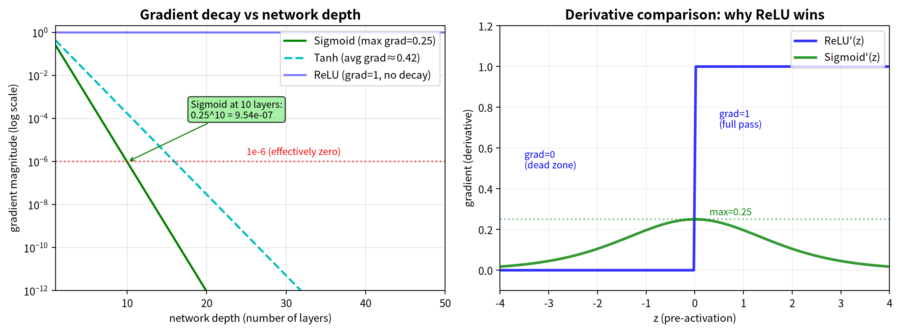

**图12**：左：Sigmoid（绿）的梯度随深度指数衰减——10层后降至$10^{-6}$，20层后接近机器精度极限；Tanh（青虚线）稍好但也衰减；ReLU（蓝）在正数区域梯度恒为1，无衰减。右：ReLU导数（蓝）在$z>0$时为1（全通），$z<0$时为0（死区）；Sigmoid导数（绿）最大0.25且两端迅速归零。**ReLU在正数区域的"1"，是深度学习之所以能"深"的根本原因。**

### SwiGLU：更聪明的激活门控

ReLU和Sigmoid各有硬伤：ReLU负数区一刀切归零，太粗暴；Sigmoid输入稍大就饱和到1、稍小就压到0，梯度在中间才能流动。有没有一种激活函数，既能平滑过渡，又能让数据自己决定"哪些信息该通过"？

**SwiGLU**（Swish-Gated Linear Unit，Swish门控线性单元）就是现代大模型给出的答案。它由两个技巧组合而成：

**第一步：Swish。** Swish的公式是 $x \cdot \sigma(x)$，即输入 $x$ 乘上Sigmoid门控 $\sigma(x)$。直观理解：Sigmoid 本身输出 0 到 1 之间的"软开关"值，Swish 再让 $x$ 乘上这个值——因此门控信号可以为负（负 $x$ 乘正 Sigmoid 得负），正值放行、负值压缩但不归零，不像 ReLU 那样硬切。当 $x$ 很大时，$\sigma(x) \approx 1$，Swish近似恒等映射；当 $x$ 为负时，$\sigma(x)$ 接近0，输出被温柔地压制。

**第二步：GLU（Gated Linear Unit，门控线性单元）。** 把输入 $x$ 分别通过两个不同的线性投影（$xW_1$ 和 $xW_2$），得到两个分支。$xW_1$ 经过 Swish 变成"门控信号"，$xW_2$ 是原始变换结果。然后用逐元素乘法 $\odot$ 让门控信号调节 $xW_2$ 的每个维度——哪些特征该放大、哪些该压制，由 $W_1$ 和 $W_2$ 的学习结果决定，不是人工预设。

**SwiGLU = Swish($xW_1$) $\odot$ ($xW_2$)。** 目前在PaLM、LLaMA、DeepSeek等主流大模型的FFN（Feed-Forward Network，前馈网络）中，SwiGLU是标配——它让模型自己学会哪些特征维度该强化、哪些该抑制。

**手算实例**：假设输入 $x = [1, -2, 0.5]$，两个投影矩阵 $W_1, W_2$ 已训练好：

| 维度 | $xW_1$（门控输入） | Swish($xW_1$)（门控值） | $xW_2$（信号值） | 输出 = 门控 $\times$ 信号 |
|------|------|------|------|------|
| 0 | 0.75 | 0.51 | -1.50 | -0.76 |
| 1 | -1.50 | -0.27 | 2.25 | -0.62 |
| 2 | -2.00 | -0.24 | -2.50 | 0.60 |

维度0的门控值0.51（明显放行但仍有衰减），信号-1.5约一半通过（-0.76）；维度1和2的门控值约-0.25（"压制"），信号被大幅缩小。关键在于：哪些维度放行、哪些压制，取决于 $W_1$ 学到的权重——这就是"数据驱动门控"。

> **一句话总结**：SwiGLU用Swish做平滑门控、用两个可学习投影决定信息通过率，是现代LLM FFN的标配激活函数。

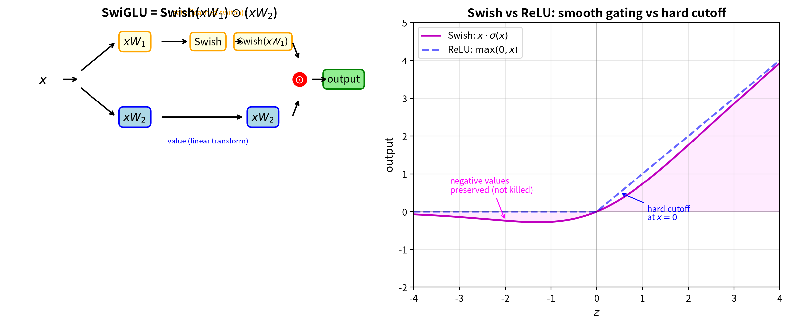

**图13**：SwiGLU的结构。输入 $x$ 分成两条路径：上路 $xW_1$ 经过 Swish 激活变成门控信号（平滑的软开关，可以为负值，决定每个维度该放行还是压制）；下路 $xW_2$ 是原始线性变换结果（信号本身）。两条路径在 $\times$ 节点逐元素相乘，门控信号调节信号的每个维度——放行的维度原样通过，压制的维度被缩小。与 ReLU 的硬切（负数直接归零）不同，SwiGLU 的门控值是 Swish 输出的连续值，且 $W_1, W_2$ 都是可学习参数，模型自己决定门控策略。

下图对比四种激活函数的形状：ReLU的"硬切"死区、Sigmoid的双端饱和、Swish的平滑门控、GELU的非单调"凸起"。激活函数的选择直接影响梯度能否顺利流动——这正是深层网络训练成败的关键。

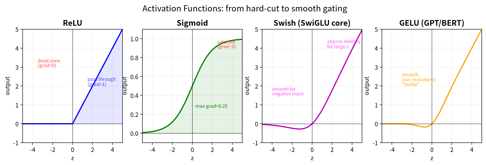

**图14**：左→右：ReLU（负数归零，正数直通，最简高效但可能死区）、Sigmoid（S型饱和，最大梯度仅0.25，深层易梯度消失）、Swish（SwiGLU核心，平滑门控负值不硬切）、GELU（GPT/BERT用，非单调有"凸起"，理论性质好）。ReLU家族统治了深度学习——因为梯度能顺利流动是训练成功的前提。

### 归一化层：RMSNorm与LayerNorm

梯度问题不只是激活函数的锅。在深层网络里，数值经过几十层矩阵乘法和累加，会像滚雪球一样越滚越大（爆炸）或越碾越扁（归零）。**归一化层**（Normalization Layer）就是在每层之间"踩刹车"，把数值拉回一个稳定的尺度。

最常用的归一化方法是 **LayerNorm**（Layer Normalization，层归一化）。它的公式是：

$$\text{LayerNorm}(x) = \frac{x - \mu}{\sqrt{\sigma^2 + \epsilon}} \cdot \gamma + \beta$$

逐符号拆解：$\mu$ 是当前层输入的**均值**（mean），$\sigma^2$ 是**方差**（variance），$\epsilon$ 是一个很小的常数（防止除以零），$\gamma$ 和 $\beta$ 是可学习的缩放和偏移参数。操作流程是"先减均值、再除标准差"——相当于把数据重新调整到均值为0、标准差为1的分布，再通过 $\gamma$ 和 $\beta$ 微调。

但在Transformer里，实践中观察到：经过Attention和残差连接的叠加后，激活值的均值通常接近零。更深层的原因是 Pre-Norm 架构——归一化只作用在子层内部，残差路径是一条不经任何 Norm 的纯加法通道，不断累加原始输入 $h$；而 Attention 输出是 $V$ 的凸组合（Softmax权重和为1），两者叠加后均值漂移有限。LayerNorm第一步"减均值"，实际上是在减去一个接近0的数——**对分布形状的调整作用很小**。

于是 **RMSNorm**（Root Mean Square Normalization，均方根归一化）应运而生：

$$\text{RMSNorm}(x) = \frac{x}{\sqrt{\text{mean}(x^2) + \epsilon}} \cdot \gamma$$

对比一下：RMSNorm直接去掉了减均值 $\mu$ 的那一步，只做除法归一化。LayerNorm同时控制**尺度**（方差）和**偏移**（均值），RMSNorm只控制尺度。因为Transformer中的激活值均值通常已经接近零，减均值这一步对归一化效果的影响很小——既然效果差不多，不如省掉，少一次全向量求均值和减法的计算开销。

RMSNorm比LayerNorm更轻量、更快，且在实际效果上不分伯仲。正因如此，LLaMA、DeepSeek、Mistral等现代大模型纷纷采用RMSNorm替代LayerNorm。选择归一化方法的核心逻辑和选择激活函数一样：**在确保数值稳定的前提下，能省则省**。

> **一句话总结**：RMSNorm去掉了LayerNorm中冗余的减均值步骤，只做除法归一化，是Transformer时代LayerNorm的轻量替代者。

## 4.6 数值稳定性

神经网络中的数值计算不是理论数学，而是要在计算机的有限精度下实际跑起来的。有几个关键的数值技巧，差之毫厘就会让你的模型训练从"顺利"变成"灾难"。

### Softmax数值技巧：先减最大值再取指数

Softmax函数的定义是：

$$\text{softmax}(z_i) = \frac{e^{z_i}}{\sum_{j=1}^{K} e^{z_j}}$$

这个公式在理论上完美无缺——把任意实数向量转换成一个概率分布（每个元素在0到1之间，且加起来等于1）。但实际计算时有个大坑：指数函数 $e^x$ 增长得非常快。

**具体大数字演示**：假设 $z = [1000, 1001, 1002]$（三个类别的原始分数）。

如果你直接计算 $e^{1000}$、$e^{1001}$、$e^{1002}$——计算机会直接溢出，返回 `inf`（无穷大）。因为 $e^{1000}$ 大约有435位数字（$1000 / \ln(10) \approx 434.3$），远远超出了64位浮点数的表示范围（最大约 $10^{308}$，相当于 $e^{709}$）。

**解决方案**：在取指数之前，先给整个向量减去它的最大值。

$$\text{softmax}(z_i) = \frac{e^{z_i - \max(z)}}{\sum_{j=1}^{K} e^{z_j - \max(z)}}$$

为什么要减去最大值？因为分子分母同时除以一个常数（$e^{\max(z)}$），分数的值不变，但数值范围变得安全了。具体推导：

$$\frac{e^{z_i}}{\sum_j e^{z_j}} = \frac{e^{z_i} / e^{\max(z)}}{\sum_j e^{z_j} / e^{\max(z)}} = \frac{e^{z_i - \max(z)}}{\sum_j e^{z_j - \max(z)}}$$

接上例，$\max(z) = 1002$：

$$z' = z - 1002 = [-2, -1, 0]$$

现在计算指数：

$$e^{-2} \approx 0.135, \quad e^{-1} \approx 0.368, \quad e^{0} = 1.000$$

分母 = $0.135 + 0.368 + 1.000 = 1.503$

最终概率：

$$p = \left[\frac{0.135}{1.503}, \frac{0.368}{1.503}, \frac{1.000}{1.503}\right] \approx [0.090, 0.245, 0.665]$$

三个概率加起来等于1，最大的 $z_3$ 得到了最大的概率（0.665），没有任何数值溢出。**这个"先减max"的技巧，是每一个深度学习框架（PyTorch、TensorFlow）在实现Softmax时的标配操作。**

### Xavier / Kaiming 初始化

在训练开始之前，所有权重都要被初始化成一些随机值。但随机值可不是随便选的——如果权重太大，信号会在前向传播中被逐层放大，最终变成天文数字（**梯度爆炸**）；如果权重太小，信号会逐层衰减，最终消失不见（**梯度消失**）。

**核心思想**：保持每一层输出信号的方差大致等于输入信号的方差（$\approx 1$）。这样信号从输入层传到输出层，既不会爆炸也不会消失。

**Xavier（Glorot）初始化**：适用于Sigmoid或Tanh激活函数的网络。

$$W \sim \text{Uniform}\left(-\sqrt{\frac{6}{n_{\text{in}} + n_{\text{out}}}}, \; +\sqrt{\frac{6}{n_{\text{in}} + n_{\text{out}}}}\right)$$

其中 $n_{\text{in}}$ 是输入维度，$n_{\text{out}}$ 是输出维度。直观理解：连接的神经元越多（$n_{\text{in}}$ 越大），每个权重的幅度就要越小，因为多个输入的加权和的方差会随输入数量线性增长。

**Kaiming（He）初始化**：专门为ReLU激活函数设计。ReLU 把负数置零后，激活值的二阶矩 $E[\text{ReLU}(z)^2]$ 只有 $\text{Var}(z)$ 的一半——一半信号被砍掉了。要让输出方差恢复到和输入一样，权重方差需要乘以 2 补偿：

$$W \sim \mathcal{N}\left(0, \; \frac{2}{n_{\text{in}}}\right)$$

**直观理解**：Xavier/Kaiming初始化在校准每层的信号"放大倍数"——放大太多，信号传到顶层就变成噪音；放得太少，信号在中途就消失了。好的初始化让信号刚好"平稳流动"，这是训练深度网络的第一步，也是最容易被忽视的一步。

## 4.7 AI落地

| 应用场景 | 一句话解释"没有这个数学工具会怎样" |
|---------|-----------------------------------|
| **PyTorch autograd原理** | autograd（自动微分）的本质就是反向传播——你定义前向计算图，系统自动帮你算梯度。没有它，你得手写每一层的梯度公式，深度学习根本不可能普及 |
| **微调时冻结层** | 预训练模型（如BERT）微调时经常冻结底层参数。原理是阻止梯度反向流到这些层——如果不冻结，底层学到的通用语言知识会被任务特定的数据"冲走"，模型反而表现更差 |
| **梯度检查（finite difference）** | 用数值方法验证反向传播的实现是否正确。如果不做梯度检查，你的代码可能有隐蔽的梯度bug——比如链式法则某一步漏了一个转置——模型还能跑但永远训不好，而且这种bug极难肉眼发现 |
| **RMSNorm稳定深层Transformer** | 没有归一化层，深层网络数值会像滚雪球一样爆炸或归零。RMSNorm比LayerNorm更轻量，是LLaMA/DeepSeek的标准配置 |
| **SwiGLU作为现代FFN激活** | SwiGLU用数据驱动的门控替代ReLU的硬切，让模型自己学会哪些特征维度该强化、哪些该抑制。PaLM/LLaMA/DeepSeek都用它 |
| **混合精度训练（bf16/FP16）** | 用低精度浮点加速训练时数值稳定性问题被放大——LLM 预训练已从 FP16 转向指数范围更宽的 bf16。不理解 Softmax 减 max、Xavier 初始化这些数值技巧，低精度训练会直接 NAN 崩溃 |

## 4.8 常见误解

**误解1：反向传播 = 反向的前向**

很多人第一次听到"反向传播"时，直觉上会觉得："哦，就是把数据倒着传一遍嘛！"这个理解是大错特错的。

**真相**：前向传播和反向传播走的是**同一条路**（同一个计算图），但运输的**货物完全不同**。前向传播从左到右运输的是**数据**（输入向量 $\boldsymbol{x}$ 经过层层变换变成预测 $\hat{y}$）；反向传播从右到左运输的是**梯度**（误差信号 $\partial L / \partial \hat{y}$ 经过层层传递变成 $\partial L / \partial W$）。一个运的是"产品"，一个运的是"质量反馈"——两者方向相反、内容不同，但走的确实是同一条流水线。如果反向传播真的只是"数据倒着传"，那你的神经网络除了浪费电之外，什么都不会学到。

**误解2：梯度下降 = 反向传播**

这是深度学习初学者中最常见的混淆。很多人把这两个词当成同义词来用，甚至一些不太严谨的教程也把它们混为一谈。

**真相**：这两个概念的分工非常明确——**反向传播负责"算账"，梯度下降负责"走路"**。反向传播（Backpropagation）是链式法则在计算图上的系统应用，它的输出是每个参数的梯度（也就是"损失对这个参数的敏感度"）。但它本身并不改变任何参数。梯度下降（Gradient Descent）才是那个真正"动手"的优化算法：它拿着反向传播算出来的梯度，沿着梯度的反方向更新参数——$W \leftarrow W - \eta \cdot \partial L / \partial W$。用一个比喻：反向传播是GPS导航告诉你"应该往哪个方向走"，梯度下降是你真正迈出那一步。GPS不迈步，迈步的不导航，二者缺一不可，但职责分明。

**误解3：梯度消失就是"梯度变成零"，只有RNN才有**

初学者常以为梯度消失只发生在循环神经网络（RNN）中，因为RNN的"循环"结构会让梯度在时间上反复乘以同一个权重矩阵。但实际上，梯度消失是所有深层网络的共同敌人。

**真相**：任何深层网络（包括MLP、CNN、Transformer）在反向传播时，梯度都要从输出层一路乘回输入层。每一层的激活函数导数、权重矩阵都会参与到这个"乘法链条"中。如果绝大多数乘数都小于1，连乘的结果就会指数级衰减。使用Sigmoid的10层MLP，即使每层只把梯度乘以0.25，传到第1层时梯度也只有初始值的 $10^{-6}$——跟零没有本质区别。ReLU之所以能突破梯度消失困境，就是因为它在正数区域的梯度恒为1，打破了"逐层衰减"的连乘衰减。

 * * *
## 4.9 自动微分：链式法则的计算机实现

前面我们手算了链式法则的每一步——这是一个很好的教学练习，让你理解"追责"的机制。但在实际工程中，你永远不会手算。PyTorch的**自动梯度引擎（autograd）**和TensorFlow的**梯度记录器（GradientTape）**帮你做这件事。

**计算图 + 节点级微分 = 自动微分**。框架把前向计算自动构建成一张计算图——每个运算（加减乘除、矩阵乘法、激活函数）是一个节点。每个节点只需要回答一个本地问题："我对输入的局部导数是什么？" 反向传播时，框架沿着图的边自动传递梯度。节点A不需要知道整个网络的拓扑，只关心自己的输出如何影响下游——就像快递中转站，只管把包裹转发到下一站，不用管整个物流网络的全貌。

**手算实例**：用 $f(x, y) = (x \cdot y) + \sin(x)$ 演示自动微分的完整流程。

**前向传播**（自底向上，记录每个节点的值）：

| 节点 | 计算 | 值（设 $x=2, y=3$） |
|------|------|------|
| $a = x \cdot y$ | $2 \times 3$ | $6$ |
| $b = \sin(x)$ | $\sin(2)$ | $0.909$ |
| $f = a + b$ | $6 + 0.909$ | $6.909$ |

**反向传播**（自顶向下，每个节点算局部导数，乘以上游传来的梯度）：

目标：求 $\frac{\partial f}{\partial x}$ 和 $\frac{\partial f}{\partial y}$。从 $f$ 出发，初始梯度 $\frac{\partial f}{\partial f} = 1$。

| 步骤 | 节点 | 局部导数 | 链式法则 | 梯度 |
|------|------|------|------|------|
| 1 | $f = a + b$ | $\frac{\partial f}{\partial a} = 1$, $\frac{\partial f}{\partial b} = 1$ | 上游=1 | $\frac{\partial f}{\partial a} = 1$, $\frac{\partial f}{\partial b} = 1$ |
| 2 | $a = x \cdot y$ | $\frac{\partial a}{\partial x} = y = 3$, $\frac{\partial a}{\partial y} = x = 2$ | 上游 $\frac{\partial f}{\partial a} = 1$ | $\frac{\partial f}{\partial x}\big\|_a = 1 \times 3 = 3$, $\frac{\partial f}{\partial y} = 1 \times 2 = 2$ |
| 3 | $b = \sin(x)$ | $\frac{\partial b}{\partial x} = \cos(x) = \cos(2) \approx -0.416$ | 上游 $\frac{\partial f}{\partial b} = 1$ | $\frac{\partial f}{\partial x}\big\|_b = 1 \times (-0.416) = -0.416$ |
| 4 | 汇总 $x$ | $x$ 有两条路径（$a$ 和 $b$） | 相加 | $\frac{\partial f}{\partial x} = 3 + (-0.416) = 2.584$ |

最终结果：$\frac{\partial f}{\partial x} = y + \cos(x) = 3 - 0.416 = 2.584$，$\frac{\partial f}{\partial y} = x = 2$。

关键洞察：每个节点只做了一件事——**算自己的局部导数，乘以上游传来的梯度**。$a = x \cdot y$ 节点不需要知道 $b = \sin(x)$ 的存在，它只管把自己的局部导数 $y=3$ 往前传。框架自动把这些局部梯度沿边传递、在分叉点汇总——这就是"自动微分"的本质。当网络有百万参数时，原理完全一样，只是节点多到人手算不过来。

这里有两个模式值得一提。**前向模式**是从输入到输出逐节点算导数，适合"输入少、输出多"的场景。**反向模式**（也就是我们学的反向传播）是从输出到输入逐节点算导数，适合"输入多、输出少"的场景——深度学习正好是这样：百万级参数，最后却只压缩成一个标量损失值。反向模式因此成为了绝对主流。

**自动微分是深度学习平民化的关键技术**。你只需要定义前向计算（输入怎么变成预测），框架自动帮你算梯度——不必为每个新结构手动推导梯度公式。

有了自动微分，你可以放心地搭建任意复杂的前向计算图，而不用担心梯度怎么算。Ch5的Attention机制涉及大量矩阵运算，如果没有自动微分，手动推导Q/K/V的梯度几乎是不可能的任务。

## 4.10 本章回顾

Ch4的核心链条：**前向传播**（数据从输入层层加工到输出）→ **损失函数**（衡量预测有多差）→ **反向传播**（链式法则把责任逐层倒推）→ **梯度下降**（用梯度更新参数）。四个环节缺一不可，构成了神经网络训练的完整闭环。

三个关键记忆点：
- **链式法则 = 乘法式追责**：总梯度 = 各局部梯度的乘积
- **ReLU的"1"突破了梯度消失困境**：正数区域梯度恒为1，打破逐层衰减
- **自动微分让深度学习平民化**：定义前向计算，框架自动算梯度

**本章自检**：

**【知识点】**

1. 链式法则在反向传播中扮演什么角色？为什么叫"乘法式追责"？
2. ReLU的梯度在正数区域和负数区域分别是多少？为什么这能缓解梯度消失？
3. MSE（回归）和交叉熵（分类）的末端梯度分别是什么？为什么形式不同但传播机制一样？
4. 自动微分为什么能让深度学习"平民化"？它和手写梯度公式相比，优势在哪里？
5. 生成：不看书，把 §4.3 的前向三步与反向梯度流画成一张你自己的计算图：每个节点标注数值，每条边标注传递的东西（数据还是梯度）与维度。
6. 边界：ReLU 的"梯度=1"在什么条件下失效？Sigmoid 为什么让深层梯度消失（$0.25^{10} \approx 10^{-6}$）？死亡 ReLU（Dead ReLU）怎么发生、怎么预防？

**【逻辑链】**

1. 沿这条链走一遍，理解四个环节为什么缺一不可：

   **输入 x** → **前向传播**（$W_1$→激活→$W_2$→…→输出 p）→ **损失函数** L(p, y) → **反向传播**（链式法则逐层求导）→ **梯度下降**（$W_i \leftarrow W_i - \eta \cdot \partial L / \partial W_i$）→ 循环

> **未解问题**：Ch4 把链式法则的"追责链"讲透了——从输出层的损失信号，一步步传回输入层的权重。这套工具能不能拆解 Transformer 的核心组件——Attention 的梯度？Self-Attention 的 Q（Query，查询）、K（Key，键）、V（Value，值）三个矩阵的梯度，正是 Ch4 链式法则的直接应用。

 * * *
# 第5章：Attention机制——动态加权平均

处理一段文本时，模型需要决定"该关注哪些词"。比如"苹果"在"吃苹果"和"苹果公司"里该关联的词完全不同——该关注谁取决于内容，不能预先固定。Attention 的核心创新是**数据依赖的动态加权**，完整公式只有一行：

$$\text{Attention}(Q, K, V) = \text{softmax}\!\left(\frac{QK^T}{\sqrt{d_k}}\right) V$$

一句话读懂这个公式：$Q$（Query，查询）和 $K$（Key，键）的点积 $QK^T$ 算出"谁该关注谁"的分数，除以 $\sqrt{d_k}$ 防止数值过大，Softmax 把分数变成概率权重，最后用权重对 $V$（Value，值）加权求和。本质上是两步——**基于内容相似度的软寻址**（$QK^T$ 算匹配度，Softmax 给出权重）**+ 加权提取**（用权重对 $V$ 求和）。$Q$、$K$、$V$ 都由输入 $X$ 乘以三个可学习的权重矩阵 $W_Q$、$W_K$、$W_V$ 得到——这三个矩阵在训练时学会、推理时固定，但 $Q$、$K$、$V$ 的值随输入变化，所以注意力权重对不同输入完全不同。这就是"数据依赖"：加权策略不是预设的固定参数，而是由输入数据经学习到的变换实时决定。

这一创新背后需要两个数学工具：Softmax（Ch3，把分数变成概率）和链式法则（Ch4，把梯度传回每个参数）。但它们只是配角——本章的主角是 Attention 本身。

如果你觉得"数据依赖的门控"这个说法似曾相识——没错，Ch4 的 SwiGLU 也是数据驱动的：$xW_1$ 控制 $xW_2$ 的通过率。但两者有本质区别：SwiGLU 是**同一位置**的逐维度门控（$W_1, W_2$ 作用于同一个 $x$，决定哪些特征维度该强化），Attention 是**跨位置**的加权聚合（决定该关注哪些词）。一个管"特征筛选"，一个管"信息聚合"。

> Attention 的公式只有一行，但要让它真正可用，还有一串配套：位置编码让词带上顺序，多头让关注视角并行，反向传播让它学会加权，KV Cache 让它生成变快——最后，它和其他积木拼成完整的语言模型。

> **本章路线**：先吃透 Attention 核心（动态加权、位置编码、多头并行、NumPy 实现），再看选读的长序列延伸（混合架构与 Mamba），最后看这些零件如何拼成完整语言模型——本章的"奖励关"。

> **核心概念**：
> 1. Attention 是数据依赖的动态加权：Q 查 K，Softmax 给权重，加权 V。
> 2. 除以 $\sqrt{d_k}$ 防止 Softmax 极端化、梯度消失。
> 3. 多头让模型从多个子空间并行看问题。
> 4. RoPE 让 Attention 感知顺序。
> 5. Attention+FFN+残差+归一化拼装后就是现代 LLM。

> **动笔前自检**：①Ch3 的 Softmax 把什么变成什么？②Ch4 的链式法则一句话是什么？③Ch4 手算例里的 $\hat{y}=135$ 是怎么一步步算出来的（$Wx+b$ → ReLU → $Vh+c$）？

 * * *
## 5.1 生活类比：头痛时该听哪位专家？

你走进一间会诊室，对着十位专家说："医生，我头痛。"神经内科教授的专长标签写着"擅长头痛"——跟你描述的症状匹配度最高。心血管科专家的标签写着"擅长高血压引起的头痛"——也有关，但相关度次之。皮肤科专家说"擅长皮疹"——完全不搭，匹配度趋近于零。

对照公式：你的症状是 **Query**（$Q$，你在问什么），每位专家的专长标签是 **Key**（$K$，他们擅长什么），二者匹配得到注意力权重；权重越高，这位专家给出的治疗方案 **Value**（$V$）就越被采纳。最终诊断不是听某一个专家，而是所有专家按"对症程度"加权投票的结果。

关键在于：这个匹配过程**动态重新计算**——同样的专家阵容，不同的问题，注意力分配完全不同。这就是"数据依赖的动态加权"。

 * * *
## 5.2 Attention详解

上面用比喻理解了公式各部分的角色，下面逐步拆解——每个步骤都配手算。

### 公式1：从输入到Q、K、V的投影

$$Q = XW_Q, \quad K = XW_K, \quad V = XW_V$$

**这句话在说什么？** "投影"（projection）是工程行话——指矩阵乘法 $XW$ 把输入向量从 $d$ 维变换到 $d_k$ 维，就像把三维空间中的点投到二维屏幕上。（严格地说，线性代数中的投影矩阵要求 $P^2 = P$，即投影两次等于投影一次；此处的 $W_Q, W_K, W_V$ 是一般可学习线性变换，不满足幂等性，"投影"只是习惯叫法。）输入矩阵 $X$ 的每一行是一个token的向量表示。$W_Q$、$W_K$、$W_V$ 是三副不同的"投影眼镜"——它们把同一个输入从原始维度投影到不同的语义子空间。Query空间负责"提问"，Key空间负责"报专长"，Value空间负责"给建议"。三个投影矩阵各自独立可学习，这意味着网络可以自己决定"用什么角度提问""用什么维度描述专长""用什么坐标表达建议"。

**逐符号注释：**
- $X \in \mathbb{R}^{n \times d}$：输入矩阵，$n=3$ 个token（你可以把token理解为文本被切分后的"词汇单元"，可能是一个词、一个字，或一个词片段），每个 $d=4$ 维
- $W_Q, W_K, W_V \in \mathbb{R}^{d \times d_k}$：三个投影矩阵，从4维投影到 $d_k=2$ 维
- $Q, K, V \in \mathbb{R}^{n \times d_k}$：投影后的三个矩阵，每个都是3行2列

**数字代入演示：**

假设输入（代表三个token，每个4维）为：

$$X = \begin{bmatrix} 0.1 & 0.2 & 0.3 & 0.4 \\ 0.5 & 0.6 & 0.7 & 0.8 \\ 0.9 & 1.0 & 1.1 & 1.2 \end{bmatrix} \quad (3 \times 4)$$

Query投影矩阵（取第1、3维作为第1维，第2、4维作为第2维）：

$$W_Q = \begin{bmatrix} 1 & 0 \\ 0 & 1 \\ 1 & 0 \\ 0 & 1 \end{bmatrix} \quad (4 \times 2)$$

Key投影矩阵（取第1+3维之和作为第1维，第1+2+4维之和作为第2维）：

$$W_K = \begin{bmatrix} 1 & 1 \\ 0 & 1 \\ 1 & 0 \\ 0 & 1 \end{bmatrix} \quad (4 \times 2)$$

Value投影矩阵（交换并重排维度）：

$$W_V = \begin{bmatrix} 0 & 1 \\ 1 & 0 \\ 0 & 1 \\ 1 & 0 \end{bmatrix} \quad (4 \times 2)$$

**手算 $Q = XW_Q$：** 第1行第1列 = $0.1 \times 1 + 0.2 \times 0 + 0.3 \times 1 + 0.4 \times 0 = 0.4$；第1行第2列 = $0.1 \times 0 + 0.2 \times 1 + 0.3 \times 0 + 0.4 \times 1 = 0.6$。

完整结果：

$$Q = \begin{bmatrix} 0.4 & 0.6 \\ 1.2 & 1.4 \\ 2.0 & 2.2 \end{bmatrix} \quad (3 \times 2)$$

同理，$K = XW_K$（手算方法与Q相同——第i行第j列 = X的第i行与$W_K$的第j列做点积）：

$$K = \begin{bmatrix} 0.4 & 0.7 \\ 1.2 & 1.9 \\ 2.0 & 3.1 \end{bmatrix} \quad (3 \times 2)$$

$V = XW_V$：

$$V = \begin{bmatrix} 0.6 & 0.4 \\ 1.4 & 1.2 \\ 2.2 & 2.0 \end{bmatrix} \quad (3 \times 2)$$

**直觉总结：三个矩阵乘法是同一个输入用三种不同的透镜来看**。$Q$ 读出了"每个token想问什么"，$K$ 读出了"每个token擅长什么"，$V$ 读出了"每个token能贡献什么信息"。维度变化很清晰：$X(3 \times 4) \times W(4 \times 2) \rightarrow Q/K/V(3 \times 2)$，内维4被消去，留下3个token $\times$ 2维投影。


### 公式2：匹配度分数 $S = QK^T / \sqrt{d_k}$

$$S = \frac{QK^T}{\sqrt{d_k}}$$

**这句话在说什么？** $Q$ 的第 $i$ 行（代表第 $i$ 个token的问题向量）与 $K$ 的第 $j$ 行（代表第 $j$ 个token的专长向量）做点积，得到第 $i$ 个token对第 $j$ 个token的"关注程度"。除以 $\sqrt{d_k}$ 是为了防止数值过大导致后续Softmax饱和。

**逐符号注释：**
- $Q \in \mathbb{R}^{n \times d_k}$：查询矩阵（$3 \times 2$）
- $K^T \in \mathbb{R}^{d_k \times n}$：Key矩阵的转置（$2 \times 3$）
- $S \in \mathbb{R}^{n \times n}$：分数矩阵（$3 \times 3$），$S_{ij}$ 表示token $i$ 对 token $j$ 的注意力分数
- $d_k = 2$：投影维度，$\sqrt{d_k} \approx 1.414$

**数字代入演示：**

$QK^T$ 的第1行第1列：$[0.4, 0.6] \cdot [0.4, 0.7] = 0.4 \times 0.4 + 0.6 \times 0.7 = 0.16 + 0.42 = 0.58$。

$QK^T$ 的第1行第2列：$[0.4, 0.6] \cdot [1.2, 1.9] = 0.4 \times 1.2 + 0.6 \times 1.9 = 0.48 + 1.14 = 1.62$。

$QK^T$ 的第1行第3列：$[0.4, 0.6] \cdot [2.0, 3.1] = 0.4 \times 2.0 + 0.6 \times 3.1 = 0.80 + 1.86 = 2.66$。

全部9个点积（$QK^T$）：

$$QK^T = \begin{bmatrix} 0.58 & 1.62 & 2.66 \\ 1.46 & 4.10 & 6.74 \\ 2.34 & 6.58 & 10.82 \end{bmatrix} \quad (3 \times 3)$$

除以 $\sqrt{d_k} = \sqrt{2} \approx 1.414$：

$$S = \begin{bmatrix} 0.410 & 1.146 & 1.881 \\ 1.032 & 2.899 & 4.766 \\ 1.655 & 4.653 & 7.651 \end{bmatrix} \quad (3 \times 3)$$

**维度检查：** $Q(3 \times 2) \times K^T(2 \times 3) = S(3 \times 3)$，内维2消去，得到方阵。

**先猜**：$d_k = 64$ 时，$Q$、$K$ 的元素方差各约 1，它们的点积标准差大概是多少？（提示：点积 = $d_k$ 个乘积之和）

**为什么必须除以 $\sqrt{d_k}$？** 这是最关键的细节。

关键在于 $Q$ 和 $K$ 的元素方差。$Q = XW_Q$，每个元素是 $X$ 的行向量与 $W_Q$ 的列向量的点积。在标准的初始化方案（如Xavier初始化）下，$W_Q$ 的元素方差设为 $1/d$，使得 $Q$ 的每个元素方差约为1——不是 $1/d_k$，而是与 $d_k$ 无关的常数。

当 $Q$ 和 $K$ 的元素均值为0、方差约为1且近似独立时，点积 $q_i \cdot k_j = \sum_{l=1}^{d_k} q_{il} k_{jl}$ 的方差约为 $d_k$（$d_k$ 个独立项，每项贡献方差1）。对于 $d_k = 64$，标准差约为 $\sqrt{d_k} = 8$，分数散落在很大的范围内（比如-20到+20），Softmax会把最大的那个推近1，其余压近0，Softmax的梯度几乎消失。除以 $\sqrt{d_k} = 8$ 后，方差被压回约1，Softmax的梯度才能正常流动。

对比实验：
- $d_k = 64$，不除 $\sqrt{d_k}$：点积标准差 $\approx 8$，Softmax极化严重
- $d_k = 1$，不除 $\sqrt{d_k}$：点积就是标量乘法，方差为1，不需要缩放

所以除以 $\sqrt{d_k}$ 本质上是一个"尺度调节"——让Softmax的输入保持合理的尺度，不至于太热（全部注意力给一个）或太冷（注意力均匀分散）。从数学形式上看，$1/\sqrt{d_k}$ 在Softmax中扮演的角色和第3章的 $1/T$ 形式相似——都是缩放指数的输入。但两者有本质区别：第3章的 $T$ 是可调超参数（反映约束松紧），这里的 $\sqrt{d_k}$ 是固定值（由维度决定，不可调，反映数值稳定性需求）。形式相似，来源和可调性不同。

 * * *
### 公式3：注意力权重 $A = \text{softmax}(S)$

$$A = \text{softmax}(S)$$

**这句话在说什么？** 对分数矩阵 $S$ 的每一行做Softmax归一化，把原始分数转换成概率分布。每一行的和为1，表示"当前token的注意力预算被100%分配给所有token"。

**逐符号注释：**
- $S \in \mathbb{R}^{n \times n}$：原始分数矩阵（$3 \times 3$）
- $A \in \mathbb{R}^{n \times n}$：注意力权重矩阵（$3 \times 3$），$A_{ij}$ 表示token $i$ 分配给 token $j$ 的注意力比例
- Softmax按行操作（每个token独立决定如何分配注意力）

**数字代入演示：**

对第0行 $[0.410, 1.146, 1.881]$ 做Softmax：
- 先减最大值（数值稳定性）：$[0.410 - 1.881, 1.146 - 1.881, 1.881 - 1.881] = [-1.471, -0.735, 0]$
- 求指数：$[e^{-1.471}, e^{-0.735}, e^0] \approx [0.230, 0.480, 1.000]$
- 归一化（除以总和 $0.230 + 0.480 + 1.000 = 1.710$）：$[0.134, 0.281, 0.585]$

对第1行 $[1.032, 2.899, 4.766]$：
- 减最大值：$[-3.734, -1.867, 0]$
- 指数：$[0.024, 0.155, 1.000]$
- 归一化（总和 $1.179$）：$[0.020, 0.131, 0.849]$

对第2行 $[1.655, 4.653, 7.651]$：
- 减最大值：$[-5.996, -2.998, 0]$
- 指数：$[0.002, 0.050, 1.000]$
- 归一化（总和 $1.052$）：$[0.002, 0.047, 0.951]$

完整结果：

$$A = \begin{bmatrix} 0.1344 & 0.2805 & 0.5851 \\ 0.0203 & 0.1312 & 0.8485 \\ 0.0024 & 0.0474 & 0.9502 \end{bmatrix} \quad (3 \times 3)$$

**验证每行和为1：** 第0行 $0.1344 + 0.2805 + 0.5851 = 1.0000$，第1行 $0.0203 + 0.1312 + 0.8485 = 1.0000$，第2行 $0.0024 + 0.0474 + 0.9502 = 1.0000$。

**直觉总结：** 看这个矩阵很有意思。第0行（代表第1个token的注意力分配）最"民主"——给第3个token最多关注（0.585），但也给了前两个token不少份额。第2行（第3个token的注意力分配）最"专制"——95%的注意力都给了自己（第3个token），只有4.7%给了第2个token。

**注意**：这里"第3个token最关注自己"是**我们手造数据的结果**——$X$ 的第3行数值最大（1.2），softmax 天然给数值最大的 Query 自己和它相似的 Key 最高权重。它不是语言模型的普遍规律（真实模型里"靠后 token 更关注自己"由位置编码、因果掩码、具体训练数据共同决定，不存在这样一条简单的铁律）。这个例子只想说明：**注意力权重是"谁和谁相似"的数值体现**，不是"位置越靠后越自私"的机制。

下图将上述注意力权重矩阵可视化为热力图，可以直观看到每个token如何分配注意力：

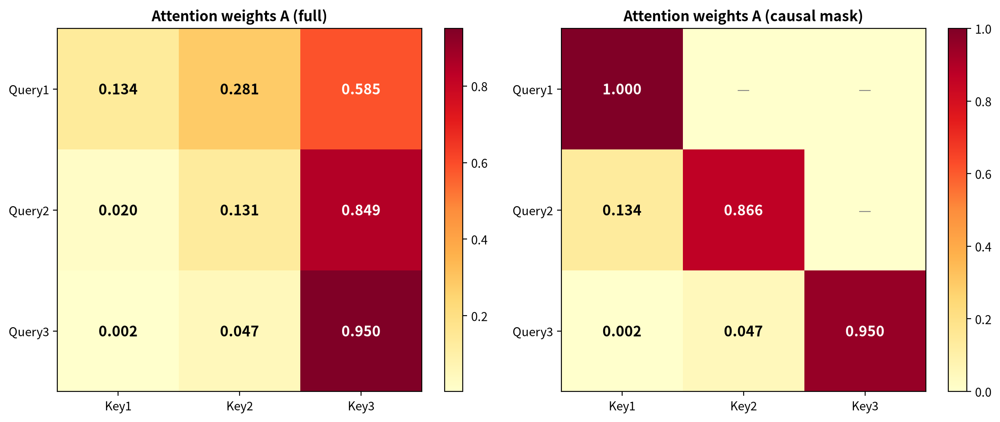

**图15**：$3\times3$的注意力权重矩阵 $A$ 的热力图（即上方手算结果）。每行代表一个Query token对所有Key token的注意力分配，行和为1。颜色越深表示注意力越集中——可以看到第1个token（第0行）注意力较均匀，第3个token（第2行）几乎全集中在自己身上（0.95）。

 * * *
### 公式4：加权汇总 $O = AV$

$$O = AV$$

**这句话在说什么？** 用注意力权重 $A$ 对值矩阵 $V$ 做加权线性组合。输出 $O$ 的第 $i$ 行，是 $V$ 的所有行按 $A$ 的第 $i$ 行作为权重加权求和的结果。每个token的输出表示都混入了其他token的信息，混入的比例由注意力权重决定。

**逐符号注释：**
- $A \in \mathbb{R}^{n \times n}$：注意力权重矩阵（$3 \times 3$）
- $V \in \mathbb{R}^{n \times d_k}$：值矩阵（$3 \times 2$）
- $O \in \mathbb{R}^{n \times d_k}$：输出矩阵（$3 \times 2$），$O$ 的每一行是加权上下文表示

**数字代入演示：**

$O$ 的第0行第0列：$0.1344 \times 0.6 + 0.2805 \times 1.4 + 0.5851 \times 2.2 = 0.0806 + 0.3927 + 1.2872 = 1.7606$

$O$ 的第0行第1列：$0.1344 \times 0.4 + 0.2805 \times 1.2 + 0.5851 \times 2.0 = 0.0538 + 0.3366 + 1.1702 = 1.5606$

完整结果：

$$O = \begin{bmatrix} 1.7606 & 1.5606 \\ 2.0626 & 1.8626 \\ 2.1583 & 1.9583 \end{bmatrix} \quad (3 \times 2)$$

**维度检查：** $A(3 \times 3) \times V(3 \times 2) = O(3 \times 2)$，内维3消去。

**直觉总结：** 对比一下输入和输出。$V$ 的第0行是 $[0.6, 0.4]$，但经过Attention加权后变成了 $[1.7606, 1.5606]$——明显向 $V$ 的第2行（$[2.2, 2.0]$）偏移了，因为第0行注意力中第2个token占了58.5%的权重。这就是Attention在做的事情：**让每个token的表示被它"感兴趣"的其他token的信息所修正和丰富。** 这个修正过程是线性的（加权平均），但权重本身是非线性的（Softmax），所以整体是"线性组合+非线性门控"的混合体。

下图将Q/K/V投影和最终输出 $O=AV$ 的合成过程可视化：

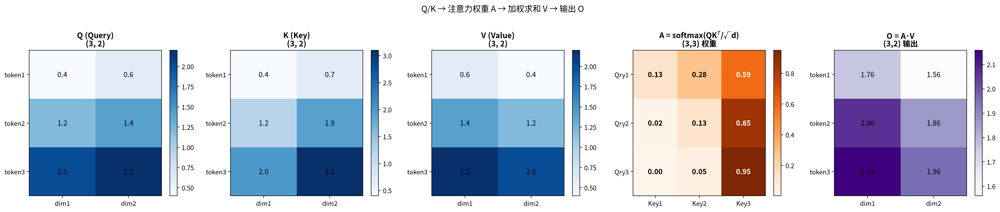

**图16**：左图展示三个token在Query投影空间中的位置（即 $Q$ 矩阵的三行）；中图展示Query-Key的匹配度（夹角越小匹配越高，对应 $QK^T$ 的值越大）；右图展示注意力加权输出 $O=AV$ 的合成过程——每个token的输出是所有Value向量按注意力权重的加权平均。

 * * *
## 5.3 位置编码：RoPE——让Attention感知顺序

§5.2 完整展示了Attention的四步流水线：Q/K/V投影 → $QK^T/\sqrt{d_k}$ → softmax → $AV$。但这个流水线有一个致命缺陷：**它对token的顺序一无所知**。

想象一下，你把"我吃苹果"和"苹果吃我"两句话的token打乱成同一袋 token 丢给Attention。由于每个token的Q、K、V只依赖它自身的嵌入向量，无论token排在第几个位置，计算出来的结果都一模一样。用术语说，Transformer是**置换等变**的——你把输入token的顺序任意打乱，Attention的输出也跟着同等打乱，但数值本身完全不变。这意味着模型根本无法区分主语和宾语的位置，"我打你"和"你打我"在它眼里毫无区别。

这显然不可接受。怎么办？

加法位置编码（把位置信息直接加到 token 嵌入向量上，Transformer 原论文的方案），它有效但有一个局限：位置信号和语义信号在同一个向量里相加，模型要在训练中自己学会"哪些维度是位置、哪些是语义"——这能做到，但位置与语义之间没有结构上的区分，而且加法是固定的：位置一旦编码进嵌入就"写死"了，无法自然外推到训练时未见过的更长序列。

更本质的方案是**RoPE**（Rotary Positional Embedding，旋转式位置编码）。它的核心思想：不给向量"加"位置信息，而是给Q和K向量各"旋转"一个角度。

为什么选"旋转"而不是"加法"？关键在点积的性质：两个向量的点积只依赖它们的**夹角**，不依赖各自的绝对方向。加法把位置塞进向量幅值里，位置一变，整个向量的"语义内容"也跟着变；旋转只改变向量的**朝向**、不碰长度——语义强度原样保留，位置信息全放在"朝向"里。于是点积天然只"看见"两个token的朝向差，也就是它们的**相对位置**。RoPE插在四步流水线的公式1和公式2之间——投影出Q和K之后、计算点积之前，给Q和K各旋转一个位置相关的角度，V不动。

具体来说，位置为 $pos$ 的token，其Q和K向量会乘以一个旋转矩阵 $R(\theta \cdot pos)$。$\theta$ 是预设的旋转频率（每个维度对一个 $\theta$），$pos$ 是token在序列中的位置编号。旋转矩阵的定义是：

$$R(\alpha) = \begin{bmatrix} \cos\alpha & -\sin\alpha \\ \sin\alpha & \cos\alpha \end{bmatrix}$$

它将二维向量旋转 $\alpha$ 弧度，保持长度不变。当位置 $m$ 的Q和位置 $n$ 的K做Attention时，Q旋转了 $\theta \cdot m$，K旋转了 $\theta \cdot n$，两者点积的结果只包含旋转角度差 $\theta(m-n)$——**这个角度差直接编码了两个token的相对距离**。

RoPE的直觉：每个token的Q/K向量都有一个"朝向"，朝向由它的位置决定。两个token的朝向差等于 $\theta \times$ 相对距离——距离越近，朝向差越小，点积越大。

**一个极简的二维手算演示**：设 $\theta = 15°$（每个位置旋转15度），Q 和 K 的原始向量都是 $[1, 0]$（长度为1）。

每个位置的 Q（和 K）按位置编号旋转：

| 位置 | 旋转角度 | Q 向量 |
|------|------|------|
| 0 | 0° | $[1.000, 0.000]$ |
| 1 | 15° | $[0.966, 0.259]$ |
| 2 | 30° | $[0.866, 0.500]$ |
| 3 | 45° | $[0.707, 0.707]$ |

现在算 Attention 分数 $QK^T$（即点积）。因为 $|Q|=|K|=1$，两个单位向量的点积等于 $\cos$(夹角)，而这里的夹角恰好是两个位置的旋转角度差：

| 查询 | 被关注 | 角度差 | 内积 = $\cos$(角度差) |
|------|------|------|------|
| 位置0 → 位置0 | 0° | 1.000 |
| 位置0 → 位置1 | 15° | 0.966 |
| 位置0 → 位置2 | 30° | 0.866 |
| 位置0 → 位置3 | 45° | 0.707 |

关键验证——换一个查询位置，只要相对距离相同，内积就相同：

| 查询 → 被关注 | 相对距离 | 角度差 | 内积 |
|------|------|------|------|
| 位置0 → 位置1 | 1 | 15° | 0.966 |
| 位置1 → 位置2 | 1 | 15° | 0.966 |
| 位置2 → 位置3 | 1 | 15° | 0.966 |

**这就是 RoPE 的核心**：两个 token 的相对距离决定了旋转角度差，角度差决定内积——所以注意力分数只依赖相对距离，不依赖绝对位置。旋转不改变向量长度（$|R \cdot q| = |q|$），只改变方向，所以语义信息（长度）保留，位置信息（方向）被编码进去。

注意余弦是周期函数——注意力随距离呈周期性变化，并非单调衰减。上面的演示只展示了一对维度、一个频率。但一个频率只能覆盖一个距离尺度：$\theta=15°$ 时，距离2以内 $\cos$ 从1降到0.866，区分度有限；距离6时 $\cos$ 已降至0，此后进入负值区开始震荡。要让模型同时区分"相邻两个字"和"相隔一千字的呼应"，单频率不够。

**RoPE 的解决方案：几何级数频率**。$d_k$ 维向量分成 $d_k/2$ 对，每对一个频率 $\theta_i$，按几何级数排列：

$$\theta_i = \text{base}^{-2i/d_k}, \quad i = 0, 1, \ldots, d_k/2 - 1$$

其中 base=10000。以 $d_k=8$（4 对维度）为例，4 个频率为：

| 维度对 | 频率 $\theta_i$ | 有效范围 $\approx \frac{\pi}{2\theta}$（$\cos$ 从1降到0的距离） |
|------|------|------|
| pair 0 | $1.0$ rad/pos | $\approx 2$ 位置 |
| pair 1 | $0.1$ rad/pos | $\approx 16$ 位置 |
| pair 2 | $0.01$ rad/pos | $\approx 157$ 位置 |
| pair 3 | $0.001$ rad/pos | $\approx 1571$ 位置 |

（上面手算演示用的 $\theta=15°$ 是为了方便计算；实际 RoPE 用弧度，最高频 $\theta_0=1.0$ rad $\approx 57.3°$。）

相邻频率比恒为 $\text{base}^{2/d_k} = 10$，形成等比数列。每个频率的"有效范围"（$\cos$ 从1降到0所需的距离）也按同比例递增——pair 0 负责最近的2个位置，pair 3 负责到1571个位置。最高频与最低频的有效范围比为 $\theta_0/\theta_3 = 1.0/0.001 = 1000 = \text{base}^{1-2/d_k} = 10000^{3/4}$（不是 base 本身——base 的指数是 $(d_k-2)/d_k$，因为"有效范围"是位置距离、与频率成反比，而频率跨度是相邻比 base^{2/d_k} 的 $(d_k/2-1)$ 次方），覆盖了从"相邻字"到"千字远呼应"的全尺度。

**不同距离上各频率的分工**：Q 和 K 原始向量每对都是 $[1,0]$，各距离的 $\cos(\theta_i \times d)$：

| 相对距离 $d$ | pair 0 ($\theta=1.0$) | pair 1 ($\theta=0.1$) | pair 2 ($\theta=0.01$) | pair 3 ($\theta=0.001$) |
|------|------|------|------|------|
| 1 | 0.540 | 0.995 | 1.000 | 1.000 |
| 5 | 0.284 | 0.878 | 0.999 | 1.000 |
| 50 | 0.965 | 0.284 | 0.878 | 0.999 |
| 100 | 0.862 | -0.839 | 0.540 | 0.995 |
| 500 | -0.884 | 0.965 | 0.284 | 0.878 |

看每一行：距离1时只有 pair 0 在变化（1.000 → 0.540），其余三个几乎不动——近距离靠高频。距离100时 pair 0 和 pair 1 都在震荡，pair 2 才开始有效变化（1.000 → 0.540），pair 3 仍接近1——中距离靠中频。距离500时 pair 3 终于开始变化（1.000 → 0.878）——远距离靠低频。

这就是多尺度的本质：每个距离尺度上，总有一对维度的 $\cos$ 处于"灵敏区"（从1到0的下降段），提供位置区分信息；而过高频率的维度已经周期震荡（平均效应$\approx 0$），过低频率的维度还没动（$\approx 1$）。$d_k/2$ 个频率像多把不同精度的尺子叠加——游标卡尺量毫米级，卷尺量米级——每把尺子负责自己擅长的尺度范围。

更妙的是，RoPE只旋转Q和K，不碰V——这意味着语义内容原封不动，只有"查询-匹配"的过程被位置调制。

今天，几乎所有现代大模型都采用了RoPE——从LLaMA到DeepSeek，从Qwen到Mistral。它已成为Attention的默认基础设施。

**一句话总结**：RoPE用旋转矩阵给每个token的Q/K向量打上"朝向"，朝向差编码相对距离，多频率覆盖多尺度，让Attention天然感知相对位置。

下图展示RoPE多频率机制的核心：左图的色带显示各频率的灵敏区如何铺满距离轴，右图对比单频率（有盲区）和多频率叠加（全覆盖）的差异。

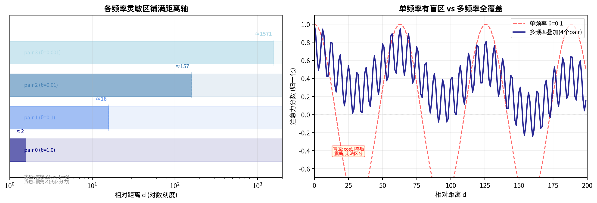

**图17**：左：4个频率对的灵敏区（$\cos$ 从1降到0的距离区间）在对数距离轴上依次铺开——pair 0 覆盖最近2个位置，pair 3 覆盖到1571个位置，每个尺度都有专门的频率负责。右：单频率（红虚线）在 $\cos$ 过零后进入盲区，周期震荡无法区分距离；多频率叠加（蓝实线）在每个距离尺度上都有处于灵敏区的频率提供信号，全覆盖无盲区。

> **与Ch6的联系**：RoPE直接作用于Q和K向量，这意味着它需要完整的Q/K维度信息。Ch6要讲的**MLA**（Multi-Head Latent Attention，多头潜在注意力）会把K和V压缩成一个低维的**latent cache**，但RoPE无法直接对这个压缩后的cache施转——这就是为什么MLA必须保留一个独立的**RoPE cache**，这是MLA工程实现中最关键的设计约束之一。

**自查**：合上书，能默写旋转矩阵 $R(\alpha)$ 并说出 RoPE 作用在 Q/K 上、V 不动的原因吗？

 * * *
## 5.4 反向传播

为简单起见，我们先展示单样本情形下的梯度流。批量训练时的三维张量梯度原理相同，只是多一个样本维度的循环。

还记得第4章我们学过的链式法则吗？梯度像接力棒一样从输出层一路传回。在Attention模块中，这个传递过程涉及矩阵乘法的导数，但只要记住"维度匹配"这个金标准，每一步都不会出错。

### 从O回传到A和V

给定上游梯度 $\partial L / \partial O$（从下游模块传回来的梯度），我们需要求 $\partial L / \partial A$ 和 $\partial L / \partial V$。

$$\frac{\partial L}{\partial A} = \frac{\partial L}{\partial O} \cdot V^T, \quad \frac{\partial L}{\partial V} = A^T \cdot \frac{\partial L}{\partial O}$$

**维度检查（这是你的生命线）：**
- $\partial L / \partial O$ 是 $(3 \times 2)$，$V^T$ 是 $(2 \times 3)$，相乘得 $\partial L / \partial A$ 是 $(3 \times 3)$ ✓
- $A^T$ 是 $(3 \times 3)$，$\partial L / \partial O$ 是 $(3 \times 2)$，相乘得 $\partial L / \partial V$ 是 $(3 \times 2)$ ✓

**直觉解释：** $\partial L / \partial A$ 的 $(i,j)$ 元素等于 $\partial L / \partial O$ 的第 $i$ 行与 $V$ 的第 $j$ 行的点积。这意味着"如果注意力权重 $A_{ij}$ 增加一点点，输出 $O_i$ 会沿着 $V_j$ 的方向变化，因此损失的变化量取决于 $V_j$ 和上游梯度的对齐程度"。

**数字代入验证：** 设 $\partial L / \partial O = \begin{bmatrix} 1.0 & 0.5 \\ 0.5 & 1.0 \\ 0.2 & 0.8 \end{bmatrix}$，则：

$$\frac{\partial L}{\partial A} = \begin{bmatrix} 1.0 & 0.5 \\ 0.5 & 1.0 \\ 0.2 & 0.8 \end{bmatrix} \cdot \begin{bmatrix} 0.6 & 1.4 & 2.2 \\ 0.4 & 1.2 & 2.0 \end{bmatrix} = \begin{bmatrix} 0.8 & 2.0 & 3.2 \\ 0.7 & 1.9 & 3.1 \\ 0.44 & 1.24 & 2.04 \end{bmatrix}$$

$$\frac{\partial L}{\partial V} = \begin{bmatrix} 0.1344 & 0.0203 & 0.0024 \\ 0.2805 & 0.1312 & 0.0474 \\ 0.5851 & 0.8485 & 0.9502 \end{bmatrix} \cdot \begin{bmatrix} 1.0 & 0.5 \\ 0.5 & 1.0 \\ 0.2 & 0.8 \end{bmatrix} \approx \begin{bmatrix} 0.145 & 0.089 \\ 0.356 & 0.309 \\ 1.199 & 1.901 \end{bmatrix}$$

 * * *
### 从A回传到S：Softmax的敏感率矩阵

Softmax把分数S变成概率A。要反向传播，我们需要知道：S的微小变化会怎样影响A？

> **前置知识：Jacobian矩阵**。想象一个函数输入向量、输出向量。它的**Jacobian矩阵**（全导数矩阵）记录"输出的每个分量对输入的每个分量的偏导数"——是函数在各个方向上的"局部伸缩率地图"。

Softmax的Jacobian矩阵是 $\text{diag}(A) - A \cdot A^T$。对注意力矩阵的每一行而言：

$$J_i = \text{diag}(A_{i:}) - A_{i:} \cdot A_{i:}^T$$

**直觉解释：** 对角线元素 $J_{ii} = A_i(1 - A_i)$ 总是正的，非对角线 $J_{ij} = -A_i A_j$ 总是负的。这意味着**提高一个注意力权重必然以降低其他权重为代价**——概率总和固定为1，数学上的零和博弈。Jacobian就是描述这个"此消彼长"关系的敏感率矩阵。

**数字代入验证第0行：** $A_{0:} = [0.1344, 0.2805, 0.5851]$

$$J_0 = \begin{bmatrix} 0.1344 & 0 & 0 \\ 0 & 0.2805 & 0 \\ 0 & 0 & 0.5851 \end{bmatrix} - \begin{bmatrix} 0.0181 & 0.0377 & 0.0787 \\ 0.0377 & 0.0787 & 0.1641 \\ 0.0787 & 0.1641 & 0.3423 \end{bmatrix} = \begin{bmatrix} 0.1164 & -0.0377 & -0.0787 \\ -0.0377 & 0.2018 & -0.1641 \\ -0.0787 & -0.1641 & 0.2428 \end{bmatrix}$$

 * * *
### Q和K的梯度：互相依赖的对称关系

要得到 $\partial L / \partial S$，我们需要把 $\partial L / \partial A$ 通过Softmax的Jacobian"翻译"回去——因为 $A = \text{softmax}(S)$，所以 $S$ 的微小变化会通过Softmax的敏感率传递到 $A$。记 $\delta_S \equiv \partial L / \partial S$。对注意力矩阵的每一行 $i$，用该行的 Jacobian $J_i$ 做转换：

$$\delta_{S,i:}^T = J_i \cdot \left(\frac{\partial L}{\partial A}\right)_{i:}^T$$

展开后是一个简洁的逐元素公式：$\delta_{S,ij} = A_{ij}\left(g_{ij} - \sum_k A_{ik}\, g_{ik}\right)$，其中 $g = \partial L / \partial A$。直觉：每个分数的梯度 = 该注意力权重乘以（"外部传来的梯度"减去"同一行的加权平均梯度"）——Softmax的零和性使得梯度也有"此消彼长"的结构。注意分母上的 $\sqrt{d_k}$：因为 $S = QK^T / \sqrt{d_k}$，根据链式法则，这个缩放因子必须传递到梯度中。

$$\frac{\partial L}{\partial Q} = \frac{\delta_S \cdot K}{\sqrt{d_k}}, \quad \frac{\partial L}{\partial K} = \frac{\delta_S^T \cdot Q}{\sqrt{d_k}}$$

**维度检查：** $\delta_S$ 是 $(3 \times 3)$，$K$ 是 $(3 \times 2)$，相乘得 $\partial L / \partial Q$ 是 $(3 \times 2)$ ✓（与 Q 同形状）；$\delta_S^T$ 是 $(3 \times 3)$，$Q$ 是 $(3 \times 2)$，相乘得 $\partial L / \partial K$ 是 $(3 \times 2)$ ✓（与 K 同形状）。注意这里 $\partial L / \partial Q$ 是**逐 token 的梯度**（每个 Query token 各有一行）——要得到投影矩阵 $W_Q$ 的梯度，还需再乘 $X^T$（$X$ 是输入），链式法则继续往前传一格。

**直觉解释：** 看这两个公式——$\partial L/\partial Q$ 里出现了 $K$，$\partial L/\partial K$ 里出现了 $Q$。为什么会这样？因为 $S = QK^T$，Q和K在分数里是乘在一起的两个因子。链式法则求Q的梯度时，必须知道K当前的值（"Q变了，分数怎么变？得看K是多少"）；求K的梯度同理。所以训练时Q和K是**联动调节**的：更新 $W_Q$ 的依据里包含了K的当前状态，更新 $W_K$ 的依据里包含了Q的当前状态。

 * * *
## 5.5 NumPy完整实现

前面四步公式翻译成纯NumPy只有二十几行——每一行都对应一个数学公式，可以逐行对照 §5.2 的推导：

```python
import numpy as np

def single_head_attention(X, W_Q, W_K, W_V):
    """单头自注意力：Attention(Q,K,V) = softmax(QK^T / √d_k) V
    输入: X(n,d), W_Q/W_K/W_V(d,d_k)；输出: O(n,d_k), A(n,n)"""
    Q = X @ W_Q                       # 公式1：Q/K/V 投影
    K = X @ W_K
    V = X @ W_V
    S = (Q @ K.T) / np.sqrt(Q.shape[-1])     # 公式2：匹配度分数，除以 √d_k
    A = np.exp(S - S.max(-1, keepdims=True)) # 公式3：Softmax（先减max防溢出，§4.6）
    A = A / A.sum(-1, keepdims=True)
    O = A @ V                         # 公式4：加权汇总
    return O, A
```

用 §5.2 的 X、$W_Q$、$W_K$、$W_V$ 跑一遍，输出的 A 和 O 与手算结果完全相同——代码只是把纸上的四步变成了矩阵运算。完整代码（含RoPE位置编码、反向传播、多头注意力、Transformer Block）见配套文件 `attention_numpy.py`。

 * * *
## 5.6 多头注意力：多个会诊室并行

现实世界中，一个疑难杂症往往需要多个不同维度的专家组同时会诊。中医组看气血经络，西医组看指标影像，心理组看情绪压力。每个专家组内部都有自己的"问题-专长-建议"流程，最后把各组的结论汇总。

多头注意力（Multi-Head Attention）就是这个思路的数学实现。用 $h$ 个独立的Attention模块并行计算，每个模块有自己的 $W_Q^{(h)}, W_K^{(h)}, W_V^{(h)}$ 投影矩阵。

$$\text{MultiHead}(Q, K, V) = \text{Concat}(\text{head}_1, \ldots, \text{head}_h) W_O$$

其中每个 $\text{head}_i = \text{Attention}(XW_Q^{(i)}, XW_K^{(i)}, XW_V^{(i)})$。

**为什么不是一个大矩阵？** 一个头用 $d_k$ 维，$h$ 个头总维度 $h \times d_k = d$。看起来和一个 $d \times d$ 的大矩阵参数量一样，但实践中多个小头通常优于单个大头。原因在于**归纳偏置**（inductive bias，模型结构内置的假设——它"偏好"学习什么样的模式）：单个大矩阵只计算一个 $QK^T$，产生一种注意力模式；多头将 $d$ 维向量投影到 $h$ 个 $d_k$ 维子空间，每个子空间独立计算注意力，产生 $h$ 种不同的注意力模式。一种模式可能关注语法依赖（主谓一致），另一种可能关注语义相似（同义词），还有的关注位置关系（相邻token）。最后通过 $W_O$ 融合这些互补的模式。一个 $d \times d$ 大矩阵的注意力是所有信息的加权平均，无法同时维持多种独立的关注视角。

**数字代入演示（$h=2$，每个 $d_k=2$，总 $d=4$）：**

- **头1**（$W_Q, W_K, W_V$ 同前）：输出 $O_1 = \begin{bmatrix} 1.7606 & 1.5606 \\ 2.0626 & 1.8626 \\ 2.1583 & 1.9583 \end{bmatrix}$
- **头2**（$W_Q^{(2)} = W_K^{(2)} = \begin{bmatrix} 0&1\\1&0\\0&1\\1&0 \end{bmatrix}$，$W_V^{(2)} = \begin{bmatrix} 1&0\\0&1\\1&0\\0&1 \end{bmatrix}$）：输出 $O_2 = \begin{bmatrix} 1.4866 & 1.6866 \\ 1.7908 & 1.9908 \\ 1.9200 & 2.1200 \end{bmatrix}$

拼接后用线性投影 $W_O$ 融合：

$$O_{\text{concat}} = \begin{bmatrix} 1.7606 & 1.5606 & 1.4866 & 1.6866 \\ 2.0626 & 1.8626 & 1.7908 & 1.9908 \\ 2.1583 & 1.9583 & 1.9200 & 2.1200 \end{bmatrix} \quad (3 \times 4)$$

$W_O$ 是 $(4 \times 4)$ 的融合矩阵（通常初始化为近似identity，训练后学习最优融合方式），最终输出 $O = O_{\text{concat}} W_O$ 仍然是 $(3 \times 4)$，与输入维度一致。

### 高效Attention变体：GQA与Flash Attention

多头Attention的机制很优美——多个头并行关注不同模式，$W_O$再把它们融合。但工程上有两个瓶颈需要解决。

**瓶颈一：推理时的KV cache。** 这个瓶颈对所有Attention都存在，但多头注意力有一个独特的浪费。

推理（生成新token）时，已经处理过的token的K和V不需要重新算，可以缓存复用——这就是**KV cache**。每个token要缓存 $h$ 份K和 $h$ 份V（每头各一份），总量是 $2 \times L \times h \times d_k = 2 \times L \times d$。

关键发现：研究者观察训练好的模型，发现**很多头学到的注意力模式高度相似**——它们关注的token几乎一样，投影出的K/V也近乎重复。（注意：上一节说多头"设计"成关注不同模式——那是归纳偏置的目标；这里是训练后的**实证观察**：实际学出来，不少头会收敛到相似的模式，尤其同一层内。设计意图是多样，实际结果常冗余，两者不矛盾。）这意味着 $h$ 份K/V中有相当一部分是冗余的。既然相似，为什么不让它们共享同一份？

**GQA**（Grouped Query Attention，分组查询注意力）就是这么做的：$h$ 个Query头被分成 $g$ 个组，每组共享同一对K和V头。Query仍然有 $h$ 份（保留多视角的查询能力），但K/V只存 $g$ 份。

**一个具体的例子**：假设 $h=8$（8个Query头），序列长度 $L=4096$，每个头维度 $d_k=128$。

- **标准MHA**（$g=8$，每组1个头）：每个token存8对K/V。K的显存 = $8 \times 4096 \times 128 \times 2$字节（2字节=FP16精度）$\approx$ **8.4 MB**。V同样8.4 MB。KV cache总计 **16.8 MB/层**。
- **GQA**（$g=2$，每4个头共享1对K/V）：只有2对K/V头。KV cache = $2 \times 4096 \times 128 \times 2 \times 2$ $\approx$ **4.2 MB/层**。内存直接降到MHA的**25%**。
- **MQA**（$g=1$，所有8个头共享1对K/V）：只有1对K/V头。KV cache $\approx$ **2.1 MB/层**。内存最省，但8个Query挤1个K/V，信息瓶颈最严重。

> **量级直觉**：以上是单层数字。一个80层模型的总KV cache约为80倍——MHA约1.3GB，GQA约336MB，MQA约168MB。这就是为什么KV cache优化对长序列推理如此关键。

LLaMA 2 70B和LLaMA 3系列采用了更激进的GQA——例如LLaMA 2 70B用64个Query头共享8个KV头（8:1比例），KV cache降到MHA的12.5%，精度损失几乎不可感知。这就是GQA的工程智慧：不是最省的，也不是最精确的，而是**性价比最高的平衡点**。

**瓶颈二：训练和推理时的中间矩阵。** GQA解决的是KV cache的存储问题，Flash Attention解决的是另一个问题：标准Attention计算过程中那个 $L \times L$ 的注意力矩阵。

先看GPU的内存层次：GPU有两层存储——**HBM**（High Bandwidth Memory，高带宽显存，容量大但速度慢）和**SRAM**（片上高速缓存，容量极小但速度极快，约为HBM带宽的10倍以上）。可以理解为：HBM是仓库，SRAM是办公桌。

标准Attention的计算流程是：先算 $S=QK^T$（一个 $L \times L$ 矩阵），存入HBM；再从HBM读出 $S$ 算softmax得到 $A$，又存入HBM；最后从HBM读出 $A$ 算 $O=AV$。那个 $L \times L$ 的中间矩阵被反复写入和读出HBM——而HBM的带宽远低于计算单元的速度，GPU大部分时间在等数据搬运，不在算。当 $L=65536$ 时，仅这一个矩阵就需要约8GB显存（FP16）。

**Flash Attention** 的核心思路：**不要把 $L \times L$ 矩阵写到HBM**。^[24]^具体分两步：

**第一步：分块计算。** 把Q、K、V切成刚好能塞进SRAM的小块，在SRAM内完成局部的 $QK^T$ 和 $AV$ 计算，只把最终输出 $O$ 写回HBM——全程不存储完整的 $L \times L$ 注意力矩阵。

**第二步：在线Softmax。** 分块带来一个困难：softmax的分母 $\sum_j e^{S_{ij}}$ 需要看到整行所有分数才能算，但分块每次只看到一部分。Flash Attention用了一个数学技巧——**在线Softmax**：维护一个"当前最大值" $m$ 和"当前累加和" $l$，每来一块新分数就更新 $m$ 和 $l$，同时修正之前累加的值。最终得到的softmax结果与一次性算完全一致，但不需要同时持有整行数据。

（反向传播时，Flash Attention选择**重计算**——不缓存中间的注意力矩阵，而是在反向时重新算一遍。用额外计算换来了内存节省，在GPU上这是划算的，因为计算比HBM读写快得多。）

结果：Flash Attention不改变Attention的数学公式，输出完全一致，但中间矩阵的内存从 $O(L^2)$ 降到 $O(L)$，HBM读写量大幅减少。这是一个**算法创新**（在线Softmax）与**工程优化**（分块+重计算）的结合。

**与Ch6的联系**：GQA从"头的数量"维度压缩KV cache——每个token只需存$g$对K/V而非$h$对；MLA则从"维度"维度压缩——把K/V投影到一个更小的**latent space**（潜空间）中。理论上两者可以叠加：先GQA减少头的数量、再MLA压缩每头的维度，实现双重瘦身。**但实际中 DeepSeek-V2/V3 用的是 MLA 一条路线**（MLA 是 DeepSeek-V2 首次提出的，V3 沿用）——MLA 本身已经把 K/V 压进低维潜空间，KV cache 的压缩效果比 GQA 更强（MLA 的缓存只有 $d_c$ 维，而 GQA 至少还要存 $g$ 对 K/V），所以不需要再叠 GQA。两者解决的是同一个问题（压缩 KV cache）的两个不同侧面，可以叠加，但实际模型通常二选一，不是必然并用。

**一句话总结**：GQA通过"拼车"让多个Query共享K/V头来削减cache体积，Flash Attention通过"在桌面上算完"避免搬运巨大的中间矩阵，两者分别从存储和工程实现层面解决了Attention的规模化瓶颈。

 * * *
## 5.7 AI落地

| 场景 | 一句话解释"没有这个数学工具会怎样" |
|------|-----------------------------------|
| **Transformer自注意力** | 没有Attention，序列建模只能依赖固定窗口（如RNN的短时记忆或CNN的局部卷积核），长距离依赖（如文章开头的主语和结尾的代词）无法有效捕捉 |
| **ViT图像块注意力** | 没有Attention，图像处理只能逐像素/逐卷积核操作，全局关系（如一只猫的头和身体在不同位置的关系）看不到 |
| **DINO自监督学习** | 没有Softmax的指数归一化，自监督学习无法把"同一张图片的不同视角"拉近、把"不同图片"推远，视觉模型只能依赖昂贵的人工标注 |
| **Stable Diffusion图像生成** | 没有分数匹配 $\nabla_x \ln p(x)$（Ch1 梯度的"纵向延伸"），扩散模型无法从纯噪声中"沿着坡度走"出真实图像，生成式AI不存在 |
| **BERT双向编码** | 没有Attention，语言模型只能从左到右或从右到左单向读取，双向上下文无法同时利用 |
| **LoRA低秩微调** | 没有低秩微调，全参数微调成本极高（GPT-3级别模型需要TB级显存），大众无法参与大模型定制。LoRA给每个要微调的权重矩阵配一个低秩增量（实践中常作用于Q/K/V/O投影和FFN） |
| **RoPE位置编码** | 没有RoPE，Transformer对token顺序一无所知，"我吃苹果"和"苹果吃我"输出完全相同。RoPE用旋转角度编码位置，是所有现代LLM的标配 |
| **Flash Attention高效实现** | 没有Flash Attention的内存优化，标准Attention的$O(n^2)$存储在长序列（如100k tokens）时会直接爆显存。Flash Attention让大模型能处理超长文本 |
| **GQA减少KV缓存** | 没有GQA，每个Query头都要存一份K/V，长序列推理时KV cache占用数GB显存。GQA让多个Query"拼车"共享K/V，内存压缩为原来的1/4到1/8 |
| **混合架构（Attention+SSM）** | 当前重要趋势：纯Attention的$O(n^2)$在长序列下不可持续。Qwen3-Next/Jamba等采用Attention+Mamba混合架构，近距离精细+远距离压缩 |
| **TTS语音合成** | 没有Attention，音素到声学特征的映射只能固定对齐，语速变化或连读时音质严重下降 |

 * * *
## 5.8 常见误解

### 误解1："Attention就是加权平均，和池化差不多"

**常见错误想法：** 加权平均嘛，不就是给不同位置不同的权重再求和？Average Pooling也是加权平均（每个位置权重相等），Max Pooling也是一种加权（取最大的那个）。Attention看起来没什么新鲜。

**真相：** 池化的权重是**固定**的——平均池化不管输入是什么，永远是每个位置 $1/n$；最大池化永远只取最大值位置。但Attention的权重是**数据依赖**的——同一个位置面对不同的Query，权重完全不同。输入变了，权重分布跟着变；输入不变但Query变了，权重也重新计算。

更本质的区别：池化是一种**降维操作**（把多个位置压缩成一个），Attention是一种**特征变换操作**（每个位置输出一个新的表示，维度不变但内容被上下文丰富）。你不可能用池化来做机器翻译，因为翻译需要每个词都输出一个对应的目标语言词；但你完全可以用Attention来做这件事。

### 误解2："Q/K/V不都是从同一个X来的吗？为什么需要三个不同的W？"

**常见错误想法：** 既然 $Q$、$K$、$V$ 都是从同一个输入矩阵 $X$ 乘出来的，为什么不能直接用 $X$ 本身？同一个东西乘三个不同的矩阵，这不是在浪费参数吗？

**真相：** 这是一个非常好的问题，答案藏在"分工"两个字里。如果 $Q = K = V = X$（完全不做投影），那么Attention分数就变成了 $S = XX^T$，这纯粹是输入向量之间的自相似度——模型只能问"谁和谁长得像"，无法做灵活的语义查询。

三个不同投影就像同一套信息用三种不同眼镜来看：
- **Query眼镜（$W_Q$）：** 专门训练来"提取问题意图"的维度组合
- **Key眼镜（$W_K$）：** 专门训练来"提取可匹配特征"的维度组合
- **Value眼镜（$W_V$）：** 专门训练来"提取可传递信息"的维度组合

类比一下：同一个病人，化验科的阅读框架看指标数值，影像科的阅读框架看形态结构，病历科的阅读框架看病史时间线。三个科室读的是同一份病历，但各自提炼出的信息完全不同——只有分工明确，会诊才能高效。

实践中也能观察到：强制 $W_Q = W_K = W_V$ 会限制模型表达能力，通常导致性能下降。自由分工优于强制统一。

角色分工还有一个直接后果：**RoPE 只旋转 Q 和 K，不旋转 V**。位置信息编码在"查询-匹配"环节（Q 和 K 的点积），不需要编码在"信息内容"里（V）。如果 Q=K=V=X，这种选择性旋转就无从实现——三个角色混在一起，你无法只旋转"查询"而不动"内容"。

### 误解3："除以 $\sqrt{d_k}$ 只是个小技巧，去掉也没大问题"

**常见错误想法：** 不就是个缩放吗？Softmax之前缩不缩，结果应该差不多吧。

**真相：** 在 $d_k$ 小的时候（比如 $d_k = 2$ 或 $4$），确实差别不大。但当 $d_k = 64$ 或更大时，分数的方差随 $d_k$ 线性增长，Softmax 会把注意力极度集中到一个位置（比如99.9%给一个token），此时输出几乎是一个 one-hot 向量，Softmax 的 Jacobian 接近零矩阵，梯度几乎无法回传——下游梯度到不了上游（§4.5 的梯度消失）。除以 $\sqrt{d_k}$ 就是把方差压回约 1，让梯度畅通。这不是"小技巧"，这是让深层Transformer能够训练的核心设计之一。

> **小胜点**：到这里，你已经掌握 Attention 的核心链路：Q/K/V 投影 → RoPE → 缩放 → Softmax → 加权汇总，也知道多头为什么有用、除以 $\sqrt{d_k}$ 为什么必要。接下来 §5.9 是选读，§5.10 是组装奖励关。

 * * *
## 5.9 Attention之外：混合架构与Mamba

> **选读**：本节是 Attention 的长序列延伸，跳过不影响 §5.10 的 LLM 组装主线；想先看到"零件如何拼成整机"，直接跳到 §5.10。

Attention（注意力机制）有一个根本性的瓶颈：**Softmax Attention的复杂度是 $O(n^2)$**。

这是什么意思？假设序列有 $n$ 个token，每个token都要和其他所有token计算一次注意力分数——就像一个会议上每个人都必须和所有人握手一次。10个人需要 45 次握手，100个人需要 4950 次，1000个人需要近50万次。序列长度翻10倍，计算量翻100倍。当序列达到100k tokens（一本长篇小说的长度）时，计算量和内存都会爆炸。

**一句话：Softmax Attention的 $O(n^2)$ 复杂度是长序列的瓶颈，每增加一个token，所有人都要重新握手。**

在跳到"换一种机制"之前，先看两条**改造Attention本身**的路线——它们不替换Softmax Attention的框架，只改变计算方式来降低复杂度。

**路线一：稀疏注意力（Sparse Attention）。** $O(n^2)$ 的根源是每个token和所有token都算注意力。但实践中，大部分注意力权重集中在少数几个token上（就像你读文章时真正关注的句子远少于全文）。稀疏注意力的思路是：**只算重要的token对，跳过其余的**。具体做法有两种典型策略：

- **局部窗口**（Local Window）：每个token只关注前后 $w$ 个token（如 $w=512$），复杂度 $O(n \cdot w)$。这对局部语法和短语级语义足够，但无法捕捉长距离依赖。
- **全局token**（Global Token）：选少数"枢纽token"（如每256个token中选1个）与所有token做全注意力。这些枢纽token充当信息中转站——远处的token通过枢纽间接传递信息，就像邮政系统的分拣中心。Longformer和BigBird用的就是"局部窗口 + 全局token"的组合，复杂度降到 $O(n \cdot w + n \cdot g)$（$g$ 是全局token数，远小于 $n$）。

稀疏注意力的代价是：跳过的token对可能包含有用的关系，模型失去了"全局视野"的精度。但对于大多数长文本任务（文档摘要、长问答），局部+全局的覆盖已经够用。

**路线二：线性注意力（Linear Attention）。** 回到Softmax的公式：$A = \text{softmax}(QK^T)$。$QK^T$ 是 $n \times n$ 矩阵，这是 $O(n^2)$ 的根源。如果把Softmax的指数函数 $\exp(q \cdot k)$ 替换为一个**非负核函数** $\phi(q) \cdot \phi(k)$（$\phi$ 是某种特征映射，如ELU+1），注意力公式变成：

$$O = \frac{\phi(Q)(\phi(K)^T V)}{\phi(Q)(\phi(K)^T \mathbf{1})}$$

关键在于括号的结合顺序：先算 $\phi(K)^T V$（一个 $d_k \times d_k$ 矩阵，与 $n$ 无关），再左乘 $\phi(Q)$。这样复杂度从 $O(n^2 \cdot d_k)$ 降到 $O(n \cdot d_k^2)$——当 $d_k \ll n$ 时（通常 $d_k=64$，$n=4096+$），这是巨大的节省。更妙的是，推理时可以用类似RNN的方式逐token更新，KV cache变成 $O(d_k^2)$ 而非 $O(n \cdot d_k)$。

线性注意力的代价是：核函数 $\phi$ 是对Softmax指数的**粗略近似**。Softmax的指数函数有一个关键性质——它对大分数极度敏感（指数放大），这让模型能"尖锐地"聚焦到最重要的token。线性注意力的核函数没有这种放大效果，注意力分布更"平坦"，表达能力下降。Linear Transformer、RWKV、RetNet都走这条路，用不同的 $\phi$ 设计在效率和质量之间找平衡。

**两条路线的定位：** 稀疏注意力保留Softmax的指数运算，但只算部分token对——精度高但不完全 $O(n)$。线性注意力算所有token对，但替换掉指数运算——完全 $O(n)$ 但精度有损。两者都是"在Attention框架内做手术"，不改变"Q查询K、加权V"的基本结构。

但当前出现的重要趋势不是"取代Attention"，而是**分工协作**。

短距离（局部）仍然用Softmax Attention做精细关联——就像面对面聊天时你自然能捕捉对方的微表情和语气变化。长距离（全局）则用更高效的机制做粗略记忆——就像你不需要回忆三个月前某次会议上的每一个字，只需要记住那次会议达成了什么共识。

这条思路催生了一类新架构：**Linear RNN / SSM**（State Space Model，状态空间模型）。

核心思想非常简单：不再让每个token关注所有其他token，而是维护一个固定大小的"状态向量" $h_t$。每次只读当前token，更新状态，输出结果。数学上写成：

$$h_t = \bar{A} \, h_{t-1} + \bar{B} \, x_t$$

$h_{t-1}$ 是上一时刻的状态（之前的全部信息压缩在这个向量里），$x_t$ 是当前输入token，$\bar{A}$ 决定多少旧状态保留下来（遗忘），$\bar{B}$ 决定新输入如何融入（记忆）。**复杂度从 $O(n^2)$ 降到 $O(n)$**——因为每个token只被处理一次，看一眼就过，不需要回头翻看。

**一句话：SSM用一个固定大小的状态向量代替全对全的注意力，复杂度从 $O(n^2)$ 降到 $O(n)$，像流水线工人而不是全员握手。**

**Mamba** 给SSM加上了"选择性"——$\bar{A}$ 和 $\bar{B}$ 不再固定，而是**依赖于输入 $x_t$**。也就是说，模型会**数据驱动地决定记住什么、忘记什么**。看到关键信息时（如人名、日期、结论），$\bar{B}$ 放大，状态大更新；看到填充词时（如"的"、"了"），$\bar{A}$ 放大，旧状态几乎不变地传递下去。这相当于给SSM装上了"注意力开关"。

当前的前沿模型已经广泛采用**混合架构**：
- **Qwen3-Next**：Attention层和SSM层交替使用
- **Nemotron-H**（NVIDIA）：Transformer + Mamba混合
- **Jamba**：约52B参数（MoE架构，约12B活跃参数）的Mamba-Transformer混合模型

**一句话：Mamba让SSM学会了"选择性记忆"，一批前沿模型（Qwen3-Next、Nemotron-H、Jamba）采用Attention+SSM混合架构。**

用一个类比收尾：**Attention的记忆像完整录像带**——精确到每一帧，但需要一个大存储柜来存放。**Mamba的记忆像摘要笔记**——压缩了很多细节，但永远只需要一个笔记本。当前的前沿是把两者混着用：近距离聊天时看录像（Softmax Attention），远距离回忆时看笔记（Mamba）。

但块已经拆开看完了，还缺一个问题：**这些块怎么拼成一台完整的语言模型？** 前面几章我们逐个拆解：Ch3 的 Softmax 把分数变成概率，Ch4 的反向传播把责任传回每个参数，Ch5 的 Attention 块让每个 token 动态获取上下文。但一台现代语言模型（LLM）长什么样？Embedding 怎么把文字变成向量？FFN 和残差连接各自扮演什么角色？训练时模型"学"的到底是什么？推理时"生成下一个词"是怎么一步步发生的？

下一节回答：Attention块和FFN块怎么拼成一台完整的机器。下一章则处理另一个问题：这些块里的矩阵太大了，怎么瘦身？

## 5.10 从Attention到语言模型：组装全景

> 一台现代语言模型的本质：把文字串变成向量序列，用Attention和FFN一层层处理，再转回文字串。不新增任何数学工具，只是把Ch3、Ch4、Ch5学过的数学工具组装成一个完整的机器。

> **心法**：本节讲的是**文字接口下**的组装。文字只是最直接的一种外界接口——把接口换成图像/音频/动作，同一套潜空间架构就长出多模态基座、语音模型、具身智能。本节讲"文字接口的组装全景"，《基座模型》Ch2 讲"潜空间里到底跑什么"，两者是同一系统的入口视角和内部视角。

 * * *
### 一个例子走通全流程

输入"我今天"，模型怎么预测下一个词？整条流水线只做四件事：

1. **查表（Embedding）：** 把"我""今""天"三个字各自变成一个向量。不是计算，是查一张预训练好的表——第5000号字对应第5000行向量。
2. **处理（Transformer Block $\times$ N层）：** 每一层先让三个字互相"看到"彼此（Attention），再给每个字注入语义知识（FFN）。一层处理完进下一层，N层叠起来，"今"逐渐知道自己是"今天"的"今"而不是"今年"的"今"。
3. **打分（LM Head + Softmax）：** 取最后一个字"天"处理完的向量，用一个矩阵 $W_{\text{head}}$ 映射到词表维度（每个词一个分数），再用Softmax变成概率——"很"0.31，"去"0.22，"的"0.15……（其余概率分配给其他词，所有词的概率总和为1）。$W_{\text{head}}$ 就是**LM Head**（Language Model Head，语言模型输出层），本质上就是一个线性变换矩阵，把模型内部的隐状态向量"翻译"成每个词的得分。
4. **采样：** 按概率分布抽一个词（比如"很"），接到序列末尾，变成"我今天很"，再从第1步重新走一遍，生成下一个词。

就这四步，循环往复。没有新数学，全是Ch3-Ch5学过的工具。

 * * *
### 全景流水线：从文字到文字

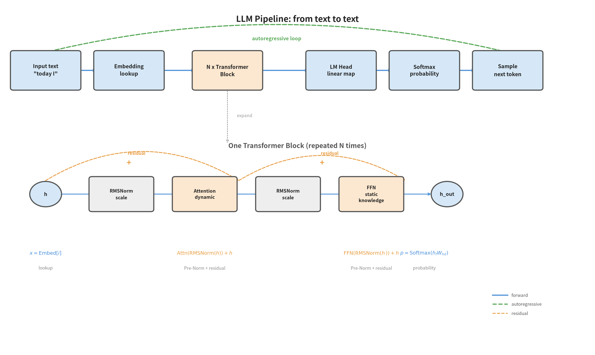

**图18**：上图展示LLM完整流水线——输入文字经Embedding查表变成向量，进入N层Transformer Block处理，再经LM Head和Softmax变成概率分布，采样得到下一个词。绿色虚线表示自回归循环：把生成的词接回序列末尾再走一遍。下图展开一层Transformer Block内部（Pre-Norm结构）：RMSNorm → Attention → 残差加回 → RMSNorm → FFN → 残差加回，橙色虚线表示残差连接。底部标注每个环节的关键公式。

分三层来理解这条流水线：

**第一层：入口——把文字变成向量**

输入是一段文字（如"我今天"），先被切分成token，每个token通过Embedding查表变成连续向量。这一步只是查表，没有新数学。

**第二层：处理——Transformer Block层层加工**

这些向量进入N层Transformer Block。每一层内部先用RMSNorm归一化，再用Attention让每个token动态获取相关上下文（Ch5已详述），残差加回原始输入；再用RMSNorm归一化，用FFN注入静态知识（比如解析"王子"是什么意思，Ch4.5讲过SwiGLU激活函数），残差加回。层数越深，理解越深。

**第三层：出口——把向量变回概率**

经过N层后，最后一个token的隐状态向量经过LM Head（矩阵乘法，Ch4讲过线性变换）映射到词表维度，再经Softmax（Ch3已详述）变成每个词的概率分布。

**循环——自回归生成**

从概率分布中采样一个词，把它接到序列末尾，再重新走一遍整条流水线，生成下一个词。一轮一轮，直到生成终止符。

这个流水线里的每个部件都是前面章节已经学过的数学工具，没有新工具。下面逐个对号入座。

 * * *
### 公式1：Embedding——查表

文字是离散的，模型需要连续向量。把文字向量化的第一步就是Embedding——一张查找表：

$$x = \text{Embedding}[i]$$

**这句话在说什么？** 请把文字看作一个编号索引 $i$ （比如词表中第 5000 号是"猫"）。Embedding是一个大矩阵 $E \in \mathbb{R}^{V \times d}$，$V$ 是词表大小（比如 50000 个词），$d$ 是模型隐层维度（比如 512 ）。输入一个编号 $i$，就返回第 $i$ 行，一个 $d$ 维的向量。实际上就是一次矩阵查找——调用速度极快。不是计算，是记忆。

**深层连接**：Ch4讲过线性变换 $z = Wx + b$，Embedding其实就是线性变换的一种简化——不再是任意矩阵乘法，而是从一个预训练好的查找表中直接取出第 $i$ 行。训练的目标就是让这张查找表中"相似意思的词"得到相近的向量——如果"王子"和"公主"的Embedding向量很接近，模型在推理时自然会捕捉它们的关系。工程上常让 LM Head 与 Embedding 共享权重（$W_{\text{head}} = W_{\text{e}}^{\mathsf{T}}$，称 weight tying）：能"查进"向量空间的向量，就是能"查回"词表的向量——共享还省一半参数。

 * * *
### 公式2：Transformer Block——一层加工

一层Transformer Block由三个工序连成（Pre-Norm结构，GPT-2之后所有主流LLM的标准做法）：

$$h' = \text{Attention}(\text{RMSNorm}(h)) + h \quad \text{…… 子步A：归一化 + Attention + 残差}$$
$$h_{\text{out}} = \text{FFN}(\text{RMSNorm}(h')) + h' \quad \text{…… 子步B：归一化 + FFN + 残差}$$

**逐符号注释：**

- **子步A：归一化 → Attention + 残差。** 先用RMSNorm把 $h$ 的尺度拿捏均匀（Ch4.5已提及），再送入Attention让当前token动态获取上下文（Ch5已详述），最后把结果加上原始输入 $h$。这个"加上原来的"就是残差连接，目的是**防止信息丢失**：如果Attention算出来的结果很差，残差连接确保模型至少不会偏离原始信息太远。注意归一化在Attention**之前**（Pre-Norm），不是之后。为什么不是之后？关键在于残差路径的结构差异。Post-Norm的做法是 $h_{\text{out}} = \text{Norm}(h + \text{Sublayer}(h))$——归一化作用在残差加法**之后**，每层的输出都被Norm重新缩放到固定方差。这意味着第 $l$ 层的信号传到第 $l+k$ 层时，要经过 $k$ 次 Norm 的压缩，早期层的信息被逐渐"稀释"成微不足道的扰动。深层网络中靠近输入的层梯度极小、几乎不学习。Pre-Norm的做法是 $h' = \text{Sublayer}(\text{Norm}(h)) + h$——归一化只在子层**内部**，残差路径是一条不经过任何 Norm 的纯加法通道。梯度可以无损地一路流回第一层，100层也能稳定训练。代价是 Pre-Norm 的等价深度略低于 Post-Norm（残差路径不压缩信号，深层贡献的相对权重更分散），但训练稳定性的优势远大于这一代价。这就是 GPT-2 之后所有主流 LLM 选择 Pre-Norm 的原因。
- **子步B：归一化 → FFN + 残差。** 同样先归一化，再送入FFN。FFN（Feed-Forward Network）是两层全连接网络：$\text{FFN}(x) = \sigma(x W_1 + b_1) W_2 + b_2$，其中 $\sigma$ 通常是 SwiGLU。这是模型存储**静态知识**的主要容器——Attention负责"查找关系"，FFN负责"注入知识——比如解析"王子"是什么意思、"爱情"表达什么情感、"结局"一般指什么结果"。Geva et al.（EMNLP 2021）的 key-value 记忆视角进一步表明：FFN 第一层是"键"（匹配模式）、第二层是"值"（存储知识），这使得 FFN 不仅是容器，更是**可定位、可编辑**的关联记忆。为什么需要非线性激活？因为纯粹的线性叠加等价于一次线性变换（无法表达复杂函数），激活函数赋予网络非线性表达能力。

**一句话：每一层Transformer Block先归一化再用Attention动态整理语义，残差加回；再归一化用FFN注入静态知识，残差加回。Pre-Norm把Norm放在子层内部，残差路径是纯加法通道，深层网络也能稳定训练。** N层之后，一个单词的信息已经经历了N次动态沟通和N次知识深化——层数越深，理解越深。

 * * *
### 公式3：Causal Mask——只能看左边

自回归语言模型（如GPT系列）和BERT之类双向编码器有个关键区别：它只能看当前词以前的词，不能偷看后面。这由一个上三角mask实现：

$$M_{ij} = \begin{cases} 0 & \text{if } i \geq j \\ -\infty & \text{if } i < j \end{cases}$$

**逐符号注释：**

- $i$：当前运算的Query位置（第几个token）
- $j$：Key的位置（第几个token）
- 当 $i \geq j$（当前token在或等于Key的位置，即看之前的token或看自己）：$M_{ij} = 0$，不改变分数
- 当 $i < j$（想偷看后面的词）：$M_{ij} = -\infty$，加上后再进Softmax时得到 0，相当于"这个词被屏蔽了"

**一个具体的例子**：3个token的序列，mask是：

$$M = \begin{bmatrix} 0 & -\infty & -\infty \\ 0 & 0 & -\infty \\ 0 & 0 & 0 \end{bmatrix}$$

第一行第一列是 0（可以看自己），第一行第二列是 $-\infty$（不能偷看第二个token）。这个上三角形的遮罩不是什么神秘设计，就是一个简单的设计约定：**生成时只能用已知信息，不能偷看未来。**

 * * *
### 公式4：LM Head——转回文字

经过N层Transformer Block后，最终隐状态的最后一个token对应的向量是 $h_{\text{final}} \in \mathbb{R}^d$（比如 512 维）。用前面提到的 LM Head 矩阵 $W_{\text{head}} \in \mathbb{R}^{d \times V}$ 把它映射到词表大小维度：

$$z = h_{\text{final}} W_{\text{head}} \in \mathbb{R}^V$$

然后，对 $z$ 用Softmax（Ch3已详述）：

$$p = \text{Softmax}(z) \in \mathbb{R}^V$$

$p$ 的每个元素是"这个位置上是第 $i$ 个词的概率"。在训练时，我们计算这个预测概率和真实标签的交叉熵损失（Ch3.4），然后用反向传播（Ch4）把梯度传回每个参数——包括Embedding、Attention的QKV投影矩阵、FFN的权重、LM Head的 $W_{\text{head}}$。这是同一套链式法则，只是路径更长了。

在**推理时**，不再计算梯度，而是从 $p$ 中采样一个编号——通常取概率最大的（叫greedy采样，也就是永远选置信度最高的词），或者按概率分布随机抽（叫top-k或top-p采样，引入随机性）。把抽到的词的Embedding接到序列末尾，再重新走一遍前向传播——这就是**自回归生成**：每生成一个词，就把它加进去，再生成下一个。

 * * *
### 动手：把四个章节的公式装进同一个循环

前面那句"训练时计算交叉熵、用反向传播传回梯度"，具体走一步是什么样？不需要任何深度学习框架——任务缩到最小，整个训练循环就能摊开在纸上。

**任务设定**：语料是"猫吃鱼。"重复两遍，看前两个字符、预测第三个。词表只有 4 个字符：{"猫":0, "吃":1, "鱼":2, "。":3}，每个字符经 Embedding 查表变成 $d=4$ 维向量（查表后冻结不更新），接一个单头 Attention（Ch5），取最后一个位置的输出过 LM Head 和 Softmax（本节公式 1–4）。损失只从末位输出计算——这等价于因果遮罩下只训练最后一个位置，因此演示省去了显式遮罩而不泄漏未来信息；真模型按公式 3 加遮罩，对所有位置并行算损失。初始时参数接近随机，模型对"下一个字"只能是均匀瞎猜，损失 $\ln 4 \approx 1.386$。

**一个训练步的完整回路**（配套文件 `attention_numpy.py` 的 Part 6 可直接运行）：

1. **前向**：两个字符的向量进 Attention，末位输出过 LM Head 得到打分 $z$，Softmax 得预测分布 $p$；
2. **算损失**：真实的下一个字是"鱼"（2 号），交叉熵 $L = -\ln p_2$（Ch3 公式 3）；
3. **反传**：从出口沿链式法则往回走（Ch4）——对打分的梯度正是第 3 章的"梯度奇迹" $p - y$；它穿过 $W_{\text{head}}$ 抵达注意力输出，再沿 §5.4 手推过的路径分别传回 $W_Q$、$W_K$、$W_V$；
4. **更新**：Adam 用这批梯度同时更新全部四个参数矩阵（Ch1 完整公式），进入下一步。

**数值结果**（解析梯度已与差分近似逐元素核对一致）：

| 训练步数 | 1 | 30 | 60 | 120 |
|:---|:---|:---|:---|:---|
| 平均交叉熵 | 1.403 | 0.003 | 0.001 | 0.0003 |

120 步后损失趋近 0——四个训练对全部答对。此时让模型自回归生成（greedy，从"猫吃"出发），它输出"猫吃鱼。猫"：语料的循环模式被它学进了参数。这个循环没有引入任何新数学：Ch1 负责更新，Ch3 负责打分，Ch4 负责追责，Ch5 负责看上下文——语言模型的"学习"，就是这四件事在同一循环里重复上万次。

> **从玩具到真机**：这套循环与真实训练代码一一对应——Embedding 在模型的嵌入层，Attention 换成多头、叠 N 层构成模型主体，LM Head 与交叉熵在训练脚本的损失计算处，Adam 在优化器的 step 里。想跑一个真能对话的最小语言模型？《基座模型》§2.8 动手节用 MiniMind 系列带你在消费级显卡上走完预训练到微调的全流程——本节每个部件都能在那里找到放大版。

 * * *
### AI落地

| 场景 | 一句话解释"没有这个组装会怎样" |
|:---|:---|
| **LLM大模型** | 只懂Attention的数学原理而不懂组装，就像懂零件不懂整车——你知道每个零件是干什么的，但不知道它们怎么协同输出一个句子 |
| **KV Cache加速推理** | 生成第N个词时，前N-1个词的K和V早已算好，不必重算。只算新来那个词的Q，跟已有的K/V做点积即可 |
| **多模态模型** | 把图片的像素patch也当成"token"塞进这套流水线——Vision Encoder封装了ViT和Connector，产出"图片和文字通用的Embedding"。没有这个视角，图片和文字是两个分离的世界 |
| **具身智能** | VLA（Vision-Language-Action，视觉-语言-动作）模型的本质就是把"机器人的视觉+语言指令"组合成token序列，输出"动作向量"当成下一个token生成。本质上和生成下一个词没有不同 |

 * * *
## 5.11 本章回顾

**一句话回顾**：Attention 让每个 token 动态决定"看哪里"，FFN 注入静态知识，残差与归一化让深层网络可训练，Embedding/LM Head 把文字接进接出——把 Ch3、Ch4、Ch5 的数学工具按顺序拼装，就得到一台会"说话"的语言模型。

**训练时**：模型从人类写的文字中，计算"下一个词是谁"的预测概率和真实标签的交叉熵损失，沿链式法则倒传梯度，一步一步调整所有参数。

**推理时**：生成一个词→接入序列→再生成一个词——自回归循环，直到生成终止符。

**本章自检**：

**【Attention 部分】**

1. Attention的核心创新是什么？为什么说 $QK^T$ 是"数据依赖的动态加权"而非固定权重？
2. Attention中除以 $\sqrt{d_k}$ 的作用是什么？不除会发生什么？
3. Q、K、V三个矩阵各自的角色是什么？用"专家会诊"类比解释。
4. 多头注意力为什么比单头注意力效果好？用"归纳偏置"概念解释。
5. RoPE如何用旋转矩阵编码相对位置？为什么说注意力随距离呈周期性变化而非单调衰减？
6. 边界：RoPE 的旋转角度只在训练长度内校准过。把序列长度外推到训练长度之外（比如训练 2K 直接推 8K），位置编码会出什么问题？为什么周期性本身不能保证外推成功？
7. 生成：先不看书，自己写一张表列出 SwiGLU（§4.5）与 Attention 两种"数据驱动门控"的 3 点异同：作用位置（同一位置 vs 跨位置）、门控信号从哪里来、输出是什么，再对照章首的现成对比。

**【组装部分】**

8. Embedding是做"查表"还是做"计算"？为什么它的调用速度极快？
9. Attention和FFN各自解决什么问题？为什么两者必须交替使用，而不是只用其中一个？
10. 残差连接的目的是什么？如果没有残差连接，深层网络为什么会难以训练？
11. Causal Mask的上三角形是什么意思？为什么生成时不能偷看未来？
12. LM Head和Embedding查表在数学上有什么关系？
13. 跨章：Ch1 的 Adam 与 §5.10 的归一化层（LayerNorm/RMSNorm）都叫"归一化"，它们分别归一化什么？为什么说两者互补而非替代？

**【逻辑链】**

1. 沿这条链走一遍，标注每步的输入/输出和为什么需要：

   **X** → **Q/K/V 投影**（角色分工）→ **RoPE**（旋转 Q、K，编码相对位置）→ **$Q \cdot K^T$**（匹配度分数 S）→ **$/\sqrt{d_k}$**（方差控制）→ **Softmax**（归一化为权重 A）→ **A·V**（加权输出 O）
     - → **多头**（上述流水线并行多份再拼接，解决视角单一）

2. 沿这条链走一遍，注明每步的输入/输出和为什么需要：

   **文字** → **Embedding**（编号 → 向量）→ **N$\times$Transformer Block**（Attention动态关联 + FFN静态知识 + 残差防丢失 + RMSNorm控制尺度）→ **LM Head**（隐状态 → 词表维度）→ **Softmax**（置信度概率分布）→ **采样**（抽一个词）→ **接入序列**（自回归）

3. 根据这个流水线，为什么KV Cache能加速推理？前N-1个token的哪些东西不用重算？

 * * *
> **未解问题**：Attention 让每个 token 互相看，但序列一长，$O(n^2)$ 的计算和存储就压垮了系统。这个混合趋势也将延续到下一章的核心主题——**低秩**。SSM把 $O(n)$ 个token的历史压缩进一个固定维度的状态向量（$h_t = A \cdot h_{t-1} + B \cdot x_t$），这与低秩方法的精神相通——都是用小空间表达大对象。但数学结构不同：低秩是矩阵的因式分解（$BA$，$\text{rank} \leq r$），SSM是递归状态压缩（$O(n)$ 输入 $\to$ $O(1)$ 状态）。从Attention的 $O(n^2)$ 到低秩的 $O(nr)$ 再到SSM的 $O(n)$，我们始终在做同一件事：在信息和效率之间找平衡。

# 第6章：低秩的世界——从SVD到高效AI

Ch5的Attention矩阵随序列长度 $O(n^2)$ 增长——序列一长就算不动也存不下。Q/K/V投影矩阵通常很大（比如d=512, 1024, 4096），看起来需要大量参数才能操作。但大矩阵有个秘密：**真正重要的信息往往只蜷缩在少数几个方向上**。从Attention的 $O(n^2)$ 到低秩的 $O(nr)$ 再到SSM的 $O(n)$，低秩是效率提升的关键。

> SVD 揭示的洞见是：大矩阵的有效信息维度往往很低——它催生整个低秩方法家族：LoRA用低秩微调大模型，MLA用低秩压缩注意力缓存，DSA/CSA用稀疏加低秩加速计算。低秩不只是技巧，更是大自然的信息组织方式。

> **本章路线**：Part A 建立低秩数学与 LoRA；Part B 看 MLA/DSA/CSA 与 MoE 如何拼成高效 AI 工程。时间紧时，优先 Part A（低秩与 LoRA）和 Part B 的 AI 落地。

> **核心概念**：
> 1. SVD 把任意矩阵拆成旋转 $\times$ 拉伸 $\times$ 旋转，大矩阵有效信息维度常很低。
> 2. 低秩截断保留大奇异值、丢掉噪音，是最佳低秩近似。
> 3. LoRA 用 B·A 近似微调增量，训练参数从 $d^2$ 降到 $2dr$。
> 4. MLA/DSA/CSA/MoE 是低秩/稀疏/激活三条高效路径，可组合。

> **动笔前自检**：①Ch4 说矩阵乘法 $Ax$ 在几何上做什么？②Ch5 的 Q、K、V 是怎么从 X 得到的？③Ch5 末尾说 Attention 矩阵有什么瓶颈（复杂度是多少）？——第③问的答案，就是本章的起点。

 * * *
## Part A：低秩的数学与 LoRA

> **Part A 核心**：低秩是"少数方向承载大部分信息"，SVD 给出数学基础，LoRA 是它最直接的应用。

这一部分先用 SVD 看清低秩结构，再用 LoRA 展示它最直接的应用。

## 6.1 生活类比：上亿本书怎么整理？

想象一座**巨型图书馆**，上亿本书看似需要庞大的分类系统。但仔细观察后发现：前50个标签就能覆盖90%的内容特征——书虽然多，"类型"却很少。这就是低秩。

低秩方法的四种运营策略：**SVD** = 发现书只分几个大类（低秩发现）；**LoRA** = 只调几个分类标签适应新读者（低秩微调）；**MLA** = 给每本书贴一张索引卡，比对卡片不搬整本书（低秩压缩）；**DSA/CSA** = 只整理最热门的那几排书架（稀疏加低秩）。

**它们不是独立的技巧，而是同一条规律的四个面孔：高维对象的有效信息维度，远低于表面维度。**

 * * *
## 前置知识：线性代数极简速查

要理解 SVD，你只需要掌握四个概念的直觉。这四个概念在前面的章节里已经用过（§4.3 前向传播的线性变换、§5.2 的 $Q = XW_Q$ 投影）——这里给它们补上正式定义。

**矩阵 = 线性变换**

矩阵乘法 $Ax$ 的本质，是对向量 $x$ 做一次"规矩"的变形：**直线还是直线，原点原地不动**。这种变形包含旋转、拉伸和剪切——但通过SVD分解，任何线性变换都可以拆成"旋转 → 拉伸 → 再旋转"三步。Ch4的前向传播 $z = Wx + b$ 中，$W$ 就是这个线性变换矩阵，它把输入特征重新组合成新的表示。一句话：**矩阵不存数据，它存的是"怎么变"的指令。**

**正交矩阵 = 旋转与反射**

正交矩阵 $Q$ 满足一个重要的等式：$Q^TQ = I$（$I$ 是单位矩阵，乘以任何向量都不变）。这意味着 $Q$ **只做旋转和反射、不做拉伸**——向量的长度不变，向量之间的夹角也不变。直觉上，就像转动或翻转一个刚体：形状丝毫未变，只是朝向变了。Ch5的注意力机制中，$Q = XW_Q$ 里的 $W_Q$ 是一般线性变换，它的SVD分解（本章即将介绍）中包含正交矩阵 $U$ 和 $V^T$ 作为旋转成分，但 $W_Q$ 本身不是正交矩阵。

**范数 = 长度**

$\|x\|$ 表示向量 $x$ 的"长度"，是高维空间里的勾股定理。$\|Ax\|$ 则是变换之后的长度。SVD中的奇异值 $\sigma_i$ 描述的正是第 $i$ 个方向上的**拉伸倍数**——奇异值越大，那个方向被拉得越长。一句话：**范数量化"有多长"，奇异值量化"被拉了多少倍"。**

**秩 = 独立方向的个数**

矩阵的秩，是它真正能"撑开"的**独立方向的数量**。秩为1意味着所有输出都挤在同一条直线上；满秩意味着输出空间没被"压扁"。Ch4我们说过，激活函数给网络注入非线性，否则多层线性变换叠在一起秩不会增加——网络永远被困在一个低维平面上，学不到复杂的东西。一句话：**秩告诉你，这个变换到底有几把刷子。**

有了这四个概念的直觉，现在让我们迎接本章的主角——SVD，它揭示了任意矩阵变换背后统一的"旋转→拉伸→旋转"结构。

 * * *
## 6.2 SVD数学原理：低秩的发现者

### 6.2.1 公式1：SVD的完整形式

$$A = U \Sigma V^T$$

**这句话在说什么？** 任何一个矩阵 $A$，不管它是方的、扁的还是高的，都可以被拆解成三个矩阵的乘积。其中 $U$ 和 $V^T$ 是"旋转和反射操作"（数学上叫正交矩阵，作用是旋转或翻转坐标系但不改变长度），$\Sigma$ 是"拉伸操作"（一个对角矩阵，只在坐标轴方向上做伸缩，不做旋转）。

**逐符号拆解：**

- $A$：你的原始数据矩阵，形状是 $m \times n$（$m$ 行 $n$ 列，比如 $m$ 个用户对 $n$ 部电影的评分）
- $U$：输出空间的旋转矩阵，形状是 $m \times m$。它的每一列 $u_i$ 是一个"输出方向"，可以想象成 $m$ 维空间中的新坐标轴方向。$U$ 是正交矩阵，意思是它的列向量两两垂直且长度都是1。
- $\Sigma$（大写Sigma，读作"sigma"）：拉伸比例矩阵，形状是 $m \times n$。它是一个对角矩阵，只有对角线上的元素 $\sigma_1, \sigma_2, \ldots$ 非零（$\sigma$ 是小写sigma），且按从大到小排列：$\sigma_1 \geq \sigma_2 \geq \cdots \geq 0$。这些 $\sigma_i$ 就是"奇异值"（singular value），它们告诉你在第 $i$ 个方向上数据"伸展"了多少。
- $V^T$：输入空间的旋转矩阵（转置后的），形状是 $n \times n$。它的每一行 $v_i^T$ 是输入空间的一个方向。

**物理直觉**：把一个线性变换拆解成"先旋转输入($V^T$) → 再沿着新坐标轴拉伸($\Sigma$) → 最后再旋转输出($U$)"，这三步连起来就是原变换 $A$。

 * * *
### 6.2.2 具体数字演示：一个 $2 \times 3$ 矩阵的SVD

让我们用一个具体的矩阵来走一遍全过程。选一个简单的 $2 \times 3$ 矩阵：

$$A = \begin{bmatrix} 3 & 0 & 1 \\ 0 & 2 & 1 \end{bmatrix}$$

这个矩阵有 $2$ 行 $3$ 列（$m=2, n=3$），你可以把它想象成 $2$ 个用户对 $3$ 部电影的评分。第1个用户给电影1打了3分、电影2打了0分、电影3打了1分；第2个用户给电影1打了0分、电影2打了2分、电影3打了1分。

通过SVD分解，我们得到三个矩阵：

$$U = \begin{bmatrix} -0.982 & -0.189 \\ -0.189 & 0.982 \end{bmatrix} \quad (2 \times 2)$$

$$\Sigma = \begin{bmatrix} 3.193 & 0 & 0 \\ 0 & 2.193 & 0 \end{bmatrix} \quad (2 \times 3)$$

$$V^T = \begin{bmatrix} -0.923 & -0.118 & -0.367 \\ -0.259 & 0.896 & 0.362 \\ -0.286 & -0.429 & 0.857 \end{bmatrix} \quad (3 \times 3)$$

**验证**：$U \Sigma V^T$ 应该等于 $A$。验证 $(1,1)$ 元素：先算 $[U\Sigma]_{1,:} = [-3.136, -0.414, 0]$，再与 $V^T$ 的第一列点积：$(-3.136)(-0.923) + (-0.414)(-0.259) + 0 \approx 2.893 + 0.107 = 3.000$，正好是 $A_{1,1}=3$。其余元素同理验证（四舍五入后吻合）。

 * * *
### 6.2.3 公式2：对SVD结果进行低秩截断

SVD最强大的地方在于：你可以把 $A$ 写成一系列"秩-1矩阵"的和：

$$A = \sigma_1 \, u_1 \, v_1^T + \sigma_2 \, u_2 \, v_2^T + \cdots + \sigma_r \, u_r \, v_r^T$$

这里的 $r$ 是矩阵的秩（这个例子中 $r=2$）。

> **秩（rank）是什么？** 秩是一个衡量矩阵"真实复杂度"的数字。如果把矩阵的每一列看作一个向量，秩就是这些向量中"真正独立"的向量个数——能由其他列组合出来的列不算独立。我们的例子中秩为2，意味着虽然矩阵有3列，但只有2列是真正独立的。

每一项 $\sigma_i \, u_i \, v_i^T$ 都是一个很简单的矩阵——它是列向量 $u_i$ 和行向量 $v_i^T$ 的外积，再乘以一个标量 $\sigma_i$。（外积就是一个列向量乘一个行向量，得到一个矩阵——跟点积不同，点积得到的是一个数。）

**直觉**：原矩阵 $A$ 被拆成了 $r$ 个"基础图案"的叠加，每个图案有自己的"强度"$\sigma_i$。强度最大的那个图案（$\sigma_1$ 对应的项）承载了最多的信息。

**截断操作**：如果我们只保留前 $k$ 项（$k < r$），就得到了一个"低秩近似"：

$$A_k = \sigma_1 \, u_1 \, v_1^T + \cdots + \sigma_k \, u_k \, v_k^T$$

在我们的 $2 \times 3$ 例子中，只保留最大奇异值（$k=1$）：

$$A_1 = \sigma_1 \, u_1 \, v_1^T = 3.193 \times \begin{bmatrix} -0.982 \\ -0.189 \end{bmatrix} \times \begin{bmatrix} -0.923 & -0.118 & -0.367 \end{bmatrix}$$

先算 $\sigma_1 \cdot u_1$：

$$3.193 \times \begin{bmatrix} -0.982 \\ -0.189 \end{bmatrix} = \begin{bmatrix} -3.135 \\ -0.604 \end{bmatrix}$$

再和 $v_1^T$ 做外积：

$$A_1 = \begin{bmatrix} (-3.135) \times (-0.923) & (-3.135) \times (-0.118) & (-3.135) \times (-0.367) \\ (-0.604) \times (-0.923) & (-0.604) \times (-0.118) & (-0.604) \times (-0.367) \end{bmatrix}$$

$$A_1 = \begin{bmatrix} 2.893 & 0.371 & 1.150 \\ 0.557 & 0.072 & 0.221 \end{bmatrix}$$

**对比原始矩阵**：

$$A = \begin{bmatrix} 3 & 0 & 1 \\ 0 & 2 & 1 \end{bmatrix}, \quad A_1 = \begin{bmatrix} 2.893 & 0.371 & 1.150 \\ 0.557 & 0.072 & 0.221 \end{bmatrix}$$

**误差分析**：误差的"总大小"用 Frobenius 范数来衡量——就是把矩阵中所有元素的误差平方加起来再开根号，相当于把矩阵"展平"成一个长向量后求它的长度。

$$\|A - A_1\|_F = \sqrt{0.107^2 + (-0.371)^2 + (-0.150)^2 + (-0.557)^2 + 1.928^2 + 0.779^2} \approx 2.193$$

原始矩阵的 Frobenius 范数（下标F，就是把矩阵所有元素平方求和再开根号——相当于把矩阵"展平"成一个长向量后求长度）是 $\|A\|_F \approx 3.873$，所以相对误差约为 $56.6\%$。

**直觉总结**：这个例子中只保留1个奇异值的效果不算太好，因为两个奇异值之间的差距不够大（$3.193$ 对 $2.193$）。在实际AI场景中，自然数据矩阵（图像、文本嵌入等）的奇异值往往快速衰减——前几个奇异值很大，后面的迅速趋近于零（这是经验观察而非数学定理；随机矩阵的奇异值近似相等，低秩近似对它无效）。这种情况下基于SVD的低秩近似能以很小的信息损失重建矩阵。

 * * *
### 6.2.4 能量保留比例

截断操作有一个重要的量化指标——**能量保留比例**。它衡量你保留了多少"信息"：

$$\text{能量保留比例} = \frac{\sum_{i=1}^{k} \sigma_i^2}{\sum_{i=1}^{r} \sigma_i^2}$$

分母是所有奇异值的平方和（总能量），分子是前 $k$ 个奇异值的平方和（保留的能量）。

在我们的 $2 \times 3$ 例子中：
- 总能量 = $\sigma_1^2 + \sigma_2^2 = 3.193^2 + 2.193^2 = 10.195 + 4.809 = 15.004$
- 保留 $k=1$ 时的能量 = $3.193^2 = 10.195$
- 能量保留比例 = $10.195 / 15.004 \approx 68\%$

这个比例偏低，所以近似效果一般。但在实际AI应用中，自然数据矩阵的前10%奇异值往往能保留95%以上的能量（这同样是对自然数据的经验观察，不适用于所有矩阵）——这时 SVD 截断就是真正的"瘦身神技"。一个经验法则是：保留足够多的奇异值，让能量保留比例达到90%以上（或95%、99%，取决于你对精度的要求）。

**找错练习**：有人说"能量保留 90% 就是保留 90% 个奇异值"——错在哪？先想 10 秒再看答案。

<details>
<summary>答案</summary>

能量是奇异值的**平方和**，不是个数：衰减快的矩阵三五个奇异值就能占 90% 的能量，衰减慢的矩阵要留下大半才够。

</details>

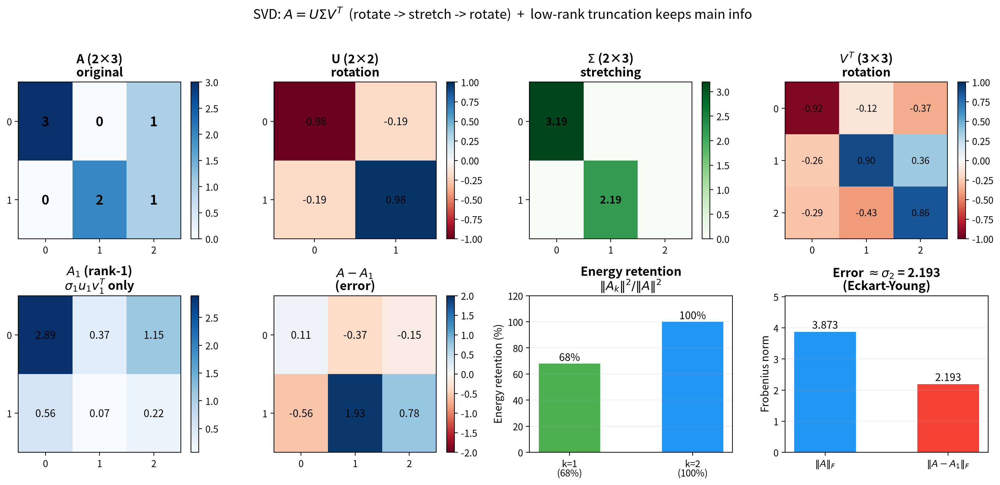

**图19**：左：SVD将矩阵 $A$ 分解为 $U\Sigma V^T$ 三步——先旋转（$V^T$）、再沿坐标轴拉伸（$\Sigma$，奇异值 $\sigma_1 > \sigma_2$ 控制各方向拉伸倍数）、最后再旋转（$U$）。右：低秩截断只保留最大奇异值 $\sigma_1$ 对应的秩-1分量 $A_1 = \sigma_1 u_1 v_1^T$，丢弃 $\sigma_2$ 分量。截断后 $A_1$ 是 $A$ 的最佳秩-1近似（Eckart-Young定理），保留能量比例为 $\sigma_1^2 / (\sigma_1^2 + \sigma_2^2)$。

 * * *
## 6.3 高效注意力方法全景图

SVD的低秩洞见不只停留在数据压缩层面——它催生了一整个方法家族。这张表格给你一个全景视角：

| 方法 | 机制 | 压缩对象 | 核心操作 | 压缩效果 | 效果 |
|------|------|---------|---------|---------|------|
| 截断SVD | 低秩 | 任意矩阵 | 保留前k个奇异值 | 秩从d降到k | 数据压缩 |
| LoRA | 低秩 | 权重更新$\Delta W$（训练参数；推理时合并回$W_0$，零额外开销） | $\Delta W = BA$（秩r） | 训练参数从$d^2$降到$2dr$ | 微调大模型 |
| MLA | 低秩 | KV缓存 | $W^{UK} \cdot W^{DKV}$分解 | 缓存从$n \times d$降到$n \times d_c$ | 内存压缩为原来的1/8 |
| DSA | 稀疏 | 注意力矩阵元素 | 只算关键token对 | 计算量从$O(n^2)$降到$O(nk)$ | 速度提升 |
| CSA | 稀疏 | 注意力矩阵元素 | 分层选择性计算 | 不同层用不同粒度 | 自适应效率 |

**低秩方法（SVD/LoRA/MLA）通过因式分解减少有效维度，稀疏方法（DSA/CSA）通过选择减少非零元素——数学机制不同，但目标一致：**

$$\text{高维对象} \xrightarrow{\text{发现结构（低秩或稀疏）}} \text{只保留关键部分} \xrightarrow{\text{大幅降本增效}} \text{高效AI}$$

这五种方法可以**组合使用**——LoRA微调权重、MLA压缩缓存、DSA稀疏计算，共同构成高效长文本AI的完整方案。

 * * *
## 6.4 LoRA：低秩微调

### LoRA基础：$W = W_0 + BA$

预训练模型（如GPT、BERT）已经在大规模数据上训练好了，权重矩阵 $W_0$ 包含了丰富的知识。微调的目标不是推翻重来，而是在 $W_0$ 的基础上做小调整。SVD告诉我们：**有效的参数更新只存在于少数几个方向（低秩）**。LoRA（Low-Rank Adaptation）只学这几个方向上的调整，把训练参数量从几十亿砍到几百万。

**核心公式：**

$$W = W_0 + B \cdot A$$

**逐符号注释：**

- $W \in \mathbb{R}^{d \times d}$：最终的权重矩阵，形状是 $d$ 行 $d$ 列。这就是模型里实际用的那个矩阵，负责把输入向量 $x$ 映射成输出向量 $h$。
- $W_0 \in \mathbb{R}^{d \times d}$：预训练阶段学到的权重矩阵，**冻结不动**（frozen）。微调过程中它的每一个数字都保持不变，梯度不参与反向传播。
- $B \in \mathbb{R}^{d \times r}$：一个"高瘦"的矩阵，$d$ 行 $r$ 列，这是LoRA引入的**可训练参数**之一。
- $A \in \mathbb{R}^{r \times d}$：一个"矮胖"的矩阵，$r$ 行 $d$ 列，这是LoRA引入的另一个**可训练参数**。
- $r$（秩，rank）：一个远小于 $d$ 的整数（比如4、8、16），决定了LoRA修正的"丰富程度"。
- $\cdot$（矩阵乘法）：$B$ 和 $A$ 相乘，得到一个 $d \times d$ 的矩阵，但这个矩阵的秩最多只有 $r$。

**参数量对比（震撼版）：**

| 模型规模 | 层维度 $d$ | 全参数 $W_0$ | LoRA参数 ($r=4$) | 减少倍数 |
|---------|-----------|-------------|----------------|---------|
| 小型模型某层 | 512 | 262,144 | 4,096 | 64倍 |
| 大模型某层 | 4,096 | 16,777,216 | 32,768 | **512倍** |
| 超大模型某层 | 12,288 | 150,994,944 | 98,304 | **1,536倍** |

当 $d=4096$ 时，全参数微调需要约1600万参数，LoRA只需要约3.3万——从1600万到3.3万，512倍的压缩。需要训练的参数少了，反向传播的计算量和优化器状态（梯度的动量、方差等）也相应减少，微调的运算量大幅下降。

**为什么是低秩的？** 预训练模型已经在通用能力上非常全面了，特定任务的微调往往只是在某些"关键方向"上做些调整。比如让模型适应医学领域，主要需要调整与医学术语相关的那些语义方向，而不是重写整个语言理解系统。这种"集中在少数方向上"的调整，天然就具有低秩的结构。

**推理时零额外开销**：更妙的是，训练完成后可以把 $BA$ 直接加进 $W_0$ 得到 $W = W_0 + BA$，合并后的矩阵和原始 $W_0$ 一样大——**训练时只调几个旋钮，推理时零额外开销**，不增加任何延迟或显存。这也是 LoRA 相比其他微调方法的关键优势：省的是训练成本，不付推理代价。

**前向计算的数字演示**：

$$h = W_0 x + B \cdot A \cdot x$$

输入向量 $x$ 进来后，输出由两部分相加：$W_0 x$ 是用预训练权重的"基础知识"，$B \cdot A \cdot x$ 是LoRA的"增量贡献"。梯度只更新 $B$ 和 $A$，$W_0$ 纹丝不动。

取 $d=4, r=2$：

$$W_0 = I_4 = \begin{bmatrix} 1 & 0 & 0 & 0 \\ 0 & 1 & 0 & 0 \\ 0 & 0 & 1 & 0 \\ 0 & 0 & 0 & 1 \end{bmatrix}, \quad B = \begin{bmatrix} 1 & 2 \\ 3 & 4 \\ 5 & 6 \\ 7 & 8 \end{bmatrix}, \quad A = \begin{bmatrix} 1 & 0 & 1 & 0 \\ 0 & 1 & 0 & 1 \end{bmatrix}, \quad x = \begin{bmatrix} 1 \\ 2 \\ 3 \\ 4 \end{bmatrix}$$

**计算 $B \cdot A$**：

$$B \cdot A = \begin{bmatrix} 1 & 2 & 1 & 2 \\ 3 & 4 & 3 & 4 \\ 5 & 6 & 5 & 6 \\ 7 & 8 & 7 & 8 \end{bmatrix}$$

观察结果——第一列和第三列完全相同，第二列和第四列也完全相同。这不是巧合，这是低秩的"签名"！这个 $4 \times 4$ 矩阵只有2个线性无关的列，秩恰好等于 $r=2$。

**计算 $W = W_0 + BA$**：

$$W = \begin{bmatrix} 2 & 2 & 1 & 2 \\ 3 & 5 & 3 & 4 \\ 5 & 6 & 6 & 6 \\ 7 & 8 & 7 & 9 \end{bmatrix}$$

**计算输出 $h = W x$**：

$$h = \begin{bmatrix} 2+4+3+8 \\ 3+10+9+16 \\ 5+12+18+24 \\ 7+16+21+36 \end{bmatrix} = \begin{bmatrix} 17 \\ 38 \\ 59 \\ 80 \end{bmatrix}$$

$W_0$ 贡献了 $[1, 2, 3, 4]^T$，LoRA修正贡献了 $[16, 36, 56, 76]^T$。预训练的"底子"加上LoRA的"微调调料"，得到了最终结果。

LoRA有一个关键超参数：秩 $r$。$r$ 太小，修正能力不够；$r$ 太大，参数量和计算量又上去了。而且不同层的需求不同——靠近输入的层可能只需要微调一两个方向，靠近输出的层可能需要更丰富的修正。固定 $r$ 对所有层一视同仁，不够灵活。下面三种变体分别从不同角度改进LoRA：

 * * *
### QLoRA：量化+低秩的双重压缩

LoRA减少了微调时需要训练的参数量，但它有一个前提：**$W_0$（预训练权重）必须完整加载到显存中**。一个7B参数的模型用16位浮点数存储，需要约14GB显存；用32位则需要约28GB。加上优化器状态、激活值和LoRA本身，24GB显存的消费级GPU（如RTX 3090/4090）装不下32位版本，16位版本也很紧张。

**一句话：LoRA只省了训练参数，但没省模型本身的存储，24GB显存装不下7B模型的完整权重。**

**QLoRA**（Quantized LoRA，量化LoRA）的核心思想是：把 $W_0$ 从32位浮点数量化到**4-bit**（NormalFloat4，简称NF4）。量化就是用更少的比特表示同一个数——32位变成4位，存储量压缩为原来的1/8。但QLoRA不是简单的四舍五入，它使用了一种**专门为神经网络权重分布优化的量化格式**：NormalFloat（正态浮点）。

> **前置知识**：神经网络权重的分布通常接近正态分布（中间密集，两端稀疏）。NormalFloat根据这个特性不均匀地分配量化点——中间区域量化点密集（保留精度），尾部区域量化点稀疏（允许更大误差）。实测表明，NF4量化对模型下游任务的性能损失通常**<1%**（注意：单个权重的量化误差可能更大，如下方示例中约1.6%，但LoRA的$BA$会在训练中补偿这些误差，最终模型输出几乎不受影响）。

QLoRA的完整公式很简单：

$$W_{\text{qlora}} = \underbrace{\text{quantize}(W_0, 4\text{-bit})}_{\text{冻结的4-bit基础权重}} + \underbrace{B \cdot A}_{\text{LoRA适配器（16-bit训练）}}$$

**一个具体的量化演示**：假设 $W_0$ 中有一个权重 $w = 0.063$（32-bit浮点数，在计算机中占4字节）。

NormalFloat4怎么编码它？
1. **查分布**：LLM权重通常服从均值为0、标准差$\sigma \approx 0.05$的高斯分布。$w = 0.063$ 落在"高频区域"（靠近均值）
2. **找量化点**：NF4为这个位置分配了密集的量化点（以下数值为示意，实际NF4量化点由标准正态分布的分位函数精确计算），比如$\{0.056, 0.062, 0.069, 0.076\}$
3. **四舍五入**：$0.063$ 最接近 $0.062$，编码为4-bit二进制`0110`（十进制6）。存储只需半字节（0.5字节），精度损失仅 $|0.063 - 0.062|/0.063 \approx 1.6\%$

解量化时，`0110` → 查表得$0.062$，临时恢复到16-bit用于计算。绝大多数权重（>95%）的量化误差都在2%以内。少数"离群值"（如$w = 0.847$，远离均值）误差较大，但LoRA的$BA$会在训练中补偿这些误差。

训练时，$W_0$ 以4-bit格式驻留显存， forward pass 需要计算时临时解量化到16-bit；LoRA的 $B$ 和 $A$ 则始终以16-bit精度训练。两者相加得到最终的权重用于计算梯度。

**一句话：QLoRA = 4-bit量化的 $W_0$ + 16-bit的LoRA $BA$，双重压缩让消费级GPU也能微调大模型。**

用一个类比来理解：LoRA是给教授配了一个研究生助理——只改助理，不动教授。QLoRA则是**先把教授20年的知识笔记压缩成一本速记手册**（4-bit量化），再配一个助理（LoRA）。速记手册占的书架空间只有原来的1/8，但核心知识都在。助理在速记手册的基础上做补充和调整。最终输出时，速记手册临时展开 + 助理的笔记 = 完整答案。

QLoRA的影响是巨大的。它让24GB显存的消费级GPU可以微调**7B甚至13B**的模型。如果没有QLoRA，这些模型只有拥有A100/H100集群的机构才能触及。可以说，QLoRA是**"大模型平民化"**的关键技术之一——它证明了知识（权重）可以被大幅压缩而不失精髓，而真正需要精细学习的部分（LoRA）只占极小的参数量。

 * * *
### SVD与LoRA的数学联系：$BA$ 与SVD截断的等价构造

SVD不只是数据压缩工具，它还回答一个关键问题：**LoRA 的 $BA$ 为什么有效？** 答案就藏在 SVD 的最佳低秩近似定理里。

**核心问题**：LoRA 假设微调的修正量 $\Delta W$ 是低秩的，用 $BA$（秩 $r$）去近似它。但"秩 $r$ 的矩阵"有无穷多个，$BA$ 凭什么能捕获最重要的信息？SVD 给出了数学保证。

> **工程说明**：以下推导展示的是 SVD 与 LoRA 的数学联系。实践中 LoRA 最常用的初始化是**零初始化**（$B=0$，$A$ 随机），训练起点 $W = W_0 + BA = W_0$，与预训练行为完全一致。下面的 SVD 分解不是推荐初始化方法，而是回答"$BA$ 为什么有效"的数学原理。

**Step 1：对预训练权重 $W_0$ 做SVD**

$$W_0 = U \Sigma V^T$$

- $W_0 \in \mathbb{R}^{d \times d}$：预训练权重矩阵（"知识结晶"，冻结不动）
- $U \in \mathbb{R}^{d \times d}$：正交矩阵（左奇异向量，像一组"输出空间的正交坐标轴"）
- $\Sigma \in \mathbb{R}^{d \times d}$：对角矩阵，对角线上的奇异值 $\sigma_1 \geq \sigma_2 \geq \cdots \geq \sigma_d \geq 0$ 从大到小排列（"信息含量"的度量，越大越重要）
- $V^T \in \mathbb{R}^{d \times d}$：正交矩阵（右奇异向量的转置，像一组"输入空间的正交坐标轴"）

**Step 2：取前 $r$ 个奇异值和奇异向量**

从 $U$ 中取前 $r$ 列，从 $\Sigma$ 中取前 $r \times r$ 子矩阵，从 $V^T$ 中取前 $r$ 行：

- $U_r = U[:, :r] \in \mathbb{R}^{d \times r}$：$U$ 的前 $r$ 列（最活跃的 $r$ 个输出方向）
- $\Sigma_r = \Sigma[:r, :r] \in \mathbb{R}^{r \times r}$：前 $r$ 个奇异值组成的对角矩阵
- $V_r^T = V^T[:r, :] \in \mathbb{R}^{r \times d}$：$V^T$ 的前 $r$ 行（最活跃的 $r$ 个输入方向）

**Step 3：用SVD结果初始化 $B$ 和 $A$**

$$B = U_r \cdot \Sigma_r^{1/2}, \quad A = \Sigma_r^{1/2} \cdot V_r^T$$

- $\Sigma_r^{1/2}$：对角矩阵，每个对角元取平方根（$\sqrt{\sigma_1}, \sqrt{\sigma_2}, \ldots, \sqrt{\sigma_r}$），把"信息含量"开平方后公平地分给 $B$ 和 $A$
- $B \in \mathbb{R}^{d \times r}$：高瘦矩阵，承载输出方向的"骨架"
- $A \in \mathbb{R}^{r \times d}$：矮胖矩阵，承载输入方向的"骨架"

**验证 $BA$ 确实是 $W_0$ 的 $r$ 秩最佳近似：**

$$B \cdot A = (U_r \cdot \Sigma_r^{1/2}) \cdot (\Sigma_r^{1/2} \cdot V_r^T) = U_r \cdot \Sigma_r \cdot V_r^T$$

这正是对 $W_0$ 的SVD结果进行截断后得到的低秩近似。Eckart-Young-Mirsky定理保证了：在所有秩不超过 $r$ 的矩阵中，$U_r \Sigma_r V_r^T$ 是 $W_0$ 在Frobenius范数意义下的**最佳近似**。这就是 LoRA 的数学基础：$BA$ 的形式天然能表达秩 $r$ 矩阵。但注意一个关键区分——SVD分解的是 $W_0$（冻结的预训练权重），而LoRA训练的 $BA$ 近似的是 $\Delta W$（任务相关的微调修正量）。SVD of $W_0$ 证明的不是"$\Delta W$ 一定低秩"，而是"低秩矩阵能捕获矩阵中最重要的信息"。LoRA的假设是：微调修正量 $\Delta W$ 与预训练权重 $W_0$ 类似，也具有低秩结构（主要修正集中在少数几个方向上）。这个假设已被大量实验验证——奇异值衰减快的权重矩阵，其微调修正量同样集中在低秩子空间。训练中 $B$ 和 $A$ 从零初始化出发（$BA=0$，不改变初始行为），逐步学习到任务所需的低秩修正。

 * * *
### DoRA：幅度-方向解耦

LoRA的 $BA$ 修正同时改变权重的方向和幅度，两者耦合在一起。DoRA（Weight-Decomposed Low-Rank Adaptation）把权重分解为**幅度**和**方向**两部分，分别微调。

**核心直觉**：权重矩阵 $W$ 的每一行定义一个输出通道。这一行的"方向"决定该通道关注哪些输入特征，"幅度"（该行的长度）决定该通道的输出强度。微调一个任务时，有时只需要调整"关注哪些特征"（方向），有时只需要调整"这个通道有多重要"（幅度）。纯LoRA做不到分离——它的 $BA$ 修正同时改了两者。DoRA把它们拆开，各自独立调。

**Step 1：权重分解——把每行拆成幅度和方向**

权重矩阵 $W$ 的每一行 $w_i$ 可以分解为一个标量（幅度）乘以一个单位向量（方向）：

$$w_i = m_i \cdot \frac{w_i}{\|w_i\|}$$

- $m_i = \|w_i\|$（该行的L2范数 $\sqrt{w_{i1}^2 + w_{i2}^2 + \cdots}$，即该行的长度——幅度）
- $\frac{w_i}{\|w_i\|}$（该行除以自己的长度，变成单位向量——方向）

这就像把一个力分解为"大小$\times$方向"：$\vec{F} = |\vec{F}| \cdot \hat{F}$。幅度 $m_i$ 是标量，方向 $\frac{w_i}{\|w_i\|}$ 是单位向量，两者乘回来等于原始权重行。

矩阵形式（对所有行同时操作）：

$$W = m \odot \frac{W}{\|W\|_{\text{row}}}$$

- $m \in \mathbb{R}^d$：幅度向量，每个元素是一行的范数
- $\frac{W}{\|W\|_{\text{row}}}$：方向矩阵，每行归一化为单位向量
- $\odot$：逐行乘法——$m_i$ 乘以方向矩阵第 $i$ 行的每个元素

**Step 2：对方向部分做LoRA**

$$D = W_0 + BA$$

$D$ 是修正后的权重矩阵，和基础LoRA完全一样——在 $W_0$ 基础上叠加低秩修正 $BA$。但 $BA$ 同时改了 $D$ 每行的方向和幅度。DoRA的关键在下一步：把幅度丢掉，只留方向。

**Step 3：幅度向量可训练**

幅度向量 $m$ 初始化为 $W_0$ 每行的范数，然后在训练过程中被梯度独立更新。相比LoRA，DoRA只多了 $d$ 个参数（一个幅度向量），对于 $d=4096$ 来说几乎无成本。

**Step 4：DoRA的完整前向公式**

$$h = \left[ m \odot \frac{D}{\|D\|_{\text{row}}} \right] \cdot x$$

1. 算修正后的权重 $D = W_0 + BA$（$BA$ 同时改了方向和幅度）
2. 对 $D$ 每行归一化（**这一步丢掉 $BA$ 带来的幅度变化，只留方向**）
3. 用幅度向量 $m$ 逐行缩放（幅度由 $m$ 独立控制，不受 $BA$ 影响）
4. 乘以输入 $x$ 得到输出 $h$

对比LoRA的 $h = (W_0 + BA) \cdot x$：LoRA的 $BA$ 同时改了方向和幅度，混在一起。DoRA在 $BA$ 之后加一步归一化，把幅度剥离掉，再由 $m$ 独立赋值——方向归 $BA$ 管，幅度归 $m$ 管。

**数字代入演示**：用一个独立的 $4 \times 4$ 例子，设 $W_0$ 的四行分别为 $[5,4,3,2]$、$[6,3,1,0]$、$[5,3,2,0]$、$[4,3,2,1]$（这里只关心每行的幅度，所以行内具体数值只需满足后面的范数）。

**初始幅度** $m^{(0)}$：

$$m_1^{(0)} = \|[5, 4, 3, 2]\| = \sqrt{25+16+9+4} = \sqrt{54} \approx 7.348$$

同理：$m_2^{(0)} = \sqrt{46} \approx 6.782$，$m_3^{(0)} = \sqrt{38} \approx 6.164$，$m_4^{(0)} = \sqrt{30} \approx 5.477$

所以 $m^{(0)} = [7.348,\ 6.782,\ 6.164,\ 5.477]^T$。

**方向归一化**后，第1行变成 $[5, 4, 3, 2] / 7.348 \approx [0.680,\ 0.544,\ 0.408,\ 0.272]$，验证范数为1，确实是单位向量。

**训练过程中幅度怎么调？** $m$ 的每个元素是一个可训练标量，初始化为 $m^{(0)} = [7.348,\ 6.782,\ 6.164,\ 5.477]^T$。反向传播时，损失函数对 $m$ 求梯度，梯度告诉每个通道的幅度该增大还是减小。训练若干步后，假设 $m$ 更新为 $m' = [7.5,\ 6.5,\ 6.0,\ 5.5]^T$——对比初始值，第1个通道从7.348涨到7.5（该通道更重要了），第2个从6.782降到6.5（该通道不太重要）。

这就是DoRA相比LoRA多出来的能力：$BA$ 负责调方向（每个通道关注哪些输入特征），$m$ 负责调幅度（每个通道的输出强度有多大）。两者独立更新，互不干扰。实验表明，在大多数下游任务上，DoRA的表现稳定优于纯LoRA。

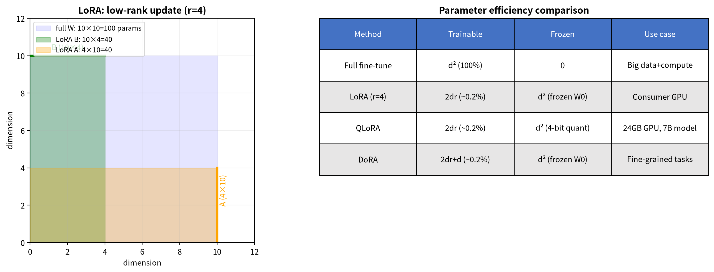


**图20**：左：LoRA 低秩更新示意图（$d=10$、$r=4$）——全参数微调要更新整个 $d \times d = 100$ 个参数（蓝色区域），LoRA 只训练"高瘦"的 $B$（$d \times r = 40$，绿色）和"矮胖"的 $A$（$r \times d = 40$，橙色），合计 $2dr = 80$ 个参数。右：参数效率对比表——全参数微调可训练参数 100%；LoRA/QLoRA 的可训练参数约 0.2%，其中 QLoRA 把冻结的 $W_0$ 压到 4-bit（适合 24GB 显存跑 7B 模型）；DoRA 多一个幅度向量，为 $2dr + d$（适合细粒度任务）。

 * * *
### AdaLoRA：动态调秩

LoRA、QLoRA、DoRA都假设每层用同一个固定的秩 $r$。但模型不同层复杂度不同：有的层需要丰富的修正（大 $r$），有的层只需微调一两个方向（小 $r$ 就够了）。AdaLoRA（Adaptive LoRA）的做法是**让 $r$ 在训练过程中自动调整**。

具体来说，AdaLoRA把每层的 $BA$ 分解写成 SVD 形式 $B A = P \Lambda Q^T$（其中 $\Lambda$ 是对角矩阵，对角线元素就是各方向的"重要性"）。训练过程中，重要性低的方向对应的 $\Lambda$ 元素会自动缩小，缩小到接近零的方向被剪枝掉；同时，参数预算被重新分配给重要性高的方向。最终每层自动收敛到不同的有效秩——复杂层保留更多方向，简单层自动精简。

这和SVD低秩近似的思路一脉相承：SVD按奇异值大小截断，AdaLoRA在训练中动态地做这件事，让模型自己决定每层保留几个方向。

**四种低秩微调方法对比**：

| 方法 | 解决的问题 | 核心改动 | 额外参数 |
|------|-----------|---------|---------|
| LoRA | 全参数微调运算量太大 | $W_0 + BA$，只训 $B,A$ | $2dr$ |
| QLoRA | $W_0$ 存储太大 | $W_0$ 量化到4-bit | $2dr$ |
| DoRA | 方向和幅度耦合 | $BA$ 调方向 + $m$ 调幅度 | $2dr + d$ |
| AdaLoRA | 固定秩 $r$ 不够灵活 | 训练中动态调整每层 $r$ | $2dr$（总量不变） |

四种方法不互斥——你可以同时用QLoRA（量化 $W_0$）+ DoRA（解耦幅度方向）+ AdaLoRA（动态分配秩），三者作用于不同环节，叠加生效。

**自查**：合上书，能默写 $W = W_0 + BA$，并说出 $B$、$A$ 的维度（$d \times r$ 与 $r \times d$）和谁被冻结吗？

 * * *
## Part A 小结：你已经掌握了什么

到这里，你应该能回答四个问题：

1. SVD 把任意矩阵拆成哪三块？为什么截断后仍是"最佳近似"？
2. 低秩截断为什么能压缩？能量保留比例在衡量什么？
3. LoRA 为什么能把训练参数量从 $d^2$ 降到 $2dr$？推理时为什么零额外开销？
4. §6.3 的全景表里，低秩和稀疏两条路的本质区别是什么？

<details>
<summary>核对你的答案</summary>

1. $A=U\Sigma V^T$：$U,V$ 是旋转/反射，$\Sigma$ 是对角拉伸；Eckart-Young 定理保证截断后是相同秩下的最佳近似。
2. 因为奇异值衰减快，少数方向承载大部分能量；能量保留比例 = 前 $k$ 个奇异值平方和 / 全部平方和。
3. LoRA 把 $\Delta W$ 分解为 $B\cdot A$，可训练参数从 $d^2$ 降到 $2dr$；推理时把 $BA$ 合并回 $W_0$，所以零额外开销。
4. 低秩通过因式分解减少有效维度，稀疏通过选择减少非零元素/计算量；两者机制不同，可以组合。

</details>

如果核对后仍有模糊，回看 §6.2 和 §6.4，再进入 Part B。

## Part B：高效 AI 的工程拼图

> **Part B 核心**：MLA/DSA/CSA/MoE 分别压维度、压计算、压激活，组合起来才是高效 AI 工程。

Part A 解决了"低秩是什么、LoRA 怎么用它"。Part B 把同一双眼睛转向 Attention 和整个模型：MLA/DSA/CSA 压缩或跳过计算，MoE 走另一条稀疏激活的路，最后在 AI 落地表中汇合。

## 6.5 低秩注意力方法（MLA / DSA / CSA）

Ch5 讲过 Attention 推理时需要缓存 K、V 矩阵（$n \times d \times \text{层数}$）。当 $n=100k, d=4096$ 时，这是几十 GB 显存。低秩注意力方法从不同角度解决这个问题。

### MLA：低秩压缩维度

**MLA（Multi-head Latent Attention，DeepSeek-V2）**的核心假设：训练后的 KV 矩阵奇异值衰减较快——前几十个方向承载了大部分信息（这是对训练后模型的经验观察，也是MLA有效的前提条件）。

回忆Ch5：标准Attention中每个head有独立的 $W_K^{(i)}$ 和 $W_V^{(i)}$，把输入投影到 $d_k$ 维。MLA不再为每个head独立投影，而是先把所有head的信息统一压缩到一个低维的 **latent 向量** $c$（维度 $d_c \ll d$，通常 $d_c = d/8$）中，再展开回各head的K和V——注意公式里 $c$ 没有 head 下标：**所有 head 共享同一个 latent 向量 $c$**，各 head 的差异全在展开矩阵 $W^{UK}$、$W^{UV}$ 的不同区块里（每个 head 用自己的那一段）。这正是压缩的来源：$d$ 维的 K/V 信息被挤进 $d_c$ 维的 $c$，缓存时只存 $c$ 不存各 head 的 K/V。

**核心公式**：

$$c = W^{DKV} \cdot h \quad \text{(编码：把隐藏状态压缩为latent向量)}$$

$$K = W^{UK} \cdot c, \quad V = W^{UV} \cdot c \quad \text{(解码：从latent恢复K/V)}$$

**与LoRA的数学同构**：把两步合成一步，$K = W^{UK} \cdot (W^{DKV} \cdot h) = (W^{UK} \cdot W^{DKV}) \cdot h$。令 $W_{\text{eff}}^K = W^{UK} \cdot W^{DKV}$，则 $\text{rank}(W_{\text{eff}}^K) \leq d_c$——这与LoRA的 $\text{rank}(BA) \leq r$ 是同一个低秩分解结构：

| | LoRA | MLA |
|---|---|---|
| 分解式 | $B \cdot A$ | $W^{UK} \cdot W^{DKV}$ |
| 瓶颈维度 | $r \ll d$ | $d_c \ll d$ |
| 压缩因子 | $A \in \mathbb{R}^{r \times d}$ | $W^{DKV} \in \mathbb{R}^{d_c \times d}$ |
| 解压因子 | $B \in \mathbb{R}^{d \times r}$ | $W^{UK} \in \mathbb{R}^{d \times d_c}$ |

区别只在用途：LoRA 冻结 $W_0$、只训练 $B \cdot A$ 作为修正项；MLA 从头训练整个 $W^{UK} \cdot W^{DKV}$，推理时只缓存中间的 $c$。由 $d_c = d/8$ 得压缩比 $d/d_c = 8$。

$W^{DKV}$（$d_c \times d$）是**压缩矩阵**，$W^{UK}$ 和 $W^{UV}$（均 $d \times d_c$）是**解压矩阵**。推理时只需缓存 $c$（$n \times d_c$）而非完整 KV（$n \times d$）。

**类比**：帮读者找"类似的书"，标准做法是每次搬来整本书比对（完整 KV）。MLA 给每本书提前做一张**索引卡**（latent 向量 $c$），只记录关键特征。比对时只看卡片，不搬整本书。内存压缩为原来的约1/8，质量损失很小。

### DSA/CSA：稀疏减少数量

**DSA（DeepSeek Sparse Attention）**只计算"关键 token 对"的注意力，其余直接赋零。若每个 token 只关注 $k$ 个关键位置（$k$ 为常数），计算量从 $O(n^2)$ 降到 $O(nk)$；选择关键位置的策略本身也需要开销，具体取决于实现。

**CSA（Compressed Sparse Attention）**跨尺度分层：粗粒度看全局结构（低秩），细粒度看局部细节（较高秩），不同尺度自适应分配计算资源。

**三者关系**：MLA 压缩 KV 的**维度**（从 $d$ 到 $d_c$，低秩），DSA 减少注意力计算的**token对数量**（从 $n^2$ 到 $O(nk)$，稀疏），CSA 在不同尺度选择性分配计算资源。三者机制不同，可以组合使用。

## 6.6 为什么低秩无处不在？

看完这五种低秩方法，你可能会问一个问题：**为什么低秩在AI里这么好用？** 答案藏在三个层面。

**第一，自然界的信息本来就是冗余的。** 现实世界中的数据不是均匀分布在所有维度上的——它们有结构、有模式、有相关性。一张人脸照片有100万像素，但描述"这是一张人脸"只需要几十个关键特征（眼睛位置、鼻子形状、嘴巴弧度）。SVD的低秩截断本质上是在说：不要为每一个像素单独存储信息，只存储那些能重建整体的"关键方向"。

**第二，预训练模型是"过度完备"的。** 大模型的参数量（几百亿甚至上千亿）远大于它实际需要表示的有效信息量。这不是浪费，而是必要的——过度完备的表示让模型有能力学习各种复杂模式。但这也意味着，模型内部存在大量冗余。LoRA的发现就是：你不需要动所有参数来适配一个新任务，只需要在几个关键方向上微调。

**第三，低秩等于抓住本质、丢掉噪音。** 大奇异值对应信号（数据的结构、模式、趋势），小奇异值对应噪音（随机波动、测量误差、无关细节）。低秩方法的核心操作——保留大方向、丢弃小方向——本质上是一个智能滤波器。它不是在盲目丢数据，而是在区分"重要"和"不重要"。

**未来方向**：随着模型越来越大（万亿参数级）、序列越来越长（百万token级），低秩方法只会越来越重要。SVD、LoRA、MLA、DSA、CSA——这些方法不是独立的技巧，而是同一条底层规律的不同面孔。甚至优化器也在利用低秩结构：Ch1 §1.5 讲的 Muon 对动量矩阵做正交化（等价于把 SVD 中的奇异值全拉平为 1，只保留 $UV^T$），防止更新坍缩到低秩子空间。把它们组合起来，就是通往高效AI的完整路线图。

 * * *
## 6.7 MoE：稀疏激活的互补路径

低秩方法（LoRA、MLA、SVD截断）是高效AI的一条路——**以小博大**。但还有另一条同样重要的路：**MoE**（Mixture of Experts，混合专家），它的思路不是压缩，而是**稀疏激活**。注意：MoE不是低秩方法；它减少每次前向计算调用的参数量，低秩减少参数/缓存的维度——两者作用于不同对象，互补而不冲突。

**一句话：低秩方法以小博大（LoRA 训练时只调低秩增量、推理时合并回原矩阵零开销，MLA 压 KV 缓存，SVD 截断压矩阵元素），MoE 减少单次计算量，两条路互补。**

### 路由：每个token选择专家

MoE的核心结构很简单：每个"层"不再是一个统一的神经网络，而是拆成 $N$ 个**专家**（expert，本质上是小的前馈网络），外加一个**路由器**（gating network，一个小型分类器）。输入来了，路由器决定把这个输入送给哪几个专家——通常是2个。其余 $N-2$ 个专家完全不动，既不计算也不耗电。

$$y = \sum_{i=1}^{N} G(x)_i \cdot E_i(x)$$

$E_i(x)$ 是第 $i$ 个专家对输入 $x$ 的处理结果，$G(x)_i$ 是路由器分配给第 $i$ 个专家的权重（大部分为0，只有少数非零）。

**一个具体的路由演示**：假设有$N = 8$个专家，输入是一个token的嵌入向量$x$。路由器$G$是一个线性层+Softmax，输出8个权重：

$$G(x) = \text{Softmax}(x \cdot W_g) = [0.01,\ 0.02,\ 0.35,\ 0.01,\ 0.05,\ 0.01,\ 0.50,\ 0.05]$$

权重最高的两个是专家3（0.35）和专家7（0.50）。设定**top-2路由**（只激活权重最高的2个专家），其余归零：

$$G(x)_{\text{sparse}} = [0,\ 0,\ 0.35,\ 0,\ 0,\ 0,\ 0.50,\ 0]$$

最终输出：$y = 0.35 \cdot E_3(x) + 0.50 \cdot E_7(x)$。专家1、2、4、5、6、8完全未参与计算。8个专家只用了2个——**75%的参数被跳过**。

> **小细节**：这里 $0.35 + 0.50 = 0.85 \neq 1$，输出 $y$ 没归一化。工程上有两种做法：一是对 top-2 权重重新归一化（$0.35/0.85 \approx 0.41$、$0.50/0.85 \approx 0.59$），二是直接用原始权重（总和可不为 1，靠后续层自适应）。两种都有人用，本例展示的是"不归一化"的写法——重点是**只有两个专家参与**，权重和是否为 1 不影响这个结论。

用类比来理解：MoE就是**大厨房的分工制度**。客人来了，不是让全厨房的厨师都来做这一道菜（Dense模型的做法），而是先由**前台**（路由器）判断这道菜属于什么类型，只派给2-3个对口的厨师（激活的专家）。炒菜的派炒菜的，烧烤的派烧烤的——全厨房有几十个厨师（几百个专家），但每道菜只用其中几个。总厨师数很多（总参数量大），但每道菜消耗的人力很少（每次前向计算量小）。

### 负载均衡：让每个专家都有活干

top-$k$路由有个致命的失败模式：**路由坍塌**。如果路由器发现专家3和专家7总是给出最好的结果，它会越来越倾向于把输入送给它们，其他专家拿不到训练信号，能力退化，路由器更不敢选它们——正反馈死循环。最终256个专家只有2个在干活，其余254个成了死参数。

解法是**辅助损失**（auxiliary loss）：在训练目标之外加一个惩罚项，强迫每个专家收到的token数量大致均匀。最常见的形式是：

$$\mathcal{L}_{\text{aux}} = \alpha \cdot N \cdot \sum_{i=1}^{N} f_i \cdot P_i$$

其中 $f_i$ 是专家 $i$ 实际收到的token比例（频次，**无梯度**），$P_i$ 是路由器分配给专家 $i$ 的平均概率（**有梯度**），$N$ 是专家数，$\alpha$ 是超参数（通常很小，如0.01）。乘积形式的设计精髓在于：$f_i$ 被detach（当作常数），梯度 $\partial \mathcal{L}_{\text{aux}} / \partial P_i = \alpha N f_i$ 直接压低被高频使用的专家的路由概率——专家越忙，路由器被推得越狠。如果用 $\sum (P_i - 1/N)^2$（不看频次），梯度会无差别地把所有 $P_i$ 推向 $1/N$，即使某些专家确实更适合某些任务；如果用 $\sum (f_i - 1/N)^2$ 且 $f_i$ detached，梯度为零。乘积形式是让"测量（频次）"和"可控量（概率）"耦合起来的**经典设计**（也有其他变体，乘积形式最常用）。

**DeepSeek-V3的改进**：辅助损失有个副作用——它在全局层面均衡负载，但不保证每个batch内均匀。DeepSeek-V3用**无辅助损失的负载均衡**（auxiliary-loss-free balancing）替代：在路由器的Softmax之前，给每个专家的logit加一个**偏置项** $b_i$。偏置项不参与梯度回传，而是由一个简单的控制器动态调整——如果专家 $i$ 最近被选得太少，就增大 $b_i$ 让它更容易被选中。这比辅助损失更精准（直接调控选择频率而非间接惩罚），也避免了辅助损失干扰主训练目标的问题。

### 容量因子：防止"厨房堵塞"

即使负载均衡了，单个batch内仍可能出现大量token涌向同一个专家的情况——就像午饭时间所有客人都点了炒菜，炒菜厨师忙不过来。**容量因子**（capacity factor）给每个专家设了一个硬上限：每个batch最多处理 $C = \text{capacity\_factor} \times \frac{\text{batch\_tokens}}{N}$ 个token。超出容量的token被**丢弃**（drop）或**溢出**到下一层。

容量因子是吞吐和质量的旋钮：
- 太小（如0.5）：大量token被丢弃，信息损失严重
- 太大（如4.0）：几乎不丢token，但每个专家要预留大量计算资源，稀疏性优势被削弱
- 典型值：1.0-1.5

被丢弃的token怎么处理？两种工程方案：**零填充**（直接用零向量代替，最简单但信息损失）和**循环路由**（溢出的token在下一层优先处理，信息不丢但增加延迟）。现代MoE实现（如Llama 4、Qwen3）也有用更精细的方案——把被丢弃的token通过残差连接直接传到下一层，保证信息不中断。

### 训练和推理的不对称

MoE有一个容易被忽略的特性：**训练时所有专家都参与（梯度更新），推理时只激活少数专家**。

训练时，每个batch的token被分散到不同专家，所有专家都收到梯度更新。这意味着256个专家的参数都在学习——总训练算力与Dense模型相当（甚至更高，因为路由器也要训练）。

推理时，每个token只经过2个专家。256个专家的参数全部驻留在显存里（总参数量671B），但计算量只有37B。这就是MoE的核心trade-off：**用显存换算力**。

| | Dense模型 | MoE模型 |
|---|---|---|
| 总参数量 = 激活参数量 | ✓ | ✗（总参数量 >> 激活参数量） |
| 训练算力 ∝ 总参数量 | ✓ | ✓（所有专家都训练） |
| 推理算力 ∝ 激活参数量 | ✓ | ✓（只算激活的专家） |
| 推理显存 ∝ 总参数量 | ✓ | ✓（所有参数都要驻留） |

**关键洞察**：MoE让"模型容量"（总参数）和"单步计算量"（激活参数）解耦。Dense模型的671B参数意味着每次前向都要算671B；MoE的671B参数只有37B在算，但全部671B都要驻留在显存里。这就是为什么DeepSeek-V3推理时需要多卡——不是算力不够，是显存装不下所有专家。

### 与低秩的互补

**主流大模型已纷纷转向MoE**：
- **GPT-4**：据传闻采用 $8\times220$B 专家结构
- **Llama 4 Maverick**：128个专家（Scout 为 16 个）
- **DeepSeek-V3**：256个专家，总参数量671B，每次只激活37B
- **Qwen3**：128个专家
- **Grok 3**：据报道128个专家，总参数量约1.2T（xAI未正式公开架构细节）

关键洞察：**MoE和低秩互补**——它们作用于不同对象（MoE减少每次激活的专家数，低秩减少矩阵的有效秩），效果独立可叠加。DeepSeek-V3就是同时用MoE（稀疏激活，减少单次前向计算量）+ **MLA**（低秩压缩KV cache，减少推理内存）。前者解决"算得快"，后者解决"存得下"。

### 一个完整的前向计算演示

把路由、负载均衡、容量因子串起来，看一个256专家、top-2路由的MoE层在单次前向中发生了什么：

假设batch大小为4，序列长度为1024，共4096个token。256个专家，容量因子3.0，每个专家容量 = $3.0 \times 4096 / 256 = 48$ 个token。

1. **路由**：4096个token各自经过路由器，每个选出top-2专家。产生 $4096 \times 2 = 8192$ 个"token-专家"分配对。
2. **容量检查**：统计每个专家收到的token数。平均每个专家收到 $8192 / 256 = 32$ 个token，未超容量48。但负载不均：如果专家42收到60个token（超过容量48），前48个正常处理，后12个被丢弃或溢出。
3. **稀疏计算**：只有被分配且未超容量的token进入对应专家。每个专家只处理自己收到的token，其余参数不参与计算。
4. **加权汇总**：每个token的输出 = 两个激活专家的加权和（权重来自路由器的Softmax输出）。

**数字直觉**：4096个token $\times$ 2个专家 = 8192次专家前向计算。如果是Dense模型，4096个token要过完整的671B参数。MoE只激活了 $8192 / 256 = 32$ 个——等等，这个 32 是**每个专家平均收到的 token 数**（8192 个"token-专家"分配对 $\div$ 256 个专家），不是激活的专家数。激活的专家数是 **top-2 里的 2**（每个 token 只激活 2 个专家）。这两个数字要分清：

- **每 token 激活 2 个专家**（top-2 路由）→ 稀疏计算的核心：每次前向只有 $2/256 \approx 0.78\%$ 的专家参与计算。
- **每专家平均收 32 个 token**（8192/256）→ 负载均衡的视角：256 个专家分摊 8192 个分配对，平均每个专家处理 32 个 token（容量上限 48，见步骤2）。

DeepSeek-V3 的"37B 参数"是另一个口径：671B 总参数里，每个 token 实际激活约 37B（含共享专家和 MoE 层内激活的专家），$37/671 \approx 5.5\%$——注意 5.5% 是"激活参数占比"，与"激活专家占比 0.78%"不同，因为每个专家内部还有共用的 attention 等非 MoE 参数。**三个数字（2 个专家、32 个 token/专家、37B 参数）是 MoE 的三个不同侧面，别混为一谈。**

 * * *
## 6.8 AI落地

| 方法 | 机制 | 场景 | 一句话解释 |
|------|------|------|-----------|
| SVD截断 | 低秩 | 图像压缩 | 没有SVD，一张高清图要存储几百万个像素；有了SVD截断，只保留几十个主成分就能重建出肉眼几乎看不出差别的图片 |
| LoRA | 低秩 | 消费级GPU微调7B模型 | 没有LoRA，全参数微调需要专业级高显存GPU集群，普通人无法触及；LoRA让24GB显存的家用显卡也能打造专属AI助手 |
| 多LoRA切换 | 低秩（工程应用） | 风格切换（如水彩/赛博朋克） | 没有LoRA，每个任务都要存一份全参数副本（7B模型约14GB），100个任务就是1.4TB；LoRA插件每个只有几十MB，像换手机壳一样轻松切换 |
| MLA | 低秩 | 长文本推理（100k tokens） | 没有MLA，KV缓存内存爆炸，长文本根本无法处理；MLA缓存压缩为原来的1/8，让超长文本成为可能 |
| DSA | 稀疏 | 实时长文档问答 | 没有DSA，注意力计算量随序列长度平方增长（$O(n^2)$），实时性无法满足；DSA把计算量降到$O(nk)$，长文档也能秒回 |
| CSA | 稀疏 | 多粒度文档理解 | 没有CSA，统一处理粒度导致效率低下；CSA像读书先读目录再读重点章节，不同部分用不同精度，效率最大化 |
| QLoRA | 量化+低秩 | 消费级GPU微调7B/13B模型 | 没有QLoRA的4-bit量化，24GB显存装不下7B模型的完整权重。QLoRA = 4-bit $W_0$ + LoRA BA，让家用显卡也能打造专属AI助手 |
| MoE | 稀疏激活 | GPT-4/Llama 4/DeepSeek-V3 | 没有MoE的稀疏激活，每次推理都要计算全部参数。MoE只激活2个专家，让671B参数的DeepSeek-V3每次只算37B——"算得快"和"存得下"兼得 |
| DoRA | 低秩（LoRA变体） | 精细情感分类 | 没有DoRA的幅度-方向解耦，纯LoRA在需要区分"中性"和"轻微积极"等细微差别时表现不佳；DoRA用几乎零额外成本稳定提升效果 |

 * * *
## Part B 小结：从低秩到高效 AI

到这里，你应该能区分四件事：

1. MLA 压的是 KV 的**维度**（低秩），DSA/CSA 压的是注意力**计算量**（稀疏）。
2. MoE 不压缩矩阵，而是减少每次激活的专家数。
3. 低秩与稀疏/MoE 可以组合，解决不同瓶颈。
4. §6.8 的落地表能帮你在具体场景里选方法。

<details>
<summary>一句话对照</summary>

- MLA：把 K/V 压进低维 latent，缓存从 $n\times d$ 降到 $n\times d_c$。
- DSA/CSA：不降维，而是只算关键 token 对，把 $O(n^2)$ 降到 $O(nk)$。
- MoE：不压矩阵，每次只激活少数专家，减少前向计算量。
- 它们可以叠加：LoRA 省训练，MLA 省缓存，DSA 省计算，MoE 省激活。

</details>

如果这四点都清楚，就可以进入常见误解与章末回顾。

 * * *
## 6.9 常见误解

### 误解一："SVD 就是特征分解的别称吧？"

**很多初学者听到"分解"两个字，就以为SVD和特征分解是一回事。这大错特错。**

特征分解要求矩阵必须是**方阵**（行数等于列数），而且还要求矩阵满足特定对称性条件。它只能对某些特殊的方阵做分解。

SVD则完全不同：**它对任意矩阵都适用**——方的、扁的、高的，来者不拒。特征分解只能处理**特定类型的矩阵**（方阵且可对角化；对称矩阵一定满足，所以教材常以对称矩阵为例），而SVD来者不拒。特征分解其实是SVD的一个**特殊情况**：当 $A$ 是对称矩阵时，SVD退化成特征分解（此时 $U = V$ 且奇异值的绝对值就是特征值）。

**记住**：特征分解是"专属VIP服务"（条件苛刻），SVD是"全民普惠服务"（无门槛）。

 * * *
### 误解二："截断SVD就是丢数据，肯定不好吧？"

很多人觉得"丢掉信息"一定是坏事，但事实恰恰相反——基于SVD的低秩截断是SVD应用中最值钱的技术之一。

关键在于区分"信号"和"噪音"。在实际数据中，大奇异值对应数据的主要结构、主要模式、主要趋势——这些是你真正关心的"信号"。小奇异值往往对应随机波动、测量误差、无关细节——这些就是"噪音"。SVD截断丢掉的是后者，不是前者。就像你用收音机听音乐：大奇异值是那个清晰的旋律，小奇异值是背景里的"嘶嘶"静电声。截断操作相当于调低了噪音响度，让主旋律更突出。

但截断确实有个度的问题。截得太少，噪音没去掉；截得太多，连主旋律都被砍了。能量保留比例达到90%以上通常是个不错的平衡点。

 * * *
### 误解三："LoRA就是对 $W_0$ 做SVD，然后只保留前 $r$ 个奇异值"

这个想法完全错了。LoRA**从不对预训练权重 $W_0$ 做SVD**，也**从不修改 $W_0$**。$W_0$ 在微调过程中是冻结的（frozen），它的每一个数字都保持不变。

LoRA假设的是：**微调所需的修正量 $\Delta W$ 是低秩的**，然后用两个可训练矩阵的乘积 $B \cdot A$ 去近似这个 $\Delta W$。最终的权重是 $W = W_0 + B \cdot A$，其中只有 $B$ 和 $A$ 参与训练，$W_0$ 的梯度不参与计算。

打个比方：你不是把乐器拆开重新设计每一个零件（对 $W_0$ 做SVD），而是在现有乐器的基础上，调节几个旋钮（训练 $B$ 和 $A$）。乐器的主体结构（$W_0$）纹丝不动，但调节后的整体效果（$W = W_0 + BA$）却恰到好处。

**补充说明**：SVD与LoRA的数学联系（6.4节）展示了 $BA$ 天然是秩 $r$ 最佳近似的结构。实践中 LoRA 用零初始化（$B=0$，$A$ 随机），训练从 $W = W_0$ 出发，$B$ 和 $A$ 逐步学习到任务所需的低秩修正——SVD 保证了这种低秩修正能捕获最重要的信息方向。

 * * *
### 误解四："秩 $r$ 越小越好，参数量最少"

既然LoRA的卖点是参数少，那很多人就想：$r$ 设成1不就更好了？

$r$ 不是越小越好，这是效率和表达力之间的权衡。$r$ 决定了LoRA修正的秩上限——你的"调节自由度"。

- 如果 $r$ 太小（比如 $r=1$），你的修正只能朝一个方向上调整。这就像只有一个旋钮——能调，但效果粗糙。
- 如果 $r$ 太大，虽然能表达更丰富的修正，但参数量也随之增加，违背了"高效微调"的初衷。

固定秩 $r$ 不够灵活怎么办？AdaLoRA 能自动判断每一层需要多大的秩——复杂的层多分一些，简单的层少分一些，用更少的总参数量达到更好的效果。

 * * *
### 误解五："低秩方法之间是互斥的，只能选一个用"

**这是最常见的误解，也是本章要澄清的核心。**

低秩方法之间不是互斥关系，而是**互补关系**：

- **LoRA**作用于**权重空间**：微调时只更新少量参数
- **MLA**作用于**激活空间**：推理时只缓存压缩后的中间结果
- **DSA**作用于**计算图**：只计算关键的token对注意力
- **CSA**作用于**分层结构**：不同层、不同尺度用不同精度

这四种方法可以同时使用，互不冲突。想象你在优化一座图书馆的运营：LoRA是培训员工只学新分类规则（不动书架），MLA是给书贴索引卡（不搬整本书），DSA是重点维护热门书架（不巡视全馆），CSA是不同区域用不同的管理粒度。四个策略一起用，图书馆的效率才能达到最优。

在实际的长文本AI系统中（如DeepSeek-V2/V3），你确实能看到LoRA（微调适配层）+ MLA（压缩KV缓存）+ DSA（稀疏注意力）的组合使用。每种方法解决不同层面的问题，组合起来就是极致效率。

 * * *
## 6.10 本章回顾

低秩方法彼此的互补关系已经清楚了。不过，这些方法背后的思路，其实和前面每一章的数学工具是相通的——把它们放在一起看，能看出什么来？

**Ch1 梯度下降**在高维空间里找"最陡的下山方向"——但"最陡"取决于**度量**。Adam用自适应步幅为每个方向动态调整步长，本质思想相通：不同方向应该被区别对待。

**Ch2 拉格朗日乘子法**告诉我们：**约束决定了问题的结构**。LoRA的低秩假设（$\Delta W = BA$）正是把"秩不超过 $r$"作为约束——约束优化不只限制自由度，它揭示问题的本质结构。

**Ch3 最大熵**告诉我们：Softmax的指数形式是约束下"最诚实推断"的必然解。温度 $T = 1/|\lambda|$ 直接来自拉格朗日乘子——**约束的松紧决定了输出的形状**。

**Ch4 反向传播**是链式法则的工程实现——梯度在计算图中流动。LoRA中梯度只流向 $B$ 和 $A$，$W_0$ 冻结不动——这本身就是一种**结构化的梯度约束**。

**Ch5 Attention**中，$QK^T$（Softmax之前的分数矩阵）的秩受限于投影维度 $d_k$（通常 $d_k \ll n$）。MLA利用这一点压缩KV，DSA只计算关键token对——**Attention的分数矩阵天然低秩**。

**Ch6 SVD**是这一切的数学基础——它告诉我们：高维空间里只有少数方向真正重要（信息主干道 vs 噪音小巷）。

**六章怎么串起来**：梯度下降（Ch1）在约束定义的低秩子空间（Ch2）中做优化，约束的松紧调节输出的形状（Ch3），梯度通过反向传播结构化地流动（Ch4），在 Attention 天然低秩的舞台上（Ch5），沿着 SVD 揭示的关键方向（Ch6）找到真正重要的少数维度。

这不仅是技术技巧，更是一种面对复杂世界的策略：**先找到真正重要的少数维度，再在这些维度上倾尽资源**。回看整条问题链：怎么下山（梯度下降）→ 有约束怎么办（拉格朗日）→ 概率输出怎么来（Softmax）→ 梯度怎么传回去（反向传播）→ 权重怎么动态分配（Attention）→ 大矩阵怎么瘦身（SVD 与低秩）。每一步的答案都引出下一个问题——这就是从下山到高效 AI 的完整思路。

**本章自检**：

**【知识点】**

1. SVD把一个矩阵拆成了哪三部分？各自的几何含义是什么？
2. LoRA的参数量为什么能从$d^2$降到2dr？低秩假设的直觉是什么？
3. MLA的 $K = W^{UK} \cdot W^{DKV} \cdot h$ 与LoRA的 $W = W_0 + B \cdot A$ 在数学结构上有什么共同点？为什么说两者是同构的低秩分解？
4. QLoRA相比LoRA多了什么？为什么它能让消费级GPU微调大模型？
5. DSA/CSA的"稀疏"与LoRA/MLA的"低秩"在数学机制上有什么本质区别？
6. MoE与低秩为什么是"互补"而非"正交"？它们各自作用于什么对象？
7. 能量保留比例90%意味着什么？怎么计算？
8. 迁移：把低秩分解用到"推荐系统的矩阵补全"。一个视频平台有 100 万用户 $\times$ 10 万部电影，你只有每个用户看过的几十部电影的打分（稀疏矩阵，99.9% 是空）。用 SVD 的哪条性质补全空白打分？提示：用户偏好往往由少数几个隐藏因子（题材、导演、主演）决定。


9. 边界：低秩截断时保留的秩 r 怎么选？r 太小和 r 太大各有什么代价？能量保留比例和 r 是什么关系？

10. 边界：低秩近似什么时候会失效？如果矩阵本身不是低秩的（奇异值衰减缓慢），用低秩近似会怎样？

11. 生成：举一个你熟悉的领域（音乐/电影/商品），构造一个"表面高维、实际低秩"的例子：写出哪几个隐藏因子决定了 90% 的差异，并说明这对应 SVD 的什么。

12. 跨章：Ch1 的 Muon 对动量矩阵做"正交化"（奇异值全拉成 1），与本章 SVD 的哪一步是同一个数学结构？两者对奇异值的处理方向相反在哪里？

**【逻辑链】**

1. 沿这条链走一遍，理解方法家族的演化逻辑：

   **SVD**（揭示低秩）→ **LoRA**（低秩微调）→ **MLA**（低秩压缩KV）⇄ **DSA/CSA**（稀疏，另一条路）⇄ **MoE**（路由稀疏，又一条路）
     - **低秩**（因式分解）与 **稀疏**（选择零元素）→ 机制不同，可组合

> **未解问题**：六章的数学工具已经齐了——下山、约束、概率、追责、注意力、低秩。下一章把它们放到当前的前沿里看：这些工具能解释哪些正在发生的范式转移？

 * * *
# 第7章：前沿展望

> **核心概念**：
> 1. 五场范式转移都能用前六章数学工具看懂。
> 2. 混合架构、MoE、测试时算力、数据墙、扩散模型不是孤立新闻。
> 3. AR 与扩散在 MLE 框架下统一，但优化几何不同。

从 Ch1 的梯度下降到 Ch6 的低秩全景，你已经掌握了理解前沿的数学工具。这些工具能解释哪些当前的前沿突破？AI 领域正在经历五场深刻的范式转移，每一场都能用前六章的数学工具看清它的结构。需要先声明一个结构：**五场里前四场是真正的范式转移**（混合架构、MoE、测试时算力、扩散模型），**第五场"数据墙"不是范式，而是这四场共同的资源舞台**——它决定这四场还能跑多远，也让"范式转移"的故事收束在数据供给的天花板上。


> 五场范式转移的结构：Attention+SSM 混合架构（Ch5+Ch6 的延伸）、Dense 到 MoE（Ch6 稀疏激活的延伸）、训练时算力到测试时算力（Ch1 梯度下降+Ch3 Softmax+Ch4 链式法则的延伸）、数据墙与模型崩塌（Ch3 最大熵的延伸）、扩散模型的数学桥梁（Ch1 梯度+Ch3 分数匹配的延伸）。前六章的数学工具，就是理解这些前沿的钥匙。

**第一场转移：从纯Attention到混合架构。**

正如我们在Ch5末尾看到的，Softmax Attention的 $O(n^2)$ 复杂度正在将Transformer推向物理极限。降低复杂度有两条改造Attention本身的路线：**稀疏注意力**（只算部分token对，如Longformer的局部窗口+全局token）和**线性注意力**（用核函数替换指数，如RWKV、RetNet）。两者都在"Q查询K、加权V"的框架内做手术，但各有代价——稀疏牺牲覆盖范围，线性牺牲注意力分布的尖锐度。更激进的路线是**SSM/Mamba**（状态空间模型），用一个固定大小的状态向量压缩历史信息，复杂度降到 $O(n)$，完全脱离了Attention的框架。当前的前沿不是"取代"，而是**混着用**：短距离精细关联用Attention，长距离粗略记忆用Mamba。这种"分层记忆"的思想和Ch6的低秩压缩有类似的压缩直觉——信息可以分层，重要的保留细节，不重要的只留摘要。但两者的数学机制不同：SSM是递归状态压缩，SVD是矩阵分解。

**一句话：当前主流是 Attention+SSM 混合架构，分层记忆和低秩压缩有类似的压缩直觉，但数学机制不同。**

**第二场转移：从Dense到MoE。**

Ch6.7节的MoE不压缩参数总量，而是让每次计算只调用少量参数（稀疏激活）。当前的顶级模型（GPT-4 据传闻、Llama 4、DeepSeek-V3、Qwen3 等）大多采用MoE架构。更有意思的是，这两条路线互补：DeepSeek-V3同时用MoE（稀疏激活）+ MLA（低秩压缩），一个解决"算得快"，一个解决"存得下"。

**一句话：MoE和低秩是高效AI的两条互补路径，顶级模型正同时采用两者。**

**第三场转移：从训练时算力到测试时算力。**

这是当前最深刻的发现。Snell 等人的系统实验证明：推理时让模型"多想想"——自我修正、多路径探索、反复验证——比无脑堆训练规模更有效。^[34]^OpenAI的o1系列（2024.09）把这条路变成了产品：模型在回答前生成大量用户不可见的"思考token"，在数学竞赛和代码任务上大幅超越同参数量的普通模型。DeepSeek-R1（2025.01，其成果登上*Nature*封面）用更极简的方式验证了这条路：跳过监督微调，用纯强化学习（GRPO，Group Relative Policy Optimization，群组相对策略优化）训练，模型自己涌现出反思和回溯——研究者称之为"aha moment"。

> **跨篇引用**：推理模型的训练配方（GRPO的数学推导、PPO/RLHF的关系）和"推理算力的三代演进"在《基座模型》§3.3、§3.6有完整展开。本节只讲数学联系。

test-time compute scaling的核心是**Chain-of-Thought**（思维链）推理，数学本质是让模型在输出答案之前，先在"草稿纸"上做推理演算。从数学看，CoT是延长了前向传播的序列长度：每一步推理的输出是下一步推理的输入（Ch4的序列依赖），梯度在更长的链上展开。Softmax的温度（Ch3）控制每步采样的随机性——高温度多探索，低温度多利用。推理模型的突破在于：**把"多想几步"从提示词技巧变成了通过RL训练内化到参数里的能力**。GRPO 的数学结构可以拆成两块看：一是**KL 约束**（不偏离参考策略太远）——这部分和 Ch2 的拉格朗日乘子是同一个框架：带约束的优化 = 目标 + 惩罚项 $\times$ 乘子；二是**群组相对优势**（用同一问题多个采样结果的相对好坏代替绝对奖励估计）——这是 GRPO 的方差削减技巧，和拉格朗日无关。两者合起来：在 KL 约束下最大化推理质量，同时用群组相对比较让训练信号更稳。

Snell等人的关键发现是：test-time compute的收益**强烈依赖题目难度**。简单题多想无益，中等题收益最大，最难的问题仍需更大的预训练模型。这意味着"智能"不只来自参数数量，也来自"思考时间"——但思考时间的分配本身是一个需要按难度自适应的优化问题。

**一句话：智能不只来自参数，也来自思考时间——test-time compute scaling正在改变AI的性价比公式。**

**第四场转移：数据墙与模型崩塌。**

Scaling Law有一个隐含前提：你得有足够多的数据可用。而这个前提正在崩塌。Epoch AI 估计：互联网上高质量人类文本数据将在 2026–2028 年间被采撷殆尽；多家 AI 实验室已私下承认，公开可用的高质量文本接近枯竭。

"数据不够了怎么办"最自然的回答是：让AI自己生成数据。但这会触发**模型崩塌**（Model Collapse）。Shumailov等人（Oxford/Cambridge, *Nature* 2024）从数学上证明：如果模型反复在自己生成的数据上训练，原始分布中概率较低的事件会逐渐消失，输出多样性持续下降，最终输出失真内容。他们用一个中世纪建筑文本的实验展示了崩塌过程——到第九代迭代，模型已经输出一串野兔的名字。

模型崩塌的数学机制可以用Ch3的最大熵原理来理解。真实世界数据的分布是高熵的——充满多样性和长尾。但模型生成时倾向于输出高概率区域的内容，低概率事件在每次生成中被进一步稀释。更精确的机制是**采样清零**：一个概率为 $p$ 的事件，在 $N$ 个样本中至少出现一次的概率为 $1-(1-p)^N \approx 1-e^{-Np}$。当 $Np \ll 1$（即 $p \ll 1/N$）时，这个概率接近零，事件在下一代训练数据中几乎不会出现。模型从未见过它，就无法生成它。每一代训练把 $p$ 推得更低，直到 $p < 1/N$ 的临界点被跨越，长尾事件被**确定性消灭**——不是渐进稀释，而是相变消亡。递归训练放大了这个偏差：每一代模型的输出分布比上一代更窄，信息量更少。这正是最大熵原理的反面——**不加约束的递归训练让分布的熵越来越低，最终坍缩到少数模式上**。

伦敦国王学院（与挪威科技大学、国际理论物理中心合作）在指数族（exponential family）统计模型上证明了一个简洁的解法：训练过程中加入哪怕一条来自真实世界的数据，就能有效阻止模型崩塌（受限玻尔兹曼机上也有类似证据；推广到 LLM 是研究者的下一步目标）——即使这条真实数据在总量中占比极小。真实数据充当了分布的"锚点"，把模型拉回现实。

**一句话：高质量人类数据正在耗尽，而用AI生成数据递归训练会导致模型崩塌——最大熵原理从反面解释了为什么真实数据的多样性不可替代。**

**第五场转移：扩散模型的数学桥梁。**

**扩散模型**（Diffusion Models，如Stable Diffusion、DALL-E、Sora）是生成式AI的核心技术，它的数学基础是**分数匹配**（Score Matching）——学习数据分布的对数梯度 $\nabla_x \ln p(x)$。Ch3.5节已经展示了它们的数学联系：扩散采样的 Langevin 动力学 $x_{t+1} = x_t + \frac{\eta}{2}\nabla_x \ln p(x_t) + \sqrt{\eta}\,z$ 就是对 $-\ln p(x)$ 做带噪梯度下降。Ch1 的梯度下降沿损失函数坡度走向最小值，Langevin 采样沿数据分布坡度走向高概率区域——数学形式相同，优化对象不同。

**一句话：扩散模型的分数匹配和Ch1的梯度下降通过Langevin动力学建立数学联系——形式相同，对象不同。**

> **跨篇引用**：这里展示的是本文的数学尾声，也是《扩散》的起点——那里从分数匹配出发，一步步推导出 SDE/ODE 框架、条件控制、视频生成、世界模型。梯度下降的"纵向延伸"在《扩散》里长成了完整的生成式 AI 数学链。

**两大生成范式的数学对照。** 生成式 AI 有两大技术范式——**自回归**（Autoregressive, AR）和**扩散**（Diffusion）——它们的训练目标可以用前六章的工具完整刻画：

| | 自回归（GPT 系列） | 扩散（Stable Diffusion / DiT，Diffusion Transformer） |
|:---|:---|:---|
| **分解方式** | 链式法则：$p(x)=\prod_{i} p(x_i\mid x_{<i})$ | 噪声调度：$p(x)=\int p(x\mid x_t)\,p(x_t)\,dx_t$（边际化所有噪声水平） |
| **训练损失** | 交叉熵 $\mathcal{L}=-\sum_i \ln p_\theta(x_i\mid x_{<i})$（Ch3 Softmax 的直接应用——离散分类） | 去噪分数匹配 $\mathcal{L}=\mathbb{E}_{t,x_0,\varepsilon}\|\varepsilon_\theta(x_t,t)-\varepsilon\|^2$（Ch1 梯度下降的延伸——连续回归） |
| **优化几何** | 在单纯形上调整概率向量（Softmax 输出），离散、组合 | 在连续空间学向量场（分数/速度），光滑、微分 |
| **采样** | 逐 token 顺序采样（$T$ 次前向） | 迭代去噪（$T$ 步 ODE/SDE 积分，但每步处理全部维度） |
| **共同根基** | 两者都是**最大似然估计（MLE）**的实例（Ch3 §3.4）：AR 直接最大化对数似然；扩散通过变分下界（ELBO）间接最大化对数似然 |

**为什么"几何不同"不是空话**：Ch3 讲过，Softmax 的输出空间是单纯形——一个 $|V|-1$ 维的"概率分配面板"，你在上面做的事是把概率质量从错误候选搬向正确候选。Ch1 讲过，梯度下降的输出空间是欧氏空间——你在 $\mathbb{R}^d$ 里沿坡度走。AR 的每一步是前者的实例（从词表里选一个），扩散的每一步是后者的实例（在像素/潜空间里给一个去噪方向）。把图像硬塞进 Softmax（VQ-VAE，Vector Quantized VAE，向量量化变分自编码器，离散化）是在单纯形上模拟连续曲面；把文本硬塞进连续去噪是在欧氏空间里模拟离散选择——都能做，但都在用不趁手的几何。

**一句话：AR 把生成拆成一系列离散分类（Softmax），扩散把生成拆成一系列连续回归（梯度方向）——前者是 Ch3 的极致，后者是 Ch1 的极致，两者在 MLE 框架下统一，但优化几何根本不同。**

当前的前沿正在模糊这条边界：Emu3（智源，*Nature* 2025）证明纯 next-token prediction 也能做图像/视频生成；VAR（Visual AutoRegressive，视觉自回归，NeurIPS 2024）把视觉 AR 改为 next-scale prediction 后 FID（Fréchet Inception Distance，生成图像质量指标）超越 DiT；BAGEL/Transfusion（两种混合自回归与扩散的架构）在同一个 Transformer 里左半跑 AR、右半跑扩散。两大范式不是"谁取代谁"，而是在 MLE 的统一框架下各自占据最自然的优化几何——离散序列用交叉熵，连续信号用分数匹配。

> **跨篇引用**：两大范式的九维系统对比表和融合前沿时间线，见《扩散》§9.7。AR 范式在基座模型中的生成边界和融合趋势，见《基座模型》§6.2"AR 范式的生成边界与融合趋势"。

## 全篇回顾：从下山到高效 AI

回顾六章的路径：Ch1梯度下降（下山最快的路）→ Ch2拉格朗日乘子（带着镣铐跳舞）→ Ch3 Softmax（不确定世界的诚实态度）→ Ch4反向传播（犯错的追责链）→ Ch5 Attention（动态加权平均）→ Ch6低秩全景（高维世界的低秩瘦身）。

你掌握的不仅是工具，而是理解AI的**思维方式**。当你看到Softmax时，你看到的不仅是指数归一化，而是"信息不完备时最诚实的推断方式"。当你看到SVD时，你看到的不仅是矩阵分解，而是"大自然偏爱低秩"的深层规律。当你看到LoRA时，你看到的不仅是参数效率，而是"站在巨人肩膀上微调"的工程智慧。当你看到test-time compute scaling时，你看到的不仅是推理技巧，而是"智能来自思考时间"的认知洞见。当你看到模型崩塌时，你看到的不仅是数据污染，而是"最大熵原理从反面证明多样性的不可替代"。

读到这里，值得把这套工具的统摄视角放到桌面上：**AI 在通用计算的基础之上，用大规模统计学习对数据进行压缩与预测**——交叉熵让预测可衡量，梯度下降让误差可收缩，低秩与稀疏让压缩更经济。你手里的数学，正是这套配方的语法：每个公式都在回答"如何让模型的内部描述，跟上外部世界"。

**本章自检**：

**【知识点】**

1. 生成：选一场范式转移（§7 五场任选），向一个没读过本书的朋友用一句话解释：它解决了什么旧问题，靠的是前六章哪个数学工具。

**【逻辑链】**

1. 沿这条链走一遍，理解每一步的问题如何引出下一步：

   **梯度下降**（Ch1，怎么下山）→ **拉格朗日乘子**（Ch2，约束怎么处理）→ **Softmax**（Ch3，约束推出概率输出）→ **反向传播**（Ch4，梯度怎么传回去）→ **Attention**（Ch5，权重怎么动态分配）→ **低秩全景**（Ch6，大矩阵怎么瘦身）

2. 五场范式转移各自的前六章数学基础：
   - **混合架构** → Attention（Ch5）+ 低秩压缩（Ch6）
   - **MoE** → 路由稀疏（Ch6，每次只激活少数专家）
   - **测试时算力** → 梯度下降（Ch1，迭代优化的思想）+ Softmax（Ch3，采样温度）+ 前向传播序列依赖（Ch4，多步推理中每步输出是下步输入）+ 拉格朗日乘子（Ch2，GRPO的约束思路）
   - **数据墙与模型崩塌** → 最大熵原理（Ch3，真实数据高熵、递归训练低熵）+ 分数匹配（Ch3.5，模型生成倾向高概率区域）
   - **扩散模型** → 梯度下降（Ch1，Langevin动力学）+ 分数匹配（Ch3.5，$\nabla_x \ln p(x)$）

## 下一步：两条可走的路

想看这些工具怎么搭成真实系统？→《基座模型》从 token 化讲到预训练、对齐、推理加速、具身智能，是前六章工具的工程落地；之后接《用好AI》讲怎么把模型放进真实系统用好。想深入生成式 AI 的数学推导？→《扩散》从本篇 §3.5 的分数匹配种子出发，推导出完整的 SDE/ODE 框架。建议以主路径为先，分支可选；两条路独立，也可都走。

 * * *
# 附录：自检问题与答案

### Ch1 优化基础——从下山到梯度下降

<details>
<summary>卡住再看提示</summary>

1. 先画出两个山谷和一个"山丘"，再想：梯度为零的点有哪些？它们都是最低点吗？
2. 步子迈得过大/过小，分别对应什么失效模式？
3. 一个 $\eta$ 同时管上亿个方向——每个方向的梯度量级一样吗？
4. Adam 多了两个"矩"：一阶矩管什么、二阶矩管什么？
5. Muon 在 Adam 之上加了哪个矩阵操作？它想压平什么？
6. 边界：步长超过什么阈值会过冲？过了阈值之后每一步会怎样（反弹/发散）？动量是"顺旧方向"——方向都反转了它还顺吗？
7. 边界：局部最小值要"所有方向都向上弯"——高维里这多难满足？鞍点有没有下坡路？动量冲的正是哪条路？

</details>

<details>
<summary>知识点答案</summary>

1. 答案不唯一，示范：画一个中间凸起、两边下凹的双谷函数（如 §1.6 的 $x^4-4x^2+2$），路径从右侧出发，走到右边谷底（梯度=0）就停——算法只看得见"脚下"，看不见左边的谷更深。核对你的答案：至少包含 ①两个山谷与一个山丘；②一条停在第一个山谷的路径；③"为什么停"一句（梯度为零=算法以为到站，翻不过山丘）。
2. 学习率太大：线性近似失效，震荡甚至发散。学习率太小：收敛极慢，浪费算力。（§1.4）
3. 真实神经网络的参数空间有上亿维，不同参数的梯度量级可能差几个数量级。一个 $\eta$ 同时管所有方向：对大梯度方向步子太大（震荡），对小梯度方向步子太小（几乎不动）。（§1.5）
4. 动量（一阶矩估计）累积历史梯度方向，抑制震荡；自适应学习率（二阶矩估计）按梯度波动缩放步幅，让每个参数公平参与更新。（§1.5）
5. Muon在Adam的动量矩阵上增加了正交化操作（Newton-Schulz迭代），把矩阵的奇异值全部拉平为1，只保留方向信息。这防止了Adam在奇异值谱严重倾斜时更新坍缩到低秩子空间的问题，使更新均匀覆盖所有方向，从而提升大规模预训练效率。（§1.5）
6. 边界：固定学习率下，某方向曲率大→梯度大→步长（$\eta \times$ 梯度）超过"临界值"时就震荡——正文数字演示：$\eta=0.1$ 时 $w_2$ 方向在 $\pm 2$ 之间精确反转，损失分量永远降不下来（§1.5 图3）；步长正好等于"到谷底距离的两倍"时每一步都反弹回原处，超过就发散。动量救不了：动量是梯度的低通滤波（$\beta_1=0.9$ 保留 90% 旧方向），方向切换比梯度慢好几拍——在简单二次型上动量是纯负担（过冲），去掉动量反而平滑收敛（§1.5 动量过冲）；它的价值在复杂损失面（穿越平坦区、冲过小坑、逃离鞍点）。二阶矩能缓解：$\eta/\sqrt{v_t}$ 让梯度大的方向步长自动缩小（数字演示：梯度从 200 降到 120，实际步长始终约 0.1），两个方向都不震荡——震荡的根源"方向间梯度差异"被按方向缩放消除。核对你的答案：至少包含 ①震荡条件（步长超过临界，如 $\eta \times$ 曲率 $\geq 2$）；②动量为何无效（低通滤波=滞后）；③二阶矩的机制（梯度大→步长小）。
7. 边界：高维中以鞍点为主——局部最小值要求所有方向都向上弯曲（Hessian 正定），维度越高越难满足；鞍点只需某些方向向上、某些向下，梯度为零但下坡方向依然存在（§1.6）。卡在鞍点：梯度为零，纯梯度下降以为到站就停住；动量能帮上忙——累积的历史速度（$m_t$）让参数沿原方向惯性穿过鞍点（§1.5：穿越平坦区、冲过小坑、逃离鞍点）。但不能保证全局最优：梯度下降只保证找到驻点（局部极小或鞍点），随机初始化、动量、学习率调度只是缓解，不是根治（§1.6）。核对你的答案：至少包含 ①为何高维鞍点为主（正定条件难满足）；②动量逃离机制（惯性穿过）；③"不保证全局最优"一句。
</details>

<details>
<summary>逻辑链答案</summary>

1. **损失函数** → **梯度**：梯度是损失函数的局部最陡方向，只告诉你"往哪走"，不告诉你"走多远"。
- **梯度** → **学习率 $\eta$**：$\eta$ 控制步长。太大→线性近似失效，震荡发散；太小→收敛极慢。
- **学习率** → **方向差异**：不同参数方向的梯度量级可能差几个数量级，一个 $\eta$ 同时管所有方向——大方向震荡、小方向停滞。
- **方向差异** → **自适应学习率**：所有参数用同一个 $\eta$ 不公平——有的方向陡、有的方向缓。
- **动量**（一阶矩）：累积历史梯度方向，抑制震荡。
- **二阶矩**：按梯度波动缩放步幅，让每个参数公平参与更新。
- **矩阵正交化**（Muon）：在矩阵层面把奇异值拉平，保留方向、防止更新坍缩到低秩子空间。
</details>

### Ch2 拉格朗日乘子法——带着镣铐跳舞

<details>
<summary>卡住再看提示</summary>

1. $\lambda$ 量化的是"约束松紧"对最优值的什么影响？经济学里叫什么？
2. 互补松弛性说的是：$\lambda$ 和约束 g 不能同时"非零"——哪个组合必须为 0？
3. KKT 比纯等式约束多了什么？想想不等式约束的"边界是否活动"。
4. 约束可选直线（如 $g=x+y-2=0$），目标选简单的乘积或平方；相切点=两个梯度平行。
5. 迁移：影子价格是"约束每放松 1 单位、最优值变化多少"——预算加 1000 元乘谁？什么时候约束不再绑定？

</details>

<details>
<summary>知识点答案</summary>

1. $\lambda$是约束每放松一单位、最优值的变化量（灵敏度）。约定 $L = f + \lambda g$ 下，灵敏度为 $-\lambda$。经济学叫"影子价格"：如果约束是预算，$-\lambda$告诉你"再多一块钱预算能多赚多少"。（§2.1）
2. 互补松弛性要求：$\lambda > 0$ 时约束必绑定（$g = 0$）；约束不起作用（$g < 0$）时必有 $\lambda = 0$。即 $\lambda \cdot g = 0$。（§2.4）核对你的答案：至少包含 ①"乘积为零"这一数学形式；②两种状态各对应谁为零。
3. KKT条件相比纯等式约束的拉格朗日法，多了对不等式约束的处理：互补松弛性（$\lambda \cdot g = 0$）和对偶可行性。对偶可行性的符号取决于约定：**最小化**问题（min f s.t. $g \leq 0$，约定 $L=f+\lambda g$）要求 $\lambda \geq 0$；**最大化**问题（max f s.t. $g \leq 0$，同约定）要求 $\lambda \leq 0$。正文Ch2是最大化问题，解出 $\lambda$=-1<0，符合最大化问题的对偶可行性。
4. 答案不唯一，示范：最大化 $f=xy$，约束 $g=x+y-2=0$。$L=xy+\lambda(x+y-2)$：$\partial L/\partial x = y+\lambda=0$，$\partial L/\partial y = x+\lambda=0$，得 $x=y=1$（最优点），$\lambda=-1$。验证：$\nabla f=[y,x]=[1,1]$，$\nabla g=[1,1]$——两向量平行 ✓。核对你的答案：至少包含 ①等高线族与约束曲线；②相切点标注；③$\nabla f \parallel \nabla g$ 的验证（两向量成比例）。
5. 迁移：每加 1 元预算，最优利润增加 $-\lambda$（§2.1：约束右端项每放松 1 单位，最优值变化 $-\lambda$；影子价格就是"再多一块钱能多赚多少"）。加 1000 元预算 → 多赚 $1000 \times (-\lambda)$。失效条件（互补松弛性，§2.4）：①影子价格只在约束绑定时非零——预算充足、约束不限制行动时 $\lambda = 0$，加预算没有收益；②影子价格是当前松紧度下的边际估计——如果预算以外还有别的瓶颈（人手、渠道同时受限），单约束的影子价格会高估收益；③预算加到约束不再"紧"（如还能继续加车但仓库装不下），估计就失效。核对你的答案：至少包含 ①$1000 \times (-\lambda)$ 的算法；②约束不绑定→$\lambda=0$ 的失效条件；③"单约束估计、多瓶颈失效"一句。
</details>

<details>
<summary>逻辑链答案</summary>

1. **自由优化** → **拉格朗日函数** $L = f + \lambda g$：把约束乘以 $\lambda$ 加进目标函数，变成无约束优化。
- **拉格朗日函数** → **求导=0**：对 x 求偏导等于零，解出最优 x。
- **求导=0** → **$\lambda$**：$\lambda$ 的值由互补松弛性决定。
- **互补松弛性**（$\lambda \cdot g = 0$）：$\lambda > 0$ 时约束必绑定（$g = 0$）；约束不起作用（$g < 0$）时必有 $\lambda = 0$。
- $\lambda > 0$ → $\lambda$ = **灵敏度**：约束每放松一单位，最优值的变化量（带符号，正表示放松约束能改善最优值）。
- 灵敏度 = **影子价格**：同一个 $\lambda$，数学里是方程的解，经济学里是资源的边际价值。
</details>

### Ch3 最大熵→Softmax→交叉熵——不确定世界的诚实选择

<details>
<summary>卡住再看提示</summary>

1. 一无所知=没有任何约束，什么分布在"不做额外假设"上最诚实？
2. 温度 T 是"集中度旋钮"——T 变大，分布是变尖还是变平？为什么？
3. 交叉熵对 z 求导会经过 Softmax 的雅可比——什么和什么相消了？
4. 迁移：检索重排想"前几条更集中"——温度该调大还是调小？
5. 边界：多数类样本多、梯度信号强——p-y 会被反复拉向谁？
6. exp 值用计算器或心算近似即可；重点是两个分布谁更尖、为什么。

</details>

<details>
<summary>知识点答案</summary>

1. 一无所知=没有任何约束→均匀分布是熵最大的分布（最不做额外假设）。（§3.1）
2. Softmax的温度T变大→分布更平坦（更均匀、更不确定）；T变小→分布更尖锐（更自信）。T是独立的超参数，约束越紧等效于T越小、分布越尖。（§3.4）
3. 交叉熵 $H = -\sum_i y_i \ln p_i$ 对 z 求导，经过Softmax的雅可比，指数项相消，结果恰好是 p-y。根源在于Softmax的指数形式和交叉熵的对数形式互为逆运算。（§3.4）

4. 温度 T 调小（如 T=0.3）：Softmax 分布更尖锐，高分项的概率被放大，搜索结果显示"最有把握"的前几条。想保多样性（用户探索新内容）则 T 调大（如 T=1.5），把概率摊到更多项上。本质：温度是"集中度旋钮"——T 小=赌最有把握，T 大=给低分项机会。检索重排里常用 T 做"相关性 vs 多样性"的折中，和生成时控制创意程度是同一个机制。核对你的答案：至少包含 ①结论（T 调小）；②机制（T 小→分布尖→高分项概率放大）；③代价（低分项机会变小、多样性下降）。
5. 类别极不平衡时，多数类样本占主导，p-y 梯度被多数类反复拉向自己，少数类样本稀少、梯度信号弱，模型学会"多数类永远对"的捷径——输出分布向多数类倾斜，对少数类过度自信地犯错。缓解：重加权（给少数类更高损失权重）、温度缩放校准置信度、类别平衡采样。

6. T=1：exp(z)=[20.09, 2.72, 0.37]，Z$\approx$23.18，p$\approx$[0.87, 0.12, 0.02]。T=0.5：z/T=[6, 2, -2]，exp=[403.4, 7.39, 0.135]，Z$\approx$410.9，p$\approx$[0.98, 0.018, 0.0003]。T 越小分布越尖——分数差被更小的除数放大。核对你的答案：至少包含 ①两组数值；②柱状图或表格对比；③"T 小→尖"的原因一句（除数缩小放大分数差）。


</details>

<details>
<summary>逻辑链答案</summary>

1. **一无所知** → **均匀分布**：没有任何约束时，熵最大的分布是均匀分布（最不做额外假设）。
- **均匀分布** → **约束**：如果有约束（如期望=4.5），均匀分布不再满足。
- **约束** → **拉格朗日乘子**（Ch2工具）：用拉格朗日乘子把约束缝进最大熵目标。
- **拉格朗日乘子** → **指数形式** $\exp(-\lambda_1 \cdot i)$：解出来的分布天然是指数形式。
- **指数形式** → **Softmax**：归一化后就是 Softmax。
- **Softmax** → **温度 T**：T是独立的超参数。约束越紧等效于T越小，分布越尖锐。
- **温度 T** → **交叉熵**：用交叉熵 $H = -\sum_i y_i \ln p_i$ 衡量预测好坏。
- **交叉熵** → **梯度 p-y**：交叉熵对 z 求导，Softmax 的指数和交叉熵的对数互为逆运算，相消后得 p-y。
</details>

### Ch4 MLP前向与反向传播——犯错的追责链

<details>
<summary>卡住再看提示</summary>

1. 总梯度=各局部梯度的什么运算？为什么叫"追责"？
2. ReLU 正数区梯度是多少？负数区呢？对比 sigmoid 最大梯度 0.25——连乘后谁先消失？
3. MSE 末端梯度是 $\hat{y}-y$（线性）；交叉熵末端梯度是 p-y——差在哪？传播机制一样吗？
4. 自动微分做了什么？它把"谁"从求导里解放出来？
5. 先画 $z=Wx+b$、$h=\text{ReLU}(z)$、$\hat{y}=Vh+c$ 三个节点和损失节点 L，再倒着标 $\partial L/\partial \hat{y}=125$ 的流向。
6. 边界：ReLU 负数区梯度是几？Sigmoid 导数最大 0.25 连乘 10 层是几？"永远收不到正信号"的神经元会怎样？

</details>

<details>
<summary>知识点答案</summary>

1. 链式法则把总梯度分解为各局部梯度的乘积——每一层只算自己的局部梯度，乘以上游传来的梯度。叫"乘法式追责"，因为责任沿计算图逐层乘法传递。（§4.4）
2. ReLU在正数区域梯度=1（不衰减），负数区域梯度=0（阻断）。对比sigmoid梯度最大也只有0.25，深层连乘后趋近0；ReLU正数区恒为1，梯度可以无损穿过。（§4.5）
3. 正文使用 $L = \frac{1}{2}(\hat{y}-y)^2$，对应末端梯度 $\hat{y}-y$（线性）。若用 $L = (\hat{y}-y)^2$（无 $\frac{1}{2}$），末端梯度为 $2(\hat{y}-y)$。两者差一个常数因子2，不影响优化方向。交叉熵末端梯度 $= p-y$（已含Softmax雅可比）。形式不同但传播机制相同：都是末端算出梯度后，沿计算图逐层链式相乘。
4. 自动微分让深度学习平民化：只需定义前向计算（写forward），框架自动用链式法则算所有梯度。手写梯度公式容易出错、维护成本高，自动微分让研究者聚焦模型设计而非求导。（§4.9）
5. 要点：前向边标数据（x[2×1]→z[3×1]→h[3×1]→ŷ[1×1]→L），反向边标梯度（∂L/∂ŷ=125→∂L/∂z=[125,250,375]→∂L/∂W=外积[250,375;500,750;750,1125]）。核对你的答案：至少包含 ①四个节点与三条前向边（各标维度）；②反向边上的梯度值；③指出哪条边运"数据"、哪条边运"梯度"。
6. 边界：ReLU 的"梯度=1"只在正数区成立——负数区梯度为 0，如果输入权重被推得对所有训练样本都 $z<0$，神经元永久死亡（Dead ReLU）：梯度恒为零、权重永不更新，形成死锁（§4.5）。Sigmoid 两端饱和：导数最大只有 0.25（$z=0$ 处），输入很大或很小时趋近 0；10 层连乘 $0.25^{10} \approx 10^{-6}$，误差信号到不了前层，整个网络"冻"住（§4.5）。预防：好的初始化 + 合适的学习率（避免把权重推入负数区）+ Leaky ReLU（$z<0$ 时给小的非零梯度，从根本上消除死亡可能）。核对你的答案：至少包含 ①ReLU 失效条件（对所有样本 $z<0$）；②$0.25^{10} \approx 10^{-6}$ 的连乘数字；③一个预防手段（初始化/学习率/Leaky ReLU）。
</details>

<details>
<summary>逻辑链答案</summary>

1. **输入 x** → **前向传播**：x 经过 $W_1$→激活→$W_2$→…→输出 p，每层做线性变换+非线性激活。
- **前向传播** → **损失函数** L(p, y)：用预测值 p 和真实标签 y 算出标量损失，衡量"预测有多差"。
- **损失函数** → **反向传播**：从 L 出发，链式法则逐层求导，把"责任"分配到每个参数 $W_i$。
- **反向传播** → **梯度下降**：用算出的梯度更新参数 $W_i \leftarrow W_i - \eta \cdot \partial L / \partial W_i$。
- **梯度下降** → **循环**：回到前向传播，用更新后的参数重新计算。
- 四环节缺一不可：没有前向就没有预测，没有损失就没有目标，没有反向就不知道怎么调，没有更新就没有学习。
</details>

### Ch5 Attention机制——动态加权平均

> 答案 1-7 对应本章自检【Attention 部分】，答案 8-13 对应【组装部分】。

<details>
<summary>卡住再看提示</summary>

1. Attention 的权重是"预先固定"还是"由输入实时算"？核心词是哪个？
2. $\sqrt{d_k}$ 在压什么？不压，Softmax 会怎样？
3. 用专家会诊：谁在"问"、谁贴"标签"、谁给"建议"？
4. 多头=多个子空间并行——类比"多个专家从不同角度会诊"还是"一个专家更努力"？
5. RoPE 让 Q/K 带着什么信息旋转？余弦周期函数让注意力随距离怎样变化？
6. 边界：RoPE 只在训练长度内校准过——外推时，哪些频率早没信号了？周期性是"编码属性"还是"泛化保证"？
7. 三列：SwiGLU 一列、Attention 一列、"本质"一列；提示：章首给过一段现成对比。
8. 想想"查字典"——查一行向量是 O(1) 还是逐行计算？
9. 一个管"谁和谁相关"，一个管"这个词本身意味着什么"——只用其中一个，模型缺哪半？
10. 深层梯度要连乘多少层？把输入直接加到输出，给梯度留了什么"高速公路"？
11. 上三角形盖住的是"未来"还是"过去"？生成时未来存在吗？
12. 一个把 token 变向量（输入方向），一个把隐状态变分数（输出方向）——同一个"词义"能不能共用一张表？
13. 跨章：Adam 归一化的是"同一层内不同参数方向的梯度尺度"还是"层与层之间的激活尺度"？归一化层归一化的又是哪个？各自解决什么问题？

</details>

<details>
<summary>知识点答案</summary>

1. Attention的核心创新是数据依赖的动态加权——注意力权重由QK^T实时计算，不同的输入产生不同的权重分布，而非预先固定的权重。（§5.2）
2. d_k越大，Q·K点积的方差越大（约d_k），Softmax输出极端化（接近one-hot），梯度消失。除以 $\sqrt{d_k}$ 把方差压回约 1。（§5.2）
3. Q=提问者（"我想问什么"），K=被问者的标签（"我擅长什么"），V=被问者的建议（"我能贡献什么"）。Q和K匹配算权重，权重加权V得到输出。（§5.2）
4. 多头注意力中，多个小头可以关注不同子空间（容量扩展），就像不同的并行子空间从不同角度看问题。实际中部分头可能冗余，但多头结构提供了捕捉多样化模式的可能。（§5.6）
5. RoPE给Q和K各乘一个旋转矩阵，角度由位置决定。位置差$\Delta$m引入相位因子 cos($\Delta m \cdot \theta$) 进入内积。余弦是周期函数，注意力随距离周期性变化，不是单调衰减。（§5.3）
6. RoPE 的每个频率都有一个"有效范围"（§5.3：cos 从 1 降到 0 的距离，pair 0 约 2 位置、pair 3 约 1571 位置）。外推到训练长度之外时：①训练里见过的最大相对距离决定了最小频率（pair 3）的校准范围，超出后所有频率的相位都进入"没训过的区间"——高频维度早已周期震荡（平均效应$\approx 0$），低频维度刚进入灵敏区却无监督信号校正；②周期性保证的是"距离差 $\Delta$m 的相位因子"这个编码属性，但注意力分数还需要模型在训练中学会"哪些距离重要"——这部分完全不外推。所以训练 2K 直接推 8K，长距离的相对位置区分度显著下降（注意力分数失去距离敏感性）。工程上靠位置插值等方法把外推坐标压缩回训练范围（超出本文范围）。核心教训：RoPE 的周期性是编码属性，不是泛化保证。核对你的答案：至少包含 ①哪些频率先失效（高频早已震荡、低频未校准）；②"周期性=编码属性，不=泛化保证"的区分；③一个缓解方向（位置插值）。

7. 示范表格（答案不唯一）：①作用位置——SwiGLU 在**同一 token 内**逐维度门控（特征筛选），Attention **跨 token** 加权聚合（信息聚合）；②门控信号——SwiGLU 来自 $xW_1$ 经 Swish 的逐元素开关，Attention 来自 $QK^T$ 匹配度经 Softmax 的权重；③输出——SwiGLU 放行/压制本位置的各特征维度，Attention 输出其他位置信息的加权混合。核对你的答案：至少包含 ①三行对比；②每个维度都写出"同"（都数据依赖）与"异"；③一句话总结分工（一个管特征，一个管聚合）。

8. Embedding 是查表不是计算：每个 token 对应词表的一行向量，查表取向量，O(1) 时间。它不产生新信息，只是把离散符号映射到连续向量空间，让后续矩阵运算能处理。（§5.10）
9. Attention 解决"动态关联"（哪些 token 相关、相关多强），FFN 解决"静态知识"（这个 token 本身意味着什么）。只用 Attention：模型知道"他"关联"张三"但不知道"张三"是谁；只用 FFN：模型知道"张三"是个人名但不知道句子里"他"指谁。交替使用（每层先 Attention 后 FFN）才能既关联又理解。
10. 残差连接把输入直接加到输出（h' = Attention(RMSNorm(h)) + h）。没有残差时，深层梯度沿链式法则连乘，层数一多梯度消失/爆炸，深层网络无法训练；残差给梯度一条"高速公路"，每层只需学习"增量"（残差），即使深层也能稳定反向传播。
11. Causal Mask 把注意力分数矩阵的上三角（j > i 的位置）置为 -$\infty$，Softmax 后权重为 0——第 i 个 token 只能看到 1..i，不能偷看未来。生成时是逐 token 自回归的：预测第 i+1 个词时未来还不存在，若训练时偷看未来，模型学会作弊，生成时（没有未来可看）就崩溃。
12. LM Head 和 Embedding 是同一个矩阵的两面：Embedding 查表把 token 映射到向量（输入方向，$W_{\text{e}}$），LM Head 把隐状态映射回词表分数（输出方向，$W_{\text{head}}$）。数学上常共享权重（$W_{\text{head}} = W_{\text{e}}^{\mathsf{T}}$），因为"词的意思"在输入和输出是同一个概念——能查到的向量就是能打分的向量，共享还省参数。
13. 跨章：Adam 归一化的是同一层内不同参数方向的梯度尺度差异（$\eta/\sqrt{v_t}$：梯度大的方向步长自动缩小，让每个参数公平参与更新，§1.5）；归一化层（LayerNorm/RMSNorm）归一化的是层与层之间的激活值尺度——防止数值经过几十层矩阵乘法后滚雪球式爆炸或消失（§1.5 原文："两者作用面不同，互补而非替代"）。现代深度网络两者都用：Adam 调节方向间步长，归一化层稳定层间梯度流。核对你的答案：至少包含 ①Adam 归一化什么（参数方向梯度尺度）；②归一化层归一化什么（层间激活尺度）；③"互补"一句（一个管方向间公平、一个管层间稳定）。
</details>

<details>
<summary>逻辑链答案</summary>

1. **X** → **Q/K/V 投影**：X 乘以 W_Q/W_K/W_V 得到 Q、K、V，实现角色分工（提问/报专长/给建议）。
- **Q/K/V** → **RoPE**：Attention 对 token 顺序无感知，RoPE 在 Q 和 K 上施加旋转矩阵（角度由位置决定），使点积只依赖相对位置。
- **RoPE** → **$Q \cdot K^T$**：旋转后的 Q 和 K 做点积算匹配度分数 S。
- **$Q \cdot K^T$** → **$/\sqrt{d_k}$**：d_k 大时点积方差约 d_k，Softmax 极端化。除以 $\sqrt{d_k}$ 把方差压回约 1。
- **$/\sqrt{d_k}$** → **Softmax**：归一化为注意力权重 A（每行和为 1）。
- **Softmax** → **A·V**：用注意力权重加权 V，得到输出 O。
- **A·V** → **多头**：单头只看一个子空间，多头并行上述流水线再拼接，捕捉更丰富的信息。
- 每步解决前步缺陷：投影→"同一个 X 不够用"；RoPE→"无位置感知"；缩放→"方差爆炸"；Softmax→"权重不归一"；多头→"视角单一"。

> 逻辑链答案 2-3 对应本章自检【逻辑链】2-3。

2. **文字** → **Embedding**（查表：编号→向量，O(1)，无新数学）→ **N×Transformer Block**（每层 RMSNorm→Attention→残差→RMSNorm→FFN→残差：Attention 动态关联"该看谁"、FFN 注入静态知识、残差防丢失、RMSNorm 控制尺度）→ **LM Head**（$W_{\text{head}}$ 线性变换：隐状态→词表分数）→ **Softmax**（分数→概率分布）→ **采样**（按概率抽一个词）→ **接入序列**（拼到序列末尾，自回归循环）。
- 输入/输出：查表（编号→向量）、处理（向量→向量，N 层）、打分（向量→分数）、归一化（分数→概率）、采样（概率→一个词）、拼接（词→更长序列）。
- 为什么需要：Embedding 让离散文字可计算；Transformer Block 让 token 互相关联与理解；LM Head+Softmax 把隐状态变成可采样的概率；采样+拼接让"生成下一个词"循环起来。
3. 前 N-1 个 token 的 **K 和 V** 不用重算。K、V 只由对应 token 自身投影得到（$K = XW_K$、$V = XW_V$），不依赖"谁来查询"——新 token 到来不会改变它们，所以缓存复用（KV cache）。每步只需：算新 token 的 Q，把它的 K、V 追加进缓存，用 Q 与全部缓存的 K 做点积。第 n 步的 Attention 从 $O(n^2)$ 降到 $O(n)$——不再重复计算前 n-1 个 token 的 K/V 与两两匹配。（§5.9 瓶颈一、§5.10 AI落地表）
</details>

### Ch6 低秩的世界——从SVD到高效AI

<details>
<summary>卡住再看提示</summary>

1. SVD 拆成哪三块？分别对应：旋转、拉伸、再旋转——哪块是"拉伸"？
2. LoRA 把 $d\times d$ 的 $\Delta W$ 拆成 $B(d\times r)\cdot A(r\times d)$——参数量从 $d^2$ 变成多少？直觉：微调修正量在少数方向。
3. LoRA 的 B·A 和 MLA 的 W^UK·W^DKV 都是"大矩阵=两个小矩阵相乘"——共同点是什么？压缩因子/解压因子对应谁？
4. QLoRA 把谁量化了？LoRA 省训练参数，QLoRA 还省了什么？
5. 低秩减少"有效维度"，稀疏减少"非零元素"——机制一样吗？
6. MoE 每次激活几个专家？低秩作用于"维度"，MoE 作用于什么？
7. 能量=奇异值什么运算？保留 90% 是"前 k 个占全部的多少"？
8. 迁移：用户-电影打分矩阵 99.9% 是空——SVD 的哪个性质能"补全"？前提是偏好由少数因子决定。
9. 边界：r 太小→丢信息（欠拟合）；r 太大→留噪声（过拟合）。能量保留比例给了什么判据？
10. 边界：低秩有效的场景是奇异值衰减快——衰减慢（随机矩阵）时低秩近似会怎样？
11. 想一张"评分表"：行=人/用户，列=歌曲/电影——大部分差异由少数几个因子（流派/导演）决定。
12. 回想 §6.2.1：$U\Sigma V^T$ 里 $\Sigma$ 是什么？把 $\Sigma$ 换成单位阵是什么操作？

</details>

<details>
<summary>知识点答案</summary>

1. A=U$\Sigma$V^T。U：输出空间旋转/反射；$\Sigma$：对角线拉伸（奇异值从大到小）；V^T：输入空间旋转/反射。（§6.2.1）
2. LoRA 用 $B(d\times r)\cdot A(r\times d)$ 近似 $\Delta W$，参数量从 $d^2$ 降到 $2dr$。直觉：微调修正量 $\Delta W$ 是低秩的，只需在少数关键方向上调整。（§6.4）
3. LoRA的B·A和MLA的W^UK·W^DKV都是高维矩阵的低秩因式分解。rank(BA)$\leq r$，rank(W^UK·W^DKV)$\leq d_c$。压缩因子对应A/W^DKV，解压因子对应B/W^UK。区别：LoRA冻结$W_0$只训练BA作修正，MLA从头训练整个乘积并缓存中间的c。核对你的答案：至少包含 ①共同点=低秩因式分解（rank ≤ 瓶颈维度）；②压缩/解压因子的对应；③一个区别（冻结修正 vs 从头训练+缓存中间量）。
4. QLoRA把$W_0$从32-bit量化到4-bit（NF4），存储压缩为原来的1/8。LoRA只省训练参数，QLoRA连模型存储也省了。（§6.4）
5. 低秩通过因式分解减少矩阵的有效维度（秩）；稀疏通过选择减少非零元素数量。零元素不改变秩的上界。（§6.3）核对你的答案：至少包含 ①机制之别（降秩 vs 选零）；②各举一个代表方法；③"两者可叠加"一句。
6. MoE通过路由器给每个token选top-k专家（稀疏激活）。路由坍塌是致命失败模式——少数专家被过度使用，其余退化。解法是辅助损失（惩罚负载不均）或无辅助损失偏置调整（DeepSeek-V3）。容量因子给每个专家设硬上限防堵塞。核心trade-off：训练时所有专家都更新（算力$\approx$Dense），推理时只激活少数（算力省）但全部参数驻留显存（显存不省）。MoE和低秩作用于不同对象（专家选择 vs 维度分解），效果独立可叠加。核对你的答案：至少包含 ①作用对象之别（专家选择 vs 维度/秩）；②"为什么互补"一句（省的是不同的东西：计算量 vs 参数维度）；③一个并用实例（DeepSeek-V3 的 MoE+MLA）。
7. SVD的能量=奇异值平方和。保留比例90%意味着前k个奇异值的平方和占全部的90%。计算：$\sum_{i=1}^{k} \sigma_i^2 / \sum_{i=1}^{r} \sigma_i^2$。（§6.2.4）

8. SVD 的"低秩"性质：用户-电影矩阵虽然巨大，但有效秩很低（用户偏好由少量隐藏因子决定）。做法：对已知打分做 SVD，保留前 k 个奇异值（k 远小于矩阵维度），用 $U_k \Sigma_k V_k^T$ 重构整个矩阵——空白打分就被"补全"了，补出来的值反映"该用户在这个因子上的偏好"。这正是推荐系统矩阵分解（如 FunkSVD、Netflix Prize）的数学基础。注意：低秩假设成立的前提是"偏好确实由少数因子决定"（§6.6 低秩有效的三个层面：信息冗余、预训练过度完备、大奇异值=信号）——如果用户口味极其多变（因子数接近矩阵维度），低秩补全会失效。核对你的答案：至少包含 ①用哪条性质（低秩）；②做法一句（保留前 k 个奇异值重构 U_k Σ_k V_k^T）；③前提与失效条件（偏好因子少才成立）。
9. r 的选择是"信息 vs 压缩"的权衡：r 太小，截断丢弃有效信息，重建误差大（欠拟合）；r 太大，保留的奇异值接近零、只增加存储和计算（过拟合噪声）。能量保留比例给了量化判据：计算前 k 个奇异值平方和占比，保留 90% 就取对应的 k 作为 r。实际中常用"奇异值谱拐点"（elbow）法——画奇异值曲线，在衰减变缓处取 r。核对你的答案：至少包含 ①两个方向的代价（r 小欠拟合 / r 大留噪声）；②能量保留比例的计算式；③一个操作判据（90% 或拐点法）。

10. 低秩近似的误差由被截断的奇异值决定：$\sum_{i>r} \sigma_i^2$ 是重建误差的能量。如果矩阵奇异值衰减缓慢（近似满秩，比如随机矩阵、单位阵、高频信号矩阵），截断会丢掉大量能量，低秩近似误差大——此时低秩不是好假设。低秩有效的场景是"有效信息维度低"：用户偏好、语义关联、权重微调增量，这些矩阵天然低秩。判断方法：看奇异值谱，衰减快=低秩友好，衰减慢=低秩失效。核对你的答案：至少包含 ①失效条件（奇异值衰减慢/近似满秩）；②一个反例（随机矩阵或高频信号）；③判断方法（看奇异值谱衰减）。

11. 答案不唯一，示范：100 万人 $\times$ 10 万首歌的播放量表——"喜欢摇滚的人听得多"由少数因子（流派、节奏、语种）决定，矩阵的秩远小于 10 万。对应 SVD：保留前 k 个奇异值（k=因子数）就能重建大部分打分，空白处也能补全。核对你的答案：至少包含 ①一个具体高维对象（行、列各是什么）；②2-4 个隐藏因子；③"因子少→奇异值衰减快→低秩近似有效"的连接句。

12. Muon 的正交化 = 把 SVD 的 $\Sigma$ 替换成单位阵、只保留旋转部分 $UV^T$——等价于把所有奇异值**拉平**为 1；本章的截断相反：保留前 k 个大奇异值、**丢弃**小的。一个拉平（保方向、防更新坍缩到低秩子空间），一个挑选（保能量、丢噪音）。核对你的答案：至少包含 ①$\Sigma$ 的角色；②两者对奇异值的处理方向相反；③各用一个词说出目的（防坍缩 vs 压缩）。


</details>

<details>
<summary>逻辑链答案</summary>

1. **SVD** → **LoRA**：SVD 揭示大矩阵有效信息维度低（奇异值快速衰减）。LoRA 用低秩分解 B·A 近似微调修正量 $\Delta$W，只训练小矩阵。
- **LoRA** → **MLA**：同一个低秩分解结构 W^UK·W^DKV 压缩 KV 缓存，推理时只存中间的 c。两者同构：rank(BA)$\leq$r，rank(W^UK·W^DKV)$\leq$d_c。
- **MLA** ⇄ **DSA/CSA**：换一条路——不降秩，而是把注意力矩阵大部分元素置零（稀疏）。零元素不改变秩的上界。
- **DSA/CSA** ⇄ **MoE**：又一条路——不压缩参数，而是每次只激活少数专家（路由稀疏）。
- **组合**：低秩（因式分解减维度）与稀疏（选择减非零元素）作用于不同对象，效果独立可叠加。
</details>

### Ch7 前沿展望

<details>
<summary>卡住再看提示</summary>

1. 每场转移的第一句就写了旧问题；工具映射见本章自检逻辑链 2 的对照表。

</details>

<details>
<summary>知识点答案</summary>

1. 答案不唯一，示范（测试时算力）："模型以前只会背答案，现在学会了先打草稿——把 Ch1 的迭代优化搬进推理：多试几条思路、再给结论。"核对你的答案：至少包含 ①旧问题（一句话）；②一个具体工具（指明章号）；③"这个工具在新场景里扮演什么角色"（一句话）。

</details>

<details>
<summary>逻辑链答案</summary>

1. **梯度下降**（Ch1）解决"怎么下山"→ 但只管自由优化，不管约束
- → **拉格朗日乘子**（Ch2）解决"带约束怎么优化"
- → **Softmax**（Ch3）约束优化推出概率输出，但还需要把损失传回去
- → **反向传播**（Ch4）解决"梯度怎么逐层传递"
- → **Attention**（Ch5）用链式法则分析 Q/K/V 梯度，实现数据依赖的动态加权
- → **低秩全景**（Ch6）发现 Attention 的大矩阵天然低秩，用 SVD/LoRA/MLA 瘦身
- 六章串成一条问题链：自由优化→约束优化→概率输出→梯度回传→动态加权→高效计算。
2. 五场范式转移各自的前六章数学基础（详见正文同一速查，此处不重复）：
</details>

<details>
<summary>把知识连成网：三组跨章对照</summary>

> 先自己找连线（每组两个概念在正文分别出现，共享同一数学结构）——尽量多找，再展开对照；下文三组只是示范，不设上限。

六章的数学工具各自独立出现，但成对连线揭示它们共享的结构——看出共享结构，才算真正掌握。回顾完整问题链，下面是三组示范：

**对照一：拉格朗日乘子 ↔ Softmax 温度**

拉格朗日乘子 $\lambda$ 说"约束每紧一分，最优值变多少"（灵敏度/影子价格）；Softmax 温度 $T$ 说"分布每收紧一分，确定性多多少"。两者都是"约束强度"的刻度——$\lambda$ 管约束优化，$T$ 管概率分布，但数学上都是拉格朗日乘子的化身（最大熵推 Softmax 时 $\lambda_1$ 就是温度）。

**对照二：链式法则 ↔ LoRA 低秩**

链式法则说"总梯度 = 各层局部梯度的乘积"，让误差高效回传；LoRA 说"微调修正量 $\Delta W$ 是低秩的"，让参数高效更新。一个管"梯度怎么算得快"，一个管"参数怎么改得省"——都是让深度学习在资源约束下可行的关键技巧。

**对照三：SVD ↔ 梯度下降**

SVD 说"任意矩阵 = 旋转 $\times$ 拉伸 $\times$ 旋转"（结构分解）；梯度下降说"任意优化问题 = 沿最陡方向迭代"（过程逼近）。一个看结构，一个看过程，是同一个问题的两种视角——SVD 揭示矩阵的本质，梯度下降揭示优化的本质。

> 对照标准：写下两边共享的**同一个数学结构**（如"都是拉格朗日乘子""都是乘积分解"），这条连线才算成立。

</details>

 * * *
六章的数学工具，就是理解 AI 的底层逻辑——也是解决下一个 AI 问题的起点。
*2026/07*

# 附录：逻辑链

> 模型从错误中学习，靠梯度下降一步步逼近；可现实处处是约束，约束优化由拉格朗日乘子回答；乘子引出的最大熵原理，给出了最诚实的分布——Softmax；分布定下，代价要传回百万参数，反向传播负责传递；可梯度一视同仁，Attention 让模型学会抓重点；注意力矩阵太大，低秩分解替它瘦身；瘦身之后，五场范式转移在眼前展开。

## B.1 主线地图

### Ch1 梯度下降
模型怎么从错误中学？沿负梯度迭代就能收敛，只是步子太大震荡、太小龟速。可它只管自由优化，现实里处处是约束——预算、时间、算力都有限。

### Ch2 拉格朗日乘子
带约束怎么优化？把目标和约束缝进同一个式子，乘子 λ 量化"约束每紧一分，最优值变多少"。约束往往是硬的，现实里的约束却多是软的；而且这个工具还有一个更深的用法——几乎一无所知时，该怎么做选择？

### Ch3 Softmax 与交叉熵
不确定时怎么选最诚实的分布？最大熵原理说：只做已知约束下的最小假设，答案就是 Softmax。温度控制分布的确定程度；交叉熵衡量预测与真实的差距，梯度简洁到只剩预测减真实。分布选好了，代价却要传回几百万个参数——逐个手算不现实。

### Ch4 反向传播
百万参数谁该为错误负责？链式法则把误差逐层传回，自动微分让研究者不再手算求导。可梯度一视同仁，对所有输入同等对待——模型怎么学会抓重点？

### Ch5 Attention 机制
输入里哪些部分最重要？缩放点积注意力做动态加权平均，比池化灵活得多；RoPE 让注意力感知顺序，多头并行关注不同子空间。可注意力矩阵随序列平方增长，序列一长就算不动也存不下——怎么瘦身？

### Ch6 低秩的世界
大矩阵怎么压缩？SVD 截断是最佳低秩近似，LoRA 用低秩分解近似微调修正量，MLA 压缩 KV 缓存，MoE 只激活部分参数。压缩的尽头，是五场范式转移——混合架构、MoE、测试时算力、数据墙、扩散模型。

## B.2 跨章对照

### 对照一：梯度下降 ↔ LoRA

梯度下降——沿最陡方向迭代逼近最优点，修正量会天然挤向少数几个奇异值方向。

LoRA——微调修正量是低秩的，只训练一个小矩阵，把活动范围圈在少数方向上。

两者都以低秩为基础：一个被动挤向少数方向，一个主动圈在少数方向。

### 对照二：Softmax 温度 ↔ 拉格朗日乘子

Softmax 温度——控制分布多紧：趋于零则确定，趋于无穷则均匀。

拉格朗日乘子——量化约束多紧：约束放松一点，最优值变多少。

两者度量的是同一种“紧”：最大熵推导中温度正是乘子的倒数；一个管软约束，一个管硬约束。

### 对照三：最大熵原理 ↔ 交叉熵

最大熵原理——信息不完备时选熵最大的分布，只做已知约束下的最小假设。

交叉熵——用熵衡量预测分布与真实分布的差距，把"自信地犯错"罚得更重。

同一个熵的度量：一个把它当作选择标准，一个把它当作代价函数。

---

* * *

# 附录：参考文献

> 全书引用汇总，按章节分组。格式：作者（年份）。*标题*。出处。arXiv 编号。—— ChX.Y 用在哪。arXiv 编号与年份核验至 2026-08；★ 标记的 2026 年前沿工作，下一版修订时优先复核。

**第 1 章 优化基础**

- [1] Liu 等 2025. *Muon: An optimizer for hidden layers in deep learning*. arXiv:2502.16982. —— Ch1.5 矩阵自适应优化器（正交化动量）。
- [2] Chen 等 2023. *Symbolic Discovery of Optimization Algorithms*（Lion，Google Brain）. arXiv:2302.06675. —— Ch1.5 符号动量优化器。
- [3] Gupta 等 2018. *Shampoo: Preconditioned Stochastic Tensor Optimization*（Google）. ICML. —— Ch1.5 Kronecker 因子预处理。
- [4] Defazio 等 2024. *The Road Less Scheduled*（Schedule-Free，Meta AI）. NeurIPS 2025. —— Ch1.5 无调度优化器。
- [5] Kingma & Ba 2015. *Adam: A Method for Stochastic Optimization*. ICLR. arXiv:1412.6980. —— Ch1.5 自适应优化器基线。
- [6] Loshchilov & Hutter 2019. *Decoupled Weight Decay Regularization*（AdamW）. ICLR. arXiv:1711.05101. —— Ch1.5/Ch5.10 权重衰减与 LLM 预训练默认优化器。

**第 2 章 拉格朗日乘子法**

- [7] Boyd & Vandenberghe 2004. *Convex Optimization*. Cambridge University Press. —— Ch2.3-2.5 KKT 条件与对偶理论的标准参考。

**第 3 章 最大熵→Softmax→交叉熵**

- [8] Jaynes 1957. *Information Theory and Statistical Mechanics*. Physical Review. —— Ch3.3 最大熵原理的原始论文。
- [9] Bridle 1990. *Training Stochastic Model Recognition Algorithms as Networks can Lead to Maximum Mutual Information Estimation of Parameters*. —— Ch3.4 交叉熵损失的早期推导。

**第 4 章 MLP 前向与反向传播**

- [10] Rumelhart, Hinton & Williams 1986. *Learning representations by back-propagating errors*. Nature. —— Ch4.4 反向传播算法的奠基论文。
- [11] Glorot & Bengio 2010. *Understanding the difficulty of training deep feedforward neural networks*. AISTATS. —— Ch4.6 Xavier 初始化。
- [12] He 等 2015. *Delving Deep into Rectifiers: Surpassing Human-Level Performance on ImageNet Classification*. ICCV. —— Ch4.6 Kaiming 初始化。
- [13] Ba, Kiros & Hinton 2016. *Layer Normalization*. arXiv:1607.06450. —— Ch4.5 LayerNorm。
- [14] Zhang & Sennrich 2019. *Root Mean Square Layer Normalization*. NeurIPS. arXiv:1910.07467. —— Ch4.5 RMSNorm。
- [15] Shazeer 2020. *GLU Variants Improve Transformer*. arXiv:2002.05202. —— Ch4.5 SwiGLU 激活函数。

**第 5 章 Attention 机制**

- [16] Bahdanau, Cho & Bengio 2015. *Neural Machine Translation by Jointly Learning to Align and Translate*. ICLR. —— Ch5.2 加性注意力的原始论文。
- [17] Vaswani 等 2017. *Attention Is All You Need*. NeurIPS. arXiv:1706.03762. —— Ch5.2-5.6 Transformer 与缩点积注意力。
- [18] Su 等 2021. *RoFormer: Enhanced Transformer with Rotary Position Embedding*. arXiv:2104.09864. —— Ch5.3 RoPE 位置编码。
- [19] Devlin 等 2019. *BERT: Pre-training of Deep Bidirectional Transformers for Language Understanding*. NAACL. arXiv:1810.04805. —— Ch5.10 预训练语言模型的起点。
- [20] Radford 等 2018. *Improving Language Understanding by Generative Pre-Training*（GPT-1，OpenAI）. —— Ch5.10 自回归语言模型的起点。
- [21] Radford 等 2019. *Language Models are Unsupervised Multitask Learners*（GPT-2，OpenAI）. —— Ch5.10 规模与能力涌现。
- [22] Brown 等 2020. *Language Models are Few-Shot Learners*（GPT-3，OpenAI）. NeurIPS. arXiv:2005.14165. —— Ch5.10 In-context learning。
- [23] Ainslie 等 2023. *GQA: Training Generalized Multi-Query Transformer Models from Multi-Head Checkpoints*. EMNLP. arXiv:2305.13245. —— Ch5.6 GQA 分组查询注意力。
- [24] Dao 等 2022. *FlashAttention: Fast and Memory-Efficient Exact Attention with IO-Awareness*. NeurIPS. arXiv:2205.14135. —— Ch5.6 FlashAttention。
- [25] Geva 等 2021. *Transformer Feed-Forward Layers Are Key-Value Memories*. EMNLP. arXiv:2012.14913. —— Ch5.10 FFN 键值记忆视角。
- [26] DeepSeek-AI 2024. *DeepSeek-V2: A Strong, Economical, and Efficient Mixture-of-Experts Language Model*（MLA）. arXiv:2405.04434. —— Ch5.6 多头潜在注意力。

**第 6 章 低秩的世界**

- [27] Eckart & Young 1936. *The approximation of one matrix by another of lower rank*. Psychometrika. —— Ch6.2 Eckart-Young-Mirsky 定理。
- [28] Hu 等 2022. *LoRA: Low-Rank Adaptation of Large Language Models*. ICLR. arXiv:2106.09685. —— Ch6.4 低秩微调。
- [29] Dettmers 等 2023. *QLoRA: Efficient Finetuning of Quantized Language Models*. NeurIPS. arXiv:2305.14314. —— Ch6.4 量化 + 低秩双重压缩。
- [30] Liu 等 2024. *DoRA: Weight-Decomposed Low-Rank Adaptation*. arXiv:2402.09353. —— Ch6.4 幅度-方向解耦微调。
- [31] Zhang 等 2023. *AdaLoRA: Adaptive Budget Allocation for Parameter-Efficient Fine-Tuning*. ICLR. arXiv:2303.10512. —— Ch6.4 动态秩分配。
- [32] Shazeer 等 2017. *Outrageously Large Neural Networks: The Sparsely-Gated Mixture-of-Experts Layer*. ICLR. arXiv:1701.06538. —— Ch6.7 MoE 稀疏激活。
- [33] DeepSeek-AI 2025. *DeepSeek-V3 Technical Report*. arXiv:2412.19437. —— Ch6.7 无辅助损失负载均衡 + MoE + MLA 组合。

**第 7 章 前沿展望**

- [34] Snell 等 2024. *Scaling LLM Test-Time Compute Optimally can be More Effective than Scaling Model Parameters*（UC Berkeley × DeepMind）. arXiv:2408.03314. —— Ch7 测试时算力的系统实验。
- [35] OpenAI 2024. *Learning to Reason with LLMs*（o1 技术博客）. —— Ch7 推理模型产品化。
- [36] DeepSeek-AI 2025. *DeepSeek-R1: Incentivizing Reasoning Capability in LLMs via Reinforcement Learning*. arXiv:2501.12948. —— Ch7 纯 RL 推理涌现。
- [37] Shumailov 等 2024. *The Curse of Recursion: Training on Generated Data Makes Models Forget*（Oxford/Cambridge）. *Nature* 631, 544–551. —— Ch7 模型崩塌的数学证明。
- [38] Wang 等 2024. *Emu3: Next-Token Prediction is All You Need*（智源）. arXiv:2409.18869. ★ —— Ch7 纯 next-token 统一多模态。
- [39] Tian 等 2024. *Visual Autoregressive Modeling: Scalable Image Generation via Next-Scale Prediction*（VAR）. NeurIPS 2024. arXiv:2404.02905. —— Ch7 next-scale 视觉自回归。
- [40] Deng 等 2025. *Emerging Properties in Unified Multimodal Pretraining*（BAGEL）. arXiv:2505.14683. —— Ch7 MoT 混合融合架构。

