# 扩散：从噪声生成

*以图像、视频与动作生成为主线的学习导引*

> **读者定位**：有微积分、概率论和深度学习基础的学习者。你需要熟悉高斯分布、条件期望、链式法则、常微分方程这些名词，但**不需要**有随机分析或偏微分方程的正式训练——涉及的地方本文都会给出直觉解释，附录《数学预备》提供一份完整的速查索引。
>
>
> **记号约定**：本文的对数一律为自然对数，写作 $\ln$，与《AI数学》一致。
>
> **前置阅读**：本文的数学种子是梯度下降、分数匹配 $\nabla_x \ln p(x)$ 与 Langevin 动力学——梯度下降在《AI数学》第1章展开，分数匹配与 Langevin 在《AI数学》§3.5 有最小推导。本文从那里出发，展开完整的 SDE/ODE 框架。建议按核心三步《AI数学》→《基座模型》→《用好AI》推进；本文是选读分支，可放在《AI数学》之后或核心三步之后。若直接读本文，附录《数学预备》可供查阅，但仍建议先读《AI数学》第1章与 §3.5。
>
> **核心使命**：从"我想从噪声生成一张图"出发，一步步推导出扩散模型的全部核心机制。每一步都回答上一步的问题，关键推导都有可追溯的代数步骤——不用"经过整理即可得到"作为黑魔法。
>
> **本篇视角**：从动力学看生成——生成是从噪声出发，把随机起伏一步步塑形成清晰的内容（图像、视频、动作）。本文的 SDE/ODE 框架正是这条塑形之路。
>
> **反事实思考索引**：§1.9 §2.10 §3.10 §4.8 §5.8 §6.10 §7.10 §8.6 §9.8 —— 每章末尾用"反事实思考"检验核心概念的必要性，可作为查漏补缺的入口。

 * * * 

## 目录

> **阅读建议**：如果对高斯分布的条件运算、$\nabla \ln p$ 的几何含义、ODE 的基本形式感到陌生，先翻**附录《数学预备》**（约 15 分钟阅读），再回到正文。它只讲本文用得到的内容，不追求数学完备。遇到不认识的符号，翻它开头的**符号速查表**。每章末尾的"未解问题"是下一章的起点，可以当作追读线索。

- 想让 AI 凭空生成一张图，直接画为什么行不通？ -> [导言：我想生成场景](#导言我想生成场景)
- 把图一步步加噪成纯噪声，并记下破坏的过程——为什么"破坏"反而成了生成的起点？ -> [第1章 加噪声——破坏是最容易的事](#第1章加噪声——破坏是最容易的事)
- 从纯噪声走回原图，每一步要往哪个方向走？这个方向能算出来吗？ -> [第2章 分数函数——逆转需要的方向](#第2章分数函数——逆转需要的方向)
- 有方向还不够——走多远？每步加不加随机扰动？多少步能走回原图？ -> [第3章 反向 SDE——统一的采样引擎](#第3章反向-sde——统一的采样引擎)
- 从噪声走回原图要用的方向，没人预先知道——怎么让 AI 从一堆图片里把它学出来？ -> [第4章 训练——去噪分数匹配](#第4章训练——去噪分数匹配)
- 生成一张图要重复计算 1000 次，太慢——能不能少走几步？ -> [第5章 概率流 ODE——去掉随机性](#第5章概率流-ode——去掉随机性)
- 模型只会生成"训练集里有的图"——怎么让它听指令，生成"戴帽子的猫"？ -> [第6章 条件控制与高效微调](#第6章条件控制与高效微调)
- 图片是连续的，文字和代码是离散的——换一种数据，整套数学还成立吗？ -> [第7章 离散扩散——当微积分失效时](#第7章离散扩散——当微积分失效时)
- 静态图已经能生成，视频呢？会动、可以交互的世界呢？ -> [第8章 从静态场景到动态世界](#第8章从静态场景到动态世界)
- 凭空生成这条路，已经走到哪了？下一步往哪走？ -> [第9章 前沿展望](#第9章前沿展望)
- [附录：数学预备](#附录数学预备) —— 符号速查表与高斯/期望/梯度/ODE/反向传播条目
- [附录：自检问题与答案](#附录自检问题与答案)
- [附录：逻辑链](#附录逻辑链)
- [附录：参考文献](#附录参考文献)

| 章 | 难度 | 必读？ | 可跳条件 |
|:---|:---:|:---:|:---|
| Ch1-5 核心链条 | ★★☆ | 必读 | 坐标切换的推导细节可跳（有阅读旁路标记） |
| Ch6 条件控制 | ★★☆ | 推荐 | 已熟悉 CFG/LoRA 可跳 |
| Ch7 离散扩散 | ★★☆ | 选读 | 不做文字/DNA 生成可跳 |
| Ch8 视频/世界模型 | ★★☆ | 选读 | 不做视频/具身可跳 |
| Ch9 前沿展望 | ★☆☆ | 选读 | 工业配方与配方消融、路线之争可跳 |

 * * * 

## 导言：我想生成场景

我想生成一个场景。

不是从网上搜一张现成的，是"凭空"造一个——猫的特写、一片风景、一张人像，甚至是一段会动的视频、一个可以走进去的虚拟角落，而且内容得由我指定。

但"好场景的规律"没法写成公式。我知道猫有耳朵、有尾巴，但把耳朵和尾巴拼在一起不一定是猫。好的场景是无数细节微妙配合的结果，这种配合没有一个简洁的数学表达式能描述。

我手上只有一堆例子：几百万张照片、几段视频。能不能从这些例子里"学到"生成的能力？

直接从零开始"画"一个场景很难——不知道从哪里下笔，不知道每一笔往哪个方向走。

换个思路：**创造很难，但破坏很容易**。

往清水里滴一滴墨，人人都会。墨水在水中扩散，几秒钟后整杯水变浑浊。这个过程不需要学习，自然发生。

但如果我能记录下墨水扩散的每一步，然后学会**逆转**它——从浑浊走回清澈——我就掌握了一种生成方法：先走到浑浊的终点（纯噪声），再逆转回来（生成场景）。

这就是扩散模型的核心思想：**学会逆转破坏的过程，就能从终点（噪声）走回起点（数据）**。

注意：这里的"逆转"不是物理意义上的时间倒流——墨水扩散受热力学定律约束，不可逆。我们逆转的是**自己设计的加噪程序**：正因为破坏规则是我们写的，所以逆转规则也可以算出来。

接下来的章节会先在图片这个最具体的场景类型上，把这条路完整走一遍：破坏怎么记录、逆转需要什么方向、怎么一步步走回来、怎么让模型听你的话。前五章按问题先后推进——每一章解决上一章留下的问题；从第六章起横向展开——加装条件控制、迁移到离散域、拓展到视频与世界模型，最后收在前沿展望。

等你走完这条路，会发现：这个框架的力量远不止单张画面。从图片到视频，维度里多了一轴时间；从视频到世界模型，多了一路动作和反馈。但**底层用的是同一个数学结构**——随机微分方程（SDE）。

具体来说，前五章按问题推进、后四章横向展开：

**核心链条（前五章一个问题接一个问题）**

- 破坏怎么记录？→ 加噪声（第1章）
- 逆转需要什么？→ 方向 → 分数函数（第2章）
- 有了方向怎么走？→ 反向 SDE → DDPM（Denoising Diffusion Probabilistic Models，去噪扩散概率模型）和 NCSN（Noise Conditional Score Network，噪声条件分数网络）都是它（第3章）
- 方向怎么学？→ 去噪分数匹配 → 训练（第4章）
- 能去掉随机性更快吗？→ 概率流 ODE → DDIM（第5章）

**横向展开（同一个数学结构的四种延伸）**

- 怎么指定生成内容？→ 条件控制（第6章，给核心链条加装配件）
- 微积分失效怎么办？→ 离散扩散（第7章，把框架搬到离散域）
- 静态画面之外呢？→ 视频与世界模型（第8章，升维应用）
- 还有哪些前沿？→ 前沿展望（第9章）

 * * * 

# 第1章：加噪声——破坏是最容易的事

> 往数据里逐步加高斯噪声，直到数据变成纯噪声。记录这个过程，是逆转的前提。

> **本章路线**：先建立直觉与离散加噪公式（墨滴类比、1000 步只是切片），再看 VE/VP 调度、高斯噪声与数字演示，最后落地、辨误解、收束。

> **核心推导**：
> 1. 创造很难，破坏很容易。
> 2. 加噪是逐步把信号缩小、把噪声放大。
> 3. 闭式跳步公式 $x_t = \sqrt{\bar{\alpha}_t} x_0 + \sqrt{1-\bar{\alpha}_t} \varepsilon$ 让你从任意起点直接跳到任意噪声水平。
> 4. VE 与 VP 是两种不同的噪声调度。

> **动笔前自检**：①高斯分布和方差的概念还记得吗？②给定 $x_0$，你能写出加噪后的分布吗？

## 1.1 生活类比：一滴墨入水，还能复原吗？

想象一杯清水。滴一滴墨水进去，墨水慢慢扩散，最终整杯水变成看不出原来模样的灰水。

现在把"清水"换成"一个场景"（比如一张图片），把"墨水"换成"噪声"：

- 第0步：原始图片，清晰
- 第1步：加一点噪声，微微模糊
- 第100步：加了很多噪声，勉强能看出轮廓
- 第1000步：纯噪声，跟电视雪花屏一样

关键洞察：**从图片到噪声很容易（加噪声就行），但从噪声到图片很难（需要"学会"逆转）**。

## 1.2 离散加噪公式

给一张图片 $x_0$，怎么加噪声？

**单步加噪**：从第 $t-1$ 步到第 $t$ 步，

$$x_t = \sqrt{\alpha_t}\, x_{t-1} + \sqrt{1 - \alpha_t}\, \varepsilon, \quad \varepsilon \sim \mathcal{N}(0, I)$$

逐符号解释：

| 符号 | 含义 |
|------|------|
| $x_{t-1}$ | 上一步的图片 |
| $\sqrt{\alpha_t}$ | 信号保留比例（$\alpha_t$ 接近1时信号几乎不衰减） |
| $\sqrt{1-\alpha_t}$ | 噪声注入比例 |
| $\varepsilon$ | 标准高斯随机变量（与图片同维度） |
| $x_t$ | 加噪后的图片 |

每一步都在做两件事：缩小一点信号（乘 $\sqrt{\alpha_t}$），注入一点噪声（加 $\sqrt{1-\alpha_t}\,\varepsilon$）。

关键细节：两个系数的平方和 $\alpha_t + (1 - \alpha_t) = 1$。这不是巧合——在 $x_{t-1}$ 已为单位方差的前提下，它保证加噪后总方差仍为1。平方和大于1时，方差会累积膨胀，数据爆炸；平方和小于1时，方差会持续收缩，信号坍缩趋零。平方和等于1是"不增不减"的临界点。

**归一化前提**：单位方差不是天然成立的。真实图片像素在 $[0,255]$，方差远大于1。VP 调度的所有公式（包括这里的方差恒定）都假设**数据已被预处理到零均值、单位方差**——典型做法是 $x \leftarrow (x/255 - 0.5) \cdot 2$，再做通道级标准化。没有这一步，$\sqrt{\bar{\alpha}_t}$ 的收缩和 $\sqrt{1-\bar{\alpha}_t}$ 的注入就不再匹配。工程实践里这一步在 dataloader 里默默完成，公式推导时容易被忽略。

**闭式跳步公式**：不想一步步走1000步，能不能直接从 $x_0$ 跳到任意 $x_t$？可以。把单步公式反复展开（每步的 $\varepsilon$ 是独立的高斯，独立高斯之和还是高斯），得到：

$$\boxed{x_t = \sqrt{\bar{\alpha}_t}\, x_0 + \sqrt{1 - \bar{\alpha}_t}\, \varepsilon} \tag{§1.2}$$

其中 $\bar{\alpha}_t = \alpha_1 \cdot \alpha_2 \cdots \alpha_t$ 是累积乘积。这个公式说：**任意时刻 $t$ 的加噪结果，都是原始信号缩放 + 高斯噪声，且两者系数的平方和为1**。

> **先说在前头**：下一节（§1.3）会把离散步索引 $t$ 换成连续时间 $t \in [0, T]$——同一个字母，两种含义。切换点会有醒目警告，这里先打个招呼。

**手算验证（$t=2$ 展开）**：这里的"反复展开"只用到一条代数性质——各步噪声独立，代入后平方和直接合并成一项，看一遍就能信服。从 $x_1 = \sqrt{\alpha_1}x_0 + \sqrt{1-\alpha_1}\varepsilon_1$ 出发，代入 $x_2 = \sqrt{\alpha_2}x_1 + \sqrt{1-\alpha_2}\varepsilon_2$：

$$x_2 = \sqrt{\alpha_2 \alpha_1}\,x_0 + \underbrace{\sqrt{\alpha_2(1-\alpha_1)}\,\varepsilon_1 + \sqrt{1-\alpha_2}\,\varepsilon_2}_{\text{两个独立高斯之和}}$$

两个独立高斯之和还是高斯，均值 0，**方差是两项方差相加**：

$$\alpha_2(1-\alpha_1) + (1-\alpha_2) = \alpha_2 - \alpha_1\alpha_2 + 1 - \alpha_2 = 1 - \alpha_1 \alpha_2$$

所以两项合并为 $\sqrt{1 - \alpha_1\alpha_2}\,\varepsilon$（$\varepsilon$ 是新的标准高斯），恰好凑出 $\sqrt{1-\bar{\alpha}_2}$。这不是巧合——每一步"平方和 = 1"的设计正是为了让这个合并**自动闭合**。数学归纳到 $t = k$ 就得到闭式公式。

为什么这个公式重要？因为训练时需要"在任意噪声水平 $t$ 上练习去噪"。如果每次都得从 $t=0$ 一步步走到 $t=500$，太慢了。闭式跳步公式让我们一步到位。

**图1**：前向加噪从清晰到纯噪声的全过程，展示信号衰减与噪声增长的此消彼长。

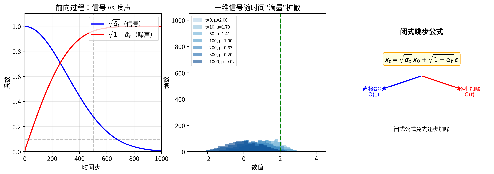

## 1.3 连续时间：1000步只是切片

1000 步只是一个工程选择。如果我们让时间步长 $\Delta t$ 趋近于零、步数趋近于无穷，离散公式就变成连续的**随机微分方程（SDE）**：

$$dX_t = f_t(X_t)\,dt + g_t\,dB_t$$

> 本文的核心使命是"从工程直觉出发"理解扩散模型。你可以把上面这个方程理解为——离散加噪公式的"无穷细分极限"，步长趋近0、步数趋近无穷时的连续版本。它的作用是把 DDPM 和 NCSN 的统一性释放出来。
>
> **诚实交代**：连续时间框架用到的三个数学工具——Anderson 定理（§3.2 反向 SDE）、Fokker-Planck 方程（§5.1 概率流 ODE）、Itô 引理（§1.4 方差推导）——属于随机分析，本文不推导它们的证明，而是当作"已知工具"使用并给出直觉解释。如果你没学过随机分析，**可以把它们当作黑箱接受**——关键是理解输入和输出，不需要理解内部证明。附录《数学预备》有相关概念的速查。

逐符号解释：

| 符号 | 含义 |
|------|------|
| $dX_t$ | 状态在无穷小时间 $dt$ 内的变化 |
| $f_t(X_t)$ | 漂移项：确定性地把信号推向某处 |
| $g_t$ | 扩散项：控制噪声注入的强度 |
| $dB_t$ | 布朗运动：标准随机噪声的"无穷小增量" |

这个 SDE 怎么对应到上面的离散公式？在对照之前，先给 $f$ 和 $g$ 赋予具体形式。前向加噪有两种自然选择，对应两种**调度**（schedule）——即噪声量随时间变化的规则：每一步该缩多少信号、加多少噪声。换一套 $f,g$，就是换一张时间表：

- **VP（Variance Preserving，方差守恒）**：$f = -\frac{1}{2}X$，$g = 1$。信号被拉向原点、噪声填补空位，总方差恒定为1。DDPM 用的就是这种。
- **VE（Variance Exploding，方差爆炸）**：$f = 0$，$g = 1$。信号不动、噪声持续注入，总方差随时间线性增长。NCSN 用的就是这种。

两者的区别只在 $f$（VE 没有漂移），$g$ 都是1。§1.4 会详细展开两种调度的来源和对比，这里先用 VP 做离散化对照。

我们从 VP SDE 出发，做一步离散化，然后和离散公式逐项对照。

**从 SDE 到差分**。VP 前向 SDE 是 $dX_t = -\frac{1}{2}X_t\,dt + dB_t$。连续方程没法直接在计算机上算——$dt$ 和 $dB_t$ 都是无穷小量。最简单的办法是把无穷小换成有限小量：$dt \to \Delta t$，$dB_t \to \sqrt{\Delta t}\,Z$（$Z \sim \mathcal{N}(0,I)$，因为 $\text{Var}(dB_t) = dt$，所以 $\text{Var}(\sqrt{\Delta t}\,Z) = \Delta t$，与之匹配）。这种"用有限差分近似连续方程"的做法叫 **Euler-Maruyama 离散化**——本质就是欧拉法（你在一阶 ODE 里学过的 $y_{n+1} = y_n + f(y_n)\,\Delta t$）的随机版本，多了一个噪声项。一步更新：

$$X_{t+\Delta t} = X_t + \left(-\frac{1}{2}X_t\right)\Delta t + \sqrt{\Delta t}\,Z = \left(1 - \frac{\Delta t}{2}\right)X_t + \sqrt{\Delta t}\,Z$$

**和离散公式逐项对照**。离散加噪公式是 $x_t = \sqrt{\alpha_t}\,x_{t-1} + \sqrt{1-\alpha_t}\,\varepsilon$。令 $\Delta t = 1 - \alpha_t$（即 $\alpha_t = 1 - \Delta t$），两个公式逐项对齐：

| 项 | Euler-Maruyama（连续侧） | 离散公式（离散侧） | 对应关系 |
|---|---|---|---|
| 信号系数 | $1 - \frac{\Delta t}{2}$ | $\sqrt{\alpha_t} = \sqrt{1 - \Delta t}$ | $\sqrt{1-\Delta t} \approx 1 - \frac{\Delta t}{2}$（泰勒一阶展开，误差 $O(\Delta t^2)$） |
| 噪声系数 | $\sqrt{\Delta t}$ | $\sqrt{1-\alpha_t} = \sqrt{\Delta t}$ | **精确相等**，无需近似 |
| 噪声分布 | $Z \sim \mathcal{N}(0,I)$ | $\varepsilon \sim \mathcal{N}(0,I)$ | 同分布 |

唯一的近似在信号系数：$\sqrt{1-\Delta t}$ 用泰勒展开 $\sqrt{1-x} = 1 - \frac{x}{2} - \frac{x^2}{8} - \cdots$ 的第一项代替。当 $\Delta t \to 0$（即 $\alpha_t \to 1$，每步只加一点点噪声），$\Delta t^2$ 项可以忽略，两个公式收敛到同一个极限。DDPM 实际用的 $\alpha_t \in [0.999, 0.98]$，$\Delta t \in [0.001, 0.02]$，一阶近似的误差在 $10^{-6} \sim 10^{-4}$ 量级。

**映射关系总结**：$\Delta t \leftrightarrow 1-\alpha_t$，漂移项 $-\frac{1}{2}X\,\Delta t \leftrightarrow (\sqrt{\alpha_t}-1)x_{t-1}$（信号收缩），扩散项 $\sqrt{\Delta t}\,Z \leftrightarrow \sqrt{1-\alpha_t}\,\varepsilon$（噪声注入）。

> **⚠️ 符号切换警告**：从本节起，$t$ 表示**连续时间** $t \in [0, T]$，与 §1.2 的**离散步索引** $t \in \{1, \ldots, 1000\}$ 是两个不同的对象。怎么区分？看符号出现在哪里：在 SDE、$dX_t$、$a_t$、$\sigma_t$ 里的是连续时间；在离散公式 $x_t$、$\bar{\alpha}_t$、$\beta_t$ 里的是离散步索引。第3章会把两套记号对接起来（§3.3 第4步"调度对齐"）。

> **严格性说明**：以上是**启发式对应**，不是严格证明。严格意义下的收敛需要随机分析中的收敛定理，条件包括漂移和扩散系数的平滑性等。本文只用这个对应做直觉说明，不追求严格性——我们真正用到的是离散公式和连续 SDE **两套语言可以互译**，具体推导时用离散版本做数值实现，用连续版本做概念统一。

连续时间下，给定初始值 $X_0 = x_0$，任意时刻 $t$ 的状态服从高斯分布：

$$X_t \mid X_0 \sim \mathcal{N}(a_t\, x_0,\; \sigma_t^2\, I)$$

其中 $a_t$ 是信号缩放系数，$\sigma_t$ 是噪声标准差。离散公式里的 $\sqrt{\bar{\alpha}_t}$ 和 $\sqrt{1-\bar{\alpha}_t}$ 就是连续公式里 $a_t$ 和 $\sigma_t$ 的离散采样。

**为什么已经有闭式跳步公式，还要再写一个分布式？** 两者不是重复，而是**同一件事的两种写法，各有用途**：

| 写法 | 形式 | 干什么用 |
|------|------|---------|
| 采样式（§1.2） | $x_t = a_t x_0 + \sigma_t \varepsilon$，$\varepsilon \sim \mathcal{N}(0, I)$ | 一个 $\varepsilon$ 给一个具体 $x_t$——**训练时生成加噪样本** |
| 分布式（本节） | $p(x_t \mid x_0) = \mathcal{N}(x_t;\, a_t x_0,\, \sigma_t^2 I)$ | 写出**概率密度**的解析表达——才能取对数、求梯度、算条件期望 |

采样式不能直接对 $x_t$ 求梯度——$x_t$ 是通过 $\varepsilon$ 参数化的一个具体实现，不是一条能求导的密度曲线。"参数化"指把 $x_t$ 写成"由随机源 $\varepsilon$ 加确定系数生成"的形式 $x_t = a_t x_0 + \sigma_t\varepsilon$，写出来的是一个采出来的点。但**第2章的分数 $\nabla \ln p_t$、Tweedie 恒等式、第4章的训练目标 $Z/\sigma_t$**——全部需要 $p(x_t \mid x_0)$ 的解析式。这就是分布式登场的原因：它是"用概率密度语言重写"闭式跳步公式，把"一个样本"升级为"一个能求导的密度函数"。两个式子共同覆盖了扩散模型的两大用途——**训练要采样，推理要梯度**。

把连续公式的 $a_t$、$\sigma_t$ 想象成离散公式 $\sqrt{\bar{\alpha}_t}$、$\sqrt{1-\bar{\alpha}_t}$ 的"连续版本"——离散公式只是连续曲线上的采样点。

**图2**：离散步是连续曲线上的采样点

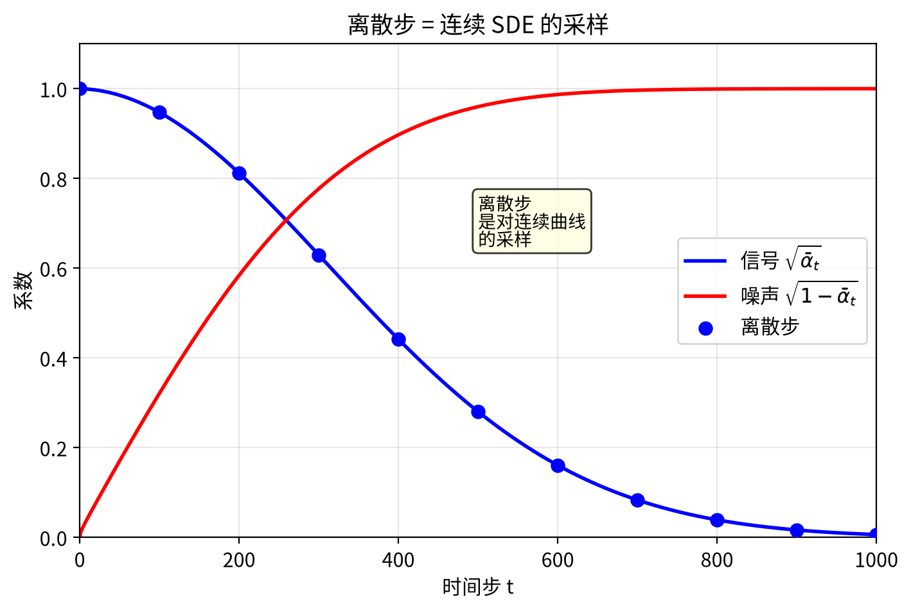

**为什么要在意连续时间？** 因为离散公式看起来像"两个独立的方法"（DDPM 用一种公式，NCSN 用另一种），但连续 SDE 揭示了它们的统一性——都是同一个方程的离散化。第3章会展开这个统一性。

## 1.4 两种调度：VE 与 VP

§1.3 已经给出了 VP 和 VE 的 SDE 形式。本节展开它们的完整对照——分布、信号衰减、噪声增长、以及 VP 的 $f=-\frac{1}{2}X$ 是怎么从"方差恒定"约束推导出来的：

| | VE（Variance Exploding） | VP（Variance Preserving） |
|---|---|---|
| 前向 SDE | $dX_t = dB_t$ | $dX_t = -\frac{1}{2}X_t\,dt + dB_t$ |
| $X_t \mid X_0$ | $\mathcal{N}(X_0,\; t\,I)$ | $\mathcal{N}(e^{-t/2}X_0,\; (1-e^{-t})I)$ |
| 信号 $a_t$ | $1$（不缩放） | $e^{-t/2}$（指数衰减） |
| 噪声 $\sigma_t$ | $\sqrt{t}$（线性增长） | $\sqrt{1-e^{-t}}$（趋近1） |
| 总方差 | $t$（爆炸式增长） | $1$（恒定） |
| 代表模型 | NCSN | DDPM |

> **VE 表格用的是简化形式**：这里 $\sigma_t = \sqrt{t}$ 是"教学玩具版"，方差随时间线性增长。**实际 NCSN 用的是几何级数** $\sigma_t \in [\sigma_{\min}, \sigma_{\max}]$（比如 $[0.01, 50]$，按对数均匀分布）——每一步方差是上一步的固定倍数，方差跨度大。为什么工业版更好？因为几何级数在**对数噪声尺度（log-$\sigma$）空间**里均匀分布——低噪声区（细节）和高噪声区（全局结构）都得到充分覆盖。线性调度会在高信噪比区过度采样、低信噪比区采样不足。本文推导用简化形式方便算，工业实现请按 NCSN 论文的几何级数配置。

**VE**：信号不动（$a_t = 1$），但噪声方差无限增长（$\sigma_t = \sqrt{t} \to \infty$）。想象你在安静房间里说话（信号），旁边有人把白噪声的音量越拧越大。你的声音从头到尾没变（$a_t=1$），但噪声越来越响（$\sigma_t=\sqrt{t}\to\infty$），最终你的声音完全被淹没——这就是"方差爆炸"的字面含义：噪声音量趋向无穷。总方差 $= t \to \infty$，所以叫"方差爆炸"。

**VP**：信号被弹性拉回原点（$a_t = e^{-t/2} \to 0$），噪声填补腾出的空间（$\sigma_t = \sqrt{1-e^{-t}} \to 1$），总方差恒定为1。想象一根弹簧拴着一个小球（信号），球在固定大小的盒子里（盒子大小=方差恒定为1）。弹簧把球拉向中心（漂移项 $-\frac{1}{2}X$，OU 过程的弹性回位），同时有人不停摇晃盒子（噪声注入）。球越靠近中心，信号越弱；但盒子大小不变，摇晃的强度刚好补上球被拉回留下的空位。这里漂移项 $-\frac{1}{2}X$ 像弹簧把信号拉回原点——这是 OU 过程（Ornstein-Uhlenbeck）的本质，不只是"稀释"，而是弹性回位 + 噪声注入的平衡。

<b>VP 的 SDE 不是凭空选的——从"方差恒定"反推（4 步推导，每步只做一件事）</b>

表格里 $dX = -\frac{1}{2}X\,dt + dB$ 不是凭空选的——它是从"方差恒定"这个约束**反推**出来的。而表格里的分布 $\mathcal{N}(e^{-t/2}X_0, (1-e^{-t})I)$ 是从这个 SDE **算出来**的。

**这个推导在做什么？** 给定两个设计目标——"信号随时间衰减"和"总方差保持恒定"——反推出 SDE 的两个参数 $\lambda$（漂移系数）和 $g$（扩散系数）。然后用 SDE 算出任意时刻 $t$ 的分布，验证它确实是 $\mathcal{N}(a_t X_0, \sigma_t^2 I)$ 的形式。两部分推导共用同一条方差方程，放在一起讲。

**一、SDE 怎么来的：从"方差恒定"约束反推 $f$ 和 $g$**

目标：找一个 SDE $dX = \lambda X\,dt + g\,dB$（线性漂移），使得任意时刻 $t$ 的总方差 $\text{Var}(X_t) = 1$（恒定），且初始信号 $X_0$ 被逐渐"冲刷"掉。

**第1步：方差恒定约束定 $g$**。对线性 SDE $dX = \lambda X\,dt + g\,dB$，方差 $v(t) = \text{Var}(X_t)$ 满足一条 ODE：

$$\frac{dv}{dt} = 2\lambda v + g^2$$

这条方程怎么来的？直观理解：漂移项 $\lambda X$ 每秒把方差改变 $2\lambda v$（信号衰减则方差也跟着缩），扩散项 $g\,dB$ 每秒注入 $g^2$ 的方差（噪声不停往里加）。推导用 Itô 引理展开 $X_t^2$，放在本折叠块下半部分。

方差恒定意味着 $\frac{dv}{dt} = 0$。初始时刻 $v(0) = \text{Var}(X_0) = 1$（数据已归一化到单位方差，§1.2），代入：$0 = 2\lambda \cdot 1 + g^2$，即 $g^2 = -2\lambda$。

**第2步：信号衰减约束定 $\lambda$**。我们希望信号 $a_t = e^{\lambda t}$ 随时间衰减到零（$\lambda < 0$）。但 $\lambda$ 可以是任何负数——为什么选 $\lambda = -\frac{1}{2}$？因为我们要让 $g = 1$（标准布朗运动，扩散系数为1是最简单的选择）。代入第1步的约束：$g^2 = -2\lambda = 1 \Rightarrow \lambda = -\frac{1}{2}$。

所以 VP SDE 的两个参数是**互相锁定**的：选 $g = 1$（标准布朗运动），方差恒定就**强制** $\lambda = -\frac{1}{2}$。反过来选 $\lambda = -\frac{1}{2}$，方差恒定就**强制** $g = 1$。这不是两个独立的选择，而是"方差恒定 + 标准布朗运动"这对约束的唯一解。如果想要 $g \neq 1$，漂移必须相应调整：$\lambda = -g^2/2$，SDE 变成 $dX = -\frac{g^2}{2}X\,dt + g\,dB$——这正是更一般的 VP-SDE 形式，$g=1$ 是最常用的特例。^[3]^

**VE 为什么没有漂移？** VE 的目标是"信号不动，方差爆炸"——$\lambda = 0$（不缩放信号），$g = 1$（标准布朗运动注入噪声）。方差方程变成 $\frac{dv}{dt} = 0 + 1 = 1$，解出 $v(t) = t$。没有"方差恒定"约束，所以不需要漂移项来抵消扩散。

 * * * 

**二、分布怎么算的：均值和方差各有一条 ODE**

有了 SDE，怎么算出 $X_t$ 的分布？关键是均值 $\mu(t) = \mathbb{E}[X_t]$ 和方差 $v(t) = \text{Var}(X_t)$ 各自满足一条 ODE——因为 SDE 是线性的，均值和方差互不影响，可以分开算。

**均值**：$\mu(t) = \mathbb{E}[X_t]$ 满足 $\frac{d\mu}{dt} = -\frac{1}{2}\mu$（漂移的期望，随机项期望为0）。解出 $\mu(t) = e^{-t/2}\mu_0 = e^{-t/2}X_0$——这就是 $a_t = e^{-t/2}$ 的来源。

**方差**：$v(t) = \text{Var}(X_t)$ 满足 $\frac{dv}{dt} = -v + 1$（即第1步的方差方程代入 $\lambda = -1/2, g = 1$）。这条方程怎么来的？分三步：

**方差第1步：用 Itô 引理展开 $X_t^2$**。$d(X^2) = 2X\,dX + \underbrace{(dX)^2}_{\text{二次变差}}$。

> **为什么 $(dX)^2$ 不等于零？** 普通微积分里 $(dx)^2 = 0$（无穷小的平方可忽略）。但布朗运动 $dB$ 的方差是 $dt$——它"抖动的幅度"是 $\sqrt{dt}$ 量级，所以 $(dB)^2 \approx dt$ **不可忽略**。这是 Itô 微积分和普通微积分的唯一区别：多了一个"二次变差项" $(dX)^2$。把它当作布朗运动的固有性质接受即可。

**方差第2步：代入 SDE 并取期望**。代入 $dX = -\frac{1}{2}X\,dt + dB$：

$$d(X^2) = 2X\left(-\frac{1}{2}X\,dt + dB\right) + dt = (-X^2 + 1)\,dt + 2X\,dB$$

取期望（$\mathbb{E}[X\,dB]=0$，因为 $dB$ 是零均值独立增量）：$\frac{d}{dt}\mathbb{E}[X^2] = -\mathbb{E}[X^2] + 1$。

**方差第3步：从 $\mathbb{E}[X^2]$ 到 $\text{Var}(X)$**。方差 $v = \mathbb{E}[X^2] - \mu^2$，前面已解出 $\mu^2 = e^{-t}\mu_0^2$ 满足 $\frac{d\mu^2}{dt} = -\mu^2$。两式相减：

$$\frac{dv}{dt} = \frac{d\mathbb{E}[X^2]}{dt} - \frac{d\mu^2}{dt} = (-\mathbb{E}[X^2]+1) - (-\mu^2) = -(E[X^2]-\mu^2) + 1 = -v + 1$$

解出 $v(t) = 1 - e^{-t}$——这就是 $\sigma_t^2$ 的来源。

**VE 更简单**：$dX = dB$ 没有漂移，$\mu(t) = X_0$（不动），$dv/dt = 1$（纯注入）解出 $v(t) = t$。这就是"方差爆炸"的字面来源。

只要接受"$(dB)^2 \approx dt$"这一条布朗运动性质，均值和方差各有一条 ODE，两种调度的分布公式都可以在纸上算出来。

**结论：VP 和 VE 是两种"加噪声策略"，区别在于怎么处理信号。** VP 让信号一边衰减一边注入噪声，总方差锁在 1（信号缩到 0 的同时噪声填满），像"淡入淡出"；VE 让信号原地不动、只往里灌噪声，总方差趋向无穷，像"越搅越浑"。选哪个调度不影响框架（前向 SDE + 反向 SDE + 分数匹配都通用），只影响生成轨迹的特性——VP 的轨迹有"拉回"效应（漂移项把信号往原点拉），VE 的轨迹纯靠分数指路。DDPM 用 VP，NCSN 用 VE。

**图3**：VE 与 VP 的视觉对比——双峰数据分布在不同时刻的演化

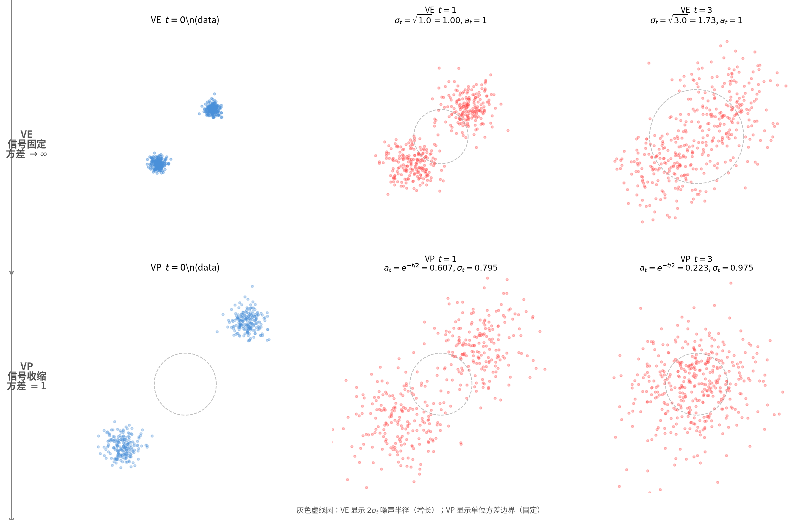

上排 VE：信号不缩放（$a_t=1$），噪声半径（灰色虚线圆）随 $t$ 从 0 膨胀到 $\sqrt{3}\approx 1.73$，双峰被越摊越散，总方差趋向无穷。下排 VP：信号指数衰减（$a_t$ 从 1 降到 0.22），双峰被拉向原点，噪声补位到固定单位方差（灰色虚线圆始终是半径1），$t=3$ 时分布已接近标准高斯圆。

DDPM 用的就是 VP 调度的离散化（$\sqrt{\bar{\alpha}_t}$ 就是 $e^{-t/2}$ 的离散版）。NCSN 用的是 VE 调度。它们是同一个 SDE 框架的两种调度。第3章会证明它们的反向过程也来自同一个反向 SDE 的两种离散化。

**图4**：噪声调度示例——线性/余弦/sigmoid 三种常用调度的 $\bar{\alpha}_t$ 曲线（左）；生成范式对比 VAE/GAN/扩散（中）；图像修复原理：掩码区域加噪待生成、非掩码区域保留（右）。

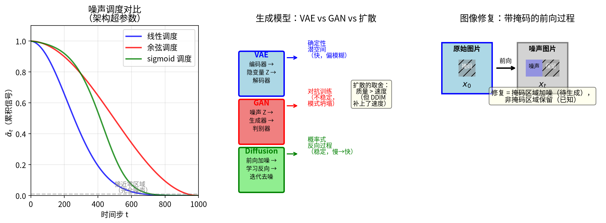

## 1.5 高斯噪声：先讲可处理，再讲最大熵

为什么加的是高斯噪声，不是均匀噪声或拉普拉斯噪声？两个理由，一主一辅。

**首要理由：数学可处理性**。高斯分布有一个特殊性质——加高斯噪声后，任意时刻 $t$ 的条件分布 $p(x_t \mid x_0)$ 仍然是高斯的（均值和方差已知）。这使得三件事一起成立：

- 闭式跳步公式（§1.2）：任意 $t$ 一步到位，训练效率的地基
- Tweedie 恒等式（§2.3）：分数 = 去噪方向，训练目标从"学分数"降级为"学预测噪声"
- 反向 SDE 的解析可处理性（§3.2）：Anderson 定理里的分数项能算得下去

换一种噪声（均匀、拉普拉斯……），$p(x_t \mid x_0)$ 立刻失去解析表达，上面三件事同时崩溃。高斯不是"美观选择"，是**整个框架能算得下去的地基**。

**辅助理由：最大熵原理**。给定均值0和方差 $\sigma^2$，使熵最大的连续分布就是高斯分布——它是"最不做额外假设"的噪声。用它做破坏，保证终点（纯噪声）的状态最简单、最可预测（标准高斯），逆转的起点最干净。这条理由从信息论角度补充"为什么必须是高斯"，但如果没有可处理性打底，最大熵本身不足以让扩散模型跑起来。

**图5**：为什么必须是高斯——加高斯噪声条件分布永远是高斯（可闭式跳步）；换非高斯则解析性崩溃

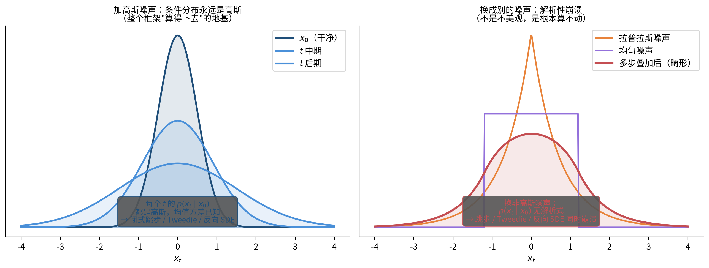

## 1.6 数字演示

**1D 示例**：取 $x_0 = 2.0$，DDPM 的 VP 调度，$t = 340$（1000步中），$\bar{\alpha}_{340} \approx 0.3$（DDPM 典型线性 $\beta$ 调度下，$\bar{\alpha}$ 随 $t$ 单调递减，$t=340$ 处约 0.3）。

$$x_{340} = \sqrt{0.3} \times 2.0 + \sqrt{0.7} \times \varepsilon = 1.095 + 0.837\varepsilon$$

如果 $\varepsilon = 0.5$（某次采样），则 $x_{340} = 1.095 + 0.418 = 1.513$。

你可以验证：信号部分 $1.095$ 是 $x_0$ 缩小了 45%，噪声部分 $0.837 \times 0.5 = 0.418$ 是随机扰动。信号在缩小，噪声在变大。

**2D 示例**：取双峰分布 $\mu_1=[2,2],\; \mu_2=[-2,-2],\; \sigma=0.5$，在不同时刻加 VP 噪声：

| 时刻 $t$ | $a_t$ | $\sigma_t$ | 分布形状 |
|-----------|-------|------------|----------|
| 0 | 1.0 | 0.0 | 两个清晰的峰 |
| 1.0 | 0.61 | 0.79 | 两峰变宽，开始靠拢 |
| 5.0 | 0.08 | 0.996 | 几乎一个圆（标准高斯） |

在 $t=0$ 时两个峰清晰可分；$t=1.0$ 时两个峰开始融合；$t=5.0$ 时完全变成一个圆——信息被彻底销毁。这就是"破坏"的终点：一个标准高斯分布，跟原始数据毫无关系。

**图6**：2D 双峰分布的前向加噪过程

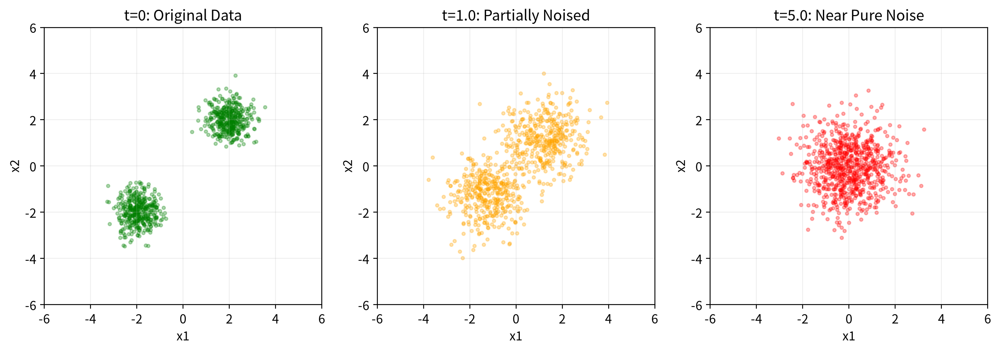

## 1.7 AI落地

| 场景 | 没有这个工具会怎样 |
|------|-------------------|
| 数据增强 | 无法通过加噪生成"变体"数据扩充训练集 |
| 图像超分 | 无法将低分辨率图像建模为"加噪后的高分辨率" |
| 生成模型 | 没有前向过程就无从定义反向过程 |

## 1.8 常见误解

**误解1**："加噪声就是把图片变模糊。"
两者是完全不同的操作。模糊来自卷积（周围像素平均），加噪声则是叠加独立随机数。模糊是**确定性**的退化（同一张图模糊出来一样的结果），加噪声是**随机**的退化（同一张图加噪出来不同的结果）。在**完美分数**的连续极限下，扩散过程理论上可逆（反向 SDE 精确恢复，§3.2）；但实践中分数是学出来的、离散化有误差，所以信息实质上被销毁了——$t \to \infty$ 时 $a_t \to 0$，原始信号彻底被噪声淹没。

**误解2**："1000步是必须的。"
1000 步只是工程选择。连续时间下步数可以任意设定，50 步也能用，只是精度略低（第5章详述）。

**误解3**："VE 和 VP 是两个不同的模型。"
它们是同一个 SDE 框架的两种调度。第3章会证明它们的反向过程也来自同一个反向 SDE 的两种离散化。

## 1.9 本章回顾

**本章自检**：

**1.** VE 和 VP 的前向 SDE 分别是什么？它们的总方差随时间怎么变化？

**2.** 闭式跳步公式为什么重要？两个系数的平方和为什么等于1？

**3.** 如果前向加噪不用高斯噪声，改用均匀分布或拉普拉斯噪声，Tweedie 恒等式还能成立吗？闭式跳步公式还能一步到位吗？训练目标会发生什么变化？

**反事实思考**：如果每一步加的都是高斯噪声，但**不同步之间相关**（比如 $\varepsilon_t$ 与 $\varepsilon_{t-1}$ 有 0.5 的相关系数——所谓"有色噪声"），本章的核心公式还成立吗？答案是**闭式跳步失败**。原来 $x_t = \sqrt{\bar{\alpha}_t}x_0 + \sqrt{1-\bar{\alpha}_t}\varepsilon$ 里的 $\varepsilon$ 是**单个**标准高斯——推导依赖 $\varepsilon_1, \ldots, \varepsilon_t$ **独立**求和（独立高斯和还是高斯，方差直接相加）。一旦相关，$\varepsilon_1 + \cdots + \varepsilon_t$ 虽仍是高斯（线性组合保高斯性），但方差不再等于 $\sum \text{Var}(\varepsilon_i)$，而是要加上所有协方差项——**每个中间时刻的分布依赖前面所有步的相关结构**，闭式表达失效。前向加噪从"一步到位"退化为"必须逐步模拟"，训练效率崩塌（每次采样 $x_t$ 要跑 $t$ 步而非 1 步）。**这个反事实揭示的不是"高斯的必要性"（§1.5 已论证），而是"独立同分布的必要性"**：闭式跳步依赖的是**独立**这个假设，比"高斯"更基础。工程界确实有人尝试改动前向噪声的相关结构——比如在图像空间维度里用 **blue noise**（像素之间空间上负相关，抑制低频结块）——但这类改动都在**同一时刻的空间维度内**做手脚，而不敢碰**时间维度上的步间相关**：一旦步间相关，闭式跳步就直接失效，训练必须回到"逐步模拟前向 1000 步"这条路，速度直接崩掉一到两个数量级。这条路至今没走通，就是被闭式跳步的失败挡住了。

想生成图片 → 创造难但破坏易 → 记录"加噪声"的每一步\
→ 离散公式 $x_t = \sqrt{\bar{\alpha}_t}\,x_0 + \sqrt{1-\bar{\alpha}_t}\,\varepsilon$（平方和=1，方差不变）\
→ 闭式跳步公式：任意 $t$ 一步到位（训练效率）\
→ 连续极限：SDE $dX = f\,dt + g\,dB$（离散只是连续的采样）\
→ 两种调度 VE / VP（DDPM 用 VP，NCSN 用 VE）\
→ 高斯噪声 = 可处理性（闭式跳步 + Tweedie + 解析反向）+ 最大熵（辅助）\
→ 终点：纯高斯噪声（信息销毁）

**未解问题**：本章记录清楚了**如何破坏**——把图片变成纯噪声这一路是通的。但从终点开始**如何逆转**却毫无头绪：面对一张纯噪声，怎么知道原始图片是猫还是狗？我们需要在噪声空间的每一点上，都能算出"往哪个方向走能靠近真实数据"。这个"方向"必须**可计算**——不是抽象概念，而是能落地成公式的量。第2章会给出这个"方向"的精确数学定义：**分数函数** $\nabla \ln p_t(x)$。它是逆转加噪过程所需的**唯一未知量**——只要知道它，反向过程就完全确定。

 * * * 

# 第2章：分数函数——逆转需要的方向

> 分数函数 $\nabla \ln p_t(x)$ 是概率密度增长最快的方向，也是逆转加噪过程所需的唯一信息。Tweedie 恒等式表明：分数 = 去噪方向，预测噪声和预测分数是同一件事。

> **本章路线**：先建立"方向"直觉与分数定义（数据流形），再看 Tweedie 恒等式、$arepsilon$ 与 $s$ 等价、多尺度分数场，最后区分两种梯度、看数字演示并收束。

> **核心推导**：
> 1. 分数 = 对数概率密度的梯度 = 去噪方向。
> 2. Tweedie 恒等式把“学分数”变成“学去噪”。

> **动笔前自检**：①梯度方向代表什么？②为什么对数概率比概率本身更适合作方向？

**回望**：第1章完成了"破坏"这一半——加噪过程记录清楚了，SDE 形式的连续版本也建好了。可"逆转"从哪里下手完全没头绪：给你一张纯噪声，怎么知道原始图片是哪张？直觉上必须要有**某种指向数据的信号**，能在噪声空间的每一点告诉你"往哪走能靠近真实数据"。这一章要**造出这个信号**——它就是分数函数 $\nabla \ln p_t(x)$。造好之后你会看到两件事：(1) 分数是逆转所需的**唯一未知量**——只要知道分数，反向过程就完全确定；(2) 尽管 $p_t(x)$ 本身写不出解析式，Tweedie 恒等式却让我们能**绕过它直接学分数**——这为第4章的训练算法铺好路。

## 2.0 数据流形：为什么"方向"就够了

给你一张高分辨率图片——$1024 \times 1024 \times 3 \approx 300$ 万个像素值。随机填充这 300 万个值得到的图片几乎全是垃圾：彩色雪花、块状压缩伪影、模糊图块……这些都不是"真实图片"。真实图片只占这个巨大像素空间的一小部分——它们隐藏在一个**远比 300 万维更低维的流形里**。这就是**数据流形假设**：看似高维的数据，实际只浸染在低维的"面"或"线"上。

**这个假设对扩散模型意味着什么？**

**意味 1：方向比目标更容易学习。** 网络不需要记住 300 万维空间的每一个点，只需要在流形附近学会"指向数据区的方向"。换句话说，分数函数（本章主角）只需要在流形周围有效——远离流形的地方，分数往哪指都无所谓，因为那里本就没有数据。

**意味 2：去噪和分数是同一件事。** 当你站在流形外的某个噪声点，“最佳去噪”就是“指向流形上最近点的方向”——而这正是分数的方向。后面的 Tweedie 恒等式会精确证明这一点（§2.3）。

**意味 3：前向噪声波动可以帮助发现流形。** 前向加噪过程把数据从流形上扔到全空间。反向过程要从随机点走回流形——分数就是引路的"箭头"（也是图7 的含义）。没有分数，反向就是无头苍蝇的布朗运动（§2.10 反事实思考）。

> **最小示例**：§1.6 的 2D 双峰展示了简单版本——数据只占据平面两个小圆区，其余区域是空的。扩散模型等价于把这两个小圆区扩充到全平面，再学会从任意点往回走的方向。高维版本的逻辑一模一样——只是从“小圆”变成了“曲面”。

**图7**：数据流形假设——真实数据只浸在高维空间的低维流形上；分数只需在流形附近有效，指回流形

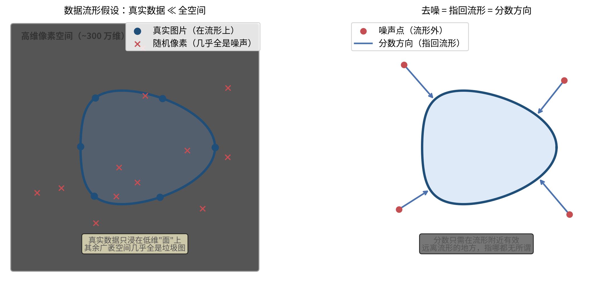

## 2.1 分数的直觉

反向去噪需要知道一件事：**在噪声空间的当前点上，往哪个方向走，数据分布的概率密度会增加？** 概率密度增长最快的方向，就是逆转加噪过程所需的方向。

这个方向怎么算？对概率密度取对数再求梯度，得到的就是"往哪个方向概率增长最快"——这就是**分数函数** $s_t(x) = \nabla_x \ln p_t(x)$。

**为什么是 $\ln p$ 而不是 $p$？** 取对数让分数对概率密度的绝对大小不敏感，只对"相对变化"敏感。在概率密度极低的区域（数据稀疏区），$\nabla p$ 可能接近零（因为 $p$ 本身接近零），但 $\nabla \ln p$ 仍然能给出有意义的方向。另外，$\nabla \ln p = \nabla p / p$ 自动消掉了归一化常数（附录 A.3），让分数只关心"密度的相对变化"而非"密度的绝对大小"——这对处理未知数据分布至关重要。

**图8**：分数函数 $\nabla \ln p_t(x)$ 的等高线与向量场，展示"概率增长最快的方向"如何在数据密集区附近指向密集区。

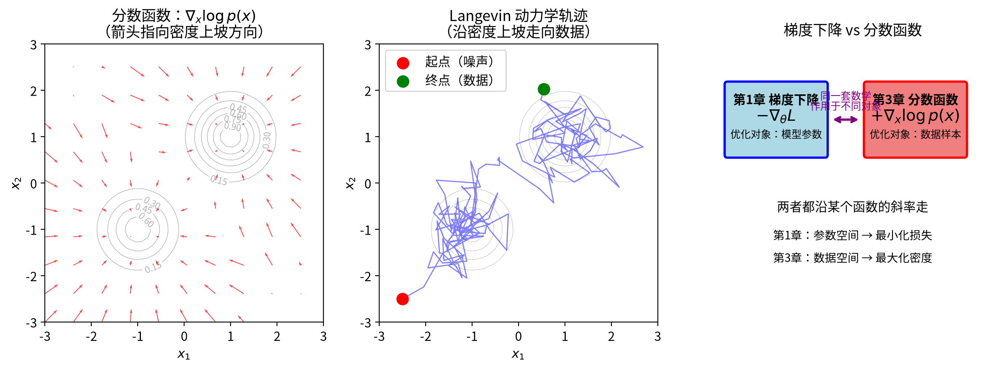

下一节给出严格的数学定义。

## 2.2 分数定义

在时刻 $t$，加噪后的数据服从分布 $p_t(x)$。**分数函数**（score function）定义为：

$$s_t(x) = \nabla_x \ln p_t(x)$$

本章为简洁用语，也称它为"分数"（score）。这个词在中文有歧义（考试分数、评分），后文遇到时请始终按"$\nabla \ln p$"这个数学对象理解——它是**概率密度的对数梯度**，跟成绩单里的分数没有任何关系。英文文献里 score function 是标准术语，"得分函数"是可以接受的替代译法但本文不采用，以保持术语一致。

为什么 $\nabla_x \ln p_t(x)$ 指向概率密度增长最快的方向？因为 $\nabla \ln p = \nabla p / p$，而概率密度 $p > 0$，所以 $\nabla \ln p$ 和 $\nabla p$ 方向相同——都是密度增长最快的方向。差别只在长度：$\nabla \ln p$ 多除了一个 $p$，让它在稀疏区（$p$ 小）也不至于趋零（§2.1 已解释）。所以站在 $x$ 处沿 $s_t(x)$ 走，概率密度会持续增加——你正在走向数据密集区。

**为什么需要分数？** 因为反向过程（去噪）需要知道"往哪走才能从噪声回到数据"。分数就是那个方向。

## 2.3 Tweedie 恒等式：分数 = 去噪方向

直接计算 $\nabla \ln p_t(x)$ 需要知道 $p_t(x)$ 的解析形式，而我们不知道（数据分布太复杂）。但有一个恒等式，把分数和"去噪"联系起来：

$$s_t^*(x) = \frac{1}{\sigma_t^2}\,\mathbb{E}\!\left[a_t X_0 - X_t \mid X_t = x\right]$$

**这个公式在说什么？** 右边的 $\mathbb{E}[a_t X_0 \mid X_t = x]$ 是"给定噪声观测 $x$，对原始信号 $a_t X_0$ 的后验期望"——也就是**最可能的去噪结果**。整个公式读作：**分数方向 =（去噪估计 $-$ 当前噪声点）/ 噪声方差**。分子是从当前噪声点指向去噪估计的向量，除以 $\sigma_t^2$ 做缩放。这就是"分数 = 去噪方向"的精确含义——知道怎么去噪，就知道分数；反过来也对。

> **图像内容说明（图9）**：展示三个要素——(1) 红色圆点是噪声观测 $x_t$；(2) 绿色圆点是去噪估计 $\mathbb{E}[a_t X_0 \mid X_t = x_t]$（后验均值，通常在数据流形附近）；(3) 蓝色箭头从 $x_t$ 指向去噪估计，是去噪方向；红色箭头是分数方向 $s_t^*(x_t)$，与去噪方向同向但长度按 $1/\sigma_t^2$ 缩放。两个箭头揭示"分数 = 去噪方向 / $\sigma_t^2$"。

**图9**：Tweedie 恒等式的几何可视化

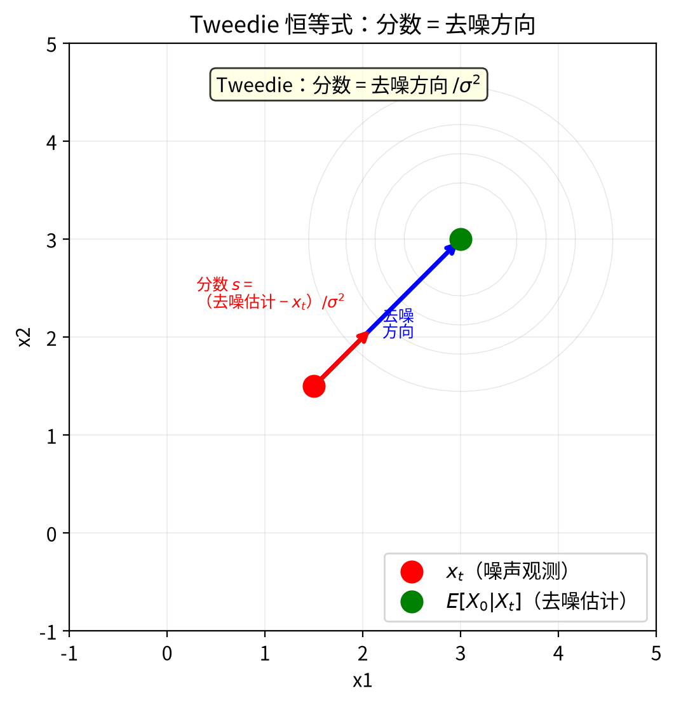

下面推导这个公式。思路分两步：先建立一个工具（真实分数 = 条件分数的后验期望），再把高斯条件分布代入算出具体形式。

**工具：真实分数等于条件分数的后验期望。** 真实分数 $\nabla \ln p_t(x_t)$ 依赖边缘分布 $p_t(x_t) = \int p(x_t \mid x_0)\, p(x_0)\, dx_0$，后者写不出解析式（$p(x_0)$ 是未知的数据分布）。但每个**条件分数** $\nabla_{x_t} \ln p(x_t \mid x_0)$ 是好算的——因为 $p(x_t \mid x_0) = \mathcal{N}(a_t x_0, \sigma_t^2 I)$ 是前向加噪过程，形式是我们自己设计的（§1.2），高斯分布的对数密度梯度是线性的（附录 A.1 性质 3），可以直接写出 $\frac{a_t x_0 - x_t}{\sigma_t^2}$。两者之间的关系是：

$$\nabla \ln p_t(x_t) = \mathbb{E}_{x_0 \mid x_t}[\nabla_{x_t} \ln p(x_t \mid x_0)]$$

**直觉**：$p_t$ 是无数个高斯核 $p(x_t \mid x_0)$ 按 $p(x_0)$ 加权的混合分布。混合分布的"密度增长最快方向"，等于各分量方向按"给定 $x_t$ 时 $x_0$ 的后验概率"加权平均——哪个 $x_0$ 越可能是来源，它的方向权重越大。这把不可计算的对象（真实分数）换成可计算的对象（条件分数的后验期望）——正是第 4 章训练目标能成立的数学根据。

<b>证明（四步，每步只做一件事）</b>

出发点：$p_t(x_t) = \int p(x_t \mid x_0)\, p(x_0)\, dx_0$（边缘化的定义）。

**第 1 步：两边对 $x_t$ 求梯度**（把梯度挪进积分，正则条件见下方脚注）：
$$\nabla_{x_t} p_t(x_t) = \int \nabla_{x_t} p(x_t \mid x_0)\, p(x_0)\, dx_0$$

**第 2 步：把被积函数写成"$\ln$ 梯度 $\times$ 密度"**（对数导数恒等式 $\nabla p = p \cdot \nabla \ln p$）：
$$= \int \nabla_{x_t} \ln p(x_t \mid x_0) \cdot p(x_t \mid x_0)\, p(x_0)\, dx_0$$

**第 3 步：两边除以 $p_t(x_t)$**，注意 $p(x_t \mid x_0) p(x_0) / p_t(x_t) = p(x_0 \mid x_t)$。这一步用的是**贝叶斯公式** $p(x_0 \mid x_t) = \frac{p(x_t \mid x_0)\,p(x_0)}{p_t(x_t)}$——把"给定 $x_0$ 时 $x_t$ 的条件密度"翻转为"给定 $x_t$ 时 $x_0$ 的后验密度"。这是概率论最基础的等式，不是随机分析的产物。
$$\frac{\nabla_{x_t} p_t(x_t)}{p_t(x_t)} = \int \nabla_{x_t} \ln p(x_t \mid x_0) \cdot p(x_0 \mid x_t)\, dx_0$$

**第 4 步**：左边正是 $\nabla_{x_t} \ln p_t(x_t)$（对数导数恒等式反向用），右边是后验期望：
$$\nabla_{x_t} \ln p_t(x_t) = \mathbb{E}_{x_0 \mid x_t}[\nabla_{x_t} \ln p(x_t \mid x_0)] \quad \blacksquare$$

> **正则条件脚注**：第 1 步的"梯度与积分交换"（把 $\nabla_{x_t}$ 挪进 $\mathbb{E}_{x_0}$ 里）在微积分里有一个前提条件：被积函数 $p(x_t \mid x_0)$ 对 $x_t$ 处处可微，且梯度不能"跑得太快"（不能有无穷大的尖峰）。高斯核 $\mathcal{N}(a_t x_0, \sigma_t^2 I)$ 的梯度是线性的、有界的，自动满足这个条件。实际应用中只要数据是有限方差的图片、文本、音频，Tweedie 恒等式就成立——工程上不用操心这些条件。

**代入高斯条件分布。** 加噪是高斯的，$p(x_t \mid x_0) = \mathcal{N}(a_t x_0, \sigma_t^2 I)$。高斯的对数密度梯度是线性的（附录 A.1 性质 3）：$\nabla_{x_t} \ln p(x_t \mid x_0) = \frac{a_t x_0 - x_t}{\sigma_t^2}$。代入工具：

$$s_t^*(x_t) = \mathbb{E}_{x_0 \mid x_t}\!\left[\frac{a_t x_0 - x_t}{\sigma_t^2}\right]$$

$x_t$ 不依赖 $x_0$，可以提出期望：

$$s_t^*(x_t) = \frac{\mathbb{E}[a_t X_0 \mid X_t = x_t] - x_t}{\sigma_t^2}$$

这就是开头的公式。

回头再看这条恒等式，它就是“后验估计”这种语言写下的分数。同一个加噪过程，不同学科有不同的名字：物理学家用重正化群研究它，统计学家叫扩散过程，数学家用后验估计——说的是同一件事，只是语言不同；本篇统一用扩散视角。

## 2.4 $\varepsilon$ 与 $s$ 的等价

DDPM 的网络预测噪声 $\varepsilon_\theta$，NCSN 的网络预测分数 $s_\theta$。它们是同一件事：

$$\boxed{\varepsilon_\theta = -\sigma_t \cdot s_\theta \quad \Leftrightarrow \quad s_\theta = -\frac{\varepsilon_\theta}{\sigma_t}} \tag{§2.4}$$

推导：$x_t = a_t x_0 + \sigma_t \varepsilon$，所以 $\varepsilon = \frac{x_t - a_t x_0}{\sigma_t}$。而 Tweedie 给出 $s = \frac{a_t x_0 - x_t}{\sigma_t^2} = -\frac{\varepsilon}{\sigma_t}$。

**预测噪声和预测分数携带完全相同的信息**，只是方向相反（$\varepsilon$ 指向"噪声加进来的方向"，$s$ 指向"去噪方向"）、幅度差一个 $\sigma_t$ 因子。

这个等价为什么重要？因为它说明 DDPM 和 NCSN 不是两个不同的方法，而是同一个方法的两种参数化——网络输出层换一个缩放因子就能互换。第3章会进一步证明它们的采样公式也是同一个反向 SDE 的离散化。

**图10**：噪声预测与分数估计的等价关系

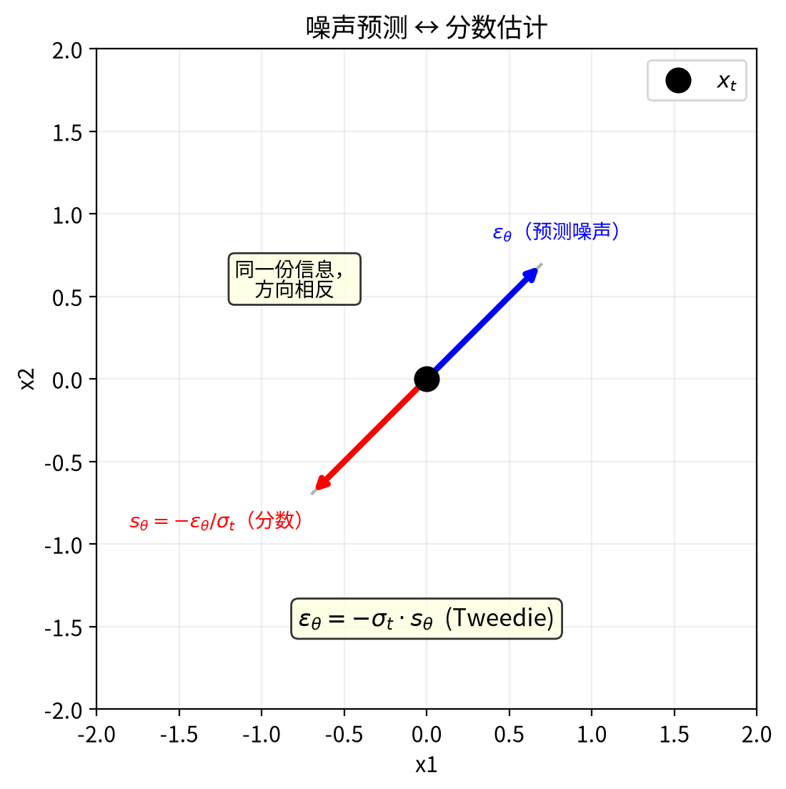

## 2.5 多尺度分数场

分数最核心的洞察：**不同噪声水平下，分数指向不同的东西**。

- 高噪声（$\sigma$ 大）：数据几乎被噪声淹没，分数指向整体重心——"粗略方向"
- 低噪声（$\sigma$ 小）：数据细节清晰，分数指向最近的数据峰——"精细结构"

这就像地图的缩放：缩远看只能看到"大致方位"，缩近看才能看到"具体路线"。扩散模型在多个噪声水平上训练，就是学多张不同缩放级别的"地图"。

**图11**：不同噪声水平下的分数向量场

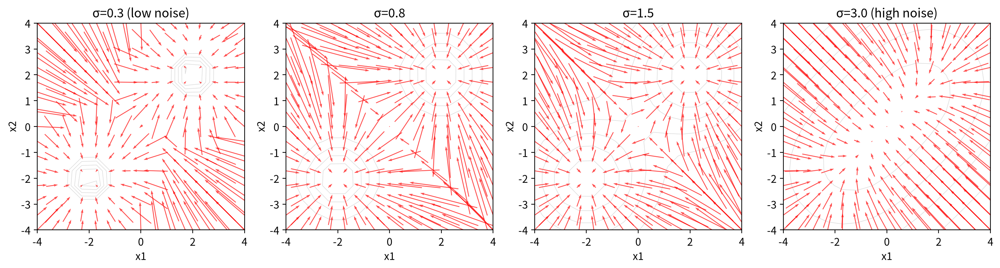

在 $\sigma = 0.3$（低噪声）时，箭头清晰地指向最近的数据峰——上半区指向 $(2,2)$，下半区指向 $(-2,-2)$，中间有一条清晰的分界线。在 $\sigma = 3.0$（高噪声）时，两个峰融合成一个，所有箭头指向中心——只知道"大致方向"，不知道具体走哪个峰。

## 2.6 两种梯度：$\nabla_\theta L$ vs $\nabla_x \ln p$

容易混淆的两个梯度：

| | $\nabla_\theta \mathcal{L}$ | $\nabla_x \ln p_t(x)$ |
|---|---|---|
| 作用对象 | 网络参数 $\theta$（几亿维） | 数据点 $x$（与图片同维度） |
| 含义 | "怎么调参数让loss下降" | "在数据空间往哪走概率增" |
| 用在哪 | 训练（第4章） | 采样（第3章） |
| 计算方式 | 反向传播 | 网络直接输出（学到的分数） |

训练时用 $\nabla_\theta \mathcal{L}$ 调参数；采样时用 $\nabla_x \ln p_t(x) = s_\theta(x, t)$ 指方向。一个是"学"，一个是"用"。

## 2.7 数字演示

**混合高斯的分数计算**：取 $p(x) = 0.5\,\mathcal{N}(2, 0.25) + 0.5\,\mathcal{N}(-2, 0.25)$（**记号约定**：$\mathcal{N}(\mu, \sigma^2)$ 里第二参数为**方差**，本例 $\sigma^2 = 0.25$、$\sigma = 0.5$），手算 $\nabla \ln p(x)$。

在 $x = 0$（两峰之间）：$p(x) = 0.5\,\mathcal{N}(2, 0.25) + 0.5\,\mathcal{N}(-2, 0.25)$ 关于 $x=0$ 对称（$p(x) = p(-x)$，偶函数），所以导数 $p'(x)$ 是奇函数，代入 $x=0$ 得 $p'(0) = 0$，因此 $\nabla \ln p(0) = p'(0)/p(0) = 0$——"不知道往哪走"。

在 $x = 1.5$（接近右峰）：

$$\nabla \ln p(1.5) = \frac{-0.5 \cdot p_{\text{右}}(1.5) \cdot \frac{1.5-2}{0.25} - 0.5 \cdot p_{\text{左}}(1.5) \cdot \frac{1.5+2}{0.25}}{p(1.5)}$$

分子是 $p'(x) = \sum_i w_i \cdot p_i(x) \cdot \underbrace{\nabla \ln p_i(x)}_{\text{单高斯分数}}$——每项是"权重 $\times$ 密度值 $\times$ 单高斯分数"。其中单高斯分数 $\nabla \ln p_i(x) = -\frac{x-\mu_i}{\sigma^2}$ 是线性的（附录 A.1 性质 3），密度值 $p_i(x) \propto e^{-(x-\mu_i)^2/(2\sigma^2)}$ 是指数衰减的。决定哪一项占主导的是**密度值**，因为指数衰减比线性快得多。

比较两个峰在 $x=1.5$ 处的密度值：$p_{\text{右}}(1.5) \propto e^{-(1.5-2)^2/(2 \times 0.25)} = e^{-0.5}$，$p_{\text{左}}(1.5) \propto e^{-(1.5+2)^2/(2 \times 0.25)} = e^{-24.5}$。右峰密度是左峰的 $e^{24}$ 倍（约 $2.65 \times 10^{10}$ 倍，即约 265 亿倍），左峰贡献可忽略。

左峰忽略后，$p(x) \approx 0.5 \cdot p_{\text{右}}(x)$，分数退化成单高斯的分数：$\nabla \ln p(x) \approx \nabla \ln p_{\text{右}}(x) = \frac{-(x-2)}{0.25} = \frac{2-x}{0.25}$。代入 $x=1.5$ 得 $\frac{0.5}{0.25} = 2.0$——指向右峰。

**Tweedie 数值验证**：为了让验证**精确成立**（不是近似），我们用最简单的数据分布——**$X_0 \equiv 2.0$ 是常数**（$\delta$ 分布，"单点数据集"）。这时后验 $p(X_0 \mid X_t)$ 严格集中在 2.0，任何 $X_t$ 观测都不改变对 $X_0$ 的猜测——所以 $\mathbb{E}[X_0 \mid X_t] = 2.0$ 是**精确等式**，不是近似。

取 $a_t = 0.5$，$a_t^2 = 0.25$，$\sigma_t = \sqrt{1 - a_t^2} = \sqrt{0.75} \approx 0.866$，对应 VP 调度下 $\bar{\alpha}_t = 0.25$ 的中间噪声水平。一次采样 $\varepsilon = 0.3$，得 $X_t = 0.5 \times 2.0 + 0.866 \times 0.3 = 1.260$。

Tweedie 给出：

$$s_t(1.260) = \frac{a_t \cdot \mathbb{E}[X_0 \mid X_t] - X_t}{\sigma_t^2} = \frac{0.5 \times 2.0 - 1.260}{0.866^2} = \frac{-0.260}{0.75} = -0.347$$

反过来用 $\varepsilon = -\sigma_t \cdot s$ 反推：$\varepsilon = -0.866 \times (-0.347) = 0.300$——与原始 $\varepsilon = 0.3$ 一致。Tweedie 恒等式在 $\delta$ 数据集上**精确成立**（任何人都可以用计算器复算）。

> **一般数据分布下会怎样？** 如果 $X_0$ 服从真正的分布（比如上面的混合高斯 $0.5\mathcal{N}(2, 0.25) + 0.5\mathcal{N}(-2, 0.25)$），观测到 $X_t = 1.260$ 时后验 $p(X_0 \mid X_t)$ 是一个真实的混合分布（右峰权重大但不是100%），$\mathbb{E}[X_0 \mid X_t]$ 需要用贝叶斯精确计算。Tweedie 仍然成立，但要用真实的后验均值——不是我们上面偷懒用的 $X_0 = 2.0$。$\delta$ 分布的价值就在于**让后验均值退化成常数**，验证等式的其他部分是否算对。

## 2.8 AI落地

| 场景 | 没有分数会怎样 |
|------|-------------------|
| 采样 | 不知道从噪声往哪走 |
| 似然计算 | 无法用 ODE 积分算 $\ln p$ |
| 异常检测 | 无法判断样本是否在高概率区 |

## 2.9 常见误解

**误解1**："分数就是梯度。"  
分数是 $\nabla \ln p$，而不是 $\nabla p$。取对数让分数对概率密度的绝对大小不敏感，只对"相对变化"敏感——这正是我们需要的。在数据稀疏区 $p \approx 0$ 时，$\nabla \ln p$ 仍然给出有意义的方向。

**误解2**："DDPM 预测噪声，NCSN 预测分数，两个方法完全不同。"  
两者携带相同信息，只差一个缩放因子——Tweedie 恒等式就是它们的桥。第3章会进一步证明它们的采样也是同一个反向 SDE 的离散化。

## 2.10 本章回顾

**本章自检**：

**1.** Tweedie 恒等式建立了哪三个概念之间的等价关系？
**2（边界・分数失效）.** 分数函数什么时候失效？如果数据流形不光滑（存在尖角/断裂），"指向流形"的分数意味着什么？多尺度分数场怎么缓解低密度区域的估计问题？

**反事实思考**：如果分数**恒等于零**（比如网络训得极差，输出全是零向量），反向过程会发生什么？答案是——**轨迹失去方向感，变成随机游走**。没有分数指向数据流形，反向 SDE 里的漂移项（分数部分是零）失去"拉向数据"的作用，粒子在噪声空间里随意漂荡，永远走不回数据密集区。生成的"图片"就是不同噪声的样本，与训练集毫无关系。（严格说，VP 调度下分数为零时反向 SDE 还剩一个漂移项 $+\frac{1}{2}Y$——它只会把粒子往远离原点的方向推，不是朝数据走；VE 调度下 $f=0$，分数为零时反向 SDE 才真正退化成纯布朗运动。两种调度下结论一致：回不到数据分布。）这个反事实证明：**分数不是"辅助修正项"，而是整个反向过程的舵**。同样的道理，如果分数学错了方向（比如把 $s$ 学成 $-s$），轨迹会**加速远离**数据分布，冲进概率更低的区域——比学不到分数更糟。这个不对称性告诉我们：分数的**准确性**比**存在性**更关键。

> 要逆转加噪 → 需要知道"往哪走" → 分数 $s = \nabla \ln p$\
> → 但 $p(x)$ 不知道 → Tweedie 恒等式：分数 = 去噪方向 / $\sigma^2$\
> → DDPM 预测 $\varepsilon$，NCSN 预测 $s$，$\varepsilon = -\sigma \cdot s$，完全等价\
> → 不同噪声水平学到不同尺度的信息（多尺度地图）\
> → 两种梯度：$\nabla_\theta L$ 训练用，$\nabla_x \ln p$ 采样用

**未解问题**：这一章告诉我们分数是"逆转所需的方向"，但只有方向还不够——**朝这个方向走多远？每步走完要不要加随机扰动？走多少步能回到数据分布？** 分数是罗盘，但我们还需要**引擎**。下一章会把分数嵌入一个完整的动力方程——反向 SDE。这个方程一旦离散化，就直接给出 DDPM 和 NCSN 两大主流采样公式——它们不是两个独立的算法，而是同一个反向 SDE 在**不同调度下的离散化**。这一步完成后，扩散模型的"生成"环节就从数学结构升级为可执行的代码。

 * * * 

# 第3章：反向 SDE——统一的采样引擎

> 前两章提到的"采样"只是做统计抽取（从 $\mathcal{N}(0,I)$ 抽一个 $\varepsilon$、从训练集抽一张 $x_0$），简单直接。但**从这一章起，"采样"开始变成"生成一幅图片"的同义词**——从纯噪声出发，逐步走回数据分布，最终造出一张新图片。这两种用法其实是一个概念：**采样 = 从概率分布里抽出一个具体实例**。$\varepsilon$ 从 $\mathcal{N}(0,I)$ 抽，$x_0$ 从训练集分布抽，一张新图片则从数据分布 $p_{\text{data}}$ 抽——只是后者没法直接抽，才用反向过程间接实现。后面的"采样公式"就是做这个间接抽样的具体算法。弄明白这一点，也就明白了为什么 DDPM 和 NCSN 的公式叫"采样公式"——它们不是抽一个随机数，而是从噪声**走回**一幅图片。

> 前向 SDE 的时间反演给出反向 SDE，其中分数是唯一的未知量。DDPM 和 NCSN 的采样都是反向 SDE 的离散化——它们不是两个模型，是一个模型的两种实现。

> **本章路线**：先从反向 SDE 推出 DDPM 与 NCSN 并作对照，再看"反向过程为什么还要加随机性"、数字演示，最后落地与收束。

> **核心推导**：
> 1. 反向 SDE 是生成引擎。
> 2. DDPM 和 NCSN 是同一个反向 SDE 在不同调度下的离散化。
> 3. 随机性帮助覆盖多样，不是可有可无的噪音。

> **动笔前自检**：①你知道 SDE 和 ODE 的区别吗？②为什么反向过程需要分数？

**回望**：第2章说分数是"逆转的方向"。但仅有方向还不够——**朝这个方向走多远？要不要加抖动？步长怎么定？** 光有指南针，没有交通工具，走不出去。这一章要做两件事：(1) 从数学上把"方向"嵌入一个**完整的动力方程**——反向 SDE，让轨迹沿着分数指引的方向自动演化；(2) 把这个连续方程离散化成**具体的采样公式**——DDPM 是它的 VP 离散化，NCSN 是它的 VE 离散化。上一章的"分数=方向"到这一章升级为"**分数=反向过程的驱动力**"，同一个 $\nabla \ln p$，视角从几何指路变成动力驱动。

## 3.1 反向过程需要什么

前向加噪把清晰图片变成噪声。反向要做的，是从噪声走回清晰图片。这一路需要两样东西：

1. **方向**：在噪声空间的每一点上，"往哪走能靠近真实数据"——这是第2章的分数函数
2. **随机性**：同一个噪声点 $x_t$ 可能来自多张不同的原始图片。确定性去噪只会走到"平均答案"，生成的图片千篇一律。随机扰动让采样在"合理的去噪方向"上选择不同的路径，保留生成多样性

反向 SDE 把这两样东西写进一个方程：分数提供方向（漂移项），布朗运动提供随机性（扩散项）。下一节从数学上推导这个方程。

## 3.2 前向 SDE 的时间反演

**记号约定**：本章开始用两套时间变量，先在这里对齐——

- **前向时间** $t$：从 0（干净数据 $X_0$）到 $T$（纯噪声 $X_T$）。前向 SDE 用 $t$ 描述。
- **反向时间** $s$：从 0（纯噪声）到 $T$（干净数据）。反向 SDE 用 $s$ 描述。两者关系：$s = T - t$。
- **状态变量**：前向用 $X_t$，反向用 $Y_s$，实际是同一条轨迹在两个时间坐标下的名字。$Y_s = X_{T-s}$。
- **离散索引**：DDPM 用 $t = 1, 2, \ldots, T$ 表示离散步（反向从 $T$ 到 $0$）；有些文献用 $k$。本文在离散化推导时用 $t$，切回连续时用 $Y_s$。

§3.3 从反向 SDE 推 DDPM 时会做一次坐标切换：先用 $Y_s$ 得到连续 SDE，再切回 $x_t$（前向时间的离散索引）匹配 DDPM 论文的写法。切换点会明确标注。

> **阅读旁路**：如果只想理解**结论**（DDPM 采样公式），可以跳过坐标切换的推导细节，直接看采样结论。坐标切换只影响推导的可追溯性，不改变最终结果。想弄明白"这个公式为什么长这样"再回头细读第 3 步。

前向 SDE：

$$dX_t = f_t(X_t)\,dt + g_t\,dB_t$$

Anderson 定理给出它的时间反演——反向 SDE：

$$\boxed{dY_s = \left[-f_{T-s}(Y_s) + g_{T-s}^2\, s^*_{T-s}(Y_s)\right]ds + g_{T-s}\,d\tilde{B}_s} \tag{§3.2}$$

**Anderson 定理的直觉**（不证明）：借用开篇"滴墨入水"的画面——前向 SDE 同时开着两台引擎：漂移 $f$ 是**定向推手**（把信号往某处推），扩散 $g$ 是**随机晕染**（把墨滴晕开、越晕越模糊）。想逆转，就得分别对付这两台引擎：

- **漂移是定向的，倒着走就能抵消**——把符号翻过来（$-f$），如同倒放一段确定的位移。
- **扩散却没有"自动倒放"**：墨滴一旦晕开就绝不会自己聚回来，时间倒流也不会让散开的墨自动收拢。要让它归位，必须**外加一股主动的收拢力**——这正是分数项 $g^2 s^*$ 的角色。分数 $s^*$ 永远指向密度更高的地方（数据堆积处），沿它走就是"逆着晕开的方向、往墨最浓处爬"，把摊开的概率质量重新聚拢。

所以 Anderson 定理说的是：**翻转漂移 + 补一项分数收拢力**，不多不少，恰好让反向轨迹的分布严格等于"前向过程倒着看"。（三项里剩下的 $g\,d\tilde{B}$ 是延续下来的随机扰动。）$g^2$ 是这股收拢力的系数（不是 $g$，也不是 $\frac{1}{2}g^2$），原因见下方。**若不接受定理本身，只需记住：反向 SDE = 逆漂移 + 分数修正 + 随机扰动，三项缺一不可。**

逐符号解释：

| 符号 | 含义 |
|------|------|
| $Y_s$ | 反向过程在时间 $s$ 的状态（$s=0$ 是纯噪声，$s=T$ 是数据） |
| $-f_{T-s}$ | 前向漂移的逆：逆转确定性部分 |
| $g_{T-s}^2\, s^*$ | 分数修正项：指向数据密集区 |
| $d\tilde{B}_s$ | 反向布朗运动（新的随机噪声） |

注意分数项的系数是 $g^2$（不是 $g$，也不是 $\frac{1}{2}g^2$）。两个自然疑问：(1) **为什么是 $g^2$ 不是 $g$？** 因为布朗运动的方差与时间成正比（$\text{Var}(g\,dB_t) = g^2\,dt$），扩散对密度的影响是二阶效应，正比于 $g^2$ 而非 $g$。(2) **为什么是 $g^2$ 不是 $\frac{1}{2}g^2$？** 这里要先引入一个新工具——**Fokker-Planck 方程**：它是 SDE 的"密度视角"。前面的 SDE 追踪的是**单条**样本的轨迹（一个粒子怎么走），Fokker-Planck 追踪的是**所有**样本合成的概率密度 $p_t$ 怎么随时间流动（整片云怎么变形）——同一个过程的粒子视角 vs 场视角，完整形式和推导见 §5.1，本处只借它一条结论：前向扩散对密度的贡献，系数是 $\frac{1}{2}g^2$。那这个 $\frac{1}{2}$ 去哪了？答案是：$\frac{1}{2}$ 是 Itô 微积分里的"半修正"（二次变差贡献的一半），它出现在前向 Fokker-Planck 中。Anderson 定理做时间反演时，分数修正项必须抵消**完整**的扩散效应（前向加扩散、反向去扩散，两个方向各贡献 $g^2$），所以系数是 $g^2$ 而非 $\frac{1}{2}g^2$。这个关系在 §5.1 推导概率流 ODE 时会再次出现——ODE 速度场里的系数 $\frac{1}{2}g^2$ 正好是 Fokker-Planck 里的 $\frac{1}{2}$，而反向 SDE 里的 $g^2$ 是它的两倍。

**关键**：反向 SDE 中唯一未知的是 $s^*$（分数函数）。前向的 $f$ 和 $g$ 是我们选的（调度），$\tilde{B}$ 是标准布朗运动。只有 $s^*$ 依赖数据分布——但第2章的 Tweedie 恒等式已经把它和"去噪"联系起来了，第4章会讲怎么训练网络学它。所以**只要知道分数，就能逆转**。

**图12**：反向去噪的两个视角——左图，单条采样轨迹从纯噪声（$t=1000$）逐步回到干净数据（绿点，$t=0$）；右图，反向 SDE 每一步的更新——沿着分数 $s^*$ 指的方向（拉向数据）走一步，再加一点随机噪声（保多样）。

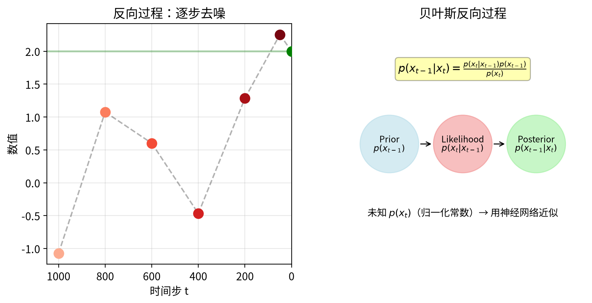

## 3.3 VP 反向 SDE → DDPM 采样

**本节起点：先写出 VP 反向 SDE**。VP 前向 SDE 是 $dX_t = -\frac{1}{2}X_t\,dt + dB_t$，即 $f = -\frac{1}{2}X$、$g = 1$。把这对参数代入 §3.2 的 Anderson 通用反向 SDE（反演项 $-f + g^2 s^* = \frac{1}{2}Y + s^*$），就得到 **VP 反向 SDE**：

$$\boxed{dY_s = \left[\frac{1}{2}Y_s + s^*_{T-s}(Y_s)\right]ds + d\tilde{B}_s}$$

这就是标题箭头的左端——DDPM 采样公式的连续时间源头。剩下的工作是把它离散化成 DDPM 论文里那条采样公式，中间涉及 4 个非平凡步骤，本节逐一摆出。

> **先把 $s_\theta$、$\varepsilon_\theta$ 当作已训好的黑箱**：下面推导会出现这两个符号（"已经训好了、能给出真实分数的近似"）。真实分数和它们的关系已由 §2.3 Tweedie 恒等式建立起来，但**"怎么学出这个 $\theta$"是第 4 章的工作**。本章只关心"假设网络已知，采样怎么走"——训练和采样的解耦正是扩散模型的核心优势之一。

**推导路线图**：

VP 反向 SDE（本节起点，见上式）\
↓\
[1] Euler-Maruyama 离散化（用 $\Delta s$ 近似 $ds$）\
↓\
[2] Tweedie 代换 $s_\theta = -\varepsilon_\theta/\sigma_t$，把"分数"换成"预测噪声"\
↓\
[3] 时间坐标切换：反向时间 $s$ → 前向离散索引 $t$（$Y_s \to x_t$）\
↓\
[4] 调度对齐：连续 $e^{-t}$ → 离散 $\bar{\alpha}_t = \prod \alpha_i$，套 DDPM 论文的记号\
↓\
DDPM 采样公式

**第1步：Euler-Maruyama 离散化**。从上面的 VP 反向 SDE 出发，用步长 $\Delta s > 0$ 近似 $ds$，用 $\sqrt{\Delta s}\,z$（$z \sim \mathcal{N}(0,I)$）近似 $d\tilde{B}_s$：

$$Y_{s+\Delta s} = Y_s + \left(\frac{1}{2}Y_s + s^*_{T-s}(Y_s)\right)\Delta s + \sqrt{\Delta s}\, z$$

**第2步：Tweedie 代换**。用 §2.4 的等价关系 $s^* = -\varepsilon/\sigma_t$（把"预测分数"换成"预测噪声"，网络实际学的是 $\varepsilon_\theta$）：

$$Y_{s+\Delta s} = Y_s + \frac{1}{2}Y_s\,\Delta s - \frac{\varepsilon_\theta(Y_s, T-s)}{\sigma_{T-s}}\,\Delta s + \sqrt{\Delta s}\, z$$

**第3步：时间坐标切换**。DDPM 论文用**前向离散索引** $t$：$t = T$ 是纯噪声，$t = 0$ 是干净数据，反向采样从 $t = T$ 走到 $t = 0$，每次 $t \to t-1$。切换关系：$Y_s = X_{T-s}$，所以令 $t = T-s$，则 $Y_s = x_t$。$s$ 增加一步 $\Delta s$ 对应 $t$ 减少一步（因为 $t = T-s$，$s$ 增 $t$ 减），即 $Y_{s+\Delta s} = x_{t-1}$。上式变成：

$$x_{t-1} = x_t + \frac{1}{2}x_t\,\Delta s - \frac{\varepsilon_\theta(x_t, t)}{\sigma_t}\,\Delta s + \sqrt{\Delta s}\, z$$

**第4步：调度对齐**。DDPM 的离散调度用 $\bar{\alpha}_t = \prod_{i=1}^t \alpha_i$，对应连续版本 $e^{-t}$（VP 的信号衰减 $a_t^2 = e^{-t}$）。需要把第3步公式里的连续参数（$\Delta s$、$\sigma_t$）换成 DDPM 的离散记号（$\alpha_t$、$\bar{\alpha}_t$），分三个替换：

**替换1**：$\Delta s \to 1 - \alpha_t$。推导链条：连续版本信号衰减 $a_t^2 = e^{-t}$（VP 调度的定义），所以离散调度 $\bar{\alpha}_t = \prod_{i=1}^t \alpha_i$ 对应连续版本 $a_t^2 = e^{-t}$。逆向走一步：$\bar{\alpha}_{t-1}/\bar{\alpha}_t = 1/\alpha_t$。在连续版本里，这一步对应时间增了 $\Delta s$，即 $e^{-(t-\Delta s)}/e^{-t} = e^{\Delta s}$。两者相等：$e^{\Delta s} = 1/\alpha_t$，取对数得 $\Delta s = \ln(1/\alpha_t)$。小步长下 $\ln(1/\alpha_t) \approx 1 - \alpha_t$（$\ln(1+x) \approx x$ 一阶近似，$x = 1/\alpha_t - 1$ 很小），故 $\Delta s \to 1 - \alpha_t$。

**替换2**：$\sigma_t \to \sqrt{1-\bar{\alpha}_t}$。连续版的 $\sigma_t = \sqrt{1-e^{-t}}$ 对应离散版的 $\sqrt{1-\bar{\alpha}_t}$。

**替换3**：合并 $x_t$ 的系数。第3步里 $x_t + \frac{1}{2}x_t\,\Delta s = x_t(1 + \frac{1}{2}(1-\alpha_t))$，用一阶近似 $1 + \frac{1}{2}(1-\alpha_t) \approx 1/\sqrt{\alpha_t}$（泰勒展开，误差见下方诚实标注），合并后信号系数变成 $\frac{1}{\sqrt{\alpha_t}}$。噪声项 $-\frac{\varepsilon_\theta\,\Delta s}{\sigma_t} = -\frac{1-\alpha_t}{\sqrt{1-\bar{\alpha}_t}}\varepsilon_\theta$，前面乘 $\frac{1}{\sqrt{\alpha_t}}$ 后变成 $-\frac{1-\alpha_t}{\sqrt{\alpha_t}\sqrt{1-\bar{\alpha}_t}}\varepsilon_\theta$。末尾的采样噪声标准差改用记号 $\sigma_q$（原因见公式下方说明）：

$$\boxed{x_{t-1} = \frac{1}{\sqrt{\alpha_t}}\left(x_t - \frac{1-\alpha_t}{\sqrt{1-\bar{\alpha}_t}}\,\varepsilon_\theta(x_t, t)\right) + \sigma_q\, z} \tag{§3.3}$$

**这个公式在说什么**：系数虽多，拆开看就是**三个目的动作**依次执行（按"目的"命名，而非几何形状——"目的动作"是本文的教学工具，把代数操作和它的意图对应起来，不是标准术语）——

1. **拉向数据**：$x_t - \frac{1-\alpha_t}{\sqrt{1-\bar{\alpha}_t}}\varepsilon_\theta$——减掉网络预测的那部分噪声 $\varepsilon_\theta$，等价于朝数据密集区挪一步——"减噪声"的方向正是分数指的方向。这是去噪的主干。
2. **复原尺度**：整体乘 $\frac{1}{\sqrt{\alpha_t}}$——前向每步把信号缩小了 $\sqrt{\alpha_t}$ 倍，反向就要放大回来，把幅度补偿回 $x_{t-1}$ 该有的尺度。（这个命名是为了直觉方便。实际上这个系数不是人为设计的"补偿"，而是反向 SDE 离散化的代数产物——恰好有"放大回来"的效果。）
3. **保多样**：$+\,\sigma_q z$——补一点新随机噪声。这对应 §3.1 说的"随机性"：同一个 $x_t$ 可能来自多张原图，随机项让每次采样走不同的合理路径，避免结果千篇一律地坍缩到单一模式。

一句话：**拉向数据、补回尺度、再留一点随机**——目的依次是"去噪 → 补偿衰减 → 保住多样性"，合起来就是一步既去噪又不失多样的更新。

> **噪声项说明（为什么换新符号 $\sigma_q$）**：$\sigma_q$ 是 DDPM 论文定义的采样噪声标准差（$\sigma_q^2 = \beta_t$ 或 $\tilde\beta_t = \frac{1-\bar{\alpha}_{t-1}}{1-\bar{\alpha}_t}\beta_t$），**与前文反复出现的条件分布标准差 $\sqrt{1-\bar{\alpha}_t}$ 是不同的量**。前者是反向采样每步注入的随机噪声大小，后者是前向加噪 $p(x_t \mid x_0)$ 的标准差。DDPM 论文里它们碰巧都用了 $\sigma_t$ 这个符号，容易混淆——本文用 $\sigma_q$ 特指采样噪声，避免歧义。

**此即 DDPM 采样公式 (§3.3)**——每一步都可以在数学上追溯。^[2]^

> **诚实标注：第4步的合并是一阶近似**。"$\frac{1}{2}x_t\Delta s + x_t$ 变成 $\frac{1}{\sqrt{\alpha_t}}x_t$"用的是 $1 + \frac{1}{2}(1-\alpha_t) \approx 1/\sqrt{\alpha_t}$——这个等式在 $\alpha_t \to 1$（小步长）的极限下**一阶匹配**，不是严格等式。DDPM 论文实际用的调度是 $\alpha_t \in [0.999, \ldots, 0.98]$，$1 - \alpha_t \in [10^{-3}, 0.02]$——一阶展开的误差在 $10^{-6} \sim 10^{-4}$ 量级，完全可以忽略。**换句话说，DDPM 的采样公式不是从反向 SDE"精确推出来"的，而是"用一阶近似定义"的算法**——它精确地对应"VP 反向 SDE 在小步长下的一阶欧拉离散化 + 调度对齐"。承认这一点比假装严格更诚实。

> **每步作用小结**：起点是 VP 反向 SDE（由 §3.2 通用式代入 VP 参数得到）；第1步把连续微分变差分；第2步把"分数"换成网络实际学的"噪声"；第3步把反向时间 $s$ 切回 DDPM 论文的离散索引 $t$；第4步把连续调度 $e^{-t}$ 翻译成离散的 $\bar{\alpha}_t = \prod \alpha_i$ 并做代数合并。没有一步是"整理即可得到"——每一步都对应一个具体的数学操作。

换句话说，DDPM 就是 VP 反向 SDE 的一种离散化方案，只是记号切换后看起来像一个独立公式。**这有什么用？** 它说明 DDPM 论文里的采样公式不是凭空发明的——每一步都有连续 SDE 的对应物，可以逐项追溯。更重要的是，连续 SDE 是统一框架：DDPM 和 NCSN 看起来是两套不同的采样公式，但它们只是同一个反向 SDE 的两种离散化（下一节就推 NCSN）。

## 3.4 VE 反向 SDE → NCSN 的 Langevin 采样

对称地推一遍——**每一步和 §3.3 完全平行，只是 VE 的 $f=0$ 省了几处代数**。

**本节起点：先写出 VE 反向 SDE**。VE 前向 SDE 是 $dX_t = dB_t$，即 $f = 0$、$g = 1$。代入 §3.2 的 Anderson 通用反向 SDE（$f=0$ 省掉逆漂移项，只剩 $g^2 s^* = s^*$），就得到 **VE 反向 SDE**：

$$\boxed{dY_s = s^*_{T-s}(Y_s)\,ds + d\tilde{B}_s}$$

这是标题箭头的左端——NCSN 采样公式的连续时间源头。剩下要把它离散化，中间涉及 4 个步骤（比 §3.3 少一步 Tweedie 代换，因为 NCSN 直接学分数）。

**推导路线图**：

VE 反向 SDE（本节起点，见上式）\
↓\
[1] Euler-Maruyama 离散化\
↓\
[2] （NCSN 直接学分数 $s_\theta$，无需 Tweedie 代换）\
↓\
[3] 时间坐标切换（VE 的调度是几何级数噪声，符号切换更直接）\
↓\
[4] 调度对齐：连续 $\sigma_t = \sqrt{t}$ → 离散几何级数 $\sigma_i \in [\sigma_{\min}, \sigma_{\max}]$\
↓\
Langevin 采样公式（NCSN 论文的 annealed Langevin dynamics）

**第1步：Euler-Maruyama 离散化**。从上面的 VE 反向 SDE 出发，步长 $\eta = \Delta s$：

$$Y_{s+\eta} = Y_s + s^*_{T-s}(Y_s)\,\eta + \sqrt{\eta}\, z, \quad z \sim \mathcal{N}(0, I)$$

这是 VE 反向 SDE 的**字面**一阶离散化，噪声系数是 $\sqrt{\eta}$。

**第1.5步：NCSN 的主动选择——换成 Langevin 形式**。NCSN 论文没有直接用上面的离散化，而是把噪声系数从 $\sqrt{\eta}$ 换成 $\sqrt{2\eta}$。这不是推导出来的，而是 NCSN 的**策略选择**：它想在每个噪声水平内做多步 Langevin 精修，让每层的稳态分布对上目标 $p_{\sigma_i}$。$\sqrt{2}$ 因子的数学根源在第4步详细说明——这里先接受这个替换，后续推导用 $\sqrt{2\eta}$。

**第2步：不用 Tweedie 代换**。NCSN 的网络直接学 $s_\theta(x, \sigma)$——分数就是网络输出，不需要再换成"预测噪声"。（这也是 §2.4 里 $\varepsilon$ 和 $s$ 等价的另一面：DDPM 选择输出 $\varepsilon$，NCSN 选择输出 $s$，两条路都通。）

**第3步：时间坐标切换**。DDPM 用整数步 $t$ 索引调度（$\bar{\alpha}_t$），NCSN 换个更直接的记号——**用噪声水平 $\sigma$ 本身索引**：写 $s_\theta(x, \sigma)$ 而非 $s_\theta(x, t)$，因为分数只关心"当前多噪"这一件事。相应地，反向过程用离散噪声水平索引 $i = 1, \ldots, L$，$\sigma_1 > \sigma_2 > \cdots > \sigma_L$（从大噪声退火到小噪声），迭代变成：

$$\boxed{x^{(i+1)} = x^{(i)} + \delta_i\, s_\theta(x^{(i)}, \sigma_i) + \sqrt{2\delta_i}\, z} \tag{§3.4}$$

**这个公式在说什么**：比 DDPM 更直白，只有**两个目的动作**——

1. **拉向数据**：$+\,\delta_i\, s_\theta$——分数 $s_\theta$ 指向概率密度升高的方向（数据密集处），沿它走一步 $\delta_i$，就是朝更像真实数据的地方挪。这和 DDPM 的第一动作**是同一件事**：DDPM 减掉预测噪声 $\varepsilon_\theta$、NCSN 沿分数 $s_\theta$ 走，而 $\varepsilon$ 与 $s$ 只差一个 $-\sigma$ 因子（§2.4）——两条公式的去噪主干完全同构。
2. **保多样**：$+\,\sqrt{2\delta_i}\, z$——补随机噪声，防止所有样本都滑到同一个峰顶（避免 §3.6 的多样性坍缩），和 DDPM 的第三动作目的一致。

对比 DDPM 少了"复原尺度"这一动作：VE 调度信号不缩放（$a_t=1$，§1.3），没有衰减需要补偿，自然省掉。这正是 **Langevin 动力学**的经典形态——"沿分数拉向数据 + 随机保多样"，物理上就是一颗粒子在势能场里受力滑向谷底、同时被热噪声不停撞击。反复迭代，样本群就会稳定在数据分布上。

其中 $\delta_i$ 是当前噪声水平下的步长（NCSN 论文按 $\delta_i = \epsilon \cdot \sigma_i^2/\sigma_L^2$ 缩放，让高噪声用大步、低噪声用小步）。这里出现的 $\sqrt{2\delta_i}$ 就是第 1.5 步预告过的 Langevin 系数。

> **符号区分**：$\delta_i$ 是 NCSN 的 Langevin 步长，与 DDPM 的 $\alpha_t = 1-\beta_t$（信号保留率）是完全不同的量。两者都源于希腊字母，但 $\delta$ 特指"步长增量"，$\alpha$ 特指"信号保留比例"。

**第4步：调度对齐 + $\sqrt{2}$ 因子的来源**。这一步做两件独立的事。

**4a：调度对齐**。NCSN 实际不用连续版本的 $\sigma_t = \sqrt{t}$（§1.4 的教学玩具版），而是**几何级数**：$\sigma_i = \sigma_{\max} \cdot (\sigma_{\min}/\sigma_{\max})^{(i-1)/(L-1)}$，典型 $\sigma_{\min}=0.01, \sigma_{\max}=50, L=10$。几何级数在对数噪声尺度（log-$\sigma$）空间均匀分布，覆盖比线性调度更好。这个对齐相当于把 §3.3 第4步里 DDPM 的"$\bar{\alpha}_t = \prod \alpha_i$"换成"$\sigma_i$ 几何级数"——都是**离散调度对连续 SDE 的采样点选择**。

**4b：$\sqrt{2}$ 因子的来源**。NCSN 采用 **Langevin 动力学**的标准形式，对应 SDE 为 $d\mathbf{x} = \nabla\ln p\,dt + \sqrt{2}\,d\mathbf{w}$，扩散系数 $\sqrt{2}$（不是 1）。离散化后噪声项 $\sqrt{2}\cdot\sqrt{\eta} = \sqrt{2\eta}$。

> **物理直觉**：$\sqrt{2}$ 不是随便挑的，它是让 Langevin 动力学的**稳态分布恰好等于目标分布** $p(x) \propto e^{-U(x)}$ 的唯一选择。Langevin SDE $d\mathbf{x} = \nabla \ln p\,dt + \sqrt{2}\,d\mathbf{w}$ 对应的 Fokker-Planck 方程是 $\partial_t p = -\nabla \cdot (p \nabla \ln p) + \nabla^2 p$。第一项是漂移带来的聚集流（$\nabla \ln p$ 推向高概率区），第二项是扩散带来的散开流。当 $\nabla \ln p = \nabla p / p$ 时，两项恰好抵消（$\partial_t p = 0$），$p$ 成为稳态。这个抵消只在扩散系数 $= \sqrt{2}$ 时成立——这就是 $\sqrt{2}$ 的数学实质。$\sqrt{2}$ 小了，稳态分布比 $p$ 更集中（低估方差）；大了，稳态分布比 $p$ 更铺开。VE 反向 SDE 不追求"稳态等于 $p$"（它只要在有限时间内跑到数据分布），所以纯字面离散化用 $\sqrt{\eta}$ 就够了；但 NCSN 想用**每个噪声水平内做多步 Langevin 精修**的策略，就必须配 $\sqrt{2}$ 才能让每层稳态对上目标分布。

> **诚实标注**：和 §3.3 一样，NCSN 的 Langevin 采样也不是 VE 反向 SDE 的"精确离散化"——它是"VE 反向 SDE 一阶欧拉离散化 + Langevin $\sqrt{2}$ 因子 + 几何级数调度"这三件事的组合。承认这一点比假装"NCSN 直接是 VE 反向 SDE"更诚实。

**每步作用小结**：起点是 VE 反向 SDE（由 §3.2 通用式代入 VE 参数、$f=0$ 省了漂移项得到）；第1步 Euler-Maruyama；第2步 NCSN 直接输出分数（跳过 Tweedie）；第3步切换到 NCSN 论文的噪声水平索引；第4步对齐几何级数调度。DDPM 和 NCSN 的推导**结构完全对称**，只是每一步的具体代数不同——这就是 §3.5 说的"同一反向 SDE 的两种离散化"的字面含义。

**结论：NCSN 采样也是 VE 反向 SDE 的离散化，和 DDPM 是同一棵树的两根枝。** $\sqrt{2}$ 因子不是随便加的——它来自 Langevin 动力学的稳态分布匹配条件（第4步）。这个推导的意义：看似毫不相干的 DDPM 和 NCSN，在连续 SDE 框架下是同一个方程的两种离散化，只是调度（VP vs VE）和网络输出（噪声 vs 分数）的选择不同。

## 3.5 DDPM 与 NCSN 的对照

| | DDPM | NCSN |
|---|---|---|
| 调度 | VP | VE |
| 前向 SDE | $dX = -\frac{1}{2}X\,dt + dB$ | $dX = dB$ |
| 反向 SDE | $dY = (\frac{1}{2}Y + s^*)ds + d\tilde{B}$ | $dY = s^*\,ds + d\tilde{B}$ |
| 离散化 | $\to$ DDPM 采样公式 | $\to$ Langevin 采样公式 |
| 网络输出 | $\varepsilon_\theta$（噪声） | $s_\theta$（分数） |
| 等价性 | $\varepsilon_\theta = -\sigma_t \cdot s_\theta$（Tweedie） | 同左 |

**核心结论：DDPM 和 NCSN 是同一个反向 SDE 的两种离散化。它们不是两个模型，是一个模型的两种实现。**区别只在调度（VP 有漂移项 $\frac{1}{2}Y$，VE 没有）和网络输出参数化（$\varepsilon$ vs $s$），数学结构完全一样。

> **VE 线的诚实标注**：上表 VE 前向 SDE 写的是 $dX = dB$（$g=1$，$\sigma_t=\sqrt{t}$），这是教学版。NCSN 实际用几何级数 $\sigma_i$，对应的前向 SDE 是 $dX = \sqrt{\frac{d[\sigma^2(t)]}{dt}}\,dB$（$g$ 随 $\sigma_t$ 变化），不是 $g=1$。几何级数只是换离散化点（选哪些 $\sigma_i$ 采样），连续极限下的 SDE 形式不变。所以"同一个反向 SDE 的两种离散化"这个结论仍然成立——VP 和 VE 的区别是漂移项有无所致的结构差异，不是调度参数的选择。

**三层区分：调度 vs 反向动力 vs 离散化**。前文出现的"VP/VE"、"反向 SDE"、"DDPM/NCSN"分别属于三个不同层次，容易混淆。用一张层次图理清：

[层次1] 前向调度：选 $f$ 和 $g$\
- VP: $f=-\frac{1}{2}X,\ g=1$ → 信号衰减+噪声补充，总方差=1\
- VE: $f=0,\ g=1$ → 信号不变+噪声增长，总方差=$t$\

[层次2] 反向 SDE（统一形式，由 Anderson 定理给出）\
- $dY = (-f + g^2 s)ds + g\,d\tilde{B}$\
- 两个调度得到两个反向 SDE，但形式一致，只有 $f$ 值不同\

[层次3] 离散化（选数值方法）\
- VP 反向 SDE + Euler-Maruyama → DDPM 采样\
- VE 反向 SDE + Euler-Maruyama + Langevin $\sqrt{2}$ → NCSN 采样\
- （第5章还会加：概率流 ODE + Euler → DDIM；ODE + 高阶 → DPM-Solver）

这三个层次是**正交的**：换调度不改变反向 SDE 的形式，换离散化方法（Euler/Heun/RK4）不改变前两层。DDPM 论文只在层次3出现，NCSN 只在层次3出现，但它们背后共享层次1和层次2的骨架。

**图13**：DDPM 与 NCSN 的并列对比

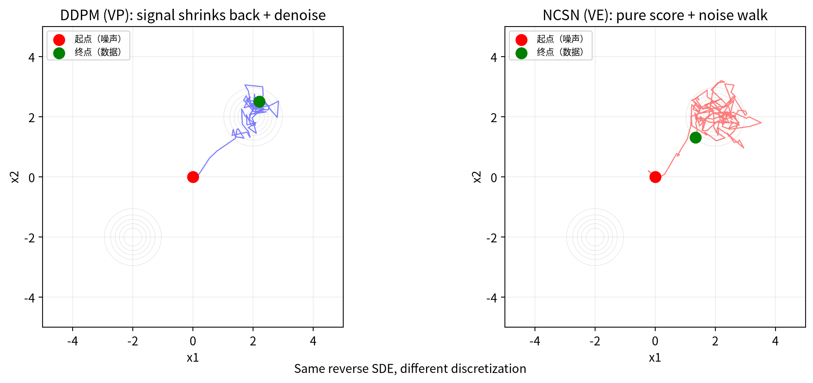

左图 DDPM（VP）轨迹：信号被"拉回"（漂移项 $\frac{1}{2}Y$ 把信号从噪声状态拉回），路径更直接。右图 NCSN（VE）轨迹：没有拉回项，纯靠分数方向 + 随机游走，路径更长更飘忽。但两者从同一个噪声起点出发，最终都收敛到数据峰。

**图14**：前向与反向过程的合并视图

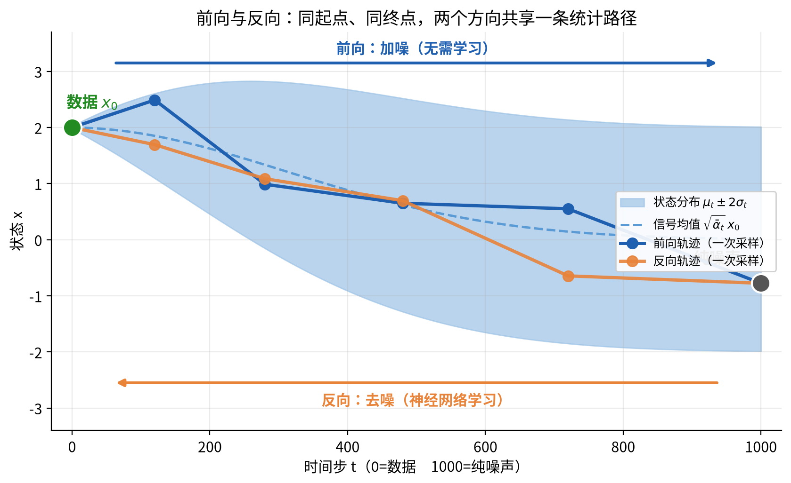

**漂移分解**：反向 SDE 的漂移项 $-f + g^2 s$ 可以分解为两部分：$-f$ 是确定性传输（把信号从"被缩小的"状态拉回来，即 §3.3/§5.1 的"复原尺度"动作，VP 有此项，VE 的 $f=0$ 所以没有），$g^2 s$ 是分数修正（把信号拉向数据密集区，即三条采样公式共享的"拉向数据"主干）。这解释了为什么 DDPM 路径比 NCSN 更直接：DDPM 多了 $-f = \frac{1}{2}Y$ 的"拉回"项，而 NCSN 只有分数项。

**图15**：漂移分解：传输 + 分数修正

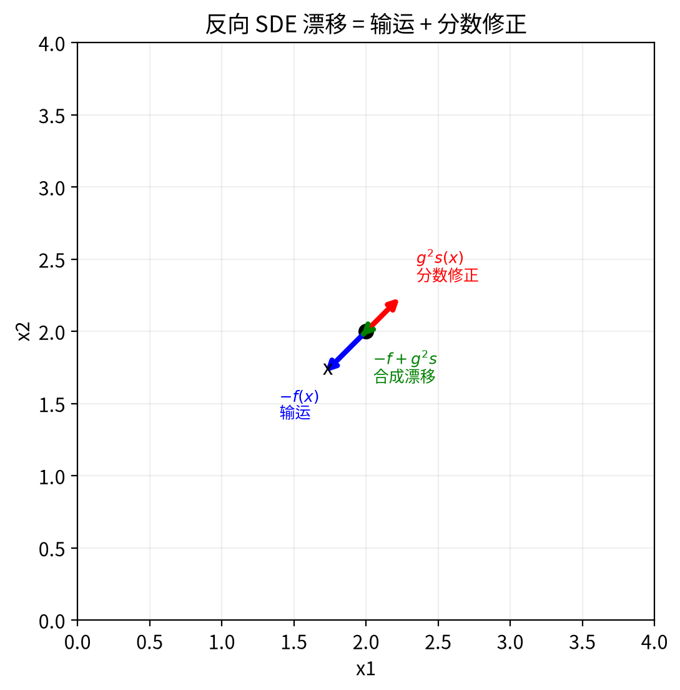

## 3.6 反向过程为什么还要加随机性

前向加噪声是随机的，反向为什么不能确定性去噪？

因为前向过程的每一步都有多种可能的"原始状态"。给定 $x_t$，可能有多个 $x_0$ 都能产生这个 $x_t$。确定性去噪会丢失这种多样性，导致生成的样本缺乏变化——所有猫都长得一模一样。

反向 SDE 中的 $d\tilde{B}_s$ 保留了这种多样性——**随机性不是缺陷，是特征**。它让模型在"合理的去噪方向"上随机选择，生成多样化的样本。

**"随机性是必需的" vs "去掉随机性质量不降"——两句话矛盾吗？** 表面上看第5章会说"DDIM 去掉随机项，样本质量并不下降"，好像和这里冲突。其实两句话讨论的是**不同层次的多样性**：

| 多样性层次 | 谁提供 | 去掉随机项的影响 |
|-----------|-------|-----------------|
| **样本间多样性**（不同起点生成不同样本） | 初始噪声 $x_T \sim \mathcal{N}(0,I)$ 的随机性 | **不受影响**——起点随机就够了 |
| **单条轨迹的随机分支**（同一起点走出不同路径） | 反向 SDE 的 $d\tilde{B}_s$ | **失去**——ODE 轨迹是确定的 |
| **单样本质量**（最终图片好不好看） | 分数的准确性 + 数值方法的精度 | **实践中不受影响，多步下可比或略优** |

所以精确的说法是：**样本间多样性由初始噪声保证，SDE 的随机性只影响轨迹分支**。DDIM 去掉后者，前者仍然有——同一个模型换不同噪声起点，依然生成不同的猫。这个不对称性正是第5章"20 步 ODE 采样"能成立的根本原因。

（第5章会详述：如果确实想要确定性，可以去掉随机性得到 ODE，代价只是"轨迹分支"这一层的多样性降低，样本间多样性和单样本质量都保留。）

**图16**：SDE（有随机性）与 ODE（确定性）产生的密度演化对比，以及 DPM-Solver 等高阶求解器的步数压缩效果。

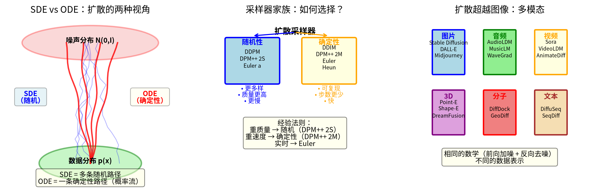

## 3.7 数字演示

> **公式选择说明**：这里用的是反向 SDE 的 Euler-Maruyama 形式（§3.3 第1步），而非调度对齐后的 DDPM 采样公式（§3.3 第4步）——目的是让漂移项和分数项的贡献可以直接看到。两种形式等价，只是离散化精度不同。

取同一个噪声点 $x_t = [1.0, 0.5]$，同一个学到的分数 $s_\theta = [-0.3, 0.4]$，$\sigma_t = 0.8$，步长 $\eta = 0.1$，随机噪声 $z = [0.2, -0.1]$。

**DDPM 一步**（VP，$f = -\frac{1}{2}X$，所以 $-f = \frac{1}{2}X$）：

$$x_{t-1} = x_t + \eta\left(\frac{1}{2}x_t + s_\theta\right) + \sqrt{\eta}\,z$$

$$= [1.0, 0.5] + 0.1 \times ([0.5, 0.25] + [-0.3, 0.4]) + \sqrt{0.1} \times [0.2, -0.1]$$

$$= [1.0, 0.5] + [0.02, 0.065] + [0.063, -0.032] = [1.083, 0.533]$$

信号被拉回（$\eta \cdot \frac{1}{2}x_t$ 项贡献了 $[0.05, 0.025]$），分数修正贡献了 $[-0.03, 0.04]$，随机噪声贡献了 $[0.063, -0.032]$。

**Langevin 一步**（VE，$f=0$）：

$$x_{k+1} = x_t + \eta\, s_\theta + \sqrt{2\eta}\, z$$

$$= [1.0, 0.5] + 0.1 \times [-0.3, 0.4] + \sqrt{0.2} \times [0.2, -0.1]$$

$$= [1.0, 0.5] + [-0.03, 0.04] + [0.089, -0.045] = [1.059, 0.495]$$

两种方法用了同一个分数，走了不同的路径——VP 多了一个"把信号拉回来"的项（$[0.05, 0.025]$），VE 没有。VE 的随机噪声更大（$\sqrt{2\eta} = 0.447$ vs $\sqrt{\eta} = 0.316$），所以路径更飘忽。

## 3.8 AI落地

| 场景 | 没有反向 SDE 会怎样 |
|------|---------------------|
| 图像生成 | 无法从噪声采样出图片 |
| 图像修复 | 无法从噪声"填充"缺失区域 |
| 音频合成 | 无法从噪声生成语音/音乐 |

## 3.9 常见误解

**误解1**："DDPM 的采样公式和 NCSN 是两套独立推导？"
两者都是同一个反向 SDE 的离散化。前向调度不同（VP vs VE）让反向公式看上去有差异，但数学结构完全一样，用 Tweedie 恒等式就能把其中一个的网络输出直接换成另一个。

**误解2**："反向过程就是前向过程倒着放。"
反向过程比"倒放"多了一个分数修正项 $g^2 s$。前向是 $f\,dt + g\,dB$，反向是 $(-f + g^2 s)\,ds + g\,d\tilde{B}$。这个多出来的分数项正是我们要学的（第2章），也是反向过程需要训练、前向过程无需训练的根本原因。

**误解3**："采样不需要随机性。"
随机性是多样性的来源。去掉随机性得到的是 ODE（第5章）——确定性更强，多样性会相应降低。

## 3.10 本章回顾

**本章自检**：

**1.** DDPM 采样公式是怎么从 VP 反向 SDE 推出来的？关键步骤是什么？

**2.** NCSN 的 Langevin 采样是怎么从 VE 反向 SDE 推出来的？为什么噪声系数是 $\sqrt{2\eta}$ 而不是 $\sqrt{\eta}$？

**3.** DDPM 和 NCSN 的训练目标在数学上等价吗？为什么？

**4.** 反向 SDE 中为什么必须保留随机项 $d\tilde{B}_s$？假设你强行去掉它做确定性去噪，生成的所有样本会出现什么问题？这和"多尺度分数场"有什么关系？

**反事实思考**：假设你想省事，**直接把前向 SDE 反演**：把 $dX = f\,dt + g\,dB$ 里的 $dt$ 换成 $-dt$，套 Anderson 定理却不加分数修正项 $g^2 s$。会得到什么？答案是——**样本不会回到数据分布**。以 VP 为例，前向 $dX = -\frac{1}{2}X\,dt + dB$（漂移把信号往 0 拉、噪声继续注入），把 $dt \to -dt$ 却不加分数项，得到 $dY = \frac{1}{2}Y\,ds + dB̃$——**漂移翻成了往外推**（$+\frac{1}{2}Y$ 是发散项），噪声却仍在注入。密度演化完全不匹配数据分布 $p_0$，轨迹既不收敛到数据也不停在标准高斯，而是走向一个错误的分布。分数项 $g^2 s$ 才是让反向 SDE 的**密度演化**与前向倒放严格对应（Fokker-Planck 层面）的关键——它把"熵增的加噪过程"扭转成"熵减的去噪过程"。没有分数，反向 SDE 只是形式上倒放，**密度演化的方向完全错**。这也解释了为什么第 2 章要花那么大篇幅先讲分数：它不是配角，它是反向过程的**动力源**。

有了分数 → 反向 SDE：$dY = (-f + g^2 s)ds + g\,d\tilde{B}$\
→ 分数是唯一未知量（第2章已用 Tweedie 解决）\
→ VP 反向 SDE 离散化 = DDPM 采样（多了 $\frac{1}{2}Y$ 拉回项）\
→ VE 反向 SDE 离散化 = NCSN/Langevin 采样（纯分数 + 噪声）\
→ DDPM 和 NCSN 是同一框架的两种实现，不是两个模型\
→ 反向加随机性 = 保留生成多样性

**未解问题**：本章推导的反向 SDE 和 DDPM/NCSN 采样公式都建立在一个前提上——**分数 $s^*_t(x) = \nabla \ln p_t(x)$ 是已知的**。但 $p_t(x)$ 是数据加噪后的分布，我们只有一堆样本，根本写不出解析式。**分数怎么学？** 直接对 $\nabla \ln p_t$ 做 MSE 是循环论证——目标本身未知。第4章会给出一个可落地的解法：**通过前向过程的闭式跳步公式，把"学分数"变成"学预测噪声"**——网络练习的是一个完全可监督的任务，$\varepsilon$-MSE 训练目标就此诞生。

 * * * 

# 第4章：训练——去噪分数匹配

> 统一训练目标是让网络在各个噪声水平上练习"识别噪声方向"，DDPM 的 $\varepsilon$-MSE 和 NCSN 的分数匹配是同一目标的两种写法。训练只需前向加噪，不需要反向采样。

> **本章路线**：先看统一训练目标与数字演示，再看反向传播与网络架构，最后落地、辨误解、收束。

> **核心推导**：
> 1. 训练目标把“学分数”变成“学预测噪声”。
> 2. 不同噪声水平的难度不同，网络要同时学会所有水平。
> 3. U-Net 是常用架构，但不是唯一终点。

> **动笔前自检**：①反向传播是什么？②MSE 损失怎么用？

**回望**：第2章告诉我们**分数是什么**，第3章告诉我们**分数怎么用**（反向 SDE + 离散化）。可这两章都跳过了一个致命的前提——**分数不是给定的，需要从数据里学出来**。数据只是一堆图片，$\nabla \ln p_t(x)$ 是个抽象的数学对象，你根本看不到它。这一章要回答两个具体问题：(1) 目标函数怎么写？直接对分数做 MSE 会撞上"你不知道真分数"的悖论；(2) 一个网络能同时学好**所有噪声水平**的分数吗？——毕竟采样时 $t$ 从 $T$ 一路走到 $0$，每一步都要靠谱。这一章会把分数从"数学概念"变成"可训练的神经网络"。

## 4.1 生活类比：怎么让鉴定师从噪声里认出原图？

想象你在训练一位"噪声鉴定师"：给他一张被加了噪声的图片，让他指出噪声是从哪个方向加进去的。

训练时我们**知道**加了哪个 $\varepsilon$（因为是我们自己采样的），所以可以拿它当正确答案。网络只看到加噪后的 $x_t$ 和噪声水平 $t$，要猜出我们加了哪个方向的噪声。

练得多了，他就能从任意噪声图片中识别出噪声方向——反过来说，他也知道怎么去噪。

## 4.2 统一训练目标

**去噪分数匹配**损失：

$$\boxed{\mathcal{L} = \mathbb{E}_{t, X_0, Z}\left[\left\| s_\theta(a_t X_0 + \sigma_t Z,\; t) + \frac{Z}{\sigma_t} \right\|^2\right]} \tag{§4.2}$$

> **公式里为什么是"加号"？** 直觉上应该长成 $\|s_\theta - s^*\|^2$。原因是条件分数带负号：$\nabla_{X_t}\ln p(X_t|X_0) = -Z/\sigma_t$（Tweedie，§2.4），所以 $\|s_\theta - (-Z/\sigma_t)\|^2 = \|s_\theta + Z/\sigma_t\|^2$——加号就是"减去负数"。**为什么可以用条件分数代替真实分数做回归目标**，见下方"技术说明"。

逐符号解释：

| 符号 | 含义 |
|------|------|
| $t$ | 随机采样的时间步（噪声水平） |
| $X_0$ | 从训练集采样的干净图片 |
| $Z \sim \mathcal{N}(0, I)$ | 标准高斯噪声 |
| $a_t X_0 + \sigma_t Z$ | 加噪后的图片 $X_t$（闭式公式，§1.2） |
| $s_\theta(\cdot, t)$ | 网络预测的分数（近似真实的 $\nabla \ln p_t$） |
| $Z / \sigma_t$ | **与条件分数差一个负号**（$\nabla\ln p(X_t\|X_0) = -Z/\sigma_t$）；损失里用加号正是抵消这个负号 |
| $\|\cdot\|^2$ | MSE 损失 |

训练过程：从数据集采样 $X_0$，随机选 $t$，生成 $Z$，计算 $X_t = a_t X_0 + \sigma_t Z$，让网络预测 $s_\theta(X_t, t)$，和条件分数 $Z/\sigma_t$（差符号后）算 MSE。反向传播更新 $\theta$。

**关键：训练只需要前向加噪，不需要反向采样。** 前向加噪是闭式的（一步到位），所以训练很快。

**DDPM 的 $\varepsilon$-MSE 是 (§4.2) 的 VP 离散化**：用 Tweedie 的 $\varepsilon_\theta = -\sigma_t s_\theta$ 代入，损失变成 $\|\varepsilon - \varepsilon_\theta\|^2$——完全等价。DDPM 论文写的是"预测噪声"，NCSN 论文写的是"预测分数"，但数学上是同一个损失。

**NCSN 的分数匹配也是这个目标**：直接用 $s_\theta$ 形式——完全等价。

**图17**：统一训练目标

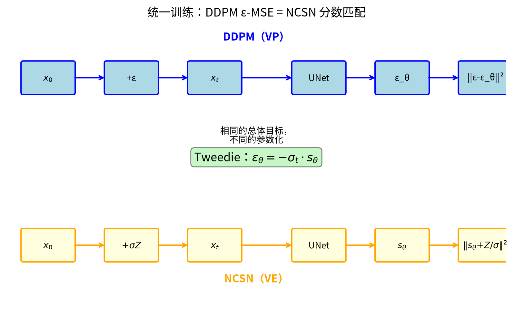

> **技术说明：$Z/\sigma_t$ 是条件分数，不是真实分数——为什么可以直接回归它**。严格地讲，$X_t - a_t X_0 = \sigma_t Z$，所以 $\frac{X_t - a_t X_0}{\sigma_t^2} = \frac{Z}{\sigma_t}$。而条件分数 $\nabla_{X_t} \ln p(X_t \mid X_0) = -\frac{X_t - a_t X_0}{\sigma_t^2} = -\frac{Z}{\sigma_t}$。所以 $Z/\sigma_t$ 是条件分数的**相反数**。真实分数是 $\nabla_{X_t} \ln p_t(X_t) = \mathbb{E}_{X_0 \mid X_t}[\nabla_{X_t} \ln p(X_t \mid X_0)]$（对 $X_0$ 的后验积分，见 §2.3 Tweedie 推导第2步）。**关键洞察**：直接用条件分数 $Z/\sigma_t$ 作为回归目标，虽然对每个 $(X_0, Z)$ 样本都不是"真的最优分数"，但**在训练目标的期望意义下**它等价于回归真实分数——因为 $\mathbb{E}[\nabla \ln p(X_t \mid X_0) \mid X_t] = \nabla \ln p_t(X_t)$，网络最小化 MSE 时会自动学到这个后验期望。这是去噪分数匹配（Vincent 2011）的核心贡献：把不可计算的目标（真实分数）替换成可计算的目标（条件分数），期望值不变。

## 4.3 数字演示

取 $\varepsilon = [0.5, -0.3]$，网络预测 $\varepsilon_\theta = [0.4, -0.2]$，$\sigma_t = 0.8$。

$$\mathcal{L} = \|\varepsilon - \varepsilon_\theta\|^2 = (0.5-0.4)^2 + (-0.3+0.2)^2 = 0.01 + 0.01 = 0.02$$

梯度 $\nabla_\theta \mathcal{L} = -2(\varepsilon - \varepsilon_\theta) \cdot \nabla_\theta \varepsilon_\theta = [-0.2, 0.2] \cdot \nabla_\theta \varepsilon_\theta$。梯度方向告诉网络"把预测往 $[0.5, -0.3]$ 方向调"——也就是"你少预测了 $0.1$ 的第一个分量，多预测了 $0.1$ 的第二个分量"。

用分数形式验证：$s_\theta = -\varepsilon_\theta / \sigma_t = [-0.5, 0.25]$，真实分数 $= Z/\sigma_t = -\varepsilon/\sigma_t = [-0.625, 0.375]$。$\|s_\theta - s^*\|^2 = \|[-0.5,0.25] - [-0.625,0.375]\|^2 = 0.015625 + 0.015625 = 0.03125$。乘以 $\sigma_t^2 = 0.64$ 得 $0.02$——与 $\varepsilon$-MSE 一致（差一个 $\sigma_t^2$ 因子。当 $t$ 固定时不影响该 $t$ 上的优化方向；但训练时随机采样 $t$，两种损失对不同 $t$ 的隐含权重不同——$\varepsilon$-MSE 对所有 $t$ 等权，分数匹配损失隐含 $1/\sigma_t^2$ 权重）。

## 4.4 不同噪声水平的训练难度

不是所有噪声水平都一样难学。信噪比 $\mathrm{SNR}(t) = \bar{\alpha}_t / (1-\bar{\alpha}_t)$ 决定了网络在每个 $t$ 需要学什么：

- **低噪声**（$t$ 小，SNR 高）：信号细节清晰，分数指向精细结构——方向复杂，难学
- **高噪声**（$t$ 大，SNR 低）：信号被噪声淹没，分数只指粗略方向——容易学

**图18**：不同噪声水平的信噪比与学习难度

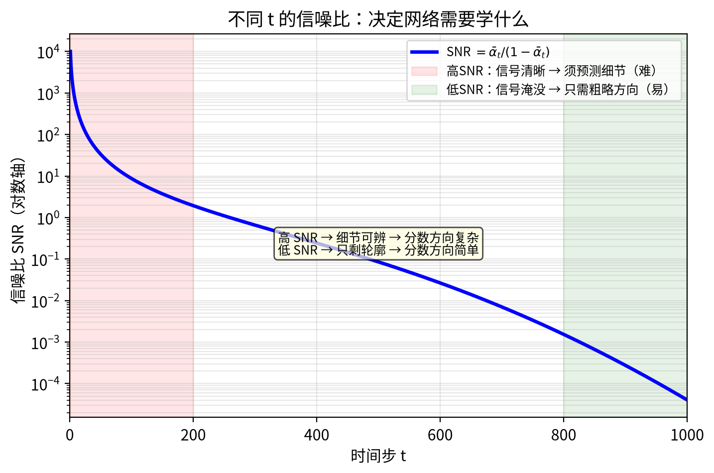

直觉：高噪声时只需要知道"大概往中间走"（一个粗略方向），低噪声时需要知道"具体往哪个像素的什么方向走"（精细结构）。粗略方向容易学，精细结构难学。

注意：虽然每步的目标都是 $\varepsilon \sim \mathcal{N}(0,I)$（分布相同），但预测难度随 $t$ 变化。高 $t$ 时 $x_t \approx \varepsilon$（信号可忽略），网络几乎可以直接读出噪声，loss 低；低 $t$ 时 $x_t \approx x_0$（噪声可忽略），要提取 $\varepsilon$ 必须精确知道数据分布，loss 高。SNR 正是量化这一差异的物理量。

这就是为什么训练时随机采样 $t$——让网络在所有噪声水平上都有练习机会。如果只在高噪声训练，生成的图片只有粗略轮廓没有细节；如果只在低噪声训练，生成的图片有细节但整体结构混乱。

## 4.5 反向传播与网络架构

§4.2–4.4 把训练目标（损失 $\mathcal{L}$）和它的性质讲清楚了。但还差最后一环：**这个损失怎么变成一个真正会去噪的网络？** 答案是反向传播——把损失对每个权重的影响算出来，再逐个微调权重。这一节先讲这条"损失 → 权重更新"的链，再讲承载它的网络长什么样。

### 从损失到权重更新

分数网络 $s_\theta$（实践中常写成噪声预测网络 $\varepsilon_\theta$，§2.4 已说明二者等价）通常用 U-Net 或 DiT（Diffusion Transformer，§9.3 详述）实现。训练时，损失对网络参数的梯度通过反向传播逐层传回：

$$\nabla_\theta \mathcal{L} = 2\left(s_\theta + \frac{Z}{\sigma_t}\right) \cdot \nabla_\theta s_\theta$$

**$\theta$、$\nabla_\theta s_\theta$ 和权重 $W$ 到底是什么关系？** 这是"损失公式"落到"可训练网络"的咬合点，拆开看：

- **$\theta$ 就是网络所有层的权重和偏置的总和**：$\theta = \{W^{(1)}, b^{(1)}, W^{(2)}, b^{(2)}, \ldots\}$。一个 U-Net 有上亿个这样的标量参数，$\theta$ 是把它们全部打包的记号。所以"训练网络"= 给 $\theta$ 里每一个数找到合适的值。
- **$s_\theta$ 是这些权重的复合函数**：输入 $X_t$ 经过第1层 $W^{(1)}X_t + b^{(1)}$、激活、第2层……逐层前向，最后输出分数。换一组 $W$，同一个 $X_t$ 就得到不同的 $s_\theta$——网络的行为完全由 $\theta$ 决定。
- **$\nabla_\theta s_\theta$ 是"分数输出对每个权重的偏导"的集合**：它回答"把某个 $W^{(l)}_{ij}$ 调大一点，输出的分数会朝哪个方向变、变多少"。因为 $s_\theta$ 是层层复合的，这个偏导要用链式法则从输出层逐层乘回该权重所在的层——**这正是反向传播**。

把这些拼起来，单个权重的更新链条就清晰了：损失 $\mathcal{L}$ 先对分数求导得 $2(s_\theta + Z/\sigma_t)$，再乘以分数对该权重的偏导 $\partial s_\theta / \partial W^{(l)}_{ij}$（反向传播算出），得到 $\partial \mathcal{L} / \partial W^{(l)}_{ij}$，最后按梯度下降走一步：

$$W^{(l)}_{ij} \leftarrow W^{(l)}_{ij} - \eta\, \frac{\partial \mathcal{L}}{\partial W^{(l)}_{ij}}$$

> **符号防混淆**：这里的 $\eta$ 是**学习率**（每步权重更新的幅度，训练超参数），与 §3.3/§3.4 采样时的 Euler-Maruyama 步长 $\eta$ 无关。两者都按学界惯例用 $\eta$，但一个作用在"训练时更新权重"、一个作用在"采样时推进轨迹"，语境不同。

上亿个权重**同时**做这个更新，就是一次训练迭代。所以 §4.2 那个抽象的 $\nabla_\theta \mathcal{L}$，落到实处就是"给网络里每一个权重算一个该往哪调的方向"——反向传播负责高效地一次性算出全部这些方向。下面这张图把整条链画在一起：网络做噪声预测（左）、MSE 损失衡量预测差多少（中）、梯度沿链式法则穿过 U-Net 逐层更新权重（右）。

**图19**：噪声预测任务、MSE 损失与反向传播穿过 U-Net

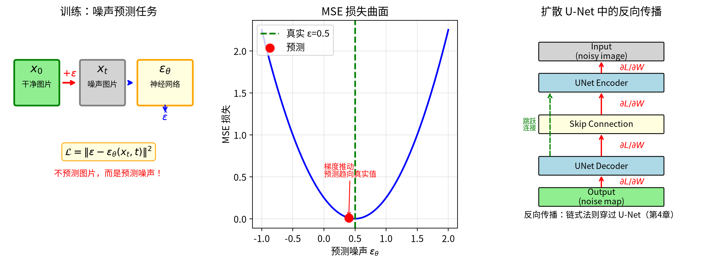

### 时间步 $t$ 怎么进网络

还有一个细节：同一个网络要在**所有**噪声水平 $t$ 上工作（§4.4），所以它必须"知道"当前处理的是第几步。做法是把标量 $t$ 通过**正弦位置编码**（和 Transformer 的位置编码同源）映射成一个高维向量，再注入网络的每一层——让同一套权重在不同 $t$ 下表现出不同的行为。

**图20**：时间嵌入机制

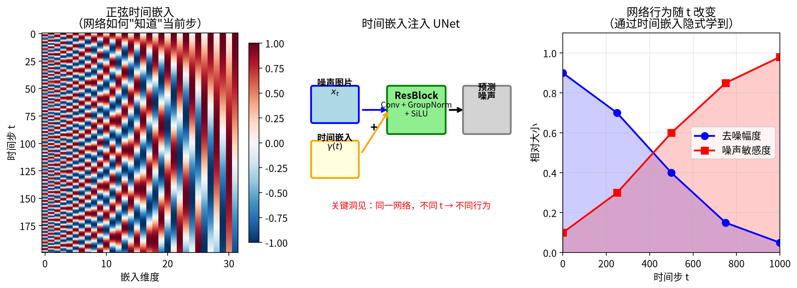

### 网络架构：U-Net 为何合适，又为何不是终点

U-Net 的"下采样-瓶颈-上采样"结构配合跳跃连接，让网络同时看到全局结构（下采样路径）和局部细节（上采样路径）。这对分数预测很合适：高噪声 $t$ 需要全局结构（粗略方向），低噪声 $t$ 需要局部细节（精细结构），U-Net 两条路径都能覆盖。

但 **U-Net 不是唯一答案——它只是"工具"，可以替换**。注意上面推导的一切——损失 (§4.2)、梯度 $\nabla_\theta \mathcal{L}$、反向传播更新权重——**完全不依赖网络内部长什么样**。$s_\theta$ 只要是个"输入 $X_t$ 和 $t$、输出分数、参数可微"的函数就行，U-Net 只是满足这个接口的一种实现。它的多尺度结构在数据量不大时是优势（归纳偏置帮模型省数据），但当数据涨到几十亿张、算力涨到千卡集群规模时，这种强结构假设反而成了扩展的枷锁——于是新发布的前沿模型主流转向把 U-Net 换成 **Transformer（即 DiT）**，用弱归纳偏置换取更好的 scaling law。这就是第9章"技法 $\times$ 工具"框架（§9.1）里的**工具层**：去噪这条"技法"不变，跑它的"工具"从卷积网络换成了注意力网络。为什么换、怎么换、换了以后好在哪，留到 §9.3 详述——这里只需记住：**分数网络的架构是可插拔的，U-Net 是当前教学基准，不是终点**。

## 4.6 AI落地

| 场景 | 没有训练会怎样 |
|------|---------------|
| 任意生成 | 网络不知道数据分布，分数是随机的 |
| 风格迁移 | 无法学习特定风格的数据分布 |
| 超分辨率 | 无法学习高分辨率数据的分布 |

## 4.7 常见误解

**误解1**："DDPM 训练和 NCSN 训练算的是两笔账？"
两者通过 Tweedie 恒等式其实是同一目标的两种写法：$\varepsilon$-MSE 与分数匹配等价。同一个网络、同一份数据，只是输出层的参数化不同（相差一个 $-\sigma_t$ 缩放因子）。

**误解2**："只在最终噪声水平训练就够了。"
不同噪声水平学到的是不同尺度的信息：高噪声学粗略结构，低噪声学细节。跳过任何一段都会让生成图片在对应尺度上出问题——就像地图少了一个缩放级别。

**误解3**："训练需要反向采样。"
训练只用前向加噪（闭式公式一步到位）加上 MSE 损失和反向传播即可，反向采样只在推理阶段登场。

## 4.8 本章回顾

**本章自检**：

**1.** 如果训练时只采样 $t \in [0, 0.2]$（低噪声，高信噪比），从不训练高噪声步，生成的图片会出现什么缺陷？这和 CFG 的 $w$ 太大导致的"模式坍塌"是同一类问题吗？（CFG 见 §6.3）

**2（反事实・边界情况）.** 如果训练时**只在最高噪声水平** $t \approx T$（数据几乎完全被销毁）附近采样，而不训练中低噪声，采样时会发生什么？和本章 Q1 的"只训低噪声"是同一类问题还是不同问题？

**反事实思考**：如果训练时**只在单个噪声水平** $t=0.5$ 上采样（不做全区间随机），网络学到什么？答案是**只会去中等模糊的噪声**——遇到 $t=0.1$ 的轻微噪声或 $t=0.9$ 的重度噪声时，它给出的分数完全错乱。采样时反向 SDE 要求你从 $t=T$ 一路走到 $t=0$，每一步的分数都得靠谱。**训练时的 $t$ 覆盖度直接决定采样时的可用区间**——这就是随机采样 $t$ 不是"优化技巧"而是"框架强制要求"的原因。这个反事实同时揭示了扩散模型和普通监督学习的根本差异：普通任务只需要在**测试分布**上表现好，扩散模型需要在**整个噪声轨迹**上处处表现好。

要学分数 → 去噪分数匹配：让网络练习识别噪声方向\
→ 统一目标 $\mathcal{L} = \mathbb{E}[\|s_\theta + Z/\sigma\|^2]$\
→ DDPM 的 $\varepsilon$-MSE = VP 离散化（Tweedie 代换），NCSN = 同一目标\
→ 训练只需前向加噪，不需要反向采样\
→ 高噪声容易学（粗略方向），低噪声难学（精细结构）\
→ 随机采样 $t$ 确保全尺度覆盖

**未解问题**：训练解决了分数怎么学，采样解决了怎么用分数走回数据。但整个流程需要**1000 步**——每步都要跑一次神经网络，采样一张图要几十秒。**能不能少走几步？** 直觉上少走几步意味着每步跨得更大，误差应该累积。可扩散模型社区做出了 50 步、20 步甚至 1 步的加速方案，质量几乎不降。它们凭什么能做到？下一章会揭示一个反直觉的事实：**反向 SDE 的"随机性"是可以拿掉的**——去掉之后得到的确定性 ODE，允许我们用高阶数值方法把步数压到 1/20。

 * * * 

# 第5章：概率流 ODE——去掉随机性

> 每个扩散 SDE 都有一个对应的确定性 ODE，两者产生完全相同的概率分布。DDIM 是这个 ODE 的离散化，高阶求解器让采样从 1000 步压缩到 20 步。

> **本章路线**：先看从 SDE 到 ODE 的推导、DDIM 与三源误差分解，再看步长策略，最后落地与收束。

> **核心推导**：
> 1. 随机性可以去掉，得到确定性 ODE。
> 2. DDIM 是这个 ODE 的离散化。
> 3. 步数压缩靠更好的积分，不是靠偷工减料。

> **动笔前自检**：①SDE 和 ODE 的差别？②离散化步长越小一定越好吗？

**回望**：第3章的反向 SDE 让我们能从噪声走回数据，第4章告诉我们分数怎么学出来。现在有一个**工程问题**：反向 SDE 需要 1000 步——每步都要跑一次神经网络，采样一张图要几十秒到几分钟。**能不能少走几步？** 直觉上，"少走几步"意味着每步走得更远，误差会累积。但本章要证明一件反直觉的事：**"随机性"其实是可以拿掉的**——同一个采样分布，可以由 SDE 生成，也可以由一个**完全确定性**的 ODE 生成。一旦拿掉随机项，ODE 的数值方法（Runge-Kutta 等高阶求解器）就能大幅压缩步数。这一步升级不改动前四章任何结论，只是**换了一条通往同一目的地的路**。

## 5.1 从 SDE 到 ODE：五步推导

**推导路线图**：

[1] Fokker-Planck 方程：SDE 引起的密度演化\
↓\
[2] Laplacian 重写：$\Delta p = \nabla \cdot (p\,\nabla \ln p)$（一个纯微积分恒等式）\
↓\
[3] 代入并合并：Fokker-Planck 变成连续性方程 $\partial_t p = -\nabla \cdot (v p)$\
↓\
[4] 读出速度场：从连续性方程反推确定性 ODE\
↓\
[5] 验证：ODE 和 SDE 产生同一个 $p_t$

**第1步：Fokker-Planck 方程**。在跳进方程之前，先想一个问题：前面几章我们一直在跟踪**单条**轨迹——$X_t$ 是一条样本从噪声走到数据，DDPM 的采样循环每一步只更新一个 $x$。但采样真正关心的是**所有**样本的分布 $p_t$：每一条轨迹对应一张图，而我们要的是"生成一张图"这个分布。单条轨迹的方程（SDE）怎么变成整个分布的方程？——这正是 Fokker-Planck 回答的问题：SDE $dX = f\,dt + g\,dB$ 引起的密度 $p_t(x)$ 满足偏微分方程：

$$\partial_t p = -\nabla \cdot (f\, p) + \frac{1}{2} g^2\, \Delta p$$

（**Fokker-Planck 是 SDE 的"密度视角"**：SDE 描述**单条**样本轨迹如何演化，Fokker-Planck 描述**所有**样本合起来的密度 $p_t$ 如何演化——同一物理过程的粒子视角和场视角。这是随机分析的经典结果，本文不推导；直觉上：$-\nabla \cdot (fp)$ 是漂移引起的密度输运，$\frac{1}{2}g^2 \Delta p$ 是布朗运动引起的扩散——热方程的形式。$\Delta$ 是 Laplacian 算子 $\Delta p = \sum_i \partial^2 p / \partial x_i^2$，即"各方向二阶偏导之和"——它度量密度在某点的"凹凸程度"（凸起处 $\Delta p < 0$ 密度会降低，凹陷处 $\Delta p > 0$ 密度会升高，和热传导一样把高密度抹平）。$\nabla \cdot$ 是散度算子，$\nabla \cdot \mathbf{F} = \sum_i \partial F_i / \partial x_i$，度量向量场 $\mathbf{F}$ 在某点是"向外发散"还是"向内汇聚"——正散度=向外散开（密度降低），负散度=向内汇聚（密度升高）。**如果你没学过 PDE，可以把 Fokker-Planck 当作"已知工具"——输入一个 SDE，输出它对应的密度演化方程。本节的五步推导是从这个方程**出发**的，不需要理解它的证明。**）

> **各向同性假设**：这里 $g^2 \Delta p$ 的写法**默认扩散是各向同性的**——即扩散系数 $g$ 是标量（或标量乘以单位矩阵 $g^2 I$），每个坐标轴方向的噪声强度相同。VE/VP 调度都满足这一条件。如果 $g$ 是矩阵（各向异性扩散，不同坐标轴强度不同），Fokker-Planck 方程要换成 $\partial_t p = -\nabla \cdot (fp) + \frac{1}{2}\sum_{ij}\partial_i \partial_j(g g^\top)_{ij} p$，本节的推导可以类似展开但记号更复杂。本文只处理各向同性情形，覆盖 99% 的实际应用。

**第2步：Laplacian 重写**。用链式法则展开 $\Delta p$：

$$\Delta p = \nabla \cdot \nabla p = \nabla \cdot \left(p \cdot \frac{\nabla p}{p}\right) = \nabla \cdot (p\, \nabla \ln p)$$

（第二个等号：$\nabla p / p = \nabla \ln p$——因为 $\ln p$ 的链式法则给出 $\nabla \ln p = \frac{1}{p}\nabla p = \nabla p / p$，这正是对数导数恒等式。第一个等号 $\Delta p = \nabla \cdot \nabla p$ 是定义：Laplacian 就是"梯度的散度"。所以整个恒等式就是把 $\nabla p$ 拆成 $p \cdot \nabla \ln p$，再塞回散度里——纯微积分操作，跟扩散无关。）

**第3步：代入并合并**。把第2步的 $\Delta p = \nabla \cdot (p\, \nabla \ln p)$ 代入第1步的 Fokker-Planck：

$$\partial_t p = -\nabla \cdot (f\, p) + \frac{1}{2} g^2\, \nabla \cdot (p\, \nabla \ln p)$$

现在两项都是 $\nabla \cdot (p \times \text{某向量})$ 的形式。散度是线性算子（$\nabla \cdot (a\mathbf{F} + b\mathbf{G}) = a\,\nabla \cdot \mathbf{F} + b\,\nabla \cdot \mathbf{G}$），所以可以合并成一个散度，向量部分相加减：

$$\partial_t p = -\nabla \cdot \left[\left(f - \frac{1}{2} g^2\, \nabla \ln p\right) p\right]$$

**第4步：读出速度场**。上式是一个**连续性方程** $\partial_t p = -\nabla \cdot (v\, p)$——它描述质量守恒的流体（密度 $p$ 被速度场 $v$ 输运）。连续性方程的直觉：想象一群粒子以速度 $v$ 流动，某点密度变化只取决于"流进来多少、流出去多少"——$-\nabla \cdot (vp)$ 就是"净流入率"。如果 $v$ 处处指向高密度区（净流入），密度就升高；如果处处指向低密度区（净流出），密度就降低。这个方程你在热传导、流体力学里都见过类似形式。对比可读出速度场：

$$v_t(x) = f_t(x) - \frac{1}{2} g_t^2\, \nabla \ln p_t(x)$$

跟随这个速度场的确定性 ODE 就是：

$$\boxed{\frac{dx}{dt} = f_t(x) - \frac{1}{2} g_t^2\, \nabla \ln p_t(x)} \tag{§5.1}$$

**这就是概率流 ODE**。

**这个公式在说什么**：右边是一个**速度场**——站在 $x$ 点，它告诉你下一刻朝哪、走多快。用前两节的"目的动作"语言拆开，它只由**确定性的动作**合成，随机项被彻底删掉：

1. **复原尺度**：$f_t(x)$——复用前向 SDE 的漂移项。采样时逆时间走，这一项把前向被缩小的信号逐步放大回来（VP 里 $f=-\frac{1}{2}x$，逆时间即"补偿衰减"；VE 里 $f=0$，无衰减可补，这项消失）。
2. **拉向数据**：$-\frac{1}{2}g_t^2\nabla\ln p_t$——沿分数方向修正，把点朝概率密度升高处（数据密集区）推。这和 §3.3/§3.4 的去噪主干是同一个动作。

采样时**逆时间积分**这条 ODE（从 $t=1$ 的纯噪声积分到 $t=0$ 的数据），就得到一条确定性去噪轨迹。和第3章两条采样公式并排，用同一套目的动作对照，差异一目了然：

| 目的动作 | DDPM (§3.3) | NCSN (§3.4) | 概率流 ODE (§5.1) |
|---------|:-----------:|:-----------:|:----------------:|
| 拉向数据（去噪主干） | ✓ 减 $\varepsilon_\theta$ | ✓ 沿 $s_\theta$ | ✓ 沿 $\nabla\ln p$ |
| 复原尺度（补偿衰减） | ✓ $\times\frac{1}{\sqrt{\alpha_t}}$ | — VE 不缩放 | VP 有 / VE 无 |
| 保多样（随机项） | ✓ $+\sigma_q z$ | ✓ $+\sqrt{2\delta_i}z$ | ✗ 去掉 |

三者共享"拉向数据"这条去噪主干；"复原尺度"只在 VP 类调度出现（补偿前向衰减）；**唯一的结构差别是最后一行——概率流 ODE 删掉了随机项**。这正是本章标题"去掉随机性"的字面含义：确定性的速度场主干原样保留，只是不再每步撒噪声。（注意"删掉随机项"删的是**同一起点的轨迹分支**，不是样本多样性本身——不同噪声起点仍映射到不同数据点，多样性来自起点分布 $p_1$ 的覆盖面，这一点下文的"广场人群"直觉会细讲。）

**为什么叫"概率流"？** 第4步已经点破：这个速度场 $v=f-\frac{1}{2}g^2\nabla\ln p$ 让密度 $p_t$ 像流体一样被输运（连续性方程 $\partial_t p=-\nabla\cdot(vp)$）。单个粒子沿 $v$ 确定性地流动，而一整群粒子的**密度分布**恰好复现 $p_t$ 的演化——**流动的是概率（密度）本身**，故名"概率流 ODE"。DDIM 就是这条 ODE 的离散化（下一节 §5.2）。（注意：这里说的是"像流体一样被输运"，不是"不可压缩流体"——不可压缩要求流速场散度为零、密度不变，而我们的密度 $p_t$ 明确在演化，连续性方程是**可压缩**形式，密度可变。流体比喻的重点是"密度随速度场输运"这个机制，不是"密度守恒"。）

**第5步：验证**。ODE 的解 $x(t)$ 是一条确定性轨迹，如果初始分布 $x(0) \sim p_0$，那么 $x(t) \sim p_t$——两者的边缘分布完全一样，尽管一个有随机性、一个没有。

**这不是巧合，是构造上如此**。看清楚三者的逻辑关系：

1. **SDE 的密度演化**由 Fokker-Planck 方程描述（第1步）
2. **Fokker-Planck 方程等价于连续性方程**（第3步：用 Laplacian 恒等式把散度合并后就是 $\partial_t p = -\nabla \cdot (v p)$）
3. **ODE 的密度演化**天然满足连续性方程（这是流体力学里的基本事实——确定性输运一定保质量守恒）

所以 SDE 和 ODE 共享**同一个** $\partial_t p$——连续性方程是它们的**公共媒介**。选定 $v = f - \frac{1}{2}g^2 \nabla \ln p$ 后，ODE 引起的连续性方程正好和 SDE 的 Fokker-Planck 长得一样，$p_t$ 演化路径必然重合。

换句话说：**"SDE 和 ODE 有相同 $p_t$" 不是我们证明出来的结果，是我们通过反推速度场 $v$ 让它成立的**。第4步"读出速度场"里的减号和 $\frac{1}{2}$ 系数不是任意选的——它们是让 Fokker-Planck 和 ODE 的连续性方程完全对齐的**唯一选择**。

- VE 的 ODE（$f=0$, $g=1$）：$v_t = -\frac{1}{2}\, \nabla \ln p_t$
- VP 的 ODE（$f=-\frac{1}{2}X$, $g=1$）：$v_t = -\frac{1}{2} x - \frac{1}{2}\, \nabla \ln p_t$

**物理直觉：为什么 SDE 和 ODE 能产生相同的密度？** 想象一群人在广场上分布——密度就是"某一小块地上的人数"。有两种维持同一密度分布的方式：

- **SDE 派**：每个人随机游走（布朗运动），但被 $\nabla \ln p$ 吸引到高密度区。个体路径混乱，但密度分布保持稳定。
- **ODE 派**：每个人不掷骰子，而是按同一个**预先定好的速度规则** $v(x)$ 平稳移动——站在哪里，就按那一点规定的速度和方向走。这个速度场不是随便选的：它让每一小块地"流出的人"恰好被"流入的人"补上，从而复现和 SDE 完全相同的密度变化。个体路径确定（给定起点就唯一），但整体密度演化和 SDE 派一模一样。

只要每一小块地上"进出人数相同"（这就是连续性方程），密度演化就一样。SDE 和 ODE 只是"个体行为"不同，"整体密度"完全一致。这也解释了 §3.6 的多样性问题：**样本间的多样性来自 $p_t$ 本身覆盖的区域**（SDE 和 ODE 都保留），**同一起点的轨迹分支来自个体的随机性**（只有 SDE 有）。

**为什么重要？** SDE 和 ODE 产生相同的密度演化 $p_t(x)$，但 ODE 是确定性的——给定初始噪声，输出唯一确定。这意味着可以用常微分方程求解器（Euler、Heun、Runge-Kutta、DPM-Solver）来采样，不需要模拟随机过程，也就允许高阶数值方法把步数从 1000 压到 20-50。

> **20-50 这个区间是怎么来的、为什么不再低？** 高阶求解器每步的截断误差随阶数 $k$ 按 $O(\Delta t^k)$ 下降（详见 §5.3），阶数越高、同样精度需要的步数越少——这是步数能从 1000 掉到几十的原因。但它不能无限降，有两道坎：(1) **每步变贵**：$k$ 阶方法每步要评估 $k$ 次网络，省了步数却增加了单步成本，真正要省的是"网络总调用次数"，20-50 步正是这个总量的甜点；(2) **仍在逐点积分同一条轨迹**：高阶方法本质还是"沿 ODE 轨迹一小段一小段地数值逼近"，步数压到个位数时，截断误差会明显增大。想突破到 1-4 步，就不能再靠"更精细地积分"，而要**换范式**——用蒸馏/一致性模型直接学"噪声起点 → 数据终点"的整体映射，跳过逐点积分（§5.3 末、§9.5）。所以 20-50 是"高阶数值积分"这条路的合理下限，不是扩散采样的物理极限。

**图21**：SDE 与 ODE 产生相同的密度演化

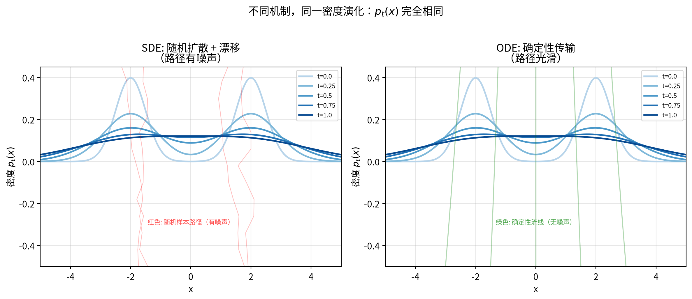

> **每步作用小结**：第1步给出 SDE 引起的密度演化方程；第2步用一个纯微积分恒等式把 Laplacian 写成散度形式；第3步把两个散度合并成"密度 $\times$ 速度"的整体输运；第4步识别出连续性方程并读出速度场；第5步说明这个 ODE 与原 SDE 产生同一个 $p_t$。没有一步是"整理即可得到"——每一步都对应一个具体的数学操作。

## 5.2 DDIM = ODE 的离散化

ODE 没有随机项（噪声系数 $\sigma = 0$）。对 VP 的 ODE 做 Euler 离散化——**这就是 DDIM**。

> **等一下，§3.6 不是说反向 SDE 里必须有随机项吗？** 会有读者到这里皱眉。回顾一下：§3.6 论证过反向 SDE 需要三层多样性——(1) $p_t$ 覆盖的区域；(2) 同一起点的轨迹分支；(3) 单样本质量（最终图片好不好看）。**去掉随机项只损失第 (2) 层**——同一噪声起点会得到同一样本，不再有轨迹分支。**第 (1) 层多样性由初始噪声保证**（不同起点仍然覆盖 $p_0$ 的全部支持），**第 (3) 层单样本质量实践中不受影响**。这就是为什么 DDIM 单样本质量不降：它放弃了同起点的分支多样性，换取确定性和快速采样。想要样本间多样性，就随机采多个起点；想要固定起点复现同一样本，就用 DDIM。这两个需求原本互斥，DDIM 把它们**解耦**了。

具体推导分三步。**目标**：从概率流 ODE 出发，推出 DDIM 的采样公式——一个没有随机项的确定性更新规则。关键是换坐标让 ODE 变成直线，然后走一步。

**第1步：代入 Tweedie**。VP 的 ODE 是 $\frac{dx}{dt} = -\frac{1}{2}x - \frac{1}{2}\nabla \ln p_t$。用 Tweedie $\nabla \ln p_t = -\varepsilon_\theta / \sigma_t$ 代入：

$$\frac{dx}{dt} = -\frac{1}{2}x + \frac{\varepsilon_\theta}{2\sigma_t}$$

**第2步：换元到 $\bar{\alpha}$ 参数化**。这一步做两件事：先说明为什么要换坐标，再做换元。

**2a：为什么要换坐标？** 第1步的 ODE 里，状态 $x_t$ 随时间收缩（$\sqrt{\bar{\alpha}_t}$ 衰减），"时间" $t$ 又和噪声水平不是线性关系。两个量都在变，看不出 ODE 的几何形状。换元的目的是**把收缩除掉、把时间换成噪声比**——让 ODE 在新坐标下显出最简单的形状。

**2b：做换元**。把状态从 $x_t$ 换成**归一化状态** $\tilde x_t = x_t/\sqrt{\bar{\alpha}_t}$（除以信号衰减系数 $a_t$，消除收缩），把时间从 $t$ 换成**归一化噪声比** $\tilde\sigma_t = \sqrt{1-\bar{\alpha}_t}/\sqrt{\bar{\alpha}_t} = b_t/a_t$（"剩余噪声与残余信号的比"）。VP 调度下 $\sigma_t = \sqrt{1-\bar{\alpha}_t} = b_t$ 是条件分布标准差。在这组新坐标下，ODE 简化为（推导见下面**换元代数细节**折叠块）：

$$\frac{d\tilde x_t}{d\tilde\sigma_t} = \varepsilon_\theta(x_t, t)$$

**关键几何观察**：**在归一化坐标 $\tilde x_t = x_t / \sqrt{\bar{\alpha}_t}$ 下，ODE 变成一条直线——速度是 $\varepsilon_\theta$，"时间"是 $\tilde\sigma_t$**。这就是 DDIM 论文里"$x_t$ 沿着某条直线走"的几何直觉的字面意思——不是隐喻，是真的直线。

**图22**：DDIM 换坐标——原始 $x$ 空间里弯曲的 ODE 轨迹，在归一化坐标下变成一条直线

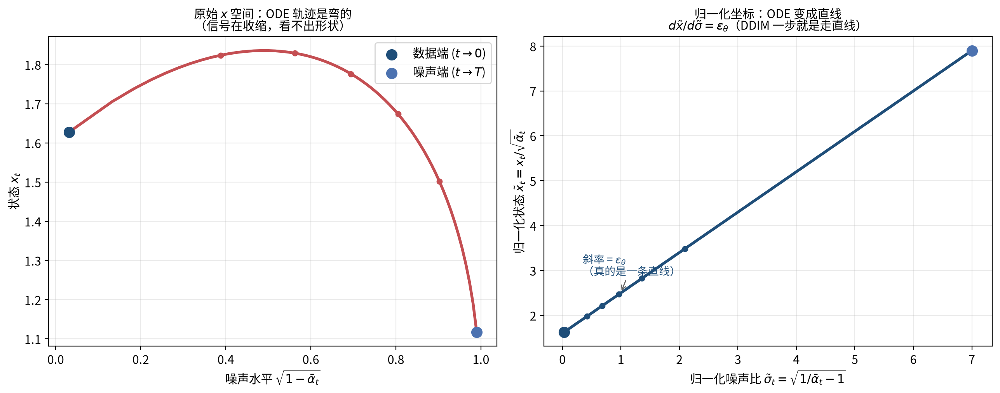

换元代数细节：5 步初等微积分，关键是分清 $\sigma$（条件 std）和 $\tilde{\sigma}$（归一化噪声比）

从第1步的 $\frac{dx}{dt} = -\frac{1}{2}x + \frac{\varepsilon_\theta}{2\sigma_t}$ 出发。**这里的 $\sigma_t$ 是 Tweedie 里出现的条件分布标准差** $\sigma_t = \sqrt{1-\bar{\alpha}_t}$（也记作 $b_t$）——是"$p(x_t\mid x_0)$ 的 std"，不是第2步引入的归一化噪声比 $\tilde\sigma_t = b_t/a_t$。$\sigma$ 和 $\tilde{\sigma}$ 必须分清。

1. 记 $a_t = \sqrt{\bar{\alpha}_t}$（连续版 $e^{-t/2}$），$b_t = \sqrt{1-\bar{\alpha}_t}$（连续版 $\sqrt{1-e^{-t}}$），$\tilde\sigma_t = b_t/a_t$。由 $a_t^2 + b_t^2 = 1$，两者只有一个自由度。
2. 目标：算 $\frac{d}{dt}(x_t/a_t)$。链式法则 $\frac{d}{dt}(x_t/a_t) = \frac{\dot x_t}{a_t} - \frac{x_t \dot a_t}{a_t^2}$。
3. 代入 $\dot x_t = -\frac{1}{2}x_t + \frac{\varepsilon_\theta}{2 b_t}$ 和 $\dot a_t = -\frac{1}{2}a_t$：漂移项 $-x/2$ 和 $-x\dot a/a^2 = x/(2a)\cdot(-1)\to +x/(2a)$ 抵消，只剩 $\frac{d(x_t/a_t)}{dt} = \frac{\varepsilon_\theta}{2 a_t b_t}$。
4. 计算 $\dot{\tilde\sigma}_t = \frac{d}{dt}(b_t/a_t)$。由 $b_t^2 = 1 - a_t^2$ 两边求导：$2 b_t \dot b_t = -2 a_t \dot a_t = a_t^2$，得 $\dot b_t = a_t^2/(2 b_t)$。代入链式：$\dot{\tilde\sigma}_t = (\dot b_t\, a_t - b_t\, \dot a_t)/a_t^2 = [a_t^3/(2b_t) + a_t b_t/2]/a_t^2 = (a_t^2 + b_t^2)/(2 a_t b_t) = \frac{1}{2 a_t b_t}$（末式用 $a_t^2 + b_t^2 = 1$）。
5. 对比 3 和 4：$\frac{d(x_t/a_t)}{dt} = \dot{\tilde\sigma}_t \cdot \varepsilon_\theta$，两边除以 $\dot{\tilde\sigma}_t\,dt$ 得 $\frac{d\tilde x_t}{d\tilde\sigma_t} = \varepsilon_\theta$。

这就是 DDIM 论文里 "$\tilde x_t$ 随 $\tilde\sigma$ 线性演化"的字面代数——都是初等微积分，关键是 $\sigma$ 和 $\tilde{\sigma}$（归一化坐标下的噪声比）必须分清。

**第3步：Euler 一步离散化**。在 $\tilde\sigma$ 坐标下沿直线走一步（$\tilde\sigma_t = b_t/a_t = \sqrt{(1-\bar{\alpha}_t)/\bar{\alpha}_t} = \sqrt{1/\bar{\alpha}_t - 1}$） $\Delta\tilde\sigma = \tilde\sigma_{t-1} - \tilde\sigma_t$：

$$\tilde x_{t-1} = \tilde x_t + (\tilde\sigma_{t-1} - \tilde\sigma_t)\,\varepsilon_\theta$$

注意 $\tilde\sigma_{t-1} < \tilde\sigma_t$（去噪方向），所以 $\Delta\tilde\sigma < 0$，Euler 步实际上是沿着 $\varepsilon_\theta$ 的反方向走——即去噪方向。

把 $\tilde x = x/\sqrt{\bar{\alpha}}$ 和 $\tilde\sigma = \sqrt{1/\bar{\alpha} - 1}$ 代回原始 $x$ 空间：

$$\boxed{x_{t-1} = \sqrt{\frac{\bar{\alpha}_{t-1}}{\bar{\alpha}_t}}\, x_t + \sqrt{\bar{\alpha}_{t-1}}\left(\sqrt{\frac{1}{\bar{\alpha}_{t-1}} - 1} - \sqrt{\frac{1}{\bar{\alpha}_t} - 1}\right)\,\varepsilon_\theta(x_t, t)} \tag{§5.2}$$

**这就是 DDIM 的确定性采样公式**（$\eta = 0$ 的特例）。它没有随机噪声项 $z$。（注意：这里的 $\eta$ 是 DDIM 的随机性强度参数——$\eta=0$ 是纯确定性 ODE，$\eta>0$ 会重新引入随机性；它和前文 Euler-Maruyama 步长、学习率的 $\eta$ 是三个不同的量，见附录《数学预备》的符号速查表。）

DDIM 不是一个独立的算法。它是概率流 ODE 的确定性离散化。DDPM 有随机性（SDE 离散化），DDIM 没有（ODE 离散化），但两者采样自同一个分布。

## 5.3 步数压缩

ODE 的好处：可以用高阶求解器，用更少的步数达到同样的精度。

| 采样器 | 类型 | 典型步数 | 原理 |
|--------|------|---------|------|
| DDPM | SDE 一阶（Euler-Maruyama） | 1000 | 每步误差 $O(\Delta t)$ |
| DDIM | ODE 一阶（Euler） | 50-100 | 每步误差 $O(\Delta t)$，无随机项所以步长可放大 |
| DPM-Solver-1 | ODE 一阶（Euler，改写形式） | 50-100 | 与 DDIM 等价 |
| DPM-Solver-2 | ODE 二阶（半隐式中点法） | 20-30 | 每步误差 $O(\Delta t^2)$ |
| DPM-Solver-3 | ODE 三阶 | 10-20 | 每步误差 $O(\Delta t^3)$ |
| Heun | ODE 二阶（梯形法则） | 30-50 | 每步误差 $O(\Delta t^2)$ |

**DPM-Solver 家族的细化**：DPM-Solver 不是单一算法，而是一个求解器家族，按数值方法的阶数分为 DPM-Solver-1/2/3。核心思想是利用扩散 ODE 的**半线性结构**（漂移项对 $x$ 线性，非线性只来自分数网络）做解析积分——线性部分精确求解，非线性部分用 Taylor 展开高阶近似。阶数越高，理论上每步误差越小，实际步数可以压得越低。DPM-Solver-3 用 10-20 步就能达到 DDIM 50 步的质量。工程上 Stable Diffusion 默认用 DPM-Solver-2 或其多步变体（DPM-Solver++），是速度和质量的甜点。^[7]^

为什么 ODE 能用高阶而 SDE 不能？因为 ODE 是确定性的，有成熟的数值方法（Runge-Kutta、Adams-Bashforth 等）。SDE 的高阶方法复杂得多，且随机噪声本身限制了精度提升。

**图23**：采样策略对比

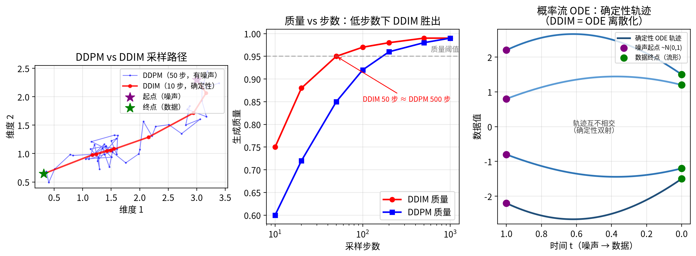

*左：DDPM（50 步，带噪声抖动）与 DDIM（10 步，平滑确定）在同一二维路径上的对比。中：质量-步数权衡（对数横轴），低步数区 DDIM 明显胜出，DDIM 50 步 $\approx$ DDPM 500 步。右：概率流 ODE 的确定性视角——4 条轨迹各自从一个噪声起点（紫，t=1）唯一地流向一个数据终点（绿，t=0），彼此互不相交，即噪声与数据之间是一一对应的确定性双射；DDIM 就是这条 ODE 的离散化。*

**进一步压缩：蒸馏**

高阶 ODE 求解器把步数从 1000 压到 20，靠的是用更高阶的 Taylor 展开逼近每步的截断误差——阶数越高每步误差越小，同样的精度需要更少的步数。还有一条更激进的路——**蒸馏**：让一个小网络直接模仿大网络多步采样的最终效果，把"逐步去噪"变成"一步到位"。

这不再是"沿着 ODE 轨迹一笔笔描"，而是"直接学习从白纸到成品的映射"。代价是可能丢失一些笔触的灵气，收益是速度提升数十倍甚至上百倍。具体技术（分布匹配蒸馏、对抗蒸馏、一致性模型）和权衡，到第9章 §9.5.2 展开。

## 5.4 三源误差分解

采样误差来自三个来源。**下面这个不等式是启发式的分解**——严格的误差上界及其常数依赖见相关文献，其中的常数 $c$ 依赖分数网络的平滑性和调度的具体形式。^[8]^^[9]^ 本文用它作为"三源如何叠加"的心智模型，不追求逐项常数的精确取值：

$$D_{KL}(p_1 \| \hat{p}_1) \lesssim \varepsilon_{\text{init}}^2 + \varepsilon_{\text{disc}}^2 + c \sum_k \eta_k\, \varepsilon_{k,\text{score}}^2$$

其中 $\eta_k$ 是第 $k$ 步的步长（SDE 和 ODE 通用）。**为什么分数误差被步长加权？** 直觉：每一步的更新量是 $\eta_k \times (\text{方向})$，方向里的分数误差 $\varepsilon_{k,\text{score}}$ 也会被放大同样的倍数——大步长把分数误差放大得更厉害，小步长则天然抑制。所以高噪声区（步长大）的分数精度比低噪声区更值钱。

| 误差源 | 来源 | 变化规律 | 控制方法 |
|--------|------|-----------|---------|
| 初始化误差 $\varepsilon_{\text{init}}$ | 初始分布与 $p_T$ 的偏差 | 随**终止时刻** $T$ 增大**指数衰减**（VP：$\propto e^{-T/2}$） | 用足够大的 $T$ |
| 离散化误差 $\varepsilon_{\text{disc}}$ | SDE/ODE 离散化的截断 | 随**离散步数** $N$ 增加而下降，阶数由数值方法决定（一阶 Euler $O(1/N)$，二阶方法 $O(1/N^2)$，$k$ 阶方法 $O(1/N^k)$） | 用高阶求解器 |
| 分数误差 $\varepsilon_{\text{score}}$ | 学到的 $s_\theta$ 与真实 $s^*$ 的偏差 | 被每步步长 $\eta_k$ 加权 | 训练更好的网络 |

> **两个"步"要分清楚**：初始化误差看 $T$（**终止时刻**，通常 $T \in [1, 4]$），离散化误差看 $N$（**离散步数**，DDPM 用 1000，DDIM 可压到 20）。两者独立——你可以用大 $T$ + 小 $N$（少而粗的采样），也可以用小 $T$ + 大 $N$（多而细）。**为什么初始化误差是指数衰减？** 因为 VP 前向 SDE 本身就是信号指数衰减的过程（$a_t = e^{-t/2}$）：任何初始分布经过 VP 前向后，信号部分以 $e^{-T/2}$ 的速率被压缩掉，剩下的噪声主导。严格说，分布距离（如 KL 散度）的衰减比信号幅值更快：信号幅值按 $e^{-T/2}$ 缩，方差（二阶矩）按 $e^{-T}$ 缩；KL 这类分布距离中，均值差贡献按 $e^{-T}$ 缩（幅值差的平方），方差差贡献更快（$e^{-2T}$ 量级），整体量级由 $e^{-T}$ 主导——但这里的直觉是"信号每过一个特征时间缩掉 $e^{-1/2}$"，用 $e^{-T/2}$ 刻画衰减的**量级**即可——这是 OU 过程的收缩性质，不是数值离散化的产物。VE 调度没有这个衰减机制，初始化误差控制起来更麻烦。

**图24**：三源误差各自随"控制旋钮"的变化

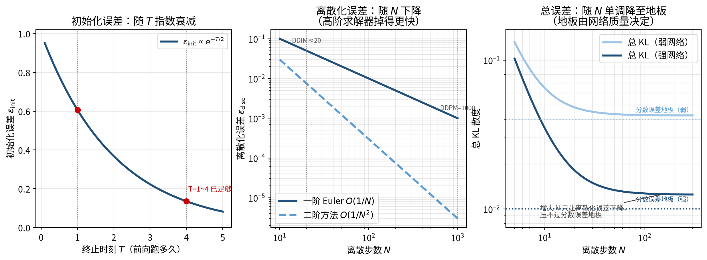

*三个误差各由一个独立的旋钮控制，故分三张子图、横轴各不相同（呼应上方"两个步要分清楚"）。左：初始化误差随终止时刻 $T$ 指数衰减（$\propto e^{-T/2}$），$T$ 取 1~4 就已足够小，通常不是瓶颈。中：离散化误差随离散步数 $N$ 幂律下降，一阶 Euler 是 $O(1/N)$、二阶方法是 $O(1/N^2)$——log-log 下都是直线，高阶方法斜率更陡（掉得更快），这正是 DDIM/DPM-Solver 能把步数从 1000 压到 20 的原因。右：把三项加起来看总 KL 随 $N$ 的变化——它**单调下降并趋于一条水平地板**，地板高度由分数误差（网络质量）决定。增大 $N$ 只能消掉离散化误差那一项，压不过地板；想降低地板只能训练更好的网络。**步数越多总误差越低（收益递减），最终停在网络学分数的精度上限。***

**实际启示**：减少步数（快速采样）主要增加离散化误差，用高阶求解器可以补回来（中图）。训练更好的网络降低分数误差地板，这才是质量天花板（右图）。初始化误差通常不是瓶颈（$T$ 够大就行，左图）。

## 5.5 步长策略

从 ODE 视角看，步长不一定要均匀：好的步长策略在"分数变化快"的区域用小步，在"分数变化慢"的区域用大步（如信噪比感知步长）。DPM-Solver 等现代求解器已经内置了好的步长策略，用户通常不需要手动调。

## 5.6 AI落地

| 场景 | 没有概率流 ODE 会怎样 |
|------|----------------------|
| 快速采样 | 无法用 20 步生成高质量图片 |
| 似然计算 | 无法评估模型对数据的拟合程度 |
| 可控编辑 | 无法沿确定性轨迹做插值 |

## 5.7 常见误解

**误解1**："DDIM 是 DDPM 的改进版。"
两者其实是两条并行的技术路线：DDIM 是概率流 ODE 的离散化，DDPM 是反向 SDE 的离散化。它们采样自同一分布，一个确定性，一个带随机性。DDIM 之所以更快，是因为 ODE 允许使用高阶求解器，而不是"改进"了 DDPM。

**误解2**："去掉随机性，生成质量会下降。"
随机性提供多样性，但确定性采样在单样本质量上往往并不逊色。实际使用中 SDE 和 ODE 各有所长：SDE 适合需要多样性的场景（想生成不同姿态的猫），ODE 适合需要确定性或快速采样的场景（同一噪声永远对应同一张图）。

## 5.8 本章回顾

**本章自检**：

**1.** 概率流 ODE 和反向 SDE 产生相同的分布，为什么？（提示：从 Fokker-Planck 方程出发，利用恒等式 $\Delta p = \nabla \cdot (p \nabla \ln p)$。）

**2.** DDIM 是怎么从概率流 ODE 推出来的？它和 DDPM 的本质区别是什么（不是步数多少）？

**3.** 采样误差的三个来源是什么？哪个随**终止时刻** $T$ 指数衰减，哪个随**离散步数** $N$ 下降（阶数取决于数值方法），哪个被步长加权？

**4（反事实・边界情况）.** 假设你训好了一个扩散模型，采样时**故意用错误的调度**——训练时用的是 VP 调度（$\bar{\alpha}_t$ 从 1 降到接近 0），采样时却用 VE 调度的公式（把噪声当作方差爆炸型来处理）。会发生什么？这个反事实揭示了训练和采样之间的什么隐藏契约？

**反事实思考**：如果**用 20 步跑反向 SDE**（不是 ODE）会怎样？答案是**生成质量显著下降**。关键在于 SDE 的 Euler-Maruyama 离散化误差随步长按**平方根**增长：Euler-Maruyama 的全局误差是 $O(\sqrt{\Delta s}) = O(1/\sqrt{N})$（$N$ 是步数）。从 1000 步压到 20 步（步长增大 50 倍），误差放大为原来的 $\sqrt{50} \approx 7$ 倍。根源是随机项：每一步都注入一个**新的**独立噪声，它的单步涨落尺度是 $\sigma \sqrt{\Delta s}$——步长越大，单步注入的噪声越强，而这些噪声是"新"的，无法被后续步骤抵消，只会一路累积。漂移项虽然也随步长线性增大（$\mu \Delta s$），但它是指向数据方向的，能被分数校正；随机项却在每一步都把人往随机方向推一把。同样的 20 步预算给 ODE 就完全没问题——因为 ODE 没有随机项，误差只来自数值积分的截断（随步长线性增长 $O(\Delta s)$，且可用高阶求解器进一步压到 $O(\Delta s^p)$）。这个反差告诉我们：**"随机性"这个词在扩散模型里承担两个角色**——训练时它保证多样性（不同噪声起点生成不同样本），采样时它是**可省略的**（DDIM 已经证明去掉它样本质量不降）。这个"训练必需、采样可选"的不对称，正是加速扩散采样的所有算法（DDIM、DPM-Solver、一致性模型）的共同起点。

SDE 有随机性 → 能去掉吗？→ 能：概率流 ODE\
→ Fokker-Planck → 恒等式 $\Delta p = \nabla \cdot (p\nabla \ln p)$ → 连续性方程 → ODE\
→ DDIM = ODE 的离散化（$\sigma=0$，确定性）\
→ ODE 允许高阶求解器：50步 vs 1000步\
→ 误差三源：初始化（衰减）+ 离散化（累积）+ 分数（加权）\
→ 步长策略：信噪比感知 > 均匀步长

**未解问题**：到目前为止，扩散模型只会**无差别地生成"符合训练分布的图片"**——你无法告诉它"画一只戴帽子的猫"。可现实中几乎所有应用都需要**条件生成**：文字→图片、边缘图→写实照、参考图→风格迁移。怎么把"用户意图"注入到分数里？改动会有多大——是要重训整个网络，还是只加一个小模块？第6章会给出一套统一视角：一类手段（CFG、分类器引导、奖励微调）出自**同一个 KL 正则化目标**，另一类手段（ControlNet、LoRA）是**改模型/加模块**——每类内部有统一结构，两类之间按需组合。

 * * * 

# 第6章：条件控制与高效微调

> 条件控制分两类思路——**引导类**（CFG、分类器引导、奖励微调）是同一个 **KL 正则化目标**的不同实例，在"最大化条件对数似然"和"靠近原始模型分布"之间找平衡；**模型类**（ControlNet、LoRA）通过改结构/加模块让模型直接学会听条件。CLIP 把文字变成向量作为条件输入。

> **本章路线**：先看 CLIP、CFG 与统一框架，再看 LoRA、ControlNet 与 Stable Diffusion 端到端案例，最后落地、辨误解、收束。

> **核心推导**：
> 1. 条件生成把用户意图注入分数。
> 2. CFG 出自同一个 KL 正则化目标。
> 3. ControlNet/LoRA 是改模型或加模块的另一类路线。

> **动笔前自检**：①什么是条件概率？②为什么无条件生成不够用？

**回望**：前五章建立了一个**无条件**生成器——扔一个噪声进去，它给出一张符合训练分布的图片。第 5 章的 ODE 加速换的是**走法**——同一个分数，只改怎么沿它走；本章要给分数**加一个新输入**：让它除了"数据长什么样"，还听得懂"用户想要什么"。两者动的是数学结构的不同部位，因此正交、可任意叠加——DDIM+CFG、DPM-Solver+ControlNet 都能直接组合。真实需求几乎都是**有条件**的："画一只穿宇航服的柴犬"、"用梵高风格重画这张照片"、"照着这张边缘图生成新场景"。上一章的分数 $\nabla \ln p_t(x)$ 只知道"数据长什么样"，不知道"用户想要什么"。这一章把**"用户意图"**注入到分数里——分数从 $\nabla \ln p_t(x)$ 升级为 $\nabla \ln p_t(x \mid c)$。这一步不改任何底层动力（反向 SDE、ODE、训练目标全部原封不动），只是往分数上叠加**条件信息**。同一个数学结构，长出新的能力。

## 6.1 生活类比：画家怎么听懂甲方的“感觉不对”？

画家（扩散模型）自己会画画（生成图片），但甲方（用户）有要求："画一只猫"、"用梵高风格"、"左边有棵树"。

怎么让画家听甲方的话？

- **分类器引导（CG）**：甲方站在旁边指方向——"往猫那边偏一点"
- **无分类器引导（CFG）**：画家同时画两张——一张听甲方的，一张自由发挥——然后把差距放大
- **ControlNet**：给画家一张草图，让他照着画
- **LoRA**：给画家一本风格手册，他快速学会新风格

## 6.2 CLIP：把文字变成向量

在讲引导之前，先解决一个问题：怎么把"一只猫"这个文字条件输入给模型？

**CLIP（Contrastive Language-Image Pre-training）** 训练一个文本编码器和一个图像编码器，让"猫的图片"和"猫的文字描述"在向量空间里靠近。训练好后，文本编码器能把任意文字变成一个向量 $c$，这个向量携带了语义信息。

扩散模型通过**交叉注意力**（cross-attention）接收这个向量：文本向量 $c$ 作为键 $K$ 和值 $V$，图片特征作为查询 $Q$。每一层都让图片特征"看一眼"文本条件——"文本说画猫，那这里应该是猫的轮廓"。

这就是文生图的基础：文字 → CLIP 编码 → 向量 $c$ → 交叉注意力 → 条件生成。

**图25**：文生图的条件通路——文字经 CLIP 编码为向量 $c$，通过交叉注意力注入图片生成

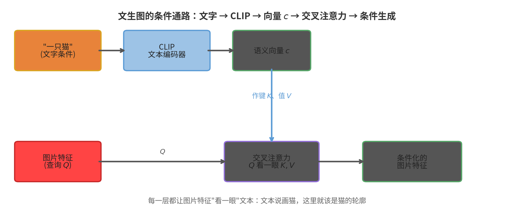

## 6.3 CFG 引导

**无分类器引导（Classifier-Free Guidance, CFG）**是当前图像生成产品中最常用的条件控制方法。

训练时，网络同时学习条件和无条件两种模式：以一定概率（如10%）丢弃条件 $c$，让网络也学会无条件生成。推理时，把两者的差距放大：

$$\boxed{\hat{\varepsilon} = \varepsilon_{\text{unc}} + w\,(\varepsilon_{\text{cond}} - \varepsilon_{\text{unc}})} \tag{§6.3}$$

> **为什么必须是同一个网络？** 训练两个独立的网络（一个专学有条件，一个专学无条件）不行吗？**实践中不行**。CFG 依赖 $\varepsilon_{\text{cond}} - \varepsilon_{\text{unc}}$ 这个**差向量**表达"条件方向"。这个差向量的数学合法性来自贝叶斯翻转：$\nabla_x \ln p(c|x) = \nabla_x \ln p(x|c) - \nabla_x \ln p(x)$，要求两个 $\nabla \ln p$ 对应**同一个 $p$** 的两个条件化。如果用两个独立网络，它们各自近似的是两个不同的隐含分布 $p^{(1)}$ 和 $p^{(2)}$，差向量 $\nabla \ln p^{(1)} - \nabla \ln p^{(2)}$ 不再对应 $\nabla \ln p(c|x)$，而是混入了两个网络各自的近似误差。**数学上**，如果两个独立网络都完美收敛到同一个 $p$ 的条件/无条件边缘，贝叶斯翻转仍然成立。**实践中**，两个独立网络不可能完美收敛到同一个分布——它们的训练动态、初始化、优化轨迹都不同，近似误差不可控地混入差向量。共享参数从工程上保证了两个输出对应同一个 $p$——参数对齐是这个数学要求的工程副产物，不是反过来。

| 符号 | 含义 |
|------|------|
| $\varepsilon_{\text{unc}}$ | 无条件预测（自由发挥） |
| $\varepsilon_{\text{cond}}$ | 条件预测（听甲方） |
| $w$ | 引导强度（$w=1$ 是纯条件，$w>1$ 是放大条件） |

**直觉：$\varepsilon_{\text{cond}} - \varepsilon_{\text{unc}}$ 是"条件方向"——条件告诉你往哪偏。$w > 1$ 把这个方向放大，即增强条件的影响。**

**数字演示**：$\varepsilon_{\text{unc}} = [0.3, 0.2]$，$\varepsilon_{\text{cond}} = [0.5, 0.1]$，条件方向 $\Delta = \varepsilon_{\text{cond}} - \varepsilon_{\text{unc}} = [0.2, -0.1]$。

| $w$ | $\hat{\varepsilon}$ 计算 | 结果 | 含义 |
|:---:|:---|:---|:---|
| $w=0$ | $\varepsilon_{\text{unc}} + 0 \cdot \Delta$ | $[0.3, 0.2]$ | 忽略条件，纯无条件生成 |
| $w=1$ | $\varepsilon_{\text{unc}} + 1 \cdot \Delta$ | $[0.5, 0.1] = \varepsilon_{\text{cond}}$ | 就是条件模型输出，**无引导放大** |
| $w=3$ | $\varepsilon_{\text{unc}} + 3 \cdot \Delta$ | $[0.9, -0.1]$ | 条件方向放大 3 倍，SD 常用区 |
| $w=7.5$ | $\varepsilon_{\text{unc}} + 7.5 \cdot \Delta$ | $[1.8, -0.55]$ | Stable Diffusion 默认值 |
| $w=10$ | $\varepsilon_{\text{unc}} + 10 \cdot \Delta$ | $[2.3, -0.8]$ | 强引导，接近坍塌区 |

**关键观察**：
- $w=1$ 时 $\hat{\varepsilon} = \varepsilon_{\text{cond}}$——**CFG 公式在 $w=1$ 处退化成条件模型**，这是理解"$w$ 到底放大了什么"的定盘星。
- $w>1$ 部分是**外推**（超出 $\varepsilon_{\text{unc}}$ 和 $\varepsilon_{\text{cond}}$ 两个数据点连线的延伸区），$w<1$ 部分是**内插**。CFG 之所以有效，是它敢外推——用两个点定义一条方向线，然后沿这条线往外冲。
- 分量变化不对称：第一维从 0.3（$w=0$）→ 2.3（$w=10$）放大 ~8$\times$，第二维从 0.2 → -0.8 甚至**翻符号**——这就是模式坍塌的机制：当 $|w\Delta| \gg |\varepsilon_{\text{unc}}|$，$\hat{\varepsilon}$ 被拉出训练数据的典型分布区，落入网络从未见过的"高强度条件"死角。

$w$ 越大，条件方向被放得越厉害。但 $w$ 太大会导致模式坍塌——所有生成结果都很像（都是"最像猫的猫"，缺乏品种和姿态的多样性）。通常 $w = 3 \sim 8$ 是好的平衡点。

**图26**：CFG 是噪声空间里的外推——沿"条件方向"这条线冲出去，$w$ 控制冲多远

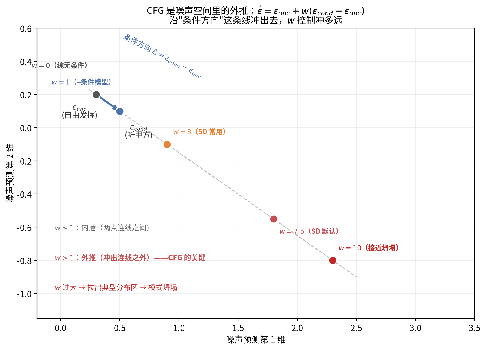

## 6.4 统一框架：KL 正则化奖励倾斜（按条件给原始分布重新加权）

CFG、分类器引导、奖励微调都可以统一到一个 KL 正则化的奖励最大化框架：

$$\boxed{q^* = \arg\max_q \left[\mathbb{E}_q[\ln p(c \mid x)] - \frac{1}{w}\, D_{KL}(q \| p_0)\right]} \tag{§6.4}$$

含义：在"最大化条件对数似然"和"靠近原始模型 $p_0$"之间找平衡。$w$ 控制两者的相对权重——$w$ 越大，越强调条件，越远离 $p_0$。

**这个目标的最优解正好对应 CFG 的引导公式**。下面分三步推导，每步只做一件事：

**第 1 步：求最优解 $q^*$**。目标函数对 $q(x)$ 求最优，结果是 $q^*(x) \propto p_0(x) \cdot p(c|x)^w$。**直觉**：原始分布 $p_0$ 被"条件似然的 $w$ 次方"重新加权——$w$ 越大，高条件概率的样本权重越高。这和统计物理的 Boltzmann 分布同构：$p_0$ 是先验，$p(c|x)^w$ 是似然项的指数倾斜。（这一步的严格推导需要变分法——对 $q$ 求导令为零，用拉格朗日乘子处理 $\int q = 1$ 的约束。结论的形式可以这样理解：$q^*$ 是 $p_0$ 乘以一个"条件加权因子" $p(c|x)^w$，再归一化。$w=0$ 时不加权，$q^* = p_0$；$w$ 越大越偏向高条件概率的样本。）

取对数梯度：$\nabla \ln q^* = \nabla \ln p_0 + w\, \nabla \ln p(c \mid x)$。

**第 2 步：贝叶斯翻转——把 $p(c|x)$ 换成 $p(x|c) - p(x)$**。CFG 的实际公式里没有分类器 $p(c\mid x)$，它算的是条件分数 $\nabla \ln p(x\mid c)$ 和无条件分数 $\nabla \ln p_0$ 的差。两者靠贝叶斯等价：

$$\ln p(c \mid x) = \ln p(x \mid c) + \ln p(c) - \ln p(x)$$

对 $x$ 取梯度，$\ln p(c)$ 是常数（$c$ 已给定，与 $x$ 无关），梯度为零：

$$\nabla_x \ln p(c \mid x) = \nabla_x \ln p(x \mid c) - \nabla_x \ln p(x) = \nabla_x \ln p(x \mid c) - \nabla_x \ln p_0(x)$$

**这一步是 CFG 和分类器引导等价的关键**——分类器引导直接学 $\nabla \ln p(c\mid x)$（要训练一个独立的分类器网络），CFG 用无条件-条件分数之差**间接**得到同一个量，省掉分类器。

**第 3 步：代回并换成噪声形式**。这一步做三个操作，每个只做一件事：

**3a：代回**。把第 2 步结果代入第 1 步的对数梯度：

$$\nabla \ln q^* = \nabla \ln p_0 + w[\nabla \ln p(x\mid c) - \nabla \ln p_0] = (1-w)\nabla\ln p_0 + w\, \nabla\ln p(x\mid c)$$

**3b：Tweedie 换元**。用 $\nabla \ln p = -\varepsilon/\sigma_t$（分数和噪声的等价关系，§2.4）把分数换成噪声：$\nabla\ln p_0 = -\varepsilon_{\text{unc}}/\sigma_t$，$\nabla\ln p(x|c) = -\varepsilon_{\text{cond}}/\sigma_t$。代入：

$$\nabla \ln q^* = -\frac{1}{\sigma_t}\left[(1-w)\varepsilon_{\text{unc}} + w\,\varepsilon_{\text{cond}}\right]$$

**3c：两边乘 $-\sigma_t$**。分数方向反过来就是噪声方向，得到 $(1-w)\varepsilon_{\text{unc}} + w\,\varepsilon_{\text{cond}}$，就是 (§6.3) 的 CFG 公式。**CFG 的 $w$ 就是 KL 正则化目标里的引导强度参数，两者数学上完全一致**——不是"扮演类似角色"，是同一个变量在两个公式里的两个名字。

| 特例 | 奖励 $r(x)$ | 引导强度 | 效果 |
|------|------------|---------|------|
| CFG | $\ln p(c \mid x)$ | $w$ | 放大条件方向 |
| 分类器引导 | $\ln p(y \mid x_t)$ | 梯度强度 $\lambda$ | 梯度推向类别 $y$ |
| 奖励微调 | 人类偏好 / 美学评分 | $\beta$（RLHF 记号） | 生成更"好看"的图片 |

三个特例的**引导强度参数**（$w$、$\lambda$、$\beta$）分别按各自领域惯例命名，但在 KL 框架下角色完全一致：控制"偏离原始模型"的程度。数值越大，越强调条件/奖励，越忽略原始分布的多样性。数值太大都会导致**模式坍塌**（所有生成都很像）；太小则条件效果不明显（太靠近原始模型）。

> **符号防混淆**：这里的 $\lambda$ 是分类器引导的梯度强度，与 §1.4 OU 过程的漂移系数 $\lambda$（$\lambda=-1/2$）无关；这里的 $\beta$ 是 RLHF 的 KL 正则化强度，与 DDPM 的噪声调度 $\beta_t$ 无关。希腊字母不够用是物理文献的常态，本文每个多义符号在首次出现处都会标注。

RLHF 中 LLM 用 $\beta$，图像扩散用 $w$，只是命名差异——数学结构是同一个 KL 正则化优化问题。**这有什么用？** 它说明 CFG 不是独立发明的技巧，而是"在原始分布上加条件奖励"这个通用框架的自然结果。只要定义好奖励函数 $r(x)$（CFG 的 $r = \ln p(c|x)$，分类器引导的 $r = \ln p(y|x_t)$，RLHF 的 $r=$ 人类偏好评分），同一套公式就能统一三种看似不同的技术。实践意义：想设计新的引导方式，不需要从头发明——只需定义 $r(x)$，套进 KL 正则化框架，引导公式自动给出。

## 6.5 LoRA

**低秩适配（Low-Rank Adaptation, LoRA）**：不微调整个模型，只训练一个低秩增量。

$$W = W_0 + B\,A, \quad B \in \mathbb{R}^{m \times r},\; A \in \mathbb{R}^{r \times n},\; r \ll \min(m, n)$$

原始参数 $mn$ 个，LoRA 参数 $r(m+n)$ 个。比如 $m=n=1024, r=8$：原始约 105 万参数（$1024^2 = 1{,}048{,}576$），LoRA 只需 1.64 万（$8 \times 2048 = 16{,}384$）——压缩到原来的约 1/64。

**为什么有效？** 微调时权重的变化 $\Delta W$ 通常是低秩的（只改变了少数几个"方向"），所以用 $B\,A$ 就能很好地近似。LoRA 冻结原始权重 $W_0$，只训练 $B$ 和 $A$，既省显存又快。

实践中的用法：基础模型生成通用图片，LoRA 提供特定风格（水墨画、赛博朋克、某画师风格）。切换风格只需换一个几MB的 LoRA 文件，不用重新加载整个模型。

## 6.6 ControlNet

ControlNet 给扩散模型加一个"条件分支"：输入草图/深度图/边缘图，通过零卷积（初始权重为零的卷积层）注入主网络，精确控制生成结构。

零卷积的关键设计：初始时输出全零，不影响预训练模型的行为。随着训练进行，ControlNet 逐渐学会"在什么位置注入什么信息"。这种设计保证 ControlNet 不会破坏基础模型已经学好的能力。

**图27**：条件控制与微调

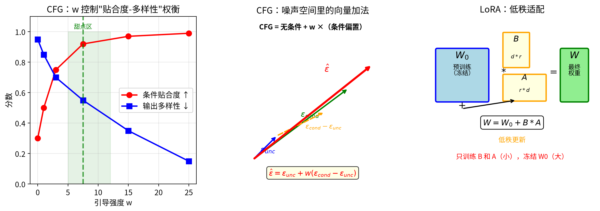

**图28**：ControlNet 与 CFG 对比

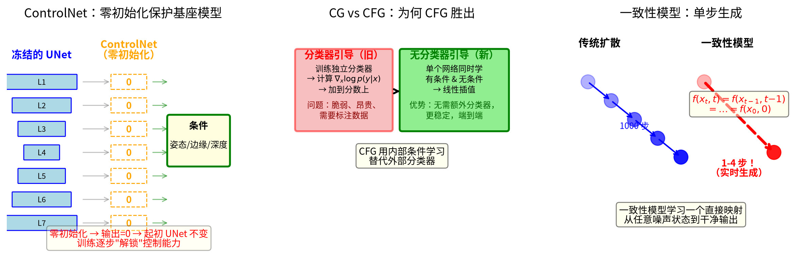

## 6.7 案例：Stable Diffusion——从提示词到成品

> **本节角色**：Ch1–Ch6 讲了六件事——加噪（Ch1）、分数（Ch2）、反向 SDE（Ch3）、训练目标（Ch4）、快速采样（Ch5）、条件控制（Ch6）。它们在真实产品里怎么装配成一台"输入文字、输出图片"的机器？本节以 **Stable Diffusion v1.5** 为例做端到端拆解——不是新知识，而是把 Ch1–Ch6 的所有零件**在一个真实系统里定位一遍**。理解这一节，前六章的"零散工具"会在你脑子里合成一台可运行的机器。^[15]^

> **一句话**：SD v1.5 = **CLIP 文本塔**（Ch6）+ **VAE 编解码器**（Variational Autoencoder，变分自编码器，§9.2 潜空间）+ **U-Net 分数网络**（Ch2/Ch4）+ **交叉注意力条件注入**（Ch6）+ **DDIM/PLMS 采样器**（Pseudo Linear Multistep，§5）+ **CFG 引导**（Ch6）。

**输入到输出：拆成 6 个阶段**

以提示词 `"a photo of an astronaut riding a horse, cinematic lighting"` 为例，SD v1.5 生成一张 $512\times512$ 图片的完整流水线：

| 阶段 | 组件 | 输入 → 输出 | 用到的章节 |
|:---|:---|:---|:---|
| ① 文本编码 | CLIP text encoder (Transformer) | 提示词 → 77×768 文本嵌入 $c$ | §6.2 |
| ② 潜空间初始化 | 随机采样 | $z_T \sim \mathcal{N}(0, I) \in \mathbb{R}^{4 \times 64 \times 64}$ | §1.5 |
| ③ 迭代去噪 | U-Net $\varepsilon_\theta(z_t, t, c)$ | $z_T \to z_{T-1} \to \cdots \to z_0$（50 步） | §2.2, §4.2 |
| ④ 每步引导 | CFG 混合 | $\hat{\varepsilon} = \varepsilon_\theta(z_t, t, \varnothing) + w[\varepsilon_\theta(z_t, t, c) - \varepsilon_\theta(z_t, t, \varnothing)]$ | §6.3 |
| ⑤ 每步采样 | DDIM/PLMS 求解器 | $\hat{\varepsilon} \to z_{t-1}$ | §5.2 |
| ⑥ 解码到像素 | VAE decoder | $z_0 \in \mathbb{R}^{4 \times 64 \times 64} \to x_0 \in \mathbb{R}^{3 \times 512 \times 512}$ | §9.2 潜扩散 |

**每一阶段做了什么、动用了前几章的哪个概念**：

**① 文本编码**：CLIP 训练时把"猫图片"和"猫文字"拉近（§6.2）。SD 冻结 CLIP 权重，只用它的 text encoder 把提示词映射成 77 个 token 的 768 维嵌入（77 是 CLIP 的最大 token 数）。这个 $c \in \mathbb{R}^{77 \times 768}$ 就是"文字意图"的向量表示。

**② 潜空间初始化**：不在 $512\times512\times3 = 786432$ 维的像素空间做扩散，而是在 $4\times64\times64 = 16384$ 维的**潜空间**（48$\times$ 压缩，见 §9.2）。$z_T \sim \mathcal{N}(0, I)$——从纯噪声开始，正如 §1.5 说的"高斯是最大熵、最容易采样"。

**③ 迭代去噪**：U-Net $\varepsilon_\theta$ 就是 Ch2/Ch4 讲的分数网络的**噪声预测参数化**（Tweedie 恒等式 §2.4：$\varepsilon = -\sigma_t \cdot s$）。训练目标就是 §4.2 的 $\|\varepsilon - \varepsilon_\theta(z_t, t, c)\|^2$。**关键：U-Net 里的每一个 attention block 都做交叉注意力**——查询 $Q$ 来自 U-Net 中间层的图像特征，键值 $K, V$ 来自文本嵌入 $c$。这就是 §6.2 说的"图像特征查询文本语义，哪里像文本就多取哪里的值"——文本条件在 U-Net 的每一层反复注入，不是只在起点注入一次。

**④ 每步 CFG**：SD 训练时 10% 概率把 $c$ 替换成空字符串 $\varnothing$，同一个网络既学条件也学无条件（§6.3）。采样时每步做**两次 U-Net 前向**（一次带 $c$、一次带 $\varnothing$），按 CFG 公式混合：$w = 7.5$ 是 SD 默认值（§6.3 说的 3-8 平衡区）。CFG 让本来是"符合数据分布的猫"的图变成"最像宇航员骑马的图"。

**⑤ 每步采样**：SD 支持多种求解器——DDIM（§5.2 讲过：概率流 ODE 的确定性离散化）、PLMS（§5.3 高阶求解器家族的伪线性多步法）、DPM-Solver（§5.3 同家族，步数更少的更快变体）。默认 PLMS 50 步。三者都是**同一概率流 ODE 的不同离散化**（§5.1-5.3），区别只在每步怎么近似积分——DDIM 用一步 Euler，PLMS/DPM-Solver 用多步/高阶修正，步数更省。

**⑥ VAE 解码**：$z_0$ 是潜空间清晰点，用预训练的 VAE decoder 映射回像素空间——**这一步跟扩散无关，是 §9.2 潜扩散的边界补丁**（先训 VAE 压缩数据，再在潜空间训扩散）。

**Ch1–Ch6 的零件全部在场**：

| 前六章的概念 | 在 SD 里的落地 |
|:---|:---|
| §1.2 闭式跳步公式 | 训练时任意采样 $t$ 快速构造 $z_t = \sqrt{\bar{\alpha}_t}z_0 + \sqrt{1-\bar{\alpha}_t}\varepsilon$ |
| §1.5 高斯噪声选择 | $z_T \sim \mathcal{N}(0, I)$ 起点 |
| §2.4 Tweedie 等价 | U-Net 输出 $\varepsilon$ 而非 $s$（工程习惯） |
| §3.3 VP 反向 SDE | SD 用 VP 调度（$\bar{\alpha}_t$ linear），采样器基于反向 SDE 离散化 |
| §4.2 $\varepsilon$-MSE 训练目标 | 训练损失 $\mathbb{E}\|\varepsilon - \varepsilon_\theta(z_t, t, c)\|^2$ |
| §4.4 随机采样 $t$ | 训练时 $t \sim \text{Uniform}(1, 1000)$ |
| §5.2 DDIM | 采样器之一，$\eta=0$ 时是确定性 ODE |
| §5.3 高阶求解器 | PLMS/DPM-Solver 让 50 步 → 20 步 |
| §6.2 CLIP 交叉注意力 | 文本条件注入 U-Net 每一层 |
| §6.3 CFG | 采样时 $w=7.5$ 引导 |

**每张 SD 图片经历了 50 次这个循环**：文本嵌入不变，$z_t$ 一步步从噪声去噪到清晰，最后 VAE 解码成像素。**没有一个组件是新的**——每一块都在 Ch1-Ch6 里讲过。SD 的价值不在发明新算法，而在把这些零件按正确顺序、正确规模装配起来，并首次工业化开源。

**读者思考题**：SD v3（2024）用 **MM-DiT + Rectified Flow Matching**（§9.5.6）替换了 U-Net + DDPM，采样从 50 步降到 4-8 步的低质量快速档——快但保不住 SOTA 质量；要保住 SOTA 质量仍需 20-40 步，见 §9.5.6。**它们与 SD v1.5 相比，改的是"技法层"还是"工具层"？** 提示：DiT 是工具（Transformer 替换 U-Net），RFM 是技法（学速度场而非学分数）——§9.1 的"技法 $\times$ 工具"框架在 SD 这条产品线上有了字面对应。

## 6.8 AI落地

| 场景 | 没有条件控制会怎样 |
|------|-------------------|
| 文生图 | 输入文字但模型生成随机图片 |
| 图生图 | 无法基于输入图片做修改 |
| 风格定制 | 无法用少量样本学会新风格 |
| 结构控制 | 无法指定构图、姿态、边缘 |

## 6.9 常见误解

**误解1**："引导强度 $w$ 越大越好。"
$w$ 越大，条件相关性越高（更像猫），代价是多样性和真实感下降（所有猫都长一样，还可能出现不自然的细节）。$w = 3 \sim 8$ 通常是好的平衡点。

**误解2**："LoRA 会降低模型质量。"
LoRA 只在原始权重上叠加一个低秩增量，原始能力得以保留。只要增量训练得当，质量几乎无损。但如果 LoRA 数据太少或学习率过高，增量确实可能"干扰"到原始能力。

**误解3**："CFG 需要一个额外的分类器。"
这正是"无分类器"的字面含义。CG（分类器引导）需要独立的分类器网络，CFG 则通过同时训练条件和无条件模式省去了分类器。

## 6.10 本章回顾

**本章自检**：

**1.** CFG 的引导强度 $w$ 太大会有什么问题？KL 正则化框架中的 $\beta$ 和 CFG 的 $w$ 扮演什么类似角色？

**2.** KL 正则化框架如何统一 CFG、分类器引导和奖励微调？三者的奖励函数分别是什么？

**3.** CLIP 在文生图中起什么作用？交叉注意力如何把文本向量注入到图片生成过程中？

**4（反事实・边界情况）.** CFG 的公式是 $\hat{\varepsilon} = \varepsilon_{\text{unc}} + w(\varepsilon_{\text{cond}} - \varepsilon_{\text{unc}})$。如果你把 $w$ 设成**负数**（比如 $w = -1$）会发生什么？这在 KL 正则化框架下对应什么优化问题？

**5（迁移・图像编辑）.** 你要做"图像编辑"：给模型一张原图"猫坐在沙发上"，要求改成"猫坐在海滩上"，但**保留猫的姿势和毛色**。用 CFG 公式 $\hat{\varepsilon} = \varepsilon_{\text{unc}} + w(\varepsilon_{\text{cond}} - \varepsilon_{\text{unc}})$，你会怎么设计条件 $c$ 和引导强度 $w$ 来同时做到"改背景"和"留主体"？
**6（边界・低秩假设）.** LoRA 的低秩假设在什么条件下会失效？如果微调需要大幅改变权重（不止少数几个方向），LoRA 会怎样？

**反事实思考**：如果 CFG 的引导强度 $w$ **无限增大**会怎样？把 $w$ 从 5 推到 50，你会看到生成结果变成"**极致猫**"——每张图都是同一种姿态、同一种花色、同一个角度的"最像猫的猫"。这不是 bug，而是 KL 框架的直接推论：$w$ 越大，越强调"最大化条件对数似然"，越忽略"靠近原始分布"这一约束。当 $w \to \infty$ 时，生成结果会逐渐收敛到单一模式（条件下概率最高的那一点）——就像画家只盯着一种颜色反复涂抹，画面失去了丰富的层次。这告诉我们：**引导不是越强越好，它本质上是在做"多样性 vs 相关性"的显式取舍**——同一个数学结构，也解释了为什么 RLHF 里 $\beta$ 太小会让语言模型丧失多样性。

怎么指定生成内容？→ 条件控制\
→ CLIP：文字 → 向量 → 交叉注意力注入\
→ CFG：放大条件与无条件的差距（$w=3\sim8$）\
→ KL 正则化统一框架：CFG / CG / 奖励微调都是特例\
→ LoRA：低秩增量，参数降到原来的约 1/64\
→ ControlNet：零卷积注入，精确结构控制

**未解问题**：本章处理的所有条件（文字、类别、草图、风格）都建立在一个共同前提上——**数据本身是连续的**（图片的像素、潜在空间的向量）。可是文字、代码、蛋白质序列这类数据的最小单元是**离散的 token**，加高斯噪声在它们身上根本没有意义。整套 SDE 语言在离散数据面前会失效吗？如果失效，我们前六章建立的分数、Tweedie、反向动力——是不是全部要重来？下一章会给出答案：**结构可以完全平行，只是需要换一套数学语言**。

 * * * 

# 第7章：离散扩散——当微积分失效时

> 当数据是离散 token 时，SDE 换成连续时间马尔可夫链（CTMC），分数换成比率分数，但整体结构完全平行——前向/反向/Tweedie/训练都有对应。

> **本章路线**：先看离散扩散的动机、前向反向、比率分数与掩码扩散，再看连续与离散对照、数字演示，最后落地与收束。

> **核心推导**：
> 1. 离散数据不能直接加高斯噪声。
> 2. 比率分数是离散版的“方向”。
> 3. 掩码扩散是离散扩散的重要实例。

> **动笔前自检**：①文字为什么不能直接加高斯噪声？②概率质量函数和概率密度有什么区别？

**回望**：前面六章，围绕**连续场景**（图像、视频）建立了完整的扩散框架。但现实世界还有大量不是由像素构成的数据——文字、代码、DNA 序列，它们的最小单元是**离散的 token**。前六章的所有数学工具——SDE、分数、Tweedie、反向动力、ODE、CFG——都依赖一个隐藏前提：**数据在连续空间里**。加噪要连续、梯度要连续、密度要有解析导数。这一章要检验一件事：当"连续"这个地基被抽掉，前面搭建的整套框架能不能**换一套语言重新表达出来**？答案会告诉我们：这个框架是**依赖连续微积分**，还是依赖更抽象的**"用马尔可夫过程学习分布"**这套结构？

## 7.1 为什么需要离散扩散

图片的像素是连续实数，可以加高斯噪声。但文字的 token 是离散的——"猫"和"狗"之间没有"半猫半狗"。

加高斯噪声在 token 上没有意义，前向过程的"加噪"要换成**离散跳变**：每一步让 token 以一定概率跳到另一个状态。跳去哪里，有两种主流设计（都属于 §7.2 的通用转移核，由 D3PM 系统提出）。^[47]^

- **吸收态（掩码）**：token 跳向一个特殊的 `[M]`（空白）且不再变回，逐步把序列擦成全 `[M]`——这就是离散版的"纯噪声"。因为最简单、且反向天然对应"填空"，它是目前语言模型里**最常用**的一支，后面几节都围绕它展开。
- **均匀跳变**：token 以一定概率跳成词表里**任意另一个 token**（"猫"可能变"桌上"），终点是词表上的均匀分布。它不引入 `[M]` 这个额外状态，更接近连续高斯"抹成无信息分布"的味道。

两支共享同一套 CTMC 数学（§7.2），差别只在转移核的形状。下文的推导对两支都成立，只在需要具体例子时用掩码。

>类比：想象一个填空游戏。前向过程是老师逐字擦掉你写的句子，最后全部变成空白；反向过程是你根据上下文猜被擦掉的字。掩码扩散就是这个游戏的精确数学化（均匀跳变则像老师不是擦掉、而是把字随机改错，你再逐步改回来）。

**图29**：掩码扩散过程

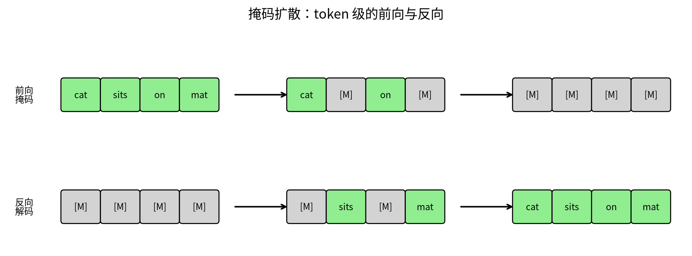

前向（上排）："cat sits on mat" → "cat [M] on [M]" → "[M] [M] [M] [M]"。反向（下排）：从全掩码逐步揭开，恢复原始序列。

## 7.2 前向与反向：离散版

前向过程是一个**连续时间马尔可夫链（CTMC）**。CTMC 是什么？回忆连续扩散里，前向 SDE 在每个时刻"加一点高斯噪声"。离散版不能加噪声（token 之间没有中间值），改成"以一定概率跳到另一个状态"。**转移核** $P^\rightarrow(x \to x')$ 就是"从状态 $x$ 跳到 $x'$ 的速率"——它是 SDE 的离散对应物：SDE 用 $f\,dt + g\,dB$ 描述连续漂移和扩散，CTMC 用 $P^\rightarrow$ 描述离散跳变。

掩码扩散（§7.4）是最简单的例子：每个 token 以速率 $\beta_t$ 被替换成 `[M]`——这就是转移核 $P^\rightarrow(x \to \texttt{[M]}) = \beta_t$。

反向转移核由贝叶斯给出：

$$\boxed{P^\leftarrow(x' \to x) = \frac{p_k(x)\, P^\rightarrow(x \to x')}{p_{k+1}(x')}} \tag{§7.2}$$

**直觉**：反向转移问的是"已知现在在 $x'$，上一步最可能在哪？"贝叶斯给出答案：$P^\leftarrow(x' \to x) \propto p_k(x) \cdot P^\rightarrow(x \to x')$——**先验** $p_k(x)$ 是"上一步状态 $x$ 的边缘概率（出现得多不多）"，**似然** $P^\rightarrow(x \to x')$ 是"从 $x$ 能跳到 $x'$ 吗"，除以 $p_{k+1}(x')$ 归一化。这和连续情况的反向 SDE 完全平行：连续反向需要分数 $s = \nabla \ln p$ 指方向，离散反向需要转移核的贝叶斯反转选跳向。

> **关于时间的说明**：为便于展示，上面把前向写成离散时刻 $k, k+1$（$p_k$ 是 $k$ 时刻的分布），反向核也按离散时间写。但 §7.2 开头说过前向本质上是**连续时间马尔可夫链（CTMC）**——连续时间版本下，$P^\rightarrow(x \to x')$ 是"每单位时间的跳变速率"而非一步概率，反向核也要换成速率形式（每个跳变的反向速率 $\propto s_k(x,y) \cdot P^\rightarrow(y \to x)$，见 §7.3）。两套记号讲的是同一个过程：离散时间便于手算和教学，连续时间才是严格框架。阅读时抓住"贝叶斯反转"这个核心即可，不必纠结 $k$ 的具体取值。

## 7.3 比率分数

> **和 §7.2 的比率区分开**：§7.2 反向核里的 $p_k(x)/p_{k+1}(x')$ 是**跨时刻**的比率（$k$ 时刻的一个状态 vs $k+1$ 时刻的另一个状态），用来做贝叶斯反转。本节的比率分数是**同时刻同状态间**的比率——固定时刻 $k$，比较两个不同状态 $x$ 和 $y$ 的概率。两个"比率"字面像，用途完全不同：一个用于**时间反演**，一个用于**方向选择**。

连续情况的分数 $s = \nabla \ln p$ 依赖梯度，离散情况没有梯度（不能在"猫"和"狗"之间求导）。替代品是**比率分数**（SEDD 把它作为离散扩散的学习目标）。^[46]^

$$\boxed{s_k(x, y) = \frac{p_k(y)}{p_k(x)}} \tag{§7.3}$$

它衡量"从 $x$ 跳到 $y$"的相对概率。**和连续分数的对应**：连续 $s = \nabla \ln p$ 是**同一分布内不同点**的密度对数梯度，比率分数是**同一分布内不同状态**的密度比值——两者都在描述"当前分布里哪里概率高"，只是连续世界用梯度指方向、离散世界用比率指跳向。取 $\ln$ 后 $\ln s_k(x, y) = \ln p_k(y) - \ln p_k(x)$ 对应连续 $\nabla \ln p$ 沿 $x \to y$ 方向的方向导数（乘以 $\|y-x\|$），是 $\nabla \ln p$ 的离散化对应物。

**比率分数怎么驱动反向采样？** 连续扩散的反向 SDE 用分数 $s^*$ 指方向：$dY = (-f + g^2 s)\,ds + g\,d\tilde{B}$。离散扩散的对应物是：反向 CTMC 的每个跳变**速率**由比率分数直接给出——从 $x$ 跳到 $y$ 的反向速率 $\propto s_k(x,y)\cdot P^\rightarrow(y\to x)$，比率高的方向速率大。这对 §7.1 的两支核都成立，是比率分数最本质的用法。

放到掩码这一支上，它就具体成大家熟悉的"填空"操作：网络预测每个 `[M]` 位置候选 token 的概率 $p_k(y \mid x)$（通过去噪器 $\mathbb{E}[X_0 \mid X_k = x]$ 间接给出），比率分数 $s_k(x, y) = p_k(y)/p_k(x)$ 排序候选——比率高就是"概率增长最快"的跳向，按这个分布采样下一个状态（不取 argmax），多次迭代从全掩码跳回数据。无论哪支，结构都与连续情况平行：连续用 $\nabla \ln p$ 指方向 + 随机扰动，离散用比率分数定跳变速率 + 按概率采样。

## 7.4 掩码扩散

在 §7.1 的两支前向核里，**掩码扩散**（吸收态）是落地最广的一支，本节细看它：前向过程逐步把 token 替换成 `[M]`，每一步以一定概率随机掩码一个 token，直到全部掩码。

反向过程：网络预测每个 `[M]` 位置最可能是什么 token。这和 BERT 的掩码语言模型很像——但扩散框架允许精确控制掩码速率和反向策略，且可以用第5章的 ODE 技术加速。近年把这一支做简洁、做到强基线的代表是 MDLM。^[48]^

## 7.5 连续与离散对照

| | 连续扩散 | 离散扩散 |
|---|---|---|
| 前向过程 | SDE $dX = f\,dt + g\,dB$ | CTMC $P^\rightarrow$ |
| 反向过程 | 反向 SDE（Anderson 定理） | 反向 CTMC（贝叶斯反转） |
| 分数 | $\nabla \ln p_t(x)$（梯度方向） | 比率分数 $p_k(y)/p_k(x)$（跳变比率） |
| Tweedie | $s = \mathbb{E}[aX_0 - X_t \mid X_t] / \sigma^2$ | 后验去噪器 $\mathbb{E}[X_0 \mid X_k]$ |
| 训练 | 去噪分数匹配 | 离散去噪匹配 |
| 加速 | 概率流 ODE | 离散 ODE / 半积分 |

**图30**：连续与离散扩散的平行对照

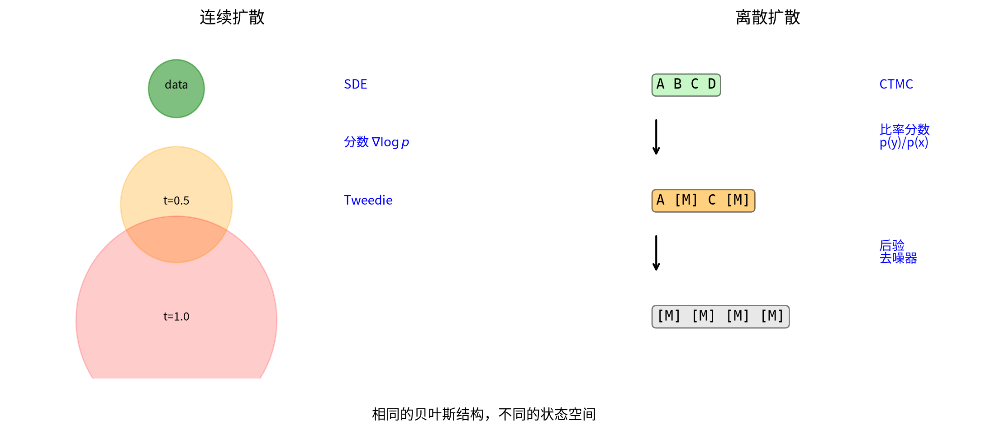

**核心信息**：连续扩散的每个概念——前向/反向/分数/Tweedie/训练/加速——在离散扩散中都有对应。学懂了连续扩散，离散扩散就是"翻译"。

> **Tweedie 的一致性**：注意对照表里的"Tweedie 一栏"，连续版本是 $\mathbb{E}[a_t X_0 - X_t \mid X_t] / \sigma^2$，离散版本是后验去噪期望 $\mathbb{E}[X_0 \mid X_k]$。两者本质是同一件事——**给定噪声观测，对原始数据取后验期望**，只是连续版还带一个线性缩放（$a_t$ 和 $1/\sigma^2$）。离散空间没有"标准差 $\sigma$"，就直接用后验期望本身。这个一致性告诉我们：Tweedie 恒等式的本质不是"高斯的解析导数"，而是更抽象的"**观测→后验期望→分数**"这条链——只要你有一个前向噪声过程，就有对应的 Tweedie。

## 7.6 数字演示

取词表 $V = \{\text{猫}, \text{狗}, \text{坐}, \text{躺}, \text{地上}, \text{桌上}\}$（6 个 token），序列长度 $L = 3$，加上 `[M]` 共 7 个可能状态。

**前向掩码**（2 步逐步掩码，目标 token 是 $[\text{猫}, \text{坐}, \text{地上}]$）：

- $t=0$（原始）：$[\text{猫}, \text{坐}, \text{地上}]$
- $t=1$（掩掉 1 个）：$[\text{猫}, [M], \text{地上}]$
- $t=2$（全部掩掉）：$[[M], [M], [M]]$

**反向多步生成**（从 $t=2$ 到 $t=0$，掩码扩散的杀手锏是**从最有信心的位置先填**——不像自回归被绑死在从左到右）：

**步骤 1**：$t=2 \to t=1$，输入 $[[M], [M], [M]]$。网络对每个位置输出候选 token 的条件概率 $p(v \mid \text{ctx})$，按 §7.3 的定义算比率分数（挑一个基准 token，这里取"猫"）：

| 位置 | $p(\text{猫})$ | $p(\text{狗})$ | $p(\text{坐})$ | $p(\text{地上})$ | 最大 $s$ | 熵 |
|:---:|:---:|:---:|:---:|:---:|:---:|:---:|
| 1 | 0.50 | 0.35 | 0.05 | 0.10 | 基准 | 高 |
| 2 | 0.20 | 0.15 | 0.40 | 0.25 | $s(\text{猫}, \text{坐})=2.0$ | 高 |
| 3 | 0.15 | 0.10 | 0.10 | 0.65 | $s(\text{猫}, \text{地上})=4.3$ | **低** |

**位置 3 的熵最低**（网络最有信心）——先填这里：$[[M], [M], \text{地上}]$。

**步骤 2**：$t=1 \to t=0$，输入 $[[M], [M], \text{地上}]$。上下文更强，网络重新计算：

| 位置 | $p(\text{猫})$ | $p(\text{狗})$ | $p(\text{坐})$ | $p(\text{躺})$ | 最大 $s$ | 熵 |
|:---:|:---:|:---:|:---:|:---:|:---:|:---:|
| 1 | 0.75 | 0.15 | 0.05 | 0.05 | 基准 | **低** |
| 2 | 0.05 | 0.03 | 0.60 | 0.32 | $s(\text{猫}, \text{坐})=12$ | 中 |

位置 1 概率最集中——填"猫"：$[\text{猫}, [M], \text{地上}]$。同一个反向步内，网络再看到主语和地点后，位置 2 的比率分数进一步集中到"坐"——填"坐"：$[\text{猫}, \text{坐}, \text{地上}]$。（注意：这里的"再一步"是**同一个反向时间步内并行填多个位置**——掩码扩散允许一次前向填多个 [M]，所以 2 步反向就能填 3 个位置。若每步只填一个位置，则需要 $N=L=3$ 步反向，见下方"反向步数"的讨论。）

**这个演示揭示了三件事**：
- 比率分数就是**同分布内两个候选 token 的密度比**——掩码扩散里，网络估计的是**条件后验** $p(v \mid \text{ctx})$（给定已揭开的上下文，猜每个位置是谁），用它代入 §7.3 定义的比率分数：$s(\text{猫}, v) = p(v \mid \text{ctx}) / p(\text{猫} \mid \text{ctx})$。这是 §7.3 边缘密度比在"掩码填空"设定下的具体化——网络没有直接估计边缘分布 $p_k$，而是估计条件去噪器，再通过它间接得到比率（这正是 SEDD 用去噪器估计比率的标准做法）。注意两点：基准 token 可任选（它只影响 $s$ 的刻度、不影响目标 token 的排序）；不同步骤上下文不同，$s$ 的绝对值不可直接比较，要看相对变化。
- 掩码扩散**并行预测所有位置**，但**串行提交最确定的**——每步都在挑"熵最低的位置"下笔。这就是 §7.5 表格里"离散加速"能做到的事：网络的一次前向拿到全序列的分布，就够填多个位置。
- 反向步数 $N$ 是**质量-速度**的调节钮：$N=L$（每步填一个）质量最好但慢；$N=1$（一步全填）最快但等价于让网络独立猜每个位置、失去了"用已填的 token 作上下文"的机会。实际 MDLM 采样时会在 $N \in [L/4, L]$ 区间做温度退火——步数越少，越需要网络对多位置联合分布拟合得准。

## 7.7 AI落地

| 场景 | 没有离散扩散会怎样 |
|------|-------------------|
| 文本生成 | 无法用扩散框架生成文本，只能用自回归 |
| 蛋白质设计 | 无法对离散氨基酸序列做扩散 |
| 音乐生成 | 无法对离散音符做扩散 |

## 7.8 常见误解

**误解1**："离散扩散就是连续扩散的离散化。"
两者形似而实质不同。连续扩散的离散化（DDPM）是对连续 SDE 做数值积分，数据本身仍是连续实数。离散扩散的数据从一开始就是离散的（token），前向过程是马尔可夫链，与 SDE 是两套语言。

**误解2**："离散扩散效果不如自回归模型。"
两者各有擅长的场景。离散扩散一次预测所有 token，天生适合并行生成；自回归必须逐个吐字。长序列上离散扩散速度更快，短序列上自回归精度通常更高。

## 7.9 工程反思：拼贴的理想与大板刷的现实

> **本节角色**：前八节论证了离散扩散的数学结构完全平行于连续扩散。本节把 Ch7 从数学层升维到工程层——离散扩散做语言模型时，数学上可行的方案被当前工具（Transformer 双向注意力）的效率限制卡住。这个"技法对了但工具不配合"的母题会在 §8.3（扩散策略需要蒸馏）、§9.1（技法$\times$工具两层可分开）、§9.6（训练层已收敛但架构层仍在岔路）反复出现——本节是这条隐线的第一次落地。

> **术语说明**：本节用到"晕染"、"拼贴"、"线描"、"大板刷"四个比喻——它们是第 9 章 §9.1 会正式建立的**"技法 $\times$ 工具"框架**里的词汇。这里先给最小对照，读者不用回头也能读懂：**晕染 = 扩散**（从混沌逐步沉淀出细节）、**拼贴 = 掩码扩散**（一次填多个空）、**线描 = 自回归**（从左到右一个个吐）、**大板刷 = Transformer**（双向注意力，全局铺色）。

> **一句话**：掩码扩散（§7.2–§7.4）可以直接用于生成文字，但"一次贴完所有字块"的理论优势，被当前 Transformer 这把"大板刷"的刷法限制了。

**生活类比：一次贴一块，还是一次贴一片？**

想象你在做一幅文字马赛克拼贴。

- **自回归（GPT）**：从左到右，每次贴一块。贴到第 100 块时，前 99 块已经固定，不需要再看一遍，直接往下贴。这叫 **KV Cache**——把已经算好的布局存起来复用。
- **掩码扩散（MDLM）**：一开始全是空白，每次猜一批位置该贴什么字块。听起来可以并行、更快，但问题是：每次猜的时候，你都要把整幅作品的上下文重新看一遍——因为双向注意力要求"所有字块互相看"，没有"已经贴好的部分"可以缓存。

**结果**：在当前的 Transformer 架构下，MDLM 的推理速度反而慢于 GPT。这不是拼贴技法本身的缺陷，而是特定工具（大板刷的双向刷法）带来的工程权衡。

**解决方案：各干各的**

**Show-o** 采用了混合策略：理解文字用线描（快，有 Cache），生成图像用拼贴（慢，但质感好）。这提醒我们：技法本身没有问题，但在具体落地时，需要诚实地面对工具的约束，选择最合适的组合。

**与前文的联系**

§7.2–§7.4 的掩码扩散和比率分数，在理论上完全适用于 token 预测。本节补充的是：从"数学上可行"到"工程上好用"之间，还有工具效率这一层距离。

## 7.10 本章回顾

**本章自检**：

**1.** 离散扩散的"比率分数"和连续扩散的分数有什么对应关系？为什么连续扩散用梯度、离散扩散用比率？

**2（技法 $\times$ 工具）.** MDLM 想把"拼贴"技法用于文字生成，但遇到了 Transformer 双向注意力无法使用 KV Cache 的瓶颈。如果未来出现了一种支持 Cache 的双向架构，MDLM 的速度劣势会消失吗？

**反事实思考**：假设你**不把连续扩散翻译成离散版本**，而是把离散 token **嵌入到连续向量空间**（比如 word2vec），然后直接跑高斯扩散——理论上可以，但会遇到两个问题。第一，连续空间里的采样点很少落回合法 token（大部分连续点没有对应词汇），需要额外的解码步骤把连续输出映射回离散词表。第二，一次预测所有 token 的并行优势没了——为了保证解码合理，实际上得逐个位置去噪。走到最后你会发现：**离散数据配连续扩散，不如从头设计一套离散扩散**——这就是 CTMC/掩码/比率分数这套语言存在的理由。

> 数据是离散 token → 不能加高斯噪声 → 换成离散跳变（掩码 / 均匀跳变）\
> → SDE → CTMC，分数 → 比率分数，Tweedie → 后验去噪器\
> → 结构完全平行：前向/反向/分数/训练/加速都有对应\
> → 优势：并行生成（一次预测所有 token）

**未解问题**：到目前为止我们都在做**单个静态对象**——一张图片、一段文字。但现实世界的生成任务往往是**动态的、结构化的**：视频是"一串按时间演化的图片"，世界模型是"一个可以交互的动态环境"。SDE 框架在这些新场景下还能站得住吗？维度增加会不会让训练崩掉？"动作"和"反馈"这些新元素怎么嵌进原有的分数-反向-训练链条？第8章拿这些问题来压测框架。

 * * * 

# 第8章：从静态场景到动态世界

> 从图片到视频，是维度增加（多了时间轴），SDE/ODE/Tweedie 全部不变；从视频到世界模型是加上"动作条件"和"闭环反馈"，与 SDE 框架的四个连接点逐一对应。

> **本章路线**：先看视频生成、世界模型与扩散策略，最后落地、辨误解、收束。

> **核心推导**：
> 1. 视频 = 时空扩散，SDE 形式不变。
> 2. 世界模型的核心是预测未来状态。
> 3. 扩散策略擅长表达多峰动作分布。

> **动笔前自检**：①视频和图片的维度差异是什么？②动作分布为什么可能是多峰的？

**回望**：前面七章建立了一整套框架——加噪、分数、反向 SDE、训练、ODE、条件、离散——最初是在**静态场景**（单张图片）上做的。现在要把"一张画面"换成"一段影像"（+时间轴），再换成"一个可交互世界"（+动作与反馈），底层的数学骨架能否原封不动地扛下来？如果扛得住，说明建立的是一套**真正通用的生成框架**；如果扛不住，暴露出的裂缝正好告诉我们框架的边界。这一章是对前七章的**压力测试**。

## 8.1 视频生成：时空扩散

视频 = 图片 + 时间轴：数学上 SDE/ODE/Tweedie 原封不动（§8.1.1），代价全部转移到工程——注意力矩阵随帧数平方级爆炸，帧间一致性带来闪烁、跳变与身份漂移（§8.1.2）。§8.1.3–§8.1.4 再看主流架构怎么应对，并算一组数字。

### 8.1.1 从 2D 到 3D：SDE 形式不变

图片是 $H \times W \times C$ 的张量（$H$ 高、$W$ 宽、$C$ 通道数，如 RGB 三通道）。视频是 $H \times W \times T \times C$——多了一个时间维度 $T$（帧数）。

但前向 SDE 的形式完全不变：

$$dX_t = f_t(X_t)\,dt + g_t\,dB_t$$

只是 $X_t$ 的维度从 $H\times W\times C$ 变成了 $H\times W\times T\times C$。分数网络 $s_\theta$ 也只是输入输出维度变了。Tweedie 恒等式、反向 SDE、概率流 ODE——全部原封不动。

**关键洞察：视频生成和图片生成的数学结构完全一样，维度是唯一的区别。**前向加噪仍然是对每个像素-帧-通道独立加高斯噪声，反向仍然是用分数指导去噪。真正的挑战不在数学，而在工程。

### 8.1.2 工程挑战

**时空注意力爆炸**：视频的 token 数是 $n \times T$（空间 $n$ $\times$ 时间 $T$）。全联合注意力的**注意力矩阵**元素数是 $(nT)^2$，帧数一多就爆炸。比如 $n = 4096$（$64\times64$ 潜在空间），$T = 16$ 帧：全联合注意力的注意力矩阵有 $(4096 \times 16)^2 = 4.3 \times 10^9$ 个元素。（这是注意力矩阵的**元素数**，不是总 FLOPs——总 FLOPs 还要乘以特征维度 $d$，典型 $d \approx 512$，实际计算量是 $O((nT)^2 d)$。但内存瓶颈主要在注意力矩阵本身，所以业内通常用 $(nT)^2$ 作为复杂度指标。）

解决方案是**分离注意力**：先在空间内做注意力 $O(n^2)$，再在时间内做注意力 $O(T^2)$。但注意——**这两个操作要对整段视频的每一个 token 都做一遍**：空间注意力要对每个时间位置做（共 $T$ 次），时间注意力要对每个空间位置做（共 $n$ 次）。所以整段视频分离注意力的注意力矩阵元素数总量是 $T \cdot n^2 + n \cdot T^2$（同样指注意力矩阵元素数，$\times d$ 才是 FLOPs）。上面的例子（$n = 4096, T = 16$）变成 $16 \times 4096^2 + 4096 \times 16^2 = 2.7 \times 10^8$——对比全联合的 $4.3 \times 10^9$，降为原来的约 **1/16**（$nT/(n+T) = 65536/4112 \approx 16$）。这仍然是从"不可行"到"可行"的关键一步，但降幅没有直觉上想的那么夸张——分离注意力真正的价值在于把 $O((nT)^2)$ 的"全连接"变成 $O(Tn^2 + nT^2)$ 的"分而治之"，让时间和空间各自只跟同类交互。

**图31**：时空分离注意力

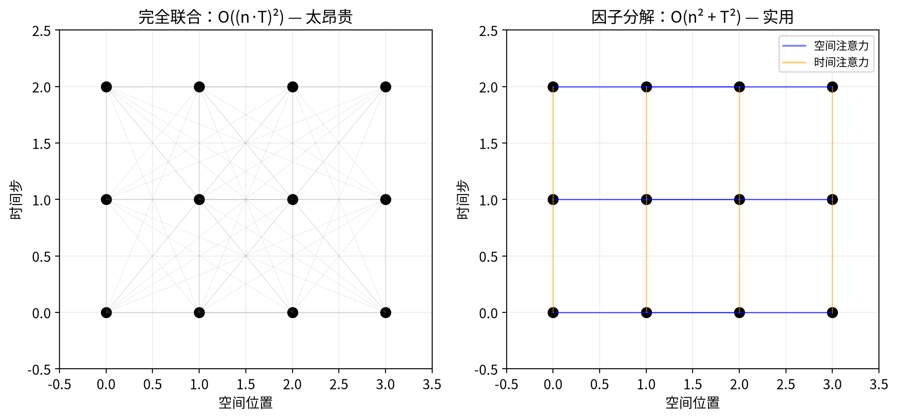

左图全联合注意力：每个时空 token 都跟所有其他 token 交互，连线密集。右图分离注意力：先在空间内交互（蓝色线），再在时间内交互（橙色线），连线稀疏。

**帧间一致性**：视频不是一叠独立的图片。相邻帧之间有强相关——同一个物体要平滑移动、外观保持不变（一只橘猫不能下一帧变成黑猫）。如果每帧独立生成，即使每帧单看都合理，连起来也会出三种毛病：**闪烁**（纹理、光照在帧间抖动）、**跳变**（物体位置突然不连续）、**身份漂移**（物体外观逐帧慢慢变形，人脸越长越不像同一个人）。

根因用一句概率语言点破：视频生成要建模的是所有帧的**联合分布** $p(x_1, \dots, x_T)$，而不是各帧边缘分布的乘积 $\prod_t p(x_t)$。逐帧独立采样，丢掉的正是帧间的相关结构——即使每个 $p(x_t)$ 单独看都学对了，乘起来也不等于真实视频的分布。

**图32**：帧间一致性问题

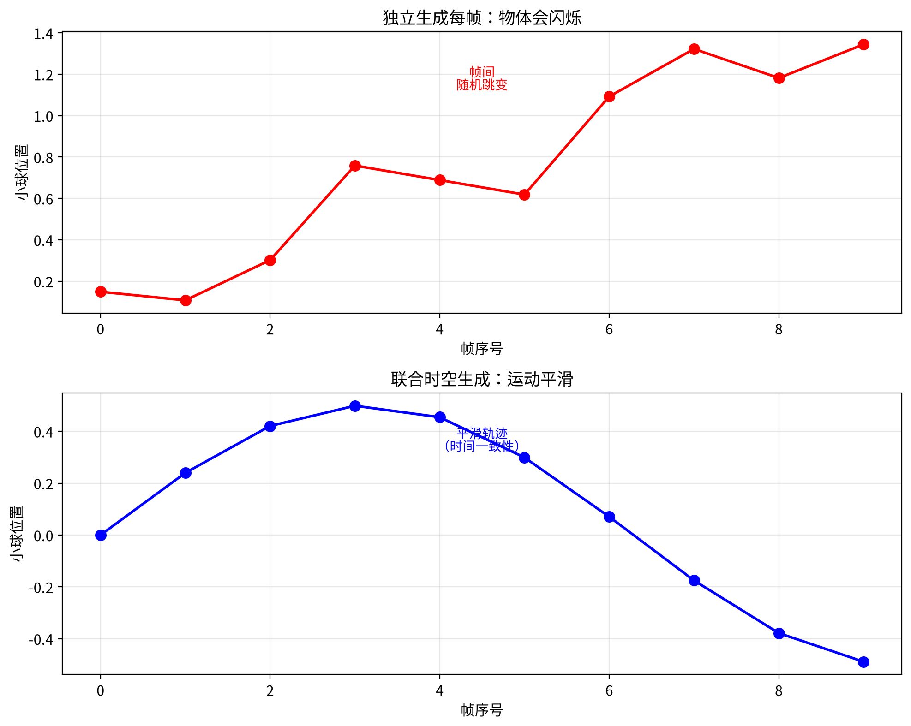

上排独立生成：球的位置在帧间随机跳跃（闪烁）。下排联合生成：球平滑运动（帧间一致）。

**回到 SDE 框架，这件事在分数层面看得最清楚**：前向加噪仍是对每个像素-帧独立加高斯噪声（§8.1.1 说的"维度是唯一区别"），但反向去噪的分数网络必须输出**联合分数** $\nabla \ln p(x_{1:T})$——它的每一帧分量都依赖于其他所有帧。逐帧分数 $\nabla \ln p(x_t)$ 只盯着单帧，天然表达不了"第 2 帧的球该往哪动，取决于第 1 帧球在哪、往哪飞"。所以帧间一致性不是外挂的补丁，而是"学联合分数还是学边缘分数"的必然结果：真正学到联合分数，一致性是自动的；一致性出毛病，是因为近似没能完全逼近联合分数。

**怎么让分数网络看到其他帧**——按重要性分两层：

**第一梯队（架构层，让分数网络原生看到跨帧信息）**：

- **时间注意力**：这正是上面分离注意力的时间分支。空间注意力让一帧内部各处彼此协调，时间注意力让同一位置跨帧协调——原来分离注意力不只是为省算力，它的时间分支就是帧间一致性的载体。这是视频扩散的骨架做法（VDM 用 3D U-Net + 分解时空注意力奠基）。^[58]^
- **时间卷积**：3D 架构用时间维度的卷积捕捉**局部**帧间相关（相邻几帧的平滑过渡），是时间注意力的低成本补充，擅长短程连续、不擅长长程依赖。

**长视频/高清的骨干（级联生成）**：一次直接生成又长又清的视频代价太高，主流做法是**级联**——先用基础模型生成低帧率、低分辨率的关键帧（保证全局一致），再用**时序超分**（插帧，补出中间帧）和**空间超分**逐级加密。帧间一致性主要靠底层的稀疏关键帧锁定，超分层只需在已定的骨架上填细节。Imagen Video 用交替的时空超分级联做高清，Make-A-Video 用插帧网络扩帧，都是这一路。^[58]^^[60]^

**第二梯队（推理期锦上添花，不改架构）**：

- **相关初始噪声**：采样起点不给每帧独立噪声，而让帧间共享一个基底噪声再叠各帧小扰动——相关的噪声导出相关的结构，进一步压住残余闪烁（PYoCo 的 noise prior）。^[61]^ 它叠加在时间注意力之上做补强，且这类方法（如 FreeInit）常需多轮采样迭代，有额外推理成本。

长视频还多一层难处：一次生成不下几百帧，只能分段生成再拼接。段与段的衔接靠**以前一段的末尾帧为条件**（自回归式滑动窗口，如 Diffusion Forcing），让新一段从旧一段的状态接着长出来，避免接缝处跳变。这条隐患在生成时长拉长后会放大成"身份漂移"，是 §9.6 世界模型路线之争里长程状态管理（如 Memento 的显式关键帧记忆）要专门解决的问题。^[62]^

**内存与 KV 缓存**：视频的中间激活值是图片的 $T$ 倍。需要梯度检查点（训练时只存部分中间值，反向传播时重算）、KV 缓存复用（推理时缓存注意力键值对，避免重复计算）等技术控制显存。

### 8.1.3 关键架构

| 架构 | 特点 | 代表 |
|------|------|------|
| 3D U-Net | 在 2D U-Net 上加时间卷积/注意力 | Make-A-Video |
| 视频 DiT | 把 DiT 扩展到 3D，分离时空注意力 | Sora |
| 潜在视频扩散 | 先用 VAE 压缩到潜在空间，再扩散 | Stable Video Diffusion |

### 8.1.4 数字演示

取 $256 \times 256 \times 16\text{帧} \times 3\text{通道}$ 的视频。

- **像素空间维度**：$256 \times 256 \times 16 \times 3 = 3{,}145{,}728$（约 314 万维）
- **潜在空间维度**（VAE 压缩到 $32 \times 32 \times 4 \times 16$）：$32 \times 32 \times 4 \times 16 = 65{,}536$（约 6.5 万维）

压缩到原来的约 1/48。这就是为什么视频扩散几乎都在潜在空间做——像素空间太大了。在像素空间做 314 万维的扩散，显存和计算量都不可行；在 6.5 万维的潜在空间做，就跟图片扩散差不多了。

## 8.2 扩散世界模型

> **跨篇分工**：世界模型的全景定位（六流派分类、生成派 vs JEPA 派详析、渲染器→模拟器框架、胜负手判断）见《基座模型》§6.2。本节只讲**扩散视角**：SDE 框架怎么自然延伸到世界模型。

世界模型学习环境的动力学：给定当前状态 $s_t$ 和动作 $a_t$，预测下一个状态 $s_{t+1}$。扩散模型学的是条件分布 $p(s_{t+1}\mid s_t, a_t)$——这是 SDE 框架在时间维度上的自然延伸，不是新知识。

> **和 §8.1 视频生成有什么不同？** 视频生成是**开环**的：给定起始帧和文字描述，一次性输出完整视频，不需要中途接受新输入。世界模型是**闭环**的：预测一步 $\to$ 观察真实反馈 $\to$ 再预测一步，而且预测要受**动作**控制——同一状态做不同动作，下一状态不同。简言之：视频生成是"放电影"，世界模型是"玩游戏"——前者观众不能干预，后者玩家的每个操作都改变后续画面。

### 8.2.1 生成派内部的三种范式

| 范式 | 生成目标 | 公式 | 典型应用 |
|------|---------|------|---------|
| 视频预测 | 未来帧序列 | $p(x_{t+1:T} \mid x_{1:t})$ | Sora（文本→视频） |
| 状态-动作条件 | 下一状态 | $p(s_{t+1} \mid s_t, a_t)$ | RL 环境模拟器 |
| 交互式 | 多步条件生成 | $p(s_{t+1:T} \mid s_t, a_{t:T})$ | GAIA-1（自动驾驶） |

### 8.2.2 与 SDE 框架的连接

世界模型不是扩散模型的外挂内容，而是 SDE 框架的自然延伸。四个连接点：

| 连接点 | SDE 框架（已学） | 世界模型含义 |
|--------|---------|-------------|
| 分数 = 物理规律 | $s = \nabla \ln p_t$ 编码"局部去噪方向" | 在时间维度上，这个方向就是"物理规律"——状态怎么随时间演化 |
| 条件 = 动作 | 第6章的条件控制（CFG/交叉注意力） | 动作 $a_t$ 作为条件，控制状态转移方向（往哪走取决于做什么动作） |
| 长程一致性 = 误差分析 | 第5章的三源误差 | 多步预测的误差累积 = 离散化误差 + 分数误差（预测越远越不准） |
| 实时 = ODE 采样 | 第5章的概率流 ODE | 用 ODE 高阶求解器（DPM-Solver）实现实时预测（20步/帧） |

到这一章时，你已经有全部工具：分数（Ch2）、反向 SDE（Ch3）、条件控制（Ch6）、误差分析（Ch5）。看到的是同一个框架在更大尺度上的应用——不是新知识，是旧知识的新组合。

**图33**：视频生成 vs 世界模型

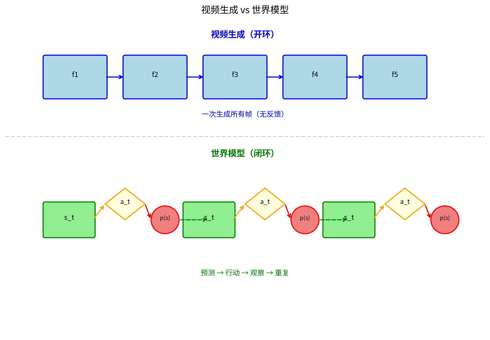

上排是视频生成（开环）：一次性生成所有帧，没有反馈。下排是世界模型（闭环）：状态 → 动作 → 扩散模型预测下一状态 → 观察 → 再循环。关键区别：世界模型有动作输入和反馈循环，视频生成没有。

### 8.2.3 数字演示

取 1D 状态空间 $x \in [-1, 1]$，动作 $a \in \{-1, 0, 1\}$（左移/不动/右移）。

状态转移：$x_{t+1} = x_t + 0.1 \cdot a_t + 0.05 \cdot \varepsilon$（确定性 + 噪声）。扩散世界模型学的就是这个条件分布 $p(x_{t+1} \mid x_t, a_t)$。

从 $x_0 = 0$ 出发，执行动作序列 $[1, 1, -1]$（右、右、左），假设每步噪声取 $\varepsilon = 0.3$（这里为演示取常数；实际训练中 $\varepsilon$ 每步独立采样）：

| 步 | 动作 | 上一步 $x_t$ | 确定性递推 $x_t + 0.1 a$ | 加噪 $+ 0.05\varepsilon$ |
|----|------|-----------|------------------------|-----------------------|
| 0 | - | - | 0.000 | 0.000 |
| 1 | +1 | 0.000 | 0.100 | 0.115 |
| 2 | +1 | 0.115 | 0.215 | 0.230 |
| 3 | -1 | 0.230 | 0.130 | 0.145 |

扩散世界模型不需要知道这个公式——它从数据中学习 $p(x_{t+1} \mid x_t, a_t)$。给定大量 $(s_t, a_t, s_{t+1})$ 三元组，模型学会"在这个状态下做这个动作，下一个状态大概是什么分布"。

**误差累积**：如果每步预测有独立随机误差 $\delta$（即每步预测的独立随机误差的标准差；真实场景下 $\varepsilon$ 每步独立采样，预测误差也独立），3 步后累积误差 $\approx \sqrt{3}\,\delta$（独立随机误差的平方根累积）。这就是第5章"分数误差"在世界模型中的体现——预测越远，误差越大。这也是为什么世界模型通常只预测有限步（如16帧），而不是无限滚动。

## 8.3 闭环控制：扩散策略

> **桥接**：§8.2 讨论的世界模型都是**开环预测**（给定动作 → 输出下一帧），本节看它的镜像应用——**闭环控制**（给定状态 → 输出下一个动作），也就是扩散策略。开环把扩散当"物理模拟器"，闭环把扩散当"决策器"，用的是同一套 SDE 框架的两个方向。

> **跨篇分工**：VLA 视角的机器人控制见《基座模型》——RT-2 动作 token 化（§5.3）、π0 flow matching（§5.3-5.4）、动作表示对比表（§5.4）、Figure Helix 分层决策（§5.7）。本节只讲**扩散视角**：扩散策略的独特价值是什么。

**扩散策略的独特价值：多峰动作分布**

传统控制方法只能给出一条固定路径——遇到动态变化就手忙脚乱。扩散模型则保留多种可能性：抓取杯子时，从左边、右边或上面拿都是可行的选择。传统方法只能给出一个"平均答案"，动作显得僵硬；扩散模型保留所有选项，动作更自然。

**图34**：扩散策略 vs 传统策略：多峰动作分布对比

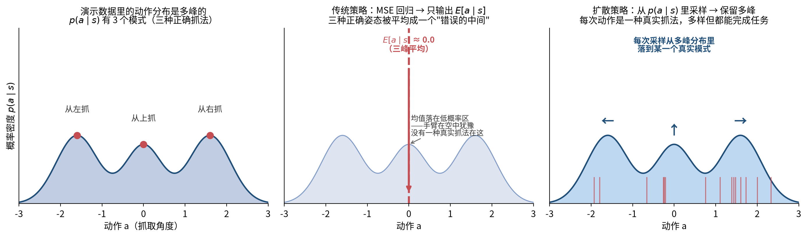

**图解**：机器人演示数据里"怎么抓"往往有多个正确答案（左/上/右都能抓到杯子），$p(a\mid s)$ 天然是**多峰分布**。传统策略用 MSE 回归学 $\mathbb{E}[a\mid s]$——三峰平均后落在谷底，**是一个没人示范过的错误中间动作**（手臂在空中犹豫）。扩散策略学**整个分布**，每次采样落到某一个真实模式上——动作既真实又多样。这就是"晕染"技法在控制里的核心价值：**不逼你选择"平均正确"，而是让你选择"某一种正确"**。

**实时性瓶颈**：纯扩散采样 20-50 步，延迟 >1 秒，太慢。蒸馏版扩散 1-4 步，<100ms，可用。混合架构（1 步晕染 + 线描框架）1 步，25 FPS，实时。Matrix-game 2.0 采用混合思路：整体用线描框架串起来保证速度，每一帧的具体动作用少步蒸馏的晕染生成——让晕染做它擅长的（多峰选择），让线描做它擅长的（快速串流）。

**与 VLA 的关系**：扩散策略（Diffusion Policy）和 RT-2 类 VLA 走的是不同技法路线——扩散是"晕染"（学整个分布），VLA 是"线描"（逐 token 自回归）。谁更合适取决于任务重心：语义泛化重时选 VLA，动作多峰性重时选扩散策略，两者都要时用混合架构。VLA 视角在《基座模型》第 5 章有展开。

**与前文的联系**：第2章的分数告诉机器人"往哪画"，第4章的训练让它从演示数据中学习动作分布。但第2-6章一直没碰一个实际问题：**实时性需要技法妥协**。纯晕染的精度很高，速度不够；要进入物理世界，必须学会"用精度换速度"，或者"把晕染嵌入更快的线描骨架中"。

## 8.4 AI落地

| 场景 | 没有视频/世界模型会怎样 |
|------|------------------------|
| 视频创作 | 无法从文字生成视频 |
| 游戏开发 | 无法用 AI 生成环境动力学 |
| 机器人训练 | 无法在模拟环境中试错学习 |
| 自动驾驶 | 无法模拟未来场景做规划 |

## 8.5 常见误解

**误解1**："视频生成就是逐帧生成图片。"  
逐帧独立生成会带来帧间不一致——物体闪烁、运动跳变。视频生成必须联合时空建模，让帧与帧之间交换信息。这就是视频扩散离不开时空注意力的根本原因。

**误解2**："世界模型就是视频生成。"  
两者的区别在于闭环。视频生成是开环的——一次性输出整段视频即可结束。世界模型是闭环的——预测、观察、再预测，持续交互，还需要动作条件和反馈机制。图示中上排（开环）与下排（闭环）的对比正是这个关键。

**误解3**："扩散模型太慢，做不了世界模型。"  
概率流 ODE 加高阶求解器（第5章）配合 KV 缓存和潜在空间压缩，20 步就能生成一帧——实时性已经可行，世界模型完全做得了。更重要的是，世界模型的价值主要在准确度——扩散模型能建模多峰分布（同一动作对应多种可能结果），确定性模型做不到这一点。

## 8.6 本章回顾

**本章自检**：

**1.** 为什么视频生成不能逐帧独立生成？时空分离注意力把计算复杂度从 $O((nT)^2)$ 降到了多少？

**2.** 世界模型和视频生成的本质区别是什么？（提示：开环 vs 闭环。）扩散世界模型与 SDE 框架的四个连接点分别是什么？

**3.** 为什么视频扩散几乎都在"潜在空间"做，而不是原始像素空间？DiT 相比 U-Net 的核心优势是什么，它在大规模任务上为什么更容易扩展？
**4（迁移・闭环控制）.** 把扩散用到"机器人抓取"（闭环控制）和"文生图"（开环生成），训练目标和采样过程有什么本质区别？

**反事实思考**：假设视频扩散**不采用时空分离注意力**，而是暴力用全时空注意力，会发生什么？以 $n=4096, T=16$ 计算，注意力矩阵变成 $(nT)^2 \approx 43$ 亿个元素——仅**一个注意力头**的 logits 在 fp16 下就占 $43 \times 10^8 \times 2 \approx 8.6$ GB 显存，而典型模型有几十个注意力头、几十层，加上激活、梯度和优化器状态，训练显存会迅速超出单卡容量（A100 80GB）。这不是"可选优化"，而是让视频扩散从**理论可行**变成**工程可行**的临界点。同一个 SDE 骨架，工程约束决定了它能不能真正跑起来——这是从图片扩展到视频过程中，唯一一处"数学不变但工程重新设计"的地方。

图片 → 视频：维度增加（+时间轴），SDE/ODE/Tweedie 不变\
→ 工程挑战：注意力 $O((nT)^2) \to O(T \cdot n^2 + n \cdot T^2)$（降为原来的约 1/16）、帧间一致性、内存\
→ 潜在空间：314万维 → 6.5万维（压缩到原来的约 1/48）\
→ 视频 → 世界模型：加动作条件 + 闭环反馈\
→ 与 SDE 框架四个连接点：分数=物理、条件=动作、一致性=误差、实时=ODE\
→ 误差累积：预测越远越不准（第5章分数误差的体现）\
→ 同一个框架，更大尺度

**未解问题**：SDE 框架已经扩展到了视频（§8.1）、开环世界模型（§8.2）和闭环控制（§8.3）三个动态场景——一次压力测试证明骨架扛得住。但扩散模型内部还诞生了一批**结构性变体**——把 U-Net 换成 Transformer（DiT）、把像素空间搬到潜在空间（Latent Diffusion）、用蒸馏把 1000 步压成 1 步（一致性模型）、用 RL 微调让模型偏好人类审美（RLHF for diffusion）。这些变体没有改动 SDE 骨架，但改变了**它的运行方式**。第9章会把这些前沿脉络串起来，同时收束 §8 未讲透的一件事——扩散只是"世界模型"这场路线之争里的一条线（§9.5），并非唯一正解。

 * * * 

# 第9章：前沿展望

> 生成模型 = **技法 $\times$ 工具**，两层可以独立替换、自由组合——晕染/线描/平涂/拼贴是上层技法，U-Net/Transformer/Mamba（状态空间模型架构，线性复杂度）是下层工具，扩散、流匹配、自回归、离散扩散只是这个二维网格上的不同格子。

> **本章路线**：先用"技法 × 工具"串起潜在扩散、DiT、推理时控制与各类变体，再看扩散在世界模型路线之争中的位置与前沿总览，最后收束于"自由组合"。

> **核心推导**：
> 1. 生成模型 = 技法 $\times$ 工具，两层可独立替换。
> 2. DiT、流匹配、一致性模型都是同一画室的不同技法。
> 3. 扩散只是世界模型路线之争中的一条线。

> **动笔前自检**：①你记得 SDE/ODE 框架吗？②生成模型有哪些大范式？

## 9.1 生成模型的两层拼图：技法与工具

> **一句话**：做生成模型就像画画——先决定"用什么技法"（晕染、线描、平涂、拼贴），再决定"用什么工具"（勾线笔、大板刷）。技法和工具互不绑定，自由组合。

我们可以把生成模型拆成两个独立的问题：

1. **绘画技法（上层）**：如何从噪声得到一个场景？是像 DDPM 那样"水彩晕染"——从一张混沌的湿底稿逐步沉淀出细节；像流匹配那样"直接平涂"——不绕弯路，直接铺色块；还是像 GPT 那样"工笔线描"——一笔一笔从左到右勾勒轮廓？
2. **绘画工具（下层）**：用什么神经网络来实现？是 U-Net 这种"细头勾线笔"——局部刻画，擅长边缘和纹理；还是 Transformer 这种"大板刷"——全局铺色，一刷覆盖整幅画；抑或是 Mamba 这种"海绵滚轮"——省颜料，适合长幅画卷？

这两个选择互不绑定。你可以用大板刷画晕染（DiT / Sora：Transformer 跑扩散），也可以用勾线笔画晕染（早期 Stable Diffusion：U-Net 跑扩散）；你可以用大板刷画线描（LlamaGen：Transformer 跑自回归），也可以尝试用海绵滚轮做晕染（DiS：Mamba 跑扩散）。**重要的不是记住"哪种工具最好"，而是理解：技法决定"怎么从噪声走到数据"（扩散是逐步去噪，自回归是逐字生成），工具决定"用什么网络跑这条路"。**

| 绘画技法 | 绘画工具 | 代表作品 |
|:---|:---|:---|
| 晕染（扩散 SDE/DDPM） | 大板刷（Transformer） | DiT, Sora |
| 晕染（扩散 SDE/DDPM） | 勾线笔（U-Net） | 原始 Stable Diffusion |
| 平涂（流匹配） | 大板刷（Transformer） | Stable Diffusion 3 |
| 线描（自回归） | 大板刷（Transformer） | LlamaGen, GPT-4 |
| 拼贴（离散扩散） | 大板刷（Transformer） | MDLM |

沿着这条线索，把前沿变体串成一张画室地图。

## 9.2 潜在扩散

不在像素空间做扩散，先用 VAE 把图片压缩到低维潜在空间，再在潜在空间做扩散。

好处：维度压缩到原来的约 1/8 到 1/48，计算量大幅减少。Stable Diffusion 就是潜在扩散——在 $64 \times 64 \times 4$ 的潜在空间做扩散，而不是 $512 \times 512 \times 3$ 的像素空间。维度从 78万 降到 1.6万，压缩到原来的约 1/48。

> **跨篇心法呼应**：**扩散模型本质就是"在图像潜空间里做生成"**——先用 VAE 把像素压进潜空间，再在潜空间里做 SDE/ODE，最后解码回像素。这和《基座模型》§2.1 讲的基座模型逻辑同构——基座在 token 潜空间里做推理，扩散在图像潜空间里做生成。**潜空间是当代 AI 系统的通用工作场所**：不同模型用不同的潜空间做不同的事，但都不在原始输入空间里工作。JEPA 世界模型（§8.2）也是这个思路——不生成像素，只在潜空间里预测下一步表征。

> **48 倍不是巧合**：读者可能会注意到 §8.1.4 视频扩散也压缩到原来的约 1/48。这是同一个 VAE 家族的字面效应——SD 的 VAE 用 **8$\times$ 空间下采样 + 通道 3→4** 的固定配置，总压缩比 $= 8^2 \times 3 / 4 = 48$。视频扩散（Stable Video Diffusion 等）沿用了同一套 VAE，逐帧压缩，时间维度不动，所以压缩比也是 48:1。**如果换用别的 VAE**（比如 SD3 的 VAE 用 16$\times$ 空间压缩），压缩比会不一样。48 是 SD 一族的"品牌数字"，不是宇宙常数。

**图35**：潜在空间、交叉注意力与训练曲线

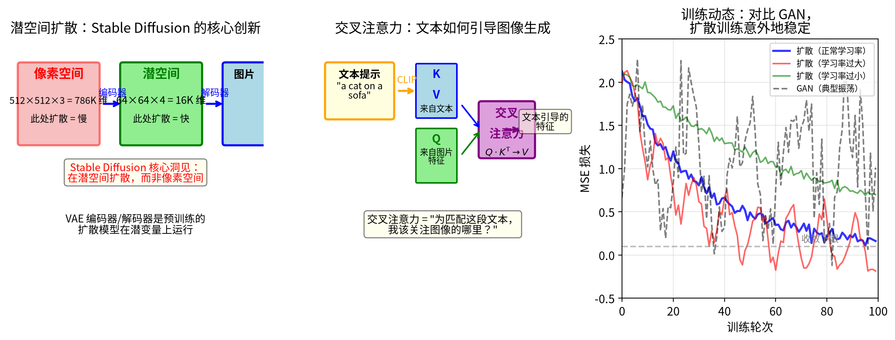

Stable Diffusion 3 进一步把"技法"从"晕染"换成了"平涂"（流匹配），但"工具"依然是大板刷（Transformer）——这再次说明两层可以独立替换。工具不变，换一套技法，画面气质会变，但作画流程的骨架是相通的。

## 9.3 DiT：把扩散的引擎从卷积换成 Transformer

> **一句话**：DiT 不是"另一种扩散模型"，是把分数网络从 U-Net 换成 Transformer——技法不变，工具换了一把更大的刷子。但这个换法改变了扩散模型的命运：它让扩散第一次拥有了可预测的 scaling law。

### 9.3.1 为什么要换：U-Net 的归纳偏置在大数据时变成枷锁

U-Net 的核心设计是**编码器-解码器对称结构 + 跳跃连接**。编码器逐层下采样（提取全局结构），解码器逐层上采样（恢复局部细节），跳跃连接把编码器的中间特征直接送到解码器对应层。这个设计来自医学图像分割，天生适合"精确的局部重建"。^[16]^

U-Net 的一切设计都在编码一种**归纳偏置**：

- **局部性假设**：卷积核只看 $3\times3$ 或 $5\times5$ 的邻域。图像中重要的信息是局部的（边缘、纹理），所以局部卷积是高效的。
- **多尺度假设**：不同分辨率捕获不同尺度的信息。粗分辨率看全局构图，细分辨率看局部纹理，跳跃连接把两者拼起来。
- **平移不变性假设**：左上角的猫和右下角的猫用同一组卷积核检测。

卷积的强归纳偏置让模型从小数据里就能学到有用的特征，而 Transformer 的全局注意力在小数据上容易过拟合——数据量不够大时，U-Net 的归纳偏置是必要的。

但训练数据涨到几十亿张、算力涨到千卡集群后，强归纳偏置从"帮助"变成了"枷锁"：

- **局部性限制了长程依赖**：要看到画面左上角和右下角的关系，得堆很多层卷积，每层把感受野扩大一点。堆上百层卷积才能覆盖整张 $256\times256$ 图——参数效率极低。
- **多尺度结构限制了扩展方式**：U-Net 增大时要同时增加下采样/上采样级数、调整跳跃连接的对应关系、平衡各层通道数——每一步都需要人工设计，不像 Transformer 那样"加层数加宽度"就能线性扩展。
- **卷积的权重共享在超大规模时浪费算力**：平移不变性假设意味着同一个卷积核在所有位置做同样的运算。当模型足够大、数据足够多时，模型有能力学到"不同位置需要不同处理"，但卷积的权重共享不允许它这么做。

Transformer 恰好相反：**弱归纳偏置**——自注意力对输入不做任何结构性假设（没有局部性、没有平移不变性、没有多尺度），所有 token 互相看到，让模型自己从数据里学哪些 token 之间有关系。小数据时这是劣势（容易过拟合），大数据大算力时这是优势——归纳偏置越弱，模型能从数据里学到的模式越丰富。

> **跨篇呼应**：这个道理和基座模型一脉相承。《基座模型》§1.9 的"常见误解"讲过 ViT 误解——"局部卷积换全局注意力"的收益边界（图像侧），与这里 U-Net → DiT 是同一个结构取舍：从强归纳偏置走向弱归纳偏置。扩散模型的 U-Net → DiT 之路，就是图像生成里卷积 → Transformer 之路的镜像。

**图36**：U-Net vs DiT 结构对比

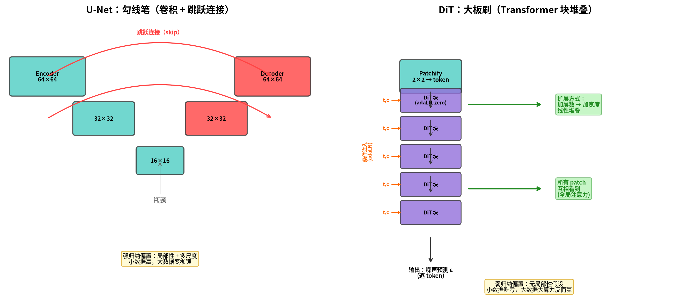

### 9.3.2 DiT 的三个关键设计

DiT（Peebles & Xie 2023, ICCV）把分数网络从 U-Net 换成标准 Transformer，三个关键设计让"换工具"成为可能：

**1. Patchify：图像变序列**。把 $H \times W$ 的输入（通常是 VAE 压缩后的潜在特征，如 $32\times32$）切成 $p\times p$ 的小块（patch，如 $2\times2$），每块展平成一个 token。这跟 ViT 的做法一样——把"图像"变成"序列"，才能喂进 Transformer。$32\times32$ 的潜在特征用 $2\times2$ patch 切完后变成 $16\times16=256$ 个 token。每个 token 再加上位置编码（让 Transformer 知道每个 patch 来自画面的哪个位置）和时间步 $t$ 的嵌入。

**2. adaLN-zero：时间步和条件的注入方式**。U-Net 用单独的时间嵌入分支把 $t$ 注入到每一层；Transformer 没有现成的分支结构，DiT 用**自适应 LayerNorm**（adaLN）解决：把时间步 $t$ 和条件 $c$ 通过一个 MLP 生成缩放和平移参数 $(\gamma, \beta)$，注入每个 Transformer 块的 LayerNorm：

$$x \leftarrow \gamma \cdot \text{LN}(x) + \beta$$

这里的 $\beta$ 是 LayerNorm 的**平移参数**（adaLN 标准记号），与 DDPM 的噪声调度 $\beta_t$、§6.4 的 KL 强度 $\beta$ 都不同——这是本文 $\beta$ 的第三种含义，好在它只出现在这一个公式里。

"zero"是关键——初始化时 $\gamma = 0$，让每个 DiT 块的初始输出恰好是恒等映射（输入原样传到下一层），训练早期不破坏预训练残差流。随着训练进行，$\gamma$ 逐渐从 0 偏移，每个块才开始对信号做实质性的变换。这个"零初始化"和 ControlNet 的零卷积（§6.6）是同一个思想：**新模块从"什么都不做"起步，让训练自己决定什么时候开始发挥作用**。

> **前向引用（§9.5.7）**：adaLN 这套"标配"并非不可动摇。i1（2026）的单变量对照实验发现：AdaLN 参数量不小，带来的提升却相当有限——去掉后省约 0.23B 参数，性能几乎不受影响（对 flow matching 目标尤其如此）。教科书默认也要经受消融检验。

**3. 自注意力替代卷积+跳跃连接**。所有 patch token 通过标准 Transformer 自注意力交互——第一层就能让画面左上角的 patch 和右下角的 patch 直接交换信息，不需要像 U-Net 那样堆很多层卷积才建立长程依赖。代价是计算量：自注意力的复杂度是 $O(n^2)$（$n$ 是 token 数），但配合潜在扩散（§9.2 把维度压缩到原来的约 1/48）和分离时空注意力（§8.1.2 视频版把 $O((nT)^2)$ 降到 $O(T \cdot n^2 + n \cdot T^2)$），在工程上可行。

### 9.3.3 DiT 的 Scaling Law：扩散模型终于有了可预测的扩展

DiT 论文（Peebles & Xie 2023）最重要的贡献不是"Transformer 也能跑扩散"——这件事之前的 U-ViT、DiT 的前身都试过。真正的贡献是：**它证明扩散模型也有可预测的 scaling law**。

Scaling law 的含义：模型计算量增大 $\rightarrow$ FID（图像质量指标，越低越好）按幂律下降，下降的斜率可预测。加大模型 + 加算力 = 质量稳步提升，没有饱和迹象。DiT 论文给出了干净的证据：从最小的 DiT-S/2（33M 参数、6.1 Gflops、FID 68.4）到最大的 DiT-XL/2（675M 参数、118.6 Gflops、FID 19.5），FID 随前向计算量（Gflops）在双对数坐标上落成一条直线（按论文表 2 的四个数据点拟合：幂律 $\text{FID} \propto \text{Gflops}^{-0.43}$）。论文原话是"模型 Gflops 与 FID 强负相关，算力是改善 DiT 的关键"。加上 classifier-free guidance 后，DiT-XL/2 进一步把 FID 压到 2.27——ImageNet $256\times256$ 上该设定下的最优。这种"投入算力-质量回报"的幂律关系在 U-Net 时代从未被这样干净地验证过。

**图37**：DiT 的 Scaling Law

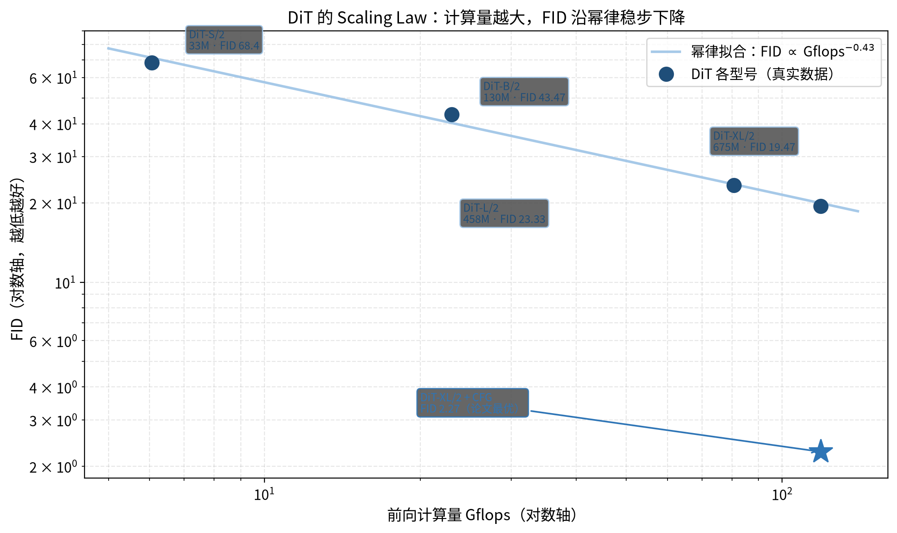

图中四个蓝点是 DiT 四个型号的真实数据（S/2、B/2、L/2、XL/2），在双对数坐标上几乎落成一条直线——这就是幂律。右下的星号是 DiT-XL/2 叠加 CFG 后的最优点（FID 2.27），CFG 是额外技巧，故不在拟合线上。

为什么 scaling law 这么重要？因为它回答了一个工程上最关键的问题：**如果我投入 10 倍算力，能得到多少质量提升？**

- U-Net 时代没能拿出这样一条干净、可外推的曲线——它的多尺度结构在放大时要重新平衡跳跃连接、通道数、层数，性能和规模的关系不清晰，投资大规模训练更像赌博。
- DiT 只需"加层数 + 加宽度"就能扩展，FID 随算力按幂律下降、斜率稳定。这给了业界信心：投入更多算力是值得的，回报是可预测的。

> **跨篇呼应**：这和 LLM 的 Chinchilla scaling law 扮演同样的角色。Chinchilla 告诉你"加 10 倍算力，loss 降多少"；DiT 的 scaling law 告诉你"加 10 倍算力，FID 降多少"。两者都把"要不要投入更多算力"从赌博变成了可计算的投资决策。这是整个领域从 U-Net 切向 DiT 的真正动因——不是"Transformer 更时髦"，而是"Transformer 给了可预测的扩展路径"。^[18]^

### 9.3.4 为什么 DiT 特别适合视频生成

视频生成比图像生成多了一个时间维度。$T$ 帧视频的 token 数是单帧的 $T$ 倍，所有 token 之间的关系要从"空间内"扩展到"时空联合"。

**3D U-Net 的困境**：卷积核是三维的（宽$\times$高$\times$时间），但时间维度的卷积核通常只覆盖 3-5 帧。要看第 1 帧和第 30 帧的关系，得堆 8+ 层卷积让感受野逐层扩大。这在图像上还行（空间分辨率不高），在视频上极其笨重——视频的时序依赖动辄几十帧，卷积的感受野追不上。

**DiT 的优势**：自注意力天然是全局的——所有 token 互相看到，第一层就能建立"第 1 帧的某个 patch"和"第 30 帧的某个 patch"之间的直接联系。配合分离时空注意力（§8.1.2：空间注意力对每个时间位置做 $O(T \cdot n^2)$，时间注意力对每个空间位置做 $O(n \cdot T^2)$，而不是全时空 $O((nT)^2)$），DiT 在视频上的长程时序建模能力远超 3D U-Net。

**图38**：DiT 在视频生成中的时空注意力优势

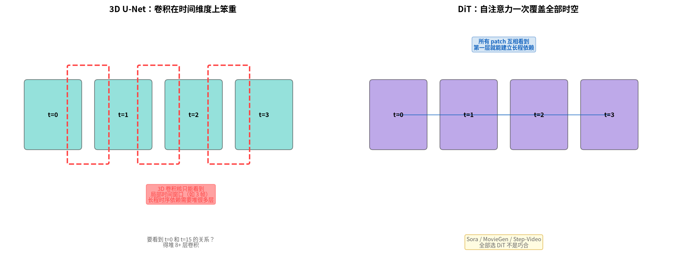

这就是为什么几乎所有主流视频生成模型——Sora、MovieGen、Step-Video-T2V、Wan 系列——都选 DiT 架构。不是巧合，是自注意力的全局性在时间维度上的必然优势。

**数字演示**：视频 token 数的规模

一段 16 秒、$1920\times1080$、24fps 视频，用 VAE 压缩后（8$\times$空间下采样 + 4 通道）：
- 单帧潜在特征：$240 \times 135 \times 4 \approx 130{,}000$ 维
- 16 秒 $\times$ 24fps = 384 帧
- 总 token 数（$2\times2$ patch）：$120 \times 68 \times 384 \approx 3.1 \times 10^6$ 个 token
- 对比：GPT-4 的上下文窗口约 $128 \times 10^3$ 个 token，而现在主流 LLM 已扩到 128K-1M

视频 DiT 处理的 token 数是 LLM 上下文窗口的 24 倍。这就是为什么视频生成的算力需求远超文本——同一个 Transformer 架构，但 token 序列长了一个数量级以上。

### 9.3.5 从 DiT 到 MM-DiT：SD3 的架构创新

DiT 用自注意力处理图像 token，文本条件通过 adaLN 注入（和 $t$ 一样）。这是一种"单向注入"——图像 token 互相看到，但文本 token 不参与注意力，只是作为条件调制。

Stable Diffusion 3 的 **MM-DiT**（Multimodal DiT）做了关键改进：把文本 token 和图像 token **拼在一起**，共享同一个自注意力层，但用**独立参数**做投影。这样文本 token 和图像 token 在每一层都能互相看到——文本可以"看到"图像当前长什么样，图像也能"看到"文本要求什么。梯度双向流动，多模态对齐更强。^[22]^

这是 DiT 走向多模态的方式，和 LLM 接入多模态的路径一致——多模态接入的本质是把不同模态的 token 拼进同一个注意力。

**小结**：DiT 的意义不是"换了个网络结构"，而是三件事的合力——(1) 弱归纳偏置让模型从大数据中学到更丰富的模式；(2) 可预测的 scaling law 给了业界投入大规模算力的信心；(3) 全局自注意力让视频生成的长程时序建模成为可能。§9.5.6 会展示 DiT 如何与 Rectified Flow Matching 组合，成为 2024-2026 年工业界的标配。dual-stream 相比交叉注意力、单流两个家族的综合优势，后来又被 i1（2026）在统一基线上所做的三骨架对照实验系统地证实（§9.5.7）。

## 9.4 推理时控制

前六章的条件控制（CFG、ControlNet、LoRA）都在**训练时**完成——改了模型或加了模块，推理时直接用。但如果不想动训练好的权重，只在采样时引入控制呢？这条路在工程上很有吸引力：不动权重意味着零训练成本，可以即插即用地叠加到任何预训练扩散模型上。

**三类推理时控制方法，按理论精确性递减**：

**1. 精确方法：Doob 变换（理论可行，实践不可算）**。给定一个目标分布 $q(x)$（比如"猫的图片且背景是海滩"），可以用 Doob $h$-变换构造一条修改后的 SDE 轨迹，使得采样精确服从 $q$。数学上漂亮——它是**路径条件**意义上的精确解（把扩散过程条件到"最终命中目标"这个事件上，用价值函数重加权轨迹）。但构造 $h$-变换需要知道**价值函数** $V(x, t) = \mathbb{E}[\mathbf{1}_{\text{目标}} \mid X_t = x]$（"从当前状态出发，最终命中目标的概率"），而这个量需要积分整个反向过程才能算——计算量与跑一遍完整采样相当，等于没有加速。所以 Doob 变换在扩散模型里是理论参照点，不是工程方案。

**2. 无偏近似：序贯蒙特卡洛 / 粒子滤波**。用一组粒子（多条并行采样轨迹）近似价值函数，在每步根据粒子是否满足目标条件重新加权（权重高的粒子"繁殖"，权重低的"淘汰"）。这是统计学的经典工具，理论上有无偏性保证。代价是：粒子数少了方差大（条件控制不精确），粒子数多了计算量是单条采样的 $N$ 倍（$N$ 是粒子数，通常 64-256）。在扩散模型里，每步的"条件检查"需要跑一次分类器或评估器（比如"这张图是猫吗？"），$N$ 个粒子 $\times$ 50 步 = 数千次网络前向，比 CFG 的 2 次前向贵几个数量级。

**3. 有偏但实用：推理时 RL / 引导微调**。训练一个小型策略网络（或"控制器"），在采样过程中动态调整每步的去噪方向——比如把采样轨迹推向"更符合目标条件"的区域。策略网络用 RL 训练（奖励 = 最终生成样本满足条件的程度），训练好后推理时只需额外一次小网络前向。代价是引入**偏差**——策略网络学到的调整不一定精确对应目标分布，可能过度修正或修正不足。但速度只比纯采样慢一点（额外一个小网络），工程上可行。

| 方法 | 精确性 | 计算代价 | 实用性 |
|------|--------|---------|--------|
| Doob 变换 | 精确 | 不可算（需积分整个反向过程） | 理论参照 |
| SMC / 粒子滤波 | 无偏 | $N \times$ 单条采样 | 高方差或高成本 |
| 推理时 RL | 有偏 | 额外一个小网络前向 | 实用但需调参 |

**为什么推理时控制在扩散模型里不如在 LLM 里流行？** LLM 的推理时控制（beam search、constrained decoding）几乎零额外成本——只需要改解码逻辑。扩散模型的每步采样都要跑一次完整的 U-Net/DiT 前向，任何在采样过程中插入的"检查"或"调整"都意味着额外的网络前向，成本敏感。所以实践中，能放进训练的尽量放进训练（CFG、ControlNet），推理时控制主要用在"不想重训但想临时加约束"的场景（如安全过滤、后处理修正）。

**图39**：推理时控制路线图

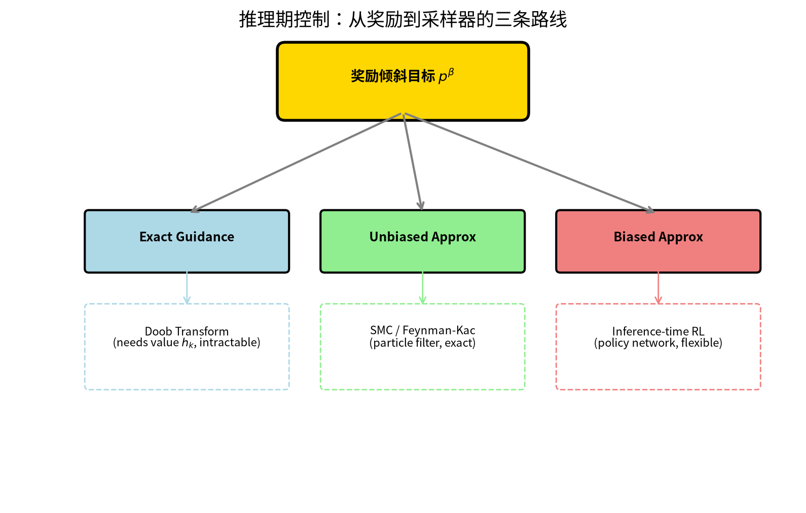

## 9.5 超越 DDPM：同一片画室，不同的技法

> 扩散 SDE 是"从噪声生成"的一种技法，但不是唯一技法。下面几条路线共享同一个起点（白纸/噪声）和终点（成品/图像），只是中间的作画逻辑不同。

| 方法 | 路径 | 与扩散的关系 |
|------|------|-------------|
| 流匹配 | 直接学习向量场 | 共享 ODE 语言，路径可任意（不限于高斯噪声） |
| 整流流 | 把弯曲的扩散路径"拉直" | 扩散路径的确定性简化，更少步数 |
| 一致性模型 | 一步从噪声到数据 | 扩散 ODE 的蒸馏，极限加速 |

### 9.5.1 流匹配与整流流：从晕染到平涂

**流匹配的核心优势：直接回归向量场，无需 Tweedie**。扩散模型的训练是"学分数 $\nabla \ln p_t$"，采样时要靠 Tweedie 恒等式把分数转成去噪方向（$\varepsilon$-MSE 是这个转换的产物）——多绕了一层。**流匹配直接让网络学 ODE 的速度场** $v_\theta(x, t)$——还记得 §5.1 推导出的概率流 ODE 速度场 $v = f - \frac{1}{2}g^2 \nabla \ln p$ 吗？扩散模型需要先学分数再代入这个公式才能得到速度场，而流匹配直接学速度场本身，跳过了分数这个中间人。训练目标是 $\|v_\theta(x_t, t) - v^*(x_t \mid x_0)\|^2$，其中 $v^*$ 是从 $x_0$ 到目标点 $x_1$ 的**条件速度场**（比如直线路径 $v^* = x_1 - x_0$，指向噪声方向）。采样时 $t$ 从 1 递减到 0，Euler 步为 $x_{t-\Delta t} = x_t - v_\theta \cdot \Delta t$（速度指向噪声，反着走就是去噪）。^[19]^

> **记号切换提示**：流匹配惯例与前 8 章不同——**$t \in [0, 1]$ 而非 $[0, T]$；$x_0$ 仍是数据，但 $x_1$ 表示"路径终点"（通常是噪声端 $\mathcal{N}(0, I)$ 的样本），而不是前面章节里的"加噪 1 步后的中间状态"**。流匹配的 $t$ 方向与前8章一致（$t$ 增大=加噪），采样时反向走（$t$ 从1到0）。唯一区别是 $t \in [0,1]$ 而非 $[0,T]$，以及噪声端记为 $x_1$ 而非 $x_T$。本节涉及的所有 $x_1$、$t$ 都遵循这个流匹配约定，看到时不要与 §1-§8 的记号混淆。

好处有三：(1) 不需要 Tweedie 转换，网络输出直接就是采样时用到的量；(2) 路径可以任意设计——不必是高斯扩散那种弯路径，可以是从数据到噪声的直线，路径越短采样越快；(3) 训练目标更稳定，因为速度场在所有 $t$ 下的量级相近，不像分数在 $\sigma_t \to 0$ 时会爆炸。**整流流** 是流匹配的特化——用直线路径，再迭代"回流"进一步拉直，最终 1-4 步就能生成。^[20]^

用绘画的话讲：流匹配直接回归向量场，省去了 Tweedie 转换这一步——就像画家不再依赖"湿底稿自然沉淀"的水彩晕染，而是直接用刮刀平涂，颜料从 A 点到 B 点走直线。整流流进一步把原本弯曲的晕染路径"拉直"，路径越短，作画自然越快。

> **扩散 ODE 是流匹配的一个特例**。这里有个容易漏掉的包含关系：§5.1 推出的概率流 ODE $\frac{dx}{dt} = f - \frac{1}{2}g^2\nabla \ln p$ 是"高斯路径下的速度场"——路径是**被 SDE 前向过程决定**的、弯弯曲曲的高斯扩散路径。流匹配把"路径"这层自由度**暴露出来**：你可以选**任意**路径（直线、样条、贝塞尔曲线……）从 $p_0$ 到 $p_1$，然后学对应的速度场。扩散 ODE 只是"高斯路径 + Tweedie 转换"这个特定选择。整流流进一步把路径限定为直线（最短路径），换取采样步数最少。**关系图**：`流匹配 ⊃ 扩散 ODE ⊃ DDIM`——每一层是上一层加了一个额外约束的特例。这就是为什么这些方法能互相翻译：它们的数学骨架是同一个 ODE 学习框架。

**工程采纳现状：数学上是包含，工程上是替代**。上面的关系图是**数学的**——流匹配理论上包含扩散 ODE。**工程的**实践是另一回事：新一代生成模型直接把训练骨架从 DDPM/EDM 换成 Rectified Flow / Flow Matching，不再从"分数 + Tweedie"的路径起手。^[21]^

| 领域 | 代表工作 | 采用 | 时间 |
|------|---------|------|------|
| 高分辨率图像 | **Stable Diffusion 3** | Rectified Flow | 2024 |
| 高质量图像 | **FLUX.1** (Black Forest Labs) | Rectified Flow | 2024 |
| 视频生成 | **Meta MovieGen** | Flow Matching | 2024 |
| 显式 3D 生成 | **Microsoft TRELLIS**（结构化 3D） | Rectified Flow | 2024 |
| 世界模型（生成式仿真派）| **Wayve GAIA-2**（从 GAIA-1 的离散 token 自回归升级）| Flow Matching | 2024–25 |

但**并非全部如此**——OpenAI Sora 仍是扩散 Transformer + DDPM 目标；Google Veo 2（latent diffusion transformer）、NVIDIA Cosmos-Predict（EDM 公式 + DiT 骨架）也仍是扩散主干；学术上大量新方法（一致性模型的最新变体、多数扩散策略工作、离散扩散）同样在扩散目标语言里迭代。工程替代是**部分的、按领域推进的**，不是全行业一夜切换。

**为什么工业界愿意换？** 不是理论更优雅，是几个具体的工程好处叠加起来：

- **少步数**：Rectified Flow 的直线路径让 4-8 步采样就能匹敌 DDPM 的 50 步——推理成本直接砍一个数量级
- **训练更稳**：速度场 $v_\theta$ 在所有 $t$ 下量级相近，不像分数 $s_\theta$ 在 $\sigma_t \to 0$ 时爆炸，$\varepsilon$-MSE 在 $\sigma_t \to 1$ 时权重失衡——高分辨率训练里这个稳定性差异很关键
- **SNR 均匀**：直线路径在整个信噪比区间上均匀分布，不像扩散调度在高信噪比区过密、低信噪比区过疏
- **代码更简单**：一个 $\|v_\theta - (x_1 - x_0)\|^2$ 损失打天下，不再需要选调度、选参数化（$\varepsilon$ vs $x_0$ vs $v$ 三种预测目标）、选权重

**数学包含 vs 工程替代**：这两件事同时成立不矛盾——**数学告诉你两者是同一个框架的不同切片，工程告诉你新切片在实际部署里更好用**。把两个视角同时装在头脑里，才能真正理解"技法可换、工具可换"这句话——不是学术口号，是生成模型主干迁移的字面写照。

> **想看 RFM 到底怎么训、SD3 用了什么加料？** §9.5.6 把整套工业配方（术语澄清、reflow 迭代、logit-normal 加权、MM-DiT、伪代码）单独抽出来讲。这一节到此为概念层结束——下一节回到 §9.5 的技法总览节奏。

### 9.5.2 一致性模型与蒸馏：从临摹到制版

**一致性模型** 走另一条路：不改路径设计，而是**蒸馏**已训练好的扩散 ODE。训练一个网络 $f_\theta$，使得对同一条 ODE 轨迹上的任意两点 $(x_t, t)$ 和 $(x_{t'}, t')$，都有 $f_\theta(x_t, t) = f_\theta(x_{t'}, t') = x_0$——即网络输入 ODE 轨迹上任何一点，都直接输出干净数据 $x_0$。训练收敛后，采样只需 1 步：从噪声 $x_T$ 直接调用 $f_\theta(x_T, T)$。质量介于 DDIM 和多步扩散之间，速度快 20-100 倍。^[45]^

**图40**：扩散 vs 流匹配 vs 一致性模型

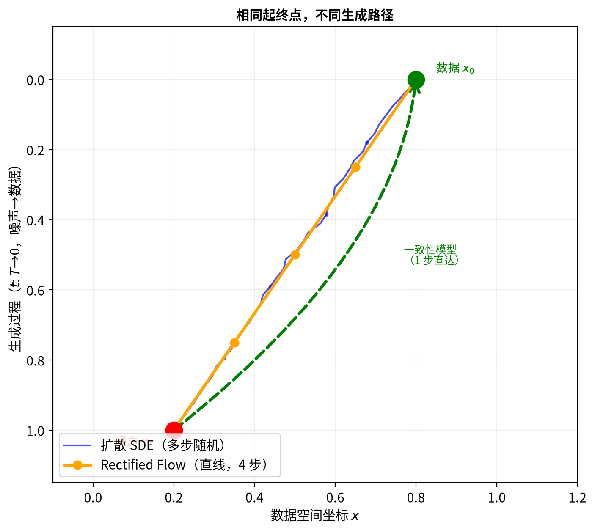

一致性模型可以看作扩散 ODE 的"快速临摹"：训练一个网络，让它对同一条晕染轨迹上的任意点都直接输出最终的干净画面。收敛后，从噪声到图像只需"一笔"——像版画制版，印出来就是成品，不再需要现场一步步画。

更广泛地，**蒸馏**有三种路线：

- **分布匹配蒸馏**：不要求复现每一笔晕染痕迹，只要求最终场景看起来一样（SDXL-Lightning）
- **对抗蒸馏**：请一位"鉴赏家"（判别器）在旁监督，学生只需 1–4 笔就能画出以假乱真的作品（SDXL-Turbo）
- **SANA-Sprint**：1 笔成画，质量反而超过 4 步的 FLUX-schnell

蒸馏不是 ODE 的"自然延伸"，而是一种"制版印刷"：它放弃了现场晕染的精确轨迹，换取出画速度。设计得当的 1 笔生成，质量可以超越多笔的教师模型。

### 9.5.3 自回归也画图像：LlamaGen

如果说 DiT 是"晕染技法 + 大板刷"，那么 LlamaGen 就是"工笔线描 + 大板刷"。它把图像切成 token，像写字一样从左到右一笔一笔勾勒，在 ImageNet 上取得了 FID = 2.18 的成绩，超越 DiT。

这说明：**同一支大板刷（Transformer），既可以用来晕染（扩散），也可以用来线描（自回归）**。晕染像从云雾中逐步显影，线描像从轮廓开始逐步细化——没有绝对的优劣，只有场景的不同：需要全局氛围时用晕染，需要严格顺序时用线描。

### 9.5.4 混合技法：各取所长

当单一技法遇到瓶颈时，聪明的画家会混搭：

- **MAR**：外层用线描决定"先画哪里"（自回归定顺序），内层用晕染决定"具体画什么质感"（扩散填内容）
- **Transfusion**：同一支大板刷（Transformer），左半边用线描理解文字，右半边用晕染生成场景
- **Show-o**：理解文字用线描（快，有 KV Cache），生成图像用拼贴（离散扩散，慢但质感好）

这些模型的共同点是：不再争论"晕染是否万能"，而是诚实地让每种技法做自己最擅长的事。

### 9.5.5 换工具不换技法：Mamba

DiS 把工具从"大板刷"换成了"海绵滚轮"（Mamba），技法仍然是晕染（SDE）。海绵滚轮的优势是**线性复杂度**——画卷拉多长，用的颜料就按比例增长；不像大板刷（Transformer 自注意力），画卷放大一倍，用量翻四倍（$O(n^2)$）。适合超长画卷（长视频），但局部细节的精细度目前仍略逊于大板刷的注意力。这再次印证：技法和工具可以独立替换。

这些方法都不是扩散模型的替代品，而是**同一语言的不同变体**——都从噪声走到数据，只是路径与工具不同。扩散 SDE 是弯弯曲曲的随机路径，整流流把它拉直成确定性路径，一致性模型直接一步跳到终点，自回归换成从左到右一笔一笔画。起点终点相同，中间的作画逻辑可以自由挑选。

### 9.5.6 案例：SD3 的 RFM + DiT 工业配方

> **初学者 bypass**：本节是给准备动手训练或做技术选型的读者的工业配方拆解。如果你只是想理解"扩散模型有哪些技法"（§9.5.1–§9.5.5 已回答），可以跳过本节，直接去 §9.6。

前面 §9.5.1–§9.5.5 分别讲清了 5 种技法的**概念定位**。本节做一个**端到端案例拆解**：把 §9.5.1 里点到但没展开的"Rectified Flow Matching + DiT"工业配方讲透——它是 SD3、FLUX、MovieGen、GAIA-2 的共同训练骨架，也是 2024-2026 年图像与视频生成工业的事实标准。

**术语澄清**：

- **FM (Flow Matching)** = Lipman 等人的通用框架，学 ODE 速度场，路径可任意。^[19]^
- **RF (Rectified Flow)** = Liu 等人提出，FM 的一个特化——路径限定为**直线**（$x_t = (1-t)x_0 + t x_1$）。^[20]^
- **RFM (Rectified Flow Matching)** = 业界口头术语，指"用 Flow Matching 损失训练一个 Rectified Flow"——即 FM 的算法框架 + RF 的路径选择。SD3 论文中直接叫 Rectified Flow Transformer

**天真做法为什么不够直**：

直觉上，如果条件路径直接选为 $x_t = (1-t)x_0 + t x_1$（$x_0 \sim$ 数据分布，$x_1 \sim \mathcal{N}(0, I)$），那每条条件轨迹已经是直线——似乎不需要"拉直"这一步。但**关键陷阱**：训练时 $(x_0, x_1)$ 是**独立随机采样**的，多条直线在 ODE 空间里**会互相穿插交叉**。网络学到的**边缘速度场** $v_\theta(x, t) = \mathbb{E}[v^* \mid x_t = x]$ 是在这些交叉点上做**期望平均**——平均结果**不再是直线**，反而是弯曲的（想象两条方向相反的直线穿过同一个点，取平均后是一个短向量，路径在交叉点附近突然减速再加速）。**"每条条件轨迹是直线"和"网络实际学到的边缘 ODE 是直线"是两回事**——这就是需要 Rectified（拉直）的根本原因。

**Reflow 迭代：真正的"拉直"算法**

Rectified Flow 的核心创新是 **reflow 迭代**——通过重训消除路径交叉：

1. **第一轮（1-Rectified Flow）**：用独立采样的 $(X_0, X_1)$ 训练一个流匹配网络 $v_\theta^{(1)}$，损失 $\|v_\theta^{(1)}(x_t, t) - (X_1 - X_0)\|^2$。这一步得到的速度场**已经能生成，但路径仍弯曲**（因为独立采样的配对在空间里交叉）
2. **生成新配对**：用 $v_\theta^{(1)}$ 从大量噪声样本 $X_1$ 出发做 ODE 积分，得到对应的数据样本 $\hat{X}_0$。这些 $(\hat{X}_0, X_1)$ **不再独立**——每对是 $v_\theta^{(1)}$ 的 ODE 生成的**因果对应**关系
3. **第二轮（2-Rectified Flow）**：用**新配对** $(\hat{X}_0, X_1)$ 训练一个新网络 $v_\theta^{(2)}$，同样用 $\|v_\theta^{(2)}(x_t, t) - (X_1 - \hat{X}_0)\|^2$。**关键效果**：新配对之间几乎不再交叉（一次 ODE 积分已经确立了"哪个 $X_1$ 对应哪个 $\hat{X}_0$"），所以 $v_\theta^{(2)}$ 学到的边缘 ODE**逼近真直线**
4. **可选：再迭代**（$k$-Rectified Flow，$k \geq 3$）——理论上迭代下去路径完全直化，但实践中一次或两次 reflow 已经够用

**更深一层**：reflow 的实质不只是"消除交叉"，而是逼近**传输代价更小的耦合**。每轮 reflow 用上一代映射的 ODE 轨迹定义新配对 $(X_1, \hat{X}_0)$，等价于在边缘分布不变的前提下寻找传输代价更小的配对方案。路径变直是传输代价减小的**几何表现**——直线恰好是两点间代价最小的路径。多轮迭代持续减小传输代价，逐渐逼近最优传输映射——路径变直和传输代价减小的单调性已有证明，严格的 OT 收敛性仍是开放问题。^[20]^

**几何直观**：把配对看成“定向投递”。第一次训练是“随机投递”——两条路径可能在中间交叉（路径交叉），中间点上速度场变得纠结。Reflow 相当于用第一次的结果**重新指定投递关系**——每个 $X_1$ 已经"确定"了它跟 $v_\theta^{(1)}$ 走过的 $\hat{X}_0$，重训时按这个认定的配对学速度场，路径就不再纠结了。

**为什么直线路径能让采样步数骤降？**

Rectified 之后，学到的 ODE 轨迹**接近直线**（2-Rectified Flow 以上更接近，但不是数学上完美的直线）。用 Euler 数值积分时，**直线上 Euler 步的截断误差为零**——近似直线上截断误差极小但不严格为零（残余曲率 $\propto$ 路径与直线的偏差）。这就是为什么 2-Rectified Flow 用 **1 步采样**都能生成高质量图，SD3 和 FLUX 用 4-8 步就能匹敌 DDPM 的 50 步。^[20]^ **"近似直线 = 少步"不是玄学，是数值积分的基本事实：路径越直，Euler 的每步截断越小，同样精度需要的步数越少。**

**SD3 的工业实用配方**

Esser 等人（SD3 论文）在纯 RFM 基础上加了几个训练技巧，这些是把 RFM 从学术算法推到工业级 SOTA 的关键。^[22]^

- **Logit-normal 时间采样**：训练时 $t$ 不再均匀采样，而是从 $\text{logit-normal}(0, 1)$ 分布采（中间时刻权重高、两端权重低）。原因：$t=1$ 附近（接近噪声）和 $t=0$ 附近（接近数据）都比较"简单"，中间的 $t$（噪声和数据混合区）才是最难学的——把训练资源集中在这里
- **不做 reflow**：SD3 实际上**只跑一轮 flow matching**（不做 reflow 迭代）。原因是 reflow 在超大规模上 tradeoff 翻转：每轮 reflow 用上一代模型的采样当训练数据，会累积教师偏差（学生学教师的 ODE 生成分布，偏离真实数据分布），质量损失超过步数减少的收益。SD3 仍需 20-40 步采样达到 SOTA，说明它的路径并没"直到一步到位"——不做 reflow 不是因为其他技巧替代了它，而是因为在大规模上 reflow 的代价超过了回报
- **MM-DiT（Multimodal DiT）**：把文本 token 和图像 token 拼在一起，共享自注意力但用独立参数——文本流和图像流在每个 attention 里互相看到，梯度双向流动，多模态对齐更强。这是 SD3 相比 DiT 的核心架构创新
- **shift 参数**：推理时对时间做**非均匀离散化**（把更多步数放在中间 $t$ 上，与 logit-normal 训练配合）

**RFM 完整训练流程（工业配方）**：

输入：数据集 $D$、DiT 主干、文本编码器\
步骤 1：均匀采样 $X_0 \sim D$、$X_1 \sim \mathcal{N}(0, I)$、$t \sim \text{Logit-Normal}(0, 1)$\
步骤 2：构造 $x_t = (1 - t) X_0 + t X_1$\
步骤 3：预测速度 $v_\theta(x_t, t, \text{condition})$（DiT 前向）\
步骤 4：损失 $\mathcal{L} = \| v_\theta(x_t, t, c) - (X_1 - X_0) \|^2$\
步骤 5：反向传播、更新参数\
（可选）步骤 6：训练收敛后跑一轮 reflow——用当前模型生成 $(\hat{X}_0, X_1)$ 配对，重训一遍\
推理：从 $X_1 \sim \mathcal{N}(0, I)$ 出发，用 4-8 步 Euler 积分（配 shift 时间调度）到达 $X_0$

**RFM + DiT 组合的核心优势为什么强**：

- **DiT 提供扩展性**：Transformer 主干让参数量、数据量、图像分辨率都能线性堆——U-Net 的强归纳偏置在更大规模下缺乏同样被验证的扩展路径
- **RFM 提供训练效率**：直线路径 + logit-normal 加权让训练 loss 曲面平滑，学习率可以拉高，收敛快
- **RFM 提供推理效率**：4-8 步匹敌 DDPM 50 步——工业部署的成本直接砍一个数量级
- **RFM + DiT 是同构的**：都是"直接学从 A 到 B 的映射"，没有 U-Net 那种编码器-解码器的耦合，DiT 的每一层都可以被视为速度场的一次"雕琢"

**桥接 §9.6**：

现在你应该看清了 "DiT + RFM 训练层收敛" 这句话的含义——**不是随便两个技术凑一起**，而是"扩展性强的架构 + 训练/推理都高效的目标"被业界独立复现了七八次，成为了工业最优解。这不是学术偏好，是被 SD3、FLUX、MovieGen、GAIA-2、Step-Video-T2V、Wan、GigaWorld、HY-Motion 用超大规模训练**投票投出来**的组合。至于**架构层的岔路**（VLM 塔怎么焊、长程状态怎么管），那是 RFM + DiT 骨架之外要单独解决的问题——下一节 §9.6 展开这些还在竞争的路线。

### 9.5.7 案例：i1——300 个对照实验，把配方从玄学变成工程学

> **初学者 bypass**：本节与 §9.5.6 同类，面向准备动手训练或做技术选型的读者，不引入新数学。它回答一个比"配方是什么"更实际的问题——**配方里的每个设计选择，哪些真的重要？** 只想理解技法的读者可直接去 §9.6。

§9.5.6 拆解了 SD3 的 RFM + DiT 工业配方，但那是工业报告的**打包发布**：架构、训练、数据的决定捆在一个模型里给出，消融有限、训练数据不公开——你没法知道"MM-DiT 到底比交叉注意力好多少"、"换文本编码器值不值"。对学习者来说，真正的瓶颈不是记不住结论，而是**归因**——不知道哪个证据支撑哪个决定。

i1（权重、代码、数据全开源）把这件事反了过来：先做 **300 多个受控实验**（700K+ TPU 小时）——固定同一起点，每次只改一个设计选择，观察指标如何变动；再把验证过的选择组合成一个 3B 模型。全部结论可以压缩成一句话。^[23]^

> **一句话**：**条件看容量不看数量，数据看对齐不看规模**——把算力花在条件通路的容量和训练/推理的对齐上，而不是堆编码器数量、堆 AdaLN、堆数据规模。

**实验怎么设计（这段本身就是可复用的方法）**

- **统一起点**：256 分辨率的 XL/2 基线——LightningDiT 骨架 + QK-norm + 长跳连接 + T5Gemma-2B 文本编码器 + FLUX.2 VAE，配 12 个公开数据集与 VLM 合成的长 caption；
- **单变量原则**：每个实验只动一个设计，绝不叠加——同时动两个变量就说不清归因；
- **统一训练与评测**：flow matching 目标（§9.5.1）+ logit-normal 时间采样（与 SD3 同款，见 §9.5.6）；DPG-Bench（指令跟随）/ PRISM（美学）/ LongText-Bench（文字渲染）三个基准分别评测。

这套做法并非 i1 首创：EDM 就用消融厘清了训练技巧层的设计空间，即"设计空间阐明"；i1 把同一套功夫推进到了架构和数据两层。^[21]^（跨篇呼应：《AI law》的核心主张之一——经验规律只有在控制变量之后才配叫规律。）

**深讲三条：每条都挂着你已经学过的概念**

**F-A 条件通路：容量比数量重要（呼应 Ch6）**

现象：把两个文本编码器的特征拼起来有提升；但把同一个编码器的特征**重复两遍**、配上更大的适配器，收益差不多——而共享适配器时重复特征几乎无收益。由此推断：收益很可能来自**适配器多出来的参数容量**，而不是"多个编码器的多样性"。何况加编码器会拉长文本序列（注意力成本随序列长度增长），加大适配器不会——同样的参数预算，花在不加长序列的地方更划算。i1 的选择：单个强编码器（T5Gemma-2B）+ 两块 Transformer 组成的适配器。

**F-B 教科书默认也会被推翻（对话 §9.3.2）**

现象：DiT 用 adaLN-zero 把 $t$ 和条件注入每一层（§9.3.2 刚讲过），AdaLN 参数量不小；但对照实验发现去掉 AdaLN 性能基本不掉（多个变体甚至略升），还省下约 0.23B 参数（0.89B → 0.66B）。论文还引述先前研究：去掉噪声条件化影响很小，对 flow matching 目标尤其如此。一种可能的解读（是解读，不是定论）：速度场对 $t$ 的逐层调制依赖不强，条件信息已由文本-图像的注意力交互承载。要点不是"AdaLN 不好"，而是：**任何"标配"都该经受单变量对照的检验——读论文要看消融表，不要只看叙事。**

**F-C 训练/推理要对齐（一条可迁移的原则）**

现象：只用长 caption 训练的模型整体更强，但在 GenEval 的短 prompt 上反而崩（0.17，而短 caption 训练为 0.47）；推理时用 LLM 把短 prompt 改写成详细描述后，长 caption 模型反超（0.73，对比短 caption 训练的 0.60）。为什么？模型见过的文本分布全是长描述，短 prompt 是分布外输入——这不是能力问题，是**训练分布与使用分布没对齐**；提示词改写等于在入口处把用户分布搬回训练分布。迁移：凡"训练时的输入形态"与"真实使用的输入形态"可能脱节的系统（微调、RAG、agent），先问这一句：对齐了吗？

**其余七条速览**（方向比名词重要）

| 发现 | i1 的选择 |
|:---|:---|
| 三骨架家族对照中 dual-stream 综合最优（证实 §9.3.5 的 MM-DiT） | dual-stream MM-DiT |
| 长跳连接改善性能-参数权衡（被忽视的老设计） | 保留长跳连接 |
| 合成 caption 用哪个 VLM，显著影响下游质量 | 全库统一用一个强力 VLM 生成 |
| 数据集混合：权重越均匀越好，等权是强默认 | 各数据集等权采样 |
| 等权之上删掉最弱数据集还能再涨 | 删掉单数据集评测中最弱的那个 |
| 混合足够多样时，重复数据的代价很小 | 高分辨率阶段按需子采样 |
| 高分辨率微调不需要同广度的高分辨率数据 | 按"短边达标"过滤即可 |

**成绩与边界**：配方组合出的 i1-3B 在 1024 分辨率上取得 DPG-Bench 86.73 / PRISM 70.1 / LongText-Bench 0.922，全面领先其他开源模型（五基准平均高 29.5 个百分点），GenEval 0.84 与 GPT Image 1 持平。边界也要说清楚：把镜头拉到全部开源权重模型，6B 的 Z-Image 与 20B 的 Qwen-Image 在多数基准上仍高于 i1（i1 仅在 CVTG-2K 上反超 Qwen-Image）——它的赢面在别处：用约为 Qwen-Image 1/7 的参数做出了全开源阵营的历史最好成绩，且**每个设计都有消融背书、全程可复现**。训练分三段渐进（256 段 162.9M 图 → 512 段 9.7M 图 → 1024 段 4.3M 图），高分辨率段数据靠过滤而非重新收集。

> **读者带走的三个判断**：
> 1. **配方可学**——全开源意味着可以把它当起点复现和改造，而不是仰望产品发布稿；
> 2. **默认可质疑**——adaLN-zero 这样的教科书默认也会被消融推翻；评估任何"标配"，先找单变量对照的证据；
> 3. **尺子可迁移**——下次读到"我们的新技巧带来提升"，先用下面的四把尺子量一量。

**实践清单：读任何生成模型报告的四把尺子**

1. **归因**——单变量对照，还是打包发布？
2. **消融**——删掉最大的模块（如 AdaLN）掉多少点？
3. **对齐**——训练数据分布和使用分布一致吗（caption 长度、prompt 风格）？
4. **混合**——数据权重怎么定的：拍脑袋、等权，还是调出来的？

## 9.6 扩散在世界模型路线之争中的位置

> **跨篇分工**：世界模型六流派全景分类、生成派 vs JEPA 派详析、渲染器→模拟器框架、胜负手三件事（物理状态维护/多智能体共享/sim-to-real 校准）——这些在《基座模型》§6.2。本节只回答一个问题：**扩散在这场路线之争里站在哪里**。

第 8 章讲清了扩散怎么做世界模型（§8.2 开环）和闭环控制（§8.3）。本节收束一下扩散的位置——**扩散不是唯一路线，胜负远未决出**。

**训练层已收敛**：生成式仿真派（用扩散/流匹配做世界模型）的底子用 DiT（Diffusion Transformer），损失用 Rectified Flow Matching——业界代表作（Meta MovieGen、字节 Step-Video-T2V、阿里 Wan 系列、极佳视界 GigaWorld、腾讯 HY-Motion、Wayve GAIA-2）几乎无一例外走这条路。截至 2026 年这条主干没有再动的迹象。

**架构层仍在岔路**：要不要并联 VLM 塔做高层理解（PAN 焊塔 / LWDrive 半焊 / GigaWorld 不焊）；长程状态怎么管（Memento 显式关键帧 / GIM-World 隐式几何感知 / LIVE cycle-consistency）——2026 年还有五六种解法在竞争。

**扩散的位置**：在世界模型的技术流派里，扩散属于"扩散世界模型派"——目前跑得靠前但绝非胜出。它的独特价值是能建模完整分布（同一动作对应多种可能结果），这是确定性模型做不到的。但它的根本局限是**参数大量花在拟合视觉细节上**——纹理、光照、噪点这些对决策不重要的东西也要学，训练慢、推理贵。

**下一跳的胜负手在扩散之外**：如果目标是"世界模型 OS"级别的产品，纯生成拟真解决不了问题，必须补上物理状态、多智能体、sim-to-real 三块地基（详见《基座模型》§6.2 的胜负手分析）。

> **读者要拿走的三个判断**：
> 1. **训练层不必再纠结**——DiT + RFM 是当前（截至 2026）性价比最高的起手式
> 2. **架构层仍是研究热点**——VLM 塔怎么焊、长程状态怎么管，现在动手仍有原创空间
> 3. **胜负手在扩散之外**——纯生成拟真走不到"模拟器"这一档，必须直面扩散的边界

## 9.7 前沿总览：从"唯一正解"到"自由组合"

**图41**：前沿全景

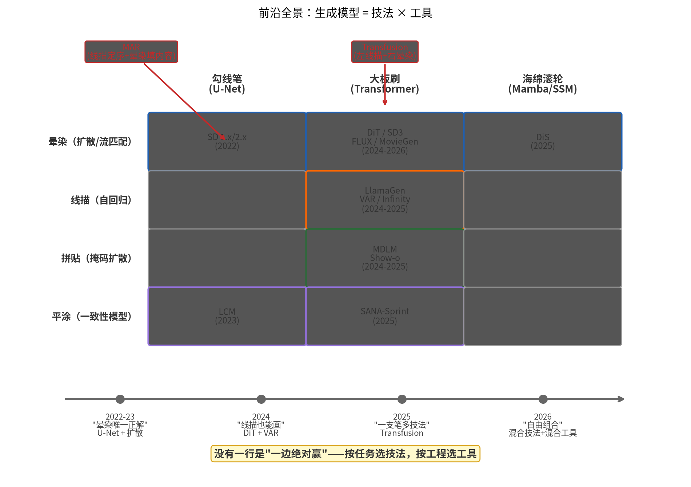

> **一句话**：**技法可以换，工具可以换，关键是组合得当**——这是当下的共识。

**自由组合：按任务选技法、按工程选工具**

| 阶段 | 主流叙事 | 实际情况 |
|:---|:---|:---|
| 早期 | "晕染是图像生成的唯一正解" | 晕染技法 + 勾线笔（U-Net） |
| 过渡 | "线描也能画出好场景" | 线描技法 + 大板刷（Transformer） |
| 混合 | "一支笔，多种技法" | Transfusion：左线描，右晕染 |
| 当下 | "各取所长，灵活搭配" | 混合技法 + 混合工具 |

**反事实思考**：假如自回归模型（线描）从未在图像生成上证明过自己，我们是否会把扩散（晕染）视为唯一正确的路径？答案是——很可能会，但这会让我们错过很多可能性。线描的成熟不是晕染的失败，而是整个画室的成长：我们终于承认，没有一种技法适合所有题材，没有一种工具解决所有构图。

**晕染（扩散）的真正价值**

它并不是要"统一一切"成为画室里的唯一声音，而是提供了三件事：

1. 一套可分析的技法语言，让我们能精确讨论"从混沌到清晰"的过程
2. 这套语言里的核心概念（分数、ODE、训练目标）可以被其他技法借用和转化
3. 帮助我们理解：为什么表面不同的方法在深层是相通的

这才是"统一"的本意——不是只有一种画法，而是多种画法能够互相听懂、彼此借鉴。

**自回归 vs 扩散：系统对比**

前面各节散落了多处对比（§7.8 离散扩散 vs AR 的速度/精度、§9.5.3 LlamaGen vs DiT、§9.6 世界模型路线），这里收拢成一张参照表：

| 维度 | 自回归（线描） | 扩散/流匹配（晕染） |
|:---|:---|:---|
| **生成机制** | 逐 token 顺序采样，$p(x)=\prod p(x_i\mid x_{<i})$ | 从噪声迭代去噪，多步 ODE/SDE 积分 |
| **训练目标** | 交叉熵（离散分类） | 去噪分数匹配 / 流匹配（连续回归） |
| **Scaling 行为** | 幂律清晰（GPT 系列验证）；视觉 AR 同样观测到幂律（VAR，NeurIPS 2024，FID 1.73，斜率 $-0.998$） | DiT 同样遵循幂律（§9.3.3 图37）；两条线的 scaling 斜率在同一量级 |
| **生成速度** | 受限于序列长度（逐 token），但首 token 延迟低（TTFT 小）；KV Cache 加速 | 受限于去噪步数，但每步可并行处理全部空间位置；蒸馏后 1-4 步可出图 |
| **可控性** | In-context learning 天然强（给例子就能续写）；Classifier-free guidance 需额外设计 | CFG 原生支持（§6.3）；ControlNet/IP-Adapter 等空间控制成熟 |
| **模态适配** | 天然适配离散序列（文本/代码/DNA）；连续模态需先 token 化（VQ-VAE） | 天然适配连续信号（图像/音频/动作）；离散模态需离散扩散框架（Ch7） |
| **多峰分布** | 每次采样走一条路径，多样性靠温度/top-p | 学完整分布 $p(x\mid c)$，天然多峰（§8.3 扩散策略的核心价值） |
| **错误模式** | 误差累积（前面错，后面跟着错） | 全局去噪，无顺序依赖；但步数不够时全局模糊 |
| **双向上下文** | 单向（只看前文）；双向需额外设计（如 BERT，但不能直接生成） | 天然双向（每步去噪看到全部位置） |

**关键判断**：没有一行是"一边绝对赢"。当下的共识是**按任务选技法，按工程选工具**——这正是"技法 $\times$ 工具"框架的实用价值。

**融合前沿：从"二选一"到"一个模型里共存"**

| 工作 | 年份 | 怎么融合 | 关键结果 |
|:---|:---:|:---|:---|
| **VAR**（北大+字节） | 2024 | 视觉 AR 改为 next-scale prediction（粗到细），仍是自回归但脱离逐 token | ImageNet FID 1.73（超 DiT），幂律斜率 $-0.998$ |
| **Emu3**（智源） | 2024 | 纯 next-token prediction 统一文本/图像/视频的**理解+生成** | 图像生成质量接近扩散模型——证明 AR 范式在生成侧的天花板远比预期高 |
| **BAGEL**（字节） | 2025 | Mixture-of-Transformers：共享自注意力，文本走 AR（next-token），视觉走 next-group 预测 + Rectified Flow（连续潜空间） | 7B 参数媲美 GPT-4o 的图文理解+生成（论文口径），开源 |
| **DDO**（清华+NVIDIA） | 2025 | 把似然模型当隐式判别器，统一扩散/AR 的训练目标 | ICML 2025，刷新了当时图像生成的 SOTA——训练层也可以统一 |
| **DiffusionGemma**（Google） | 2026 | 26B MoE，用扩散做文本的并行生成 | 速度 4× 于 AR Gemma，256K 上下文；但质量仍逊于同规模 AR——**文本域扩散尚未翻盘** |
| **Nemotron-Labs-Diffusion**（NVIDIA+MIT） | 2026 | AR + 扩散 + 自推测解码三合一 | 单次前向 token 吞吐 6× 于 Qwen3-8B——融合架构在推理效率上已展现结构性优势 |

**三个结构性观察**：

1. **AR 在"理解+推理"侧的统治地位未动摇**——in-context learning、chain-of-thought、tool use 都依赖顺序因果结构。扩散语言模型（DiffusionGemma、Dream、MDLM）在速度上有优势，但 perplexity 和下游推理任务仍落后于同规模 AR——系统评测确认了这一点。^[49]^
2. **扩散在"连续信号生成"侧仍是主力**——图像/视频/动作/3D 的 SOTA 几乎全走 DiT + RFM（§9.5.6）。AR 视觉生成（VAR/Infinity）证明了可行性，但工业级文生图/视频产品（FLUX、MovieGen、Wan）仍选扩散路线。
3. **融合不是折中，是分工**——Transfusion/Show-o 的设计是"理解用 AR（快、有 KV Cache、因果推理强），生成用扩散（全局一致、连续、多峰）"；BAGEL 用 MoT 实现同一分工：共享自注意力桥接理解与生成两个专家，文本走 AR、视觉走 Rectified Flow（纳入 next-group 预测框架）。这不是"各打五十大板"，而是让每种技法做自己**数学上最自然**的事。

> **跨篇引用**：AR 范式在基座模型中的核心地位和它的生成边界，见《基座模型》§6.2 末尾的"AR 范式的生成边界"。两大范式的数学对照（交叉熵 vs 分数匹配），见《AI数学》Ch7 第五场转移。

> **边界提醒**：这个"技法 $\times$ 工具"矩阵只装得下**生成派**——都以"能采样出具体样本"为共同目标。JEPA 派（潜空间预测表征、不生成像素）不在里面，属于本书之外的另一套语言，§9.6 已详述其立场。

## 9.8 本章回顾

**本章自检**：

**1.** 流匹配和扩散模型是替代关系吗？一致性模型和扩散 ODE 的关系是什么？

**2（技法 $\times$ 工具）.** DiT 和 LlamaGen 都用 Transformer（大板刷），但一个用"晕染"（扩散），一个用"线描"（自回归）。如果强行把 LlamaGen 的线描训练目标套进 DiT 的晕染结构里训练，会发生什么？

**3（技法 $\times$ 工具）.** MAR 的外层用线描决定"先画哪里"，内层用晕染决定"具体画什么"。这是"晕染包含线描"，还是"线描借用晕染的工具"？

**4（技法 $\times$ 工具）.** SANA-Sprint 用 1 笔生成超越了 4 步的 FLUX-schnell。它"继承"了教师 ODE 的晕染轨迹吗？

**5（技法 $\times$ 工具）.** 从"晕染万能"到"自由组合"，我们对"统一"的理解发生了什么变化？

**6（迁移・视频插帧）.** 你要做"视频插帧"：已知两帧画面（第 1 帧和第 30 帧），要在中间插出 28 帧让动作连贯。流匹配的速度场 $v_\theta$ 是"从 $x_0$ 指向 $x_1$ 的直线路径"，你会怎么用它做插帧？

**7（边界・推理时控制）.** 推理时控制（采样时引导）相比训练时控制（CFG/LoRA）的代价是什么？为什么推理时控制在扩散里不如在 LLM 里流行？

**8（边界・配方归因）.** i1 用"单编码器 + 大适配器"替代多编码器，又去掉了 AdaLN。这两个决定共同指向什么原则？为什么必须先搞清"多编码器的收益来自哪里"，才能回答前一半问题？

**9（迁移・数据侧）.** 你只有 i1 十分之一的算力，要训一个文生图模型。从 i1 的数据侧发现里至少说出三条"省钱不掉点"的决定，并写清各自的代价。

生成模型 = 绘画技法 × 绘画工具（两层可独立替换）\
→ 晕染/平涂/线描/拼贴 = 上层技法\
→ 勾线笔/大板刷/海绵滚轮 = 下层工具\
→ 自由组合：DiT（晕染+大板刷）、LlamaGen（线描+大板刷）、\
   SD3（平涂+大板刷）、DiS（晕染+海绵滚轮）\
→ 加速：高阶 ODE 求解器（更熟练的晕染手法，减少叠色次数）、\
   蒸馏（制版印刷，用精度换速度）\
→ 离散扩散 LLM：拼贴理论上可以一次贴完，但大板刷的双向刷法不支持"边贴边缓存"\
→ 扩散策略：晕染擅长多峰选择（多种构图都合理），但实时控制需要混合技法\
→ 趋势：从"争论谁最好"到"根据题材自由组合"

## 下一步：两条可走的路

- 想把这些生成能力放进基座模型/世界模型？→《基座模型》§6.2 的世界模型全景。
- 想把这些能力串成可靠系统？→《用好AI》从有用到好用。

 * * * 

# 附录：数学预备

> **符号速查表**：本文符号按首次出现章节排列。同一符号多义时，在"备注"列标注区分。遇到不认识的符号随时翻回此处。
>
> **使用地图**：忘了高斯性质/条件分布 → A.1；忘了期望/条件期望/塔式性质 → A.2；忘了分数/梯度/链式法则 → A.3；忘了 ODE/Euler 离散化/Fokker-Planck → A.4；忘了反向传播/训练目标 → A.5；忘了 Attention/LoRA → A.6。正文里遇到"见附录 A.x"直接翻到对应小节。

| 符号 | 含义 | 首现 | 备注 |
|:---|:---|:---|:---|
| $x_0$ | 原始数据（干净图片） | §1.2 | - |
| $x_t$ | 第 $t$ 步加噪后的数据 | §1.2 | $t$ 为离散步索引 |
| $\alpha_t$ | 单步信号保留率（$1-\beta_t$） | §1.2 | DDPM 调度 |
| $\bar{\alpha}_t$ | 累积信号保留率 $\prod_{i=1}^t \alpha_i$ | §1.2 | - |
| $\beta_t$ | DDPM 噪声调度（$1-\alpha_t$） | §1.2 | ≠ KL 强度（§6.4）≠ adaLN 参数（§9.3.2） |
| $\varepsilon$ | 标准高斯噪声 $\sim \mathcal{N}(0, I)$ | §1.2 | - |
| $t$ | 时间变量 | §1.2 | §1.2 为离散索引；§1.3 起也表连续时间，有警告 |
| $T$ | 终止时刻（纯噪声） | §1.2 | - |
| $f, g$ | SDE 的漂移/扩散系数 | §1.3 | - |
| $a_t, \sigma_t$ | 连续时间的信号缩放/噪声标准差 | §1.3 | $a_t = e^{-t/2}$（VP），$\sigma_t = \sqrt{1-e^{-t}}$（VP） |
| $s_t^*(x)$ | 真实分数 $\nabla_x \ln p_t(x)$ | §2.2 | - |
| $s_\theta$ | 网络学习的分数 | §2.3 | - |
| $\varepsilon_\theta$ | 网络学习的噪声预测 | §2.4 | $\varepsilon_\theta = -\sigma_t s_\theta$ |
| $\sigma_q$ | DDPM 采样噪声标准差 | §3.3 | ≠ 条件分布标准差 $\sqrt{1-\bar{\alpha}_t}$ |
| $\delta_i$ | NCSN Langevin 步长 | §3.4 | ≠ $\alpha_t$（DDPM 信号保留率） |
| $\eta$ | Euler-Maruyama 步长 | §3.3 | ≠ 学习率（§4.5）≠ DDIM 随机性强度（§5.2，$\eta=0$ 为确定性），三者都按惯例用 $\eta$ |
| $Y_s$ | 反向过程状态（反向时间 $s$） | §3.2 | $Y_s = X_{T-s}$ |
| $w$ | CFG 引导强度 | §6.3 | KL 框架中 $1/w$ 为正则化系数 |
| $\lambda$ | 分类器引导梯度强度 | §6.4 | ≠ OU 漂移系数（§1.4） |
| $\beta$ | KL 正则化强度（RLHF 记号） | §6.4 | ≠ DDPM $\beta_t$；本文 $\beta$ 第三种含义见 §9.3.2，第四种：掩码扩散的掩码速率 $\beta_t$（§7.2） |
| $\gamma, \beta$ | adaLN 缩放/平移参数 | §9.3.2 | $\beta$ 此处为 LayerNorm 标准记号 |

本节整合本文用到的全部数学工具。设计原则：**只讲本文用得到的**，不追求数学完备。如果对某个概念感到陌生，读完本节后再回到对应正文，会流畅得多。

## A.1 高斯分布与条件分布

**一维高斯**：$X \sim \mathcal{N}(\mu, \sigma^2)$ 的概率密度是

$$p(x) = \frac{1}{\sqrt{2\pi \sigma^2}} \exp\left(-\frac{(x-\mu)^2}{2\sigma^2}\right)$$

**多维各向同性高斯**：$X \sim \mathcal{N}(\mu, \sigma^2 I)$（$\mu \in \mathbb{R}^d$，$\sigma^2 I$ 是对角协方差），密度是

$$p(x) = \frac{1}{(2\pi \sigma^2)^{d/2}} \exp\left(-\frac{\|x-\mu\|^2}{2\sigma^2}\right)$$

**关键性质（本文反复用到）**：

1. **独立高斯之和还是高斯**：$X_1 \sim \mathcal{N}(\mu_1, \sigma_1^2)$，$X_2 \sim \mathcal{N}(\mu_2, \sigma_2^2)$，独立，则 $X_1 + X_2 \sim \mathcal{N}(\mu_1+\mu_2, \sigma_1^2+\sigma_2^2)$。—— §1.2 闭式跳步公式的地基。直觉：两个钟形叠加还是钟形，只是变得更宽——均值相加、方差相加，形状不变。这就是加噪 1000 步后整体仍是高斯的原因。
2. **线性变换保高斯性**：$X \sim \mathcal{N}(\mu, \Sigma)$，则 $aX + b \sim \mathcal{N}(a\mu + b, a^2 \Sigma)$。—— §1.2 单步加噪 $x_t = \sqrt{\alpha_t}x_{t-1} + \sqrt{1-\alpha_t}\varepsilon$ 保持高斯性靠它。直觉：缩放只拉伸钟形、平移只挪动钟形，不改变钟形身份——在有限方差分布中，高斯是唯一"被线性变换后还是自己"的分布族。
3. **对数密度的梯度是线性的**：$\nabla_x \ln \mathcal{N}(x; \mu, \sigma^2 I) = -\frac{x - \mu}{\sigma^2}$。—— §2.3 Tweedie 恒等式第1步。直觉：$\ln$ 把指数里的二次型拉成线性，梯度变成"离均值越远、指向越强"的直线——这是分数函数能算的根源。
4. **条件分布还是高斯**：如果 $(X, Y)$ 联合高斯，则 $X \mid Y$ 也是高斯。给定 $X_0$，$X_t = a_t X_0 + \sigma_t Z$ 显然是 $\mathcal{N}(a_t X_0, \sigma_t^2 I)$——这是 §1.3 说的"任意 $t$ 的条件分布都是高斯"。直觉：固定 $X_0$ 后，$X_t$ 只剩噪声 $Z$ 在动，而 $Z$ 是高斯——"已知原图，噪声观测的分布还是高斯"。

## A.2 期望与条件期望

**贝叶斯公式**：$p(x_0 \mid x_t) = \frac{p(x_t \mid x_0)\,p(x_0)}{p_t(x_t)}$——把"给定 $x_0$ 时 $x_t$ 的条件密度"翻转为"给定 $x_t$ 时 $x_0$ 的后验密度"。直觉：先验 $p(x_0)$ 是"$x_0$ 有多常见"，似然 $p(x_t \mid x_0)$ 是"从 $x_0$ 能生成 $x_t$ 吗"，分母归一化。它是概率论最基础的等式，不是随机分析的产物。—— §2.3 Tweedie 恒等式的第 3 步、§6.3 CFG 的贝叶斯翻转都靠它。

**期望** $\mathbb{E}[X]$ 是随机变量的"平均值"：$\mathbb{E}[X] = \int x\, p(x)\,dx$。线性性：$\mathbb{E}[aX + bY] = a\mathbb{E}[X] + b\mathbb{E}[Y]$。

**条件期望** $\mathbb{E}[X_0 \mid X_t = x_t]$：给定"我们观测到 $X_t = x_t$"，问 $X_0$ 的最优猜测是什么。数学上是**后验均值**：

$$\mathbb{E}[X_0 \mid X_t = x_t] = \int x_0 \cdot p(x_0 \mid x_t)\,dx_0$$

**塔式性质**（本文核心用法）：

$$\mathbb{E}[f(X_0, X_t)] = \mathbb{E}_{X_t}\left[\mathbb{E}[f(X_0, X_t) \mid X_t]\right]$$

即"先对 $X_0$ 取条件期望，再对 $X_t$ 取期望"= "直接对联合分布取期望"。—— §4.2 训练目标里 $\mathbb{E}_{t, X_0, Z}$ 的合法性、Tweedie 恒等式的第2步（把 $\nabla_{x_t}$ 挪进 $\mathbb{E}_{x_0}$）都基于此。直觉：先按 $X_t$ 的每个取值分组，组内对 $X_0$ 平均，再按各组概率加权平均——两步合起来就是"全局平均"。它回答的是"拆开来算行不行"，答案是行。

**在训练里的具体意义**：$\mathbb{E}[X_0 \mid X_t]$ 是**给定噪声观测的最优去噪估计**（在 MSE 意义下）。这就是 Tweedie 恒等式的核心——分数方向 $= \frac{a_t \mathbb{E}[X_0 \mid X_t] - X_t}{\sigma_t^2}$ 里的 $\mathbb{E}[X_0 \mid X_t]$ 就是网络在做的事。

## A.3 梯度、链式法则与两种梯度

**梯度** $\nabla_x f(x)$ 是标量函数 $f$ 对向量 $x$ 的偏导数向量：$\nabla_x f = (\partial f/\partial x_1, \ldots, \partial f/\partial x_d)^\top$。它指向 $f$ 增长最快的方向，长度是最快增长率。

**链式法则**：复合函数 $f(g(x))$ 的梯度是 $\nabla_x f = \nabla_g f \cdot \nabla_x g$（一维），多维时是 Jacobian 相乘。—— 反向传播的数学基础。

**两种梯度的区分（本文最容易混淆的一点）**：

| | $\nabla_\theta \mathcal{L}$ | $\nabla_x \ln p_t(x)$ |
|---|---|---|
| 作用对象 | 网络参数 $\theta$（几亿维） | 数据点 $x$（与图片同维度） |
| 计算方式 | 反向传播（链式法则逐层传） | 网络直接输出（学到的分数） |
| 含义 | "怎么调参数让 loss 下降" | "在数据空间往哪走概率增" |
| 用在哪 | 训练（第4章） | 采样（第3章） |

同一个 $\nabla$ 符号，作用对象不同，含义完全不同。**训练时用 $\nabla_\theta \mathcal{L}$ 调参数；采样时用 $\nabla_x \ln p_t(x) = s_\theta(x, t)$ 指方向**。一个是"学"，一个是"用"。

**为什么用 $\nabla \ln p$ 而不是 $\nabla p$？** 有三个理由：

1. **归一化无关**：$p$ 是概率密度，通常写作 $p(x) = \tilde{p}(x) / Z$（$Z$ 是归一化常数，往往不可算）。$\nabla \ln p = \nabla \ln \tilde{p} - \nabla \ln Z = \nabla \ln \tilde{p}$（$Z$ 是常数，梯度为0）。**分数对归一化常数不敏感**——不用算 $Z$ 就能算分数。
2. **数值稳定**：在数据稀疏区 $p \approx 0$，$\nabla p$ 会趋近 0（因为 $p$ 本身趋近 0），但 $\nabla \ln p = \nabla p / p$ 反而放大——它衡量"**相对变化率**"而不是"绝对变化"。稀疏区仍然给出有意义的方向。
3. **加法可分**：$\ln p(x, y) = \ln p(x) + \ln p(y|x)$，梯度直接分解。—— §6.3 CFG 公式 $\nabla \ln q^* = \nabla \ln p_0 + w\, \nabla \ln p(c|x)$ 用的正是这个。

## A.4 ODE 基础

**常微分方程（ODE）**：$\frac{dx}{dt} = v(x, t)$，$x(0) = x_0$。给定初始点和速度场 $v$，解出 $x(t)$ 的轨迹。

**Euler 离散化**：把连续时间切成小步 $\Delta t$，用 $x_{k+1} = x_k + v(x_k, t_k)\,\Delta t$ 逐步推进。每步误差 $O(\Delta t)$，$N$ 步总误差 $O(\Delta t) = O(1/N)$。

**高阶方法**：Heun（预测-修正）、Runge-Kutta（4 阶）等，每步误差 $O(\Delta t^2)$ 或更高。**优势**：同样精度下，步数可以少很多（如从 1000 降到 20）。—— §5.3 DPM-Solver 家族靠的就是这一点。

**ODE vs SDE**：SDE 多了随机项 $g\,dB_t$，每一步都注入噪声；ODE 完全确定，给定初始点，轨迹唯一。ODE 允许高阶数值方法（数值分析已有 200 年积累），SDE 的高阶方法要复杂得多（且随机噪声限制了精度收益）——这就是概率流 ODE 能大幅加速采样的根本原因。

**Fokker-Planck 方程**：$\partial_t p = -\nabla \cdot (f\, p) + \frac{1}{2}g^2 \Delta p$，描述 SDE $dX = f\,dt + g\,dB$ 引起的概率密度 $p_t(x)$ 如何随时间演化。它是 SDE 的**密度视角**——SDE 追踪单条样本的轨迹（粒子视角），Fokker-Planck 追踪所有样本合成的密度场怎么流动（场视角）。右边两项：$-\nabla \cdot (f p)$ 是漂移引起的输运，$\frac{1}{2}g^2 \Delta p$ 是布朗运动引起的扩散（热方程形式，那个 $\frac{1}{2}$ 来自 Itô 的二次变差修正）。—— §3.2 解释反向 SDE 系数 $g^2$、§5.1 推导概率流 ODE 都从它出发。

**连续性方程**：$\partial_t p + \nabla \cdot (v\, p) = 0$，描述"密度 $p$ 被速度场 $v$ 输运"。—— §5.1 从 Fokker-Planck 推 ODE 的关键中转站。

## A.5 反向传播与网络训练

**反向传播**：损失 $\mathcal{L}$ 对每层网络参数的梯度，通过链式法则逐层从输出传回输入。每一层只算自己的局部偏导，乘以上游传来的梯度。数学上是矩阵乘法链，工程上是 PyTorch/TensorFlow 的 autograd。

**梯度下降**：$\theta \leftarrow \theta - \eta\, \nabla_\theta \mathcal{L}$，沿负梯度方向更新参数，$\eta$ 是学习率。变种有 SGD（随机梯度）、Adam（自适应学习率）等，本质都是这套骨架。

**MSE 损失**：$\mathcal{L} = \|y - \hat{y}\|^2$。最小化它等价于让 $\hat{y}$ 逼近 $y$ 的条件期望 $\mathbb{E}[Y \mid X]$——这就是 §4.2 说"网络最小化 $\varepsilon$-MSE 会学到真实分数"的数学根据。

## A.6 注意力与低秩近似

**注意力（Attention）**：给定查询 $Q$、键 $K$、值 $V$（三组向量），输出

$$\text{Attention}(Q, K, V) = \text{softmax}\left(\frac{QK^\top}{\sqrt{d}}\right) V$$

直觉：查询在所有键上"看一眼"，哪里相似（$Q \cdot K$ 大）就多取那里的值。$\sqrt{d}$ 的作用是**防止 $QK^\top$ 的方差随维度 $d$ 增大而爆炸**——每个内积是 $d$ 个乘积的和，如果 $Q$、$K$ 的每个分量是独立零均值方差 1 的随机变量，那么内积的方差就是 $d$、标准差就是 $\sqrt{d}$。不除 $\sqrt{d}$ 时，$d$ 越大（比如 $d = 1024$）softmax 前的 logits 越大，softmax 输出会**趋近于 one-hot**（只关注一个位置），梯度几乎全为零，训练崩溃。除 $\sqrt{d}$ 把 logits 的方差压回 1，softmax 保持温和的软性分布。—— §6.2 CLIP 交叉注意力、§8.1 时空分离注意力、§9.3 DiT 都用到。

**低秩近似**：把大矩阵 $W \in \mathbb{R}^{m \times n}$ 近似为 $W \approx BA$，其中 $B \in \mathbb{R}^{m \times r}$，$A \in \mathbb{R}^{r \times n}$，$r \ll \min(m,n)$。参数从 $mn$ 降到 $r(m+n)$。—— §6.5 LoRA 的核心，"用低维骨架近似高维肉"。

# 附录：自检问题与答案

### Ch1 加噪声——破坏是最容易的事

**Q1. VE 和 VP 的前向 SDE 分别是什么？它们的总方差随时间怎么变化？**

卡住再看提示

VE 和 VP 处理信号的方式各是什么（缩放/不缩放）？两种调度的总方差各是什么趋势？对照 §1.4。

答案

VE：前向 SDE 为 $dX_t = dB_t$（简化形式，信号不缩放），总方差 $\sigma_t^2 = t$，随时间线性增长——方差爆炸。VP：前向 SDE 为 $dX_t = -\frac{1}{2}X_t\,dt + dB_t$，总方差恒为1——信号指数衰减（$e^{-t/2}$），噪声补上来（$\sqrt{1-e^{-t}}$），两者平方和始终为1。

**Q2. 闭式跳步公式为什么重要？两个系数的平方和为什么等于1？**

卡住再看提示

闭式跳步让你从 $x_0$ 一步到任意 $x_t$，不用从 $t=0$ 逐步走。平方和=1 保证加噪后总方差不变。对照 §1.2。

答案

重要性：训练时需要在任意噪声水平 $t$ 上练习去噪。闭式公式 $x_t = \sqrt{\bar{\alpha}_t}\,x_0 + \sqrt{1-\bar{\alpha}_t}\,\varepsilon$ 让我们从 $x_0$ 一步生成任意 $x_t$，不用从 $t=0$ 逐步走。平方和=1的原因：在 $x_{t-1}$ 已为单位方差的前提下，$\alpha_t + (1-\alpha_t) = 1$ 保证加噪后总方差仍为1，不增不减。

**Q3. 如果前向加噪不用高斯噪声，改用均匀分布或拉普拉斯噪声，Tweedie 恒等式还能成立吗？闭式跳步公式还能一步到位吗？训练目标会发生什么变化？**

卡住再看提示

想想 Tweedie 依赖高斯分布的哪个性质？非高斯下条件分布 $p(x_t|x_0)$ 还有闭式吗？对照 §1.5。

答案

都不能。Tweedie 依赖高斯分布的解析可处理性：加高斯噪声后条件分布 $p(x_t\mid x_0)$ 仍是高斯，导数和期望都有闭式。非高斯噪声下 $p(x_t\mid x_0)$ 没有解析表达式，无法一步到位。训练目标需要从 score matching 退化为更复杂的对比散度或似然估计，丧失高效闭式训练的可能。

### Ch2 分数函数——逆转需要的方向

**Q1. Tweedie 恒等式建立了哪三个概念之间的等价关系？**

卡住再看提示

Tweedie 说"分数、去噪方向、预测噪声"三者等价。把一个换成另一个，网络实际学的是什么？对照 §2.3。

答案

三者：(1) 分数函数 $s = \nabla \ln p_t(x)$；(2) 去噪方向 $(\mathbb{E}[a_t X_0 \mid X_t] - X_t) / \sigma_t^2$；(3) 预测噪声 $\varepsilon = -(X_t - a_t X_0) / \sigma_t$。关系：$s = -\varepsilon / \sigma_t$。知道任意一个，就知道其他两个。

**Q2（边界・分数失效）. 分数函数什么时候失效？如果数据流形不光滑（存在尖角/断裂），"指向流形"的分数意味着什么？多尺度分数场怎么缓解低密度区域的估计问题？**

卡住再看提示

分数只需在流形附近有效（§2.0 意味 1）。流形外/低密度区域，分数指向哪里？多尺度（§2.5）用不同噪声水平解决什么？

答案

分数函数的定义域天然只在流形附近：远离流形的点概率密度极低，$\nabla \ln p$ 的估计在这些区域没有训练样本支撑（§2.0 意味 1：网络只需要在流形周围学会"指向数据区的方向"）。流形不光滑时（尖角/断裂），"指向流形最近点"的方向在尖角处不唯一，分数场在断裂处不连续。多尺度分数场（§2.5）的解法：高噪声水平（$\sigma$ 大）把细节抹平，分数只指向整体重心（粗略方向），低密度区域在高噪声下有了样本覆盖；低噪声水平恢复精细结构。从粗到细的多尺度地图，让每个区域至少在一个尺度上有可靠方向。

### Ch3 反向 SDE——统一的采样引擎

**Q1. DDPM 采样公式是怎么从 VP 反向 SDE 推出来的？关键步骤是什么？**

卡住再看提示

从 VP 反向 SDE 出发，依次做 Euler 离散化、Tweedie 代换、调度对齐。哪一步最关键？对照 §3.3。

答案

VP反向SDE: $dY = (\frac{1}{2}Y + s)\,ds + d\tilde{B}$ → Euler-Maruyama 离散化 → Tweedie 代换 $s = -\varepsilon/\sigma_t$ → 用 DDPM 离散调度 $\bar{\alpha}_t = \prod \alpha_i$ 代换连续时间变量（$\sigma_t = \sqrt{1-\bar{\alpha}_t}$ 是 VP 调度下条件分布 $p(x_t|x_0)$ 的噪声标准差） → 代数整理得到 DDPM 采样公式。

**Q2. NCSN 的 Langevin 采样是怎么从 VE 反向 SDE 推出来的？为什么噪声系数是 $\sqrt{2\eta}$ 而不是 $\sqrt{\eta}$？**

卡住再看提示

VE 反向 SDE 的 Euler 离散化噪声系数是 $\sqrt{\eta}$，为什么 Langevin 变成 $\sqrt{2\eta}$？对照 §3.4。

答案

VE前向SDE: $dX = dB_t$ → $f=0, g=1$ → 反向SDE: $dY = s\,ds + d\tilde{B}$ → Euler离散化得 $x_{k+1} = x_k + \eta\,s + \sqrt{\eta}\,z$。但NCSN采用标准Langevin动力学，其SDE的扩散系数为$\sqrt{2}$，离散化后噪声系数变为$\sqrt{2}\cdot\sqrt{\eta} = \sqrt{2\eta}$ ——与VE反向SDE的$\sqrt{\eta}$不同，是方法选择而非数学必然。

**Q3. DDPM 和 NCSN 的训练目标在数学上等价吗？为什么？**

卡住再看提示

把 Tweedie 关系 $s_\theta = -\varepsilon_\theta/\sigma$ 代入分数匹配损失，会得到什么？对照 §3.5。

答案

等价。分数匹配损失：$\mathcal{L} = \mathbb{E}[\|s_\theta + Z/\sigma\|^2]$ 。代入 Tweedie 关系 $s_\theta = -\varepsilon_\theta/\sigma$，损失变为 $\|\varepsilon - \varepsilon_\theta\|^2 / \sigma^2$。固定 $t$ 时 $1/\sigma^2$ 不影响该 $t$ 的优化方向；但训练中随机采样 $t$ 时，它会给不同噪声水平不同的隐含权重（见 §4.3）。同一个网络、同一份数据，只是输出层缩放因子不同。

**Q4. 反向 SDE 中为什么必须保留随机项 $d\tilde{B}_s$？假设你强行去掉它做确定性去噪，生成的所有样本会出现什么问题？这和"多尺度分数场"有什么关系？**

卡住再看提示

去掉随机项 → 同一起点的轨迹分支消失。这会导致什么？对照 §3.6。

答案

前向每一步有多种可能的原始状态能生成同一个噪声点。随机项保留了这种多样性——**同一个噪声起点**可以走向不同的数据峰（轨迹分支）。去掉随机项 → **同一起点**的轨迹分支消失（§5.2 DDIM 已证明这一点：不同噪声起点仍然生成不同样本，只是同一起点不再分叉）。多尺度分数场在高噪声时只给"粗略方向"（指向整体重心），随机项在这个粗略方向上提供"分支选择"，让同一起点的样本走向不同的细节峰。

### Ch4 训练——去噪分数匹配

**Q1. 如果训练时只采样 $t \in [0, 0.2]$（低噪声，高信噪比），从不训练高噪声步，生成的图片会出现什么缺陷？这和 CFG 的 $w$ 太大导致的"模式坍塌"是同一类问题吗？**

卡住再看提示

只训低噪声 → 网络学会什么、没学会什么？对照 §4.4。

答案

缺陷：只训低噪声 → 网络只学会精细细节，没学会全局结构 → 生成的图片细节丰富但整体结构混乱（像拼贴画）。不是同一类问题：模式坍塌是"条件太强导致多样性丧失"（所有猫都一样）；低噪声-only是"缺少全局结构信息"（猫的各部分拼不起来）。

**Q2（反事实・边界情况）. 如果训练时**只在最高噪声水平** $t \approx T$（数据几乎完全被销毁）附近采样，而不训练中低噪声，采样时会发生什么？和本章 Q1 的"只训低噪声"是同一类问题还是不同问题？**

卡住再看提示

只训高噪声 → 网络学会什么、没学会什么？和本章 Q1 的"只训低噪声"对比。对照 §4.4。

答案

只训高噪声：网络只学会"往数据整体重心走"（粗略方向），没学会精细结构。反向采样时前几步（高噪声）尚可，但一旦进入中低噪声区间，分数网络给出的方向完全错——生成的图片有大致轮廓（比如"能看出是个圆形物体"）但完全没有细节（没有毛发、眼睛、纹理）。这和本章 Q1 是**对称问题**：Q1 是"只有细节没有结构"（拼贴画），Q2 是"只有结构没有细节"（模糊团块）。共同根因：训练时的 $t$ 覆盖度不完整 → 采样时未被覆盖的噪声水平上分数失效。这也从两个方向验证了 §4.4 的核心结论：**随机采样 $t$ 是框架强制要求，不是优化技巧**。

### Ch5 概率流 ODE——去掉随机性

**Q1. 概率流 ODE 和反向 SDE 产生相同的分布，为什么？（提示：从 Fokker-Planck 方程出发，利用恒等式 $\Delta p = \nabla \cdot (p \nabla \ln p)$。）**

卡住再看提示

从 Fokker-Planck 方程出发，用 $\Delta p = \nabla\cdot(p\nabla\ln p)$ 消去扩散项。对照 §5.1。

答案

Fokker-Planck: $\partial_t p = -\nabla\cdot(fp) + \frac{1}{2}g^2\Delta p$。用 $\Delta p = \nabla\cdot(p\nabla\ln p)$ 代换后，变成 $\partial_t p = -\nabla\cdot[(f - \frac{1}{2}g^2\nabla\ln p)p]$ ——这是连续性方程（质量守恒）。连续性方程对应确定性 ODE $dx/dt = f - \frac{1}{2}g^2\nabla\ln p$，该 ODE 与原 SDE 产生相同的密度演化。

**Q2. DDIM 是怎么从概率流 ODE 推出来的？它和 DDPM 的本质区别是什么（不是步数多少）？**

卡住再看提示

概率流 ODE 是确定性轨迹。DDIM 怎么把它离散化？和 DDPM 的本质区别是什么？对照 §5.2。

答案

VP的ODE: $dx/dt = -\frac{1}{2}x - \frac{1}{2}\nabla\ln p_t$ → Tweedie 代换 $\nabla\ln p = -\varepsilon/\sigma_t$ → 用 $\bar{\alpha}_t$ 参数化速度场（$\tilde\sigma_t = \sqrt{1-\bar{\alpha}_t}/\sqrt{\bar{\alpha}_t}$ 是VP调度下的噪声信号比） → Euler离散化 → DDIM。本质区别：DDIM是ODE离散化（确定性，$\sigma=0$）；DDPM是反向SDE离散化（有随机项）。它们采样自同一分布，但路径性质不同。

**Q3. 采样误差的三个来源是什么？哪个随**终止时刻** $T$ 指数衰减，哪个随**离散步数** $N$ 下降（阶数取决于数值方法），哪个被步长加权？**

卡住再看提示

采样误差有三个来源，分别随什么变化？对照 §5.4。

答案

三源：(1) 初始化误差（纯高斯初始分布与真实 $p_T$ 的偏差，随**终止时刻 $T$** 增大而指数衰减，来自 VP 的信号衰减 $e^{-T/2}$）；(2) 离散化误差（数值方法的截断误差，随**离散步数 $N$** 增加而下降，阶数由方法决定：一阶 Euler $O(1/N)$、二阶 $O(1/N^2)$、$k$ 阶 $O(1/N^k)$）；(3) 分数误差（学到的 $s_\theta$ 与真实 $s^*$ 的偏差，被每步步长 $\eta_k$ 加权）。**关键区分**：$T$（终止时刻）和 $N$（离散步数）是两个独立参数——前者管初始化误差，后者管离散化误差。

**Q4（反事实・边界情况）. 假设你训好了一个扩散模型，采样时**故意用错误的调度**——训练时用的是 VP 调度（$\bar{\alpha}_t$ 从 1 降到接近 0），采样时却用 VE 调度的公式（把噪声当作方差爆炸型来处理）。会发生什么？这个反事实揭示了训练和采样之间的什么隐藏契约？**

卡住再看提示

网络学的是 VP 调度下的分数 $s(x,k)$。换调度采样会怎样？对照 §5.6。

答案

会崩溃。网络学的是"在 VP 调度下 $t=k$ 步对应的分数 $s(x, k)$"——它输入 $(x, k)$，输出的是**假设 $x$ 是按 VP 加噪到第 $k$ 步的**分数。采样时用 VE 公式，意味着在同一个 $(x, k)$ 下网络给出的分数本应是"信号被压缩到原来的 $e^{-k/2}$、噪声方差 $1-e^{-k}$"的分数，但你却当它是"信号不变、噪声方差 $k$"的分数使用。分数方向的量级完全错乱，采样轨迹要么爆炸、要么收敛到错误的分布。这揭示了一个隐藏契约：**训练时选定的调度=采样时必须匹配的调度**。这个契约在 DDPM 里表现为"$\bar{\alpha}_t$ 训练和采样两侧完全一致"，在连续 SDE 语言里就是"前向调度 $(f, g)$ 决定了反向 SDE 的形状"。第3章的"DDPM 和 NCSN 是同一反向 SDE 的两种离散化"能成立的前提，正是**训练和采样共享同一调度**——不同调度不能互换。

### Ch6 条件控制与高效微调

**Q1. CFG 的引导强度 $w$ 太大会有什么问题？KL 正则化框架中的 $\beta$ 和 CFG 的 $w$ 扮演什么类似角色？**

卡住再看提示

$w$ 太大 → 模式坍塌。$\beta$ 和 $w$ 都在控制什么平衡？对照 §6.4。

答案

$w$ 太大会过度放大条件方向，导致所有生成结果高度相似（模式坍塌）——都是"最像猫的猫"，缺乏品种/姿态多样性。$\beta$ 和 $w$ 都控制"偏离原始模型分布" 的程度——值越大，越不顾原始模型的多样性，越强调条件/奖励。

**Q2. KL 正则化框架如何统一 CFG、分类器引导和奖励微调？三者的奖励函数分别是什么？**

卡住再看提示

KL 正则化目标里，三者的奖励函数分别是什么特例？对照 §6.4。

答案

统一目标（§6.4 的形式）：$q^* = \arg\max_q \left[\mathbb{E}_q[\ln p(c\mid x)] - \frac{1}{w}\,D_{KL}(q\|p_0)\right]$。三个特例的差别只在**奖励函数**：CFG 用 $r(x) = \ln p(c\mid x)$（条件对数似然）；分类器引导用 $r(x) = \ln p(y\mid x_t)$（类别对数似然，通过独立分类器算）；奖励微调用 $r(x) =$ 人类偏好或美学评分。**引导强度的命名差异**：图像扩散领域用 $w$（写在 $\frac{1}{w}$ 位置），RLHF 领域习惯用 $\beta$（写作 $\beta\,\mathbb{E}[r] - D_{KL}$）——在本文的约定下 $\beta = w$。核心角色一致：控制"追奖励"和"靠近 $p_0$"的平衡。

**Q3. CLIP 在文生图中起什么作用？交叉注意力如何把文本向量注入到图片生成过程中？**

卡住再看提示

CLIP 双塔各自编码什么？交叉注意力怎么把文本注入图片？对照 §6.2。

答案

CLIP训练一个文本编码器和图像编码器，让"猫的图片"和"猫的文字"在向量空间靠近。生成时，文本编码成向量 $c$，通过交叉注意力注入：图片特征作为查询 $Q$，文本向量 $c$ 作为键 $K$、值 $V$ ——图片特征查询文本语义，"哪里像文本描述，就多取哪里的值"。

**Q4（反事实・边界情况）. CFG 的公式是 $\hat{\varepsilon} = \varepsilon_{\text{unc}} + w(\varepsilon_{\text{cond}} - \varepsilon_{\text{unc}})$。如果你把 $w$ 设成**负数**（比如 $w = -1$）会发生什么？这在 KL 正则化框架下对应什么优化问题？**

卡住再看提示

$w=-1$ 意味着什么？对照 §6.4 的 KL 框架。

答案

$w = -1$ 意味着 $\hat{\varepsilon} = \varepsilon_{\text{unc}} - (\varepsilon_{\text{cond}} - \varepsilon_{\text{unc}}) = 2\varepsilon_{\text{unc}} - \varepsilon_{\text{cond}}$——**反向**放大条件方向，即让生成的图片**远离**条件 $c$。如果条件是"猫"，负 $w$ 采样会生成"最不像猫"的图片——可能是狗，也可能是抽象的非动物图。KL 框架下 $w < 0$ 对应目标 $q^* = \arg\max_q [\mathbb{E}_q[\ln p(c|x)] - \frac{1}{w}D_{KL}(q\|p_0)]$ 中 $-\frac{1}{w}$ 由负变正——正则项从"约束靠近 $p_0$"反转为"推开 $p_0$"，最优解 $q^* \propto p_0(x)p(c|x)^w$ 把条件似然因子倒转，等价于**最小化**条件对数似然。这个反事实揭示了 CFG 的一个隐藏用法：**负 $w$ 可以做"负面提示"（negative prompt）——告诉模型不要生成什么**。Stable Diffusion 的 negative prompt 功能本质上就是把不想要的条件（"低质量"、"变形"）用负系数注入采样公式。$w$ 的符号决定"追求"还是"回避"，绝对值决定强度。

**Q5（迁移・图像编辑）. 你要做"图像编辑"：给模型一张原图"猫坐在沙发上"，要求改成"猫坐在海滩上"，但**保留猫的姿势和毛色**。用 CFG 公式 $\hat{\varepsilon} = \varepsilon_{\text{unc}} + w(\varepsilon_{\text{cond}} - \varepsilon_{\text{unc}})$，你会怎么设计条件 $c$ 和引导强度 $w$ 来同时做到"改背景"和"留主体"？**

卡住再看提示

$w$ 控制"偏离无条件多远"。要"改背景"应该让条件指向"海滩"；要"留主体"应该让条件里同时含"猫"——那 $\varepsilon_{\text{unc}}$ 和 $\varepsilon_{\text{cond}}$ 分别是什么？对照 §6.3 的差向量直觉。

答案

设计思路：**原图是两种分支共同的输入，不是"无条件"本身**。CFG 的两个分支是同一个网络对"有无编辑指令"的预测：$\varepsilon_{\text{unc}} =$ "原图 + 无指令"的去噪方向（保留猫的姿势和毛色），$\varepsilon_{\text{cond}} =$ "原图 + 海滩"的去噪方向（改背景）。差向量 $\varepsilon_{\text{cond}} - \varepsilon_{\text{unc}}$ 就是"从原图状态移向海滩状态"的方向——$w$ 控制移多远：$w$ 小（如 1）只做微调，$w$ 大（如 3-8）背景彻底换成海滩。关键洞察：**CFG 的差向量天然支持"编辑"**——你不需要重新训练，只需要构造"原图 + 无指令"和"原图 + 目标指令"两个条件，让差向量表达"编辑方向"。这正是实际图像编辑工具（如 InstructPix2Pix 的指导公式）的数学基础。局限：$w$ 太大时主体也会被"海滩化"（过度偏离原图），$w$ 太小则背景没变——这就是"改背景 vs 留主体"的 trade-off，也就是 §6.3 说的"多样性 vs 相关性"取舍在编辑场景的体现。

**Q6（边界・低秩假设）. LoRA 的低秩假设在什么条件下会失效？如果微调需要大幅改变权重（不止少数几个方向），LoRA 会怎样？**

卡住再看提示

LoRA 为什么有效？$\Delta W$ 低秩的假设（§6.5）。数据太少/学习率过高时，增量会怎样？

答案

LoRA 有效的前提是微调时权重变化 $\Delta W$ 低秩——只改变少数几个"方向"（§6.5）。失效条件：①任务需要大幅改变权重（新领域与预训练分布差异大，权重变化铺满全部方向），低秩增量 $BA$ 表达力不够，欠拟合；②数据太少或学习率过高，增量"干扰"原始能力（§6.5 误解2：增量训练得当则质量几乎无损，但数据太少/学习率过高会破坏原始能力）；③秩 $r$ 选择不当——$r$ 太小丢信息，$r$ 太大退化成全量微调失去参数效率。缓解：增大 $r$、用自适应秩（如 AdaLoRA 按重要性分配秩预算）、控制学习率保住原始权重。

### Ch7 离散扩散——当微积分失效时

**Q1. 离散扩散的"比率分数"和连续扩散的分数有什么对应关系？为什么连续扩散用梯度、离散扩散用比率？**

卡住再看提示

连续用梯度回答"往哪走"，离散为什么用比率回答"跳去哪"？对照 §7.3。

答案

对应：连续分数 $s = \nabla\ln p_t(x)$ 回答"往哪个方向走概率增长最快"；离散比率分数 $s_k(x,y) = p_k(y)/p_k(x)$ 回答"跳到 $y$ 比停在 $x$ 的概率高多少倍"。连续状态空间可微（有梯度），离散状态空间不可微（没有梯度），只能比较两个状态的概率大小。

**Q2（技法 $\times$ 工具）. MDLM 想把"拼贴"技法用于文字生成，但遇到了 Transformer 双向注意力无法使用 KV Cache 的瓶颈。如果未来出现了一种支持 Cache 的双向架构，MDLM 的速度劣势会消失吗？**

卡住再看提示

拼贴技法没问题，瓶颈在哪个特定工具？对照 §7.5。

答案

拼贴技法本身没有问题——它一次性对多个位置去掩码，理论上并行度高于自回归。瓶颈是**特定工具**（Transformer 双向注意力）的性质：每一步去噪都要让所有 token 互相看，前一步的注意力结果无法复用。假如出现一种"支持 Cache 的双向架构"（比如某种状态空间模型或稀疏注意力变体），速度问题在理论上可以缓解。但要注意：换工具会带来新的工程权衡——Cache 通常意味着某种"顺序性"或"稀疏性"假设，可能会削弱双向注意力捕捉长距离依赖的能力。换工具不是免费午餐，是把一个瓶颈换成另一个瓶颈；哪个更划算，取决于具体任务。

### Ch8 从静态场景到动态世界

**Q1. 为什么视频生成不能逐帧独立生成？时空分离注意力把计算复杂度从 $O((nT)^2)$ 降到了多少？**

卡住再看提示

逐帧独立生成会怎样？时空分离把复杂度从 $O((nT)^2)$ 降到多少？对照 §8.1。

答案

逐帧独立生成会导致帧间不一致——物体闪烁、运动跳变。必须联合时空生成，让帧间信息流通。时空分离注意力：空间注意力对每个时间位置做（$T$ 次 $O(n^2)$），时间注意力对每个空间位置做（$n$ 次 $O(T^2)$），总计 $O(T \cdot n^2 + n \cdot T^2)$。例如 $n=4096, T=16$ 时，**注意力矩阵元素数**从 43 亿降到约 2.7 亿，降为原来的约 1/16（矩阵元素数是内存瓶颈，实际总 FLOPs 还要 $\times$ 特征维度 $d$）。

**Q2. 世界模型和视频生成的本质区别是什么？（提示：开环 vs 闭环。）扩散世界模型与 SDE 框架的四个连接点分别是什么？**

卡住再看提示

开环 vs 闭环。扩散世界模型和 SDE 的四个连接点是什么？对照 §8.2。

答案

视频生成是开环：一次性输出所有帧，没有反馈。世界模型是闭环：状态 → 动作 → 预测下一状态 → 观察 → 再循环。四个连接点：(1) 分数=物理规律（时间维度上的演化方向）；(2) 条件=动作（通过CFG/交叉注意力注入）；(3) 长程一致性=误差累积（多步预测误差）；(4) 实时=高阶ODE采样器（少步快速生成）。

**Q3. 为什么视频扩散几乎都在"潜在空间"做，而不是原始像素空间？DiT 相比 U-Net 的核心优势是什么，它在大规模任务上为什么更容易扩展？**

卡住再看提示

像素空间 $256\times256\times16$ 帧的维度有多少？潜在空间（VAE 压缩后）呢？DiT 的 Transformer 结构靠什么扩展？对照 §8.1。

答案

两个原因：①维度爆炸——原始像素空间 $256\times256\times16\times3 \approx 314$ 万维，经 VAE 压缩后潜在空间约 6.5 万维，压缩到原来的约 1/48；扩散每步都要回归分数，维度越低训练越可行。②DiT 的扩展性——U-Net 的卷积结构在小规模高效，但大规模时受限于归纳偏置；DiT 用 Transformer 把噪声图像切成 patch 做序列建模，注意力机制天然支持更大规模（参数量、数据量、算力同步增长），且与 LLM 的扩展法则对齐。

**Q4（迁移・闭环控制）. 把扩散用到"机器人抓取"（闭环控制）和"文生图"（开环生成），训练目标和采样过程有什么本质区别？**

卡住再看提示

闭环控制是"给定状态 → 输出下一个动作"（§8.3），文生图是"给定文本 → 输出图片"（开环）。条件变量、训练数据、采样循环各差在哪？

答案

三个本质区别：①条件变量——文生图条件是文本（静态描述），抓取的条件是状态（动态观测，含力/位/接触传感）；②训练数据分布——文生图学自然图像分布，抓取学动作分布 $p(a \mid s)$，机器人演示数据天然多峰（"怎么抓"有多个正确答案，左/上/右都能抓到杯子），MSE 回归会塌缩到均值，扩散保留多峰（§8.3 独特价值）；③采样循环——文生图一次性生成后结束（开环），抓取是"预测动作 → 执行 → 观察新状态 → 再预测"的闭环（§8.2 世界模型同构），每一步都要重新条件于真实观测。

### Ch9 前沿展望

**Q1. 流匹配和扩散模型是替代关系吗？一致性模型和扩散 ODE 的关系是什么？**

卡住再看提示

流匹配和扩散共享什么？一致性模型是扩散 ODE 的什么？对照 §9.5。

答案

不是替代关系。流匹配与扩散共享ODE语言，但流匹配的路径可任意设计（不限于高斯噪声路径）。一致性模型是扩散ODE的蒸馏：把多步ODE轨迹压缩成单步或少步，起点和终点不变，路径被"抄近路"。

**Q2（技法 $\times$ 工具）. DiT 和 LlamaGen 都用 Transformer（大板刷），但一个用"晕染"（扩散），一个用"线描"（自回归）。如果强行把 LlamaGen 的线描训练目标套进 DiT 的晕染结构里训练，会发生什么？**

卡住再看提示

训练目标必须匹配技法本身。对照 §9.5。

答案

技法和工具虽然可以独立替换，但**训练目标必须匹配技法本身**，不能随意混搭。线描要求"预测下一个 token"——输入前文，输出词表上的概率分布，损失是交叉熵。晕染要求"去噪分数匹配"——输入加噪样本 $x_t$ 和噪声水平 $t$，输出噪声 $\varepsilon$ 或分数 $\nabla \ln p_t$，损失是 MSE。两者对网络输出的形状、量级、意义都不同：把交叉熵损失套在连续噪声预测头上，网络会收敛到一个"既不像分类也不像回归"的错位状态，采样时无法生成任何合理内容。工具（大板刷）是可以复用的躯壳，但技法（训练目标 + 采样过程）必须整套一致——不能只换一半。

**Q3（技法 $\times$ 工具）. MAR 的外层用线描决定"先画哪里"，内层用晕染决定"具体画什么"。这是"晕染包含线描"，还是"线描借用晕染的工具"？**

卡住再看提示

看主导逻辑。MAR 由哪个驱动？对照 §9.5。

答案

看**主导逻辑**——是谁在决定生成过程的骨架。MAR 的整体流程由自回归（线描）驱动：外层按某个顺序（可以是空间上的从左到右，也可以是按某种优先级）**依次**决定"下一个要生成的位置"。晕染只在被激活的那个位置内部工作，负责把该位置的高维内容（比如一个 patch 的像素）从噪声去噪到清晰。也就是说，晕染是线描调用的一个"质感填充器"，服从线描的调度。所以这是"线描借用晕染做局部质感"，不是"晕染包含线描"。这也解释了为什么 MAR 保留了自回归的 KV Cache 效率——骨架是线描的。

**Q4（技法 $\times$ 工具）. SANA-Sprint 用 1 笔生成超越了 4 步的 FLUX-schnell。它"继承"了教师 ODE 的晕染轨迹吗？**

卡住再看提示

蒸馏学生学的是端点映射还是轨迹？对照 §9.5。

答案

**没有继承轨迹，只学了端点映射**。蒸馏学生的目标不是复现教师每一步的中间状态（那样等于把教师照抄一遍），而是学习从噪声 $x_T$ 直接映射到清晰样本 $x_0$ 的**端到端函数**。教师的多步 ODE 轨迹只作为"生成训练数据"的工具——教师跑一遍多步采样得到 $(x_T, x_0)$ 对，学生学的是这些配对。这是一种"近似"而非"继承"：学生的 1 步映射不必经过教师任何一个中间步，只要终点分布逼近就行。有趣的是，好的学生（如 SANA-Sprint）在某些指标上反而超越教师，因为一步映射避免了教师多步累积的离散化误差。

**Q5（技法 $\times$ 工具）. 从 2022 年的"晕染万能"到 2026 年的"自由组合"，我们对"统一"的理解发生了什么变化？**

卡住再看提示

2022 的"统一"和现在的"统一"有何不同？对照 §9.7。

答案

**从"一种技法统一所有题材"变成了"一套概念框架理解多种技法"**。2022 年的"统一"是霸权式的——扩散模型证明自己在图像上很强，就宣布它是通用生成范式的唯一正解，别的方法（自回归、GAN、VAE）都被视为落后或过时。2026 年的"统一"是互通式的——分数、ODE、路径这些概念被抽象成一套通用语言，可以描述扩散、流匹配、自回归、离散扩散等多种技法之间的对应关系。这套语言不强迫大家用同一种画法，而是让不同画法能够互相听懂、彼此借鉴。统一不是消灭差异，是让差异可以被理性讨论。

**Q6（迁移・视频插帧）. 你要做"视频插帧"：已知两帧画面（第 1 帧和第 30 帧），要在中间插出 28 帧让动作连贯。流匹配的速度场 $v_\theta$ 是"从 $x_0$ 指向 $x_1$ 的直线路径"，你会怎么用它做插帧？**

卡住再看提示

流匹配的直线路径 $x_t = (1-t)x_0 + t x_1$ 是"数据点之间的插值"——这里把两个真实帧当端点（临时借用记号，与 §9.5.1 里 $x_1$=噪声端的语义不同）。但视频插帧的中间帧不是两帧的线性混合——物体在中间帧的位置、遮挡、运动模糊都要"生成"。对照 §9.5.1 的路径设计自由度。

答案

直接做法：把第 1 帧和第 30 帧当路径的两个端点（临时借用插值记号 $x_0$/$x_1$，不等于 §9.5.1 的原始语义），用流匹配的直线插值 $x_t = (1-t)x_0 + t x_1$ 在 $t \in [0,1]$ 均匀取 28 个点就是中间帧。但瓶颈：**真实视频的中间帧不是两帧的线性混合**——物体运动是"位移"不是"淡入淡出"，线性混合会把"手从 A 移到 B"变成"手在 A 和 B 之间半透明残影"。流匹配的解法是**路径设计**：线性路径只是最简单的一种，你可以设计更复杂的路径（如按光流弯曲的路径）让中间点更接近真实运动。另一个瓶颈是时间一致性：逐对插帧（1↔30、30↔60）会在拼接处出现跳变，需要全局一致的路径规划。这解释了为什么工业界视频插帧（如 RIFE 等）用专门的光流估计而非纯流匹配——流匹配给了"路径"这个自由度，但设计好路径本身是难点。

**Q7（边界・推理时控制）. 推理时控制（采样时引导）相比训练时控制（CFG/LoRA）的代价是什么？为什么推理时控制在扩散里不如在 LLM 里流行？**

卡住再看提示

推理时控制三类方法按理论精确性递减（§9.4）。LLM 的推理时控制（beam search/constrained decoding）几乎零额外成本，扩散呢？

答案

代价：推理时控制每次采样都要额外跑一个小网络（策略网络/控制器）动态调整去噪方向，是"有偏但实用"的方法（§9.4 三类方法最末档），需要调参且理论保障弱。训练时控制（CFG/LoRA/ControlNet）改的是模型或加的是模块，推理时直接用，零额外采样成本。为什么扩散里不如 LLM 流行：LLM 的推理时控制（beam search、constrained decoding）只需改解码逻辑，几乎零额外成本；扩散模型每步都要解一次 SDE/ODE，推理时控制等于每一步都插一个控制器，成本随步数线性放大。所以扩散的推理时控制用于"不想动训练权重"的工程场景（§9.4 吸引力所在），但主流仍是训练时控制。

**Q8（边界・配方归因）. i1 用"单编码器 + 大适配器"替代多编码器，又去掉了 AdaLN。这两个决定共同指向什么原则？为什么必须先搞清"多编码器的收益来自哪里"，才能回答前一半问题？**

卡住再看提示

同一编码器的特征重复两遍 + 更大的适配器能复现多编码器的收益，共享适配器则不能——收益到底来自编码器的多样性，还是适配器的参数容量？对照 §9.5.7 F-A/F-B。

答案

共同指向：**条件通路的参数容量要花在有证据支撑的位置，而不是条件的来源数量**。关键推理链：同一编码器特征重复两遍配独立大适配器 ≈ 两个不同编码器的收益，共享适配器则几乎无收益——说明收益来自新增的适配器参数而非编码器多样性；AdaLN 占了约 0.23B 参数却收益甚微，说明同样多的参数放在适配器里更划算（且不拉长文本序列）。方法论要点：这两个判断都不是拍脑袋，而是单变量对照实验给出的——先定位收益来源，再决定参数往哪放。

**Q9（迁移・数据侧）. 你只有 i1 十分之一的算力，要训一个文生图模型。从 i1 的数据侧发现里至少说出三条"省钱不掉点"的决定，并写清各自的代价。**

卡住再看提示

往四个方向找：混合方式、重复数据、高分辨率数据的来源、推理端补偿。每条都要问一句"代价是什么"。对照 §9.5.7 速览表与 F-C。

答案

任答三条即可：①各数据集**等权混合**——免调参、防大数据集主导采样分布（代价：小数据集被重复采样，略增过拟合风险）；②**子采样 + 多 epoch**——混合足够多样时每个数据集压到很小几乎不掉点，存储成本大降（代价：独特样本变少，压过头才开始掉点）；③高分辨率段**按短边过滤现有数据**而非重新收集——i1 的 1024 段只用 4.3M 图（代价：覆盖面窄于低分辨率预训练，但实测影响小）；④**推理端用 LLM 改写 prompt**——允许训练端放心只用更强的长 caption 配方（代价：部署多一次 LLM 调用、延迟增加）；⑤合成 caption 用一个强力 VLM 离线一次性生成（一次性成本，换来下游质量的显著差异）。核心心法：省钱的关键不在"少训几步"，而在**数据混合均匀、高分辨率按需取、训练/推理分布对齐**。

# 附录：逻辑链

> 生成太难，先学破坏：加噪声，把数据分布变成标准正态；逆转需要方向，分数函数指出密度上升的路；方向有了，反向 SDE 定出走法；网络怎么学方向，去噪分数匹配教会它；随机采样太慢，概率流 ODE 消掉随机性；只会生成不行，条件控制给猫戴上帽子；连续世界不够，离散扩散处理文字、代码与分子；静止不够，视频与世界模型走向动态；配方太多，前沿展望追问哪些设计真的重要。

## B.1 主线地图

### Ch1 加噪声
怎么从噪声生成数据？逆向太难，先学正向：逐步加高斯噪声，把数据分布变成标准正态。可破坏容易，逆转呢？逆转需要方向。

### Ch2 分数函数
逆转需要方向，方向从哪来？分数指向数据密度最高的方向；Tweedie 恒等式说：分数、去噪方向、预测噪声，三个概念两两等价。方向知道了，怎么走？走多远？

### Ch3 反向 SDE
方向怎么走？反向 SDE 把前向过程逆转回来——DDPM 和 NCSN 只是同一框架的两种离散化。可前提是分数已知——网络怎么知道分数长什么样？

### Ch4 去噪分数匹配
网络怎么学分数？训练目标就是让网络学会那个等价关系，不需要知道数据分布，只需前向加噪。学完了，采样要走一千步——太慢。

### Ch5 概率流 ODE
能去掉随机性吗？概率流 ODE 消掉随机项，轨迹仍然对应同一分布；DDIM 是它的离散化，高阶求解器把一千步压到五十步。生成是行了，可怎么指定内容？

### Ch6 条件控制
怎么指定内容？CLIP 把文字变成条件向量，CFG 用引导强度让模型偏离无条件路线，LoRA 和 ControlNet 实现微调级控制。图片搞定了，文字、代码、分子呢？

### Ch7 离散扩散
数据是离散的，微积分失效怎么办？连续框架推广到离散：CTMC 连续时间马尔可夫链、掩码扩散、比率分数——三条推广路线。文字处理完了，视频呢？

### Ch8 视频与世界模型
图片之外呢？视频有时间和动作——数学框架与图片相同，代价压在时间维度的建模上；世界模型更进一步：视频生成加上动作和闭环。配方太多，哪些设计真的重要？

### Ch9 前沿展望
哪些设计真的重要？潜在扩散、DiT、推理时强化学习、流匹配各有答案；对照实验回答归因问题，自回归与扩散的系统对比摆在台面上。生成的两条路线——塑形与选择——正在融合。

## B.2 跨章对照

### 对照一：Tweedie 恒等式 ↔ 去噪分数匹配

Tweedie 恒等式——分数、去噪方向、预测噪声，三个概念两两等价。

去噪分数匹配——训练目标就是让网络学会这个等价关系，只需前向加噪。

两者说的是同一件事：一个证明它们等价，一个给出学会它的方法。

### 对照二：概率流 ODE ↔ DDIM

概率流 ODE——去掉随机项，轨迹仍是同一分布。

DDIM——把这个确定性轨迹离散化，采样公式就出来了。

同一个"去随机化"思想：理论给依据，算法给公式。

### 对照三：CFG ↔ KL 正则化框架

CFG——用引导强度控制"偏离无条件模型多远"。

KL 正则化框架——用正则系数控制"偏离原始分布多远"。

两者控制的都是"保留多样性与满足条件"的平衡，只是控制参数不同。

---

* * *

# 附录：参考文献

> 全书引用汇总，按正文出现顺序。格式：作者（年份）。*标题*。出处。arXiv 编号。—— §X.Y 用在哪。arXiv 编号与年份核验至 2026-08；★ 标记的 2026 年前沿工作，下一版修订时优先复核。

- [1] Jianfeng Lu. *A Mathematical Introduction to Diffusion Models*（数学讲义，61 页）—— 本文的骨架起点，SDE 统一框架的授课材料。
- [2] Ho, Jain, Abbeel (2020). *Denoising Diffusion Probabilistic Models*. NeurIPS. —— DDPM 原始论文，§3.3 采样公式的出处（Eq. 11）。
- [3] Song, Sohl-Dickstein, Kingma, Kumar, Ermon, Poole (2021). *Score-Based Generative Modeling Through Stochastic Differential Equations*. ICLR. —— SDE 统一框架与概率流 ODE 的原始工作。
- [4] Song, Meng, Ermon (2021). *Denoising Diffusion Implicit Models*. ICLR. —— DDIM 原始论文，§5.2 的出处。
- [5] Vincent (2011). *A Connection Between Score Matching and Denoising Autoencoders*. Neural Computation. —— 去噪分数匹配，§4.2 训练目标的合法性来源。
- [6] Anderson (1982). *Reverse-Time Diffusion Equation Models*. Stochastic Processes and their Applications. —— 反向 SDE 的经典定理，§3.2 用到。
- [7] Lu, Zhou, Bao, Chen, Li, Zhu (2022). *DPM-Solver: A Fast ODE Solver for Diffusion Probabilistic Model Sampling in Around 10 Steps*. NeurIPS. —— §5.3 求解器家族。
- [8] Chen, Chewi, Li, Li, Salim, Zhang (2023). *Sampling is as easy as learning the score: theory for diffusion models with minimal data assumptions*. ICLR. arXiv:2209.11215. —— §5.4 三源误差分解中"严格上界"的理论来源（与 Lee et al. 2022 互为对照）。
- [9] Lee, Lu, Tan (2022). *Convergence for score-based generative modeling with polynomial complexity*. NeurIPS. arXiv:2206.06227. —— §5.4 样本复杂度的理论结果（与 Chen et al. 2023 并列）。
- [10] Ho, Salimans (2022). *Classifier-Free Diffusion Guidance*. arXiv:2207.12598. —— §6.3 CFG 原始论文。
- [11] Dhariwal, Nichol (2021). *Diffusion Models Beat GANs on Image Synthesis*. NeurIPS. —— §6 分类器引导（Classifier Guidance）。
- [12] Hu, Shen, Wallis, Allen-Zhu, Li, Wang, Wang, Chen (2022). *LoRA: Low-Rank Adaptation of Large Language Models*. ICLR. —— §6.5 LoRA。
- [13] Zhang, Rao, Agrawala (2023). *Adding Conditional Control to Text-to-Image Diffusion Models*. ICCV. —— §6.6 ControlNet。
- [14] Radford et al. (2021). *Learning Transferable Visual Models From Natural Language Supervision*. ICML. —— §6.2 CLIP。
- [15] Rombach, Blattmann, Lorenz, Esser, Ommer (2022). *High-Resolution Image Synthesis with Latent Diffusion Models*. CVPR. —— §9.2 潜在扩散 / Stable Diffusion。
- [16] Ronneberger, Fischer, Brox (2015). *U-Net: Convolutional Networks for Biomedical Image Segmentation*. MICCAI. arXiv:1505.04597. —— §9.3.1 U-Net 归纳偏置的出处，也是它后来在大数据下成为"枷锁"的原因。
- [17] Peebles, Xie (2023). *Scalable Diffusion Models with Transformers* (DiT). ICCV. arXiv:2212.09748. —— §9.3 DiT，图37 scaling law 数据来源（S/2~XL/2 的 Gflops 与 FID）。
- [18] Hoffmann et al. (2022). *Training Compute-Optimal Large Language Models* (Chinchilla). NeurIPS. arXiv:2203.15556. —— §9.3.3 跨篇呼应：LLM 侧的 scaling law，与 DiT 的幂律互为对照。
- [19] Lipman, Chen, Ben-Hamu, Nickel, Le (2023). *Flow Matching for Generative Modeling*. ICLR. —— §9.5 流匹配。
- [20] Liu, Gong, Liu (2023). *Flow Straight and Fast: Learning to Generate and Transfer Data with Rectified Flow*. ICLR. —— §9.5 整流流。
- [21] Karras, Aittala, Aila, Laine (2022). *Elucidating the Design Space of Diffusion-Based Generative Models* (EDM). NeurIPS. arXiv:2206.00364. —— §9.5 工程采纳现状中提到的 EDM 框架（与 DDPM 并列的训练骨架）。
- [22] Esser, Kulal, Blattmann, Entezari, Müller, Saini, Levi, Lorenz, Sauer, Boesel, Podell, Dockhorn, English, Lacey, Goodwin, Marek, Rombach (2024). *Scaling Rectified Flow Transformers for High-Resolution Image Synthesis*. ICML. —— §9.5 SD3 论文，Rectified Flow 工业化的里程碑，把 §9.5 的工程采纳趋势坐实。
- [23] Zeng, Luo, Pu, Shen, Lu, Sarch, Liu (2026). *i1: A Simple and Fully Open Recipe for Strong Text-to-Image Models*. arXiv:2606.11289. —— §9.5.7 全开源文生图配方：以 300+ 受控实验系统消融建模与数据两层设计空间（项目页 zlab-princeton.github.io/i1，权重/代码/数据全开源）。
- [24] Yao, Yang, Wang (2025). *Reconstruction vs. Generation: Taming Optimization Dilemma in Latent Diffusion Models*（VA-VAE / LightningDiT）. CVPR. arXiv:2501.01423. —— §9.5.7 i1 受控实验基线骨架 LightningDiT 的出处（集成 RoPE/RMSNorm/SwiGLU 等现代 DiT 工程组件；其前身 FasterDiT 见 arXiv:2410.10356，NeurIPS 2024）。
- [25] Black Forest Labs (2024). *FLUX.1*（产品发布，无论文）. —— §9.5/§9.5.6 高质量图像 Rectified Flow 代表作，SD3 同期工业配方实例。
- [26] Polyak et al. (2024). *Movie Gen: A Cast of Media Foundation Models*. arXiv:2410.13720. —— §9.5 视频生成 Flow Matching 代表作。
- [27] Xiang et al. (2024). *TRELLIS: Structured 3D Latents for Scalable and Versatile 3D Generation*. arXiv:2410.03830. —— §9.5 显式 3D 生成（结构化 3D 潜空间）Rectified Flow 代表作。
- [28] OpenAI (2024). *Sora*（产品发布，无论文）. —— §9.5 视频扩散主干代表（DiT + DDPM 目标），未转向流匹配的一线案例。
- [29] Google DeepMind (2024). *Veo 2*（产品发布，无论文）. —— §9.5 latent diffusion transformer 视频生成代表，扩散主干。
- [30] NVIDIA (2025). *Cosmos World Foundation Model Platform for Physical AI*（Cosmos-Predict 世界模型）. arXiv:2501.03575. —— §9.5/§9.6 物理 AI 世界模型，EDM 公式 + DiT 骨架（扩散主干未转向流匹配的代表）。
- [31] Brohan et al. (2023). *RT-2: Vision-Language-Action Models Transfer Web Knowledge to Robotic Control*. CoRL. —— §8.3 VLA 范式的确立，具身智能中"线描技法+大板刷"路线的代表作，与扩散策略形成对照。
- [32] Assran, Duval, Misra, Bojanowski, Vincent, Rabbat, LeCun, Ballas (2023). *Self-Supervised Learning from Images with a Joint-Embedding Predictive Architecture* (I-JEPA). CVPR. —— §8.2.2 范式边界中提到的 JEPA 派奠基工作，"不在像素空间生成，在潜空间预测表征"的图像版本。
- [33] Bardes, Garrido, Ponce, Chen, Rabbat, LeCun, Assran, Ballas (2024). *V-JEPA 2: Self-Supervised Video Models Enable Understanding, Prediction and Planning*. arXiv:2406.09246 及后续版本。 —— §8.2.2 与 §9.6 中提到的 JEPA 派视频/世界模型代表作，机器人潜空间 rollout + 下游控制器的技术路径。
- [34] 极佳视界（GW Team，2025）. *GigaWorld-0: World Models as Data Engine to Empower Embodied AI*. arXiv:2511.19861。 —— §9.6 具身仿真派代表作，MoE-DiT + Flow Matching + sim2real 迁移（AppearanceTransfer 模块），VLA 泛化提升 ~300%。
- [35] Wei et al. (2025–26). *Memento: Reconstruct to Remember for Consistent Long Video Generation*. Hugging Face model card. —— §9.6 显式关键帧记忆代表作，长视频身份一致性。
- [36] Xiang et al. (2025). *PAN: A World Model for General, Interactable, and Long-Horizon World Simulation*. arXiv:2511.09057. —— §9.6 GLP 架构（LLM 自回归 + 视频生成融合）代表作，"焊塔派"路线。
- [37] Hafner et al. (2025). *Mastering Diverse Control Tasks through World Models* (DreamerV3). Nature. —— §9.6 RL 世界模型派代表作，跨领域通用控制。
- [38] World Labs (2026). *Marble: A Spatial Intelligence Foundation Model*. 2026 产品发布（空间智能评估基准 Marble 2025-11 先行）。 —— §9.6 空间智能派代表作，李飞飞"世界模型 OS"愿景的商业化落地。
- [39] Wayve (2025). *GAIA-2: A Controllable Multi-View Generative World Model for Autonomous Driving*. arXiv:2503.20523. —— §9.5/§9.6 流匹配世界模型代表作（空间-时间分解 Transformer 8.4B，从 GAIA-1 的离散 token 自回归升级）。
- [40] 字节跳动 Seed 团队 (2025). *Step-Video-T2V Technical Report: The Practical, Scalable and High-Quality Text-to-Video Model with Direct Preference Optimization*. arXiv:2502.10248. —— §9.6 流匹配视频生成世界模型代表作。
- [41] WanTeam（阿里）(2025). *Wan: Open and Advanced Large-Scale Video Generative Models*. arXiv:2503.20314. —— §9.6 流匹配视频生成世界模型代表作。
- [42] 腾讯 Hunyuan 团队 (2025). *HY-Motion 1.0: Scaling Flow Matching Models for Text-To-Motion Generation*. arXiv:2512.23464. —— §9.6 3D 运动生成（DiT + Flow Matching）代表作。
- [43] 快手等 (2026). *Geometry-Aware Implicit Memory for Video World Models*（GIM-World）. arXiv:2606.02436. —— §9.6 隐式几何记忆管理长程状态的代表。
- [44] Yang et al. (2026). *LWDrive: Layer-Wise World-Model-Guided Vision-Language Model Planning for Autonomous Driving*. arXiv:2606.29879. —— §9.6 VLM 塔"半焊"路线代表（世界模型引导的分层轨迹细化）。
- [45] Song, Dhariwal, Chen, Sutskever (2023). *Consistency Models*. ICML. —— §9.5 一致性模型。
- [46] Lou, Meng, Ermon (2024). *Discrete Diffusion Modeling by Estimating the Ratios of the Data Distribution*. ICML. arXiv:2310.16834. —— §7.3 比率分数（score entropy）的原始工作，支持吸收态与均匀两种核。
- [47] Austin, Johnson, Ho, Tarlow, van den Berg (2021). *Structured Denoising Diffusion Models in Discrete State-Spaces* (D3PM). NeurIPS. arXiv:2107.03006. —— §7.1 离散状态空间扩散的奠基工作，系统提出吸收态（掩码）与均匀（uniform）两类转移核。
- [48] Sahoo, Arriola, Schiff, Gokaslan, Marroquin, Chiu, Rush, Kuleshov (2024). *Simple and Effective Masked Diffusion Language Models* (MDLM). NeurIPS. arXiv:2406.07524. —— §7.4 掩码扩散语言模型的简洁强基线。
- [49] Peng, Liu, Dong, Cheng, Li, Tang, Wang, Zhao (2025). *How Efficient Are Diffusion Language Models? A Critical Examination of Efficiency Evaluation Practices*. arXiv:2510.18480. —— §9.7 AR 与扩散语言模型效率对比的系统评测（AR 吞吐更高、DLM 落后）。
- [50] Sun et al. (2024). *Autoregressive Model Beats Diffusion: Llama for Scalable Image Generation*（LlamaGen）. arXiv:2406.06525. —— §9.5.3 自回归图像生成奠基工作。
- [51] Tian, Jiang, Yuan, Peng, Wang (2024). *Visual Autoregressive Modeling: Scalable Image Generation via Next-Scale Prediction*（VAR）. NeurIPS 2024. arXiv:2404.02905. —— §9.7 next-scale 预测视觉 AR 代表作。
- [52] Wang et al. (2024). *Emu3: Next-Token Prediction is All You Need*. arXiv:2409.18869. —— §9.7 纯 next-token 统一图文视频理解+生成（智源）。
- [53] Deng et al. (2025). *Emerging Properties in Unified Multimodal Pretraining*（BAGEL）. arXiv:2505.14683. —— §9.7 MoT 融合架构（文本 AR + 视觉 Rectified Flow）。
- [54] Zheng, Chen, Chen, He, Liu, Zhu, Zhang (2025). *Direct Discriminative Optimization: Your Likelihood-Based Visual Generative Model is Secretly a GAN Discriminator*（DDO）. ICML 2025. arXiv:2503.01103. —— §9.7 把似然模型当隐式判别器、统一扩散/AR 训练目标的方法。
- [55] DiffusionGemma Team (2026). *DiffusionGemma Technical Report*. arXiv:2608.00146. —— §9.7 文本域扩散语言模型代表作（26B MoE）。
- [56] Fu et al. (2026). *Nemotron-Labs-Diffusion: A Tri-Mode Language Model Unifying Autoregressive, Diffusion, and Self-Speculation Decoding*. arXiv:2607.05722. —— §9.7 AR + 扩散 + 自推测解码三合一融合架构。
- [57] Ye et al. (2025). *Dream 7B: Diffusion Large Language Models*. arXiv:2508.15487. —— §9.7 扩散语言模型代表（港大 + 华为诺亚）。
- [58] Ho, Salimans, Gritsenko, Chan, Norouzi, Fleet (2022). *Video Diffusion Models* (VDM). arXiv:2204.03458. —— §8.1 视频扩散奠基，3D U-Net + 分解时空注意力。
- [59] Ho, Chan, Saharia, Whang, Gao, Gritsenko, Kingma, Poole, Norouzi, Fleet, Salimans (2022). *Imagen Video: High Definition Video Generation with Diffusion Models*. arXiv:2210.02303. —— §8.1 级联生成 + 时空超分做高清视频。
- [60] Singer, Polyak, Hayes, Yin, An, Zhang, Hu, Yang, Ashual, Gafni, Parikh, Gupta, Taigman (2022). *Make-A-Video: Text-to-Video Generation without Text-Video Data*. arXiv:2209.14792. —— §8.1 插帧网络扩帧的代表。
- [61] Ge, Nah, Liu, Poon, Tao, Catanzaro, Jacobs, Huang, Liu, Balaji (2023). *Preserve Your Own Correlation: A Noise Prior for Video Diffusion Models* (PYoCo). arXiv:2305.10474. —— §8.1 相关初始噪声先验，第二梯队一致性补强。
- [62] Chen, Monso, Du, Simchowitz, Tedrake, Sitzmann (2024). *Diffusion Forcing: Next-token Prediction Meets Full-Sequence Diffusion*. arXiv:2407.01392. —— §8.1 自回归式滑动窗口长视频衔接。
- [63] Blattmann, Dockhorn, Kulal, Mendelevitch, Kilian, Lorenz, Levi, English, Voleti, Letts, Jampani, Rombach (2023). *Stable Video Diffusion*. arXiv:2311.15127. —— §8.1 潜在视频扩散。
- [64] Hu, Yang, Fang, Pan (2023). *GAIA-1: A Generative World Model for Autonomous Driving*. arXiv:2309.17080. —— §8.2 交互式世界模型。
- [65] Zhang et al. (2025). *Matrix-Game 2.0: An Open-Source, Real-Time, and Streaming Interactive World Model*. arXiv:2508.13009. —— §8.3 混合架构（自动回归框架 + 少步蒸馏扩散）的工业实例。

*2026/08*
