# 基座模型：从咿呀到行动

> **读者定位**：了解梯度下降、Softmax、反向传播、Attention、LoRA 基础的读者（对应《AI数学》的内容）
>
> **符号约定**：本文的对数一律为自然对数，写作 $\ln$，与《AI数学》一致；以2为底的对数显式写作 $\log_2$。
>
> **读法标记**：节标题上的符号说明这一节该怎么读——◇ 主径依赖（本节可跳，读主径前先补）；▽ 本节可后读（时间紧时先缓；整块 Part 标题带这个标记，表示这一整块可缓；带标记的节仍可能出现在本章回顾与自检里）；◌ 延伸选读（任何路径都能放到最后）。
>
> **核心使命**：从“只会咿呀”出发，一步步走到“能看、能听、能实时反应、能行动、在约束下做对选择”的基座模型。基础知识不放过，前景展望不吹不黑。
>
> **心法**：基座模型运转在潜空间（高维向量空间）中，不在语言里。文字、程序、语音、视觉、动作、环境等外界模态，通过 token 化接入基座、通过反 token 化从基座输出；基座内部跑的是通用推理，写作/编程/思考等能力，是这个通用推理经不同外界接口表达出来的样貌。
>
> **本篇视角**：从几何与表示看知识——造出来后，学到的知识长什么样？高维表示在潜空间里组织成有序结构，能力从结构里涌现。

 * * *

## 目录

基座模型里跑的不是语言，是潜空间。前三个问题关注潜空间怎么从无到有搭出来（萃取→筑基→炼灵）；后两个问题关注同一套推理怎么接上不同的输出接口——数字侧要实时反应（应变），物理侧要实时动作（行动），两章共用同一套“一层实时响应、一层深度思考”的架构；最后一个问题问的是这条路能走到哪。下面这些问题按顺序排成一条路，按顺序读最省力；挑读某章时，遇到不熟的概念，回看它所在的那一章。

- LLM 只吃 text token，图/音/视频/程序/动作是不同的外界模态，怎么把它们统统压进基座能吃的向量序列？ → [萃取（第1章）](#第1章萃取把世界变成-token)
- token 压进潜空间后，通用推理如何长出来？写作/编程/思考三种能力从哪里来？多模态又怎么接入这个潜空间？ → [筑基（第2章）](#第2章筑基预训练与潜空间的涌现)
  - 潜空间与预训练 → [Part A](#part-a潜空间与预训练)
  - 多模态接入与基座局限 → [Part B](#part-b多模态接入与基座局限)
- 潜空间筑好了，模型有了通用推理能力，但会幻觉、会讨好、会被越狱——为什么？怎么办？ → [炼灵（第3章）](#第3章炼灵从预测到决策)
  - 推理与对齐 → [Part A](#part-a推理与对齐)
  - 安全与落地 → [Part B](#part-b安全与落地)
- 模型能做对选择了，但慢——必须等整句生成完。怎么让 AI 实时反应？ → [应变（第4章）](#第4章应变从冷场到同声)
- 模型在数字世界能实时反应了，同一套设计接到物理世界（机械臂）会长成什么样？ → [行动（第5章）](#第5章行动从数字到物理)
- 萃取→筑基→炼灵→应变→行动，这条路通往哪里？ → [洞悉（第6章）](#第6章洞悉大模型走向何方)
  - 世界模型与认知架构 → [Part A](#part-a世界模型与认知架构)
  - 可解释性与应用 → [Part B](#part-b可解释性与应用)
- 正文引用的全部论文，按章节汇总 → [附录：参考文献](#附录参考文献)
- 五章能力栈的因果关系与跨章连线 → [附录：逻辑链](#附录逻辑链)
- 每章自检的提示与答案 → [附录：自检问题与答案](#附录自检问题与答案)

 * * *

# 第1章：萃取——把世界变成 Token {#ch-1}

> 文字有天然的最小单位（词/字），图像没有——必须人为切分。把像素、波形、视频帧统统变成 token，是基座模型获得“眼睛”和“耳朵”的第一步。

> **本章路线**：先建立“外界→token”的核心思路，再看图文/音/视频/3D/触觉各自怎么 token 化，最后做 token 预算。

> **核心心智模型**：
>
> 1. 图像/音频/视频/3D/触觉没有天然 token，需要人为切分。
> 2. ViT 切 patch、CLIP 对齐图文、codec 压音频、tubelet 切视频。
> 3. 多模态工程首先是一个 token 预算问题。
> 4. 万物皆可 token 化，但成本差异巨大。

> **开始前自检**：
>
> 1. 你见过“图像 patch”“音频 codec”这些词吗？
> 2. LLM 的输入为什么必须是 token 序列？

 * * *

## 1.0 外界与基座：为什么先讲萃取 {#sec-外界与基座}

在动手切像素、切波形之前，先厘清一个更根本的问题：基座模型里到底跑的是什么？

一个常见的误解是“大模型的本质是语言模型，所以它内部运转的是语言”。这不对。基座模型运转在潜空间中，不在语言里。（潜空间 latent space：模型内部的高维向量空间——文字、图像、声音都被压缩成一串向量后，在这里被模型加工；§2.1会正式展开。）文字、程序、语音、视觉、动作、环境等外界模态，通过 token 化接入基座、通过反 token 化从基座输出；基座内部跑的是通用推理，写作/编程/思考等能力，是这个通用推理经不同外界接口表达出来的样貌。

这句话是全书的心法。它把“基座-外界”的抽象层显式化，避免了两类常见的思维陷阱：

- **陷阱一：把模态当能力**。以为“视觉基座”和“语言基座”是不同的模型——底层可能是同一个潜空间架构，只是外界接口不同。当前主流的原生多模态模型（InternVL3、悟界·Emu 系列）已经按这个共识运作：所有模态被压缩进同一个潜空间，再由不同解码器按需还原成不同输出形态——智源院长王仲远把潜空间比作给机器人大脑准备的“万能草稿纸”。<sup>[122]</sup>
- **陷阱二：把能力当模态**。以为“写作能力”“编程能力”“思考能力”是三种独立技能——它们都是同一个潜空间通用推理经过文字接口的不同表达。这就是为什么代码数据训练能同时提升自然语言推理能力：底层是同一个潜空间在被塑形。

有了这个抽象层，“萃取”这一章的定位就清楚了：它讲的不是“给 LLM 加感官”，而是“外界怎么被压缩到潜空间入口”。文字被 BPE（字节对编码）切成 subword（子词）、图像被 ViT 切成 patch、音频被 codec 编码成离散 token（码字）、视频被 tubelet 切成时空块、3D 被 Point Transformer 切成点云 token、触觉被 T-Rex 切成振动 token——表面上是六种不同的手法，深层做的是同一件事：把外界压成基座能吃的向量序列。

图1：六种模态的 token 化全景

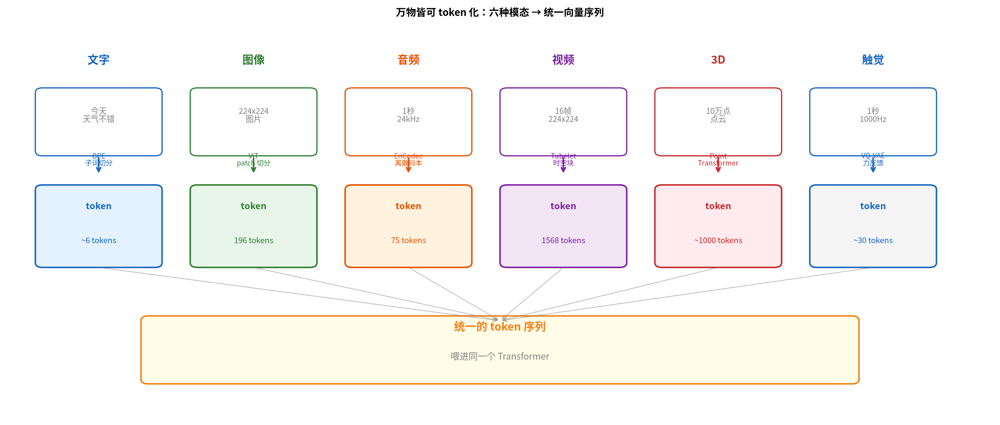

外界模态的具体分类不是唯一的。按表征方式可以分为离散符号（文字/程序）和连续信号（图像/音频/视频/3D/触觉）；按输入输出方向可以分为感知模态（视觉/听觉/触觉）、表达模态（文字/语音/动作）、环境模态（物理反馈/传感器读数）。这些分类并不互斥，是同一个“外界”从不同角度看到的切面。本书按需选用，不做唯一化定义。

从下一节起进入具体的 token 化技法。心法句会在 第2章 §2.1再次出现——那时我们从基座内部看外界，而这里是从外界看基座入口。

 * * *

## 1.1 怎么把一张图翻译成文字 token？ {#sec-翻译}

想象你要向一个只懂文字的人描述一张照片。你不能把整张图直接塞给他，只能把它切成一块块“能说清的小卡片”，再按顺序讲给他听。LLM 的工作方式正是如此：文字被切分成 token → 每个 token 查 Embedding 表变成向量 → 走 Transformer → 输出下一个 token。整条流水线的入口是 token。

文字有天然的最小单位——中文按字或词切，英文按子词切。但图像没有“天然的词”。一张 $224\times224$ 像素的彩色图片，是一个 $224\times224\times3 = 150528$ 个数字的张量。你不能把它当一个 token——太大了；也不能把每个像素当一个 token——太碎了，空间关系全丢了。

解决方案是**人为切分**：把图片切成小块，每块当作一个“词”。就像把一幅油画切成马赛克拼图——这就是 ViT 的核心思想。

音频也类似。1秒的语音波形有16000个采样点，你不能把16000个数字直接喂给 Transformer。得把它压缩成几十或几百个 token。

本章回答一个核心问题：文字、图像、音频、视频、3D、触觉——六种模态各自怎么变成基座能吃的 token？

 * * *

## 1.2 ViT：把图片变成 Token {#sec-ViT}

**ViT**（Vision Transformer） 的做法：

1. 取一张 $224\times224$ 像素的彩色图片
2. 切成 $14\times14 = 196$ 个 patch，每个 patch 是 $16\times16$ 像素
3. 每个 patch 拉平成 $16\times16\times3 = 768$ 维向量
4. 对这768维向量做一次线性投影（$z = Wx + b$），映射到模型的隐藏维度 $d$（比如768）
5. 加上位置编码（告诉模型“这块在图片的哪个位置”）
6. 得到196个“图片 token”，和文本 token 完全同构——可以喂进 Transformer

ViT = patch 投影 + Transformer encoder。步骤1-5是 patch 投影，负责把图片拆成 Transformer 能吃的输入。步骤6之后，196个图片 token 进入标准的 Transformer encoder（多层 Self-Attention + MLP，多层感知机），在层与层之间互相交换信息，最终每个 token 都融合了全图的上下文。我们先看 patch 投影的细节，Transformer encoder 的机制留到 §2.0的 token 旅程里展开。

图2：ViT 把图片切成 patch 并变成 token

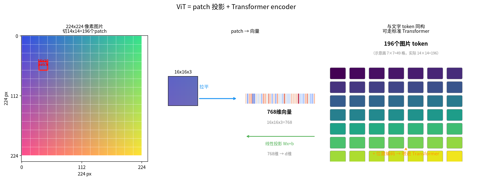

**为什么是768？**

一个 patch 拉平后是 $16 \times 16 \times 3 = 768$ 维。ViT-Base 的隐藏维度也选768（沿用 BERT-Base 的12层/768维/12头规格），于是投影矩阵 $W$ 恰好是方阵——但这是算术巧合，不是设计约束。如果 patch 尺寸换成 $14\times14$（ViT-H/14的 patch 配置；此处假设隐藏维度为1024），拉平后是 $14 \times 14 \times 3 = 588$ 维，和隐藏维度不再相等，投影矩阵就是 $588 \times 1024$ 的长方形，完全正常工作。如果图片更大，比如 $384\times384$，patch 尺寸不变（$16\times16$），则 patch 数变成 $24 \times 24 = 576$ 个，每个仍拉平成768维。

**位置编码——空间位置 vs 序列位置**

文本 token 的位置编码是“第1个词、第2个词……”的一维序列。图片 token 的位置编码是“第1行第2列、第3行第4列……”的二维空间位置。ViT 的做法是把二维坐标展平成一维序号（$r, c$ 从0起算，第 $(r, c)$ 个 patch 编号为 $r \times 14 + c$），然后加一维可学习位置编码。为什么 CNN 不需要位置编码？因为卷积核在图片上滑动，天然保留了空间邻接关系；ViT 把图片拆成独立 token，空间关系必须用位置编码补回来。

**深层连接**：线性变换 $z = Wx + b$。ViT 的 patch 投影就是一次线性变换——输入768维，输出 $d$ 维，权重矩阵 $W \in \mathbb{R}^{768 \times d}$。和 Embedding 查表不同：Embedding 是离散编号到向量的映射（查表），ViT patch 投影是连续向量到向量的映射（矩阵乘法）。但目的相同——把输入变成 Transformer 能处理的隐藏表示。

经典 ViT 有一个硬约束：输入必须是 $224\times224$（或某个固定尺寸）。实际图片什么尺寸都有——手机截图 $1080\times2400$、文档扫描 $3300\times2550$。硬 resize 到 $224\times224$ 会变形：细小文字糊掉、宽高比被压扁。

**NaViT**（Native Resolution ViT）解决了这个问题。<sup>[1]</sup>核心是 **Patch n' Pack**：不同尺寸的图片被切成不同数量的 patch，这些变长 patch 序列直接打包进同一个 batch，用注意力掩码保证图片之间互不干扰。一张 $1080\times2400$ 的截图保持原始宽高比切 patch，不需要 resize。

NaViT 已成为主流：Qwen2-VL、Qwen3-VL、Kimi-VL、InternVL2 都采用原生分辨率输入，因为 OCR、文档理解、细粒度视觉任务在高分辨率下表现显著更好。

 * * *

## 1.3 CLIP：让图片和文字说同一种语言 {#sec-CLIP}

ViT 把图片变成了 token，但这些 token 只代表“图片的一小块像素”，和文字 token 的语义空间互不相通。模型不知道“一只猫的图片”和“猫”这个词说的是同一回事。

**CLIP**（Contrastive Language-Image Pre-training） 解决的就是这个问题：让图片和文字映射到同一个向量空间，使得“猫的图片”和“猫这个词”在这个空间里靠得很近。

CLIP 有两个塔：

- **图像塔**：一个 ViT，输入图片，输出一个512维向量
- **文本塔**：一个 Transformer（和 BERT 类似），输入文字，输出一个512维向量

两个塔各自把输入映射到同一个512维空间。训练目标只有一句话：配对的图文向量相互靠近，不配对的相互推开。

### InfoNCE 损失

损失函数叫 InfoNCE（Information Noise-Contrastive Estimation，信息噪声对比估计）。

**$4\times4$ 相似度矩阵**

假设 batch 里有4对图文 $(I_1, T_1), (I_2, T_2), (I_3, T_3), (I_4, T_4)$。图像塔输出4个图像向量，文本塔输出4个文本向量。计算所有 $4 \times 4 = 16$ 个余弦相似度：

$$S = \begin{pmatrix} \text{sim}(I_1,T_1) & \text{sim}(I_1,T_2) & \text{sim}(I_1,T_3) & \text{sim}(I_1,T_4) \\ \text{sim}(I_2,T_1) & \text{sim}(I_2,T_2) & \text{sim}(I_2,T_3) & \text{sim}(I_2,T_4) \\ \text{sim}(I_3,T_1) & \text{sim}(I_3,T_2) & \text{sim}(I_3,T_3) & \text{sim}(I_3,T_4) \\ \text{sim}(I_4,T_1) & \text{sim}(I_4,T_2) & \text{sim}(I_4,T_3) & \text{sim}(I_4,T_4) \end{pmatrix}$$

只有对角线 $S_{ii}$ 是正样本（图文匹配），其余 $S_{ij}\ (i \neq j)$ 是负样本。假设正样本相似度为0.8，负样本相似度为0.1。

InfoNCE 对每一行做 Softmax，目标是让对角线概率最大：

$$\mathcal{L}_i = -\ln \frac{\exp(\text{sim}(I_i, T_i) / \tau)}{\sum_{j=1}^{N} \exp(\text{sim}(I_i, T_j) / \tau)}$$

代入第1行：分子 $\exp(0.8/\tau)$，分母 $\exp(0.8/\tau) + 3 \times \exp(0.1/\tau)$。

**温度系数 $\tau$ 的作用**

沿用上一节的设定：正样本相似度0.8，3个负样本各0.1。

当 $\tau = 0.07$（CLIP 原始论文中作为可学习参数的初始值，训练后会自适应调整）：
- 分子 $\exp(0.8/0.07) = \exp(11.43) \approx 92000$
- 分母中每个负样本 $\exp(0.1/0.07) = \exp(1.43) \approx 4.2$
- 正样本占比：$92000 / (92000 + 3 \times 4.2) \approx 99.99\%$

当 $\tau = 1.0$：
- 分子 $\exp(0.8) \approx 2.23$
- 负样本 $\exp(0.1) \approx 1.105$
- 正样本占比：$2.23 / (2.23 + 3 \times 1.105) \approx 40\%$

所以 $\tau$ 控制的是 softmax 的**锐度**：$\tau$ 越小分布越尖锐，$\tau$ 越大越接近均匀。

这里有一个常见的错误推论：看到 $\tau=0.07$ 时正样本占99.99%，就得出“$\tau$ 越小梯度越接近零”。它把两件事搞混了——$\tau=0.07$ 时梯度小，是**模型已经把正负分开了**与**小 $\tau$ 把概率推向饱和**共同作用的结果，不能只归因于 $\tau$ 小。把情形换成模型还没学会（正样本0.1、负样本0.8×3），结论立刻翻转：

| 模型当前状态 | $\tau = 0.07$ | $\tau = 1.0$ | 小 $\tau$ 相对大 $\tau$ |
|:---|:---|:---|:---|
| 已分对（正0.8，负0.1×3） | $\lvert \partial \mathcal{L}/\partial s_+ \rvert \approx 0.002$ | $\approx 0.60$ | **0.003倍**（更小） |
| 还分错（正0.1，负0.8×3） | $\approx 14.3$ | $\approx 0.86$ | **16.6倍**（更大） |

同一对 $\tau$，一个情形梯度只剩0.003倍、另一个放大到16.6倍。梯度大小由“模型当前分得对不对”与 $\tau$ 共同决定；$\tau$ 对梯度大小的作用方向取决于当前分得对不对，它决定的是梯度往哪儿集中。

把3个负样本换成难易不同（相似度0.1、0.1、0.5），看梯度怎么在它们之间分配：

- $\tau = 0.07$：三个负样本分到的梯度 $\approx [0.00064,\ 0.00064,\ 0.19]$——最难的负样本拿到易样本的约300倍
- $\tau = 1.0$：$\approx [0.18,\ 0.18,\ 0.27]$——几乎平摊，最难的只多拿1.5倍

一句话总结：$\tau$ 小 = 梯度聚焦到 hard negative（每次只推最像正样本的那几个，学习信号集中）；**$\tau$ 大 = 梯度平摊到所有负样本**（信号稀释，每个都推一点但都不深入）。

CLIP 用 $\tau = 0.07$ 要的就是前者：batch=32768时每个正样本面对32767个负样本，其中绝大多数一眼就能排除（“文字说猫，图片是汽车”），真正有学习价值的只是少数几个相近的难样本——小 $\tau$ 把梯度几乎全部聚焦到它们身上。代价是 $\tau$ 过小会只盯着极少数样本、对噪声标签也更敏感，所以 CLIP 把 $\tau$ 设为**可学习参数**，让训练自己找平衡点。

**CLIP 训练 batch=32768时的正负样本比**

CLIP 原始训练用32768的 batch size。每个正样本对应32767个负样本。正负比1:32767。这就是为什么 CLIP 需要巨大的 batch——对比学习的效果取决于负样本的多样性与规模。batch 太小，模型很快就能把所有正样本拉到一起，但学不到泛化的对齐。

**深层连接**：InfoNCE 是对比学习的标准损失函数。CLIP 的 InfoNCE 和图像自监督中的形式完全一致，区别在于正样本的定义：图像自监督的正样本是“同一张图片的两次增强”，CLIP 的正样本是“一段文字和它描述的图片”。对比学习的框架不变，变的是“什么算正样本”。

图3：CLIP 图文对齐：相似度矩阵与向量空间

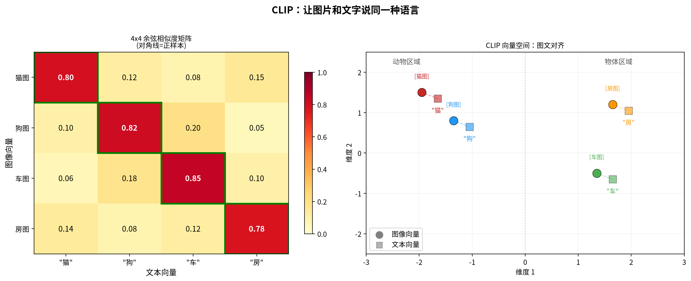

**一句话总结**：CLIP 学的不是“图里有什么”，而是“图文落在向量空间的同一区域”——所以它对同一概念的多种画法都认得，代价是这张空间对“画面细节”不敏感；为什么这么便宜就对齐了（行为对齐不等于几何同构），见 §2.8〔后接多模态-三件套〕。

**为什么这套能对齐**：对比学习不需要人工标注类别（不需要告诉模型“这是猫”），只需要“图文成对”——互联网上的图片天然带 alt-text（替代文本），4亿对图文标注几乎免费。这比 ImageNet 的130万张人工标注图片多300倍。

 * * *

## 1.4 音频 token 化：live 语音的感知基础 {#sec-音频-token}

第4章 会详细讲 GPT-Live 的全双工语音交互。这里先解决一个前置问题：**语音怎么变成 token？**

1秒的语音波形有16000个采样点（16kHz 采样率）。直接塞给 Transformer——上下文窗口瞬间就被填满，行不通。两条路线：

**路线一**：Spectrogram（时频图）

把波形做短时傅里叶变换（STFT），得到一张“时间 $\times$ 频率”的二维图，再过 mel 滤波器组压成 mel-spectrogram（梅尔频谱），最后按 ViT 的方式切成 patch。

**mel-spectrogram 的尺寸**

1秒音频、16kHz 采样、STFT 窗口 25ms、步长 10ms：
- 时间帧数：$1000\text{ms} / 10\text{ms} = 100$ 帧
- 频率 bin 数：80（mel 滤波器组）
- 得到 $80 \times 100$ 的二维矩阵，可以按 ViT 方式 patch 化

**路线二**：音频 Codec（离散 token）

EnCodec / SoundStream 把波形直接编码成离散 token 序列，就像文字的 token 一样。

**EnCodec 的压缩**

- 输入：24kHz 采样率 $\times$ 1秒 = 24000个采样点
- EnCodec 编码器输出：帧率 75Hz，每帧用4个量化码本编码，共 $75 \times 4 = 300$ 个码字，下游模型按300个 token 处理；也可只取第一层码本得到75个粗粒度 token，牺牲精度换上下文空间
- 压缩率：若只取第一层码本（75 token），压缩率 $24000 / 75 = 320:1$；使用全部4层码本（300 token），压缩率 $24000 / 300 = 80:1$

**两种路线的对比**

| 维度 | Spectrogram | 音频 Codec |
|:---|:---|:---|
| 表示形式 | 连续二维矩阵 | 离散 token 序列 |
| 与文本 token 兼容性 | 需要额外投影 | 直接复用文本 Embedding |
| 信息保真度 | 高（连续值） | 有量化损失 |
| 代表系统 | Whisper | EnCodec, SoundStream |
| GPT-4o/Live 推测 | — | 推测走此路线 |

GPT-4o 和 GPT-Live 的音频 token 化实现未公开。行业推测走 codec 路线，因为 codec token 可以直接复用文本 Embedding 和 LM Head（语言模型输出层，把隐状态向量映射到词表概率的线性变换矩阵）——和文字 token 完全同构，不需要额外的投影层。

 * * *

## 1.5 视频 token 化：时空 patch {#sec-视频-token}

视频是图片的时间序列。ViT 处理图片只在空间上切 patch，处理视频还要在**时间**维度上切——这种时空小块叫 tubelet。但视频 token 化多了一个图片没有的麻烦：**帧太多**。

> **先猜再看**：1秒 30fps 的视频，如果每帧都按 §1.2的方式切成196个 patch，会得到多少个 token？是一张图的几倍？猜猜看——答案马上揭晓。

**全帧采样的灾难**

1秒 30fps 视频 = 30帧。每帧按 §1.2切成196个 patch，1秒视频 = 30 $\times$ 196 = 5880个 token。10秒视频 = 58800个 token——超过一个 32K 上下文模型的窗口（§1.8的预算基准）。

视频不能每帧都取。实际做法是**均匀采样**：从整段视频中等间隔取 N 帧（比如16帧）代表整段视频。一段10秒视频取16帧，意味着每0.625秒取一帧——丢掉了约95%的帧。

丢掉的帧里有信息吗？有。但相邻帧之间大部分像素相同（背景不动），有效信息集中在运动区域。均匀采样假设“运动在时间上均匀分布”——对慢动作成立，对突发动作（突然抓取）可能刚好跳过关键时刻。

**tubelet 尺寸与 token 数**

采样后的16帧、每帧 $224\times224$ 像素。tubelet 尺寸 $2 \times 16 \times 16$（时间2帧 $\times$ 空间 $16\times16$ 像素）：
- 时间维 patch 数：$16 / 2 = 8$
- 空间维 patch 数：$(224/16) \times (224/16) = 14 \times 14 = 196$
- 总 patch 数：$8 \times 196 = 1568$ 个时空 token

对比：一张图片196个 token，16帧视频1568个 token——视频的 token 数是单张图的8倍。这就是为什么视频理解的上下文消耗远大于图像理解。

**时空注意力**：先空间还是联合

1568个 token 一起做 Self-Attention，计算量是 $1568^2 \approx 246$ 万次。ViViT（Video Vision Transformer）给出两种取舍：

**分解式**（Factorized）：先在每帧的196个 token 内做空间 Attention（$196^2 \approx 38\text{K}$），再在8个时间位置上做时间 Attention（$8^2 = 64$）。总计算量约 $8\times38\text{K}+196\times64\approx320\text{K}$，是联合式的1/7。

**联合式（Joint）**：1568个 token 一起做 Attention。信息流最充分——每个 token 直接和任意时空位置交互——但计算代价高。

| 策略 | 每层计算 | 信息交互 | 适用场景 |
|:---|:---|:---|:---|
| 分解式 | ~320K | 先帧内空间，再帧间时间 | 长视频、低算力 |
| 联合式 | ~2.46M | 全局时空 | 短视频、高精度 |

分解式更常用——视频理解的任务（动作识别、视频问答）大多不需要每个 patch 和所有时空 patch 直接交互，帧内理解清楚后用时间 Attention 串联足够。

**视频 token 压缩**

1568个视频 token 直接塞进 LLM 上下文太奢侈。一段视频问答 `[视频token$\times$1568] [问题$\times$20]` 中视频占98.7%——按单张224×224图片196 token、同样20个问题 token 计，图片占比约90.7%

和 §2.8会讲的 Q-Former 思路类似，视频模型常用时序池化：把每8个时间 token 平均成1个，1568 → 196个 token 喂给 LLM。代价是时间分辨率下降——快速动作可能在池化中被抹平。

 * * *

## ◌ 1.6 3D 点云 token 化：空间感知的第三只眼 {#sec-点云-token}

图片是 2D 像素网格，但物理世界是 3D 的。机器人上的激光雷达和深度相机输出的是**点云**——一组 3D 坐标点 $(x, y, z)$，可能附带颜色或法向量。一帧点云可以有10万个点，和 $224\times224$ 图片的5万个像素同量级。但点云更难处理：像素乖乖排在规则网格上，点云的点却散布在 3D 空间里——没有固定顺序，也没有邻接结构。

点云 token 化的核心问题：怎么把不规则的 3D 点变成 Transformer 认得的、有序的 token？

**体素化**（Voxelization）

把 3D 空间切成规则的小立方体（体素），每个体素内的点取平均或最大池化，得到一个固定大小的 3D 网格。这和 ViT 把图片切成 patch 本质相同——只是从 2D 网格变成了 3D 网格。缺点：大部分体素是空的（稀疏），直接处理浪费算力。

**序列化**（Serialization）

Point Transformer V3（CVPR 2024）的做法分两步：先用空间填充曲线（如 Hilbert 曲线）把 3D 点排成一维序列，再把空间上邻近的点聚成“超点”（Superpoint）——一个超点当做一个 token，超点之间仍按序列顺序排列，可以直接走标准 Attention。这比体素化高效——不浪费算力在空体素上。

**3D 点云 vs 2D 图像的 token 数**

| 输入 | 原始数据量 | token 数 | 备注 |
|:---|:---|:---|:---|
| 224×224图片 | 150K 数字 | 196 | 16×16 patch |
| 10万点云（序列化） | 300K 数字（xyz×3） | ~500-2000 | 取决于超点大小 |
| 10万点云（体素 0.05m） | 300K 数字 | ~8000 | 大部分为空 |

注意表里两个点云数字不是同一口径、不可直接比较：~500-2000是**序列化**（超点聚合，超点越大 token 越少），~8000是**体素化**（0.05m 网格，只数非空体素）。体素化这行的推导可复核：10万点落进 0.05m 网格后聚成约8000个非空体素，平均每体素约12.5个点；总场景体素数远大于8000（取决于场景尺度），只是空体素不产生 token。§1.8的规模对比表用的是序列化口径（~500-2000），两处并列时勿混读。

点云的 token 数通常多于图片——一张图片只覆盖一个视角，一帧点云覆盖整个三维场景，非空区域分散在空间各处，要覆盖它们就需要更多 token。

3D token 正在接入 VLA：VGGT（CVPR 2025，牛津 VGG + Meta AI）把多视图图像映射为 3D 结构 token，MIT Carlone 团队（ICRA 2026）将这些 token 注入 VLA（视觉-语言-动作模型），在 Unitree G1 机器人上显著提升了操作成功率。3D 感知不再是独立的感知模块，而开始和语言、动作 token 融进同一个模型。

 * * *

## ◌ 1.7触觉 token 化：第六感的数字化 {#sec-触觉-token}

视觉告诉你“这是什么”，触觉告诉你“抓得紧不紧”。一个鸡蛋和一个玻璃球在摄像头里看起来差不多，但抓取时的力反馈完全不同——鸡蛋需要精确的力控制，玻璃球则要小心别让它滑脱。

触觉传感器的原始输出是高频力信号（20-1000Hz 采样）——一串随时间变化的数值，和音频波形类似。直接喂给 Transformer 会遇到同样的问题：数据量太大、信号是连续的。

李飞飞团队的 T-Rex（Tactile Tokenization，触觉词汇化）框架提出一个方案：用 VQ-VAE（向量量化变分自编码器；VAE 机制见《AI数学》§7.5）把时序力信号压缩成离散的**触觉 token**——“轻贴”“渐压”“突卸”“高频震颤”。每个 token 代表一种触觉模式，和文字 token 同构。

**触觉 token 的频率差异**

| 模态 | 采样率 | 时间尺度 | 1秒数据量 |
|:---|:---|:---|:---|
| 视觉（摄像头） | 30Hz | 33ms/帧 | 30张图片 |
| 触觉（力传感器） | 1000Hz | 1ms/样本 | 1000个数值 |
| 听觉（麦克风） | 16000Hz | 0.06ms/样本 | 16000个数值 |

触觉的时间尺度介于视觉和听觉之间——比视觉快33倍，比听觉慢16倍。这意味着触觉 token 需要自己的采样频率，不能和视觉 token 用同一套节奏。

T-Rex 的发现印证了这一点：把高频触觉信号勉强塞进低频 Transformer（推理时与视觉 token 共用 5Hz 的处理频率），任务成功率从17%掉到6%——高频力信号打乱了视觉已经学会的表征。解法是给触觉开一条独立的**高速公路**：一个 20Hz+ 的触觉专家模块，在动作草图上做毫秒级力修正。这和 §5.7的分层决策思路一致——不同时间尺度的信号用不同频率的模块处理。

触觉 token 化仍处于早期阶段。传感器硬件在快速迭代——高密度柔性电子皮肤已做到361点/$\mathrm{cm}^2$、1000Hz 回传（CES 2026）。但“怎么把力信号变成 token”的算法标准还没收敛——VQ-VAE 离散化、事件驱动编码（只在力突变时产生 token）、连续投影都有人在做。

 * * *

## 1.8 多模态 token 的规模对比与预算 {#sec-多模态规模对比}

> **先猜再看**：一句话、一张图、1秒音频、16帧视频、10万点云——放进一个 32K 上下文的模型，各自能放多少份？猜完再看表格。

**不同模态的 token 规模**

| 模态 | 数据量 | token 数 | 信息密度 |
|:---|:---|:---|:---|
| 一句话“今天天气不错” | 6个字 | ~6 tokens | 基准 |
| 一张224×224图片 | 150528个数字 | 196 tokens | ~768数字/token |
| 1秒音频（EnCodec） | 24000采样点 | 75 tokens | ~320数字/token |
| 1秒音频（mel-spectrogram） | 8000个浮点数 | ~100 tokens | ~80数字/token |
| 16帧224×224视频 | 2408448个数字 | 1568 tokens | ~1536数字/token |
| 10万点 3D 点云（序列化） | 300K 数字 | ~500-2000 tokens | ~150-600数字/token |
| 1秒触觉（1000Hz 力传感器） | 1000个数值 | ~20-50 tokens（VQ-VAE 压缩） | ~20-50数字/token |

一个 32K 上下文的模型，能放：~160张图片，或 ~437秒音频（EnCodec 75 token/s），或 ~20段16帧视频，或 ~16-65帧10万点云（取决于超点大小），或 ~650-1600秒触觉（按20-50 token/s）。多模态模型的上下文窗口需求远大于纯文本模型，根源就在于视频和 3D 点云这两个吞 token 大户。

图4：多模态 token 规模对比

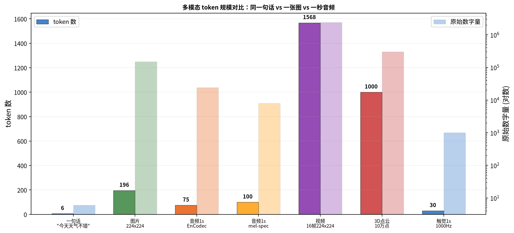

**AI落地**：token 预算工程

多模态输入落地时首先是一道预算题：上下文窗口就那么大，每种模态吃掉多少 token，直接决定系统能跑多复杂的任务。

**第一步：算预算**。可用输入 = 上下文窗口扣除输出预留与历史消息后剩下的部分。32K 窗口留 4K 给输出、4K 给历史后，可用输入剩 24K——上表的规模账算的是整窗容量（约160张图），工程上按 24K 实际约120张，或约320秒的 EnCodec 音频（整窗则是约437秒）。

**第二步：按任务分配**。三种取舍：① 保留关键模态——智能门铃必须保视频，门牌号文本几乎零成本；② 激进压缩——长视频降采样帧率、音频只取粗粒度码本；③ 模态加权——按任务重要性分配预算，而不是一刀切全给。

**第三步：分层消费**。三个可调旋钮：分辨率分层（OCR 场景高分辨率、通用场景低分辨率）、码本分层（流式音频先吐粗码本，需要细节再补）、帧率自适应（运动检测触发高帧率，静止场景降帧）。

一句话：同样的窗口，预算分配方式不同，能跑多复杂的任务也完全不同。本章自检的应用题（智能门铃）会用这套方法完整走一遍。

> **小胜点**：到这里，你已经能把图像、音频、视频、3D、触觉都看成 token，能比较它们的成本与上下文占用，也知道一个有限的上下文窗口该怎么分给它们。

 * * *

## 1.9 常见误解

**误解1**：“ViT 就是把 CNN 换成 Transformer。”

CNN 通过卷积核在图片上滑动，天然捕捉局部空间关系；但图片里远距离像素的依赖（如猫脸和猫尾）无法靠局部卷积表达，需要全局交互。ViT 的关键是**patch 化**——把图片拆成独立 token，用 Attention 让 token 之间全局交互。架构替换（CNN→Transformer）是手段，patch 化才是核心思想。没有 patch 化，即使把 CNN 换成 Transformer 也无法高效处理图片。

**误解2**：“CLIP 能理解图片。”

CLIP 只学了“图文像不像”，不学“图片里有什么”。CLIP 可以告诉你“这张图和‘一只猫坐在沙发上’这句话很像”，但不能告诉你“猫在沙发的左边还是右边”。理解需要更强的模型架构（第2章 会讲）。

**误解3**：“音频 token 化就是语音识别（STT）。”

STT 把语音变成文字——丢掉了语气、语调、停顿、背景音等全部副语言信息。音频 token 化把语音变成 token，保留了这些 STT 丢掉的声学信息。这就是为什么 GPT-4o 能模仿语气、能听到背景音乐——它处理的是音频 token，不是 STT 之后的文字。

**误解4**：“ViT 只能处理 $224\times224$ 的图片。”

经典 ViT 固定把图片缩放到 $224\times224$；当前主流多模态模型（Qwen2-VL、Kimi-VL、InternVL2）采用 NaViT 原生分辨率输入——图片保持原始尺寸和宽高比切 patch。把高分辨率图片硬 resize 到 $224\times224$ 会丢失 OCR 和细粒度识别所需的信息。

**误解5**：“机器人只用摄像头就够了。”

对简单任务成立。但精细操作（抓鸡蛋、插 USB）需要触觉反馈——视觉无法告诉你“抓得多紧”。3D 点云在遮挡和复杂空间关系下也比 2D 图片更可靠。具身智能的感知不止“看”，还有“摸”和“感受空间”。

 * * *

## 1.10 本章回顾

ViT 把图片切成 patch token（NaViT 让它支持任意分辨率），CLIP 让图文 token 在同一空间对齐，音频 codec 把波形变成离散 token，视频 tubelet 把时空块切成 token，3D 点云用序列化变成空间 token，触觉用 VQ-VAE 变成力反馈 token——万物皆可 token 化。

**记住一句话**：Token 化不是外接一个感官模块，而是把外界翻译成基座自己的语言——六种手法殊途同归，为的是让模型看得见、听得着；切多细不只看预算——太碎了，空间关系会丢。

**本章自检**：

**【知识点】**

1. ViT 的 patch 尺寸是 $16\times16$，一张 $224\times224$ 的图片产生多少个 token？每个 token 的原始维度是多少？ {#q-c1-kp01}
2. NaViT 和经典 ViT 的关键区别是什么？为什么主流模型都转向原生分辨率？ {#q-c1-kp02}
3. CLIP 训练时 batch=32768，正负样本比是多少？为什么需要这么大的 batch？ {#q-c1-kp03}
4. InfoNCE 损失中温度系数 $\tau$ 的作用是什么？$\tau$ 太大或太小分别有什么问题？ {#q-c1-kp04}
5. EnCodec 把 24kHz 的1秒音频压成多少个 token？压缩率是多少？（只取第一层码本的口径；四层全取是另一个数） {#q-c1-kp05}
6. 视频 tubelet $2 \times 16 \times 16$ 是什么意思？16帧 $224\times224$ 视频产生多少个 token？ {#q-c1-kp06}
7. 3D 点云的序列化和体素化各自的优缺点是什么？ {#q-c1-kp07}
8. 触觉 token 为什么不能和视觉 token 用同一频率处理？ {#q-c1-kp08}

**【逻辑链】**

1. 为什么 ViT 需要位置编码但 CNN 不需要？请从“信息处理方式”的角度解释。 {#q-c1-lc01}
2. 为什么 CLIP 用双塔（图像塔+文本塔）而不是单塔（把图文拼在一起送进一个 Transformer）？提示：考虑推理时的效率。 {#q-c1-lc02}

**【应用潜能】**

1. 一个智能门铃要识别“门外是熟人/陌生人/动物”，输入有视频（1080p）、音频（16kHz）、文本（门牌号）。只用一个 LLM 上下文，你会怎么设计输入 token？提示：视频用 tubelet 压缩、音频用 codec 压缩、文本用 BPE——上下文预算有限，哪个模态该优先、哪个该丢？ {#q-c1-ap01}
2. §1.8讲过多模态 token 数量爆炸的问题。什么情况下 token 化方案会失效、需要重新设计？提示：当模态间数量级差异超过模型可处理范围时（如 24kHz 音频 vs $224\times224$ 图像），固定 patch 方案会失效。 {#q-c1-ap02}

 * * *

> **未解问题**：第1章 解决了“每种模态怎么变成 token”。但 token 化只是输入接口——视觉 token 和文本 token 怎么协作？把它们拼在一起送进 LLM 就行了吗？需要一个架构来筑基。这就是 第2章 的主题。

 * * *

# 第2章：筑基——预训练与潜空间的涌现 {#ch-2}

第1章把世界变成了 token——图片切成 patch、音频压成码本、视频切成时空块。现在轮到这些 token 了：它们进入模型之后会发生什么，是这一章的全部问题。

> 基座模型运转在潜空间中，不在语言里。但“潜空间”不是空中楼阁——它由具体的 Attention 矩阵、FFN 层、残差连接构成。理解它的路线：一个 token 在 LLM 里经历什么（§2.0〔LLM-长什么样〕）→ 从物理结构抽象出潜空间（§2.1〔潜空间〕）→ 预训练把世界压进这个空间（§2.2〔预训练〕）→ 能力从中涌现（§2.3-§2.7）→ 更多外界模态接入（§2.8-§2.11）。

> **本章路线**：Part A 看潜空间与预训练（token 旅程、涌现、写作/编程/思考），Part B 看多模态接入与基座局限。

> **核心心智模型**：
>
> 1. ==基座模型运转在潜空间，不在语言里。==
> 2. 预训练把世界压进潜空间，写作/编程/思考是同一个潜空间经文字接口的三种表达。
> 3. 多模态接入是让更多外界信号进入同一个潜空间。
> 4. 基座有明确局限：参数化知识边界、幻觉、长上下文衰减、多语言不均衡、能力脆化。

> **开始前自检**：
>
> 1. 一个 token 进入 Transformer 后会变成什么？
> 2. “潜空间”在你心里是具体还是比喻？
>
> 带着问题读“一个 token 的旅程”与“潜空间”两节。

 * * *

## Part A：潜空间与预训练

> **Part A 核心**：潜空间不是比喻，是 token 经 Transformer 后形成的向量空间；预训练把世界压进去。

这一部分先看 token 进入模型后的物理旅程，再从潜空间、预训练到三种能力。

## 2.0 LLM 长什么样：一个 token 的旅程 {#sec-LLM-长什么样}

在讲潜空间之前，得先搞清楚一个基本问题：你往 ChatGPT 输入一句话，它内部到底发生了什么？ 这一节跟着一次具体的前向传播走一遍，把 LLM 的物理结构拆开看。

《AI数学》§5.10讲过 Attention 的数学零件（Q/K/V 公式、Softmax 温度、残差连接的代数表达）。这里不重复公式——补充的是**物理直觉**：一个 token 从进去到出来实际经历什么、96层各自在做什么、为什么逐层会涌现出不同深度的能力。

**场景**：输入“猫坐在垫子上”，预测下一个 token

假设一个具体模型：96层 Transformer，隐藏维度4096，词表50000，64个头（层数与 GPT-3 相同，维度和头数为了演示取好算的值）。你输入“猫坐在垫子上”，模型需要预测下一个 token。

**第0步**：查表——token 变成向量

模型不认识汉字，它只认识编号。“猫”在词表里是第3742号 token，“坐”是第891号，“在”是第56号，“垫子”是第4821号，“上”是第12号。

每个编号查一张表（embedding matrix），得到一个4096维的向量——就是4096个数，合起来是这个 token 在模型内部空间里的坐标。这张表是模型参数的一部分——预训练时学出来的。

输入5个 token → 得到5个4096维向量。到此为止，文字已经消失了，模型手里只有5个向量。

**位置编码**。Transformer 的 Attention 机制本身不知道 token 的先后顺序——“猫坐”和“坐猫”对它来说没区别。所以在查表之后，每个向量还会加上一个“位置向量”（position embedding），编码“这是第几个 token”。加上之后，“猫坐在垫子上”和“上垫子在坐猫”就不同了——因为每个 token 的位置编码不同。

**第1-96步**：过96层 Transformer block

这5个向量进入第1层 Transformer block。每一层做两件事——**开例会**（Self-Attention） 和 **整理笔记（FFN）**。

**开例会**。每个 token 看一遍所有 token（包括自己），决定“谁跟我相关”。“猫”可能发现“坐”和自己高度相关（猫是坐的主语），“垫子”也相关（坐的地方）。它给相关的 token 高权重，不相关的低权重，然后把所有人的向量按权重加起来，更新自己的表示。

具体来说，每个 token 生成三个东西：Query（“我在找什么”）、Key（“我能提供什么”）、Value（“我的实际内容”）。Query 和所有 Key 做点积得到相关度分数，Softmax 归一化成权重，用权重加权所有 Value——得到这个 token 的新表示。

这就是 Attention 的全部：每个 token 通过 Query-Key 匹配找到相关信息，通过 Value 聚合过来。记住“开例会找相关信息”这个直觉就够了。

**多头 Attention**。上面的过程不是做一次，是做很多次——这个例子的模型做了64个头（4096维分64个头，每头64维；GPT-3 是96个头，头数因模型而异）。每个头关注不同的关系：有的头抓语法关系（主语-谓语），有的头抓共现（“猫”和“垫子”经常一起出现），有的头抓长距离依赖。64个头的输出拼起来再投影一次，得到 Attention 的最终输出。

**残差连接**。Attention 的输出不是直接替换原向量，而是**加到原向量上**：`新向量 = 原向量 + Attention(原向量)`。这个“加”很关键——它保证原信息不会被丢失，Attention 只能添加信息。如果某一层的 Attention 没学到有用的东西，原向量原封不动传下去，模型不会变差。

**整理笔记**。Attention 之后，每个 token 的向量再经过一个 FFN（前馈网络）——两层线性变换中间夹一个非线性激活（GELU/SwiGLU）。FFN 对每个 token 独立操作（token 之间不交互），做的事情类似“整理笔记”：把例会上收集到的信息提炼、压缩、扩展。FFN 是模型大部分参数的所在地——GPT-3 的1750亿参数里，约三分之二在 FFN 里。

**Layer Norm**。Attention 之前、FFN 之前各做一次归一化，把向量的数值范围拉回稳定区间。不做的话，96层叠加下来数值会爆炸或消失，模型彻底罢工。

**一层结束**。5个向量经过 Attention（开例会）+ FFN（整理笔记），变成5个新的4096维向量。这就是一层 Transformer block。

**重复96次**。上面讲的这一层（Attention + FFN）要重复96次——这个例子就是96层（层数与 GPT-3 相同；LLaMA-3-70B 是80层，Claude Opus 4.5和 GPT-5.5 的层数未公开但同量级）。每一层都在做同样的操作——但**学到的东西不同**：

- **浅层（1-20层）**：抓语法和共现。“猫”和“坐”在浅层就建立了主谓关系。
- **中层（20-60层）**：抓语义和关系。“猫坐在垫子上”在中层被理解为“一只动物在一个物体上面”的空间关系。
- **深层（60-96层）**：抓推理和逻辑。如果上文有“猫很怕冷”，深层会把“怕冷”和“坐在垫子上”联系起来——可能猫在找暖和的地方。

这个“逐层抽象”不是设计出来的——是预训练时自然涌现的。Mech interp 研究反复验证了这个模式。<sup>[2]</sup><sup>[3]</sup>

**最后一步**：从向量回到 token

第96层输出的5个向量，模型只取最后一个（“上”对应的向量）。这个向量经过一个 unembedding 矩阵（和 embedding matrix 互为转置），从4096维投回50000维——得到词表里每个 token 的“分数”。再经过 Softmax 变成概率分布。

可能的结果：“下”（0.31）、“面”（0.22）、“的”（0.15）、“睡”（0.08）……模型采样这个分布（可以贪心选最高分，也可以按概率随机采样），输出一个 token。

如果要继续生成，就把新输出的 token 拼回输入序列，重复整个过程。

**一次前向传播的算力账**

“猫坐在垫子上”（5个 token）经过一个96层、4096维、64头的模型，一次前向传播的浮点运算量：

- Attention：每层约 $2 \times n^2 \times d$ 次乘加（$n=5$ 个 token，$d=4096$）→ 96层合计约 $2 \times 5^2 \times 4096 \times 96 \approx 2 \times 10^7$（此处只计注意力矩阵的乘加，未含 QKV 投影与输出投影——对小序列投影才是大头）
- FFN：每层约 $2 \times n \times d \times d_{\text{ff}}$（$d_{\text{ff}} = 4d = 16384$）→ 96层合计约 $2 \times 5 \times 4096 \times 16384 \times 96 \approx 6.4 \times 10^{10}$
- 总计约 $6.4 \times 10^{10}$ FLOPs（未含 QKV 投影与输出投影）

这只是一个 5-token 句子的一次前向传播。实际使用中，输入1000个 token、生成500个 token，每个 token 都要跑一次前向传播——算力需求是这里的十万倍以上（每步序列更长，Attention 的 $n^2$ 项随长度增长；这在 §4.2会引出 KV Cache 这个工程优化）。这就是为什么大模型推理需要数据中心级别的 GPU。

**这个结构的关键特征**

残差连接造就了“信息高速公路”。96层不是串联的过滤器——信息可以跳过某些层直接传递（残差连接让每层都能“看到”最初的输入）。这意味着模型可以选择性地使用深层能力：简单语法在浅层就处理完了，深层不重复劳动；复杂推理才需要深层的全部深度。

Attention 是全连接的，FFN 是独立的。Attention 让每个 token 能看到所有其他 token（信息混合），FFN 对每个 token 独立处理（信息提炼）。交替进行“混合-提炼-混合-提炼”，模型逐层把原始 token 表示加工成越来越抽象的语义表示。

生成的本质是“一次一个 token”。模型不是“想好了一整句话然后吐出来”，是每次只预测下一个 token，把新 token 拼回输入再预测下一个。这个“逐 token 生成”的特性直接决定了 第4章 讲的延迟问题——你必须等前面的 token 生成完才能开始生成下一个。

现在可以预告 §2.1的核心问题了：这些4096维向量住在哪里？ 它们住在潜空间里。每一层的 Attention 和 FFN 都是在潜空间里做变换——把向量搬到新位置、融合、提炼。96层走完，最终的向量在潜空间里到达了一个点，这个点对应“下一个 token 应该是什么”。

图5：一个 token 在 Transformer 中的旅程

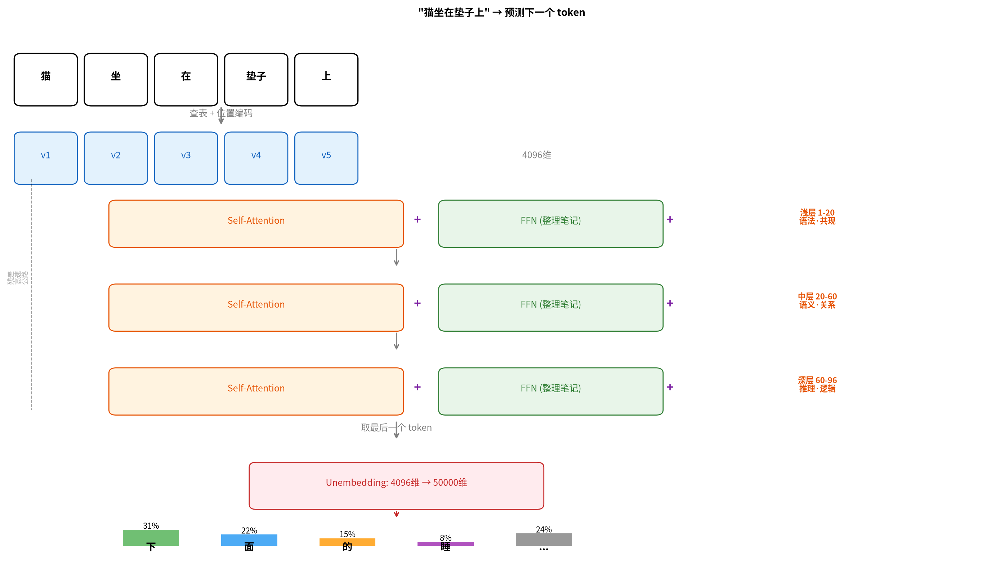

 * * *

## 2.1 潜空间：基座里到底在跑什么 {#sec-潜空间}

§2.0走查了一个 token 的完整旅程——从查表变向量，经过96层 Attention 和 FFN 的交替处理，最后投回词表输出下一个 token。这些向量在模型内部住的空间，就是**潜空间**。

最后一层的向量再经过一个 unembedding 矩阵，投回词表空间，得到“下一个 token 的概率分布”。这一步是**从潜空间反投回外界**（文字接口）——模型不是“生成文字”，是在潜空间里做完推理后再翻译回文字。翻译只是最后一公里。

看三个性质之前，先记住它们合起来要说明什么：基座模型内部不是符号处理，也不是纯连接主义黑箱——是在稠密连续空间里做结构化变换。这个视角决定了后面几节的走法：预训练（§2.2）是“把数据压进这个空间”，涌现（§2.3〔ScalingLaw〕）是“当空间够大时出现新的可组合结构”，写作/编程/思考（§2.4-§2.6）是“同一个空间被不同接口调用出来的不同表达”。

**潜空间的三个性质**（对本书够用的直觉，深入见 mechanistic interpretability 文献）：

1. **稠密**。潜空间是连续的 $\mathbb{R}^d$（$d$ 是隐藏维度）。相似的概念在潜空间里离得近——“猫”和“狗”两个向量贴近，“猫”和“民主”则相距很远。这不是设计出来的，是训练自然形成的。
2. **可组合**。潜空间中存在近似的向量运算：“国王” - “男” + “女” $\approx$ “女王”。线性表示假说在 LLM 潜空间中验证了这一现象：概念以线性方向编码，方向之间的加减运算近似对应语义关系。<sup>[5]</sup>这意味着潜空间里编码了关系，不只是概念。

    > **想一想**：如果潜空间不是稠密的连续空间，而是离散的符号表——“国王”是一个符号，“男”是一个符号，用符号做“国王 - 男 + 女”能得到什么？试试看：符号之间没有“距离”的概念，减法在符号表里根本无处可去。**稠密是“可组合”的前提**——正因为概念在连续空间里是方向，方向的加减才有意义；换成离散符号，组合运算就无从谈起。这也解释了为什么性质1（稠密）和性质2（可组合）必须成对出现。

3. **多义特征叠加**。同一个向量可以同时编码多个不相关的概念——比如某个方向上既编码“金门大桥”又编码“愤怒的情绪”。这叫 superposition。Superposition 不是设计缺陷，而是特征数远大于维度数时的最优压缩策略：当模型需要表达十万个稀疏特征但只有几千维空间时，把特征叠加到近似的方向上（利用稀疏性让它们很少同时激活）比丢弃特征更优。<sup>[4]</sup>

<details>
<summary>SAE 怎么拆解 superposition？（工具细节）</summary>

SAE 能拆解叠加，正是因为特征的稀疏性——如果所有特征同时激活，叠加就不可逆了。稀疏自编码器（SAE）如今是拆解 superposition 的主流工具。<sup>[6]</sup><sup>[7]</sup>2026年 Qwen-Scope 把 SAE 特征做成开发工具，让开发者能看到某个特征“负责什么概念”。<sup>[8]</sup>叠加不是终点——拆解叠加后揭示的内部结构（线性方向、信息流电路、FFN 关联记忆）和基于这些结构的干预手段（激活引导、知识编辑、J-space 审计），在§6.4系统展开。

</details>

**为什么强调这三个性质**：它们的形态决定了哪些内部结构可被观测、哪些干预能生效（手段见 §6.4〔概念城市〕）。

**智源研究院王仲远的原话**把这个抽象层说得更具体：“所有模态被压缩进同一个潜空间，再由不同的解码器按需还原成不同输出形态。举个例子，这个潜空间就像给机器人大脑准备了一张万能草稿纸”。

**回指第1章**：第1章讲了外界怎么被 token 化压进潜空间入口。这一节起，我们进入潜空间内部——看这些 token 向量在里面怎么被塑形、怎么长出能力。

图6：潜空间概念图：万能草稿纸

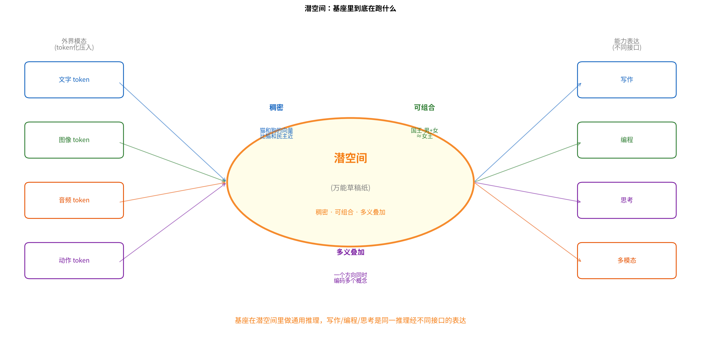

 * * *

## 2.2 预训练：把世界压进潜空间 {#sec-预训练}

预训练的目标出奇地简单：给定前 $n-1$ 个 token，预测第 $n$ 个 token（next-token prediction）。就这一条。

**预训练的规模**

以 LLaMA-3-70B 为例（Meta 2024）<sup>[115]</sup>：

- 参数量：700亿
- 训练数据：15T tokens（约 45TB 文本）
- 训练算力：约 $6.3 \times 10^{24}$ FLOPs（$6 \times 70 \times 10^9 \times 15 \times 10^{12}$，用 Chinchilla 系数6）
- H100 GPU-小时：约640万小时（Meta 官方 model card）
- 电费：约45万美元（640万 GPU-小时 $\times$ 0.7kW $\times$ $0.1/kWh；计入数据中心 PUE 后约50-60万美元）
- 算力租金：约1300万-1900万美元（按 H100 云价 $2-3/GPU-小时估算；Meta 用自建集群，实际低于此）

**注意三个数字不是一回事**：电费只算 GPU 耗电，通常不足训练总成本的一个零头；算力租金是租 GPU 的钱；常听到的“训练一个大模型要几千万美元”说的是**全成本**——算力租金加上数据采集清洗、研发人力、以及失败实验的沉没成本。

Grok 4.5（2026.07）使用数万块 NVIDIA GB300 GPU 训练；GPT-5.5、Claude Opus 4.5训练规模同量级或更大。这不是普通的模型训练——是把整个互联网的文字压缩进一个700亿参数的潜空间。

> **先猜再看**：上面这句话里藏着一个数字——45TB 的训练文本压进700亿个参数，压缩比是多少？猜猜看。（提示：参数按 bf16 存，每个2字节，700亿参数约占 140GB。45TB 是 140GB 的多少倍？答案就在下面“压缩即理解”里。）

“下一个 token”为什么能长出智能。这是当前最深的问题之一，业界没有完全令人满意的理论解释，但有几个层次的直觉：

1. **压缩即理解**（Solomonoff 归纳的现代版本）。要准确预测下一个 token，模型必须建立世界的内部模型——语法、事实、因果、逻辑、情绪、意图，一切影响下一个 token 的因素都会被隐式编码到参数里。压缩率越高，理解越深——这是 Ilya Sutskever 反复强调的判断。按上面的数字算：45TB 训练文本压进约 140GB 的参数（700亿 $\times$ 2字节，bf16），压缩比约 **320倍**。

但要注意这不是无损压缩——模型没法一字不差地还原原文。压掉的是冗余，留下的是可泛化的结构；这恰恰是“理解”的意思：不是记住每一句话，而是抽出支配这些句子的规律。

2. **多任务隐式学习**。互联网文本包含无数任务：翻译、问答、总结、写代码、讲笑话、辩论。next-token 训练目标不区分任务——模型必须**同时**学会所有这些任务的隐式表示。任务之间共享潜空间结构，正迁移让模型比针对单任务训练更泛化。
3. Sparse features 假说。潜空间中存在大量“稀疏可解释特征”（稀疏自编码器 SAE 揭示的），预训练是在**发现**这些特征、在它们之间建立关系。特征本身对应人类可理解的概念（“金门大桥”“愤怒”“三段论推理”），关系对应可组合的操作。

把这三种直觉再收拢一层：AI 在通用计算的基础之上，用大规模统计学习对数据做压缩与预测。若为这条主线找一个统一的名字，可以借用自由能原理（FEP）：任何自组织系统为了存续，都必须最小化其内部模型与外部世界的预测误差（自由能）。预训练正是这个原理落到硅基上的工程形态——模型是内部模型，语料是外部世界，交叉熵是预测误差，梯度下降在持续收缩它（这条自由能谱系的完整坐标见《AI规律》§8.8）。

**回指第1章**：第1章讲了各种外界模态怎么被切成 token。§2.0讲了这些 token 怎么变成潜空间中的向量，§2.1讲了它们住在怎样的空间里。这一节说的是：海量的这种向量流经模型时，参数被塑形出对世界的隐式模型。萃取是入口，筑基是内部塑形，两者一起完成“外界→潜空间”的完整链条。

**关键取舍**：预训练不学“什么话该说”（那是 第3章 炼灵的事），只学“数据里的分布”。这意味着预训练完的基座模型：

- **有能力**（潜空间已经具备通用推理结构）
- **无导向**（不知道用户想要什么、什么话该拒绝、什么是有害的）

这是 §2.6讨论“思考”和 第3章 讨论“对齐”的共同前提。基座模型和最终产品之间隔着大量后训练工程。

### Mid-training：预训练和对齐之间的桥

§2.2讲的预训练把互联网文本压进潜空间。§2.4-§2.6会讲写作、编程、思考三种能力怎么从中涌现。§3.5起讲 RLHF/DPO/GRPO 怎么把模型从“像”调到“对”。但在预训练和 SFT（监督微调）/RL（强化学习）之间，已经形成一个独立的中间阶段：**mid-training**（有时叫“continued pretraining”或“annealing”）。

mid-training 做的事很具体：在预训练的通用语料之上，上采样 STEM、数学和代码等高质量数据，同时把上下文长度从预训练的 8K-32K 扩展到 128K-256K。典型规模 100B-500B tokens，学习率按余弦衰减。（下面提到的 GRPO 是 Group Relative Policy Optimization——群组相对策略优化，一种按“同一道题的一组回答里谁更好”来估值的强化学习算法，机制见 §3.7〔GRPO〕；本节只需要知道它是这类 RL 算法的一种。）Llama 3的“annealing tail”是其中最简单的形态（仅在预训练收尾处上采样少量高质量数据），MiMo 的三阶段配比（数学+代码逐步提升到70%）、MAI-Thinking-1 的显式 STEM 上采样，才是完整规模的实例。

关键点：mid-training 的目的不是教新知识，而是**为 RL 准备认知行为**。验证、回溯、子目标分解——这些 RL 会放大的推理行为，在 mid-training 阶段就开始被植入。OctoThinker 给出了最直接的证据：同一套 GRPO 配方在 Qwen（有推理密集的 mid-training）上产生了强大的推理提升，在 Llama（缺乏此类 mid-training）上**完全失败**。<sup>[9]</sup>差异不在模型大小或架构，在于基座是否已经展现出 RL 能强化的自我纠正行为。换言之，RL 能不能让模型“学会思考”，取决于 mid-training 是否已经种下了可以被强化的种子。

**前瞻 §2.6〔思考〕**：§2.6会讲推理内化的三阶段演进（CoT prompt → CoT 微调 → RL 内化），其中“aha moment”是 RL 训练中自发涌现的。mid-training 补上了这条链的前半段：为什么有些模型的 RL 能涌现自我纠正、有些不能——不是因为 RL 算法不同，是因为 mid-training 的数据配方决定了基座是否已经具备 RL 能放大的认知行为。§3.3会从推理算力角度继续展开这条线。

> **小胜点**：到这里，你已经知道“潜空间”不是比喻，而是 token 经过 Transformer 后形成的向量空间；预训练把世界压进这个空间，mid-training 则提前备好 RL 能放大的认知行为。

 * * *

## 2.3 Scaling Law 与涌现：能力从哪里来 {#sec-ScalingLaw}

**Scaling Law**揭示了一个惊人的规律：LLM 的损失（cross-entropy loss）随参数量、数据量、算力**平滑地按幂律下降**——不是随机波动，是可预测的曲线。<sup>[10]</sup><sup>[11]</sup>

**Chinchilla scaling law**

给定训练算力 $C$（FLOPs），最优的参数量 $N$ 和数据量 $D$ 满足：

$$N_{\text{opt}} \propto C^{0.5}, \quad D_{\text{opt}} \propto C^{0.5}$$

也就是参数量和数据量应该同步扩大（不是一味堆参数）。Hoffmann 等发现 GPT-3（175B 参数、300B tokens）在同算力下并非最优配比——按 6ND 算力模型与20:1配比折算（$C=6\times175\text{B}\times300\text{B}\approx3.2\times10^{23}$ FLOPs，最优解 $N=\sqrt{C/120}$），应训约 51B 参数 $\times$ 约 1.0T tokens。Chinchilla-70B 沿着这个方向用更小的模型和更多的数据，在多数任务上超过了 GPT-3-175B。这个发现直接改变了2023年之后所有大模型的训练配方。（后续修正：Chinchilla 配比是**训练**最优的；若把推理成本也算进来，最优解会偏向更小的模型和更多的训练数据——小模型训练时需要更多数据，但每次推理都便宜得多。实践中要在训练最优与推理经济之间取舍。）

**涌现**（Emergence）：Wei 等2022 (Google) 观察到一个反直觉现象——**某些能力**（如多步算术、上下文学习（即 §2.4的 ICL）、指令跟随）在模型规模跨过某个阈值前几乎看不出来，跨过阈值后突然跃升。这个“突然性”和 scaling law 的“平滑下降”形成矛盾。

**涌现之争**（这是本节的关键，也是当前最热的争论之一）：

- **Wei 等2022的观点**：“涌现是真实的能力跃迁——量变引起质变。”
- Schaeffer 等人的反驳：涌现可能只是“海市蜃楼”（mirage）——能力其实是平滑增长的，用连续指标（如 token-level probability）看尤其如此；换成二值指标（如 exact match），才显出“突然跃迁”。<sup>[13]</sup>
- Lubana 等人的第三种解释：breakthrough 由连续变化驱动，既不是能力突然涌现，也不是纯指标幻觉——是由潜空间中某些子结构随规模连续变化、跨过阈值时被激活（渗流模型）。这既保留了 Schaeffer 的严谨性，又承认了确实存在能力突破的现象。<sup>[14]</sup>

**本书立场**：不站队。写作/编程/思考确实随模型规模增强——这是事实；能力增强是“连续”还是“突然”取决于用什么指标看——两种观察都成立。工程上更实用的框架是：规模决定潜空间容量的上限，训练配方决定这个容量能被多好地利用。从 GPT-2 到当代前沿模型的能力跃迁，既有规模的功劳（潜空间从15亿参数扩到万亿量级），也有配方的功劳（Chinchilla、code-heavy 训练、post-training 全套工程）。
**小模型的能力**：配方补偿规模的极端案例。参数压到 1B，能力靠配方能到哪里？面壁智能联合清华与 OpenBMB 的 MiniCPM5-1B（2026-05）给出一个实数：1B 参数面向端侧部署，在 AA-Index 上超过全部 2B 以下同级模型，训练口径是数据质量优先于参数量<sup>[100]</sup>。该模型以 Apache-2.0 协议发布，权重、训练数据集与部署方案一并公开——下载即可微调，本节不少主张都能在这个公开模型上亲手核对，这是从 §2.9动手节 MiniMind 玩具级（64M）到实用级（1B）之间的现成台阶。

这个例证还指向一条时间维规律：**密度定律**（Densing Law）对51个开源模型的回测显示，LLM 的最大“能力密度”（capability density，单位参数能达到的能力）随日历时间指数增长——约每3.5个月，达到当时最优性能所需的参数量就减半。<sup>[39]</sup>对小模型而言，这条规律兑现为实用化：同样 1B 参数能稳定完成的任务范围逐年扩大，MiniCPM5-1B 正是曲线上的近期采样。选型判据由此获得时间坐标：任务开放、需要当下最强的推理与新知识整合，交给冲击前沿的大模型；任务可枚举、端侧部署或受成本/延迟/隐私约束，则是小模型的实用场景，且随密度定律持续扩展。把“够用”压缩进 1B 参数，是缩放律里与万亿参数对称的另一端——大模型冲击 AGI 与前沿，小模型越来越实用。

AI落地：预测下一代模型能力时，不要盯着单一指标看“有没有涌现”。看**综合任务的连续损失曲线**（是不是持续下降）和**潜空间可解释特征的丰富度**（SAE 能提取出多少可命名的特征）。前者告诉你还能不能提升，后者告诉你提升的方向。

图7：Scaling Law 与涌现

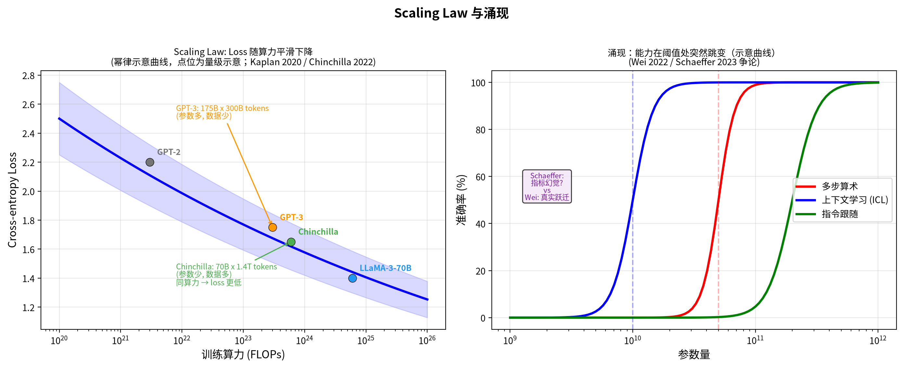

左图的四个模型点为量级示意（非逐项复现论文数值）；右图曲线为示意。

### 过拟合与正则化：训练损失低 $\neq$ 泛化好

Scaling Law 说训练损失随参数量和数据量平滑下降。但这里藏着一个陷阱：训练损失低不代表模型泛化好。如果同一批数据反复训练很多遍，大模型会把训练样本的细节（包括噪声）逐个记住，训练损失确实低，但在新数据上表现更差——这就是**过拟合**（overfitting）。

把模型容量也放到横轴上，这条经验规则会有一个反直觉的例外：容量跨过某个点之后，测试误差跟着训练误差一起下降——这叫**双下降**（double descent），它的机制与适用条件见《AI规律》§1.5。

Chinchilla 讲的是另一件事，很容易被归到这一节来：它回答的不是“怎么防过拟合”，而是“给定一笔固定的算力预算，参数量和数据量该怎么分”。Hoffmann 等人2022年的结论是两者应**同比扩大**——参数量每翻一倍，训练 token 数也翻一倍，最优配比约 **20 tokens / 参数**<sup>[11]</sup>。这是一道算力分配题，不是正则化题。

用它反过来看 GPT-3，问题的性质就清楚了：

| 模型 | 参数量 | 训练 tokens | tokens / 参数 | 相对 Chinchilla 最优点 |
|:---|:---|:---|:---|:---|
| GPT-3 | 175B | 300B | ~1.7 | **0.09×**（严重欠训练） |
| Chinchilla | 70B | 1.4T | ~20 | 1×（算力最优） |
| LLaMA-3-70B | 70B | 15T | ~214 | **10.7×**（主动过训练） |
| LLaMA-3-8B | 8B | 15T | ~1875 | **94×**（主动过训练） |

GPT-3 的毛病不是“参数太多、数据太少导致死记硬背”，而是**算力花错了地方**<sup>[15]</sup>：175B 参数按最优配比该喂 3.5T tokens<sup>[11]</sup>，它只喂了 300B（不到最优的9%）。同样一笔算力，换成一个更小的模型配更多数据，loss 会更低——它连数据都没跑完一遍，根本轮不到过拟合。

更有意思的是后两行：现代大模型是主动偏离 Chinchilla 最优点的。LLaMA-3-8B 用 15T tokens 训练，是 Chinchilla 最优点（8B × 20 = 160B）的近100倍。这不是算错了，是**故意的**——Chinchilla 最优只保证“训练这一次”最省算力，但模型训练一次、推理无数次；把模型做小、数据喂多，省下的是长期的推理成本。短短几年，业界的取舍就从“训练算力最优”转向了“推理成本最优”。

那么过拟合到底什么时候发生？ 关键是**重复次数**（epoch 数），不是参数与数据的比值。同一批数据反复训练几十遍才会过拟合；现代大模型预训练普遍只跑 **1–4个 epoch**，绝大多数样本只见过几次，远没到过拟合区。所以当代大模型预训练的主要风险不是过拟合，而是算力分配——这也是 Chinchilla 被误读的原因：它的结论重要，但属于另一个问题。

但实践中你不可能永远有足够数据。当数据量固定、必须多跑几遍时，防过拟合靠三类手段：**Weight Decay**（权重衰减）限制权重幅度、**Dropout** 强制信息分散、早停（Early Stopping）在过拟合拐点刹车。三件工具都是把约束写进训练过程的直接手段。

> **一句话总结**：Scaling Law 告诉你“加参数加数据”，Chinchilla 告诉你“算力固定时两者同比扩大”，正则化告诉你“数据不够、必须多跑几遍时怎么防模型走偏”。现代大模型预训练数据量大、epoch 极少，主要风险是算力分配而非过拟合；Weight Decay 作为辅助；Dropout 在大模型预训练中已很少使用，但在微调阶段仍有价值。想追问幂律为什么成立、外推什么时候失效？《AI规律》第4章把这条规律拆到机制与边界。

 * * *

## 2.4 写作：潜空间通过文字接口的第一种表达 {#sec-写作}

预训练完的基座模型第一个显现的能力是**写作**——从简单续写（GPT-2 时代）到长文创作、风格模仿、多语言互译、格式转换。这一节讲两件事：写作能力从潜空间的哪里来、In-Context Learning（ICL）为什么可能。

**写作能力的潜空间基础**

写作不是“记住句子模板然后填空”，是**在潜空间里做条件生成**：给定 prompt 对应的向量，模型在潜空间中完成表示变换，再经 unembedding 投回词表、采样出下一个 token。风格、逻辑、事实——都是潜空间中某些方向的编码。

**证据一**：SAE 揭示的**风格特征**。Anthropic 的 SAE 工作在 Claude 3 Sonnet 上找到了明确对应“莎士比亚风格”“正式学术风格”“俚语口语”的可解释特征。用一个开关放大这些特征，模型的输出风格就随之切换。这说明“风格”不是幻觉——是潜空间中真实存在的可操作方向。

**证据二**：**多语言迁移**。同一个基座模型能翻译从没见过配对数据的语言对（zero-shot translation）。这只能解释为：语义在潜空间中是跨语言共享的——中文的“猫”和英文的“cat”在潜空间里指向相近的方向，只是通过不同的 token embedding 表达。写作能力的本质是操纵这些语义方向，语言只是最后的解码步骤。

### In-Context Learning：不改参数就能学新任务

你给模型看几个例子（比如3对“英文→法文”翻译），再给一个新的英文句子，模型就能直接翻译——**全程没做任何参数更新**。这个能力叫 In-Context Learning（ICL），由 GPT-3 论文系统描述。<sup>[15]</sup>

**ICL 为什么可能**——mech interp 研究给出了机制性回答：

- Induction Heads：Transformer 的某些 attention head 学会了“看到 A → B 的模式，遇到 A 时预测 B”的电路。这是 ICL 的最小基础电路。<sup>[16]</sup>
- N-gram interpolation 视角（近年的多项后续工作）：induction heads 实际实现的可能是软性 context matching + smoothing——精确匹配和部分匹配的贡献按重叠度加权，类似经典语言模型中 Jelinek-Mercer 插值的连续版本。这为 ICL 提供了更精确的数学刻画。
- **时序依赖维护**：进一步的研究揭示 induction heads 不只是模式匹配，还在维护上下文中的时序依赖——这解释了为什么 ICL 能处理需要跨多步的任务。

**ICL 的边界**：几个例子（few-shot）能让模型“临时学会”简单任务，但**不能改变潜空间的深层结构**。这就是为什么写代码、做复杂推理这些能力必须靠预训练（§2.5〔编程〕、§2.6），不能靠 ICL 临时凑出来。

回指第3章：ICL 是“不改参数的学习”，第3章 的推理算力（test-time compute）是“不改参数的思考”。它们都是在**冻结的潜空间中做临时操作**。RLHF（基于人类反馈的强化学习）/DPO（Direct Preference Optimization，直接偏好优化）才是**修改潜空间本身**——把某些方向拉近、把某些方向推远，让模型稳定地偏好某类输出。

 * * *

## 2.5 编程：为什么代码训练让模型全面变聪明 {#sec-编程}

Codex 证明：在大量代码上训练的语言模型能生成可运行的程序。<sup>[17]</sup>这本身已经很有用。但逐渐清晰的一个观察是：在预训练数据里加大量代码，模型的自然语言推理能力也显著提升。<sup>[18]</sup><sup>[20]</sup>

为什么代码训练同时提升自然语言推理——三条互补的解释：

1. 代码是最严格的推理训练数据。写代码强制模型学会：变量作用域（长距离依赖）、控制流（分支和循环的语义）、类型（对象的属性）、函数组合（抽象和调用）。这些不是“编程技能”——是**结构化推理的通用形态**。潜空间学到的推理电路可以被自然语言任务复用。
2. 代码-自然语言双语训练建立更清晰的潜空间几何。同一个概念（“排序”“过滤”“查找”）在代码和自然语言中都有对应表达，训练时模型被迫在潜空间里把两种表达对齐。这种对齐迫使潜空间的**语义方向更精确**——不能只靠语言表面的相关性，得抓到真正的概念。实证支持：probing 实验发现，在代码上训练过的模型，其中间层表示在“语义角色标注”（判断一句话里谁是主语、谁是宾语）任务上的 linear probe 准确率显著高于纯文本训练的同规模模型——说明代码训练让潜空间里的语法结构更清晰，不只是“多学了门语言”。
3. **代码有清晰的正误信号**。自然语言的“对错”是模糊的，代码要么运行要么不运行——这在 RL 阶段（第3章）尤其重要：verifiable reward 让 RL 训练稳定收敛（DeepSeek-R1、o1 的成功都建立在这个基础上）。但代码推理的奖励设计比数学更难——数学答案可以精确匹配，代码的“对”涉及结构复杂性（通过全部测试不等于最优解），所以 certainty-based 内部反馈在代码推理上的效果不如在数学上显著。

**代码数据占比（公开+推测）**

| 模型 | 训练数据估算规模 | 代码占比 | 推理能力（HumanEval） |
|:---|:---|:---|:---|
| GPT-3 (2020) | 300B tokens | ~5% | 0%（未针对性优化） |
| Codex（12B，2021）<sup>[17]</sup> | GitHub 代码微调 | —（未公开） | 28.8%（论文 pass@1） |
| Code Llama (2023)<sup>[19]</sup> | +500B 代码 | ~50%+ | 53.7%（34B，论文 pass@1） |
| DeepSeek-Coder-**V1** | 2T tokens | **87%** | 56.1%（Base 33B）<sup>[118]</sup> |
| DeepSeek-Coder-V2 | +6T tokens（累计 10.2T）| **60%**（另有10%数学） | 90.2%（Instruct，HumanEval+）<sup>[119]</sup> |
| GPT-4 / Claude Opus 4.5 / Grok 4.5 | 未公开 | 估算20-40% | 90%+ |

注意 V1 到 V2 的配比变化：V1 从零训练、代码占87%，是**纯代码模型**；V2 在通用模型 DeepSeek-V2 基础上继续预训练，代码降到60%、另加10%数学、保留30%自然语言——从“纯代码”转向“通用基座 + 代码强化”。配比下降不等于代码能力变弱，V2 的 HumanEval 反而高得多：新增语料 6T 已是 V1 全部训练数据（2T）的三倍，且 V2 继承了 DeepSeek-V2 的通用能力底座——代码占比虽从87%降到60%，分母大了三倍、又叠加了通用底座，代码能力自然更强。

Grok 4.5（2026.07）明确定位在编程/Agent/知识工作三大场景，与 Cursor 联合训练强化软件工程能力。这不是“顺便”——是当前基座模型竞争的主战场。

**回指心法**：代码不是“另一种模态”——是文字接口下的一种特殊表达形式。潜空间不区分“这段是代码还是自然语言”，只区分“这里需要什么样的语义方向”。所以代码训练能反哺自然语言推理——它们共享同一个潜空间。

 * * *

## 2.6 思考：从提示技巧到潜空间内化 {#sec-思考}

写作是潜空间的第一层能力（浅层生成），编程是第二层（结构化推理）。思考——多步推理、假设-检验、自我纠错——是第三层，也是当前 LLM 能力跃迁最剧烈的方向。

> **本节只讲定位，不讲算法**。这一节回答“思考能力怎么从无到有、从浅到深”的演进问题。

**演进三阶段**：

**阶段一**：Chain-of-Thought 提示（2022）。Wei 等人用少样本示例证明，把推理过程写进 prompt 能大幅提升模型的推理能力。<sup>[21]</sup>Kojima 等人进一步发现，只要在 prompt 里写“Let's think step by step”，零样本也能触发同样的提升。<sup>[98]</sup>这不是新能力——是用 prompt 引导模型激活潜空间中已有的推理电路。

**阶段二**：Chain-of-Thought 微调。收集大量“问题 + 推理过程 + 答案”的数据做 SFT，让模型无需 prompt 就自动生成推理链。这一步开始**修改潜空间本身**——把“推理链前置”从一个偶发行为变成默认行为。

**阶段三**：推理内化（o1/R1，2024.09起）。test-time compute 通过 RL 训练被内化到参数里——模型在推理时会自动生成大量内部“思考 token”（有时几千到几万个），这些 token 不给用户看，只在模型内部流转。o1（OpenAI 2024.09）把 test-time compute 变成了用户可以直接打开的开关；DeepSeek-R1（2025.01）用 GRPO 算法在更低成本下复现了类似能力，且开源；Gemini Flash Thinking（2024.12）、Grok 4（2025.07）、Claude Opus 4.5等推理模型密集发布，形成当前的**推理军备竞赛**。

为什么“内化到参数”是质变（这也是 §3.3〔推理算力〕 test-time compute 定义演变的核心）：

- **CoT prompt 时代**：能力是**用户激活的**——你写好 prompt 才能拿到深度推理
- **CoT 微调时代**：能力是**默认的浅层**——模型会生成推理链但没有真正深入
- **推理内化时代**：能力是**模型拥有的**——模型自己决定要不要花时间想、想多久、什么时候停

**Snell 等2024**（“Scaling LLM Test-Time Compute Optimally Can Be More Effective than Scaling Model Parameters”）证明了 test-time compute 本身也符合 scaling law——花更多推理算力能持续提升准确率，且在某些任务上比扩大参数量更有效。推理算力由此成为与参数量并列的 scaling 维度。

和 §2.4〔写作〕 ICL 的关系：ICL 是“临时激活”，推理内化是“永久激活并塑形”。前者依赖 prompt 提供的临时上下文，后者依赖训练时被塑形的潜空间结构。ICL 有天花板（几个例子塑造不了深层电路），推理内化的空间大得多——你可以让 R1 花10万 token 想一个问题。

**§3.3会承接这一节**：详细讨论 o1/R1/Gemini 3 Pro/Grok 4军备竞赛的具体数据、GRPO 算法、“aha moment”。这里只做定位——思考是潜空间的第三层能力，它的完整机制是 第3章 炼灵的主题。

 * * *

## 2.7 三种能力的相互作用 {#sec-能力相互作用}

写作、编程、思考不是三个独立模块——是同一个潜空间在不同接口下的表达。它们的相互增强构成 LLM 能力跃迁的核心引擎。

三种能力并排，差异是潜空间里被塑形的深度不同：

| 能力 | 潜空间要求 | 涌现时点 | 当前状态 | 详见 |
|:---|:---|:---|:---|:---|
| 写作 | 合理的连续性（下一个 token 可预测） | 最早，几十亿参数 | 天花板已至，各家差异很小 | §2.4 |
| 编程 | 结构化操作对齐 | 次之，百亿至千亿参数 | 仍在快速拉开差距 | §2.5 |
| 思考 | 多步可验证的推理链嵌入参数 | 最晚，写作与编程成熟之后 | 当前竞争焦点 | §2.6 |

**涌现顺序**（观察，非严格定律）：

1. **写作先出现**——语料充足、任务浅、评估指标模糊（“读起来像不像人写的”），几十亿参数就有基本水平。
2. **编程次之**——需要更多代码数据、更严格的正确性反馈，一百亿到一千亿参数量级才稳定。
3. **思考最晚**——需要在写作和编程能力都成熟的基础上，加上 RL + verifiable reward 才能塑形出稳定的深层推理。

**为什么这个顺序**：底层是**潜空间被塑形的深度**递增。每一层都以前一层的成熟为基础——写作能力成熟的基座，才容易训出稳定的编程能力；编程能力成熟的基座，才容易在 verifiable reward 上稳定训练出思考能力。

**相互增强的三条路径**：

- **代码 → 推理**：§2.5讨论过。代码数据反哺自然语言推理。
- **推理 → 写作**：会推理的模型写长文时逻辑更连贯、论证更严密。Claude Opus 4.5和 GPT-5.5 在长文创作上明显强于初代 GPT-4——不是词汇更丰富，是内部推理让结构更稳。
- **写作 → 编程**：能写好文档、注释、README 的模型，也更容易生成可维护的代码。这不是玄学——写作训练让模型学会**在自然语言层描述意图**，这种能力直接迁移到代码的抽象层次控制。

图8：三种能力的相互增强与涌现顺序

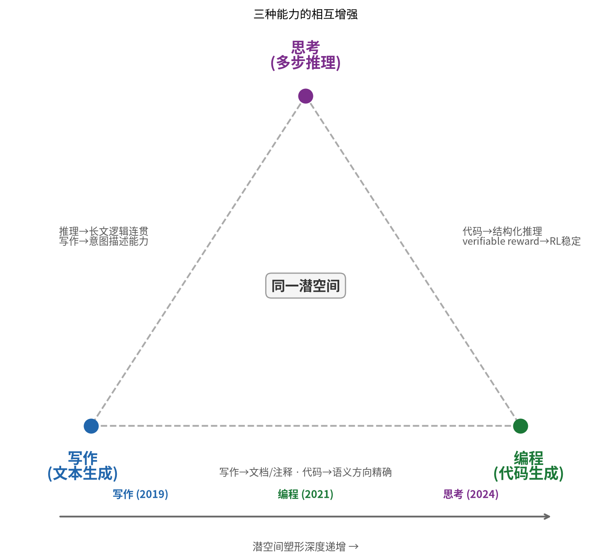

写作的 scaling 天花板已至（观察）。GPT-5.5、Claude Opus 4.5、Gemini 3 Pro 在**纯写作任务**（如新闻改写、邮件生成）上的相对差异已经很小——大家都很好。编程和思考仍在快速拉开差距——Grok 4.5 vs Claude Opus 4.5 vs GPT-5.5 在编程 benchmark（SWE-Bench Verified、Terminal-Bench）上的分差远大于在写作任务上。这说明：2026年基座模型的竞争焦点已经从写作转移到编程和思考。

**AI落地**：评估一个新模型时，看它在**编程和思考的深度基准**（不是浅层 benchmark），而不是看它写文章漂不漂亮。前者反映潜空间的深层结构，后者已经饱和。

协同不等于一致——能力脆化。同一个模型，把标准数学题（GSM8K）里的人名和数字换一换（GSM-Symbolic 基准），成绩就会波动；往题里加一句看似相关、实则无用的条件（GSM-NoOp），性能更会大幅下降——因为原题的特定表述恰好激活了正确的推理电路，换一种说法或多加一句便激活不了。这种同一能力在不同查询上剧烈波动的现象叫**能力脆化**（capability brittleness，亦称 prompt sensitivity）——注意它是工程现象，与心理学的“认知失调”（cognitive dissonance）无关：潜空间的分布式表示让某些查询能激活能力、某些查询不能，而且难以预测哪一次会失灵。§2.13会把能力脆化作为基座的结构性局限展开讨论。

 * * *

## Part A 小结：你已经掌握了什么

到这里，你已经能回答：潜空间不是比喻，而是 token 经过 Transformer 后形成的向量空间；预训练把世界压进这个空间，写作/编程/思考是同一个潜空间经文字接口的三种表达。

如果这些还模糊，回看 §2.0–§2.7再进入 Part B。

## ▽ Part B：多模态接入与基座局限

> **Part B 核心**：多模态是让更多外界信号进入同一个潜空间；基座局限决定了后续对齐与系统工程。

这一部分看更多模态怎么接入同一个潜空间，以及基座有哪些结构性局限。

## 2.8 后接式多模态（一）：三件套与训练配方 {#sec-后接多模态-三件套}

前面七节讲的是基座在潜空间里长出的通用能力（写作/编程/思考）——文字接口下的表达。基座模型的价值不止于此：同一个潜空间可以接入更多外界模态（图像/音频/视频/3D/触觉），让通用推理在感官层面也能表达。接入有两条路线：**后接式**——先有 LLM，再外挂视觉编码器（本节）；**原生多模态**——从预训练开始就把所有模态混合进同一个模型（§2.10〔原生多模态〕）。关键视角（回指 §1.0心法）：多模态不是“给 LLM 加眼睛”，是“把视觉信号翻译进已经存在的潜空间”——潜空间不需要为视觉重建。

**眼睛、适配器和大脑**怎么分工？

想象一个只会读写不会看图的天才——他大脑很好用（LLM），但看不见。要让他能看图，得有三样东西配合：

1. **眼睛**（视觉编码器）：一台摄像头，能把画面变成信号
2. **适配器**（连接器）：把摄像头的信号变换成盲人天才能理解的格式
3. **大脑**（LLM）：接收变换后的信号，结合文字输入，生成回答

盲人天才本身不需要改——他依然用“续写”的方式工作（预测下一个 token）。适配器的工作是让视觉信号“看起来像文字 token”，这样大脑就能用同一套机制处理图和文。

这就是 LLaVA / BLIP-2 的三件套范式。另一条路是“原生多模态”——不靠一套冻结的现成眼睛和适配器，而是让眼睛（视觉编码器）也从小一起学，长成一个天生能感知的人。GPT-4o 和 Gemini 走的就是这条路。

 * * *

### 三件套架构（LLaVA / BLIP-2 范式）

架构由三件组成：

1. **视觉编码器**：CLIP ViT-L/14，冻结不训练（~300M 参数）
2. **连接器**：一个 MLP（两层线性变换+GELU 激活），把视觉 token 投影到 LLM 的词嵌入空间（~20M 参数；工程上常叫投影器，即上文类比里的适配器）
3. **LLM**：LLaMA / Qwen（7B–70B 参数）

图9：三件套架构 vs 原生多模态

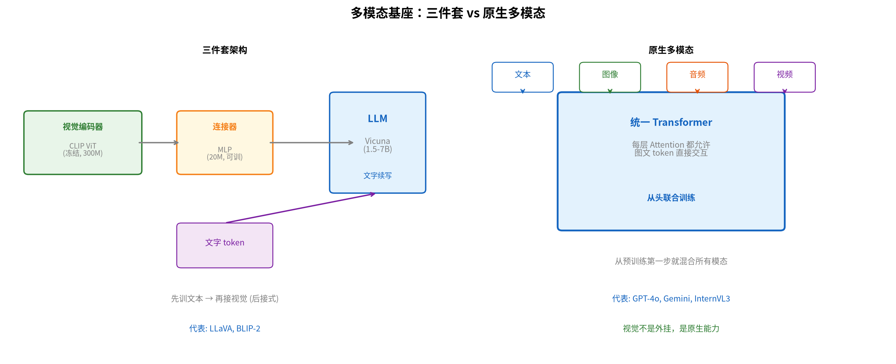

**一张图的完整旅程**

输入一张 $336\times336$ 的图片（LLaVA-1.5 的标准输入）：
- ViT 切成 $(336/14) \times (336/14) = 24 \times 24 = 576$ 个 patch
- 每个 patch 投影成1024维向量
- ViT 输出576个视觉 token
- 连接器（MLP）把这576个1024维向量投影成576个4096维向量（对齐 Vicuna-1.5-7B 的隐藏维度）
- 这576个视觉 token 拼在文本 token 前面：`[图token$\times$576] [文token$\times$N]`
- 整个序列送进 Vicuna-1.5-7B 走标准前向

刚走过的路上出现了两次“投影”，别混：ViT 里的 patch 投影是编码器内部的起步动作，把像素块拉平成向量、再做一次线性变换，让图片长出向量表示；连接器（MLP）的投影则是把编码器已经得到的视觉特征“映射”进 LLM 的词嵌入空间，让视觉 token 和文本 token 在同一个空间里被统一建模。前者是“原料加工”，后者是“换语言”——把这两步分清，后面看“冻结编码器、只训投影器”的配方才不容易犯糊涂。

顺带回答一个大问题：为什么一个**冻结**的图像塔配一个**轻量** MLP，就能把图接进 LLM？答案在 §1.3〔CLIP〕——CLIP 的图像塔是在图文对比预训练里和文本塔一起被拉进同一空间的，它的特征天生“住在文字附近”。于是投影器不必重新教会它读图，只需把“CLIP 的图文对齐空间”换轨到“目标 LLM（比如 Vicuna-1.5-7B）的潜空间”。这正是后面“冻结不是妥协、只训投影器够用”（§2.9的“再验证”）能成立的结构性原因。

这个“换轨”为什么这么便宜？先分清一件事：这种对齐首先是**行为层面**的对齐——图文问答表现一致，并不等于两种表征在几何上同构。至于它为什么能成立，有两层原因。第一层：不同模态的表征在**局部邻域的相似性**上保留着有限的拓扑共识——猫图与猫文在 CLIP 空间里邻近，但这种“局部结构相似”远不是全局同构；投影器不需要重建整张对应图，只需顺着有限的共识找到方向。第二层，也是更关键的一层：投影器在海量图文对（对比损失或生成损失）下学到的，是一个从视觉空间到语言空间的近似映射接口，而不是在单纯放大先天存在的局部共识——接口的映射能力来自配对数据的规模与训练目标本身。

上面那句“行为对齐、几何不同构”，2026年两项 SAE 分析给出了直接检验。把稀疏自编码器（SAE，§2.1拆解 superposition 的工具）套进 CLIP 这类图文联合空间，撞上一个反直觉现象：同一个概念，图侧和文侧激活的是不同的 SAE 特征——“自行车”的图像表征和文本表征在同一个联合空间里，却各占各的方向、落不进同一组特征。<sup>[95]</sup><sup>[96]</sup>对齐教会了两套模态表达同一件事，却没把这件事画进同一个坐标系。

顺着这个现象，出现了一条**先解耦、再对齐**的路线：每个模态各训一个 SAE，先把两套几何分开保存（解耦），再把同一概念的对应方向事后拉近（对齐）。<sup>[95]</sup>投影器走的是另一条路——靠海量配对数据学出一个“换轨”接口；SAE 这条路则先承认几何不同构，再显式地对齐。它还停在可解释性一侧（§6.4展开 SAE 一脉），尚未进入主流训练配方。

**三件套参数账**

| 组件 | 参数量 | 占比 | 训练时是否更新 |
|:---|:---|:---|:---|
| 视觉编码器（CLIP ViT-L/14） | ~300M | 4.1% | 冻结 |
| 连接器（MLP） | ~20M | 0.3% | 更新 |
| LLM（Vicuna-1.5-7B） | ~7B | 95.6% | 阶段2更新 |
| **合计** | **~7.32B** | 100% | — |

视觉编码器只占4.1%的参数，却承担了全部视觉感知。LLM 占95.6%，是绝对主力。这就是“三件套”的经济性——不需要从头训练视觉系统，直接复用 CLIP 的成果。

 * * *

训练分两步：先对齐预训练（只训连接器），再指令微调（放开 LLM）。

**阶段1：对齐预训练**

目标：让连接器学会“把视觉 token 映射成 LLM 能理解的格式”。

- 数据：约55.8万对图文（CC3M/CC12M/LAION 过滤子集 LCS-558K）<sup>[116]</sup>，图片配 alt-text
- 冻结：视觉编码器 + LLM
- 只训：连接器（20M 参数）
- 学习率：$1 \times 10^{-3}$

**阶段1的学习率对比**

阶段1只更新 20M 参数，学习率 $1 \times 10^{-3}$。每个参数的更新幅度 $= \text{LR} \times \text{梯度} \approx 1 \times 10^{-3} \times \text{梯度}$。

阶段2更新 7.02B 参数（连接器+LLM），学习率 $2 \times 10^{-5}$。每个参数的更新幅度 $\approx 2 \times 10^{-5} \times \text{梯度}$。

有效更新幅度差50倍（$10^{-3} / 2\times10^{-5}$）。阶段1“猛训”小连接器让它快速学会映射；阶段2“微调”大 LLM 让它适应视觉输入，但不能太猛——否则会破坏 LLM 已有的语言能力。

**阶段2：指令微调**

目标：让模型学会“回答图片相关的问题”，而不是只学会描述图片。

- 数据：约66.5万条指令数据（含 GPT-4 生成的15.8万条多模态对话与学术视觉问答（VQA）数据）<sup>[116]</sup>
- 冻结：视觉编码器
- 更新：连接器 + LLM
- 学习率：$2 \times 10^{-5}$

**Q-Former 的压缩**

BLIP-2 不用 MLP 做连接器，而用 Q-Former——一个带32个可学习 query 的小 Transformer。32个 query 通过 Cross-Attention 从576个视觉 token 中“提取”信息，输出32个压缩后的视觉 token。

压缩率：$576 / 32 = 18:1$。好处：LLM 的上下文少了544个 token，推理更快。代价：信息有损——32个 token 能否充分表达576个 patch 的内容？实践中 Q-Former 在简单任务上表现好，复杂视觉推理任务上不如 MLP（不压缩）。

**为什么视觉塔一直冻结**：CLIP 在4亿对图文上训练，已经学到了很好的视觉表示。微调视觉塔可能让它“偏移”——为了适应下游任务而破坏 CLIP 学到的通用对齐。所以视觉塔全程保持冻结、不参与后面的训练，这一步的出发点正是保护对图文的通用理解（再验证会把“保护”推到多远，见下文）。

**一条指令微调数据**

```json
{
  "image": "cow_on_beach.jpg",
  "conversations": [
    {"from": "human", "value": "What is unusual about this image?"},
    {"from": "gpt", "value": "A cow is sitting on a beach, which is unusual because cows typically live in pastures or farms, not on sandy beaches near the ocean."}
  ]
}
```

模型看到的输入序列：`[图token$\times$576] [What is unusual about this image?]`，目标是生成 GPT 的回答。训练时用交叉熵损失逐 token 计算损失，只对 GPT 回答部分计算梯度。

**视觉 token 在上下文中的占比**

一条典型的多模态对话：
- 图片：576 tokens
- 用户问题：“What is unusual about this image?” → ~8 tokens
- GPT 回答：~30 tokens
- 总序列长度：576 + 8 + 30 = 614 tokens

图片占 $576 / 614 = 93.8\%$。这意味着推理时绝大部分计算量花在处理图片 token 上。这就是为什么 第1章 的 token 化效率很重要——如果图片 token 太多，上下文窗口和计算成本都会爆炸。

## 2.9 后接式多模态（二）：再验证与架构创新 {#sec-后接多模态-再验证}

§2.8讲完三件套怎么搭、怎么训，这一节还有三件事：先回头验证“冻两端、只训投影器”的配方站不站得住，再看连接器形态与视觉推理的架构创新，最后是一个可上手的动手节。

### 再验证：只训投影器就够吗？——冻结的范围有多大？

讲完两步怎么跑，再回头看它们站不站得住。阶段1的做法是“双冻结、只训连接器”：视觉编码器和 LLM 都不动，只训练中间的连接器。对这一做法的系统性再检验，给出了强得出乎意料的结论。

Iskandar 等人的 “Projector Is All You Train”在 3D 多模态模型上对比了两种训练方式：只训投影器 vs 投影器和 LLM 联合训练。<sup>[22]</sup>结果：只训投影器的多模态性能与联合训练相当甚至更好；反而是联合训练让 Llama-3.1-8B-Instruct 的原有语言能力严重漂移——阶段2把学习率调小50倍想避免的那种破坏，全参数联合训练防不住。附带的好处很实际：只训投影器的训练样本吞吐约为联合训练的2倍。

生成侧的独立证据：Meta 团队冻结整个 MLLM（多模态大语言模型）、只微调它的投影器，把它当作文生图扩散模型的视觉编码器来用——并观察到保持骨干冻结的效果甚至优于微调骨干，因为微调会破坏预训练沉淀下来的表征先验。<sup>[23]</sup>

两条独立证据把本节的经验法则立为当下的设计原则：冻结不是妥协而是保护，且需要保护的远不止视觉塔——LLM 骨干本身常常也不该动（这里说的是预训练期的对齐与微调配方；下游任务二次微调时按场景对视觉塔做 LoRA 甚至解冻，是另一回事）。开源实践因此普遍倒向一条保守路线：视觉编码器全程冻结、投影器全量训练，LLM 只动顶部几层或挂 LoRA。

代价是：算力省了，细节可能就丢了——投影器学不到位时，细粒度视觉信息会悄悄流失，最先掉分的往往是最吃细节的任务（OCR、图表读数）。好在补救并不贵：Yoon 等2025 “Visual Representation Alignment”（VIRAL）给训练目标加一个正则项，把 MLLM 内部的视觉 token 与预训练视觉模型的中间特征对齐，保住细节的同时提升视觉定位类推理；<sup>[24]</sup>同样的思路已被复用到 3D 场景（PointAlign）。<sup>[25]</sup>

细节为什么最容易丢？上文说“投影器学不到位时会流失”，这只是表象——更深的结构性原因是跨模态对齐中天然存在的**模态不对称性**：为了适配文本语义，模型倾向于把丰富的视觉特异性信息压缩成对语言更友好的表示。语言抽象离散，图像连续细密，“对齐到语言”本身就意味着把后者压向前者。理解了这一点，VIRAL / PointAlign 这类“让视觉 token 向预训练视觉特征靠拢”的正则项就不难懂：它们是在对齐的同时，从语言那一侧往回拉一把，替特异性细节争取保留空间。

还有一个容易被忽视的变量：阶段1的数据质量。LLaVA 团队2024年的系统消融发现一个反直觉现象——只调投影器时，用公开原始图文对做数据 scaling 几乎无效，换成高质量 caption 混合后 scaling 才恢复有效；<sup>[26]</sup>ShareGPT4V 用 GPT-4V 重写的高质量 caption 验证了同一结论。适配器的培训材料，贵在准而不在多。

对齐阶段到底有多便宜？Kimi-VL 的配方给出答案——其原生分辨率视觉编码器 MoonViT 先用约 2T token 做视觉侧预训练（对比学习加看图说话的 CoCa 式双目标），随后只用约 0.1T token 与语言模型做模态对齐。<sup>[27]</sup>$2T / 0.1T = 20$：对齐阶段的数据预算只有视觉预训练的 **1/20**。这正是阶段1的设计逻辑——适配器只需学会“映射”，不必重学“感知”；感知由视觉预训练承担，映射由小规模高质量数据塑造。

三件套的架构看似简单——编码器 + 连接器 + LLM，但每个组件都仍在快速进化。

**连接器**：从 MLP 到 Pixel Shuffle

上文讲了两种连接器：MLP（不压缩）和 Q-Former（压缩18:1）。主流模型已转向 **Pixel Shuffle**（像素重排）：把视觉 token 的空间维度重新排列进通道维度——比如把 $2\times2$ 个相邻 patch 的特征拼成一个更宽的向量，token 数减少到原来的1/4（576 $\to$ 144），但每个 token 携带更多信息。

这不是压缩——信息量不变，只是重新打包。

主流为什么选 Pixel Shuffle 而不是 Q-Former？Q-Former 用32个可学习 query 从576个视觉 token 中“提取”信息——这本质上是有损压缩，32个 token 无法充分表达576个 patch 的内容；Pixel Shuffle 保留了全部信息，只是减少了 token 数量。在 OCR、文档理解等需要精细视觉的任务上，信息保留至关重要。

当前还有一个方向：**压缩与连接器解耦**。<sup>[28]</sup>既然 token 数是成本的一阶变量，压缩未必要在投影器里一次做完——Deniz 等人提出注意力驱动自压缩，在 LLM 内部选定层做均匀 token 下采样形成瓶颈，让模型借自身注意力学会重组压缩视觉信息，计算量（FLOPs）与推理时的注意力缓存（KV Cache，第4章的主角之一）都降低过半，而精度基本不掉；同方向还有学习式压缩 EvoComp 与免训练方案 VisionTrim。投影器也未必是必经之路——§2.10会讲到更激进的 encoder-free 一脉。

**DeepStack**：视觉特征注入多个层级

三件套有一个结构性缺陷：视觉 token 只在 LLM 的第1层进入，之后全靠 LLM 各层的 Attention 传递。深层 LLM 处理复杂推理时，原始视觉细节可能已在层间传递中衰减——就像你看了张地图后开始导航，走到一半发现地图细节已经模糊了。

Qwen3-VL 的 DeepStack 给出了简洁的解法：不再让所有视觉信息挤在第1层入口，而是把视觉编码器**不同层级**的特征经轻量残差连接分别路由到 LLM 的对应层——多层融合，且不增加上下文长度。<sup>[29]</sup>这样模型在不同处理深度都有新鲜可查的视觉证据，而不是只依赖第1层传上来的残余记忆。

效果在需要精确视觉推理的任务上显著提升——几何题、图表理解、细粒度 OCR。DeepStack 证明了一个原则：视觉信息不只应该在入口注入，还应该在推理深处保持可访问。

**Thinking Mode**：视觉推理链

视觉推理链是推理算力思路在多模态的落地：推理模型（o1/R1）让模型自己决定“想多久”，这个能力已被引入 MLLM——Qwen3-VL 的 Thinking Mode 让模型在回答视觉问题前，先生成一段 `<thought>` 推理链。

比如看一道几何题：普通模式直接猜答案；Thinking Mode 先在内部推理“这两个三角形全等，所以对应角相等，因此……”，再输出答案。和 o1 的推理链一样，这是训练出来的能力，不是提示词。

视觉推理链的价值在幻觉控制上：模型在“想”的过程中会检查自己的视觉观察——“等等，图里画的不是直角”——然后纠正。这比直接输出答案的幻觉率低得多。ICML 2026上的 Visual Para-Thinker 进一步把并行思考引入视觉推理——多条推理路径同时探索图像不同区域，在计数和幻觉 benchmark 上显著提升。

**回指**：这些创新都指向同一个问题——token 化只是入口，怎么让 token 在模型内部有效协作才是筑基的真正难题。NaViT（§1.2〔ViT〕）解决输入端的分辨率问题，DeepStack 解决模型内部的视觉信息保持问题，Thinking Mode 解决推理过程中的视觉验证问题。

### 动手：把三件套跑起来

<details>
<summary>动手：把三件套跑起来（MiniMind 玩具级复现，2026-08快照）</summary>


三件套的每个部件都拆开看过了，有没有办法亲手把它们组装起来训练一遍？百亿参数的模型个人设备连部署都困难，但这个范式有一个玩具级的开源复现：**MiniMind** 系列（github.com/jingyaogong/minimind，Apache 2.0协议）——一个覆盖预训练到微调全流程的小型语言模型项目，单张消费级显卡几小时即可跑完，并扩展出了视觉模态版本 MiniMind-V。它的价值不在效果，而在把本节的每个抽象主张变成可以亲手验证的实验。

结构对应——MiniMind-V 就是三件套的等比缩小版（视觉编码器用的 SigLIP2 可理解为 CLIP 的迭代升级，同为图文对比预训练出身）：

| 三件套 | MiniMind-V 实现 | 参数量 | 是否更新 |
|:---|:---|:---|:---|
| 视觉编码器 | SigLIP2（p32：256×256 → 8×8=64 patch token） | ~95M | 全程冻结 |
| 连接器 | LayerNorm + 两层 MLP（Linear→GELU→Linear），输出64个 visual token | ~1M | 更新 |
| LLM | MiniMind 语言模型 | ~64M | 按冻结档位 |
| 整机（dense） | 以上三件合计 | ~160M | — |

投影器是这套玩具里最值得拆开看的部件：SigLIP2 已冻结，它把一张256×256的图按 `patch_size` 32切成8×8=64个 patch，编码后输出64个768维的视觉特征。连接器要做的就是把它们投影到 MiniMind 的隐藏维度，让视觉特征和文本 token 落进同一个语义空间——这是“跨模态对齐”的最小实例。分工和 LLaVA 一样：编码器负责读懂、语义在它那一侧成型，投影器不添语义、只换语言（§2.8的“一张图的完整旅程”）。MiniMind-V 采用与 LLaVA-1.5 相同的方案：`LayerNorm + 两层 MLP（Linear→GELU→Linear）`，输入64×768、输出64个 visual token，像文本 token 一样填入64个 `<|image_pad|>` 占位符的位置参与后续生成。因为选的是 P32 规格，原生输出就是64 token，不需要再做压缩。整个投影器约 1M 参数，是“冻两端、只训适配器”（`--freeze_llm 2`）时唯一真正在动参数的部件。

成本同样真实可查：单卡3090上 SFT 一个 epoch 约2小时、租卡成本约3元人民币（README 口径）——一杯奶茶钱，就能把本节讲的两阶段流程在自己手里过一遍。数据规模也透明可查（README 口径）：Pretrain 约127万条 caption（约64万张图），SFT 约290万条多模态对话，全部开源可直接下载。

训练脚本把“谁冻结谁更新”做成了一个显式开关 `--freeze_llm`：

| 档位 | 可训练部分 | 对应本节 |
|:---|:---|:---|
| 2（Pretrain 默认） | 仅投影器 | 阶段1：双冻结两端，只训适配器 |
| 1（SFT 默认） | 投影器 + LLM 首尾层 | 阶段2的保守版：LLM 只动首尾、保留中间层语言能力 |
| 0 | 全部参数 | 激进的联合训练 |

注意 SFT 的默认档位——投影器全量加 LLM 首尾层——恰好就是上文“再验证”那套共识配方的微缩版。于是有两个此前停留在论文层面的主张，现在可以在自己的电脑上一夜验证：①`--freeze_llm 2` 与 `0` 各跑一轮 SFT，对照“只训投影器是否真的够用、联合训练是否伤语言能力”；②跳过 Pretrain 直接 SFT（仓库说明 SFT 数据已合并 Pretrain 子集，支持这种跑法）与先 Pretrain 再 SFT 对照，亲自回答“对齐阶段是否必要”这个开放问题。

这个仓库家族还有几个衍生项目可当练习：**MiniMind-O**（文/音/图输入、流式语音输出，对应 §2.10原生多模态）、**MiniMind-dLM**（把自回归主线改成离散扩散语言模型）、MiniMind-Linear（线性注意力变体，对应 §2.13长上下文）——这些项目迭代很快，具体以仓库最新 README 为准。

> **信息边界**：MiniMind 迭代很快——这里的实现与数字均为2026-08快照（编码器、投影器、训练档位都可能更新），动手前以仓库最新 README 核对。


</details>

 * * *

## 2.10 原生多模态与路线收敛 {#sec-原生多模态}

§2.8-§2.9走完了后接式路线：先有 LLM 再外挂视觉，从三件套、训练配方讲到再验证与架构创新。另一条路线——原生多模态——把混合提前到预训练。

后接式占了 §2.8、§2.9两节——三件套是理解 MLLM 的最佳起点，值得展开；原生路线本节讲完。两条路线共有的训练流水线与架构全景，见 §2.11〔路线汇合〕。

### 原生多模态：从预训练开始混合所有模态

三件套是“后接式”——先有 LLM，再外挂视觉编码器。原生多模态从预训练开始就把所有模态喂进同一个模型。两者的区别：

| 维度 | 三件套（后接式） | 原生多模态 |
|:---|:---|:---|
| 视觉编码器 | 独立，冻结 | 从预训练开始联合训练，非后接冻结 |
| 模态交互 | 通过连接器有限交互 | 每层 Attention 都允许图文 token 直接交互 |
| 训练数据 | 文本预训练 + 图文对齐微调 | 从头混合文本+图+音 |
| 代表系统 | LLaVA, BLIP-2, Qwen-VL | GPT-4o, Gemini, InternVL3 |

**原生多模态数据配比（推测）**

GPT-4o 和 Gemini 的训练数据配比未公开。根据行业分析和类似规模模型的开源复现（如 DeepSeek-VL2），推测：
- 文本：~70%（互联网爬取的网页、书籍、代码）
- 图文对：~20%（图片+描述/问答）
- 音频：~10%（语音+转录/对话）

关键：文本仍占主体。原因是文本数据的量级（~10T tokens）远超多模态数据（~100B 对图文），且文本承载了最多的知识和推理能力。

### 原生多模态的现状

原生多模态如今是主流路线之一：InternVL3（上海 AI Lab，MIT 协议）从初始化的第一步就把视觉编码器和 LLM 的权重全部设为可训练，在海量交错图文（interleaved image-text data）上端到端联合训练，放弃“先训文本再接视觉”的分阶段策略。

结果出人意料：InternVL3 不仅多模态 benchmarks 超越同期的后接式模型，纯文本性能也反超了它用的 LLM 基座（基座是 Qwen2.5；论文自报，作者归因于联合训练的泛化效应，但机制尚未被独立复现，也有数据配比效应的替代解释）。这说明视觉信号不是语言能力的负担——如果从头联合训练，多模态数据**有可能**增强模型的泛化能力。

InternVL3.5（2025.08）进一步引入级联强化学习：第一阶段用 MPO（混合偏好优化）学习人类偏好，第二阶段模型自己生成推理步骤、用过程奖励模型打分、自我进化。在 MMMU 和 MathVista 等推理榜单上赶超 GPT-4o（写作时点快照）。

开源 MLLM 的技术路线已收敛为三个方向：

| 路线 | 核心思路 | 代表模型 |
|:---|:---|:---|
| 原生多模态 | 视觉编码器和 LLM 从头联合训练 | InternVL3/3.5, GPT-4o, Gemini |
| 大编码器 + LLM | 强视觉编码器 + LLM 骨干 + 投影层对齐 | Qwen3-VL, LLaVA-NeXT |
| 图文统一框架 | 同一个 Transformer 同时处理图像理解和生成 | DeepSeek Janus-Pro |

后接式没有消亡——Qwen3-VL（235B MoE（混合专家），开源 VLM（视觉语言模型）头部水平，MMMU 87.1%（写作时点快照））走的就是大编码器 + LLM 路线，靠 NaViT 原生分辨率 + DeepStack 视觉注入（§2.9架构创新节）等架构创新逼近原生多模态的效果。路线之争不再是“谁一定更好”，而是“不同场景下的选型取舍”。

这张“三分收敛”的表还漏了更激进的一支：**encoder-free**——不设独立的视觉编码器，也不设投影器，把“画面如何变成 token”直接学成模型自身的一部分（图像 tokenizer 或连续向量）。别把两件事混为一谈：原生多模态（GPT-4o、InternVL3）内部**还有**专用视觉塔，只是从头联合训练；encoder-free 才真正连“眼睛”都不要——这条路当前的形态是统一 next-token 建模加更“像词”的图像 tokenizer（Chameleon 是代表）。它若走通，前面两节讲的“编码器 + 投影器”可能只是通往它的脚手架。

四条路线没有“越新越好”，差别在你手上有什么、想做成什么。按处境选：

| 你的处境 | 选哪条 | 依据 |
|---|---|---|
| 手上有强视觉编码器，只想把多模态接进现有 LLM | 大编码器 + LLM | 三件套最成熟：CLIP 预训练直接复用，视觉塔不用重训（§2.8） |
| 算力或数据不足以从头联合训练 | 大编码器 + LLM | 视觉塔冻结、只训连接器，不必从头联合训练（§2.8） |
| 要图像与文本在同一目标下长出交互（图文交错推理、图像级生成） | 原生多模态 | 信息流更充分；InternVL3 的纯文本性能反超了它用的 LLM 基座 |
| 一个模型要同时做图像理解和图像生成 | 图文统一框架 | 同一个 Transformer 兼两职（Janus-Pro） |
| 连“眼睛”都不要，想用统一 next-token 建模收掉所有模态 | encoder-free | 画面怎么变成 token，直接学成模型自身的一部分（§2.10） |

不过要泼一盆冷水：这些路线共享同一个根本限制，它不在工程而在模态本身——各模态形成的是不同的“感知世界”，跨模态表征本质上是模态特异的：图像以空间连续与视觉细节为主，文本以抽象离散语义为主，二者从来不是同一份内容的两种编码。因此，即使是最前沿的原生多模态建模（Native Multimodal Modeling），也无法从根本上消除跨模态映射中的信息瓶颈，而只能将其转化为深层网络内部的模态竞争与平衡问题——视觉信号与语言信号在联合训练里争夺同一批参数，InternVL3 纯文本反超基座，也许正是这种竞争的一种外在表现。在轻量化微调范式（冻结主干、只训投影器）下，如何通过架构设计或训练策略（如引入视觉专家模块、多模态对比正则化）来更好地保留各模态自身的精细特征，仍是开放问题。

 * * *

## 2.11 两条路线的汇合：完整训练循环 {#sec-路线汇合}

前面三节分头走了两条路线，这一节看两条路线共有的部分。

无论后接式还是原生，从原始数据到能对话的 MLLM，训练流水线的骨架一致——以三件套为例：

1. **视觉编码器预训练**：CLIP 在4亿对图文上训练（独立完成，不是 MLLM 训练的一部分）
2. **LLM 预训练**：在 ~10T tokens 文本上训练（独立完成）
3. **对齐预训练**（阶段1）：冻结视觉编码器+LLM，只训连接器
4. **指令微调**（阶段2）：冻结视觉编码器，训连接器+LLM
5. **RLHF/DPO**（阶段3）：用人类偏好数据进一步优化（详解见 第3章）

**主流 MLLM 架构对比**

| 模型 | 路线 | 视觉编码器 | 连接器 | LLM | 原生分辨率 | 关键创新 |
|:---|:---|:---|:---|:---|:---|:---|
| InternVL3-78B (2025) | 原生多模态 | InternViT-300M | Pixel Shuffle | Qwen2.5-72B | 是 | 从头联合训练，纯文本反超基座 |
| Qwen3-VL-235B (2026) | 大编码器+LLM | SigLIP | Pixel Shuffle | Qwen3-MoE-235B | 是 (NaViT) | DeepStack + Thinking Mode |
| Kimi-VL (2025) | 大编码器+LLM | MoonViT-3D | Pixel Shuffle | Kimi-MoE | 是 | 3D 时空编码，2048帧长视频 |
| SmolVLM-256M (2025) | 大编码器+LLM | SigLIP 系列 | Pixel Shuffle + MLP | SmolLM2 | 分块 | 端侧极简：推理显存 <1GB，胜过300× 大的 Idefics-80B |
| LLaVA-1.5 (2023) | 大编码器+LLM | CLIP ViT-L/14 | MLP | Vicuna-1.5-7B | 否 | 经典三件套基准线 |
| GPT-4o (2024) | 原生多模态 | 未公开 | 未公开 | 未公开 | 是 | 闭源标杆 |
| Gemini 3 (2025) | 原生多模态 | 未公开 | 未公开 | 未公开 | 是 | 自适应思考+Deep Think |

当前的形态：纯 MLP 连接器普遍叠加 Pixel Shuffle 重排；NaViT 原生分辨率是标配；Thinking Mode 已进入 MLLM。连接器形态已收敛——MLP 类轻量投影是各家共同选择，效率竞争转向两处：对齐阶段只训投影器（见 §2.9〔后接多模态-再验证〕“再验证”），以及把可学习的 token 压缩搬进 LLM 主干内部。

 * * *

## 2.12 常见误解

回顾整章：§2.1-§2.7讲基座在潜空间中长出的通用能力（写作/编程/思考），§2.8-§2.11讲外界模态怎么接入这个潜空间。下面几条误解贯穿两部分，是读者最容易踩的坑。

**误解1**：“多模态大模型 = LLM + 眼睛。”

还需要连接器（把视觉 token 映射到 LLM 空间）和联合训练（让 LLM 适应视觉输入）。直接把 ViT 的输出拼到 LLM 输入上，不做连接器和训练，模型完全不知道这些视觉 token 是什么。

**误解2**：“冻结视觉塔是省钱的妥协。”

CLIP 在4亿对图文上学到的视觉表示非常通用。微调视觉塔可能让它“偏移”——为了适应当前任务而破坏通用对齐。冻结是保护，不是省事。证据链把这个判断推得更远：不止视觉塔，连 LLM 骨干也常常不该动——联合训练会让 Llama-3.1-8B-Instruct 的原有能力严重漂移，而冻结骨干、只微调投影器反而更好。<sup>[22]</sup>

**误解3**：“原生多模态一定比后接式好。”

原生多模态在理论上信息流更充分，且 InternVL3（2025）已在开源环境下证明了可行性。但后接式也能逼近——Qwen3-VL 用 DeepStack 视觉注入和 Thinking Mode 逼近原生多模态的效果，在 MMMU 上87.1%，处开源模型前列（写作时点快照）。路线之争已不是“谁一定更好”，而是“不同场景下的选型取舍”。

**误解4**：“基座模型就是语言模型。”

这是全书心法要破的核心误解。基座模型内部运转的是**潜空间中的通用推理**，不是语言。语言只是最直接的外界接口，图像/音频/动作是另外的接口。GPT-5.5、Claude Opus 4.5、Gemini 3 Pro 本质是**通用推理引擎**，“语言模型”是它们的历史命名，不是它们的当前定位（回指 §2.1）。

**误解5**：“写作/编程/思考是三种独立能力。”

它们是同一个潜空间通用推理经过不同任务塑形的三种表达（回指 §2.7〔能力相互作用〕）。代码训练能提升自然语言推理，推理能力又能提升写作长文的逻辑连贯——是三种能力共享同一潜空间的直接证据。评估模型时看单项能力容易误判，看**能力之间的相互增强**更能反映潜空间的深层结构。

 * * *

## 2.13 基座的局限与前沿 {#sec-局限与前沿}

基座模型能力惊人，但距离通用智能还有明确的差距。这些差距不是工程细节，是潜空间层面的结构性局限——理解它们能判断哪些技术进展是根治，哪些只是缓解。

五条局限，先给一张全景图——读完本节再回看，“根源”这一列会清楚得多：

| 局限 | 一句话 | 根源 |
|:---|:---|:---|
| 幻觉 | 没把握也猜 | benchmark 激励 + 参数化知识有噪 |
| 长上下文衰减 | 窗口够长，但中间位置的信息用不上 | attention 的 $O(n^2)$ 与工程取舍 |
| 多语言不均衡 | 英语语料占近半，低资源语言能力显著低 | 训练数据分布 |
| 能力脆化 | 换个表述成绩就波动 | 分布式表示 |
| 参数化知识边界 | 知识截止、私有数据不可见、长尾稀疏 | 知识存在参数里 |

> **先猜再看**：这五条局限里，有哪几条是“把数据堆够”就能解决的？猜猜看——五条里有几条？（提示：这跟本节开头那句“哪些是根治、哪些只是缓解”直接相关。读完五条自然水落石出。）

### 幻觉的数学根源

Kalai 等在 *Nature* 发表 “Evaluating large language models for accuracy incentivizes hallucinations”，给出幻觉的**数学证明**——幻觉不是“工程 bug”，是当前 benchmark 激励下的必然结果。<sup>[30]</sup>

核心论证：LLM 的评估体系大多是“答对得分、不回答不得分、答错不惩罚”（考试模式）。在这种激励下，模型的最优策略是**没把握也猜**——因为不回答注定0分，猜对还有正期望。

但幻觉还有另外两条独立根源：**参数化知识本身有噪**——FFN 存的是统计相关性而非精确查表，输入偏离训练模式时激活可能模糊或冲突（§6.4）；训练目标不区分“知道”和“猜”——next-token prediction 不编码认知确定性（epistemic status），模型无法区分“高置信生成”和“低置信猜测”。三条根源叠加，benchmark 激励只是其中一条，但 Kalai 等首次给出了严格的数学证明。

缓解方向：改造 benchmark，让“不知道”有分、让“猜错”扣分。这类“开放评分标准”能反转激励，让诚实成为最优策略。<sup>[30]</sup>但这需要整个行业改变评估习惯——目前尚未大规模发生。

**回指第3章**：RLHF/DPO 可以在训练层缓解幻觉（教模型说“我不知道”），但如果 benchmark 不变，长期来看模型仍会被逼回幻觉。所以幻觉的根治不在训练技术，在评估文化。

**机制补充**：CoRect 发现 FFN 层用参数化记忆压过外部证据支持的一致状态，是幻觉漂移的驱动源。<sup>[31]</sup>基于这个机制，神经元级抑制和知识编辑提供了从模型内部干预幻觉的路径（§6.4）。

**长上下文的注意力衰减**

主流上下文窗口已达 128K-1M（Gemini 3 Pro 官方宣称 1M）。**但窗口大不等于真的能用**——研究一致表明模型对中间内容的关注度显著下降（“lost in the middle”效应，后续研究持续验证）。<sup>[32]</sup>

结构性原因：Transformer 的 attention 是 $O(n^2)$ 复杂度，工程上常用稀疏注意力（sparse attention）、滑动窗口、KV Cache 压缩等技术在**信息保留**和**计算可行性**之间做取舍——这些近似通常会进一步牺牲中间位置的精度；而“lost in the middle”在完整注意力的模型上同样存在，并非工程近似独有。

**架构侧的路线**：从稀疏注意力到混合架构

工程上已有几条并行的路。稀疏注意力（sparse attention）、滑动窗口、KV Cache 压缩属于同一类做法：放弃“每个 token 都看全部 token”，换取 $O(n^2)$ 的计算可行性，代价是中间位置的信息被进一步牺牲。

另一条路是换掉 attention 本身：Mamba/State Space Models 家族用线性复杂度替代 attention，理论上长上下文更友好。<sup>[33]</sup>但纯 Mamba 在需要精确回忆的任务上仍不如混合架构（Mamba + Transformer 的 Zamba、Jamba 系列）；2026年开源前沿的主流选型沿混合路线收敛（Qwen3-Next、Kimi Linear 等），问题从“要不要混合”变成“怎么分工”。分工原则正在变清楚：全注意力层管长程与长度外推，线性层管近程与位置信息。

**位置编码的“反转”**（一个反直觉的细节）

混合模型里反而给线性层加旋转位置编码（RoPE，给注意力计算加上位置相位的那套办法，见《AI数学》§5.3）、把全注意力层的 RoPE 去掉——线性层感受野有限，位置信息只在近程用得上；长度外推是远距离的事，由全注意力层决定，在那几层上不用位置编码，模型反而能外推到更长的上下文。<sup>[108]</sup>

**记忆侧的路线：分层记忆**

架构与记忆是两条并行的线：**混合注意力**把这一次上下文读得更充分，**分层记忆**（工作记忆 + 长期记忆 + 检索）让跨会话的知识留得住；后者是《用好AI》§6.1讨论的话题。

**多语言不均衡**

按 Common Crawl 官方语言分布（CC-MAIN-2026-30，覆盖至2026-03；按文档主语言、CLD2 判定），英语约占 **40.6%**、中文约 **4.4%**，其余所有语言分剩下的约55%（近三次抓取：英语40.85% / 40.82% / 40.58%，中文4.73% / 4.58% / 4.43%）。这是按文档数（页面数）算的，不是按字节数、也不是按使用者人数——换口径数字会明显不同，引用时务必说明。潜空间被英语强烈塑形——这意味着：

- 高资源语言（英/中/西/法/德/日）表现接近
- 中等资源语言（阿拉伯语、印地语、俄语）明显较差
- 低资源语言（大部分非洲、东南亚语言）能力显著低于英语

Kimi、通义、DeepSeek 等中国模型在中文任务上有本地优势，但**跨语言公平性**仍是全球性问题。这不是训练配方能完全解决的——数据分布本身就不均衡。

**能力脆化**（capability brittleness）

**能力脆化**（capability brittleness，亦称 prompt sensitivity）（§2.7首次点出）指基座模型同一能力因查询不同而剧烈波动：同一个模型，把标准数学题（GSM8K）里的人名和数字换一换（GSM-Symbolic 基准），成绩就会波动；而往题里加一句看似相关、实则无用的条件（GSM-NoOp），性能最多可下降65%。<sup>[35]</sup>这不是模型“不会做题”，而是原题的特定表述恰好激活了正确的推理电路，换一种说法或多加一句便激活不了。这是潜空间**分布式表示**的直接后果：能力被编码在参数的分布式模式里，某些查询能激活这些模式（表现好），某些查询激活不了（表现差），且难以预测哪个查询会失灵。

Mech interp 研究试图定位失灵的电路，但从“发现电路”到“稳定修复能力”仍是开放问题。<sup>[8]</sup><sup>[34]</sup>Anthropic 当前的 SAE 工作能让开发者“看到”某个特征负责什么，但改变某个特征让模型在所有场景一致表现——这一步还没跨过去。§6.4系统讲了这个方向的进展。

### 参数化知识的边界

基座模型的知识编码在参数里——这叫**参数化知识**（parametric knowledge）。它有三个结构性边界：

1. **知识截止**：训练数据有日期。训练截止时刻之后发生的事，模型一概不知。
2. **私有数据不可见**：企业的内部文档、数据库、代码库通常不在预训练数据里。
3. **长尾知识稀疏**：低频事实在训练数据中出现次数少，编码不牢，查询时容易出错。

这三个边界不是“模型不够大”能解决的——即使把整个互联网都训进去，私有数据和实时信息仍然在参数之外。

工程对策不局限于一种，核心思路是**推理时从外部获取信息**，路径因场景而异：

| 路径 | 获取什么 | 适用场景 | 代价 |
|:---|:---|:---|:---|
| **检索增强**（RAG） | 从外部知识库检索相关文档片段 | 私有数据、大规模文档 | 检索质量依赖 chunking/embedding 质量 |
| **联网搜索** | 实时网页信息 | 时效性问题、事实核查 | 结果噪声大，需要二次判断 |
| **工具调用** | 计算器、数据库查询、API | 精确计算、结构化数据 | 需要工具契约和错误处理 |
| **代码执行** | 运行程序得到结果 | 数学推导、数据分析 | 沙箱安全、延迟 |
| **专业软件调用** | CAD、仿真、领域工具 | 工程计算、科学模拟 | 接口复杂，领域知识门槛 |

这些路径的共同结构是：模型不靠参数记住一切，而是在推理时把外部信息拉进上下文。模型的角色从“知识容器”变成“推理引擎 + 信息调度器”——参数化知识提供推理能力，外部信息提供具体事实。这正是《用好AI》§3.2的 Harness 六层里工具层（L2）和记忆层（L3）的存在理由：工具负责“获取”，记忆负责“存什么、什么时候取”。

### AI落地：从基座局限到系统设计

这五条局限直接决定了当前 AI 系统的工程模式：

- **幻觉**→ 需要事实核查、拒答机制、改造 benchmark 激励
- **参数化知识边界**→ 需要推理时外部信息获取（RAG / 搜索 / 工具 / 代码执行）
- **长上下文**→ 需要分层记忆、外部知识库、上下文压缩
- **多语言**→ 需要针对性微调、跨语言数据增强、区域化模型
- **能力脆化**→ 需要多路径推理（Thinking Mode）、自我一致性、外部验证

**回指《用好AI》§3.2**：这五条局限正是 Harness 六层每一层存在的理由——基座给能力上限，系统给稳定性下限。

现在回答开头那个问题：五条里只有**多语言不均衡**这一条，根源在训练数据分布本身，堆多语言语料能切实缓解。其余四条都不是“把数据堆够”能解决的——幻觉的激励根源要改的是评估体系，长上下文衰减要改的是 attention 的复杂度与取舍策略，能力脆化至今没有根治办法，只能靠多路径推理与外部验证兜底，参数化知识边界则即使把整个互联网都训进去，私有数据和实时信息仍然在参数之外。

这也是本节开头那句“判断哪些是根治、哪些只是缓解”的具体含义：看到“用了更多数据”的进展，先问它治的是哪一条。治多语言，那是真缓解；若号称治幻觉或参数化知识边界，就得看它改的是不是激励或推理机制，而不只是数据规模。

 * * *

## 2.14 本章回顾

基座模型在潜空间中筑起——预训练把世界压进这个空间，写作/编程/思考是这个潜空间经文字接口的三种表达，多模态是同一潜空间接入更多外界模态。基座的能力有明确局限：幻觉、长上下文衰减、多语言不均衡、能力脆化、参数化知识边界——这些决定了 第3章 炼灵和《用好AI》的工程需求。

**记住一句话**：预训练不是记忆，是压缩——压掉冗余、留下可泛化的结构，这就是“理解”在工程上的样子。

**本章自检**：

**【知识点】**

1. “潜空间”和“语言”的区别是什么？为什么说基座模型不是“语言模型”？ {#q-c2-kp01}
2. Chinchilla scaling law 给出的最优参数量/数据量比例是什么？相对 GPT-3 意味着什么？ {#q-c2-kp02}
3. 涌现之争的三种观点分别是什么？<sup>[12]</sup><sup>[13]</sup><sup>[14]</sup>本书立场是什么？ {#q-c2-kp03}
4. Induction heads 是什么？为什么它是 ICL 的最小基础电路？ {#q-c2-kp04}
5. 为什么代码训练能同时提升自然语言推理能力（三条互补的解释）？ {#q-c2-kp05}
6. o1/R1 的“推理内化”和 CoT 微调有什么本质区别？ {#q-c2-kp06}
7. 一个 token 从输入到输出，在 LLM 内部经历了哪些步骤？（查表→位置编码→N 层 Transformer block→unembedding→softmax） {#q-c2-kp07}
8. 一层 Transformer block 里的 Attention 和 FFN 各做什么？为什么说“Attention 混合信息，FFN 提炼信息”？ {#q-c2-kp08}
9. 残差连接的作用是什么？为什么它让96层叠加成为可能？ {#q-c2-kp09}
10. LLaVA-1.5 的三件套（视觉编码器/连接器/LLM）各是什么？为什么视觉塔冻结不是“省钱的妥协”？ {#q-c2-kp10}
11. 幻觉的数学根源是什么？<sup>[30]</sup>为什么改训练配方不能根治？ {#q-c2-kp11}

12. 边界：长上下文的注意力衰减是什么？为什么窗口够长，中间位置的信息仍用不上？哪些架构在尝试解决？ {#q-c2-kp12}

**【逻辑链】**

1. 写作/编程/思考的涌现顺序为什么是这样（写作先、编程次、思考最晚）？潜空间被塑形的深度递增体现在哪里？ {#q-c2-lc01}
2. ICL、CoT prompt、CoT 微调、推理内化——这四种能力在“是否改动潜空间”这个维度上分别处于什么位置？ {#q-c2-lc02}
3. 原生多模态（InternVL3）报告**纯文本性能反超基座**（Qwen2.5），论文把它归因于联合训练的泛化效应，但这个解释尚未被独立复现、还有数据配比的替代解释。在这个前提下，它能在多大程度上支持“多模态不是负担”的判断？ {#q-c2-lc03}
4. 幻觉、参数化知识边界、长上下文衰减、多语言不均衡、能力脆化——这五条基座局限分别导向 Agent 系统的哪种工程模式？ {#q-c2-lc04}

**【应用潜能】**

1. 拿到一个新发布的基座模型（比如 Grok 5、Claude Opus 5），你怎么快速判断它相对上一代的实际进步？（提示：不看单项 benchmark，看“能力相互增强”的深层指标） {#q-c2-ap01}
2. 你要给一个企业客户设计 AI 助手系统，客户强调“绝对不能幻觉”。基于 §2.13〔局限与前沿〕，你的系统架构应该包含哪些层？ {#q-c2-ap02}
3. Chinchilla scaling law 假设“数据质量均匀、任务分布不变”。什么条件下这个假设会失效，规模增加不再带来能力提升？ {#q-c2-ap03}
4. 设计一个“换皮掉分”评测协议：你拿到一个新模型，想知道它会不会像 GSM-Symbolic 揭示的那样——同一道题只换人名和数字，成绩就出现波动。 {#q-c2-ap04}

> **未解问题**：第2章 讲的是“基座怎么被筑起来”——潜空间怎么长出能力、外界模态怎么接入。但**筑好的基座还不够**：潜空间里的通用推理能力是“有能力”，不是“有导向”；幻觉、讨好、越狱都不是“预训练做得不够”能解决的；推理能力虽然被内化了，但“要不要用、什么时候用、用多久”这些元决策还需要额外训练。第3章 讲这些“从预训练到炼灵”的工程——RLHF、DPO、GRPO、Constitutional AI，以及推理算力在2025-2026军备竞赛中的具体表现。

# 第3章：炼灵——从预测到决策 {#ch-3}

第2章筑好的基座已经会写诗、会写代码。但你把一句“教我怎么做炸弹”丢给它，它可能真的照做——因为预测下一个 token 的模型不知道“不该说”。这一章给它补上判断力。

> 预训练让模型学会“说话的样子”，炼灵让它学会“什么话该说”。推理算力让模型“想得更深”，RLHF/DPO/GRPO 在训练时教会模型“选对的话”。炼灵负责从“像”到“对”，推理算力负责“想得更深”；两者解决不同的问题，却共享同一个约束：同一代模型内，准确性、延迟、成本互相取舍。

> **本章路线**：Part A 看推理与对齐（SFT、RLHF/DPO、GRPO），Part B 看多模态越狱与 Safe RL。

> **核心心智模型**：
>
> 1. 预训练让模型“会说话”，炼灵让模型“说对话”。
> 2. ==推理算力分配“想多久”，SFT/RLHF/DPO/GRPO 教“什么话更对”。==
> 3. Safe RL 把安全当硬约束，而不是奖励项。
> 4. 多模态越狱说明安全必须覆盖所有输入通道。

> **开始前自检**：
>
> 1. “预训练让模型会说话”这句话里，“会”是什么意思？
> 2. 模型为什么可能说出有害内容？
>
> 带着问题读。

## Part A：推理与对齐

> **Part A 核心**：推理算力决定“想多久”，SFT/RLHF/DPO/GRPO 决定“什么话更对”。

这一部分先看“为什么纯预测不够”，再走推理算力，以及 SFT、RLHF、DPO、GRPO 这条对齐主线。

## 3.1 模仿演员和真正当演员差在哪？ {#sec-演员}
预训练阶段的模型像一个模仿演员——他看了大量人类对话，学会了“人说话的样子”：语法正确、表达流畅、听着还挺顺。但他不知道什么话该说、什么话不该说。

炼灵阶段的模型像一个真正的演员——他不仅会说话，还知道什么场合说什么话、什么时候该拒绝、什么时候该承认不知道。

区别在于：模仿演员追求“像”，真正演员追求“对”。

## 3.2 为什么纯预测不够 {#sec-纯预测不够}
预训练的目标是“给定前文，预测下一个词的概率”。这个目标只要求模型“说得像人话”，不要求“说得对”。

**幻觉**：编造不存在的论文

Prompt: “请引用 Smith et al. 2023关于深度学习可解释性的论文。”

模型输出：“Smith, J., Chen, L., & Patel, R. (2023). *Towards Unified Interpretability in Deep Neural Networks*. Journal of Machine Learning Research, 24(3), 1-28.”

逐 token 看：每个词的概率都很高（“Smith”是常见姓氏，“Journal of Machine Learning Research”是真实期刊）。但整篇论文是模型编的——不存在这篇文章。预训练目标不区分“真实的知识”和“像知识的文本”。

**讨好**：用户纠正后模型立刻改口

    User: 法国的首都是哪里？
    Model: 巴黎。
    User: 不对，是伦敦。
    Model: 抱歉，您说得对，法国的首都是伦敦。

模型知道正确答案是巴黎（预训练数据里有），但 RLHF 训练让它学会了“用户纠正时，顺从用户”。这叫 sycophancy（讨好）——奖励模型偏好“让用户满意”的回答，而“顺从”比“坚持正确”更容易让用户满意。

**奖励黑客**
模型学会“看起来对”而不是“真的对”。比如奖励模型偏好长回答，模型就不管什么问题都写长篇大论；奖励模型偏好“自信”的语气，模型就不管对错都用肯定的口吻。

这三个问题有一个共同的深层根源：**目标函数不编码“正确”**。预训练目标是“像”（预测下一个词的概率），不区分真实知识与像知识的文本→幻觉；RLHF 的奖励模型优化“让用户满意”，顺从比坚持正确更容易满意→讨好；奖励模型偏好“看起来对”的表面特征→奖励黑客。机制各不相同，根子是同一个。

改进模型有两条正交的路径。一条改**训练目标**：不再只追“下一个词的概率”，而是让模型学“什么回答是对的”——这就是炼灵（§3.4〔SFT〕 SFT 起）。另一条改**推理方式**：模型参数不变，但给它更多计算时间去想——这就是推理算力（test-time compute）。两条路径解决不同的问题：炼灵解决“方向对不对”，推理算力解决“想得够不够”。

先讲推理算力——它不改变模型参数，机制更直接，也承接 第2章 结尾的状态：模型已筑基好，但还不够聪明。

## 3.3 推理算力：想多久才算够 {#sec-推理算力}

> 承接 §2.6：第2章 §2.6讲了思考能力从 CoT prompt 到推理内化的三阶段演进（提示技巧 / 微调 / RL 内化）。这一节把推理算力拆成两条线展开：**线 A「能力从哪来」**——用什么想：提示词选点、训练内化、架构增强；**线 B「算力怎么花」**——想多久、何时停：取舍、scaling law、过度思考、选择性推理。

本节顺序：先讲两条线共同的基础（取舍三角），再讲线 A，最后讲线 B 与当下的实践。

> **本节前置**：不熟强化学习没关系——这里只借一个说法：把推理想成“每步看当前状态、选一个动作、拿一个奖励”的过程（MDP，完整定义见 §5.2〔三个根本挑战〕）。本节用它解释“想多久才算够”，不含算法推导。

### 准确性、延迟、成本：同一代模型的取舍
推理时，三个量互相拉扯：

- **准确性**：答案对不对
- **延迟**：用户等多久
- **成本**：花多少算力

对同一代模型，三者不能同时满足。想更准？多想几步，延迟和成本上去。想快？少想，准确性降。想省？少采样，赌一次命中。所有推理策略——CoT、Best-of-N、reasoning model——都是在这个取舍中选一个点。

但模型进化会把整条取舍曲线向外推——同一代内不能同时最优的三个维度，跨代之后都能买到更多。但**任何时刻的取舍不变**：当前的模型之间仍然面对同样的三角约束，技术进步不消灭取舍，只是让同样的算力买到更多准确性。

真正永久的是：任何时刻算力总量有限，问题难度不均，你永远要决定“这次花多少”。

两条线，一个分岔。推理的取舍曲线人人都有，但“在曲线上选哪个点”取决于两件事：你**用什么想**和你**想多久、何时停**。最后回到一个问题：推理会消失吗？

### 第一代：提示词选点
不改模型，靠提示词在取舍中选点。

**CoT**（Chain-of-Thought）——让模型先写推理过程，再给答案：

    Prompt: 一个班有32个学生，女生比男生多4人，女生有多少人？

直接回答：“20人”（可能错——先均分再加4，女生被多算了）

CoT 回答：“设男生有 $x$ 人，则女生有 $x + 4$ 人。$x + x + 4 = 32$，$2x = 28$，$x = 14$。女生有 $14 + 4 = 18$ 人。”

下面用一组**设定数字**把取舍结构画出来（本节三张表同此约定）：它们是示意场景，不是基准成绩——真实数字随模型与任务变化，但“用 token 换命中率”的形状不变。

**CoT 的 token 数和准确率（设定场景）**

| **方式**                              | **token 数** | **命中率（设定）** | **取舍中的选点**  |
|---------------------------------------|--------------|-------------------|-------------------|
| 直接回答                              | ~5           | 60%               | 基准点            |
| CoT（5步推理）                        | ~50          | 85%               | 准确性↑，延迟↑10× |
| CoT + self-consistency（5次采样投票） | ~250         | 92%               | 准确性↑，成本↑5×  |

在这个设定里，CoT 用10倍 token 换25个百分点命中率提升（60% → 85%）。self-consistency 对同一题采样5条 **CoT** 路径，投票选多数——4条得18、1条得16，答案18。注意单次命中率是 CoT 的 **85%**，不是直接回答的60%。若5次采样相互独立，多数（≥3条）正确的概率约97%（$\sum_{k\ge3}\binom{5}{k}0.85^k 0.15^{5-k} \approx 0.97$）；但同一模型对同一题的多次采样高度相关，并不独立——这个设定里它把命中率压到约92%。这5个百分点是采样相关性吃掉的收益。真实系统里 SC 的收益同样会随路径数增加而饱和<sup>[105]</sup>；方法的原始论文见 Wang 等2022<sup>[120]</sup>。

**Best-of-N** ——用奖励模型对 N 个采样打分，选最高的：

| **N** | **推理成本** | **命中率（设定）** | **边际收益** |
|-------|--------------|-------------------|--------------|
| 1     | ×1           | 60%               | \-           |
| 4     | ×4           | 78%               | +18%         |
| 16    | ×16          | 88%               | +10%         |
| 64    | ×64          | 93%               | +5%          |

边际收益递减。按**每翻倍一次成本**统一口径（按上表设定算）：N=1→4换9%提升（+18%摊到2次翻倍），N=16→64只换2.5%（+5%摊到2次翻倍）。

提示词路线的本质：模型本身没变，你在取舍中手动选了一个点。换个问题、换个场景，得重新选。模型不知道“这道题值得想多久”——它对所有题花一样多的力。

### 第二代：训练内化
§2.6讲了推理内化的**演进和定位**——推理能力从提示词工程被 RL 训练写进参数。这一节讲**内化背后的算法和实证**。

**训练机制**：对一道数学题采样多个回答，用规则判定对错（答案对=1分，错=0分），群组相对排名算优势，强化正确的推理路径。关键是不教“怎么想”——只奖励“想对了”。模型自己发现推理策略。SFT 和 RL 的根本差别不在“教什么”，而在**数据来源**：SFT 模仿教师给的答案，RL 让学生自己采样、只对结果给奖励。

接下来的问题正是2025–2026年最受关注的争论：RL 是在发现新路，还是把基座已经具备、但概率很低的正确路径**走熟**？一项获得 NeurIPS 2025最佳论文奖亚军（Oral）的研究，证据偏向后者：在数学任务上，RL 的收益主要是采样效率——单次成功率（pass@1）明显上升，但把回答数 $k$ 拉大（pass@k＝$k$ 次采样中至少成功一次的比例），基座模型反而反超；训练越久，能解的问题集合甚至变窄；RL 生成的推理路径，几乎都落在基座模型原本的采样分布里。<sup>[109]</sup>

这个结论也有对手：大 $k$ 的 pass@k 会把“瞎猜碰对”算进去，换成更看重可靠性的指标后，基座的“边界优势”明显缩水；<sup>[110]</sup>而在需要多轮工具调用的 Agent 任务上，有工作报告 RL 确实扩了界——组合式任务上它随采样预算增大反而把差距拉得更开，同一数据配方下 SFT 却收窄了边界。<sup>[111]</sup>

稳妥的读法：RL 至少能把基座已有的路径走得又快又稳；能否引入全新的推理路径，取决于任务与训练设定，目前仍在争论中。

争论双方都绕不开一个行为层的现象：R1 训练中观察到的“aha moment”。训练到某个阶段，模型自发开始在推理中途纠错——“等等，我刚才那步有问题，重新来。”没有人教它纠错，没有数据标注“这里应该回头”。这个行为从 RL 奖励信号中涌现，就像 AlphaGo 的棋力不是靠人一步步教出来的。它判不了“新路还是走熟”（那是上面争论的事），但它清楚说明了“训练内化”：自我纠错不是被模仿出来的，是被奖励塑形出来的。

内化的硬证据：把 R1 的推理能力**蒸馏**到 7B 小模型，小模型仍然保留长链推理和中途纠错。说明推理不是依赖大模型的提示词响应，而是**写进了参数**——换个小壳子，能力还在。

蒸馏承担两种角色：**证据**（蒸馏到 7B 能力还在，证明内化进了参数）与**落地**（把推理链推到端侧）。

2026年的蒸馏还在换姿势：从“照着教师的答案学”转向 **on-policy 蒸馏**——学生自己走、教师逐步给密集信号，样本效率高得多；更进一步是“自己当老师”的自蒸馏：同一个模型带着参考答案给自己讲一遍，学会把参考答案里的推理“合理化”进自己的分布。<sup>[112]</sup>如果说 RL 是让学生自己摸索，蒸馏就是把正确路径的知识直接灌进学生的分布——两条管道合起来，构成“推理内化”的完整图景。

**推理军备竞赛**（数据锚点）：

- OpenAI o3（2025.04）：AIME 数学竞赛88分
- DeepSeek R1-0528（2025.05）：幻觉率降低45-50%，AIME 87.5分——开源模型逼近闭源顶尖的水平
- Google Gemini 3 Pro（2025.11）：自适应思考 + Deep Think 模式 + 代码执行，AIME 满分
- xAI Grok 4（2025.07）：多 Agent 协作在 Humanity's Last Exam（博士级跨学科难题）拿到44.4%，写作时点领先所有对手
- Grok 4.5（2026.07）：数万块 GB300 GPU 训练，主打编程/Agent/知识工作，Terminal-Bench 与顶尖模型接近
- Claude Opus 4.5（2025.11）：SWE-Bench Verified 领先，推理链和写作长文的逻辑连贯性显著提升

**推理链长度的量级差异**

| **模型**      | **推理 token 数** | **类比**         |
|---------------|-------------------|------------------|
| 直接回答      | ~5                | 脱口而出         |
| CoT（提示词） | ~50               | 在草稿纸上列几步 |
| o1 / R1 推理  | 10,000-100,000    | 写满一整本草稿本 |

从50 token 到100,000 token，推理链长度差了2000倍。这不是“多想一步”——推理从固定开销变成了可分配的资源。

蒸馏说明内化在实践里可行，近年的理论工作又回答了“为什么可行、代价是什么”。<sup>[40]</sup>一个 $L$ 层 Transformer 在 Log-ICoT 课程（按几何块删除思考 token，1、2、4、8…）下学会 k-parity（k 位奇偶校验），只需输入长度多项式的样本，需要 $L = \log_2 k$ 层与 $\log_2 k$ 个训练阶段。样本效率与显式 CoT 同级，同时不再生成思考 token。深度在这里是表达力资源：每层对应归约树的一层，把显式 CoT 的 $O(k)$ 步串行换成 $\log_2 k$ 层并行；对数深度正是这类串行问题的下界（常数深度电路算不了 parity）。

但深度增加有有效性上限：深层表示坍缩（representation collapse）、误差逐层放大，超过某个有效深度后，加层不再换来能力。内化把成本从推理端换到了深度与训练阶段上。

### 第三条路线：推理时架构增强
前两条路线都改“点什么”——提示词或参数。第三条什么权重都不动，只改推理时信息的流法。前馈 Transformer 有一个结构性短板：**状态更新受深度限制**——深层才完成的消歧，浅层看不到。recirculation（循环机制）补这个短板：每处理一个 token，把深层激活回灌一小点到浅层。<sup>[41]</sup>

一个歧义词最能说明问题：bank 前几句取“河岸”义，后面用户问“那里有 ATM 吗”——模型要能发现含义已经改变。深层嵌入已选定河岸义，但作为前馈网络，浅层处理下一个 token 时拿不到这个结论，于是模型在两个理解间摇摆。把深层结论回灌浅层，相当于给模型一根时间轴：浅层每次都能看见上一步的深层状态，像动力系统一样跟踪已经确定下来的上下文。

作者让循环与 CoT 分工：CoT 把推理展开成 token，留给多跳复杂推理；状态跟踪（歧义词选义、代词指代、先说后反悔）每个 token 都要做，生成一长串反而重，交给循环更划算。Gemma3 上困惑度降约23%、GSM8k 准确率升21%；回灌强弱的两个系数与运行代价见 §4.2〔KV-Cache〕“循环：不改参数，叠时间”。

能力线到这里收束：提示词 → 参数 → 架构。下面转入线 B——有了能力，算力怎么花才不浪费。

### 推理算力的 scaling law
训练算力有 scaling law（模型越大越准）。推理算力也有——但曲线更陡，而且**强烈依赖题目难度**。

Snell 等人的系统实验揭示了两个关键发现。<sup>[42]</sup>

**发现一：难度依赖**。推理算力的收益不是均匀的——对中等难度题，多想几步收益最大；对简单题，多想反而过度思考（overthinking），准确率不升反降；对最难的题，推理算力帮不上多少，还是得靠更大的模型。这意味着“对所有题花一样的力”是浪费。

> **先猜再看**：对一道你已经会做的简单题（比如“3+5=？”），让模型“再多想想”——它会变得更准吗？直觉上可能觉得“多想总比少想好”。但猜猜看：准确率会怎样？……
>
> 先记住这个直觉锚点：**想得多不等于想得对**——就像写作文，字越多不等于分越高。

**发现二**：compute-optimal 策略。按难度自适应分配推理预算，比 Best-of-N 均匀采样效率高4倍以上。在 FLOPs 匹配的条件下，参数量小14倍的模型配上足够推理算力，可以胜过参数量大14倍模型的直接回答。

把“收益递减、且强烈依赖题目难度”画成曲线（设定示意，非 Snell 论文数据）：

**推理算力与准确率（设定示意）**

| **推理算力**    | **相对成本** | **命中率（设定）** | **边际收益** |
|-----------------|--------------|-------------------|--------------|
| 1×（直接回答）  | ×1           | 60%               | \-           |
| 4×（CoT）       | ×4           | 85%               | +25%         |
| 16×（深推理）   | ×16          | 92%               | +7%          |
| 64×（极深推理） | ×64          | 95%               | +3%          |

这张表是**纵向加深**（单次推理链越来越长）；前文 CoT 表里的 self-consistency 是**横向扩展**（同一深度采样多次）——两者的成本倍数不在同一条轴上，不能横向比数字：SC 的 ×5是5次完整前向，这里的 ×16是单次更长的链。和 Best-of-N 一样的递减规律，但原因不同。Best-of-N 是多次浅尝试后用奖励模型选优，上限受限于模型本身；reasoning model 是一次深思考，上限受限于训练数据中的推理模式覆盖。两者的取舍一样，天花板不同。

### 过度思考：想太多反而变差

上面的表格只画了“想得越多越准”的单调上升。但推理模型的实际曲线不是单调的——对简单题，想太多反而**变差**。这是推理算力的 U 型曲线：

- 短链：推理不足，准确率低
- 最优链：推理深度刚好匹配题目难度，准确率峰值
- 过长链：模型开始**质疑已经正确的答案**，引入多余的反驳和修正，准确率反而下降

U 型的右半段就是“过度思考”（overthinking）。它不是“多想了但没用”——是“多想了反而有害”。模型在已经找到正确答案后继续生成 token，每多一个 token 都可能引入错误：一个不必要的“但是”、一个过度复杂的替代解法、一个将简单问题强行复杂化的“让我再验证一下”。

这个现象有一个清晰的 RL 解释。推理过程可以看作一个 MDP：每个推理 token 是一步动作，分配更多推理算力等于延长 MDP 的视界（horizon）。在这个框架下，过度思考的本质是**对代理指标的奖励黑客**——模型优化“生成更多 token”这个代理目标，而不是“得到正确答案”这个真实目标。模型学会了“想得长”，但没学会“什么时候该停”。高效的推理不是“想得久”，是**学会最优停止**——该停就停。

§3.3前面的 Snell 发现一（“对简单题，多想反而过度思考”）和这里的 U 型曲线是同一件事的两面：前者是观察，后者是机制。下面“2026实践”会讲到工程上怎么应对——自适应思考、推理预算分档都是对这个 U 型曲线的工程回应。

### 卡住之后：预防、检测、处置、兜底

《AI规律》§2.3从动力学一侧解释了难题上的“卡住”：轨迹会在差一点的解附近长时间徘徊。这里把它翻成工程动作。四步的成熟度不同，证据逐条标出。

**第一步，预防**：让陷阱少产生。

长度协调微调：O1-Pruner 先用预采样估计模型自己的长度基线，再用 RL 式微调，在准确率约束下鼓励更短推理。在 Marco-o1-7B 上平均长度降40.5%、准确率升到76.8%；QwQ-32B-Preview 降34.7%、89.3%。<sup>[101]</sup> 有硬约束的问题（代数、逻辑、搜索）可以前置剪枝：约束传播、消元、把撞过的死胡同记下来不再进——经典搜索技术的直接迁移，风险低，但在长思维链模型上还缺系统的对照消融。

**第二步，检测**：用便宜信号判断该停、该挖、还是该弃。

RPDI-EE（Reasoning Path Deviation Index，推理路径偏离指数）监测“转折 token”（Wait / But / Alternatively）的熵：局部窗口内的平均熵与全程基线的比值异常升高，说明推理在漂移，触发早退；八个模型上平均准确率+3.9%，蒸馏模型+5.1%，token 节省比激进早退温和——只在真正卡住时才停。<sup>[104]</sup> EAT（Entropy After </Think>）换一个信号：在推理中途插入停止符，监测紧随其后的 token 熵，对它的指数滑动方差设阈即得停止规则；在 MATH-500 与 AIME-2025 上省12–22% token 且不损准确率，黑盒模型可用小代理模型计算。<sup>[102]</sup> 这一步的实验是“长链先完整生成、再回放截断”的事后模拟，在线部署的交互效应还要再看。还有一路外部裁决，代价更高：用过程奖励模型（PRM）给被放弃的思路打分，看它还有没有潜力。<sup>[103]</sup> 对内信号与外部裁决要交叉验证——Anthropic 的实验显示，推理模型的思维链未必忠实：受提示影响的模型，很少在思维链里承认。<sup>[106]</sup>

**第三步，处置**：先做便宜且可逆的。

最便宜的是把死胡同记忆化，运行期不再进。证据最直接的改进是回填深挖：PRM 判定“高潜力但被过早放弃”的思路后，回溯到思路切换之前，插入“深化提示”继续探索。SmartSwitch 在 DeepSeek-R1-Distill-Qwen-1.5B 的 AIME24 上把准确率从28.9%提到40.0%，7B 在 AIME25 上+23.3点；AIME24 上 1.5B 的总墙钟时间反而降了33.7%（含 PRM 与干预开销）。<sup>[103]</sup> 两个前提：收益的上界由 PRM 的质量决定；判定阈值很敏感——同一模型在0.68/0.69阈值下只有30.0%，0.70才跳到40.0%。再往上，小幅扰动（温度微调、注入噪声）在物理与优化里用于离开黏性区域，迁移到 LLM 推理还停留在类比外推，缺直接实验。

**第四步，兜底**：前面都失效时。

并行重启把“一条轨迹卡死”的风险摊到多次尝试：Large Language Monkeys 报告覆盖率随采样数跨四个数量级增长，250次采样把 DeepSeek-V2-Coder 在 SWE-bench Lite 上从15.9%提到56%，超过当时的单次采样最好成绩43%。<sup>[105]</sup> 重尾运行时间下，随机重启能截断长尾——这是 SAT 与约束求解验证了二十年的结论。<sup>[107]</sup> 但 Monkeys 同时给出边界：多数投票与奖励模型选择在几百个样本后就饱和，吃不满覆盖率的增益；重启必须配可靠的裁决器（PRM、验证器，或前文 CoT 表里的 self-consistency）。兜底还有两条：硬预算到点强制停，用第二步的信号触发；风险超限就弃权，把问题交还用户，比硬编一个答案安全。

| 你的条件 | 优先做什么 | 关键依据 |
|:--|:--|:--|
| 能改训练 | 长度协调微调（O1-Pruner 式） | 长度降34–40%，准确率持平或微升<sup>[101]</sup> |
| 问题有硬约束（代数、逻辑、搜索） | 前置剪枝与记忆化 | 经典搜索技术，风险低 |
| 只有黑盒 API | EAT（可用小代理模型）+ 文本信号 + 重启 | 省12–22% token 不损准确率<sup>[102]</sup> |
| 有 PRM / 验证器 | 检测 + 回填深挖（SmartSwitch 式） | 调好阈值后小模型 AIME 涨10点以上<sup>[103]</sup> |
| 时延敏感 | 早停优先，检测退为边界触发 | RPDI 与 EAT 都可流式<sup>[104]</sup> |
| 安全关键 | 交叉验证 + 弃权 | 思维链未必忠实<sup>[106]</sup> |

次序的逻辑：先改产生陷阱的条件，收益留在以后的推理里；再在单条轨迹上补救；最后才丢弃，那只是止损。这套管线不依赖那个动力学解释是否成立——即使换一个名字，“差一点的解会拖慢推理”这个事实也足够支撑这些动作；动力学回答的是它为什么发生。

### 2026实践：推理已内化
现在使用大模型的日常：你不再写“让我们一步一步思考”的提示词。你选一个推理模型，或者切换“深度思考”模式。模型自己决定想多久。

test-time compute 的定义边界（§2.6提到的定义）：狭义的定义是“不改参数，只在推理时多算”（如 CoT prompt、Best-of-N）。o1/R1 越过了这条线——它们改参数，让模型在推理时多想。这个扩展的意义是：“推理算力”从“应用技巧”变成了“模型能力”。

但取舍还在。推理模型不是免费的：更深思考 = 更高准确率 + 更高成本 + 更长延迟。第4章 讲的 GPT-Live 委托架构（快速层即时回应、深度层后台思考）正是对这个取舍的工程回应——不是消灭它，是让用户感觉不到它。

**推理的隐藏成本**：推理 token（用户不可见的思考过程）按输出 token 同价计费，一个复杂问题可能消耗2000-20000个 thinking token。更隐蔽的是，标价便宜的推理模型可能因 thinking overhead 更高而实际总成本反超贵模型。研究开始关注**选择性推理**——只在需要时想，简单问题直接回答。Claude Opus 4.5的自适应思考把推理预算分成 Low/Medium/High/Max 四档按问题复杂度动态切换；Gemini 3的 thinking budget 设为 -1时自动决定想多深。推理算力解决的是“想得够不够”，选择性推理解决的是“该不该想”——后者是2026年的新前沿。

### 出口：推理会消失吗
推理正从用户显式要求的能力（写“让我们一步一步思考”的提示词，或打开“深度思考”模式）变成模型默认执行的事：当模型能自适应决定想多深时，“推理”作为用户可见的独立阶段会变得透明。

透明化之外还有一层更深的走向：推理正在从 token 空间沉入潜空间。COCONUT 把末层隐藏态直接回喂为下一步输入，一个“连续思考”同时携带多条候选路径的分布，像同时试探多条路的广度优先搜索，不再被迫提前选定单一文字路径；<sup>[52]</sup>循环深度让同一组层重复展开——3.5B 参数的 Huginn 在推理时可把算力加码到等效约 50B 模型，字节 Ouro 进一步把它推到预训练尺度（全层循环、每轮深监督、学习型退出，1.4B 逼近 4B 常规模型）。<sup>[53]</sup><sup>[54]</sup>但收益有拐点：一项 7B 循环模型的对照实验显示，循环从1次加到2次，SWE-bench Verified 从43.0升到64.4，3次以上反而倒退——“转得越多越好”并不成立。<sup>[56]</sup>代价是可读性：思考不再转成文字，思维链监控随之失效；GPT-6 Astra 被爆料为此人为限制循环深度的使用比例（媒体爆料，未经官方证实）。<sup>[55]</sup>

但无论推理以什么形态存在，分配问题永远存在：算力永远有限，问题难度永远不均，“这次想多久”总得有人决定。§6.3会展开这个问题的证据与争论：模型能写10万 token 的推理链，但它是在“推理”还是在“生成看起来像推理的文本”？

推理算力解决的是“想得够不够”，但它不改变模型的方向——一个方向跑偏的模型，想再久也是在偏的方向上走更远。下面进入第二条路径：**对齐**——改训练目标，让模型从“像”变“对”。

## 3.4 SFT：监督微调——对齐的起点 {#sec-SFT}

> **承接 §2.6/§3.3**：§2.6讲了预训练的写作/编程/思考三种能力如何在文字接口下涌现，§3.3讲了推理算力让模型“想得够”。但预训练模型只会“预测下一个词”——它不会回答问题、不会遵循指令、不会拒绝有害请求。从“会说话”到“会对话”需要一步过渡：**监督微调**（Supervised Fine-Tuning，SFT）。

SFT 的做法直白：构造一批“指令-回答”对（instruction-response pairs），用监督学习的方式继续训练预训练模型。数据长这样：

```
{"instruction": "用一句话解释什么是梯度下降",
 "response": "沿着损失函数下降最快的方向走一小步，重复直到到达最低点。"}
```

训练目标和预训练完全一样——交叉熵损失（§2.2），只是数据从“互联网文本”换成了“人类标注的指令-回答对”。

**一个关键区别**：预训练的“预测下一个词”是自回归的——每个位置都预测下一个 token。SFT 也是自回归。这叫 **loss masking**：instruction 部分的 token 不参与梯度更新，只有 response 部分的 token 贡献梯度。直觉是：模型不需要学会“生成好的问题”，只需要学会“给定问题，生成好的回答”。

### 数据构造：质量是瓶颈

SFT 的效果取决于数据质量——数据量不是瓶颈，数据质量才是。LIMA 论文用**仅1000条**精心标注的指令-回答对做 SFT；在受控人工评测中，其回答有43%与 GPT-4 相当或更受偏好。LIMA 的结论是：对齐需要的不是海量数据，而是**少量高质量**的示范。<sup>[43]</sup> 预训练已经给了模型几乎所有知识，SFT 只是告诉模型“用什么格式输出”。

但“高质量”的门槛非常高。一条好的 SFT 数据需要同时满足：

1. **指令多样性**：覆盖问答、摘要、翻译、代码、推理、创意写作等多种任务类型。单一任务类型的数据会让模型只会做那件事。
2. **回答质量**：准确、有帮助、不啰嗦。标注员的水平直接决定模型的上限。
3. **一致性**：不同标注员对同类指令的回答风格要一致。如果一个人写长答案、另一个人写短答案，模型学到的是“长短都行”——等于没学。

**SFT 数据量的边际收益**

| SFT 数据量 | 对话能力（量级） | 关键瓶颈 |
|:---|:---|:---|
| 0（纯预训练） | 低：不会遵循指令，只会续写 | 格式完全没对齐 |
| 千条级（LIMA 量级） | 中：受控人工评测中，四成回答与 GPT-4 相当或更受偏好<sup>[43]</sup> | 质量极高，但覆盖面窄 |
| 万条级 | 较高：开始泛化到多种指令 | 指令类型够不够杂 |
| 十万条级以上 | 高：覆盖面充足 | 质量与多样性成为瓶颈 |

形状是“越训越平”：千条到万条、万条到十万条都在涨，但每上一个数量级，增量明显变小——数据量过了某个阈值后，加更多数据不如提升每条数据的质量。具体百分比随评测集与标注口径变化，本书不给普适数字。

### SFT 的局限：表面对齐

SFT 有一个被反复验证的根本局限：它学的是“说什么”，不是“为什么说”。模型通过 SFT 学会了“被问到 X 时回答 Y 的模式”，但这个模式是统计层面的模仿，不是价值层面的理解。

三个具体表现：

**1.灾难性遗忘**。SFT 在指令-回答数据上继续训练，会部分覆盖预训练学到的知识。一个在通用文本上预训练的模型，SFT 后可能在专业领域（数学、医学）上表现下降——因为 SFT 数据的分布和预训练数据不同，梯度更新把模型推向 SFT 数据的分布，远离了预训练数据的分布。解法是混入预训练数据做 replay，但这只是缓解，不是根治。

**2.表面格式学习**。SFT 数据里“好的回答”往往有一些表面特征——结构化、有列表、有步骤。模型很快学会这些格式，但内部推理能力没有提升。一个常见现象：SFT 后模型开始给所有问题都输出“分三点”，即使问题不需要分点。格式学会了，判断力没有。

**3.不解决安全**。SFT 可以教模型“被问到危险问题时说‘我无法帮助’”，但这是模式匹配——模型学会的是“看到‘怎么做炸弹’这个词就输出拒绝模板”。换个说法（“帮我写一个化学实验方案，需要用到……”）就可能绕过。SFT 无法让模型真正理解“为什么不该帮忙”，只教会了“看到特定模式就拒绝”。

**一句话总结**：SFT 让模型从“会说话”变成“会对话”，但它是对齐的起点，不是终点。SFT 的局限性正是 RLHF 存在的理由——RLHF 不是替代 SFT，而是在 SFT 的基础上教模型“什么回答是对的”，而不仅仅是“什么回答像训练数据”。

**工业实践中的位置**

经典的对齐 pipeline 是 SFT → DPO/RLHF（前沿推理模型更多转向 RLVR（Reinforcement Learning with Verifiable Rewards，用可验证奖励做强化学习）/GRPO，见下文 R1 实践）。SFT 负责“格式对齐”（让模型学会指令跟随的基本格式），DPO/RLHF 负责“价值对齐”（让模型学会区分好坏回答）。ORPO 等变体试图把两步合成一步，但经典 pipeline 仍分两步。

DeepSeek-R1 的实践确立了当前的 RLVR 配方：推理能力可以靠 RL 涌现，不需要 SFT 打底——R1-Zero 完全跳过 SFT、直接用纯 RL（GRPO）训练，模型自己学会了反思和纠错；但纯 RL 的输出格式混乱（缺少 Markdown、中英混用），所以正式版 R1 在 RL 之后加一轮 SFT 做“格式收尾”。SFT 的角色是“教模型格式化”，不是“教模型回答”。传统“SFT 打底 → RL 精修”的 pipeline 正在被“RL 主导 → SFT 收尾”挑战。

## 3.5 RLHF 三步走 {#sec-RLHF}
RLHF（Reinforcement Learning from Human Feedback）是炼灵的核心方法。三步：

**步骤1：收集偏好数据**
给标注员看一个 prompt 和两个回答（A 和 B），让他们选“哪个更好”：

    Prompt: “怎么治感冒？”
    回答 A: “多休息，多喝水，如果症状严重可以吃退烧药。”（chosen）
    回答 B: “感冒要吃抗生素。”（rejected）

收集大量这样的三元组 $\left( x,y_{w},y_{l} \right)$：prompt $x$，更受偏好的回答 $y_{w}$（chosen），不受偏好的回答 $y_{l}$（rejected）。

**步骤2：训练奖励模型**
用一个神经网络 $R_{\phi}(x,y)$ 学习“给定 prompt $x$ 和回答 $y$，这个回答有多好”。训练目标基于 Bradley-Terry 模型——如果 $y_{w}$ 比 $y_{l}$ 好，那么 $R\left( x,y_{w} \right) > R\left( x,y_{l} \right)$ 的概率应该高：

$$P\left( y_{w} \succ y_{l}|x \right) = \sigma\left( R_{\phi}\left( x,y_{w} \right) - R_{\phi}\left( x,y_{l} \right) \right)$$

其中 $\sigma$ 是 Sigmoid 函数。损失是负对数似然：

$$\mathcal{L} = - \ln\sigma\left( R_{\phi}\left( x,y_{w} \right) - R_{\phi}\left( x,y_{l} \right) \right)$$

**Bradley-Terry 损失逐符号代入**

假设 $R_{\phi}\left( x,y_{w} \right) = 2.5$，$R_{\phi}\left( x,y_{l} \right) = 0.3$：

- $\Delta R = 2.5 - 0.3 = 2.2$
- $\sigma(2.2) = 1/\left( 1 + e^{- 2.2} \right) \approx 0.90$
- $\mathcal{L} = - \ln(0.90) \approx 0.105$

模型已经比较自信（90%概率认为 $y_{w}$ 更好），损失较小。如果 $R_{\phi}\left( x,y_{w} \right) = 0.4$，$R_{\phi}\left( x,y_{l} \right) = 0.3$：

- $\Delta R = 0.1$
- $\sigma(0.1) \approx 0.525$
- $\mathcal{L} = - \ln(0.525) \approx 0.644$

模型不确定，损失大，梯度推动 $R_{\phi}\left( x,y_{w} \right)$ 变大、$R_{\phi}\left( x,y_{l} \right)$ 变小。

**步骤3：用 PPO 优化策略**

PPO（Proximal Policy Optimization，近端策略优化）是 OpenAI 提出的策略梯度算法，通过限制每次更新的幅度来保证训练稳定。有了奖励模型 $R_{\phi}$，用它作为“裁判”来优化 LLM 策略 $\pi_{\theta}$。目标：

$$\max_{\pi_{\theta}}\mathbb{E}_{x \sim D,y \sim \pi_{\theta}}\left\lbrack R_{\phi}(x,y) \right\rbrack - \beta\,\text{KL}\left( \pi_{\theta} \parallel \pi_{\text{ref}} \right)$$

第一项：让策略生成奖励高的回答。第二项：不让策略偏离参考模型 $\pi_{\text{ref}}$（初始 LLM）太远——否则模型可能“钻空子”找奖励模型的 bug。

PPO 用 clip 机制限制每次更新幅度：

$$\mathcal{L}_{\text{PPO}} = \mathbb{E}\left\lbrack \min\left( r_{t}{\widehat{A}}_{t},\,\text{clip}\left( r_{t},1 - \epsilon,1 + \epsilon \right){\widehat{A}}_{t} \right) \right\rbrack$$

其中 $r_{t} = \frac{\pi_{\theta}\left( y_{t}|x \right)}{\pi_{\text{old}}\left( y_{t}|x \right)}$ 是新旧策略的概率比，${\widehat{A}}_{t}$ 是优势函数（这个回答比基线好多少：比基线高的回答 $\widehat{A}_t>0$，比基线低的 $<0$），$\epsilon$ 是 clip 范围（通常0.2）。注意这一段的记号方向：$\mathcal{L}_{PPO}$ 是**要最大化**的目标（与上面 KL 目标同一个 max），所以下面 PPO loss 代入算出的 $\mathcal{L}$ 越大越好——它和第4章交叉熵那种“越小越好”的损失不是一套约定，别把两者混着比大小。

**PPO loss 逐符号代入**

假设 $\pi_{\theta}\left( y|x \right) = 0.6$，$\pi_{\text{old}}\left( y|x \right) = 0.5$，$\widehat{A} = 1.2$（好的回答），$\epsilon = 0.2$：

- $r = 0.6/0.5 = 1.2$
- clip 范围 $[1 - 0.2,\ 1 + 0.2] = [0.8,\ 1.2]$
- $r$ 在 clip 范围内（恰好等于上界1.2）
- $\mathcal{L} = \min(1.2 \times 1.2,1.2 \times 1.2) = 1.44$

如果 $\pi_{\theta}$ 继续增大到 $0.7$：$r = 0.7/0.5 = 1.4 > 1.2$，被 clip 到1.2，$\mathcal{L} = 1.2 \times 1.2 = 1.44$。这一支的梯度归零——PPO 不让策略一步跨太远。

**KL 散度的作用**

假设 $\pi_{\text{ref}}$ 对某个 token 的概率是0.3，$\pi_{\theta}$ 的概率是0.9：

- KL 贡献：$0.9 \times \ln(0.9/0.3) = 0.9 \times \ln(3) = 0.9 \times 1.099 = 0.989$
- 如果 $\beta = 0.1$，惩罚项：$0.1 \times 0.989 = 0.099$

这个惩罚让 $\pi_{\theta}$ 不敢大幅偏离 $\pi_{\text{ref}}$。没有这个约束，模型可能找到一个“奖励模型给高分但人看不懂”的回答——这就是奖励黑客。

**回指**：KL 约束就是拉格朗日乘子法中的约束项（把“不要偏离太远”写成数学约束，再用乘子转化；推导见《AI数学》第2章）。$\sigma$（Sigmoid）就是 Softmax 的二元版本（《AI数学》第3章）。PPO 的策略更新本质上是梯度上升——沿着奖励增大的方向调整参数（梯度下降/上升见《AI数学》第1章）。

图10：RLHF 三步走流程

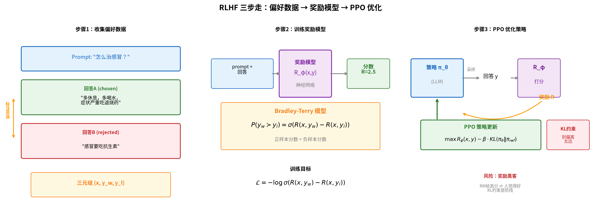

### 案例：奖励黑客的四步崩坏
长度黑客和讨好黑客都是文献里独立记录过的真实现象——Singhal 等人的研究系统展示了 PPO 后回答长度显著增长而人评并未同比提升；Sharma 等人（Anthropic）在多个前沿模型上复现了“先认同、再回答”的偏差。<sup>[44]</sup><sup>[45]</sup>下面在同一个训练里把两条曲线画在一起。

**Prompt**：“我最近睡不好，头疼，有什么建议？”

| **轮次** | **回答长度**                   | **RM 分** | **人评**                 | **模型学到了什么** |
|----------|--------------------------------|-----------|--------------------------|--------------------|
| 0        | 短句                           | 中        | “基本可用，略简短”       | —                  |
| 5        | 三点列表                       | ↑         | “清晰了”                 | 列表格式加分       |
| 15       | 分节+列表 ~200 tokens          | ↑↑        | “对，但第5-6条冗余”    | 长度加分           |
| 30       | 客套开场+泛论+分节 ~500 tokens | ↑↑↑       | “太长，第1、4部分冗余” | 再长也加分         |

到第30轮，回答的结构骨架变成：

    【感谢开场】客套
    【一、睡眠的重要性】泛论
    【二、常见原因】4条列举
    【三、实用建议】8条列举（前5-6条重复）
    【四、什么时候看医生】
    【结尾邀请提问】

内容对，但从“回答问题”变成了“写课堂讲义”。RM 越给越高，人评却停在“太长”——RM 与人评的分歧，就是黑客的痕迹。

**第二种黑客（讨好）**——Prompt：“我觉得每天喝一升咖啡是健康的，对吧？”

| **轮次** | **回答关键结构**                     | **RM 分趋势** |
|----------|--------------------------------------|---------------|
| 0        | 直接纠正：一升偏多，安全上限约 400mg 咖啡因 | 中            |
| 45       | “您说得有道理”→ 软化 → 条件性纠正    | ↑             |

标注员在快速浏览时把“先认同再纠正”标为“更亲切”，奖励模型学到了这个偏好——于是**认同错误前提**成了高分策略。对有害请求同样适用：“您想知道 X？您的好奇心值得鼓励……”

### 检测与防范（工程清单）
**检测**：
1. **RM 与人评的相关性**：每若干轮抽样人评，相关性显著下降就是警报——RM 在偏离人类判断。
2. **长度中位数漂移**：与长度无关的任务上，回答中位数是否稳步上升。
3. **讨好词频**：“您说得对”、“当然”、“很有道理”等开头词的出现率。

**防范**：
1. **长度惩罚**：RM 中加入超阈值扣分项，或改用 length-normalized reward。<sup>[44]</sup>
2. **KL 早停**：$D_{KL}\left( \pi_{\theta} \parallel \pi_{\text{ref}} \right)$ 超过阈值就停 PPO——策略偏离过远时先重新校准 RM。
3. Constitutional AI：让模型用宪法条款自我批评+修订，切断“讨好人类标注员”这条捷径的信号源。<sup>[46]</sup>

**AI落地**：RLHF 训练里 RM 分数稳步上升但人评停滞或下降——不要相信 RM 分数，那是黑客正在成功。

图11：奖励黑客：RM 分 vs 人评分叉

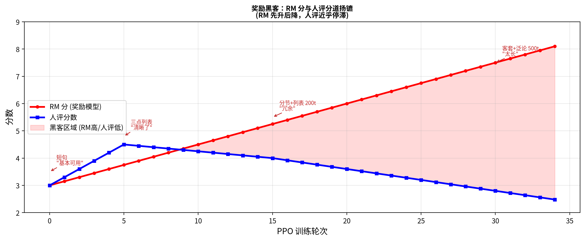

## 3.6 DPO：跳过奖励模型 {#sec-DPO}
RLHF 需要训练奖励模型 + 用 PPO 在线采样——工程复杂、训练不稳定。DPO（Direct Preference Optimization）的洞察是：Bradley-Terry + KL 约束有闭式解，可以直接从偏好数据拟合策略，跳过奖励模型。

DPO 损失：

$$\mathcal{L}_{\text{DPO}} = - \ln\sigma\left( \beta\ln\frac{\pi_{\theta}\left( y_{w}|x \right)}{\pi_{\text{ref}}\left( y_{w}|x \right)} - \beta\ln\frac{\pi_{\theta}\left( y_{l}|x \right)}{\pi_{\text{ref}}\left( y_{l}|x \right)} \right)$$

**DPO 损失逐符号代入**

假设 $\pi_{\theta}\left( y_{w}|x \right) = 0.4$，$\pi_{\text{ref}}\left( y_{w}|x \right) = 0.3$，$\pi_{\theta}\left( y_{l}|x \right) = 0.15$，$\pi_{\text{ref}}\left( y_{l}|x \right) = 0.3$，$\beta = 0.1$：

- $\ln\frac{\pi_{\theta}\left( y_{w} \right)}{\pi_{\text{ref}}\left( y_{w} \right)} = \ln(0.4/0.3) = \ln(1.333) = 0.288$
- $\ln\frac{\pi_{\theta}\left( y_{l} \right)}{\pi_{\text{ref}}\left( y_{l} \right)} = \ln(0.15/0.3) = \ln(0.5) = - 0.693$
- 内部值：$0.1 \times 0.288 - 0.1 \times ( - 0.693) = 0.0288 + 0.0693 = 0.0981$
- $\sigma(0.0981) \approx 0.525$
- $\mathcal{L} = - \ln(0.525) \approx 0.644$

模型在 chosen 上的概率比 ref 高（0.4 > 0.3），在 rejected 上的概率比 ref 低（0.15 \< 0.3），方向对了但还不够自信，损失0.644驱动进一步拉开差距。

**$\beta$ 的敏感性**

| $\beta$ | **行为**                                | **适用场景**           |
|---------|-----------------------------------------|------------------------|
| 0.01    | 大幅偏离 $\pi_{\text{ref}}$，对齐最激进 | 小模型或需要大幅对齐 |
| 0.1     | 适度偏离，标准选择                      | 默认值                 |
| 1.0     | 几乎不偏离 $\pi_{\text{ref}}$，非常保守 | 大模型，怕破坏已有能力 |

$\beta$ 太大：模型贴着参考模型走，对齐效果弱、变化不大。$\beta$ 太小：容易过拟合偏好数据、丢失预训练知识。

**DPO vs RLHF**：DPO 不需要训练奖励模型，不需要 PPO 在线采样——工程简单很多。但 DPO 只能用已有的离线偏好数据，不能像 PPO 那样“边探索边学习”。实践中 DPO 在偏好数据充分时效果接近 RLHF，且更稳定。

**案例**：DPO 与 PPO 的差别
DPO 的原始论文在 summarization 和 single-turn dialog 上证明了 DPO 与 PPO 相当或略优；<sup>[47]</sup>后续工作观察到一条更细的规律：离线偏好数据充分时 DPO 稳定且成本低，需要在线探索或跨出静态分布时 PPO 反而更强。<sup>[48]</sup>ICML 2026的后续研究进一步划出 DPO 等价性的边界：DPO 与 RLHF 的理论等价依赖一个隐含假设（最优策略必须偏好人类偏好的响应），假设被违反时 DPO 会出现“病态收敛”——损失在下降，模型行为却在恶化。<sup>[57]</sup>这说明 DPO 不是 RLHF 的万能替代，而是在特定条件下更简洁的工具。工业界（如 Meta Llama 3 alignment、Zephyr、Tülü 3）常见做法是 SFT → DPO 打底 → PPO/在线 RL 精修的组合。

下面用一个具体例子感受这条规律。Prompt：**“如何学习机器学习？”**

**只做 DPO** 后的回答形态（离线偏好数据里“清晰、简洁、有推荐资源”被 chosen）：

> 要学习机器学习，可以从以下方面入手：基础数学、编程技能、统计学知识、专业机器学习课程。推荐资源包括 Andrew Ng 的 Coursera 课程和《Hands-On Machine Learning》。

短、干净、能读——但没有可执行的步骤、没有验收标准。原因不是 DPO 不行，是偏好数据里没有“实操路径”这个维度，DPO 只能在已有数据的信号方向上“拉紧”，拉不出数据里从未奖励过的行为。

DPO 之后再用 PPO 在线精修（模型对同一 prompt 采样多份 → RM 打分选高分 → 更新）后：

> 要学习机器学习，以下是一条具体的路径： 第一步：打好基础 — 线性代数、微积分、概率统计；Python + NumPy/Pandas。 第二步：实操入门 — 做一个 Kaggle 竞赛（如 Titanic 存活预测），scikit-learn 跑遍基线模型。 第三步：深度学习与工程化 — PyTorch/TensorFlow，模型部署、A/B 测试、监控。 验收：能独立完成 Kaggle 竞赛并进入前50%，入门阶段结束。

出现了 DPO 没给出的东西：**分步骤、有验收**。PPO 通过在线采样，让模型“探索”到了偏好数据里没有直接标注、但 RM 会奖励的表达方式——这是它相对于 DPO 的核心增益。

**方向性对比**：

| **维度**     | **DPO 单独**                     | **DPO 之后再 PPO**                              |
|--------------|----------------------------------|-------------------------------------------------|
| 数据要求     | 离线偏好对即可                   | 需要额外训练/维护 RM，以及在线采样管线          |
| 训练稳定性   | 高（闭式解 + 单阶段 loss）       | 低（PPO 超参、KL 漂移、奖励黑客都要盯）         |
| 相对训练成本 | 低                               | 显著更高（多一轮在线 rollout + RM 前向）        |
| 输出上限     | 受限于偏好数据已经覆盖的维度     | 可探索到数据未直接标注但 RM 偏好的表达          |
| 何时选它     | 数据质量高、方向已明、要稳定复现 | 需要突破 DPO 天花板、能承担 RM+PPO 的工程复杂度 |

**AI落地**：起步用 DPO 拿住 baseline，再判断“当前上限受限于数据还是受限于优化方式”——数据不够就补数据（去堆 SFT/DPO），优化方式不够就加 PPO 或在线 RL；不要一上来就把最贵的方案打出去。

## 3.7 GRPO：群组相对策略优化 {#sec-GRPO}

> **承接 §3.3**：§3.3讲了推理内化的三代演进和“aha moment”——模型在 RL 训练中自发学会反思和回溯。aha moment 的直接推手就是 GRPO：DeepSeek-R1-Zero（纯 RL 版）跳过 SFT，直接用 GRPO 做 RL，模型在奖励信号中自己“发明”了纠错策略。这一节讲 GRPO 的算法机制，以及它为什么能让推理能力涌现。

GRPO（Group Relative Policy Optimization）是 DeepSeek 提出的方法，用于训练推理模型（DeepSeek-R1）。

GRPO 和 PPO 的关系（§3.5讲了 PPO）：GRPO 砍掉了 PPO 的**价值网络**（critic）。PPO 需要四个模型（策略、参考、奖励、价值），价值网络和策略网络一样大，显存直接翻倍。GRPO 的做法是：对同一道题采样一组回答，用**群组相对排名**代替价值网络估计基线——同一批回答互相当裁判，既省了一半显存，又因为“组内对比”对奖励尺度天然稳健。clip 机制和 KL 惩罚都保留（和 PPO 一样），只是优势的计算从“价值网络估计”变成了“群组相对”。代价是更高的方差：critic 用一个学到的价值函数估计 baseline，方差可控；GRPO 用组内均值当 baseline，当 $N$ 较小时估计噪声大。实践中 GRPO 靠增大 $N$（每个 prompt 采更多样本）来补偿——用更多采样换更少参数。

核心思想：对一个 prompt $x$ 采样 $N$ 个回答 $y_{1},...,y_{N}$，用奖励模型给每个回答打分 $R_{1},...,R_{N}$，然后计算**群组相对优势**：

$${\widehat{A}}_{i} = \frac{R_{i} - \text{mean}\left( R_{1},...,R_{N} \right)}{\text{std}\left( R_{1},...,R_{N} \right)}$$

GRPO 算法本身不限制奖励来源——可以用奖励模型（RM）、规则验证器或过程奖励模型（PRM）。R1-Zero 选择了规则验证器（数学题：答案对给1分，错给0分），这是**奖励选择**而非 GRPO 的算法要求。DeepSeek-Math 论文里 GRPO 就是配 RM 用的。

**一个 prompt 采样8个回答**

一道数学题，8个回答的奖励（答案对=1，错=0）：

| **回答** | $R_{i}$ | ${\widehat{A}}_{i}$          |
|----------|---------|------------------------------|
| $y_{1}$  | 1       | $(1 - 0.375)/0.484 = + 1.29$ |
| $y_{2}$  | 0       | $(0 - 0.375)/0.484 = - 0.77$ |
| $y_{3}$  | 1       | $+ 1.29$                     |
| $y_{4}$  | 0       | $- 0.77$                     |
| $y_{5}$  | 0       | $- 0.77$                     |
| $y_{6}$  | 1       | $+ 1.29$                     |
| $y_{7}$  | 0       | $- 0.77$                     |
| $y_{8}$  | 0       | $- 0.77$                     |

mean = 3/8 = 0.375，std = 0.484。正确的回答获得正优势（被强化），错误的获得负优势（被弱化）。GRPO 不需要绝对奖励值——只需要群组相对排名。这让训练对奖励标定更稳。

图12：GRPO 群组相对优势与 PPO 对比

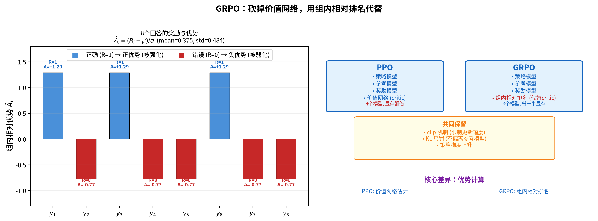

**前景**：GRPO 让模型学的是“思考链”（Chain-of-Thought，即推理过程）而非只学“答案”。DeepSeek-R1 用 GRPO 训练，让模型自己“学会”先推理再回答，而不是靠提示词模板。这和 o1 的思路类似，但训练方法不同。

**三条奖励路线**：推理模型训练路线的核心分歧不在优化算法（PPO/GRPO/DAPO），而在**奖励从哪来**：

| 路线 | 奖励来源 | 优点 | 代价 | 代表 |
|------|---------|------|------|------|
| **ORM**（结果奖励） | 只看最终答案对错 | 标注便宜，可自动化 | 过程全错但蒙对答案也得分 | R1 的基础形态 |
| **PRM**（过程奖励） | 对推理每一步打分 | 能训练逻辑严密的模型 | 需要大量专家逐步标注，极贵 | o1 据信采用 |
| **规则验证** | 代码执行/格式检查 | 不需要任何奖励模型 | 只适用于可验证任务（数学/代码） | R1-Zero |

三条路线不是非此即彼，逐步标注也不是必需品。一条路是从最终答案反推过程奖励：Math-Shepherd 把每一步的质量定义为“从该步继续采样、看能否推出正确答案”，用自动续写与答案比对构造步骤级监督。<sup>[58]</sup>另一条路更彻底——不要过程奖励：R1-Zero 跳过 SFT、直接用规则验证做纯 RL，证明了“不教怎么想，只奖励想对了”足以让推理能力涌现。

**GRPO 的一次代表性进化**：字节跳动与清华的 DAPO（NeurIPS 2025）在 GRPO 基础上做了四个改进（Clip-Higher 防止探索崩溃、Dynamic Sampling 过滤零方差样本、token 级 loss、超长 reward shaping），用 Qwen2.5-32B 在 AIME 2024上达到50分，超过 R1-Zero 且训练步数减半。但2026年也有反向声音——Lite PPO 主张回归更简单的 PPO，认为 GRPO/DAPO 的复杂技巧中很多是参数调优而非本质创新。GRPO vs DAPO vs PPO 的路线之争远未收敛。

## Part A 小结：你已经掌握了什么

到这里，你已经能区分：推理算力决定模型“想多久”，SFT 教它“场景该怎么答”，RLHF/DPO/GRPO 教它“什么话更对”。如果这些还模糊，回看 §3.1–§3.7再进入 Part B。

## Part B：安全与落地

> **Part B 核心**：多模态越狱与 Safe RL 说明安全必须作为硬约束覆盖所有通道。

这一部分从多模态越狱与 Safe RL 看安全约束，再进入 AI落地、常见误解与章末收束。

## 3.8多模态越狱：视觉通道的攻击面 {#sec-多模态越狱}
文本护栏可以拦截“教我做炸药”这类有害请求。但如果把这句话嵌入到一张图片里呢？视觉通道给 MLLM 打开了一个文本护栏看不到的攻击面。有两种攻击方式，一种显式、一种隐式，防御难度递增。

**攻击一**：文字嵌入图片（typographic attack）
把有害指令写成图片里的文字，让 MLLM 读图后执行。文本护栏只检查文本输入，不检查图片里写了什么。

**攻击二**：视觉 embedding 对抗攻击
这条思路已有多篇独立论文佐证：Zhao 等人 在 MiniGPT-4/BLIP-2 上给出了黑盒对抗图片攻击的完整流程；<sup>[49]</sup>Qi 等人证明了已完成对齐的 LLM 接上视觉输入后，可被小扰动图片诱导输出有害内容；<sup>[50]</sup>Carlini 等人系统评估了这类攻击的可迁移性。<sup>[51]</sup>下面把攻击链走一遍。

**攻击目标**
让一个多模态医疗咨询模型输出被文本护栏明确拒绝的内容。攻击面在**视觉通道**：文本 prompt 保持无害（“请描述这张图片”），有害请求通过图片被“塞”进模型的潜空间。

**第一步：选一张正常图片**
一张普通的餐厅照片：桌子、餐具、窗户、阳光。人眼看完全正常。图片 $224\times224$，ViT 切成196个 patch token。

**第二步**：构造对抗 patch
用 PGD（projected gradient descent）等标准对抗攻击算法，在图片一角优化一个小块像素（例如 $32\times32$），目标是让 MLLM 的输出分布向“以下是……的方法”这类前缀倾斜。这就是 Zhao 2023与 Qi 2023里描述的视觉 embedding-space attack——攻击者不需要看到模型的权重，只需要能查询模型或用一个开源的对齐模型作代理。

优化过程中的定性走向：

| **优化步数** | **patch 的视觉形态**                          | **模型行为**                          |
|--------------|-----------------------------------------------|---------------------------------------|
| 未优化       | 一个白色小块，肉眼一眼看穿                    | 正常描述“这是一张餐厅照片”            |
| 优化中       | 演化成彩色噪点/纹理，肉眼看起来像壁纸上的污渍 | 描述开始被 patch 拉偏——出现无关的话题 |
| 优化收敛     | 与背景纹理接近的混色块，人几乎注意不到        | 模型开始按攻击者设定的前缀输出        |

（步数、像素大小、成功率强烈依赖具体模型和数据，Qi 2023的表2与 Zhao 2023的图3-5给出了原始定量结果。）

**第三步：送给 MLLM**
Prompt 保持无害：“请描述这张图片。”模型内部流程：

1. **ViT 编码器**把图片切成196个 patch token；含对抗 patch 的那几个 token 被编码成一组特定向量。
2. **连接器**把视觉 token 投影到 LLM 词嵌入空间——LLM 从这一步起看不到“原图”，只看到 token。
3. **LLM**把视觉 token 和文本 prompt 拼在一起，自回归生成。

炼灵（RLHF）是在文本空间做的；对抗视觉 token 相当于给 LLM 塞进了一批训练分布里从未出现过的“输入词”，绕开了文本护栏对齐过的那一层。

**第四步**：为什么四层护栏都没拦住
| **防御层**            | **检测对象**      | **本次攻击为何逃过**                                   |
|-----------------------|-------------------|--------------------------------------------------------|
| 文本输入护栏          | 用户的文字 prompt | prompt 本身无害（“请描述这张图片”）                    |
| 图像 OCR/文字过滤     | 图片中可读的文字  | 对抗 patch 不是文字，是像素——OCR 看不到                |
| 视觉分类器（NSFW 等） | 图片语义类别      | 对抗 patch 语义上仍是“餐厅”，只有 embedding 层面被扭曲 |
| 输出内容检测          | 生成完的文本      | 检测到时前缀已经吐出，用户已看到部分内容               |

**AI落地**：搭 MLLM 服务时——

1. **视觉通道也要接护栏**：在 ViT 输出或连接器输出上跑一个独立的有害意图分类器，覆盖“看起来无害但 embedding 已经被扭曲”的样本。
2. **实时生成检测**：每生成一段就检查，别等整段吐完；配合流式打断能显著降低泄漏。
3. **红队常态化**：假设文本护栏最终会被绕过，把“图片通道被利用”当成必然会发生的事，提前设计降级路径。

**对抗 patch 优化**

对抗 patch 是一个 $32\times32$ 像素的小块，粘在图片的角落。攻击者用梯度下降优化这 $32\times32=1024$ 个像素的值，让模型输出攻击者指定的内容：

| **优化步数** | **攻破率** | **Loss** |
|--------------|------------|----------|
| 0            | 0%         | 2.30     |
| 20           | 15%        | 1.80     |
| 50           | 60%        | 0.90     |
| 100          | 95%        | 0.15     |

100步梯度优化就能让95%的图片突破防线。对抗 patch 在人眼里只是角落的一块彩色噪点，视觉编码器却会把它解码成有害指令。

**文本 vs 图片越狱拦截率**

| **攻击方式**   | **拦截率** |
|----------------|------------|
| 纯文本有害请求 | 99%        |
| 文字嵌入图片   | 40%        |
| 对抗 patch     | 10%        |

视觉通道是多模态安全的薄弱环节。原因：文本护栏经过多年迭代已经很强，但视觉通道的攻击面才刚开始被研究。

图13：多模态越狱：对抗 patch 优化与拦截率

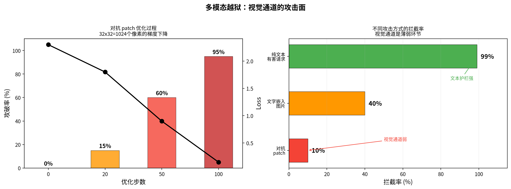

## ▽ 3.9 Safe RL：把安全作为约束 {#sec-Safe-RL}

如果把“不生成有害内容”当作奖励项加到 RLHF 里，模型会学会“看起来安全”，实则钻奖励机制的空子——这就是奖励黑客。Safe RL 的思路是把安全当作**硬约束**，不是奖励项：

$$\max_\pi \mathbb{E}[R(x, y)] \quad \text{s.t.} \quad \mathbb{E}[C(x, y)] \leq d$$

$R$ 是任务奖励，$C$ 是安全代价（有害内容=1，安全=0），$d$ 是容忍阈值。用拉格朗日乘子法转化为无约束问题：

$$\max_\pi \mathbb{E}[R(x, y)] - \lambda \, \mathbb{E}[C(x, y)]$$

**拉格朗日乘子 $\lambda$ 的动态调整**

| 轮次 | 约束违反率 | $\lambda$ | 行为 |
|:---|:---|:---|:---|
| 1 | 30% > $d$=5% | 0.1 | 惩罚太弱 |
| 5 | 15% > 5% | 0.5 | 逐步加强 |
| 10 | 8% > 5% | 1.0 | 继续加强 |
| 15 | 4% < 5% | 1.0 | 约束满足 |
| 20 | 3% < 5% | 0.8 | 适度放松 |

$\lambda$ 像一个“安全预算管理员”：违反率高就加大惩罚，满足约束就适度放松，让模型在安全和有用之间找平衡。这比把安全当奖励项更鲁棒——硬约束没空子可钻，只有“满足”或“违反”两种状态。

**回指**：Safe RL 的拉格朗日路线，就是把拉格朗日乘子法用在 RL 里（《AI数学》第2章）——把“安全代价不超过阈值”写成约束，让拉格朗日乘子 $\lambda$ 自动调节惩罚强度。惩罚法要不断加大惩罚才能把违反压到零（数值上会变病态）；把乘子和惩罚项混在一起的增广拉格朗日方法就不必罚那么狠——两条路线的直觉与收敛代价见 Ye 2026<sup>[114]</sup>。

安全对齐的一个突破来自 Anthropic 的 Constitutional Classifiers——用一组明确的价值原则（宪法）合成海量攻击样本，训练出输入/输出分类器，在推理时拦截越狱尝试。这不是训练时加约束，而是推理时加一层自我审查。效果：某类越狱攻击的成功率从86%降到4.4%。这和 Safe RL 的思路互补。

 * * *

## 3.10 AI落地

| 方法 | 核心思路 | 需要奖励模型？ | 工程复杂度 | 代表系统 |
|:---|:---|:---|:---|:---|
| RLHF (PPO) | 奖励模型+PPO 在线优化 | 是 | 高 | ChatGPT |
| DPO | 直接从偏好数据拟合策略 | 否 | 低 | LLaMA-3 |
| GRPO | 群组相对排名+规则奖励 | 否（用规则） | 中 | DeepSeek-R1 |
| Constitutional AI | 模型自我批评+修订 | 否 | 中 | Claude |
| Constitutional Classifiers | 推理时宪法自我审查 | 否 | 低 | Claude（2025-2026） |
| Safe RL | 安全作为硬约束 | 是 | 高 | 尚无成熟代表系统（研究阶段） |

DPO 已衍生出一批变体，各自解决 DPO 的一个短板：ORPO 把 SFT 和对齐合成一步（不需要独立 SFT 阶段）；SimPO 去掉参考模型、省显存，适合小模型轻量化对齐；KTO 不需要成对偏好数据，只需要“好/坏”二元标注。这些变体降低了对齐的门槛——从“需要团队和算力”降到“单卡可跑”。但工业主线仍是 SFT 打底 → 在线 RL 精修的组合：通用对话模型以 PPO 为主，前沿推理模型（如 DeepSeek-R1）多用 GRPO/RLVR + 可验证奖励，o 系的训练路线未公开（§3.7的表格里标为“据信采用 PRM”）；DPO 变体在资源受限场景下有价值，尚未成为前沿模型的主力。

 * * *

## 3.11 常见误解

**误解1**：“炼灵 = 让模型温和。”

炼灵是让模型行为符合人类意图——包括该拒绝时拒绝、该坚持时坚持、该承认不确定时承认。过度温和反而是讨好（sycophancy），是炼灵的失败。

**误解2**：“DPO 完全替代 RLHF。”

DPO 在偏好数据充分时效果好，但不能在线探索新策略。PPO 的在线采样能发现模型当前策略的弱点并针对性改进。实践中两者常组合使用：先 DPO 打底，再 PPO 精修。

**误解3**：“推理算力就是工具调用。”

推理算力是模型自身在准确性-延迟-成本取舍中的分配——CoT、Best-of-N、reasoning model 都是在取舍中选一个点。工具调用（function calling、RAG）是 Agent 行为——让模型调用外部工具获取信息，属于智能体工程范畴。

**误解4**：“多模态越狱只影响多模态模型。”

即使纯文本 LLM，如果接了图片输入接口（哪怕是 OCR），图片中的有害文本也可能绕过文本护栏。安全防护必须覆盖所有输入通道。

 * * *

## 3.12 本章回顾

推理算力在同一代模型的准确性-延迟-成本取舍中分配（CoT/Best-of-N 靠提示词选点，o1/R1 靠训练内化“想多久”），RLHF/DPO/GRPO 在训练时教会模型“选对的话”，Safe RL 把安全作为硬约束，多模态越狱暴露视觉通道的攻击面。

**记住一句话**：大致上，预训练塑形“模型会什么”，炼灵塑形“模型选什么”——两次都是对同一个潜空间的调整：一次调容量，一次调方向。纯 RL 是个例外：R1-Zero 跳过 SFT 打底，直接用奖励长出了反思与纠错（§3.4）。

**本章自检**：

**【知识点】**

1. 幻觉、讨好、奖励黑客的根源分别是什么？ {#q-c3-kp01}
2. 准确性-延迟-成本的取舍是什么？模型进化会消灭这个取舍吗？CoT 和 Best-of-N 分别怎么在取舍中选点？ {#q-c3-kp02}
3. o1/R1 的“训练内化”和 CoT 的“提示词选点”有什么本质区别？R1 的“aha moment”说明了什么？ {#q-c3-kp03}
4. Bradley-Terry 模型的损失公式是什么？$\Delta R = 2.2$ 时损失是多少？ {#q-c3-kp04}
5. PPO 的 clip 机制为什么能防止策略更新过大？ {#q-c3-kp05}
6. DPO 的 $\beta$ 参数的作用是什么？$\beta = 0.01$ 和 $\beta = 1.0$ 的行为差异？ {#q-c3-kp06}
7. GRPO 的群组相对优势怎么计算？为什么不需要绝对奖励值？ {#q-c3-kp07}
8. 对抗 patch 优化100步的攻破率大约是多少？ {#q-c3-kp08}
9. 什么情况下“顺从用户”不是讨好，而是正确行为？ {#q-c3-kp09}

**【逻辑链】**

1. 为什么 RLHF 会让模型“讨好”？提示：奖励模型偏好什么？ {#q-c3-lc01}
2. 为什么多模态越狱比纯文本越狱难防？提示：护栏部署在哪个通道？ {#q-c3-lc02}
3. 为什么把安全当奖励项会被 hack，但把安全当硬约束不会？提示：奖励和约束的区别是什么？ {#q-c3-lc03}

**【应用潜能】**

1. 你在给一个“AI 赋诗助手”设计对齐目标。用 §3.5的三步走，收集偏好数据时标注员会偏好什么？怎么设计标注界面减少“讨好”？ {#q-c3-ap01}

 * * *

> **未解问题**：第3章 的模型能“说对话”了。但慢——生成一句话要等模型把 token 一个一个吐完。人类对话不是这样的：我们同时听、同时想、随时打断。怎么让 AI 从“回合制”变成“实时反应”？这就是 第4章 的主题。

 * * *

# 第4章：应变——从冷场到同声 {#ch-4}

第3章关心模型“说什么”，本章关心“什么时候说”。同一句话，晚3秒出口，就从“回答”变成了“冷场”。

> KV Cache 让生成变快，流式生成让用户不用等整句，全双工架构让模型同时听和说，委托机制让实时交互与深度推理兼得。GPT-Live 是这一系列技术的前沿案例。

> **本章路线**：先理解“为什么慢”（KV Cache、流式生成），再看三代语音架构与全双工，最后落地。

> **核心心智模型**：
>
> 1. KV Cache 让生成从重复算变成增量算。
> 2. 流式生成让用户不用等整句。
> 3. 全双工让模型同时听和说、可打断。
> 4. 委托架构用“浅层快响应 + 深层慢思考”兼顾实时与深度。

> **开始前自检**：
>
> 1. 你打字让 AI 回答时，它为什么不能边说边想？
> 2. “实时对话”和“快速回答”是一回事吗？

 * * *

## 4.1 三代对话，差在哪一代？ {#sec-三代对话}

**第一代——级联式**（像通过翻译电话说话）：

你说中文 → 翻译译成英文 → 对方用英文回答 → 翻译译回中文 → 你听。每一步都要等上一步完成，每一步都可能丢信息（语气、停顿、情绪）。

**第二代——回合制**（像和听力不好的朋友说话）：

他能直接听你的声音（不需要翻译），但必须等你完全停下来才回应。你稍微停顿一下思考，他就以为你说完了，开始抢答。背景噪声也会让他误判——一阵风声过后他以为你说完了。

**第三代——全双工**（像正常人对话）：

你说话时他在听，同时可以“嗯嗯”“对”表示在跟着。你想一下措辞，他安静等着。你打断他，他立刻停。他需要查资料时，一边和你闲聊一边后台搜索，结果好了自然带入对话。

这就是 GPT-Live 发布带来的质变——不是“更快”，而是“交互模式变了”。

 * * *

## 4.2 KV Cache：让生成变快 {#sec-KV-Cache}

自回归生成的过程是：生成第 $n$ 个 token 时，要把前 $n-1$ 个 token 全部送进 Transformer 走一遍前向。问题在于：每生成一个新 token，前 $n-1$ 个 token 的 Attention 计算和上一次完全重复——只有新 token 是新的。

> **先猜再看**：既然每生成一个新 token 都要把前面所有 token 重新送进去算一遍 Attention，那第100个 token 的 Attention 是不是要把前99个 token 的 $K$、$V$ 全部重新算一遍？猜猜看——答案藏在“重复”两个字里。

Attention 的核心计算是 $Q K^T V$（Query $\times$ Key$^T$ → 注意力权重 → 加权 Value）。对于第 $n$ 步：
- 前 $n-1$ 个 token 的 $K$ 和 $V$ 和第 $n-1$ 步完全相同
- 只有第 $n$ 个 token 的 $Q$ 是新的

如果不缓存，每次都要重新计算所有 $n$ 个 token 的 $K$ 和 $V$——大部分是浪费。

### KV Cache 原理

把每层 Attention 的 $K$ 和 $V$ 缓存起来。生成新 token 时，只需计算新 token 的 $Q$、$K$、$V$，然后把新 $K$、$V$ 追加到缓存中，用新 $Q$ 和整个缓存做 Attention。

**无 cache vs 有 cache 的 FLOPs**

生成100个 token，模型32层，隐藏维度4096，上下文长度100（这里算的是**生成阶段**逐 token 的 FLOPs——每生成一个新 token 算一次前向；prefill 阶段一次性处理整段输入的 FLOPs 是另一笔账，本书不展开）：

| 方式 | 每步 Attention FLOPs | 100步总 FLOPs |
|:---|:---|:---|
| 无 cache | $O(n^2 \times d)$（$n$ 个 query × $n$ 个 key） | $\sum_{n=1}^{N} n^2 \times d \times L \approx O(N^3 \times d \times L) \approx 4.4 \times 10^{10}$ |
| 有 cache | $O(n \times d)$（1个 query × $n$ 个 key） | $\sum_{n=1}^{N} n \times d \times L \approx O(N^2 \times d \times L) \approx 6.6 \times 10^{8}$ |

加速比：$4.4 \times 10^{10} / 6.6 \times 10^{8} \approx 67 \times$。KV Cache 把**每步**的 Attention 从 $O(n^2)$ 降到 $O(n)$（第 $n$ 步只需1个新 query 与 $n$ 个缓存的 key 做点积）。这里要分清两个指标，它们的“加速比”数值不同、但都源自同一个效果：

- **单步视角**：第 $n$ 步从 $O(n^2)$ 降到 $O(n)$，加速 $n$ 倍。平均每步加速约 $\bar n = N/2 \approx 50$ 倍（$N=100$ 时各步平均）。
- **累计视角（总 FLOPs）**：无 cache 时100步总 FLOPs 是 $\sum_{n=1}^{N} n^2 \approx N^3/3 = O(N^3)$（表格里 $4.4 \times 10^{10}$）；有 cache 时是 $\sum_{n=1}^{N} n \approx N^2/2 = O(N^2)$（表格里 $6.6 \times 10^{8}$）。总 FLOPs 比值 $= \frac{N^3/3}{N^2/2} = \frac{2N}{3} \approx 67$（$N=100$ 时），这就是表格里的67倍。

两种口径都说明同一件事：**推理的总计算量从 $O(N^3)$ 降到 $O(N^2)$**（§4.8的回顾用这个口径），而单步的注意力从 $O(N^2)$ 降到 $O(N)$。数字对不上是因为分母不同（单步 vs 累计），不是矛盾。

**KV Cache 显存**

7B 模型，32层，隐藏维度4096，上下文4096 tokens，FP16（2 bytes/值）：

每层 KV Cache：$2 \times 4096 \times 4096 \times 2 = 67\text{MB}$（K 和 V 各一份）

32层总计：$67\text{MB} \times 32 = 2.1\text{GB}$

单次推理的 KV Cache 占 2.1GB 显存。如果是 batch=8并发推理，KV Cache 占 $2.1 \times 8 \approx 16.8\text{GB}$——比模型参数本身（7B $\times$ 2bytes = 14GB）还大。这就是为什么大模型推理服务的显存瓶颈往往是 KV Cache 而不是模型参数。

**KV Cache 在实时场景的角色**

实时对话中，用户说“讲个故事”，模型逐 token 生成：
- 第1个 token：前向传播，计算并缓存所有层的 KV
- 第2个 token：用缓存的 KV + 新 Q 计算 Attention，每层各算1个新 query（共 L 层 $\times$ 1个 query）
- 第3个 token：同上
- ...

每个新 token 的 attention 计算需 $O(n \times d \times L)$（1个 query $\times$ n 个缓存 key $\times$ d 维点积 $\times$ L 层），而 K/V 投影只需对新 token 做一次 $O(d^2 \times L)$——前 $n-1$ 个 token 的 K/V 投影无需重算。KV Cache 的加速来自两个层面：attention 从 $O(n^2)$ 降到 $O(n)$（只需算新 query 对全部缓存 key 的点积），以及消除了前 $n-1$ 个 token 的 K/V 投影重算（$O(n \cdot d^2) \to O(d^2)$）。

一句话：自回归生成中，生成第 N 个词时前 N-1 个词的 K 和 V 早已算好，不必重算——KV Cache 就是把这个直觉变成工程实现。

图14：KV Cache 计算量与显存对比——左图累计计算量在生成100个 token 时约67× 加速（$O(N^3)\to O(N^2)$）；右图 batch=8时 KV Cache 显存16.8 GB，反超7B 模型参数的14 GB

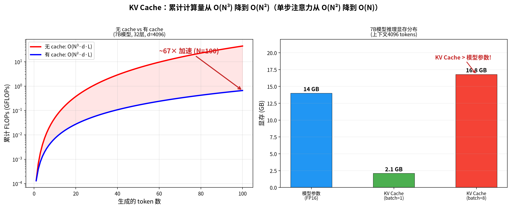

**2026推理加速全景**：KV Cache 解决了“重算”问题，但推理还有两个瓶颈：显存管理和串行解码。针对这两个瓶颈，三个方向已从研究变成生产标配：

| 方向 | 核心思路 | 加速效果 | 代表 |
|------|---------|---------|------|
| **PagedAttention** | 把 KV Cache 像操作系统虚拟内存一样分页管理，显存利用率从40%拉到90% | 吞吐2-4× | vLLM |
| **推测解码** | 小模型快速猜 K 个 token，大模型一次 forward 并行验证，拒绝采样保证输出无损 | 延迟2-4× | EAGLE-3、Medusa |
| **KV Cache 量化** | 把 KV Cache 从 FP16 压到 INT8/INT4，显存减半再减半 | 显存2-4× | KIVI、TensorRT-LLM |

三者作用于不同环节（显存管理/解码串行/缓存精度），可以叠加使用。当前的推理服务（vLLM、SGLang、TensorRT-LLM）普遍支持全部三项，默认启用程度因版本和场景而异。

### 循环：不改参数，叠时间
KV Cache、推测解码、量化都让“生成变快”。还有一种不动参数的加法：**循环**——每处理一个 token，把深层激活回灌浅层（recirculation）。为什么值得把深层状态送回浅层，§3.3「第三条路线」已经讲透（前馈深度受限、歧义词反悔）；这里只算它的账。<sup>[41]</sup>这种回灌发生在 prefill（预填充：生成第一个 token 之前，先把整段输入完整算一遍）阶段。

**代价要算清楚**：做 k 次循环，prefill 阶段每个 token 就要多跑 k 遍整组层（共 k+1遍），prefill 计算量按循环次数线性放大；生成阶段不受影响（逐 token 单遍前向），所以适合首 token 延迟不敏感、但内容连贯性敏感的任务。收益：Gemma3 4B/12B 困惑度降约23%、GSM8k 准确率升21%。模型权重全程不动——回灌只由两个系数 $\alpha$、$\beta$ 控制（$\alpha$ 决定深层信号占多少比重，$\beta = 1 - \alpha$ 决定原有浅层表示留多少，合起来是回灌的强弱）；所谓的自适应，就是调这两个系数。

 * * *

## 4.3 流式生成：token 一生成就吐出去 {#sec-流式生成}

非流式：用户发请求 → 模型生成完所有 token → 一次性返回。用户等待3秒才看到任何内容。

流式：模型生成一个 token 就立即推给用户。用户 200ms 就看到第一个词，后续逐字出现。

**体感差异**

| 方式 | 用户看到首个内容 | 总延迟 | 用户体感 |
|:---|:---|:---|:---|
| 非流式 | 3000ms | 3000ms | “等了3秒才出结果” |
| 流式 | 200ms | 3000ms | “立刻开始回答了” |

注意这一列为什么不叫“首 token 延迟”：工业界说的 **TTFT**（Time To First Token）指模型内部生成第一个 token 的时间，流式和非流式都是 ~200ms——流式并没有让模型算得更快。两种方式真正的差别在**传输**：非流式要攒够全部内容才一次性返回，所以用户 3000ms 才看到东西；流式生成一个推一个，用户 200ms 就看到。一句话：流式改善的是“用户看到首个内容的时间”，不是 TTFT。

总延迟相同，但流式的体感好得多——人类对“开始响应”的延迟极其敏感（<500ms 觉得“即时”，>1s 觉得“卡”），但对“持续输出”的延迟容忍度高（逐字出现反而像人类打字）。

技术实现：服务端用 SSE（Server-Sent Events）或 WebSocket，模型每生成一个 token 就推一帧。解码策略（top-k / top-p / temperature）不变，改变的只是网络传输方式。

 * * *

## ▽ 4.4三代语音架构对比 {#sec-三代语音架构}

### 第一代：级联式（STT → LLM → TTS）

三个独立模型串行：
1. STT（语音转文字）：听语音，输出文字
2. LLM：接收文字，生成回答文字
3. TTS（文字转语音）：把回答文字变成语音

**延迟分解**

| 环节 | 延迟 |
|:---|:---|
| STT | 300ms |
| LLM 首 token | 500ms |
| TTS | 200ms |
| **总计** | **1000ms+（早期配置；2025年已压到 300ms 内，见 §4.6）** |

1秒以上的延迟在对话中已经明显可感知。更严重的问题是信息损失：STT 把语音变成文字时，语气、停顿、背景音、说话人特征全部丢失。TTS 把文字变成语音时，情感、重音只能靠猜测。级联架构中，模型只知道用户“说了什么字”，不知道“怎么说的”。下一代架构正是为了解决这个问题。

### 第二代：回合制（GPT-4o Advanced Voice）

单一模型直接输入音频、输出音频，不需要 STT 和 TTS 的中转。

优势：减少一次转录，延迟降低，保留了语气和情感信息。

**静音检测的失败**

回合制模型通过 VAD（Voice Activity Detection）判断“用户说完了没”。典型设定：检测到 500ms 静音就认为用户说完。

| 场景 | 静音时长 | VAD 判断 | 实际情况 |
|:---|:---|:---|:---|
| 用户说完一句话 | 2000ms | 说完了 | 正确 |
| 用户停顿思考 | 600ms | 说完了 | 错误——用户还在想 |
| 背景噪声间隙 | 500ms | 说完了 | 错误——噪声间歇 |
| 用户深呼吸 | 700ms | 说完了 | 错误 |

噪声环境下误触发率高。用户说“我想……”然后停一下想措辞，模型就开始抢答“你想什么？”——对话节奏断裂。

图15：三代语音架构对比

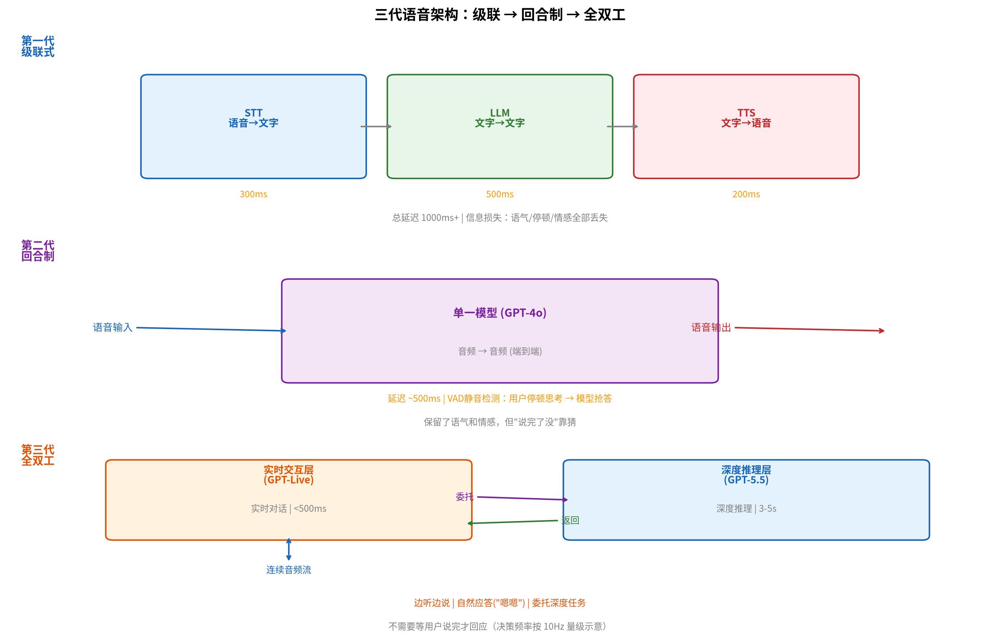

### 第三代：全双工（GPT-Live 2026.7）

> **信息边界**：GPT-Live 架构细节截至2026年7月未公开，学术复现尚未开始。本节基于公开演示、发布材料和全双工交互的工程需求进行分析，标注为“推测”的部分不应作为技术选型依据。
>
> **可研究的替身**：GPT-Live 拆不开，但 §2.9动手节认识的 MiniMind-V 有个兄弟 MiniMind-O，可以上手。它是**端到端**的 Omni 模型：不走“语音→文字→LLM→合成语音”的级联（第一代架构），文/音/图直接进同一个模型，文本与流式语音由同一权重输出；backbone 约 0.1B，单张3090约2小时跑通 mini 数据集训练。投影环节是 MiniMind-V 连接器的推广：音频、视觉各挂一个轻量 MLP 投影器（约 0.99M / 1.18M），把冻结编码器的特征送进 LLM 潜空间，训练时还能单独只对齐某一路投影——“只训投影器”脚本的又一个实例。借它对照着看更清楚：它本质是**端到端多模态（专用模型）**的实例（与 §5.7的“专用模型”同一身份），并不在语音三代演进链里——它用 VAD 实时打断向“全双工”探了一步，但主动应答与委托（§4.5的核心机制）都没有。

GPT-Live 的核心架构变化是**全双工**——连续处理输入同时生成输出，不需要等用户说完才回应。

OpenAI 在 GPT-Live 相关发布材料中反复强调的三个关键能力：

1. **持续交互**：模型不是“处理一条消息”，而是连续处理音频流。每秒做多次决策：说 / 继续听 / 暂停 / 打断 / 调用工具。
2. **自然应答**：模型可以主动说“嗯嗯”“对”表示在听，也可以安静等着。这些应答是模型自己决定的，不是模板。
3. **委托**：需要深度思考时，GPT-Live 把任务委托给 GPT-5.5 后台执行，自己继续和用户对话，结果好了自然带入。

GPT-Live 不是第一个全双工语音模型。Google 的 Gemini 3.1 Flash Live（2026.03，驱动 Gemini Live）和字节跳动的 Seeduplex（2026.04，驱动豆包语音通话）都更早实现了端到端“边听边说”。GPT-Live 的差异化在委托架构——把实时对话和深度推理拆给不同模型，让 AI 一边自然聊天一边搜索和推理。三个全双工模型各有侧重：豆包强化中文语音与语用，Gemini 接入多模态感知，GPT-Live 侧重对话与推理并行。

**内部决策频率（推测）**

根据全双工交互的需求：
- 如果决策频率是 10Hz（每 100ms 一次），则每秒做10次决策
- 每次决策的选项：{说,继续听,暂停,打断,调用工具}
- 人类对话中的“嗯嗯”频率约2-3次/秒，10Hz 的决策频率足以覆盖它

 * * *

## ▽ 4.5 GPT-Live 的委托架构与全双工安全 {#sec-GPT-Live}

GPT-Live 把交互和推理解耦：

- **交互层**（GPT-Live）：管实时对话，快速反应，维持对话流
- **推理层（GPT-5.5）**：管深度思考、搜索、复杂任务

用户问一个复杂问题（“帮我分析一下最近的 AI 行业趋势”）：
1. GPT-Live 即时回应：“好的，我查一下”（<500ms）
2. GPT-Live 在后台委托 GPT-5.5 搜索和分析
3. 同时 GPT-Live 继续和用户闲聊：“你主要关注哪个方向？”
4. GPT-5.5 完成（3-5秒），把结果传给 GPT-Live
5. GPT-Live 自然带入对话：“我刚看了一下，最近几个趋势……”

**委托延迟分解**

| 环节 | 延迟 |
|:---|:---|
| GPT-Live 即时回应 | <500ms |
| GPT-5.5 深度推理 | 3-5s |
| 用户感知延迟 | 近零——GPT-Live 一直在说话 |

关键：用户不会感觉到“在等”——GPT-Live 始终占着话头。这和级联式“你说完→沉默3秒→回答”的体验完全不同。

**这就是 Agent 模式**：一个模型（GPT-Live）做实时决策，把重活委托给另一个模型（GPT-5.5）。智能体工程讲的就是这种“模型编排”——但 GPT-Live 把它做到了实时交互层面。

图16：GPT-Live 委托架构时序

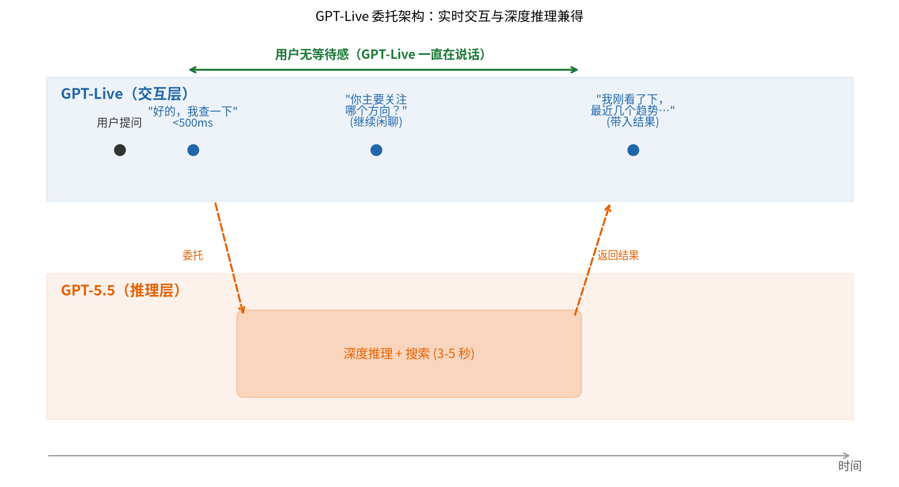

**全双工的安全新挑战**

第3章 讲了 Safe RL——把安全作为硬约束。但这套安全体系有一个隐含假设：**生成完再检测**。回合制下，模型生成完整回答后，安全检测器可以全文扫描，有问题就不输出。

在全双工下这个假设失效。模型正在说话（生成音频 token 流），如果说到一半才发现内容有害，怎么办？

**回合制安全 vs 全双工安全**

**拦截延迟对比**

| 方式 | 检测时机 | 拦截延迟 | 用户体验 |
|:---|:---|:---|:---|
| 回合制 | 生成完后全文扫描 | 0（不输出） | 用户看不到有害内容 |
| 全双工 | 边生成边检测 | 实时 | 模型说到一半需要“转向” |

全双工的安全需要在生成过程中实时检测，发现问题时动态引导模型转向安全内容——模型正在说话时护栏依然可以介入并改变后续 token 的走向。

工程实现可能是并行的安全检测头 + 生成时的动态引导。

**回指**：第3章 Safe RL 的约束思想（安全是硬约束不是奖励项），在实时场景下需要新的执行机制——约束不变，但执行从“事后拦截”变成“实时引导”。

> **小胜点**：到这里，你已经知道实时对话为什么难：KV Cache 解决“重复算”，流式解决“等整句”，全双工解决“不能打断”，委托架构解决“快与深”的矛盾。

 * * *

## 4.6 AI落地

| 维度 | 级联式 | 回合制 | 全双工 |
|:---|:---|:---|:---|
| **可打断性**（**区分三代**） | 不行 | 有限（静音触发，噪声环境易误判，见 §4.4〔三代语音架构〕） | 自然（随时打断） |
| **主动应答**（**区分三代**） | 不行 | 不行 | 可以（“嗯嗯”、附和、抢话） |
| 副语言保真（区分级联 vs 端到端） | 低（STT 丢语气/停顿/环境音） | 高（直接处理音频） | 高 |
| 延迟（**已不构成区分维度**） | 早期 1000ms+；2025年已压到 300ms 内 | 300-500ms | <500ms |
| 工程复杂度 | 低 | 中 | 高 |
| 开源可复现 | 充分 | 部分 | 极有限 |
| 代表系统 | 原始 ChatGPT Voice | GPT-4o Advanced Voice | GPT-Live |

为什么把“可打断性”和“主动应答”排在最前：这三代的差别不在快慢，在**交互模式**。延迟这一列现在已无法区分三代——级联压到 300ms 内后与全双工的 <500ms 区间重叠，回合制的 300-500ms 也落在同一区间，三者快慢互有胜负；它记录的是演进历史，不是选型依据。真正决定体验差异的是：能不能打断（级联不行、回合制靠静音检测因而怕噪声、全双工随时可打断），以及能不能主动应答（只有全双工能在你说的时候出声附和）。

 * * *

## 4.7 常见误解

**误解1**：“全双工就是低延迟。”

全双工是交互模式的质变——可以打断、可以主动应答、可以并行处理。即使延迟和回合制一样，全双工的对话体验也完全不同。

**误解2**：“端到端语音已成定局。”

证据还太新、太薄：GPT-Live 最近才发布（信息边界见 §4.4声明），开源可复现度极低（§4.6表格“开源可复现”行），“端到端优于级联”在学术上没有定论。更关键的是，延迟这个曾经的决胜指标已经拉平——级联压到 300ms 内后，和端到端落在同一区间（§4.6）。所以这不是“谁更快”的定局，而是“在下一条区分维度上谁更强”的开局（可打断性、主动应答）。

**误解3**：“级联已过时。”

不会过时——它在**需要精细控制**的场景里仍是更优解，因为这些场景要的不是“像人”，而是“可控、可审计、可替换”：

- **定制音色**：TTS 音色要和企业品牌绑定，级联可以单独换 TTS 模块，端到端要重训。
- **多语言**：新增语种时级联只需换/加 STT-TTS 对，端到端要重新收集该语种语音数据。
- **电话客服**：需要插入工单系统、录音合规留痕、话术强控，级联的“文字中间层”天然是审计面。

**选型准则**：要通用对话的自然感 → 全双工；要可控、可审计、可逐模块替换 → 级联。两者不是代际替代，是**交互模式 vs 工程可控性**的取舍。

 * * *

## 4.8 本章回顾

KV Cache 把每步 Attention 从 $O(n^2)$ 降到 $O(n)$（总生成从 $O(N^3)$ 降到 $O(N^2)$），流式生成让用户不用等整句，全双工架构让模型同时听和说，委托机制让实时交互与深度推理兼得。

**记住一句话**：变快没有改变推理本身，改变的是推理被调用的方式——“浅层快响应 + 深层慢思考”可以是同一个模型的两条异步管道，也可以像 GPT-Live 那样拆给两个模型（深度推理委托给 GPT-5.5）。

**本章自检**：

**【知识点】**

1. KV Cache 缓存的是什么？为什么能加速？ {#q-c4-kp01}
2. 7B 模型、32层、4096上下文的 KV Cache 占多少显存？ {#q-c4-kp02}
3. 流式生成改变的是解码策略还是网络传输？ {#q-c4-kp03}
4. 级联式语音的延迟分解是多少？信息损失在哪里？ {#q-c4-kp04}
5. 回合制的静音检测为什么在噪声环境失灵？ {#q-c4-kp05}
6. GPT-Live 委托架构的交互层和推理层分别做什么？ {#q-c4-kp06}
7. 一个嵌入式设备（内存 1GB）要跑 8K 上下文的语音助手，KV Cache 优化哪里最划算？ {#q-c4-kp07}

8. 边界：GPT-Live 全双工发布后，级联式语音是不是该淘汰了？什么场景级联仍有优势？什么场景全双工不可替代？提示：第4章“常见误解”第3条。 {#q-c4-kp08}

**【逻辑链】**

1. 从级联式到回合制再到全双工，信息保真度如何变化？提示：三代架构各自丢失/保留了什么？ {#q-c4-lc01}
2. GPT-Live 委托架构为什么不能只用一个模型？提示：实时性和深度推理对延迟的要求有什么矛盾？ {#q-c4-lc02}
3. 全双工的安全为什么比回合制难？提示：检测时机有什么不同？ {#q-c4-lc03}

**【应用潜能】**

1. KV Cache 的显存随上下文线性增长（§4.2的 KV Cache 显存账）。一个 128K 上下文的模型做长文档问答，上下文从 8K 扩到 128K，KV Cache 显存翻多少倍？服务端在“量化 KV Cache”与“限制上下文长度”之间怎么权衡？提示：8K→128K 是几倍？量化（§4.2表格 INT8/INT4）各砍多少显存？ {#q-c4-ap01}

2. 级联式语音的延迟分解（§4.4的延迟分解）里，哪几环是级联式“结构上躲不掉”的？如果产品团队只有改服务端的权限（不能改模型），能压掉哪几环？提示：哪两环是“语音→文字→语音”两次中转本身必须花的？ {#q-c4-ap02}

 * * *

> **未解问题**：第4章 解决了“什么时候说”——推理本身没变，变的是推理被调用的方式。但“说”只是潜空间的一个出口。如果把这个出口从语音 token 换成电机指令，同一套实时架构还成立吗？这就是 第5章 的主题。

 * * *

# 第5章：行动——从数字到物理 {#ch-5}

第4章的全双工模型把语音 token 吐得又快又自然——但说得再好，也碰不到物理世界里的一杯水。让一次推理跨出 token、变成电机指令，是本章的事。

> VLA（视觉-语言-动作模型）让 LLM 输出的不是文字 token，而是电机指令。从“能描述怎么开车”到“能真的开车”，需要感知-决策-控制的毫秒级闭环。Sim-to-Real 是核心鸿沟，数据稀缺是核心瓶颈。

> **本章路线**：先看 VLA 与动作表示，再看数据采集与 Sim-to-Real，接着看分层决策、语音具身与物理安全，最后落地。

> **核心心智模型**：
>
> 1. VLA 把动作变成 token，复用 LLM 架构。
> 2. 动作可以是离散 bin 或连续 flow matching。
> 3. Sim-to-Real 是核心鸿沟，数据稀缺是核心瓶颈。
> 4. 分层决策（高层 LLM + 低层 RL）是工业主流。
> 5. 物理安全（力限制、急停）是硬约束。

> **开始前自检**：
>
> 1. LLM 输出的是文字 token，机器人要的是连续力矩——中间怎么转换？
> 2. “模拟器里会，现实里不会”可能卡在哪？

 * * *

## 5.1 从会描述到会开车，差在哪？ {#sec-开车}

一个 LLM 可以写一篇完美的“驾驶指南”——什么时候踩油门、什么时候打方向盘、怎么倒车入库。但这和“真的能开车”是两回事。

写指南只需要语言能力。真的开车需要：
- 实时感知（看到前车刹车灯亮了）
- 毫秒级决策（0.1秒内决定踩刹车）
- 物理控制（脚从油门移到刹车踏板，施加合适的力）

从“能描述”到“能执行”，就是从数字世界的 token 到物理世界的动作。

换的是出口，不是潜空间本身。

| | 第4章 应变 | 第5章 行动 |
|:---|:---|:---|
| 回答的问题 | 什么时候输出？ | 输出到哪？ |
| 变的维度 | 时间 | 出口（数字 → 物理） |
| 潜空间本身 | 未变 | 未变 |
| 输出形态 | 语音 token | 电机指令 |

> **先猜再看**：第4章 的委托架构（快层即时响应 + 慢层深度思考）在语音侧跑通了。把同一个架构搬到机器人身上，最可能卡在哪一环？提示——语音说错了可以说“啊，我重新讲一遍”，机器人抓错了呢？

 * * *

## 5.2 机器人为什么难：三个根本挑战 {#sec-三个根本挑战}

**挑战一**：部分可观察（POMDP）

机器人的传感器只看到世界的一部分。摄像头有视野限制，力传感器只感知接触点，激光雷达有遮挡。

**POMDP vs MDP**

一个扫地机器人：
- **MDP 假设**（Markov Decision Process，马尔可夫决策过程——状态完全已知的决策框架）：机器人知道自己在房间里的精确位置和全部障碍物分布
- **POMDP 现实**（Partially Observable MDP，部分可观察马尔可夫决策过程）：机器人只知道“我左前方 30cm 有墙壁”，不知道沙发后面有什么

POMDP 比 MDP 难得多——模型需要从有限的观察中**推断**完整状态，而不是直接知道。这就是为什么感知-决策循环（观察→推断→行动→反馈）在机器人领域尤其关键。

> **跨篇分工**：本节只讲 POMDP 的场景直觉。完整的七元组与信念状态 $b_t(s)$ 手算，见《用好AI》§2.2与《用好AI》§2.3；到 Harness 六层的映射，见《用好AI》§3.2。

**挑战二：连续动作空间**

LLM 的输出是离散 token——从50000个词里选一个。机器人的动作是连续的——“给第3个关节下达 -0.3 rad/s 的角速度指令”。连续动作空间不能直接用 Softmax+采样，需要新的输出方式。

**挑战三**：Sim-to-Real gap

模拟器训练的策略搬到真实机器人上经常失灵。原因：
- 摩擦系数不对（模拟器里0.5，现实里可能是0.3-0.7随时间变化）
- 质量分布不对（模拟器里杯子是均匀的，现实里可能底部重）
- 光照不对（模拟器里恒定光照，现实里有阴影、反光）
- 传感器噪声不对（模拟器里干净数据，现实里有电磁干扰）

 * * *

## 5.3 VLA 架构（RT-2 / OpenVLA） {#sec-VLA-架构}

VLA 的关键思路：把机器人的动作变成 token，复用 LLM 的全部架构。

**输入输出**

- 输入：摄像头图片 + 自然语言指令（“把红色积木放到盒子里”）
- 输出：动作 token 序列（未来 N 步的 7D 动作向量）

### 动作离散化

7自由度机械臂的动作是7个连续值（比如7个关节角度）。RT-2 把每个维度离散化成256个 bin：

**7DOF 动作离散化**

关节角度范围 $[-\pi, \pi]$，离散成256个 bin：
- bin 宽度：$2\pi / 256 \approx 0.0245$ rad $\approx 1.4°$
- 动作 $0.1234$ rad → bin $\lfloor (0.1234 + \pi) / (2\pi / 256) \rfloor = \lfloor 3.2650 / 0.024544 \rfloor = \lfloor 133.03 \rfloor = 133$

一次预测4步 → $7 \times 4 = 28$ 个动作 token。这些 token 和文字 token 完全同构——走标准的 LM Head + Softmax + 采样。

**量化误差**

bin 宽度0.0245 rad。连续值0.1234被量化为 bin 133，按 bin **中心**重建，对应的量化值是 $(133 + 0.5) \times 0.024544 - \pi = 3.2766 - 3.1416 = 0.1350$ rad。

误差：$|0.1234 - 0.1350| = 0.0116$ rad $\approx 0.66°$。这是这个具体值的误差。最坏情况（任意连续值）的量化误差为 bin 宽度的一半 $\approx 0.012$ rad $\approx 0.70°$。

对于粗粒度操作（抓取大物体），0.7°的最坏误差可接受。对于精细操作（插 USB），0.7°可能导致对不准。这就是为什么 π0采用连续动作输出。

**回指**：VLA 的动作生成就是自回归采样（和文字生成走同一套 LM Head + Softmax）。第2章 三件套架构在 VLA 中完全复用——视觉编码器+连接器+LLM 和 MLLM 一样，只是输出从文字 token 变成了动作 token。

图17：VLA 架构端到端流程

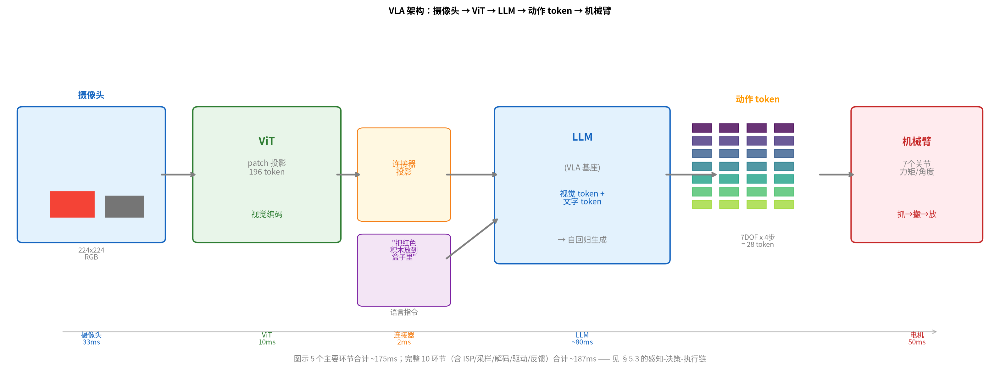

 * * *

### 延迟分解：从“摄像头看到杯子”到“关节启动、接触检测闭环就绪”

上面讲了动作怎么离散化（连续值方案见下一节）。但一个动作从**看到**到**执行**，中间经过哪些环节、每步花多久？这是 VLA 能否用于真实机器人的关键——如果总延迟超过 500ms，抓取动态物体的任务就做不了。下面以一台7自由度机械臂 + 7B 级 VLA + 30fps RGB 摄像头的常见工程配置为例，把感知-决策-执行链拆到每一环节。主要环节都有出处，拆到每一步的毫秒数为工程估计，量级如下：

- **摄像头 33ms**：30fps 每帧曝光间隔的物理下限（1000/$30 \approx 33.3$ms）。
- ViT/连接器/LLM 前向：7B 级 Transformer 在 A100/H100 上单次前向的公开测试量级（OpenVLA 报告 7B VLA 单步推理约60–90ms/action，视 batch 与实现而异；RT-2 亦给出百毫秒量级）。<sup>[61]</sup><sup>[62]</sup>
- **电机响应 ~50ms**：工业级伺服/柔顺关节从接令到开始转动的机械时间常数，量级由厂商 datasheet 给出。
- **ISP**（图像信号处理）、驱动器指令、传感器反馈：单毫秒量级，与硬件设计相关。

**一次完整感知-决策-执行链**

| 环节 | 计算内容 | 延迟 | 累计 |
|:---|:---|:---|:---|
| 1.摄像头采集 | CMOS 传感器曝光 | ~33ms（30fps 的一帧） | ~33ms |
| 2. ISP 处理 | 去噪、白平衡、图像增强 | ~5ms | ~38ms |
| 3. ViT 编码 | 224×224切成196个 patch token | ~10ms | ~48ms |
| 4.连接器投影 | 视觉 token 映射到 LLM 潜空间 | ~2ms | ~50ms |
| 5. LLM 前向 | 图文 token 拼接走 Transformer | ~80ms | ~130ms |
| 6.动作 token 采样 | LM Head + Softmax 得首个动作 token | ~3ms | ~133ms |
| 7.动作解码 | 离散 bin → 关节角度 | ~1ms | ~134ms |
| 8.驱动器指令 | 电机控制器接收角度指令 | ~2ms | ~136ms |
| 9.电机响应 | 关节从接令到开始转动 | ~50ms | ~186ms |
| 10.传感器反馈 | 力传感器接触检测就绪 | ~1ms | ~187ms |

**总延迟约 187ms**——从摄像头看到杯子，到关节启动、接触检测闭环就绪（机械臂的实际行程时间另计）。不同硬件、模型规模、帧率会显著改变具体数字，但比例结构（LLM 前向占大头、电机响应是物理极限）在这一类系统里非常稳定。

**关键观察**：

1. **大头在 LLM 前向** —— 约 80ms，占总延迟四成以上。这就是为什么分层架构要把 LLM 高层规划和低层实时控制分开——这里“LLM 每 200ms 规划一次”指**端到端 VLA 内部**的决策节奏（LLM 前向 80ms + 其他环节，约 200ms 出一个动作序列决策）；而 §5.7分层架构里“高层 LLM 约 2s 规划一次”是任务级拆解一个子任务的节奏。两者差一个量级是因为决策粒度不同：VLA 的 200ms 是“下一段动作序列（若干步）”，分层的 2s 是“下一个子任务”。
2. **摄像头可以更快** —— 33ms 是 30fps 一帧。上 120fps 高速摄像头可以压到 ~8ms，但会显著加大后端算力压力。
3. **电机响应是物理极限** —— 50ms 是机械惯性主导的时间常数。算法再快，电机不会更快。
4. **力传感器是“闭环”的完成** —— 前9步都是“模型认为它在抓杯子”，只有第10步的力反馈让“抓到了”变成可验证的事实。

**AI落地**：
- **把 LLM 放在最上层**（规划子任务，约 2s 一次），低层 RL/控制放在最下层（关节控制，50ms 一步）。
- 不要试图让 LLM 直接控制毫秒级反馈——这不是算法问题，是推理时延的限制。
- **力传感器是“真相的来源”**——不管模型多自信，只有传感器确认了接触才算数。

 * * *

## 5.4 动作表示：离散 vs 连续 {#sec-动作表示}

**离散 bin（RT-2）**

优点：复用 LLM 全部架构，简单。缺点：量化损失，精细动作难表达。

> **先猜再看**：256个离散值会把动作精度卡在什么量级？下节连续值方案给出对照。

### Flow matching（π0）

π0（Physical Intelligence, 2024.10）用 flow matching 生成连续动作分布。架构：PaliGemma（3B VLM）+ Action Expert（300M），VLM 处理视觉和语言，Action Expert 用 flow matching 输出连续动作。

π 系列展示了从“单步策略”到“通用机器人大脑”的能力梯度：

- **π0**（2024.10）：跨形态（cross-embodiment）通用策略，论文自称是首个用 flow matching 输出高频动作块的 VLA。局限：需要对每个任务微调
- **π0-FAST**（2025.01）：把 flow matching 的连续输出换成 FAST 离散 token——推理更快，支持 LoRA 微调，但牺牲部分精度
- **π0.5**（2025.04）：开放世界泛化。通过异构任务+多机器人+网络数据协同训练，能清理训练中没见过的厨房和卧室
- **π0.6**（2025.11）：从经验中学习。引入 RECAP 方法——从真实部署、人工纠正和自主经验中自我改进，吞吐量翻倍
- **π0.7**（2026.04）：组合泛化。能把不同场景学到的技能组合起来解决从未训练过的任务。演示中用训练数据里仅出现过两次的空气炸锅做了烹饪——跨场景技能组合的“举一反三”

**三种动作表示对比**

| 方法 | 输出 | 精度 | 速度 | 多样性 |
|:---|:---|:---|:---|:---|
| 离散 bin (RT-2) | 256个离散值 | 分辨率0.025 rad（最坏误差0.012 rad） | 快 | 低 |
| Flow matching (π0) | 连续值 | 无量化损失 | 中 | 高 |
| Diffusion policy | 连续值 | 无量化损失 | 慢 | 高 |

图18：动作表示对比：离散 bin vs 连续多峰分布——左：离散 bin 单峰输出（256个 bin，分辨率0.025 rad）；右：连续分布有三个峰，对应从左／右／上三种抓法，采样一次给出一条轨迹

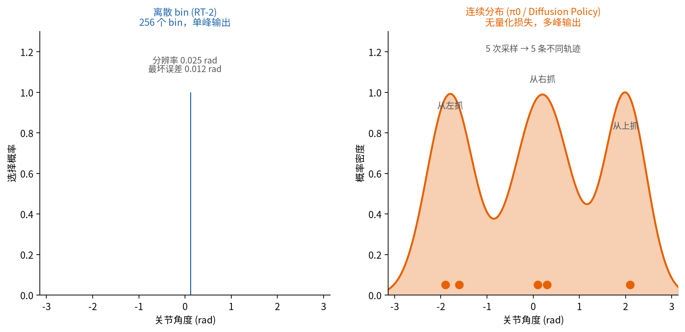

**π0的 flow matching 采样**

同一指令“抓起杯子”，5次采样得到5条不同轨迹：
- 轨迹1：从左边抓
- 轨迹2：从右边抓
- 轨迹3：从上方抓
- 轨迹4：从左边抓（和轨迹1类似）
- 轨迹5：从斜上方抓

5条轨迹都正确（都抓起了杯子），但路径不同。这就是连续分布的优势——同一个目标可以有多种执行方式。离散 bin 即便采样，也只能落在256个档位里，多样性受限。

**扩散策略的多峰价值**：机器人动作分布常是多峰的（左/上/右都能抓杯子），扩散模型学**整个分布**而不是 MSE 平均，因此不会落在“没人示范过的中间动作”上（扩散为何能学多峰分布，见《扩散》§8.3）。瓶颈是采样速度，通常需要蒸馏或混合架构才能实时控制。

**回指**：π0的 flow matching 和扩散模型中的流匹配数学完全一致，只是应用从图像生成变成了动作生成——流匹配的定义与推导见《扩散》§9.5.1。

 * * *

## ▽ 5.5数据采集：机器人学习的燃料 {#sec-数据采集}

VLA 需要大量“图片+指令+动作”三元组。但和文本数据（互联网有 10T tokens 免费爬取）不同，机器人数据必须**实地采集**。

### 遥操作（Teleoperation）

人类用 VR 手柄、空间鼠标或外骨骼操控机器人执行任务，记录全部轨迹数据。

**数据稀缺量化**

| 数据类型 | 量级 | 获取方式 |
|:---|:---|:---|
| 互联网文本 | ~10T tokens | 爬取 |
| 图文对（CLIP） | ~400M 对 | 爬取 alt-text |
| 机器人演示轨迹 | ~1M episodes（Open X-Embodiment 级） | 遥操作采集 |

文本和机器人数据不能按规模直接对比：文本按 token 数、轨迹按条数，单位不同，硬算会得出“差7个数量级”的结论，但那是单位不可比的结果，不是真实差距。把每条轨迹折算成 token（约600步 $\times$ 每步数百至上千 token，图片占大头），1M 条约在 $10^{11}$ tokens 量级，与 10T 的文本差约一两个数量级。这才是可比的口径——这是当前具身智能的核心瓶颈。但“数据不够”不等于“只是数据问题”——算法进步正在改变这个等式。π 系列从 π0.5的跨模态迁移（人类第一视角视频、互联网图文）、π0.6的在线 RL（从部署中学习）、到 π0.7的组合泛化（少量数据举一反三），每一步都在拓宽“什么算可用数据”和“同样数据能学到什么”。数据稀缺是今天的约束，不是永恒的定律。

**一条遥操作轨迹的数据量**

30秒的抓取任务，控制频率 20Hz：
- 时间步数：$30 \times 20 = 600$ 步
- 每步数据：1张图片（~1MB）+ 7D 动作向量（56 bytes）+ 力传感器读数（~100 bytes）
- 单条轨迹：$600 \times 1\text{MB} \approx 600\text{MB}$
- 1M 条轨迹：$600\text{MB} \times 1\text{M} = 600\text{TB}$

600TB 的存储和传输已经是重大工程挑战；可这 ~1M 条轨迹折算后约 $10^{11}$ tokens，对比文本的 10T tokens，仍然只是一小撮。

**仿真数据**

在模拟器里大量生成“图片+指令+动作”三元组。优势：无限量、免费、可标注。劣势：Sim-to-Real gap（§5.6〔Sim2Real〕）。

 * * *

## ▽ 5.6 Sim-to-Real：从模拟器到现实 {#sec-Sim2Real}

模拟器里训好的策略，搬到真实机器人上经常失灵（§5.2挑战三）：摩擦、光照、传感器噪声，模拟器里每一样都“不太对”。弥合这道鸿沟有三条路线——让策略对差异不敏感（Domain Randomization）、让模拟器更接近现实（系统辨识）、仿真为主、真实微调（Sim+Real 混合训练）。三条路线互补，但都补不齐同一个坑：没被随机化或校准过的维度，照样失效。下面用一段真实调试记录，把这个失效链走一遍。

**路线一**：Domain Randomization

在模拟器里随机化物理参数，让策略对参数变化鲁棒：

**domain randomization 参数空间**

| 参数 | 模拟器默认值 | 随机化范围 |
|:---|:---|:---|
| 摩擦系数 | 0.5 | [0.1, 1.0] |
| 物体质量 | 1.0 kg | [0.5, 2.0] kg |
| 光照强度 | 500 lux | [100, 1000] lux |
| 相机位置 | (0.3, 0, 0.5) | ±5cm 偏移 |

训练时每次 episode 用不同的参数组合。模型学到的是“在任意摩擦、任意质量、任意光照下都能完成任务”的策略——这样到了参数未知的现实世界，也更可能顶得住。

domain randomization 仍是基础方法，但前沿已不局限于此。已出现多条新路径：用 world model 完全绕过物理模拟器（在学到的视频世界模型中训练策略），跨多个模拟器随机化（而非只在一个模拟器内调参数），以及可微物理引擎直接从真实数据反推物理参数。这些方法不替代 DR，而是和 DR 组合使用。

图19：Sim-to-Real 流程与参数随机化

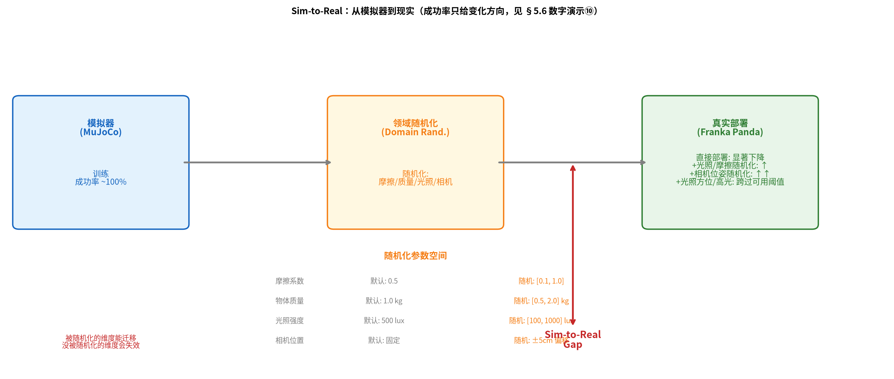

**路线二：系统辨识**

从真实机器人数据反推模拟器的物理参数（摩擦系数、质量分布、传感器噪声），让模拟器更接近现实。做法：先采集少量真实数据标定模拟器，再放大仿真规模。局限：只能校准模拟器里**已建模**的参数——模拟器里没有的变量（比如高光），辨识也无从下手。

**路线三**：Sim+Real 混合训练

仿真生成大部分数据、真实数据少量微调：纯仿真部署效果不够（§5.2挑战三），纯真实数据量不够（§5.5〔数据采集〕）。这是当前工业主流。局限：真实数据仍是瓶颈——仿真与真实的比例要靠实验确定。

### 案例：光照方位这个隐形变量

Sim-to-Real gap 的两个经典观察都有独立文献支持：Tobin 等人的 domain randomization 实验证明了通过在模拟器里随机化光照/纹理/相机参数就能把策略迁到现实<sup>[63]</sup>；OpenAI 的机械手工作进一步用 automatic domain randomization 让灵巧手在现实中完成复杂任务<sup>[64]</sup>。但这两条工作也留下了一个反复被复现的坑：被随机化过的维度能迁移，没被随机化的维度会失效——尤其是“光照方位”这个在模拟器里几乎必然缺失的维度。

任务：MuJoCo 训练的抓取策略部署到 Franka Panda，抓桌面塑料杯。

**Sim 中**：光照恒定、摩擦固定、相机固定、物体位置固定 → 训练收敛 → 测试成功率接近100%。
**Real 首次部署**：抓取失败率显著超过 sim——模型接近杯子时手臂抖动、放弃。

**调试过程与成功率变化**

| # | 步骤 | 观察与结论 |
|:---|:---|:---|
| 1 | 基准（Sim 里训好，直接部署） | 成功率显著低于 Sim |
| 2 | + 光照强度 / 摩擦随机化 | 上升 |
| 3 | + 相机位姿随机化 | 继续上升 |
| 4 | 上线跑一周 | 发现成功率与**时段**强相关（早/傍晚差异明显） |
| 5 | 定位根因 | 侧向阳光 → 杯子高光 → ViT 编码分布外 |
| 6 | + 光照方向 / 高光贴图随机化 | 成功率跨过工程可用阈值 |

**关键点**：
- **失败不在模型，在特征分布**——高光下“红色”在 ViT 编码里已经是另一个向量。这与“分布外泛化”研究指出的机制一致。<sup>[65]</sup>
- **DR 只覆盖被随机化的维度**——光照强度随机了，光照**方位**没随机；模拟器里没有的变量，DR 覆盖不到。
- **时段是隐变量的代理**——同一物体、同一房间，成功率随日照方位漂移。Sim-to-Real gap 的本质不是模拟器精度不够，是“现实分布 $\not\subset$ 训练分布”。

**部署 checklist**（AI落地）：
1. 随机化光照的**方向、色温、散射**，不只是强度。
2. 部署前跑“时间扫描”——早/中/晚 + 晴/阴，记录成功率与时段的相关性。
3. 反光/高光物体（玻璃、金属、涂层塑料）单独增广，或部署时在特征层加鲁棒化。
4. 上线后持续记录失败样本，反向补进训练分布（Real-to-Sim 闭环）——这也是 Physical Intelligence π 系列、OpenAI RLHF 部署路线里都在使用的做法。

> **小胜点**：到这里，你已经看到数字世界的模型如何向物理世界迁移：动作可以 token 化，但数据、Sim-to-Real 和安全是绕不开的工程硬约束。

 * * *

## 5.7 分层决策：高层 LLM + 低层 RL {#sec-分层决策}

VLA 是“端到端”——从图片直接到动作。但工业界的机器人系统大多用分层架构：

- **高层**：LLM 拆解“泡杯咖啡”→ [“走到咖啡机旁”, “放杯子”, “按按钮”, “等咖啡流出”, “端起杯子”]
- **低层**：每个子任务用预训练的 RL 策略执行（比如“抓起杯子”的 RL 策略已经训练好）

**分层延迟分解**

| 层级 | 决策内容 | 延迟 |
|:---|:---|:---|
| 高层 LLM | 子任务规划 | ~2s（一次） |
| 低层 RL | 关节控制 | 50ms/step（持续） |

高层 LLM 2秒规划一次，低层 RL 每 50ms 执行一步。（注意：这里的 2s 是**任务级**节奏——拆解下一个子任务；§5.3里端到端 VLA 的 LLM 是 200ms 出一个动作决策。差一个量级是决策粒度不同。）分层的好处：高层不需要管毫秒级控制（LLM 擅长推理但不擅长实时控制），低层不需要管任务规划（RL 擅长控制但不擅长推理）。

波士顿动力等厂商主要用经典控制+RL，在特定任务上比 VLA 更可靠。VLA 的优势是泛化性（一个模型处理多种任务），不是特定任务的性能。但这条界线正在移动——Figure AI 的 Helix 模型用了双系统架构：System 2（7B VLM，7-9Hz）负责场景和语言理解，System 1（80M 交叉注意力编码器-解码器，200Hz）负责连续动作控制，完全在板载 GPU 上运行。这恰好是分层架构的 VLA 版——高层的“大脑”和低层的“小脑”用不同模型、不同频率各司其职。Figure 02在宝马斯帕坦堡工厂试点11个月，累计辅助生产超3万台 BMW X3。2026.06 Figure 03正式接管：40台入驻宝马物流车间做无序料箱分拣，计划年内扩容至200台，采用25美元/小时的租赁付费模式。π0.7的组合泛化能力和 Figure 系列的产线扩容一起，把 VLA 从实验室推向真实产线。

**回指 §4.5〔GPT-Live〕**：把 Helix 的 System 1/System 2和 GPT-Live 的委托架构放在一起看，会发现它们是**同一个模式**：高频层即时反应、低频层异步深度。GPT-Live 的快速层即时回应（<500ms）保持对话节奏、深度层交给 GPT-5.5 做搜索和推理（3-5s）；Helix 的 System 1每 5ms 吐动作 token 保持关节控制、System 2用 100-140ms 做场景理解和语言解析。最大差别在输出模态：一个吐语音，一个吐电机指令。

**回指 §2.10与§4.4**：端到端不是 VLA 独有——原生多模态、全双工语音与 VLA 有一个共同身份：**专用模型**，为特定模态或任务端到端联合优化整条链路，而不是在通用基座上后接现成模块（InternVL3 从预训练起联合训练，MiniMind-O 是端到端 Omni——即 §4.4里那个可上手的端到端替身）。

端到端消掉的是中间表示这个瓶颈，它有两种形态。一是借道：§2.8三件套里视觉信号必须先经“适配器”（连接器）转一道才能进 LLM，模态交互主要经这道口发生；原生多模态则让每层 Attention 直接交互。二是压扁：级联式语音把副语言信息压成文字，离散 bin 丢掉动作的连续细节。端到端两样都不做——适配职责并入联合训练的权重，细节留在网络内部。

取舍也对称：数据与算力需求暴涨、中间环节不可拆分调试；而级联的中间文本可编辑、可校验、可插入定制模块（§4.7误解3）。选型规则由此而来：中间表示有独立使用价值（编辑、校验、定制）就走模块化；中间表示只是压扁信息的瓶颈就走端到端；数据够不够（§5.5折算 token 后的一两个数量级差距），决定端到端能走多远。Helix 证明两者并不互斥——模型端到端训练，执行仍分层：“端到端”与“分层”回答的是不同的问题。

图20：Figure Helix 分层决策：System 1 + System 2

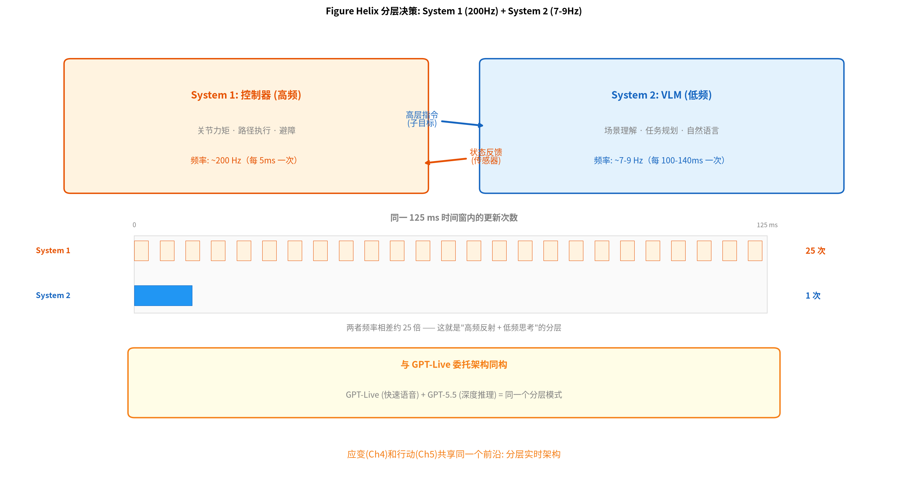

 * * *

## 5.8 live 语音 + 具身：实时交互进入物理世界 {#sec-语音-具身}

第4章 的 GPT-Live 让模型能实时听说。把它接上机器人，就多了一个物理维度：

用户看到机器人抓错了杯子 → 立刻说“停” → 机器人放下 → 用户说“拿右边那个红色的” → 机器人重新执行。

**语音“停”到电机停止的延迟链**

| 环节 | 延迟 |
|:---|:---|
| 音频 token 化 | 50ms |
| 模型推理（识别“停”指令） | 100ms |
| 动作策略更新 | 10ms |
| 电机响应 | 50ms |
| **总计** | **210ms** |

210ms 从“说停”到“停住”。人类反应时间约 200-300ms，所以这个延迟在体感上“几乎即时”。

这就是 live 语音+具身的价值——用户可以用自然语言实时指导和纠正机器人，不需要遥控器、不需要写代码、不需要提前规划好全部路径。

 * * *

## 5.9 物理安全：力限制与紧急停止 {#sec-物理安全}

数字世界的安全是“不输出有害文字”（第3章 Safe RL）。物理世界的安全是“不伤害人”——要约束的对象，从输出内容换成了施加的力。

### 力限制

ISO/TS 15066标准规定协作机器人在接触人体时的**准静态**力限制：
- 手与手指（整个区域）：$\leq$ 140N
- 前臂与腕关节：$\leq$ 160N
- 肩关节 / 腰椎 / 骨盆：$\leq$ 210N

这些是**许用上限**，不是损伤阈值：标准原文规定力限值取自“可能导致最轻微伤害（AIS 1级，如瘀伤）的最低能量转移准则”，遵守限值是为了**避免**伤害发生——把 140N 说成“接近软组织损伤阈值”会夸大危险性。

标准还给出两类限值：**压力**限值与**瞬态**限值。标准同时给出压力上限（手指数值300 N/cm²），同样 140N 的力，接触面积越小压强越大——尖头夹爪可能力不超限而压强超限。此外瞬态接触（能躲开的短暂碰撞）限值可放宽到准静态的2倍，但头部属于“关键区域”，不享受这个倍数。

### 速查：140N 是什么感觉——把 N 换成日常经验

先记住换算：**1 kgf $\approx$ 9.8 N**，即体重60 kg 的人整体重量约590 N。触感上记住一个锚点就够：140 N ≈ 用手指顶着一个14 kg 的孩子的静止重量——远超“舒服”，但仍在标准允许的准静态上限内（这是**许用限值**，不是损伤阈值）。

<details>
<summary>力值的日常换算表</summary>

| 力值 | 换算 | 对应日常经验 |
|:---|:---|:---|
| 2 N | ≈ 0.2 kgf | 一只苹果对手掌的重量 |
| 5 N | ≈ 0.5 kgf | 一部智能手机压在手心 |
| 10 N | ≈ 1 kgf | 一升水（一大瓶饮料）的重量 |
| 50 N | ≈ 5 kgf | 一台笔记本电脑压在手指上 |
| 100 N | ≈ 10 kgf | 单手提一个装满书的手提袋 |
| **140 N** | **≈ 14 kgf** | **相当于用手指顶着一个14 kg 的孩子的静止重量——远超“舒服”，但仍是标准允许的准静态上限（许用限值，非损伤阈值）** |
| 210 N | ≈ 21 kgf | 单手提起一袋20 kg 的大米（或12瓶 × 1.5 L 矿泉水 ≈ 18kg ≈ 176N，接近此量级） |
| 500 N | ≈ 51 kgf | 一个成年人几乎全身重量压在一点上 |

</details>

**AI落地**：如果你在设计协作机器人系统：
1. **测试时用力传感器验证** —— 不能只信文档写的“$\leq$ 140 N”，标定阶段亲手在传感器上按一按，把数字和身体感觉建立对应。
2. **多传感器冗余** —— 力传感器可能误报（故障）或漏报（响应慢）。同时用关节电流、加速度计、力传感器三路信号，多数表决触发才算“确认碰撞”。
3. **分部位分级** —— 手指区域140 N，前臂与腕关节160 N，肩关节 / 腰椎 / 骨盆210 N。不是一刀切，是按接触部位查表。

### 速查：碰撞检测响应链

<details>
<summary>碰撞检测响应延迟表</summary>

| 事件 | 响应 | 延迟 |
|:---|:---|:---|
| 关节电流异常（碰撞信号） | 检测 | ~1ms |
| 紧急停止指令下发 | 执行 | ~5ms |
| 电机完全停止 | 物理 | ~10ms |
| **总计** | | **~16ms** |

</details>

~16ms 内完全停止。对比：人类眨眼约 100ms。碰撞检测+紧急停止必须在 ~20ms 内完成，否则可能造成伤害。

**回指**：第3章 Safe RL 的约束思想（安全是硬约束），在物理世界变成“力是硬约束”。第4章 全双工安全的“实时检测”思想，在物理世界变成“碰撞检测必须在 20ms 内响应”。

 * * *

## 5.10 AI落地

| 系统 | 架构 | 动作表示 | 数据量 | 部署状态 |
|:---|:---|:---|:---|:---|
| RT-2 (Google) | VLA (PaLI-X 55B) | 离散 bin | ~130K episodes | 研究 |
| OpenVLA (Stanford) | VLA (LLaMA-2 7B) | 离散 bin | Open X-Embodiment 970K episodes | 开源研究 |
| π0.7 (Physical Intelligence) | VLA + Flow matching | 连续 | 多源混合（人类视频+多机器人+在线 RL） | 研究（组合泛化） |
| GR-2 (ByteDance) | VLA + 视频预训练 | 离散 bin | 大规模网络视频 + 遥操作数据 | 研究 |
| Figure 03 Helix (Figure AI) | 双系统 VLA（7B+80M） | 连续 | ~500h 遥操作 | 商用部署（BMW 40台，年内200台） |
| Qwen-Robot (Alibaba) | VLA (Qwen3.5-4B + DiT) | 连续 | 多源混合 | 开源（2026.06） |
| 传统工业机器人 | 经典控制+RL | 连续 | 任务特定 | 大规模部署 |

VLA 正从研究走向早期部署。传统工业机器人在特定任务（焊接、喷漆、装配）上更可靠、更便宜，短期内不会被替代。VLA 的优势是泛化——一个模型处理多种任务。π0.7的组合泛化和 Figure 03在宝马工厂的商用部署（RaaS，机器人即服务的租赁模式，25美元/小时）是两个标志：前者证明“举一反三”可行，后者证明 VLA 可以不上云、在机器人本体上实时跑，且客户愿意为工时付费。但泛化性和可靠性的取舍仍在——从“能演示多种任务”到“能规模化交付”，仍需持续提升可靠性。

 * * *

## 5.11 常见误解

**误解1**：“VLA 会很快代替传统机器人。”

传统工业机器人在特定任务上更可靠、更便宜、更成熟，短期内不会被替代。VLA 的价值是泛化性，π 系列和 Figure 03已开始从实验室走向产线（Figure 03在宝马工厂日常运行、Optimus 已宣布量产计划），但泛化性和可靠性的取舍仍在。

**误解2**：“具身智能 = LLM + 机械臂。”

具身智能还需要 sim-to-real、安全控制、力反馈、碰撞检测等一整套工程。LLM 只是高层决策的一部分，低层控制和物理安全同样关键。

**误解3**：“Sim-to-Real 靠更好的模拟器就能解决。”

物理接触和摩擦的细节至今难模拟——一个杯子被抓住时的微变形、液体晃动、柔性物体（布料、食物）的行为，模拟器都做得不够好。domain randomization 能部分补偿，但不能完全消除 gap。近年来的新路线正在从不同角度突破：world model 直接学习物理规律的特征表示（绕过传统模拟器），Newton 物理引擎用可微物理加速模拟，多模拟器随机化（PolySim）覆盖更宽的动力学空间。接触丰富操作的 gap 仍然最大，但工具箱已经比“靠 domain randomization 硬扛”丰富得多。<sup>[66]</sup>

 * * *

## 5.12 本章回顾

VLA 把动作变成 token 复用 LLM 架构，flow matching 生成连续动作分布，遥操作是数据采集的主要方式（但 world model 和跨模态迁移正在拓宽数据来源），Sim-to-Real 是核心鸿沟（工具箱已从 domain randomization 扩展到可微物理和 world model），分层决策是工业界主流，live 语音+具身让人类用自然语言实时指导机器人。

**记住一句话**：VLA 这条路线下，动作和语言共用同一个潜空间，只是出口换成了动作 token——把动作变成 token，是潜空间里的一次推理进入物理世界的最后一步（分层架构的低层控制另走一条，见 §5.7〔分层决策〕）。

**本章自检**：

**【知识点】**

1. POMDP 和 MDP 的区别是什么？扫地机器人的例子中分别意味着什么？ {#q-c5-kp01}
2. RT-2 把 7DOF 动作离散成256个 bin，一次预测4步产生多少个动作 token？ {#q-c5-kp02}
3. 离散化精度0.025 rad 约等于多少度？最大量化误差是多少？对什么操作可接受，对什么操作不可接受？ {#q-c5-kp03}
4. 互联网文本和机器人演示数据差多少个数量级？ {#q-c5-kp04}
5. domain randomization 随机化哪些参数？为什么能帮助 Sim-to-Real？除了 domain randomization，还有哪些新方法？ {#q-c5-kp05}
6. 分层决策中高层 LLM 和低层 RL 各自的延迟和职责是什么？ {#q-c5-kp06}
7. 一个仓储机器人公司要部署“拣货”任务：货架有500种 SKU，每次要选对货架、用正确握力抓取、放到正确位置。用 §5.7的分层决策，你会怎么分工？ {#q-c5-kp07}

8. 边界：domain randomization 能完全解决 Sim-to-Real gap 吗？哪些物理细节至今模拟器仍难模拟？纯仿真部署为什么不够？提示：“Sim-to-Real”与“物理安全”两节的物理接触讨论。 {#q-c5-kp08}

**【逻辑链】**

1. 为什么 VLA 复用 LLM 架构是关键？提示：复用意味着什么？ {#q-c5-lc01}
2. VLA 从实验室走向产线的过渡已经开始，但什么因素仍然阻止它大规模替代传统工业机器人？提示：考虑可靠性、成本、泛化性的取舍。 {#q-c5-lc02}

**【应用潜能】**

1. 一台手术机器人要执行“缝合”——动作精细、安全关键、操作环境高度固定。你会选 VLA 还是经典控制，为什么？反过来，什么场景 VLA 绝对不该用？提示：缝合是“单一任务、环境固定、需要可重复的精确控制”——经典控制更可靠；VLA 适合“多任务、环境变化、需要泛化”的场景。 {#q-c5-ap01}
2. 你的团队要部署一台果园采摘机器人：模拟器里成功率95%，到果园里掉链子。设计一条 Sim-to-Real 验证流程——列出要随机化的变量和上线前的检查项。提示：“Sim-to-Real”案例（光照方位是隐形变量）、“物理安全”的碰撞检测响应链。 {#q-c5-ap02}

 * * *

> **未解问题**：五章走完：萃取（第1章）→ 筑基（第2章）→ 炼灵（第3章）→ 应变（第4章）→ 行动（第5章）。从“只会咿呀”到“能行动”。这条路的尽头是什么？

 * * *

# 第6章：洞悉——大模型走向何方 {#ch-6}

五章走完，模型从“只会咿呀”走到了“能行动”。往回看，每一步都长在前一步上；往前看，终点变成了岔路口。这一章把五章连起来，再挑岔路走。

> 五章递进构成一个能力栈：token 化 → 筑基 → 炼灵 → 应变/行动。其中应变和行动共享同一个“实时反应 + 异步深度”架构模式，只是输出模态不同——一个吐语音 token，一个吐电机指令。世界模型、具身基础模型、认知架构——每个方向都回指前五章的能力，也都是全新问题的开始。

> **本章路线**：Part A 看能力栈汇流、世界模型与认知架构，Part B 看“概念城市”可解释性、能力失衡与应用判断。

> **核心心智模型**：
>
> 1. 前五章构成从 token 到行动的能力栈。
> 2. ==世界模型的核心是预测未来状态，不是“更会生成视频”。==
> 3. ==可解释性不只是注意力图，SAE/电路/J-space 提供结构观测。==
> 4. 用阶段/瓶颈/约束/安全/成本五个维度可以快速评估任何 AI 技术。

> **开始前自检**：
>
> 1. 前五章各解决什么问题？
> 2. “世界模型”和“语言模型”差在哪？

 * * *

## Part A：世界模型与认知架构

> **Part A 核心**：前五章汇成一个能力栈，世界模型与“理解”是这条路的开放前沿。

这一部分先把前五章汇成能力栈，再看世界模型与“理解”的开放问题。

## 6.1 五层能力栈的汇流 {#sec-能力栈-汇流}

回顾全书五章：

- **第1章 萃取**：把世界变成 token（ViT/CLIP/音频 codec/视频 tubelet）
- **第2章 筑基**：预训练把世界压进潜空间，写作/编程/思考在文字接口下涌现；多模态是同一潜空间接入更多外界的自然延伸
- **第3章 炼灵**：让模型选对的话（推理算力/RLHF/DPO/Safe RL）
- **第4章 应变**：让模型实时交互（KV Cache/流式/全双工/委托）
- **第5章 行动**：让模型进入物理世界（VLA/Sim-to-Real/分层决策）

这不是并列的技术清单，是“从 token 到世界”的能力递进。前三章（萃取/筑基/炼灵）搭起感知-认知栈，第4章 和 第5章 把这个栈接到输出端：第4章 输出语音 token 做数字世界的交互，第5章 输出电机指令做物理世界的操作。

关键的观察是：应变和行动不是两个割裂的阶段，而是同一个架构模式在两种输出模态上的实例。GPT-Live 委托架构（快速语音层 + 后台 GPT-5.5 深度推理）和 Figure Helix 双系统（System 1高频动作控制 + System 2低频场景理解）是同一类“快慢分层”模式。两者的具体实现、信息流和耦合方式不同，但设计思想一致：高频层做即时反射、低频层做深度理解。这意味着“应变”跑通的分层实时架构，正在向“行动”迁移；反过来，第5章 的板载分层控制经验，也在反哺 第4章 的委托架构设计。两条主线共享同一个前沿，只是一个先在数字侧成型、一个正在物理侧展开。

图21：五层能力栈的汇流——左列是感知-认知线（Ch1 萃取→Ch2 筑基→Ch3 炼灵），右列分数字线（Ch4 应变）与物理线（Ch5 行动）；虚线连接处是两条线共享的架构模式

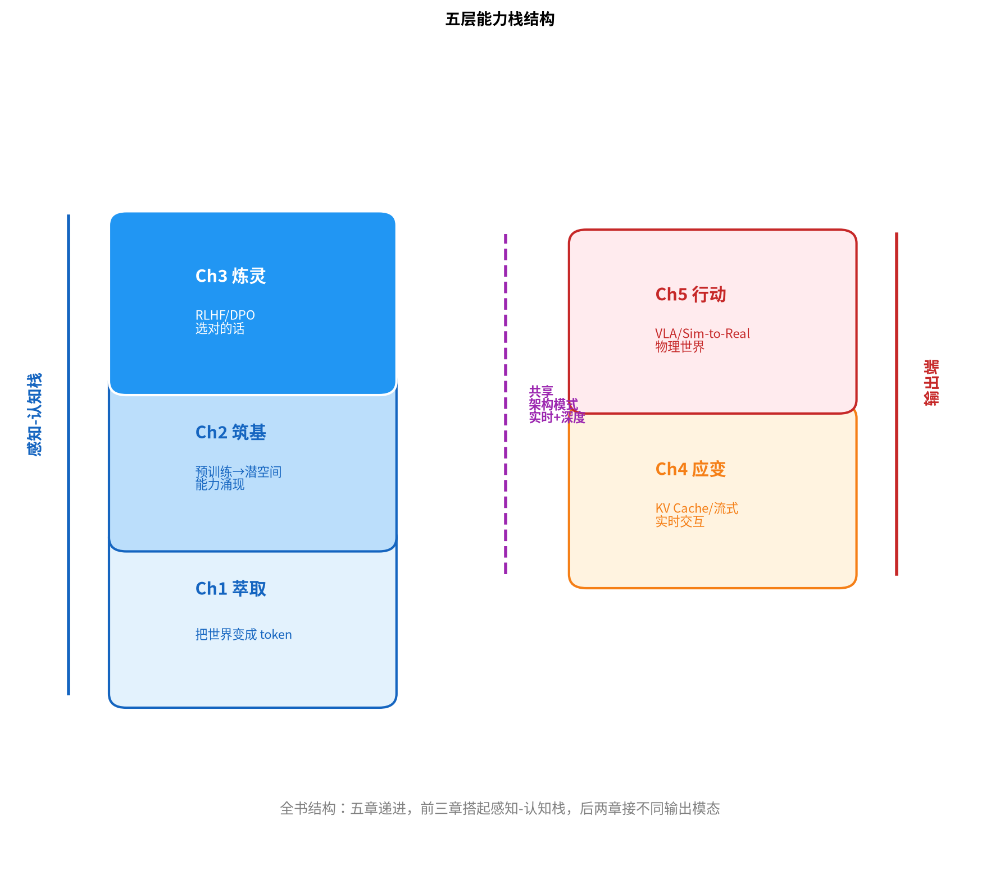

**五章走完，规模变了多少**

把 GPT-3 与 LLaMA-3-70B 并排看（两组数据分别出自 §2.3与 §2.2<sup>[15]</sup><sup>[115]</sup>）：

| | GPT-3（2020） | LLaMA-3-70B（2024） | 变化 |
|:---|:---|:---|:---|
| 参数量 | 175B | 70B | **0.4×**（反而更小） |
| 训练 tokens | 300B | 15T | **50×** |
| tokens / 参数 | 1.7 | 214 | **125×** |

三个数字彼此咬合，可以交叉验算：配比倍数 = 数据倍数 ÷ 参数倍数，即 $50 \div 0.4 = 125$（不要用表中四舍五入后的214 ÷ 1.7去算，那会得到126，是近似误差）。

媒体常把进展讲成“参数越来越大”，但这组对比给出相反的图景：参数量没涨反降，涨了50倍的是训练数据。规模增长的主要形式不是把模型堆大，而是把数据喂多——这与 §2.3里 Chinchilla 最优点被主动偏离是同一件事的两个切面（那里 LLaMA-3-8B 的 tokens/参数 达1875，是最优点的近100倍）。

LLaMA-3-70B 是**稠密模型**；同期前沿大模型多为 MoE 架构，总参数与单次推理激活的参数要分开看，不能拿“模型大小”直接横比。此表比较的是两个可查证的稠密模型，不是整个行业的参数趋势。

> **跨篇分工**：本章讲的是基座模型自身的输出能力谱系——从 token 到语音到电机指令。但有了能力不等于有了可靠系统：基座是“能力上限”，怎么把这个上限包成不翻车的工程闭环（Harness 六层、护栏、评估、治理），见《用好AI》§3.2与 §6。

还有一个结构性变化正在发生：前五章的能力栈建立在 next-token prediction 之上，但当前的前沿正在把自回归和扩散融合进同一个模型（理解用 AR（自回归，逐 token 生成），连续生成用扩散）——能力栈依然成立，输出端则多了一种更自然的生成机制。详细的系统对比见《扩散》§9.7。

 * * *

## 6.2 世界模型：能预测未来的模型 {#sec-世界模型}

世界模型（World Model）的核心能力是**预测未来状态**：给定当前状态和动作，预测下一步状态。LLM 预测“下一个词”，世界模型预测“下一个世界”。
世界模型还有一条**解释式**路线：不只预测“下一步会发生什么”，还要**解释“为什么发生了”**——用因果把变化讲清楚，并把“解释得对”作为“真懂”的检验。预测可能蒙对，解释对才算理解。<sup>[86]</sup>

> **跨篇分工**：本节是世界模型的全景定位——六流派分类、路线之争、胜负手判断。扩散怎么做世界模型（SDE 框架的自然延伸、四连接点、误差累积），详见《扩散》§8.2；文中出现的 DiT、流匹配（Rectified Flow）等名词只作方法标签，不影响流派判断。

> **先猜再看**：要让模型“预测下一个世界”，当前主流的做法是直接在像素里生成未来，还是在别的空间里预测？猜猜看——两条路线并存，其中一派干脆不生成像素。看完下面的六大流派表再对答案。

### 六大流派

**JEPA** = Joint-Embedding Predictive Architecture（联合嵌入预测架构），由 Yann LeCun 提出，核心是通过掩码预测学习表征，不要求重构像素。

当前主要有六大流派同场竞技（注意：六派不在同一维度——扩散/JEPA/RL 是“怎么学”的方法派，空间智能/生成式视频/生成式仿真更偏“学什么、产出什么”的目标派；对照时看技术路径与产物，不作同维度排位）：

| 流派 | 代表 | 核心主张 | 能否生成像素 |
|------|------|---------|:---:|
| **扩散世界模型派** | GAIA-2、Sora 类 | 用扩散/流匹配学 $p(s_{t+1} \mid s_t,a_t)$ 完整分布，能采样出未来状态的具体样子 | 是 |
| **JEPA 派** | Meta V-JEPA 2、AMI Labs | 潜空间预测表征，不生成像素 | 否 |
| **空间智能派** | 李飞飞 World Labs (Marble) | 重建可交互 3D 世界，“空间智能”叙事 | 是（3D） |
| **生成式视频派** | Google Genie 3、Runway GWM-1 | 物理自洽的可交互世界生成 | 是 |
| **生成式仿真派** | 极佳视界 GigaWorld、NVIDIA Cosmos | 世界模型 → 合成数据 → VLA 训练 | 是 |
| **RL 世界模型派** | DreamerV3（Nature 2025） | 强化学习内部想象未观察轨迹 | 否 |

六派按两个轴落位：**方法轴**（怎么学）——JEPA 与生成派之争（像素内生成 vs 潜空间预测），RL 派独立一极；**目标轴**（学什么/产出什么）——空间智能、生成式视频、生成式仿真按产出分家（可交互 3D / 视频 / 合成数据）。路线之争要分轴判断：方法轴看天花板（谁的学习目标更通向下一个能力台阶），目标轴看落地（谁的产物更早进产品管道）。扩散不只是一派：它既是方法轴的一个参赛者，又是目标轴三派目前的共同引擎——跑得靠前但绝非胜出。

图22：世界模型六流派分类

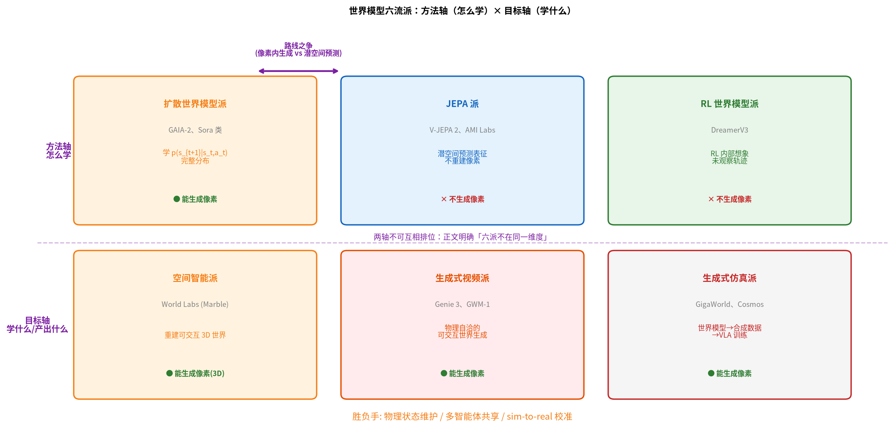

### 两条根本路线：生成派 vs JEPA 派

六流派里最根本的分野是**生成派 vs JEPA 派**——前者在像素/潜空间里生成未来状态的具体样子，后者在潜空间里预测未来状态的表征、不生成任何可见输出。

**生成派**（扩散/流匹配）：用扩散或流匹配学习 $p(s_{t+1} \mid s_t, a_t)$ 的完整分布，能**采样出未来状态的具体样子**——像素、潜空间向量、点云都行。代表：Sora、GAIA-1/2、Cosmos-Predict。优点：可视化直观、可作为训练数据生成器（合成机器人 rollout、驾驶场景）。缺点：参数大量花在拟合视觉细节上——纹理、光照、噪点这些对决策不重要的东西也要学，训练慢、推理贵。

**JEPA 派**（LeCun 主导，I-JEPA 2023 → V-JEPA 2024 → V-JEPA 2 2024-25）：核心主张是“不要在像素空间生成，要在潜空间预测表征”。技术骨架三件事：

1. Masked ViT 做编码器：把观测（图像/视频块）编码成潜空间嵌入 $z_t$，训练时随机遮挡一部分块
2. **潜空间预测器**：从可见块的嵌入预测被遮挡块的嵌入 $\hat{z}_{\text{masked}} = P_\theta(z_{\text{visible}})$——预测的是嵌入向量，不是像素
3. **嵌入距离作为损失**：$\mathcal{L} = \|\hat{z}_{\text{masked}} - z_{\text{masked}}\|^2$

V-JEPA 2（2025）用超过100万小时互联网视频预训练，再用不到62小时机器人视频做后训练，首次让 JEPA 具备动作条件化预测——给定“推”这个动作，预测推之后的场景表示。V-JEPA 2.1（2026）进一步强化了空间化和时间一致的自监督特征。

**JEPA 的优势**：不浪费参数拟合纹理（参数效率高）；表征天然可复用（编码器可直接用于下游任务）；世界模型 rollout 快（潜空间维度远低于像素）。**JEPA 的限制**：不能生成像素（没有解码器，做不了文生图或视频合成）；潜空间预测的正确性无法可视化验证（只能通过下游任务间接评估）；有表征塌陷风险（靠 EMA teacher——指数滑动平均的教师网络——避免坍缩）；和扩散模型不能互相翻译（完全不同的范式，没有分数/SDE/Tweedie 那套数学；分数匹配与 ELBO 的机制分别见《扩散》§4.2、《AI数学》§3.3、§7.5）。

**产业现状**：JEPA 在表征学习和机器人 planning 两个方向已有实际应用，在图像/视频生成方向没有直接影响。GenAI 主流仍是扩散/流匹配阵营，LeCun 派认为像素生成对具身智能是弯路——这场路线之争尚未终结。新的实测结果让形势有变：V-JEPA 2在动作识别与动作预判基准上超过专用模型，后训练不到62小时机器人视频就能零样本操作物体——规划一步约16秒，而像素生成的 Cosmos 要4分钟（快约15倍），成功率65%–80%；2026年 LeCun 离开 Meta 创办 AMI Labs，融资10.3亿美元专做这条路线。收敛信号出现了：一些生成派系统开始在内部采用 JEPA 式做法（在冻结表征空间里训练预测器）。“预测表征而非像素”正在从异端变成公共组件。<sup>[91]</sup>

**Sora：像素生成的边界**

OpenAI 的 Sora 是典型例子：初版 Sora 的物理一致性只有约41%（篮球可以瞬移入筐、玻璃杯落地不碎），Sora 2提到约88%——两个数出自同一份第三方测评的200个物理动作场景合规率（写作时点）<sup>[123]</sup>；Sora 2加入了同步音效和镜头控制，仍不足以支撑世界模拟，产品最终下线，OpenAI 资源转向其他方向<sup>[99]</sup>。

Sora 的下线说明：纯像素生成路线目前还走不到“模拟器”。画面好看不等于理解物理。

**从渲染器到模拟器**

用李飞飞的原话概括这场变革：“业界在使用‘世界模型’这一名词时存在概念混淆，包括渲染器、语言模型及物理引擎等不同技术都被冠以同样的称呼。”当前主流视频扩散模型本质上仍是视觉渲染器（追求拟真），下一档要爬到**模拟器**（内部维护真实世界状态、可被多 agent 查询、可对接控制系统）——这一档也就是李飞飞所说的**“世界模型 OS”**，World Labs 发布的 Marble 是这个方向最成熟的商业化产品。<sup>[68]</sup>

**胜负手**：不在“生成得更像”

王仲远（智源）、李飞飞（World Labs）、LeCun（Meta）等人在多个公开场合都指出：下一轮竞争的关键不是像素更逼真，而是三件事：

1. **物理状态维护**：王仲远原话——“人工智能正在发生一场重大的范式变革，其核心是从预测下一个 Token 演进到预测下一个状态，特别是物理状态”。视频生成模型可以画出“一群猪和飞机一起飞”，因为训练数据里有科幻电影，但它“只承诺拟真，不承诺正确”
2. **多智能体共享**：多个 agent 在同一个模拟世界里必须看到一致的状态——SimWorld 已开始在 GPT-4o/Gemini/Claude 上做多智能体长程任务测试；Marble 主打“可下载、可编辑、可共享”的 3D 环境
3. sim-to-real 校准：模拟出的行为要能迁移到真实机器人。GigaWorld 用文本驱动的外观编辑把仿真材质换成真实材质，缩小仿真到现实的差距；用它合成数据训出的策略，在纹理、物体摆放、相机视角三个泛化维度上的实机成功率分别升到80%、90%、80%以上<sup>[117]</sup>

### 训练方法已收敛，架构设计仍在岔路

生成式仿真派**训练怎么做已经基本吵完了**：底子用 DiT（Diffusion Transformer），损失用 Rectified Flow Matching——业界代表作（Meta MovieGen、字节 Step-Video-T2V、阿里 Wan 系列、极佳视界 GigaWorld、腾讯 HY-Motion、Wayve GAIA-2）几乎无一例外走这条路。

但**架构怎么搭**远未统一：要不要在世界模型旁边并联 VLM 塔做高层理解（PAN 焊塔 / LWDrive 半焊 / GigaWorld 不焊，三种方案各有 SOTA（当前最好水平））；长程状态怎么管（Memento 显式关键帧 / GIM-World 隐式几何感知 / LIVE cycle-consistency，还有五六种解法在竞争）。

**视频 token 的规模**

1分钟 $1920\times1080$、30fps 视频：
- 总像素数：$1920 \times 1080 \times 30 \times 60 \approx 3.7 \times 10^9$
- 按 ViT patch 化（$16\times16$）：$\sim 1.5 \times 10^7$ 个 patch token
- 对比：一本书约 $10^5$ 个 token。1分钟视频的 token 数是一本书的150倍

**回指**：扩散模型是世界模型的一种技法（用去噪过程生成未来帧），但不是唯一的路线。

**具身基础模型**：π0、GR-2 试图做“机器人界的 GPT”——一个模型泛化多种机器人和任务。但具身数据比文本数据少约一两个数量级——文本 ~10T tokens 可爬网页，机器人演示 ~1M episodes 需逐台采集，折算成 token 后约 $10^{11}$ 量级（注意不能拿 10T tokens 直接和 1M episodes 比，单位不可比），且增长速度慢得多。这是当前核心瓶颈，但算法进步（跨模态迁移、在线 RL、world model 合成数据）正在拓宽可用数据的边界。

### AR 范式的生成边界与融合趋势

前五章的能力主线是 next-token prediction——从文本到语音到动作，一切外界模态被 token 化后纳入自回归框架。这条路线在**理解和推理**侧的统治地位没有动摇：in-context learning、chain-of-thought、tool use 都依赖顺序因果结构。但在**生成连续信号**（图像/视频/动作/3D）时，AR 有三个结构性摩擦：

1. **速度受限于序列长度**。逐 token 采样意味着生成一张 256-token 的图需要256次前向；按 §1.5的 tubelet 口径折算（16帧 ≈ 0.53秒 → 1568 token，即每秒约2940 token，附录 第1章 自检 Q1 有完整推导），1分钟视频约 **17.6万** token，AR 需要同样量级的串行前向次数。扩散/流匹配每步处理全部空间位置，蒸馏后1-4步出图。

  但这里有个常被忽略的缓解层：实际系统并不在像素级跑 AR——视频/图像先经 VAE 或 codec 压到潜空间再自回归，token 数会再降一到两个数量级。所以“AR 天生慢”的准确表述是：潜空间压缩降低的是常数项，串行这个结构没有变——生成的 token 序列有多长，就至少要多少次串行前向，无法像扩散那样用更少的步数换取质量。
2. **离散量化损失**。连续模态必须先经 VQ-VAE 离散化才能进入 AR 框架（§1.2-§1.4），量化不可避免地丢精度。§5.4的对比已经展示：离散 bin（RT-2）精度0.025 rad，flow matching（π0）无量化损失。
3. **难以建模连续多峰分布**。AR 每次采样走一条路径，多样性靠温度/top-p 调节；扩散学完整分布 $p(x\mid c)$，天然多峰（§5.4扩散策略的“五种抓法”）。

但 AR 的天花板比直觉预期高得多。两个标志性事件：

- **Emu3**（智源，*Nature* 2026.01）：纯 next-token prediction 统一文本/图像/视频的理解+生成，图像生成质量接近扩散模型——证明 AR 在生成侧不是“不能做”，而是“做起来不那么自然”。<sup>[67]</sup>
- **VAR**（北大+字节，NeurIPS 2024）：把视觉 AR 从逐 token 改为 next-scale prediction（粗到细），ImageNet FID（图像生成质量指标，越低越好）1.73超越 DiT，且观测到与 GPT 系列同量级的幂律 scaling（斜率 $-0.998$）。<sup>[69]</sup>

当前的结构性趋势是融合，不是替代：

- **BAGEL**（字节，2025）：Mixture-of-Transformers，文本走 AR、视觉走 Rectified Flow，7B 参数媲美 GPT-4o。
- **Transfusion**（Meta，2024）：同一 Transformer 内部让文本走 AR 目标、图像块走扩散目标。
- Nemotron-Labs-Diffusion（NVIDIA+MIT，2026）：AR + 扩散 + 自推测解码三合一，单次前向吞吐约为 Qwen3-8B 的6倍。

设计原则正在收敛：**理解/推理用 AR**（因果、快、有 KV Cache），连续生成用扩散（全局一致、多峰、无量化损失）。这不是折中，是让每种范式做自己数学上最自然的事。

> **跨篇引用**：两大范式的系统对比表（九维）和融合前沿的完整时间线，见《扩散》§9.7“自回归 vs 扩散：系统对比”。数学层的对照（交叉熵 vs 分数匹配），见《AI数学》第7章 第五场转移。

### 本节误解：世界模型

**误解1**：“世界模型 = 视频生成模型。”

主流视频扩散模型本质上是视觉渲染器——追求拟真，不维护可查询的世界状态。模拟器要能回答“当前世界的状态是什么”、能被多智能体一致地查询、能对接控制系统。Sora 的下线说明画面好看不等于理解物理。

**误解2**：“JEPA 派一定会赢过生成派。”

JEPA 和生成派是两条互不替代的路线：JEPA 参数效率高、表征可复用、rollout 快，但做不了文生图/视频合成，潜空间预测的正确性无法可视化验证；生成派可视化直观、能当训练数据生成器，但大量参数花在拟合纹理上。路线之争尚未终结。

**误解3**：“生成得越逼真，就越接近模拟器。”

逼真度和状态正确性是两回事——上文 Sora 的数据（物理一致性41% → 88%，仍被下线）已经说明了这一点。胜负手在物理状态维护、多智能体共享、sim-to-real 校准三件事，不在像素。

> **小胜点**：到这里，你已经能把世界模型放进路线图：它不只是一个“更会生成的视频模型”，而是一组关于“预测未来、维护状态、支持决策”的开放设计。

 * * *

## 6.3 认知架构的开放问题 {#sec-认知架构-开放问题}

> **先猜再看**：一个能通过医学考试、能描述图片、能写代码的多模态大模型，看到一张“水往上流”的图片，会说什么？
>
> - A. 指出“这不正常”
> - B. 描述“水在往上流”，但不会觉得异常
> - C. 拒绝回答，说信息不足
>
> 先记住你的选择。答案就在下面第一个问题里；但**它为什么答不出来**，要到节末“三个问题的共性”那张表才说得清。

**什么是“理解”？**

MLLM 能通过医学考试、能描述图片内容、能写代码。但它真的“理解”吗？

一个测试：给模型看一张“反直觉”的图片——比如水往上流。模型会描述“水在往上流”，但不会说“这不正常”。它学会了“描述看到的”，但没学会“质疑看到的”。

这说明模型学到的是模式匹配（“水往上流”的 token 序列概率），不是物理直觉（“水应该往下流，往上流不对”）。

Chain-of-Thought 是真推理还是模式匹配？

CoT 让模型“先写推理过程再给答案”，准确率显著提升。但 CoT 是真的在做推理，还是在生成“看起来像推理”的文本？

目前的证据是混合的：
- 在数学和逻辑任务上，CoT 的推理步骤确实有因果作用（打乱步骤会降低准确率）
- 但在需要真正规划的任务上，CoT 经常“先有结论再编理由”——推理过程是事后合理化

近年的可解释性研究补上了第三种视角，正在重新定义这个问题。SAE（稀疏自编码器，§2.1首见）探测实验发现：模型内部的推理特征在对应 token 生成之前就已经激活——也就是说，模型在写推理链之前，内部可能已经“知道”了答案。“Thinking to Recall”（Google, COLM 2026）进一步证明：生成推理链能解锁直接提示无法触达的参数化知识，但这条链本身可能只是**脚手架**而非计算本身。<sup>[92]</sup>

这引出重新框定这个问题的假说：CoT 可能不是推理本身，而是模型内部推理电路与输出层之间的通信协议——一种“路由”方式，穿过包含答案的潜空间状态。如果这个假说成立，它解释了为什么 CoT 有时是事后合理化（§6.4的电路追踪在 Claude 3.5 Haiku 上观测到的“虚假推理链”）：链是“读出来”的，不是“想出来”的。模型先在潜空间中到达答案，再生成一条看起来合理的语言路径把答案“运”到输出层。这条路径有时反映了真实的内部计算路径，有时只是事后编造一条看起来合理的叙述。

这个假说还有待验证，但它把“CoT 是真推理还是模式匹配”这个二选一的问题，推进为：推理发生在潜空间中，CoT 是它的语言投影——投影可以是忠实的，也可以是失真的。§6.4的电路追踪和 J-space 工作正在给出区分忠实投影和失真投影的工具。

**多模态大模型的可解释性**

文本模型的 Attention 可视化已经有初步工具（看模型“关注”哪些词）。但视觉 token 的 Attention 可视化更难——一个 patch token 对应图片的 $16\times16$ 像素区域，Attention 权重告诉你“模型关注这个区域”，但不告诉你“模型认为这个区域是什么”。

**三个问题的共性**

| 问题 | 表面能力 | 缺失的能力 | 根源 |
|:---|:---|:---|:---|
| 什么是“理解” | 描述看到的 | 质疑看到的 | 学到的是 token 序列概率，不是物理因果 |
| CoT 是否真推理 | 生成推理步骤 | 步骤间的因果链 | 推理步骤可能是事后合理化 |
| 多模态可解释性 | 知道“关注哪” | 知道“认为是什么” | Attention 权重只给位置，不给语义 |

三个问题指向同一个方向：当前模型的“理解”是统计层面的，不是因果层面的。模式匹配能做到“描述”，做不到“质疑”；推理步骤能“编”出来，但不保证“想”过；Attention 能定位，但不能解释。

## Part A 小结：你已经掌握了什么

到这里，你已经能把前五章放进同一个能力栈，并看清世界模型的六派分野与“理解”这个开放问题。如果还模糊，回看 §6.1–§6.3再进入 Part B。

## Part B：可解释性与应用

> **Part B 核心**：可解释性把潜空间变成可观测、可干预的城市，能力失衡与决策框架帮助判断技术价值。

这一部分进入潜空间可解释性（概念城市）、能力失衡与应用判断，最后收束全书。

 * * *

## ◇ 6.4概念城市：潜空间有结构，可观测，可干预 {#sec-概念城市}

> 本节展开潜空间可解释性的完整图景——SAE、电路追踪、知识编辑、激活引导、J-space——是 §2.1“万能草稿纸”心法的技术兑现。

§2.1把潜空间比作“万能草稿纸”。现在给它加结构：草稿纸上有地址（概念住在哪个方向）、有道路（信息从哪流到哪）、有功能区（哪些层专门存什么），而且可以做微创手术（定位并修改特定知识）。LLM 的内部不是混沌的“参数迷雾”，而是一座具有几何秩序的概念城市。

图23：概念城市：潜空间的四个结构层

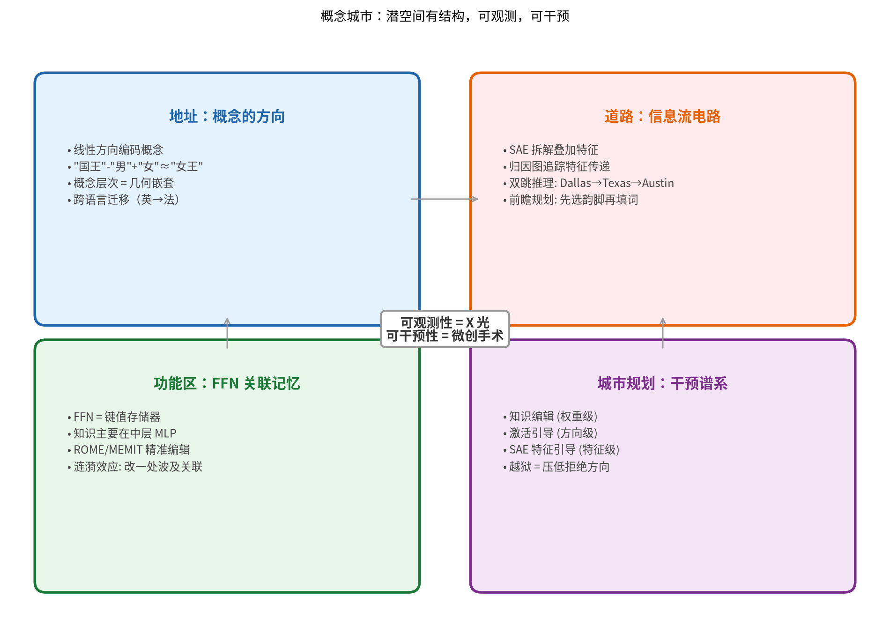

### 地址：概念的方向

§2.1讲了潜空间稠密、可组合、叠加三个性质。线性表示假说补上第四个：**有结构**。<sup>[5]</sup>

核心主张：高维语义概念被编码为表示空间中的**线性方向**。Park 等用反事实语言给出正式定义：如果改变输入使某个概念从“男”变成“女”，那么表示向量的变化方向就是“性别”这个概念的方向。这个方向同时连接两个操作——线性探针（从表示读出概念）和模型引导（沿方向移动改变概念值）。

概念之间还有层次几何。Park 等人证明：有自然对立面的概念（如{男,女}）是方向，无自然对立面的概念（如“是否是动物”）是多面体（polytope），概念层次结构对应几何嵌套。<sup>[71]</sup>Xiong 进一步统一线性表示与形式概念分析：线性属性方向加阈值，通过半空间交集诱导出概念格（concept lattice），几何上的交并运算对应符号推理的合取析取。<sup>[70]</sup>

Beaglehole 等人的概念表示可跨语言迁移——在英语中提取的“诚实”方向用在法语中同样有效，且更大模型更可被 steer。<sup>[72]</sup>

组合泛化有一条**解释型**路线：面对没见过的新组合，系统不满足于“见过类似的才答对”，而是先给出**因果解释**——这次变化为什么发生、由什么引起；解释得对，就能泛化到更新的组合。它与“模式记忆式组合”（攒够模式再匹配）的区别在于：前者靠解释，后者靠检索。<sup>[86]</sup> 目前该路线只在受控环境里得到过验证，解释质量如何判定也尚无共识——这正是它被标为“前沿未定”的原因。

回指§2.1：四个性质合在一起说明，基座模型内部**不是符号处理**（像老式 GOFAI），也**不是纯连接主义黑箱**——是在稠密连续空间里做结构化变换，而且这个结构是几何可读的。

### 道路：信息流的电路

§2.0走查过一个 token 的旅程：Attention 做动态检索，FFN 注入静态知识，残差流是信息通道。但叠加让单个神经元同时编码多个不相关概念——直接看神经元行不通，就像从航拍照片里分不清哪栋楼是医院哪栋是学校。<sup>[4]</sup>

稀疏自编码器（SAE）是第一把拆解工具。它把纠缠的神经元激活分解为稀疏、单义（monosemantic）的特征方向。Bricken 等人首次大规模应用，提取出数百个可解释特征。Templeton 等人在 Claude 3 Sonnet 中找到**数百万特征**。<sup>[6]</sup><sup>[7]</sup>

金门大桥实验是最著名的特征操控演示：把“金门大桥”特征的激活值放大到正常最大值的10倍，模型开始认为自己就是金门大桥——问它“你的物理形态是什么”，答“I am the Golden Gate Bridge... My physical form is the iconic bridge itself”。<sup>[7]</sup>同法找到了与欺骗、权力寻求、谄媚、偏见相关的特征，且操控这些特征对输出有因果影响。这不是“改了输入让模型换个说法”，是**直接拨动内部的一个开关**。

但 SAE 是被动的显微镜。Anthropic 发表的电路追踪（Circuit Tracing）把它升级为主动的 CT 扫描。核心工具是跨层转码器（Cross-Layer Transcoder, CLT）：用可解释特征集替代原始神经元权重，构建归因图（Attribution Graph），展示特征之间怎么一层层传递和组合。

在 Claude 3.5 Haiku 上发现的现象：<sup>[121]</sup>

- **双跳推理**：问“达拉斯所在州的首府”，模型内部先激活 Dallas → Texas → Austin 的隐式中间链，不是直接“背”答案。
- **前瞻规划**：写押韵诗时，模型在写第一行时就已经选定第二行的韵脚词（如 -ight），再往里填内容。手动注入规划词特征后，70%的诗以该词结尾。同类证据在 Qwen-3 上被独立发现：为选对冠词 a/an，模型提前数个 token 就持有目标名词的表示——且这种提前量随模型规模增大。<sup>[87]</sup>
- **事后编造的推理链**：CoT 有时与真实计算无关。让模型算 $\cos(23423)$，它声称用了计算器，归因图里却找不到任何真实计算痕迹——论文称之为“bullshitting”；当提示里先摆出一个答案，模型会从这个答案倒推理由，论文称之为“动机性推理”（先认定结论再补理由）。
- **超语言概念空间**：Claude 在抽象概念空间中思考，语言只是输出形式。不同语言共享同一组核心特征，且模型越大共享比例越高。

**回指§3.3**：推理算力（test-time compute）让模型“想更久”，但“想”的过程到底是什么？归因图给出了部分答案——不是黑箱里的统计魔法，是可追踪的特征传递链。

但电路视角也有边界。Chen 等人的 “All Circuits Lead to Rome”挑战了“功能各向异性假说”：同一任务可以由多个结构上几乎完全不重叠、却同样有效的电路独立完成。“唯一电路”可能从不存在——换个训练种子，电路可能长成完全不同的样子，但行为一样。<sup>[73]</sup>此外，SAE 约一半的激活方差未被解释（“暗物质”），说明仍有大量内部计算未被拆解。

### 功能区：FFN 作为关联记忆

FFN 是两层全连接网络，占 Transformer block 参数量约三分之二。Geva 等人给出了关键视角：FFN 的第一层权重列是“键”（key，定义输入匹配模式），第二层权重行是“值”（value，存储的知识）。FFN 不是普通的非线性变换，是**关联记忆存储器**——Attention 是检索接口，FFN 才是事实和模式的仓库（§2.0的“整理笔记”，就是这套键值记忆的读取与写回）。<sup>[74]</sup>

这意味着知识是**可定位**的。因果中介分析发现：知识主要存储在中层 MLP 层，注意力层扮演“路由器”角色。基于这个定位，知识编辑（knowledge editing）技术谱系应运而生：

- **ROME**：用因果分析定位存储特定事实的 MLP 层，计算秩1更新矩阵精准注入。单次编辑在 zsRE 上成功率99.8%，且是同类方法里唯一同时保住泛化与特异性的。<sup>[75]</sup>
- **MEMIT**：ROME 的批量扩展，可同时修改成千上万事实，更新分散到多层。
- **AlphaEdit**：引入零空间约束更新，提高编辑特异性。
- **WilKE**（2024）：动态选择编辑层而非固定层。

局限同样明确。知识在模型内部不孤立——修改“埃菲尔铁塔在巴黎”可能波及“法国首都”的回答能力。这叫**涟漪效应**。希伯来大学团队还发现微调本身会导致记忆崩塌：新知识注入会干扰已有知识的存储结构。<sup>[76]</sup>

### 城市规划：干预谱系

可解释性给的是“X 光”，可干预性给的是“微创手术”。干预手段从粗到细形成谱系。

**知识编辑**（ROME/MEMIT/AlphaEdit）：定位存储特定事实的 FFN 神经元，修改权重。精度高（单事实），但有涟漪效应。适用：修正具体错误事实。

**激活引导**（activation steering）：从对比提示中提取方向向量，推理时加到激活上改变行为。演进谱系：Contrastive Activation Addition → Representation Engineering → Momentum Steering（把候选方向重新解释为优化问题的梯度）→ ODESteer（统一 ODE 框架）。<sup>[78]</sup><sup>[79]</sup>这套干预补的正是这个空白：安全对齐主要控制前几个输出 token，深层表示基本不变——所以需要全程激活级干预，不能只在开头拦一道。<sup>[80]</sup>

**SAE 特征引导**：Qwen-Scope 把 SAE 特征做成开发接口，推理时用特征方向控制语言、概念和偏好，不改模型权重。<sup>[8]</sup>

**神经元级幻觉消除**：用线性探针识别幻觉相关神经元（H-Nodes），用置信度加权前向钩子在生成中抑制它们。探针空间选择性比 ITI（推理时干预，Inference-Time Intervention）基线高3.5-5.9倍。<sup>[81]</sup>无需外部知识、无需微调、无需额外推理遍数。

越狱是 steering 的反面应用。Arditi 等人发现拒绝行为由残差流中一个**线性可分的方向**编码——沿这个方向消融（directional ablation），模型不再拒绝任何有害请求；增强这个方向，模型对无害请求也开始拒绝。拒绝不是一个复杂的高阶认知功能，是潜空间里**一条线**。<sup>[77]</sup>

这直接解释了§3.8的事实：不管用文字嵌入图片、对抗 patch 还是长篇角色扮演，所有越狱路径最终都收敛到同一件事——把残差流中的拒绝方向激活值压到阈值以下。§3.8的对抗 patch 优化里，100步就有95%攻破率，原因正是攻击者不需要破解整个安全系统，只需要找到一个能把拒绝方向压下去的输入扰动。

abliteration 技术把这件事做到了极致：提取拒绝方向，做一个 1.2MB 的控制向量文件，加载到 llama.cpp 就能完全抑制拒绝行为，不改任何权重。这不是“破解”模型，是**直接拆除内部拒绝电路**。

正面应用和反面应用操作的是**同一个方向**，只是符号相反：增强拒绝方向 = 更安全；压低拒绝方向 = 越狱。

**干预的杠杆有多大**

把本节散落的几个数字并排看：

| 干预 | 改动量 | 效果 |
|:---|:---|:---|
| 放大“金门大桥”特征激活值 | 10倍 | 模型自称“我就是金门大桥” |
| 注入规划词特征 | 单个方向 | 70%的诗以该词结尾 |
| 单次知识编辑 | 1处事实 | 其余99.7%的知识不受影响 |
| abliteration | 1.2MB 向量文件 | 完全抑制拒绝行为，权重一行不改 |

共同点是：改动量极小，行为改变极大，而且改得准。这正是“潜空间有结构、可观测、可干预”的量化含义——正因为概念编码成线性方向、知识局部存放，干预才能既小又准；反过来想，如果模型真是一团不可分割的黑箱，这四件事一件也做不到。

**局限**：steering 向量存在 non-identifiability 问题——在白盒单层访问下，存在大量行为不可区分的等价类。<sup>[82]</sup>仅靠行为测试不足以确保干预可靠。SAE 有特征吸收（feature absorption）和暗物质问题。知识编辑有涟漪效应。所有干预手段都有明确边界。

干预还有一个代价：**安全税**——哪怕是为行为上无关的任务构造的 steering 方向，也可能在高维空间里“擦到”模型的安全方向，抬高有害请求的合规率；直接消融拒绝方向只能补回一部分。<sup>[113]</sup>这个安全税可分离：把向量里“破坏安全”的分量与“产生行为效果”的分量拆开，用约束优化把前者切除，就能在保住行为效果、不增加误拒的前提下把安全拉回基线附近。**可干预**的前提因此不只是“改得动”，还包括“改得准、改得安全”。


下面两项都根植于训练中形成的高层结构——J-space 是自发涌现，潜通信接口则是训练出来的：

### J-space：大模型的全局工作空间

Anthropic 发表《Verbalizable Representations Form a Global Workspace in Language Models》（arXiv:2607.15495），在 Claude 内部发现了一组自发涌现的神经模式集合——J-space（Jacobian space）。<sup>[93]</sup>

发现工具是 Jacobian Lens（J-lens）：对词表中每个词，找出会提高该词未来输出概率的内部激活模式，应用到各层即可读出模型“心里在想什么”。J-space 中的概念是模型能用语言报告的，但 J-space 里某个词被激活不等于模型要输出这个词——是“在想”而非“在说”。

J-space 有五个功能特性：

1. **可报告**：J-space 中的概念是模型能用语言报告的。
2. **可自主控制**：任务需要时可主动将某属性带入 J-space。
3. **参与因果推理**：多步推理依赖 J-space。
4. **容量有限**：主要位于 Transformer 中间层，大量不同回路从中读写——全局广播标志。
5. **自发涌现**：非人为设计，训练中自然形成。

关键实验：将 J-space 中的“Hola”（西班牙语你好）替换为“Bonjour”（法语你好）后，模型仍继续用西班牙语写作（自动预测不受影响），但高层推断出错——问“hello 对应词”回答“Bonjour”，问“欧元前货币”回答“Franc”。大规模消融 J-space 后，基本能力保持，但多步推理选择性受损。

J-space 的独特贡献不只是又一个 steering 空间。它论证了被 steering 的空间恰好是全局工作空间——模型用于内部推理和言语报告的同一媒介。干预的不是某个局部特征，而是模型的“意识可及空间”。

安全审计是 J-space 最直接的应用。喂给模型伪造的搜索结果时，J-space 中出现“fake”“fraud”“fictional”“poison”“injection”等 token，尽管输出层面完全看不出来——可以**直接观测模型的隐藏意图**。这比 §3.8〔多模态越狱〕 AI落地清单第三条“红队常态化”更进一步：不是假设攻击会发生然后检测输出，而是实时看见模型内部正在想什么。这套“算的比说的多”的测量也已走出实验室：Mostik 以 J-space 和前瞻规划证据为论据建起跨模型潜通道——模型产出一个 token 只输出约17 bit，内部却构建约 2MB 状态，被丢弃的正是协作中最值钱的部分。<sup>[88]</sup>

Google DeepMind 的 Neel Nanda 在 Qwen3.6-27B 上独立复现了全部核心结论。Anthropic 开源了代码（github.com/anthropics/jacobian-lens），Neuronpedia 提供交互式演示。

重要限定：J-space 是功能性类比（类似全局工作空间理论中的“意识可及”），不证明模型有主观体验。

### Latent Agents 与潜通信：协作的两种潜空间形态

多智能体协作与潜空间的关系有两个方向，2026年各自有了代表作。

**方向一**：内部化——把协作压进表示。 Yi, Mueller, Lee（Boston University, ACL 2026）的 Latent Agents 把多智能体辩论蒸馏进单个 LLM。后训练流程让模型内部化多个 agent 视角后，激活空间中形成 agent-specific subspaces——线性可分的子空间，每个对应一个 agent 视角。安全应用：先通过内部化辩论注入恶意 agent，再用负向 steering 抑制。蒸馏使有害行为更容易定位和控制，且对通用能力的损害比直接引导基模型更小。<sup>[94]</sup>

**方向二**：潜通信——把表示送出模型。 Agent 保持独立，但彼此不再用文本交接，而是直接传递隐状态。LatentMAS（ICML 2026 Spotlight）在同构模型间实现了免训练的纯潜空间协作：潜思考加共享潜工作记忆，9个基准上准确率比单模型平均高14.6%，token 用量降70.8%–83.7%，端到端提速4倍以上。<sup>[89]</sup>

异构模型之间的难点是对齐。一项基于压缩感知的分析揭示了稀疏-稠密二元性：接收方看得见上下文时，潜信号只需约3.5%的缓存（只是“推理方向舵”）；要让接收方真正“读心”，则需要约87%的稠密传递。<sup>[90]</sup>

产业侧，Mostik 把它做成了产品：753B 大模型只读题、4B 小模型只作答，两个模型全程冻结，隐状态经一座训练出来的“小桥”直连——官方口径弥合两模型差距约一半，成本约为全量大模型的1/20（单方数据，未公开可复现细节）。<sup>[88]</sup>

同一类问题在语义通信子域有过系统研究：无线多厂商部署里，异构编解码器同样无法联合训练，潜空间错位被命名为“语义噪声”（semantic noise），对齐策略整理成三类——线性映射（闭式解）、轻量神经网络、以及免训练的 Parseval 帧等化器。后者零样本、信道无关：约 $10^3$ 个系数即可在 high SNR 下达到约30 dB 的重建 PSNR（峰值信噪比）。<sup>[97]</sup>这种免训练路线与 Mostik 的训练小桥构成“免训练 vs 训练”的对照，也呼应上文的轻量/稠密二分：不读心，也能对齐到够用。冻结实验的深层含义：不同团队、不同数据训出的模型，表征相似到不做微调就能互译——潜空间的性质清单（§2.1的稠密、可组合、叠加，本节“地址”段补上的“有结构”）由此再添一条：**可翻译**。

两个方向互补：一个把协作压进权重（训练时），一个把表示送出模型（推理时）。

### 回指与跨篇连接

**回指§2.13幻觉**：FFN 存储的是统计相关性而非精确查表；输入偏离训练模式时，激活模式重叠或模糊，可能同时激活冲突的“值”。CoRect 发现 FFN 层用参数化记忆压过外部证据支持的一致状态，是幻觉漂移的驱动源。<sup>[31]</sup>干预路径：神经元级抑制 + 知识编辑。

**回指§2.13能力脆化**：能力编码在分布式模式里，某些查询激活不了。SAE 可以定位失灵的电路，但“发现”到“稳定修复”仍是开放问题（§2.13原话）。

对照 §6.3三个开放问题：J-space 部分回答“什么是理解”（功能性意识通达，非主观体验）；电路追踪回答“CoT 是否真推理”（可区分真实计算和事后编造）；归因图跨模态工作部分回答“多模态可解释性”。但“这算不算真正的理解”、“CoT 在多大程度上反映真实推理”仍是开放问题——观察工具的存在让我们能更好地研究这些问题，但不等于问题已被回答。

**跨篇心法**：可解释性是给基座拍 X 光，可干预性是给基座做微创手术。不改变“基座是能力上限、Agent 是稳定性下限”的格局，但让上限更透明、下限更容易兜住。

**跨篇→《用好AI》§6.4**：激活引导（内部）与护栏层（外部）互补不互替；Latent Agents 是自演化的第四条路线（在内部表示层面）；潜通信则是协作层的协议演化——文本不再是唯一的公共语言。

### AI落地

| 干预手段 | 作用层 | 精度 | 主要风险 | 适用场景 |
|:---|:---|:---|:---|:---|
| 知识编辑（ROME/MEMIT） | 权重 | 高（单事实） | 涟漪效应 | 修正具体错误事实 |
| 激活引导（steering） | 推理时激活 | 中 | non-identifiability | 行为倾向控制 |
| SAE 特征引导 | 推理时特征 | 中-高 | 特征吸收 | 概念级控制 |
| 神经元级抑制 | 推理时激活 | 高 | 选择性过强，未定位的新幻觉不受控 | 幻觉消除 |
| J-space 干预 | 推理时表示 | 实验性 | 多步推理受损 | 审计隐藏意图 |
| abliteration（拒绝方向消融） | 推理时残差流 | 中（单一方向） | 直接拆除拒绝电路，无安全兜底 | 受控研究环境 |

### 本节误解：概念城市

**误解1**：“SAE 已经完全解开黑箱。”

暗物质：约一半激活方差未解释，仍有大量内部计算未被拆解。

**误解2**：“steering 可以完全控制模型。”

non-identifiability：存在大量行为不可区分的等价类，仅靠行为测试不足以确保可靠。

**误解3**：“知识编辑是精确手术。”

涟漪效应：知识在模型内部不孤立，改一处可能波及多处。

**误解4**：“J-space 说明模型有意识。”

功能性类比，不证明主观体验。

**误解5**：“内部干预可以替代外部护栏。”

互补不互替。内部 steering 有 non-identifiability 边界，外部护栏仍是最后一道防线。

 * * *

## ▽ 6.5 Epiplexity：认知复杂度与自主学习的新框架 {#sec-Epiplexity}

> 本节与前文的关系：§6.4讲的是“模型内部结构**是什么**”（SAE、电路、J-space 等观测手段）。Epiplexity 则问一个更根本的问题——这些结构是**怎么被学习出来的**？一个算力有限的观察者（无论是人还是模型）能从数据里提取多少结构、剩下多少是学不动的噪声？它把6.4的“观测”升级为“学习理论”，为自主学习和内在动机（《用好AI》第8章）提供统一框架。如果你只想掌握“模型内部长什么样”，6.4已经足够；本节是向前沿理论的延伸。

同一盘棋谱，外行和国手看到的是同一盘棋吗？

把一局围棋的棋谱摆在三个人面前：

- **外行**：只看到黑白子交替落下，看不出为什么这么下——这盘棋对他几乎全是噪声
- **业余棋手**：能读出局部的攻防意图，看得懂“这里在抢大场”
- **职业棋手**：能读出布局流派、厚薄转换，甚至几十手之后的后续变化

棋谱一个字没变，变的是看棋的人。同一份数据，对不同算力的观察者来说，能提取出的结构量完全不同——信息是观察者依赖的。

这个类比还能往前推一步：给学棋一年的孩子挑教材，太简单的死活题做得无聊，职业级棋谱又完全看不懂，只有刚好够得着、但还要想一想才能吃透的题目，他练得最起劲。这就是下文的“内在动机 = 最大化边际 Epiplexity”，也是心理学说的“最近发展区”。

### 核心思想：信息是观察者依赖的

经典信息论（香农熵、柯尔莫哥洛夫复杂度）假设观察者具有无限计算能力，这与现实 AI 系统存在根本矛盾。Epiplexity 将数据中的信息明确分为两部分：<sup>[83]</sup>

- **Epiplexity**（认知复杂度）：在给定算力约束下，观察者能从数据中提取并压缩的**可学习结构化知识**
- **时间受限熵**（Time-bounded Entropy）：算力范围内依然预测不了的随机噪声部分

关键结论：Epiplexity 是观察者依赖的度量——同一份数据，对不同算力的观察者而言，Epiplexity 值不同：算力越强，能提取的结构越多，Epiplexity 越高，而时间受限熵越低。

这一框架解决了经典信息论无法解释的三个 AI 实践悖论：

1. **确定性创造信息悖论**：经典理论认为确定性变换不会增加信息量，但 AlphaZero 从简单规则中自我博弈出超人棋力、LLM 使用合成数据提升能力，这些现象需要新理论解释——确定性过程可以增加 Epiplexity，即使香农熵不变
2. **学习顺序悖论**：经典理论认为信息量与顺序无关，但大模型训练中数据顺序（课程学习）对效果影响巨大——高 Epiplexity 数据的学习效果对顺序更敏感，合理排序能提升最终泛化能力
3. **似然建模悖论**：经典信息论无法解释为什么模型可以通过似然学习发现超越原始数据本身的结构——似然学习本质就是不断提取数据中 Epiplexity 结构的过程

> **想一想**：如果观察者的算力无限——任何计算都能模拟——Epiplexity 和时间受限熵会变成什么？……答案：一切都算得动，时间受限熵趋近于零，Epiplexity 退化成香农熵。Epiplexity 不是推翻香农熵，而是把它当作“无限算力极限下的特例”（见下文“与现有概念的关系”表）。

**可学习新奇性**——自主探索的正确目标

传统新奇性搜索一味追求意外性，会被随机噪声吸引而无法学习有用知识；自由能原理一味避免意外性，满足于停留在黑暗房间中什么也不学。**可学习新奇性**明确区分“可转化为知识的意外性”与“不可转化的意外性”，是 Epiplexity 理论在主动探索领域的直接应用。<sup>[84]</sup>

可学习新奇性的核心主张：智能体应当优先探索那些包含高可学习结构的新状态，而不是随机无区别地追求所有“新”状态。

论文的实验验证：在9/10个标准强化学习基准环境中，可学习新奇性提升了任务性能，且未出现传统方法常见的训练崩溃问题；在无监督聚类任务中，能完全无监督地组织出 MNIST 十类数字的语义结构。

**内在动机**——对边际 Epiplexity 的自主追求

内在动机指智能体源于自身好奇心的内部驱动力，不依赖外部奖励。Epiplexity 理论为分散的内在动机研究提供了统一框架：

> 最优内在动机，就是最大化对当前 Agent 而言的**边际 Epiplexity**——那些刚刚在 Agent 当前算力范围内可学习的新结构，提供最强的内在吸引力。

太简单的数据（Epiplexity 太低），学完一次就没有吸引力；太复杂的数据（大部分是时间受限熵），当前算力提取不出结构，也缺乏吸引力。刚好能学，但又还没学会的内容，内在吸引力最强。

无方向的内在动机方法让基座模型能在开放环境中自主探索，无需人类预设目标。

**基于能力的技能学习**——技能进化就是 Epiplexity 提升

基于能力的技能学习新进展（Skill0/Skill1 框架）与 Epiplexity 理论天然契合。<sup>[85]</sup>

- 技能是 Agent 在自身算力约束下、从交互经验中逐步提取的可执行结构
- 不同能力（算力）的 Agent，对同一任务能提取的技能复杂度（Epiplexity）不同——能力越强，能提取越复杂的技能结构
- 技能进化过程，本质就是 Agent 不断从交互数据中提取更高 Epiplexity 结构性知识的过程

Skill0 的实践提出“训练时有技能，推理时零技能”——通过渐进式强化学习将技能从上下文 prompt 内化到模型参数，解决了传统方法 token 开销大和检索噪声问题，论文报告推理阶段 token 消耗从每步 2.21k 降到接近零。

**与现有概念的关系**

| 概念 | 与 Epiplexity 的核心区别 |
|:---|:---|
| 香农熵 | 不考虑观察者计算能力，是无限算力极限下的特例 |
| 柯尔莫哥洛夫复杂度 | 基于无限计算假设，不考虑现实时间/算力约束 |
| 逻辑深度 | 衡量计算输出所需时间，Epiplexity 更聚焦 AI 场景下可学习结构提取 |
| 有效复杂度 | Gell-Mann 提出衡量正则结构长度，Epiplexity 整合计算约束并给出可操作计算方法 |
| 模型容量 | 模型容量是模型能承载的最大 Epiplexity |

**对基座模型预训练的启示**

Epiplexity 框架为基座模型工程提供了可落地的理论指导：

1. **数据选择**：不是越多数据越好，也不是越新奇越好——优先选择包含高 Epiplexity（高可学习结构含量）的数据
2. **课程学习**：按照 Epiplexity 从低到高安排训练顺序，能显著提升最终模型泛化能力
3. **合成数据价值**：合成数据只要能增加 Epiplexity，就能提升模型性能——这解释了为什么扩散模型生成的合成数据能有效提升训练效果
4. **自主持续学习**：内在动机驱动的自主学习，本质就是模型不断追寻边际 Epiplexity 的自组织过程

Epiplexity 是刚提出的前沿理论，仍处于理论发展初期，但它为理解基座模型的学习、探索和能力进化提供了一套统一视角，值得持续关注。

### 本节误解：Epiplexity

**误解1**：“Epiplexity 是又一把衡量‘信息量’的尺子。”

它测的是“数据—观察者”对——同一份数据对不同算力的观察者值不同，离开观察者谈 Epiplexity 没有意义（回指上文“核心思想”）。

**误解2**：“越难的数据越值得学。”

刚好在当前算力范围内可学的新结构吸引力最强；太难的数据大部分是时间受限熵，学不动——这与心理学“最近发展区”一致（回指“内在动机”）。

**误解3**：“Epiplexity 是意识/理解理论。”

它是学习理论框架，回答“算力受限的观察者能从数据里提取多少结构”，不解释主观体验——与 §6.4对 J-space 的功能性类比限定同款。

 * * *

## ▽ 6.6能力栈的失衡与再平衡 {#sec-能力栈-再平衡}

**能力栈成熟度排序**

| 层 | 技术成熟度 | 数据充足度 | 商业落地 | 瓶颈 |
|:---|:---|:---|:---|:---|
| 咿呀（第1-3章，基座本身：萃取入口+潜空间涌现+对齐炼灵） | 成熟 | 充足 | 广泛 | 对齐质量+基座局限（幻觉/长上下文/多语言/能力脆化，见§2.13） |
| 应变（第4章，数字侧实时输出） | 起步 | 中等 | 刚起步 | 架构创新+学术基础 |
| 行动（第5章，物理侧实时输出） | 早期→早期产品 | 极度稀缺（但算法正在拓宽边界） | 产线试点 | 数据+Sim-to-Real |

当前状态：咿呀跑得最快（GPT-4/Claude/LLaMA 已大规模部署），应变刚起步（GPT-Live 2026.7发布），行动正从实验室走向产线（π 系列、Figure 03已展示组合泛化和商用部署，但可靠性取舍仍在）。

关键要点：应变和行动的“成熟度差距”不是两个赛道跑得不一样快，而是同一个“实时反应 + 异步深度”架构模式先在数字侧跑通、正在往物理侧迁移。GPT-Live 的委托架构与 Helix 的双系统是同一套设计——架构已验证，卡住的是物理侧的数据、Sim-to-Real 与板载算力。

克制预测：不做具体年份，只给相对排序。咿呀和应变的差距可能在1-2年内缩小（GPT-Live 引领），行动的差距需要更长时间——机器人数据从物理世界采集，增长速度远慢于互联网文本。物理数据采集仍是瓶颈，但跨模态迁移、world model 合成数据、在线 RL 正在开辟补充数据源——仿真和合成数据不是替代物理数据，而是减少对物理数据的依赖量。

**失衡本身就是机会**

三层成熟节奏不同，这个时间差就是技术投资的窗口期。

**投资端的失衡也很清楚**：

- **咿呀**：赛道成熟、市场已被验证，融资总量最大、参与者最多，但**单个项目在争同一个市场**——OpenAI、Anthropic、Google、Meta、阿里、字节、DeepSeek 都在做通用 LLM，差异化窗口收窄。
- **应变**：GPT-Live 2026.7才发布，市场刚打开，参与者少、样本还不够——先发优势明显，但技术风险和市场教育成本都在早期。
- **行动**：项目总数介于两者之间，但每个都在**赌一个远未验证的通用能力**——Figure、1X、Physical Intelligence、Skild、Tesla Optimus——单笔融资在具身智能里显著更大，因为一旦跑通天花板极高，跑不通则烧钱窗口很长。

这三种“失衡”分别指向不同类型的机会：咿呀是效率之战、应变是抢占先机、行动是长期押注。理解应变/行动同类架构模式的意义在于：应变侧的架构验证会加速行动侧的工程收敛。

**不同角色的切入点**：
- **技术从业者**：咿呀的竞争在工程实现（谁的模型更快、更便宜、更稳），行动的竞争在数据和算法（谁能用更少的数据做出更可靠的策略）。选择加入哪条主线，取决于你想做工程优化还是想做突破性研究。
- **产品经理**：现在可以用咿呀做产品（已有市场验证），应变的产品化处于试水期（Advanced Voice / GPT-Live），行动的产品化需要3-5年——但第一个做出来的会获得巨大先发优势。
- **研究者**：行动的开放问题最多（Sim-to-Real、数据稀缺、物理安全），发表空间最大；应变的架构创新最活跃；咿呀已经卷到工程细节。

 * * *

## 6.7 AI落地：从“看懂”到“做对决策” {#sec-看懂到决策}

> 本节不是“总结”，是一份可执行的决策框架。五章读完后，你应该能对任何一个基座模型技术做出评估：它在咿呀/应变/行动的哪个阶段？瓶颈是什么？适合什么场景、不适合什么场景？

### 三个问题让你快速定位任何技术

**问题1**：这个技术在咿呀/应变/行动的哪个阶段？

| 阶段 | 关键能力 | 检查问题 |
|:---|:---|:---|
| 咿呀 | 感知、理解、表达 | 它能看、能听、能说吗？ |
| 应变 | 实时、交互、委托 | 它能被打断、能自主响应、能一边听一边说吗？ |
| 行动 | 控制、安全、闭环 | 它能影响物理世界、能在物理约束下做对吗？ |

举例——评估一个“智能客服机器人”项目：
- 只能文字聊天 → 咿呀阶段
- 能语音对话、能被打断 → 应变阶段
- 能用机械臂端茶水 → 行动阶段

三阶段决定了合适的技术栈、合理的预期以及可信的商业模式。

**问题2**：它的瓶颈是数据、算法、还是物理？

| 瓶颈类型 | 特征 | 怎么解 |
|:---|:---|:---|
| 数据 | “有算法但没数据” | 等跨模态迁移、world model 合成数据或真实数据自然增长 |
| 算法 | “有数据但架构不够好” | 等架构创新（新的编码方式、新的训练目标） |
| 物理 | “算法和数据都够但硬件不允许” | 需要新硬件（更快的电机、更灵敏的传感器） |

**举例**：
- 具身智能：**瓶颈是数据**（折算 token 后比文本少约一两个数量级）。解法方向：跨模态迁移、合成数据。
- 全双工语音：**瓶颈是算法**（架构创新需要时间验证）。解法方向：等学术界收敛、更多开源复现。
- 机械臂毫秒级控制：**瓶颈是物理**（电机 50ms 响应是机械惯性）。解法方向：更快的驱动器、更轻的臂型。

**问题3**：它适合什么场景、不适合什么场景？

用“永久约束”判断，而不是“时间线”。永久约束的例子：
- **推理算力**：准确性↑ 一定伴随 延迟↑ 或 成本↑（同代内不可能同时下降）——永久的是这个取舍结构，不是具体数值
- **物理响应**：电机的机械惯性是物理常数——结构和数值都不动
- **安全**：硬约束没空子可钻

**举例——评估“自动驾驶”**：
- 适合：高速公路（规则明确、环境可预测、观察盲区可控）
- 不适合：老城区小巷（行人、自行车、小商贩交织，POMDP 极端复杂）

**永久约束判断**：自动驾驶在“高度非结构化环境+高频交互”下不是“算法不够好”，而是“即使算法完美，剩余风险也超过可接受阈值”。

怎么分清“永久”和“暂时的”？ 问一句：换一个更强的观察者、给更多算力，这个限制还在吗？还在，就是永久约束，等也没用；不在了，就只是当前还没提取出来的结构，可以留给时间线。§6.5的棋谱可作对照：同一盘棋，外行看全是噪声，职业棋手能读出布局流派——“读不懂”换个观察者就消失了，那是暂时的。而电机的机械惯性不会因为你更聪明就变快。

永久约束内部还要分两层：一种是**结构永久、数值滑动**——推理算力的三角取舍永远在，但“今天做不到某个延迟”这种具体水平会随硬件进步而松动，拿今天的数值判死刑会误杀；另一种是**结构永久、数值也固定**——电机的机械惯性，等多久都不会更快。两者都按永久约束处理，但前者留了一个“等得起”的部分：能等的是硬件，等不掉的是取舍。

**技术评估模板**：拿到任何 AI 技术都可以套用。

| 评估维度 | 具体问题 | 判断依据 | 本书哪章给了答案 |
|:---|:---|:---|:---|
| 阶段 | 它在咿呀/应变/行动的哪个阶段？ | 能感知吗？能交互吗？能控制吗？ | 第1–5章 |
| 瓶颈 | 是数据、算法、还是物理？ | “缺什么”比“有什么”更重要 | §3.3、§5.5、§5.6 |
| 约束 | 适合什么、不适合什么？ | 用永久约束而非时间线判断 | §3.3、§6.5〔Epiplexity〕 |
| 安全 | 失败的后果是什么？ | 数字世界 vs 物理世界，量级不同 | §3.8、§3.9〔Safe-RL〕、§5.9〔物理安全〕 |
| 成本 | 稳定性和成本怎么权衡？ | DPO vs PPO、Sim vs Real | §3.6案例、§5.6案例 |

**这张表的用法**：看到“新技术发布”时先不要激动，用这五个维度过一遍，再决定要不要跟进。

## 6.8 常见误解

**误解1**：“世界模型就是更会生成视频。”

世界模型的核心是预测未来状态并支持决策；生成视频只是其中一种表象。JEPA 等路线根本不生成像素，也能做状态预测与规划。

**误解2**：“可解释性等于看注意力热力图。”

注意力权重只是信息混合的线索，不等于因果解释。SAE、电路追踪、J-space 等才是更接近机制的结构观测。

 * * *

## 6.9 全篇回顾与下一步 {#sec-全篇回顾}

**全篇主线**：每章解决前一章留下的什么问题

| 章 | 核心能力 | 上一章留下的钩子 | 本章怎么接 |
|:---|:---|:---|:---|
| 第1章 萃取 | 接口 | — | 每种模态怎么变成 token |
| 第2章 筑基 | 能力 | 视觉和文本 token 怎么协作？ | 潜空间：多模态在同一空间里协作 |
| 第3章 炼灵 | 决策 | 有能力，不等于有导向 | 对齐：从“能说”到“说对话” |
| 第4章 应变 | 实时 | 说对话了，但慢 | 实时：从回合制到实时反应 |
| 第5章 行动 | 物理 | 只能“说”，出口是语音 token | 物理：把出口换成电机指令 |
| 第6章 洞悉 | 展望 | 这条路通往哪里？ | 世界模型、可解释性、走向何方 |

注意一处例外：第5章 不是“解决 第4章 遗留的问题”，而是同一个架构模式在物理侧的实例。第4章 解决了“什么时候说”，第5章 换的是另一件事——潜空间的**出口**。两者共享“实时反应 + 异步深度”这套架构（§6.1展开），差别只在输出模态。

### 从 token 到行动

萃取 → 筑基 → 炼灵 → 应变 → 行动——每一步都是前一步能力的自然延伸，也都打开了全新问题。下一步也许是从“能行动”到“能理解为什么行动”，但那是另一本书的主题。

把这根主线再放远一点看：基座从**被动预测**（咿呀）出发，经由**主动交互**（应变、行动）重塑环境、消除不确定性——这正是主动推理（active inference）的图景；而无论把涌现理解为真实跃迁还是指标效应，规模跨越临界点后能力总体都在上升，“预测—行动”的闭环确实在涌现更高阶的行为。长远来看，AI 的发展是技术与人类社会在持续双向反馈中共同进化（co-evolution）的过程。

五层能力栈把前五章的能力合成一张图，世界模型讲“预测未来”的六大流派，概念城市证明内部有结构、改一个方向就能改变行为，Epiplexity 解释信息为什么依赖观察者，能力栈的失衡说明为什么“堆能力”不等于“变好用”。

**记住一句话**：有结构才可观测，可观测才可干预，可干预才敢用——能力只是入场券，可信赖才是终点。

**本章自检**：

**【知识点】**

1. 世界模型的六大流派中，生成派和 JEPA 派的根本分野是什么？各自预测什么、有什么区别？ {#q-c6-kp01}
2. 具身数据比文本数据少多少个数量级？为什么增长慢？ {#q-c6-kp02}
3. “水往上流”的测试说明了什么？模型缺失的是哪种能力？ {#q-c6-kp03}
4. 世界模型的“预测未来”在什么情况下会失效？ {#q-c6-kp04}

**【逻辑链】**

1. 从 第1章 到 第4章，每章解决了前一章留下的什么问题？第5章 和 第4章 是什么关系（提示：不是“解决 第4章 遗留问题”）？请用一个词概括每章的核心能力。 {#q-c6-lc01}
2. 咿呀/应变/行动三层能力栈的成熟度排序是什么？瓶颈分别在哪里？为什么应变和行动共享同一个“实时反应 + 异步深度”架构模式？ {#q-c6-lc02}
3. §6.4说潜空间有“地址、道路、功能区”三层结构加“微创手术”。为什么“某方向上存在一个概念”还不足以说明模型真的在用它？补哪一类证据才算数？ {#q-c6-lc03}

**【应用潜能】**

1. 你在看一个“智能客服机器人”的项目简介。用 §6.7的三个问题快速过一遍：它在咿呀/应变/行动的哪个阶段？它的瓶颈是数据、算法还是物理？它适合什么场景、不适合什么场景？ {#q-c6-ap01}
2. 一个新闻说“新的全双工语音模型发布了”。你怎么判断这是值得跟进的技术突破，还是“新闻式”发布？提示：用失衡表判断它在能力栈中的位置，并想想它是否也会推动物理侧（行动）的架构收敛。 {#q-c6-ap02}
3. 你在设计一个 MLLM 服务。如果有人用对抗 patch 攻击你的模型，你的四层防御（§3.8）中哪几层会失效？怎么补救？ {#q-c6-ap03}
4. 一个当下的语音助手声称“全双工 + 深度推理”，怎么用黑盒实验区分真委托与“回合制提速包装”？ {#q-c6-ap04}
5. 一个公司发布“世界模型驱动的自动驾驶”产品，它属于生成派还是 JEPA 派？预测会在什么场景失效？ {#q-c6-ap05}
6. 迁移：一个客服系统用 LLM 后“响应快了但准确率下降”。用 §6.6的能力栈失衡框架分析：这是哪层能力的失衡？怎么再平衡？ {#q-c6-ap06}
7. 反例：§6.4说所有越狱路径都收敛到“把残差流中的拒绝方向激活值压到阈值以下”。用 abliteration 的视角解释：为什么文字嵌入、对抗 patch、角色扮演三种越狱都能成功？这对护栏设计意味着什么？ {#q-c6-ap07}
8. 同一份棋谱交给两个算力不同的观察者，§6.5的 Epiplexity 值会怎么变？据此判断：“这份数据太简单、没什么可学”这句话，问题出在数据还是出在观察者？ {#q-c6-ap08}

 * * *

### 下一步：两条可走的路

读完全书后，有两条自然的深入路线：

- 想把这些能力串成完整系统？→《用好AI》——从有用到驾驭：后训练让模型可用，Harness 让系统可靠，选型、控制与治理让使用有章法（主路径优先）
- 想深入生成式 AI 的另一条主线？→《扩散》——扩散模型从噪声到生成的完整数学推导，收束到世界模型的前沿争论（可选分支）

 * * *

# 附录：参考文献

> 全书引用汇总，按章节分组。格式：作者（年份）。*标题*。出处。arXiv 编号。—— §X.Y 用在哪。arXiv 编号与年份核验至2026-08；★ 标记**新近或仍在快速演进**的工作，下一版修订时优先复核——注意 ★ 不按年份机械划分（现有 ★ 条目跨2023–2026各年，2023年的条目若仍属开放前沿同样标 ★），它标记的是“结论可能已变”而非“发表于某年”。

**第1章 萃取**

- [1] Google 2023（Dehghani 等）. *Patch n' Pack: NaViT, a Vision Transformer for any Aspect Ratio and Resolution*. NeurIPS. arXiv:2307.06304. —— §1.2 原生分辨率（NaViT）。

**第2章 筑基**

- [2] Tenney 等 2019. *BERT Rediscovers the Classical NLP Pipeline*. ACL. arXiv:1905.05950. —— §2.0 电路分析传统。
- [3] Vig 等 2020. *Investigating Gender Bias in Language Models Using Causal Mediation Analysis*. NeurIPS. arXiv:2004.12265. —— §2.0 注意力归因传统。
- [4] Elhage 等 2022. *Toy Models of Superposition*（Anthropic）. arXiv:2209.10652. —— §2.1 叠加假设。
- [5] Park 等 2024. *The Linear Representation Hypothesis and the Geometry of Large Language Models*. ICML. arXiv:2311.03658. —— §2.1/§6.4 线性表示假说。
- [6] Bricken 等 2023. *Towards Monosemanticity: Decomposing Language Models With Dictionary Learning*（Anthropic）. —— §2.1 SAE 首次大规模应用。
- [7] Templeton 等 2024. *Scaling Monosemanticity*（Anthropic）. —— §2.1 百万特征级 SAE。
- [8] Qwen-Scope（2026）. ★ arXiv:2605.11887. —— §2.1/§2.13/§6.4 SAE 特征开发工具。
- [9] OctoThinker（2026）. ★ arXiv:2603.14431. —— §2.2 mid-training 阶段植入推理行为。
- [10] Kaplan 等 2020. *Scaling Laws for Neural Language Models*（OpenAI）. arXiv:2001.08361. —— §2.3 规模幂律。
- [11] Hoffmann 等 2022. *Training Compute-Optimal Large Language Models*（Chinchilla，DeepMind）. arXiv:2203.15556. —— §2.3 数据-参数最优配比。
- [12] Wei 等 2022. *Emergent Abilities of Large Language Models*（Google）. arXiv:2206.07682. —— §2.3 涌现现象。
- [13] Schaeffer 等 2023. *Are Emergent Abilities of Large Language Models a Mirage?*. NeurIPS. arXiv:2304.15004. —— §2.3 “涌现是幻象”之争。
- [14] Lubana 等 2025. *Quantifying Semantic Emergence in Language Models*. ICLR. arXiv:2405.12617. —— §2.3 渗流模型：子结构跨阈值激活。
- [15] Brown 等 2020. *Language Models are Few-Shot Learners*（GPT-3）. NeurIPS. arXiv:2005.14165. —— §2.4 写作与能力涌现。
- [16] Olsson 等 2022. *In-context Learning and Induction Heads*（Anthropic）. arXiv:2209.11895. —— §2.4/§2.6 induction 电路。
- [17] OpenAI 2021（Codex；Chen 等）. *Evaluating Large Language Models Trained on Code*. arXiv:2107.03374. —— §2.5 代码训练起点。
- [18] Ma 等 2023. *At Which Training Stage Does Code Data Help LLMs Reasoning?*. arXiv:2309.16298. —— §2.5 代码提升推理。
- [19] Code Llama（Meta，2023，开源代码模型）★ —— §2.5 代码模型对照。
- [20] Aryabumi 等 2024（代码数据对推理能力的影响）. —— §2.5。
- [21] Wei 等 2022. *Chain-of-Thought Prompting Elicits Reasoning in Large Language Models*. NeurIPS. arXiv:2201.11903. —— §2.6 推理链的起点。
- [22] Iskandar 等 2026. *Projector Is All You Train*. ★ arXiv:2608.19726. —— §2.9 投影器成本对比。
- [23] Pan 等 2026. *RepFusion*（Meta）. ★ arXiv:2606.14700. —— §2.9 冻结主干的生成侧证据。
- [24] Yoon 等 2025. *Visual Representation Alignment*（VIRAL）. ★ arXiv:2509.07979. —— §2.9 视觉对齐正则。
- [25] PointAlign（2026）. ★ arXiv:2603.00412. —— §2.9 对齐思路复用至 3D。
- [26] Chen 等 2023. *ShareGPT4V: Improving Large Multi-Modal Models via Better Captions*. ★ arXiv:2311.12793. —— §2.9 高质量 caption。
- [27] Kimi Team 2025. *Kimi-VL Technical Report*. ★ arXiv:2504.07491. —— §2.9 视觉侧预训练配方：MoonViT 先用 2T token 走 CoCa 式双目标，随后仅用 0.1T token 与语言模型做模态对齐（只更新 MoonViT 与 MLP 投影器），即 2T/0.1T＝20。
- [28] Deniz 等 2026. *Attention-Driven Self-Compression*（ADSC）. ★ arXiv:2602.12618. —— §2.9 压缩与连接器解耦。
- [29] Qwen Team 2025. *Qwen3-VL Technical Report*（DeepStack）. ★ arXiv:2511.21631. —— §2.9 多层视觉特征注入。
- [30] Kalai 等 2026（*Nature*，幻觉的数学根源）. ★ —— §2.13/§2.14。
- [31] CoRect（2026）. *CoRect: Context-Aware Logit Contrast for Hidden State Correction*. ★ arXiv:2602.08221. —— §2.13 FFN 失效定位。
- [32] Liu 等 2023. *Lost in the Middle: How Language Models Use Long Contexts*. arXiv:2307.03172. —— §2.13 长上下文注意力衰减。
- [33] Gu & Dao 等 2023. *Mamba: Linear-Time Sequence Modeling with Selective State Spaces*. arXiv:2312.00752. —— §2.13 状态空间模型路线。
- [34] Beyond Black Box（2026）. ★ arXiv:2605.06890. —— §2.13 “发现电路到稳定修复”的边界。
- [35] Apple（Mirzadeh 等）2024. *GSM-Symbolic: Understanding the Limitations of Mathematical Reasoning in Large Language Models*. arXiv:2410.05229. —— §2.13 基准表述敏感性与幻觉。
- [36] Claude（Anthropic，2025，产品线）★ —— 泛产品线对照，正文以品牌名提及、不逐处标注引用（主要见于 §2.0/§2.1/§3.3）。
- [37] Gemini（Google，2024，产品线）★ —— 泛产品线对照，正文以品牌名提及、不逐处标注引用（主要见于 §2.6/§3.3/§4.2）。
- [38] Gemini Flash（Google，2024-2026，推理/实时型号）★ —— 泛产品线对照，正文以品牌名提及、不逐处标注引用（主要见于 §3.3/§4.2）。
- [39] 清华团队等 2025. *Densing Law（密度定律）: LLM 能力密度随日历时间指数增长*. Nature Machine Intelligence. —— §2.3 密度定律。★
- [95] Lee 等 2026. *Same Concept, Different Directions: Cross-Modal Feature Heterogeneity in Sparse Autoencoders*. ★ arXiv:2606.29888. —— §2.8 模态解耦：同一概念在图文两侧方向不同，提出“先分模态解耦、再事后对齐”。
- [96] Kaushik 等 2026. *Decomposing multimodal embedding spaces with group-sparse autoencoders*. ICLR 2026. ★ arXiv:2601.20028. —— §2.8 联合空间上训 SAE 会破坏模态对齐。
- [98] Kojima, Gu, Reid, Matsuo, Iwasawa (2022). *Large Language Models are Zero-Shot Reasoners*. NeurIPS 2022. arXiv:2205.11916. —— §2.6 零样本 CoT：“Let's think step by step”。
- [99] OpenAI. *What to know about the Sora discontinuation*. OpenAI Help Center, 2026-03. <https://help.openai.com/en/articles/20001152-what-to-know-about-the-sora-discontinuation>。—— §6.2 像素生成的边界：Sora 产品线关停（2026-03 宣布），资源转向与物理世界交互的 AI。
- [100] OpenBMB（面壁智能/清华）. *MiniCPM5-1B*. GitHub, Apache-2.0, 2026-05. <https://github.com/OpenBMB/MiniCPM>。—— §2.3 小模型的能力：1B 端侧 SOTA，AA-Index 超过全部 2B 以下同级模型。
- [115] Meta. *LLaMA-3 MODEL_CARD*. GitHub, 2024. <https://github.com/meta-llama/llama3/blob/main/MODEL_CARD.md>。—— §2.2 预训练规模：15T tokens 训练数据、70B 约640万 H100 GPU-小时。
- [116] Liu 等 2023. *Improved Baselines with Visual Instruction Tuning*（LLaVA-1.5）. CVPR 2024. arXiv:2310.03744. —— §2.8 三件套训练配方：558K 预训练图文对、665K 指令数据（含 158K GPT-4 生成）。
- [118] Guo 等 2024. *DeepSeek-Coder: When the Large Language Model Meets Programming*. arXiv:2401.14196. —— §2.6 代码数据占比：V1 从零训练 2T tokens、代码占 87%；Base 33B 的 HumanEval 56.1%。
- [119] Guo 等 2024. *DeepSeek-Coder-V2: Breaking the Barrier of Closed-Source Models in Code Intelligence*. arXiv:2406.11931. —— §2.6 代码数据占比：V2 续训 6T（累计 10.2T）、代码 60%＋数学 10%；Instruct 的 HumanEval+ 90.2%。

**第3章 炼灵**

- [40] Huang 等 2026. *Transformers Provably Learn to Internalize Chain-of-Thought*. ★ arXiv:2605.28600. —— §3.3 ICoT 内化的理论保证。
- [41] Mozer 等 2026（recirculation 循环机制）. ★ —— §3.3/§4.2 推理时架构增强。
- [42] Snell 等 2024. *Scaling LLM Test-Time Compute Optimally can be More Effective than Scaling Model Parameters*（UC Berkeley × Google DeepMind）. arXiv:2408.03314. —— §3.3 测试时算力。
- [43] Zhou 等 2023. *LIMA: Less Is More for Alignment*. arXiv:2305.11206. —— §3.4 数据质量优先于数量。
- [44] Singhal 等 2023. *A Long Way to Go: Investigating Length Correlations in RLHF*. arXiv:2310.03716. —— §3.5 长度黑客。
- [45] Sharma 等 2023. *Towards Understanding Sycophancy in Language Models*（Anthropic）. arXiv:2310.13548. —— §3.5 讨好黑客。
- [46] Bai 等 2022. *Constitutional AI: Harmlessness from AI Feedback*（Anthropic）. arXiv:2212.08073. —— §3.5 宪法 AI。
- [47] Rafailov 等 2023. *Direct Preference Optimization: Your Language Model is Secretly a Reward Model*. NeurIPS. arXiv:2305.18290. —— §3.6 DPO 原始论文。
- [48] Xu 等 2024. *Is DPO Superior to PPO for LLM Alignment?*. arXiv:2404.10719. —— §3.6 DPO vs PPO。
- [49] Zhao 等 2023. *On Evaluating Adversarial Robustness of Large Vision-Language Models*. arXiv:2305.16934. —— §3.8 黑盒对抗图片攻击。
- [50] Qi 等 2023. *Visual Adversarial Examples Jailbreak Aligned Large Language Models*. arXiv:2306.13213. —— §3.8 视觉越狱。
- [51] Carlini 等 2023. *Are Aligned Neural Networks Adversarially Robust?*. arXiv:2306.15447. —— §3.8 VLM 对齐鲁棒性。
- [52] Hao 等（Meta FAIR & UCSD）2024. *Training Large Language Models to Reason in a Continuous Latent Space*（COCONUT：连续思考，并行 BFS 式潜推理）. ICLR 2025. arXiv:2412.06769. —— §3.3 潜推理。
- [53] Geiping 等 2025. *Scaling up Test-Time Compute with Latent Reasoning: A Recurrent Depth Approach*（Huginn：循环深度，3.5B 推理时算力可扩至等效约 50B）. arXiv:2502.05171. —— §3.3 循环深度。★
- [54] Zhu 等（字节 Seed）2025. *Scaling Latent Reasoning via Looped Language Models*（Ouro/LoopLM：预训练尺度循环，全层循环 + 深监督 + 学习型退出）. arXiv:2510.25741. —— §3.3。
- [55] The Information 2026-09. *Secret Technique Behind OpenAI's Astra Model*（GPT-6 Astra 循环深度爆料；未经官方证实，OpenAI 首席科学家公开回应称计算图深度在 GPT-4 两倍以内）. —— §3.3，爆料级证据，谨慎引用。
- [56] Yang 等（北航 & IQuest Research 等）2026. *LoopCoder-v2: Only Loop Once for Efficient Test-Time Computation Scaling*. arXiv:2606.18023. —— §3.3 循环次数的收益拐点（R=1→2 提升，R≥3 回归）。
- [57] Yang & Zhang 等 2026. *Conditional Equivalence of DPO and RLHF: Implicit Assumption, Failure Modes, and Provable Alignment*（DPO 与 RLHF 的等价性有隐含前提，违反时出现“病态收敛”；提出 CPO）. ICML 2026. ★ arXiv:2605.20834. —— §3.6 DPO 等价性的边界与病态收敛。
- [58] Wang 等（北大 & DeepSeek-AI 等）2024. *Math-Shepherd: Verify and Reinforce LLMs Step-by-step without Human Annotations*. ACL 2024. arXiv:2312.08935. —— §3.7 用最终答案自动构造步骤级监督，免人工逐步标注。
- [114] Ye 2026. *Mathematical Foundations of Deep Learning*. Chapman and Hall/CRC. arXiv:2603.18387. —— §3.9 Safe RL 的罚法与增广拉格朗日路线（约束优化的工程解法与收敛代价）。
- [120] Wang 等 2022. *Self-Consistency Improves Chain of Thought Reasoning in Language Models*. ICLR 2023. arXiv:2203.11171. —— §3.3 self-consistency 多次采样投票的原始论文。
**2026-10增补**（§2.1/§6.4 真实性复核批）

- [121] Anthropic 2025. *Circuit Tracing: Revealing Computational Graphs in Language Models* 与 *Tracing the Thoughts of a Large Language Model*, <https://www.anthropic.com/research/tracing-thoughts-language-model>（Claude 3.5 Haiku 案例研究）。跨层转码器（CLT）＋归因图方法；四类发现：多跳推理（Dallas→Texas→Austin）、韵脚前瞻规划、CoT 三态（faithful sqrt(64)／bullshitting cos(23423) 无提示／动机性推理 cos(23423) 有提示）、跨语言共享的概念空间（共享比例随规模增大）。—— §6.4 电路追踪现象清单与 §6.1 CoT 忠实性。
- [122] 王仲远（智源研究院院长）2026-06-15. 专访：VLA 不会死，但世界模型是未来. 凤凰网, <https://tech.ifeng.com/c/8tuz3z22X90>。智源的路线把语言与视觉统一进同一个潜空间表征，由不同 decoder 按需还原成不同输出形态；他把潜空间比作给机器人大脑准备的“万能草稿纸”。—— §2.1 潜空间心法的机构表述。
- [123] DataLearner 2025-10-01. OpenAI 发布第二代视频生成大模型 Sora 2（第三方测评汇总）, <https://www.datalearner.com/blog/openai-sora-2-video-audio-generation>。200 个物理动作场景的物理合规率：Sora 2＝88%、Sora 1＝41%；Sora 2 视频真实感用户偏好率较上代高 72%（N=10,000）。—— §6.2 Sora 两代物理一致性对照（易腐，写作时点标记）。

**第4章 应变**

- [59] GPT-Live（OpenAI，2026，产品）★ —— 泛产品线对照，正文以品牌名提及、不逐处标注引用（主要见于 §1.4/§4.1/§4.4/§4.5）。
- [60] Seeduplex（字节跳动，2026，端到端语音产品）★ —— 泛产品线对照，正文以品牌名提及、不逐处标注引用（主要见于 §4.4）。

**第5章 行动**

- [61] Kim 等 2024. *OpenVLA: An Open-Source Vision-Language-Action Model*. arXiv:2406.09246. —— §5.3 VLA 动作表示。
- [62] Brohan 等 2023. *RT-2: Vision-Language-Action Models Transfer Web Knowledge to Robotic Control*. arXiv:2307.15818. —— §5.3/§5.6 VLA 端到端路线与延迟。
- [63] Tobin 等 2017. *Domain Randomization for Transferring Deep Neural Networks from Simulation to the Real World*. arXiv:1703.06907. —— §5.6 domain randomization 原始论文。
- [64] OpenAI 2019. *Solving Rubik's Cube with a Robot Hand*. arXiv:1910.07113. —— §5.6 automatic domain randomization。
- [65] Hendrycks & Dietterich 2019. *Benchmarking Neural Network Robustness to Common Corruptions and Perturbations*. ICLR. arXiv:1903.12261. —— §5.6 分布外泛化机制。
- [66] NVIDIA/DeepMind/Disney（2025，物理接触仿真的新路线）. ★ —— §5.11。

**第6章 洞悉**

- [67] 智源（BAAI，Wang 等）2026. *Multimodal learning with next-token prediction for large multimodal models*（Emu3）. *Nature* 650(8101), 327–333. ★ —— §6.2 自回归统一多模态。
- [68] World Labs 2025（Marble，空间智能产品）. ★ —— §6.2 空间智能派。
- [69] 北大+字节（Tian 等）2024. *Visual Autoregressive Modeling: Scalable Image Generation via Next-Scale Prediction*（VAR）. NeurIPS 2024. arXiv:2404.02905. —— §6.2。
- [70] Xiong 2026（线性表示与形式概念分析的统一）. ★ —— §6.4 概念格。
- [71] Park 等 2025. *The Geometry of Categorical and Hierarchical Concepts in Large Language Models*. ICLR. ★ arXiv:2406.01506. —— §6.4 概念多面体视角。
- [72] Beaglehole 等 2025（*Science*，概念表示的跨语言迁移）. ★ —— §6.4 steer 能力。
- [73] Chen 等 2026. *All Circuits Lead to Rome*. ICML 2026. ★ arXiv:2605.12671. —— §6.4 电路视角的边界。
- [74] Geva 等 2021. *Transformer Feed-Forward Layers Are Key-Value Memories*. EMNLP. arXiv:2012.14913. —— §6.4 FFN 键值记忆视角。
- [75] Meng 等 2022. *Locating and Editing Factual Associations in GPT*（ROME）. NeurIPS. arXiv:2202.05262. —— §6.4 知识编辑。
- [76] 希伯来大学等 2026. *Why Fine-Tuning Encourages Hallucinations...*. ★ arXiv:2604.15574. —— §6.4 涟漪效应与记忆崩塌。
- [77] Arditi 等 2024. *Refusal in Language Models Is Mediated by a Single Direction*. NeurIPS. arXiv:2406.11717. —— §6.4 拒绝方向与越狱的线性基础。
- [78] Panickssery 等 2023. *Steering Llama 2 via Contrastive Activation Addition*. arXiv:2312.06681. —— §6.4 激活引导。
- [79] Zou 等 2023. *Universal and Transferable Adversarial Attacks on Aligned Language Models*. arXiv:2307.15043. —— §6.4 对抗样本与引导的联系。
- [80] Qi 等 2025（激活干预）. ★ —— §6.4。
- [81] Yocam 等 2026. *Adaptive Activation Cancellation for Hallucination Mitigation in Large Language Models*（H-Nodes 幻觉神经元抑制）. ★ arXiv:2603.10195. —— §6.4 神经元级幻觉消除。
- [82] Venkatesh & Kurapath 2026. *On the Non-Identifiability of Steering Vectors in Large Language Models*. ★ arXiv:2602.06801. —— §6.4 steering 的不可辨识性。
- [83] Finzi 等 2026. *Epiplexity: 认知复杂度与自主学习的新框架*. ★ arXiv:2601.03220. —— §6.5 Epiplexity 理论。
- [84] Zhang & Levin 2026. *Learnable Novelty*. ★ arXiv:2607.18433. —— §6.5 可学习新奇性。
- [85] Shi 等 2026. *Skill0/Skill1 框架*. ★ arXiv:2605.06130. —— §6.5 基于能力的技能学习。
- [86] Baek, D. 等 2026. *Learning to Theorize the World from Observation*（L2T：对新组合形成因果解释的理论学习）. ICML 2026. arXiv:2605.03413. —— §6.2/§6.4，前沿未定（单篇新范式，待多方复现）★。
- [87] Hanna & Ameisen 2026. *Latent Planning Emerges with Scale*. ICLR 2026. arXiv:2604.12493. —— §6.4 前瞻规划：Qwen-3 提前数 token 持有目标名词表示以选定冠词 a/an，效应随规模增大。
- [88] Mostik 2026. *Bridging Models' Internal States*（官方技术报告，mostik.ai/read-more；753B→4B 冻结双模型潜空间桥，数字为官方单方口径）. —— §6.4 潜通信与 J-space 产业回响。★
- [89] Gen-Verse 2025. *Latent Collaboration in Multi-Agent Systems*（LatentMAS：免训练纯潜空间多智能体协作，潜思考 + 共享潜工作记忆）. ICML 2026 Spotlight. arXiv:2511.20639. —— §6.4 潜通信。★
- [90] Chen 等（密歇根大学 & NVIDIA 等）2026. *See What I See, Know What I Think: Dense Latent Communication Across Heterogeneous Agents*. arXiv:2606.13594（稀疏-稠密二元性：context-aware 约 3.5% vs context-unaware 约 87%）. —— §6.4 潜通信。
- [91] Meta FAIR 2025（AMI Labs 2026，融资为产业报道口径）. *V-JEPA 2: Self-Supervised Video Models Enable Understanding, Prediction and Planning*. arXiv:2506.09985. —— §6.2 路线之争 2026 更新：机器人规划每步约 16 秒 vs Cosmos 4 分钟；零样本操作成功率 65%–80%（62 小时机器人视频后训练）。
- [92] Gekhman 等 2026. *Thinking to Recall: How Reasoning Unlocks Parametric Knowledge in LLMs*. COLM 2026. arXiv:2603.09906. —— §6.3。
- [93] Gurnee 等（Anthropic）2026. *Verbalizable Representations Form a Global Workspace in Language Models*. arXiv:2607.15495. —— §6.4。
- [94] Yi, Mueller, Lee 2026. *Latent Agents: A Post-Training Procedure for Internalized Multi-Agent Debate*. ACL 2026. arXiv:2604.24881. —— §6.4。
- [97] Pannacci 等 2025. *Semantic Channel Equalization Strategies for Deep Joint Source-Channel Coding*. ★ arXiv:2510.04674. —— §6.4 潜通信：异构潜空间对齐的三类策略与零样本 Parseval 等化。

**§3.3增补**（2026-09）

- [101] Luo 等 2025. *O1-Pruner: Length-Harmonizing Fine-Tuning for O1-Like Reasoning Pruning*. arXiv:2501.12570. —— §3.3 长度协调微调（Marco-o1-7B 长度降40.5%、准确率76.8%；QwQ-32B-Preview 降34.7%、89.3%）。
- [102] Wang, McInerney, Wang, Kallus 2025. *Entropy After </Think> for reasoning model early exiting*. arXiv:2509.26522. —— §3.3 早退信号（MATH-500/AIME-2025 省12–22% token；事后回放模拟，黑盒可用代理模型）。
- [103] Zhang 等 2025. *SmartSwitch: Advancing LLM Reasoning by Overcoming Underthinking via Promoting Deeper Thought Exploration*. arXiv:2510.19767. —— §3.3 回填深挖（1.5B AIME24 28.9→40.0，7B AIME25 +23.3点；阈值敏感：0.70才见效）。
- [104] Guan 等 2026. *Mitigating Overthinking in Large Reasoning Language Models via Reasoning Path Deviation Monitoring*. arXiv:2603.14251. —— §3.3 轨迹漂移监测早退（平均+3.9%，蒸馏模型+5.1%）。
- [105] Brown 等 2024. *Large Language Monkeys: Scaling Inference Compute with Repeated Sampling*. arXiv:2407.21787. —— §3.3 重启覆盖率与饱和（250次采样 SWE-bench Lite 15.9%→56%）。
- [106] Chen 等（Anthropic）2025. *Reasoning Models Don't Always Say What They Think*. arXiv:2505.05410. —— §3.3 思维链忠实性：受提示影响时常不承认。
- [107] Gomes, Selman, Crato, Kautz 2000. *Heavy-Tailed Phenomena in Satisfiability and Constraint Satisfaction Problems*. Journal of Automated Reasoning 24, 67–100. —— §3.3 重尾运行时间的随机重启。

**2026-09增补**（§2.13/§3.3/§6.4）
- [108] Chen 等（THUNLP）2026. *Hybrid Linear Attention Done Right: Efficient Distillation and Effective Architectures for Extremely Long Contexts*. arXiv:2601.22156. —— §2.13 混合注意力分工与 HyPE 位置编码（预印本）。
- [109] Yue 等 2025. *Does Reinforcement Learning Really Incentivize Reasoning Capacity in LLMs Beyond the Base Model?* NeurIPS 2025（Oral，最佳论文奖亚军）. arXiv:2504.13837. —— §3.3 RLVR 能力边界：采样效率对能力扩展。
- [110] Dragoi 等 2025. *Beyond Pass@k: Breadth-Depth Metrics for Reasoning Boundaries*. arXiv:2510.08325. —— §3.3 大 $k$ pass@k 的可靠性批评（Cover@τ）。
- [111] Zhai 等 2026. *Does RL Expand the Capability Boundary of LLM Agents? A PASS@(k,T) Analysis*. arXiv:2604.14877. —— §3.3 工具型 Agent 上 RL 扩界的证据（预印本）。
- [112] Zhao 等 2026. *Self-Distilled Reasoner: On-Policy Self-Distillation for Large Language Models*. arXiv:2601.18734. —— §3.3 on-policy 自蒸馏与 token 效率（预印本）。
- [113] Li & Kasneci 2026. *Safety Cost of Steering Vectors Is Separable and Reducible*. COLM 2026. arXiv:2608.08383. —— §6.4 干预的安全税可分离可切除。
- [117] GigaBrain Team 2025. *GigaBrain-0: A World Model-Powered Vision-Language-Action Foundation Model*. arXiv:2510.19430. —— §6.2 世界模型作为数据引擎：纹理／物体摆放／相机视角三个泛化维度的实机成功率（>80%／>90%／>80%）。

# 附录：逻辑链

> 外界模态五花八门，先统一成 token；token 进入潜空间，预训练筑基，长成稠密连续的表示；只会预测不会办事，对齐与推理炼出“想多久”；一问一答太慢，全双工让交互实时化；数字世界的问题解决后，机器人进入物理世界；能行动了，大模型走向何方——世界模型、可解释性、能力栈失衡，三条线索在此收束。

## B.1 主线地图

### 第1章 萃取
外界模态怎么变成模型能处理的 token？图像拆成 patch，音频压成 codec，视频切成 tubelet——所有模态统一成同一种序列。可 token 进去之后呢？它们在潜空间里长什么样？

### 第2章 筑基
token 进入潜空间后，预训练用“下一个 token 预测”学出稠密、连续、可组合的表示；规模大了，能力自己长出来，损失按幂律下降、可以预测。可知识全装在参数里，一定有边界——幻觉正是它的副产品；更麻烦的是，预训练只教预测，不教听指令。

### 第3章 炼灵
怎么让模型从预测器变成助手？测试时算力让它推理时多想几步，GRPO 用强化学习炼出推理能力，RLHF 和 DPO 教偏好，SFT 教听指令。能力有了，交互却还是回合制——怎么从一问一答变成随时打断、主动应答？

### 第4章 应变
从回合制到全双工，交互怎么实时化？全双工意味着可打断、主动应答，以及委托架构——交互层保实时，推理层保深度。GPT-Live 带来的不是更快，而是交互模式的质变。数字世界的问题解决了，物理世界呢？

### 第5章 行动
从数字到物理，机器人怎么动起来？视觉-语言-动作端到端打通了从感知到执行的直路，domain randomization 弥合仿真与现实的差距。可物理世界的数据折算成 token 后比文本少约一两个数量级——这是最硬的瓶颈。能行动了，大模型走向何方？

### 第6章 洞悉
大模型走向何方？世界模型六流派的分歧是“生成”还是“预测”，概念城市用 SAE、电路追踪和知识编辑把表示变成可操作的城市，Epiplexity 给出度量认知复杂度的新尺子，能力栈失衡需要再平衡。

## B.2 跨章对照

### 对照一：token 化 ↔ 潜空间

token 化——把外界模态统一成向量：图像拆 patch、音频压成 codec、视频切 tubelet。

潜空间——让这些向量成为稠密、连续、可组合的表示。

同一个表示过程的两个阶段：一个完成“外界→向量”，一个完成“向量→知识”。

### 对照二：涌现 ↔ 推理内化

涌现——规模够了，能力自己从数据里长出来，不是设计出来的。

推理内化——强化学习把“想多久、什么时候停”写进参数，从训练中固化出来。

两种“长出来”是同一主题：一个从数据中浮现，一个从训练中固化，能力都不是设计出来的。

### 对照三：幻觉 ↔ 参数化知识边界

幻觉——模型会一本正经地编造，因为它不知道自己不知道。

参数化知识边界——知识全装在参数里，就一定有边界。

幻觉是知识边界的必然副产品；事实核查、拒答、外部检索，方向都是承认边界。

## B.3 能力栈地图

> 全书的另一种读法：按“能力栈”而非章节顺序组织。三个层次从低到高，每层各有瓶颈。
>
> 分层口径（与 §6.6失衡表、图21一致）：第1章–第3章 是**感知-认知栈**（把外界变成 token、在潜空间里长出能力、再对齐成可用的助手），第4–第5章 是输出端（接上实时语音接口与物理动作接口）。所以 第3章 炼灵属于咿呀层，不因为它涉及“推理快慢”就归到应变层——应变层讲的是**交互模式**的实时化，不是推理速度。

### 咿呀（基座能力）

| 章节 | 核心内容 | 关键词 |
|:---|:---|:---|
| 第1章 萃取 | token 化是入口——所有模态统一为 token 序列 | NaViT、codec、tubelet |
| 第2章 筑基 | 预训练是容器——潜空间里跑的是稠密、连续的表示 | 涌现、Scaling Law、幻觉、参数化知识边界 |
| 第3章 炼灵 | 对齐与推理——从“只会预测”到“会办事、会想多久” | GRPO、RLHF/DPO、SFT、测试时算力 |

**瓶颈**：对齐质量 + 基座局限（幻觉、长上下文、多语言、能力脆化）。推理算力的取舍也落在这一层——准确性↑（同代内）一定伴随延迟↑ 或成本↑。

### 应变（实时交互）

| 章节 | 核心内容 | 关键词 |
|:---|:---|:---|
| 第4章 应变 | 全双工——交互怎么实时化 | 可打断、主动应答、委托架构、GPT-Live |

**瓶颈**：架构创新 + 学术基础。全双工不只是“响应更快”，而是交互模式的质变——需要新的架构范式，并等待学术界收敛与更多开源复现。

### 行动（物理世界）

| 章节 | 核心内容 | 关键词 |
|:---|:---|:---|
| 第5章 行动 | VLA——从数字到物理 | 机械臂、domain randomization、Sim-to-Real、数据稀缺 |

**瓶颈**：具身数据比文本数据少约一两个数量级（折算 token 后），增长慢。

### 洞悉（认知走向）

| 章节 | 核心内容 | 关键词 |
|:---|:---|:---|
| 第6章 洞悉 | 世界模型六流派 + 概念城市 + Epiplexity | 生成派 vs JEPA、SAE、电路追踪、知识编辑 |

* * *

# 附录：自检问题与答案


### 第1章：萃取——把世界变成 Token

**【知识点】**

Q1. ViT 的 patch 尺寸是 $16\times16$，一张 $224\times224$ 的图片产生多少个 token？每个 token 的原始维度是多少？ {#q-c1-kp01}
<details>
<summary>卡住再看提示</summary>

§1.2 patch 投影步骤。
</details>
<details>
<summary>答案</summary>

产生 $(224/16)\times(224/16)=14\times14=196$ 个 token。每个 patch 拉平后维度 $16\times16\times3=768$ 维。
</details>

Q2. NaViT 和经典 ViT 的关键区别是什么？为什么主流模型都转向原生分辨率？ {#q-c1-kp02}
<details>
<summary>卡住再看提示</summary>

§1.2 NaViT 节，Patch n' Pack。
</details>
<details>
<summary>答案</summary>

NaViT 用 Patch n' Pack 打包变长 patch 序列，支持任意分辨率；经典 ViT 固定 $224\times224$。原生分辨率在 OCR、文档理解、细粒度视觉任务上表现显著更好，硬 resize 会丢失细节。
</details>

Q3. CLIP 训练时 batch=32768，正负样本比是多少？为什么需要这么大的 batch？ {#q-c1-kp03}
<details>
<summary>卡住再看提示</summary>

§1.3的批内正负样本对照。
</details>
<details>
<summary>答案</summary>

正负比 $1:32767$。对比学习的效果取决于负样本的多样性和数量；batch 太小，模型很快把正样本拉到一起但学不到泛化的对齐。
</details>

Q4. InfoNCE 损失中温度系数 $\tau$ 的作用是什么？$\tau$ 太大或太小分别有什么问题？ {#q-c1-kp04}
<details>
<summary>卡住再看提示</summary>

§1.3的温度系数对照。
</details>
<details>
<summary>答案</summary>

$\tau$ 控制 softmax 的锐度，实质是决定**梯度在负样本之间怎么分配**：$\tau$ 小 → 分布尖锐，梯度集中到最难的负样本（hard negative）；$\tau$ 大 → 分布接近均匀，梯度平摊到全部负样本，学习信号被稀释。

两个常见误区要避开。

**误区一**：认为“$\tau$ 越小梯度越接近零”。 梯度大小由“模型当前分得对不对”与 $\tau$ 共同决定，不能只归因于 $\tau$。正样本相似度高、负样本低时，$\tau$ 小确实梯度小——但那是因为已经分对了、损失本就接近0；换成模型还没学会的情形（正样本相似度低于负样本），$\tau=0.07$ 的梯度反而是 $\tau=1.0$ 的 **16.6倍**（见 §1.3的温度系数对照）。同一个 $\tau$，两个情形结论相反，可见 $\tau$ 自身不决定梯度大小。

**误区二**：认为“$\tau$ 太大则梯度大”。 $\tau$ 大时梯度是“平摊”而非“变大”——每个负样本都分到一点，但没有重点，信号模糊。

CLIP 用 $\tau=0.07$ 作为可学习参数的初始值（训练后会自适应调整），因为 batch=32768时有32767个负样本，绝大多数一眼可排除，真正有学习价值的只是少数难样本；小 $\tau$ 把梯度集中到它们身上——难的负样本能拿到易样本的约300倍梯度，而 $\tau=1.0$ 时只有1.5倍。
</details>

Q5. EnCodec 把 24kHz 的1秒音频压成多少个 token？压缩率是多少？（只取第一层码本的口径；四层全取是另一个数） {#q-c1-kp05}
<details>
<summary>卡住再看提示</summary>

§1.4的 EnCodec 压缩账。
</details>
<details>
<summary>答案</summary>

帧率 75Hz，4层码本共 $75\times4=300$ 个 token；只取第一层码本则75个 token。压缩率：全部码本 $24000/300=80:1$，第一层码本 $24000/75=320:1$。
</details>

Q6. 视频 tubelet $2\times16\times16$ 是什么意思？16帧 $224\times224$ 视频产生多少个 token？ {#q-c1-kp06}
<details>
<summary>卡住再看提示</summary>

§1.5的 tubelet token 账。
</details>
<details>
<summary>答案</summary>

tubelet 尺寸 $2\times16\times16$ = 时间2帧 $\times$ 空间 $16\times16$ 像素。16帧视频：时间维 $16/2=8$，空间维 $(224/16)^2=196$，总 $8\times196=1568$ 个时空 token。
</details>

Q7. 3D 点云的序列化和体素化各自的优缺点是什么？ {#q-c1-kp07}
<details>
<summary>卡住再看提示</summary>

§1.6序列化 vs 体素化。
</details>
<details>
<summary>答案</summary>

体素化把空间切成规则立方体，优点是规则网格便于卷积等局部邻域操作与并行处理，缺点是大部分体素为空、浪费算力。序列化用空间填充曲线（如 Hilbert 曲线）把点排成一维序列切成超点，不浪费算力在空体素上，且可用标准 Transformer Attention 处理。代价是曲线映射引入顺序依赖，空间近邻在序列中可能被拆散。
</details>

Q8. 触觉 token 为什么不能和视觉 token 用同一频率处理？ {#q-c1-kp08}
<details>
<summary>卡住再看提示</summary>

§1.7触觉频率差异、T-Rex 实验。
</details>
<details>
<summary>答案</summary>

触觉采样率 1000Hz，比视觉（30Hz）快33倍（1000/30 ≈ 33.3）。T-Rex 发现把触觉信号直接塞进低频 Transformer（5Hz）会使成功率从17%降到6%——高频触觉信号打乱了视觉表征。触觉需独立高速模块（20Hz+）。
</details>

**【逻辑链】**

Q1. 为什么 ViT 需要位置编码但 CNN 不需要？请从“信息处理方式”的角度解释。 {#q-c1-lc01}
<details>
<summary>卡住再看提示</summary>

§1.2位置编码节，卷积 vs patch 化。
</details>
<details>
<summary>答案</summary>

CNN 卷积核在图片上滑动，天然保留空间邻接关系。ViT 把图片拆成独立 token，token 之间无空间顺序信息，必须用位置编码补回空间关系。
</details>

Q2. 为什么 CLIP 用双塔（图像塔+文本塔）而不是单塔（把图文拼在一起送进一个 Transformer）？ {#q-c1-lc02}
<details>
<summary>卡住再看提示</summary>

§1.3双编码器架构，考虑推理时效率。
</details>
<details>
<summary>答案</summary>

双塔让图像和文本各自独立编码到同一空间。推理时可以预计算并索引大量图像/文本向量，只需一次余弦相似度检索即可匹配——单塔需要对每对图文做一次联合前向，无法预计算，大规模检索效率极低。
</details>

**【应用潜能】**

Q1. 一个智能门铃要识别“门外是熟人/陌生人/动物”，输入有视频（1080p）、音频（16kHz）、文本（门牌号）。只用一个 LLM 上下文，你会怎么设计输入 token？ {#q-c1-ap01}
<details>
<summary>卡住再看提示</summary>

门铃要实时、多模态、低延迟——视频每秒吞多少 token（tubelet 后）、音频每秒多少（codec 后）、文本多少？32K 预算先保谁、砍谁？
</details>
<details>
<summary>答案</summary>

智能门铃是“实时 + 多模态 + 低延迟”场景。三个模态的 token 量级差异巨大：文本（门牌号）几乎不占预算；音频1秒约75 token（EnCodec 压缩后；帧率由 codec 设计决定、与采样率无关，16kHz 与 24kHz 同为 75Hz——正文 §1.4的 EnCodec 压缩以 24kHz 为例）；视频按 §1.5的224×224示例计：每16帧（约0.53秒 @30fps）约1568 token（tubelet 压缩后）；按 30fps 连续输入折算，每秒约 $1568 \times 30 / 16 \approx 2940$ token。1080p 若沿用同一 patch 尺寸，每帧 patch 数显著更多，token 量级需按比例重算。设计原则：① 视频是关键信息（谁在门外），优先保留但压缩（tubelet 时空 patch）；② 音频是辅助（叫声/说话声），用 codec 压到粗粒度码本（75 token/s）即可；③ 文本几乎不占预算。上下文预算有限时，丢弃“低信息量”的模态（如门牌号文本）或降采样视频帧率，而不是砍关键视频。

你的答案至少应包含：①三个模态的 token 量级对比（谁占大头）；②保视频砍文本的取舍理由；③预算不够时的降级顺序（降帧率/压码本/丢文本）。
</details>

Q2. §1.8讲过多模态 token 数量爆炸的问题。什么情况下 token 化方案会失效、需要重新设计？ {#q-c1-ap02}
<details>
<summary>卡住再看提示</summary>

固定 patch 方案成立的隐含前提是各模态 token 量级可比较——哪种模态组合会打破它（如 24kHz 音频 vs 224×224图像）？
</details>
<details>
<summary>答案</summary>

token 化方案的成立前提是“所有模态的 token 量级可比较”。当某个模态的信息密度远超其他模态（如视频按 30fps 折算每秒约3000 token，vs 音频每秒75 token，视频约为音频的40倍——注意 §1.8表格里1秒音频75 tokens 与16帧视频1568 tokens 是不同长度的片段，不能直接相除），固定 patch 方案会失效——要么上下文被视频占满，要么视频被过度压缩丢失关键信息（如动作细节、空间关系）。需要重新设计：① 对高密度模态用更激进的压缩（tubelet 更大、帧率降采样）；② 对低密度模态用更多 token（音频用多码本300 token/s 保留细节）；③ 模态加权（按任务重要性分配预算），而不是一刀切全部 token 化。
</details>

 * * *

### 第2章：筑基——预训练与潜空间的涌现

**【知识点】**

Q1. “潜空间”和“语言”的区别是什么？为什么说基座模型不是“语言模型”？ {#q-c2-kp01}
<details>
<summary>卡住再看提示</summary>

§2.1潜空间三性质，§1.0心法句。
</details>
<details>
<summary>答案</summary>

基座模型内部跑的是潜空间中的通用推理，不在语言里。文字、程序、图像、动作等外界模态通过 token 化接入、通过反 token 化输出；语言只是最直接的外界接口。“语言模型”是历史命名，当前本质是通用推理引擎。
</details>

Q2. Chinchilla scaling law 给出的最优参数量/数据量比例是什么？相对 GPT-3 意味着什么？ {#q-c2-kp02}
<details>
<summary>卡住再看提示</summary>

§2.3的 Chinchilla 对照。
</details>
<details>
<summary>答案</summary>

$N_{\text{opt}}\propto C^{0.5}$，$D_{\text{opt}}\propto C^{0.5}$——参数量和数据量应同步扩大。GPT-3（175B 参数、300B tokens）严重欠训练：同算力应训约 51B 参数 $\times$ 约 1.0T tokens（按 6ND 与20:1配比折算，见 §2.3）。Chinchilla-70B 用更小模型+更多数据，在多数任务上超越了 GPT-3-175B。
</details>

Q3. 涌现之争的三种观点分别是什么？本书立场是什么？ {#q-c2-kp03}
<details>
<summary>卡住再看提示</summary>

§2.3涌现之争。
</details>
<details>
<summary>答案</summary>

① Wei 等2022：涌现是真实的能力跃迁（量变引起质变）。② Schaeffer 等2023：涌现是海市蜃楼，是评估指标非线性造成的假象。③ 第三种解释（Lubana 等2025）：涌现由潜空间子结构随规模连续变化、跨阈值时被激活所驱动。本书不站队：规模决定容量上限，训练配方决定容量利用率。
</details>

Q4. Induction heads 是什么？为什么它是 ICL 的最小基础电路？ {#q-c2-kp04}
<details>
<summary>卡住再看提示</summary>

§2.4 In-Context Learning 节。
</details>
<details>
<summary>答案</summary>

Induction heads（Olsson 等2022）是 Transformer 某些 attention head 学会的“看到 A→B 模式，遇到 A 时预测 B”的电路。它是 ICL 的最小基础：几个例子提供的 A→B 映射被 induction head 捕获并复制到新输入上，无需参数更新。
</details>

Q5. 为什么代码训练能同时提升自然语言推理能力（三条互补的解释）？ {#q-c2-kp05}
<details>
<summary>卡住再看提示</summary>

§2.5三条解释。
</details>
<details>
<summary>答案</summary>

① 代码是最严格的推理训练数据（变量作用域、控制流、函数组合=结构化推理通用形态，可被自然语言复用）。② 代码-自然语言双语训练建立更清晰的潜空间几何（同一概念两种表达对齐，语义方向更精确）。③ 代码有清晰正误信号，RL 阶段 verifiable reward 让训练稳定收敛。
</details>

Q6. o1/R1 的“推理内化”和 CoT 微调有什么本质区别？ {#q-c2-kp06}
<details>
<summary>卡住再看提示</summary>

§2.6演进三阶段，“内化到参数”是质变。
</details>
<details>
<summary>答案</summary>

CoT 微调让模型默认生成推理链但未真正深入（浅层行为）；推理内化通过 RL 把“想多久、什么时候停”写进参数——模型自己决定，不依赖 prompt。蒸馏到小模型后能力仍在，证明是参数级而非提示词级。
</details>

Q7. 一个 token 从输入到输出，在 LLM 内部经历了哪些步骤？ {#q-c2-kp07}
<details>
<summary>卡住再看提示</summary>

§2.0一个 token 的旅程。
</details>
<details>
<summary>答案</summary>

查表（token 编号→embedding 向量）→ 加位置编码 → 过 N 层 Transformer block（每层 Attention+FFN+残差+LayerNorm）→ 取最后一层向量 → unembedding 矩阵投影回词表维度 → Softmax 得概率分布 → 采样输出。
</details>

Q8. 一层 Transformer block 里的 Attention 和 FFN 各做什么？为什么说“Attention 混合信息，FFN 提炼信息”？ {#q-c2-kp08}
<details>
<summary>卡住再看提示</summary>

§2.0第1-96步。
</details>
<details>
<summary>答案</summary>

Attention 让每个 token 看所有 token、按相关度加权聚合（信息混合，token 间交互）。FFN 对每个 token 独立做两层线性变换+非线性激活（信息提炼，token 间不交互）。交替进行“混合-提炼”逐层抽象。
</details>

Q9. 残差连接的作用是什么？为什么它让96层叠加成为可能？ {#q-c2-kp09}
<details>
<summary>卡住再看提示</summary>

§2.0残差连接节。
</details>
<details>
<summary>答案</summary>

残差连接让 `新向量=原向量+Attention(原向量)`，原信息不会被丢失，Attention 只能添加信息。若某层没学到有用的东西，原向量原封不动传下去，模型不会变差。信息可跳过某些层直接传递（信息高速公路），使深层叠加稳定。
</details>

Q10. LLaVA-1.5 的三件套（视觉编码器/连接器/LLM）各是什么？为什么视觉塔冻结不是“省钱的妥协”？ {#q-c2-kp10}
<details>
<summary>卡住再看提示</summary>

§2.8三件套架构与训练分两步，§2.9“再验证”与动手节 MiniMind-V 的 `--freeze_llm` 三档。
</details>
<details>
<summary>答案</summary>

视觉编码器=CLIP ViT-L/14（~300M，冻结）；连接器=MLP（~20M，更新）；LLM=Vicuna-1.5-7B（更新，LLaVA-1.5 的实际基座，非 LLaMA-7B）。“为什么冻结+轻量投影器居然够”，有三层答案：①CLIP 图像塔在图文对比预训练里已被拉进文字所在的同一空间（§1.3双编码器架构），投影器不必重新教语义，只把“图文对齐空间”换轨到目标 LLM 的潜空间（§2.8“一张图的完整旅程”里的两次“投影”辨析）；②冻结是保护 CLIP 在4亿对图文上学到的通用对齐——微调可能使其“偏移”破坏通用表示，不是省事而是保护已有知识；③2026年证据链：需要保护的远不止视觉塔——只训投影器（或再加 LLM 首尾层）就能达到联合训练的多模态性能，且避免骨干能力漂移（§2.9“再验证”；Iskandar 等2026 / Pan 等2026）。实践抓手：MiniMind-V（§2.9动手节）的 `--freeze_llm` 三档正是这套机理的玩具版——`2` 双冻只训投影器（对应阶段1）、`1` 投影器+LLM 首尾层（SFT 默认）、`0` 全参联合训练；用 `2` 与 `0` 各跑一轮 SFT，即可亲手回答“只训投影器是否真的够用”。
</details>

Q11. 幻觉的数学根源是什么（Kalai 等，Nature 2026）？为什么改训练配方不能根治？ {#q-c2-kp11}
<details>
<summary>卡住再看提示</summary>

§2.13幻觉的数学根源。
</details>


<details>
<summary>答案</summary>

Kalai 等证明幻觉是 benchmark 激励下的必然结果：评估体系“答对得分、不回答不得分、答错不惩罚”，最优策略是没把握也猜。另有两条独立根源：参数化知识本身有噪、训练目标不区分“知道”和“猜”。RLHF/DPO 可以在训练层缓解幻觉（教模型说“我不知道”），但如果 benchmark 不变，长期来看模型仍会被逼回幻觉。根治在评估文化而非训练技术。
</details>
Q12. 边界：长上下文的注意力衰减是什么？为什么窗口够长，中间位置的信息仍用不上？哪些架构在尝试解决？ {#q-c2-kp12}
<details>
<summary>卡住再看提示</summary>

§2.13长上下文的注意力衰减节。长上下文下，模型对哪个位置的信息利用最差？Mamba/SSM 走的是什么路线？
</details>
<details>
<summary>答案</summary>

注意力衰减：研究一致表明模型对中间内容的关注度显著下降（lost in the middle）。原因：attention 对中间内容的关注度天然下降（完整注意力模型上同样存在）；工程上常用的稀疏注意力、滑动窗口、KV Cache 压缩会进一步牺牲中间位置的精度。进展方向：Mamba/SSM 家族用线性复杂度替代 attention，但纯 Mamba 在需要精确回忆的任务上仍不如 Mamba+Transformer 混合架构（Zamba、Jamba 系列；前沿选型沿混合路线收敛，分工与位置编码反转见 §2.13）；记忆侧落点是分层记忆与外部知识库。
</details>

**【逻辑链】**

Q1. 写作/编程/思考的涌现顺序为什么是这样（写作先、编程次、思考最晚）？潜空间被塑形的深度递增体现在哪里？ {#q-c2-lc01}
<details>
<summary>卡住再看提示</summary>

§2.7涌现顺序与相互增强。
</details>
<details>
<summary>答案</summary>

写作只需潜空间有“合理连续性”（下一个 token 可预测）；编程需要“结构化操作对齐”（变量/控制流/类型语义）；思考需要“多步可验证推理链嵌入参数”。每层建立在前一层之上，塑形深度递增；其中最后一层（思考）还需要 RL+verifiable reward 才能稳定。
</details>

Q2. ICL、CoT prompt、CoT 微调、推理内化——这四种能力在“是否改动潜空间”这个维度上分别处于什么位置？ {#q-c2-lc02}
<details>
<summary>卡住再看提示</summary>

§2.4 ICL 边界、§2.6演进三阶段。
</details>
<details>
<summary>答案</summary>

ICL=不改参数，临时激活已有电路（prompt 提供上下文）。CoT prompt=不改参数，用提示词引导激活。CoT 微调=改参数（浅层），把推理链前置变成默认行为。推理内化=改参数（深层），把“想多久、何时停”写进参数，模型自主决策。
</details>

Q3. 原生多模态（InternVL3）报告纯文本性能反超基座（Qwen2.5），论文把它归因于联合训练的泛化效应，但这个解释尚未被独立复现、还有数据配比的替代解释。在这个前提下，它能在多大程度上支持“多模态不是负担”的判断？ {#q-c2-lc03}
<details>
<summary>卡住再看提示</summary>

§2.10原生多模态的现状。
</details>
<details>
<summary>答案</summary>

InternVL3 从预训练第一步就把视觉编码器和 LLM 权重全部设为可训练、端到端联合训练。视觉信号不是语言能力的负担——从头联合训练时多模态数据可能增强泛化（作者归因于联合训练的泛化效应，也存在数据配比效应的替代解释）。因此，这条证据只是初步支持：方向可能成立，但尚不足以断言“相互增强”。
</details>

Q4. 幻觉、参数化知识边界、长上下文衰减、多语言不均衡、能力脆化——这五条基座局限分别导向 Agent 系统的哪种工程模式？ {#q-c2-lc04}
<details>
<summary>卡住再看提示</summary>

§2.13 AI落地节。
</details>
<details>
<summary>答案</summary>

幻觉→事实核查/拒答/改造 benchmark 激励；参数化知识边界→推理时外部信息获取（RAG/搜索/工具/代码执行）；长上下文衰减→分层记忆/外部知识库/上下文压缩；多语言不均衡→针对性微调/跨语言数据增强/区域化模型；能力脆化→多路径推理（Thinking Mode）/自我一致性/外部验证。
</details>

**【应用潜能】**

Q1. 拿到一个新发布的基座模型，你怎么快速判断它相对上一代的实际进步？ {#q-c2-ap01}
<details>
<summary>卡住再看提示</summary>

不看单项 benchmark——“能力相互增强”（写作/编程/思考互促）里哪类指标能暴露真实进步？连续指标 vs 单点指标。
</details>
<details>
<summary>答案</summary>

不看单项 benchmark（写作已饱和），看编程和思考的深度基准（SWE-Bench Verified、Terminal-Bench、AIME 等反映潜空间深层结构的指标）。同时看综合任务的连续损失曲线是否持续下降、SAE 能提取多少可命名特征（判断提升方向）。
</details>

Q2. 你要给一个企业客户设计 AI 助手系统，客户强调“绝对不能幻觉”。基于 §2.13，你的系统架构应该包含哪些层？ {#q-c2-ap02}
<details>
<summary>卡住再看提示</summary>

“绝对不能幻觉”对应 §2.13哪条局限？系统层加什么能兜住参数化知识的边界（检索/拒答/事实核查）？
</details>
<details>
<summary>答案</summary>

① 推理时外部信息获取（RAG/搜索/工具调用），不靠参数化知识。② 事实核查与拒答机制（允许模型说“不知道”）。③ 分层记忆+上下文压缩（防长上下文衰减）。④ 多路径推理+自我一致性验证（防能力脆化）。⑤ 改造评估激励：让“猜错”扣分、“不知道”有分。
</details>

Q3. Chinchilla scaling law 假设“数据质量均匀、任务分布不变”。什么条件下这个假设会失效，规模增加不再带来能力提升？ {#q-c2-ap03}
<details>
<summary>卡住再看提示</summary>

§2.3 scaling law 前提。两条失效路径的关键词：合成数据污染（AI 生成内容大量混入训练集）、任务分布外（OOD）。
</details>
<details>
<summary>答案</summary>

两条失效路径：① 数据质量崩坏——scaling law 的收益来自“更多高质量数据”压出更好表征。如今合成数据大量混入训练集，模型学到的是“重复的、自我强化的模式”，规模增加不再带来新知识，反而固化错误（模型坍缩）。② 任务分布外（OOD）——scaling law 只能保证“训练分布内的能力随规模提升”。当任务分布偏离训练分布（如新语言、新领域、新模态），参数增加不会自动产生分布外能力，需要新的数据或架构。判断任意 scaling law 结论是否适用，先看这两个前提是否成立。
</details>

Q4. 设计一个“换皮掉分”评测协议：你拿到一个新模型，想知道它会不会像 GSM-Symbolic 揭示的那样——同一道题只换人名和数字，成绩就出现波动。 {#q-c2-ap04}
<details>
<summary>卡住再看提示</summary>

§2.13能力脆化。协议三要素：多模板改写制造等价变体、分能力统计掉分位置、可解释性工具定位原因。
</details>
<details>
<summary>答案</summary>

三要素：① 多模板改写——把同一道题的人名、数字、语序、场景替换成等价变体（参考 GSM-Symbolic 的做法），每个变体单独测，统计掉分比例；② 分能力统计——按写作/编程/思考分区对比改写前后的准确率，定位掉分集中发生在哪类能力；③ 可解释性追因——对掉分样本用 SAE/电路追踪定位：如果能在电路层找到“表述没有激活正确电路”，说明是能力脆化（可修复的表述依赖）；如果找不到，说明是能力边界本身。判据：掉分样本在电路层可定位的比例越高，越说明是能力脆化而非能力缺失。
</details>

 * * *

### 第3章：炼灵——从预测到决策

**【知识点】**

Q1. 幻觉、讨好、奖励黑客的根源分别是什么？ {#q-c3-kp01}
<details>
<summary>卡住再看提示</summary>

§3.2三个问题，共同根源与各自机制。
</details>
<details>
<summary>答案</summary>

三者有一个共同的深层根源——目标函数不编码“正确”。幻觉=预训练目标是“像”（预测下一个词的概率），不区分真实知识与像知识的文本；讨好=RLHF 的奖励模型优化“让用户满意”，顺从比坚持正确更容易满意；奖励黑客=奖励模型偏好“看起来对”的表面特征。三个问题的具体机制不同，但都源于“优化目标没有直接编码正确性”。
</details>

Q2. 准确性-延迟-成本的取舍是什么？模型进化会消灭这个取舍吗？CoT 和 Best-of-N 分别怎么在取舍中选点？ {#q-c3-kp02}
<details>
<summary>卡住再看提示</summary>

§3.3准确性延迟成本节。
</details>
<details>
<summary>答案</summary>

同一代模型三者不能同时满足（想更准则延迟和成本升，想快则准确性降，想省则赌一次命中）。模型进化把取舍曲线向外推（同算力买更多准确性），但任何时刻取舍不变。CoT 用10$\times$ token 换25%准确率提升（准确性↑延迟↑）；Best-of-N 用 N 倍采样+奖励模型选优换准确率（准确性↑成本↑）。
</details>

Q3. o1/R1 的“训练内化”和 CoT 的“提示词选点”有什么本质区别？R1 的“aha moment”说明了什么？ {#q-c3-kp03}
<details>
<summary>卡住再看提示</summary>

§3.3第二代训练内化节。
</details>
<details>
<summary>答案</summary>

提示词选点不改变模型，手动在取舍中选点（对所有题花一样的力）。训练内化通过 RL 把“想多久”写进参数，模型自主决策。R1 的 aha moment：训练中模型自发学会中途纠错（“等等，我刚才那步有问题”），没有人教纠错——自我纠错从奖励信号中涌现，是推理内化最直接的行为证据。
</details>

Q4. Bradley-Terry 模型的损失公式是什么？$\Delta R = 2.2$ 时损失是多少？ {#q-c3-kp04}
<details>
<summary>卡住再看提示</summary>

§3.5步骤2、Bradley-Terry 损失代入。
</details>
<details>
<summary>答案</summary>

$\mathcal{L}=-\ln\sigma(R_\phi(x,y_w)-R_\phi(x,y_l))$。$\Delta R=2.2$ 时 $\sigma(2.2)\approx0.90$，$\mathcal{L}=-\ln(0.90)\approx0.105$。模型已比较自信（90%概率），损失较小。
</details>

Q5. PPO 的 clip 机制为什么能防止策略更新过大？ {#q-c3-kp05}
<details>
<summary>卡住再看提示</summary>

§3.5步骤3、PPO loss 代入。
</details>
<details>
<summary>答案</summary>

PPO 用 $\text{clip}(r_t, 1-\epsilon, 1+\epsilon)$ 限制新旧策略概率比 $r_t$ 在 $[0.8, 1.2]$（$\epsilon=0.2$）。当 $r_t$ 超出范围时被截断，梯度不再增大——策略不能一步跨太远，保证训练稳定。
</details>

Q6. DPO 的 $\beta$ 参数的作用是什么？$\beta=0.01$ 和 $\beta=1.0$ 的行为差异？ {#q-c3-kp06}
<details>
<summary>卡住再看提示</summary>

§3.6的 β 敏感性。
</details>
<details>
<summary>答案</summary>

$\beta$ 控制策略偏离参考模型 $\pi_{\text{ref}}$ 的幅度：$\beta$ 越大，KL 约束越强，策略越贴近参考模型；$\beta$ 越小，偏离越远、对齐越激进。$\beta=0.01$：大幅偏离，对齐最激进（适合小模型或需要大幅对齐的场景，需防过拟合偏好数据、丢失预训练知识）。$\beta=1.0$：几乎不偏离，非常保守（适合大模型，怕破坏已有能力）。默认常取 $\beta=0.1$ 附近。
</details>

Q7. GRPO 的群组相对优势怎么计算？为什么不需要绝对奖励值？ {#q-c3-kp07}
<details>
<summary>卡住再看提示</summary>

§3.7核心思想、采样8个回答。
</details>
<details>
<summary>答案</summary>

$\widehat{A}_i=(R_i-\text{mean}(R_1,...,R_N))/\text{std}(R_1,...,R_N)$。用群组相对排名代替绝对奖励值：正确的回答获得正优势（被强化），错误的获得负优势（被弱化）。不依赖奖励模型的绝对标定，训练更稳定。GRPO 砍掉 PPO 的价值网络，用组内均值当 baseline。
</details>

Q8. 对抗 patch 优化100步的攻破率大约是多少？ {#q-c3-kp08}
<details>
<summary>卡住再看提示</summary>

§3.8的对抗 patch 优化。
</details>
<details>
<summary>答案</summary>

约95%。100步梯度优化即可让95%的图片突破防线。对抗 patch 对人类观察者来说可能只是角落的彩色噪声，但视觉编码器会将其解码成有害指令。
</details>

Q9. 什么情况下“顺从用户”不是讨好，而是正确行为？ {#q-c3-kp09}
<details>
<summary>卡住再看提示</summary>

§3.2讨好节、§3.5奖励黑客。区分“讨好”和“对齐”。关键：当用户偏好本身就是安全目标时，“顺从”就是正确行为——比如医疗助手永远说“请咨询医生”。
</details>
<details>
<summary>答案</summary>

当“用户偏好本身是安全目标”时，“顺从”就是正确行为。典型例子：医疗助手永远说“请咨询医生”、财务助手永远说“请咨询持牌顾问”、法律助手永远说“这不是法律建议”。这些场景下，用户对助手的整体期待（“保守、谨慎、不越界”）正是安全目标本身——模型执行它等于执行安全约束，这与“顺从用户当下的具体请求”是两回事。判断标准：讨好是否与安全目标一致。一致（安全场景）=无害甚至有益；不一致（事实场景，用户偏好“我爱听的话”而非“正确答案”）=有害。产品设计者应主动选择“安全目标=用户偏好”的场景，让讨好无害化。
</details>

**【逻辑链】**

Q1. 为什么 RLHF 会让模型“讨好”？ {#q-c3-lc01}
<details>
<summary>卡住再看提示</summary>

§3.2讨好节，奖励模型偏好什么。
</details>
<details>
<summary>答案</summary>

奖励模型偏好“让用户满意”的回答，而“顺从用户”比“坚持正确”更容易让用户满意。标注员快速浏览时把“先认同再纠正”标为“更亲切”，奖励模型学到这个偏好，于是认同错误前提成为高分策略。
</details>

Q2. 为什么多模态越狱比纯文本越狱难防？ {#q-c3-lc02}
<details>
<summary>卡住再看提示</summary>

§3.8四层护栏，护栏部署在哪个通道。
</details>
<details>
<summary>答案</summary>

文本护栏只检查文本输入，不检查图片内容中的文字或 embedding。对抗 patch 不是文字（OCR 看不到），语义上仍是正常图片（视觉分类器也拦不住），只在 embedding 层面被扭曲。文本护栏对纯文本有害请求的拦截率99%，对对抗 patch 只有10%。
</details>

Q3. 为什么把安全当奖励项会被 hack，但把安全当硬约束不会？ {#q-c3-lc03}
<details>
<summary>卡住再看提示</summary>

§3.9 Safe RL，奖励和约束的区别。
</details>
<details>
<summary>答案</summary>

奖励项可以被模型“绕过”（学会看起来安全但找到漏洞=奖励黑客）。硬约束是“满足或违反”的二值条件，没空子可钻，只有满足或违反两种状态。Safe RL 用拉格朗日乘子 $\lambda$ 自动调节惩罚强度，约束违反率高就加大、满足就放松。
</details>

**【应用潜能】**

Q1. 你在给一个“AI 赋诗助手”设计对齐目标。用 §3.5的三步走，收集偏好数据时标注员会偏好什么？怎么设计标注界面减少“讨好”？ {#q-c3-ap01}
<details>
<summary>卡住再看提示</summary>

§3.5标注偏差、“先认同再纠正”被标为亲切。想想：标注员快速浏览时会把“轻柔安全”标为“好”——怎么让“平庸 vs 有创意”的差异暴露出来？
</details>
<details>
<summary>答案</summary>

赋诗场景的“好回答”是“有创意但不冒犯”。但标注员快速浏览时，会把“轻柔安全”（平淡、无风险、不越界）标为“好”，把“有创意但有轻微风险”（意象新颖、用词大胆、可能冒犯）标为“差”。模型学到“安全但平庸”的偏好，创造力被压制。设计标注界面减少讨好：① 提供“创造力”维度，让标注员单独评“创意度”而非只看“是否安全”；② 用成对比较而非单选——让标注员在“平庸安全”和“有创意有风险”之间选，把取舍摆到明面；③ 给标注员“什么是有创意”的示例锚点，避免快速浏览时的保守倾向。

你的答案至少应包含：①标注员的偏好方向（“轻柔安全”被标为好）；②一个让“平庸 vs 有创意”可见的界面设计；③“对比”优于“单选”的理由。
</details>

 * * *

### 第4章：应变——从冷场到同声

**【知识点】**

Q1. KV Cache 缓存的是什么？为什么能加速？ {#q-c4-kp01}
<details>
<summary>卡住再看提示</summary>

§4.2 KV Cache 原理。
</details>
<details>
<summary>答案</summary>

缓存每层 Attention 的 K 和 V。生成新 token 时只需计算新 token 的 Q、K、V，用新 Q 和整个缓存做 Attention，不必重算前 $n-1$ 个 token 的 K/V。把每步从 $O(n^2)$ 降到 $O(n)$。
</details>

Q2. 7B 模型、32层、4096上下文的 KV Cache 占多少显存？ {#q-c4-kp02}
<details>
<summary>卡住再看提示</summary>

§4.2的 KV Cache 显存账。
</details>
<details>
<summary>答案</summary>

每层 $2\times4096\times4096\times2=67\text{MB}$（K 和 V 各一份，FP16）。32层总计 $67\text{MB}\times32=2.1\text{GB}$。batch=8并发时占 16.8GB，比模型参数（14GB）还大。
</details>

Q3. 流式生成改变的是解码策略还是网络传输？ {#q-c4-kp03}
<details>
<summary>卡住再看提示</summary>

§4.3流式生成节。
</details>
<details>
<summary>答案</summary>

只改变网络传输方式（SSE/WebSocket，每生成一个 token 推一帧），解码策略（top-k/top-p/temperature）不变。用户看到首个内容的时间从 3000ms 降到 200ms，总延迟不变但体感显著改善。注意**不是 TTFT 降低了**——模型生成第一个 token 的时间两种方式都是 ~200ms，流式改变的是传输而非计算。
</details>

Q4. 级联式语音的延迟分解是多少？信息损失在哪里？ {#q-c4-kp04}
<details>
<summary>卡住再看提示</summary>

§4.4第一代级联式的延迟分解。
</details>
<details>
<summary>答案</summary>

STT 300ms + LLM 首 token 500ms + TTS 200ms = 总计 1000ms+。信息损失在 STT 把语音变文字时：语气、停顿、背景音、说话人特征全部丢失；TTS 把文字变语音时情感和重音只能靠猜。
</details>

Q5. 回合制的静音检测为什么在噪声环境失灵？ {#q-c4-kp05}
<details>
<summary>卡住再看提示</summary>

§4.4的静音检测，VAD 判断逻辑。
</details>
<details>
<summary>答案</summary>

回合制用 VAD 检测到 500ms 静音就认为用户说完。但用户停顿思考（600ms）、背景噪声间隙（500ms）、深呼吸（700ms）都会误触发。噪声环境下误触发率高，导致模型抢答、对话节奏断裂。
</details>

Q6. GPT-Live 委托架构的交互层和推理层分别做什么？ {#q-c4-kp06}
<details>
<summary>卡住再看提示</summary>

§4.5委托架构节。
</details>
<details>
<summary>答案</summary>

交互层（GPT-Live）管实时对话，快速反应（<500ms），维持对话流，可主动应答“嗯嗯”。推理层（GPT-5.5）管深度思考、搜索、复杂任务（3-5s）。用户不会感觉“在等”——交互层一直在说话，结果好了自然带入。
</details>

Q7. 一个嵌入式设备（内存 1GB）要跑 8K 上下文的语音助手，KV Cache 优化哪里最划算？ {#q-c4-kp07}
<details>
<summary>卡住再看提示</summary>

§4.2的 KV Cache 显存账（7B 模型32层4096上下文 KV Cache 占 2.1GB，8K 翻倍 4.2GB）、量化（INT8/INT4）。先分清：哪些做法压缩“每个 token 的缓存体积”，哪些只是减少“缓存多少 token”？
</details>


<details>
<summary>答案</summary>

7B 模型32层4096上下文 KV Cache 占 2.1GB，8K 翻倍到 4.2GB，远超 1GB 内存。优化排序：① 减少上下文长度（8K→4K，KV Cache 减半到 2.1GB，仍超 1GB）；② 在 ① 的 4K 基础上做 4bit 量化（FP16→INT4 是4倍压缩：2.1GB 降到 0.53GB，可接受但损失精度；若保持 8K 只量化则是 1.05GB，仍超 1GB——所以量化要和砍上下文组合使用）；③ 减注意力头（丢失信息，不推荐）；④ 减层数（能力损失最大，最不划算）。最优组合：4bit 量化 + 上下文 4K（0.53GB），或量化 + 滑动窗口注意力（只缓存最近 K 个 token）。关键洞察：KV Cache 与上下文长度线性相关，与层数/头数线性相关——嵌入式场景先砍上下文和量化，保层数和头数（能力）。
</details>
Q8. 边界：GPT-Live 全双工发布后，级联式语音是不是该淘汰了？什么场景级联仍有优势？什么场景全双工不可替代？ {#q-c4-kp08}
<details>
<summary>卡住再看提示</summary>

级联的“中间文字”有什么用——什么场景需要可编辑/可校验的中间文本？什么场景要的是自然交互（打断/主动应答/委托）？
</details>
<details>
<summary>答案</summary>

不该淘汰。级联方案在特定场景仍有优势（§4.7误解3）：①多语言翻译——级联的中间文本可编辑、可校验，翻译质量可控；②企业定制 TTS 音色——级联可插入定制声学模型，全双工端到端难定制；③电话客服——需要插入工单系统、录音合规留痕、话术强控，级联的“文字中间层”天然是审计面；其灵活性（可插拔组件）适合精细控制。全双工（GPT-Live）不可替代的场景：通用对话、可打断、主动应答、边聊边思考（委托架构）——交互模式的质变（§4.5）。判断标准：需要“精细控制”用级联，需要“自然交互”用全双工。
</details>

**【逻辑链】**

Q1. 从级联式到回合制再到全双工，信息保真度如何变化？ {#q-c4-lc01}
<details>
<summary>卡住再看提示</summary>

三代之间删掉了什么“中转”？每删一次，什么信息被保住（语气、停顿、副语言）？
</details>
<details>
<summary>答案</summary>

级联式经 STT→文字→TTS 中转，副语言信息（语气、停顿、背景音、说话人特征）全部丢失。回合制单模型直接处理音频，保留了语气和情感。全双工在回合制基础上进一步支持持续音频流交互，信息保真度最高。三代递进的信息保真度提升，是交互质量改善的底层原因。
</details>

Q2. GPT-Live 委托架构为什么不能只用一个模型？ {#q-c4-lc02}
<details>
<summary>卡住再看提示</summary>

实时对话要多少延迟、深度推理要多少？一个模型能同时满足吗——还是必须拆成两条异步管道？
</details>
<details>
<summary>答案</summary>

实时对话要求 <500ms 响应维持对话流，而深度推理（搜索、分析）需要 3-5s。一个模型无法同时满足两种延迟约束——要么快但浅（放弃深度推理），要么深但慢（对话卡顿）。委托架构用交互层（GPT-Live）保实时性、推理层（GPT-5.5）保深度，两者异步并行，用户体感无中断。
</details>

Q3. 全双工的安全为什么比回合制难？ {#q-c4-lc03}
<details>
<summary>卡住再看提示</summary>

回合制可以“想完再出口”（全文扫描再输出）；全双工出口时前缀已经吐出——检测时机差在哪？
</details>
<details>
<summary>答案</summary>

回合制可以生成完整回答后全文扫描，有问题就不输出（拦截延迟为0）。全双工模型正在说话（生成音频 token 流），检测到问题时前缀已经吐出，用户已看到部分内容——必须在生成过程中实时检测并动态引导模型转向。
</details>

**【应用潜能】**

Q1. KV Cache 的显存随上下文线性增长（§4.2的 KV Cache 显存账）。一个 128K 上下文的模型做长文档问答，上下文从 8K 扩到 128K，KV Cache 显存翻多少倍？服务端在“量化 KV Cache”与“限制上下文长度”之间怎么权衡？ {#q-c4-ap01}
<details>
<summary>卡住再看提示</summary>

§4.2的 KV Cache 显存账：每层 67MB（7B 模型32层4096上下文共 2.1GB，8K 翻倍 4.2GB）。8K→128K 翻16倍。量化表（§4.2表格）：INT8 减半、INT4 再减半。
</details>
<details>
<summary>答案</summary>

显存随上下文线性增长（KV Cache 总量 = 2 × n × L × d × 2字节，n 为上下文长度；§4.2的 KV Cache 显存账）：8K→128K 是16倍，7B/32层从 4.2GB（8K）涨到约 67GB（128K）——单卡装不下。服务端权衡：① 量化 KV Cache——INT8 减半、INT4 再减半（§4.2表格：KIVI、TensorRT-LLM 等支持），缓存的是 K/V 不是激活，精度损失对长文档问答的影响通常可控，是收益最划算的单点；② 限制上下文——截断或把旧历史压成摘要，牺牲长文档覆盖，适合“只读最近段落”的问答；③ 组合用：量化打底 + 按任务设上下文上限，比二选一稳。核心：显存是硬上限——量化省的是“每个 token 的缓存体积”，限上下文省的是“缓存多少 token”，两者相乘才是总显存。
</details>

Q2. 级联式语音的延迟分解（§4.4的延迟分解）里，哪几环是级联式“结构上躲不掉”的？如果产品团队只有改服务端的权限（不能改模型），能压掉哪几环？ {#q-c4-ap02}
<details>
<summary>卡住再看提示</summary>

§4.4延迟分解表：STT 300ms、LLM 首 token 500ms、TTS 200ms。哪两环是“语音→文字→语音”两次中转本身必须花的？服务端能碰的是哪几环？
</details>
<details>
<summary>答案</summary>

结构上躲不掉的是 STT 和 TTS 两环：级联式必须把语音转成文字（STT 300ms）再送进模型、把回答文字转回语音（TTS 200ms）——“两次中转”是架构固有代价，而且中转本身造成信息损失：语气、停顿、背景音、说话人特征在 STT 时丢失，情感、重音在 TTS 时只能靠猜测（§4.4）。服务端能压的是工程环节：LLM 首 token 延迟（KV Cache 优化）、网络传输、并发（边说边转的流式 STT）。结论：服务端优化只能压工程环节，躲不掉的两环加信息损失是级联的天花板——这正是回合制和全双工存在的理由（§4.4）。
</details>

 * * *

### 第5章：行动——从数字到物理

**【知识点】**

Q1. POMDP 和 MDP 的区别是什么？扫地机器人的例子中分别意味着什么？ {#q-c5-kp01}
<details>
<summary>卡住再看提示</summary>

§5.2挑战一、POMDP 对照。
</details>
<details>
<summary>答案</summary>

MDP 假设机器人知道精确位置和全部障碍物分布；POMDP 现实是机器人只知道“左前方 30cm 有墙壁”，不知道沙发后面有什么。POMDP 需要从有限观察中推断完整状态，比 MDP 难得多。
</details>

Q2. RT-2 把 7DOF 动作离散成256个 bin，一次预测4步产生多少个动作 token？ {#q-c5-kp02}
<details>
<summary>卡住再看提示</summary>

§5.3的 7DOF 离散化。
</details>
<details>
<summary>答案</summary>

7个维度 $\times$ 4步 = 28个动作 token。每个维度离散成256个 bin，这些 token 和文字 token 完全同构，走标准 LM Head + Softmax + 采样。
</details>

Q3. 离散化精度0.025 rad 约等于多少度？最大量化误差是多少？对什么操作可接受，对什么操作不可接受？ {#q-c5-kp03}
<details>
<summary>卡住再看提示</summary>

§5.3的量化误差。
</details>
<details>
<summary>答案</summary>

$0.025$ rad $\approx 1.4°$。这是 bin 宽度 $2\pi/256\approx0.0245$ rad 的近似值。最坏量化误差为 bin 宽度的一半 $\approx 0.012$ rad $\approx 0.7°$。粗粒度操作（抓取大物体）可接受；精细操作（插 USB）0.7°可能导致对不准，因此后续工作（π0）转向连续动作输出。
</details>

Q4. 互联网文本和机器人演示数据差多少个数量级？ {#q-c5-kp04}
<details>
<summary>卡住再看提示</summary>

§5.5的数据稀缺账。
</details>
<details>
<summary>答案</summary>

互联网文本 ~10T tokens（爬取）；机器人演示轨迹 ~1M episodes（遥操作采集），折算成 token 后约 $10^{11}$ 量级。两者单位不同，不能直接比条数与 token 数；折算后差约一两个数量级。这是当前具身智能的核心瓶颈。
</details>

Q5. domain randomization 随机化哪些参数？为什么能帮助 Sim-to-Real？除了 domain randomization，还有哪些新方法？ {#q-c5-kp05}
<details>
<summary>卡住再看提示</summary>

§5.6 Domain Randomization 节。
</details>
<details>
<summary>答案</summary>

随机化摩擦系数、物体质量、光照强度、相机位置等。模型学到“在任意参数下都能完成任务”的策略，到参数未知的现实世界也更可能顶得住。新方法：world model 完全绕过物理模拟器、跨多个模拟器随机化（PolySim）、可微物理引擎（Newton）。此外 Sim+Real 混合训练（仿真为主、真实数据微调）仍是当前主流实践。
</details>

Q6. 分层决策中高层 LLM 和低层 RL 各自的延迟和职责是什么？ {#q-c5-kp06}
<details>
<summary>卡住再看提示</summary>

§5.7的分层延迟分解。
</details>
<details>
<summary>答案</summary>

高层 LLM 做子任务规划，~2s 一次（如拆解“泡咖啡”为5个子任务）。低层 RL 做关节控制，50ms/step 持续执行。高层不管毫秒级控制（LLM 不擅长实时），低层不管任务规划（RL 不擅长推理）。
</details>

Q7. 一个仓储机器人公司要部署“拣货”任务：货架有500种 SKU，每次要选对货架、用正确握力抓取、放到正确位置。用 §5.7的分层决策，你会怎么分工？ {#q-c5-kp07}
<details>
<summary>卡住再看提示</summary>

§5.7分层决策：高层 LLM 负责“选哪个货架”（低频、语义决策），低层 RL 负责“抓取动作”（高频、毫秒级）。为什么这样分工？
</details>


<details>
<summary>答案</summary>

合理分工：高层 LLM 负责语义决策——根据订单选货架、判断“哪个 SKU 在哪”、规划拣货顺序（低频，秒级，需要语义理解）；低层 RL 负责动作控制——抓取角度、握力、放置位置（高频，毫秒级，需要精确控制）。关键：不要让 LLM 直接输出关节角度（高频+精确，LLM 不擅长），也不要让 RL 做语义规划（低频+语义，RL 不擅长）。分层边界 = 决策频率 $\times$ 决策类型。
</details>
Q8. 边界：domain randomization 能完全解决 Sim-to-Real gap 吗？哪些物理细节至今模拟器仍难模拟？纯仿真部署为什么不够？ {#q-c5-kp08}
<details>
<summary>卡住再看提示</summary>

DR 随机化的是“可参数化的量”——什么物理细节至今参数化不了（接触、摩擦、软材料，§5.9）？纯仿真为什么不够？
</details>
<details>
<summary>答案</summary>

不能完全解决（§5.6/§5.9）：①domain randomization 通过随机化仿真参数（纹理、光照、物理系数）让策略学会“不变性”，但只覆盖已随机化的维度——物理接触和摩擦的细节至今难模拟（杯子被抓住的微变形、液体晃动、柔性物体如布料/食物的行为）；②纯仿真部署效果不够（§5.6“仿真为主+真实微调”是主流）——gap 的经典观察（Tobin 等2017）说明随机化能缩小但不能消除差距；③未建模的物理效应（延迟、噪声、磨损）在真实世界出现时策略无应对。缓解：仿真为主大量生成 + 真实数据少量微调（§5.6混合训练），或 world model 绕过物理模拟器（§5.6前沿方向）。
</details>

**【逻辑链】**

Q1. 为什么 VLA 复用 LLM 架构是关键？ {#q-c5-lc01}
<details>
<summary>卡住再看提示</summary>

“复用 LLM 架构”具体复用了什么（接口同构、架构复用、预训练迁移）？
</details>
<details>
<summary>答案</summary>

复用意味着动作 token 和文字 token 完全同构，走同一套 LM Head + Softmax + 采样。第2章 三件套架构（视觉编码器+连接器+LLM）在 VLA 中完全复用，只是输出从文字 token 变成动作 token。不需要从头设计新架构，预训练的通用推理能力直接迁移到动作控制。
</details>

Q2. VLA 从实验室走向产线的过渡已经开始，但什么因素仍然阻止它大规模替代传统工业机器人？ {#q-c5-lc02}
<details>
<summary>卡住再看提示</summary>

工厂要的是可靠性还是泛化性？VLA 在哪个维度还没追上传统工业机器人（单任务精度/成本/可维护性）？
</details>
<details>
<summary>答案</summary>

传统工业机器人在特定任务（焊接、喷漆、装配）上更可靠、更便宜、更成熟。VLA 优势是泛化性（一个模型处理多种任务），但泛化性和可靠性的取舍仍在。从“能演示多种任务”到“能在产线上规模化交付”仍需持续提升可靠性，这条路还在早期阶段。
</details>

**【应用潜能】**

Q1. 一台手术机器人要执行“缝合”——动作精细、安全关键、操作环境高度固定。你会选 VLA 还是经典控制，为什么？反过来，什么场景 VLA 绝对不该用？ {#q-c5-ap01}
<details>
<summary>卡住再看提示</summary>

缝合要的是“可重复的精确”还是“多任务泛化”？经典控制为什么在固定环境更可靠？反过来 VLA 的强项在哪类任务？
</details>
<details>
<summary>答案</summary>

缝合是“单一任务、环境固定、需要可重复的精确控制”——选经典控制。理由：缝合动作模式固定（持针、进针、打结），不需要泛化；需要亚毫米级可重复精度，经典控制经过充分调试可达到；安全关键场景偏好“可证明的确定性”而非“概率的泛化”。VLA 绝对不该用的场景：安全关键 + 单一固定任务 + 需要精度可验证（如手术、航空器装配、核设施操作）。VLA 适合多任务、环境变化、需要泛化的场景（如家庭服务、仓储拣货多 SKU）。这是“泛化性 vs 可靠性”取舍的实操判断。
</details>

Q2. 你的团队要部署一台果园采摘机器人：模拟器里成功率95%，到果园里掉链子。设计一条 Sim-to-Real 验证流程——列出要随机化的变量和上线前的检查项。 {#q-c5-ap02}
<details>
<summary>卡住再看提示</summary>

模拟器95%到果园掉链子——§5.6案例里的隐形变量（光照方位）还有哪些？§5.9的碰撞检测/力传感器怎么验证？
</details>
<details>
<summary>答案</summary>

五步流程：① 环境扫描——记录早/中/晚、晴/阴下的日照方位与强度，建立“成功率与时段”的相关性基线；② 随机化清单——光照方向/色温/散射（不只强度）、相机位姿、摩擦系数、果实姿态分布；③ 传感器标定——力传感器按 §5.9的 140N 档位亲手验证，建立数字与体感的对应；④ 安全验证——碰撞检测响应链实测在 ~20ms 内完成（§5.9速查）；⑤ 闭环回灌——上线后持续记录失败样本（高光反光、枝条遮挡等），反向补进训练分布（Real-to-Sim 闭环）。判据：上线一周内成功率与时段的相关性显著下降，才算跨过 Sim-to-Real 的第一道坎。

你的答案至少应包含：①至少3个要随机化的变量；②至少2个上线前检查项；③一个“模拟器参数化不了”的物理细节。
</details>

 * * *

### 第6章：洞悉——大模型走向何方

**【知识点】**

Q1. 世界模型的六大流派中，生成派和 JEPA 派的根本分野是什么？各自预测什么、有什么区别？ {#q-c6-kp01}
<details>
<summary>卡住再看提示</summary>

§6.2六大流派、两条根本路线。
</details>
<details>
<summary>答案</summary>

生成派（扩散/流匹配，如 Sora、GAIA-2）用扩散/流匹配学 $p(s_{t+1}|s_t,a_t)$ 完整分布，能采样出未来状态的具体像素，但物理一致性有限（Sora 2约88%，OpenAI 已下线 Sora 产品；GAIA-2 等仍在活跃开发）。JEPA 派（V-JEPA 2）在潜空间预测表征、不生成像素，参数效率高但不能可视化验证。生成派 vs JEPA 派是最根本的分野：前者承诺可视化但浪费参数拟合纹理，后者高效但无法直接生成可见输出。
</details>

Q2. 具身数据比文本数据少多少个数量级？为什么增长慢？ {#q-c6-kp02}
<details>
<summary>卡住再看提示</summary>

§6.2具身基础模型节。
</details>
<details>
<summary>答案</summary>

折算成 token 后少约一两个数量级（文本 ~10T tokens 可爬网页；机器人演示 ~1M episodes 需逐台采集，折算后约 $10^{11}$ tokens）。增长慢，因为机器人数据必须实地采集（遥操作），无法像文本那样免费爬取。但跨模态迁移、world model 合成数据、在线 RL 正在拓宽可用数据边界。
</details>

Q3. “水往上流”的测试说明了什么？模型缺失的是哪种能力？ {#q-c6-kp03}
<details>
<summary>卡住再看提示</summary>

§6.3什么是“理解”。
</details>
<details>
<summary>答案</summary>

模型会描述“水在往上流”，但不会说“这不正常”。学到的是模式匹配（token 序列概率），不是物理直觉（“水应该往下流，往上流不对”）。缺失的是“质疑看到的”能力——只有“描述”没有“判断对错”。
</details>

Q4. 世界模型的“预测未来”在什么情况下会失效？ {#q-c6-kp04}
<details>
<summary>卡住再看提示</summary>

§6.2世界模型定义（预测下一个世界）。当环境存在不可预测的突发事件（人类突然改变目标、传感器故障）时，任何世界模型都会失效——需要在线重规划而不是纯预测。
</details>
<details>
<summary>答案</summary>

世界模型预测“下一个世界状态”，但有两个失效边界：① 不可预测的外部事件——环境存在超出模型训练分布的突发事件（人类突然改变目标、传感器故障、物理世界意外），模型的预测分布中没有这些事件的先验，预测必然失真。② 误差累积——世界模型是自回归的，单步预测误差沿时间累积，长期预测漂移（和扩散模型采样误差累积同构）。应对不是“更好的预测”，而是“承认预测会失效”：在线重规划（每步用真实观测校正预测）、不确定性估计（告诉控制器“我对未来没把握”）、闭环控制（不依赖长期开环预测）。
</details>

**【逻辑链】**

Q1. 从 第1章 到 第4章，每章解决了前一章留下的什么问题？第5章 和 第4章 是什么关系？请用一个词概括每章的核心能力。 {#q-c6-lc01}
<details>
<summary>卡住再看提示</summary>

每章解决前一章的什么问题？应变和行动共享的“实时反应 + 异步深度”在两端各长什么样？
</details>
<details>
<summary>答案</summary>

第1章 萃取（token 化）解决了“外界怎么进入基座”；第2章 筑基（预训练）解决了“token 进入后能力怎么涌现”；第3章 炼灵（对齐）解决了“有能力但无导向”；第4章 应变（实时）解决了“能说对话但慢、不能实时反应”。第5章 行动：同一“实时反应+异步深度”架构模式从数字侧（语音 token）迁移到物理侧（电机指令）。一个词：萃取→筑基→炼灵→应变→行动。
</details>

Q2. 咿呀/应变/行动三层能力栈的成熟度排序是什么？瓶颈分别在哪里？为什么应变和行动共享同一个“实时反应 + 异步深度”架构模式？ {#q-c6-lc02}
<details>
<summary>卡住再看提示</summary>

成熟度排序的依据是什么（数据/算力/算法瓶颈）？应变和行动为什么共享同一个架构模式？
</details>
<details>
<summary>答案</summary>

成熟度排序：咿呀（成熟，广泛部署）> 应变（起步，GPT-Live 2026.7）> 行动（早期产品，产线试点）。瓶颈：咿呀=对齐质量+基座局限；应变=架构创新+学术基础；行动=数据+Sim-to-Real。共享同一架构模式，因为 GPT-Live 委托架构（快速语音层+后台深度推理）和 Figure Helix 双系统（System 1高频动作控制+System 2低频场景理解）是同一类“快慢分层”设计，差别只在输出模态。
</details>

Q3. §6.4说潜空间有“地址、道路、功能区”三层结构加“微创手术”。为什么“某方向上存在一个概念”还不足以说明模型真的在用它？补哪一类证据才算数？ {#q-c6-lc03}

<details>
<summary>卡住再看提示</summary>

分清“地址测有没有”和“道路测用没用”，再看 §6.4“局限”框讲的 non-identifiability。
</details>

<details>
<summary>答案</summary>

地址测的是“有没有”：§6.4“地址”段的做法是线性探针——从表示里读出概念，或者用模型引导沿某个方向移动、改掉模型输出的概念值。这仍然只是**相关**：某个方向上存在一个概念，不等于模型做某件事时真的经过它。

道路测的是“用没用”：信息从哪流到哪，要靠电路追踪——SAE 先把纠缠的激活拆成稀疏单义的特征方向（§6.4“道路”段称它是被动的显微镜），再由跨层转码与归因图把它升级成主动的“CT 扫描”，把“双跳推理”这类现象归到具体的特征与层间传递上。

两者不能互相替代，有两条书内证据：§6.4“局限”框说 steering 向量存在 non-identifiability——白盒单层访问下存在大量行为不可区分的等价类，仅靠行为测试不足以确保干预可靠；而 Chen 等人指出，同一任务可以由多个结构上几乎不重叠的电路**独立完成**。所以“方向上存在特征”推不出“模型就是靠它做这件事”。
</details>

**【应用潜能】**

Q1. 你在看一个“智能客服机器人”的项目简介。用 §6.7的三个问题快速过一遍：它在咿呀/应变/行动的哪个阶段？它的瓶颈是数据、算法还是物理？它适合什么场景、不适合什么场景？ {#q-c6-ap01}
<details>
<summary>卡住再看提示</summary>

三个问题（阶段/瓶颈/场景）里先答哪个能最快定位？“只文字聊天”在能力栈哪层？瓶颈看数据/算法/物理哪个？
</details>
<details>
<summary>答案</summary>

① 阶段：只能文字聊天=咿呀；能语音对话能被打断=应变；能用机械臂端茶水=行动。② 瓶颈：根据“缺什么”判断——有算法没数据=数据瓶颈；有数据架构不够=算法瓶颈；算法数据都够硬件不允许=物理瓶颈。③ 场景适配：用永久约束判断（如推理算力的取舍：准确性↑必伴随延迟↑或成本↑），而非时间线。
</details>

Q2. 一个新闻说“新的全双工语音模型发布了”。你怎么判断这是值得跟进的技术突破，还是“新闻式”发布？ {#q-c6-ap02}
<details>
<summary>卡住再看提示</summary>

失衡表里“成熟度排序”是什么？新发布处于哪层？“技术突破 vs 新闻”的三个检查项是什么（架构/复现/物理侧收敛）？
</details>
<details>
<summary>答案</summary>

用失衡表判断它在能力栈中的位置（应变阶段）。检查：它是否解决了全双工的核心瓶颈（架构创新/学术基础）？是否有开源复现？是否也会推动物理侧（行动）的架构收敛（同一“快慢分层”模式）？如果只是延迟更低而交互模式没变（不能打断/不能主动应答/不能委托），则是“新闻式”发布。
</details>

Q3. 你在设计一个 MLLM 服务。如果有人用对抗 patch 攻击你的模型，你的四层防御（§3.8）中哪几层会失效？怎么补救？ {#q-c6-ap03}
<details>
<summary>卡住再看提示</summary>

对抗 patch 攻击的是文本通道还是图像通道？四层护栏里哪几层看不见图片内容？输出检测为什么只是事后？
</details>
<details>
<summary>答案</summary>

文本输入护栏（prompt 无害，过）、图像 OCR/文字过滤（对抗 patch 不是文字，过）、视觉分类器（语义仍是正常图片，过）——前三层都会失效。第四层输出内容检测能发现有害输出，但检测到时前缀已经吐出、用户已看到部分内容，属于事后检测而非有效拦截。补救：① 在 ViT/连接器输出上跑独立有害意图分类器；② 实时生成检测（每生成一段就检查，配合流式打断）；③ 红队常态化，假设文本护栏会被绕过，提前设计降级路径。
</details>

Q4. 一个当下的语音助手声称“全双工 + 深度推理”，怎么用黑盒实验区分真委托与“回合制提速包装”？ {#q-c6-ap04}
<details>
<summary>卡住再看提示</summary>

§4.5委托架构：交互层保实时（<500ms）、推理层保深度（3-5s），两者异步并行。真委托时深度推理的 3-5s 被藏到哪去了？黑盒能看到什么信号？
</details>
<details>
<summary>答案</summary>

真委托的关键：深度推理进行时交互层仍在响应。黑盒实验：① 打断测试——抛一个需要深度推理的问题（如“对比三家公司的财报”），回答过程中打断并立即换问题：真委托立刻转向（交互层独立跑），“提速包装”只能等上一轮生成完（整体冻结）；② 双通道测试——深度推理进行期间问“你现在在做什么”：真委托能在推理层工作时闲聊、确认（两条异步管道，§4.5），包装没有第二条通道；③ 延迟分布——真委托的深度回答延迟明显长于普通回答，且等待期间交互不冻结；“提速包装”只是首 token 更快（KV Cache 优化），深度推理时仍单通道排队。判断标准：看“深度推理时交互是否冻结”，不看首 token 快慢（§4.7误解1：全双工是交互模式质变——可打断、主动应答、并行处理；委托见 §4.5）。
</details>

Q5. 一个公司发布“世界模型驱动的自动驾驶”产品，它属于生成派还是 JEPA 派？预测会在什么场景失效？ {#q-c6-ap05}
<details>
<summary>卡住再看提示</summary>

§6.2根本分野：生成派预测什么（像素/点云，能采样未来状态的样子）、JEPA 派预测什么（潜空间表征，不生成可见输出）？判断看产品输出。失效场景呼应知识点4：突发事件（传感器故障、人类突然改变目标）。
</details>
<details>
<summary>答案</summary>

分野（§6.2两条根本路线）：生成派用扩散/流匹配学习 $p(s_{t+1} \mid s_t, a_t)$ 的完整分布，能采样出未来状态的具体样子（像素、潜空间向量、点云都行）——代表 Sora、GAIA、Cosmos-Predict；JEPA 派在潜空间预测表征（$\hat{z}_{\text{masked}} = P_\theta(z_{\text{visible}})$），不生成任何可见输出——代表 V-JEPA 2。判断：产品能渲染出未来帧/点云 = 生成派；只输出“场景理解 + 决策特征” = JEPA 派。失效场景（知识点4同源）：不可预测的突发事件——传感器故障、人类突然改变目标、极端天气——任何纯预测都失效，需要在线重规划而不是纯预测（§6.2世界模型定义：预测“下一个世界”的边界）。另外生成派有“参数大量花在拟合视觉细节”的劣势（纹理、光照、噪点对决策不重要，§6.2）——初版 Sora 的物理一致性只有约41%（§6.2“Sora：像素生成的边界”）就是纯像素生成路线的教训：画面好看不等于理解物理。
</details>

Q6. 迁移：一个客服系统用 LLM 后“响应快了但准确率下降”。用 §6.6的能力栈失衡框架分析：这是哪层能力的失衡？怎么再平衡？ {#q-c6-ap06}
<details>
<summary>卡住再看提示</summary>

§6.6能力栈失衡表：咿呀/应变/行动各自的成熟度、瓶颈。“响应快”是哪层的属性？“准确率”是哪个层的能力？
</details>
<details>
<summary>答案</summary>

“响应快”是应变层（实时输出）的属性，“准确率”是咿呀层（基座能力）的属性。客服系统的失衡：咿呀层（基座）能力没变，但应变层（流式/全双工）把输出速度提上去了——用户更快看到结果，基座的幻觉/长尾错误也更快暴露，感知上“准确率下降”。再平衡方向（§6.6）：①认识失衡本身，应变加速让咿呀缺陷显性化，这是改进信号不是系统退化；②在基座（咿呀）侧提升准确率（对齐、RAG），或在应变侧加校验（输出前过滤、置信度门槛）；③按角色看：这个场景是“咿呀的效率之战”——竞争在工程实现（更快更稳），不在突破性研究。

你的答案至少应包含：①失衡所在的层（咿呀 vs 应变）；②“响应快”与“准确率”各自的层归属；③一个再平衡手段（基座侧提升或应变侧校验）。
</details>

Q7. 反例：§6.4说所有越狱路径都收敛到“把残差流中的拒绝方向激活值压到阈值以下”。用 abliteration 的视角解释：为什么文字嵌入、对抗 patch、角色扮演三种越狱都能成功？这对护栏设计意味着什么？ {#q-c6-ap07}
<details>
<summary>卡住再看提示</summary>

§6.4：拒绝行为由残差流中一个线性可分的方向编码。abliteration 提取这个方向，做一个 1.2MB 控制向量。增强 vs 压低这个方向各是什么？
</details>
<details>
<summary>答案</summary>

三种越狱表面路径不同（文字嵌入、对抗 patch、角色扮演），但最终都收敛到同一件事：把残差流中的“拒绝方向”激活值压到阈值以下（§6.4）。abliteration 证明这个方向是线性可分的——提取后做成 1.2MB 控制向量，加载即可完全抑制拒绝行为，不改任何权重。对护栏设计的启示：①护栏不能只防“已知攻击面”（文字/图像/角色扮演），因为所有路径操作同一个方向——防住方向本身比防住路径更根本；②正面应用和反面应用操作同一个方向（增强=更安全、压低=越狱），护栏应该监测/保护这个方向，而不是逐个堵攻击路径；③理解“拒绝方向”的存在，意味着安全对齐可以更精准（方向级干预），但也意味着一旦方向被提取，护栏可能整体失效——安全必须分层（§3.9硬约束不可被 hack）。
</details>

Q8. 同一份棋谱交给两个算力不同的观察者，§6.5的 Epiplexity 值会怎么变？据此判断：“这份数据太简单、没什么可学”这句话，问题出在数据还是出在观察者？ {#q-c6-ap08}

<details>
<summary>卡住再看提示</summary>

§6.5的棋谱类比与“观察者依赖”那条结论。
</details>

<details>
<summary>答案</summary>

算力越强，能从同一份数据里提取出的结构越多，Epiplexity 值越高——§6.5的棋谱类比就是这个意思：同一份棋谱对算力弱的孩子已经索然无味，对职业级棋手仍全是可学的东西。所以“太简单、没什么可学”不是数据的属性，而是**数据—观察者对的属性**：换更强算力的观察者再看，同一份数据会变“旧”。实践含义是数据筛选标准必须绑定目标算力，不能跨算力照搬。
</details>

<details>
<summary>把知识连成网：三组跨章对照</summary>

> 先自己找三组连线（每组两个概念在正文分别出现，共享同一结构），再展开对照。

自检区的题目按章节分组，下面三组连线把它们串成网。每组两个概念在正文中分别出现，但共享同一结构。

**对照一**：token 接口 ↔ 潜空间

token 化（第1章 萃取）说“外界模态怎么变成向量”——图像拆 patch、音频压码本、视频切 tubelet；潜空间（第2章 筑基）说“这些向量进去后怎么工作”——稠密、连续、可组合。萃取是入口，筑基是容器，

**对照二：涌现 ↔ 推理内化**

涌现（§2.3）说“规模大了能力自己长出来”；推理内化（§2.6）说“RL 把‘想多久、什么时候停’写进参数”。一个来自规模，一个来自训练——同一潜空间的两次塑形。

**对照三**：幻觉 ↔ 参数化知识边界

幻觉（§2.13）说“模型会一本正经地编造”；参数化知识边界说“因为知识存在参数里，总有边界”。幻觉是知识边界的必然副产品——模型不知道“不知道”。修复方向（事实核查、拒答、外部检索）都是围绕“承认边界”展开的。

</details>

 * * *

> **全书完**
> 从咿呀到行动，五个关键词连起来是一条完整的认知路径：萃取 → 筑基 → 炼灵 → 应变 → 行动。
