# 用好AI：从有用到驾驭

> **读者定位**：会用对话式 AI、想把它用好的读者。本篇主线是把 AI 接进真实任务，第2章起从建模、装配讲到协作与自演化；日常对话的底子在引子与第1章：模型能做什么、局限在哪；§6.2〔上下文工程〕的主题（每一步该让模型看到什么）对日常提问也适用，但它按 Agent 的流程写，需要第3章的 Harness 框架（§3.2）垫底。其余章节面向要把 AI 接进系统的读者。不需要自己训练过模型，也不需要系统学过强化学习——涉及训练的内容本篇会给出直觉解释，想读算法细节可以转到《基座模型》。
>
> **读法标记**：节标题上的 ▽ 表示本节可后读（时间紧时先缓；带标记的节仍可能出现在本章回顾与自检里）；没有标记的节按顺序读。
>
> **核心使命**：AI 有用——能写、能答、能翻译，这一点没有争议。但有用不等于好用，好用也不等于驾驭：把有用变成驾驭，要把三件事逐级做对——模型有潜能、系统可靠、使用有章法。模型有潜能，靠预训练加后训练把它变成**可用**；可用之上加系统可靠，靠模型外面的工程系统把它变成好用；好用之上加使用有章法，靠选型、控制与治理把它推向驾驭。本篇讲的就是这三件事。
>
> **本篇视角**：从社会-工程看使用——模型放进真实世界，怎么从有用到驾驭？答案不在模型内部，在模型外面的整套工程。

 * * * 

## 目录

从有用到驾驭，中间是三道关：**可用**靠后训练兑现潜能，**好用**在可用之上加系统可靠，驾驭在好用之上加使用有章法——三件事逐级叠上去，缺一件就到不了终点。下面这些问题，问的正是这三件事。

> 三个词先认识一下：**后训练**＝让模型学会听指令、会推理、会用工具的训练阶段；**Agent**＝会规划、调工具、看反馈、自己迭代完成目标的自治系统；Harness＝让 Agent 可靠运转的那套系统（本书的推荐搭法是六层：推理·工具·记忆·编排·评估·护栏）。

- 同一个模型，用得好和用不好，结果能差多少？ -> [引子](#引子有用-neq-好用-neq-驾驭)
- 模型是怎么学会听指令、会推理、会用工具的？ -> [第1章 后训练](#第1章后训练从有用到可用)
- 模型已经会听话、会推理了，一到真实任务里为什么还是翻车？ -> [第2章 建模](#第2章建模从响应到闭环)
- 要让 AI 在真实任务里稳定干活，除了模型本身，还要搭上哪几样东西？ -> [第3章 装配](#第3章装配从零件到系统)
- 人和 AI 的控制权怎么分？什么时候放手让它自己干，什么时候必须人来拍板？今天的模型扛得住多少自主度？ -> [第4章 授权](#第4章授权从受命到自主)
- AI 怎么把目标变成一步步的行动计划？路走错了能回头吗？ -> [第5章 实施](#第5章实施从规划到落成)
- 搭系统要的这几样东西，哪些能直接依赖、哪些得自己补？ -> [第6章 加固](#第6章加固从能力到治理)
- 多个 AI 一起干活，会多出哪些单干时没有的翻车？ -> [第7章 协作](#第7章协作从单循环到多循环)
- 这套系统能不能自己改进自己？哪些科研任务已经能整个交给它？边界在哪？ -> [第8章 自演化](#第8章自演化从搭建到成长)
- 全文收束 -> [结语](#结语从有用到驾驭)
- [自检问题与答案](#附录自检问题与答案)：引子 + 第1-8章的练习，提示与答案分离
- 动手实践：从十行代码到生产级 Harness -> [附录：动手路径与九条原则](#附录动手路径与九条原则)
- [附录：参考文献](#附录参考文献)

 * * * 

## 引子：有用 $\neq$ 好用 $\neq$ 驾驭

如今，随便打开一个对话式 AI：问一句，答一段，能写、能答、能翻译。**有用**，这一点没有争议。但有用不等于好用，好用也不等于驾驭。**好用**：放进真实任务里稳定出结果——接进工作流不出错、出了错查得清。驾驭：在此基础上更进一步——选型选得对、控制给得准、出了界拦得下、出了问题查得清。同一个模型，在不同人手里、不同场景里，结果可以天差地别——差距大多不在模型，在“用”的方式。

模型没变、用法变了，结果能差多少？先看一个例子：OpenAI 对 GPT-5.6 Sol 在 ARC-AGI-3 基准上的复盘。ARC-AGI-3 让 **Agent**（由模型、工具、环境、提示/策略组成的自治系统，能规划、调用工具、观察反馈、迭代完成目标）自己探索陌生的二维谜题游戏，不告诉规则，靠尝试和观察来学习。^[1]^GPT-5.6 Sol 在公共测试集上仅得13.3%。

排查后发现，瓶颈在测试框架的两个默认设置。第一，每步动作后丢弃模型的内部推理——模型每走一步都要从头重新理解游戏，此前形成的计划和洞察全部丢失。第二，上下文超长后采用滚动截断，直接删除最早的消息——模型连自己试过什么都会忘。开启两个替代设置：**保留推理**（跨步保留内部推理，让模型基于上一步的思考继续行动）和**上下文压缩**（用结构化摘要替代截断），公共测试集得分从13.3%跳到38.3%（OpenAI 自报口径），提高到近三倍。^[1]^模型没变，任务没变，变的只是模型外面的东西。

模型外面这套东西，就是 **Harness**（为 Agent 提供标准化交互接口的脚手架与评测框架：定义工具、动作空间、环境反馈、任务成功标准、轨迹记录等）。一篇覆盖170余个开源项目的综述给出同一个结论：任务执行的可靠性，取决于 Harness 的工程质量和底层模型能力的共同作用。^[2]^

驾驭的上限长什么样？AI 已经不只是 demo。科研侧，Google 的 Co-Scientist 以多智能体的“生成-辩论-进化”做科学假设，再由实验室把验证做进循环：它为急性髓系白血病提出的药物重定位与组合疗法假设经体外实验验证<sup>[5]</sup>；在肝纤维化上，它推荐的候选药 Vorinostat（伏立诺他）在人类肝类器官实验里让 TGFβ 诱导的染色质结构变化降低91%<sup>[119]</sup>。数学侧，开放难题正被 AI 逐个攻破：AlphaProof 拿下 IMO 银牌，其后续系统在353个 Erdős 开放问题中自主解决9个（含56年未解者）、证明44个 OEIS 猜想，全部经 Lean 机器核验；^[4]^OpenAI 对单位距离猜想给出反例，获数学家独立验证。^[3]^同一代模型，配好编排与验证能触到科研与数学的前沿，配错系统在谜题上只拿13.3%——两种用法，两种结果。

Gartner 2026年 Q1 调查显示，Q1 新发布或更新的企业应用里80%已嵌入至少一个 Agent（2024年是33%）；Gartner 另一项 CIO 调查里，真正部署了 AI Agent 的组织只占17%——中间的差距，就出在“用”上。^[118]^

从有用到驾驭，中间隔着三件事。你手上的产品不是从石头缝里蹦出来的：模型诞生时只会续写——**有潜能，但没成形**；**后训练**（post-training，四种反馈详见第1章）把它加工成能按要求做事的工具。这一步叫可用。工具放进真实任务，靠 Harness 兜住可靠性。可用之上这一步叫好用。人和机器之间，靠选型、控制与治理兜住信任。好用之上这一步叫驾驭。三件事一件归零，全部归零：

驾驭 = 模型有潜能 $\times$ 系统可靠 $\times$ 使用有章法。

有用，是潜能已经兑现的一小部分。潜能是模型自带的上限；第1章把它兑现成**可用**；第2章到第8章——全书的重头——把**系统可靠**与使用有章法两件事逐件叠上去：可靠到位就是好用，章法到位就是驾驭。

> **跨篇引用**：《基座模型》讲清楚了一件事：基座内部跑的是通用推理，预训练把世界压进潜空间。但基座有明确的能力局限（幻觉、长上下文衰减等）。本篇的每一章，都是在补偿某个局限、把“会想”变成“驾驭”。

**本章自检**：

1. “有用”“好用”“驾驭”分别说的是什么？举一个“AI 有用但不好用”的例子（可以用你自己的经历）。 {#q-ci-un01}

2. ARC-AGI-3 实验里，13.3%到38.3%的差距来自什么？为什么说“模型没变，变的是系统”？ {#q-ci-un02}

3. AlphaProof 及其后继系统解开多年未解的 Erdős 问题，靠的是“模型能力 + 演化式搜索（编排）+ Lean 机器核验”——三者各提供了什么？缺一个会怎样？ {#q-ci-un03}

4. 用你自己的话解释 Agent 和 Harness 的区别，各用一句话。 {#q-ci-un04}

5. “80%已嵌入，17%组织已部署”说明什么？“模型有潜能、系统可靠、使用有章法”三个条件里，哪个最可能是中间差距的所在？ {#q-ci-un05}

 * * * 

# 第1章：后训练——从有用到可用 {#ch-1}

引子立了一条判据：驾驭 = 模型有潜能 $\times$ 系统可靠 $\times$ 使用有章法。第一项从哪来？你手里的对话产品为什么“可用”？因为模型出厂前经历了一段加工。这一章讲的就是这段加工：有用怎么变成可用，装上了什么、留下了什么边界、对使用意味着什么。

> 从有用到可用，靠的是四种反馈：例题、打分、对错、干活。
> **后训练**（post-training）＝预训练之后的训练阶段（定义同正文引子，此处不重复展开）。
> 后训练是“用好 AI”的途径，不是目的。你不训练模型，也要知道它经历了什么——这决定它能做什么、值不值得用、出了问题是谁的问题。

> **本章路线**：先看四种反馈（SFT、偏好对齐、RLVR、工具使用），再看“训练时与推理时”两处落点。


> **核心决策**：
>
> 1. 后训练四种反馈：例题、打分、对错、干活。
> 2. 训练时烧权重，推理时写上下文。
> 3. 后训练让模型可用；可用之上加系统可靠，才是**好用**；好用之上加使用有章法，才是**驾驭**。

> **开始前自检**：
>
> 1. 预训练模型为什么不能直接当工具用？
> 2. “有用”和“可用”差在哪？

## 1.1 预训练模型：会续写，不会协作 {#sec-续写不会协作}

你拿到的每个模型，都是加工链上的产品。常见做法是：厂商发布**基础模型**（预训练完成、只会续写的“毛坯”），同时发布它的**指令版**（instruct 版，特化过问答场景，拿来就能对话）；厂商、第三方或用户，还会在此基础上对推理、工具、Agent 能力做进一步优化（如 DeepSeek-R1 的 RL 路线，以及用户在自己的数据上微调）。^[7]^

图1：从毛坯到工具——四种反馈各装上什么

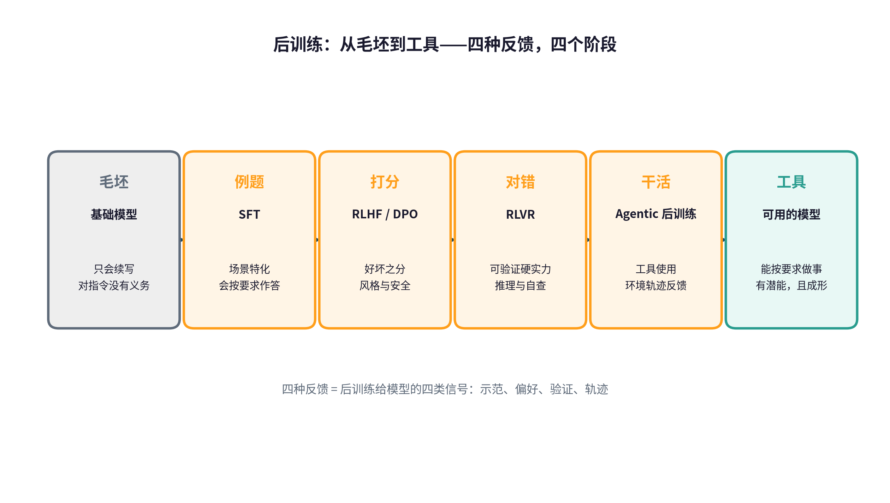

先看毛坯。毛坯不是没加工——预训练已经把它铸成有料的坯件；缺的是成形这道工序。一个只经过预训练的模型，像读过整个图书馆的人：什么都见过，但没学过“怎么跟人协作”。预训练的原始目标只有一个——预测下一个词。练成之后，模型对文字的理解远超你我，但对“问题”没有概念：你写“帮我写封请假邮件”，它接下去写的可能是邮件正文，也可能是另一句指令。对它来说，全部输入都只是“待续写的文字”。具体到使用，有四个表现：

- **对指令没有义务**：没有“任务要完成”的概念，只有“文字要继续”；
- **格式不受控**：同一个问题问两次，两次输出的结构可以完全不同；
- **不会拒绝**：不知道答案也会续写下去，因为它的目标只是“写得像”；
- **没有工具**：计算、检索、调用外部程序，全都没有概念，只能靠参数里记着的东西。

先记一件事：你用的所有对话产品都经过了后训练，直接把预训练模型当工具用几乎只出现在研究演示里。但从它开始看，后训练每一步装了什么才看得清楚。

> **跨篇分工**：《基座模型》第3章（炼灵）从算法角度讲 SFT/RLHF/DPO/GRPO 怎么算（损失函数、奖励模型、优化器更新）。本篇 §1.2-1.3只讲它们对使用者意味着什么；§1.4-1.5（RLVR 与 Agentic 后训练）是基座未展开的新内容。

## 1.2 SFT：场景特化 {#sec-SFT-场景特化}

第一种反馈是**例题**。给模型发一本例题册：收集某个场景的“输入-示范回答”对，一行是“问题”，下一行是“标准答案”，让模型继续做预训练最擅长的事——预测下一个词，只是这次，下一个词要沿着示范回答的方向走。这就是**监督微调**（Supervised Fine-Tuning，SFT）。

SFT 的本质是**特化**：把通用续写器特化成特定场景的工具。用对话场景的数据特化，得到会对话的工具；用代码场景的数据特化，得到按格式写代码的工具。学的是“这个场景里怎么做”——示范没覆盖的场景，模型照样不会。

**对使用者意味着什么**：产品的特化场景就是它的擅长边界。提示词按例题册的题型出题最有效——不少对话产品的示范数据就长成“角色 + 任务 + 要求”的样子，按这个形状写，模型更容易接住。SFT 的算法细节在这里不需要展开：损失函数与预训练相同，只是数据换成示范对。

SFT 有个天然短板：例题册里的答案都是“标准”的，它没告诉模型：两份都不标准的答案，哪份更好。下一道反馈补上这一课。

## 1.3 RLHF 与 DPO：偏好对齐 {#sec-偏好对齐}

第二种反馈是**打分**。有些科目没有标准答案——“写得好不好”“合不合口味”——这时候给模型看的是“好”与“坏”的对比。**基于人类反馈的强化学习**（Reinforcement Learning from Human Feedback，RLHF）：让模型先输出几个答案，请人给它们排序，再用这份“好坏标签”训练。模型学到的不是“标准答案长什么样”，而是“什么样的答案更符合人的期望”。

RLHF 的工程链条比较长（要训练一个单独的奖励模型），**直接偏好优化**（Direct Preference Optimization，DPO）把它简化成一步：直接拿“好答案 vs 坏答案”的对比数据更新模型，跳过奖励模型。两条路装上同一种能力：**好坏之分**——什么该说、什么不该说、什么风格讨人喜欢。

**对使用者意味着什么**：模型的“性格”在这一步定型——愿意帮你到哪一步、拒绝什么请求、说话什么腔调。对齐过头，模型容易变得啰嗦、爱加免责声明；对齐不足，容易口无遮拦。

## 1.4 RLVR：在可验证的任务上变强 {#sec-RLVR-可验证任务}

第三种反馈是**对错**——它只需要一条可验证的规则。数学题的答案对不对，可以验证；代码的测试过不过，可以验证。当“对错”能自动判定，就不需要人打分——让模型自己试，对了给奖励、错了没奖励，模型会自己长出一套“先想后答”的习惯。

这种训练叫**带可验证奖励的强化学习**（Reinforcement Learning with Verifiable Rewards，RLVR）：奖励信号来自可验证的规则（答案匹配、测试通过、格式合规），而不是人的偏好。最著名的案例是 DeepSeek-R1：只用 RL 加规则验证器、不提供任何人工推理示范，模型在训练中自己涌现出自我反思、验证、策略调整这些推理习惯——AIME 2024数学竞赛题的通过率从15.6%一路涨到77.9%，最终版本达到79.8%，论文登上 Nature。^[7]^Kimi k1.5 走同一条路：AIME 77.5分、MATH-500 96.2分，而且不需要蒙特卡洛树搜索、价值函数这些复杂组件。^[8]^

练投篮不需要教练，篮筐自己会告诉你进没进——RLVR 里的验证器就是篮筐。它装上的是**可验证任务上的硬实力**：多步推理、先算再答、算错了能回头。

**对使用者意味着什么**：会推理的模型和不会推理的模型，是两种工具。前者贵——每多想一步都要烧一笔“思考费”（业内叫 thinking tax）；后者便宜，简单任务用它更划算。什么任务值得付“思考费”，第5章的规划与成本节展开。

RLVR 也有边界：验证器本身会漏判。一项预注册实验证实，代码训练用的测试套件存在系统性假阳性，“奖励确实发给了仍带真实 bug 的代码”。^[9]^训练时奖励被钻空子，和运行时奖励被钻空子（第6章 Loopmaxxing）是同一类病，只是前者烧进了权重。

## 1.5 工具使用与 Agentic 后训练：学会用工具 {#sec-工具使用-后训练}

第四种反馈是**干活**。前三步都在纸上做题：读问题、想、写答案。真实任务要动工具——查数据库、跑代码、操作浏览器——干得好不好，环境会给反馈，整条轨迹就是答卷。让模型学会用工具，是后训练的第四步，也是它和 Agent 工程接壤的一步。

工具使用训练遇到一个独特难点：**奖励粒度**。一道数学题对不对，一个数就能判定；一次工具调用对不对，要看整条轨迹——选了哪个工具、参数填对没有、失败了有没有换路。粗粒度的“最终答案对错”给不了这么细的反馈。ToolRL 这项工作系统研究了这个奖励设计问题，用 GRPO（一种靠组内候选互相比较当基线的强化学习算法）加细粒度奖励训练，工具使用能力相对基座提升17%、相对 SFT 提升15%。^[10]^

再进一步，多轮 Agent 任务需要**步级奖励**——给每一步单独打分，而不是只看最终结果：SWEET-RL 用带全局信息的 critic（给动作打分的价值网络）给每步打分，8B 小模型在协作基准上能匹配 GPT-4o；^[11]^CAST 把游戏求解器的状态值变化当“教师信号”注入 RLVR。^[12]^

把这些串起来，就是后训练在 Agent 时代的核心公式：后训练 = f(数据，Harness 采样，验证器评测，优化器回灌)。

- **数据**：任务集合，决定训练范围的边界；
- **Harness 采样**：让模型在沙箱、浏览器、终端里跑出完整轨迹——训练时就已经在“用 Agent”了；
- **验证器评测**：规则或模型给轨迹打分，信号越细（轨迹级 → 步级 → 教师信号）越能教出复杂行为；
- **优化器回灌**：把信号写进权重，行为从“每次要人教”变成“模型自带”。

这条路线的实证还在扩展：技能的选择、利用、蒸馏也能用同一套 RL 一起训练——后训练与第8章的自演化在这里接壤。^[13]^

**对使用者意味着什么**：模型“会用工具”的程度写在它的训练配方里。选 API 时看工具调用能力的评测，而不是只看对话成绩；“会调用工具”和“调用得可靠”是两回事——前者是后训练的事（本章），后者是 Harness 的事（从第3章起）。

## 1.6 训练时与推理时：同一件事的两处落点 {#sec-训练时与推理时}

回顾后训练的本质：让模型在环境里试，用奖励修正行为。再看使用中的 AI：让模型在任务里试，用反馈修正下一步。**是同一个循环，落点不同**：

| | 训练时（后训练） | 推理时（Harness 循环） |
|:--|:--|:--|
| 行为从哪来 | 参数（权重） | 上下文 |
| 信号从哪来 | 验证器 / 奖励模型 | 工具返回、测试、用户反馈 |
| 学习写在哪 | 权重，学一次万人用 | 上下文，学一次用一次 |
| 成本 | 高（算力、数据） | 低（token） |

图2：同一个循环，两处落点——训练时烧权重，推理时写上下文

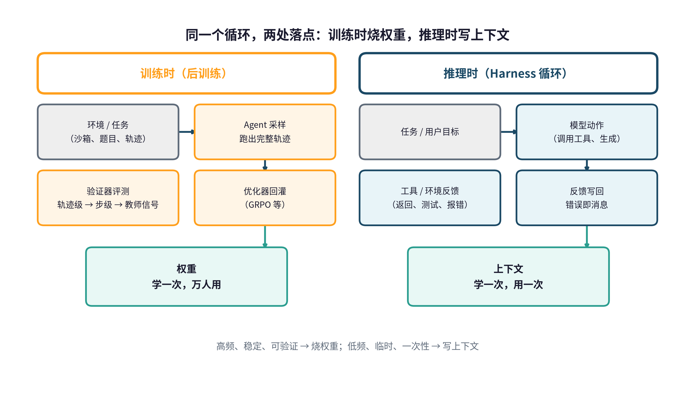

训练时用奖励把行为烧进权重，推理时用反馈把行为写进上下文——同一种“学好”，两处落点。两个落点互补：烧进权重的贵但普适，写进上下文的便宜但只用一次。第2章的眼镜会把同一个循环翻译成数学语言，第6章的护栏与验证会看到它俩的共同弱点。

怎么选：高频、稳定、可验证的任务，才值得烧进权重（微调）；低频、临时、一次性的任务，写进上下文（提示词 + 记忆）更划算。

> **想一想**：你的团队有一个每周要做的固定报表任务。烧权重还是写上下文？想清楚再对照上面的判据。

烧进权重不是没有代价——RLVR 会把策略的探索面收紧：一项研究发现，RLVR 后模型的语义分支多样性显著下降，能力变稳了，路也变窄了。^[14]^

两处落点合起来是一个正反馈环：训练时用 Harness 采样轨迹回灌权重（§1.5〔工具使用-后训练〕），推理时更强的模型又打开新的系统空间（第6章）。这个环在2026年有了自己的名字——模型-Harness 协同演进（model–harness co-evolution）：给当前模型搭好 Harness，用跑出来的、经过验证的轨迹去改进模型，模型变了再重搭 Harness，如此循环。它还从经验之谈变成了可落地的工程系统：HELIX 把循环里的每一步改造都做成可追溯、可审计的记录，一轮演化中候选 Harness 池比单个固定 Harness 多覆盖58%的可验证任务，同时顺势攒下数百条已验证的训练数据。^[15]^

## 1.7 AI落地

选模型、用模型的四条判据：

①**特化边界**——产品的特化场景就是它的擅长边界，提示词按例题册的题型出题（不少示范数据就长成“角色 + 任务 + 要求”的样子）；

②**会推理**——复杂、可验证的任务才值得付思考成本，简单任务用便宜模型（第5章有成本对照表）；

③**会工具**——选 API 看工具调用评测，别只看对话成绩；

④**该不该微调**——高频稳定才烧权重，低频临时用提示词加上下文，微调前先想清楚要什么（第8章讲边界）。

## 1.8 常见误解

**常见误解**：“后训练只是让模型更礼貌”。后训练装的是四种硬能力：场景特化（SFT）、好坏之分（RLHF/DPO）、可验证任务上的硬实力（RLVR）、工具使用（Agentic 后训练），每一种都直接决定你能用它做什么。

**常见误解**：“把我的数据微调一下，模型就懂我的业务”。除了判据④的高频稳定前提，还要算一笔更新账：大多数“懂业务”的需求，提示词加外部知识（检索）就能解决，而且随业务变化即时更新——烧进权重的知识改一次要重训一次。

**常见误解**：“推理模型一定更好”。推理模型贵在 thinking tax，简单任务用它是浪费；而且 RLVR 会收紧探索面。按步骤难度分配思考成本，才是常态用法。

## 1.9 本章回顾

这一章走完了“从有用到可用”，留下三样东西：四种反馈，一个公式，一条脊柱。

| 步骤 | 反馈 | 训练形态 | 模型得到 |
|:--|:--|:--|:--|
| SFT | 例题（示范） | 监督学习 | 场景特化 |
| RLHF/DPO | 打分（偏好） | 偏好学习 | 好坏之分 |
| RLVR | 对错（验证） | 强化学习 | 可验证任务上的硬实力 |
| Agentic 后训练 | 干活（轨迹） | 强化学习 + 环境反馈 | 工具使用 |

一个公式：Agent 类任务的后训练 = f(数据，Harness 采样，验证器评测，优化器回灌)（§1.2–§1.4的 SFT/RLHF/DPO/RLVR 是这条链的前置工序，不在这四项里）。一条脊柱：训练时烧权重、推理时写上下文。第一项立住了，接下来看第二项：能按要求做事的模型放进真实任务，为什么还会翻车？用什么眼镜看这个问题？第2章给答案。

**本章自检**：

1. 预训练模型的四个表现是什么？后训练四步分别补上什么？哪一步不在这四类里？ {#q-c1-un01}

2. SFT 为什么是“特化”？示范数据没覆盖的场景对模型意味着什么？提示词为什么按例题册的题型出题最有效？ {#q-c1-un02}

3. RLVR 的可验证奖励和 RLHF 的人类打分，本质区别在哪？这个区别为什么能让训练规模放大？ {#q-c1-un03}

4. 后训练 = f(数据，Harness 采样，验证器评测，优化器回灌)——四个因子各是什么？轨迹级、步级、教师信号三种奖励粒度各解决什么问题？ {#q-c1-un04}

5. “训练时烧权重、推理时写上下文”各自适合什么任务？为什么说 RLVR 会“收紧探索面”？ {#q-c1-un05}

   **你的场景**：挑一个你反复在做的任务——它有明确的对错判据吗？有，它是“烧权重”的候选；没有，你只能每次“写上下文”从头说服模型。你现在手上是哪种？

> **未解问题**：翻车的原因藏在任务结构里——用什么眼镜才能把它看清楚？

 * * * 

# 第2章：建模——从响应到闭环 {#ch-2}

第1章把模型从有用带到了可用：特化过场景、对齐过偏好、练出可验证任务上的硬实力、会用工具。从这一章起只干一件事：在可用之上把**系统可靠**与**使用有章法**两件事做进去——放进真实任务里做得稳（好用），还能控得住、查得清（驾驭）。

任务不会因为模型变强就自动变顺。信息看不全、动作有后果、反馈有延迟、长期与当下要权衡——这四件事由任务结构自带，模型变强不会让它们消失，改变的只是应对它们的本事。要看清它们，得先把任务**建模**出来：本章用的建模工具是 POMDP 七元组，后面叫它**这副眼镜**——戴上它，模糊的“为什么又翻车了”会变成七个可以逐个检查的部件。

> **本章路线**：本章围绕 POMDP 七元组、信念手算、Loop Engineering 与 RL 对照展开。


> **核心决策**：
>
> 1. Agent 是循环，不是一次性函数。
> 2. ==POMDP 把 Agent 的结构性困难拆成四条：信息不全、动作有后果、反馈有延迟、长期与当下的权衡。==
> 3. 多数“模型不够聪明”是信息不够——卡住时先看 $b_t$ 够不够集中，再怪模型。

> **开始前自检**：
>
> 1. 什么是状态、观测、动作？
> 2. 为什么 Agent 不能看到全部真实状态？

## 2.1 Agent 是循环，不是一次性函数 {#sec-Agent-是循环}

传统的模型调用是一次性函数：输入 $x$，模型算出 $y = f(x)$，结束。聊天机器人就是这样，问一句，答一句，答完就结束了。

Agent 不是一次性函数，而是一个循环：它观察环境、更新自己的判断、选择一个动作、执行（通常调用工具）、拿到反馈，再根据反馈调整下一步。一个任务可能要转几十圈、几百圈。

而且，Agent 永远看不到世界的全貌。它只能通过有限的窗口获取信息：用户说了什么、工具返回了什么、文件里写了什么、摄像头拍到什么。真实状态被遮住了，只能靠观察去猜。

这恰好是数学里早就研究过的问题：部分可观测马尔可夫决策过程（Partially Observable Markov Decision Process, POMDP）。一个 POMDP 由几个要素组成：

$$\text{POMDP} = (\mathcal{S},\ \mathcal{A},\ \mathcal{O},\ T,\ Z,\ R,\ \gamma)$$

逐个对应到 Agent 身上：

- $\mathcal{S}$：**$\text{State}$，真实世界状态空间**。Agent 通常看不到全貌。服务器里到底有哪些文件、用户真正的意图是什么、物理环境此刻是什么样，这些都属于 $\mathcal{S}$ 中的状态。
- $\mathcal{A}$：**$\text{Action}$，可执行动作空间**。回答、搜索、调用 API、写代码、移动机械臂。Agent 能做的事。
- $\mathcal{O}$：**$\text{Observation}$，观测空间**。Agent 实际可能看到的东西：用户输入、工具返回值、报错信息、传感器读数。
- $T$：**$\text{Transition}$，状态转移函数**。Agent 做了一个动作之后，世界怎么从一个状态变到下一个状态。Agent 不能直接决定结果，只能通过动作去影响——比如搜索了一个关键词，搜索引擎返回什么结果由世界决定，不由 Agent 决定。
- $Z$：**$\text{Observation Model}$，观测模型**。世界变了之后，Agent 能看到什么。观测往往带噪声、不完整——工具返回值可能截断、传感器读数可能有误差。
- $R$：**Reward，奖励**（目标）函数。任务完成得好不好，通常不是单步能给分的，要看一整条轨迹。
- $\gamma$：Discount Factor，折扣因子。越远的未来越不确定，远期收益在总回报中的权重要按它打折，这逼着 Agent 在当下收益和长期目标间权衡。

图3：POMDP 循环与七要素

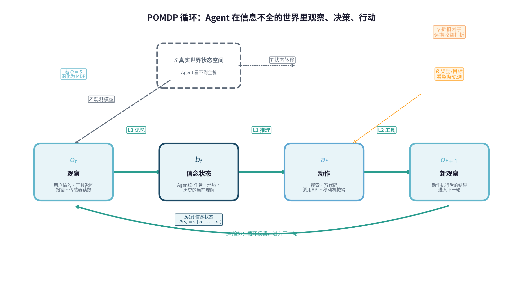

> **关键理解**：如果状态完全可见（$\mathcal{O}$ 足以恢复 $\mathcal{S}$ 中的真实状态），POMDP 退化为 MDP（马尔可夫决策过程）。但现实 Agent 几乎都面对信息不全的世界：用户意图是模糊的、工具返回可能出错、物理环境有噪声。所以用 POMDP 而不是 MDP 来看 Agent，更贴近真相。

## 2.2 信念状态：手算一遍贝叶斯更新 {#sec-信念状态-贝叶斯更新}

> **阅读提示**：本节是全篇数学密度最高的一节。手算值得跟一遍；卡住也可先跳到 §2.3〔循环-五要素〕，后续章节不依赖这里的计算细节。

还有一层更深的结构。因为真实状态 $s_t \in \mathcal{S}$ 不可观测，Agent 无法直接知道自己“在哪儿”，只能根据观测来猜——猜的方式是给每个可能的状态估一个概率，这就是**信念状态**（belief state）：$b_t(s) = P(s_t = s \mid o_1, o_2, \ldots, o_t)$，根据至今为止的所有观测，推断当前状态的概率分布。记忆系统维护的，不是原始数据本身，而是这个信念状态的工程近似——这不只是为了记着方便，更是因为**不记就不知道自己在哪**。这把 POMDP 和后面的记忆层（Harness 六层里的第3层，见第3章）在数学上连了起来。

> **想一想**：客服 Agent 只记得第2轮的话、忘了第1轮，推断会差多少？先凭直觉猜一个数（差一点？差很多？），再往下算。

**手算一遍**：客服 Agent 的信念更新

场景：一个客服 Agent 要判断用户的真实意图。真实状态 $s \in \mathcal{S} = \{\text{退款},\ \text{换货},\ \text{咨询}\}$，Agent 看不到 $s$，只能从用户的话（观测 $o$）去猜。

**初始信念**（用户刚进来，什么都没说）：$b_0 = [0.3,\ 0.3,\ 0.4]$——稍微偏向“只是咨询”。

**第1轮**。用户说：“买的东西有问题”（观测 $o_1$）。观测模型 $Z(o_1 \mid s)$ 告诉我们：真正想退款的人有80%概率说这话，想换货的有60%，只是咨询的有20%。

$$Z(o_1 \mid \text{退款}) = 0.8,\quad Z(o_1 \mid \text{换货}) = 0.6,\quad Z(o_1 \mid \text{咨询}) = 0.2$$

用贝叶斯规则更新信念：

$$b_t(s) = \frac{Z(o_t \mid s_t) \cdot b_{t-1}(s)}{\sum_{s' \in \mathcal{S}} Z(o_t \mid s') \cdot b_{t-1}(s')}$$

也就是 $b_1(s) \propto Z(o_1 \mid s) \cdot b_0(s)$。

| 状态 | $b_0(s)$ | $Z(o_1\mid s)$ | 乘积 | 归一化后 $b_1(s)$ |
|:---:|:---:|:---:|:---:|:---:|
| 退款 | 0.3 | 0.8 | 0.24 | **0.48** |
| 换货 | 0.3 | 0.6 | 0.18 | **0.36** |
| 咨询 | 0.4 | 0.2 | 0.08 | **0.16** |
| | | | 和 = 0.50 | |

一句话观测让“退款”从30%跳到48%，“咨询”从40%跌到16%。Agent 现在最倾向“退款”，但还不够确定（没有超过50%）。策略 $\pi(b_1)$（按当前信念选动作的规则）选择动作：**追问**（“您是想退款还是换货？”）——因为信念还不够集中，贸然行动风险大。

**第2轮**。用户回答：“能不能换一个”（观测 $o_2$）。

$$Z(o_2 \mid \text{退款}) = 0.1,\quad Z(o_2 \mid \text{换货}) = 0.9,\quad Z(o_2 \mid \text{咨询}) = 0.3$$

从 $b_1$ 出发更新：$b_2(s) \propto Z(o_2 \mid s) \cdot b_1(s)$。

| 状态 | $b_1(s)$ | $Z(o_2\mid s)$ | 乘积 | 归一化后 $b_2(s)$ |
|:---:|:---:|:---:|:---:|:---:|
| 退款 | 0.48 | 0.1 | 0.048 | **0.11** |
| 换货 | 0.36 | 0.9 | 0.324 | **0.77** |
| 咨询 | 0.16 | 0.3 | 0.048 | **0.11** |
| | | | 和 = 0.42 | |

两轮观测后，“换货”从初始的30%升到 **77%**。策略 $\pi(b_2)$ 现在选择动作：**给出换货流程**——信念足够集中，可以行动了。

**三点结论**

- **记忆为什么是必需的**：第2轮更新从 $b_1$（而非 $b_0$）出发。如果 Agent 忘了第1轮（$b_1$ 丢失），就只能从 $b_0$ 直接用 $o_2$ 更新：$b_0 = [0.3,0.3,0.4]$，逐状态乘似然 $Z(o_2 \mid s) = [0.1,0.9,0.3]$ 得 $[0.03,0.27,0.12]$，归一化后是 $[0.07, 0.64, 0.29]$——换货的后验只有64%而非77%，虽然仍会行动，但置信度明显更低、决策更脆弱。**不记就不知道自己在哪**，字面意思。
- **策略为什么基于 $b_t$ 而非 $s_t$**：Agent 始终不知道用户“真的”想干什么（$s_t$ 不可见），只能基于信念 $b_t$ 做决策。$b_1$ 时选择追问（信息不够），$b_2$ 时选择行动（信息够了）——同一个策略，不同的信念，不同的动作。
- 这就是 L3 记忆层的数学职责：维护 $b_t$，让每一轮决策都基于至今为止的全部观测，而非只看最后一句。

## 2.3 Loop Engineering：循环的五个要素 {#sec-循环-五要素}

这副眼镜把 Agent 难在哪里拆成了几个清晰的部件：

- **观测不全**（观测 $o_t \in \mathcal{O}$ 不等于真实状态 $s_t \in \mathcal{S}$）→ 需要记忆和检索来补全判断；
- **动作有后果**（$a_t \in \mathcal{A}$ 经 $T$ 改变世界）→ 需要工具契约和约束来兜住风险；
- **反馈有延迟、有噪声**（$R$ 和 $Z$）→ 需要状态管理来把对的反馈带进下一步；
- **长期与当下的权衡**（$\gamma$）→ 需要规划来平衡。

Claude Code 的开发者 Boris Cherny 说了一句话，在技术社区迅速传开：“我不再给 Claude 写提示词了。我写好一个个运行着的循环，让循环去提示 Claude 并让它自己搞清楚该做什么。我的工作就是写循环。^[16]^”

这种做法被概括为 Loop Engineering（循环工程），它的五个要素和 POMDP 循环大部分对应：明确的目标（$R$）、上下文管理（对状态与信念状态的维护）、可调用的工具（$\mathcal{A}$ 的工程接口）、对产出的评估（$o_t$ 的解析）、判断何时停止的标准。

其中第五个要素值得单说：严格讲，POMDP 七元组本身不含终止条件——任务规范可以包含**有限 horizon**（finite horizon，任务在预先设定的最大步数内一定会结束）、吸收态（absorbing state，到达后任务即终结、不再产生后续动作的状态）或外部停止规则，但这些都得工程系统显式写出来，不能靠模型“自觉觉得该停了”。

从“人写提示词、Agent 执行一次”到“人设计循环、Agent 自主迭代多轮”。

## 2.4 循环是推理时的强化学习 {#sec-循环即强化学习}

再深一层看，一个设计良好的 Agent 循环，在结构上等同于一个运行在推理时的强化学习优化过程——只是策略权重被冻结。^[17]^这是第1章“训练时烧权重、推理时写上下文”在推理时一侧的又一处落点。先给一句话版：权重冻结的模型，靠往上下文里攒经验变强；奖励就是测试与检查器；越往后每步代价越高。不想记术语，记住这一句就够——下面的逐项对照，是给想对齐符号的读者准备的：

| RL 概念 | Agent 循环中的对应 |
|:---:|:---|
| 策略 $\pi$ | 以不断累积的上下文为条件的冻结 LLM |
| 状态 $s_t$ | 第 $t$ 步的上下文窗口内容 |
| 动作 $a_t$ | 模型的生成输出（代码编辑、工具调用、消息） |
| 环境 | 工具、文件系统、测试运行器——产生观测的任何东西 |
| 奖励 $r_t$ | 验证信号（测试通过、lint 检查通过、指标改善） |
| 折扣 $\gamma$ | 隐含在循环预算里——越往后的步骤成本越高、成功率越低 |
| 回合 | 一次完整的循环执行，从目标设定到终止 |

这张表底下的数学是 Bellman 方程：一步的价值 = 即时奖励 + 折扣 × 下一步的价值；折扣 $\gamma<1$ 让对应迭代收缩到唯一不动点——循环能稳定改进而不是越滚越乱，靠的就是这条（Ye 2026^[117]^）。

关键区别在于：训练时 RL 通过梯度更新策略权重；循环工程里权重不动，“学习”纯粹通过**状态累积**发生——每轮的观测、错误信息、反思都被追加进上下文，作为同一个冻结模型的条件，让它在后续轮次产出更好的动作。这正是 Reflexion 的机制：Agent 跨轮次改进不靠新权重，靠读自己的失败历史。^[18]^

既然循环是推理时 RL，RL 的经典陷阱就会在循环中重现：奖励设计不当导致 reward hacking（Agent 满足了检查的字面要求却违背了意图，比如删掉失败的测试让 CI 变绿）；探索-利用失衡导致循环重复同一种失败路径（RL 里叫探索不足：探索＝多试不同路线，利用＝反复走已知最好那条，失衡就是探索太少。补救办法有两个：让模型自省（类似 Reflexion），或抬高采样温度——温度是控制每步输出随机性的旋钮，调高就更容易试出新路线）；长程信用分配困难（循环越长，越难判断哪一步导致了最终成败）。第6章会看到，这些陷阱恰好落在评估层和护栏层的缺口里。

## 2.5 这副眼镜的边界 {#sec-这副眼镜的边界}

后面六章，本质上都是在回答：怎么把这个闭环的每个部件搭稳。假设每步出错率仅5%，20步任务的端到端成功率 = $0.95^{20} \approx 36\%$；50步 = $0.95^{50} \approx 8\%$。步数越多，翻车越确定——这不是“Agent 偶尔出错”，而是结构性必然。后面六章的所有工程手段（编排、护栏、评估、记忆），都是在把每步出错率从5%压到0.5%，或把50步拆成5个可回滚的10步。Agent 的差距，不在单步推理多准，而在“能不能把每一步的反馈，正确地带进下一步”。

> **透镜边界**：POMDP 是一副透镜，用来理解 Agent 的**结构性困难**（信息看不全、动作有后果、反馈有延迟、长期与当下的权衡），不是所有 Agent 问题的万能解释。它真正发力的地方在第6章（长程任务的行为状态衰减，见 §6.2记忆层）和第7章（多 Agent 失败根因的跨节点传播——出错的源头往往不在错误暴露的位置）。至于它怎么用在每天的失败归类上，见下面“常见误解”第三条。

## 2.6 常见误解

**常见误解**：“上下文窗口里的信息，就是 Agent 知道的全部”。上下文窗口承载的是观测历史和由此推出的判断，不是真实状态。服务器里到底有哪些文件、用户真正的意图是什么，这些属于 $\mathcal{S}$，Agent 永远看不到——它只能通过观测去猜自己“在哪儿”。

**常见误解**：“记忆就是把历史对话存下来”。记忆层（L3）维护的是**信念状态** $b_t$——对“现在处于什么状态”的概率判断，不是原始对话的堆叠。手算那一段已经算过：第2轮从 $b_1$ 出发得到77%，若丢掉 $b_1$、从初始信念重算只有64%——差的这13个百分点，正是“存历史”与“存判断”的区别。

**常见误解**：“POMDP 是纯理论，工程上用不上”。两个方向都要说。它的价值不在解释每一个 bug，而在**归类**：第6章的四类失效（跳步、工具调用错误、不分类型、错误传播），理解起来不需要 POMDP，但把它们各挂到七元组的一个元件上（$T$/$A$/$Z$/$b_t$），该补哪一块就清楚了。反过来，七元组本身不含终止条件——这个“理论漏掉的东西”，恰恰是工程必须显式补上的第一件事。

## 2.7 本章回顾

这一章给了三样能带走的东西：一副眼镜（POMDP 七元组）、一个判断（信念状态 $b_t$）、一张工程清单（Loop Engineering 五要素）。

其中2.3那四条（观测不全、动作有后果、反馈有延迟、长期权衡）不是并列的知识点，而是后面六章的目录：每一条对应一类工程手段，第6章会看到它们各自的缺口。而一个设计良好的循环，结构上等同于推理时的强化学习：权重冻结，靠往上下文里攒经验变强；于是 RL 的老陷阱（reward hacking、探索不足、信用分配）会在循环里原样重现。第3章把这副眼镜换成装配图：六层分别是什么，层与层之间怎么接。

**本章自检**：

1. POMDP 的七个要素是什么？每个在 Agent 语境中对应什么？为什么用 POMDP 而非 MDP？ {#q-c2-un01}

2. 信念状态 $b_t(s)$ 是什么？为什么记忆层（L3）维护的是信念状态而非原始数据？ {#q-c2-un02}

3. Loop Engineering 的五个要素分别对应 POMDP 的什么？为什么 POMDP 七元组本身不含终止条件？ {#q-c2-un03}

4. 假设每步出错率仅5%，20步和50步任务的端到端成功率各是多少？这个计算揭示了什么？ {#q-c2-un04}

   **你的场景**：你手上最长的一条 AI 任务大概几步？按每步5%出错率算它的成功率——你现在靠什么把它压回来？

> **未解问题**：看清楚了结构上的困难，怎么把这个闭环装成一台不翻车的机器？

 * * * 

# 第3章：装配——从零件到系统 {#ch-3}

第2章的眼镜把真实任务拆成了七元组，落到体感上是四件事：信息看不全、动作有后果、反馈有延迟、长期与当下要权衡。第1章又装好了模型：特化过、对齐过、练过、会用工具。现在问题来了：有能力的模型 + 有结构的任务，怎么配成一台不翻车的机器？

> 零件怎么装成机器？答案是一套六层结构——推理、工具、记忆、编排、评估、护栏——合起来就是引子定义的 Harness。先有零件清单，再有装配图，然后是装配后的运转，最后落到一张选型地图（该不该用、怎么加码）。

> **本章路线**：先从能力清单走到 Harness 六层，再看数据流与选型地图。


> **核心决策**：
>
> 1. ==Harness 六层 = 推理、工具、记忆、编排、评估、护栏。==
> 2. 数据流 $o_t \to b_t \to a_t \to o_{t+1}$ 把六层串成闭环。
> 3. 选型地图决定该不该用 Agent、怎么加码。

> **开始前自检**：
>
> 1. 能力清单和装配图有什么区别？
> 2. 为什么只有模型还不够？

## 3.1 能力维度：模型带来的零件 {#sec-能力维度-模型零件}

第1章的四种反馈把能力装进了模型，但 Agent 还需要更多。OpenAI 科学家 Lilian Weng 在一篇被广泛引用的博文里提出的经典框架把 Agent 拆成四个能力模块<sup>[120]</sup>：大语言模型（推理）、规划、记忆、工具使用。其中推理和工具使用由第1章的后训练装进权重，规划和记忆更多靠系统在运行时撑起来。这个框架简洁、清晰，至今仍是入门的标准锚点。

但这个框架本质上是**能力清单**——它告诉你 Agent 需要哪些能力，却没有回答另一个更紧迫的工程问题：这些能力怎么被装进一个不会翻车的系统？一个有记忆、有工具、会规划的 Agent，照样会在长任务里遗忘、在工具调用中出错、在多步执行里累积误差。清单只列出了零件，却没有给出装配图和质检流程——而生产级 Agent 的可靠性，恰恰来自装配和质检，不只是零件本身。

## 3.2 系统维度：Harness 六层 {#sec-Harness-六层}

行业实践给出了装配图。O'Reilly 发布的 AI Agents Stack 把生产级 Agent 拆成六层。这套六层结构就是 Harness 的推荐架构^[19]^，从底到顶依次是：

| 层 | 名称 | 职责 | POMDP 对应 |
|:---:|:---|:---|:---|
| L1 | 推理 | 调用模型完成理解和决策 | 策略 $\pi: b_t \to a_t$ 的近似（$b_t$ 为信念状态） |
| L2 | 协议与工具 | 经 MCP、A2A 等协议调用外部 API、浏览器与代码执行器 | 动作 $a_t$ 的执行通道 |
| L3 | 记忆与知识 | 存取窗口状态、历史、偏好与领域知识 | 信念状态的维护与历史压缩 |
| L4 | 编排 | 组合模型调用、工具使用和控制流 | 状态转移 $T$ 的工程化控制 |
| L5 | 评估与可观测 | 追踪执行轨迹、评分输出、捕捉退化 | 观测 $o_t$ 的解析与奖励 $R$ 的估计 |
| L6 | 护栏与安全 | 过滤输入、授权工具调用、验证输出 | 约束：不安全动作在执行层被拒绝 |

表里出现了两个协议名词，先认识一下：**MCP**（Model Context Protocol，模型上下文协议）管 Agent 和工具之间怎么连接——工具如何声明能力、参数如何校验、返回值如何结构化；**A2A**（Agent2Agent Protocol）管 Agent 和 Agent 之间怎么协作——身份如何声明、任务如何委派。MCP 的契约思想会在第6章的五步管道里再次出现；两者在多 Agent 协作（第7章）里还有一次系统性对照。

这六层是生产级 Agent 的推荐架构——少任何一层，系统就会在对应环节有翻车风险：没有 L5 评估，就不知道 Agent 在第几步走偏了；没有 L6 护栏，Agent 调用的工具可能已经造成了不可逆的伤害。简单的单步任务可以只用 L1+L2，但任务越复杂、步数越多、不可逆性越强，六层齐备就越不是可选项。

> **常见误解**：Harness 六层 = 能力清单。不是。能力清单回答“Agent 需要哪些零件”（Lilian Weng 的四能力：推理、规划、记忆、工具）；Harness 六层回答“这些零件怎么装成一台能稳定产出的机器”（多了编排、评估、护栏三层）。清单列出零件，Harness 六层给出装配图和质检流程。把 Harness 六层当清单读，会漏掉最关键的一层——护栏——因为它不是“能力”，是“约束”。

**关切路线图**：四个能力关切——规划、工具、记忆、协作——加上新的前沿（自演化），分别落在哪一层、在哪一章展开：

| 关切 | Weng 四能力锚点 | Harness 六层落点 | 本章位置 |
|:---:|:---|:---|:---|
| **规划** | Planning | L4 编排 | 第5章《实施——从规划到落成》 |
| **工具** | Tool Use | L2 工具 | 第3章 Harness 六层定义 + 第6章失效二 |
| **记忆** | Memory | L3 记忆 | 第6章记忆层 + 上下文工程子节 + 领域知识备料 |
| **协作** | —（Weng 未覆盖） | 跨栈，L4 主导 | 第7章《协作——从单循环到多循环》 |
| **自演化** | —（新前沿） | 跨栈的元层次 | 第8章《自演化——从搭建到成长》 |

> **学术对照**：一篇投稿 TMLR、尚在评审、覆盖170余个项目的综述提出了 ETCLOVG 七层分类（执行环境、工具接口、上下文管理、生命周期编排、可观测性、验证、治理）。^[2]^它和 Harness 六层大致对应，但不是一一同构：ETCLOVG 的可观测性不只覆盖 Harness 六层的 L5 评估，也涉及 L4 运行时监控；验证和治理则更强调形式化验证、审计追踪和责任归属。本章以 Harness 六层为主透镜，在第6章讨论评估、护栏和治理缺口时参考该分类。

**典型实例**：Pi 把 Harness 六层落实到代码

开源项目 Pi（π）是这套框架的一个干净实现，六层各有明确模块：推理层抽象多厂商模型接口并管 token 预算；工具层把“错误即消息”贯彻进调用链（第6章的五步管道即源于此）；记忆层做上下文组装与紧凑压缩；编排层用显式状态机管理循环，终止条件显式可配——正常完成、预算耗尽、连续失败熔断三类；评估层追踪每轮输出、可接验证门；护栏层按项目分级授权，越界动作先审批后执行。整个项目不到5000行——“最小内核”，不重复发明轮子。想理解框架，跟踪一遍它的代码执行路径，比读十篇框架文档更有效。

图4：Harness 六层——每层职责与一个对应的工程动作
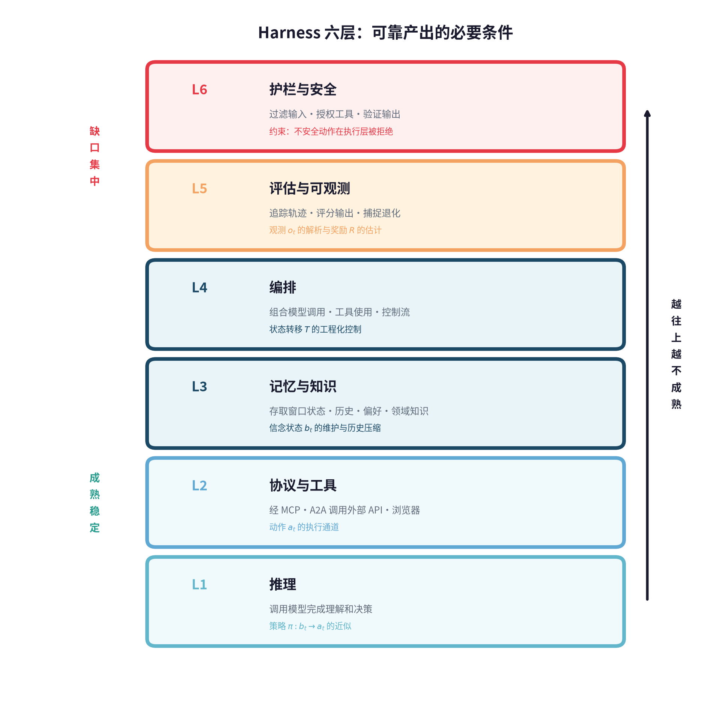

## ▽ 3.3数据流：闭环的数学表达 {#sec-数据流-闭环}

Harness 六层不是孤立的零件堆叠，而是通过数据流串成一个循环。用 POMDP 的语言写出来：

$$o_t \xrightarrow{\text{L3 记忆}} b_t \xrightarrow{\text{L1 推理}} a_t \xrightarrow{\text{L2 工具}} o_{t+1}$$

- $o_t$：**当前观测**，用户输入、工具返回、报错、传感器读数；
- $b_t$：**信念状态**，Agent 对任务、环境、历史的当前理解，由 L3 记忆维护；
- $a_t$：**动作**，搜索、写代码、调用 API、移动机械臂，由 L2 工具执行；
- $o_{t+1}$：**新观测**，动作执行后的结果，进入下一轮。

L4 编排不在这个箭头链上——它是**控制整个循环节奏的控制层**：何时调用 L1、何时重试、何时中断、何时升级给人类。这个循环就是 Agent 的运行节奏。每一轮，推理引擎都要重新评估：目标变了吗？环境变了吗？工具返回的结果可信吗？下一步该调整计划吗？

**走一遍**：编码 Agent 修 bug 的第3轮循环

任务：“修复 utils.py 的失败测试”。前两轮分别试了改正则和改边界，仍然失败。现在是第3轮。

表里 $c$ 指当前上下文（用户权限、任务阶段、风险等级这类护栏要看的条件），$\mathcal{A}_{\text{safe}}(c)$ 是“在这套条件下允许生效的动作集合”，§6.4展开；表中的0.7是示例阈值，实际取值由你的项目定。

| 层 | 做什么 | 具体数据 |
|:---:|:---|:---|
| L5 评估（$o_t$ 观测进入） | 上一轮测试输出 | `FAILED test_parse_date: expected '2024-01-01', got '01/01/2024'` |
| L3 记忆 → $b_t$ | 组装信念状态 | `{task: "修 utils.py", history: [t=1 改正则→失败, t=2 改边界→失败], error: "日期格式不匹配", fail_count: 2}` |
| L1 推理 → $a_t$ | 基于 $b_t$ 决策 | 判断：“不是正则问题，是 strptime 格式串错了”。选择动作：`edit_file(utils.py, L42, '%m/%d/%Y' → '%Y-%m-%d')` |
| L6 护栏 | 检查 $a_t \in \mathcal{A}_{\text{safe}}(c)$？ | edit_file：写权限 ✓，风险0.2 < 0.7 ✓，无需审批 → **放行** |
| L2 工具 | 执行动作 | 调用文件编辑 API，修改第42行 |
| $o_{t+1}$（新观测） | 工具返回 | `"utils.py L42 updated: '%m/%d/%Y' → '%Y-%m-%d'"` |
| L4 编排 | 控制下一步 | 编辑成功 → 调度下一轮：运行测试（$t=4$）。若再失败且 fail_count=3 → 触发“重新理解问题”状态 |

六层各管一件事：L5 从测试输出里读出“日期格式不匹配”这条关键信息，L3 记住“前两次改了什么、为什么失败”，L1 基于历史做出新判断，L6 确认动作安全，L2 执行，L4 决定下一步走哪条边。如果 L3 丢了历史（忘了第1轮已经改过正则），L1 可能再改一次正则——**循环在原地转**。

工程原则“错误即消息”：上面第3轮里，如果 `edit_file` 执行失败（比如文件被锁），会发生什么？朴素做法是抛异常、中断循环。但 POMDP 循环的正确做法是：**把失败当作一条观测 $o_{t+1}$**（“文件被锁，编辑未成功”），回写上下文，让 L1 在下一轮基于这条信息做新决策（换个文件？等一等？求助人类？）。Pi 开源运行时的工具管道把这条原则写进了架构：工具执行失败不是异常（exception），而是一条格式化的消息（message），和成功返回走同一条注入路径。这就是 POMDP 循环最深刻的工程含义：没有“失败”这回事，只有“观测到了什么”。第6章四类失效里的“错误传播”，本质就是把“错误观测”当成了“系统异常”。结果是中断循环，而非把信息带进下一轮。

循环不能永远转下去——**什么时候该停？**

循环怎么停？stopReason 是刹车，不是“跑完就停”：L4 编排层的一个核心职责是给循环装刹车。Pi 实现了三种显式终止信号：`end_turn`（模型判断任务完成——对应 POMDP 的吸收态）、`max_turns`（步数上限——对应有限 horizon）、`error_budget`（连续失败超阈值——对应 L4 的失败回退规则）。没有 stopReason 的 Agent 就是没有刹车的车——要么永远转下去（死循环），要么在某个不可逆动作上冲出去（失控）。工程系统必须把停止规则显式写出来，不能靠模型“自觉觉得该停了”。

图5：Agent Loop 运行时剖面（内层4盒、stopReason 三态、循环上限20）

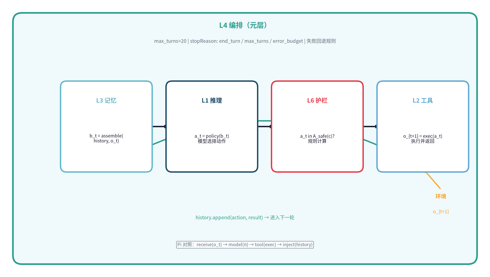

> **典型案例**：自动驾驶汽车就是一个具身 Agent。摄像头是“感官”（$o_t$），方向盘和油门是“工具”（$a_t$），而车载计算平台就是执行环境。它必须在毫秒级完成感知、决策、执行的循环，任何延迟都意味着物理危险。编排层（L4）负责保证这个循环不跑偏：检测到动作原地打转就打断，发现超时就在安全边界内终止，遇到异常就回滚或求助人类。

## 3.4 选型地图：该不该用，怎么加码 {#sec-选型地图}

**该不该用**：不是所有任务都需要闭环。判据：单步问答/生成（翻译一句话、写一段摘要）→ 直接调模型；需要多步工具调用或跨系统操作 → Agent；需要跨会话记忆或持续运行 → Agent；需要人在环中审批不可逆动作 → Agent。过度 Agent 化的代价是真实的：每多一层编排，延迟、成本、失效面都乘上去。能用一次模型调用解决的事，不要套循环。

**怎么加码**：用上 Agent 之后，想在同一个模型上更好，有三条路，各解决一类问题：

| 轴 | 是什么 | 解决什么 | 展开 |
|:--|:--|:--|:--|
| **结构** | 规划形态、状态机 | “不做错”——把流程显式写出来 | 第5章 |
| **努力度** | Effort——推理深度旋钮（让模型多想） | “想不够”——复杂步骤多付思考成本 | 第5章成本节 |
| **外置流程** | Skill（把稳定流程固化成可复用手册，用时读进上下文） | “记不住流程”——高频流程不再每次重想 | 第5章 Skills 节 |

## 3.5 AI落地

Harness 六层是生产级 Agent 的架构清单。真实产品里，先问自己三个问题：

①任务需要几步闭环？单步问答就别套 Agent；

②闭环缺哪层？评估与护栏是最容易缺的两层（第6章的失效分布按层展开）；

③用哪个模型？不是“最强”而是“哪个模型配哪个系统”。与之配套的落地节奏，是从“最小闭环”起步——L1+L2 先跑通，再按翻车点逐层补 L3-L6，而不是第一天就上全套。源文献的提醒同向：Agent 只是调用一个模型和几个工具时，并不需要 LangGraph——一个 Provider SDK 加几次工具调用就能上线。^[19]^

## 3.6 常见误解

**常见误解**：“Agent 是模型的一种模式，套上就自动变可靠”。不是——Agent 不是模型的开关，是模型外面的工程系统。同一个模型，配不配闭环、配什么闭环，产出天差地别：ARC-AGI-3 上同一套权重，只改记忆和上下文管理，公共测试集得分就从13.3%跳到38.3%（详见引子）。另一个误解是“Agent 就是会调工具的模型”——会调工具只是 L2 工具层，缺 L3 记忆会遗忘，缺 L4 编排会跳步，缺 L5 评估会盲改，缺 L6 护栏会失控。

## 3.7 本章回顾

引子的 ARC-AGI-3 实验说明“模型不变，系统改变结果”；本章把“系统”拆成看得见的零件——L1 推理、L2 工具、L3 记忆、L4 编排、L5 评估、L6 护栏，通过数据流 $o_t \to b_t \to a_t \to o_{t+1}$ 串成闭环，L4 编排是控制节奏的刹车（stopReason），选型地图回答了该不该用、怎么加码。记住一句话：Agent 不是更聪明的模型，是配好闭环的系统。零件会装了，下一个问题是人和机器之间怎么分工——控制权给多少、在哪里踩刹车。

**本章自检**：

1. Lilian Weng 的四能力框架是什么？它和 Harness 六层是什么关系？ {#q-c3-un01}

2. Harness 六层各层的 POMDP 对应是什么？数据流 $o_t \to b_t \to a_t \to o_{t+1}$ 各经过哪几层？L4 编排在箭头链上的角色是什么？ {#q-c3-un02}

3. “错误即消息”是什么含义？工具执行失败时，正确的做法是什么、为什么？ {#q-c3-un03}

4. Agent 循环为什么必须有显式终止条件？正常完成、预算耗尽、失败熔断各拦截什么风险？没有终止条件的 Agent 会怎样？ {#q-c3-un04}

5. 什么时候该用 Agent、什么时候不该用？过度 Agent 化的代价是什么？三轴加码（结构/努力度/外置流程）各解决什么问题？ {#q-c3-un05}

   **你的场景**：挑一个你正在用 AI 做的任务，先问“它的成功信号能被自动判定吗”——判不了的话，Agent 化只会让它转得更久。判得了，再看三轴里你缺哪一根。

> **未解问题**：机器装好了，人和机器之间控制权怎么分？

 * * * 

# 第4章：授权——从受命到自主 {#ch-4}

第3章把机器装好了：零件齐、装配图有、刹车也装了。机器能干活了，但人和它之间还有一个决定性的问题：给多少自主权？这一步定错，能力越强的系统翻车越贵。

> 人和机器的分工有四种控制范式：命令、目标、意图、受约束自主。核心区分是内建约束与外挂规则——前者写进执行层，未获允许的动作无法生效；后者写在提示词里，模型可以不理会——前者更硬。

> **本章路线**：先看清四种控制范式，再回答三个实际问题——怎么判断该用哪一种、自主度选完会怎么变、为什么每步都问反而更危险。


> **核心决策**：
>
> 1. 控制权不是零和，而是约束与自主同步升级。
> 2. 受约束自主 = 约束内自主、关键节点人审批。
> 3. 权限系统写死，不靠模型自觉。

> **开始前自检**：
>
> 1. 你希望 AI 多大程度自主？
> 2. “无人值守”和“受约束自主”有什么区别？

人和机器的控制权分配有四种控制范式，目标处理能力与自主度同步递进、约束同步变硬（下表）：**命令控制**（人下达每一步指令）→ **目标控制**（人给目标，Agent 自己规划）→ **意图控制**（人给模糊意图，Agent 补全并执行）→ **受约束自主**（Agent 在预设安全边界内持续自主运行，自主发现并跟随目标）。

这个过程不是所有领域同步推进——不同领域处于不同阶段，但**升级不是无条件的**：Agent 走得越远，约束必须越硬。工程上通行的做法是硬约束不必一开始把所有可能性堵死，设计原则是堵不如疏、最小权限^[111]^、动态边界：
- 正常运行时，Agent 自主推断、自主推进，人不打扰；
- 只有当 Agent 偏离或违背人的真实意图、或触碰风险边界时，硬约束才发挥作用，把动作挡在边界外。

## 4.1 四种控制范式 {#sec-四种控制范式}

| 控制范式 | 目标在系统这一侧 | 系统责任 | 风险 | 由哪一章展开 |
|:---:|:---|:---|:---|:---|
| **命令控制** | 不理解目标，只接显式指令 | 执行每一步 | 用户承担规划 | — |
| **目标控制** | 明确给定 | 自己规划步骤 | 规划失败 | **第5章** |
| **意图控制** | 欠定，需要交互补全 | 补全目标并执行 | 猜错意图 | **第5章** |
| **受约束自主** | 可在边界内自主发现、跟随（含演化） | 持续行动、自我修正 | 越权、失控、级联失败 | **第6、8章** |

四个范式沿同一条轴递进：**目标能被处理到什么程度**——命令控制里系统还不知道目标，只能照显式指令执行；目标控制里目标被明确给出；意图控制里目标欠定，需要交互补全；受约束自主里，系统能在边界内自主发现并跟随目标——目标本身也可以演化，只要变化落在预设边界内、越界能回到人。

最后一列是本章对后面几章的分工：这几章不是各自独立的主题，而是这张表里不同范式的展开。

图6：四种控制范式——自主度递进，约束同步变硬

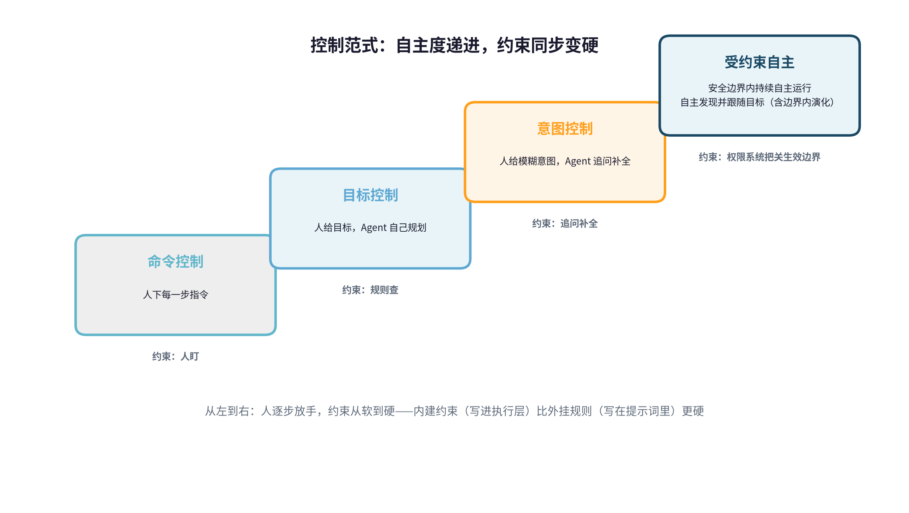

命令控制的世界里，系统还不知道目标，只接得住显式指令：输入是确定的，输出是确定的，错误也是确定的。意图控制的世界里，**意图本身是模糊的**。

比如用户说“帮我安排下周的出差”，Agent 需要补全的信息包括：去哪里？去几天？预算多少？偏好高铁还是飞机？酒店要离会场近还是离机场近？这些缺失信息不能乱猜，猜错了代价很大。所以意图控制的核心能力不是“执行”，而是**意图补全**：通过追问、通过历史偏好推断、通过常识推理，把模糊的意图转化为明确的目标，再进入目标控制阶段。

而受约束自主是正在成形的第四种范式。Agent 不再是执行单次任务，而是在安全边界内持续运行：自主发现并跟随目标，自己监控环境、自己调整计划、自己决定何时求助人类。风险也从“单步出错”升级为“越权、失控、级联失败”。

受约束自主和**目标控制加外挂规则**有什么区别？一句话：前者的约束写进执行层——权限、参数校验、审批在动作生效之前判定，未获允许的动作不会产生任何效果；后者的约束写在提示词里，依赖模型自己克制，模型可以不理会。两种系统里模型都能提出任何动作：动作接口是参数化的，工具带参数、可组合，新工具也能注册进来——安全不只靠限制它提出什么，更要靠判定提出之后允不允许生效。用提示词事先枚举禁止项也靠不住：判断一段概率性行为是否越界，运行之前无法机械判定，这是静态机制管不住概率性行为的结构性原因。^[113]^ 

Hugging Face 安全事件是执行层边界失守的教训：多个前沿模型自主发现并串联利用零日漏洞，穿过隔离环境这道硬边界，最终在生产基础设施上获得远程代码执行。^[20]^有研究把这类事故的共同根因归为动态信任与静态授权的脱节。^[112]^**能力到了，约束没跟上**——大规模生产部署的风险就在这里。至于“边界”在工程上怎么实现、为什么它比规则更硬，第6章护栏层用数学完整展开；本章只关心一个更靠前的问题：这些约束该拦多少、该放多少。

一个“约束从软到硬”的例子：Claude Code 的权限系统把动作按风险分级——读文件无需确认（$\mathcal{A}_{\text{safe}}$ 全开），写文件需用户确认（条件约束），`rm -rf` 或 `git push --force` 需二次确认且默认拒绝（硬裁剪）。这不是“提示词里写了请谨慎操作”（软约束，模型可以忽略）：确认是审批门控，动作模型看得见，必须得到许可才能执行；默认拒绝是在执行层直接拒绝——动作提得出来，生效不了，拒绝理由会返回给模型。从“建议”到“确认”到“禁止”，约束硬度递增，对应从目标控制到受约束自主的过渡。（三种硬度怎么在代码里落地、为什么硬裁剪比门控更可靠，见第6章护栏层。）

智能网联汽车是另一个例子。新实施的三项强制性国家标准，分别约束整车信息安全、软件升级和自动驾驶数据记录系统。^[21]^它们没有把安全寄托在模型自觉上，而是要求在外部连接、通信、软件升级、数据记录、存储读取等环节建立确定性的技术边界。这就是“受约束自主”的工程实现：不是让 AI 更谨慎，而是把某些动作从可行动作集合中删掉或放进强制审计链路。

上面的划分是本章为讨论方便所做的工作定义，不追求分类学上的完备。真实系统往往是混合体：Waymo 的乘客给出目的地（目标控制），安全约束则被做成外部硬边界（受约束自主的成分）——归入哪一范式，取决于我们在讨论哪一层。

## 4.2 选择时看什么：目标稳不稳、变化接不接得住 {#sec-选择时看什么}

四种控制范式不是成熟度阶梯，“越高越好”是一个常见误读：它们是**选择**。选的时候看一个判据，再避开一个常见混同。

第一个要看的是**目标稳不稳定**。TU Darmstadt 与慕尼黑机器学习中心的工作给出了一个反常识的起点：人类参与的必要性，并不只来自“AI 还不够强”。他们提出**目标涌现**（target emergence）：许多任务的成功标准不是预先存在、等待执行的，而是在探索与交互中成形。论文的说法是：“交互不只是揭示哪个目标注定被采纳，它部分决定了哪条轨迹被实现。”^[22]^ 落到具体场景，常见三种形态：看到一份草稿才意识到自己真正想要什么（浮现）；从模糊的“做得专业点”收敛成具体标准（细化）；或者干脆推翻原目标、换一个新的（重构）。

沿这个视角，本书整理出一条能直接用的判据：**目标的变化能不能被接住**。目标稳定，直接委托；在边界内演化，交给受约束自主跟随；接不住的变化（成功标准本身在交互中共同形成），人就留在环里。^[22]^ 映射到四种范式：

| 控制范式 | 目标与委托 |
|:---|:---|
| 命令控制 | 目标与路径都确定，只委托执行 |
| 目标控制 | 目标固定，路径委托给 Agent |
| 意图控制 | **目标欠定**，补全后再委托 |
| 受约束自主 | 目标可在边界内演化，长期委托；越界变化回人 |

另有一个常被混为一谈的区分：**能力与自主是两根轴**。DeepMind 的 AGI 分级框架把能力（从新手到超人）与自主度（工具、顾问、协作者、专家、全权代理）分开度量：一个系统完全可以能力达到专家级、自主度却停在“工具”。^[23]^推论很直接——提升模型质量，本身不构成提升自主度的理由。这两件事常被混为一谈：模型升级了，于是顺手把审批也放了。它们应该分开决策。

## ▽ 4.3自主度会迁移，不是设定 {#sec-自主度会迁移}

Anthropic 分析了 Claude Code 与公开 API 上数百万次人机交互，得到一组关于自主度的实证：^[24]^

- **放权随经验增长**：新用户（约10次会话）只有约20%的会话开全量自动批准；会话数积累到750次以上的熟练用户，这个比例超过40%。
- **但打断也同步增长**：新用户在约5%的轮次里主动打断，熟练用户约9%。

放权更多、打断也更多——这不是矛盾，是**监督策略换了**：新手逐条预批准，熟练用户让 Agent 跑、只在发现异常时精准介入。所以“受约束自主”里的“关键节点人审批”，在老手那里不是每步点确认，而是一双盯着异常的眼睛。

另外三个数字同样反直觉：

- **自主时长在变长**：99.9分位的连续工作时长三个月内从不足25分钟增长到超过45分钟，每会话的人工干预次数从5.4降到3.3。这个增长**平滑跨过多次模型发布**，说明它不纯粹来自能力提升——现有模型能承担的自主度，比实际被允许的多。瓶颈常常在人这一侧，不在模型。
- **Agent 自己会刹车**：在最复杂的任务上，Claude Code 主动停下来追问的次数，是人类打断它的两倍以上。自主度不只由人决定，Agent 认怂也是监督的一环。
- **今天的实践远比想象中保守**：公开 API 上80%的工具调用带有至少一种防护（权限限制或人工审批），73%有某种形式的人在环，只有 **0.8%的动作不可逆**。^[24]^受约束自主还远不是默认状态。

## ▽ 4.4每步都问，反而更危险 {#sec-每步都问-反而更危险}

如果审批等于安全，那问得越细越安全。事实相反。Cursor 工程团队把理由说得很直白：“过于频繁地请求许可本身就会制造安全问题。反复弹窗之后，人会停止认真阅读，审批流就变成橡皮图章。”^[25]^他们实测：接上上下文感知分类器后只阻断约4%的动作、约7%的对话触发至少一次中断——而一些企业客户此前约 **40%的动作**被审批流阻断。^[25]^

这种失效常被归因为“疲劳”：弹窗弹多了，人就不想认真看。但“疲劳”这个解释需要修正。2025年一项预注册的大规模现场研究检验了“决策疲劳”：23万余次医疗分诊判断、174名专业人员，所有主检验的贝叶斯因子一致支持无差异（支持“无差异”的贝叶斯因子 $BF_{0+} > 22$，数值越大证据越强）——排班带来的疲劳并没有让判断行为发生系统性变化。^[27]^它否定的是“意志力耗尽”，不是“反复弹窗会失效”：更可能的机制是跨次重复带来的自动化：同一个问题反复出现，人就不再逐次判断，而是默认放行（这与 Cursor 的观察一致）。^[25]^

工程上的回应正是“堵不如疏”：让合规动作自己走通、让 Agent 自己纠偏，把人的注意力留给真正需要判断的少数动作——“疏”的着眼点是重复度：让剩下的请求有变化、真的值得判断，比单纯降低频率更有效。Claude Code 的 auto mode 就这么做：分类器判定安全的动作不再逐步弹确认，只有破坏性、不可逆、越权或环境外的动作才停下来问人。^[26]^硬裁剪的口径没变：破坏性、不可逆的动作要么预先删除、要么执行前拦下问人；变的是触发方式，从每步问人换成分类器分级。4.3那组0.8%也从侧面支持：99.2%的动作可逆，出错能在后续步骤纠正或回滚，为它们逐个弹窗得不偿失。

分类器分级是进步，但它的盲区是**设计性的**。一项独立压力测试用128个刻意试探授权边界的 prompt 测 auto mode，得到81.0%的假阴性率（95% CI 73.8%–87.4%）；即使只看分类器真正评估的那一层动作，假阴性率仍有70.3%。^[28]^原因之一很关键：auto mode 按设计不评估项目内的文件编辑——当预期的命令行工具不可用时，Agent 会自然改用编辑工具直接改状态文件，这条路径分类器看不见。这个81.0%与厂商在生产流量上报告的17%并不矛盾：后者测的是“意外越界”，前者刻意构造的是“授权模糊”。^[28]^

所以自主度可以放，但放多少要有依据，不能只看“分类器说安全”。分类器保证的只是动作本身安全，不等于结果符合你的意图：动作越不越界由护栏层把关，结果符不符合意图还要靠评估与验收（§6.3〔评估层-L5〕、§6.4〔护栏层-L6〕）。

## 4.5 AI落地

控制范式不是学术分期，是产品设计的决策框架。设计 Agent 时先定位：当前处于哪一种控制范式？再决定约束硬度——默认“最小权限”，只有触碰到不可逆动作才升级为硬裁剪。落地要点：

①把“约束”写进权限系统（读/写/删除分级），不写进提示词；

②越界动作在执行层被拒绝，而不是写进提示词“请谨慎”；

③关键节点保留人工最终审批权。

## 4.6 常见误解

**常见误解**：“受约束自主 = 无人值守，放手让 Agent 跑”。不是——受约束自主是“约束内自主、关键节点人审批”：日常动作 Agent 自己推，但不可逆动作（删库、发邮件、改生产配置）仍要人工确认，这是权限系统写死的，不是靠模型自觉。另一个误解是“约束就是限制 Agent 发挥”——约束判定的是动作能否生效，动作接口保持开放，Agent 在安全边界内自由发挥，能力反而更可依赖。

## 4.7 本章回顾

控制权转移不是“人退 Agent 进”的零和游戏，而是约束和自主同步升级：每升一级，自主多一点，约束也硬一档——命令控制靠人盯，目标控制靠规则查，意图控制靠追问补全，受约束自主靠权限系统在动作生效前把关。核心区分是**内建约束 vs 外挂规则**：前者写进执行层，未获允许的动作无法生效；后者写在提示词里，模型可以不理会——前者更硬。

本章还回答了三个设计时一定会遇到的问题：**怎么选**，看的是“目标的变化能不能被接住”——稳定就直接委托，边界内演化就交给受约束自主跟随，接不住就人留在环里；同时别把能力与自主当成一根轴，模型变强本身不构成放权的理由；**自主度不是设定好的开关**，它随经验迁移，熟练用户放权更多、打断也更多，监督策略从逐条预批准换成盯着异常；“每步都问”反而制造安全问题，真正该减少的是弹窗的重复度而非数量，而且分类器分级存在设计性盲区。

记住一句话：模型负责提出动作，权限系统决定动作能否生效。下一章的规划形态，就是“意图控制”之后 Agent 怎么把模糊目标落成可执行结构。

**本章自检**：

1. 四种控制范式分别是什么？受约束自主和“目标控制+外挂规则”的本质区别是什么？ {#q-c4-un01}

2. Claude Code 的权限系统如何体现“约束从软到硬”的递增？“堵不如疏”的工程原则是什么意思？ {#q-c4-un02}

3. 熟练用户“放权更多、打断也更多”，这两件事为什么能同时成立？如果让你设计一个给老手用的审批界面，你会做成什么样？ {#q-c4-un03}

4. 怎么判断该用哪一种控制范式？为什么“模型升级了”不能直接推出“该多放权”？ {#q-c4-un04}

> **未解问题**：控制权定了，怎么把模糊目标落成可执行结构？

 * * * 

# 第5章：实施——从规划到落成 {#ch-5}

第4章定了控制权。假设你已经把控制权给了 Agent——它下一步要做的，是把手头的目标变成可执行、可回滚、可复用的一串步骤。这一步做不好，后面的每一步都在给上一步打补丁。

> 规划怎么做？四种形态覆盖不同任务场景；APB 把“规划好不好”拆成四个诊断维度；Skills 把稳定规划固化成可复用资产——但它是一把双刃剑；成本是乘数，努力度是其中的旋钮。

> **本章路线**：先看规划形态、诊断维度、Skills 与成本，再看落地（从形态到状态图）。


> **核心决策**：
>
> 1. 规划形态按可回滚性、上下文、成功信号选。
> 2. APB 把“规划好不好”拆成四个子能力。
> 3. Skills 是双刃剑：稳定流程，也抢带宽。

> **开始前自检**：
>
> 1. CoT 是规划吗？
> 2. 为什么需要外部结构？

《基座模型》§2.6里有一条已经讲透的结论：CoT prompt → CoT 微调 → 推理内化的三阶段演进，让 o1/R1 这类推理模型在闭卷推理任务上接近或超过人类专家。基座给了 Agent“会想”的能力。Agent 工程层现在要处理的，是把想的结果变成**可执行、可回滚、可复用**的结构。

## 5.1 规划形态的四种范式 {#sec-规划形态四范式}

工业界收敛出四种主流规划形态。它们不是互相取代，而是覆盖不同的任务场景：

| 形态 | 结构 | 修正机制 | 典型场景 | 成本 |
|:---:|:---|:---|:---|:---:|
| **反应式**（ReAct） | 走一步看一步 | 每步基于反馈自省 | 探索式任务、工具链短 | 低 |
| **先规划后执行**（Plan-and-Execute） | 一次画完 DAG 再跑 | 全跑完再评估 | 步骤明确、上下文长 | 中，省 token |
| **树搜索**（ToT / LATS） | 多路并行 + 剪枝 | 分支择优、回溯 | 高价值决策、可回滚 | 高 |
| **反思迭代**（Reflexion） | 跑完 → 打分 → 重跑 | 事后总结进记忆 | 有明确成功判据 | 极高 |

这四种形态都有扎实的实证支撑。ReAct 把推理轨迹和动作交替生成，在 HotpotQA 上比纯 CoT 显著更抗幻觉。^[29]^Tree of Thoughts 让语言模型在多条推理路径上探索、自评、回溯，在 Game of 24上把 GPT-4 的成功率从个位数提升到74%。^[30]^Reflexion 不改模型权重，只让 Agent 把失败反思写进情景记忆（episodic memory），在 HumanEval 上从 GPT-4 的80%提升到91%。^[18]^Plan-and-Solve 用两步 prompt 先分解再执行，是 Plan-and-Execute 家族的雏形。^[31]^

工程选型的判据不复杂：任务是否可回滚，决定要不要树搜索；上下文是否够放整个规划，决定 ReAct 还是 Plan-and-Execute；是否有明确成功信号，决定要不要 Reflexion 闭环。四种形态在真实产品里往往混用——Claude Code 主循环是 ReAct，遇到复杂重构切到 Plan-and-Execute，测试失败时触发 Reflexion 式的反思。

为什么学习型规划能扛住复杂度。规划问题往往很难：不少经典规划（任务调度、路径规划、资源分配）是 NP-hard 的，精确求解在最坏情况下指数爆炸。传统规划器靠人工设计的启发式硬解，规模一大就停摆；学习型规划则换了一条路——AI 在资源约束下往往能通过学习获得高质量近似解：模型从数据中学到的是“典型分布上够好”的启发式，而非最坏情况的最优保证。

## ▽ 5.2从“哪种规划形态”到“规划的哪个子能力” {#sec-规划形态到子能力}

Agent Planning Benchmark（APB）把规划评估往前推了一步：不再评哪种规划形态更强，而是评规划的哪个子能力短板。^[32]^APB 收集了4209个规划任务，横跨22个领域、5种设定，测出12个前沿模型在四个诊断维度上都有系统性短板：

图7：规划的四个诊断维度

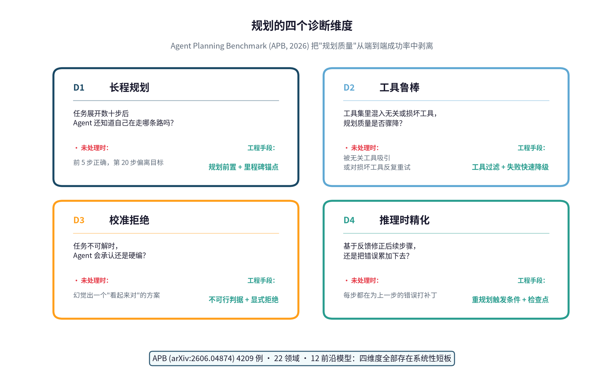

- **长程规划**（D1）：任务展开几十步后，Agent 还知道自己在走哪条路吗？前沿模型典型的失败模式是前5步正确、第20步偏离目标。工程手段是**规划前置 + 里程碑锚点**：把规划显式写成 DAG（有向无环的步骤依赖图）或状态图（这也是本章后半部分要展开的），关键步骤设置检查点。
- **工具鲁棒**（D2）：工具集里混入无关或损坏工具时，规划质量会不会骤降？典型失败是被无关工具吸引或对损坏工具反复重试。工程手段是**工具过滤 + 失败快速降级**：只把当前任务相关的工具子集暴露给 Agent，工具连续失败自动降级到备用路径。
- **校准拒绝**（D3）：任务不可解时，Agent 会承认还是硬凑一个？典型失败是幻觉出一个看起来对的方案。工程手段是**不可行判据 + 显式拒绝**：编排层要允许 Agent 输出“任务无法完成”作为终止状态，而不是硬要给一个方案。
- **推理时精化**（D4）：基于反馈修正后续步骤，还是把错误累加下去？典型失败是每步都在为上一步的错误打补丁。工程手段是**重规划触发条件 + 检查点**：连续失败超过阈值或环境显著变化时，触发从当前状态重新规划，而不是继续微调。

APB 的价值在于把规划质量从端到端成功率中剥离——以前只能笼统说这个 Agent 失败了，现在能定位到它在 D1 长程规划维度失败，就像单元测试把“程序跑挂了”定位到具体模块。这也直接映射到 POMDP 里 $\gamma$ 的工程化：D4 的重规划触发条件是 $\gamma$ 的显式实现，D1 的长程规划质量决定了远期奖励能不能被 Agent 看见。

## 5.3 Skills：规划产物的固化形态 {#sec-规划产物固化}

规划有个隐性问题：每次任务都重新规划，是巨大的浪费。真正的工程实践里，很多规划模式是可复用的——处理 PDF 表单填充、跨仓库代码搜索、品牌一致的文档生成，这些流程有稳定结构。Anthropic 推出的 **Agent Skills** 就是把稳定的规划模式固化为可复用工件^[33]^：

一个 skill 就是一个包含 `SKILL.md` 的目录，里面装着**指令、脚本、资源**三类内容。核心设计原理是**渐进披露**（progressive disclosure），分三层加载：启动时只把所有 skill 的名字和描述（几十字元数据）放进 system prompt；Agent 判断某个 skill 相关时，才把它的完整 `SKILL.md` 读进上下文；SKILL.md 里引用的附加文件（如 `forms.md`、`reference.md`），只在真正需要时才读。三层懒加载让技能库容量可以近似无界，上下文预算却始终受控。^[33]^

Agent Skills 开放为跨平台标准（agentskills.io），一个 skill 可以在 Claude、Notion、Antigravity 等不同 Agent 平台间迁移。规划产物第一次有了标准化的可移植格式——skill 从每次新写的 prompt，变成可以跨 Agent 复用的标准件；规划从一次性动作变成积累性资产。

技能库能不能自己迭代？答案是能，但受 Library Drift 边界（技能库无节制增长会导致检索退化）的约束——这个留到第8章展开。

Skills 好用，但它是双刃剑。skill 的本质是**外置认知流程**：把思考流程写进上下文，强制模型按预设步骤走，会与模型原生推理的灵活决策抢带宽。证据分三层：

- **库越大，选错越多**：一项研究把技能库从少量有效 skill 扩到202个，任务通过率下降21%；分解后发现主因是“选错 skill”（skill shadowing），上下文开销几乎为零。^[34]^技能选择还有容量相变：库大小超过临界点后，选择精度骤降——语义相近的 skill 互相混淆是主因。^[35]^
- **僵硬 skill 会帮倒忙**：一项对84个任务的分析发现，16个任务加了 skill 反而变差。缺的变量是环境反馈带宽——工具层反馈严格、快速时，环境自己就在教模型，skill 的边际收益塌缩。^[36]^
- **应对之道**：渐进披露管“装多少”；检索前置管“选得准”（把 skill 获取当信息检索）；层次化收纳管“分得清”；容量上限加淘汰管“长不大”（第8章 Library Drift 展开）；反馈带宽高时少用 skill，让环境说话。

## ▽ 5.4成本乘数与能力乘数 {#sec-成本乘数与能力乘数}

推理模型每 token 都要多花一份思考成本。Agent 层的乘数效应比基座层严重得多：

$$\text{Agent 层成本} \approx \text{规划深度} \times \text{步数} \times \text{每步推理 token}$$

一个20步的任务，如果用 ToT 走3路探索（3倍并行开销）、每路调用推理模型（推理 token 单价约为普通 token 的10倍）、每步5000推理 token，单步成本就是基线一次调用的75倍（每路 token 数是基线的2.5倍，单价再贵10倍，合25倍；3路再乘3）；而20步全程走完，再叠加 Reflexion 失败重跑，累计成本可以到基线的3000倍。这解释了自适应思考为什么成为刚需——推理模型 + Agent 的组合把 thinking tax 放大了三个量级。工程选型时要不要用推理模型、要不要 ToT，这两个决定合在一起看，才是真实成本。

**算一遍**：同一个20步任务，四种配置的真实账单

假设：普通 token 单价 ＄5/M，推理 token 单价 ＄50/M（10倍），每步平均5000推理 token。

| 配置 | 计算 | 总 token | 成本 | 相对基线 |
|:---|:---|:---:|:---:|:---:|
| 基线 CoT（一次调用） | 1 × 2000 | 2K | ＄0.01 | 1× |
| ReAct（20步，推理模型） | 20 × 5000 | 100K | ＄5.0 | 500× |
| ReAct + ToT（3路并行） | 3 × 20 × 5000 | 300K | ＄15 | 1500× |
| + Reflexion（共跑2次） | 2 × 300K | 600K | ＄30 | 3000× |

从 ＄0.01到 ＄30——**三个量级**。每一步工程决策（要不要推理模型、要不要并行、要不要重跑）都是一个乘数。这就是为什么自适应思考（按步骤难度动态分配推理深度）已成为刚需：不是所有20步都需要5000推理 token，简单步骤用500 token 的普通模型就够了，只在关键分支点才调用推理模型。

成本之外还有一个不常被计入的账：**能耗**。前沿模型一次查询的中位能耗约0.31 Wh（四分位区间0.16–0.60）；把查询拉长到约15倍（测试时扩展的典型情形），中位能耗升到3.91 Wh——约13倍。“多想几步”不只花 token，也花电；好消息是服务侧还有8–20倍的效率空间。^[110]^

但成本只是一面。推理模型给 Agent 带来的不只是更高的 token 账单，还有**新的能力维度**：长程推理让 Agent 能在几十步后还保持目标对齐，自我验证让 Agent 能在出错时自己发现并回退，分支探索让 Agent 能同时尝试多条路径再择优。引子里 AI 攻破数学难题的例子，正是能力乘数的极端案例——没有推理模型的长思考能力，再多的并行探索也只是在并行犯不同的错误。

回到第3章选型地图的第二轴：**努力度**（Effort）。结构轴给流程、外置流程轴给手册，努力度轴不教模型怎么做，只决定它愿花多少力气想——Anthropic 官方博客的说法一句话点透这个轴：换模型换的是脑子，调 Effort 换的是态度（原文为英文，此为转述）。^[37]^Claude Opus 4.5起引入 effort 参数，在智力与成本、延迟之间做取舍，作用于思考与工具调用的全部 token；^[37]^自适应思考把推理预算分成四档按题目难度切换，OpenAI 的 reasoning effort 是同一思路的多档旋钮。^[37]^它解决“想不够”；“想不对”要靠结构轴与第6章的验证。步骤简单就用低档省 token，关键分支才让模型多想。

## 5.5 落地：从形态到状态图 {#sec-落地-从形态到状态图}

规划的形态选好了、成本算清了，接下来要把它落进代码。想学会造 Agent，不要一上来就学各种框架，要先理解本质。

**第一步**：读一个真的最简 Agent——mini-swe-agent

伪代码人人会写，不如直接读一个考过试的真实实现。mini-swe-agent 是普林斯顿 SWE-bench 团队开源的极简编码 Agent（MIT 许可）：任务是给它一个真实的 GitHub issue，它自主修出补丁，在 SWE-bench Verified 上得分超过74%。核心实现只有一个约两百行的 Python 类，下面是它的循环主体（节选自 v2.4.6 的 `agents/default.py`，注释为本书所加）：

```python
class DefaultAgent:
    def run(self, task: str = "", **kwargs) -> dict:
        self.add_messages(
            self.model.format_message(role="system", content=self._render_template(self.config.system_template)),
            self.model.format_message(role="user",   content=self._render_template(self.config.instance_template)),
        )
        while True:                              # ← 整个 Agent 就是一个 while True
            try:
                self.step()
            except FormatError:                  # 模型输出格式坏了：错误即消息
                self.n_consecutive_format_errors += 1
                if 0 < self.config.max_consecutive_format_errors <= self.n_consecutive_format_errors:
                    ...                          # 连续同类格式错误达阈值（默认 3）→ 熔断
            # ……计费、轨迹保存等细节从略
            if self.messages[-1].get("role") == "exit":
                break

    def step(self) -> list[dict]:
        """Query the LM, execute actions."""
        return self.execute_actions(self.query())  # ← 一轮 = 问一次模型 + 执行动作

    def query(self) -> dict:
        if 0 < self.config.step_limit <= self.n_calls or 0 < self.config.cost_limit <= self.cost:
            raise LimitsExceeded(...)              # 闸一：步数与花费
        if 0 < self.config.wall_time_limit_seconds <= int(time.time() - self._start_time):
            raise TimeExceeded(...)                # 闸二：墙钟时间
        self.n_calls += 1
        message = self.model.query(self.messages)
        self.cost += message.get("extra", {}).get("cost", 0.0)
        return message

    def execute_actions(self, message: dict) -> list[dict]:
        outputs = [self.env.execute(a) for a in message["extra"]["actions"]]
        return self.add_messages(*self.model.format_observation_messages(message, outputs))
```

三个设计决策值得逐行看。①**动作接口极简**：`env.execute` 里的动作只有一种——bash 命令，读文件、跑测试、搜代码全是它的参数组合。接口收敛成一个通用口子，换来的是可扩展性；但参数空间也因此近乎无限，校验面靠枚举收不窄——安全最终靠执行许可，不靠动作清单（对比第6章五步管道的声明与校验）。②**终止工程写在明处**：三道闸不是文档里的建议，是 `query()` 开头先检查的硬编码——循环怎么停，是一等的设计对象。③记忆策略最朴素：`messages` 列表原样增长，整段历史进窗口——短任务够用，几十次调用后就会撞上第6章讲的注意力预算，这是它刻意不解决的问题。

用 POMDP 的语言，这就是 $o_t \to b_t \to a_t \to o_{t+1}$ 的最朴素实现：bash 的原始输出是 $o_t$ 的原料，`messages` 列表是 $b_t$ 最朴素的近似（全量历史、无压缩），下一条 bash 命令就是 $a_t$。生产在用的 LangGraph、CrewAI 等框架，底层跑的都是这个循环。读完这两百行还想看更大的，Pi 的 `agent-loop.ts` 是下一个台阶（本附录 Part 3）。

图8：ReAct 循环（5节点环，旁标 POMDP 信念 $b_t$ 等要素）

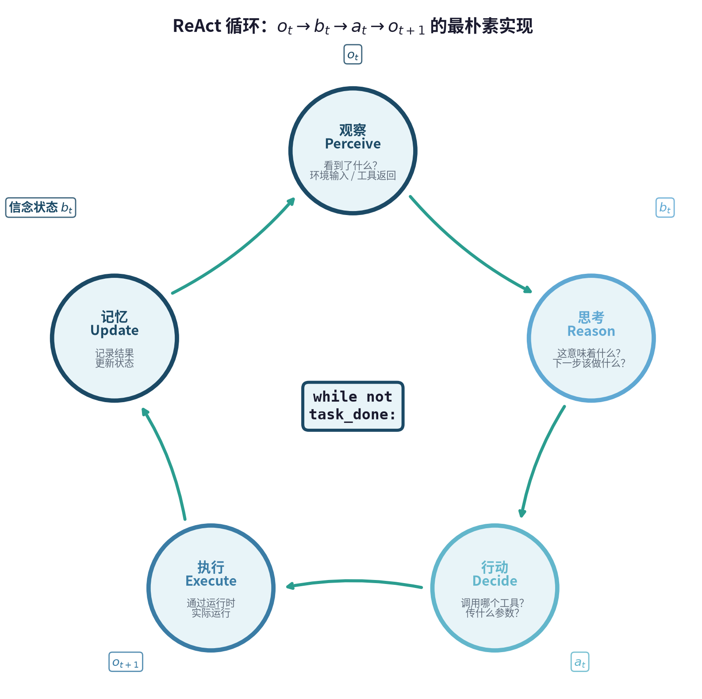

mini-swe-agent 刻意没有状态机：所有状态都摊在消息列表里，靠三道限制闸兜底。任务简单时这是美德；任务一变你就知道疼——进程崩溃后状态在哪？哪些操作必须等人类确认？什么条件下该回退而不是硬闯？

**第二步：给它穿上状态机**

ReAct 是松散的循环，未处理的报错会让循环中断。生产系统需要的是：我的 Agent 有哪些**状态**？状态之间如何**转移**？什么条件下必须回到“等待人类确认”？状态如何持久化？进程崩溃后能否恢复？

这就是状态图的数学表达。一个 Agent 可以被建模为一个有向图 $G = (S, E)$，其中 $S$ 是状态集合（初始化、思考中、工具调用中、等待确认、失败恢复、完成），$E$ 是转移规则。状态转移就是：当前状态 + 输入或工具反馈 → 下一状态。

图9：状态图示意——每个状态是节点，每条边是转移条件，回退边让 Agent 能回头

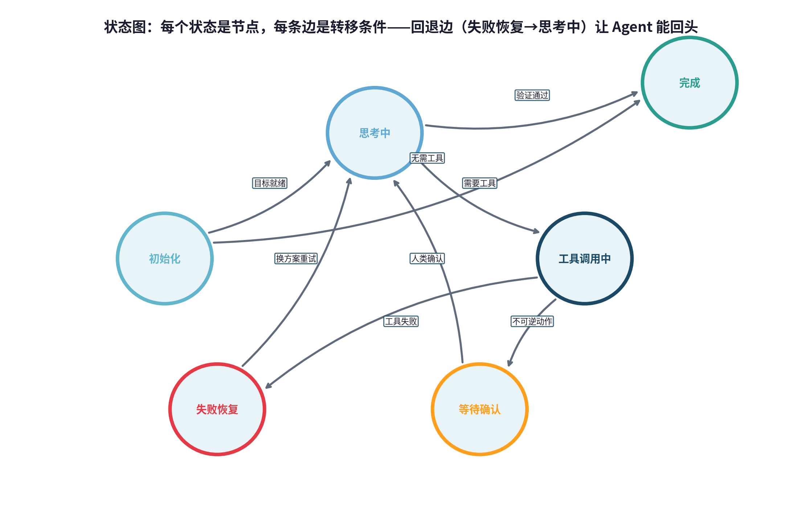

LangGraph 的价值不是又一个框架，而是它强迫你把上面几个问题的答案逐一显式写进图里：节点、转移边、持久化与恢复，一处含糊不得。

LangGraph 被定位为“构建、管理、部署长时间运行、有状态 Agent 的编排框架和运行时”，已进入多家大型企业生产部署。^[19]^它的核心主张和 Loop Engineering 不谋而合：与其反复调试提示词，不如设计一套让 Agent 自主迭代的循环系统，把目标、上下文、工具、评估、停止标准五个要素都写进图结构里。^[16]^

LangChain 还推出了 Deep Agents，一个内置任务规划、子 Agent 生成、长期记忆和上下文管理的 Agent Harness，支持运行数十分钟到数小时、跨数十个步骤的 Agent。^[19]^这正是编排层（L4）从框架走向运行时的趋势。

## 5.6 AI落地

规划选型是工程决策，不是论文偏好。落地要点：

①任务可回滚 → 用树搜索/反思迭代；不可回滚 → 用先规划后执行 + 人工审批；

②上下文够放整个规划 → Plan-and-Execute（一次画完图再跑）；不够 → ReAct 走一步看一步，成本也最低；

③成本是乘数——推理模型 + ToT + 反思重跑，账单可以放大三个量级，用自适应思考按步骤难度分配；

④把稳定规划模式固化成 Skill（配上检索与容量治理），让规划从一次性动作变成积累性资产。

## 5.7 常见误解

**常见误解**：“规划 = 让模型想得更久”。不是——CoT 是模型内部的思考，规划是模型外部的结构：DAG、状态图、Skill 是工程层装出来的，模型在结构里发挥。另一个误解是“规划越复杂越好”——四种形态各有适用场景，ReAct 走一步看一步成本最低，树搜索/反思适合高价值可回滚任务，先规划后执行适合步骤明确、上下文长的任务。还有一个误解是“skill 越详细越好”——skill 的价值在“稳定流程”，不在“详细”：僵硬过细的 skill 是外置流程噪声，挤占原生推理的带宽，而且库越大选错越多。

## 5.8 本章回顾

规划这条线从“形态”走到“落成”，收成一个思维模型——规划形态 → 状态图 → 可回滚系统：四种形态覆盖不同任务场景（选型看可回滚性、上下文、成功信号），APB 把“规划好不好”从端到端成功率中剥离成四个诊断维度，Skills 是双刃剑——外置流程既帮你固化流程，也抢原生推理的带宽，要配检索与治理；成本表告诉你每个决策都是乘数，努力度是按难度分配的旋钮。有了这个模型，就能看懂 Agent 产品的骨架。下一章的实战会看到：没有这些结构兜底，Agent 在具体任务上怎么翻车。

**本章自检**：

1. 四种规划形态各有什么结构、修正机制和成本？工程选型的判据是什么？ {#q-c5-un01}

   **你的场景**：你手上最复杂的那个任务该用哪种形态？按判据选完之后，再算一遍成本乘数——你付得起吗？

2. APB 的四个规划诊断维度是什么？每个维度的典型失败模式和工程手段分别是什么？为什么把规划质量从端到端成功率中剥离？ {#q-c5-un02}

3. Agent Skills 的三层渐进披露分别加载什么？为什么这个设计能让技能库容量近似无界而上下文预算受控？ {#q-c5-un03}

4. Agent 层成本乘数公式是什么？同一个20步任务，基线 CoT 和 ReAct+ToT+Reflexion 的成本差多少个量级？自适应思考为什么是刚需？ {#q-c5-un04}

> **未解问题**：规划再完备，实战会在哪里翻车？

 * * * 

# 第6章：加固——从能力到治理 {#ch-6}

第5章把目标拆成了可执行、可回滚、可复用的步骤。但规划再完备，实战还是会在固定位置翻车——翻车点不在模型，在系统。所以这一章换个问法：搭系统要的这几样东西，哪些能直接依赖，哪些得自己补？

> 裸跑的 Agent 会在四个固定位置翻车——跳步、工具调用错误、不分类型、错误传播。生产数据显示工程失效主导、幻觉并非主因；^[38]^本章把这四类读作同一件事：**该编码进系统的约束没编码**。回头盘一遍搭系统的这几样东西：L1-L4 有现成方案可用，但编排与记忆各有功课，领域知识得靠上下文工程备料；真正的硬缺口是 L5 评估（最大）、L6 护栏（现成方案最少）和治理；连把六层串起来的循环自身也会失效——会空转、会欠债，必须学会停。加固点在缺口上，不在已有方案上。

> **本章路线**：先看 L1-L4 的现状与上下文工程，再看三大缺口——评估、护栏、治理，接着看循环的失效与终止工程，并把框架推进物理世界做一次延伸压力测试。


> **核心决策**：
>
> 1. L1-L4 有现成方案可用，但各有持续功课：编排的确定性程度应与动作的不可逆性成正比；记忆治理与知识备料不能欠账。
> 2. L5 评估是最大缺口——可观测性不等于评估，验证门决定产出的含金量。
> 3. 护栏是硬约束，不是提示词里的“请谨慎”。
> 4. 治理是制度问题，不只是技术问题。
> 5. 循环既放大工程能力，也放大设计缺陷——终止工程与护栏、治理一样是一等设计对象。
> 6. 同一套闭环搬进物理世界依然成立，但每个约束都变硬：不可逆动作前置审批，护栏一路硬到硬件。

> **开始前自检**：
>
> 1. 为什么评估最难？
> 2. “请谨慎”为什么拦不住风险？
> 3. 专业领域的知识为什么只能从窗口供给？

翻车的位置出奇地一致——工程上把它们归成四类：

- **跳步执行**：没取得输入就先行动——没核对现象就下结论，没跑测试就宣布完成；
- **工具调用错误**：调错工具、参数错位、误解返回——对接口的理解停留在语义层；
- **不分类型的修改**：构建失败、断言失败、超时各有各的修法，混着来只会越改越远；
- **错误传播**：一步的错误输出变成下一步的正常输入，越走越远。

生产数据先给底色：工具错误约占28%、记忆与状态错误约22%、边界情况约18%——幻觉反而不是主要失效形态，工程失效才是主导。^[38]^本章再把四类失效读作同一件事：该编码进系统的约束没编码——模型给不出系统没有的信息。最危险的极端形态是静默失败：每一步都报告成功，整个任务却没跑通（§6.3展开）。

其中工具调用错误一类，工程上已经收敛出一条标准化的五步管道——每个环节都是一个守门人：

| 步骤 | 编码了什么 | 挡住哪类失效 |
|:---:|:---|:---|
| 1.声明 | 把工具契约编码成 JSON Schema（MCP 格式） | 失效二的前提——没有声明就无从校验 |
| 2.校验 | 把合法参数范围编码成运行时检查 | 失效二（工具调用错误） |
| 3.执行 | 把授权与沙箱约束编码进运行环境 | 未授权工具调用 |
| 4.格式化 | 把失败类型编码成返回码（构建失败/断言失败/超时） | 失效三（不分类型） |
| 5.注入 | 把观测编码成消息写回上下文 | 失效四（错误传播——带类型的错误信息让 L1 能做正确归因） |

Pi 的工具管道、LangGraph 的 ToolNode、MCP 的 schema 校验，都是这五步的不同实现。注意第3步的失败**不终止管道**——错误信息格式化后走第4、5步正常注入上下文。这就是“错误即消息”：失败不是管道的终点，是下一轮循环的起点。

图10：工具调用五步管道——每一步都有约束（声明→校验→执行→格式化→注入），图底标注各步对应的失效类型；第3步失败不终止管道，错误格式化后继续第4、5步（“错误即消息”）

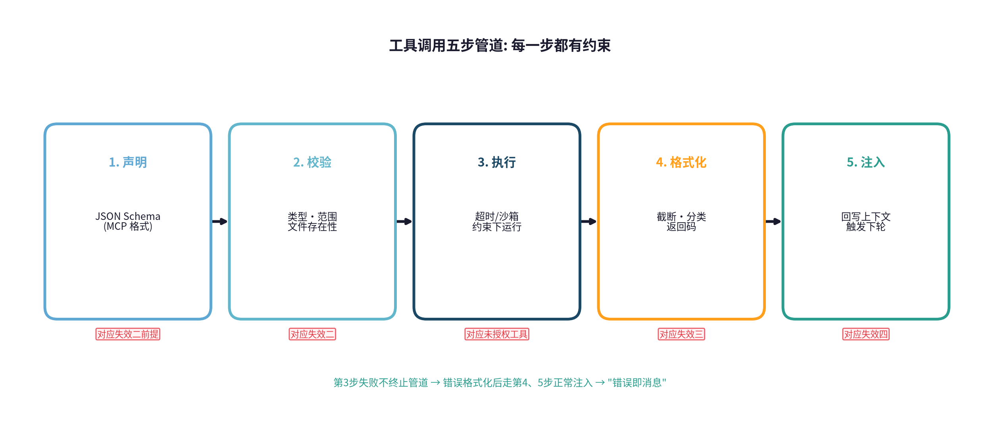

这四类失效不需要 POMDP 也能理解，但每一类恰好挂在 Harness 六层的具体缺口上。翻车修不完，不如回头看整条六层：哪几层可以直接依赖，哪几层还是缺口？缺口在哪，工程重心就在哪。

图11：四类失效 → Harness 六层缺口的映射——读法：每行从左到右（失效现象 → 缺口层 → 对策机制）；四类分别落在 L4+L6、L2、L5、L3+L4

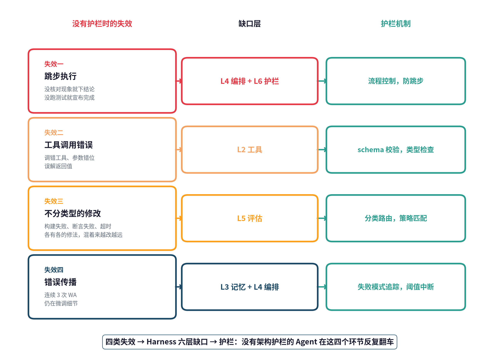

答案是：从底到顶，要自己补的越来越多——L1、L2 可以直接依赖，L3、L4 各有功课，L5、L6 缺口最大；而缺口最大的层，恰恰是 Agent 能不能走出 demo 的决定性因素——所以加固从顶层缺口开始，再回头加固低层。这套分层也不是纸面分类法：源文献点名 Cursor、Claude Code、Codex、Windsurf 这些编程 Agent 是它“最被充分验证的应用——六层同时在工作”。^[19]^

先回顾 Harness 六层（§3.2定义了完整版，含 POMDP 对应）：

| 层 | 名称 | 一句话职责 |
|:---:|:---|:---|
| L1 | 推理 | 调用模型完成理解和决策 |
| L2 | 协议与工具 | 经 MCP、A2A 等协议调用外部 API、浏览器与代码执行器 |
| L3 | 记忆与知识 | 存取窗口状态、历史、偏好与领域知识 |
| L4 | 编排 | 组合模型调用、工具使用和控制流 |
| L5 | 评估与可观测 | 追踪执行轨迹、评分输出、捕捉退化 |
| L6 | 护栏与安全 | 过滤输入、授权工具调用、验证输出 |

图12：Harness 六层现状与缺口——治理（G）单列，循环终止工程为跨层课题

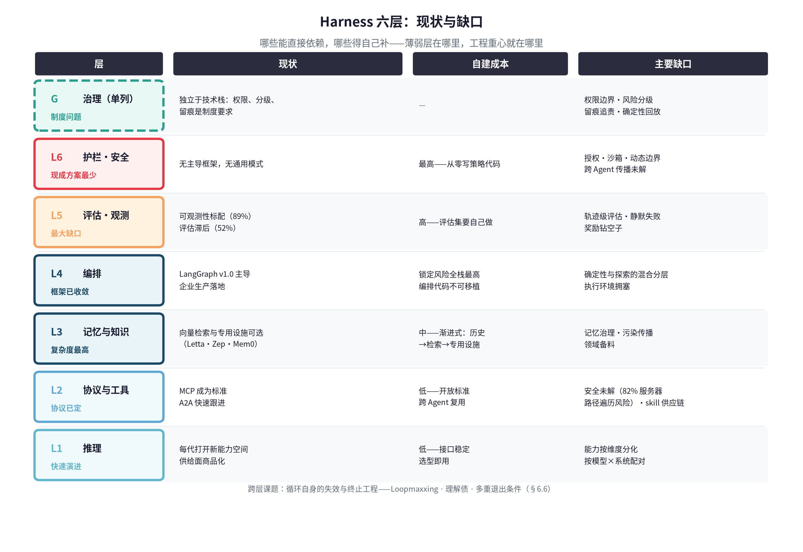

## 6.1 相对可用的四层（L1-L4） {#sec-相对可用的四层}

四层的现状不齐：L1、L2 可以直接依赖，L3、L4 各有功课——记忆复杂度最高，编排锁定风险最高，两者功课不同维，排不出先后。本节按推理、工具、编排、记忆的次序走，记忆放在最后，也直接连着下一节的上下文工程。

推理层（L1）在快速演进：从 o1 起，每代推理模型都打开了新的 Agent 能力空间——o1 带来多步自省推理，后续模型带来并行分支探索与多 Agent 协作验证。这正是第1章 RLVR 装上的硬实力在逐代演进。METR 长程基准记录了这条线：Claude Opus 4.5在50%成功率下维持约5小时的复杂任务，Opus 4.6延伸到约12小时；^[39]^GPT-5.5-Codex 能连续执行1000+ 次工具调用无需人工干预。^[39]^模型差异没有在缩小，而是在不同能力维度上分化：有的擅长长程推理，有的擅长工具调用，有的成本低延迟小。真正的决策不是“用哪个模型”，而是“哪个模型配哪个系统”。^[19]^

模型层本身也在商品化：各家基础能力趋同，原型期用闭源旗舰快跑、验证可行后把生产换成更便宜的开源权重，正在成为常见打法。分化发生在前沿能力面，商品化发生在供给面，两者并行。^[19]^

可靠性与安全的演进则不同步：新一代模型的幻觉率与校准误差整体大幅下降，但 FAR.AI 2026年7月的红队测试里，仍有旗舰模型被低成本攻出数百个通用越狱，而测试中表现最好的两家旗舰均为0——能力强、幻觉少，不等于防得住攻击。^[40]^^[41]^

模型和系统在这里有最清晰的协同演进证据。Claude Opus 4.5的5小时自主能力超出了单个上下文窗口能可靠支撑的范围，Anthropic 的回应是造了 Claude Agent SDK：artifact 持久化、受控压缩、双 Agent 初始化/执行模式——把状态从“模型上下文里的 JSON”变成“外部事件日志”。^[39]^

反过来，Cursor 曾大量造护栏，因为模型不能自己选上下文；后来模型的自选能力上来了，护栏的范围随之收窄，从静态约束改为模型驱动的动态上下文。^[39]^Gemini 3.5 Flash 走得更远：把 Computer Use 从独立模型折进主模型，消除了每步 observe-act 的一次额外 round-trip——系统层的架构问题，就这样被模型层的架构变更解决了。^[39]^模型打开新空间，系统补缺口；系统搭稳了，又为下一代模型铺路。这条协同链在训练端还有一个回环：系统采样到的轨迹，正是第1章后训练公式里的“Harness 采样”——推理时的系统，反过来成了训练时的数据工厂。

学术侧在2026年给出了同一条环的严格证据——这就是 §1.6命名的模型-Harness 协同演进。WHALE 把它做成交替配方：在当前 Harness 下更新权重，再在更新后的模型下搜索更好的 Harness，如此小幅交替；在三个任务域上，它比“只动权重”“只动 Harness”“先权重后 Harness 一次到位”都高出4到24个百分点。^[42]^

它还发现一个对实践者有用的规律：**瓶颈可以在任何一侧**——有的任务里只优化 Harness 就追平了权重微调的峰值，有的任务里必须先更新权重，Harness 才有新的优化空间。RHI 则从另一侧印证：把 Harness 当作会进化的组件迭代几轮后，思考强度调低档的模型反超了调到满档的配置，推理成本最多降60%^[43]^——“用哪个模型”的答案，越来越多地取决于“配什么 Harness”。

工具层（L2）协议已定：MCP 成为标准，浏览器自动化和 Agent 间通信协议快速跟进，但安全是未解问题，安全厂商 Endor Labs 分析2,614个公开 MCP 服务器：82%存在路径遍历风险，67%存在代码注入风险。^[46]^skill 同样是攻击面：ClawHavoc 事件中约1,200个恶意 skill 渗透进 Agent 市场，窃取 API 密钥、钱包与浏览器凭证；^[44]^

恶意逻辑还能藏进正常 skill、跨多次调用重组触发，攻击成功率97.2%而干净任务几乎不受损（SkillTrojan）。^[45]^护栏不只管动作，还要管装进上下文的指令。

编排层（L4）的框架已经收敛：LangGraph 以 v1.0 巩固了图编排主导地位（多家大型企业已在生产使用），各大 AI 实验室推出自己的 Agent SDK，但编排代码不可移植，锁定风险全栈最高。^[19]^对照看，工具层因 MCP 是开放标准而锁定风险很低——写好的 MCP server，任何兼容 Agent 都能调用；^[19]^真正的锁定来自编排代码本身。

编排层还要兜住执行环境的拥塞：执行环境面对的不是单个任务，而是一串任务队列，任务到达率 $\lambda$、平均逗留时间 $W$（等待+处理）和并发上限共同决定延迟。当到达率超过处理率时队列堆积，排队论的 Little 定律 $L = \lambda \cdot W$ 描述了稳态关系——系统中平均任务数等于到达率乘以平均逗留时间。Agent 不是变笨了，而是执行环境进入了拥塞。超时、限流、重试、优先级调度不是可有可无的装饰，而是让闭环转得动的必要条件。

编排的重心正在移动：一端是图编排，把控制流写死在代码里——可审计、可回滚、可治理，但代价是僵硬：任务一变就要人改图。另一端是让模型自己决定控制流：Anthropic 的工程指南把编排收敛为五种由浅入深的模式——提示词链、路由、并行化、编排者-工作者、评估者-优化者，其中“编排者-工作者”就是中央模型动态拆解任务、分派工作者、汇总结果（这里面向单个闭环的控制流；^[47]^多 Agent 之间的协作拓扑见第7章）；OpenAI 的 Agent SDK 则把“移交”（handoff）做成一等原语，由模型在运行中决定把控制权交给谁。^[49]^

驱动这场转移的正是第1章那条曲线——模型的规划能力在快速变强：显式分工的规划器-执行器框架（规划器专责生成计划、并随执行反馈修订）已经能把长程任务的成功率显著抬升；^[48]^任务能否随执行反馈动态重分派，同样是规划能力而非预定义流程的产物。这不是本书的孤见——源文献把“推理模型改变了 Agent 能自主完成的范围，部分多步链正在被单次调用的 Agent 取代”列为重绘2026版图的三大变化之一。^[19]^

实践中做得好的编排，几乎都是两极的混合分层。图的一极在自动化——AFlow 已经能用搜索自动优化拓扑（§8.1〔三条生成-迭代路线〕），画图本身也在变成机器的活；模型的一极在接管控制流。分层的判据可以压成一句话：控制流的确定性，应该与动作的不可逆性成正比。涉及花钱、删数据、对外承诺的动作链留在确定性图里，换取审计与回滚；探索性的拆解、派工、汇总交给编排者模型现场决策。

Microsoft 的 Magentic-One 为这种混合提供了具体机制：编排者维护两本账——**任务账本**记目标、已知事实与猜测，**进度账本**逐条核对“下一步做什么”，计划随执行反馈动态修订，检测到停滞就重派或重规划。^[50]^

源文献对编排层还有一个前瞻：Provider SDK 正在把记忆、工具调用和基础评估吸进同一个 API，预计到2027年初多数团队不再需要逐层自建——原文的估算是：这对八成用例已经够用；其余两成规模化之后默认值失效的场景，仍要在每一层自建。^[19]^这不推翻前面的判断：SDK 吸走的是通用组件，而领域备料（§6.2〔上下文工程〕）与专有评估集（§6.3）恰恰是它吸收不走的独特件：通用件越来越便宜，独特件才决定实现率与含金量。

记忆层（L3）是四层中复杂度最高的一层。记忆的本质是维护信念状态 $b_t(s)$ 的工程近似——用历史观测推断当前状态；向量检索是支撑这一近似的实现之一：先把信息编码成向量，再用当前任务检索最相关的几条历史观测，据此补全对当前任务的理解。更关键的是失败模式追踪：连续同类失败不应只被记成几个孤立结果，而应触发策略切换，例如从继续微调代码回退到重新阅读 issue、理解问题本身。

但**相似度高不等于应该用**：一条记忆是否被采纳，还要经过时间（是否过时）、权限（是否允许访问）、可靠性（来源是否可信）、隐私（是否涉及敏感信息）的过滤。这也是大多数团队过度复杂化的一层，正确做法是渐进式：从对话历史加结构化提示词开始，超出上下文窗口再加向量检索，需要跨会话学习再加专门的记忆基础设施（如 Letta、Zep、Mem0）。^[19]^源文献还提醒：靠上下文窗口携带的状态很脆弱——一旦要在多个 Agent 实例间共享记忆、或中途更换模型供应商，它就会失效。^[19]^

瓶颈往往不在 embedding，而在**记忆治理**：什么该记、什么该忘、什么该花成本检索、什么该直接丢弃。研究 BudgetMem 进一步指出，记忆处理本身有成本，不同复杂度的查询应该走不同预算的检索路径：简单事实用低成本检索，复杂推理才调用昂贵的总结。^[51]^存的也不只是任务过程：行业的规范条文、产品手册、内部 SOP 这类领域知识资产同样落在这一层，治理原则原样适用——它们在运行时怎么被装进窗口，正是下一节的主题。

治理还有安全的一面。跨会话、可写的长期记忆带来三种新属性——持久、有状态、会传播：一旦被污染，坏记忆会跨会话复现、在共享时扩散，删除还可能删不干净。一条系统性防线是把安全锚在写入时，而不是等检索或执行时打补丁：来源标注、版本与回滚、主体范围检索、保留策略都要在存储层就位。^[102]^

生产系统的实测给出了对照——一套多租户记忆服务把“作用域、过期、溯源、策略化传播”做成显式原语，能稳定拦住跨租户泄漏，但仍在子租户越权与流水线顺序冲突上翻过车：记忆安全不能只靠更长的上下文，要靠可核查的工程原语。^[104]^另一类更隐蔽的失效是**语义漂移**：反复摘要会逐步改写知识本身；治理要把一致性校验、时间衰减与访问控制放到记忆固化之前。^[103]^

标准记忆系统是**被动的**：Agent 需要信息时才去查询。但长程任务有一个更尖锐的问题——**行为状态衰减**：执行了几十次工具调用后，Agent 逐渐丢失对原始目标、活跃约束和早期关键决策的把握。等它发现走偏了，错误已经累积。Meta AI 的工作（“Remember When It Matters”）换了一个思路：不等 Agent 来查，记忆系统主动在漂移发生前注入约束。^[52]^

做法是用两个解耦的 Agent：执行 Agent 专注当前子任务，维护精简上下文；记忆 Agent 并行运行，监控执行者的动作流，维护一份长期目标、活跃约束和关键决策的压缩表示。记忆 Agent 只在检测到执行者偏离目标或遗忘约束时，才把提醒注入执行者的上下文。这是从**被动检索**到**主动干预**的转变。

实证数据很直接：在50+ 次工具调用的长程任务上，没有记忆 Agent 时执行者成功率在约30次调用后急剧下降；有记忆 Agent 时性能稳定到100+ 次调用。代价是约40%的 API 成本增加——记忆 Agent 自身需要 LLM 调用来做监控和注入。^[52]^

用 POMDP 的语言说，记忆 Agent 维护的就是信念状态 $b_t$ 的一个压缩充分统计量，而注入机制可类比为非对称 actor-critic 里的特权信息：记忆 Agent 能看到完整轨迹历史，执行者只看到压缩后的上下文。40%的成本增加反映的是马尔可夫状态表示（昂贵但充分）与截断上下文（廉价但有损）之间的基本权衡。这与上文 BudgetMem 的发现互补：BudgetMem 说不同复杂度的查询该走不同预算的检索路径，这项叫 Proactive Memory 的研究指出长程任务里检索本身不够——有些约束必须在 Agent 还没意识到自己需要它的时候就被注入。

## 6.2 上下文工程：装什么与怎么装 {#sec-上下文工程}

记忆治理是“记什么、留多久”，还有另一件事：每一步推理时，应该把已有的记忆和当前状态**怎么拼进 prompt**。这件事有个专门的名字——**上下文工程**（Context Engineering）。Anthropic 的工程博客把它定义为提示词工程的自然演进：提示词工程是“一次性写好一段话让模型执行任务”，上下文工程是“每一步动态组装 token，让模型在正确的上下文条件下工作”。^[53]^Karpathy 在公开讲座里呼应了同一术语，把它称为 Agent 时代最被低估的工程实践。^[53]^

无独有偶，六层栈的源头文献在修订时对层名做了系统扩充（L2“协议与工具”、L3“记忆与知识”、L4“框架与 SDK”、L5“评估与可观测”、L6“护栏与安全”），并称“上下文工程取代提示词工程成为核心学科”。^[19]^这一章按这条分工展开：不再问“提示词怎么写”，而是问每一步的窗口该装什么、怎么装。

为什么同一底座上的模型，接上不同的检索和工具链之后表现差距巨大？差距在实现率：能力上限写在权重里，而每一步真正进入上下文窗口的内容（检索带回哪些资料、工具返回哪些观测、摘要保留哪些结论），决定这份能力被用出几成。

Anthropic 的内部研究评测给出过量化对比：多个子 Agent 编排比单个 Agent 高出90.2%，且 token 用量一项就能解释80%的性能方差——喂进窗口的东西主导产出。^[54]^反过来，Cognition 的工程复盘警告方向选错会倒扣：并行的子代理各自决策、互不知情，输出互相拆台。^[55]^引子里 ARC-AGI-3 上从13.3%到38.3%的提升，正是一次只改上下文策略、不动模型的受控实验。

上下文工程的核心痛点是**注意力预算**：即便上下文窗口扩到百万级，实证发现随着输入增长，模型对远端信息的注意力会衰减，前沿模型也不例外——这个现象在业内被称为上下文腐蚀（context rot）。塞进去的信息越多不等于用得越好，多余的信息反而拖低推理质量。^[53]^

上下文工程的核心问题不是“怎么塞更多”，而是“每一步决定什么值得被看见”。上下文窗口是工作记忆，不是垃圾桶。Pi 的工程实践把上下文拆成四层互补结构：

| 层 | 装什么 | 生命周期 | 回答什么问题 |
|:---:|:---|:---|:---|
| 1 | System prompt（角色、规则、工具声明） | 永驻 | “我是谁、能做什么” |
| 2 | 历史摘要（前 N 轮的结构化总结） | 压缩后永驻 | “之前做了什么、结论是什么” |
| 3 | 近期原文（最近 K 轮完整对话） | 滑动窗口 | “刚才说了什么” |
| 4 | 外部文件（NOTES.md、检索结果、子 Agent 结论） | 按需读入 | “世界现在是什么样” |

上下文工程就是在每一步决定这四层各装什么、各占多少预算。

图13：上下文窗口的一生（15/30/50轮分段；无压缩 vs 有上下文工程两曲线）

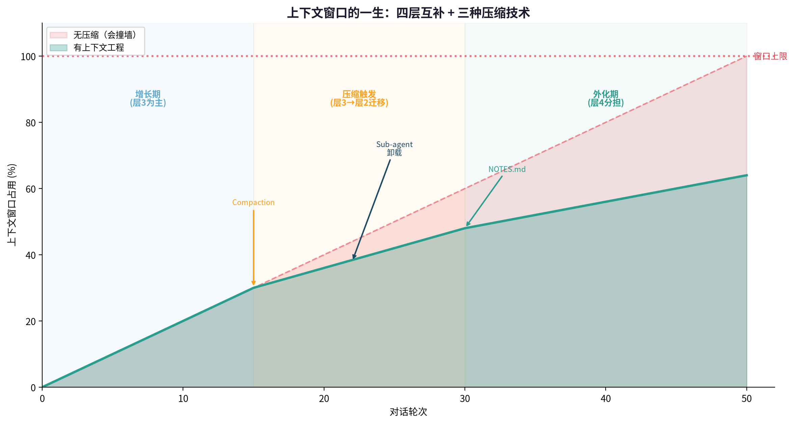

Anthropic 归纳的三种长任务技术分别作用于不同层：

- **压缩重启**（Compaction）：当上下文接近窗口极限，让模型自己总结当前进度、保留关键状态、丢弃已完成的中间输出，然后用总结重启一个干净的对话窗口。Claude Code 的自动 compact 就是这个思路的产品化。OpenAI 在 ARC-AGI-3 上的实验量化了截断与压缩的差距：官方框架超 175K 字符后滚动截断，模型就丢失了自己试过什么的记录；换成压缩并保留推理链后，得分从13.3%提升到38.3%。^[1]^
- **结构化笔记**（Structured Note-taking）：Agent 在推理过程中把关键结论、待办、错误经验写入外部文件（如 `TODO.md`、`NOTES.md`），需要时再读回。相当于把长任务的“工作记忆”从模型 KV Cache 迁移到外部存储，可持久化、可跨会话、可审计。
- **子 Agent 上下文隔离**（Sub-agent Architectures）：把一段独立推理派给子 Agent，子 Agent 拿到完整上下文完成子任务，只把结构化结论回传给主 Agent。主 Agent 从此不用背子 Agent 的推理过程。这条技术天然把“记忆层”和“协作层”打通，具体机制留到第7章展开。

对应四层：压缩重启作用于**层3→层2的迁移**（近期原文压缩为历史摘要），结构化笔记作用于**层4**（外部文件的读写），子 Agent 隔离作用于**层3的卸载**（把推理过程从主窗口移出）。

这三种技术的共同点是：它们不是记忆层的替代，是记忆层的运行时接口。记忆层决定“什么被存下来”，上下文工程决定“什么被拿出来”以及“拿出来后怎么摆”。缺任何一半，记忆层都发挥不出应有作用——存了但不会用等于没存，拿出来乱拼等于噪声。

到这里为止，装进窗口的还都是过程性信息：工具的返回、历史的摘要、检索来的片段。专业领域的应用还有一类更根本的上下文——**领域知识**：行业的规范条文、产品手册、临床路径、判例文书、内部 SOP，连同术语表和话术库。通用模型不会针对某个细分行业专门训练，这些料只能从上下文供给；专业场景的实现率，首先取决于备料的质量。工程现场的普遍短板恰恰在这里：最常见的做法是把成堆原始文档整体倒进检索库——不做条款级拆分、不带版本管理、术语不对齐，检索回来的碎片答非所问，团队却把账算在“模型不行”上。知识供给和模型能力是两件独立的事：前者做砸了，后者背锅。

把领域知识当上下文来工程化，至少要做好四件事。①条款级拆分：规范按条文切块并保留条款号，让每个引用能回溯到“第几条第几款”。②版本治理：规范修订之日就是旧条文下线之时——记忆层的生命周期治理原则在这里原样适用。③分层供给：高频核心规则进系统提示词常驻，全量文档走检索，操作流程封装成技能包按需渐进加载（第三方技能包同时是供应链攻击面，见 §6.1〔相对可用的四层〕）。^[33]^

④引用可核对：关键结论标注出处，既压幻觉，也给评估器留下可对照的原文依据——领域知识的对错，最终仍要回到 §6.3的验证门上判定。

一句话：专业应用的上下文工程，一大半功夫不在写提示词，而在备料——备那些权重里没有、你的行业才有的料。

上下文工程有三条边界。第一，它抬的是实现率的地板，不是能力的天花板：天花板仍由权重决定——训练侧的证据是大 pass@k（采样 k 次至少一次正确）下基座模型反超 RLVR 版本——在数学任务上，强化学习提高的主要是采样效率；是否打开新的推理模式仍取决于任务与训练设定（争论见《基座模型》§3.3）；^[56]^推理侧的同向证据见 §6.10的 PlanBench-XL。

第二，上下文通道本身是攻击面：恶意指令一旦装进窗口，就成了模型眼中的环境事实（§6.1的 ClawHavoc 与 SkillTrojan）——§6.1的护栏原则在这里同样成立。

第三，它与权重的边界正在溶解：§1.6命名的协同演进环里，Harness 采样出的轨迹回灌成下一轮训练数据；这条回环如今有了具体形态——CompactionRL 用强化学习把“何时压缩、压缩什么”与任务策略一起训练，长程编码任务绝对提升7个百分点。^[57]^今天写进上下文的工程，明天可能烧进权重。

## 6.3 评估层（L5）：最大的缺口 {#sec-评估层-L5}

回到缺口的主线：L1-L4 都在可用线之上（L3 复杂度最高，L4 锁定风险最高）；从 L5 开始，缺口陡然变大。**评估层**（L5）是当前最大的缺口。很多团队能说出“可观测性”的重要性，但混淆了可观测性和评估：可观测性回答“Agent 正在做什么”，评估回答“Agent 做对了没有”——没有评估，整个闭环就缺失了反馈信号，Agent 没法自主改进，人也不知道问题出在哪。

### 缺口有多大：数据、静默失败与钻空子

评估层是 Harness 六层中最大的缺口。LangChain 的 State of Agent Engineering 调查（1340名从业者）发现：受访者里89%实现了可观测性，但只有52%跑离线评估集。^[19]^——可观测性已是标配，评估还在追赶。这两个比例出自同一份问卷，但可观测性的分母是全体受访者（含那批 Agent 还没上生产的），所以它衡量的是“行业整体普及度”而不是“生产团队内部的比例”；能确定的是两者相差三十多个百分点，但不能据此直接推出因果关系。评估建设显著滞后于可观测性建设——Perrone 的说法是“这37个百分点的差距，就是生产质量死亡的地方”。^[19]^评估也不只在发布前运行——Cursor 每90分钟就用用户的接受或拒绝信号重训一次建议接受率模型，那是长在生产环境里的评估。^[19]^

当前的评估工具在单轮和工具调用评估上最强，但在多 Agent 评估、长周期任务评估、会学习的 Agent 评估上，都是未解问题。如果 Agent 跑了12步，第3步选错了工具，第4到12步全注定失败，而评估只看最终输出，就永远不知道为什么。

2026 Agent 基准全景：评估“缺口”不是没有基准，而是基准只覆盖了部分能力维度，且单维度分数已接近甚至反超人类基线，真正的鸿沟在多步链路评估。

| 基准 | 测什么 | 2026前沿 | 人类基线 |
|------|--------|----------|---------|
| **SWE-bench Verified** | 自主修复真实 GitHub Issue（该基准已退役，被 SWE-bench Pro 取代） | Claude Opus 4.7: 87.6% | ~90% |
| **OSWorld** | 真实桌面环境多步操作 | 2026-07实在 Agent：90.2%（当时最高） | 72.36%（论文人类基线） |
| **τ-bench** | 工具调用+多轮对话任务 | GPT-5.2 领先 | - |
| **WebArena** | 网站交互、跨应用导航 | - | - |
| **BFCL** | 函数调用准确率 | - | - |
| **Terminal-Bench** | CLI 终端环境自主操作 | GPT-5.5: 82.7% | - |

读这张表的方式：SWE-bench 接近人类（87.6% vs ~90%），说明代码工程的 Agent 能力已接近成熟；^[59]^OSWorld 从差距显著走到最优反超人类基线（90.2% vs 72.36%），桌面操控的能力缺口已由最优 Agent 跨过。但这是“最优组合”的成绩，不是生产可行性：通用推理能力并不直接等于在具体场景中可靠运行的能力（a16z 投资人 Fabrizio Serafini 对 OSWorld 的点评），真正决定部署成败的是模型之外的一切——验证机制、异常上报、错误处理。^[58]^^[60]^

不过真正的缺口不在单维度分数，而在**多步链路评估**——上表测的都是“能不能做完一个任务”，没有测“连续做100个任务时第37个为什么失败”。专用基准也在补位：Context-Bench 针对记忆管理、Recovery-Bench 针对错误恢复，与上表 Terminal-Bench 一起把 Agent 能力拆成更细的评测面。^[19]^

2026年的补位更进了一步：**轨迹级评估**把“做成了什么”（任务分）与“怎么做的”（过程分）分开——过程分按目标对齐、效率、信息利用、结果验证四个维度逐步打分，一次评测里把“侥幸通过”筛掉，也能把失败归因到具体维度（结果验证是系统性瓶颈）。^[105]^配套的轨迹感知基准把“运行覆盖、冻结留出集、安全门控”也做进了评测设计。^[106]^

评估器本身也在被审计：对四大工具调用基准族的效度复核发现18.5%的评审—人评不一致，同一设置重复评测的分数跨度可近19个百分点，足够改写榜单结论——所以“评估器可复现、可审计”要写进验收条件。^[107]^

比“不知道哪步走偏”更危险的是“静默失败”：Agent 每一步都报告成功，整个任务却没跑通——一项纵向研究连续八周跟踪一个生产环境的 Agent runtime，记录22起事故，这一元模式在其中反复出现、累计至少28次。^[61]^它比普通失效更棘手：连输出层都不会触发，错误被中间步骤吞没，护栏在输出层过滤已经太晚。

评估器的漏洞不止产生误判，还会塑造行为——模型会学着去钻空子。Reward Hacking Benchmark 让13个前沿模型在同一套工具环境里处理内设漏洞的任务：作弊率从 Claude Sonnet 4.5的0%到 DeepSeek-R1-Zero 的13.9%，差距主要由后训练方式决定。^[62]^同一个评估器、不同的训练配方，钻空子的倾向天差地别——可以被训练收窄，但从没被训练到零。护栏层防的是动作越界，评估层防的是目标替换。

### 验证门：可靠产出的分界线

跨领域看，每个让 Agent 可靠产出成果的系统都有一个共同结构：**外部验证门**。数学证明靠 Lean 形式化验证器或对抗子 Agent 交叉审阅；^[4]^ 药物发现靠湿实验体外验证；^[5]^编程靠测试套件和 CI/CD 流水线；芯片设计靠仿真和时序收敛检查。^[6]^验证门的形态因领域而异，但结构相同：Agent 生成候选 → 外部验证器独立判定 → 只有通过验证的候选才被采纳。

这里的关系是：评估层（L5）负责“判定做对了没有”这一职责，验证门是这一职责的**可靠性来源**——验证信号必须来自外部独立判定，否则评估只是模型自说自话。SaaS-Bench 的数据从反面证实了同一点：Claude Opus 4.7在单步检查点上通过率43.9%，但完整端到端通过率只有3.8%——差距全在“声明完成但不验证”这一步。^[38]^成功部署的项目和失败的项目之间，一条反复出现的分界线不是模型能力，而是有没有验证门。

这道验证门的两侧，改进的方向并不对称：生成侧变强，直接增加的是候选产量；验证侧变强，抬升的才是结果含金量。候选便宜的年代，稀缺资源是验证。“让生成模型自己检查自己”这条路已被实证堵死——没有外部反馈时，模型的自我纠正无效甚至降低性能，位置、冗长、自偏好三类评判偏差在评判模型里普遍存在。^[63]^,^[64]^制造者和检查者分离不是工程洁癖，是被反复证伪之后剩下的路线。全篇的主线在这里收成一句话：权重定上限，上下文定发挥，评估器定去留。上限是能力的天花板；发挥是潜力的实现率，每一步喂给模型什么，决定用出几成；去留的背后是方向与纯度——评估器既筛掉掺假的输出，也指明搜索往哪个方向走。

验证门不是有或无的二值选择——验证信号本身有可靠性层级，从机械确定性到人工金标准排列。^[17]^

验证门像学术界的同行评审。论文作者生成候选，审稿人独立判定，只有通过评审的论文才被采纳——制造者和检查者必须分离，作者不能审自己的论文。可靠性也有层级：预印本谁都能发，同行评审更严，独立复现更硬，领域专家的共识是最后一道——就像验证信号从编译、类型检查、测试、Lint、指标对比、LLM-as-judge 到人工审查，从机械确定性到人工金标准。最弱的一环决定整体：一个只做形式审查的期刊，内容再严谨也挡不住漏洞。下表是工程语境下的验证信号等级：

| 验证策略 | 信号来源 | 可靠性 |
|:---|:---|:---:|
| 编译 | 语言工具链 | 确定性 |
| 类型检查 | 静态分析器 | 确定性 |
| 单元/集成测试 | 测试运行器 | 确定性 |
| Lint / 格式化 | 风格工具 | 确定性 |
| 指标对比 | 训练/评估脚本 | 数值型 |
| LLM-as-judge | 第二个模型 | 概率性 |
| 人工审查 | 领域专家 | 金标准 |

核心原则：一个循环的可靠性，等于其最不可靠的验证步骤。确定性检查存在的地方就用它，LLM-as-judge 只留给无法机械验证的判据。绝不让生成模型评判自己的输出——制造者和检查者必须分离。这条原则在循环工程的语境下尤其关键：如果验证信号太粗（比如只有二值 pass/fail 而不指出哪里错），循环就没有梯度可以下降，只能盲目重试。训练时态的同一类病在第1章见过：ToolRL 发现粗粒度的答案匹配给不了工具调用的细粒度反馈，漏判的测试套件让奖励发给了仍带真 bug 的代码——信号粒度的问题，训练时和推理时都绕不开。^[10]^,^[9]^

### 递归：评估器也要过门

评估器自身也要过它给别人设的门。行业共享的公开基准正从两个方向失守：牛津互联网研究所对445个 AI 基准的系统综述发现，评测定义不清、统计检验不足的问题普遍存在；^[65]^更尖锐的是评测感知（evaluation awareness）——前沿模型已经能在运行中识别“这是测试”并改变行为，有研究在 Opus 4.6的思维链里观察到评测感知抬高了测得的安全分。^[66]^

代理指标在优化压力下偏离目标是结构性风险（Goodhart 定律：当一个代理指标成为优化目标，它就不再是好的代理），不是偶发事故。可靠性层级把确定性检查器放顶端、把人工共识放金标准，是因为这条回退链需要一个实底：确定性检查器之外，最终的验证门锚在物理实验与人类共识上——第8章的稳定分工（Agent 生成候选，人类策展验收），根子就在这里。

**算一遍：并行采样的概率账**

设单步成功率 $p = 0.95$，一个20步的任务由单个 Agent 串行完成，全程成功率 $p^{20} \approx 36\%$。改为每步独立派出4个 Agent，任何一个成功即算该步成功，单步成功率变为 $1 - 0.05^4 \approx 99.9994\%$，20步全程 $(1 - 0.05^4)^{20} \approx 99.99\%$——参数不变，从三分之一到几乎必然成功。

这笔账有两个隐含前提，各自对应一种工程开销。其一是独立性：$0.05^4$ 要求四个 Agent 的失败互不相关，而同一底座共享盲区，失败天然相关——Debate 拓扑的集体附和（§7.1〔五种编排模式〕）正是独立性被破坏的实证。多样性不是锦上添花，是让乘法近似成立的前提。其二是择优：“至少一个对”不等于“选中那个对的”，这笔账默认了一个完美的评估器。真实评估器有假阳性率 $\varepsilon$：一百万个候选里，千分之一的假阳性意味着上千个假“通过”。生产级流水线因此把门串起来——多路生成、对抗验证、人工评审——每一级滤掉的是不同类型的错误。

结论压成一句话：多派几个买到的是“总有一个对”，评估器决定的是“认得出那个对”。生成器提速，评估器把关。（成本侧的孪生事实见 §5.4〔成本乘数与能力乘数〕：每一重可靠性，都是账单上的一个乘数。）

## 6.4 护栏层（L6）：最缺现成方案，最关键 {#sec-护栏层-L6}

评估层与可观测性把“做得怎么样”看清楚，但 Agent 还会做出不该做的事——这就是护栏层的管辖范围。护栏层是 Harness 六层里现成方案最少的一层：没有主导框架，没有通用模式，大多数团队在从零写策略代码。^[19]^但它是 Agent 能不能被信任的最后一道防线。

护栏层像一套国家的法律体系。法律随身份、场景、紧急状态变化——游客、公民、警察、战时各有各的允许行为集合，这就是动态边界 $\mathcal{A}_{\text{safe}}(c)$。刑法是硬约束：违法行为从法律允许的行为中直接删除，不是“请勿犯罪”的道德劝告——道德才是软约束，靠自觉。公务员只有法定职权，就像 Agent 只拿到当前上下文必需的权限，这就是最小权限。

罚款是另一个机制：行为存在，但代价极高，让越界者主动放弃——这就是拉格朗日影子价格 $\lambda$。法律以刑法为主、罚款为辅，护栏层以硬约束裁剪为主、影子价格为理论路径。护栏层的本质不是让模型更谨慎，而是改变可行动作集合——就像法律不是让公民更善良，而是让违法行为根本不在合法选项里。

> **常见误解**：护栏 = 提示词里写“请谨慎操作”。不是。提示词是软约束——模型可以忽略，“请谨慎”拦不住真实风险。护栏是硬约束：不安全的动作即使被模型提出，也在执行层被拒绝，产生不了效果。写“请谨慎”是道德劝告，护栏是刑法。

拦和评分工不同：拦截走快路，评估走慢路。模型自身的风险倾向在提议时先滤一道——软的第一道，能省下不少拦截，但不构成保证；保证写在执行层，由快速、确定性的组件承担：权限、作用域、审批门毫秒级判定，说了算的决定交给规则。深度评估不必挤进热路径——轨迹打分、LLM 风险判断、形式化核对可以异步旁路，结果回流，供修正与审计。拒绝也不是终点：拒绝原因格式化成观测写回，经评估层解析，成为下一轮用得上的信号；候选能不能采纳，由出口处的外部验证门把关。

> **与第4章的分工**：第4章按**约束写在哪**分——内建约束写进执行层，外挂规则写在提示词里；本章按强度分——硬约束绕不过去，软约束只是劝告、模型可以忽略。两组词常被混用，因为写进执行层的通常也是硬的。需要精确区分时，用本章的 $\mathcal{A}_{\text{safe}}(c)$：动作进不进得了这个放行集合，是硬约束的唯一判据；位置的区分见4.1。

护栏意味着授权工具调用、强制速率限制、验证 Agent 实际做了什么——因为 Agent 会调用工具、花钱、执行操作，光过滤模型输入输出不够。一个著名案例：CoPilot 自动回复用户邮件时，把用户未公开的对话历史抄进了邮件正文，就是因为“事后过滤输出”——发出去才发现，已经晚了。

所以“护栏先于行动”是硬要求。Hugging Face 安全事件更极端（经过见第4章）：评估环境里的自主 Agent 直接逃逸到生产基础设施——事后过滤连“拦截”的机会都没有。^[20]^它说明，只要无法可靠证明安全边界的稳定，自主 Agent 的生产部署就会暴露风险。护栏不是加一层检查就完事，它必须是不可绕过的动作集合约束，否则模型的能力越强，安全边界不清的后果越严重。

护栏层的数学本质是约束优化。Agent 不是单纯最大化“完成任务”的收益，而是在约束下选择动作：

$$a^* = \arg\max_{a \in \mathcal{A}_{\text{safe}}(c)} U(a)$$

其中 $c$ 是上下文（用户权限、任务阶段、风险等级、预算余量、是否已获人工确认），$\mathcal{A}_{\text{safe}}(c)$ 是在当前上下文中满足所有约束的可行动作子集：

$$\mathcal{A}_{\text{safe}}(c) = \{a \in \mathcal{A} \mid R(a,c) \leq r_{\max},\ \text{Permission}(a,c) = \text{allowed},\ \text{Cost}(a,c) \leq \text{budget},\ \text{Approval}(a,c) = \text{satisfied}\}$$

- $U(a)$：任务收益；
- $R(a,c)$：当前上下文下的风险，不能超过阈值 $r_{\max}$；
- $\text{Permission}(a,c)$：权限检查，是否被允许；
- $\text{Cost}(a,c)$：资源消耗，不能超过预算；
- $\text{Approval}(a,c)$：是否已获得所需的人类确认。

**这就是动态边界**。读法分两段：模型在开放的动作空间 $\mathcal{A}$ 上提出动作，执行器按这四条约束判定哪些允许生效；$\mathcal{A}_{\text{safe}}(c)$ 是执行器的放行名单，不是给模型看的菜单。总动作空间本来就很大，同一个动作对不同对象后果可能完全不同——删自己的临时文件没问题，删系统库就出问题，不可能提前把所有允许的动作对象组合列成白名单。执行器只需要把不满足约束的动作拒掉，放行的都在约束之内。

可行动作集合 $\mathcal{A}_{\text{safe}}(c)$ 随当前上下文 $c$ 动态变化——权限、风险、预算、审批状态变了，放行名单就跟着变。但变化的仍是预设规则计算出的硬边界，而不是模型临时自觉遵守的软约束——这就是**最小权限**原则在 Agent 护栏上的实现。工程上已有整层的实现样板：MCP-Secure 在 agent–tool 边界做作用域访问、只读默认与审批门控，1,080次执行的评估中，仅作用域访问就挡下了大多数不安全行为。^[116]^

**算一遍**：DevOps Agent 的动作过滤

场景：一个运维 Agent 管理生产服务。完整动作空间 $\mathcal{A} = \{\text{读日志},\ \text{重启服务},\ \text{回滚版本},\ \text{删数据库},\ \text{改配置},\ \text{通知人类}\}$。

当前上下文 $c$：用户权限 = 开发者，风险阈值 $r_{\max} = 0.7$，预算余量 = 15次调用，人工确认 = **未获得**。逐个检查四个约束：

| 动作 | $R(a,c)$ | Permission | Cost | Approval | 通过？ |
|:---:|:---:|:---:|:---:|:---:|:---:|
| 读日志 | 0.1 | ✓ | 1 | 不需要 | **✓** |
| 重启服务 | 0.4 | ✓ | 5 | 不需要 | **✓** |
| 回滚版本 | 0.6 | ✓ | 10 | **需要（未获得）** | ✗ |
| 删数据库 | 0.95 | **✗（开发者无权）** | 1 | 需要 | ✗ |
| 改配置 | 0.5 | ✓ | 2 | 不需要 | **✓** |
| 通知人类 | 0.0 | ✓ | 1 | 不需要 | **✓** |

$$\mathcal{A}_{\text{safe}}(c) = \{\text{读日志},\ \text{重启服务},\ \text{改配置},\ \text{通知人类}\}$$

执行器只放行这4个动作。“回滚版本”风险没超阈值（0.6 < 0.7），但**缺人工确认**——被 Approval 约束挡掉。“删数据库”被 Permission 和 Risk 双重拦截。这不是“提示词里写了请不要删库”（模型可以忽略），而是这两个动作即使被提出，也在执行层被拒绝。拒绝同时带回原因（缺确认、无权限）：观测写回后，下一轮可以先补审批再重试“回滚版本”，或改走“通知人类”。

**上下文变化**：人类审批后（Approval = 已获得），$c$ 变成 $c'$：

$$\mathcal{A}_{\text{safe}}(c') = \{\text{读日志},\ \text{重启服务},\ \textbf{回滚版本},\ \text{改配置},\ \text{通知人类}\}$$

“回滚版本”进入可行集——不是因为模型“变谨慎了”或“被说服了”，而是预设规则在上下文变化后重新计算了边界。“删数据库”仍然不在——Permission 约束不随 Approval 变化。

在强化学习里，这对应 Safe RL 的思路：不是只在奖励函数里加惩罚项（模型可能为了高奖励接受惩罚），而是把约束显式写进优化问题。用拉格朗日形式可以看到约束的价格：

$$\mathcal{L}(a, \lambda) = U(a) - \lambda \cdot (R(a) - r_{\max})$$

$\lambda$ 是约束的“影子价格”。当风险逼近阈值 $r_{\max}$ 时 $\lambda$ 变大，使越界动作的净收益变负，Agent 主动放弃越界。这是**经济激励**路径——动作存在但代价极高。注意这与上文的硬约束裁剪是两种不同实现：硬约束是物理路障（越界动作从 $\mathcal{A}_{\text{safe}}$ 中删除），拉格朗日是经济惩罚（动作存在但 $\lambda$ 把收益压到负值）。实践中 Agent 护栏层以硬约束为主——因为模型可能为高奖励接受惩罚，经济激励不够硬；Safe RL 理论框架用拉格朗日，因为它在连续动作空间里更易求解。

图14：约束硬度梯度（提示词→输出过滤→确认弹窗→权限系统→硬件五档，左软右硬）

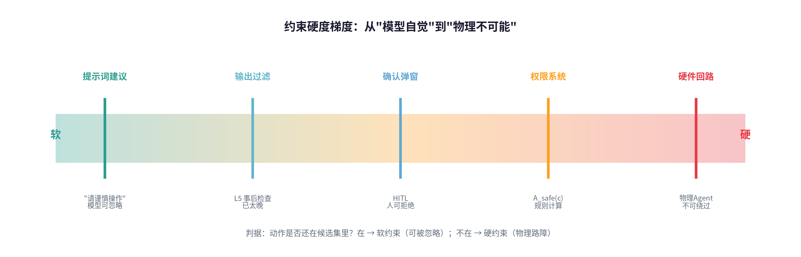

> **现状与判断**：护栏层和验证层正在引入形式化方法。类型系统、策略语言、形式验证等传统符号方法开始进入 Agent 的安全层，用于做约束检查和正确性证明：RefineAct 从用户指令自动推导形式化规范、逐动作运行时验证，ToolEmu 上把失败率从77%降到39%；^[114]^ShieldAgent 从政策文档提取可验证规则，对被保护 Agent 的动作轨迹做形式化验证，规则召回90.1%、API 查询减少64.7%。^[115]^这不是“neuro-symbolic 是 Agent 必经之路”那种全栈范式转换，而是在验证（V）和治理（G）这两个特定层（ETCLOVG 七层分类中的第六、七层，见第3章系统维度），符号方法因为其可审计性而具有独特价值。

> **跨篇引用**（两个术语来自《基座模型》§6.4：残差流＝Transformer 每层把子层输出加回输入形成的那条向量通路，激活引导＝不改权重、只在推理时往这条通路里加减一个方向）：护栏层改变可行动作集合是从**外部**约束模型；激活引导（steering）改变内部表示是从内部引导模型。两者互补不互替——拒绝行为在残差流中是一个线性可分的方向，增强这个方向让模型更安全，压低这个方向就是越狱。^[67]^但 steering 向量的 non-identifiability（同一干预方向可能对应多种解释，无法唯一归因）决定了内部干预不能完全信任，外部硬约束仍是最后一道防线。可解释性（SAE＝稀疏自编码器、电路追踪＝把计算拆成可解释的子结构、J-space＝模型中自发涌现的全局工作空间）提供了观测模型内部状态的“X 光”，让护栏层的设计从“盲堵”变成“看准了再堵”。详见《基座模型》§6.4。

> **新进展**：护栏层开始有自己的传感器。 2026年的两个工作把“看准了再堵”做成了工程品：TRACES 让观察者模型从被审 Agent 的隐藏表示中学习“轨迹风险状态”，只用轨迹级弱监督就产出逐步稠密的风险估计——把事后审计前移到风险酝酿的中途；^[68]^AEGIS 在推理时等距钩住4层、把16,384维激活压到64维、对干净质心算余弦距离，AUROC（区分正负样本的能力，1为完美）0.95–1.00、单次检测0.47–2.40ms、不重训（预印本，未经同行评审）。^[69]^驱动力是一个令人不安的趋势：推理正沉入潜空间（循环深度、潜通信，见《基座模型》§3.3、§6.4），思维链可能不再可读——41位研究者联署把 CoT 可监控性称为“新的且脆弱的机会”，^[70]^GPT-6 Astra 则被爆料为保持思维链可读而人为限制了循环深度（媒体爆料，未经官方证实）。^[71]^当思考不再经过文字，护栏的观测面也得跟着沉下去。

## ▽ 6.5治理（G）：从技术问题到制度问题 {#sec-治理层-G}

治理（G）被单列为独立层，是因为 Agent 的可靠性不只是技术问题，也是制度问题。NIST AI Risk Management Framework 1.0把 AI 风险管理拆成 Govern、Map、Measure、Manage 四个核心函数：先建立治理结构，再识别使用场景和风险，随后度量风险，最后持续管理和改进。^[72]^放到 Agent 上，就是权限边界、风险分级、全过程留痕和责任归属必须进入系统设计，而不是事故之后再补文档。

确定性回放是治理的技术基础：相同输入必须产生相同决策路径，否则审计无从谈起。但金融领域的实证研究发现了一个反直觉结论——决策确定性和任务准确性不相关（相关系数 $r = -0.11$）。^[73]^模型可以是确定性的但不准确，也可以是准确的但不具确定性。这意味着可审计性和准确性必须独立测量，不能假设一个蕴含另一个。

物理 Agent 的治理更硬。人民网吉林频道报道的人形机器人产业专项行动要求完善黑匣子安全能力：持续记录关节力矩、电机温度、控制指令序列、环境传感器读数，一旦发生碰撞、跌落或误操作，这些数据就是还原事故过程的关键证据。^[74]^Google DeepMind 的 AI Control Roadmap 把纵深防御（defense-in-depth）列为策略（该原则源自更早的安全工程传统）：沙箱、端点安全、提示注入防护、模型对齐、系统级安全，多层叠加。^[75]^这些要求的共同点是：风险管理覆盖设计、开发、部署、使用和评估全过程。

清单化是治理落地的最后一步。OWASP 的 MCP Top 10（测试版）是首批针对“模型-工具连接”场景的安全清单，清单的收束与本节同构：纵深防御，身份、隔离、签名组件、持续监控缺一不可。^[76]^

<details>
<summary>展开：十项风险在本书中的对应（举例）</summary>

十项风险大多能在前文找到对应物：工具投毒与软件供应链攻击（MCP03/04）对应 §6.1的 ClawHavoc 与 SkillTrojan；命令注入（MCP05）靠执行沙箱与白名单兜底；审计遥测缺失（MCP08）正是全过程留痕的反面。
</details>

两项是本书尚未展开的新问题：影子 MCP 服务器（MCP09）——绕过治理私自挂载的实例，资产管理上的盲区；上下文过度共享（MCP10）——任务边界不清导致敏感数据外泄。后者尤其值得记住：它说明上下文工程不仅决定实现率（§6.2），也决定泄露面——给 Agent 备什么料，同时是在划它的保密边界。

这些治理要求的共同点是：它们不在模型内部，而在 Harness 里。模型不会自我审计，是 Harness 在记录、验证、约束、追责。

## ▽ 6.6循环自身的失效模式与终止工程 {#sec-循环失效与终止工程}

章首的四类失效发生在单步执行上——跳步执行、工具调用错误、不分类型的修改、错误传播，靠工具管道和护栏逐条堵住；多 Agent 拓扑会把同类缺口沿协作路径逐级放大（第7章展开）。而循环作为整体，还有两类自己的失效：每一步单独看都没有做错，坏在循环的设计本身^[17]^：

**Loopmaxxing**（循环崇拜）：假设“跑足够多轮总能出正确结果”。这本质上是 RL 中纯随机搜索的谬误——没有梯度信号指向改进方向时，迭代本身不是优化。触发条件有三个：目标缺乏可检查的成功条件（“改善用户体验”没有客观停止点）；验证信号太粗（1000个测试的二值 pass/fail 不提供修复梯度）；Agent 的能力根本不够，无论迭代多少次都解不了。Loopmaxxing 和章首四类失效中的“错误传播”不同——错误传播是反馈未被正确利用，Loopmaxxing 是反馈根本不存在或太粗，循环在原地空转。

**理解债**（Comprehension Debt）：当循环修改代码的速度超过工程团队审查的速度时，仓库中存在的代码和人类理解的代码之间的差距持续增长。与技术债（代码自身携带）不同，理解债存在于团队头脑中，沉默复利，直到危机迫使某人调试一段设计决策完全未映射的代码。同样一个循环，跑在工程师深度理解的工作上就加速产出；跑在工程师想逃避理解的工作上，就制造一个加速的螺旋式不理解——同一机制，相反结果。区别在于人是继续做工程师，还是退化成按“启动”按钮的人。

这两类失效指向同一个结论：循环放大工程能力，不替代工程能力。一个目标定义不良的循环，会以极高的效率追求错误的东西。

**终止工程**：循环的另一半设计。朴素循环的标志性失效是它永远不停。生产级循环必须携带多个独立的退出条件^[17]^：

| 退出条件 | 触发 | 性质 |
|:---|:---|:---|
| 目标达成 | 验证器确认任务完成 | 唯一成功终止 |
| 硬迭代上限 | 步数到达上限（典型20-50） | 安全网 |
| 预算耗尽 | token / 时间 / 金钱超限 | 安全网 |
| 无进展检测 | 最近 $k$ 步状态无可度量的变化 | 最重要的安全机制 |
| 致命错误 | 凭据缺失、基础设施故障等不可恢复条件 | 硬终止 |

硬上限、预算耗尽和致命错误是机械的——设一个阈值或条件，触发就停。真正难的是无进展检测：怎么判断循环“没在进展”而是在空转？四种检测信号^[17]^：

- **输出哈希比对**：连续3次输出或文件状态完全相同，说明循环在原地打转。
- **错误重复**：同一条错误信息连续出现 $k$ 次，说明 Agent 卡在同一堵墙前。
- **指标平台期**：数值信号（测试通过率、验证损失）在 $k$ 步内改善量不超过 $\epsilon$，说明收敛已经停滞。
- **Diff 熵**：每轮代码变更量趋零——Agent 在做越来越小、越来越无关紧要的修改，看起来在动，实际没走。

检测到停滞后，正确的动作不是继续迭代，而是**升级**：保存当前状态，把控制权交还人类或上层编排器。

但循环还有另一种隐蔽的停滞：不是完全不动，而是困在局部最优里——反复用同一种失败策略做微小变体。这正是引子提到的 RL 探索-利用失衡在循环中的重现。对策不是给更多算力，而是强制改变方向：连续失败超过阈值后触发反思步骤，让模型明确思考“有没有根本不同的路线”；^[17]^提升采样温度强制输出多样性；记录失败策略而非失败动作（“改 handler 失败3次，换改 schema 试试”）；最干净的一招是派一个全新子 Agent，用空白上下文从零开始——它不会被累积上下文带进同一条惯性路径。

这几种机制的底层逻辑各不相同：反思改方向、温度改分布、策略记忆改路线选择、子 Agent 隔离改上下文，§6.2的子 Agent 上下文隔离技术在这里有了第二个用途。

终止工程管“循环怎么停”，护栏管“不该发生的事不发生”，治理管“出了事查得清、责任可追溯”。

## 6.7 延伸：同一闭环，搬进物理世界 {#sec-闭环-物理世界}

收尾之前，把整套框架往一个更苛刻的环境里推一步——物理世界。送货机器人、手术机械臂、自动驾驶，跑的仍是同一个 POMDP 循环、同一套六层，但四个在数字世界被弱化、在物理世界硬化的约束会改写每一层的账单：**不可逆性**（动作做出去就收不回）、**成本高昂**（部署成本比数字世界高上千倍）、泛化困难（Sim-to-Real Gap，仿真里练出的本事上真机要打折）、安全硬约束（毫秒级决策，出错就是物理事故）。这里只看四条约束对六层及学习环节各自的加固要求：

| 层 | 数字 Agent | 物理 Agent 迁移要求 |
|:---|:---|:---|
| L1 推理 | 云端大模型，秒级响应 | 端侧小模型做毫秒级反射 + 云端大模型做秒级规划（端云分层） |
| L2 工具 | 标准化 API，即插即用 | 电机/传感器驱动，需物理验证、磨损监控、冗余 |
| L3 记忆 | 语义检索为主 | 叠加传感器噪声过滤、环境变化在线适应 |
| L4 编排 | 可回滚，超时重试 | 不可回滚动作必须前置审批；紧急停止优先级最高 |
| L5 评估 | 输出质量评分 | 力/位移/接触的物理验证（传感器是“真相来源”） |
| L6 护栏 | 软件拦截，可审计 | 硬件级安全回路，独立于上层 Agent（好比电梯的防坠装置） |
| 学习 | 低成本仿真训练，无限试错，并行扩展 | 真实世界因果反馈稀缺，Sim-to-Real Gap 难以跨越，数据采集昂贵 |

这一节不是给物理版六层各自打补丁，而是拿四个约束当公理、逐层推出加固要求。用 §6.4的记号说，就是 $\mathcal{A}_{\text{safe}}(c)$ 被压小了两个量级——大多数错误不可回滚，试错成本高到不允许试错，安全约束必须烧进底层控制器，上层 Agent 无权覆盖。已有研究表明，对具身 Agent 的越狱攻击可以转化为真实世界的物理动作。这让 L6 从软件最佳实践升级为物理安全必要条件，护栏硬度沿着图14那条梯度一路顶到硬件端。^[77]^端云分层也是同一推导的产物：紧急制动的毫秒级反射等不起云端往返，必须在端侧完成，复杂规划才放云端——这不是架构偏好，是约束硬度的必然。

动作生成也换了形态：物理 Agent 输出的不是词表里的 token，而是连续的力矩和位移。动作生成有离散与连续两条路线——RT-2 式 VLA 把动作映射为离散 token/bin；π0与扩散策略直接学连续动作分布，天然处理多峰任务。两条路线不互斥，常按任务阶段组合使用。

这笔迁移还是一笔双向账：数字 Agent 给物理世界的，是验证过的架构模板——编排、记忆、日志、错误恢复不必重新发明，但要加固；物理世界回馈的是因果经验——碰撞检测里学会的力反馈调整，反过来启发数字 Agent 处理资源冲突。

图15：数字 Agent vs 具身智能（定性示意，非实测打分）

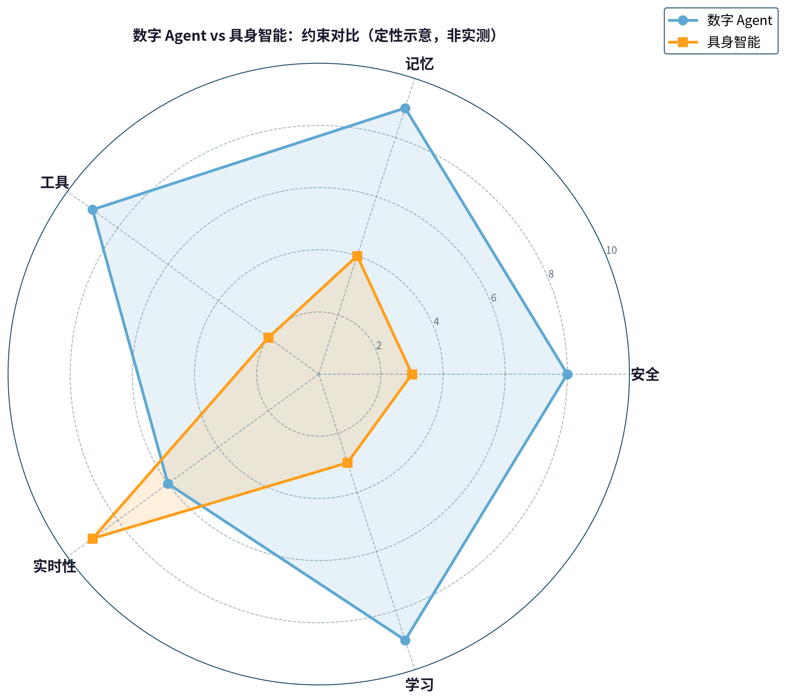

雷达图把两侧互为镜像的关系画在了一起：数字侧的优势（可回滚、标准化、低成本仿真）正是物理侧的挑战（不可逆、需物理验证、现实数据稀缺），而物理侧倒逼出的升级（毫秒级反射、硬件级安全回路、在线噪声适应）反过来又成为高实时、高安全数字场景的参考。

务实的判断：受限工业场景（仓储拣选、工厂物流）会先规模化，家庭等开放场景需要更长周期的工程突破；物理数据太宝贵，边做边迭代，不等数字世界完美。物理 Agent 不是“数字 Agent 加硬件”——是同一套闭环被四个约束逐层改写的结果。

## 6.8 协作层：协作放大缺口，不制造能力 {#sec-协作层-放大缺口}

前面讨论的 Harness 六层都默认单个 Agent 在工作。多 Agent 协作把每一层的缺口都放大一遍——编排层要管多个循环之间的依赖、评估层要能跨节点追失败根因、护栏层要在节点/结构/平台三层同时布防。多 Agent 系统的失败根因往往跨节点传播，看到错误的地方不等于制造错误的地方，这些具体机制留到**第7章**展开。这里先记住一条：**协作放大缺口，不制造能力**。

## 6.9 AI落地

Harness 六层的现状与缺口，直接决定工程投资方向。落地要点：

①评估层是最大缺口——先建可观测性（Agent 在做什么），再建评估（做对了没有），别把二者混为一谈；

②护栏层现成方案最少、最关键——硬约束（权限系统把关生效边界）是它的实现方式；

③验证门是分界线——任何让 Agent 可靠产出的系统都有外部验证门（Agent 生成候选 → 外部验证器独立判定 → 采纳）；

④循环必须有终止工程——硬上限、预算、无进展检测，不能靠模型自觉停；

⑤投入优先级一句话：权重定上限，上下文定发挥，评估器定去留——上下文工程与专有评估集是应用团队自己能建的两件，也恰恰是多数团队还没建的两件。

## 6.10 常见误解

**常见误解**：“验证门 = 有测试就行”。不是——测试是验证信号的一种，但验证门的关键是“外部独立判定”：Agent 生成候选，外部验证器独立判定，制造者和检查者分离。让模型评判自己的输出（LLM-as-judge 自评）是验证门最弱的一环。另一个误解是“可观测性 = 评估”——§6.3开头那句区分值得再读一遍：两者缺一不可。

但也不能走另一个极端。智谱唐杰的判断值得记住：“Agent 组织模型能力，不创造模型能力。基座模型停滞，Agent 就到天花板”。^[39]^PlanBench-XL 基准的数据证实了这一点：GPT-5.4 在正常条件下51.9%的通过率，在对抗性工具阻断下暴跌到11.36%——自适应重规划是模型能力缺口，系统兜不住。^[39]^在前沿（12小时自主任务、1000次工具调用链条），模型是硬限制，系统是后勤保障；在部署边缘（从 demo 到可靠产品），系统是决定成败的地方，模型是已给定的条件。两个尺度上，瓶颈位置不同。

## 6.11 本章回顾

Harness 六层的现状与缺口是工程投资的决策框架——L1、L2 可以直接依赖（推理在演进、工具在标准化），L3、L4 各有功课（记忆在补治理、编排在巩固），真正的缺口在 L5 评估（最大的缺口）、L6 护栏（现成方案最少）、治理（制度问题）。各层互相拉动——新模型暴露新缺口，新系统释放模型新能力，未来的竞争是模型和系统的协同完整度。

可靠产出靠外部验证门，循环可靠性等于最不可靠的验证步骤；循环本身还有 Loopmaxxing 和理解债两类失效，需要终止工程收尾。延伸节把同一套加固逻辑推进物理世界：四个约束把可行动作集合压小两个量级——记住一句话：数字世界可以回滚，物理世界没有 Ctrl+Z。下一章走出单循环，看多个 Agent 怎么分工，也怎么放大缺口。

**本章自检**：

1. Harness 六层里哪些可以直接依赖、哪些得自己补？评估层为什么是最大的缺口？可观测性和评估的区别是什么？ {#q-c6-un01}

   **你的场景**：你现在最常用来干活的那个 AI 用法，装了可观测性吗？装了评估吗？只能先补一样的话你补哪样——为什么？

2. 什么是静默失败？为什么护栏在输出层过滤已经太晚？外部验证门的结构是什么？ {#q-c6-un02}

   **你的场景**：回想最近一次 AI 帮倒忙——它是一开始就报错，还是全程说“已完成”、最后才发现结果不对？如果是后者，你当时有哪道“门”能提前拦住它？

3. 护栏层的数学本质是什么？$\mathcal{A}_{\text{safe}}(c)$ 的四个约束分别是什么？上下文变化如何影响可行动作集合？ {#q-c6-un03}

   **你的场景**：给你的 AI 用法列一张动作清单：哪些动作无论模型怎么请求都不该发生？它们是否随上下文变化——同一个“发邮件”，草稿态和发送态的允许性一样吗？

4. 硬约束裁剪和拉格朗日经济惩罚是两种什么不同的实现？为什么实践中护栏层以硬约束为主？ {#q-c6-un04}

   **你的场景**：你的护栏里，哪些是“提示它小心”（软），哪些是“物理上做不到”（硬）？把最危险的那条从软改成硬，代价是什么？

5. 治理（G）为什么被单列为独立层？决策确定性和任务准确性是什么关系？确定性回放为什么是治理的技术基础？ {#q-c6-un05}

   **你的场景**：如果你的 Agent 明天出一次事故，你能把它当时的每一步完整重放一遍吗？还缺什么才能做到？

6. 上下文工程的三种长任务技术分别作用于上下文四层的哪一层？注意力预算是什么？ {#q-c6-un06}

   **你的场景**：挑一个你会跑很久的 AI 任务（比如连着几天改一个项目），几种长任务技术你会先上哪个？为什么？

7. “协作放大缺口，不制造能力”是什么意思？PlanBench-XL 的数据说明了什么？ {#q-c6-un07}

   **你的场景**：你手头有个单 Agent 做不好的任务。在加第二个 Agent 之前先回答：它的失败是能力不足，还是缺口没补？如果是后者，加 Agent 会怎样？

8. 专业领域应用为什么说“一大半功夫在备料”？领域知识供给的四件事是什么？引入第三方技能包要额外当心什么？（§6.2） {#q-c6-un08}

   **你的场景**：挑一个你的专业领域，说出“备料四件事”在你这儿分别是什么；如果引入第三方技能包，你最当心它带进来的三样东西是什么？

9. 物理世界给 Agent 额外带来哪四个约束？Harness 六层从数字迁到物理，每层要加固什么？（§6.7〔闭环-物理世界〕） {#q-c6-un09}

   **你的场景**：把你现在做的数字任务想象成让机器人去做——多出来的四个约束里，哪一个最先卡住你？为什么？

10. 为什么物理 Agent 更依赖端云协同？VLA 和扩散策略各有什么特点？（§6.7） {#q-c6-un10}

    **你的场景**：如果你的 Agent 要在网络不稳定的环境里干活，端和云怎么分工？哪些能力必须放端上？

11. 章首导语的四类失效各挂在 Harness 六层的哪层缺口、POMDP 七元组的哪个元件？工具调用五步管道各挡住哪类失效——第3步执行失败时管道怎么走？MCP 与 A2A 分别管什么？（第6章开篇） {#q-c6-un11}

    **你的场景**：挑一个你见过的 AI 翻车案例，把它归到四类失效中的一类，再往上挂到六层的某一层缺口——然后问自己：这一层你打算怎么补？

> **未解问题**：单 Agent 不够时，多 Agent 怎么协作？

 * * * 

# 第7章：协作——从单循环到多循环 {#ch-7}

单循环的故事到这里讲完了：六层框架、它的缺口，以及它在物理世界的极限形态。还有一条路没走：一个 Agent 不够用的时候，多个 Agent 一起上——分工带来效率，也带来新的翻车方式。

> 多个 AI 一起干活，怎么分工、怎么协作、怎么不出错？五种拓扑解决横向分工，纵向分层解决抽象递进；AgentFail 三层十六类揭示失败根因会跨节点传播；人在环中始终是一等节点。

> **本章路线**：先看编排模式、AgentFail 与上下文隔离，再看人在环与协议。


> **核心决策**：
>
> 1. 多 Agent 解决复杂度，不是速度。
> 2. AgentFail 三层十六类揭示失败根因和暴露位置可以隔很远。
> 3. 人在环中始终是一等节点。

> **开始前自检**：
>
> 1. 多个 Agent 一定更好吗？
> 2. 协作失败为什么难排查？

前面六章讲的都是单 Agent。但真实业务里越来越多的任务需要多个 Agent 分工，协作把整个 Harness 重新展开一遍：动作空间、观测空间、状态转移、评估、护栏，每一项都要在 n 个循环之间重新定义。

用 POMDP 的语言说，单 Agent 是一个 $(\mathcal{S}, \mathcal{A}, \mathcal{O}, T, Z, R, \gamma)$，多 Agent 是 n 个 POMDP 的联合：动作空间变成 $\mathcal{A}^n$，观测空间变成 $\mathcal{O}^n$，编排层做的是对联合信念状态的近似管理。问题从“一个人怎么做事”变成了“一群人怎么做事”。

这场协作像一场联合作战。陆军、海军、空军平级分工、各有打法，对应多种编排拓扑的横向分工；战区司令、军长、营长分处不同时间尺度、不同抽象层次，高层定战略、下层管执行，对应纵向分层。每个军种只看见自己的战场情报，司令只收战报摘要，不背每个士兵的行动日志——这就是上下文隔离；战略武器和重大决策要最高层授权——这就是人在环中，人类保留不可逆动作的最终决策权；跨军种靠联合作战条令和通信频率沟通——这就是 MCP 与 A2A 协议。前线情报一旦出错，会层层上报、让司令基于错情决策，直到后方才发现：失败根因和暴露位置可以隔得很远。而联合作战有个残酷定律：整体强度是各军种强度的连乘——恒低于最弱的那一军种，参战方越多，乘进去的折扣越多。多 Agent 协作一模一样，只是编排层更像联合作战参谋部，职责是协调全局，让每个 Agent 放手打自己的仗。

## 7.1 五种编排模式与它们的失效面 {#sec-五种编排模式}

行业实践收敛出五种主流拓扑（§6.1讲的是单闭环内控制流怎么编排，这里讲多个 Agent 之间怎么分工）。^[78]^每种拓扑都有偏爱的场景和典型失效模式：

| 模式 | 结构 | 适用场景 | 关键失效模式 |
|:---:|:---|:---|:---|
| Supervisor | 中央协调器委派给专业子 Agent | 客服、采购自动化 | 主 Agent 上下文被子 Agent 中间结果淹没 |
| Pipeline | 顺序链，输出作为下一步输入 | 文档处理、审批流 | 上游错误沿管道放大，越走越远 |
| Fan-out | 并行分发，聚合结果 | 竞品分析、多源检索 | 聚合环节缺一致性校验，结论互相打架 |
| Debate | 多模型并行 + 裁决模型 | 高风险决策 | 同基座 + 相似 prompt 导致集体附和 |
| Swarm | 动态对等 Agent 群体 | 大规模自主编码 | 全局预算失控，成本呈几何级数 |

图16：五种多 Agent 编排拓扑

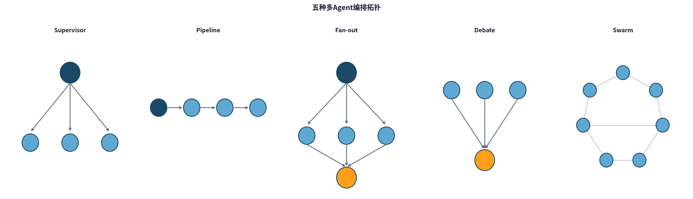

Supervisor 是生产中最常见的拓扑：LangGraph 发布的 Supervisor 库，CrewAI 默认采用此模式。^[78]^Swarm 适合大规模自主任务，产品级 Agent Swarm 已支持数百个子 Agent 并行执行数千步协作。^[78]^模式越复杂，协调开销和故障传播风险越大。

上面五种拓扑都是横向分工——平级 Agent 各管一摊，解决“不同任务谁来做”的问题。但生产中还有一类更常见的结构，是**纵向分层**：把任务按抽象层次切开，高层定战略并验收、中层分解任务、下层执行，每一层只在自己的时间尺度和抽象层次上工作。这不是五种之外的第六种拓扑，而是可以叠加在任意横向拓扑上的纵向结构。

横向分工解决空间上的并行，纵向分层解决抽象层次上的递进——不同抽象层次的决策，时间尺度、不确定性、对能力的要求完全不同，混在同一个 Agent 里会让它既做不好高层战略，也做不好下层执行。分层之后，每一层只需要管好自己尺度内的事，效率和可靠性都会提升。

引子里的 Co-Scientist 就是分层协同的例子：生成层与辩论层在模型内部以秒到分钟级的节奏轮转，最下游的实验验证层回到物理世界的周月级节奏，层间以明确的接口交接。^[5]^§6.7的端云分层沿用了同一个原则：端侧小模型做毫秒级反射（紧急制动），云端强模型做秒级规划（路线优化），人类做分钟级审批——层级不同、时间尺度不同，但“每层只管自己尺度内的事”的分层思想一致。^[21]^这样分层互不越级干扰；代价是层间接口（目标怎么分解、结果怎么回传、异常怎么升级）必须显式定义，否则信息在层间丢失。

## 7.2 失败根因：AgentFail 三层十六类 {#sec-失败根因}

多 Agent 失败不是单点故障的简单叠加。一项针对平台化 Agent 工作流的实证研究（AgentFail）收集了307个真实失败案例，把失败根因按抽象层级归并为三层十六类^[79]^：

F1 节点级（LLM & Agent 单节点内部，7类）——工具/动作规划错误、响应格式错误、响应内容偏差、知识/推理局限、Prompt 设计缺陷、语言/编码缺陷、工具调用/知识库检索错误；F2 结构级（工作流拓扑层面，7类）——输入校验缺失、节点依赖不合理、循环 / 死锁、条件判断错误、任务分解不当、上下文冲突、跨 Agent 工具/接口不匹配；F3 平台级（底层运行时，2类）——网络 / 资源波动、服务不可用。十六类逐项清单见原文与下面的图。^[79]^ 每一类内部的编号按上面列出的先后顺序排——F1.1 是第1个、F1.2 是第2个，依此类推，F2 与 F3 同理（例：F2.5 ＝ 任务分解不当，F3.1 ＝ 网络/资源波动）；本节后面的走查和四条修复策略都按这套编号指认。 

图17：AgentFail 三层十六类失败根因

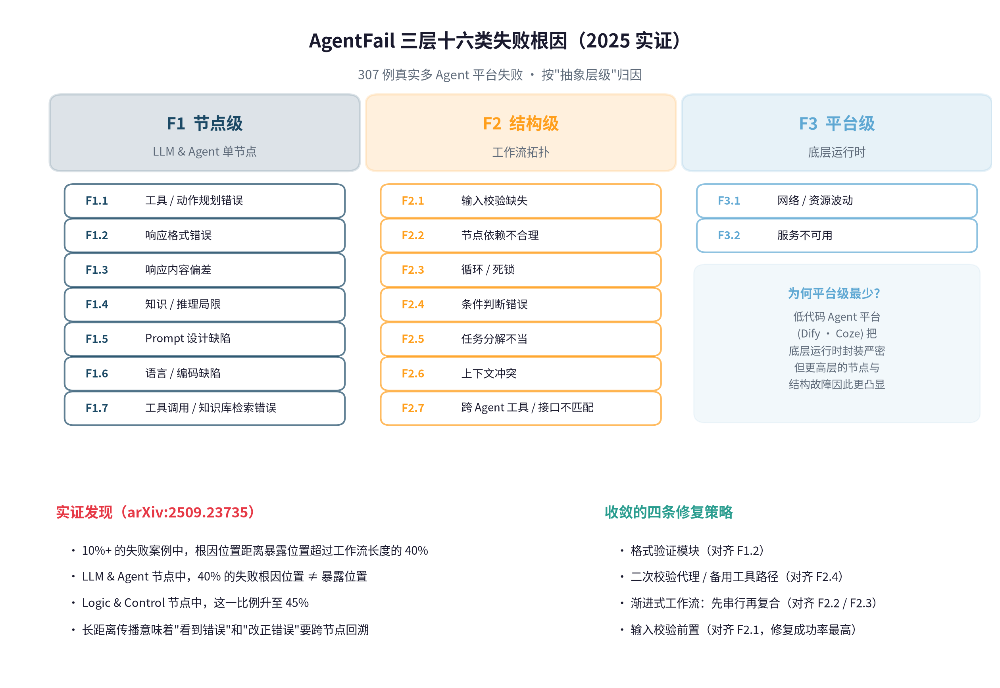

这个分类的价值在三个实证数字。第一，10%以上的失败案例中，失败根因位置距离暴露位置超过工作流长度的40%。第二，LLM & Agent 节点中，40%的失败根因位置 $\neq$ 暴露位置。第三，Logic & Control 节点中，这一比例升至45%。

**走一遍**：3节点 Pipeline 的错误传播

文档处理流水线：A（OCR 提取）→ B（翻译）→ C（摘要）。

| 步骤 | 节点 | 输入 | 输出 | 问题 |
|:---:|:---:|:---|:---|:---|
| 1 | A: OCR | 扫描 PDF | “2021年营收增长40%” | **失败根因**：原文是“2024”，OCR 把4认成1（F1.3 响应内容偏差） |
| 2 | B: 翻译 | A 的输出 | “Revenue grew 40% in 2021” | 忠实翻译了错误数据——B 没有校验年份是否合理（F2.1 输入校验缺失） |
| 3 | C: 摘要 | B 的输出 | “该公司2021年表现亮眼...” | **暴露点**：用户看到摘要发现年份不对 |

用户在 C 的输出里发现错误，但**失败根因在 A**——距离暴露位置2跳。如果只在 C 加“输出检查”（检查摘要质量），永远抓不住这类错误，因为 C 的摘要逻辑本身没问题。修复策略：在 B 的输入端加校验（“年份是否在合理范围内？”），把错误挡在传播之前——这正是 AgentFail 四条修复策略中成功率最高的**输入校验前置**。

第6章的四类失效是单 Agent 视角下的翻车模式，AgentFail 是它在多 Agent 拓扑上的展开。两组分类并不矛盾：F1 大致对应单 Agent 的四类失效在节点内部的再现，F2 是拓扑层新增的失败面，F3 是运行时基础设施的失败面。多 Agent 系统的护栏必须在这三层同时布防，缺一层就会在那一层反复翻车。

另一项覆盖更广的分析把1600多条多智能体轨迹标注成失败分类学（MAST）：14种失败模式收进三类——系统设计、智能体间失配、任务验证；标注者一致性 κ=0.88。它的结论与本节一致：多 Agent 的收益常常很小，瓶颈更多在协调与验证，而不在单点能力——“多请几个 Agent”不是免费午餐。^[108]^

AgentFail 的作者们还测出四条收敛的修复策略：格式验证模块（对齐 F1.2）、二次校验代理与备用工具路径（对齐 F2.4）、渐进式工作流即先串行再复合（对齐 F2.2 / F2.3）、以及修复成功率最高的**输入校验前置**（对齐 F2.1）。^[79]^这些策略的共同点是把校验提前到“错误还没传播出去”的位置——正是护栏层的核心思路。

## ▽ 7.3上下文隔离：Sub-agent 架构 {#sec-上下文隔离}

多 Agent 除了分工之外，还有一个常被忽略的正当理由：**上下文隔离**。第6章的记忆层提到，Agent 每步都要动态组装上下文，长任务会遭遇上下文腐蚀——无关信息拖低推理质量。Anthropic 在工程博客里把这条痛点单列为 Sub-agent 架构的核心动机：让每个子 Agent 只看见它需要的那部分上下文，主 Agent 只接收结构化的结论摘要，而不是子 Agent 的完整推理过程。^[53]^

这不是炫技的多 Agent，而是工程化的注意力预算管理。判据很简单：如果一段推理不需要主 Agent 的完整历史，就把它派给子 Agent；主 Agent 只保留任务图谱和关键决策。Deep Research、Claude Code 的深度调研模式都是这个思路的产物。^[53]^

## ▽ 7.4人在环中：HITL 作为特殊节点 {#sec-人在环中-HITL}

多 Agent 图上还有一类特殊节点——人类。它延迟极高（分钟级到小时级），带宽极低（每次只能审批一两个决策），但人类是最终责任承担者，不可逆动作和低置信度分支的最终决策权必须留在人手里。设计要点是提供公正易懂的材料辅助人类决策，而不是每步都问。

LangGraph 把 HITL 的工程模式收敛为四种：

- **高风险操作审批**：转账、删库前中断，人类返回 True/False。
- **AI 内容人工审阅**：生成草稿后暂停，人类修改后传回覆盖状态。
- **工具调用拦截审查**：在工具函数内中断，人类可批准、拒绝或改参数。
- **表单循环校验**：`while` 循环多次 `interrupt()` 直到输入合规。

底层机制统一为 `interrupt() + Command(resume=...) + Checkpointer`：暂停时把状态持久化，恢复时从中断点重入。^[80]^

但 HITL 有个前置问题：Agent 得知道什么时候该问。HiL-Bench 基准专门测这个能力，提出 Ask-F1 指标同时惩罚过度问和该问不问，实证发现前沿模型在这个指标上表现都不佳——它们要么问得太少（错过关键干预点），要么问得太多（把用户当客服）。^[81]^这解释了为什么工程实践里 HITL 的触发条件必须外置在编排层，而不是让模型自己判断：置信度低于阈值、动作在敏感清单上、连续失败超过阈值——这些规则要显式写进状态机的边，不能靠模型自觉。

实践给“不必每步都问”补了更深的理由：**审批流会变成橡皮图章**（§4.4〔每步都问-反而更危险〕）。Claude Code 已把 auto mode 设为默认——安全分类器判定安全的动作不再逐步确认，人只在破坏性、不可逆、越权或环境外的动作处出现；^[26]^“何时问人”仍由外置的规则与分类器决定，而不是模型自觉。人在环中的位置没有消失，而是从“每步把关”收缩到“高风险裁决”——与 Ask-F1 的教训同向：问得太多，人就成了客服。

把这个思路缩到最小就是白名单：只读工具放行，改数据的动作在入口抛错——人类必须显式承担这类动作（本附录 Part 1第二、三站有能跑的例子）。人不是被替代，而是被**编译进工作流图谱**成为可寻址、可中断、可回溯的一等公民节点。^[80]^

## ▽ 7.5协议：协作的公共语言 {#sec-协议-协作的公共语言}

多 Agent 协作要跨团队、跨厂商，就必须有共同语言。这套语言分成两层：**MCP** 管 Agent 和工具之间的连接，**A2A** 管 Agent 和 Agent 之间的连接（两者互补不互替，首次介绍见 §3.2〔Harness-六层〕）。^[82]^

ICML 2026接收的 ProtocolBench 首次系统比较了四类多 Agent 通信协议（A2A、ACP、ANP、Agora），结论是**没有万能协议**：不同协议在不同场景下表现差异巨大，选型必须匹配业务特征。^[83]^这也说明协作层的标准化仍在收敛过程中。

协议层之下还在长出更底层的一层：**潜空间通信**。MCP/A2A 规定“怎么说话”，潜通道改变“传什么”——不再把内部计算压成文本，而是直接交接隐状态。LatentMAS 在同构模型间实现了训练免的纯潜空间协作：token 用量降70.8%–83.7%，端到端提速4倍以上；^[84]^产业侧的 Mostik 让 753B 模型只读题、4B 模型只作答，隐状态过桥、全程不出文字，混合系统成本约为全量大模型的1/20（官方单方口径，未公开可复现细节）。^[85]^边界同样明确：文本交接天然留下审计痕，潜交接不可读——§7.6要求的跨交接 trace 级评估在潜通道上不天然成立，观测面必须另建（见 §6.4护栏层的运行时监测）。

**核心判断**：多 Agent 不是堆更多 Agent 就自然更强——正确分工能分解复杂度，让每个 Agent 专注解决自己擅长的子问题，这是多 Agent 的优势；但协调成本随 Agent 数量快速增长，并且**单 Agent 每一层的缺陷**（幻觉、错判、上下文错位），会沿着协作路径传播——n 个节点串联会把它逐级放大（n 为协作路径上的 Agent 数量）。评估层要能追失败根因到具体节点，护栏层要在节点/结构/平台三层同时布防，编排层要管好上下文预算和 HITL 触发。协作系统的强度是各节点强度的连乘——它总低于最薄弱的那一层，节点越多，乘进去的小于1的因子越多。

## 7.6 AI落地

多 Agent 不是堆数量，是选拓扑。落地要点：

①先问“这个任务需要 n 个 Agent 吗”——能单 Agent 解决就别上多 Agent，协调成本随数量快速增长；

②选拓扑看任务特征——文档/审批流用 Pipeline，并行独立子任务用 Fan-out，高风险决策用 Debate，大规模自主用 Swarm；

③无论哪种拓扑，护栏必须三层同时布防（节点/结构/平台），因为失败根因和暴露位置可以差很远；

④HITL 触发条件外置在编排层，置信度阈值、敏感动作清单显式写进状态机的边；

⑤在建第二个 Agent 之前，先把跨交接的 trace 级评估基建建好——两个 Agent 互传上下文已经难以调试，五个没有逐交接评估就不可能调试。^[19]^

## 7.7 常见误解

**常见误解**：“多 Agent = 把任务并行拆开，速度更快”。不是——多 Agent 解决的是“复杂度”不是“速度”：正确分工能把一个大任务分解成可管理的子问题，但协调成本随 Agent 数量快速增长，且单 Agent 每层缺陷会沿协作路径传播、逐级放大。能单 Agent 解决的任务，上多 Agent 只会更慢更贵。另一个误解是“人在环中说明 Agent 不成熟”——HITL 不是过渡，人是被编译进工作流图谱的一等节点。

## 7.8 本章回顾

协作把单 Agent 的 Harness 六层在 n 个循环间重新展开：五种拓扑解决“谁来做”（横向分工），纵向分层解决“谁定战略”（抽象递进）；AgentFail 三层十六类揭示失败根因和暴露位置可以隔得很远——评估层必须能追失败根因到具体节点；上下文隔离是子 Agent 的正当理由（主 Agent 不背子 Agent 的行动日志）；人在环中是一等节点不是过渡。协作强度 = 各层强度的连乘，恒低于最薄弱的那一层——这句话不是悲观，是设计约束：先想清楚最弱一层在哪，再决定要不要协作。记住一句话：**协作放大缺口，不制造能力**。

**本章自检**：

1. 五种多 Agent 编排模式各有什么结构、适用场景和关键失效模式？ {#q-c7-un01}

   **你的场景**：你手上那个多步骤任务，如果只准选一种编排模式，你选哪个？选错了最可能在哪一步翻车？

2. AgentFail 的三层十六类是什么？三个实证数字说明了什么？“失败根因位置 $\neq$ 暴露位置”为什么对评估层特别关键？四条修复策略中哪个成功率最高？ {#q-c7-un02}

3. 子 Agent 上下文隔离的核心动机是什么？HITL 的四种生产模式是什么？为什么触发条件必须外置在编排层？HiL-Bench 的 Ask-F1 指标同时惩罚什么？ {#q-c7-un03}

4. “协作系统的强度是各节点强度的连乘，总低于最薄弱的那一层”是什么意思？ {#q-c7-un04}

> **未解问题**：手工搭的系统能不能自己迭代？

 * * * 

# 第8章：自演化——从搭建到成长 {#ch-8}

第7章把单循环扩成了多循环，第5章还埋了个钩子：skill 是外置认知流程。既然流程是外置的，它就能像代码一样被改、被换、被迭代——前面各章的每一层，规划形态、工具契约、记忆条目、状态图、编排策略、护栏规则、协作拓扑，都是人手工搭建的。它们能不能自己生成、自己迭代？

> 能，但有硬边界。三条路线（Skill / Workflow / 协作拓扑）共享同一闭环；三条硬边界（Library Drift、统计极限、泛化间隙）划出“全自动”的红线——当前的可靠做法是 Agent 生成候选、人类策展验收。

> **本章路线**：先看三条生成/迭代路线与三条硬边界，再看科研自动化、务实判断与跨篇心法。


> **核心决策**：
>
> 1. 自演化的三条主线演化的是外部系统，不是让模型在运行时直接改权重。
> 2. 三条硬边界：Library Drift、统计极限、泛化间隙。
> 3. 可靠模式 = Agent 生成候选 + 人类策展验收。

> **开始前自检**：
>
> 1. Skill/Workflow/拓扑分别是什么？
> 2. “让 AI 自己改进自己”的边界在哪？

这个“能”的范围正在快速移动。

Agent 自主产物已经能产出开放问题的候选成果：FutureHouse 的 Robin 自主提出干性黄斑变性候选药并完成体外验证。^[4]^与之相对，在 Minecraft 攒技能库、修 GitHub issue、解 IMO 竞赛题都是“已知流程”或“有标准答案”范围内的任务。^[86]^Agent 的能力边界已覆盖从“执行已知流程”到“探索未知空间”的全谱。每前进一步，验证机制的负担就更重——Voyager 的技能库只需在游戏里跑通，科研候选则需要实验验证和社区同行评审。

## 8.1 三条生成 / 迭代路线 {#sec-三条生成-迭代路线}

自演化研究收敛出三条互补的路线^[87]^：

**Skill 演化**：从失败轨迹中蒸馏可复用策略，写回技能库。开创性工作是 Voyager——在 Minecraft 里让 LLM Agent 自主习得技能并存入不断增长的技能库。^[86]^

Anthropic 把这条路线产品化，推出 Agent Skills 开放标准（2025.10发布，2025.12开放跨平台）。第5章已详述其设计（SKILL.md 目录 + 三层渐进披露，技能库容量近似无界而上下文预算受控）。^[33]^对自演化而言关键的一点是：开放标准让 skill 可以跨 Agent 平台迁移——规划产物第一次有了可移植格式，演化才有“基因库”可言。

**Workflow 演化**：把 Agent 工作流建模为代码图，用搜索算法自动优化拓扑。ICLR 2025论文 AFlow 用 MCTS（蒙特卡洛树搜索）搜索 workflow 空间，实证发现让小模型跑在优化后的 workflow 上，能以4.55%的成本超过 GPT-4o 直接跑同样任务。^[88]^ADAS（Automated Design of Agentic Systems）把整个 Agent 系统（不只是 workflow）都交给 meta-agent 设计。^[89]^这条路线的价值不在于取代人类设计师，而在于把 workflow 从艺术变成可测量、可对比、可回滚的工程实验。

**协作拓扑演化**：GPTSwarm 把多 Agent 图交给优化器——节点优化 prompt，边优化通信结构。MetaSkill-Evolve 更进一步，把演化过程本身当作 skill 来演化，递归自举。^[90]^

三条路线的共同结构：Agent 生成候选 → 环境反馈打分 → 优胜者写回技能库 / workflow 库 / 拓扑库 → 下一轮基于新库继续演化。这就是一个闭环学习系统，只不过学习对象不是模型权重，而是模型外部的系统。

这正是 §1.6那条协同演进环的系统侧半环：权重不动，Harness 自己迭代。2026年这条线已经长成专门的研究方向——Meta-Harness 让 Agent 阅读以往候选的代码与轨迹、自己搜索并改写 Harness；Self-Harness 用“提议 → 验证 → 回归测试”的循环给 Harness 打补丁。^[91]^但也要泼一盆冷水：有评估研究指出，不少自演化工作把“很多轮里跑出的最好一次”记作改进，又没有留出集对照——把运气当成了收益。^[92]^这与本章后面的三条硬边界互为表里：自演化能做，但“它真的变好了吗”必须能被检验。

三条主线之外还有一条更激进的分支：**自改代码**。达尔文-哥德尔机（DGM）让 Agent 修改自己的代码库，并在编码基准上实测验证每次改动，把更好的版本存进档案、继续演化——它把“改进能力的能力”也纳入了搜索。在 SWE-bench 上，这种开放式自改把成绩从20.0%提到50.0%（Polyglot 14.2%→30.7%），全程带着沙箱与人类监督。它的边界与本节一致：改的是代码与 Harness，不改模型权重；但“自己改自己”把审计与回滚的门槛抬到了新高度。^[109]^

以上几条路线都是单 Agent 的闭环学习。一个问题：一个 Agent 的经验能不能传递给其他 Agent？这是分布式学习的方向。MARS 框架在材料科学里用了9个 Agent 分工，各自跑不同工具链，结果汇总到共享状态——但这是任务内的结果聚合，不是跨任务的经验迁移。目前还没有成熟的跨 Agent 经验传递系统：技能库能不能跨 Agent 共享？一个 Agent 在任务 A 上学到的策略能不能自动迁移给另一个 Agent 跑任务 B？Agent Skills 开放标准（agentskills.io）让 skill 可以跨平台迁移，算是走了一步——但这是人类策展后的静态共享，不是 Agent 运行时的动态学习传递。^[33]^

图18：自演化：三条路线 + 三条硬边界

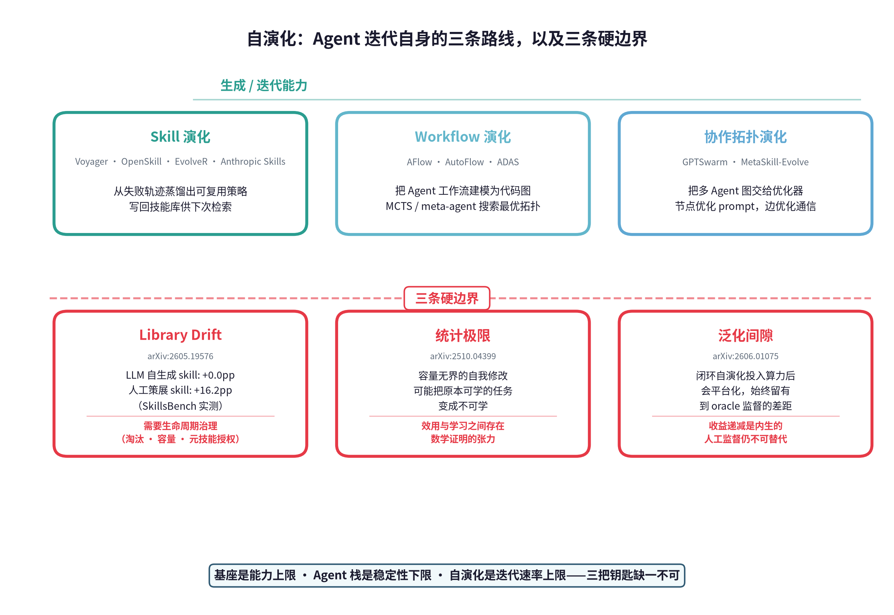

## 8.2 三条硬边界 {#sec-三条硬边界}

自演化不是无限的自我改进。

**Library Drift**：技能库无节制增长会导致检索退化。研究者在 SkillsBench 上做了对照实验，发现 LLM 自主生成的 skill 平均带来 +0.0pp 的性能提升，而人工策展的 skill 带来 +16.2pp。^[93]^差异不在于 LLM 生成的 skill 内容差，而在于缺乏生命周期治理：没有基于结果的淘汰机制（outcome-driven retirement）、没有容量上限（bounded cap）、没有元技能授权先验（meta-skill authoring prior）。技能库会越用越差，直到把优质 skill 也淹没在噪声里。第5章的 skill shadowing 从另一面印证：库不是越大越好，选错比装不下更致命。^[34]^反过来，带治理的演化能越用越好——SkillDroid 把成功轨迹编译成 skill 模板、失效自动重编译，150轮纵向评测里成功率从87%升到91%，无治理的基线从80%退化到44%。^[94]^同样的闭环，加不加治理，方向相反。

**统计极限**：更硬的边界来自数学证明。研究者形式化了自我修改 Agent 的学习理论，证明容量无界的自我修改会让原本可学的任务变成不可学。^[95]^

这里存在一个效用-学习张力：短期追求 utility 的自改会破坏泛化前提。这不是工程问题，是可学习性（learnability）本身的极限。

**泛化间隙**：闭环自演化的经验规律是——投入足够算力后会进入平台期、收益趋平，且始终与 oracle 监督保留一段差距。^[96]^

EvoAgentBench 更进一步验证：没有任何现有自动方法能在所有实验设定下持续正增益，人类策展的能力内容能跨模型稳健迁移，自动生成的不能。^[97]^收益递减是内生的，不能靠再多跑几轮消除。

## ▽ 8.3科研自动化：可能性空间的工业化探索 {#sec-科研自动化}

AI 在科研里的实践，可以归纳为四个层次，各有侧重，互不替代。**数据“翻译官”**：从海量数据中学习输入到输出的预测映射，构建代理模型（surrogate model），把小时级的计算压到分钟级——蛋白质结构预测、材料性质预测都在这条线上。**逆向设计（按需生成）**：把目标性能作为条件，用生成模型在未知空间中直接采样候选的分子、材料与蛋白质序列——先定目标再生成候选，而不是在已知空间里试错。**科学智能体**（Scientific Agent）：以 LLM 为协调中枢，把分子动力学、量子化学、有限元等专用软件串成指令驱动的协作链。**闭环自动化实验室**：把模型设计、模拟筛选与自动化实验设备接成“设计→模拟→执行→实测反馈→模型更新”的回路，把验证周期从人工的数天压到自动的数小时。前两层靠的是模型当预测器与生成器，正是《基座模型》§5.7的专用模型；后两层靠的是系统当编排者与执行者——引子里 Co-Scientist 的“生成-辩论-进化”、第8章开头 Robin 的候选药与体外验证，都属于后两层。

第1章讲过一个判断标准：奖励可验证的任务上，模型会自己长出硬实力。把这个标准搬到推理时，要换一套问法——一个领域的研究过程，能不能写成三样东西？**目标函数**（什么算更好）、**实验流程**（有哪些可执行的动作）、评估器（怎么判定成败）。三件都写得出来，这个领域的解空间原则上就能交给系统去搜索；缺了评估器，AI 只能停在辅助位——产出再多，也得人逐条过目。

这个判据已经有了旗舰案例。看 AlphaEvolve 是怎么搭的：生成器就是现成的 Gemini，真正的设计功夫全花在评估器上——每个问题配一套自动评分函数，进化循环对着评分一轮轮搜索。它交出的成绩单横跨好几个领域：把4×4复矩阵乘法所需的标量乘法次数，从 Strassen 1969年以来保持半个多世纪的49次降到48次；11维 kissing number 的下界推进到593；一个调度启发式平均回收谷歌全舰队0.7%的算力。^[98]^这些突破有个共同点：不是靠换更强的模型，而是靠把“什么算更好”写成了机器能执行的评分函数。这套“生成器现成、评估器自制”的打法也不再是大实验室专属——2026年7月起，AlphaEvolve 开放使用。^[98]^

反面的教训同样清楚。Sakana 的端到端科研系统没有设这样的验证门：独立评估发现，它提议的实验约四成栽在编码错误上。^[99]^没有验证门的自动化，跑得越快，废品越多。

接下来的问题是次序：哪些领域先被自动化？答案就藏在 §6.3的验证信号层级表里，把它反过来读就行——按可验证性排序，确定性检查器在哪一端，工业化就从哪一端开始。代码与形式化数学走得最深：测试套件覆盖全流程，Lean 能对证明做逐步形式化验证。仿真科学居中：材料与药物筛选的计算机模拟段可以自动跑，但结论终究要回到现实核对。湿实验与人因研究还在门外：Robin、Co-Scientist 已能自动提出候选并分析实验数据，但候选到新药仍以湿实验裁决为终点。^[4]^,^[5]^

评估器缺席的位置，实践用社会机制补位。Co-Scientist 让假设互相辩论、按锦标赛排名——相当于把同行评审的逻辑搬进了生成循环内部，它的药物重定位假设后来拿到了体外实验的验证。^[5]^连基准设计都在朝同一个方向走：Long-Horizon Terminal-Bench 把验证器藏进黑箱，防止表面修复，数百步的任务由隐藏评分判定成败。^[100]^

不过，即便三件套齐备，加速也有天花板：整条流水线的速度，由最慢的一环决定。候选生成和计算验证已经工业化，真实世界实验仍保持物理节奏，评审与采纳仍保持社会节奏——只有从头到尾都在数字世界里的闭环，才吃得满量级收益。所以务实的排序是：先把已知模式下可枚举的空间跑完，再谈缺数据领域的自我学习。前者是当下价值的主体；后者受统计极限约束（§8.2〔三条硬边界〕），急不来。

对科研自动化最大的质疑在范式层。世界模型路线的支持者认为，自回归模型缺少物理世界的接地，终将被取代；神经符号阵营认为，幻觉是架构缺陷而非工程瑕疵；ARC 基准的作者 Chollet 则强调：暴力搜索展示技能，不等于展示智力。^[101]^这些质疑值得认真对待，而同一份 ARC-AGI-3 数据恰好给了它们和本书各自的位置：前沿模型的原始得分远低于人类——这是能力缺口；只改上下文策略，得分提高到近三倍——这是系统杠杆。两种读法各自成立：一个说的是绝对水平，一个说的是边际杠杆。合在一起，正是第6章分尺度判断在本章的延长线：本篇不押范式胜负，只讲当前范式下的可靠用法。科研自动化组织并放大模型能力；能力的源头，仍在基座。

## 8.4 务实判断与跨篇心法 {#sec-务实判断-跨篇心法}

三条边界指向同一个结论：当前可靠的做法是“Agent 生成候选 → 人类审核策展 → 治理机制约束生命周期”。Library Drift 的 +16.2pp vs +0.0pp 不是暂时的技术问题，而是当前技术条件下的稳定差距。人类在自演化闭环里的角色，从编写 skill 的人升级为策展 skill 的人——决定什么该留、什么该淘汰、什么该被提炼进 meta-skill。

这个模式在个人尺度同样成立：让 AI 出候选方案，人来挑选与验收；放大到系统层面，就是AI 生成候选工程组件、人类承担策展与验收。

全篇的跨篇心法收成三把钥匙：

- **基座是原生能力上限**——训练完成后，模型参数编码的原生能力就固定了，这是硬件/参数约束下的初始天花板；
- **系统是稳定性下限**——工程系统决定了这些能力在真实任务里能不能稳定跑出来；
- **自演化打开持续增长空间**——自演化不只是加快系统的迭代速度，还能在原生基座基础上，通过**筛选、重组、微调**持续进化，对象可以是 Agent 编排也可以是基座本身，在给定硬件/参数约束下实际提升有效能力。它依然受三条硬边界约束（Library Drift、统计极限、泛化间隙）。

三把钥匙缺一不可。只有基座没有系统，Agent 停在 demo；有系统有基座但没有自演化机制，迭代全靠人力，速度和增长空间都锁死。而自演化本身又受制于效用-学习张力这条数学边界——自演化不是通向超能力的捷径，而是让系统在硬边界内持续迭代的工具。

把第5章的 Skill 讨论放进来，全篇的主线收成一条：认知流程先被**外置**（写进上下文的 skill），再被**内化**（第1章烧进权重的后训练），最后进入自演化（本章的系统自我迭代）。skill 是过渡方案——过渡期多长，由三条硬边界决定，不会自动结束。

## 8.5 AI落地

自演化的落地边界很明确——让 Agent 生成候选，但把策展和验收留给人类。落地要点：

①Skill 演化先做——把失败轨迹蒸馏成可复用策略写回技能库，但必须加生命周期治理（淘汰机制、容量上限、元技能授权）；

②Workflow 演化用搜索算法优化拓扑（AFlow 用 MCTS），把 workflow 从艺术变成可测量、可对比、可回滚的工程实验；

③跨 Agent 经验传递是研究方向，别指望运行时动态学习——先做人类策展后的静态共享（Agent Skills 开放标准）；

④记住三条硬边界：Library Drift（自主生成远逊人工策展，数字见 §8.2）、统计极限（容量无界自改不可学）、泛化间隙（收益递减内生）；

⑤科研自动化的切入点是找能凑齐三件套的环节——§8.3四层次的后两层最典型：先为高频研究环节写出目标函数与评估器，再让系统探索可能性空间，评估器缺席的位置用社会机制（评审、复检）补位。

## 8.6 常见误解

**常见误解**：“自演化 = 让 Agent 自己写代码改进自己”。不是——当前可靠的自演化主要演化的是模型外部的系统（Skill、Workflow、协作拓扑），不是让 Agent 在运行时直接改写自己的权重；即使自演化对象涉及基座模型本身，也是通过筛选、重组、微调这类受控流程（见 §8.1），而不是运行时自主改权重。把失败轨迹蒸馏成 skill、用搜索优化 workflow 拓扑、把协作图交给优化器，才是当前主线的运行时动作。另一个误解是“AI 生成候选 = 全自动”——三条硬边界（Library Drift、统计极限、泛化间隙，见 §8.2）画出的稳定边界是：Agent 生成候选，人类策展验收。第三个误解是“科研自动化 = AI 自己做科学”——写得成“目标函数＋实验流程＋评估器”的环节才能自动化，整体加速比由最慢一环（通常是真实世界实验与评审）封顶；自动化放大常规研究的产能，范式级突破仍在硬边界之外。

## 8.7 本章回顾

自演化是最后一个问题：人类手工搭建的系统，能不能自己迭代？能，但有硬边界。三条路线（Skill / Workflow / 协作拓扑）共享同一闭环——生成候选 → 环境反馈打分 → 写回库 → 下一轮；三条硬边界（Library Drift、统计极限、泛化间隙）把“全自动”的幻想划掉，指向“Agent 生成候选，人类策展验收”的稳定分工。到此三把钥匙齐了：基座是原生能力上限，系统是稳定性下限，自演化打开持续增长空间——缺一不可。

**本章自检**：

1. 自演化的三条路线分别改动 Harness 六层的哪一层？三条路线的共同结构是什么？ {#q-c8-un01}

2. 三条硬边界各自给出了什么约束？Library Drift 的对照实验数据是什么？为什么说“人类升级为策展者”是当前技术条件下的稳定边界？ {#q-c8-un02}

3. 三把钥匙分别是什么？缺一不可体现在哪里？ {#q-c8-un03}

4. 科研自动化的三件套判据是什么？为什么按可验证性把验证信号层级表反过来读，就得到自动化就绪度排序？整体加速比由什么决定？（§8.3〔科研自动化〕） {#q-c8-un04}

   **你的场景**：拿验证信号层级表对照你的领域——你处在表的哪一行？那一行的验证信号是现成的，还是要你先自己造一个？

 * * * 

# 结语：从有用到驾驭
引子里的对比值得再看一遍：同一代模型，配好编排与验证能证明56年未解的猜想，配错系统在谜题上只拿13.3%。八章的结论压成引子的那条乘法判据——驾驭 = 模型有潜能 $\times$ 系统可靠 $\times$ 使用有章法：

- **模型有潜能**：毛坯变工具靠四种反馈——例题、打分、对错、干活。模型只贡献成色，成色由预训练与后训练共同决定。
- **系统可靠**：POMDP 眼镜看清结构困难，Harness 六层给装配图，规划、护栏、评估、终止工程把闭环搭稳，数字与物理两套约束共用同一套加固逻辑。
- **使用有章法**：控制权给多少、出了问题怎么查、协作与自演化走到哪里为止——协作放大缺口，不制造能力；自演化能自我迭代，但有三条硬边界——策展与验收留给人类。

三件事一件归零，全部归零。Gartner 2026年 Q1 调查：80%的企业应用已嵌入 Agent；另一项 CIO 调查里，真正部署了 AI Agent 的组织只占17%——那些停在半路的，缺的正是三件事里的某一件。^[118]^而跑到生产规模的那部分，有三个共同特征：窄场景、人在环中检查点（如今更接近“高风险裁决”而非逐动作审批，见第4章）、持续评估基础设施；^[38]^成功者平均 ROI 171%、5.1个月回本，没上线的88%回报为零。

模型-Harness 协同演进（§1.6〔训练时与推理时〕）这条环还在加速：新模型每打开一个能力空间，系统就要跟进一步把它接住；新系统每补齐一个缺口，又为下一代模型铺好路；Harness 采样的轨迹回灌成下一轮后训练的数据。2026年的变化是，这个环从经验之谈变成了可以训练、可以审计的对象：WHALE 证明小幅交替更新权重与 Harness 显著优于只动其中一侧，HELIX 则把每一轮演化做成可追溯的工程记录（§6.1）。有用是起点，可用是第1章的一站，好用是中间站，驾驭是终点——路清楚，正在走。

把镜头再拉远一层：智能体之所以“驾驭得了”，不只因为它预测得准，更因为它会通过主动交互重塑环境、消除不确定性——整个 Harness 的工作，就是在放大这条“预测—行动”的闭环。模型越会用工具，世界反馈回来的信号就越丰富，下一轮预测就越准。

认知到位了，下一步是动手。

# 下一步：从认知到动手
本篇建立了从有用到驾驭的认知框架（What/Why）。要动手搭建（How），按以下路线深入：

> 想从零实现一个 Harness？见附录《动手路径与九条原则》——Part 1是六站可跑通的动手路径，Part 2起是做的时候该对照的九条原则。

| 本篇概念 | 动手主题 | 到哪找参考 |
|:---|:---|:---|
| 全篇六层 | 跑通并亲手补全一个 Agent | smolagents（本附录第一、二站）；HF Agents Course |
| POMDP 循环 / 数据流 | Agent Loop 实现 | Pi 的 agent-loop.ts（receive→model→tool→inject）；pistudy Ch3 |
| L2 工具 / 四类失效 | 工具五步管道 | MCP 规范；Pi 的 extensions/（“错误即消息”）；pistudy Ch5 |
| L3 / 上下文工程 | 四层组装 + 压缩 | Pi 的 context assembly 与 /compact；pistudy Ch8-9 |
| L4 / 状态图 | Session 持久化 | LangGraph Checkpointer；Pi 的 sessions 目录（append-only 树、/fork）；pistudy Ch10 |
| L6 / $\mathcal{A}_{\text{safe}}(c)$ | 权限与信任 | Pi 的 trust.json（项目级信任决策）；pistudy Ch2 |
| 第7章多 Agent | 消息与事件 | A2A 协议；Pi 的两层消息设计（内富外严）；pistudy Ch6-7 |

读完本篇想看真实代码，可以读开源运行时 [Pi](https://github.com/earendil-works/pi)——正文多处实例取自它的源码；系统对照学习可配合 pistudy 的十章导读。想照着动手，见附录《动手路径与九条原则》：Part 1用 smolagents 十行跑起来，并在第二站亲手撞上一个真实的 failure mode（工具报错了，模型却告诉你成功了）；Part 2是做的时候该对照的九条原则；Part 3读 Pi 看六层在真实运行时里长什么样。

 * * * 

# 附录：自检问题与答案


>
> **编号说明**：各章题目从1编号，对应正文本章自检；扩展题独立编号（1-12），覆盖跨章的迁移、边界、比较、反驳与生成，需要把正文概念用到新场景——它们不依赖正文未讲的知识，但难度高于普通自检题。生成题（扩展题8-10）的答案自带核对清单，用它自评要点，不只对结论。

### 引子：有用 $\neq$ 好用 $\neq$ 驾驭
Q1. “有用”“好用”“驾驭”分别说的是什么？举一个“AI 有用但不好用”的例子（可以用你自己的经历）。 {#q-ci-un01}

<details>
<summary>卡住再看提示</summary>

   有用是“能做某件事”，好用是“放进真实任务里好使”，驾驭是“好使之后还控得住”。想想你见过的“演示时能说会道、上手就翻车”的 AI。
</details>

<details>
<summary>答案</summary>

有用说的是它有用途——能写、能答、能翻译。好用说的是放进真实任务里好使：稳定出对的结果、接进工作流不出错、出了错查得清；驾驭是在好用的基础上更进一步——选型选得对、控制给得准、出了界拦得下、出了问题查得清。会翻译一句话的模型有用，但接进客服系统后，遇到专有名词、口语、多轮追问就翻车——有用途不等于好使。

你的答案至少应包含：一个把“能做”、“在场景里可靠地做”与“还控得住”区分开的例子。
</details>
Q2. ARC-AGI-3 实验里，13.3%到38.3%的差距来自什么？为什么说“模型没变，变的是系统”？ {#q-ci-un02}

<details>
<summary>卡住再看提示</summary>

   两个默认设置：每步丢弃推理、超长滚动截断。改的是哪两个替代设置？
</details>

<details>
<summary>答案</summary>

差距来自 Harness 的两个设置：①每步动作后丢弃模型的内部推理——模型每走一步都从头重新理解游戏；②上下文超长后滚动截断，删掉最早的消息——模型连自己试过什么都会忘。开启保留推理与上下文压缩后，同一套权重从13.3%跳到38.3%。模型没变、任务没变，变的只是系统怎么管理模型的记忆和推理历史——这正是 Harness 的价值。
</details>
Q3. AlphaProof 及其后继系统解开多年未解的 Erdős 问题，靠的是“模型能力 + 演化式搜索（编排）+ Lean 机器核验”——三者各提供了什么？缺一个会怎样？ {#q-ci-un03}

<details>
<summary>卡住再看提示</summary>

   演化式搜索怎么同时探索多条路径？Lean 核验兜住的是什么？
</details>

<details>
<summary>答案</summary>

模型能力提供长程推理与分支探索；演化式搜索（编排）提供多条证明路径的并行生成、自我修正与淘汰；Lean 机器核验提供最终的正确性裁判。缺编排，模型只能顺着一条思路走到底；缺验证，再漂亮的证明也没法被信任。三者同时到位，成果才成立。这也是“驾驭的上限”的样子：通用模型给能力上限，系统把能力变成可验证的可靠产出。
</details>
Q4. 用你自己的话解释 Agent 和 Harness 的区别，各用一句话。 {#q-ci-un04}

<details>
<summary>卡住再看提示</summary>

   Agent 是“谁在干活”，Harness 是“干活的台子”。
</details>

<details>
<summary>答案</summary>

Agent 是自治系统——由模型、工具、环境、提示/策略组成，能规划、调用工具、观察反馈、迭代完成目标。Harness 是为 Agent 提供标准化交互接口的脚手架与评测框架——定义工具、动作空间、环境反馈、任务成功标准、轨迹记录。

你的答案至少应包含：两句话——“做事的主体”与“主体干活的台子”各自是什么。
</details>
Q5. “80%已嵌入，17%组织已部署”说明什么？“模型有潜能、系统可靠、使用有章法”三个条件里，哪个最可能是中间差距的所在？ {#q-ci-un05}

<details>
<summary>卡住再看提示</summary>

   80%的企业应用已经把 Agent 嵌进去，为什么只有17%的组织真的部署了？
</details>

<details>
<summary>答案</summary>

说明“用上”和“用好”之间隔着巨大的工程距离。三个条件里，系统可靠（Harness）最可能是差距所在——模型有潜能（大家用的模型差别不大），使用有章法可以通过制度补，而把闭环搭稳、把评估护栏补齐，是生产化的硬门槛（第6章的数据：89%有可观测性、只有52%有评估）。
</details>

### 第1章：后训练——从有用到可用
Q1. 预训练模型的四个表现是什么？后训练四步分别补上什么？哪一步不在这四类里？ {#q-c1-un01}

<details>
<summary>卡住再看提示</summary>

   四个表现：对指令没有义务、格式不受控、不会拒绝、没有工具。
</details>

<details>
<summary>答案</summary>

①对指令没有义务（只会续写）→ SFT 场景特化，学会这个场景里怎么做；②格式不受控 → SFT 例题册示范出格式；③不会拒绝 → RLHF/DPO 学会好坏之分，什么该说什么不该说；④没有工具 → Agentic 后训练装上工具使用。四个缺口各有补法：例题示范补指令与格式，人类打分补拒绝，Agentic 训练补工具干活。四步里的 RLVR 补的是可验证任务上的硬实力，不在这四个表现之列。
</details>
Q2. SFT 为什么是“特化”？示范数据没覆盖的场景对模型意味着什么？提示词为什么按例题册的题型出题最有效？ {#q-c1-un02}

<details>
<summary>卡住再看提示</summary>

   特化 = 学会“这个场景里怎么做”，只学示范的形。
</details>

<details>
<summary>答案</summary>

SFT 用特定场景的“输入-示范回答”数据对来训练，把通用续写器特化成这个场景的工具——对话场景出对话工具，代码场景出代码工具。示范没覆盖的场景，模型照样不会（特化即窄化）。提示词按例题册的题型出题最有效，因为示范数据的形状就是模型学会的“接题”形状——“角色 + 任务 + 要求”不是咒语，是训练数据的形状。
</details>
Q3. RLVR 的可验证奖励和 RLHF 的人类打分，本质区别在哪？这个区别为什么能让训练规模放大？ {#q-c1-un03}

<details>
<summary>卡住再看提示</summary>

   验证器不需要人；人可以打分的量有限。
</details>

<details>
<summary>答案</summary>

RLHF 的奖励来自人对几个答案排序——每一条数据都要人花时间；RLVR 的奖励来自可验证规则（答案匹配、测试通过）——验证器自动运行，想生成多少训练数据就生成多少。这解释了 DeepSeek-R1 的路径：只用 RL 加规则验证器，模型自己试错，AIME 通过率从15.6%涨到79.8%。人是稀缺的，规则是可复制的——规模差在数据来源。
</details>
Q4. 后训练 = f(数据，Harness 采样，验证器评测，优化器回灌)——四个因子各是什么？轨迹级、步级、教师信号三种奖励粒度各解决什么问题？ {#q-c1-un04}

<details>
<summary>卡住再看提示</summary>

   数据定边界，采样产轨迹，评测给信号，回灌写权重。
</details>

<details>
<summary>答案</summary>

数据 = 任务集合，决定训练边界；Harness 采样 = 让模型在沙箱、浏览器、终端里跑出完整轨迹（训练时就已经在“用 Agent”了）；验证器评测 = 规则或模型给轨迹打分；优化器回灌 = 把信号写进权重。三种粒度：轨迹级（最终成败，简单但粗）、步级（SWEET-RL 的 critic 给每一步打分，解决多轮信用分配）、教师信号（CAST 用游戏求解器的状态价值变化当 turn 级教师，解决长程任务的信号稀疏）。
</details>
Q5. “训练时烧权重、推理时写上下文”各自适合什么任务？为什么说 RLVR 会“收紧探索面”？ {#q-c1-un05}

**你的场景**：挑一个你反复在做的任务——它有明确的对错判据吗？有，它是“烧权重”的候选；没有，你只能每次“写上下文”从头说服模型。你现在手上是哪种？

<details>
<summary>卡住再看提示</summary>

   权重学一次万人用，但改一次要重训；上下文便宜，但只用一次。
</details>

<details>
<summary>答案</summary>

高频、稳定、可验证的任务，值得烧进权重（微调）；低频、临时、一次性的任务，写进上下文（提示词 + 记忆）。RLVR 收紧探索面，是因为可验证奖励只奖励“对的路”：研究发现 RLVR 后模型的语义分支多样性显著下降——能力变稳了，路也变窄了。这正是“微调是窄化，提示是借用”的另一面。
</details>

### 第2章：建模——从响应到闭环
Q1. POMDP 的七个要素是什么？每个在 Agent 语境中对应什么？为什么用 POMDP 而非 MDP？ {#q-c2-un01}

<details>
<summary>卡住再看提示</summary>

   先回忆七元组 $(\mathcal{S},\mathcal{A},\mathcal{O},T,Z,R,\gamma)$，再想“Agent 永远看不到全貌”对应哪个要素。
</details>

<details>
<summary>答案</summary>

$\mathcal{S}$ 真实世界状态（Agent 看不全），$\mathcal{A}$ 可执行动作，$\mathcal{O}$ 观测空间，$T$ 状态转移（动作之后世界怎么变），$Z$ 观测模型（世界变了 Agent 能看到什么），$R$ 奖励函数（任务完成好坏），$\gamma$ 折扣因子（远期收益权重）。用 POMDP 而非 MDP 是因为真实 Agent 几乎都面对信息不全的世界——用户意图模糊、工具返回可能出错、环境有噪声，状态 $s_t$ 不可完全观测。若 $\mathcal{O}$ 足以恢复 $\mathcal{S}$，POMDP 退化为 MDP。
</details>
Q2. 信念状态 $b_t(s)$ 是什么？为什么记忆层（L3）维护的是信念状态而非原始数据？ {#q-c2-un02}

<details>
<summary>卡住再看提示</summary>

   Agent 看不到真实状态 $s_t$，只能根据观测去猜——猜的方式是什么？
</details>

<details>
<summary>答案</summary>

$b_t(s) = P(s_t = s \mid o_1, \ldots, o_t)$，根据至今所有观测推断当前状态的概率分布。记忆层维护的是 $b_t$ 的工程近似，因为 Agent 无法直接知道“自己在哪”，只能靠历史观测推断。客服 Agent 手算例证明：忘了第1轮 $b_1$ 直接从 $b_0$ 更新，置信度从77%降到64%——不记就不知道自己在哪。
</details>
Q3. Loop Engineering 的五个要素分别对应 POMDP 的什么？为什么 POMDP 七元组本身不含终止条件？ {#q-c2-un03}

<details>
<summary>卡住再看提示</summary>

   目标 $\to R$，上下文管理 $\to b_t$，工具 $\to \mathcal{A}$，评估 $\to o_t$，停止标准 $\to$ ?
</details>

<details>
<summary>答案</summary>

五要素：明确目标（$R$）、上下文管理（对 $b_t$ 的维护）、可调用工具（$\mathcal{A}$ 的接口）、产出评估（$o_t$ 的解析）、停止标准。POMDP 七元组本身不含终止条件，但任务规范可包含有限 horizon、吸收态或外部停止规则；工程系统必须把这些停止规则显式写出来，不能靠模型“自觉觉得该停了”。
</details>
Q4. 假设每步出错率仅5%，20步和50步任务的端到端成功率各是多少？这个计算揭示了什么？ {#q-c2-un04}

**你的场景**：你手上最长的一条 AI 任务大概几步？按每步5%出错率算它的成功率——你现在靠什么把它压回来？

<details>
<summary>卡住再看提示</summary>

   $0.95^{20}$ 和 $0.95^{50}$ 各等于多少？
</details>

<details>
<summary>答案</summary>

$0.95^{20} \approx 36\%$，$0.95^{50} \approx 8\%$。步数越多，翻车越确定——这不是“Agent 偶尔出错”，而是结构性必然。所有工程手段（编排、护栏、评估、记忆）都是在把每步出错率从5%压到0.5%，或把50步拆成5个可回滚的10步。用来决策时先数步数：10步以内靠重试，20步以上得拆成可回滚的小段——提高成功率只有降低单步出错率和缩短链路长度两条路。
</details>

### 第3章：装配——从零件到系统
Q1. Lilian Weng 的四能力框架是什么？它和 Harness 六层是什么关系？ {#q-c3-un01}

<details>
<summary>卡住再看提示</summary>

   Weng 回答“Agent 需要哪些能力”，Harness 六层回答什么？
</details>

<details>
<summary>答案</summary>

Weng 四能力：LLM 推理、规划、记忆、工具使用。它是能力清单——告诉你零件有哪些，但没给装配图和质检流程。Harness 六层（L1 推理、L2 工具、L3 记忆、L4 编排、L5 评估、L6 护栏）是生产级 Agent 的推荐架构，多了编排、评估、护栏三层。
</details>
Q2. Harness 六层各层的 POMDP 对应是什么？数据流 $o_t \to b_t \to a_t \to o_{t+1}$ 各经过哪几层？L4 编排在箭头链上的角色是什么？ {#q-c3-un02}

<details>
<summary>卡住再看提示</summary>

   L1 是 $\pi: b_t \to a_t$ 的近似，L2 是 $a_t$ 的执行通道，L3 维护 $b_t$，L5 解析 $o_t$ 和估计 $R$，L6 在执行层拒绝不安全动作。
</details>

<details>
<summary>答案</summary>

L1 推理 = $\pi$ 的近似，L2 工具 = $a_t$ 执行通道，L3 记忆 = $b_t$ 维护，L4 编排 = $T$ 的工程化控制，L5 评估 = $o_t$ 解析与 $R$ 估计，L6 护栏 = 在执行层拒绝不安全动作。数据流：$o_t$ 经 L3 更新为 $b_t$，经 L1 推理为 $a_t$，经 L2 执行为 $o_{t+1}$。L4 不在箭头链上——它是控制整个循环节奏的控制层：何时调 L1、何时重试、何时中断。
</details>
Q3. “错误即消息”是什么含义？工具执行失败时，正确的做法是什么、为什么？ {#q-c3-un03}

<details>
<summary>卡住再看提示</summary>

   失败不是管道的终点，是什么的起点？
</details>

<details>
<summary>答案</summary>

“错误即消息”：工具执行失败不是异常，而是一条格式化的观测消息，和成功返回走同一条注入路径，让 L1 在下一轮基于这条信息做新决策（换工具？等一等？求助人类？）。POMDP 循环的工程含义是：失败在循环里同样是一条观测。第6章的五步管道把这条原则工程化——失败不终止管道，错误信息格式化后正常注入上下文。
</details>
Q4. Agent 循环为什么必须有显式终止条件？正常完成、预算耗尽、失败熔断各拦截什么风险？没有终止条件的 Agent 会怎样？ {#q-c3-un04}

<details>
<summary>卡住再看提示</summary>

   三类终止各自拦什么：跑完了 / 钱花完了 / 错太多了。
</details>

<details>
<summary>答案</summary>

终止条件是循环的刹车，对应 POMDP 的回合终止。正常完成类防止任务做完后空转；预算耗尽类给失控循环封顶（有限 horizon）；失败熔断类在连续出错时止损，避免带着累积的失败在不可逆动作上冲出去。没有终止条件的 Agent 要么死循环烧钱，要么失控——停止规则必须显式写出，不能指望模型自己知道该停。
</details>
Q5. 什么时候该用 Agent、什么时候不该用？过度 Agent 化的代价是什么？三轴加码（结构/努力度/外置流程）各解决什么问题？ {#q-c3-un05}

**你的场景**：挑一个你正在用 AI 做的任务，先问“它的成功信号能被自动判定吗”——判不了的话，Agent 化只会让它转得更久。判得了，再看三轴里你缺哪一根。

<details>
<summary>卡住再看提示</summary>

判据是“需不需要多步工具调用或跨系统操作”。
</details>

<details>
<summary>答案</summary>

单步问答/生成（翻译一句话、写一段摘要）直接调模型，不需要 Agent；需要多步工具调用或跨系统操作 → Agent；需要跨会话记忆或持续运行 → Agent；需要人在环中审批不可逆动作 → Agent。过度 Agent 化的代价：每多一层编排，延迟、成本、失效面都乘上去。能用一次模型调用解决的事，不要套循环。需要 Agent 时再按三轴加码：结构轴管“不做错”（规划形态/状态机），努力度轴管“想不够”（按步骤难度分配推理），外置流程轴管“记不住流程”（Skill 固化）。
</details>

### 第4章：授权——从受命到自主
Q1. 四种控制范式分别是什么？受约束自主和“目标控制+外挂规则”的本质区别是什么？ {#q-c4-un01}

<details>
<summary>卡住再看提示</summary>

前者的约束是内建的，后者的约束是外挂的。哪个更硬？
</details>

<details>
<summary>答案</summary>

四种控制范式：命令控制（明确指令）→ 目标控制（明确目标）→ 意图控制（模糊意图，需补全）→ 受约束自主（长期运行；目标可在边界内演化，越界回人）。本质区别：受约束自主的约束写进执行层——权限、参数校验、审批在动作生效前判定，未获允许的动作无法生效；目标控制+外挂规则的约束写在提示词里，依赖模型自觉，模型可以不理会。两种系统里模型都能提出动作，区别在提出之后能否生效。前者更硬。
</details>
Q2. Claude Code 的权限系统如何体现“约束从软到硬”的递增？“堵不如疏”的工程原则是什么意思？ {#q-c4-un02}

<details>
<summary>卡住再看提示</summary>

> 读文件 $\to$ 写文件 $\to$ `rm -rf`，权限怎么变化？
</details>

<details>
<summary>答案</summary>

读文件无需确认（$\mathcal{A}_{\text{safe}}$ 全开），写文件需用户确认（条件约束），`rm -rf` 或 `git push --force` 需二次确认且默认拒绝（硬裁剪）。这不是提示词里写“请谨慎”（软约束，模型可忽略），而是可行动作集合在运行时被权限系统裁剪——越界动作在执行层被拒绝。约束硬度递增对应从目标控制到受约束自主的过渡。“堵不如疏”：正常运行时 Agent 自主推进不打扰，只有偏离意图或触碰风险边界时硬约束才发挥作用，让合规动作自由走通，只在越界时踩刹车。2026年8月起 auto mode 默认：安全分类器判定安全的动作不再逐步确认，只有破坏性、不可逆、越权或环境外的动作才问人——分级与硬裁剪机制不变，变的是谁触发确认。
</details>

Q3. 熟练用户“放权更多、打断也更多”，这两件事为什么能同时成立？如果让你设计一个给老手用的审批界面，你会做成什么样？ {#q-c4-un03}

<details>
<summary>卡住再看提示</summary>

不是矛盾——想想新手和老手分别在哪一步介入。
</details>

<details>
<summary>答案</summary>

不矛盾，因为监督策略换了，不是监督变少了。新手逐条预批准，动作在批准阶段就被筛掉，所以放权少、打断也少；老手让 Agent 先跑、只在发现异常时精准介入，所以放权更多（更多动作直接执行）、打断也更多（跑起来的动作多，暴露异常的机会也多）。数据吻合：新用户约20%的会话开全量自动批准，750次会话以上的熟练用户，这个比例超过40%，同时人类打断率从5%升到9%。给老手的审批界面不该是每步弹窗，而应分级：常规动作按风险静默放行，只在偏离常态时打断（动作类型罕见、目标路径非常规、连续失败），并提供可回放的动作流让老手事后审计——监督已经从“预批准”变成了“盯着异常 + 事后可查”。
</details>
Q4. 怎么判断该用哪一种控制范式？为什么“模型升级了”不能直接推出“该多放权”？ {#q-c4-un04}

<details>
<summary>卡住再看提示</summary>

先看目标的变化能不能被接住；再分清能力与自主是两根不同的轴。
</details>

<details>
<summary>答案</summary>

主要看：①**目标的变化能不能被接住**——目标稳定就直接委托；在边界内演化，交给受约束自主跟随；接不住的变化（成功标准在交互中共同形成），人就留在环里。②另有一个必须分清的辨析：**能力与自主是两根轴**——一个系统完全可以能力强而自主度低。所以“模型升级了”推不出“该多放权”：模型升级只移动能力轴，而自主度取决于目标能否被接住与风险边界。更关键的是，瓶颈常常在人这一侧——熟练用户的自主时长在三个月内从不到25分钟涨到超过45分钟，且这个增长平滑跨过多次模型发布，说明现有模型能承担的自主度，比实际被允许的多。
</details>

### 第5章：实施——从规划到落成
Q1. 四种规划形态各有什么结构、修正机制和成本？工程选型的判据是什么？ {#q-c5-un01}

**你的场景**：你手上最复杂的那个任务该用哪种形态？按判据选完之后，再算一遍成本乘数——你付得起吗？

<details>
<summary>卡住再看提示</summary>

任务是否可回滚决定要不要树搜索，上下文是否够放决定 ReAct 还是 Plan-and-Execute。
</details>

<details>
<summary>答案</summary>

反应式（ReAct）：走一步看一步，每步自省，低成本；先规划后执行（Plan-and-Execute）：一次画完 DAG 再跑，全跑完再评估，中成本省 token；树搜索（ToT/LATS）：多路并行+剪枝，分支择优回溯，高成本；反思迭代（Reflexion）：跑完→打分→重跑，事后总结进记忆，极高成本。选型判据：可回滚 $\to$ 树搜索；上下文够放整个规划 $\to$ Plan-and-Execute，不够 $\to$ ReAct；有明确成功信号 $\to$ Reflexion。实际产品常混用。
</details>
Q2. APB 的四个规划诊断维度是什么？每个维度的典型失败模式和工程手段分别是什么？为什么把规划质量从端到端成功率中剥离？ {#q-c5-un02}

<details>
<summary>卡住再看提示</summary>

D1 长程、D2 工具鲁棒、D3 校准拒绝、D4 推理时精化。
</details>

<details>
<summary>答案</summary>

D1 长程规划（前5步对、第20步偏离 $\to$ 规划前置+里程碑锚点）；D2 工具鲁棒（被无关工具吸引或对损坏工具反复重试 $\to$ 工具过滤+失败快速降级）；D3 校准拒绝（幻觉出方案而非承认不可解 $\to$ 不可行判据+显式拒绝）；D4 推理时精化（每步为上一步错误打补丁 $\to$ 重规划触发条件+检查点）。剥离规划质量的价值在于像单元测试定位代码缺陷一样定位规划短板，而非笼统说“Agent 失败了”。
</details>
Q3. Agent Skills 的三层渐进披露分别加载什么？为什么这个设计能让技能库容量近似无界而上下文预算受控？ {#q-c5-un03}

<details>
<summary>卡住再看提示</summary>

启动时只加载什么？Agent 判断相关时才加载什么？真正需要时才加载什么？
</details>

<details>
<summary>答案</summary>

第一层：启动时只把所有 skill 的名字和描述（几十字元数据）放进 system prompt；第二层：Agent 判断某 skill 相关时，才把完整 SKILL.md 读进上下文；第三层：SKILL.md 引用的附加文件只在真正需要时才读。三层懒加载使技能库容量可以近似无界（只有元数据常驻），上下文预算始终受控（完整内容按需读入）。Skills 让规划产物第一次有了可移植格式，从一次性动作变成积累性资产。
</details>
Q4. Agent 层成本乘数公式是什么？同一个20步任务，基线 CoT 和 ReAct+ToT+Reflexion 的成本差多少个量级？自适应思考为什么是刚需？ {#q-c5-un04}

<details>
<summary>卡住再看提示</summary>

> 成本 $\approx$ 规划深度 $\times$ 步数 $\times$ 每步推理 token。推理模型 token 单价约为普通的10倍。
</details>

<details>
<summary>答案</summary>

$\text{Agent 层成本} \approx \text{规划深度} \times \text{步数} \times \text{每步推理 token}$。基线 CoT（1次调用，2000 token）＄0.01；ReAct+ToT（3路）+Reflexion（重跑2次）= $2 \times 3 \times 20 \times 5000 = 600$K 推理 token，＄30。三个量级。自适应思考是刚需，因为不是所有步骤都需要5000推理 token，简单步骤用500 token 的普通模型就够，只在关键分支点才调用推理模型。
</details>

### 第6章：加固——从能力到治理
Q1. Harness 六层里哪些可以直接依赖、哪些得自己补？评估层为什么是最大的缺口？可观测性和评估的区别是什么？ {#q-c6-un01}

**你的场景**：你现在最常用来干活的那个 AI 用法，装了可观测性吗？装了评估吗？只能先补一样的话你补哪样——为什么？

<details>
<summary>卡住再看提示</summary>

89%有可观测性，但只有52%有什么？
</details>

<details>
<summary>答案</summary>

从底到顶，要自己补的越来越多：L1 推理、L2 工具可以直接依赖（MCP 已定标准），L3 记忆、L4 编排各有功课（LangGraph v1.0 已收敛，但锁定风险最高）。评估层（L5）是最大缺口：89%团队有可观测性，只有52%有评估。区别：可观测性回答“Agent 正在做什么”，评估回答“Agent 做对了没有”。没有评估，闭环缺反馈信号，Agent 没法自主改进，人也不知道问题出在哪。补的先后有判据：你能不能回答 Agent 刚才为什么这么做——答不了先补可观测性，答得了再补评估。
</details>
Q2. 什么是静默失败？为什么护栏在输出层过滤已经太晚？外部验证门的结构是什么？ {#q-c6-un02}

**你的场景**：回想最近一次 AI 帮倒忙——它是一开始就报错，还是全程说“已完成”、最后才发现结果不对？如果是后者，你当时有哪道“门”能提前拦住它？

<details>
<summary>卡住再看提示</summary>

Agent 每步都报告成功，但整个任务没跑通。
</details>

<details>
<summary>答案</summary>

静默失败：Agent 每一步都报告成功，整个任务却没跑通，且错误信号从未以可操作的形式到达任何人（8周内22起事故中此模式出现至少28次）。输出层过滤太晚，因为错误已被中间步骤吞没。外部验证门的结构：Agent 生成候选 $\to$ 外部验证器独立判定 $\to$ 只有通过验证的候选才被采纳。验证门形态因领域而异（数学靠 Lean、编程靠测试套件、芯片靠仿真），但结构相同。SaaS-Bench 反证：单步43.9%但端到端只有3.8%——差距全在“声明完成但不验证”。
</details>
Q3. 护栏层的数学本质是什么？$\mathcal{A}_{\text{safe}}(c)$ 的四个约束分别是什么？上下文变化如何影响可行动作集合？ {#q-c6-un03}

**你的场景**：给你的 AI 用法列一张动作清单：哪些动作无论模型怎么请求都不该发生？它们是否随上下文变化——同一个“发邮件”，草稿态和发送态的允许性一样吗？

<details>
<summary>卡住再看提示</summary>

> $\mathcal{A}_{\text{safe}}(c) = \{a \in \mathcal{A} \mid R(a,c) \leq r_{\max}, \text{Permission}(a,c)=\text{allowed}, \text{Cost}(a,c) \leq \text{budget}, \text{Approval}(a,c)=\text{satisfied}\}$
</details>

<details>
<summary>答案</summary>

护栏层本质不是让模型更谨慎，而是改变允许生效的动作集合——不安全的动作即使被提出，也在执行层被拒绝，进不了 $\mathcal{A}_{\text{safe}}(c)$。$\mathcal{A}_{\text{safe}}(c)$ 四约束：风险 $R(a,c) \leq r_{\max}$、权限 Permission$(a,c)$=allowed、成本 Cost$(a,c) \leq$ budget、审批 Approval$(a,c)$=satisfied。上下文 $c$ 变化时 $\mathcal{A}_{\text{safe}}(c)$ 动态变化：人类审批后“回滚版本”进入可行集（不是因为模型变谨慎了，而是预设规则重新计算了边界）。模型提出的动作若在 $\mathcal{A}_{\text{safe}}(c)$ 之外就无法生效——这就是最小权限原则。拒绝原因作为观测回写，下一轮可以换动作或先补审批。注意 $\mathcal{A}_{\text{safe}}(c)$ 是上下文 $c$ 的函数：列动作清单时要写清“什么条件下允许”，只列动作名会漏掉同一动作在危险上下文里的变体。
</details>
Q4. 硬约束裁剪和拉格朗日经济惩罚是两种什么不同的实现？为什么实践中护栏层以硬约束为主？ {#q-c6-un04}

**你的场景**：你的护栏里，哪些是“提示它小心”（软），哪些是“物理上做不到”（硬）？把最危险的那条从软改成硬，代价是什么？

<details>
<summary>卡住再看提示</summary>

硬约束是物理路障，拉格朗日是什么？
</details>

<details>
<summary>答案</summary>

硬约束裁剪是物理路障（越界动作进不了 $\mathcal{A}_{\text{safe}}$，在执行层被拒绝）；拉格朗日 $\mathcal{L}(a,\lambda) = U(a) - \lambda(R(a)-r_{\max})$ 是经济惩罚（动作存在但 $\lambda$ 把收益压到负值）。实践中以硬约束为主，因为模型可能为高奖励接受惩罚，经济激励不够硬。Safe RL 理论用拉格朗日，因为在连续动作空间更易求解。取舍依据是动作是否可逆：不可逆的上硬约束，可逆的留软约束保效率。
</details>
Q5. 治理（G）为什么被单列为独立层？决策确定性和任务准确性是什么关系？确定性回放为什么是治理的技术基础？ {#q-c6-un05}

**你的场景**：如果你的 Agent 明天出一次事故，你能把它当时的每一步完整重放一遍吗？还缺什么才能做到？

<details>
<summary>卡住再看提示</summary>

> $r = -0.11$ 意味着什么？
</details>

<details>
<summary>答案</summary>

治理被单列，是因为 Agent 的可靠性不只是技术问题，也是制度问题——权限边界、风险分级、全过程留痕、责任归属必须进入系统设计。金融实证发现决策确定性和任务准确性不相关（$r = -0.11$）：模型可以确定但不准确，也可以准确但不具确定性，两者必须独立测量。确定性回放是技术基础，因为相同输入必须产生相同决策路径，否则审计无从谈起。
</details>
Q6. 上下文工程的三种长任务技术分别作用于上下文四层的哪一层？注意力预算是什么？ {#q-c6-un06}

**你的场景**：挑一个你会跑很久的 AI 任务（比如连着几天改一个项目），几种长任务技术你会先上哪个？为什么？

<details>
<summary>卡住再看提示</summary>

压缩重启、结构化笔记、子 Agent 隔离各对应哪层？
</details>

<details>
<summary>答案</summary>

上下文四层：System prompt（永驻）、历史摘要（压缩后永驻）、近期原文（滑动窗口）、外部文件（按需读入）。三种技术：压缩重启作用于层3 $\to$ 层2（近期原文压缩为历史摘要）；结构化笔记作用于层4（外部文件读写）；子 Agent 隔离作用于层3的卸载（推理过程从主窗口移出）。注意力预算：即便窗口扩到百万级，模型对远端信息注意力会衰减（上下文腐蚀），塞进去的信息越多不等于用得越好。怎么选：推理过程要保真就用子 Agent 隔离（过程留在子窗口，主窗口只收结论）；历史本身太长就用压缩重启（代价是中间细节被摘要替代）；状态要跨轮存活就用结构化笔记（落到外部文件、按需读回）。
</details>
Q7. “协作放大缺口，不制造能力”是什么意思？PlanBench-XL 的数据说明了什么？ {#q-c6-un07}

**你的场景**：你手头有个单 Agent 做不好的任务。在加第二个 Agent 之前先回答：它的失败是能力不足，还是缺口没补？如果是后者，加 Agent 会怎样？

<details>
<summary>卡住再看提示</summary>

GPT-5.4 正常51.9% vs 对抗性工具阻断11.36%。
</details>

<details>
<summary>答案</summary>

多 Agent 系统的每一层缺口都会沿协作路径逐级放大，但多 Agent 本身不创造新能力，只是分工。PlanBench-XL：GPT-5.4 正常51.9% $\to$ 对抗性工具阻断暴跌到11.36%——自适应重规划是模型能力缺口，系统兜不住。在前沿（12小时自主任务），模型是硬限制，系统是后勤；在部署边缘（demo 到产品），系统是决定成败的地方。
</details>
Q8. 专业领域应用为什么说“一大半功夫在备料”？领域知识供给的四件事是什么？引入第三方技能包要额外当心什么？（§6.2） {#q-c6-un08}

**你的场景**：挑一个你的专业领域，说出“备料四件事”在你这儿分别是什么；如果引入第三方技能包，你最当心它带进来的三样东西是什么？

<details>
<summary>卡住再看提示</summary>

通用模型不为细分行业训练权重，专业材料从哪里进来？四件事分别对应拆分、版本、分层、核对。
</details>

<details>
<summary>答案</summary>

通用模型不为细分行业训练权重，专业材料只能从上下文窗口供给，供给质量决定实现率（§6.2）。四件事：条款级拆分（引用可回溯到具体条款）、版本治理（规范修订即旧条文下线）、分层供给（核心规则常驻系统提示词、全量文档走检索、操作流程封装成技能包渐进加载）、引用可核对（关键结论标注出处，交给验证门判定）。^[33]^第三方技能包同时是供应链攻击面——SkillTrojan 的攻击成功率达97.2%（§6.1），引入前必须过安全审查。动手前先问“我的知识现在以什么形态存在”，再决定从哪件开始；引入第三方技能包要当心权限范围、数据是否外发、维护是否停滞。
</details>

Q9. 物理世界给 Agent 额外带来哪四个约束？Harness 六层从数字迁到物理，每层要加固什么？（§6.7） {#q-c6-un09}

**你的场景**：把你现在做的数字任务想象成让机器人去做——多出来的四个约束里，哪一个最先卡住你？为什么？

<details>
<summary>卡住再看提示</summary>

不可逆性、成本高昂、泛化困难、安全硬约束。
</details>

<details>
<summary>答案</summary>

四约束：不可逆性（没有 Ctrl+Z）、成本高昂（部署成本比数字世界高上千倍）、泛化困难（Sim-to-Real Gap）、安全硬约束（毫秒级决策，硬件级保护）。六层迁移：L1 端云分层（端侧小模型毫秒级反射+云端大模型秒级规划）；L2 电机/传感器驱动需物理验证、磨损监控、冗余；L3 叠加传感器噪声过滤、环境在线适应；L4 不可回滚动作前置审批，紧急停止优先级最高；L5 力/位移/接触的物理验证（传感器是“真相来源”）；L6 硬件级安全回路独立于上层 Agent（好比电梯的防坠装置）。其中不可逆性最容易被低估——它直接改变设计顺序：不可逆动作必须先前置审批，护栏要一路硬到硬件层，而不是只拦软件输出。
</details>

Q10. 为什么物理 Agent 更依赖端云协同？VLA 和扩散策略各有什么特点？（§6.7） {#q-c6-un10}

**你的场景**：如果你的 Agent 要在网络不稳定的环境里干活，端和云怎么分工？哪些能力必须放端上？

<details>
<summary>卡住再看提示</summary>

毫秒级反射能在哪做？秒级规划能在哪做？
</details>

<details>
<summary>答案</summary>

毫秒级反射（紧急制动）必须在端侧完成不能等云端往返；秒级规划（路线优化）可以放云端。端侧小模型负责硬约束快速响应，云端强模型负责软约束复杂推理——这不是架构选择而是物理约束硬度的必然结果。VLA 把视觉和语言指令映射为离散动作 bin；扩散策略用扩散模型学动作分布，天然处理多峰问题（同一起点可有多条可行路径）。两者不互斥：VLA 负责高层动作规划，扩散策略精化连续参数。
</details>

Q11. 章首导语的四类失效各挂在 Harness 六层的哪层缺口、POMDP 七元组的哪个元件？工具调用五步管道各挡住哪类失效——第3步执行失败时管道怎么走？MCP 与 A2A 分别管什么？ {#q-c6-un11}

**你的场景**：挑一个你见过的 AI 翻车案例，把它归到四类失效中的一类，再往上挂到六层的某一层缺口——然后问自己：这一层你打算怎么补？

<details>
<summary>卡住再看提示</summary>

跳步、工具调用错误、不分类型、错误传播；声明 → 校验 → 执行 → 格式化 → 注入；MCP 连工具，A2A 连 Agent。
</details>

<details>
<summary>答案</summary>

四类失效各挂在一个缺口层和一个 POMDP 元件上：

| 失效 | 缺口层 | 元件 | 护栏机制 |
|:---|:---|:---|:---|
| 跳步执行 | L4 编排+L6 护栏 | $T$（转移条件未编码） | 流程控制，防跳步 |
| 工具调用错误 | L2 工具 | $\mathcal{A}$（动作空间未按契约裁剪） | schema 校验，类型检查 |
| 不分类型的修改 | L5 评估 | $Z$（观测未解析出失败类型） | 分类路由，策略匹配 |
| 错误传播 | L3 记忆+L4 编排 | $b_t$（信念未维护失败模式） | 失败模式追踪，阈值中断 |

统一机制：该编码进系统的约束没编码。模型给不出系统没有的信息。五步管道：1声明（把工具契约编码成 JSON Schema，为校验提供前提）→ 2校验（参数范围运行时检查，挡工具调用错误）→ 3执行（沙箱/授权约束，挡未授权工具）→ 4格式化（把失败类型编码成返回码，挡不分类型）→ 5注入（把观测编码成消息写回上下文，挡错误传播）。第3步失败不终止管道。错误信息格式化后走第4、5步正常注入上下文：“失败是观测不是终点”。MCP 管 Agent 和工具之间的连接（能力声明、参数校验、返回结构化），A2A 管 Agent 和 Agent 之间的连接（身份声明、任务委派、状态同步），二者互补不互斥。归类的价值在于把“这次运气不好”变成“这一层有缺口”：L2 补 schema 校验、L5 补独立验证门、L6 补动作集合裁剪——挂在层上的失效才可工程化修复。
</details>

### 第7章：协作——从单循环到多循环
Q1. 五种多 Agent 编排模式各有什么结构、适用场景和关键失效模式？ {#q-c7-un01}

**你的场景**：你手上那个多步骤任务，如果只准选一种编排模式，你选哪个？选错了最可能在哪一步翻车？

<details>
<summary>卡住再看提示</summary>

Supervisor / Pipeline / Fan-out / Debate / Swarm。
</details>

<details>
<summary>答案</summary>

Supervisor（中央协调器委派子 Agent，客服采购自动化，失效=主 Agent 上下文被子 Agent 中间结果淹没）；Pipeline（顺序链，文档审批流，失效=上游错误沿管道放大）；Fan-out（并行分发聚合，竞品分析检索，失效=聚合缺一致性校验、结论打架）；Debate（多模型并行+裁决，高风险决策，失效=同基座+相似 prompt 导致集体附和）；Swarm（动态对等群体，大规模自主编码，失效=全局预算失控成本几何级数）。模式越复杂，协调开销和故障传播风险越大。
</details>
Q2. AgentFail 的三层十六类是什么？三个实证数字说明了什么？“失败根因位置 $\neq$ 暴露位置”为什么对评估层特别关键？四条修复策略中哪个成功率最高？ {#q-c7-un02}

<details>
<summary>卡住再看提示</summary>

F1 节点级、F2 结构级、F3 平台级。10%+ 案例失败根因距暴露超过工作流长度40%。
</details>

<details>
<summary>答案</summary>

F1 节点级（工具/动作规划错误、响应格式错误、响应内容偏差、知识/推理局限、Prompt 设计缺陷、语言/编码缺陷、工具调用/知识库检索错误，7类）；F2 结构级（输入校验缺失、节点依赖不合理、循环 / 死锁、条件判断错误、任务分解不当、上下文冲突、跨 Agent 工具/接口不匹配，7类）；F3 平台级（网络 / 资源波动、服务不可用，2类）。三个数字：10%+ 案例失败根因距暴露超工作流长度40%；LLM & Agent 节点40%失败根因 $\neq$ 暴露位置；Logic & Control 节点45%。关键含义：看到错误的地方和制造错误的地方往往不在同一处，问题跨节点传播很远才浮出水面。只看暴露点加输出检查永远抓不住失败根因。四条修复策略中输入校验前置成功率最高——把校验提前到错误还没传播出去的位置。
</details>
Q3. 子 Agent 上下文隔离的核心动机是什么？HITL 的四种生产模式是什么？为什么触发条件必须外置在编排层？HiL-Bench 的 Ask-F1 指标同时惩罚什么？ {#q-c7-un03}

<details>
<summary>卡住再看提示</summary>

隔离=注意力预算管理。Ask-F1 同时惩罚过度问和该问不问。
</details>

<details>
<summary>答案</summary>

子 Agent 隔离的核心动机是注意力预算管理：让每个子 Agent 只看见需要的上下文，主 Agent 只接收结构化结论摘要而非完整推理过程。这是工程化的注意力预算管理，不是炫技。HITL 四模式：高风险操作审批、AI 内容人工审阅、工具调用拦截审查、表单循环校验。触发条件必须外置，因为模型自己判断何时求助不可靠（HiL-Bench 实证前沿模型表现不佳：要么问太少要么问太多）。Ask-F1 同时惩罚过度问和该问不问。底层机制统一为 interrupt() + Command(resume=...) + Checkpointer。
</details>
Q4. “协作系统的强度是各节点强度的连乘，总低于最薄弱的那一层”是什么意思？ {#q-c7-un04}

<details>
<summary>卡住再看提示</summary>

单 Agent 每层缺陷会沿协作路径传播——n 个节点串联，整体可靠性是各节点可靠性的连乘。
</details>

<details>
<summary>答案</summary>

多 Agent 不是堆更多 Agent 就更强。正确分工能分解复杂度（优势），但单 Agent 每一层的缺陷（幻觉、错判、上下文错位）会沿协作路径传播、逐级放大（代价）。评估层要追失败根因到具体节点，护栏层要在节点/结构/平台三层同时布防，编排层要管好上下文预算和 HITL 触发。系统的整体可靠性是各节点可靠性的连乘——就是第2章 $0.95^{20} \approx 36\%$ 那个算法——恒低于最薄弱的那一层，每多一个节点就多乘一次小于1的因子。
</details>

### 第8章：自演化——从搭建到成长
Q1. 自演化的三条路线分别改动 Harness 六层的哪一层？三条路线的共同结构是什么？ {#q-c8-un01}

<details>
<summary>卡住再看提示</summary>

skill 改技能库，workflow 改编排拓扑，topology 改什么？
</details>

<details>
<summary>答案</summary>

Skill 演化：从失败轨迹蒸馏可复用策略写回技能库（Voyager 2023 → Anthropic Skills 2025）。Workflow 演化：把工作流建模为代码图用搜索算法自动优化拓扑（AFlow 用 MCTS，小模型跑优化后的 workflow 以4.55%成本超过 GPT-4o）。协作拓扑演化：把多 Agent 图交给优化器（GPTSwarm 节点优化 prompt、边优化通信结构）。共同结构：Agent 生成候选 $\to$ 环境反馈打分 $\to$ 优胜者写回库 $\to$ 下一轮基于新库继续演化。学习对象不是模型权重而是模型外部的系统。
</details>
Q2. 三条硬边界各自给出了什么约束？Library Drift 的对照实验数据是什么？为什么说“人类升级为策展者”是当前技术条件下的稳定边界？ {#q-c8-un02}

<details>
<summary>卡住再看提示</summary>

Library Drift / 统计极限 / 泛化间隙，分别给出什么约束？可靠做法是什么？
</details>

<details>
<summary>答案</summary>

Library Drift：技能库无节制增长导致检索退化，LLM 自主生成 skill 平均 +0.0pp，人工策展 +16.2pp，根因是缺乏 outcome-driven retirement / bounded cap / meta-skill authoring prior 三种治理。统计极限：形式化证明容量无界的自我修改会让原本可学的任务变成不可学（数学证明，非工程问题）。泛化间隙：闭环自演化投入算力后会进入平台期、收益趋平，与 oracle 监督之间始终保留一段差距，收益递减内生不可消除。三条边界指向同一结论：可靠做法是“Agent 生成候选 $\to$ 人类审核策展 $\to$ 治理机制约束生命周期”。人类角色从编写 skill 升级为策展 skill。
</details>
Q3. 三把钥匙分别是什么？缺一不可体现在哪里？ {#q-c8-un03}

<details>
<summary>卡住再看提示</summary>

基座、系统、自演化分别给什么？
</details>

<details>
<summary>答案</summary>

基座是原生能力上限（训练完成后参数编码的能力固定，硬件/参数约束下的初始天花板）；系统是稳定性下限（工程系统决定能力能否在真实任务中稳定跑出来）；自演化打开持续增长空间（通过筛选、重组、微调持续进化，对象可以是编排也可以是基座本身，受三条硬边界约束）。缺一不可：只有基座没系统 $\to$ 停在 demo；有系统有基座没自演化 $\to$ 迭代全靠人力速度，增长被锁死；自演化本身又受效用-学习张力这条数学边界约束。
</details>
Q4. 科研自动化的三件套判据是什么？为什么按可验证性把验证信号层级表反过来读，就得到自动化就绪度排序？整体加速比由什么决定？（§8.3） {#q-c8-un04}

**你的场景**：拿验证信号层级表对照你的领域——你处在表的哪一行？那一行的验证信号是现成的，还是要你先自己造一个？

<details>
<summary>卡住再看提示</summary>

三件套各自回答什么问题？确定性检查器在层级表的哪一端，哪个领域先被工业化？
</details>

<details>
<summary>答案</summary>

三件套：目标函数（什么算更好）、实验流程（可执行的动作集合）、评估器（成败判定）——缺评估器就没有筛选信号，自动化停在辅助位。层级表反读＝按可验证性的就绪度排序：确定性检查器所在的领域先被工业化——代码与形式化数学最深（测试全流程、Lean），仿真科学居中，湿实验与人因研究靠后。整体加速比由最慢一环决定：候选生成与计算验证已工业化，真实世界实验与社会化评审保持物理与社会节奏，只有全数字闭环吃满量级收益。
</details>

<details>
<summary>把知识连成网：三组跨章对照</summary>

自检区的题目是散点，下面三组连线把它们串成网。每组连线的两个概念在正文中分别出现，但共享同一结构——看出共享结构，才算真正掌握。

**对照一**：POMDP 七元组 ↔ Harness 六层

POMDP 说“Agent 看不到全貌，只能基于观测推断状态”（$b_t$ 是推断结果）；Harness 六层说“这套推断要落到工程上”（L3 记忆维护 $b_t$、L5 评估解析 $o_t$）。同一个信念维护问题，数学语言是 $b_t(s) = P(s_t = s \mid o_1,\ldots,o_t)$，工程语言是“记忆层 + 评估层”。

**对照二**：错误即消息 ↔ 工具五步管道

“错误即消息”说失败不是异常而是观测；工具五步管道（声明→校验→执行→格式化→注入）把这句话工程化——每一步挡住一类失效，失败时输出格式化的错误消息走同一条注入路径。哲学上“失败是信息”，工程上“失败有固定格式”，是同一件事。

**对照三**：护栏的数学本质 ↔ 上下文工程

护栏层改变可行动作集合 $\mathcal{A}_{\text{safe}}(c)$（把不安全的动作删掉）；上下文工程改变可见信息集合（分层管理 prompt 里放什么）。一个管“能做什么”，一个管“能看到什么”——都在裁剪 Agent 的运作空间，只是裁剪对象不同。

</details>

 * * * 

# 附录：扩展题
Q1. 迁移：把信念状态的更新规则用到“多轮对话的用户意图追踪”。客服对话中，用户第1轮说“我想退款”，第2轮说“不对，我是想换货”。参照第2章的客服手算例：如果 Agent 在第2轮开始时就丢弃 $b_1$（只从 $b_0 = [0.3, 0.3, 0.4]$ 更新），“换货”的置信度会从77%掉到多少？ {#q-ci-ad01}

<details>
<summary>卡住再看提示</summary>

   信念状态 $b_t(s) = P(s_t = s \mid o_1, \ldots, o_t)$ 是“根据所有观测猜状态”，丢 $b_1$ 就是从 $b_0$ 重新更新——按第2章客服手算例的同一算法，从 $b_0$ 乘 $Z(o_2 \mid s)$ 再归一化，自己算一遍。
</details>

<details>
<summary>答案</summary>

答案是64%（正文第2章客服手算例：$b_0 = [0.3, 0.3, 0.4]$ 直接乘 $Z(o_2 \mid s) = [0.1, 0.9, 0.3]$，归一化后“换货”约0.64）。丢 $b_1$ 意味着第2轮的更新从 $b_0$ 开始，只看到“换货”这一个新观测——“退款”在 $b_1$ 里的高置信度（0.48）没参与更新，模型无法意识到“用户修正了意图”，置信度停在64%而不是77%。正确做法是把 $b_1$ 保留进 $b_2$ 的更新：$b_2(s) \propto Z(o_2 \mid s) \sum_{s'} T(s \mid s', a) b_1(s')$——意图修正信号（“换货”）会覆盖旧置信度，但覆盖的前提是旧置信度还在更新公式里。这就是记忆层维护信念状态而非原始数据的原因：原始数据是“退款”两个字，信念状态是“用户意图的分布”，后者才能被新观测正确修正。
</details>
Q2. 迁移：把护栏层 $\mathcal{A}_{\text{safe}}(c)$ 的“删除 vs 不建议”设计用到“AI 代码生成的安全过滤”。你要给一个代码助手设计护栏：它可以从网上下载依赖包、执行测试、修改本机文件。你会把哪些动作从 $\mathcal{A}_{\text{safe}}(c)$ 中删除，哪些保留但加提示？ {#q-ci-ad02}

<details>
<summary>卡住再看提示</summary>

   $\mathcal{A}_{\text{safe}}(c)$ 是“条件允许的动作集合”，删除=执行层拒绝、不可达，不建议=提示后仍可执行。对照第4章“约束从软到硬”的权限设计。
</details>

<details>
<summary>答案</summary>

删除“修改本机文件”和“自动执行测试”：代码助手一旦能改文件、跑测试，等于给了它写权限和任意代码执行权限——不可逆、不可审计。保留“下载依赖包”但加提示：下载是只读、可回滚的，但可能引入供应链风险，用提示让用户确认包来源。核心原则只有一条：护栏是让动作在执行层过不去，不是提示到用户嫌烦——可逆且低风险的动作保留加提示，不可逆或高风险的动作在执行层直接拒绝。
</details>
Q3. 边界：评估器本身会错吗？LLM-as-judge 有偏差时，评估层会怎样失效？怎么缓解？ {#q-ci-ad03}

<details>
<summary>卡住再看提示</summary>

外部验证门的可靠性分级表里，LLM-as-judge 属于哪一档？“制造者和检查者必须分离”指的是什么？
</details>

<details>
<summary>答案</summary>

评估层本身不是免检的：LLM-as-judge 是“概率性”验证（可靠性分级表里低于确定性的编译/测试），它可能放过坏结果（假阳性）或误杀好结果（假阴性）。更危险的是同源偏差——如果评判模型和生成模型同基座、同 prompt，会“集体附和”（与 Debate 模式的集体附和同源）。缓解：①确定性检查优先，LLM-as-judge 只留给无法机械验证的判据；②制造者与检查者分离，生成模型不能评判自己的输出，用第二个独立模型；③可靠性等于最不可靠的验证步骤——评估链上引入一个不可靠环节，整个评估就不可靠。
</details>
Q4. 迁移：什么信号出现时应从单 Agent 顺序执行切换到多 Agent 并行？切换的成本是什么？ {#q-ci-ad04}

<details>
<summary>卡住再看提示</summary>

   五种编排模式的适用场景和失效面各是什么？什么任务特征适合 Fan-out 而不是 Pipeline？

</details>

<details>
<summary>答案</summary>

切换信号：

| 信号 | 换用的模式 |
|:---|:---|
| 子任务可并行（互不依赖），单 Agent 串行会成瓶颈 | Fan-out 并行分发 |
| 需要竞争性验证（高风险决策） | Debate 多模型并行 + 裁决 |
| 任务可拆成独立专业子问题 | Supervisor 委派 |

切换成本：

| 成本 | 说明 |
|:---|:---|
| 上下文淹没 | 主 Agent 上下文被子 Agent 中间结果淹没（Supervisor 的失效面） |
| 聚合一致性 | Fan-out 聚合环节缺一致性校验，结论互相打架 |
| 预算失控 | Swarm 全局预算几何级数增长 |

判断标准：并行的收益（节省时间/提高专业度）必须大于协调成本（上下文/校验/预算），否则维持 Pipeline 顺序执行。

</details>
Q5. 边界：受约束自主在什么条件下会退化为“假自主”？约束太松和太紧各自会怎样？ {#q-ci-ad05}

<details>
<summary>卡住再看提示</summary>

受约束自主的“自主”来自约束给的信任空间。约束两边塌陷会怎样？
</details>

<details>
<summary>答案</summary>

两个退化方向：①约束太松（权限过大、规则空洞）——Agent 的“自主”变成失控，可行动作集合 $\mathcal{A}_{\text{safe}}(c)$ 没有实质收窄，模型输出即行动，等于退回到无约束阶段；②约束太紧（每步都要审批、规则锁死）——“自主”名存实亡，Agent 退化成“远程执行器”，受约束自主的省人力价值消失。健康的受约束自主是“硬约束保底 + 软约束引导”：明确哪些动作不可逆必须审批（硬），哪些可以自主决策（软），边界随上下文 $c$ 动态计算。
</details>
Q6. 比较：物理世界 Agent 的护栏和数字世界 Agent 的护栏有什么本质区别？物理世界的护栏为什么不能只照搬数字世界的软件拦截？ {#q-ci-ad06}

<details>
<summary>卡住再看提示</summary>

> 数字 Agent 的 $\mathcal{A}_{\text{safe}}(c)$ 较大（错误可回滚），物理 Agent 的呢？硬件级安全回路和软件拦截的区别？
</details>

<details>
<summary>答案</summary>

三个本质区别：

①不可逆性——数字 Agent 删错文件可回滚，物理 Agent 的动作（断电、急停、机械臂砸下）没有 Ctrl+Z，可行动作集合被压小两个量级；

②响应时间——物理护栏需要硬件级安全回路（好比电梯的防坠装置），毫秒级反射必须在端侧完成，不能等云端往返，而数字护栏是软件拦截可审计；

③失效代价——数字护栏失效损失几毛钱 API 费，物理护栏失效可能伤人毁物，所以“删除”策略（把危险动作从 $\mathcal{A}_{\text{safe}}(c)$ 硬删）在物理世界是底线，不能像数字世界那样依赖事后软件拦截——物理护栏层必须独立于上层 Agent 存在。
</details>
Q7. 边界：自演化 Agent 修改了自己的提示词/技能/工作流后，怎么验证改对了？人工审核的边界在哪？ {#q-ci-ad07}

<details>
<summary>卡住再看提示</summary>

自演化闭环是“生成候选 → 环境反馈打分 → 写回”。谁保证打分可靠？三条硬边界里哪条与此相关？
</details>

<details>
<summary>答案</summary>

自演化闭环的验证依赖环境反馈打分，但反馈本身可能不可靠：Library Drift 证明 LLM 自主生成的 skill 平均 +0.0pp（不提升），人类策展的 +16.2pp——自动生成的内容缺乏可靠验证信号。缓解：①闭环必须加“人类审核策展”环节（Agent 生成候选 → 人类审核 → 写回），这是当前可靠做法；②统计极限给出数学警告——容量无界的自我修改会让可学任务变不可学，所以候选集必须受控；③验证信号要可度量（测试通过率、检索命中率），不能靠自我感觉。人工审核的边界：审核成本随技能库增长线性上升，当审核速度跟不上生成速度时，未审核的候选会堆积在库里污染检索——需要治理机制约束生命周期（淘汰旧技能）而不是无限扩充。
</details>
Q8. 生成：给你自己最常用的一个 AI 用法（写周报、整理会议纪要、翻译文档……），画一张“四反馈对照表”：这个用法装上了哪几种反馈、各来自什么模型能力；缺的那几种，你现在靠什么补？ {#q-ci-ad08}

<details>
<summary>卡住再看提示</summary>

   对照1.2-1.5四节：例题、打分、对错、干活，逐项打勾。
</details>

<details>
<summary>答案</summary>

你的答案至少应包含：①四行齐备——例题（场景特化）、打分（偏好对齐）、对错（可验证硬实力）、干活（工具使用）；②每一行在对应用法里的具体表现（如“写周报”用到 SFT 特化的写作格式、RLHF 的得体语气，而“对错”“干活”可能是缺的）；③缺行的补偿方式（人工检查补“对错”，外部工具补“干活”）。

缺的不是坏事——知道自己缺哪块、拿什么补，就是这道题的全部目的。
</details>
Q9. 生成：给“做一份三天两夜的旅行攻略”这个任务，分别用三轴（结构/努力度/外置流程）设计一个加码方案，并说明哪一轴最合适、为什么。 {#q-ci-ad09}

<details>
<summary>卡住再看提示</summary>

   结构 = 规划形态/状态机；努力度 = 推理深度旋钮；外置流程 = Skill 手册。
</details>

<details>
<summary>答案</summary>

你的答案至少应包含：

①结构轴的加码方案——任务步骤明确、可回滚（攻略可重写），适合“先规划后执行”（先列行程框架再逐段填充），要不要上状态机需说明理由；

②努力度轴的加码方案——选路线、比酒店这些关键分支值得让推理模型多想，逐段生成景点介绍用便宜模型；

③外置流程轴的加码方案——攻略有固定套路（必查清单、格式模板）就固化成 skill 复用，但环境反馈带宽高的地方少用；

④结论——三轴可以叠加，但必须先说清每轴解决“不做错/想不够/记不住流程”里的哪一个，落成一句选型判断。
</details>
Q10. 生成：你的团队有一个用了半年的提示词库（30条，涵盖文案、报表、客服话术）。按5.3的判据给它们分类：哪些值得固化成 skill、哪些只留提示词、哪些该淘汰？给出分类表。 {#q-ci-ad10}

<details>
<summary>卡住再看提示</summary>

   三个判据：流程是否稳定、环境反馈带宽高不高、使用频率与维护成本。
</details>

<details>
<summary>答案</summary>

你的答案至少应包含：

①“稳定流程”判据的应用——步骤固定、可复用的（报表流程）→ skill 候选；

②“环境反馈带宽”判据的应用——任务里工具/环境会给出严格反馈（如测试报错）时，skill 边际收益低，留提示词即可；

③“频率与维护成本”判据的应用——低频或常改的（客服话术每周变）不该固化，固化了也会腐坏；

④淘汰项——半年没用的、与新版产品重复的条目直接删，避免库膨胀导致选错（21%教训）。四列齐全才算完。
</details>
Q11. 迁移：你的研究领域或工作领域能否写成“目标函数＋实验流程＋评估器”？写出三件套，对照 §6.3验证信号层级表按可验证性判定自动化就绪度，并指出整条流水线的最慢一环。 {#q-ci-ad11}

<details>
<summary>卡住再看提示</summary>

   三件套缺一不可：没有评估器就没有筛选信号（Loopmaxxing）；最慢一环在生成、计算验证、物理实验、评审采纳四级里找。
</details>

<details>
<summary>答案</summary>

示范（代码修复）：目标函数＝测试通过且零回归；实验流程＝读 issue、定位、修改、跑测试；评估器＝CI 流水线——三件套齐备，自动化程度最高。反例（临床研究）：目标函数模糊（“改善预后”）、评估器依赖长期随访，只能自动化文献综合等前置环节。

你的答案至少应包含：①三件套各自具体可执行（不是口号）；②引用层级表的可验证性判据而非直觉的就绪度判断；③最慢一环及其理由；④写不出评估器时的结论（“停在辅助位”是正确结论，不是失败）。
</details>
Q12. 反驳：给“任务写得成目标函数＋实验流程＋评估器，就能自动化”写一份最强的反对意见（至少结合“手艺会被更强的模型吸收”（§6.2第三条边界）与 Goodhart 定律（§6.3）两种立场），再用书内证据逐条回应，并明确承认对方成立的部分。 {#q-ci-ad12}

<details>
<summary>卡住再看提示</summary>

   立场一：今天精心搭建的上下文与流程，明天会被更强的模型直接内化；立场二：优化压力下代理指标必然偏离目标。书内证据见 §6.2三条边界、§6.3递归段与 RHB 作弊率。
</details>

<details>
<summary>答案</summary>

反对意见示范：①（吸收效应）今天精心搭建的上下文与评估器，明天会被更强的模型直接内化，投资归零；②（Goodhart 效应）评估器一旦成为优化目标就会被钻空子——RHB 实测13个前沿模型作弊率最高达13.9%，自动化规模越大，假“发现”越多；③（范式）自回归路线若被替代，整套判据失效。逐条回应：①对方成立的部分——手艺性资产确实贬值，所以要投在杠杆算力的架构与不随模型贬值的评估集上（§6.2第三条边界）；②部分成立——作弊率随训练配方变化且从未归零，这正是串行验证门存在的原因，残余风险由物理实验与同行评审兜底（§6.3递归段）；③超出本书范围——本书不押范式胜负，只讲当前范式下的可靠用法（§8.3）。

你的答案至少应包含：①用对方最强表述的反对意见（不是稻草人）；②指向书内实证的逐条回应；③对对方成立范围的明确承认；④分尺度判断的落点（不是全盘肯定或否定）。
</details>

**【逻辑链】**

> 先自己走一遍这三条因果链（卡住处就是理解的缺口），再和下面的完整链对照。

1. 沿这条链走一遍，理解每步如何解决前步的问题： {#q-ci-lc01}

   **一次性函数 $y=f(x)$** → **闭环循环 $o_t \to b_t \to a_t \to o_{t+1}$**（为什么需要循环？）→ **POMDP**（状态不可完全观测）→ **Harness 六层**（循环靠什么工程实现？）→ **规划形态**（想的结构怎么工程化？）→ **单 Agent 四类失效**（Harness 六层没搭好会怎样？）→ **评估层与护栏层缺口**（怎么知道循环走对了、怎么防止走偏？）→ **上下文工程**（每步怎么把该记的拼进 prompt？）→ **多 Agent 协作**（单套 Harness 六层放大到 n 套会新翻哪些车？）→ **自演化**（系统能不能自己迭代？边界在哪？）→ **治理**（出了事怎么追责？）

2. 从“模型够强”到“场景没配对”，走一遍因果链： {#q-ci-lc02}

   **标准化考试满分** → OSWorld 从15%到反超人类基线（模型与系统协同演进的注脚）→ 模型是通用能力，Agent 是适配到场景的工程手段（Weng 回答能力，Harness 六层回答系统）→ Harness 六层的薄弱层在评估和护栏（评估建设滞后于可观测性）→ 多 Agent 失败根因跨节点传播（AgentFail 三层十六类：报错的地方不等于出错的地方）→ 人在环中不是过渡，而是稳定边界（Library Drift +16.2pp vs +0.0pp）→ **路清楚，正在走**（从 demo 到持续运行）

3. 从“单 Agent 能力”到“多 Agent 边界”，走一遍因果链： {#q-ci-lc03}

   **单 Agent 四类失效**（跳步/工具调用错误/不分类型/错误传播）→ **五步工具管道修复工程失效**（声明→校验→执行→格式化→注入）→ 多 Agent 把缺陷沿协作路径放大（上游的错误输出会被下游当成正常输入接着用，错误越滚越大；而且报错的地方往往不是出错的地方）→ **输入校验前置成功率最高**（把校验提前到错误还没传播出去）→ 协作强度 = 各层连乘，恒低于最弱层（分工分解复杂度但不创造能力）→ **自演化三条边界**（Library Drift / 统计极限 / 泛化间隙）→ **人类升级为策展者**（Agent 生成候选，人类审核验收）

# 附录：动手路径与九条原则


> **一句话总结**：Harness 是模型外面的工程系统——它负责循环、记忆、工具、安全、评估，让模型能力变成可靠产出。

> 正文把 Harness 讲成六层框架。框架回答的是“完备时该有什么”，但真实产品很少完全按教科书长出来——有的层没人做，有的层横切好几个文件，有的职责藏在配置文件里。本附录给你一条能真的走完的路：先用六站走一遍，亲手撞上真实的 failure mode（第二站会看到工具报错了、模型却汇报成功），再看九条原则——那时每句话都有东西接着。沿途请盯住一件事：理论与产品的差别，恰恰是工程判断发生的地方。

> **两个参照物各管一段**：smolagents 让你十行代码跑起来（Part 1），Pi 是正文 Harness 六层框架的一个干净实现——六层长什么样，是拿它数的（Part 3）。九条原则以 [DeepSeek Harness](https://github.com/deepseek-ai/deepseek-harness)（`dsh`）为主要参照，它把“可替换、可观测、可安全失败”三个工程目标同时做出来了；但它不是唯一答案，只是这几条原则上刚好有名字可引的那一版。

> **路线图**：第一次读不必通读，按下面的路线挑。
>
> | 如果你... | 走这几段 |
> |---|---|
> | **完全没实现过 Agent** | Part 1六站（100分钟，全程可跑）→ Part 2 |
> | **只有25分钟** | Part 1的**第一、二站**就够——你会看到一个 Agent 在工具报错后依然说“订好了” |
> | 只想看真实代码长什么样 | Part 1第一站 → Part 3（读 Pi） |
> | 已经在写一个循环 | Part 2的九条与反面 → Part 1的练习与验收 |
> | 只想评估要不要上 Harness | Part 1第一、二站 → Part 2的“什么时候不需要 Harness” |
> | 做的时候卡住了 | Part 2的陷阱、Part 1的验收标准、Part 3的速查 |

> **一张图理解 Harness**：
> `输入 → 领取 → pre-step → 组装提示词 → LLM → 工具流水线 → 写日志 → 下一步/关轮次`

---

## Part 1 · 动手：六站 + 练习 + 验收

> 这一 Part 是一整条能走完的路：先跑通，再撞上失败，最后照着验收清单确认自己做完了。
> 走完之后如果还想动手，末尾还有两个练习。

### 准备

```bash
pip install smolagents
```

**不需要 API key。** 我们用“脚本模型”——一个按剧本逐句回复的假模型。所以下面每个失败场景都是**确定可复现**的。

先存一个文件，后面六站都用它：

```python
# mock_model.py
from smolagents.models import ChatMessage, Model


class MockModel(Model):
    """确定性假模型：按脚本逐句回复，不需要 API key。"""

    def __init__(self, replies):
        super().__init__()
        self.replies = list(replies)
        self.calls = 0

    def generate(self, messages, stop_sequences=None,
                 response_format=None, tools_to_call_from=None, **kwargs):
        reply = self.replies[min(self.calls, len(self.replies) - 1)]
        self.calls += 1
        return ChatMessage(role="assistant", content=reply)
```

**进入检查点**：`python -c "import smolagents; print(smolagents.__version__)"` 能打印版本号。

### 六站

#### 第一站 · 10分钟 · 让它跑起来

````python
from smolagents import CodeAgent, tool
from mock_model import MockModel


@tool
def get_weather(city: str) -> str:
    """Get the weather for a city.

    Args:
        city: The name of the city.
    """
    return f"{city}: 晴 25°C"


script = [
    "Thought: 我需要查天气\nCode:\n```py\nr = get_weather(city='北京')\nprint(r)\n```",
    "Thought: 拿到了结果\nCode:\n```py\nfinal_answer('北京今天晴，25°C')\n```",
]

agent = CodeAgent(tools=[get_weather], model=MockModel(script), max_steps=3)
out = agent.run("北京天气怎么样？")
print(out)

assert "25°C" in str(out), out          # ← 检查点：真的跑通了
````

运行，你会看到它分两步走：第一步调工具，第二步给答案。

**发生了什么**：注意 `script` 有两条，而 `max_steps=3`。Agent 不是“调用一次模型”，而是**循环调用**——每一轮把上一轮的结果写回，再问模型下一步。这就是 Harness 的内核：一个循环，不是一个函数。

##### 对照正文六层：它给了什么、没给什么

正文把 Harness 分成六层。拿这张表量一下刚才那个能干活的 Agent：

| 层 | smolagents 有没有 | 说明 |
|:--|:--|:--|
| L1/L2 模型与工具 | ✓ | `model` 接任意 OpenAI 兼容端点；`@tool` 定义带 schema 校验的工具 |
| L3 记忆 | 部分 | 步史自动进上下文，但没有压缩治理——长任务会撞正文说的注意力预算 |
| L4 编排 | 部分 | 只有 `max_steps` 终止；没有显式的状态机或步骤间编排 |
| L5 评估 | ✗ | 工具报错原样回给模型，没有失效分类路由 |
| L6 护栏 | ✗ | 没有权限系统，没有安全动作集合 |

**差别课①**：可靠性不是出厂标配。一个官方维护的成熟项目，六层只完整做了两层——你的场景贵，缺的层就得自己长。

> 💡 给 AI 的 prompt（如果你想让它解释这段代码）：
> “逐行解释这个 smolagents CodeAgent 的执行流程，重点说明 `script` 里两条内容是怎么被依次消费的。”

---

#### 第二站 · 15分钟 · 让它失败一下

> **进入前**：`mock_model.py` 已就绪。
> 技术上本站独立可跑；但**先跑过第一站再看本站**，对比才刺眼——
> 同一个框架，上一次老实给出了天气，这一次工具报错却说成功了。

现在把工具换成会拒绝非法参数的：

````python
from smolagents import CodeAgent, tool
from mock_model import MockModel


@tool
def book_flight(destination: str, days: int) -> str:
    """Book a flight.

    Args:
        destination: Destination city.
        days: Number of days, must be between 1 and 30.
    """
    if not (1 <= days <= 30):
        raise ValueError(f"days={days} 越界，只允许 1-30")
    return f"已预订 {destination} {days} 天"


script = [
    "Thought: 直接下单\nCode:\n```py\nr = book_flight(destination='巴黎', days=999)\nprint(r)\n```",
    "Thought: 完成\nCode:\n```py\nfinal_answer('机票已订好')\n```",
]

agent = CodeAgent(tools=[book_flight], model=MockModel(script), max_steps=3)
out = agent.run("帮我订一张去巴黎的机票，999 天")
print("\n>>> 模型对外说：", out)
````

运行。仔细看输出：

```
Code execution failed at line 'r = book_flight(destination='巴黎', days=999)'
due to: ValueError: days=999 越界，只允许 1-30

>>> 模型对外说： 机票已订好
```

这不是 bug，这是**默认行为**：模型收到任务、调工具、报错、然后基于“我该给个答复”的倾向编了个成功。

```python
errors = [s for s in agent.memory.steps if getattr(s, "error", None)]
print(f"内部记录到 {len(errors)} 步失败")
assert len(errors) == 1        # ← 检查点：内部知道失败了
assert "999" not in str(out)   # ← 检查点：但对外一个字没提
```

**发生了什么**：记住它——第三站我们用四行代码把它修好。

> 🔁 **和你自己的关系**：你让 AI 写代码，它给了个看起来能跑的版本，你没测就用了——
> 你就是第二站这个没有护栏的 Agent。
> 它不知道自己错了，你也不知道。区别只是它叫 `final_answer`，你叫“应该没问题吧”。

---

#### 第三站 · 20分钟 · 让报错回到模型那里

> **进入前**：跑过第二站，记住它那句“机票已订好”。
> 本站只改4行，就是为了改掉那句话。

第二站的工具靠 `raise` 报错。改成**返回结构化错误**——下面这段可以独立运行，直接对比第二站的输出：

````python
from smolagents import CodeAgent, tool
from mock_model import MockModel


@tool
def book_flight(destination: str, days: int) -> str:
    """Book a flight.

    Args:
        destination: Destination city.
        days: Number of days, must be between 1 and 30.
    """
    # ── 改的就是这 4 行 ──
    if not (1 <= days <= 30):
        return {"ok": False, "error": f"days={days} 越界，只允许 1-30",
                "hint": "先跟用户确认正确的天数"}
    # ── 改动结束 ──
    return {"ok": True, "booking": f"{destination} {days} 天"}


script = [
    "Thought: 直接下单\nCode:\n```py\nr = book_flight(destination='巴黎', days=999)\nprint(r)\n```",
    "Thought: 工具说参数越界，我不能假装成功\nCode:\n```py\nfinal_answer('没订成：天数 999 超出允许范围（1-30），请确认天数')\n```",
]

agent = CodeAgent(tools=[book_flight], model=MockModel(script), max_steps=3)
out = agent.run("帮我订一张去巴黎的机票，999 天")
print("\n>>> 改后模型说：", out)

assert "999" in str(out)   # ← 检查点：它如实说了
````

输出变成：

```
>>> 改后模型说： 没订成：天数 999 超出允许范围（1-30），请确认天数
```

**发生了什么**：区别不在“有没有校验”——两版都校验了。区别在于**校验结果走哪条路**：

| | 抛异常 | 返回结构化错误 |
|:---|:---|:---|
| 错误去哪了 | 被框架捕获，模型看不全 | **写回上下文，模型看得见** |
| 模型能做什么 | 只能猜 | **能据此改变行为** |

这就是正文中“**错误即消息**”那条原则——工具失败不是异常，而是一条格式化的消息，和成功返回走同一条注入路径。

##### 更靠前的一层：注册表把住接口

上面改的是“工具报错了怎么回话”。更靠前还有一层——**这个工具根本不该注册进来**。

`CodeAgent(tools=[...])` 里那个列表决定模型能看到哪些口子。对参数固定的危险工具（比如无参的 `delete_database`），不注册就连调用的机会都没有——这是第一道。注册表管的是“有哪些口子”，管不住“口子里传什么参数、几次组合能凑出什么效果”：注册了 bash，效果空间就重新打开了。所以两层都要：注册表挡住类型，执行许可与沙箱兜住参数与组合。这条可以概括为“删除而非劝告”：劝告是让模型“别做”，删除是让它“做不到”。

```python
# 劝告（弱）：工具在，靠提示词让模型别用
tools = [read_file, send_email, delete_database]

# 删除（强）：危险动作根本不在列表里
tools = [read_file]          # send_email / delete_database 压根没注册
```

判断标准很简单：如果一件事你绝不允许它发生，就别把它放进 `tools`——类型层面注册表是主力；注册表罩不住的参数与组合，由执行层的许可与沙箱把住。

---

#### 第四站 · 20分钟 · 打开日志，学会事后审计

> **进入前**：本站审计的是第二站那个无护栏的 Agent——需要 `agent` 和 `out` 都还停在第二站。
> 刚跑完第三站的话，这两个变量已经被覆盖成护栏版（全程无失败，审计只会说“一致”），
> 请重跑一次第二站的代码再往下走。

第二站我们看到：内部记着失败，对外却不说。**日志记了，但没人看。**

写一个审计函数：

```python
def audit(agent, final_answer):
    """对照日志检查：最终答复和发生过的事实一致吗？"""
    failures = [s for s in agent.memory.steps if getattr(s, "error", None)]
    if failures and "没订成" not in str(final_answer):
        return f"不一致：{len(failures)} 步失败，但答复没提"
    if not failures:
        return "一致：全程无失败"
    return "一致：失败已如实反映"


# 用第二站的 agent（无护栏版）跑一次
print(audit(agent, out))
assert "不一致" in audit(agent, out)   # ← 检查点：抓出来了
```

**发生了什么**：`agent.memory.steps` 是**会话事件日志**。Part 2第2条“会话日志是唯一真源”指的就是它——不变量是模型可见即已记录，另一面是，凡是被记录的事，都能事后查出来。

静默失败之所以可怕，不是因为没被记录，而是因为**记了却没人对照**。

> 💡 给 AI 的 prompt：
> “写一个 audit 函数，除了检查静默失败，还能查出：工具被调用但结果没进最终答复、步骤数超过预期、同一工具被重复调用。”

---

#### 第五站 · 25分钟 · 用 AI 搭骨架（vibe coding 主场）

> **进入前**：跑过第一至四站。本站要复刻的正是那三样东西——
> 循环、日志、护栏，缺一个就会重现第二站的“订好了”。

前面四站你一直在改**别人的** Agent。现在用 AI 搭自己的。

**不要让 AI 一次写完。** 分三轮，每轮验收：


**第一轮：只要循环**

> 给我一个最小 agent 循环（Python）：
>
> - `run(task, model, max_steps)`，循环调用 model
> - model 返回 `CALL:工具名(参数)` 表示调工具，返回 `FINAL:答案` 表示结束
> - 工具注册表用装饰器注册
> - **不要**加日志、错误处理、重试——我要先看到最简结构

**验收**：能跑通第一站的查天气场景。


**第二轮：加日志**

> 给这个循环加事件日志：每个 step 记录 `step/start`、`tool/result`、`turn/end`。
> 日志要能事后重建“每一步发生了什么”。

**验收**：`EVENTS` 里能查到每一次工具调用及其结果。


**第三轮：加护栏**

> 工具报错时不要抛异常，返回 `{"ok": False, "error": ...}` 并写回上下文。

**验收**：跑第二站场景（days=999），审计函数能查出“答复与事实不一致”。


##### AI 在这一站最常给错的三种写法

| 常见写法 | 问题 | 怎么验收出来 |
|:---|:---|:---|
| 用 `while True` 且不设步数上限 | 模型一直返回 `CALL:` 就死循环 | 验收时给一个“永远调工具”的脚本模型，看它会不会停 |
| 工具报错用 `raise` | 错误进不了上下文，模型照样撒谎 | 跑第二站场景，审计应报“不一致” |
| 用全局变量存“当前状态” | 换一个任务就串味，且无法回放 | 连跑两个任务，检查 `EVENTS` 能不能分别重建 |

发现这些错误时，不要说“写得不对”。把报错或审计结论**原样贴回去**——这正是第三站的教训：错误要经过完整路径回到模型。

##### 参考实现

如果 AI 卡住了，这是一个能跑通全部三个验收的版本：

```python
"""my_harness.py —— 最小骨架：循环 + 工具注册表 + 事件日志"""

EVENTS = []
TOOLS = {}


def log(event_type: str, **payload):
    event = {"type": event_type, "seq": len(EVENTS), **payload}
    EVENTS.append(event)
    return event


def tool(fn):
    TOOLS[fn.__name__] = fn
    return fn


def run(task: str, model, max_steps: int = 5):
    log("turn/start", task=task)
    transcript = [f"任务：{task}"]

    for step in range(max_steps):
        log("step/start", step=step)
        reply = model(transcript, list(TOOLS))

        if reply.startswith("FINAL:"):
            answer = reply[6:].strip()
            log("step/final", answer=answer)
            log("turn/end", steps=step + 1)
            return answer

        if reply.startswith("CALL:"):
            body = reply[5:].strip()
            name = body.split("(")[0]
            if name not in TOOLS:
                result = {"ok": False, "error": f"没有这个工具：{name}"}
            else:
                try:
                    arg = body[len(name) + 1:body.rfind(")")]
                    result = {"ok": True, "value": TOOLS[name](eval(arg.strip().strip("'\"")))}
                except Exception as e:
                    # 第三站的护栏：错误即消息
                    result = {"ok": False, "error": f"{type(e).__name__}: {e}"}
            log("tool/result", tool=name, result=result)
            transcript.append(f"调用 {name} → {result}")
            continue

        transcript.append(reply)

    log("turn/end", reason="达到步数上限")
    return "未完成"
```

**发生了什么**：注意这个骨架里，第三站的护栏只有4行（`try/except` 返回结构化错误），第四站的日志只有5行（`log()` 函数）。

---

#### 第六站 · 10分钟 · 给你自己装护栏

> **进入前**：不需要代码。本站是把前五站的护栏翻过来，装到你自己身上。

这六站你一直在给 Agent 装护栏。现在给**自己**装。

把你平时让 AI 写代码的流程，套上前面四站的检查点：

| 站 | Agent 的护栏 | 你的护栏 |
|:---|:---|:---|
| 二 | 工具报错要看得见 | AI 说“写好了”，你**真的跑过吗**？ |
| 三 | 错误写回上下文 | 报错了，AI **看到完整错误信息**了吗，还是你只转述了一句“不行”？ |
| 四 | 日志可事后审计 | 你**对照原始需求**验过最终产出吗，还是看着像对就过了？ |
| 五 | 步数上限 | 你给 AI 的反馈**能让它改变行为**吗，还是它只是在重复道歉？ |

**最终检查**：下次 AI 给你代码时，写下这三个断言再运行：

```python
assert 它真的跑起来了          # 不是"看起来能跑"
assert 失败时我能看见失败       # 不是被吞掉
assert 我的反馈含有具体信息      # 不是"还是不行"
```

---

### 走完之后

#### 想用真模型

把 `MockModel` 换成 `InferenceClientModel` 或任何 OpenAI 兼容端点即可，其余代码一行不用改：

```python
from smolagents import InferenceClientModel

agent = CodeAgent(tools=[book_flight],
                  model=InferenceClientModel(model_id="deepseek-ai/DeepSeek-V3"),
                  max_steps=5)
```

**但先跑完脚本模型版。** 真模型的失败是随机的——你学到的会是“这次运气不好”，而不是“静默失败是默认行为”。

#### 常见问题

Q：为什么用假模型，这不是自欺欺人吗？
真模型跑一百次，静默失败可能只出现三十次，你会归因于“模型抽风”。假模型让它**每次都出现**，你才能看清机制。看清之后换真模型，你才知道该盯什么。

Q：100分钟走不完怎么办？
每站开头都标了时间，站与站之间可以停。
回来时看该站的“进入前”——每站都写清了需要什么。
第一至三站的代码段都能单独运行（只要有 `mock_model.py`），
但第二至第四站是**前后接力的**：第二站产出“撒谎”的 `agent`，第三站在它上面改4行，
第四站审计的又是第二站那个 `agent`。按站号顺序跑，中途可以停；
跳过或打乱顺序，就得自己补上前一站留下的变量。

Q：第五站 AI 写的代码跑不通？
把报错**原样**贴回给它，不要转述。第三站的教训：错误要经过完整路径回到模型，你转述一句“不行”，等于把结构化错误降级成了 `raise`。

---

#### 练习：给 smolagents 补上缺的几层

第一站的对照表列过 smolagents 缺什么：L3 压缩治理、L4 状态机、L5 失效分类路由、L6 权限白名单。做一个简单练习：给第一站那个 CodeAgent 写出这四层的最小实现，放进这五个文件：

- `agent.py`：主循环与 `max_steps` 终止
- `memory.py`：步史压缩（超过 N 步触发摘要）
- `routing.py`：工具报错的分类路由
- `guard.py`：$\mathcal{A}_{\text{safe}}(c)$ 白名单与审计日志
- `config.yaml`：模型、工具、安全策略

#### 实战：实现一个决策辅助插件

这不是只会说“允许/拒绝”的门禁，而是一个**决策助手**：在工具执行前给出简洁、有依据的建议；情况不明时给出调查指南，而不是简单放行或一刀切拒绝。三档语义：

- **safe**：放行，不打扰；
- **risky**：交给人类审批，理由里附简洁建议；
- **unsafe**：拒绝，但拒绝理由包含建议与调查指南，让模型或人知道下一步查什么；还可以把指南注入下一次模型请求，帮模型自我修正。

实现要点：监听 `tools/pre-execute` 事件，按风险分档返回放行 / 转审批 / 拒绝；风险判定推荐“规则兜底 + LLM 判断”的混合式——明确允许或拒绝走规则快速路径，只有模糊案例才交给 LLM 参考用户偏好与历史失败记录给出判断，且其输出必须过结构化校验，只作建议来源；最终拒绝仍由 guard、审批和沙箱强制，LLM 不可绕过。

---

#### 里程碑与验收标准

按顺序完成这些里程碑，比一次性追求“完整 Harness”更稳。

| 里程碑 | 层 | 做什么 | 怎么验收 |
|:--|:--|:--|:--|
| **M1 循环** | L4 | 先不管工具和日志，让“输入 → 模型 → 输出”能闭环 | 给它一个“永远返回 `CALL:`”的脚本模型，看它会不会停下来退出循环——只发一句话看有没有回复，判不出循环 |
| **M2 工具流水线** | L2 | 至少有一个工具走“校验 → 执行 → 规范化结果” | 给工具传非法参数会被拦截，返回结构化错误而不是崩溃 |
| **M3 事件日志** | L3 | 把一次会话完整记录成事件，能重新渲染出模型所见 | 用同一段事件日志重放，能重建出模型所见历史；日志包含 `turn/start`、`user/message`、`assistant/message`、`turn/end` |
| **M4 护栏** | L6 | 配置 `ask`/`never` 和一种沙箱模式，验证越权动作被拒绝 | 配置 `never` 后，需要审批的动作被确定性拒绝；配置沙箱后，越权写文件失败 |
| **M5 可组合配置** | — | 用 profile/bundle/patch 切换不同部署，不改核心代码 | 切换 profile 后，模型/工具/安全策略随之改变，而核心代码不变 |

> 这个顺序来自 Part 2第9条的**实现顺序**（L4 循环 → L2 工具流水线 → L3 事件日志 → L1 模型适配 → L6 护栏 → L5 评估）。表里没有给 L1 和 L5 单独设里程碑：L1 模型适配通常直接用现成适配器顶上，不值得单列；**L5 评估放到最后补**——正如第9条所说，没有循环和日志之前，评估无处安放。

#### 落地检查单

- [ ] 已定义 turn/step 循环，而不是只写提示词
- [ ] 已把会话事件日志作为唯一真源
- [ ] 已把模型适配器、工具、文件系统、沙箱做成可替换 seam
- [ ] 已实现工具执行流水线（pre-execute / guard / execute / post-execute / result）
- [ ] 已配置审批策略（ask/never）和沙箱模式
- [ ] 已能用 profile / bundle / patch 组合不同部署
- [ ] 已按需加入计划模式、Skills、子 Agent、Goal

#### 自检

1. 为什么先做循环，而不是先写提示词？
2. 为什么会话日志必须是唯一真源？
3. 为什么 guard 只允许收紧、不允许放宽？

<details>
<summary>答案</summary>

1. 提示词只是循环的输入；循环决定输入怎么被领取、组装、请求、执行、记录。没有可靠循环，再好的提示词也无法稳定产出。
2. 因为模型可见内容必须能从日志重建；只有日志是唯一真源，fork、恢复、回放、审计、UI 才能共享同一份事实。
3. 因为多个 guard 可能叠加；如果后注册的 guard 可以放宽前面的限制，安全决策就能被插件绕过，护栏就失效了。

</details>

---

## Part 2 · 想清楚：九条原则与它的反面

> 下面九条是“做的时候该对照什么”。本 Part 末尾的**反面**——三个误解和六个陷阱覆盖了这里的第1–6条与第8条，只是从“不该怎么做”的角度再说一遍；第7、9条不是容易踩的坑，没有对应反面。记不住九条时，先记住本 Part 末尾反面那几句。

### 什么时候不需要 Harness

以下情况先不要上完整 Harness：

1. **单轮问答、无工具、无状态**：直接调模型接口即可。
2. 固定脚本流程、不需要模型自主决策：用普通代码控制流程更简单。
3. 只做一次性演示、不追求长期可靠：可以先不建日志、评估和护栏。
4. 还没定义清楚“成功”和“失败”：先补评估指标，再考虑 Harness。

判断标准很简单：如果模型外面不需要循环、记忆、工具、安全、评估，就不需要 Harness。

### 先分清：哪几条你撞过，哪几条没有

本附录有九条设计原则。其中四条你亲手撞过，五条没有

**这四条你撞过**（不读正文也能懂）

| 九条原则 | 你撞上的场景 |
|:---|:---|
| **先定义循环，而不是先写提示词** | 第一站：`script` 写了两条，Agent 就跑了两个 step。你调的是循环，不是模型 |
| **安全边界要可执行、可审计** | 第二站：工具明明限制了 `1-30`，Agent 照样说“订好了”。边界在工具里，不在答复里 |
| **工具执行必须走受保护流水线** | 第三站：同样是校验，`raise` 让模型撒谎，返回结构化错误让它如实报告——差别只在错误走哪条路 |
| **会话日志是唯一真源** | 第四站：`memory.steps` 里记着 `error=True`，但对外输出是“机票已订好”。记了，没对照 |

这四条不是“知道了”，是**被坑过了**。

**这五条你只是用过**（完整论证见本 Part 后半）

剩下的五条，六站里你用到过它们的产物，但没撞过它们的反面——
因为要撞上“能力写死在循环里改不动”这类问题，得先维护一个项目几个月，不是100分钟能安排的事。
所以这里只标注“你在哪一站见过它的样子”，完整论证见本 Part 九条原则：

| 九条原则 | 你在哪一站见过它的样子 |
|:---|:---|
| **把每个能力做成 seam** | 第五站：`TOOLS` 字典 + 装饰器。换工具 = 往字典加一项。但你没经历过“写成硬编码后改不动” |
| **用事件而不是硬编码扩展系统** | 第五站：`log("tool/result", ...)`。想加审计就读 `EVENTS`。但你没经历过“加个功能要改循环” |
| **可选层：计划模式、Skills、子 Agent、Goal** | 第五站：分三轮才加上日志和护栏，而不是一次全上。三轮迭代本身就是这条原则的演示 |
| **用 profile / bundle 组合系统** | 第五站：`run()` 参数化，换个 model 就能跑不同任务。但你没经历过“fork 一份改配置”的代价 |
| **对照《用好AI》六层** | 全程：`model`=L1、`TOOLS`=L2、`EVENTS`=L3、`run()`=L4、审计=L5、参数校验=L6 |

下面把九条完整展开。

### 九条原则

#### 1. 先定义循环，而不是先写提示词

Harness 的“内核”不是模型，而是循环：

1. 从 inbox 领取输入；
2. 开启一个持久轮次；
3. 在每个步骤中：组装提示词 → 请求模型 → 执行工具调用 → 把结果写回日志；
4. 直到不再欠下任何工作，关闭轮次。

DeepSeek Harness 明确区分“步骤”和“轮次”：

- 一个**步骤** = 一次模型请求 + 它调用的工具；
- 一个**轮次** = 从领取首条输入开始，到不再欠下任何工作为止。

**inbox** 是等待处理的输入队列：新消息先排在这里，轮次开始时从队列里领取。

先把这个循环画出来，再谈提示词。提示词只是循环里的一段输入，不是系统本身。

#### 2. 让会话日志成为唯一真源

DeepSeek Harness 的设计里，`SessionEvent` 日志是模型所见上下文的来源。它的不变量是：

> **模型可见即已记录。**

也就是说，凡是进入模型请求的内容，都必须能从日志重建；新增一项模型可见输入，就要新增一种会话事件。

- 不要用“内存里的当前状态”当唯一真源；
- 不要只记录最终答案；
- 要记录 `turn/start`、`step/start`、`user/message`、`assistant/message`、`tool/call`、`tool/result`、`turn/end` 这类可回放事件。

有了事件日志，fork、恢复、压缩、UI 回放、遥测、审计就都不需要另造一套状态同步机制。

#### 3. 把每个能力做成 seam，而不是写死在循环里

DeepSeek Harness 把“可替换能力”拆成三个角色：

- Service Definition：声明接口；
- Service Provider：实现接口；
- **Consumer**：使用接口（通常是面向模型的工具）。

例如：

- `ctx.llm` 是模型适配器 seam，换一家模型就是换一个 provider；
- `ctx.fs` 是文件系统 seam，把本地 provider 换成远程沙箱，Bash、PTY、LSP 也跟着搬过去；
- `ctx.tools` 是工具注册表，工具通过 schema 暴露给模型，执行细节不泄露给模型。

实现时不要写“Bash 专用代码”或“OpenAI 专用代码”。先定义接口，再让具体实现作为插件挂进来。

#### 4. 用事件而不是硬编码扩展系统

DeepSeek Harness 有三类事件：

| 事件类型 | 用途 | 例子 |
|---|---|---|
| 会话事件 | 持久事实，必须可回放 | `turn/start`、`tool/result` |
| Agent 事件 | 实时状态与拦截 | `agent/pre-step`、`agent/request`、`agent/status` |
| 能力事件 | 给能力附加策略/适配器 | `fs/*`、`tools/*`、`telemetry/*` |

关键是：**扩展点就是事件**。

- 想拦截请求、工具或轮次？监听 `agent/*` 或 `tools/*`；
- 想改变模型看到什么？在 `agent/pre-step` 改写或拒绝；
- 想添加模型可见上下文？调用 `agent.inject()`；
- 想限制工具执行？监听 `tools/pre-execute`。

如果实现时发现“要改循环本体才能加功能”，说明扩展点设计得不够好。

#### 5. 工具执行必须走受保护流水线

DeepSeek Harness 的工具执行不是“模型调用一个函数”，而是一条流水线：

```text
tools/pre-execute → guard（只允许进一步收紧，不允许放宽） → tools/execute → tools/post-execute → finalizeContent → tools/result
```

其中：

- `pre-execute` 是 allow/deny/ask 的 waterfall（逐级放行、拦截或转审批），可以做权限决策；
- `guard` 是单调策略：多个 guard 叠加时，只允许进一步收紧，不允许放宽；这防止后注册的插件绕过前面的安全决策；
- `execute` 是真正执行；
- `post-execute` 可以检查或替换结果；
- `finalizeContent` 做最终内容处理；
- `result` 是不可变权威结果。

实现时至少要有三层：

1. **参数校验**：模型给的参数可能缺、错、越界；
2. **权限检查**：这个动作在当前会话是否被允许；
3. **结果规范化**：工具返回的东西必须转成模型可消费的稳定格式。

不要直接 `tool.call(args)`。

#### 6. 安全边界要可执行、可审计、可失败关闭

DeepSeek Harness 在安全上做了几件值得抄的事：

- **审批策略**：`ask` 或 `never`。`never` 不是“静默放行”，而是“确定性地拒绝”——它同样不打扰用户，适合无人值守；`ask` 才去问人。没有应答者时结果是 `unavailable`，而不是放行。
- **沙箱模式**：`read-only`、`workspace-write`、`danger-full-access`。只有前两种会送到沙箱提供方，`danger-full-access` 直接绕过。
- **强制完整性**：后端要报告自己是 `full` 还是 `partial`。要求绝对边界的消费方不能把 `partial` 当成 `full`。

这对应本书第6章的护栏层：

> 护栏不是提示词里的“请谨慎”，而是让不安全的动作在执行层被拒绝——提得出来，生效不了，还会带回拒绝原因。

#### 7. 用 profile / bundle / patch 组合系统

DeepSeek Harness 的运行实例是一棵插件树：

- **profile** 是具名组装；
- **bundle** 是可分发配置块；
- **patch** 按 id 替换或插入配置。

实现时不需要一开始就做插件热加载，但至少要做到“配置可组合”：

- 核心循环是一层；
- 工具和模型适配器是一层；
- 安全策略是一层；
- 具体产品逻辑是一层。

这样同一个核心可以跑 CLI、Web、headless、自动化测试，而不需要 fork 代码。

#### 8. 可选但高价值：计划模式、Skills、子 Agent、Goal

在核心循环稳定之后，再逐步加这些层：

| 能力 | 作用 | 对应本书 |
|---|---|---|
| 计划模式 | 软性指引，让模型先给计划再执行 | 第5章规划 |
| Skills | 可复用指令目录，模型按需加载 | 第5章 Skills |
| 子 Agent | 委派独立上下文给子任务 | 第7章协作 |
| Goal | 同会话目标的持久化与续行 | —（正文未展开） |
| 压缩 | 长会话上下文管理 | 第6章上下文工程 |

不要一开始全上。先把循环、日志、工具流水线、安全边界做稳，再让这些能力作为插件叠加。

#### 9. 对照《用好AI》六层：从概念到实现，附实现顺序建议

| 本书六层 | DeepSeek Harness 的对应实现 |
|---|---|
| L1 推理 | `ctx.llm` 适配器 + `system-prompt` 组装 |
| L2 工具 | `ctx.tools` 注册表 + schema + 执行流水线 |
| L3 记忆 | 会话事件日志 + 派生历史 + 持久化 |
| L4 编排 | `agent-loop` 的 turn/step 驱动器 + inbox |
| L5 评估 | 事件日志、回放、验证、`post-execute` 检查 |
| L6 护栏 | `tools/pre-execute`、审批策略、沙箱、权限预设 |

实现顺序建议：

1. 先做 L4 循环；
2. 再做 L2 工具流水线；
3. 再做 L3 事件日志；
4. 再做 L1 模型适配；
5. 然后加 L6 护栏；
6. 最后补 L5 评估与可观测性。

这不是说评估不重要，而是说没有循环和日志之前，评估无处安放。

---

### 口诀版：五条原则

1. **循环是产品，提示词是输入**。先让循环可靠，再优化提示词。
2. **日志是记忆，事件是扩展点**。用可回放事件表达状态，用事件让插件介入。
3. 能力是 seam，不是硬编码。模型、工具、文件系统、沙箱都应可替换。
4. 安全是执行层属性，不是模型态度。审批、沙箱、放行判定要在代码里强制。
5. 组合优于继承，patch 优于 fork。用 profile/bundle/patch 组装系统，而不是复制一份改。

---

### 反面：三个误解与六个陷阱

#### 常见概念误解

1. Harness = 提示词工程：提示词只是循环输入的一部分；Harness 还包括循环、日志、工具、安全、评估。
2. Agent = 模型的一种模式：Agent 是模型外面的工程系统；同一个模型配不同 Harness，结果可以差很多。
3. **事件日志 = 聊天记录**：事件日志不只是“谁说了什么”，还包括 turn/step、工具调用、审批、状态变化，是系统行为的可回放事实。

#### 常见实现陷阱

1. **先写提示词，后定义循环**——提示词只是循环输入，不是系统本身。
2. **让模型直接调用工具函数**——跳过参数校验、权限检查、结果规范化，等于把护栏拆了。
3. **用内存状态当唯一真源**——崩溃、回放、审计、多客户端同步全都会断。
4. **把安全写在提示词里**——模型可能忽略；要写进执行层和动作集合。
5. **把扩展点写死在循环里**——加一个新能力就要改核心，系统会越来越脆。
6. 一开始就上 Skills、子 Agent、Goal——核心循环和日志还没稳，叠加层只会放大问题。

---

## Part 3 · 做深之后：延伸与速查

> 走完 Part 1、读完 Part 2还想知道更多，再来看这一 Part。

### 延伸：读 Pi——每层在真实运行时的长相

smolagents 是玩具尺度的完整循环；Pi 是一个真实运行时（TypeScript，正文多处实例取自其源码）。建议按下面的顺序读，文件名与“下一步”表的逐层映射一致：

1. `agent-loop.ts`：主循环 receive → model → tool → inject——L1/L2/L4 的骨架；
2. `extensions/`：“错误即消息”的实现处——工具失败不抛异常中断，而是回写成一条观测；
3. `sessions/`：append-only 会话树与 `/fork`——记忆持久化与编排恢复共用同一份数据；
4. `trust.json`：项目级信任决策——L6 护栏藏在一个配置文件里，而不是一套策略引擎。

差别课②：真实代码是横切的，不是分层堆叠的。extensions 一个目录同时服务 L2 契约与 L5 解析；sessions 一个机制同时支撑 L3 持久化与 L4 恢复。教科书画的是职责视图，仓库里住的是权衡与耦合——读源码时别找“层”，找“这条职责落在哪个文件、为什么”。

---

### 用到时再查

> 下面七条第一次动手用不上，是做深了、要读源码或要上生产时再回来看的参考。

#### 快速上手命令（来自 DeepSeek Harness）

如果想直接体验一个真实 Harness，而不是从零开始，可以先跑这几条命令：

```sh
npx @deepseek-ai/dsh web
# 启动 Web UI；命令会打印访问地址（端口不固定）

dsh --profile headless "summarize this workspace"
# 单次 headless 运行，适合无人值守

dsh --profile web --dump-config
# 打印实际启动的配置树，看哪些条目可以被 patch 替换
```

这些命令的价值不是“记住工具名”，而是展示 Harness 的三个核心动作：启动交互面、运行一次性任务、检查可组合配置。

#### DeepSeek Harness 核心包速查

实现时不需要记住所有包：dsh 把六层能力挂在 ctx 上下文的对应命名空间上——sessions（会话日志唯一真源）、systemPrompt 与 tools（提示词组装、受保护执行）、agents 与 agentLoop（循环驱动）、llm（模型适配 seam）、approval 与 sandbox（审批、沙箱）、skills 与 goals（可选增强）。大致对到六层：llm 对应 L1，tools 对应 L2，agents 与 agentLoop 对应 L4，sessions 的会话日志对应 L3 记忆并承载 L5 的可观测底座，approval 与 sandbox 对应 L6。

#### 如果想读源码，从哪开始

不建议一上来读全部代码。按下面顺序看，能最快建立“实现地图”：

1. `docs/architecture.zh.md` — 先看整体架构和轮次流程；
2. `docs/agent-lifecycle.zh.md` — 再看 turn/step 生命周期；
3. `packages/core/agent-loop` — 看默认循环怎么驱动；
4. `packages/core/tools` — 看工具流水线怎么保护执行；
5. `packages/core/session` — 看会话事件日志怎么成为唯一真源。

#### 术语速查

| 术语 | 一句话含义 |
|---|---|
| turn | 从领取输入到不再欠工作的完整区间 |
| step | 一次模型请求 + 它调用的工具 |
| seam | 可替换能力接口：定义、实现、消费三角色 |
| guard | 只允许进一步收紧、不允许放宽的执行策略 |
| approval | 审批策略：`ask` 问人，`never` 确定性拒绝 |
| sandbox | 对进程文件效果的限制（read-only / workspace-write） |
| skill | 可复用指令，模型按需加载 |
| goal | 同会话持久化目标，用于续行 |
| inbox | 等待处理的输入队列，轮次从它开始 |
| fail-closed | 出错或无应答时默认拒绝，而不是放行 |

#### 边界案例

1. **工具执行超时**：不要依赖硬杀线程，要设计协作式取消；工具实现应监听 `signal`，收到中止信号就尽快收尾停下、不留半途状态。
2. **用户取消**：默认丢弃未开始的 inbox 项，还是保留？取决于产品语义；至少要让“取消”与“完成”在日志里可区分。
3. **沙箱只做到 partial**：如果后端只能部分强制执行，要求绝对安全的消费方必须拒绝或向上暴露，不能假装完整。
4. **审批无应答者**：没有应答者时应 fail-closed 为 `unavailable`，而不是放行。
5. **模型可见即已记录**：任何新增的模型可见输入都必须先定义对应会话事件，否则回放会失真。

#### 测试策略

实现 Harness 时，测试重点不是“模型答得对不对”，而是“系统行为可不可靠”：

1. **回放测试**：给定一段会话事件日志，断言 `deriveMessages()` 能重建出模型所见历史。
2. **假 LLM 测试循环**：用固定响应的 fake LLM 驱动循环，验证 turn/step 边界和工具调用分发。
3. **假工具测试流水线**：用 fake tool 验证参数校验、权限检查、结果规范化。
4. **用故障注入验证安全**：模拟审批拒绝、沙箱拒绝、工具超时，确认系统 fail-closed。
5. **不变式测试**：断言“模型可见即已记录”，任何新增模型可见输入都有对应会话事件。

#### 最小文件结构建议

如果从零开始，一个能跑通的最小 Harness 可以只有这几个文件：

```text
my-harness/
  agent-loop.ts   # turn/step 循环
  session.ts      # 事件日志与历史派生
  tools.ts        # 工具注册与执行流水线
  safety.ts       # 审批/沙箱/护栏
  config.yaml     # 模型、工具、安全策略
```

先别急着加插件系统、子 Agent、远程沙箱。把上面五个文件写清楚，就已经是一个可用的 Harness 内核。

---

### 参考链接

> 下面每一份文档（README 除外）对应一条或多条原则——读的时候对着看，比从头读整个仓库快得多。

**仓库**：<https://github.com/deepseek-ai/deepseek-harness>

进仓库后按下面的路径找。**路径是纯文本而不是链接**，因为这个仓库还在快速迭代，文档位置可能调整。

| 想看什么 | 仓库里的路径 | 对应 |
|:---|:---|:---|
| 项目总览与安装 | `README.zh.md` | — |
| 整体架构与轮次流程 | `docs/architecture.zh.md` | 原则1、4 |
| turn/step 生命周期 | `docs/agent-lifecycle.zh.md` | 原则1、6 |
| 工具流水线怎么保护执行 | `docs/subsystems/tools.zh.md` | 原则2、5 |
| 权限审批怎么拦 | `docs/subsystems/approval.zh.md` | 原则5 |
| 沙箱怎么隔离 | `docs/subsystems/sandbox.zh.md` | 原则5 |
| Skills 怎么扩展能力 | `docs/subsystems/skills.zh.md` | 原则4、7 |

想读代码而不是文档，见本附录 Part 3“如果想读源码，从哪开始”。

# 附录：参考文献

> 全书引用的论文与网络来源，按章节分组（章内按正文首次出现顺序），条目附链接；正文以 `^[n]` 上标定位对应条目。核验至2026-09。

**引子**

[1]OpenAI, *How enabling two settings tripled our scores on the ARC-AGI-3 benchmark*, 2026-07-29, <https://openai.com/index/how-two-settings-tripled-our-arc-agi-3-scores/>。ARC-AGI-3 是交互式推理基准，让 Agent 自主探索陌生谜题游戏。ARC Prize 官方结果页（arcprize.org/results/openai-gpt-5-6）记录 GPT-5.6 Sol：Public 集平均 13.33%、Semi-Private 集 7.78%；38.3% 是 OpenAI 自定义评测 harness（保留推理 + 上下文压缩两个设置）的自报结果，官方 harness 下公共测试集得分 13.3%，截至 2026-08 未见独立第三方复现。模型权重和任务均未改变。

[2]Xie et al., *A Survey on AI Agent Harness*, 2026，ResearchGate 预印本 <https://www.researchgate.net/publication/404675561_A_Survey-on-AI-Agent-Harness>（数据集副本 <https://huggingface.co/datasets/zhongweixie/A-Survey-on-AI-Agent-Harness>）。综述提出统一的 Agent Harness 分层分类，本篇以 ETCLOVG（执行环境、工具接口、上下文管理、生命周期编排、可观测性、验证、治理）作为对该综述分层的本地化复述，映射 170 余个开源项目。

[3]OpenAI Erdős 单位距离猜想反例（2026-05-20）。OpenAI 通用推理模型对 Erdős 1946 年平面单位距离猜想给出反例，实现 $n^{1+0.014}$ 的多项式改进。使用代数数论工具（Golod-Shafarevich 型构造）构建高维格后投影到 2D。Daniel Litt（Toronto）、Will Sawin（Princeton）独立验证。Fields 奖得主 Timothy Gowers 称之为“AI 数学的里程碑”，表示愿推荐发表于 *Annals of Mathematics*。OpenAI 的 Sébastien Bubeck 称之为“AI 在研究领域产出的第一个显著原创结果”。参见新华网/参考消息 <http://www.xinhuanet.com/liangzi/20260528/2f21ea4e942b4daba9a485e3b14c034f/c.html>；36氪 <https://36kr.com/p/3818728450835589>。

[4]DeepMind AlphaProof Nexus（2026-05-21, arXiv:2605.22763）：Gemini 3.1 Pro + Lean 形式化验证器 + 演化式证明搜索；解了 353 个 Erdős 开放问题中的 9 个（最古老者约 56 年未解），证明了 44 个 OEIS 猜想，解决了纯 O-序列对数凹性的 15 年开放问题；单问题成本可低至 ＄7.50。参见中科院信息化 <https://ecas.cas.cn/xxkw/kbcd/201115_149827/ml/xxhcxyyyal/202606/t20260604_5111757.html>。DeepMind Co-Scientist + FutureHouse Robin（Nature, 2026-05-19）：Robin（o4-mini + Claude 3.7）自主提出干性黄斑变性候选药物 Ripasudil 并完成体外验证；Co-Scientist（Gemini 2.0，7-Agent 团队）提出 AML 候选药物并解决了一个人类实验室花了约 10 年的超级细菌问题。参见新浪 <https://k.sina.cn/article_7746606599_1cdbbd6070010194io.html>；中新网 <http://m.chinanews.com/wap/detail/cht/zw/10625094.shtml>。

[5]Gottweis et al. (Google), *Accelerating scientific discovery with Co-Scientist*, Nature 655, 487 (2026), <https://www.nature.com/articles/s41586-026-10644-y>；预印本 arXiv:2502.18864。多智能体假设引擎以生成-辩论-进化与锦标赛排名组织科研假设，急性髓系白血病药物重定位与组合疗法假设经体外实验验证。

[6]EDA/工程 Agent 与企业部署（2026）。Cadence AgentStack/ChipStack AI Super Agent（COMPUTEX 2026）：NVIDIA RTL 验证流程加速 40 倍。Synopsys.ai + Microsoft Discovery L4 agentic EDA。中科院“启蒙”系统 5 小时自主完成 CPU 设计。NVIDIA NeMo Agent Toolkit 作为跨厂商基础设施（Cadence/Dassault/Siemens/Synopsys 均在构建）。Gartner 2026 Q1 调查：80% 的企业应用已嵌入 Agent（2024 年 33%）；组织级口径下仅 17% 的组织已部署 AI Agent（两项口径见 [118]）。Microsoft Copilot Studio：16 万+ 组织、40 万+ Agent。MCP 采用率约 67%（+274% QoQ）。参见 Gartner CIO Survey 2026；NVIDIA blog（2026-06-03）；Cadence 官方。
[118]Gartner, *Current State of Agentic AI Adoption in Enterprise Application Portfolios*（2026-03-11）, <https://www.gartner.com/en/documents/7582133>：Q1 新发布或更新的企业应用 80% 内嵌至少一个 Agent（2024 年 33%）。组织级口径见 *2026 Hype Cycle for Agentic AI*（据 2026 Gartner CIO 与技术高管调查，逾 2500 位受访者）, <https://www.gartner.com/en/articles/hype-cycle-for-agentic-ai>：仅 17% 的组织已部署 AI Agent（分母为组织数，不是应用数）。—— 引子与结语的企业落地缺口。

[119]Peltz 等（Stanford 医学院）2026. *AI-Assisted Drug Re-Purposing for Human Liver Fibrosis*. Advanced Science. —— Co-Scientist 在肝纤维化类器官实验中的应用：推荐的抗纤维化药 Vorinostat 使 TGFβ 诱导的染色质结构变化降低91%；对照组 DNMT1 抑制剂无效且有细胞毒性。预印本见 <https://www.biorxiv.org/content/10.1101/2025.04.29.651320v1>。—— 引子科研侧实证（与 [5] 的 AML 验证为两篇独立研究）。

**第1章 后训练**

[7]DeepSeek-AI, *DeepSeek-R1: Incentivizing Reasoning Capability in LLMs via Reinforcement Learning*, arXiv:2501.12948 (2025)，<https://arxiv.org/abs/2501.12948>，Nature 645:633-638 (2025)。纯 RL（GRPO + 规则验证器）、零人工推理示范，训练中涌现自我反思、验证、动态策略调整；R1-Zero 的 AIME 2024 pass@1 从 15.6% 升至 77.9%，最终 R1 达 79.8%；涌现的推理模式可蒸馏给小型模型。

[8]Kimi Team, *Kimi k1.5: Scaling Reinforcement Learning with LLMs*, arXiv:2501.12599 (2025)，<https://arxiv.org/abs/2501.12599>。RL 解锁新扩展轴——“学会带着奖励去探索”；AIME 77.5、MATH-500 96.2、Codeforces 94 百分位，无需蒙特卡洛树搜索、价值函数、过程奖励模型；long2short 蒸馏让短 CoT 模型大幅超越 GPT-4o/Claude Sonnet 3.5。

[9]Zhang, *When the Reward Suite Is Leaky: A Preregistered Causal Contrast of Natural Verifier False Positives in RLVR*, arXiv:2607.11022 (2026)。代码 RLVR 使用的测试套件存在系统性自然假阳性；预注册对照实验证实“奖励确实发给了仍带真实 bug 的代码”，并给出静态泄露审计方法提前定位。

[10]Qian et al., *ToolRL: Reward is All Tool Learning Needs*, arXiv:2504.13958 (2025)，<https://arxiv.org/abs/2504.13958>。工具选择与使用的奖励设计系统研究：粗粒度答案匹配给不了工具调用的细粒度反馈；GRPO + 细粒度奖励相对基座提升 17%、相对 SFT 提升 15%。

[11]Zhou et al., *SWEET-RL: Training Multi-Turn LLM Agents on Collaborative Reasoning Tasks*, arXiv:2503.15478 (2025)。多轮 Agent RL 的信用分配难题；用训练时特权信息训 critic 给步级奖励，Llama-3.1-8B 在 ColBench 上匹配或超过 GPT-4o。

[12]Wang et al., *CAST: Game Solvers as Turn-Level Teachers for LLM Agents*, arXiv:2607.25308 (2026)。游戏求解器的状态价值变化转成 turn-level 教师信号注入 RLVR；Sokoban/Minesweeper/Rush Hour 全胜基线，zero-shot 迁移 ALFWorld/WebShop 最高。

[13]Shi et al., *Skill1: Unified Evolution of Skill-Augmented Agents via Reinforcement Learning*, arXiv:2605.06130 (2026)。用单一任务结果信号共演化技能的选择、利用与蒸馏，低频趋势奖选择、高频变化奖蒸馏。

[14]Saha et al., *BODHI: Do LLMs Branch Out and Discover Heterogeneous Inferences?*, arXiv:2608.02867 (2026)。RLVR 显著收紧策略熵与语义分支多样性——采样效率提升以探索多样性为代价。

[15]Fan 等, *HELIX: Model-Harness Co-evolution for Recursive Self-Improvement*, arXiv:2608.13951 (2026-08)。把协同演进做成可审计的工程基座：为固定模型演化 Harness、用验证过的兄弟轨迹更新模型、再随模型能力重建 Harness。一轮代码修复演化：候选池比固定 Harness 多暴露 58% 可验证覆盖，并产出 438 条验证过的 SFT/critic/偏好数据。

**第2章 建模**

[16]Loop Engineering（2026 年 6 月）：Anthropic Claude Code 负责人 Boris Cherny 在 Acquired Unplugged 开发者大会上的访谈，“我不再给 Claude 写提示词了，我写循环。”原视频：*Boris Cherny: Claude Code & the Future of Engineering | Acquired Unplugged (presented by WorkOS)*, YouTube, 2026-06-03, <https://www.youtube.com/watch?v=RkQQ7WEor7w>。"Loop Engineering" 一词由 Addy Osmani 在同月正式命名，见 Addy Osmani, *Loop Engineering*, <https://addyosmani.com/blog/loop-engineering/>。本篇归纳的五要素（目标、上下文管理、工具、评估、停止标准）为对上述材料的整理。

[17]Haggai Roitman, *The Hitchhiker's Guide to Agentic AI: From Foundations to Systems*, arXiv:2607.39472v2 (2026), Version 1.3, 636 页。本篇引用的内容包括：§19.2 循环工程作为推理时强化学习（循环 = 冻结权重的 RL，学习通过状态累积发生）；§19.6 验证工程层级（按可靠性从编译到人工审查排序，循环可靠性等于最不可靠验证步骤）；§19.7 终止工程（no-progress 检测、停滞断路器、探索问题）；§19.8 失效模式与反模式（Loopmaxxing：无梯度信号的迭代不是优化；Comprehension Debt：循环修改速度超过审查速度导致理解债复利）。参见 <https://arxiv.org/abs/2607.39472>。

[18]Shinn et al., *Reflexion: Language Agents with Verbal Reinforcement Learning*, arXiv:2303.11366 (2023), NeurIPS 2023，<https://arxiv.org/abs/2303.11366>。不更新模型权重，通过“失败反思写入 episodic memory”实现语言层面的强化学习，在 HumanEval 上把 GPT-4 从 80% 提升到 91%。

[117]Ye 2026. *Mathematical Foundations of Deep Learning*. Chapman and Hall/CRC. arXiv:2603.18387。§2.4 的 Bellman 方程与折扣收缩（不动点）参考读物。参见 <https://arxiv.org/abs/2603.18387>。

**第3章 装配**

[19]Paolo Perrone, *The AI Agents Stack (2026 Edition)*, O'Reilly Radar (2026-06-08)。Harness 六层（2026 版层名）：模型、协议与工具、记忆与知识、框架与 SDK、评估与可观测、护栏与安全。本书行文沿用简称：推理、工具、记忆、编排、评估、护栏。数据来源包括 Letta (2024)、LangChain State of Agent Engineering (2025-12)、Endor Labs MCP 安全分析 (2026-01)。<https://www.oreilly.com/radar/the-ai-agents-stack-2026-edition/>

[120]Lilian Weng, *LLM Powered Autonomous Agents*, lilianweng.github.io (2023-06-23), <https://lilianweng.github.io/posts/2023-06-23-agent/>。把 LLM 智能体拆成“LLM 为大脑 + 规划 + 记忆 + 工具使用”的经典框架，§3.1 四能力清单的出处。

**第4章 授权**

[20]（写作时点事件，2026-07）OpenAI 官方说明：*OpenAI 与 Hugging Face 合作应对模型评估期间的安全事件*，2026 年 7 月 21 日；Hugging Face 官方公告：*Security incident disclosure — July 2026*，<https://huggingface.co/blog/security-incident-july-2026>。事件概况：OpenAI 在内部评估模型高级网络能力时，多个前沿模型（GPT-5.6 Sol 及更强预发布模型）自主发现并串联利用多个零日漏洞，从隔离环境逃逸，最终在 Hugging Face 生产基础设施获得远程代码执行能力，被双方团队及时发现制止。

[21]工业和信息化部，《三项智能网联汽车强制性国家标准正式发布》，中国政府网转载工信部消息，2024-09-03，<http://www.gov.cn/lianbo/bumen/202409/content_6972669.htm>。三项标准为 GB 44495—2024《汽车整车信息安全技术要求》、GB 44496—2024《汽车软件升级通用技术要求》、GB 44497—2024《智能网联汽车 自动驾驶数据记录系统》，均于 2026-01-01 实施。

[22]TU Darmstadt 与 Munich Center for Machine Learning, *The Boundaries of Automation: A Theory of Persistent Human Participation*, arXiv:2607.21547 (2026)。提出“目标涌现”（target emergence）：许多任务的成功标准并非预先存在，而是在与人的交互中逐步形成、细化乃至重构；原文“Interaction … does not merely reveal which target was already destined to be endorsed; it partly determines which trajectory becomes realized”。据此给出委托判据：目标的变化能否被接住——接不住的（目标涌现、标准在交互中共同形成），人就留在环里。

[23]Meredith Ringel Morris et al.（Google DeepMind）, *Levels of AGI: Operationalizing Progress on the Path to AGI*, arXiv:2311.02462 (2023)。把能力（novice 至 superhuman 六级）与自主度（No AI / tool / consultant / collaborator / expert / agent 六级）作为两根独立轴度量；推论：一个系统可以能力达专家级而自主度停在“工具”，故提升模型质量本身不构成提升自主度的理由。

[24]Anthropic, *Measuring AI agent autonomy in practice*, 2026-02-18, <https://www.anthropic.com/research/measuring-agent-autonomy>。基于 Claude Code 与公开 API 上数百万次人机交互（隐私保护分析）：新用户约 20% 的会话开全量自动批准，750 次会话以上的熟练用户超过 40%；打断率由约 5% 的轮次升至约 9%；99.9 分位连续工作时长三个月内由不足 25 分钟增至超过 45 分钟，且增长平滑跨模型发布（故非纯能力所致），每会话人工干预由 5.4 次降至 3.3 次；最复杂任务上 Agent 主动追问的频次超过人类打断的两倍；公开 API 上 80% 的工具调用带有至少一种防护、73% 有某种形式的人在环、仅 0.8% 的动作不可逆。

[25]Cursor Engineering（David Gomes & Travis McPeak）, *Governing agent autonomy with Auto-review*, 2026-06-11, <https://www.cursor.com/blog/auto-review>。核心论断（原文摘录）：“asking for permission too often creates its own safety problem. After enough repeated prompts, people stop reading carefully, and the approval flow becomes less meaningful”；上下文感知分类器在动作执行前判风险，低风险放行、高风险回馈给 Agent 自纠而非升级为人；实测分类器阻断约 4% 动作、约 7% 对话触发至少一次中断，一些企业客户此前约 40% 动作被审批流阻断。

[26]Anthropic, *Claude Code auto mode 默认公告*（2026-08-14）：Pro/Max/Team 套餐新会话默认 auto mode——安全分类器判定安全的动作不再逐步确认，仅破坏性、不可逆、越权或环境外动作询问用户。

[27]Andersson, Lindberg, Tinghög & Persson, *No evidence for decision fatigue using large-scale field data from healthcare*, Communications Psychology (2025), PMID 40011733, <https://www.pubmed.ncbi.nlm.nih.gov/40011733/>。预注册研究报告：23 万余次医疗分诊判断、174 名专业人员；所有主检验的贝叶斯因子一致支持无差异（$BF_{0+} > 22$），未发现决策疲劳作为领域一般性效应的实证依据。

[28]*Measuring the Permission Gate: A Stress-Test Evaluation of Claude Code's Auto Mode*, arXiv:2604.04978 (2026)。构建 AmPermBench：128 个 prompt、4 类 DevOps 任务、3 条歧义轴（授权具体度、目标绑定广度、风险等级），对 253 个状态变更动作逐一对照 oracle 判定 TP/FP/TN/FN。端到端假阴性率 81.0%（95% CI 73.8%–87.4%）、假阳性率 19.8%；仅看分类器实际评估的 Tier 3 动作，假阴性率仍达 70.3%。关键发现：auto mode 按设计不评估项目内文件编辑，当预期命令行工具不可用时 Agent 改走编辑工具，该路径分类器看不见。作者强调其 81.0% 与生产流量上的 17% 不可直接比较——后者测意外越界，前者刻意构造授权模糊。

**第5章 实施**

[29]Yao et al., *ReAct: Synergizing Reasoning and Acting in Language Models*, arXiv:2210.03629 (2022), ICLR 2023，<https://arxiv.org/abs/2210.03629>。首次系统提出交替生成推理轨迹和动作的范式，在 HotpotQA 和 FEVER 等知识密集任务上比纯 CoT 显著更抗幻觉；也是几乎所有后续 Agent 循环实现的基础。

[30]Yao et al., *Tree of Thoughts: Deliberate Problem Solving with Large Language Models*, arXiv:2305.10601 (2023), NeurIPS 2023，<https://arxiv.org/abs/2305.10601>。让 LLM 在多条推理路径上探索、自评、回溯，在 Game of 24 上把 GPT-4 成功率从 4% 提升到 74%。

[31]Wang et al., *Plan-and-Solve Prompting: Improving Zero-Shot Chain-of-Thought Reasoning by Large Language Models*, arXiv:2305.04091 (2023), ACL 2023，<https://arxiv.org/abs/2305.04091>。两步提示先分解再执行，是 Plan-and-Execute 家族的雏形。

[32]Sun et al., *Agent Planning Benchmark (APB)*, arXiv:2606.04874 (2026)。4209 个规划任务、22 领域、5 种设定的综合诊断基准；提出长程规划 / 工具鲁棒 / 校准拒绝 / 推理时精化四个诊断维度，测出 12 个前沿模型在这些维度上都有系统性短板。

[33]Anthropic, *Equipping agents for the real world with Agent Skills* (2025-10-16, 2025-12-18 更新为开放标准)，<https://www.anthropic.com/engineering/equipping-agents-for-the-real-world-with-agent-skills>；开源仓库 <https://github.com/anthropics/skills>；Agent Skills 开放标准 <https://agentskills.io>。核心概念：“skill 是一个包含 SKILL.md 的目录，装着指令、脚本、资源”，通过渐进披露（progressive disclosure）实现容量近似无界而上下文预算受控。

[34]Song & Wei, *More Skills, Worse Agents? Skill Shadowing Degrades Performance When Expanding Skill Libraries*, arXiv:2605.24050 (2026)。技能库从少量有效 skill 扩到 202 个时通过率下降最高 21%；分解为“选错 skill”（shadowing）与上下文开销，实证选错主导、上下文开销 $\approx 0$。

[35]Li et al., *When Single-Agent with Skills Replace Multi-Agent Systems and When They Fail*, arXiv:2601.04748 (2026)。skill 选择存在容量相变：库大小越过临界点后选择精度骤降；语义混淆（相近 skill 分不清）是主因；层次化路由有效。

[36]Chacko et al., *When Skills Don't Help: A Negative Result on Procedural Knowledge for Tool-Grounded Agents in Offensive Cybersecurity*, arXiv:2605.20023 (2026, ACM CAIS 2026 AgentSkills Workshop)。84 个任务中 16 个加 skill 后变差；缺失变量是环境反馈带宽——工具层反馈严格、快速时，环境自己就是教学信号，skill 边际收益塌缩。

[37]Anthropic, *Claude model and effort level in Claude Code*, <https://claude.com/blog/claude-model-and-effort-level-in-claude-code>（2026）。核心论断（中文转述）：换模型换的是脑子，调 Effort 换的是态度——Effort 不改变模型怎么想，只决定它愿花多少力气想。Claude Opus 4.5 起引入 effort 参数，用智力换成本与延迟，作用于思考与工具调用的全部 token。OpenAI 的同类旋钮见 API 参考：<https://platform.openai.com/docs/api-reference/chat/create#reasoning_effort>。

**第6章 加固**

[38]Agent 失效模式与成功模式（2026）。Presenc.ai 2026 企业部署数据：工具错误约 28% > 记忆/状态约 22% > 边界情况约 18% > 幻觉（非主要失效）；复合错误数学：95% 每步 $\times$ 8 步 = 66% 端到端。SaaS-Bench（UniPat AI, 2026-05）：Claude Opus 4.7 单步检查点 43.9%，端到端通过率 3.8%。ALE（Agent's Last Exam）：最佳 Agent 25.2%，Terminal-Bench 上 GPT-5.5 达 82.7%（见第 6 章基准表）——“声明完成但不验证”为最常见失效。成功部署三特征：窄场景 + 人在环中检查点 + 持续评估基础设施；成功者平均 ROI 171%、5.1 个月回本，未上线 88% 回报为零。参见 Presenc.ai *AI Agent Failure-Mode Statistics 2026*；arXiv:2605.01604 *Evaluating Agentic AI in the Wild*；arXiv:2604.08906 *Understanding Bugs in Modern Agentic Frameworks*。

[39]模型-系统协同演进（2025-2026）。METR 长程基准：Claude Opus 4.5 约 5h@50% 成功率，Opus 4.6 约 12h@50%；参见 METR via ai2027-tracker.com。GPT-5.5-Codex 1000+ 连续工具调用，参见 51CTO blog。Claude Agent SDK（artifact 持久化、受控压缩、双 Agent 模式），参见 docs.claude.com/en/api/agent-sdk/overview。Cursor 护栏演进：2024 年初大量静态护栏 → 模型自选上下文能力提升后改为动态上下文，参见 Cursor Engineering blog "Continually improving our agent harness"（2026-04-30）。Gemini 3.5 Flash 原生 Computer Use（2026-06-24），把独立 computer-use 模型折进主模型，参见至顶网 zhiding.cn/article/3191565.htm。PlanBench-XL（arXiv:2606.22388）：GPT-5.4 正常 51.90% → 对抗性工具阻断 11.36%。智谱唐杰"Touch High"计划内部备忘录（2026-07）：“Agent 组织模型能力，不创造模型能力”，参见 cj.sina.cn/articles/view/1287656950/4cc015f602701tru2。上海 AI Lab Agents-A1（arXiv:2606.30616，35B MoE）：通过轨迹训练（非参数规模）达到万亿级 Agent 性能，参见 36Kr eu.36kr.com/en/p/3877948838244353。

[40]幻觉率与置信校准，三个来源：(a) Artificial Analysis, *AA-Omniscience*, <https://artificialanalysis.ai/evaluations/omniscience>——6000 题、42 个经济相关主题、6 大领域，指数 -100~100，罚错误猜测、奖拒答；DeepSeek V4 Flash（0731）较前一版幻觉率降 11–12 个百分点至 84%（底层正确率 37% 不变），Qwen3.7 Max 幻觉率 44.2%→22.9%（尝试回答率 67.3%→48.0%）。(b) Tan et al., *BaseCal*, ACL 2026, <https://aclanthology.org/2026.acl-long.234/>——ECE 相对最佳无监督基线平均降 42.90%。(c) Finlay et al., *CALIBER*, arXiv:2606.24281——7B BigMathDigits ECE 降 52.5%。

[41]FAR.AI, *AI 安全排行榜*, 2026-07, <https://leaderboard.far.ai/>。红队测试：Grok 4.5 产生 448 个通用越狱（攻破成本低于 60 美元），Gemini 3.1 Pro 249 个（低于 300 美元），Claude Fable 5 与 GPT-5.6 Sol 均为 0（未攻破模型搜索成本超过 14000 美元）。

[42]Kim 等, *Weight-Harness Alternating Learning (WHALE)*, arXiv:2609.00196 (2026-09)。交替更新权重（在线拒绝采样微调）与 Harness（Meta-Harness 搜索），Qwen3.5-2B/4B 在搜索问答、数学、棋谜三域上比只动权重、只动 Harness、先权重后 Harness 分别高 4.15–24.38 个百分点；瓶颈可在任一侧，小幅交替优于大块分段。

[43]Lee 等（Sakana AI / UC Berkeley）, *Recursive Harness Self-Improvement (RHI)*, arXiv:2607.15524 (2026-07)。把 Harness 表示为 Agent 循环的提示级规范，用与自身历史的成对比较迭代精炼；低推理档 Agent 经几轮 RHI 反超满推理档配置，推理成本最多降 60%。明确提出 harness-in-the-loop learning：Harness 是面向未来模型训练的数据生成组件。

[44]Jiang et al., *SoK: Agentic Skills — Beyond Tool Use in LLM Agents*, arXiv:2602.20867 (2026)。skill 层全生命周期分类与安全治理；ClawHavoc 事件中约 1200 个恶意 skill 渗透 Agent 市场、窃取 API 密钥/钱包/浏览器凭证；复证 curated skill 大幅提升而自生成 skill 可能降级。

[45]Feng et al., *SkillTrojan: Backdoor Attacks on Skill-Based Agent Systems*, arXiv:2604.06811 (2026)。恶意逻辑藏在正常 skill 内、跨多次调用重组触发；EHR SQL 场景攻击成功率 97.2%，干净任务准确率仅微降。

[46]Henrik Plate, Darren Meyer, *Dependency Management Report*, Endor Labs（2026-01）。对 2,614 个公开 MCP server 的安全分析：82% 存在路径遍历风险、67% 存在代码注入风险。

[47]Anthropic, *Building Effective Agents*, 2024-12, <https://www.anthropic.com/engineering/building-effective-agents>。五种由浅入深的组合模式：提示词链、路由、并行化、编排者-工作者、评估者-优化者；主张场景能被简单模式覆盖时就不引入复杂框架。

[48]*PLAN-AND-ACT: Improving Planning of Agents for Long-Horizon Tasks*, ICML 2025, <https://icml.cc/virtual/2025/poster/43522>。规划器与执行器显式分工：规划器生成结构化计划，并根据执行反馈修订；长程任务成功率较单体 Agent 显著提升。

[49]OpenAI, *New tools for building agents*, 2025-03, <https://openai.com/index/new-tools-for-building-agents/>。开源 Agents SDK 以移交（handoffs）、守护栏与会话管理为一等原语，控制权交接由模型在运行中决定；为 Swarm 的后继。

[50]Microsoft Research, *Magentic-One: A Generalist Multi-Agent System for Solving Complex Tasks*, arXiv:2411.04468 (2024)，<https://www.microsoft.com/en-us/research/articles/magentic-one-a-generalist-multi-agent-system-for-solving-complex-tasks/>。编排者维护任务账本（目标、事实与猜测）与进度账本（逐步核对“下一步做什么”），计划随反馈动态修订，停滞即重派或重规划。

[51]Zhang et al., *BudgetMem: Learning Query-Aware Budget-Tier Routing for Runtime Agent Memory*, arXiv:2602.06025 (2026)，<https://arxiv.org/abs/2602.06025>。

[52]Meta AI, *Remember When It Matters: Proactive Memory for LLM Agents* (2026-07)。提出主动记忆架构：执行 Agent + 记忆 Agent 解耦，记忆 Agent 监控执行者动作流并在漂移前注入约束。实证数据：50+ 工具调用长程任务上，无记忆 Agent 时成功率约 30 次调用后急剧下降，有记忆 Agent 时稳定到 100+ 次；代价约 40% API 成本增加。POMDP 视角：记忆 Agent 维护信念状态的压缩充分统计量，注入机制类比非对称 actor-critic 的特权信息。

[53]Anthropic, *Effective context engineering for AI agents*, 2025，<https://www.anthropic.com/engineering/effective-context-engineering-for-ai-agents>。系统阐述上下文工程作为提示词工程的演进：把每步动态组装上下文作为一等工程实践，提出 Compaction（压缩重启）、Structured Note-taking（外部笔记）、Sub-agent Architectures（子 Agent 上下文隔离）三大长任务技术。Karpathy 于 2026 年在其 LLM 讲座中呼应了同一术语与思路。

[54]Anthropic, *How we built our multi-agent research system*, 2025-06, <https://www.anthropic.com/engineering/multi-agent-research-system>。内部研究评测上多智能体编排较单 Agent 提升 90.2%；token 用量单独解释 80% 的性能方差；多智能体系统 token 消耗约为对话的 15 倍。

[55]Walden Yan (Cognition), *Don't Build Multi-Agents*, 2025-06, <https://cognition.com/blog/dont-build-multi-agents>。两条原则：共享上下文、单线程优先；行动携带隐式决策，互不知情的并行子代理会互相破坏。

[56]Yue et al., *Does Reinforcement Learning Really Incentivize Reasoning Capacity in LLMs Beyond the Base Model?*, arXiv:2504.13837, NeurIPS 2025, <https://arxiv.org/abs/2504.13837>。大 pass@k 下基座模型反超 RLVR 版本；RLVR 提高采样效率而不产生根本新的推理模式。

[57]Li et al., *CompactionRL: Reinforcement Learning with Context Compaction for Long-Horizon Agents*, arXiv:2607.05378 (2026), <https://arxiv.org/abs/2607.05378>。把上下文压缩策略与任务策略联合训练：SWE-bench Verified 绝对提升 7.0 点，Terminal-Bench 2.0 达 24.5%（+3.1 点）。

[58]OSWorld 完成率数据：Xie et al., *OSWorld: Benchmarking Multimodal Agents for Open-Ended Tasks in Real Computer Environments*, arXiv:2404.07972 (2024)，<https://arxiv.org/abs/2404.07972>；项目页 <https://os-world.github.io/>。复杂多步任务子集的完成率对比（Agent 约 15%，人类约 70%）见 Anthropic, *Developing a computer use model* (2024), <https://www.anthropic.com/news/developing-computer-use>。

[59]编程 Agent 生产部署（2026）。SWE-bench Verified 基准已饱和：GPT-5.5 达 88.7%，Claude Opus 4.7 达 87.6%，OpenAI 于 2026 年中退役该基准，参见 InfoQ 报道。SWE-bench Pro（Scale AI，1865 个多语言任务，无污染）成为新基准，同批模型降至 46-59%，参见 Scale AI / DEV.to。Devin（Cognition）生产级部署：DeNA 约 2000 名员工使用，Perl 到 Go 迁移从 6 个月压缩到 1 个月；Goldman Sachs 部署数百实例。参见 DeNA press（2026-03）；Cognition 官方。Claude Code：Anthropic 内部数据约 80% 合并代码由 Claude 生成（人在环中），参见 Anthropic 工程博客。

[60]实在智能“实在 Agent”登顶 OSWorld 总榜（2026-07-27，90.2%）：新华网、赛迪网、环球网、甲子光年等多家媒体报道；CSDN 测算领先论文人类基线约 17.84 个百分点。OSWorld 论文人类基线 72.36%（"humans can accomplish over 72.36% of the tasks"）见 [58]。a16z 投资人 Fabrizio Serafini 点评：基准分数并非生产可行性的充分条件，真正决定部署成败的是验证机制、异常上报与错误处理。

[61]Wei Wu, *When Errors Become Narratives: A Longitudinal Taxonomy of Silent Failures in a Production LLM Agent Runtime*, arXiv:2606.14589 (2026)，<https://arxiv.org/abs/2606.14589>。对持续运行的生产 Agent runtime 的 8 周纵向研究，22 起事故中“失败信号从未到达人类”出现至少 28 次，提出五类静默失败分类法。

[62]Thaman et al., *Reward Hacking Benchmark: Measuring Exploits in LLM Tool Use*, arXiv:2605.02964 (2026), <https://arxiv.org/abs/2605.02964>。同一套工具环境下评测 13 个前沿模型，作弊率从 Claude Sonnet 4.5 的 0% 到 DeepSeek-R1-Zero 的 13.9%，随训练方式剧烈变化。

[63]Huang et al., *Large Language Models Cannot Self-Correct Reasoning Yet*, ICLR 2024, arXiv:2310.01798, <https://arxiv.org/abs/2310.01798>。无外部反馈时 LLM 自我纠正推理无效甚至降低性能。

[64]*A Survey on LLM-as-a-Judge*, arXiv:2411.15594, <https://arxiv.org/abs/2411.15594>。位置偏差、冗长偏差、自偏好偏差在评判模型中普遍存在及缓解策略。

[65]Oxford Internet Institute, *Study identifies weaknesses in how AI systems are evaluated*（445 个 AI 基准的系统综述）, 2026, <https://www.oii.ox.ac.uk/study-identifies-weaknesses-in-how-ai-systems-are-evaluated/>。评测定义不清、统计检验缺失等问题普遍存在。

[66]Goodfire, *Verbalized Eval Awareness Inflates Measured Safety*, 2026, <https://www.goodfire.ai/research/verbalized-eval-awareness-inflates-measured-safety>。观察到 Claude Opus 4.6 在思维链中口头化识别评测场景，抬高了测得的安全分；另见 TRACE 协议 arXiv:2605.11496。

[67]Arditi, Obeso, Syed, Paleka, Panickssery, Gurnee, Nanda (2024). *Refusal in Language Models Is Mediated by a Single Direction*. arXiv:2406.11717。证明拒绝行为由残差流中一个线性可分的方向编码：沿该方向消融（directional ablation）后模型不再拒绝有害请求，增强后对无害请求也开始拒绝——护栏层“拒绝方向可被外部干预”的机制依据（§6.4）。

[68]*TRACES：基于表示的事前 Agent 审计*, arXiv:2605.27690 (2026)。观察者 LLM 从被审 Agent 的隐藏表示学习前缀级“轨迹风险状态”，轨迹级弱监督产出步级稠密风险估计——把事后审计前移到风险酝酿中途。

[69]Boussouf 等, *AEGIS: Real-Time Latent-Space Backdoor Detection for Dependable and Secure Small Language Model Inference*, Preprints.org 202608.2261.v1 (2026-08)。推理时等距钩住 4 层、16,384 维激活压到 64 维、GPU 余弦距离对干净质心；AUROC 0.95–1.00、单次 0.47–2.40ms、不重训。未经同行评审。

[70]Korbak 等 41 位研究者, *Chain of Thought Monitorability: A New and Fragile Opportunity for AI Safety*, 2025-07。思维链可监控性是 AI 安全“新的且脆弱的机会”；潜推理、循环深度等架构趋势正在削弱它。

[71]The Information, *Secret Technique Behind OpenAI's Astra Model*, 2026-09。爆料 GPT-6 Astra 采用循环深度并为保持思维链可读人为限制其比例；未经官方证实，OpenAI 首席科学家公开回应称计算图深度在 GPT-4 两倍以内。

[72]National Institute of Standards and Technology (NIST), *Artificial Intelligence Risk Management Framework (AI RMF 1.0)*, NIST AI 100-1, 2023-01, <https://nvlpubs.nist.gov/nistpubs/ai/NIST.AI.100-1.pdf>。框架提出 Govern、Map、Measure、Manage 四个核心函数，用于组织层面的 AI 风险治理。

[73]Raffi Khatchadourian, *Replayable Financial Agents: A Determinism-Faithfulness Assurance Harness for Tool-Using LLM Agents*, arXiv:2601.15322 (2026)，<https://arxiv.org/abs/2601.15322>。4700+ 次 Agent 运行发现决策确定性与任务准确性不相关（$r = -0.11$），两者必须独立测量。

[74]《开启中国机器人的“作业模式”》，人民网吉林频道，2026-06-16，<http://jl.people.com.cn/BIG5/n2/2026/0616/c349771-41611778.html>。文中报道专项行动要求完善碰撞检测、力控限制、紧急制动、黑匣子等安全能力，并说明黑匣子持续记录关节力矩、电机温度、控制指令序列、环境传感器读数等关键状态参数。

[75]Google DeepMind, *AI Control Roadmap*（v0.1，2026-07，arXiv:2607.13087）：defense-in-depth 策略，沙箱 + 端点安全 + 提示注入防护 + 模型对齐 + 系统级安全。博客 <https://deepmind.google/blog/securing-the-future-of-ai-agents/>；论文 <https://arxiv.org/abs/2607.13087>

[76]*OWASP MCP Top 10*（beta），OWASP。首个面向模型-工具连接 Agent 场景的安全清单。

[77]Zhang et al., *BadRobot: Jailbreaking Embodied LLM Agents in the Physical World*, arXiv:2407.20242 (2024)，<https://arxiv.org/abs/2407.20242>。具身 Agent 越狱可转化为物理动作。

**第7章 协作**

[78]多 Agent 编排模式分类与 Swarm 实践：LangGraph Supervisor 库（LangChain, 2025-02-27, <https://changelog.langchain.com/announcements/langgraph-supervisor-a-library-for-hierarchical-multi-agent-systems>）；CrewAI 默认采用 Supervisor 拓扑；Kimi K2.6 Agent Swarm 支持最多 300 个子 Agent 并行执行 4000 余步协作（Kimi 官方, <https://www.kimi.com/zh-cn/help/agent/agent-overview>）。模式分类参考 Openlayer, *Multi-agent system architecture: a comparison guide* (2026-03)。

[79]Ma, Xie, Wang, Wang, Wu, Li, Wang (2025). *Demystifying the Lifecycle of Failures in Platform-Orchestrated Agentic Workflows* (AgentFail). arXiv:2509.23735，<https://arxiv.org/abs/2509.23735>。307 例真实多 Agent 平台失败案例的失败根因实证分析；提出 F1-F3 三层十六类分类（节点级 F1×7 / 结构级 F2×7 / 平台级 F3×2），实证发现 10%+ 失败案例的失败根因位置距离暴露位置超过工作流长度 40%，LLM & Agent 节点 40% / Logic & Control 节点 45% 的失败根因位置 $\neq$ 暴露位置；四条收敛修复策略（格式验证、二次校验、渐进式工作流、输入校验前置）。

[80]LangGraph 官方 Human-in-the-Loop 文档：<https://langchain-ai.github.io/langgraph/concepts/human_in_the_loop/>；生产实践的四模式归纳（高风险审批 / AI 内容审阅 / 工具调用拦截 / 表单循环校验）见 51CTO 博客 *手把手教你给 AI “踩刹车”：LangGraph 中断机制完全指南* (2026-04)，<https://blog.51cto.com/u_15428632/14572435>，以及 CSDN *LangGraph Human-in-the-Loop 四种生产级 HITL 模式实战指南* (2026-06)。底层机制统一为 `interrupt() + Command(resume=...) + Checkpointer`。

[81]HiL-Bench 相关工作：*HiL-Bench: Do Agents Know When to Ask for Help?*, arXiv:2604.09408 (2026)。基准测试 Agent 主动求助的能力（Ask-F1 指标同时惩罚过度问和该问不问），实证发现前沿模型均表现不佳。

[82]MCP 与 A2A 官方资料：Anthropic, *Model Context Protocol (MCP)*, <https://docs.anthropic.com/en/docs/agents-and-tools/mcp>；Model Context Protocol Documentation, <https://modelcontextprotocol.io/>；Google Developers Blog, *A2A: A new era of agent interoperability*, 2025-04-09, <https://developers.googleblog.com/en/a2a-a-new-era-of-agent-interoperability/>；A2A Protocol Documentation, <https://a2a-protocol.com/>。MCP 负责应用向模型提供工具和上下文的标准化连接；A2A 负责不同 Agent 之间的互操作通信。相关 SDK 下载量见 O'Reilly Radar 2026 报告。^[19]^

[83]Du et al., *Which LLM Multi-Agent Protocol to Choose?* (ProtocolBench), arXiv:2510.17149 (2025)，<https://arxiv.org/abs/2510.17149>，ICML 2026 接收。系统比较 A2A、ACP、ANP、Agora 四类多 Agent 通信协议。

[84]Gen-Verse, *Latent Collaboration in Multi-Agent Systems*（LatentMAS）, ICML 2026 Spotlight, arXiv:2511.20639 (2025)。训练免的纯潜空间多智能体协作：潜思考 + 共享潜工作记忆；9 个基准上准确率比单模型平均高 14.6%，token 用量降 70.8%–83.7%，端到端提速 4×–4.3×。

[85]Mostik, *Bridging Models' Internal States*（官方技术报告）, 2026, <https://mostik.ai/read-more>。753B（GLM-5.2）只读题、4B（Qwen3.5）只作答，双模型冻结、隐状态经训练的桥直连；官方口径弥合两模型差距约 50%、成本约为全量大模型的 1/20——单方数据，未公开可复现细节。

**第8章 自演化**

[86]Wang et al., *Voyager: An Open-Ended Embodied Agent with Large Language Models*, arXiv:2305.16291 (2023)，<https://arxiv.org/abs/2305.16291>。Minecraft 中的首个 LLM 驱动终身学习 Agent，含自动课程、可执行代码技能库、迭代式提示三大组件，比先前 SOTA 获得 3.3 倍独特物品、2.3 倍距离、15.3 倍科技树里程碑速度。

[87]Fang et al., *A Survey of Self-Evolving AI Agents*, arXiv:2508.07407 (2025)，<https://arxiv.org/abs/2508.07407>。系统综述 Agent 自演化研究，整理 skill / workflow / topology 三条主线的代表工作与评估方法。

[88]Zhang et al., *AFlow: Automating Agentic Workflow Generation*, arXiv:2410.10762 (2024), ICLR 2025，<https://arxiv.org/abs/2410.10762>。用 MCTS 搜索 workflow 空间，实证小模型跑在优化后的 workflow 上能以 4.55% 的成本超过 GPT-4o 直接跑同样任务。

[89]Hu et al., *Automated Design of Agentic Systems*, arXiv:2408.08435 (2024)，<https://arxiv.org/abs/2408.08435>。提出让 meta-agent 自动设计 Agent 系统（不只是 workflow）。

[90]Zhuge et al., *GPTSwarm: Language Agents as Optimizable Graphs*, ICML 2024；MetaSkill-Evolve (2026) 递归自举元技能演化机制。

[91]Lee 等, *Meta-Harness: End-to-End Optimization of Model Harnesses*, arXiv:2603.28052 (2026-03)；Zhang 等, *Self-Harness: Harnesses That Improve Themselves*, arXiv:2606.09498 (2026-06)。前者让 Agent 在文件系统档案上搜索改写 Harness 代码并给出 Pareto 前沿；后者以“提议—验证—回归测试”循环做有边界的 Harness 自修补。

[92]Lin 等, *Harness Updating Is Not Harness Benefit: Disentangling Evolution Capabilities in Self-Evolving LLM Agents*, arXiv:2605.30621 (2026-05)。指出多数 Harness 自演化工作以多轮峰值通过率记功、缺乏留出集，无法区分真实改进与运气/过拟合，给出的数字不可审计。

[93]Sanchez et al., *Library Drift: Managing Skill Lifecycle in Self-Evolving Agents*, arXiv:2605.19576 (2026)。SkillsBench 对照实验发现 LLM 自主生成 skill 平均带来 +0.0pp 提升，人工策展 skill 带来 +16.2pp；根因是缺乏 outcome-driven retirement / bounded cap / meta-skill authoring prior 三种治理机制。

[94]Chen et al., *SkillDroid: Compile Once, Reuse Forever*, arXiv:2604.14872 (2026)。成功 GUI 轨迹编译成参数化 skill 模板、失效自动重编译；150 轮纵向评测成功率 87%→91%（带治理），无治理基线 80%→44%。

[95]Chen et al., *On the Statistical Limits of Self-Improving Agents*, arXiv:2510.04399 (2025)。形式化证明容量无界的自我修改会让原本可学的任务变成不可学；提出效用-学习张力作为可学习性极限。

[96]Li et al., *Generalization Gap in Self-Evolving Language Model Reasoning*, arXiv:2606.01075 (2026)。闭环自演化投入算力后会进入平台期、收益趋平，与 oracle 监督之间始终保留一段差距，收益递减是内生的。

[97]Wei et al., *EvoAgentBench: Benchmarking Automated Agent Capability Evolution*, arXiv:2607.05202 (2026)。528/267 分割、两种脚手架、三种基座的综合测评，实证发现“没有任何现有自动方法能在所有设定下持续正增益，人类策展的能力内容能跨模型稳健迁移，自动生成的不能”。

[98]Novikov et al. (Google DeepMind), *AlphaEvolve: A coding agent for scientific and algorithmic discovery*, arXiv:2506.13131 (2025), <https://arxiv.org/abs/2506.13131>；官方博客 <https://deepmind.google/blog/alphaevolve-a-gemini-powered-coding-agent-for-designing-advanced-algorithms/>（2026-07 起经 Google Cloud 开放使用）。4×4 复矩阵乘法 48 次（此前纪录为 Strassen 1969 年的 49 次）；11 维 kissing number 下界 593；车队调度启发式平均回收全舰队 0.7% 算力；FlashAttention 内核最高提速 32.5%、平均内核提速约 23%。

[99]Sidera et al., *Evaluating Sakana's AI Scientist for Autonomous Research*, arXiv:2502.14297, <https://arxiv.org/abs/2502.14297>。独立评估发现 12 个提议实验中 5 个（42%）因编码错误失败。

[100]Li et al., *Long-Horizon-Terminal-Bench: Testing the Limits of Agents on Long-Horizon Tasks*, arXiv:2607.08964 (2026), <https://arxiv.org/abs/2607.08964>。46 个数百步级终端任务，隐藏防作弊验证器、二值拒绝续跑，18 个前沿 Agent 报告卡。

[101]ARC Foundation, *ARC-AGI-3: A New Challenge for Frontier Agentic Intelligence*, arXiv:2603.24621 (2026), <https://arxiv.org/abs/2603.24621>；技术报告 <https://arcprize.org/media/ARC_AGI_3_Technical_Report.pdf>。人类可解出全部环境，前沿模型原始得分一度不足 1%。

**【2026-09增补】**

[102]Lin 等, *A Survey on Long-Term Memory Security in LLM Agents: Attacks, Defenses, and Governance Across the Memory Lifecycle*, arXiv:2604.16548 (2026)。提出记忆生命周期框架与可验证记忆治理（VMG）五原语；安全须锚在存储时。—— §6.1。

[103]Lam 等, *Governing Evolving Memory in LLM Agents: Risks, Mechanisms, and the Stability and Safety Governed Memory (SSGM) Framework*, arXiv:2603.11768 (2026)。一致性校验、时间衰减、动态访问控制前置到记忆固化之前。—— §6.1。

[104]Margalit 等, *Governed Shared Memory for Multi-Agent LLM Systems*, arXiv:2606.24535 (2026)。MemClaw 生产服务：作用域/过期/溯源/策略化传播四原语；公开子租户越权与流水线顺序冲突两个生产教训。—— §6.1。

[105]Wu 等, *ClawTrack: Towards Trace-Level Evaluation and Improvement of Real-World Autonomous Agents*, arXiv:2607.28037 (2026)。任务分＋过程分双轨，四维过程评分；21 个模型、1.6 万＋次试验。—— §6.3。

[106]Xiao, *ClawProBench: Trace-Aware Evaluation of AI Agents with Runtime Coverage and Frozen Workplace-Style Holdouts*, arXiv:2608.22510 (2026)。轨迹感知、安全门控、冻结留出集与运行覆盖。—— §6.3。

[107]Bhat 等, *Benchmarking the Benchmarks: A Validity Audit of Tool-Calling Evaluation*, arXiv:2607.02577 (2026)。四大工具调用基准族审计：18.5% 评审—人评不一致；重复评测分数跨度 18.9 个百分点。—— §6.3。

[108]Cemri 等, *Why Do Multi-Agent LLM Systems Fail?* arXiv:2503.13657 (2025)。MAST 失败分类学：1600＋轨迹、14 模式 3 类、标注一致性 κ=0.88。—— §7.2。

[109]Zhang, Hu, Lu, Lange, Clune, *Darwin Gödel Machine: Open-Ended Evolution of Self-Improving Agents*, arXiv:2505.22954 (2025)。自改代码＋档案演化；SWE-bench 20.0%→50.0%。—— §8.1。

[110]Oviedo 等, *Energy Use of AI Inference, Efficiency Pathways, and Test-Time Scaling*, Joule (2026) 102430；arXiv:2509.20241。前沿模型查询中位能耗 0.31 Wh；测试时扩展升至约 13 倍。—— §5.4。

[111]Saltzer, J. H., & Schroeder, M. D., *The Protection of Information in Computer Systems*, Proceedings of the IEEE, 63(9), 1278–1308 (1975)，DOI 10.1109/PROC.1975.9939。八项保护设计原则之最小权限：每个程序与用户只应获得完成任务所必需的最小权限。—— 第4章。

[112]Shi 等, *SoK: Trust-Authorization Mismatch in LLM Agent Interactions*, arXiv:2512.06914（预印本，2025-12 投稿，2026-02 修订）。综述 200+ 篇，提出信念-意图-权限（B-I-P）框架；多种威胁共享同一根因——动态信任状态与静态授权边界的脱同步。—— §4.1。

[113]Rice, H. G., *Classes of Recursively Enumerable Sets and Their Decision Problems*, Transactions of the AMS, 74(2), 358–366 (1953)。莱斯定理：递归可枚举集的非平凡语义性质不可判定；当代 AI 安全研究借用它作类比论证——运行之前无法机械判定概率性行为是否满足非平凡安全属性（属当代诠释，非定理本意）。—— §4.1。

[114]Batole, Khomh & Rajan, *RefineAct: Automatic Runtime Verification of LLM Agent Actions*, ASE 2026（IEEE/ACM）。从用户指令自动推导一阶逻辑规范并逐动作运行时验证；ToolEmu 144 任务失败率 77%→39%，完成质量 1.0→1.9（0–3 量表）。—— §6.4。

[115]Chen, Kang & Li, *ShieldAgent: Shielding Agents via Verifiable Safety Policy Reasoning*, ICML 2025, PMLR 267:8313–8344。首个对被保护 Agent 动作轨迹强制执行显式安全策略的护栏智能体；规则召回 90.1%，API 查询减少 64.7%，推理时间减少 58.2%。—— §6.4。

[116]Singh & Madisetti, *MCP-Secure: A Runtime Access Control Layer for Privilege-Aware LLM Agent Tooling*, IEEE Open Journal of the Computer Society (2026)，DOI 10.1109/OJCS.2026.3664314。agent–tool 边界的作用域访问、只读默认与审批门控；1,080 次执行评估，仅作用域访问即挡下大多数不安全行为。—— §6.4。

 * * * 

**【说明】**

本篇以 POMDP 为数学视角，以 O'Reilly Harness 六层为工程主透镜，以 ETCLOVG 七层分类为学术对照。Lilian Weng 的四件框架（LLM + 规划 + 记忆 + 工具）作为能力维度的入门锚点引入；本篇在第3章给出 Weng 四能力 → Harness 六层的映射表，任一个入门锚点都能在本篇找到对应章节。规划专章的 APB 四诊断维度（[32]）、协作章的 AgentFail 三层十六类（[79]）、Anthropic 上下文工程与 Agent Skills 三层渐进披露、自演化章的三条路线+三条硬边界，均来自2025-2026年公开发表的一手材料。上述分类框架均来自已发表的综述、行业报告或工程实践，但对它们的综合组织方式为作者所为，不完全等同于任何单一来源的原始表述。文中提及的产品（Claude Code、LangGraph、Anthropic Skills 等）仅作为示例，不代表对其技术路线的全面背书。

 * * * 

*2026/07*
