# AI law：从现象到规律

> **读者定位**：已经读过《AI数学》与《基座模型》的读者——你见过模型怎么造出来（梯度下降、反向传播、低秩压缩），也见过造出来的知识长什么样（潜空间、涌现、局限）。本篇把这两本书留下的"为什么"接过来。
>
> **阅读位置**：系列第五篇，选读分支。建议先读《AI数学》与《基座模型》，再读本篇；《扩散》与《用好AI》不构成前置。
>
> **核心使命**：回答"深度学习为什么符合规律、规律何时失效"。我们从可复现的现象出发（双下降、grokking、涌现），还原背后机制（优化动力学、特征学习、表示结构），提炼能外推的规律（尺度定律），最后标出这些规律失效的边界（可计算、可学习、可验证、可对齐、数据与评估）。全册按三拍走：看（1–3）、懂（4–6）、判与望（7–8）。
>
> **本篇定位**：本册收集的是**规律（law）**，还不是"科学"或"理论"——深度学习至今没有一套被普遍接受、能经得起严格检验的理论。能做的有三件事：把可复现的现象记录下来（现象），把训练过程里发生了什么尽量说清（机制），把站得住的经验规律挑出来并标上证据分级与失效条件（规律 + 边界）。每一个结论都要落回"这能帮我做什么判断"。

 * * * 

## 全书地图

本册按三拍走：**看 → 懂 → 判与望**。每一拍是一段主题弧，不是逐章标签；主线靠三拍推进——前七章构成第一、二拍与第三拍的"判"，《理论之梯》章是第三拍的"望"（回望·选读，跳过不影响主线）。

**第一拍，看：现象与动力学。** 训练在容量、景观、时间三条轴上都不单调——双下降、梯度下降总能落进泛化盆地、grokking/涌现的"突然"。三条轴表面不同，背后是同一个故事：**表示是慢变量，读出是快变量**；训练真正在做的，是把网络内部表示一步步重构。这一拍攒下的反常（为什么越大越好、为什么突然开窍），就是后两拍要回答的问题。

**第二拍，懂：规律与机制（尺度定律、特征学习与潜空间规律）。** 先给规律、再拆机制（拍内顺序不变）：尺度定律一章先兑现第一条能外推的规律——尺度定律——并摆出三个起源候选（数据谱／表示压缩与叠加／语言结构随机图）；随后两章逐候选验收——第 5 章用谱工具与特征学习接住"数据谱"（lazy/rich、μP 超参迁移），第 6 章用表示结构接住"压缩/叠加"（叠加几何、SAE 可恢复、induction 电路）；"语言结构（随机图）"仍停在 §4.3 与参考文献，本书不展开。

**第三拍，判：边界怎么量、何时失效（衡量与边界章）。** 怎么衡量一条规律、它何时失效，给出五类边界。没有失效条件的规律不是规律，是口号。该章全章即工具箱：测量方法直接可用，对齐极限、世界模型与方法论三节为选读。

**第三拍，望：理论之梯（理论之梯，回望·选读）。** 判而未果处，才需要望——衡量与边界章的"墙"正是回望的理由。本章把不可能性换一只手看：经典/现代理论按四路给 AI 供水（词汇／算法／结构／护栏）、滞后-复用是常态、现代理论在证伪中重锚定。主线上读完第 7 章后按需回望，跳过不影响主线。第 8 章为回望视角章：十余条理论的贡献清单本身即查阅工具。

 * * * 

## 目录

- 为什么"参数越多反而更好"和"过拟合"同时是真的？ -> [第1章 泛化与双下降](#第1章泛化与双下降——从参数越多越差到参数越多反而更好)
- 梯度下降为什么总能找到能泛化的解？ -> [第2章 优化动力学](#第2章优化动力学——从找极值到找泛化解)
- 为什么模型会"突然开窍"？ -> [第3章 相变——从缓慢学到突然学会](#第3章相变从缓慢学到突然学会)
- 损失为什么可预测？它什么时候不可预测？ -> [第4章 尺度定律](#第4章尺度定律——从经验曲线到可外推规律)
- 网络真的在"学特征"吗？超参能按规律调吗？ -> [第5章 特征学习与超参](#第5章特征学习与超参——从黑箱训练到可预测配方)
- 表示与电路有什么规律？什么算"解释"？ -> [第6章 潜空间规律](#第6章潜空间规律——从特征几何到电路)
- 这些规律什么时候够用、什么时候失效？ -> [第7章 衡量与边界](#第7章衡量与边界——怎么度量规律、规律何时失效)
- 这些理论从哪来、对 AI 有什么促进？ -> [第8章 理论之梯（选读·回望）](#第8章理论之梯——经典与现代理论如何推动ai)
- [附录：数学预备](#附录数学预备)
- [附录：逻辑链](#附录逻辑链)
- [附录：参考文献](#附录参考文献)
- [自检问题与答案](#附录自检问题与答案)

 * * * 

# 第1章：泛化与双下降——从"参数越多越差"到"参数越多反而更好"
> **核心概念**：
> 1. 泛化是训练误差与测试误差之间的沟，经典理论用偏差-方差分解和样本复杂度解释它。
> 2. 深度学习的过参数化超出了经典理论的解释范围：训练误差为零，测试误差反而更好。
> 3. 双下降说测试误差不是参数量的单调函数：先降、再升、尖峰、骤降、平台。
> 4. 两速度分解把双下降与 grokking 放进同一把时钟。

> **本章路线**：先问"误差从哪来、被怎么分解"，再看经典理论及其失效，接着看双下降、两速度分解与隐式正则化机制，最后落地、误解与回顾。

## 1.0 进入问题

训练一个模型，最朴素的问题是：它在新数据上表现如何？这个问题听起来简单，答案却藏着一连串反直觉的现象。

在经典教科书里，答案是确定的。**欠拟合**：参数太少，模型学不到规律，训练误差和测试误差都高。**过拟合**：参数太多，模型把训练样本的细节（包括噪声）逐个记住，训练误差很低，测试误差反而升高。于是曲线是一条 U 形：测试误差先随参数增多而下降，再随参数增多而上升。这是每个学机器学习的人最先学到的图。

但这条 U 形曲线在深度学习面前失效了。现代大模型的参数量以百亿计，训练数据以万亿 token 计，训练误差可以压到接近零——按经典理论，这应当是最严重的过拟合。可实测结果恰恰相反：**过参数化的模型不仅没有崩溃，泛化能力反而常常更好**。参数更多，测试误差不升反降。

于是出现了一个真问题：训练误差与测试误差之间，到底隔着什么？经典理论为什么在过参数化面前失效？双下降（double descent，测试误差随模型容量先降、后升、尖峰、再降并稳定在低位的非单调现象）为什么是普遍规律而不是特例？本章先提出问题，给出经典答案，再指出它失效的地方，最后给出正在成形的统一视角——两速度分解。

 * * * 

## 1.1 训练误差与测试误差

要比较训练误差与测试误差，先把各自的表达式写出来。数据来自未知分布 $(x, y) \sim P$，训练集 $D = \{(x_i, y_i)\}_{i=1}^n$ 是从 $P$ 独立采样的 $n$ 个样本。模型 $f_\theta$ 在训练集上的平均损失叫**训练误差**（training error）：

$$\hat{R}(\theta) = \frac{1}{n} \sum_{i=1}^n \ell(f_\theta(x_i), y_i)$$

在真实分布上的期望损失叫**测试误差**（test error，也叫泛化误差）：

$$R(\theta) = \mathbb{E}_{(x,y) \sim P}\, \ell(f_\theta(x), y)$$

训练误差是可计算的，测试误差才是我们真正关心的。可惜 $P$ 未知，测试误差只能靠留出数据近似估计。两个误差之间的差 $R - \hat{R}$ 就是**泛化缺口**（generalization gap）——它衡量模型在训练集之外的表现，是本章的主角。

> **记住一句话**：训练误差回答"学没学会"，测试误差回答"学得对不对"，泛化缺口回答"中间差在哪"。

## 1.2 偏差-方差分解

> **复习提示**：如果你对偏差-方差分解与 PAC/VC 维已经熟练，这两节只是快速回放，可直接跳到 1.4。

经典理论从一个简单的分解出发：把测试误差拆成偏差、方差、噪声三块。拆开之后，"误差从哪里来"就变成三个更小的问题，每个问题对应一种应对手段——这正是分解的价值。以平方损失 $\ell(f(x), y) = (f(x) - y)^2$ 为例，固定训练集 $D$，模型 $\hat{f}_D$；把训练集的随机性也平均掉，测试误差可以拆成三块：

$$\mathbb{E}_D\left[(\hat{f}_D(x) - y)^2\right] = \underbrace{\text{Bias}^2(x)}_{偏差^2} + \underbrace{\text{Var}(x)}_{方差} + \underbrace{\sigma^2}_{不可约噪声}$$

偏差项 $\text{Bias}(x) = \mathbb{E}_D \hat{f}_D(x) - f^*(x)$ 是模型系统性的偏离。这里 $f^*(x) = \mathbb{E}[y \mid x]$ 是真实规律，$\text{Var}(x)$ 是模型对训练集波动的敏感度，$\sigma^2$ 是数据本身的噪声。

**直觉**：偏差是"瞄得准不准"，方差是"手稳不稳"。简单模型瞄得偏但手稳，复杂模型瞄得准但手抖。两者相加，中间某个复杂度处总误差最小——这就是 U 形曲线的来源。

**数字演示①**：多项式拟合的 U 形

用 $n = 50$ 个点拟合 $y = \sin(2\pi x) + \text{噪声}$（噪声标准差 0.2），分别用 1 次、3 次、9 次多项式，重复 300 次取平均：

| 多项式次数 | 训练 MSE | 测试 MSE |
|:--|:--|:--|
| 1（欠拟合） | 0.221 | 0.208 |
| 3（适中） | 0.041 | 0.009 |
| 9（过拟合） | 0.032 | 0.055 |

次数从 1 到 3，训练误差和测试误差一起下降；从 3 到 9，训练误差继续降，测试误差却从 0.009 升到 0.055——U 形的右支出现了。若把次数加到 15，普通实现下数值已经发散（设计矩阵病态），这本身也是"参数越多越糟"的极端版本：模型复杂到连计算都开始不稳定。

> **图1**：偏差-方差 U 形曲线（三次多项式为谷底）。

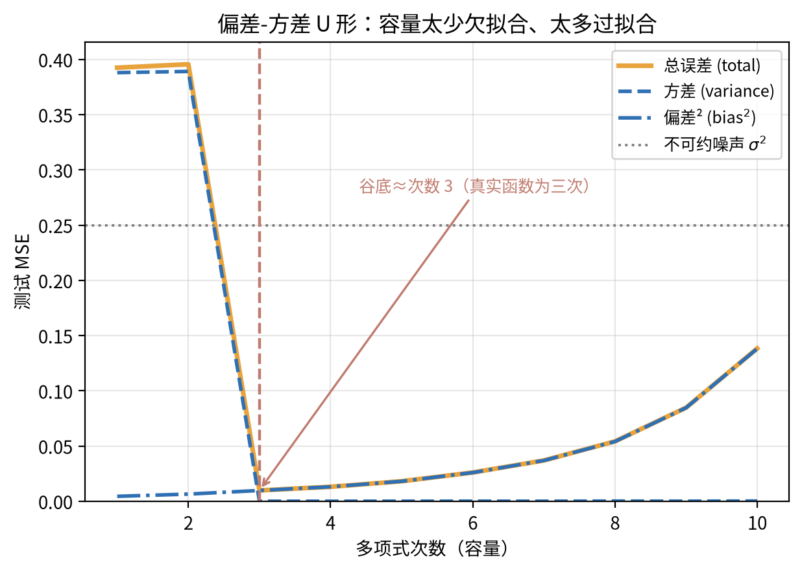

## 1.3 经典学习理论速览

偏差-方差分解回答"误差从哪里来"，经典学习理论回答"误差能压到多小"。两个结果值得记住，细节不必背：

**PAC 学习（Probably Approximately Correct，可能近似正确）与样本复杂度**。PAC 学习理论说：允许误差 $\epsilon$、失败概率 $\delta$ 之下，只要样本量足够大，就能以高概率学到误差小于 $\epsilon$ 的模型。这个"足够大"就是**样本复杂度**，它随假设空间的复杂程度增长。

**VC 维（Vapnik-Chervonenkis dimension）**。衡量假设空间复杂程度的标准是它能打散（shatter）的最大样本数。直觉上，VC 维越大，模型"能记住的形状"越多，需要的样本也越多。先给几个感性数字：二维平面上的直线分类器 VC 维是 3——任意三条样本的标签排列它都能分开；$d$ 维线性分类器是 $d+1$；带几百万参数的卷积网络，估算值以百万计。经典结论是：样本复杂度大约正比于 VC 维除以 $\epsilon^2$。若 VC 维是 $10^4$、允许误差 $\epsilon = 0.1$，粗略需要百万量级样本。把同一公式套到 7B 参数的 Transformer 上，样本需求远超互联网现存文本量，而模型实际工作得很好。

**这条理论的软肋**。经典结论的前提是：模型容量受控、训练误差要离测试误差有界。深度学习的两个事实同时击穿了前提——参数数量远超样本数量（过参数化），训练误差可以精确为零（插值）。按 VC 维估算，现代大模型需要的样本量是一个天文数字，可它们实际工作得很好。这说明：**VC 维式的容量计数，对深度学习既过紧又过松**。过紧：它把可记忆的形状都算作容量，而实际训练只探索了其中极小一部分；过松：它没有计入训练算法本身（梯度下降）的隐性偏向。

> **一句话总结**：经典理论告诉你"测试误差由容量和样本量决定"，但它的容量计数不含训练算法——而算法恰恰是深度学习的另一半。它的容量"量尺"在预言上失了手，但留下的正则 / MAP 工具箱今天仍在用（第 8 章 8.5 回看）。

## 1.4 经典理论撞上深度学习

Zhang 等人的一组经典实验把 CIFAR 数据集的标签随机打乱，再训练卷积网络。结果令人不安：**网络把随机标签也照样记住了**——训练误差为零，测试误差和瞎猜一样差。这说明神经网络的容量大到足以记住任何标签——过拟合不是必然的：能记住训练集，不等于在测试集上失效。

紧接着的观察更反直觉：同一类网络在**真实标签**上训练，训练误差同样可以压到零（插值，interpolation），测试误差却很好。容量没有变，数据没有变，变的只是标签里的结构。结论只能是：**训练误差为零并不自动意味着泛化差**——模型记住了什么，比记不记得住，重要得多。

这两组实验合起来，暴露了经典理论的三个盲点：

1. 容量计数不能解释泛化：随机标签能记住，真实标签也能记住，容量相同。
2. 训练误差无法预测测试误差：两种情况下训练误差都是零。
3. 一定有什么"隐形的力量"在决定模型记住的是信号还是噪声——它不在模型架构里，而在训练过程里。

这条"隐形的力量"就是第 1.7 节的隐式正则化。先看它制造的最著名现象：双下降。

## 1.5 双下降

**双下降**（double descent）指测试误差随某个容量轴非单调变化的现象：先按经典 U 形下降，随后反弹，跨过一个尖峰后再次下降。这个"再次下降"违背了经典直觉——容量已经大到能插值所有训练样本，测试误差理应继续恶化，实际却开始好转。

**数字演示②**：随机特征的插值尖峰与第二次下降

构造一个最简设定：$n = 100$ 个训练样本，特征为随机高斯向量，维度 $p$ 从 10 变到 800。真实信号只在前 3 维，其余维度是纯噪声。用岭回归（$\lambda = 10^{-8}$）训练，测试误差随 $p$ 的变化如下：

| $p$ | 10 | 20 | 40 | 60 | 80 | 90 | 95 | **100** | 105 | 110 | 120 | 150 | 200 | 400 | 800 |
|:--|:--|:--|:--|:--|:--|:--|:--|:--|:--|:--|:--|:--|:--|:--|:--|
| 测试 MSE | 0.022 | 0.024 | 0.056 | 0.170 | 0.249 | 0.392 | 1.60 | **37.6** | 2.62 | 1.31 | 0.967 | 0.255 | 0.159 | 0.146 | 0.155 |

曲线分四段，每一段都有明确的主导因素：

1. **欠参数化段（$p$ 远小于 $n$）**：$p=10$ 处误差很低（0.022），维度恰好够表达那 3 维信号。随后误差随 $p$ 逼近 $n$ 持续上升（$p=90$ 时 0.392）：容量接近样本量，噪声开始被逐点拟合。这是经典 U 形的右支。
2. **插值阈值（$p \approx n = 100$）**：误差爆表，从 1.60 跳到 37.6。$p = n$ 是模型第一次有能力把每个训练样本精确记住的点。在这一点附近，拟合噪声的代价被放大到极致：参数刚好够多，却又没有余量分摊噪声。
3. **第二次下降（$p$ 刚过 100）**：误差从 37.6 一路降到 0.255（$p=150$）。插值解不再需要"精确迁就每个样本"，无数插值解里，算法选中的那个恰好泛化得好。
4. **过参数化平台（$p$ 继续增大）**：误差稳定在 0.15 上下（$p=200$ 到 $p=800$），不再随维度恶化。这个平台明显低于阈值前 80–95 维区间的 0.25–1.60——过参数化不仅没有让事情变糟，反而把模型放在一个安全低位。这正是深度学习"敢把参数堆到远超样本量"的实验证据。

**对照实验**：把标签噪声降到 $10^{-4}$，$p=100$ 处误差为零，尖峰消失。越过阈值后误差缓慢上升（$p=800$ 时 0.146），那是最小范数解的参数方差，与噪声尖峰是两回事。这说明尖峰由"噪声 + 容量恰好够插值"共同造成，与参数数量本身无关。**双下降的成因，是噪声与容量在插值点的相遇。**

**三种双下降**。容量轴不止参数一条，同一现象沿三条轴都会出现：

- **模型维度双下降**：测试误差随参数/特征维度先降、再升、再降（演示②）。
- **样本量双下降**：固定模型，测试误差随训练样本量增加先降、反弹、再降。
- **训练时间双下降**：训练过程中，测试误差可能先降、反弹、再降——grokking 是它的极端版本，见第 3 章。

三条轴的共同结构：一个"容量恰好够用"的临界点，在临界点附近误差爆发，越过之后误差回落。

> **图2**：双下降曲线（插值阈值尖峰 + 第二次下降）。

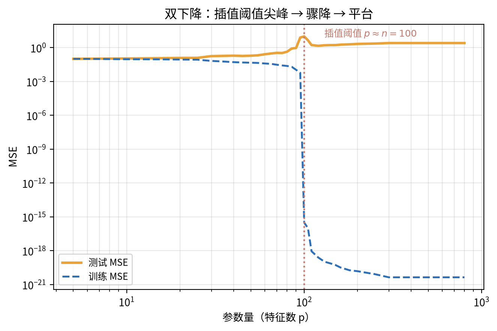

## 1.6 两速度分解

双下降解释了"测试误差为什么非单调"，但没有解释"第二次下降为什么恰好降得好"。Chou 等人的工作给出一个统一视角：**两速度分解**（Flatiron/Harvard/Kempner 团队，预印本）。^[3]^

**两把不同速度的时钟。** 把网络的学习拆成两部分。**表示**（representation）是网络内部特征结构——潜空间里的方向——随训练更新的过程。**读出**（readout）是最后一层把当前表示映射到输出的权重。

两部分的更新速度天然不同。在深度线性网络这类可解析设定里，差异看得很清楚。表示对应输入-输出相关矩阵的奇异值方向，按大小逐条学——大奇异值先学，小奇异值后学（见第 1.7 节低秩偏向）。读出则每步梯度都会立刻调整。**表示是慢变量，读出是快变量**，这就是"两速度"的由来。

**不同步如何制造非单调。** 训练早期，读出先追上训练集：它把当前表示下的样本背下来，训练误差迅速归零。但表示还在路上，特征没有成型，背下来的东西换到新数据上就失效。测试误差在"记忆已经完成、泛化还没开始"的窗口里爆表。等表示慢吞吞地成型，读出重新适配一次，测试误差回落——第二次下降完成。这个快慢交错的窗口，就是双下降尖峰的位置。

**与 grokking 的连接。** grokking 是延迟泛化：训练误差早已为零，测试误差在长时间里纹丝不动，然后突然开窍。在两速度的框架里，grokking 把"表示追上"的时间拖到极致：读出早就赢了，表示却在漫长的训练里慢慢转，转到位的那一刻，测试误差突然跳水。两速度因此把第 1.5 节的"训练时间双下降"与 grokking 放进同一把时钟：**grokking 就是时间轴上的双下降**。这一支在第 3 章与其他四种理论对照。

**诚实边界**：两速度分解目前是解释框架，不是定理——它在玩具模型上有精确结果，在真实模型上是可检验的叙事。本书把它当作统一透镜使用，不把它当作已经完成的解释。它是贯穿第 2 章（顺序学习）、第 3 章（相变）与第 5 章（特征学习）的主轴——往后读到这三处，都可以回看本节。

## 1.7 隐式正则化

回到第 1.4 节的悬念：谁在决定模型记住信号而不是噪声？答案是训练过程本身。这一族现象叫**隐式正则化**（implicit regularization）：损失函数里没有写惩罚项，梯度下降的某些细节却天然偏向"简单解"。

**已确认的来源有四类，本节只给清单，机制在第 2 章展开。**

1. **SGD 噪声**：小批量随机梯度带来随机扰动，扰动把参数推向平坦区域——机制见第 2.6 节（Langevin 视角）。
2. **早停**：训练在测试误差拐点附近停止，步数本身就是一种容量限制——机制见第 2.6 节。
3. **权重衰减**：显式惩罚参数范数；它和约束 $\|w\|^2 \le c$ 的对偶关系，就是《AI数学》§2.5 拉格朗日对偶的直接应用。
4. **小初始化与低秩偏向**：从零附近出发的梯度流，天然先学大奇异值方向——机制（奇异值顺序学习）见第 2.5 节，《AI数学》§4.2 提供数学工具。

**更有前景的形式。** 近年研究把"简单解偏向"越说越具体，四条路线值得关注：

1. **最大间隔偏向**：在可分数据上，梯度下降（包括带标签噪声的训练）收敛到的解，方向趋近最大间隔分类器。隐式正则化的效果，可以写成显式的几何目标。^[5]^
2. **频谱/简单性偏好**：网络先学低频、平滑、简单的函数分量，后学高频细节（第 5 章特征学习将展开"先易后难"的谱理论）。这与低秩偏向是同一现象的两副面孔。
3. **平坦极小值**：SGD 找到的解倾向于落在损失景观的平坦区域。显式的 SAM（Sharpness-Aware Minimization，锐度感知最小化）把这一隐式偏好变成可调参数，实践中已带来稳定收益。
4. **两速度框架**：第 1.6 节的表示-读出不同步本身也是一种正则化叙事——它解释的不只是双下降，还有"为什么训练过程选中的插值解恰好泛化得好"。

四条的具体机制分别在：第 2.4 节（平坦性与稳定性边缘）、第 2.5 节（顺序学习）、第 2.6 节（噪声与早停）、第 5 章（频谱/简单性偏好）。现在只需要记住结论：**泛化不只在模型里，也在训练过程里**——机制是第 2 章的主题。这条清单是目录式预览：主线读者记住这句结论即可，逐条细节到对应章节再读。

## 1.8 AI落地

本章理论落到实践，是三句判断：

1. **看测试曲线，不看参数量**。判断模型过不过拟合，用留出集上的连续指标（loss、perplexity），不要凭参数量恐慌。双下降说明测试误差与参数量的关系非单调，参数多本身不是罪证。
2. **先查数据与正则，再查模型**。小模型在数据不足时过拟合，优先检查样本量与容量是否匹配（《基座模型》§2.3 的 Chinchilla 配比思路），其次才调 Weight Decay 与早停。
3. **警惕插值阈值附近的模型**。当特征维度恰好等于样本量附近时，测试误差可能正处于尖峰（演示②：$p=n=100$ 处误差爆到 37.6，而 $p\ge 200$ 的平台约 0.15）。训练误差为零不代表可以上线，务必看验证集。

## 1.9 常见误解

**误解一："测试误差是参数量的单调函数。"** 不是。双下降给出了反例：先降、再升、尖峰、再降。正确的说法是：测试误差与容量之间是分段单调的，临界点是插值阈值。

**误解二："过参数化必然过拟合。"** 随机标签实验说明容量可以大到记住任何东西，真实标签实验说明同样的容量可以泛化得很好。过不过拟合取决于训练过程选中的解，不取决于容量本身。

**误解三："双下降等于参数越多越好。"** 不是。演示② 里误差随容量是非单调的：欠参数段随容量恶化（$p=80→95$：0.249→1.60），在插值阈值 $p≈n=100$ 处炸成尖峰（37.6，比 $p=10$ 时的 0.022 高三个数量级），越过之后才骤降，停在约 0.15 的低位平台。参数更多只在越过阈值之后才变好，且收益递减、下面压着一层不可约损失。双下降说的是非单调，不是单调变好。

## 1.10 本章回顾

本章立起了全书的第一组问题：

- 泛化缺口是训练误差与测试误差之间的沟，经典理论用偏差-方差分解（瞄得准不准 + 手稳不稳）和样本复杂度（VC 维）解释它。
- 深度学习的两组事实——随机标签能记住、真实标签能泛化——说明容量计数解释不了泛化。
- 双下降给出测试误差的非单调图景：欠参数化段、插值阈值尖峰、第二次下降、方差缓升。
- 两速度分解把第二次下降解释为表示与读出的不同步，并预告 grokking。
- 隐式正则化把泛化的来源从模型移到训练过程。

下一章问：梯度下降为什么总能选中"被隐式正则化保护"的解？

**本章自检**：

**【知识点】**

1. 偏差、方差、不可约噪声各指什么？用一句话各举一个生活中的对应（瞄得准不准/手稳不稳/靶子本身在动）。

**【逻辑链】**

2. 沿着容量轴走一遍双下降：每一段（欠参数化、插值阈值、第二次下降、方差缓升）分别由什么主导？尖峰为什么出现在 $p \approx n$ 处？

**【迁移】**

3. 医疗场景：样本 $n = 500$，特征 $p = 480$，模型训练误差为零但测试误差偏高。按本章框架，这个模型可能落在双下降曲线的哪一段？应该先怀疑什么，再检查什么？

**【边界】**

4. 演示② 的对照实验里，去掉标签噪声后尖峰消失。这说明双下降的必要条件是什么？如果正则强度极大（$\lambda$ 很大），曲线会变成什么样？

5. 随机标签 vs 真实标签：同一个网络能把随机标签也记住（训练误差零），为什么在真实标签上却泛化得很好？这说明泛化由什么决定（容量还是别的）？
**【生成】**

6. 设计一个能在 30 行代码内复现的实验，重现"插值阈值尖峰 + 第二次下降"。写出：数据怎么造、容量轴怎么变、读哪个指标、预期看到什么。

 * * * 

# 第2章：优化动力学——从找极值到找泛化解
> **核心概念**：
> 1. 高维损失景观以鞍点为主，但梯度下降通常不必"躲开"它们。
> 2. 解不是一个点，而是一个盆地；不同初始化找到的盆地由低损失路径相连。
> 3. edge of stability：大学习率把训练推到稳定性边缘，改变的不仅是速度，还有解的形状。
> 4. 训练中有些量变化极慢（表示、奇异值方向），它们是第 1 章两速度分解的机制来源。
> 5. SGD 噪声是隐式正则化的物理来源：噪声越大，解越平坦。

> **本章路线**：先看高维景观（鞍点为主）与鞍点逃逸，再看解的盆地、edge of stability 与守恒慢变量，收束到隐式正则化的动力学机制，最后落地、误解与回顾。

## 2.0 进入问题

第 1 章留下一个悬念：泛化不只在模型里，也在训练过程里——梯度下降似乎在替我们挑选"被隐式正则化保护"的解。本章问：它凭什么能做这件事？

经典优化理论对这个问题几乎没有发言权。它保证的是：在温和条件下，梯度下降能找到驻点（梯度为零的点）。可深度学习需要的是"能泛化的解"，不是"任意驻点"——更何况高维景观里驻点以鞍点为主，按经典眼光看，这几乎是必死局。

本章把"找极值"的问题升级为"找泛化解"的问题，按"现象 → 规律 → 机制"的顺序回答。先看解落在哪里：损失景观（loss landscape，参数空间里的地形）的三个现象（§2.1–2.3）。再看训练把解推到那里时踩到的规律：edge of stability（§2.4）。最后回到机制：守恒律与 SGD 噪声如何实现隐式正则化（§2.5–2.6）。

## 2.1 高维景观：鞍点为主

损失景观（loss landscape）是深度学习的通用术语，指参数空间里以参数为坐标、以损失为高度的地形；自 Li 等 2018 的可视化工作后成为标准叫法。局部极小值是"所有方向都向上弯"的点；鞍点是"有的方向向上、有的方向向下"的点。梯度为零的统称**驻点**（stationary point）。

高维景观的第一个事实是：**驻点里，极小值指数级稀少，鞍点是常态**。粗算如下：把每个方向当作独立的随机符号，向上弯记为 $+$，向下弯记为 $-$。局部极小要求 $d$ 个方向全部为 +，概率约 $(1/2)^d$。$d = 10$ 时约千分之一，$d = 100$ 时约 $10^{-30}$。真实 Hessian 的方向彼此相关，具体数值不同，但量级上的判断一致：维度越高，极小值越罕见——随机场理论严格版本的分析说明，大多数临界点都是鞍点。^[10]^

这个事实听起来吓人，实际上不致命。原因有二。第一，梯度下降不需要"知道"鞍点在哪里：它只在梯度方向上走，鞍点处梯度为零才会停，而训练中的噪声与动量通常让它不会精确停在鞍点。第二，深度学习的问题从来不是"找不到驻点"，而是"驻点太多，哪个能泛化"。第 2.3 节会看到，这些驻点不是孤立的。

## 2.2 鞍点逃逸

第 2.1 节说极小值稀少但不可怕，关键在于鞍点附近能否离开。本例演示：动量如何加速逃离鞍点。（梯度下降只做局部选择、收敛到最近谷底这件事，《AI数学》§1.6 的双井例子已经演示过，这里不重复。）

**数字演示③**：鞍点逃逸——动量如何加速逃逸。函数 $f(x, y) = x^2 - y^2$ 在原点有一个鞍点：$x$ 方向向上弯（稳定），$y$ 方向向下弯（不稳定）。从 $(0.008, 0.001)$ 出发，步长 $\eta = 0.01$，比较有无动量（$\beta = 0.9$）。动量更新规则为 $v \leftarrow \beta v - \eta \nabla f$，$\theta \leftarrow \theta + v$，即速度按指数衰减地累积历史梯度：

| 步数 | 无动量 $(x, y)$ | 动量 0.9 $(x, y)$ |
|:--|:--|:--|
| 1 | (0.0078, 0.0010) | (0.0078, 0.0010) |
| 20 | (0.0053, 0.0015) | (−0.0022, 0.0054) |
| 60 | (0.0024, 0.0033) | (0.0000, 0.3132) |

无动量时，$x$ 被稳定方向吸向零点，$y$ 方向只有初始扰动在慢慢放大——60 步后 $y$ 才走到 0.003。动量把扰动累积成速度，$y$ 在 60 步后走到 0.313，明确逃逸。**鞍点不是死路，但纯梯度下降在它附近可能走得极慢；惯性（动量）和噪声（SGD）是两种加速逃离的方式**（《AI数学》§1.5 的动量解释在这里有了几何版本）。

> **图3**：鞍点逃逸——动量与无动量的轨迹对比。

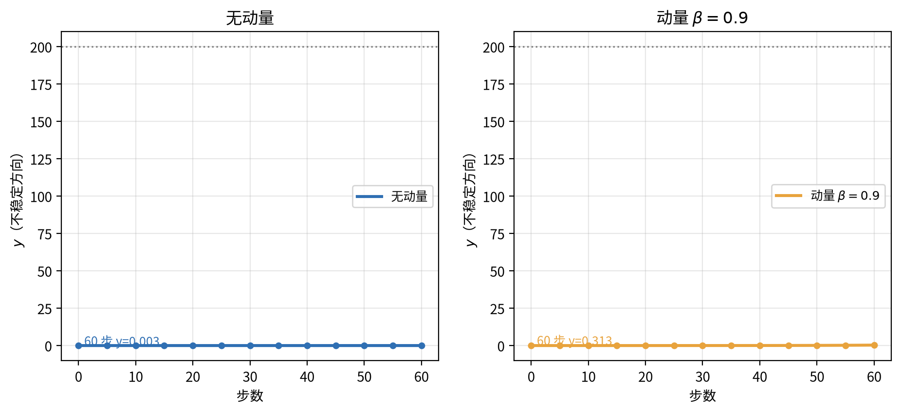

## 2.3 模式连通：解是盆地不是点

如果随机初始化多次训练同一个模型，得到的驻点各不相同。一个自然的问题是：这些驻点在景观里是孤立的坑，还是连成一片的低谷？

两篇工作给出了令人意外的答案：**低损失路径存在**（mode connectivity，模式连通）。Garipov 等人与 Draxler 等人分别证明，两个独立训练的解之间，可以找到一条损失始终很低的弯曲路径；沿着路径插值，模型性能几乎不掉。直观地说，训练找到的不是一个点，而是一个**盆地**——参数空间里一整片低损失区域。

为什么会有这样的路径？两个原因。第一，**对称性提供免费的连续变形**：交换两个神经元的顺序，或者把 $W_1$ 放大 $c$ 倍、把 $W_2$ 缩小 $c$ 倍，输出完全不变。两个解之间可以沿着这类"等价变形"连过去，这一段的损失天然不变（线性网络的例子见第 2.5 节，真实网络的重排对称性同样存在）。第二，**高维空间让绕路变得容易**：低损失区域在高维里远比低维 toy 模型里连通，两个盆地之间的山脊往往可以绕着走，不必翻越。

有两个细节必须说清。第一，路径是**弯的**：两个解之间的直线插值（线性模式连通）通常损失很高，因为高维里两个盆地之间隔着山脊；只有沿弯曲路径才能保持低损失。第二，盆地内部仍有好坏之分：同一个盆地里，平坦位置与尖锐位置的泛化不同（第 2.4 节与第 1.7 节的平坦极小值直接相关）。

> **一句话总结**：景观不是"一堆孤立的坑"，而是"一片由低损失路径连通的盆地"——训练的目标不是找到唯一的点，而是落进一个好的盆地。

## 2.4 edge of stability：学习率改变解的形状

学习率不只影响"走多快"，还影响"走到哪"：Cohen 等人的实验表明，学习率的大小会改变解本身。

先定义一个可测量的量：损失景观的**锐度**（sharpness），即 Hessian 矩阵（损失对参数的二阶导数）的最大特征值。它衡量损失曲面在当前位置"弯得多急"。对二次型损失做一步梯度下降，稳定条件要求步长不超过 $2/\lambda_{\max}$。推导只要一步：在曲率为 $\lambda$ 的方向上，参数偏离极值的误差每步乘以因子 $(1 - \eta\lambda)$。当 $|1 - \eta\lambda| > 1$，即 $\eta\lambda > 2$ 时，误差每一步都被放大，训练发散。这正是《AI数学》§1.4 的临界步长，现在写成曲率语言：$\eta < 2/\text{sharpness}$。

**数字演示④**：一个小两层网络（2-24-1，tanh），全批量梯度下降，$\eta = 0.5$。训练开始时锐度为 8.24，已经大于稳定性上限 $2/\eta = 4$。按经典理论，训练应当发散。实际发生的是：

| 步数 | 训练损失 | 锐度（Hessian 最大特征值） |
|:--|:--|:--|
| 1 | 2.470 | 8.24 |
| 10 | 0.114 | 3.17 |
| 30 | 0.105 | 3.44 |
| 60 | 0.090 | 4.03 |
| 100 | 0.070 | 4.91 |

损失平稳下降，锐度先跌到 4 以下，再回到 4 附近并围着它震荡。这就是 **edge of stability**（稳定性边缘）：网络在"再陡一点就会发散"的边界上训练。

为什么锐度会停在 $2/\eta$ 附近？分两层讲。**第一层：损失下降为什么推高锐度。** 网络为了拟合数据，决策边界会越用越锐利，损失曲面的曲率随之上升。这个"渐进锐化"（progressive sharpening）在深度线性网络里有严格证明，在真实网络里是普遍观察。^[8]^ 它把锐度一路推高，直到触到 $2/\eta$ 的稳定性边界。**第二层：越过边界后为什么被压回来。** 锐度超过 $2/\eta$ 后，参数在锐利方向上每一步都过冲，进入确定性的来回震荡。震荡的平均效果，相当于给损失加了一项曲率惩罚：三阶曲率决定震荡偏向哪一侧，结果把参数的平均位置推向曲率更低处。^[8]^ Cohen 等 2025 把两层合并成一句话：edge of stability 上的整条轨迹，等价于一条"带曲率惩罚的梯度流"。两个力——拟合推高曲率、震荡压回曲率——在 $2/\eta$ 附近达到动态平衡。

教学要点：**大学习率不是"更快地走同一条路"，而是"走一条更平坦的路"**。这正是第 1.7 节 SGD 噪声与平坦极小值的动力学来源：学习率是隐式正则化的旋钮，不只是速度旋钮。

> **图4**：edge of stability——训练损失与锐度随步数的演化。

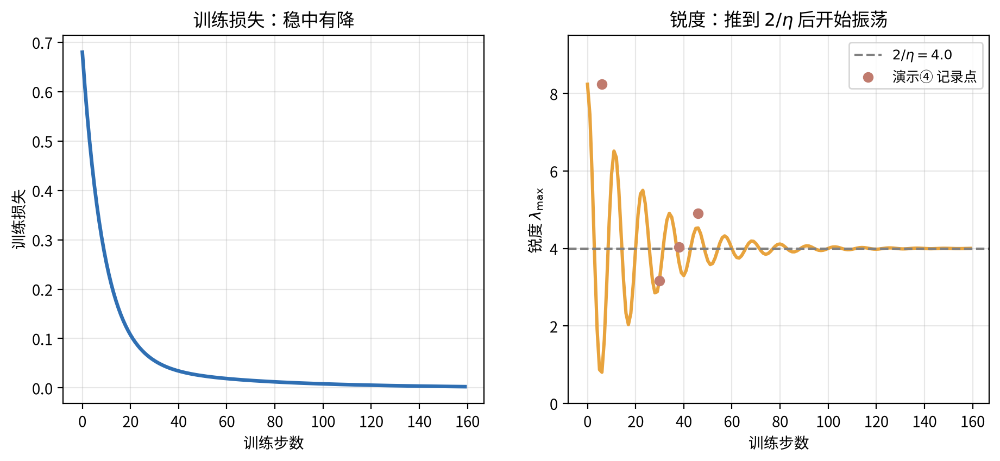

## 2.5 守恒律与慢变量

动力学里最有价值的发现，往往不是"什么在变"，而是"什么不变"。物理里，对称性对应守恒量（诺特定理，Noether's theorem）。深度学习也有自己的守恒量，尽管是近似版。

**数字演示⑤**：深度线性网络 $f(x) = W_2 W_1 x$，其中 $W_1$ 为 $4 \times 3$、$W_2$ 为 $3 \times 2$。随机初始化、梯度流训练，跟踪有效矩阵 $W_1 W_2$ 的两个奇异值：

| 步数 | 奇异值 1 | 奇异值 2 |
|:--|:--|:--|
| 1 | 0.058 | 0.027 |
| 50 | **2.677** | 0.938 |
| 200 | 2.677 | 0.948 |
| 600 | 2.677 | 0.948 |
| 目标 | 2.677 | 0.948 |

大奇异值方向先学到目标（50 步即达 2.677），小奇异值方向慢慢跟上（600 步才到 0.948）。这就是第 1.7 节低秩偏向的动力学版本：**奇异值按大小顺序被学习**（在输入白化设定下的精确结果）。^[6]^

这个顺序来自参数化的对称性，机制可以拆成三步。**第一步：对称性制造守恒量。** 网络 $W_2 W_1$ 有一个重标度对称性：$W_1 \to c W_1$、$W_2 \to c^{-1} W_2$ 不改变输出。损失沿这个方向完全不变，梯度为零，所以梯度流在这个方向上的某个组合量守恒。这正是诺特定理（Noether's theorem）说的"对称性对应守恒量"，Kunin 等人把它系统化。^[7]^ **第二步：守恒量把能量交换固定住。** 能量在这里指两层权重的范数（奇异值平方和）。重标度对称性意味着：把 $W_1$ 放大、把 $W_2$ 缩小，输出与损失都不变，梯度为零——所以两层之间的范数差被冻结，能量不能自由地在两层之间流动。若没有这个冻结，模式会借着重标度自由度互相串扰；冻结之后，配合白化输入的关键假设（模式间的交叉项消失），每个奇异值方向才能各自独立演化。^[6]^ **第三步：解耦后按大小排序。** 白化输入下可以证明每个奇异值满足独立的演化方程。^[6]^ 小奇异值阶段，增速近似正比于自身大小（$d\sigma_i/dt \approx \sigma_i \cdot c_i$）。初始时所有 $\sigma_i$ 都很小，大奇异值先起飞，小奇异值在后面慢慢追。三步合起来：对称性 → 守恒量 → 解耦 → 顺序学习。

**与两速度分解的连接**：第 1.6 节说"表示是慢变量，读出是快变量"。演示⑤ 给出了机制：表示对应奇异值方向，按顺序慢慢学习；读出对应输出层对当前表示的适配，每步都在调整。快慢不是比喻，是可测的时间尺度差。

**诚实边界**：精确守恒与顺序学习在梯度流与理想化设定（线性网络、白化输入）下成立。真实网络的非线性与随机梯度让守恒变成近似，但顺序学习的倾向在实验里依然可见——这也是第 5 章特征学习谱理论的起点。

> **图5**：奇异值顺序学习——有效矩阵的奇异值随训练步数逐级追上最终值。^[6]^

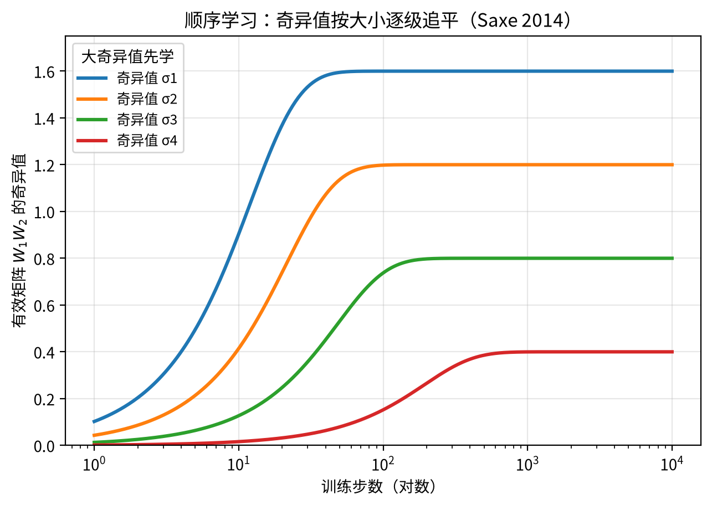

## 2.6 隐式正则化的动力学机制

第 1 章 §1.7 列了四类来源，本节补齐它们的机制。

**SGD 噪声的 Langevin 视角**。小批量梯度是全批梯度的无偏估计加上零均值噪声。这个噪声让参数轨迹变成"有摩擦的随机游走"：既沿梯度下降，又被噪声随机扰动。物理学早就研究过这类过程（Langevin 动力学）：噪声与摩擦力平衡时，系统偏向低而平坦的区域——因为平坦区域占的体积大，随机游走更容易停留。这就是"SGD 噪声偏好平坦解"的机制图像。噪声幅度由学习率与批大小共同控制：学习率越大、批越小，噪声越大。

**早停的机制**。训练步数有限，等于只允许梯度流演化有限时间；时间越短，能完成的分量越少——最先完成的是大尺度、低频的分量（与第 2.5 节的顺序学习同源）。早停因此是"时间截断式"的隐式正则化。**权重衰减**不是隐式的：它显式惩罚参数范数，等价于把参数约束在球内（《AI数学》§2.5 的对偶视角），机制上没有悬念。真正的悬念在它与学习率、批大小如何联动，第 2.7 节给决策。

**线性缩放律**。把学习率与批大小同时放大相同的倍数，并把训练步数按比例缩小（保持看过的样本数不变），训练轨迹近似不变。^[9]^ 这是一条被实践反复验证的经验律：在批大小从 256 调到 1024 时，学习率从 0.1 调到 0.4，效果基本持平。这条经验律有一个边界：**临界批大小**（critical batch size，记作 $B_{\text{crit}}$，下标 crit 即 critical）。^[9]^ 它的模型很干净，两条公式：串行时间 $S(B) = S_{\min}(1 + B_{\text{crit}}/B)$，总算力 $C(B) = C_{\min}(1 + B/B_{\text{crit}})$。批大小小于临界值时，加大批大小能等比例省时间；超过后，省时间的收益越来越小，算力却线性上涨。给一个示意数字：设 $B_{\text{crit}} = 2000$。批大小从 512 提到 2000 再提到 8000，串行时间约为最小值的 4.9 → 2.0 → 1.25 倍；总算力约为 1.3 → 2.0 → 5.0 倍。把批从 2000 提到 8000，时间只省 0.75 个单位，算力多烧 3 个单位——这笔交易通常不划算。常见任务实测下，$B_{\text{crit}}$ 多在 $10^2$ 到 $10^4$ 量级，具体数值随任务与模型变化。

> **记住一句话**：SGD 噪声是隐式正则化的物理来源；学习率与批大小是它的两个旋钮，线性缩放律告诉你两个旋钮怎么联动。

## 2.7 AI落地

本章的机制落到实践，是一张决策表。四行旋钮对应第 1 章 §1.7 的四类来源，机制已在 §2.4–2.6 展开：

| 旋钮 | 机制 | 决策 |
|:--|:--|:--|
| 学习率 | 决定噪声幅度与稳定性边缘位置（$2/\eta$） | 先定批大小，再按线性缩放律调学习率；判断依据看验证损失曲线，不看训练损失 |
| 批大小 | 决定噪声幅度与算力-时间折中 | 按预算落在临界批大小附近；小批 = 更多噪声 = 更平坦的解 |
| 早停 | 步数即容量 | 验证损失拐点即停；与权重衰减互补而非互斥 |
| 权重衰减 | 显式范数约束（第 1.7 节） | 与学习率联动调；大学习率下可适当放宽 |

一个实用的检查顺序：先固定批大小，用线性缩放律粗调学习率；然后看验证损失曲线，若训练后期验证损失抬升（过拟合拐点），先试早停或权重衰减，再考虑缩小模型——不要一上来就换架构。

## 2.8 常见误解

**误解一："训练就是找全局最优。"** 不是。深度学习找的是"泛化好的盆地"，全局最优往往藏在尖锐的过拟合区域。演示②（第 1.5 节）里 $p = n$ 处训练误差为零的插值解就是"极值但很坏"的例子。

**误解二："高维景观里到处都是局部极小值，训练容易卡死。"** 恰恰相反：极小值指数级稀少，鞍点才是常态（第 2.1 节）。而鞍点通常不致命——动量与噪声都会把它绕过去。真正影响结果的是"落进哪个盆地"，不是"有没有卡住"。

**误解三："学习率只影响收敛速度。"** 第 2.4 节与第 2.6 节说明：学习率决定稳定性边缘的位置与噪声幅度，进而决定解落在平坦区还是尖锐区——它同时是速度旋钮和泛化旋钮。

## 2.9 本章回顾

本章的回答分两层。景观层：高维驻点以鞍点为主，但解不是点而是盆地，盆地之间由低损失路径连通。动力学层：学习率通过 edge of stability 改变解的几何；参数化对称性产生守恒律，把学习锁在低秩轨道上（奇异值顺序学习）；SGD 噪声提供隐式正则化的物理机制。

链条至此闭合了一半：第 1 章的"训练过程选中被保护的解"，在第 2 章变成了三条可测机制——稳定性边缘、慢变量顺序、噪声偏向平坦。

下一章把时间轴拉长：为什么有些能力要训练很久才"突然开窍"？那将是慢变量的极端版本——相变。

**本章自检**：

**【知识点】**

1. 为什么高维损失景观以鞍点为主？"全部方向向上弯"的概率粗算是多少？这个事实为什么不太可怕？

2. 模式连通（§2.3）说的是什么？为什么它意味着「解是一个盆地而不是一个点」？
**【逻辑链】**

3. 把 edge of stability 的链条走一遍：学习率 $\eta$ → 稳定性上限 $2/\eta$ → 锐度超限后发生什么 → 三阶曲率如何参与平衡。

**【迁移】**

4. 你接手一个训练任务，想加大学习率省时间，又担心泛化变差。按本章与第 1 章的框架，给出检查顺序（看什么量、按什么次序）。

**【边界】**

5. 奇异值顺序学习在什么设定下严格成立？真实网络里它只是近似，为什么？

**【生成】**

6. 设计一个 30 行内的实验，验证"批大小越小，解越平坦"（或等价地验证线性缩放律）。写出数据、模型、指标与预期。

 * * * 

# 第3章：相变——从缓慢学到突然学会
> **核心概念**：
> 1. grokking 是延迟泛化：训练误差早已为零，测试误差长时间停留，然后快速跃迁。
> 2. 把训练当作时间轴上的动力学，"突然学会"就是相变——缓慢积累、临界点、跃迁。
> 3. 目前有五种理论解释 grokking，各自抓住一个侧面，尚无统一。
> 4. 涌现之争说："突然"可能取决于你用什么指标看——这是度量依赖。
> 5. 对实践：验证曲线上的长平台不等于没在学，早停可能杀死 grokking。

> **本章路线**：先看 grokking 现象，再用相变语言说清"突然学会"，接着看五种理论、涌现之争与平坦性，最后落地、误解与回顾。

## 3.0 进入问题

第 1 章的两速度分解留下一个预言：表示是慢变量，读出是快变量；当表示迟迟没有转到位，测试误差会在低位停留很久，然后突然跳水。本章把这个预言兑现成一种真实存在的现象——**grokking**（延迟泛化），并把"突然学会"放进相变的框架里。

问题分三层。第一层是现象：grokking 长什么样，有什么可测特征？第二层是机制：什么在平台期里悄悄积累？第三层是后果：如果"学会"可以是突变的，那么"能力涌现"是不是也如此？三层各占一节，最后一节落回实践。

 * * *

## 3.1 grokking 现象

**grokking**（延迟泛化）是 Power 等人在模加法任务上发现的现象。模型在训练集上早就 100% 正确，测试准确率却长时间停留在随机水平附近，然后突然跃迁到接近满分。

**数字演示⑥**：在模 59 加法任务（两个数相加取模，输出 59 类）上训练一个两层 MLP：输入为两个数的一位有效编码，隐藏层 128。优化用 AdamW，学习率 $3 \times 10^{-4}$，权重衰减 1.0，初始化标准差 0.05。留出 30% 的加数对作测试：

| 步数 | 训练准确率 | 测试准确率 | 表示变化率 |
|:--|:--|:--|:--|
| 500 | 0.352 | 0.001 | 3.06 |
| 1000 | 0.799 | 0.003 | 0.90 |
| 1500 | 0.988 | 0.063 | 0.39 |
| 2000 | 1.000 | 0.187 | 0.19 |
| 3000 | 1.000 | 0.473 | 0.10 |
| 4000 | 1.000 | 0.689 | 0.09 |
| 5000 | 1.000 | 0.820 | 0.08 |
| 6000 | 1.000 | 0.898 | 0.07 |
| 7000 | 1.000 | 0.937 | 0.06 |
| 10000 | 1.000 | 0.981 | 0.05 |
| 20000 | 1.000 | 0.997 | 0.04 |
| 30000 | 1.000 | 0.999 | 0.03 |
| 50000 | 1.000 | 1.000 | 0.00 |

（表示变化率 = 每 500 步内第一层权重 $W_1$ 的相对变化幅度，用来判断表示是否仍在更新。）

表格里藏着三个特征，**缺一个都不算 grokking**：

| 特征 | 它揭示了什么 | 本演示中的数据 |
|:--|:--|:--|
| **① 训练早饱和** | 训练误差先一步到零：模型"背下"了训练集 | 第 2000 步训练准确率 1.000，此后纹丝不动 |
| **② 测试长滞后** | 测试长时间停在随机水平附近：背下来了，却没学会规则 | 第 1500 步只有 0.063（随机水平 1/59 $\approx$ 0.017）；第 2000 步也才 0.187 |
| **③ 随后快速跃迁** | 测试在窄时间窗口内跳到接近满分：相变式跃迁 | 第 2000→7000 步：0.187 → 0.937，约五千步爬完大半程 |

一句话记住三个特征：**先记住、再停滞、最后"突然开窍"**——Transformer 原设定里跃迁更陡峭，本演示用 MLP 则相对平缓，但"训练饱和→测试滞后→快速追赶"的结构一致。^[17]^

演示表的第四列是本章的另一条主线：**平台期里，表示一直在变**。测试准确率还趴在 0.06 时，表示变化率是 0.39；测试跳到 0.94 时降到 0.06；直到测试完全饱和（5 万步），变化率才归零。表示这个慢变量，在测试的"假死期"里并没有死。

> **图6**：grokking——训练/测试准确率与表示变化率。

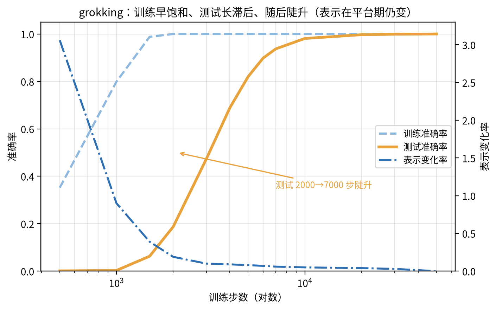

## 3.2 相变的语言

"突然学会"在物理里有个现成的名字：**相变**（phase transition）——系统的宏观状态在某个临界点附近发生不连续改变。水在 0°C 结冰是相变；铁在居里温度失去磁性是相变。相变区别于普通渐变的关键是：**微观量一直在缓慢积累，宏观量在临界点突然显现**。

grokking 与相变的对应关系可以写成一张映射表：

| 相变语言 | grokking 里的对应 |
|:--|:--|
| 序参量（order parameter） | 测试准确率（或某个规则结构的强度） |
| 临界点 | 跃迁发生的训练步数 |
| 缓慢积累的微观量 | 表示结构、电路的形成（第 3.1 节的表示变化率） |
| 过冷/过饱和亚稳态 | 训练集被记住但规则未成型的平台期 |

最贴切的物理图景是**成核**（nucleation）：过冷水可以长期保持在 0°C 以下不结冰，直到某个晶核出现，冰晶在一瞬间长满全杯。grokking 的平台期就像过冷水——规则的小种子（晶核）在训练里慢慢长，长到临界尺寸之前，宏观上什么都看不出；一过临界尺寸，泛化能力"结晶"出来。

成核定理（Nucleation Theorem）把这一图景数学化，要点在"为什么'突然'"。一个泛化子网络（能表达规则的一组结构）不会平白出现：它要先长到临界尺寸才能存活，而在"已背下训练集"的过拟合解里开辟这块新区要付出代价。这构成一道**势垒**，由两个相反的力量竞争决定。**驱动力 $\Delta$** 推动生长：子网络每长出一块，泛化收益就增加一点。**表面张力式成本 $\sigma$** 阻碍生长：新区与旧解的交界处要付接口代价。子网络还小时，成本按"表面积"算，占上风，长不大；一过临界尺寸，收益按"体积"算，反超成本，晶核自发长大。宏观上的"突然"，微观上正是这个翻转。

这套模型还给出两个可算的量。**温度**对应初始化噪声：噪声够大才激发跨越势垒的尝试，太大又反复搅碎晶核。**等待时间**由势垒高度决定：跨过势垒越难，平台期越长。可检验的预测随之而来——"金发姑娘温度"（Goldilocks temperature）。初始化噪声太大，晶核被搅碎，不 grok；太小，跨越势垒的尝试总是不够，也不 grok。只有适中，才 grok。

**诚实边界**：相变是类比，不是同一件事。物理相变发生在热力学平衡态，grokking 发生在非平衡的训练动力学里。还有一层未定论：这个跃迁是**第一类**还是**第二类**相变？两类各给一句话。**第一类**（如水结冰）：序参量在临界点不连续跳跃，伴随潜热，能出现亚稳态（过冷水）。**第二类**（如铁失磁）：序参量在临界点连续变化，没有潜热，但临界涨落与关联长度发散。grokking 的跃迁"陡得不连续"像第一类，"有限尺寸下只是陡峭而非真突变"又像第二类，证据未足以下结论。本书用它是因为它抓住了两个可测事实——平台期的存在与跃迁的陡峭——并把问题引向"什么量在积累"，而不是因为它已经是定论。

## 3.3 五种理论，五个侧面

grokking 已从孤例变成理论竞技场，五种解释并存，各自抓住一个侧面：

| 理论 | 核心主张 | 数学形态 | 适用范围 | 证据分级 |
|:--|:--|:--|:--|:--|
| ① 可证明理论（To Grok Grokking，arXiv:2601.19791） | 岭回归 + 权重衰减下，grokking 三阶段可端到端证明：先过拟合、再泛化迟滞、最后开窍 | 可证明的收敛分析 | 过参数化线性回归（权衰驱动） | ICML 2026；线性设定，非线性网络尚未覆盖 |
| ② 成核定理（Nucleation Theorem） | grokking 是泛化子网络跨越势垒的相变：势垒由驱动力 $\Delta$（体积收益）与表面张力式成本 $\sigma$（接口代价）的竞争决定；存在金发姑娘温度，顿悟延迟可计算 | 经典成核理论的形式化 | 玩具模型与数值实验 | 前沿未定：形式化自洽、有数值实验（预印本 2026-07，Zenodo），但仅此一份，未经同行评审，学界未普遍接受 |
| ③ 奇点学习理论（Singular Learning Theory） | 损失景观的奇点（参数空间中的退化流形）改变学习动力学，导致相变式行为 | 代数几何 + 统计力学（Watanabe 框架） | 广义设定，含 grokking 与多种相变 | 主流假说（SLT 本身成熟，应用到 grokking 是近年进展） |
| ④ 玻璃弛豫（Glass Relaxation，NeurIPS 2025） | 训练动力学像玻璃冷却：长时间弛豫后突然"冻住"成有序态 | 非平衡统计物理 | 玩具模型 | 前沿未定：仅单篇 NeurIPS 2025 工作、玩具模型演示，无第二方复现，也未与真实网络对照 |
| ⑤ 两速度分解（第 1.6 节） | 读出先赢、表示慢追；测试跃迁=表示转到位 | 深度线性网络可解 + 真实网络叙事 | 跨现象（双下降/grokking） | 解释框架，玩具模型有精确结果 |

表里③标"主流假说"。这一段是**选读**——想深入 SLT 的读者再读，主线可跳过：SLT 自带一套完整的数学。它处理的事实是：标准统计学习理论假定最优解处损失是光滑二次的，Hessian 正定。神经网络的真实最优解，却常落在**奇点**上：参数空间里的退化流形——无数个参数组合给出同一个函数。这些点上 Hessian 不可逆，标准假设失效。Watanabe 的框架证明：发生退化的方式决定学习速度；退化越"深"的奇点，对应越慢的学习阶段，越像亚稳态。套到 grokking 上：训练长期停在某个奇点附近（"记得住"的解），跃迁就是跨进另一个更优的奇点盆地。SLT 因此给平台期与跃迁都备好了相变式语言。分级保留"主流假说"：SLT 本身是成熟数学，落实到具体网络的 grokking 却仍是近年个案，映射尚未逐一坐实。

**为什么五个都活着。** 它们回答的是不同的问题：① 问"能不能证明"，② 问"临界点为什么存在"，③ 问"损失景观的几何如何决定动力学"，④ 问"弛豫的物理本质"，⑤ 问"哪两个变量在脱钩"。同一个现象，五个侧面不矛盾，但没有一个覆盖全部。这是当前 grokking 研究的真实状态——**多理论并存，尚无统一**。本书的立场：把五张图都摆出来，读者需要的是判断力，不是站队。

> **记住一句话**：grokking 的五个解释不是五个竞争答案，是五个不同的问题。

> **主线账目**：主线先记住两条——两速度（第 1.6 节已建）与成核（它给出可测预测：金发姑娘温度）；其余三条（可证明 / SLT / 玻璃弛豫）等你读到对应论文时再对照上面的表。

## 3.4 从 grokking 到涌现

grokking 是"训练时间轴上的突然学会"。如果把横轴从训练步数换成模型规模，同样的"突然"出现在**涌现**（emergence）的争论里：某些能力在模型规模跨过阈值后突然出现。

《基座模型》§2.3 已经给出三方立场与工程立场，本章补上理论判据。争论的核心是**度量依赖**：

- Wei 等 2022 用二值指标（"能不能答对"）观察，能力是突然出现的——量变引起质变。
- Schaeffer 等 2023 换用连续指标（token 级别的概率）观察，能力是平滑增长的——"突然"是指标非线性的幻觉（mirage）。
- Lubana 等人提出第三种图景：能力确实可以突现，但它是潜空间中某个子结构连续变化、跨过阈值时被激活的结果。这种**渗流**（percolation）式相变已有理论刻画。^[15]^

三种立场在数学上不矛盾，区别在"你盯哪个量"。这和第 3.1 节是同一课。**grokking 里，训练准确率这个"宏观量"早就饱和，真正的变化发生在表示这个"微观量"里。涌现之争里，二值指标早就饱和或迟迟不亮，真正的变化发生在概率或子结构里。** 判断"有没有突现"，先问自己用的是哪个量，再问那个量在临界点附近的行为。

## 3.5 neural collapse 与平坦性之争

grokking 还顺手回答了泛化理论里的一个悬案：什么特征真正决定泛化？

**Neural collapse**（神经坍缩）是一个被广泛复现的经验规律：训练结束时，同一类的样本表示聚拢到类均值附近，不同类的均值排成正交的单纯形结构。^[19]^ **它不保证泛化**。

证据来自 grokking 的过程：在泛化跃迁之前，模型已经记住训练集，表示也接近 collapse，但测试准确率仍然趴在随机水平。真正与泛化同步出现的，是解的平坦性（第 2.4 节的锐度下降）。换句话说：collapse 是"记住得好"的样子，平坦性是"泛化得好"的原因；**平坦性必要，neural collapse 非必要**。grokking 把两者在时间上分开了。^[14]^

**与第 1.7 节的连接**：第 1.7 节的 SAM（锐度感知最小化）把平坦性变成可调参数；本章给出平坦性在时间轴上的证据。两条线索指向同一个结论：**训练的目标是平坦的解，collapse 只是它的副产品**。

## 3.6 AI落地

本章的实践价值是三句话：

1. **看验证曲线，不看训练曲线**。训练准确率 100% 只是"背下来了"，不是"学会了"。第 3.1 节的表格里，训练饱和后测试还在 0.06 上趴了一千多步。监控脚本把验证指标和训练指标并排画，任何只报训练指标的训练报告都缺一半。
2. **长平台期别急着早停**。grokking 的平台期可能长达训练全程的一半以上（本演示：训练 2000 步饱和，测试 7000 步才接近满分）。验证损失长期不降时，先确认表示是否仍在更新（第 3.1 节的表示变化率），再决定是继续等还是调参——直接早停会杀死即将到来的泛化。LLM 预训练里"记忆→泛化"的相变迹象已有报告。^[16]^ 规模效应与玩具设定是否同源，仍有争议。
3. **权重衰减是 grokking 的开关之一**。本演示与可证明理论（①）都用权重衰减/岭回归驱动泛化跃迁；没有它，模型更容易停留在"死记硬背"的解上。调参时把权重衰减当成"泛化旋钮"而非"防过拟合补丁"。

## 3.7 常见误解

**误解一："grokking 只是玩具模型的现象。"** grokking 的本质——训练饱和后泛化延迟——在大模型预训练里也有对应迹象（记忆早于泛化、指标长时间停滞）。但证据分级是"迹象"而非"实锤"。^[16]^ 玩具模型的价值在于把机制隔离出来；机制是否同源，是开放问题，不是否定它的理由。

**误解二："突然开窍 = 能力涌现 = 不可预测。"** 三步都不能这么推。grokking 的跃迁在成核理论里是有临界条件的（金发姑娘温度）；涌现之争里"突然"至少部分来自指标选择（第 3.4 节）。突变不等于不可预测，关键是找到那个在缓慢积累的量。

**误解三："测试平台期 = 训练没有进展。"** 第 3.1 节的表示变化率说明：平台期里表示一直在变，变化率从 0.39 降到 0.10，直到跃迁完成后才归零。训练损失不是唯一的进展信号——"还在学什么"要看表示层。

## 3.8 本章回顾

本章把第 1 章的预言兑现成了现象：grokking 是训练时间轴上的相变——训练早饱和、测试长滞后、随后快速跃迁；平台期里表示作为慢变量一直在积累。五种理论（可证明理论、成核、SLT、玻璃弛豫、两速度）各抓一个侧面，尚无统一。涌现之争用度量依赖解释了"突然"的认知来源。neural collapse 与平坦性之争，把泛化的关键特征定位到平坦性。

链条至此完整：第 1 章的双下降（容量轴）、第 2 章的优化动力学（景观与训练轴）、第 3 章的相变（时间轴）——三条轴上的"非单调"背后，是同一个慢变量故事。

下一章问：学到的这些规律，代价是多少？训练损失真的是参数、数据、算力的函数吗？——尺度定律。

**本章自检**：

**【知识点】**

1. grokking 的三个可测特征是什么？"训练饱和 $\neq$ 学会"在这三个特征里体现在哪里？

**【逻辑链】**

2. 沿着时间轴把 grokking 走一遍：训练饱和 → 测试滞后 → 跃迁 → 稳定。每一段里，表示变化率（第 3.1 表第四列）在做什么？这对应两速度分解的哪一句话？

**【迁移】**

3. 你在训练一个大模型：验证损失已经一万步没降，训练损失还在缓慢下降。按本章框架，先检查什么，再决定继续等还是改方案？给出检查顺序。

**【边界】**

4. 涌现之争的三方立场各自盯哪个量？"突然"在哪个立场下是幻觉，在哪个立场下是真实的相变？用什么实验可以区分？

5. 为什么 grokking 的五种理论至今并列？一个「解释」要凭什么从「候选」升级成「解释」？
**【生成】**

6. 设计一个实验区分"两速度"与"成核"两种 grokking 解释：各给出一个可测量的、两解释预测不同的量（提示：两速度关注表示与读出变化率的时差；成核关注临界点对初始化噪声的敏感性）。

# 第4章：尺度定律——从经验曲线到可外推规律
> **核心概念**：
> 1. 训练损失随规模（参数、数据）按幂律下降：$L = L_\infty + c \cdot \text{规模}^{-\alpha}$——这是可验证的规律，不是巧合。
> 2. 幂律的真正价值在外推：用小规模的实验拟合一条幂律，预测更大规模的结果（演示⑦ 的外推误差在百分数以内）。
> 3. 数据受限时存在"最优参数-数据配比"，不是参数越多越好（演示⑧ 的 U 形曲线）。
> 4. 幂律的起源在争：数据谱、表示压缩（叠加）、语言结构（随机图）三个候选，与涌现之争同一方法论。
> 5. 边界：不可约损失 $L_\infty$ 是收益递减的终点；相变区与验证器不完美会破坏外推。

> **本章路线**：先看损失随规模幂律下降的现象，再讲清"能外推才是定律"，接着看起源三候选、最优配比与失效边界，最后落地、误解与回顾。

## 4.0 进入问题

第 3 章看到能力随规模的"突然"（涌现）。本章问一个更稳的问题：训练损失与数据量、参数量、算力之间，到底有没有一个可外推的稳定函数关系？前三章把机制埋下了（第 2 章的顺序学习、第 1 章的两速度、第 3 章的相变）；本章先把"损失可预测"兑现成规律，它的三个起源候选留给第 5、6 章拆解。

这个问题有现实的分量：前沿大模型的一次训练动辄上亿美元。如果损失随规模的关系可预测，预算决策就能在小规模实验上完成；如果不可预测，"加预算翻车"就只能是事后才知道。本章按五层走：现象（幂律长什么样）→ 规律（能否外推）→ 机制（起源之争）→ 实践（预算与配比）→ 边界（何时不可预测）。

 * * *

## 4.1 现象：损失是规模的幂律

**幂律**（power law）指损失 $L(N)$ 与规模 $N$ 之间满足

$$L(N) = L_\infty + c \, N^{-\alpha}$$

其中 $N$ 是参数量或数据量，$c > 0$ 是常数，$\alpha > 0$ 是指数。$L_\infty$ 是**不可约损失**（irreducible loss）——数据里本身不可预测的信息量，规模再大也压不下去。给它一个直觉：即使模型完美学到了所有可学规律，标签里的随机跳动（噪声）依然在，$L_\infty$ 就是这个"随机内核"造成的损失下限——好比抛硬币式的随机性，谁来了都压不到零。演示⑦ 里它是噪声方差 $0.09 = 0.3^2$。在 $\log\text{-}\log$ 坐标里，$L(N) - L_\infty$ 画出来是一条直线，斜率就是 $-\alpha$。这是你看大模型训练报告时最常见的那张"双对数直线"。

这条经验律在真实 LLM 上被反复验证（现象层面《基座模型》§2.3 已述，本章不重复数字，只接机制与边界）。^[29]^ 它对实践意味着：**损失不是"加一点规模降一点"，而是按一条可估计的幂律在降**。

## 4.2 规律：能外推，才叫定律

幂律如果只是"拟合得好看"，价值有限。它真正的分量是**外推**：用一小段规模的实验，预测从没见过的更大规模。

**先说"谱"这个字。** 把数据信号按分量 $k$ 分解，每个分量承载的能量记为 $w_k^2$；这条按 $k$ 排列的能量序列，就是数据的**信息谱**（information spectrum）。能量集中在少数几个分量上，叫"尖谱"；能量随 $k$ 缓慢衰减，叫"慢尾巴谱"。谱的形状决定两件事：表达大部分信号需要多少个坐标；每额外加一批坐标，能补回多少能量。

**数字演示⑦** 用的就是慢尾巴谱（可解模型的思想；主流假说）。^[30]^ 教师是一个 4096 维线性函数，权重按 $w_k \propto k^{-0.8}$ 衰减，能量谱 $w_k^2 \propto k^{-1.6}$。这个衰减不慢不快，正好在后面的指数上留下可测的痕迹。学生是取前 $p$ 个坐标的线性回归，$p$ 即"参数量"；噪声方差 $0.09$ 即不可约损失 $L_\infty$。数据量固定为 20000，让参数轴的变化不被采样噪声淹没。训练后测测试损失：

| 规模 $p$ | 8 | 16 | 32 | 64 | 128 | 256 | 512 | 1024 |
|:--|:--|:--|:--|:--|:--|:--|:--|:--|
| 测试损失 | 0.538 | 0.379 | 0.274 | 0.212 | 0.169 | 0.139 | 0.120 | 0.111 |

只用 $p \le 64$ 的四点拟合 $L(p) = 0.09 + 1.65\,p^{-0.63}$，然后外推到 $p = 128 \dots 1024$：

| 规模 $p$ | 128 | 256 | 512 | 1024 |
|:--|:--|:--|:--|:--|
| 外推预测 | 0.168 | 0.140 | 0.123 | 0.111 |
| 实测 | 0.169 | 0.139 | 0.120 | 0.111 |
| 误差 | 0.7% | 0.8% | 2.4% | 0.3% |

四组外推的误差都在 2.5% 以内（换随机种子重做，最差也在 5% 以内）。这就是"规律"的定义：**没看过的区域里，用拟合的参数能把结果算出来**。

指数为什么是 $0.6$ 而不是随手写的？因为损失有结构。学生只有 $p$ 个坐标，教师信号里 $k > p$ 的部分它表达不了，这部分整体落进"截断偏差"：

$$L(p) - L_\infty \approx \underbrace{\sum_{k>p} w_k^2}_{\text{截断偏差}} + \underbrace{\sigma^2\, p \,/\, n}_{\text{采样方差}}$$

第一项是教师能量的尾巴：谱越慢，尾巴越大。用积分近似 $\sum_{k>p} k^{-1.6} \approx p^{-0.6}$，得到理论指数 $\alpha = 2\times 0.8 - 1 = 0.6$，拟合值是 0.63。第二项来自用有限样本估计 $p$ 个坐标的系数；这里把 $n$ 取到 20000，这一项可忽略。功率谱的指数直接决定幂律斜率——这就是"幂律有机制"的那一步。

> **图7**：参数-损失幂律与外推——小规模拟合直线，在大规模处预测与实际几乎重合。

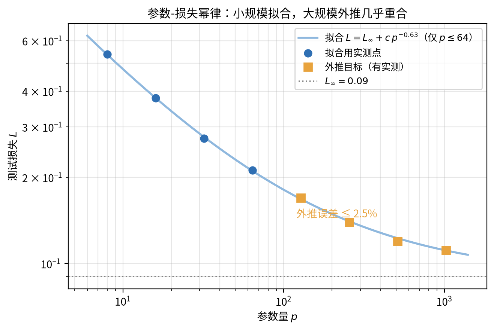

## 4.3 机制：起源三候选

幂律的事实很稳，但它"从哪来"是当前的争辩场。三种候选盯住不同的资源：

| 候选 | 核心主张 | 数学形态 | 证据分级 |
|:--|:--|:--|:--|
| ① 数据谱/信息论 | 幂律斜率由数据的信息谱（协方差按 $k^{-b}$ 衰减）决定；演示⑦ 指数 $0.63 \approx 2b-1$ 是它的直接案 | 谱分析 + 可解模型 | 主流假说 |
| ② 表示压缩/叠加 | 网络用叠加表示（superposition）储存超额概念，容量受限导出鲁棒的幂律；与第 6 章表示理论共享机制 | 表示几何 + 训练动力学 | 主流假说（NeurIPS 2025） |
| ③ 任务结构＝随机图 | 自然语言的知识关联像随机图，缩放定律源自语言图结构的统计 | 随机图论 + 生成式语言模型 | 前沿未定（ICML 2026，arXiv:2601.10684） |

三种候选不互相排斥：它们回答的是"哪一个稀缺资源在决定斜率"——数据的信息谱、表示的容量、语言的结构。这和第 3.4 节涌现之争是同一方法论：**你盯哪个量，就看到哪个起源**。统一的框架想把多轴合成一个超曲面。^[33]^ 它把参数、数据、算力、时间都当作耦合的自变量。

> **诚实边界**：三种候选各自在能算的设定里成立；真实 LLM 可能是三者之和。本书把它当作"多样并存的机制"，而不是"谁赢了"。这与第 3.3 节 grokking 多理论的姿态一致。它们在本书的去向："表示压缩/叠加"交棒给第 6 章，"数据谱"用到 §4.2 的推导与附录 A 的谱工具，"语言结构"在此点到为止、暂不展开。

## 4.4 实践：数据受限与最优配比

演示⑦ 里数据富足，参数轴可以干净地往下砍误差。真实世界往往**数据受限**：样本量固定，这时候"加参数"未必划算。

**数字演示⑧**：同一谱衰减任务，固定数据预算 $n$（200 到 3200 个样本），用岭回归在每个 $n$ 下扫描参数量 $p$，看测试损失的形状。以 $n=800$ 为例，损失是 U 形：

| 参数量 $p$ | 32 | 64 | 128 | 192 | 256 | 512 |
|:--|:--|:--|:--|:--|:--|:--|
| 测试损失 | 0.297 | 0.236 | 0.205 | 0.202 | 0.222 | 0.351 |

最优参数量在 $p \approx 128\text{–}192$（约每样本 0.16–0.24 个参数）。两个方向都要付出代价：$p=32$（太小，欠拟合）损失高 47%；$p=512$（太大，过拟合噪声）损失高 75%。把数据预算从 200 加到 3200，最优 $p$ 也单调右移（粗网格上从 32 移到 512），且谷底平坦——**在最优配比左右一定范围内，损失变化很小；偏离远了，代价显著**。

配比怎么算？三步就够。第一，固定数据预算 $n$。第二，在候选参数量上训练并测测试损失——从 $p = n/8$ 扫到 $p = n/2$，已经足够看见 U 形谷底。第三，取损失最低的 $p$。原理是两条线的平衡：$p$ 每加一倍，截断偏差按幂律下降一点（演示⑦ 的量），采样方差按 $p/n$ 上升一点；两者在某处打平，谷底就在那儿。

这条曲线的语义，就是"**加数据还是加参数**"在规律层面的答案：数据固定时存在内部最优配比，参数不是无条件越多越好。真实 LLM 的同款结论叫 Chinchilla 定律——存在一个"多少 token 配一个参数"的最优常量（《基座模型》§2.3 的现象；机制见本节的 U 形）。数据受限世界的实践配方给的正是这种答案——固定数据下该怎么花算力（Bryant-Liu：Practical Scaling Laws；共识方向）。连超参数本身也有可预测的缩放（Predictable Scaling Laws of Optimal Hyperparameters，Zhou-Diao；主流假说）。这和第 5.3 节 $\mu$P 的"最优学习率不变量"是同一件事的两端：$\mu$P 让其中一个超参完全不变，缩放定律让其余超参随规模有迹可循。

> **图8**：数据受限下的 U 形曲线——最优参数量与过拟合代价。

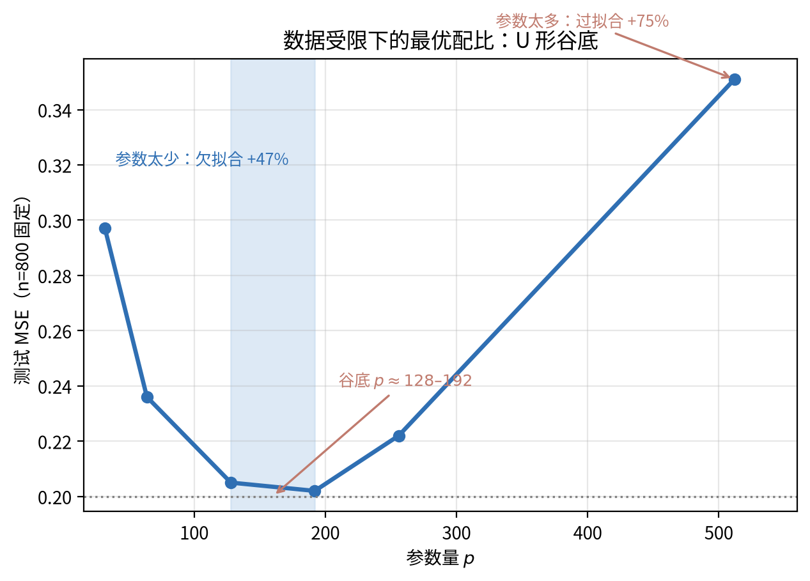

## 4.5 边界：何时不可预测

幂律不是永动机。三条失效条件，也是"什么时候不可预测"的答案。

**第一，不可约损失的饱和**。$L_\infty$（数据里的不可压信息）把幂律摁在地上：规模再大，$L(N) - L_\infty$ 趋近 0，曲线在双对数上弯向水平。在这个饱和区，外推会高估"加规模的收益"。信息论给出它的下界：长上下文建模的互信息缩放定律说明，损失底由数据的信息量决定，不归模型管。^[38]^ 实践中，这就是"数据墙"和"模型崩塌"讨论的背景——$L_\infty$ 定住了你能买到的下限。^[39]^

**第二，相变区不幂律**。第 3 章的 grokking 与涌现、第 1 章的双下降，都是"损失不随规模单调滑"的区域。在这些区域外推，等于用一条直线去预言一次跳变——必然落空。

**第三，测试时算力的收益分层**。测试时算力（test-time compute，TTC）也有自己的缩放定律。它甚至有可证明版本：Provable Scaling Laws for the Test-Time Compute of LLMs。^[36]^ 用到它的设定，见《基座模型》§3.3；数学工具在《AI数学》第 7 章。但 TTC 不是简单幂律：收益随任务难度与验证器状态变化（Kinetics）。^[37]^ 验证器一不完美，增益就被钝化（ROC-n-reroll，MPI，主流假说）。TTC 是"要做更多计算"的轴，但它服从的是有条件的、分层的规律，不是一条外推到底的直线。

## 4.6 AI落地

三句话：

1. **用小实验生成你的幂律**。在不超过今天 1/100 规模的模型上拟合 $L(N) = L_\infty + cN^{-\alpha}$，外推预算与目标损失（演示⑦ 的手法）。但只外推到饱和区之前：外推点接近 $L_\infty$ 时，把预测视为乐观上界，保守降档。
2. **数据受限时先算配比，再谈加参数**。固定数据量下，用演示⑧ 的 U 形曲线找最优 $p$；"加参数"只有在该 $p$ 还远没到的时候才划算。真实 LLM 的对照物是 Chinchilla 的 token/参数 最优常量。
3. **TTC 决策看验证器**。验证器越不可靠，TTC 的边际收益越低（5.5 节）；先度量验证器质量，再决定值不值得多烧推理算力。

## 4.7 常见误解

**误解一："规模越大永远越值。"** 不是。幂律的指数是常数，但 $L_\infty$ 是地板：规模越大，每单位预算换到的损失下降越小，最终趋零。饱和区里加规模的性价比趋近 0。

**误解二："外推是免费的。"** 只在幂律区免费。跨过饱和区、相变区外推，等于用直线预言跳变，结果必然高估收益。演示⑦ 的外推误差 2.5%，前提是目标区还在同一幂律段。

**误解三："缩放定律 = 参数量定律。"** 数据轴、算力轴、TTC 轴都是独立的缩放方向；UNSL 把它统一成多变量曲面。只盯参数，会漏掉"数据受限时加参数有害"这件事（演示⑧）。

**误解四："TTC 越多越准。"** 验证器不完美时，难度分层让 TTC 收益钝化（Kinetics）。算力要花在"验证器能判别对错"的任务上，才有正收益。

## 4.8 本章回顾

本章把第 1 章的容量轴，升级成参数、数据、算力三个量化尺度。现象层：损失随规模按幂律下降。规律层：幂律可外推（演示⑦ 误差在 2.5% 以内），且指数可由数据谱解释（0.63 对照理论 $2b-1 = 0.6$）。机制层：数据谱、表示压缩、语言结构三候选并存。实践层：数据受限时有最优配比（演示⑧ 的 U 形）。边界层：不可约损失、相变、验证器不完美三处会使外推失效。

链条至此：前三章把机制埋下（优化动力学、相变），本章先把"损失可预测"兑现成规律。下一章问：这条规律背后的"特征"是怎么被学出来的？——特征学习与超参。

**本章自检**：

**【知识点】**

1. 幂律 $L(N) = L_\infty + cN^{-\alpha}$ 里，$L_\infty$、$c$、$\alpha$ 各是什么？演示⑦ 里三个量的实测值分别是什么？

**【逻辑链】**

2. 演示⑦ 的指数 0.63 为什么约等于 $2 \times 0.8 - 1$？把"教师谱按 $k^{-0.8}$ 衰减 → 尾部方差 → 幂律指数"这条链写出来。

3. 尺度定律的三个起源候选是什么？第 5、6 章分别接住了哪两个？
**【迁移】**

4. 你想预训练一个目标损失 0.12 的模型，但连 1/20 规模的测试都还没跑到。按演示⑦ 的流程，你最少需要哪些数据点来拟合，外推时要注意什么边界？

**【边界】**

5. 为什么"数据受限时拼命加参数"会翻车？用演示⑧ 的哪几个数字支持你的判断？Chinchilla 的"token/参数 最优常量"和这里的 U 形曲线是什么关系？

**【生成】**

6. 设计一个 30 行内的实验，复现"参数-损失幂律 + 外推"。写出：数据怎么造（谱衰减）、参数量怎么扫、拟合几组点、外推到哪里、读什么误差、预期看到什么。

# 第5章：特征学习与超参——从黑箱训练到可预测配方
> **核心概念**：
> 1. 训练时有两类东西在动：参数在动，表示（特征）也在动。lazy 训练里表示几乎不动，rich 训练里表示被重新塑造。
> 2. "宽度趋于无穷"不是更厉害，而是锁定特征：NTK 极限下，网络退化成固定特征的核回归。
> 3. 参数化决定哪个超参是"尺度不变量"：标准参数化（SP）下最优学习率随宽度下滑，$\mu$P 下它不随宽度变。
> 4. 超参迁移的规律来自参数化：小模型摸出的学习率能不能用在大模型上，取决于有没有把"最优学习率不变量"造出来。
> 5. 理论有坑：$\mu$P 的 embedding 层学习率需要单独校正（embedding-layer hole）——"理论完美"不是免检证。

> **本章路线**：先看 lazy 与 rich 之分，再讲清宽度与参数化怎样锁住特征，接着给出 μP 与最优学习率不变量，并标出参数化理论的坑，最后落地、误解与回顾。

## 5.0 进入问题

上一章兑现了第一条能外推的规律——尺度定律。本章回到尺度背后的底层疑问：表示到底有没有被"学到"？第 2 章说奇异值按大小顺序被学习，第 3 章说表示变化率在平台期里不为零——这两条都是"表示在动"的证据，但都还停留在"动了多少"。本章往深一步问两件事：

1. **表示到底有没有被"学到"？** 有的训练里表示从头到尾几乎不动，有的训练里表示被重新塑造。
2. **如果想让表示被学到，并且让超参在规模变化时依然可控，该怎么做？边界在哪？**

问题分四层。第一层是现象：用一个旋钮（初始化尺度）就能看到特征"动不动"的两极（第 5.1 节）。第二层是机制：宽度与参数化如何锁住或释放特征（第 5.2 节）。第三层是规律：一套正确的参数化能把最优学习率变成宽度的不变量，超参迁移由此成立（第 5.3 节）。第四层是边界：这条规律在哪一层被打破（第 5.4 节的 embedding hole）。

 * * *

## 5.1 特征学没学：lazy 与 rich

训练网络时，至少有两件事在同时进行。**参数在动**——每个权重都在更新。**表示也在动**——中间层的特征向量在改写。两件事不一定同步：有的训练里参数动得不少，表示却几乎不动；有的训练里两者一起大改。本节先给一个可以拨动的旋钮，让你亲眼看到"表示动不动"的两极。

**数字演示⑨**：任务很简单——学习函数 $y = x_1 x_2$（两个输入在 $[-1, 1]$ 独立均匀抽样，800 个训练样本与 2000 个测试样本）。模型是两层 MLP：tanh 隐藏层，256 个神经元。优化用 Adam，学习率 $3 \times 10^{-3}$，训练 3000 步。唯一改动的量是初始化标准差 $\sigma$。训练结束后测两个量：隐藏表示的相对移动 $\| H_{\text{终}} - H_{\text{初}} \| / \| H_{\text{初}} \|$，以及第一层权重初始方向与终态方向的余弦：

| 初始化 $\sigma$ | 训练误差 | 测试误差 | 表示相对移动 | 第一层方向余弦 |
|:--|:--|:--|:--|:--|
| 0.005 | $10^{-4}$ | $10^{-4}$ | 28.5 | 0.125 |
| 0.05 | $2 \times 10^{-4}$ | $2 \times 10^{-4}$ | 2.8 | 0.628 |
| 0.5 | $2 \times 10^{-5}$ | $2 \times 10^{-5}$ | 0.08 | 0.991 |
| 1.0 | $7 \times 10^{-4}$ | $7 \times 10^{-4}$ | 0.08 | 0.994 |

四个配置都学会了任务（误差都在 $10^{-4}$ 量级），但"学的方式"完全不同：

- $\sigma = 0.005$：表示相对移动 28 倍，方向余弦只有 0.125——第一层权重几乎被替换，特征被**重新塑造**。
- $\sigma = 1.0$：表示只移动 8%，方向余弦 0.994——训练只是在**调整输出层怎么组合这些固定特征**。

前一种叫 **rich（富）训练**：网络学到了特征。后一种叫 **lazy（懒）训练**：网络用的是训练开始时已有的随机特征，只是换了个线性组合。注意 lazy 不是"没学会"——本例里它同样把误差压到了 $10^{-4}$。lazy 与 rich 的区别不在"学得会学不会"，而在"**表示动不动**"。

> **图9**：lazy 与 rich——表示相对移动与方向余弦随初始化尺度的变化。

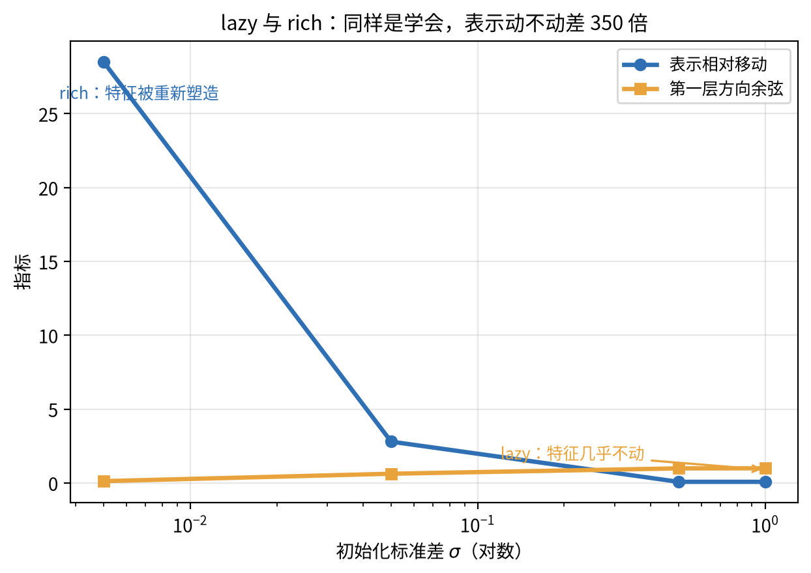

 * * *

## 5.2 机制：宽度与参数化怎样锁住特征

**NTK 极限**。神经正切核（neural tangent kernel，NTK）回答"什么条件下特征会锁死"。答案是：当宽度趋于无穷、参数在训练中只动一点点时，训练过程等价于在固定特征上做核回归。回归的核，是初始化瞬间的梯度方向矩阵。这个极限是严格的数学结论，也是"lazy"的精确版本：参数动得越来越小，特征根本没有机会改。^[20]^

**为什么宽度会锁定特征**。随机特征（初始化给定的方向）的容量随宽度增长：宽度越大，固定特征越能表达训练数据（这正是第 1 章随机标签能拟合一切的原因之一）。于是"改特征"的必要性下降。极限处（宽度无穷），特征完全锁定，网络蜕化成核机器——它仍然能拟合，但拟合靠的是"固定特征的线性组合"，不靠特征本身变化。

**如何打破锁定**。文献给出两条路。第一条是**初始化尺度**（第 5.1 节的 $\sigma$）：小初始化让特征有机会大幅重排。第二条是**参数化**——$\mu$P（maximal update parameterization，最大化更新参数化；第 5.3 节详述）让特征学习在任意宽度都被保留。理论载体也在补位：深度线性网络的精确动力学给出了 lazy→rich 转变，严格刻画见 From Lazy to Rich 一文；^[22]^ 同套框架把特征学习解释成"神经低次滤波"——网络先学数据里的低阶结构，再逐层升级，谱理论见 Neural Low-Degree Filtering；^[23]^ 这正是第 2.5 节奇异值顺序学习的特征版：大奇异值先被学到，大尺度结构先出现在表示里。

> **诚实边界**：NTK 极限本身是严格数学，但真实网络的有限宽度介于 lazy 与 rich 之间。"lazy/rich"是连续谱的两端，不是开关。^[24]^ 另外，RNN 与 DNN 的特征学习已有统一理论。^[24]^

 * * *

## 5.3 规律：$\mu$P 与最优学习率的"不变量"

把"特征学习在任意规模都保留"翻译成工程语言，就是**超参迁移**：小模型摸出来的超参，能不能直接用于大模型？要看懂迁移，得先认识本章的主角——**$\mu$P**。

**$\mu$P 是什么**。$\mu$P（maximal update parameterization，最大化更新参数化）是一套**标度规则**：回答"每一层参数的更新应该多大"。^[25]^ 设计目标只有一个——**让特征学习不随宽度消失**。构造只有两个要点：

- 输入层权重按 $O(1)$ 初始化——保证隐藏单元的规模不随宽度收缩，特征有"动"的空间；
- 读出层的学习率按 $1/m$ 缩放——让大宽度下读出层的更新不淹没特征层。

> **记住一句话**：$\mu$P 把"每层更新该多大"定成宽度的函数，让特征学习与最优学习率都不随宽度漂移。

作为对照，默认的**标准参数化**（standard parametrization，SP）不做这种分割。它每层都按 $1/\sqrt{\text{fan}_{in}}$ 初始化，所有层共用一个学习率；规模一变，各层的相对更新强度全跟着漂。两种参数化的差别，演示⑩ 直接测给你看。

**数字演示⑩**：同一任务（$y = x_1 x_2$，400 个训练样本），同一两层 tanh 网络，只改宽度 $m$ 与学习率 $\eta$，纯 SGD 训练 2000 步。对每个宽度扫学习率，记下"最优学习率"与"会不会发散（训练值变 NaN）"：

| 宽度 $m$ | SP 最优 $\eta$（训练误差） | SP：把 $m=32$ 的 $\eta=10^{-1}$ 搬来 | $\mu$P 最优 $\eta$（训练误差） |
|:--|:--|:--|:--|
| 32 | $10^{-1}$（$1.1 \times 10^{-3}$） | —— | $1$ 到 $3$（约 $6 \times 10^{-5}$） |
| 128 | $3 \times 10^{-2}$（$1.7 \times 10^{-3}$） | 发散（NaN） | $1$ 到 $3$（约 $10^{-4}$） |
| 512 | $10^{-2}$（$2.2 \times 10^{-3}$） | 发散（NaN） | $1$ 到 $3$（约 $2 \times 10^{-4}$） |
| 2048 | $10^{-3}$（$1.8 \times 10^{-3}$） | 发散（NaN） | $1$ 到 $3$（约 $2 \times 10^{-4}$） |

两个读数。**SP 下，最优学习率随宽度下滑**。宽度从 32 加到 2048（$\times 64$），最优 $\eta$ 从 $10^{-1}$ 掉到 $10^{-3}$（$\div 100$）。量级上，它约按 $1/\text{宽度}$ 反比移动。更尖锐的是稳定性：在 $m=32$ 上训练得很好的 $\eta = 10^{-1}$，搬到 $m \ge 128$ 就直接发散。**$\mu$P 下，最优学习率不随宽度移动**：$\eta$ 定在 $1$ 到 $3$，四个宽度都稳定收敛到 $10^{-4}$ 量级。

这就是"超参能按规律调吗"的答案：**能，前提是参数化把"最优超参的不变量"造出来**。用节拍器来想：一支乐队换乐器阵容（宽度），节拍要不要重调，取决于节拍器本身（参数化）——$\mu$P 把节拍钉住，SP 让节拍跟着阵容漂。

$\mu$P 的构造原则是**最大化更新**（maximal update）：让每个参数的更新对网络输出贡献同量级（$O(1)$）。这样特征层与读出层各按自己的宽度标度演化，不互相淹没。Tensor Programs 框架把这个原则严格化：保持更新的尺度守恒，就得到学习率在宽度维度的不变量。^[25]^ 2026 年的可证明分离结果确认 $\mu$P 各尺度在无限宽下确实分离——证据分级：主流假说。^[26]^ 超参迁移本身是工程反复验证的**共识**。^[27]^ 在 $\mu$P 下，小模型的完整超参配方能端到端迁移到大模型。

对现实的意义：前沿大模型训练里，"为每个规模重复调参"是最贵的实验之一。$\mu$P 把"调一次小模型"变成"定下一套配方"，这是第 3.6 节"观察曲线"之外，第二件能省时间的确定之事。

> **图10**：宽度-学习率热力图——SP 与 $\mu$P 的最优学习率随宽度的走向。

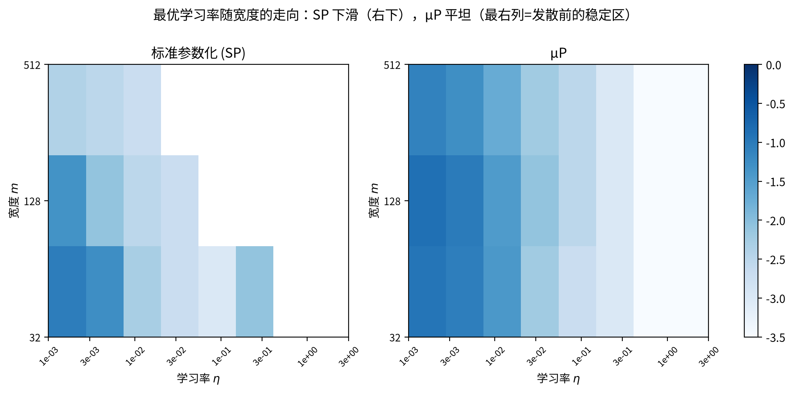

 * * *

## 5.4 边界：参数化理论自己也有坑

**embedding-layer hole**。$\mu$P 不是免检证。一项新研究发现：$\mu$P 的超参迁移在 **embedding 层**露出一个洞。^[28]^ 这要求 embedding 的学习率远大于理论值、单独校正，否则迁移失真。证据分级：前沿未定（单篇预印本、新发现，可能被修正）。

为什么会是 embedding？embedding 处理的是离散 token：输入是一维稀疏向量，它的梯度统计与连续特征层完全不同，$\mu$P 假设的那套"激活与梯度尺度"在这里不成立。而 embedding 恰恰是 LLM 里最大的参数矩阵之一——坑正好在最贵的地方。

这条边界给一条原则：**参数化理论是一族精确结构，不是万能钥匙**。它对同质、带状结构严格成立；遇到异构结构（embedding、attention、MoE、归一化层）要逐项核对，用"小规模复现坑"验证，而不是默认迁移成立。

 * * *

## 5.5 AI落地

三句话：

1. **先问参数化，再谈调参**。用 SP，换规模必须按宽度重调学习率（约 $1/\text{宽度}$，调错就发散）；用 $\mu$P，小模型摸出的学习率直接迁移。这不是经验之谈，是演示⑩ 两行表给出的规律。
2. **训练时监控"表示动不动"**。如果表现在训练中几乎不动（演示⑩ 里 SP 在 $m=2048$ 的核变化接近 0），说明你在做核回归而不是特征学习——先检查参数化与初始化，而不是继续加步数。
3. **理论有坑照用，但标注**。embedding 层学习率单独校正；上大模型前，在小规模复现一遍论文报告的坑。

 * * *

## 5.6 常见误解

**误解一："无限宽的网络更强大。"** 恰恰相反：无限宽收敛到 NTK 极限，特征被锁定，网络变回核机器。宽度给表达力，但表达力不等于特征学习。现代深度学习靠的是"能学特征"；NTK 极限恰好丢掉这一条。

**误解二："学习率是玄学，只能试。"** 不是玄学，是**参数化的函数**。SP 下最优学习率按 $1/\text{宽度}$ 走；$\mu$P 下它是不变量。调参显得玄，是因为默认参数化（SP）把规律藏了起来；换 $\mu$P，规律就显形。

**误解三："小模型调参规则原样放大就是大模型的。"** 取决于参数化：SP 下不是（要按宽度缩放），$\mu$P 下才是（常数）。所以"超参迁移"从来不是免费定律，而是参数化设计出来的属性。

**误解四："$\mu$P 解决所有超参问题。"** 不对。embedding hole 说明参数化理论在离散输入层有洞；结构一异构，就要逐层核对，逐项验证。

 * * *

## 5.7 本章回顾

本章把"慢变量在学什么"兑现成了"特征"。现象层：一个旋钮（初始化尺度）就能把表示移动从 28 倍调到 8%——lazy 与 rich。机制层：宽度越大，固定随机特征越够用，NTK 极限把特征锁死；深度线性与谱理论给出 lazy→rich 的精确动力学。规律层：$\mu$P 把最优学习率变成宽度的不变量，超参迁移由此成立。边界层：embedding hole 说明参数化理论在最贵的一层失效。

链条向前：第 2 章的顺序学习、第 3 章的两速度、本章的特征学习，指向同一件事——**能学特征、且能保住特征学习，是深度学习区别于核机器的地方**。下一章走进表示内部：特征在潜空间里怎么摆放、电路长什么样、"解释"在什么条件下成立——潜空间规律。

**本章自检**：

**【知识点】**

1. lazy 训练与 rich 训练的可测区别是什么？演示⑨ 用哪两个指标判断一个网络是 lazy 还是 rich？

**【逻辑链】**

2. 把"宽度趋于无穷 → 网络退化成固定特征核回归"的推理链写出来：宽度 → 固定特征容量 → 特征改动的必要性 → NTK 极限。

**【迁移】**

3. 你在宽 256 的模型上摸出最优学习率 $10^{-3}$，要训宽 8192 的模型。SP 下你该怎么做？$\mu$P 下呢？各引用演示⑩ 的哪一行读数作为依据？

**【边界】**

4. embedding-layer hole 是什么？它说明参数化理论的适用范围在哪里被打破？证据分级是什么？

**【生成】**

5. 设计一个 30 行内的实验，复现"SP 下最优学习率随宽度下滑、$\mu$P 下不随宽度变"。写出：数据、两种参数化的写法差异、扫什么、读什么指标、预期看到什么。

# 第6章：潜空间规律——从特征几何到电路
> **核心概念**：
> 1. 潜空间有几何：特征不是"一个维度"，而是"一个方向"；当特征数超过维度（$m > d$）时，方向必然彼此重叠——这叫**叠加**（superposition）。
> 2. 叠加程度可以定量：用特征方向之间的平均重叠来量（演示⑪ 第一部分）。
> 3. 稀疏编码能恢复"足够稀疏、足够独立"的特征，且恢复有硬边界——这是 SAE 有效性的来源，也是它的失效条件（演示⑪ 第二部分）。
> 4. 机制可以是"电路"：induction head 是一个可重复执行的匹配-复制子结构（演示⑫）；真实网络里电路从训练中涌现，且多机制并存。
> 5. 什么算"解释"？工具（SAE、电路分析）都带着假设，结论必须能复现、可因果验证——这条线到第 7 章收束。

> **本章路线**：先看特征几何与叠加，再看 SAE 能恢复什么，接着拆机制（叠加与 induction 电路），并问"什么算解释"，最后落地、误解与回顾。

## 6.0 进入问题

上一章问"表示到底有没有被学到"（lazy 与 rich）。本章走进表示内部：特征在潜空间里怎么摆放、还能不能从混合的激活里解耦回来、我们声称的"解释"在什么条件下成立。两个问题贯穿全章。**表示里有可测量的结构吗？**——特征在潜空间里是怎样摆放的。**我们声称的"解释"有多可靠？**——工具说"我找到了一个特征/一个电路"，这话在什么条件下成立？（"表示、特征"等名词的定义集中在第 6.1 节开头。）

分五层走。第一层现象：特征几何与叠加（第 6.1 节）。第二层工具：稀疏编码与 SAE 能恢复什么（第 6.2 节）。第三层机制：什么决定叠加与可恢复性（第 6.3 节）。第四层机制：ICL 与 induction 电路（第 6.4 节）。第五层边界：什么算"解释"（第 6.5 节）。《基座模型》§4.4 的"概念城市"讲的是工具看到的现象；本章给几何、可恢复性与失效条件。第 4 章尺度定律里"表示压缩/叠加"这个幂律起源候选，也站在本章的地基上。

 * * *

## 6.1 现象：特征几何与叠加

**先把本章反复用的四个词摆齐。**

- **表示**（representation）：模型中间层对一个输入的全部激活，构成一个向量。
- **维度**（dimension）：这个向量所在空间的坐标轴个数 $d$——坐标系，不携带语义。
- **概念**（concept）：模型能够区分的属性，比如"猫""愤怒"。
- **特征**（feature）：概念在表示里的可计算化身——一个方向，沿它取投影能可靠检出该概念。

一句话记住：维度和特征是两回事——维度给坐标用，特征给语义用；概念靠特征活，特征在维度里摆。

**特征不是维度，是方向。** 这句现在具体了：一个特征（比如"猫"）不是占住某一个坐标轴，而是表示空间里的一个方向。沿它取投影，猫样本的激活值系统性偏高，非猫系统性偏低。$d$ 维空间只有 $d$ 个正交坐标轴，却可以有远多于 $d$ 个方向。

特征多了会怎样？想象 $m$ 个特征方向装在 $d$ 维空间里。$m \le d$ 时，理论上可以让它们两两正交、互不干扰；$m > d$ 时，正交装不下，方向被迫重叠。**叠加（superposition，超位置）**说的就是：多个特征共享同一批维度，每个维度同时被好几个特征"借用"。这是表示在过完备里的必然结果，不是缺陷。

**数字演示⑪（第一部分）**：生成 $m = 20$ 个随机单位方向，放进不同维度的空间，测"平均重叠"——任意两对不同特征方向之间夹角的余弦绝对值：

| 空间维度 $d$ | 8 | 20 | 40 |
|:--|:--|:--|:--|
| 平均重叠 $\mathbb{E}|\cos|$ | 0.29 | 0.18 | 0.13 |

$d = 8 < m$ 时，平均每对特征方向重叠 0.29；$d = 40$ 时降到 0.13。这个数量级可以直接算出来：随机方向在 $d$ 维里的期望重叠约为 $\sqrt{2/(\pi d)}$——维度越低、特征越多，重叠越大。所以"概念城市"里看到的多义（一个神经元响应多个概念），几何来源就在这里：$\mathbb{R}^8$ 装不下 20 个互不干扰的方向。

> **图11**：叠加几何——特征方向平均重叠随维度下降。

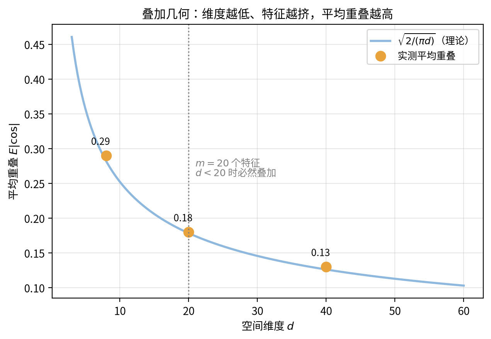

 * * *

## 6.2 工具：稀疏编码与 SAE 能恢复什么

现象是"特征重叠"。下一个问题是：能不能把它们拆开？当前主力工具是**稀疏自编码器**（sparse autoencoder，SAE）。它解一个带稀疏惩罚的重构问题：

$$\min_{D,\, h} \; \| x - D h \|^2 + \lambda \| h \|_1$$

直觉上，它把表示向量 $x$ 重写成"稀疏的开关加一本字典"：$h$ 标出这次发生了哪几个概念（大多为零），$D$ 说明每个开关打开时 $x$ 长什么样。其中 $D$ 是学到的**字典**（每个特征一个方向的矩阵），$h$ 是每个样本的稀疏激活（大多数项为零）。（SAE 的工具侧——《基座模型》§4.4 的"概念城市"——本书只用一段带过；本章问理论问题：这个 $h$ 到底能不能真的恢复出底层特征。）

**数字演示⑪（第二部分）**：在已知字典 $D$ 上验证"稀疏恢复"——给定观测 $x = D z$（$z$ 是只有 $s$ 个非零项的稀疏码，$s$ 从 1 到 8），用 L1 惩罚解 $\min \|x - D z\|^2 + \lambda\|z\|_1$，测恢复正确率（支撑集与符号全对）与恢复相关：

| 稀疏度 $s$（每个观察含几个特征） | 1 | 2 | 3 | 5 | 8 |
|:--|:--|:--|:--|:--|:--|
| 支撑+符号正确率 | 1.00 | 0.89 | 0.56 | 0.08 | 0.00 |
| 平均恢复相关 | 1.00 | 0.94 | 0.78 | 0.55 | 0.46 |

第一条读数：**特征越稀疏，越可恢复**。$s = 1$ 时 100% 恢复，$s = 2$ 时 89%，$s = 3$ 时掉到 56%，$s \ge 5$ 几乎崩溃。这不是数值噪声，是稀疏恢复的相位转变：每个观察里搅在一起的特征越多，把它们"解耦"回去的信息就越不足。

第二条读数同样重要：**一个只解重构、不施稀疏约束的自动编码器，会"背"训练集而不是学字典**。我们在同样数据上做了消融：无稀疏项时训练重构误差降到 0.001，但测试集上对应特征的恢复率约等于 0——它把训练样本记住了，换个样本就失效（重构误差 0.43）。这就是为什么 SAE 必须带 L1、必须用足够宽的过完备字典、而且结果必须审计：**"能重构"不等于"找到了可泛化的特征"**。

> **图12**：稀疏恢复——正确率随每观察特征数的相位转变。

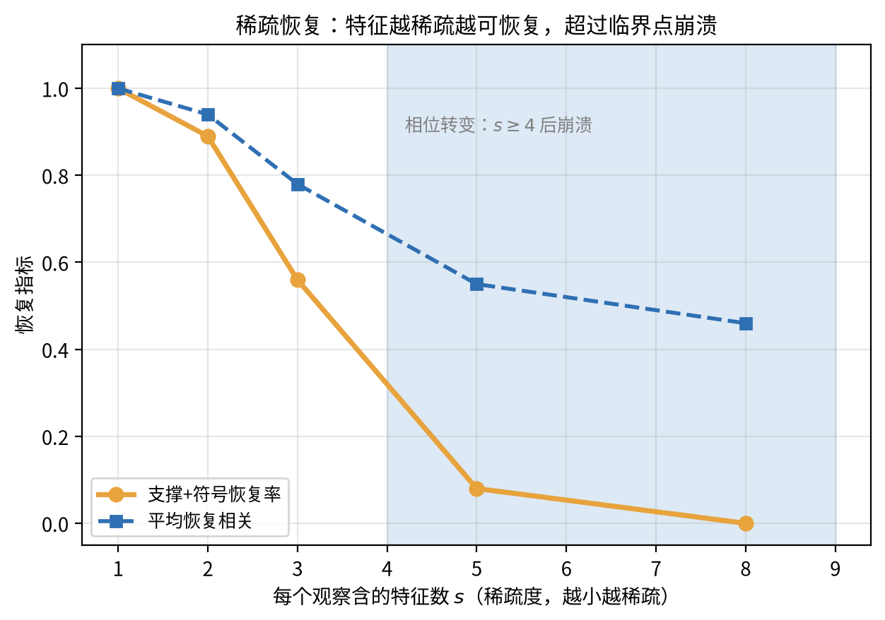

 * * *

## 6.3 机制：什么决定叠加与可恢复性

演示⑪ 给出了两个可测量的规律。**第一个是几何的**：平均重叠由维度比决定，$d$ 越小、$m$ 越大，特征越挤（第 6.1 节的 $\sqrt{2/(\pi d)}$ 就是随机方向都逃不掉的基线）。**第二个是信息的**：恢复成功率由稀疏度 $s$ 决定，$s$ 超过某个临界值（演示里在 3 到 5 之间）就崩。这两条合起来是"可恢复性"的判据：**特征要够稀疏、够独立、够多地被观察到**。

新的表示理论把叠加几何的来源接上了数据统计。结论一句话：特征的相关性与出现频率，决定方向如何摆放。^[41]^ 不相关、高频的特征更容易被做成独立方向；相关、低频的更容易挤在一起。这把第 6.1 节的"维度够不够"升级成"数据说了算"：同样的维度，不同的数据统计会养出不同的叠加几何。

叠加还是第 4 章幂律起源的一个候选（表示压缩/叠加使缩放稳健）。^[42]^ 同一块几何，一头连着能否恢复（本章），一头连着损失怎么随规模降（第 4 章）。两条线索互相印证：表示不是一笔糊涂账，而是可以用几何和稀疏性审计的。

 * * *

## 6.4 机制：ICL 与 induction 电路

上一节问"特征"，本节问"机制"。先建立一个**感性的抓手**——上下文学习（in-context learning，ICL）。ICL 是模型的一种行为：给它一段含若干示例的上下文，不更新任何参数，同一个输入的回答就会转向这段上下文暗示的规律。用例子说话。上下文写"苹果 → 甜，柠檬 → 酸，糖 → …"，模型答"甜"；把上下文换成"巴黎 → 法国，罗马 → 意大利，伦敦 → …"，同一个模型、同一个输入位置，答"英国"。参数一个都没动，变的只是上下文。（ICL 的完整现象《基座模型》§2.4 已述，本章不重复。）

表面行为好测，机制才是问题：**ICL 是怎么做到的？** 答案是**电路**（circuit）——模型内部一组可重复执行的子结构。ICL 起码由几种机制共同实现（匹配-复制、映射、检索），本节只讲其中最著名、也最好在玩具上验证的一种：induction（归纳）电路。

最著名的一块电路是 **induction head（归纳头）**。它以"复制"为机制做预测：看到当前 token 时，先找到它在上文里出现过的位置（key-query 匹配），再把那个位置**下一个** token 复制出来。它的工作方式可以显式写出来。

**数字演示⑫**：构造一个此类注意力头，参数直接给定——不是训练出来的，而是"电路说明书"。query 与 key 是"按 token 匹配"的单位映射；value 取"后随 token"。在被测的合成序列上（每个词对出现两次，如 $a,b,a,b,c,d,c,d$），induction 位置——第二次出现的 $a$ 与 $c$——预测后继的正确率是 100%。注意力也确实落在第一次出现的同一 token 上。这不是巧合，是这个电路的定义行为：**匹配 + 复制**。

真实 transformer 比这个构造复杂，但结构同源。一条 induction head 通常由两层合作：第一层先做出"上一个 token"或 bigram 表示，第二层用匹配-复制完成预测。而且电路是从训练动力中长出来的。ICL 在训练中出现的行为，已有专门的动力学刻画（前沿未定）。^[45]^ 无梯度更新时的隐式 ICL 有另一支动力学研究（前沿未定）。^[24]^ 可解的一面也有：线性注意力的 ICL 已有渐近理论，是第一个能完全算清楚的 ICL 设定。^[44]^

> **诚实边界**：真实 ICL 不是单机制。至少匹配-复制、任务学习、检索式几类机制并存（Distinct mechanisms underlying in-context learning，主流假说）。"induction head 解释了 ICL"是把主路径当成全部；第 6.5 节的审计标准就是防这种偷懒。

 * * *

> **图13**：induction head 的匹配-复制电路——query 匹配前文同 token 的位置，value 复制该位置的后随 token（演示⑫ 的"电路说明书"）。

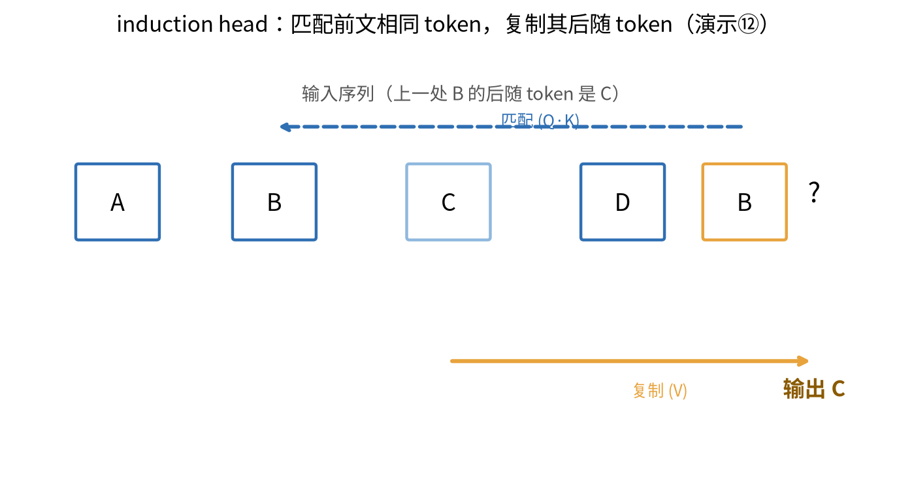

## 6.5 边界：什么算"解释"？

工具能"找到特征"、"找到电路"。但"找到"不等于"解释"。本章把判断标准落成三条，缺一不可：

1. **可复现**：同一个特征/电路，在独立的模型或数据上再出现，才算数。SAE 的可复现审计把"找特征"变成了可跑的流程。^[43]^ 它问的不是"这个单元激活了吗"，而是"这个特征在另一份数据与模型里还在吗"。
2. **因果可验证**：光有相关不够。解释应当意味着"如果我改变这个特征，模型行为按预期变"。把特征替换/注入后看输出是否按预测的方向变，是当前区分"解释"与"巧合相关"的主要实验。
3. **知道工具的失效条件**。SAE 在特征太密集、太相关、或字典不唯一时，会给出"能重构但错位"的分解；这类失效已有专门的理论刻画（主流假说）。^[41]^ 多义干扰本身也可以跨模型预测与迁移（前沿未定）。^[42]^ 也就是说，一个"解释"即使内部自洽，也可能是另一个机制的表象。

**什么算"解释"的底线**：能复现、能因果验证、且把工具带的假设说清楚。达不到这三条，只算"线索"，不算解释。这一标准与第 7 章"怎么衡量一条规律"同源：第 7 章把这三条底线扩展到评估与边界。

 * * *

## 6.6 AI落地

三句话：

1. **工具选型按稀疏度走**。特征稀疏、独立、高频时，SAE 是好工具（演示⑪ 的 $s \le 2$ 区域）；特征密集或强相关时，别指望单靠 SAE 拆出干净的"特征"——先给任务配审计。
2. **解释必须带验证**。任何一个"我找到了某某特征/电路"的结论，都补上两步：独立数据复现、因果替换实验（6.5 节的三条）。做不到就标"线索"。
3. **机制别归因给单一结构**。看到注意力权重或某个头，不等于找到了全图；真实 ICL 是多机制并存（第 6.4 节诚实边界）。先枚举候选机制，再逐条用对照实验排除。

 * * *

## 6.7 常见误解

**误解一："潜空间里一个维度 = 一个概念。"** 维度是坐标轴，概念是方向；$m > d$ 时方向必然叠加（§6.1）。"一神经元一概念"只有在低维少特征时才近似成立。

**误解二："SAE 找到了真实的特征。"** 它找到的是"能解释数据的稀疏分解**之一**"；换个字典、换个正则，分解会变（§6.5 的可复现/失效条件）。恢复质量可由 §6.2 的相位转变估计。

**误解三："ICL 是模型现场学会了新函数。"** 主要不是：它重用训练中长出的电路（induction 的匹配-复制），参数不更新（§6.4）。把 ICL 讲成"现场学习"会错过机制。

**误解四："解释了注意力 = 解释了模型。"** 注意力只有 3 个下标的权重，不是因果图；注意力权重只是线索，"解释"要落到电路与因果验证（§6.5）。

 * * *

## 6.8 本章回顾

本章从"表示里面有什么"走到"什么算解释"。现象层：特征是方向，$m > d$ 时必然叠加，平均重叠可用维度比预测（$0.29 \to 0.13$）。工具层：稀疏编码在特征稀疏、独立时能可靠恢复（$s \le 2$ 近满），越过相位转变就崩（$s \ge 5$）——这正是 SAE 有效与失效的边界。机制层：ICL 的一块地基是 induction 电路（匹配-复制，演示⑫ 构造解 100%），真实电路由两层合作、从训练中涌现、且多机制并存。边界层：解释必须可复现、可因果验证、并声明工具的失效条件。

链条至此：第 1–4 章讲"为什么会符合规律"，第 5 章把规律归到特征，本章走进表示内部——能不能看进去、看到的是不是真的。下一章收束全书的使命：怎么衡量这些规律、它们何时失效——衡量与边界。

**本章自检**：

**【知识点】**

1. 为什么 $m > d$ 时特征"必然叠加"？演示⑪ 第一部分用什么量来测叠加？$d = 8$ 与 $d = 40$ 的数字各是什么？

**【逻辑链】**

2. 把"稀疏度决定可恢复性"写成一个推理链：特征数 → 每观察特征数 $s$ → 观测的信息量 → 解耦难度 → 恢复相位转变。演示⑪ 第二部分在哪些 $s$ 上恢复成功/失败？

**【迁移】**

3. 你得到一个 SAE 分解，某单元在你的数据上非常"可解释"。按本章，把"这是解释"升级成"这是已验证的解释"需要补哪两步？为什么"能重构"不构成证据？

**【边界】**

4. induction head 的机制是什么？"induction head 解释了 ICL"为什么只算部分解释？真实 ICL 的多机制指什么？

**【生成】**

5. 设计一个实验，验证某 SAE 单元是否真的是"特征"而不是记忆：写出数据、对照模型、指标（提示：独立数据复现 + 因果替换/扰动）。

# 第7章：衡量与边界——怎么度量规律、规律何时失效
> **核心概念**：
> 1. 一根规律站不站得住，看三样：可复现、可预测、标得清失效条件。前六章分别给出证据，本章把它们收成一套完整的衡量方法。
> 2. 评估要可靠：从"一个总分"到条目级数据 + 技能分解 + 可预测尺度。
> 3. 五类边界（可计算 / 可学习 / 可验证 / 可对齐 / 数据-评估）各有一堵有定理背书的墙。
> 4. 边界不是坏事：知道墙在哪，才能把力气花在墙上可绕的部分（CoT、近似验证、外部事实核查）。
> 5. 其余开放问题（世界模型、对齐、统一理论）按证据分级标注，不假装已有答案。

> **本章路线**：先把评估做成可靠仪表，再给出五类边界类型学，接着看对齐极限、世界模型与方法论（选读），最后回顾。

## 7.0 进入问题

第 6 章的审计给了三条底线：可复现、可因果验证、声明工具假设。本章把它们放大成全书最后一问：**一条规律该怎么衡量？它什么时候失效？**

分三层走。第一层，先把"评估"做成可靠的仪表（第 7.1–7.2 节）：总分必饱和、必误导，条目级数据加技能分解能把"表现"变成可测量、可诊断的结构。第二层，上"五类极限"的类型学（第 7.3–7.5 节）：每一种边界都给代表定理、对实践的后果和绕开方式。第三层，把这套方法"够不够硬"讲清楚，并列开放问题（第 7.6 节）。

 * * *

## 7.1 测量：把评估做成可靠的仪表

评估是衡量一条规律的仪表。仪表不准，后面的预测和"失效判定"都无从谈起。现在的基准有三个毛病：**只报一个总分**（掩盖结构）、**条目缺失**（无法分解到具体样本）、**顶部饱和**（分数到顶后失去区分力）。可靠评估的三根支柱依次治这三个毛病。

**第一支柱：条目级数据（item-level benchmark data）**。评测必须落在"每一条"上，而不是"总体正确率"。条目级支持复现与诊断：哪一类样本错了、错在哪一技能，都可以精确指认（方向共识）。^[47]^ 这是测量的最小单位。

**第二支柱：技能分解**。把条目级正确率矩阵做低秩分解，得到"每个模型在每个技能上的剖面"（From Benchmarks to Skills，TACL；主流假说）。总分是一个数，剖面是一个向量：两个总分并列的模型，剖面可以完全不同。这与《AI数学》第 4 章的 SVD 是同一个数学工具。

**第三支柱：可预测尺度**。好的评估分数本身要有解释力与预测力：你能用小规模评估外推大规模表现（方向共识、方案未定）。^[49]^ 这正是第 4 章幂律外推在"评估"轴上的延续——评估分数和损失一样，可以是规模的函数。

## 7.2 数字演示⑬：把基准拆成技能

**数字演示⑬**：人造一个"8 个模型在 400 条任务上"的行为矩阵。设定：每个模型有一个 3 维技能剖面（代数推理、事实检索、指令跟随）；每条任务主要考其中一种技能；正确率由技能匹配决定，再加噪声。先看两个"总分并列"的模型——它们的剖面正好是镜像的：

| 模型 | 代数 | 事实 | 指令 | 总分（400 条平均） |
|:--|:--|:--|:--|:--|
| A（代数强） | 0.95 | 0.30 | 0.30 | 0.370 |
| B（事实强） | 0.30 | 0.95 | 0.30 | 0.383 |

只看总分，A 与 B 只差 0.013，几乎并列。现在假装不知道这些剖面，只把 8 个模型在 400 条任务上的正确率矩阵做 SVD（这正是《AI数学》第 4 章的降维工具）：

| 指标 | 数值 | 读到什么 |
|:--|:--|:--|
| 前 3 个奇异值能量占比 | 93.5% | 总分背后只有 3 个技能维度，矩阵接近低秩 |
| 无监督技能恢复（最近邻） | 94%（两维）/ 94.5%（三维） | 只凭低维坐标即可把 400 条任务还原到正确技能 |
| A 与 B 在第二技能方向上的坐标 | $-36$ 对 $+133$ | 并列总分下两个剖面方向相反、幅度差约 4 倍 |

三组读数。第一，**行为矩阵是低秩的**：93.5% 的能量集中在 3 个奇异方向上。第二，**结构可无监督找回**：只凭低维坐标就可以把 400 条任务按真技能分类到 94%——技能不是我们硬贴的，是数据里长出来的。第三，**总分骗人**：A 与 B 总分只差 0.013，却在第二技能方向上一个 $-36$、一个 $+133$——一个偏代数、一个偏事实。只报一个总分，等于把"强在哪"扔进平均值里。

> **图14**：基准→技能——低秩分解把总分还原成技能剖面。

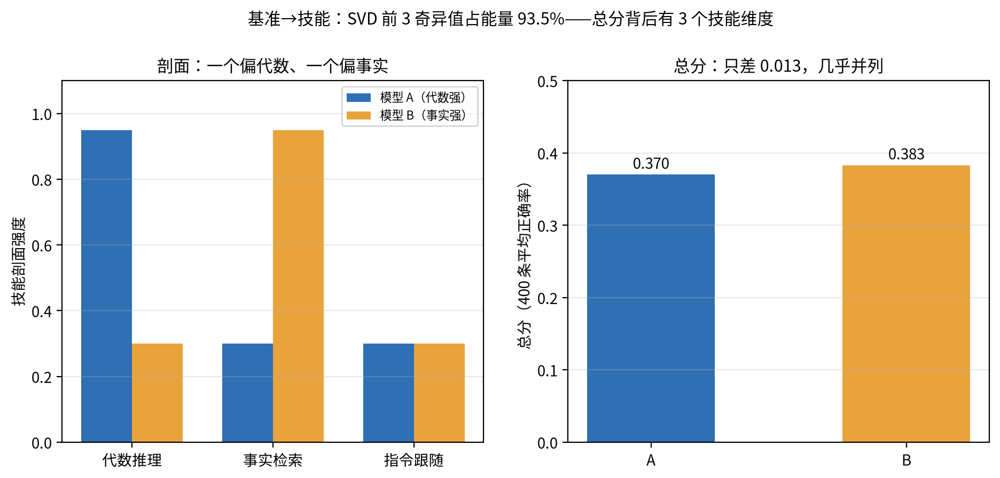

这一节还给第 5、6 章搭好了接口。技能剖面的"能从行为矩阵无监督恢复"，和演示⑪ 的"特征能从叠加表示恢复"，是同一件事的评估轴版本。两者都要求够稀疏、够独立、够可复现，也都需要审计。

 * * *

## 7.3 五类边界：类型学一张表

规律有适用域，边界可以开清单。五类边界，每一类的代表是"**正向结果加上不可能性结果**"——正向结果（positive result）告诉你能力能到哪，不可能性结果（impossibility result）告诉你有些力气别硬碰：

| 边界 | 类型 | 代表定理/结果 | 对实践的后果 | 绕开方式 |
|:--|:--|:--|:--|:--|
| 表达力 | 可计算性 | 图灵完备（2506.12027 正向结果）；无 CoT 限 TC$^0$（2402.12875）；固定精度 Transformer **内禀简洁**——极小模型即可指数级紧凑描述复杂语言，最弱硬注意力类亦然（2510.19315） | 表达力不是瓶颈；瓶颈在串行深度 | CoT / 外部工具扩大小 |
| 泛化 | 可学习性 | 无免费午餐：不可幻觉生成的样本复杂度下界（2410.19217，ICLR 2025） | 幻觉无法只靠训练根除 | 外部事实核查 / 拒答 |
| 验证 | 可验证性 | DNN 验证 NP-hard（Katz 2017 起）；MPNN 不可验证 | 安全保证有数学上限 | 近似验证 / 运行时监控 |
| 对齐 | 可判定性 | 内对齐不可判定（2408.08995） | 对齐没有一般算法保证 | 停机机制 / 显式约束 |
| 数据与评估 | 实践（资源/测量） | 数据墙、不可约损失、模型崩塌、基准饱和 | 规模收益递减、分数到顶 | 合成数据 + 真实锚点 |

五类边界按"限制的根源"分两档：**前四行是数学证书**——在给定形式化假设下证明的"做不到"（可计算性、可学习性、可验证性、可判定性），它们给出的是数学形式内的上界，绕开方式列就是这些上界给实践留的活口；**第五行是工程现实**——数据供给与测量可靠两股资源-测量约束合流，它不由定理锁定，主要由资源与测量技术决定，绕开余地更大。

每一类一行话。**可计算性**：表达力不缺（图灵完备），缺的是足够深的串行步骤，所以 CoT 与工具是正解。**可学习性**：有不相容的标签，学不会就不可能；把"幻觉"想成样本复杂度的下界，结论是"别只靠训练根除幻觉"，配外接核查。**可验证性**：做严格验证是 NP-hard，但这不否定近似验证与运行时监控的价值，只是"数学保证"的上限。**可对齐性**：对齐判定问题不可判定（选读节细讲），对应的实践是"显式约束 + 停机"，而不是指望"更好的 RL"一次到位。**数据与评估**：数据墙与基准饱和把"规模与分数的收益"摁住了。顶部饱和已出现"模型得分 92% 而人类专家约 65%"的反直觉观测。^[54]^（说明：第五类与前四类不同构——前四类是"可X性"式的数学上界，这一类是数据供给与评估可测两股力量合流，属资源-测量约束）

> **诚实边界**：五类边界里的"不可能性"多数是"在给定数学形式下的上界"，不等于"永远无法改善"。绕开方式那一列，正是边界给实践留下的活口。

 * * *

## 7.4 对齐的极限（选读）

本节选读：RLHF / DPO / GRPO 等方法的操作在《基座模型》第 3 章，这里只留理论极限，跳过不影响主线。

**对齐有信息论上限。** 在有限的 KL 预算（允许偏离基座多远）下，奖励提升有一个上限。这个结论来自 Theoretical Limits of Language Model Alignment（选读候选）。^[55]^ "更多 RL"买不来线性更高的奖励；偏离越多，回报越被稀释。这把对齐从"工程手感"推向"预算-回报的规律"，与前几章"可预测规律"的姿态一致。

**推理时对齐可能更差。** When Best-of-N is Worse（主流假说）：在有限覆盖下，对 top-k 采样做选优，奖励可能反而下降——覆盖不足 + 奖励黑客 + 悲观主义三者的权衡。它告诉我们"更多验证器"不是免费午餐（呼应 5.5 节 TTC 的分层收益）。

**Goodhart 是测量问题。** 先给名字一个定义：**Goodhart 定律**（古德哈特定律）源自经济学——"当一个指标变成目标，它就不再是好指标"。一旦你盯着某个代理指标（proxy，比如把"好评率"当"质量"）优化，指标与真正目标之间的失真会在训练里被一步步放大。对齐里这是核心威胁：RL 的奖励本来就是目标的代理，越优化奖励，目标越可能被牺牲。Take Goodhart Seriously（注记级）把这件事讲成一般目的优化的原则性上限：只要奖励是代理，追求它就必然偏离目标。^[57]^ 务实含义：防 Goodhart 靠测量学（条目级数据 + 技能分解 + 审计），而不是更聪明的 loss——这正是 7.1 节三支柱在安全轴上的延伸。

 * * *

## 7.5 世界模型：边界上的开放问题

世界模型是"终极可预测性"的边界测试：如果理解 = 能预测世界，那么世界模型的地位，最终要由"能不能预测"来定。这里的证据还很薄，逐条标注：

- **主张**：LLM 是世界模型的一种特例（注记级，单作者观点文）。^[58]^ "特例"是不是真命题，取决于能否验证，不止于主张。
- **可检验的路径**：世界模型要在"路径空间"里做预测——给定当前状态与一个动作，能预测后续状态，包括不可逆分支。这个判据与本书主线一致：能不能预测，是它有没有规律的试金石（前沿未定）。^[58]^
- **机构共识**：世界模型被列为 AGI 共识方向（机构报告，前沿未定）。^[59]^ 但"方向共识"不等于"机制确证"——这与第 4.3 节起源之争、第 6.5 节审计是同一纪律：别拿趋势当定理。

世界模型对我们的意义：它把第 4 章的"可预测"推到最远——如果模型要预测世界才算懂，可靠的测量（7.1 节）就是它上天的执照。

 * * *

## 7.6 这套方法，够不够硬？

把全书的证据链摆出来。**现象可复现**：第 1–3 章（偏差-方差、双下降、grokking）。**机制可解**：第 2/5/6 章（优化动力学、特征学习、叠加与电路）。**规律可预测**：第 4 章（幂律与外推）。**边界可标定**：本章的五类上限。本书的立场是"规律图鉴先行，理论在后"：不宣称已经有了一门完整的深度学习科学，但每条规律都有证据分级、标得出失效条件，已经够当一张能用的图。要把它收敛成真理论，是下个阶段的事。^[60]^

但要诚实列出还没到的地方，作为开放问题：

1. **统一还没到**：grokking 的五种理论（第 3 章）至今并列，没有统一。
2. **起源还没定**：推论 scaling 的三种候选（第 4 章）互不排斥，主导者未知。
3. **特征还不可直接观测**：叠加里的特征（第 6 章）只能通过工具间接推断，观测本身带着假设。
4. **边界能否跨**：CoT 能否把 TC$^0$ 围墙真正推高、验证器能否实用化（第 7.3 节），都在实践中检验。
5. **世界模型**：是"特例"还是"另一种动物"，等可检验的预测出现（第 7.5 节）。

把这些未知标成已知边界，就是这本册子的手艺。书从现象走到规律，又从规律走到边界——剩下每一行，都是下一章的开始。

 * * *

## 7.7 本章回顾

本章收束全书的使命。测量层：把评估从"一个数"升级成"条目级 + 技能分解 + 可预测尺度"。演示⑬ 用 SVD 把 8 个模型在 400 条任务上的行为，拆成 3 个技能；并列总分的模型露出了不同的剖面。边界层：五类极限（可计算 / 可学习 / 可验证 / 可对齐 / 数据-评估）各有定理背书，且各有绕开方式。选读：对齐有信息论上限，推理时对齐可能更差；世界模型是边界上的开放问题。方法论层：可复现、可预测、标得清失效条件，是衡量一根规律的三根柱子。

**全书一句话**：深度学习为什么能工作？——因为它里面的规律，虽然还称不上完整的理论，却已经可以被记录、被分级、被外推；规律何时失效？——第 7 章的五类墙就是答案。现象到规律，规律到边界；判处见墙，望处见门——本册到此转身（理论之梯见第 8 章）。

**本章自检**：

**【知识点】**

1. 可靠评估的三根支柱是哪三样？演示⑬ 用哪个指标证明"行为矩阵是低秩的"？

2. 可靠评估的第三根支柱是什么？它和「预训练该买多少算力」有什么同构关系？
**【逻辑链】**

3. 把"总分为什么骗人"写成推理链：总分的定义 → 平均抹平了什么 → 技能分解补上什么 → 演示⑬ 里并列总分的两个模型数字是什么？

**【迁移】**

4. 你给一个 Agent 买了新的评估器，总分提升了 5%。按本章，判断这 5% 是不是"真进步"需要补哪几步（提示：条目级、技能层面、可预测性——各给一条）。

**【边界】**

5. 五类边界分别对应什么"不可能性"？挑一类，解释"绕开方式"为什么能绕过而不是推翻墙。

**【生成】**

6. 设计一个可预测的评估尺度：选定一个任务族与一个规模轴（上下文长度 / 模型大小 / 蒸馏比例）。写出你预期的规律、验证方式，以及预设失效条件——在什么规模下规律会断。

 * * * 

# 第8章：理论之梯——经典与现代理论如何推动 AI

> **主题**：经典与现代理论如何推动 AI——把经典理论读成"边界清单"是一种读法；本章换一种——理论是 AI 的引擎与脚手架，不是挡路的结论。回答两个问题：① 经典/现代理论到底在哪些环节实实在在推动了 AI（目标、算法、结构、护栏四路）；② 除了本书已经提到的（可计算性/复杂性/可学习性、优化动力学、尺度定律、grokking、NTK/μP、叠加与 SAE），还有哪些理论对 AI 有真实价值。
>
> **读者定位**：读过《AI数学》《基座模型》的读者。本章把"这些理论来自哪、在 AI 里派了什么用场"串成一张可查的清单，与第 7 章五类边界互补——第 7 章把不可能性当护栏，这里看它们当引擎的那一面（《用好AI》用到的 POMDP、RLHF 也在此列）。
>
> **读完应能**：① 说出"理论给 AI 的四件东西"，并为每件举一个理论到产品的例子；② 把清单里的理论按"已成主流 / 正在路上"分档；③ 用"滞后-复用"图景解释为什么 2020 年代的大模型还在用 1948–1984 年的理论；④ 讲清 AI 与理论的双向回路（AlphaTensor、LLM 数学）；⑤ 用正-反-合讲清现代理论如何既驱动实践、又被实践约束与重塑（8.11）。

> **本章路线**：按"四路供水"读——先看词汇、算法、结构，再看表达、泛化、环境、因果、物理、认知，最后看反哺回路与现代理论的辩证作用。各节均可独立查阅。

## 8.0 理论给 AI 的四件东西：词汇、算法、结构、护栏

一个更常见的误读，是把理论读成"不行"（不可判定、NP-hard、无免费午餐——这也不行、那也不行）。与其逐条反驳，不如做个思想实验：**把这些理论全删掉，今天的大模型还剩什么？** 几乎什么都不剩——连"训练目标"都没有。理论对 AI 的贡献可以归成四路——这仅是组织视角，不是严谨分类，一条理论常同时落进多路：

| 路径 | 理论给了什么 | 代表理论 → AI 里的具体物件 |
|:--|:--|:--|
| 词汇与目标 | "学什么"（目标函数、评价） | Shannon 熵 → 交叉熵损失；贝叶斯后验 → 正则化/ERM；MDL/压缩 → 预测式预训练 |
| 算法与优化 | "怎么学"（更新规则、收敛） | Robbins & Monro → SGD；Polyak 动量 + RMSProp → Adam；Langevin → 采样与训练统一 |
| 结构不变量 | "长什么样"（架构假设） | 群论 → CNN/等变网；谱论/随机矩阵 → 低秩（LoRA）、NTK；压缩感知 → 稀疏（SAE） |
| 护栏与导向 | "别在哪使劲"（代价与不可能性） | 可计算性/复杂性/可学习性 → 在哪加杠杆（CoT、外部工具）、承诺何种保证（近似验证而非最坏情形） |

四路不是孤岛：同一条理论常既给目标又给算法（贝叶斯：目标=后验、算法=变分/MCMC），既给结构又给护栏（谱论：NTK 告诉你学多快，也告诉你别承诺最坏保证）。还值得注意一条**经验观察：滞后-复用**——下列例子里，理论通常比应用早 20–60 年（方向共识，够不上本书"可外推规律"的标准）：

| 理论诞生 | 进入 AI 主流 | 复用史 |
|:--|:--|:--|
| Shannon 熵（1948） | 交叉熵/对数似然：逻辑回归与神经网络的经典损失，今天仍是语言模型的训练目标 | 1948 → 1960s 起即分类标准；2010s 规模化预训练 |
| Robbins & Monro（1951）/ 动量（Polyak 1964；Nesterov 1983） | SGD / 动量 / Adam 与加速变体 | 1951 → 2014 Adam |
| Bellman 动态规划（1957） | DQN 等深度强化学习 | 1957 → 2015 DQN |
| 贝叶斯与正则化（1763 / 1970s 起） | 正则化、MAP、高斯过程、贝叶斯网络；2013 起 VAE 把变分推断接进深度生成 | 1970s 进统计/ML 主流；2013 VAE 深度化 |
| "压缩即预测"（1950s–1970s） | 预训练目标的解释 | 1950s → 2020s 大模型 |
| 群论与谱论（1900s–1970s） | CNN（1989）、NTK（2018）、LoRA（2021） | 逐波复用 |

> **分级说明**：本章沿用全书证据分级习惯——说"定理"的按定理读；"共识 / 主流假说 / 方向共识"按分级读；凡标注"诠释视角 / 可类比 / 灵感"的是谱系叙事，不是定理继承。

> **记住一句话**：理论是梯子，不是结论——今天每个模型脚下都踩着一根 1948–1984 年埋下的梯梁；问题不是"理论有没有用"，而是"它的梯梁接到哪了、下一步会接到哪"。

## 8.1 词汇与目标：信息论与贝叶斯决定了"学什么"

- **Shannon 信息论（1948）**：熵、交叉熵、KL 散度、互信息。今天的训练目标——交叉熵损失——就是熵的翻版：用模型 q 对真实 p 编码的期望代价。**语言模型=条件压缩器**：损失越小，越接近"用最短编码描述语料"。这个视角把"预训练在做什么"从"记内容"改写成"压缩/预测"——这是诠释视角（主流假说），把它与第 4 章的尺度定律放在同一坐标上读（损失随规模幂律下降 ≈ 压缩率随算力提高）。
- **MDL / 压缩即智能（Solomonoff 1964；Kolmogorov；Rissanen 1978）**："最好的解释是最短的程序"。Solomonoff 归纳：对可能解释按复杂度加权做贝叶斯平均——**上下文学习可被读成对提示的贝叶斯程序归纳**（诠释性路径，主流假说）；"CoT 涌现"与"更多算力→更可压缩的世界模型"都在这套语法里。Hutter 奖把"压缩维基百科"当智能基准，是这个方向最直白的工程化。
- **贝叶斯与统计决策（Bayes 1763；Wald 1950）**：后验 $\propto$ 似然 $\times$ 先验。训练中无处不在：MAP=损失+正则（权重衰减是高斯先验的等价物，第 1.7 节）；变分贝叶斯→VAE（ELBO=负自由能，见 8.8）；无限宽网络↔高斯过程（Neal 1996），NTK 是它的无穷宽化身。
- **本书意义**：《AI数学》《基座模型》里的损失、KL 散度、互信息（附录 A 数学预备）全在这一路；本章把它们上溯到"目标从哪来"。

## 8.2 算法与优化：最佳化的谱系决定了"怎么学"

今天的优化器是优化理论七十年叠加的可执行遗产：

- **随机逼近（Robbins & Monro 1951）**：只知道带噪声的函数也能驱动更新——SGD 的出生证，也是深度学习最底层的引擎。它的收敛分析给了这一地位合法性；"噪声把解推开尖锐极小"的隐式正则直觉，则是第 2 章优化动力学的直接研究对象。
- **加速与动量（Polyak 1964；Nesterov 1983）**：朴素下降的收敛步数是 $O(1/\varepsilon)$，Nesterov 加速到 $O(1/\sqrt{\varepsilon})$。今日标准优化器的谱系更准确地说：动量（Polyak）提供一阶矩，RMSProp（2012）提供二阶矩归一，两者汇成 Adam/AdamW；Nesterov 加速进入的是 Nadam 一类变体。
- **镜像下降与信息几何（Nemirovski-Yudin 1983；Amari 1998）**：用 Fisher 度量做自然梯度，回答"该在哪个坐标、以多大规模更新"——μP（第 5 章）的宽度不变超参正是这一路（更新规模不随宽度漂移）。
- **Langevin 采样（Welling & Teh 2011 的 SGLD）**：把"采样后验"与"下降目标"合并，训练既是优化也是采样——统一了"解是一枝而不仅是尖点"的直觉（第 2.5 守恒、第 3 章 grokking 的随机路径）。
- **Polyak-Lojasiewicz 不等式（1963）**：在满足该条件（梯度范数正比于函数 gap）的非凸设定下，所有驻点都是全局最优、且梯度下降线性收敛——它解释"为什么没有坏的驻点"，而不是"为什么能翻越坏鞍点"（第 2.1 节）。
- **低秩参数化（内在维度）**：预训练模型微调所需的更新落在低维子空间——这是 LoRA 这类"仅低秩增量"方法的真正来源；条件梯度（Frank-Wolfe）的"廉价约束步"只是直觉相似，不是直接来源。^[67]^

> **记住一句话**：SGD 的出生证是 Robbins & Monro，Adam 的骨架是动量（Polyak）加二阶矩归一（RMSProp）；训练优化是最优化理论的"可执行总结"。

## 8.3 结构不变量：对称、谱、稀疏与低秩决定了"长什么样"

- **群论与对称性**：**翻译不变性 → 卷积**——CNN 的本质是把平移对称"编译"进架构；Group-Equivariant CNN（Cohen & Welling 2016）、球面/旋转等变网都同源。Transformer 的置换不变注意力同理：把"集合顺序不该改结果"做成归纳偏置。
- **谱论与随机矩阵**：特征值谱决定动力学快慢（第 2.5 守恒的顺序学习）、可表达结构维度（第 4 章数据谱→幂律指数）、表示维度（第 6 章）。低秩：SVD→LoRA/QLoRA（2021）成为微调标准。
- **压缩感知与稀疏恢复**：欠定系统里，稀疏+随机测量可精确恢复；第 6 章 SAE 恢复叠加特征与之同属"稀疏性换可恢复性"的思路——但这是可类比，不是定理继承：SAE 能否恢复取决于第 6.5 节的稀疏假设（演示⑪："够稀疏就够恢复"）。^[70]^
- **傅里叶与调和分析**：位置编码（RoPE 的旋转=复数相位）、图像卷积的"谱偏置"（先学低频）、NTK 谱分析都在傅里叶坐标里；小波/散射（Mallat 2012）为高效表征提供替代灵感。
- **张量分解（Hitchcock 1927；CANDECOMP/PARAFAC 1970）**：注意力的低秩近似与核近似一路牵引大模型参数压缩研究。一句话：结构即参数——数据的谱衰减（§6.2 的能量保留）决定了可以用很少的分量近似很多参数。

## 8.4 表达、机制与编译：形式语言、电路与代数复杂度决定了"怎么表示"

- **形式语言与自动机（Chomsky 1956；Turing 1936）**：token 流=语言机视角——RNN↔有限自动机、Transformer↔带注意力栈的机器。**正因模型是语言机，才知道该加"推理 token"（CoT/scratchpad）**：第 7.3 节那条"无 CoT 限 TC$^0$"的正面读法，就是"理论告诉你在哪加杠杆"。
- **通用逼近（Cybenko 1989；Hornik 1991）**："表达力不缺"解放了架构焦虑——问题从"能不能表达"移到"用什么结构、什么优化去学到"。
- **简洁性（succinctness；Bergsträßer 等 2025）**：表达力的第三问——不是"能不能表达"，而是**"得多小的模型才装得下"**。一条定理证明：即使取表达力最弱一档的固定精度 Transformer（硬注意力，论文称 UHAT，可跳过这个名字），它描述语言也比线性时序逻辑与循环类模型**指数级**更紧凑——语言复杂一步，传统描述成倍膨胀，它只多描几笔。极小的模型，盛极复杂的语言，不是口号，是证明。^[93]^ 两个提醒：这是数学上的存在（理论上能构造出来），**不等于训练学得到**——可学习性是 §7.3 另一侧的边界；证明目前覆盖硬注意力类，日常最常用的 softmax 注意力（以及平均硬注意力）是否同样简洁，仍是开放问题（故标"定理/前沿"）。
- **矩阵乘法复杂度（Strassen 1969）**：把矩阵乘法复杂度从 $O(n^3)$ 压到 $O(n^{2.807})$，是代数复杂度的分水岭；量产 GPU kernel（cuBLAS/tensor core）主要走分块经典路径而非 Strassen，后者的价值主要体现在理论上限与特殊场景。**AlphaTensor（2022）用强化学习在算法空间搜索出更快的矩阵乘方案**——其意义首先是"AI 能发现新算法"，进硬件的落地仍在探索（8.10）。
- **电路复杂度与深度分离（TC$^0$/NC$^1$ 语言）**：为"深度为何比宽度更易组合"提供一种理论视角；它并不推导出现代残差与深度设计的实际选择——后者主要仍靠实证。
- **算法对齐（GNN）**：把"网络内部能否模仿已知算法"形式化，指导可推广架构。^[71]^
- **纠错码与量化（Hamming 1950）**：量化 LLM（GPTQ/AWQ）本质是在"信道容量"内压缩表示——鲁棒性的编码理论底座。

## 8.5 泛化：从正则化到良性过拟合决定了"为什么不出错"

- **统计学习（Vapnik & Chervonenkis 1971；Valiant 1984）**：泛化=容量与样本的账（正文 §1.3 已述，此处补"谱系"侧）。正面遗产是**正则化工业**：权重衰减、早停、数据增强、结构化风险最小化——第一代防过拟合武器至今在每个训练脚本里（第 1.3/1.7 节）。
- **PAC-Bayes（McAllester 1998）**：给先验/后验显式位置，让上界在特定分布下有信息——"压缩先验 + 实测界"研究把泛化界从空洞拉回可用量级。
- **均匀稳定性（Bousquet & Elisseeff 2002）**：训练对单样本替换不敏感→有泛化保证。它给出"对扰动不敏感→可泛化"的一类界；小批量噪声的隐式正则（第 2.6 节）是另一套机制，两者暂无定理级桥。
- **现代泛化理论（2018–2020s）**：良性过拟合（最小二乘插值）、双下降的统一数学（第 1.5 节）、隐式正则（梯度下降选低范数/最大间隔解）——把"VC 预言错"重释为"容量轴上的相变"，而不是丢理论。^[78]^
- **平滑分析（Spielman & Teng 2009）**：给"NP-hard 却每天可解"精确语言（最坏孤例、典型好用），为"训练可用但不可保证"提供坐标（第 7 章护栏的那一面也在其中）。学习则是这条路上的更激进一步：**甚至对于 NP-hard 问题，AI 在资源约束下往往能通过学习获得高质量近似解**——不追求最坏情况保证，而是在典型分布上给出够用的答案。
- **心理测量（因子分析 Spearman 1904；项目反应理论 IRT，Rasch 1960）**：第 7.1/7.2 节"条目级基准 + 技能分解"三支柱的谱系源头——IRT 把"每条目一个难度/区分度、跨样本联合估计"形式化，因子分析正是"把行为矩阵低秩分解成能力剖面"的古典对应物（演示⑬ 的 SVD 是其现代算法外壳）。评测不是魔术，是测量学的深度应用（主流）。

## 8.6 环境与智能体：控制、博弈与决策决定了"为什么能行动"

- **Bellman 动态规划（1957）/ MDP 框架**：把"决策"拆成值函数递归——深度强化学习的骨架（DQN 2015 = 神经网络近似 Q 函数），RL 的一切由此展开（《基座模型》第 3 章的 RLHF/GRPO 都站在它上面）。
- **最优控制（Pontryagin 最大原理 1956）**：RL 与最优控制共享"沿轨迹优化代价"的问题设定；策略梯度的直接来源是似然比梯度估计（Williams 1992），而非 Pontryagin 条件本身。控制语言（稳定、能控）另为第 2.4 节 edge of stability 的锐度提供了叙述框架。
- **POMDP（Kaelbling 等 1998）**：Agent"看不清世界、以信念行动"的模型——正是《用好AI》第 2 章整套七元组 + 信念手算的地基。
- **博弈论（von Neumann 1928；Nash 1950）**：自对弈=寻找均衡——AlphaGo/AlphaZero（2016–2018）自我改进的数学；多智能体竞争/协作近年被大模型研究重新激活。
- **逆强化学习（Ng & Russell 2000）→ RLHF（Christiano 2017）**：从行为反推奖励=对齐的标准接口；RLHF/DPO/GRPO 的谱系都属于"IRL 的家"（《基座模型》第 3 章、《用好AI》第 1 章四种反馈）。
- **机制设计/社会选择（Arrow 1951；Maskin 1977）**：多偏好聚合（人类偏好、多模型投票）与对齐的关系，目前主要是**形式化候选/灵感**——说"落在公理上"是类比而非定理；§7.4 的 Goodhart（指标变目标即失真）才是已被注记/理论支持的条。

## 8.7 因果与稳健：干预与不变性决定了"为什么能移植"

- **因果图与 do 演算（Pearl 2000/09）**：把"相关"与"干预"分开——训练只见相关，部署要面对干预（推荐、医疗、机器人）；反事实追问是评估与对齐（第 7 章技能分解、审计）的因果底色。
- **不变性原理（IRM）**：跨环境不变的表示=稳健特征——这是 OOD 泛化的**方向共识**（主流假说，其可测性与非线性适用条件仍在检验），与第 4 章"结构可分解、可恢复"、第 5 章"特征学没学"接上。^[85]^
- **因果表示学习**：把潜变量维度解释成原因而非特征——第 6 章叠加/SAE 恢复的方向，因果版本多问"哪个是原因、哪个是效果"。^[85]^

## 8.8 物理：相变、自由能与能量模型决定了"为什么突然学会"

- **相变与统计力学（mean-field 1940s 起）**：第 3 章 grokking/涌现的"突然"用相变语言（临界点、序参量）；mean-field 给出"宽度→$\infty$ 时聚集行为"的工具（第 5 章 NTK 宽极限的数学亲戚）。
- **自由能/变分（Feynman 1972；Neal & Hinton 1998）**：ELBO=负变分自由能——VAE（2013）与扩散的变分/score 视角都写在这条谱系里（《扩散》整篇是它的支流）。
- **能量模型 / Hopfield（1982）**：联想记忆的吸引子动力学；**现代 Hopfield 网络=attention**——从能量函数/吸引子出发能严格恢复注意力更新式（数学同构，主流假说），是"1980 年代物理模型变成 2017 年架构"的绝佳例子。^[86]^
- **可积系统/守恒（Saxe 2014）**：第 2.5 节奇异值顺序学习与守恒律——从动力系统借来的不变量，回答"训练为什么不乱撞"。

## 8.9 认知与神经：双系统、预测编码与稀疏编码给了"人的方向"

- **双系统（Evans、Stanovich & West 1990s–2000s 提出；Kahneman 2011 通俗化）**：System 1 快直觉 / System 2 慢推理 → CoT、self-consistency、RLVR 的"推理合约"设计——产品结构直接借用了认知模型。
- **工作记忆（Baddeley 1974）**：短期操作台 → 上下文窗口 + KV 缓存 + 检索增强（《基座模型》第 4 章）：模型"记得谁"由显式记忆架构管。
- **经验回放（Lin 1992 → DQN 2015）**：睡眠巩固的类比，把"旧经验重放修补梯度崩解"做成标准技巧。
- **预测编码（Rao & Ballard 1999；Friston 自由能）**：大脑=层级预测器 → 预测式训练与扩散/世界模型（《基座模型》§6.2 世界模型、"预测即理解"）。
- **稀疏编码（Olshausen & Field 1996）**：V1 稀疏性 → Sparse Coding → 第 6 章 SAE：把"神经先验"变成可审计的表示工具。
- **信用分配 / 反向传播的起源（Rumelhart 1986 系统化）**：BP 是"复现人脑学习"愿望的可计算产物——AI 史上"认知逼出来的工程"的样板。一句话：认知给产品形状，神经给表征先验。

## 8.10 反哺回路与时间表：AI 回赠理论，理论没有退场

- **AI → 理论**：
  - **AlphaTensor**：强化学习在矩阵乘法算法空间搜索出更快的算法（部分方案可直接在 GPU/TPU 上运行，落地仍在探索）——其意义首先是"AI 能发现新算法"，并沿"理论（Strassen 谱系）→ AI（算力）→ 新算法 → 更快 AI"形成闭环愿景。^[74]^
  - **定理证明与 LLM 数学（AlphaGeometry 2024；LLM 辅助形式化）**：AI 正在成为理论工作的协作工具；而符号定理证明本就是 AI 的老本行（Robinson 1965 resolution）。
  - **小模型实验场**：grokking 首选"模算术"这种可枚举领域——理论假说在玩具上先验证、再放大（第 3 章五种理论正是在此竞争），这是"理论↔实验"双循环的现代形态。
- **时间滞后表（为什么"理论过时"站不住）**：BP 1986 → 2020s 整个深度学习；NTK 2018 → μP（2020–2022）；Hopfield 1982 → attention（2020）。**理论每被复用一次就清一次账：不是过期，是延到终局。**
- **剩余价值区（哪些理论还没被充分利用）**：信息瓶颈（Tishby 1999）的表示因果解释、组合优化理论对推理规划的映射、拓扑/流形方法用于缓解幻觉（约束采样）、平均情形复杂性给"幻觉下界"的工程化、动态系统理论对"涌现→崩溃"的预警、机制设计对多模型治理。这些是未来 5–10 年"梯梁"最可能落地的点位。

## 8.11 现代理论的辩证作用：它既解释 AI，又被 AI 重新定义

现代理论（近十年的深度学习理论）与经典理论有一个根本不同：**研究对象是活的实务**——模型在训练、在部署、在失控边缘。所以它的作用不是单向的"理论→应用"，而是**相互塑造的张力**。下面借用"正题/反题/合题"三拍讲清它——这里的"反题"是创造性破坏：被证伪不是"理论没用"，而是重新锚定坐标的依据。

**正题：现代理论在驱动实践（它不只是事后话）。**

- **尺度定律**（§4.2）→ 算力与数据预算：买多少卡、训多少 token，按 Chinchilla 式最优配比决策——这是"理论进流水线"最直接的例子，Optimal Hyperparams 与 Practical Scaling Laws 已参与前沿训练排产。
- **μP**（§5.3）→ 超参迁移：小模型调好的学习率与配方平移到千亿模型，避免大规模试错。
- **泛化理论**（§1.5 双下降/良性过拟合、implicit bias）→ 给"大模型不过拟合"正当性，反哺"为什么该更大"的规模经济账。
- **对齐理论**（§7.4 信息论上限、Take Goodhart Seriously）→ "别只加更多 RL"与"显式约束 + 停机"的工程判断。
- **可预测尺度**（§7.1）→ 评估也按规模外推，把"评测"变成可预算的仪表。

**反题：现代理论被实践约束、证伪、滞后（证伪是重锚定，不是失败）。**

- **滞后-叙事**：迄今没有证据表明 Transformer、缩放、涌现、RLHF 这类里程碑由现代理论事先预言——实践先跑，理论后到。少数反向例子（注意力/显式记忆的早期理论动机、MoE 的稀疏先验）只是松动，大数形态仍是"事后解释"（explanans），而非"事前设计"。
- **断点清单**：尺度定律在饱和与相变区失准（§4.5）；grokking 五种理论并列无统一（§3.3）；NTK 精确成立只在无限宽极限（§5.2 诚实边界）；叠加/SAE 恢复只在够稀疏时成立（§6.5）；涌现是度量依赖的（§3.4）——这份清单与 §7.6 的五项开放问题（统一、起源、特征可观测性、边界可否跨、世界模型）在动态视角下互相重读：两处说的基本是同一笔账。
- **玩具-现实鸿沟**：可解模型（线性、无限宽、白化、高斯特征）是真实训练的投影；把玩具结论升格为普适规律，会制造错误的"理论自信"。
- **自我证伪是常态**：同一现象被多套理论同时解释，说明大多数现代理论仍是"解释候选"而非唯一律——这既是它不成熟的证明，也是它"活着"的证据（§7.6 的"规律图鉴先行，理论在后"）。

**合题：共同演化——理论从"工程师"变"制图员"，再变成图纸。**

- **现象 → 理论 → 新杠杆 → 新现象**：随机标签（§1.4）→ 隐式正则研究 → 双下降/良性过拟合 → "更大反而更好" → 算力配比（§4.4）；grokking 现象 → 相变理论 → "停顿可能是顿悟前夜"的训练判断；涌现 → 测量理论（§7.1 条目级 + 技能分解）→ 可预测尺度。
- **角色位移**：理论先是工程师手里的工具（引擎与脚手架那一面，§8.0–8.4），再"把已经发生的画清楚"（制图），地图上的断点标注下一次努力（制图 → 导向）；而后 AlphaTensor、LLM 数学让 AI 亲自当制图工具（8.10）——现代理论既是图纸，又是被画的图。
- **辩证的落点**：把"现代理论没用"与"现代理论已搞定"两个极端都辩掉。正确姿态：**理论是活的假设库，每次被实践击穿都在换新坐标；配不配叫"定律"，由可外推性（§4.2）与可测量（§7.1）裁决，不由名气裁决。**

| 现代理论 | 正题（驱动什么） | 反题（被什么约束/证伪） | 合题（实践→理论的新杠杆） |
|:--|:--|:--|:--|
| 尺度定律（§4） | 算力/数据预算决策 | 饱和、相变区失准，指数不稳 | 数据墙→合成数据+真实锚点；不可预言区被标出来 |
| μP/NTK（§5） | 超参迁移与训练配方 | 有限宽真实训练偏离无限宽极限 | 更丰富的特征学习研究→新一轮宽度/深度设计 |
| 双下降/良性过拟合（§1） | "更大反而更好"的正当性 | 玩具设定、指标依赖 | 插值区→新的规模经济账 |
| grokking/相变（§3） | "停顿可能是顿悟前夜" | 五理论并列、度量依赖 | 训练时长/退出决策 ← 相变序参量 |
| 涌现/测量（§7） | 条目级评估、技能分解 | 涌现是度量依赖的 | 量表本身成为研究对象→可预测尺度 |
| 对齐理论（§7.4） | 别只加 RL、显式约束+停机 | 信息论上限不可绕过 | 对齐预算→可测成本→机制设计 |

> **记住一句话**：经典理论给了 AI 词汇、算法与结构；现代理论在与 AI 赛跑中完成这一张力循环——先被实践甩开，再回头把实践讲成规律，讲出规律后实践又跑到前面。这个循环不是理论失败，恰恰是理论在 AI 时代最活跃的形态。

## 8.12 常见误解

**误解四连（新版）**：

1. **"理论只会说不行，AI 靠工程"**——交叉熵、SGD、CNN、RLHF 都早已落地到工程实践，本就是理论的可执行成果（8.1/8.2/8.3/8.6）。
2. **"理论必须赶在应用前几年提出才算有用"**——滞后-复用才是常态（8.0 时间表）：Shannon 距今 70 多年仍是主力。
3. **"不可能性结果没用"**——它们当脚手架（告诉你哪里配努力、哪里配改造）——CoT 的设计就是回应"串行深度不够"的正面产物（8.4）。
4. **"现代理论只是事后解释，没有预测价值"**——事后解释里可外推的部分（尺度、μP、可预测尺度）正变成事前的预算与配方——这正是 8.11"正题"那一拍讲的事。

## 8.13 本章回顾

本章把"理论对 AI"从"边界清单"读回"引擎与脚手架"：四路（词汇/算法/结构/护栏）、滞后-复用观察、十余条理论与反哺回路；8.11 再用"正-反-合"讲清现代理论在被实践击穿中重放。它和主线（1–7 章）合起来，才是"为什么符合规律、规律何时失效、什么让规律长出来"的完整答案。全书三拍：看、懂、判；判处的墙，由本章回望——册子到此转身。

如果要把全书三拍收拢成一句话：**学习在做的，是让内部模型持续跟上外部世界**——§8.1 的"语言模型=条件压缩器"与 §8.8 的自由能谱系（ELBO=负变分自由能）给了同一个坐标：系统为了存续，必须最小化内部模型与外部世界的预测误差。双下降、尺度定律、涌现、潜空间规律，都是这条最小化路径上一处处可测量的脚印——本书的"看、懂、判"，判的正是这条路径的形状。

**本章自检**：

**【知识点】**

1. 理论给 AI 的四件东西各举一个"理论→产品"的例子。

2. 「理论比应用早 20–60 年」在本书叫「滞后-复用」。举一个例子说明：为什么滞后不说明理论没用，反而说明它复用期长？
**【逻辑链】**

3. 把"为什么交叉熵是训练目标"写成链条：Shannon 熵 → 预测的编码代价 → 语言模型=压缩器 → 尺度定律的幂律下降。

**【迁移】**

4. 选一条你工作中用到的理论沉淀（位置编码？LoRA？RLHF？），写出：诞生年 → 被 AI 复用的年份 → 它给的是哪一路（目标/算法/结构/护栏）。

**【边界】**

5. "AlphaTensor 发现了更快的矩阵乘法"这个例子说明理论与 AI 的关系发生了什么反转？为什么它驳斥"AI 不需要理论"？

**【生成】**

6. 挑一个"剩余价值区"理论（信息瓶颈、平均情形复杂性、动态系统、机制设计），写一小段"如果它接进我的模型，会改变什么"。
7. 用"正-反-合"写一段你场景里某个现代理论（尺度定律、μP、RLHF、grokking）如何先驱动、后被现实约束、再被实践修改的故事；并指出现代理论与经典理论在这一循环上的差异。（8.11）

 * * *

## 下一步：把规律用出去

读完八章，规律已经收成一条线：第一拍**看**现象与动力学，第二拍**懂**可外推的规律与机制，第三拍**判与望**——测量、边界与理论之梯。接下来有三条自然的深入路线：

- 想把这些规律用起来？→《用好AI》——"可靠仪表"（条目级 + 技能分解 + 可预测尺度）正好对应评估层与验证门，"五类边界"告诉你护栏该设在哪、承诺能做到什么程度。
- 想验证规律在生成与认知主线上长什么样？→《扩散》（生成是塑形，看规律如何变成速度场与采样路径）与《基座模型》（潜空间规律与可干预性，概念城市）。
- 想深挖理论本身？→沿《参考文献》的引文链回读，配合《逻辑链》B.2 每章逻辑链；"四路供水"（目标/算法/结构/护栏）就是你的地图。

 * * *

# 附录：数学预备

> 一本"查得到"的速查页。全书没有引入《AI数学》六工具之外的新数学；本章只把正文反复用到的概率、信息论、高维几何记号与直觉集中在这里。

## A.1 概率与统计

**期望与方差。** 随机变量 $X$ 的期望 $E[X]=\sum_x x\,p(x)$，方差 $Var[X]=E[(X-E[X])^2]$。变量独立时，和的方差等于方差之和。方差是"离散程度的标尺"。

**大数定律。** $n$ 个独立同分布样本的均值逼近期望，误差随 $1/\sqrt{n}$ 缩小。它给所有"加数据有收益"的讨论定基线（第 4 章数据轴的 $1/n$ 到 $1/\sqrt{n}$ 量级）。

**马尔可夫与切比雪夫。** $P(|X-E[X]|\ge\epsilon)\le Var[X]/\epsilon^2$：高方差意味着偏离期望有非平凡概率。第 1 章用它把"风险"与"方差"接起来。

**偏差-方差分解。** 对回归问题，均方误差 $E[(\hat f-f^*)^2]= Bias^2+Var+噪声$。$Bias$ 是系统偏离（瞄不准），$Var$ 是对训练的波动敏感（手不稳），噪声是数据固有（靶子在动）——见第 1 章 1.2 节。

## A.2 信息论

**熵。** $H(X)=-\sum_x p(x)\ln p(x)$：不确定性。联合熵 $H(X,Y)$ 是联合的不确定性。

**条件熵与交叉熵。** $H(Y|X)$ 是"知道 $X$ 后还剩多少不确定性"。交叉熵 $H(p,q)=-\sum_x p\ln q$，是用 $q$ 编码真实分布 $p$ 的期望成本——训练损失就是它。

**KL 散度。** $D_{KL}(p\| q)=\sum_x p(x)\ln\frac{p(x)}{q(x)} \ge 0$：用 $q$ 近似 $p$ 的代价，等 0 当且仅当 $p=q$。

**互信息。** $I(X;Y)=H(X)-H(X|Y)$：知道 $Y$ 为 $X$ 省下多少不确定性。它出现在两处：第 4 章长上下文建模的不可约损失下限（L2M），与第 7 章对齐的信息论上限（KL 预算）。

**一句直觉：熵是"随机性"，互信息是"共享信息"，KL 是"两个分布的距离"。**

## A.3 高维几何与线性代数

**记号速查。** 向量 $x$、矩阵 $W$、内积 $x^\top y$、范数 $\|x\|$；特征值与谱；奇异值分解 $X=U\Sigma V^\top$。SVD 的工具本体与高效算法在《AI数学》第 4 章，这里只收记号与几何直觉。

**随机方向的内积（第 6 章关键）。** 两个独立随机单位向量在 $\mathbb{R}^d$ 里的内积约为 $N(0,1/d)$，平均绝对重叠约为 $\sqrt{2/(\pi d)}$。$d=8$ 时约 0.28（演示⑪ 实测 0.29），$d=40$ 时约 0.13。这就是叠加"不可避免"的数学。

**高维集中（直觉）。** 随机点在 $\mathbb{R}^d$ 里几乎落在半径固定的薄壳上，两点距离随维度趋同。后果是最近邻在高维失去区分力——所以第 7 章用低秩结构把高维观测压回低维。

**幂律尾巴的积分（第 4 章关键）。** 若权重按 $w_k \propto k^{-b}$ 衰减，尾部能量

$$\sum_{k>p} w_k^2 \approx \int_p^\infty k^{-2b}\,dk = \frac{p^{1-2b}}{2b-1}$$

超额损失按 $p^{-\alpha}$ 衰减，$\alpha = 2b-1$。演示⑦ 拟合 $\alpha \approx 0.63$，理论值 0.6。

## A.4 全书记号表

| 符号 | 含义 | 正文首现 |
|:--|:--|:--|
| $P$、$p(y|x)$ | 未知真实分布、标签分布 | 第 1.1 节 |
| $R$、$\hat R$ | 测试风险、训练误差 | 第 1.1 节 |
| $n$、$d$、$m$ | 样本数、维度、宽度或特征数 | 第 1.5/1.6、4.1 节 |
| $N$、$D$ | 参数量、数据量 | 第 4.1 节 |
| $\eta$、$\lambda$ | 学习率、正则强度 | 第 1.7、2.4 节 |
| $\sigma$、$L_\infty$ | 噪声或初始化标准差、不可约损失 | 第 4.1 节 |
| $\alpha$、$\beta$ | 参数轴与数据轴幂律指数 | 第 4.2 节 |
| $s$ | 每个观察激活的特征数（稀疏度） | 第 6.2 节 |
| $p^*$ | 数据受限时最优参数量 | 第 4.4 节 |

# 附录：逻辑链

> 参数越多越好还是过拟合？容量轴给出双下降的回答；梯度为何总能找到泛化的解？优化动力学穿过鞍点与守恒律；能力为何突然长出来？grokking 是时间轴上的相变；损失可预测吗？规模幂律给出可外推的答案；表示怎么学、怎么调？特征与超参有规律可循；表示里有什么？电路与解释打开黑箱；规律何时失效？五类墙竖起边界；理论从哪来、往哪去？理论之梯回望全册。

> 全书分三步走：看——现象与动力学；懂——规律与机制；判与望——边界与理论。各章回顾里的层标签——现象、机制、规律、边界——同属这一框架。

## B.1 主线地图

### 第 1 章 泛化与双下降
过拟合和"参数越多越好"哪个对？训练误差可算，测试误差不可；容量轴上性能分段单调，插值阈值处爆炸，而隐式正则解释了过参数化模型为何仍能泛化。容量只是答卷的一半——梯度下降在背后是怎么找到这些解的？

### 第 2 章 优化动力学
梯度下降为何总能找到能泛化的解？景观与动力学分两层看：鞍点是常态而非死路，学习率通过 EoS 改变解的几何，守恒律把学习锁在低秩轨道，SGD 噪声是隐式正则之源。可精确结论多在可解设定里——真实训练中"突然学会"是怎么回事？

### 第 3 章 相变
为什么"突然学会"？训练饱和不等于泛化——grokking 是时间轴上的相变，五种理论各抓一面，涌现之争其实是度量依赖。可相变只是类比，多理论未统一——损失至少是可预测的吧？

### 第 4 章 尺度定律
损失可预测吗？规模轴上有参数、数据、算力：损失按幂律下降且可外推，数据谱决定指数，数据受限时有最优配比，不可约损失是终点。可幂律在饱和与相变区失效——规律背后，表示是怎么被学出来的？

### 第 5 章 特征学习与超参
表示有没有被学到？超参能按规律调吗？特征是方向，参数化决定特征学习：lazy 与 rich 是连续谱，μP 把最优学习率固定为宽度不变量，超参迁移成立，embedding 有坑。可 μP 理论要在同质结构里才成立——表示内部到底有什么？

### 第 6 章 潜空间规律
表示与电路有什么规律？什么算解释？特征是方向，叠加是几何必然：稀疏编码在够稀疏时可恢复，induction 是可复现的匹配-复制电路，解释要可复现、可因果验证。可 SAE 有失效条件，多机制并存——这些规律怎么衡量、何时失效？

### 第 7 章 衡量与边界
这些规律怎么衡量、何时失效？评估要可靠：条目级加技能分解加可预测尺度；五类边界各有一堵有定理的墙，对齐与世界模型仍是开放问题。可不可能性多为给定数学形式下的上界——这些边界之上的理论从哪来？

### 第 8 章 理论之梯
经典与现代理论从哪来、对 AI 贡献了什么？理论与现象互相塑造：四个理论来源——目标、算法、结构、护栏——滞后与复用是常态，现代理论在证伪中重新锚定。谱系传承多为诠释性——回看整册，前七章是梯子在墙内画出的地图。

## B.2 四条贯穿线

1. **两速度——表示是慢变量，读出是快变量**。第 1 章提出，第 2 章给奇异值顺序，第 3 章给 grokking 时间轴，第 5 章问"表示学没学"。交汇点：表示变与不变，是全书"学没学、可不可解释"的底座。
2. **结构化信号可分解**。数据谱指数、特征方向、技能剖面——三者背后都有可分解的结构，可恢复、可审计。
3. **衡量规律三柱**。可复现、可预测、标得清失效条件：前六章分别给证据，第 7 章收束成一套完整的衡量方法。
4. **理论 ↔ 现象互相塑造**。每个现象背后都站着一条给了词汇或算法的理论；而理论每被实践击穿一处，就换一次坐标。"规律之墙"与"理论之梯"交替推进，是全书最上层的一条线。

## B.3 承诺与证据分级——全书的账

| 主张 | 分级 | 分布 |
|:--|:--|:--|
| 双下降、grokking、叠加、幂律是可复现现象 | 共识（现象层） | 第 1、3、5、6 章演示 |
| NTK 极限 | 严格数学（极限下） | 第 5 章 |
| lazy/rich 连续谱、μP 迁移、Chinchilla 配比 | 主流假说 | 第 4、5 章 |
| 五理论并存的 grokking 解释 | 多理论竞争（未统一） | 第 3 章 |
| 起源三候选：数据谱、叠加、随机图 | 多假说竞争 | 第 4–6 章 |
| 对齐与世界模型的边界主张 | 定理 / 前沿未定 | 第 7 章 |
| 五类边界的不可能性 | 定理 / 上界 | 第 7 章 |
| 经典与现代理论对 AI 的贡献——信息论、优化、统计学习、控制、博弈、因果等 | 定理/共识/主流混合，逐条标注 | 第 8 章 |

# 附录：参考文献

> 全书引用汇总。格式：引用（作者/出处/arXiv；分级）——注明"★：下一版修订优先复核"。核验时间：2026-08。

**§1 泛化与双下降**
- [1] 双下降现象（Belkin 2019；经典）——§1.5，共识（现象）。
- [2] 随机标签拟合（Zhang 2017）——§1.4，共识。
- [3] Two Speeds of Learning（Chou 等，arXiv:2605.27078）——§1.6、§3，前沿未定（预印本，分量较高）。
- [4] 模式连通（Garipov 2018、Draxler 2018）——§2.3，主流。
- [5] 隐式正则化/最大间隔（Soudry 等 2018）——§1.7，主流假说。

**§2 优化动力学**
- [6] 奇异值顺序学习（Saxe 2014）——§2.5，主流（白化设定精确）。
- [7] 守恒量（Kunin 2021）——§2.5，主流。
- [8] 渐进锐化与 EoS（Even 2023、Damian 2022、Cohen 2025）——§2.4，主流。
- [9] 线性缩放律（Goyal 2017）、临界批大小（McCandlish 2018）——§2.6，共识。
- [10] 随机场/鞍点（Bray & Dean 2007）——§2.1，主流（高维极小值罕见）。

**§3 grokking 与相变**
- [11] To Grok Grokking（Xu/Vardi/Safran，arXiv:2601.19791，ICML 2026）——§3.3，主流假说。
- [12] Grokking Nucleation Theorem（Zenodo 21223240，2026-07）——§3.2，前沿未定。★
- [13] 奇点学习理论（Watanabe 框架，SLT）——§3.3，主流假说（成熟数学，应用是近年）。
- [14] 玻璃弛豫 Is Grokking a Computational Glass Relaxation?（NeurIPS 2025）——§3.3，前沿未定。
- [15] 渗流式涌现（Lubana 2025，arXiv:2405.12617）——§3.4，前沿未定。
- [16] Where to Find Grokking in LLM Pretraining（arXiv:2506.21551）——§3.6，前沿未定（迹象级）。
- [17] grokking 命名（Power 等 2022，*Grokking: Generalization Beyond Overfitting on Small Algorithmic Datasets*）——§3.1，奠基。
- [18] 涌现度量依赖（Wei 等 2022 二值指标 vs Schaeffer 等 2023 连续指标）——§3.4，主流/前沿未定。
- [19] 神经坍缩（Papyan 等 2020）——§3.5，主流（现象级）。

**§5 特征学习与 $\mu$P**
- [20] 神经正切核（Jacot 2018，NTK）——§5.2，严格数学（无限宽极限）。
- [21] Lazy Training（Chizat 2019）——§5.1/4.2，主流。
- [22] From Lazy to Rich（ICLR 2025 深线性）——§5.2，主流假说。
- [23] Neural Low-Degree Filtering（arXiv:2605.13612）——§5.2，前沿未定。
- [24] Beyond Lazy-Rich（arXiv:2503.18114）；统一 RNN/DNN（arXiv:2602.15593）——§5.2，前沿未定。
- [25] Tensor Programs V（Yang 等，arXiv:2203.03466）——§5.3，主流。
- [26] $\mu$P 各尺度可证明分离（ICML 2025）——§5.3，主流假说。
- [27] Hyperparameter Transfer 综述（arXiv:2601.01306）——§5.3，共识。
- [28] $\mu$P embedding-layer hole（Kalra & Barkeshli，arXiv:2605.21486）——§5.4，前沿未定。★

**§4 尺度定律**
- [29] Kaplan 2020、Chinchilla 2022——§4.1，共识（现象；《基座》§2.3 已述）。
- [30] Sharma & Kaplan 可解模型（arXiv:2210.16859）——§4.2，主流假说（演示⑦ 载体）。
- [31] Superposition Yields Robust Neural Scaling（NeurIPS 2025）——§4.3，主流假说。
- [32] 神经缩放的随机图起源（Barkeshli 等，arXiv:2601.10684，ICML 2026）——§4.3，前沿未定。
- [33] UNSL（Caballero，Mila+DeepMind，arXiv:2605.26248）——§4.3，前沿未定。★
- [34] Practical Scaling Laws（Bryant-Liu）——§4.4，共识（方向）。
- [35] Predictable Scaling Laws of Optimal Hyperparams（Zhou-Diao）——§4.4，主流假说。
- [36] Provable TTC Scaling（NeurIPS 2025）——§4.5，主流假说。
- [37] Kinetics（arXiv:2506.05333）、ROC-n-reroll（MPI）——§4.5，主流假说。
- [38] L2M 互信息缩放（arXiv:2503.04725，MIT，NeurIPS 2025）——§4.5，主流假说。
- [39] 模型崩塌（Shumailov 2024）、数据墙（Epoch AI）——§4.5，共识方向。

**§6 表示与机制**
- [40] How Correlations Shape Superposition（ICLR 2026）——§6.3，主流假说。
- [41] Limits of SAE（ICLR 2026）——§6.5，主流假说。
- [42] Polysemantic Interference（ICLR 2026）——§6.5，前沿未定。
- [43] 可复现审计（A Reproducible Audit of SAE Features，arXiv:2607.12166）——§6.5，主流假说。
- [44] 线性注意力 ICL 渐近理论（arXiv:2405.11751，PNAS 2025）——§6.4，主流假说。
- [45] Emergent ICL 动力学（UCL 10222775）、隐式 ICL 动力学（arXiv:2507.16003）——§6.4，前沿未定。
- [46] Distinct mechanisms underlying ICL（Gibson-Cui）——§6.4，主流假说。

**§7 衡量与边界**
- [47] Item-level Benchmark（arXiv:2604.03244）——§7.1，方向共识。
- [48] From Benchmarks to Skills（TACL 低秩分解）——§7.1/7.2，主流假说（演示⑬ 载体）。
- [49] General scales（Nature 2026）——§7.1，方向共识、方案未定。★（proof 版）
- [50] 图灵完备（arXiv:2506.12027）、CoT 表达力（arXiv:2402.12875）——§7.3，正向结果。
- [51] 不可幻觉无免费午餐（arXiv:2410.19217，ICLR 2025）；模型证伪极限（arXiv:2502.06765）——§7.3，主流（定理层）。
- [52] NN 验证 NP-hard（Katz 2017 起）；MPNN 不可验证——§7.3，定理。
- [53] 内对齐不可判定（arXiv:2408.08995；Scientific Reports 2025 跟进）——§7.3，定理。
- [54] Benchmark 饱和（arXiv:2602.16763）；Benchmark Ceiling（arXiv:2607.01254）——§7.3，实证。
- [55] Theoretical Limits of LM Alignment（arXiv:2605.07105）——§7.4，选读候选。
- [56] When Best-of-N is Worse——§7.4，主流假说。
- [57] Take Goodhart Seriously（arXiv:2510.02840）——§7.4，注记级。
- [58] From Tokens to States（arXiv:2606.28127）；Path-Space 预测（arXiv:2606.28751）——§7.5，注记级/前沿未定。
- [59] 智源 2026 十大趋势——§7.5，前沿未定（机构报告）。
- [60] There Will Be a Scientific Theory of Deep Learning（arXiv:2604.21691）——全书总纲；全文见本地资料目录 references/（不入版本库）。

**第8章 理论之梯（经典与现代理论 → AI）**
- [61] 信息论：Shannon（1948，熵/交叉熵）；MDL（Rissanen 1978）——8.0/8.1，定理/奠基。
- [62] 算法信息论与归纳：Solomonoff（1964）、Kolmogorov（1963）——8.1，理论。
- [63] 贝叶斯与统计决策：Bayes（1763）、Wald（1950）；无限宽↔高斯过程（Neal 1996）——8.1，主流。
- [64] 随机逼近：Robbins & Monro（1951）——8.2，定理（奠基）。
- [65] 动量与加速：Polyak（1964）、Nesterov（1983）→ Adam（Kingma & Ba 2015）——8.2，主流。
- [66] 自然梯度与信息几何：Amari（1998）；SGLD（Welling & Teh 2011）——8.2，主流。
- [67] 低秩参数化/内在维度：Aghajanyan 等（2020）——8.2，主流假说。
- [68] 群论/等变：CNN（LeCun 1989）；Group-Equivariant CNN（Cohen & Welling 2016）——8.3，主流假说。
- [69] 谱论/随机矩阵/低秩：NTK（Jacot 2018，§5 复用）；LoRA（Hu 等 2021）——8.3，主流。
- [70] 压缩感知与稀疏恢复：Donoho（2006）、Candès 等（2006）——8.3，主流（§6 复用）。
- [71] 傅里叶/散射：Mallat（2012）——8.3，主流。
- [72] 自动机与形式语言：Turing（1936）、Chomsky（1956）——8.4。
- [73] 通用逼近：Cybenko（1989）、Hornik（1991）——8.4，正向结果（表达）。
- [74] 矩阵乘法复杂度：Strassen（1969）→ AlphaTensor（Fawzi 等，Nature 2022）——8.4/8.10，定理/前沿。
- [75] 统计学习：Vapnik-Chervonenkis（1971）、Valiant（1984，PAC）——8.5，定理（§1.3/§7.3 复用）。
- [76] 心理测量：因子分析（Spearman 1904）、项目反应理论 IRT（Rasch 1960）——8.5，主流（§7.1/§7.2 谱系源头）。
- [77] PAC-Bayes：McAllester（1998）；均匀稳定性（Bousquet & Elisseeff 2002）——8.5，主流。
- [78] 良性过拟合：Bartlett 等（2020）；平滑分析（Spielman & Teng 2009）——8.5，主流。
- [79] 动态规划/MDP：Bellman（1957）、Howard（1960）→ DQN（Mnih 2015）——8.6。
- [80] 最优控制：Pontryagin（1956）；策略梯度来源（Williams 1992）——8.6。
- [81] POMDP：Kaelbling 等（1998）——8.6（《用好AI》第 2 章复用）。
- [82] 博弈论：von Neumann（1928）、Nash（1950）→ AlphaZero（Silver 等 2017/18）——8.6。
- [83] 逆强化学习/偏好学习：Ng & Russell（2000）→ RLHF（Christiano 等 2017）——8.6（《基座模型》第 3 章复用）。
- [84] 机制设计/社会选择：Arrow（1951）、Maskin（1977）——8.6，主流。
- [85] 因果：Pearl（2000/09）do 演算；IRM（Arjovsky 等 2019）；因果表示学习（Schölkopf 等 2021）——8.7。
- [86] 相变/统计力学：mean-field（1940s 起）；能量模型 Hopfield（1982）→ 现代 Hopfield=attention（Ramsauer 等 2020）——8.8。
- [87] 变分自由能/ELBO：Feynman（1972，泛函积分）、Neal & Hinton（1998）——8.8（《扩散》支流）。
- [88] 信息瓶颈（Tishby 1999）——8.10，主流假说（表示压缩的源头）。
- [89] 纠错码/鲁棒性（Hamming 1950）——8.4，主流。
- [90] 认知/神经：双系统（Stanovich & West 1990s；Kahneman 2011 通俗化）；工作记忆（Baddeley 1974）；经验回放（Lin 1992；Mnih 2015）；预测编码（Rao & Ballard 1999）；稀疏编码（Olshausen & Field 1996）；反向传播（Rumelhart 1986）——8.9。
- [91] 图灵完备 / 无 CoT 限 TC$^0$ / 不可幻觉无免费午餐 / 内对齐不可判定 / DNN 验证 NP-hard——见 §7 清单（§7.3 复用；本章 8.4 取正面读法）。
- [92] 现代理论的辩证作用（综合 §3.4 涌现度量、§4.5 尺度断点、§5.2 NTK 边界、§6.5 SAE 边界、§7.1/§7.6 测量与方法论）——8.11，综合立场（共识/前沿未定）。
- [93] Bergsträßer 等 2025. *Transformers are Inherently Succinct*. ICLR 2026. arXiv:2510.19315. —— §7.3/§8.4，定理/前沿（固定精度类内定理；softmax 与平均硬注意力的简洁性留待后续）。

# 附录：自检问题与答案

Ch1 提示

1. 偏差=瞄不准，方差=手稳不稳，噪声=靶子在动（§1.1–1.2）。
2. 先在容量轴上标出：欠拟合、插值阈值、第二次下降、平台（§1.5）；尖峰在 $p\approx n$。
3. 500 样本、480 特征≈插值阈值：先怀疑容量-样本配比与噪声拟合（§1.5/1.8）。
4. 必要条件=标签噪声遇上插值容量；正则极强时惩罚「逐点记住」（§1.5 对照）。
5. 想 §1.4 的三个盲点：容量、训练误差、藏在训练里的「隐形力量」。
6. 用随机高斯特征（真实信号 3 维）扫 p 过 100，岭回归，画测试 MSE（§1.5 演示②）。

Ch1 答案

1. 偏差是模型系统性地偏离真实规律（瞄得不准）；方差是模型对训练集波动的敏感度（手不稳）；不可约噪声是数据本身携带的随机性（靶子在动）。（§1.2）
2. 欠参数化段由经典偏差-方差主导，误差随容量接近样本量而上升。插值阈值处，容量第一次够"逐点记住"，拟合噪声的代价爆发（§1.5 演示②）。第二次下降是插值解被隐式正则化选中，不再需要迁就每个样本（§1.5/§1.7）。过参数化平台段误差稳定在低位，不再随维度恶化。尖峰出现在 $p \approx n$：$p = n$ 是插值成为可能的第一点。（§1.5）
3. $n = 500$、$p = 480$ 接近插值阈值，模型可能正处在尖峰附近（训练误差为零、测试误差偏高）。先怀疑容量-样本量配比与噪声拟合，用验证集确认；再检查正则（Weight Decay/早停）是否到位；最后才考虑换模型。（§1.5/§1.8）
4. 必要条件之一是标签噪声与插值容量相遇：无噪声时尖峰消失。正则极强时曲线退化为单调下降的平滑曲线——惩罚项把"逐点记住"的成本抬高，模型不会进入插值区。（§1.5 对照实验）

5. 容量相同、数据相同，变的只有标签里的结构：能逐点记住随机标签，说明容量不是瓶颈；真实标签泛化好，说明泛化由「结构（数据信号）+ 偏置（训练算法/架构）」共同决定——这正是第 1.4 节的三个盲点（容量、训练误差、隐形力量）与第 1.7 节隐式正则的落点。（§1.4/§1.7）
6. 示范：随机高斯特征 $n=100$，真实信号 3 维，标签加噪声（标准差 0.3）。$p$ 从 10 扫到 800，用岭回归（$\lambda=10^{-8}$）在留出集上画测试 MSE。预期：$p<100$ 缓升，$p=100$ 尖峰，$p>100$ 骤降后进入约 0.15 的低位平台。（§1.5 演示②）
    核对你的答案：①数据与随机特征设定写清；②扫 p 过 100 并标出 $p\approx n$ 尖峰；③预期出尖峰+平台段；④给一个「去噪声后不尖峰」的对照。

Ch2 提示

1. 全部方向向上弯 $\approx(1/2)^d$；d 大时天文小，真 Hessian 还有相关性（§2.1）。
2. §2.3：在两个独立解之间画一条「不爬高」的路径，中间有没有隆起。
3. 学习率→稳定上限 2/η→锐度被压回→边缘振荡（§2.4 演示④）。
4. 先确认收不收敛（锐度是否 >2/η），再盯验证损失；过拟合先早停/衰减（§2.1/2.7）。
5. 严格成立=深线性网络 + 梯度流 + 输入白化（§2.5）；真实网络是近似。
6. 固定数据、比 16/64/256 三档批大小在相同验证损失下的解锐度（§2.6）。

Ch2 答案

1. 局部极小要求所有方向都向上弯（Hessian 正定）。把每个方向当作独立的随机符号，概率约 $(1/2)^d$：$d=10$ 约千分之一，$d=100$ 约 $10^{-30}$（粗算，真实 Hessian 有相关性）。不可怕：梯度下降不需要识别鞍点，噪声与动量让它不会精确停在鞍点；真正的问题是"落进哪个盆地"。（§2.1）

2. 两个独立随机初始化解之间存在一条损失几乎不升高的低损失路径（Garipov 2018；Draxler 2018）。后果：好的解不是孤立点，而是被低损失走廊连成一体的盆地——这解释了不同初始化为何都能落进泛化解、以及两解之间可以沿线插值。（§2.3）
3. 学习率 $\eta$ 给出稳定性上限 $2/\eta$。锐度超过上限后，梯度下降进入不稳定振荡，三阶曲率效应把锐度压回（Damian 2022 型平衡）。损失下降本身又推高锐度，两个力在 $2/\eta$ 附近平衡，形成 edge of stability。（§2.4）
4. 检查顺序：① 固定批大小，用线性缩放律粗调学习率（§2.6）；② 盯验证损失曲线，确认训练后期没有过拟合拐点（§1.8）；③ 继续加大学习率前，监控锐度是否进入 $2/\eta$ 附近。进入说明正在边缘训练，泛化是否受损看验证曲线，而不是训练曲线（§2.4）；④ 过拟合先试早停或权重衰减，再考虑换架构（§2.7）。
5. 严格成立需要：深度线性网络 + 梯度流（连续时间）+ 输入白化等理想化设定（§2.5）。真实网络的非线性与随机梯度破坏精确守恒，但"大奇异值先学"的倾向依然可见，是第 5 章谱理论的起点。
6. 示范：一个小 MLP 在固定数据上分别用批大小 16/64/256 训练到相同验证损失，比较解的锐度（Hessian 最大特征值）或损失景观的平坦性指标。预期：批越小，锐度越低（解越平坦）。验证线性缩放律的变体：批大小乘以 4 时学习率乘以 4，验证损失曲线近似重合。（§2.6）
    核对你的答案：①变量=批大小（对照组=学习率）；②指标=验证损失与解锐度；③验证「批×学习率同缩放近似不变」的变体；④备注失效条件（批太大噪声消失）。

Ch3 提示

1. 训练饱和→测试长滞后→快速跃迁（§3.1）；「饱和≠学会」看表示变化率。
2. 训练饱和段/测试滞后段/跃迁段/稳定段各看表示变化率（§3.1 演示⑥）。
3. 先区分真停滞 vs 微小波动；看表示变化率是否仍在变；再查权重衰减（§3.6）。
4. Wei 盯二值、Schaeffer 盯连续、Lubana 盯潜空间子结构（§3.4）。
5. 五理论各抓一面；对照第 7 章「可复现/可外推/失效条件」三柱升级判据。
6. 扫描初始化标准差：两速度延迟应随初始化单调；成核应「过大过小都不行」（§3.2/3.3）。

Ch3 答案

1. 训练早饱和、测试长滞后、随后快速跃迁（§3.1）。"训练饱和 $\neq$ 学会"体现在第二特征：第 2000 步训练已 100%，测试只有 0.187。
2. 训练饱和段：表示变化率从 3.06 一路降到 0.19（表示在快速重排）。测试滞后段：变化率 0.39→0.10，表示仍在显著变化。跃迁段：测试从 0.19 升到 0.94，变化率降到 0.06。稳定段：变化率归零。对应两速度的那句话："表示是慢变量，读出是快变量"——读出早已赢，表示直到跃迁后才转到位。（§3.1/§3.3⑤）
3. 检查顺序：① 先看验证曲线是否真的停滞，还是在小幅波动（§3.6）；② 计算表示变化率（或等价的中层表示漂移指标），若仍在显著变化，说明慢变量还在积累，可以继续等（§3.1 第四列）；③ 检查权重衰减是否过小——它可能是泛化跃迁的开关（§3.6）；④ 若表示已停止变化且验证无进展，再改方案（换数据/配方），而不是盲目早停。
4. Wei 盯二值指标（能力"有没有"），Schaeffer 盯连续指标（token 概率），Lubana 盯潜空间子结构的连续变化与阈值激活。Schaeffer 立场下"突然"是指标幻觉；Lubana 立场下突现是真实的渗流相变但可预测。区分实验：固定模型与数据，同时记录二值指标与连续指标，看突变是否只在二值指标上出现；再用规模连续扫描看子结构激活的临界行为。（§3.4）

5. 目前没有一种理论同时满足第 7 章的三柱——可复现、可外推、标得清失效条件——且五者在同一现象上各抓一面（优化、隐式正则、表征、组成性、相变参数）。所以现状是「多理论竞争、未统一」（§3.3/§7.6）；升级判据就是三柱，不是名气。（§3.3/§7.6）
6. 两速度预测：表示变化率与读出变化率的时差在跃迁前后有系统模式——跃迁发生在表示"转到位"时，读出随后重新适配（§3.1 第四列可作证据）。成核预测：跃迁延迟对初始化噪声敏感，存在金发姑娘温度——噪声太大/太小都不 grok（§3.2）。可测差异：扫描初始化标准差，两速度预期延迟随初始化单调变化，成核预期出现"过大过小都不行"的非单调窗口。（§3.2/§3.3）
    核对你的答案：①初始化扫描覆盖过大/过小两端；②区分指标（表示变化率 vs 泛化延迟）；③给出两解释的可测差异；④结论标明采用哪一立场。

Ch4 提示

1. L∞=不可约损失（演示⑦ 约 0.09）；超额损失 L−L∞ 才是幂律主体（§4.1/4.2）。
2. 教师按 w_k∝k^{−0.8}，尾部方差积分得 p^{−0.6}（附录 A.3 幂律尾巴）。
3. 回到 §4.3 三候选清单，核对 §5/§6 各自接住了谁。
4. 最少 4–6 个点；目标损失须高于 L∞、避开饱和与相变区（§4.2/4.5）。
5. 演示⑧ n=800、p^* 附近：参数过多反而过拟合（§4.4）。
6. 教师 w_k∝k^{−0.8}，扫 p、4 点拟合外推，再独立小实验复核（§4.2）。

Ch4 答案

1. $L_\infty$：不可约损失，演示⑦ 里即噪声方差 0.09；$c \approx 1.65$：常数；$\alpha \approx 0.63$：幂律指数（理论 $2b-1 = 0.6$）。（§4.1/§4.2）
2. 教师权重按 $w_k \propto k^{-0.8}$ 衰减；截断到 $p$ 后，尾部方差 $\sum_{k>p} k^{-1.6} \approx p^{-0.6}$；于是超额损失 $\propto p^{-\alpha}$，理论 $\alpha = 2\times 0.8 - 1 = 0.6$，拟合 0.63 吻合。数据谱的指数决定幂律斜率——这是"幂律有机制"的关键一步。（§4.2）

3. 三候选：数据谱（特征按幂律衰减）、表示压缩/叠加、语言结构/随机图。第 5 章用谱工具与特征学习接住「数据谱」（lazy/rich、μP，§5.2–5.3），第 6 章用叠加与稀疏恢复接住「表示压缩/叠加」（§6.1–6.3）；「语言结构（随机图）」留在 §4.3 与参考文献，本书不展开。（§4.3）
4. 最少 4–6 个不同 $p$ 的实测损失点（演示⑦ 用 4 点拟合），并先估 $L_\infty$。外推注意三点：目标损失须明显高于 $L_\infty$（不落在饱和区）；目标规模不与相变/双下降区重叠；先用第二个独立小实验验证一次外推，再放心。（§4.2/§4.5）
5. 数据固定时参数太少欠拟合、太多过拟合。演示⑧ 在 $n=800$：最优 $p \approx 128$–$192$（损失约 0.20）；$p=512$ 时 0.351（高 75%），$p=32$ 时 0.297（高 47%）。Chinchilla 的"token/参数最优常量"就是这条 U 形曲线在真实 LLM 上的形态——把坐标换成 token 与参数，谷底对应约 20 token/参数。（§4.4）
6. 示例：教师线性函数 $w_k \propto k^{-0.8}$（$d=4096$），噪声 $\sigma=0.3$；学生取前 $p$ 维做线性回归；$n=20000$ 固定。扫 $p \in \{8,16,32,64,\dots,1024\}$ 读测试 MSE；用 $p \le 64$ 四点拟合 $L = L_\infty + c p^{-\alpha}$（$L_\infty = \sigma^2$），外推到 $p = 128$–$1024$，读相对误差。预期 $\alpha \approx 0.6$、外推误差个位数百分比。（§4.2）
    核对你的答案：①教师谱设定（w_k∝k^{-0.8}）写清；②最少 4–6 点拟合；③外推目标高于 L∞、避开相变区；④用独立小实验复核一次外推。

Ch5 提示

1. 演示⑨ 两个量：表示相对移动、第一层方向余弦（§5.1）。
2. 宽→∞→每参数只动一点→特征不动→核回归（§5.2 NTK）。
3. SP 学习率按 ≈1/宽 掉，μP 不漂移（§5.3 演示⑩）。
4. token 输入一维稀疏、梯度统计不同→embedding 学习率单设（§5.4）。
5. y=x1x2、400 样本、两种参数化各扫宽度×学习率，对比最优学习率走向（§5.3）。

Ch5 答案

1. lazy：表示几乎不动（演示⑨ 表示相对移动约 0.08、第一层方向余弦约 0.99）；rich：表示大幅重排（移动 28 倍、余弦 0.125）。可测指标：隐藏表示的相对移动、第一层权重初始与终态的方向余弦。（§5.1）
2. 宽度越大，随机（固定）特征越能表达训练集，"改特征"的必要性越低；宽度趋无穷、参数只动一点点时（NTK 极限），特征完全锁定，训练等价于固定特征的核回归。注意 NTK 极限是严格数学，真实有限宽介于 lazy 与 rich 之间。（§5.1–4.2）
3. SP：最优学习率约按 $1/\text{宽度}$ 缩放——8192/256 = 32，约 $10^{-3}/32 \approx 3\times10^{-5}$。直接把 $10^{-3}$ 搬去 8192 会慢约一个量级，更宽的模型甚至落入不稳定区（演示⑩ 里宽度 $\times 16$ 时，最优学习率原样搬过去就发散）。$\mu$P：学习率不随宽度移动，$10^{-3}$（或小模型摸出的值）直接用于 8192，仍是同量级最优（演示⑩ 末两行：$\eta$ 定在 1–3 时各宽度都在 $10^{-4}$ 量级）。（§5.3）
4. embedding-hole：$\mu$P 的超参迁移在 embedding 层失效——token 输入是一维稀疏向量，梯度统计与连续层不同，embedding 学习率需单独放大（[28]；前沿未定：单篇预印本、新发现、可能被修正）。适用边界：参数化理论在同质连续特征层严格成立，异构结构（embedding/attention/MoE/归一化）要逐层核对。（§5.4）
5. 示例：数据 $y=x_1x_2$，400 样本。两种写法差异：SP——$W_1\sim N(0,1/\sqrt{2})$、$w_2\sim N(0,1/\sqrt{m})$、统一学习率；$\mu$P——$W_1\sim N(0,1)$、$w_2\sim N(0,1/\sqrt{m})$、读出层学习率 $\eta/m$。扫 $m\in\{32,128,512,2048\}$ 与 $\eta\in\{10^{-3},3\times10^{-2},10^{-1}\}$ 的组合，纯 SGD 2000 步，读训练误差与是否 NaN。预期：SP 最优 $\eta$ 随宽度下滑、大宽度易发散；$\mu$P 最优 $\eta$ 不随宽度变。（§5.3）
    核对你的答案：①两种参数化的更新规则写清（SP vs μP）；②扫宽度×学习率网格；③SP≈1/宽、μP 不漂移；④附热力图或表格。

Ch6 提示

1. m 个方向放进 d 维，平均重叠≈√(2/(πd))——演示⑪-① 的量（§6.1）。
2. s 越大→每观察搅入特征越多→符号混淆→L1 恢复率崩（演示⑪-②）。
3. 对照解释三底线：可复现、因果可验证、说清工具假设（§6.5）。
4. key-query 匹配前文出现过的 token，value 取后随 token（§6.4 演示⑫）。
5. 在独立语料/新初始化复现；做特征替换的因果实验（§6.5）。

Ch6 答案

1. $m > d$ 时，$d$ 个正交维度装不下 $m$ 个方向，方向被迫重叠（叠加）。演示⑪ 第一部分用"任意两对特征方向夹角余弦的绝对值之平均"来测；$d=8$ 时 $0.29$，$d=40$ 时 $0.13$。（§6.1）
2. 特征数固定时，每个观察里搅入的特征越多（$s$ 越大），单个观察携带的"谁在激活"的信息越不足，解耦回特征就越难。演示⑪ 第二部分：$s=1,2$ 近满恢复（100%、89%），$s=3$ 掉到 56%，$s \ge 5$ 崩溃（8%、0%）——恢复存在相位转变。（§6.2）
3. 升级成"已验证的解释"需要两类补证：独立数据或模型上复现；因果替换/扰动实验（改这个特征，行为按预期变）。"能重构"不构成证据，因为只解重构的模型会记忆训练集——演示⑪ 的消融：训练重构误差 0.001 而测试恢复率约等于 0。（§6.2/§6.5）
4. induction head 的机制是匹配-复制：key-query 按 token 匹配找到上一次出现的位置，value 复制该位置的后继（§6.4 演示⑫）。"induction head 解释了 ICL"只算部分解释：真实 ICL 至少有匹配-复制、任务学习、检索几类机制并存（Distinct mechanisms，主流假说）；注意力权重本身也不是因果图。（§6.4/§6.5）
5. 示例：取某 SAE 单元与它最像的特征。复现步：在新的独立语料、新初始化模型上重训 SAE，看该单元是否还激活并与同一方向对齐。因果步：把该单元激活置零或注入，看输出是否按该特征的方向可预期地变。指标：单元在新模型上的保留率、注入后输出变化的指向一致性；随机单元应无此性质。（§6.5）
    核对你的答案：①「特征 vs 记忆」判别标准写清（可复现/非记忆）；②在独立语料/新初始化上复现；③因果替换实验给出预期方向；④标明「线索 vs 解释」。

Ch7 提示

1. 三支柱：条目级数据、技能分解、可预测尺度（§7.1）。
2. 把「评估分数」当规模的函数→小规模外推大规模（§7.1/第 4 章同构）。
3. 总分=平均；平均抹平剖面；SVD 低秩把剖面拆出来（§7.2 演示⑬）。
4. 条目级、技能层面、可预测性，三步各补一条（§7.1）。
5. 五类：可计算($TC^0$/图灵)、可学习(无免费午餐)、可验证(NP-hard)、可对齐(不可判定)、数据-评估（§7.3）。
6. 选任务族与规模轴，写规律形式、验证方式、预设失效点（§7.1）。

Ch7 答案

1. 三支柱：条目级数据（评每一条）、技能分解（低秩剖面）、可预测尺度（评估分数是规模的函数）。演示⑬ 用"前 3 个奇异值能量占比 93.5%"证明行为矩阵是低秩的。（§7.1）

2. 第三根是可预测尺度：评估分数本身应随规模（模型/数据/上下文）可外推（General scales，§7.1）。这与第 4 章把「损失」当规模的函数同构——评测分数也当规模的函数，才能用小规模评测预判大规模表现，把评测变成可预算的仪表。（§7.1/§4.2）
3. 总分是平均正确率的一位数字；平均把"偏强/偏弱"全部抹平。技能分解补上剖面：一个"数"变一个"向量"。演示⑬ 里模型 A（代数强）总分 0.370、模型 B（事实强）总分 0.383，几乎并列，但在第二技能方向上相差近 170（$-36$ 对 $+133$）——总分掩盖了"强在哪"。（§7.2）
4. 判断 "+5%" 是否真进步：① 条目级——检查提升落在哪些条目，是否只在训练过/误差小的子集；② 技能层面——低秩分解后的剖面怎么变，是否有技能被忽略而总分没看出来；③ 可预测性——用评估轴的尺度关系看，这 5% 是趋势的一部分还是噪声（§4 的方法）。（§7.1/§7.2）
5. 五类：可计算性=表达力不缺但串行深度缺；可学习性=不可幻觉生成有样本下界；可验证性=验证 NP-hard/部分不可验证；可对齐性=内对齐判定不可判定；数据与评估=数据墙、熵下限、基准饱和。以"可验证性"为例：NP-hard 是墙（最坏情形无法严格验证），绕开方式是近似验证 + 运行时监控——它绕过"最坏情形"，不推翻"严格保证"的上界。（§7.3）
6. 示例：任务族=多步数学推理；规模轴=上下文长度 L 或模型宽度 N。预期：正确率随 L 提高按幂律爬升。验证：小 L 拟合、大 L 外推并与实测对照。预设失效：L 超过某个值后，长上下文注意力偏离（错过关键 token），正确率掉头——那时幂律失效，转入新的机制区（呼应 Ch3/Ch5 的相变与饱和边界）。（§7.6）
    核对你的答案：①任务族与规模轴说清；②给出规律形式（幂律或其他）；③小规模拟合+大规模实测对照；④写明预设失效点（饱和/相变）。

Ch8 提示

1. 四件：词汇/算法/结构/护栏，各想一个「理论→产品」（§8.0）。
2. 翻 §8.0 滞后-复用表：哪一行「早 70 多年还在被主力使用」？（提示：熵）
3. 熵=最小编码代价→交叉熵=用 q 编码 p→语言模型=条件压缩器（§8.1）。
4. 任选一个你常用的：诞生年→被复用年→给的是哪一路（§8.3/8.6）。
5. 理论给坐标（Strassen 谱系），AI 给搜索（强化学习）——再回馈理论（§8.4/8.10）。
6. 信息瓶颈/平均情形复杂度/动态系统/机制设计：写「接进去会改变什么」并标假设（§8.10）。
7. 正题=驱动什么；反题=被什么现实约束；合题=实践给了理论什么新杠杆（§8.11）。

Ch8 答案

1. 词汇与目标：Shannon 熵 → 交叉熵损失；算法与优化：Robbins & Monro → SGD（动量 + RMSProp → Adam）；结构不变量：群论 → CNN / 等变网（谱论 → NTK/LoRA）；护栏与导向：可计算性/复杂性 → CoT、近似验证、外部工具该不该承诺什么。（8.0/8.1/8.2/8.3）

2. 例：Shannon 熵（1948）在 1960s 起就是分类标准损失，今天仍是语言模型训练目标——理论反而超前于大规模应用，复用期已近 80 年。滞后只是说「大规模应用成熟」晚于理论诞生，恰说明理论是长期资产（§8.0 标为方向共识，够不上可外推规律的标准）。（§8.0）
3. Shannon 熵是"用概率分布编码消息的最小期望代价"；交叉熵=用模型预测 q 编码真实分布 p 的代价；语言模型把下一个 token 的条件分布当 q，训练损失就是它的期望交叉熵；损失越低=压缩越狠=预测越好。第 4 章的幂律下降可按 §8.1 的诠释视角读作"压缩率随算力提升"——这是附录的转述，不是第 4 章正文的原话。（8.1）

4. 示例：位置编码——诞生于信号处理（正弦/三角基，1970s–2000s）→ 2017 Transformer ROPE/绝对位置 → 给的是"结构不变量"（傅里叶坐标下的相位）；LoRA——低秩逼近（SVD 思想 1970s）→ 2021 → 结构不变量；RLHF——逆强化学习（Ng & Russell 2000）→ 2017 → 目标函数（偏好即奖励）。（8.3/8.6）

5. 反转：以前是"理论→AI 会用"，AlphaTensor 是"AI→发现新理论（新算法）→再回馈 AI"。它驳斥"AI 不需要理论"：正因矩阵乘法理论（Strassen 谱系）给了算法空间与降本目标，AI 才在这个空间里找到了人类没找到的点；理论提供坐标，AI 提供搜索。（8.10/8.4）

6. 示例：信息瓶颈——把"压缩输入、保留与标签的互信息"显式化，可能改变"该在哪个层做瓶颈"的设计与"什么时候该学通用表示"的判据；平均情形复杂性——把"幻觉下界"从"最坏情形"翻译成"给定数据分布下的可证预期"，以指导外接事实核查的预算分配——这两条都属 8.10"剩余价值区"的待做方向，不是已成立结论。（8.10）
    核对你的答案：①所选理论有明确机制承诺；②给出「接进去会改变什么」的可测预判；③写出实现假设与失效条件；④与 §8.0 四路映射。
7. 示例（尺度定律）：正题——按 Chinchilla 最优配比决策买卡/训 token（驱动实践）；反题——在饱和与相变区幂律失准、指数不稳定（被实践证伪）；合题——实践积累的失准点被标成"不可预言区"→数据墙→合成数据+真实锚点等新杠杆（重构问题的坐标系）。现代理论与经典理论的差异：研究对象是活的实务、跑得比理论快，所以只能走正-反-合的动态循环；经典理论多为"静态公理→推论"。（8.11）
    核对你的答案：①正题=驱动了什么；②反题=被什么现实约束/证伪；③合题=实践给了理论什么新杠杆；④点出现代理论与经典理论在「活实务」上的差异。

 * * * 
